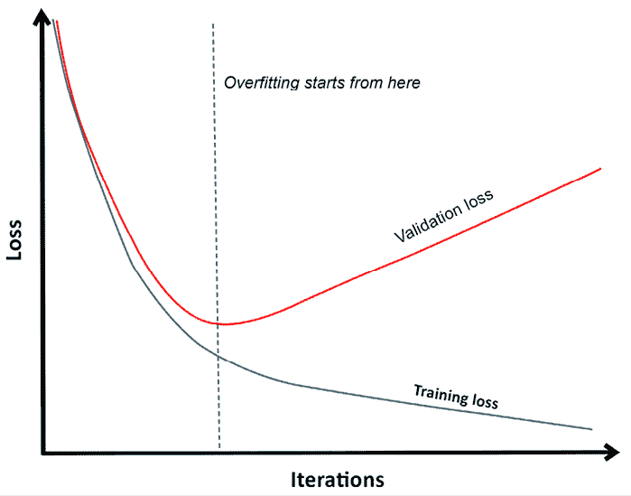
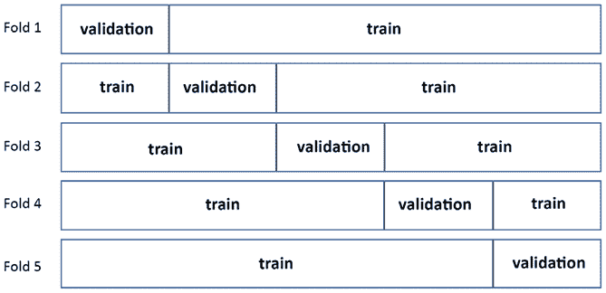
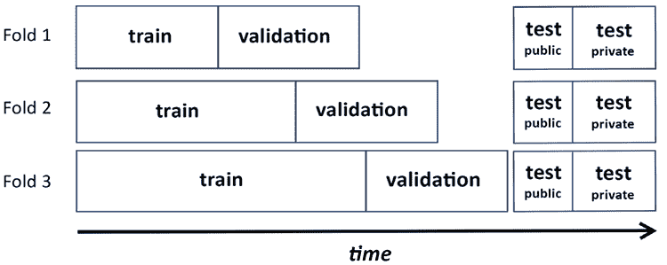
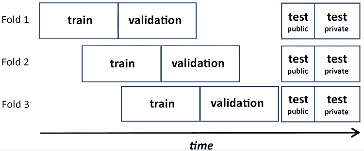
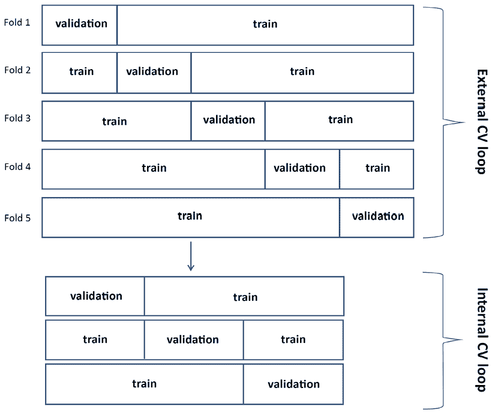

# 六、设计良好的验证

在 Kaggle 比赛中，在建模和提交结果的热潮中，从排行榜上获得的结果看起来就足够了。最后，你可能会认为在比赛中重要的是你的排名。这是一个在比赛中经常犯的错误。事实上，在比赛结束之前，你不会知道真正的排行榜(私人排行榜)是什么样子的，相信它的公共部分是不明智的，因为它经常会误导人。

在本章中，我们将向您介绍**验证**在数据竞赛中的重要性。您将了解到:

*   什么是过度拟合，公共排行榜如何误导
*   可怕的人事变动
*   不同种类的验证策略
*   对抗验证
*   如何发现和利用漏洞
*   当选择你的最终提交时，你的策略应该是什么

不仅在数据科学竞赛中，而且在所有数据科学项目中，在建模时监控您的表现并区分过度拟合是一项关键能力。正确地验证你的模型是你可以从 Kaggle 竞赛中学到的最重要的技能之一，并且你可以在专业世界中转售。

# 窥探排行榜

正如我们之前所描述的，在每场比赛中，Kaggle 将测试集分为一个**公共部分**，它在正在进行的排行榜上可视化，以及一个**私有部分**，它将用于计算最终分数。这些测试部分通常是随机确定的(尽管在时间序列比赛中，它们是基于时间确定的)，并且整个测试集是在不区分公共和私有的情况下发布的。

最近，为了避免在某些比赛中审查测试数据，Kaggle 甚至隐瞒了测试数据，只提供了一些示例，并在提交时用真实的测试集替换它们。这些被称为**代码**竞赛，因为你实际上不是提供预测本身，而是一个包含生成它们的代码的笔记本。

因此，从模型导出的提交将覆盖整个测试集，但是只有公共部分将被立即评分，而私有部分的评分将留到竞赛结束之后。

有鉴于此，有三点需要考虑:

*   为了让比赛正常进行，训练数据和测试数据应该来自**同一个分布**。此外，测试数据的私有部分和公共部分在分布上应该彼此相似。
*   即使训练和测试数据显然来自相同的分布，在任一集合中缺乏足够的示例**会使训练数据与公共和私有测试数据之间难以获得一致的结果。**
*   公共测试数据应被视为数据科学项目中的维持测试:仅用于最终验证。因此，为了避免所谓的**自适应过拟合**，不应该对它进行太多的查询，这意味着一个模型在特定的测试集上运行良好，但在其他测试集上表现不佳。

记住这三点对于理解竞赛的动态是至关重要的。在大多数比赛中，讨论论坛中总是有相当多的关于训练、公共和私有测试数据如何相互关联的问题，并且在公共排行榜上看到数百个仅基于其功效进行评估的解决方案的提交是相当常见的。

也经常听到关于排名变革的讨论。事实上，它们是最终排名的重新排列，这可能会让许多之前在公共排行榜上占据更好位置的人失望。有趣的是，大变动通常归因于训练集和测试集之间的差异，或者测试数据的私有部分和公共部分之间的差异。根据竞赛对手如何看待他们的预期本地分数与排行榜反馈的相关性，对他们进行事前*评估*，以及事后*评估*，根据两个数字进行一系列分析:

*   基于`mean(abs(private_rank-public_rank)/number_of_teams)`的总体变动图
*   排行榜变动数据，仅考虑排名前 10%的公众

这些事后数据是由史蒂夫·多诺霍([https://www.kaggle.com/breakfastpirate](https://www.kaggle.com/breakfastpirate))最先提出的，他编制了一份最糟糕的 Kaggle 人事变动排名(见[https://www . ka ggle . com/c/recruit-restaurant-visitor-forecasting/discussion/49106 # 278831](https://www.kaggle.com/c/recruit-restaurant-visitor-forecasting/discussion/49106#278831))。它们现在很容易获得，由许多笔记本基于我们在*第 5 章*、*竞赛任务和指标*中讨论的 Meta Kaggle 数据集重新创建(参见[https://www . ka ggle . com/jtrotman/Meta-ka ggle-Competition-shake-up](https://www.kaggle.com/jtrotman/meta-kaggle-competition-shake-up))。例如，通过查阅这些数字，你可能会发现 RSNA 颅内出血检测竞赛对许多人来说是多么可怕，因为它的人事变动，尤其是在高层职位上。

然而，除了事后评估之外，我们还可以从以往的人事变动中吸取一些教训，这对你的竞赛有所帮助。加州大学伯克利分校的一些研究人员也这么认为。在 NIPS 2019 上发表的论文中，Roelofs，Fridovich-Keil 等人详细研究了几千场 Kaggle 比赛，以深入了解 Kaggle 比赛中的公私排行榜动态。尽管他们专注于有限的竞赛子集(120，超过一定数量的参与者，专注于二元分类)，他们还是获得了一些有趣的发现:

*   几乎没有适应性过拟合；换句话说，公开排名通常在公开的私人排行榜上有效。
*   大多数变动是由于随机波动和过度拥挤的排名，其中竞赛对手彼此过于接近，私人测试集中表现的任何轻微变化都会导致排名的重大变化。
*   当训练集非常小或者训练数据不是独立且同分布的 ( **i.i.d.** )时会发生抖动。

全文，Roelofs，r .，Fridovich-Keil，s .等人*对机器学习中过度拟合的元分析*。第 33 届国际神经信息处理系统会议录。2019，可在此链接找到:[https://papers . nips . cc/paper/2019/file/ee 39 e 503 b 6 bedf 0 c 98 c 388 b 7 e 8589 ACA-paper . pdf](https://papers.nips.cc/paper/2019/file/ee39e503b6bedf0c98c388b7e8589aca-Paper.pdf)。

然而，在我们长期的 Kaggle 竞赛经验中，我们从一开始就已经看到了许多适应性过拟合的问题。例如，你可以阅读格雷格·帕克对我们参加的第一批比赛之一的分析:[http://gregpark.io/blog/Kaggle-Psychopathy-Postmortem/](http://gregpark.io/blog/Kaggle-Psychopathy-Postmortem/)。由于这是许多 Kagglers 的一个普遍而持久的问题，我们建议一个比简单地跟随公共排行榜上发生的事情更复杂的策略:

*   始终为本地评分建立可靠的交叉验证系统。
*   总是根据情况使用最佳验证方案来控制非 i.i.d .发行。除非在竞赛描述中明确说明，否则发现非独立同分布并不是一件容易的事情，但是您可以从讨论中或者通过使用分层验证方案进行实验来得到提示(例如，当根据某个特征进行分层时，结果会得到决定性的改善)。
*   将本地得分与公共排行榜相关联，以确定它们是否朝着同一方向发展。
*   使用对抗性验证进行测试，揭示测试分布是否与训练数据相似。
*   使用集成使您的解决方案更加可靠，尤其是在处理小型数据集时。

在接下来的章节中，我们将探讨每一个想法(除了集成，这是未来章节的主题),并为您提供获得最佳结果的所有最佳工具和策略，特别是在私有数据集上。

# 认可在竞赛中的重要性

如果你仔细想想一场比赛，你可以把它想象成一个庞大的实验系统。谁能创造出最系统有效的方法来进行这些实验，谁就赢了。

事实上，尽管您拥有丰富的理论知识，但您将与成百上千的数据专业人员展开竞赛，他们或多或少拥有与您相同的能力。

此外，他们将使用与您完全相同的数据和大致相同的工具从数据中学习(TensorFlow、PyTorch、Scikit-learn 等等)。一些人肯定会更好地获得计算资源，尽管 Kaggle 笔记本的可用性和云计算价格的普遍下降意味着差距不再那么大。因此，如果你观察知识、数据、模型和可用计算机的差异，你不会发现你和其他竞赛者之间有许多可以解释竞赛中巨大表现差异的区别因素。然而，一些参与者的表现一直优于其他人，这意味着存在一些潜在的成功因素。

在采访和会面中，一些卡格勒将这一成功因素描述为“勇气”，一些人描述为“尝试一切”，还有一些人再次描述为“愿意将你的一切投入竞赛。”这些听起来可能有点晦涩和神奇。相反，我们称之为**系统实验**。在我们看来，成功参与的关键在于你进行的实验数量以及你进行所有这些实验的方式。你进行的实验越多，你就有越多的机会比其他参与者更好地解决问题。这个数字当然取决于几个因素，比如你可用的时间、你的计算资源(越快越好，但正如我们之前提到的，这并不是一个很强的区分因素*本身*)、你的团队规模以及他们在任务中的参与程度。这与通常所说的毅力和参与是成功的关键是一致的。

然而，这些并不是影响结果的唯一因素。你必须考虑到你进行实验的方式也有影响。快速失败并从中吸取教训是竞赛中的一个重要因素。当然，你需要仔细反思你失败和成功的时候，以便从你的经历中学习一些东西，否则你的竞赛只会变成一系列随机的尝试，以期选择正确的解决方案。

因此，*在其他条件相同的情况下*，拥有适当的**验证策略**是成功的 Kaggle 竞赛者和那些刚刚超过排行榜并在比赛后以低于预期的排名结束的人之间的巨大区别。

**验证**是您用来正确评估您的模型产生的误差的方法，以及根据您的实验测量其性能如何提高或降低的方法。

一般来说，选择适当的验证的影响往往被忽视，而倾向于更多的量化因素，例如拥有最新、最强大的 GPU 或更大的团队来生成提交。

尽管如此，如果你只指望实验的火力和他们在排行榜上的结果，那就像“往墙上扔泥巴，希望有东西能粘上来”(见[http://gregpark.io/blog/Kaggle-Psychopathy-Postmortem/](http://gregpark.io/blog/Kaggle-Psychopathy-Postmortem/))。有时这样的策略会奏效，但大多数时候不会，因为你会错过在正确的方向上进行实验的重要机会，你甚至看不到你在所有这些泥泞中设法产生的闪闪发光的宝石。例如，如果你太专注于使用随机、非系统的策略在公共排行榜上碰运气，即使你产生了很好的解决方案，你也可能最终没有正确选择最终提交的内容，并错过私人排行榜上得分最高的内容。

拥有一个合适的验证策略可以帮助您决定您的哪些模型应该提交给私有测试集进行排序。尽管提交顶级公共排行榜模型的诱惑可能很大，*请始终考虑您自己的验证分数*。对于您的最终提交，根据具体情况以及您是否信任排行榜，根据排行榜选择您的最佳型号，并根据您当地的验证结果选择您的最佳型号。如果你不信任排行榜(特别是当训练样本很小或者样本是非独立身份验证时)，提交具有两个最佳验证分数的模型，挑选两个非常不同的模型或集合。这样，您将减少选择在私有测试集上无法执行的解决方案的风险。

已经指出了拥有实验方法的重要性，剩下的就是验证的实用性问题了。事实上，当您对解决方案进行建模时，您需要做出一系列相互关联的决策:

1.  如何处理您的数据
2.  应用什么模型
3.  如何改变模型的架构(尤其是深度学习模型)
4.  如何设置模型的超参数
5.  如何对预测进行后处理

即使公共排行榜与私人排行榜完全相关，每天提交的有限数量(所有比赛都存在的限制)甚至会阻止你触及你可以在上述所有领域进行的可能测试的表面。拥有一个合适的验证系统可以提前告诉你你正在做的事情是否能在排行榜上发挥作用。


德米特里·拉尔科

[https://www.kaggle.com/dmitrylarko](https://www.kaggle.com/dmitrylarko)

**Dmitry Larko** 是 Kaggle 竞赛特级大师，也是 H2O.ai 的首席数据科学家。他在 ML 和数据科学领域拥有超过十年的经验。他在 2012 年 12 月发现了 Kaggle，并在几个月后参加了他的第一场比赛。正如他在采访中告诉我们的那样，他是 Kaggle 竞赛中认可的强烈倡导者。

你最喜欢哪种比赛，为什么？从技术和解决途径来说，你在 Kaggle 上的特长是什么？

我主要参加表格数据集的比赛，但也喜欢计算机视觉的比赛。

你是如何对待一场 Kaggle 比赛的？这种方法与你在日常工作中的做法有什么不同？

*我总是尝试从简单开始，首先为更小/更简单的模型建立提交管道。这里的一个主要步骤是创建一个合适的验证方案，这样你就可以用一种健壮的方式来验证你的想法。此外，尽可能多的花时间查看和分析数据总是一个好主意。*

*在我的日常工作中，我正在构建一个 AutoML 平台，所以我在 Kaggle 上尝试的很多东西最终都作为这个平台的一部分实现了。*

告诉我们你参加的一个特别有挑战性的比赛，以及你用什么样的洞察力来完成这个任务。

我什么也想不起来，这也没关系，因为对我来说在技术上具有挑战性的事情对其他人来说可能是小菜一碟。技术挑战没那么重要；重要的是要记住，比赛有点像马拉松，而不是短跑。如果你愿意，你也可以把它看作一场短跑马拉松。所以，重要的是不要筋疲力尽，睡个好觉，锻炼身体，去公园散步，让你的大脑为新想法而再生。要赢得一场卡格尔比赛，你需要你所有的创造力和专业知识，有时甚至需要一点运气。

Kaggle 对你的职业生涯有帮助吗？如果有，如何实现？

我能得到现在的工作，多亏了我是一名卡格尔竞赛特级大师。对我现在的雇主来说，这个事实足以证明我在这个领域的专业知识。

以你的经验来看，没有经验的 Kagglers 经常会忽略什么？你现在知道了什么，你希望在你刚开始的时候就知道？

*大多数情况下，他们忽视了正确的验证方案，而是遵循公共排行榜的反馈。在大多数情况下，结局都很糟糕，导致了 Kaggle 的“大变动”。*

*此外，他们急于跳过探索性数据分析并立即建立模型，这导致了简单的解决方案和平庸的排行榜分数。*

你在过去的比赛中犯过什么错误？

我的主要错误和一个没有经验的人会犯的错误是一样的——跟随排行榜分数，而不是我的内部验证。每次我决定这么做的时候，都让我损失了好几个排行榜的位置。

对于数据分析或机器学习，你有什么特别推荐的工具或库吗？

那是常见的疑点。对于表格数据:LightGBM，XGBoost，CatBoost 用于深度学习的:PyTorch、PyTorch-Lightning、timm 和 sci kit-为每个人学习。

当一个人参加比赛时，他应该记住或做的最重要的事情是什么？

*开始简单，永远验证；相信你的验证分数，而不是排行榜分数。*

## 偏差和方差

一个好的验证系统可以帮助你得到比你从训练集中得到的错误度量更可靠的度量。事实上，在训练集上获得的度量受到每个模型的容量和复杂性的影响。你可以把一个模型的容量想象成它可以用来从数据中学习的记忆。

每个模型都有一组内部参数，帮助模型记录从数据中提取的模式。每个模型都有自己获取模式的技巧，一些模型会发现某些规则或关联，而另一些会发现其他规则或关联。当模型从数据中提取模式时，它将它们记录在其“内存”中

你也会听说模型的能力或表达能力是由**偏差和方差**决定的。在这种情况下，模型的偏差和方差指的是预测，但是基本原理与模型的表达能力严格相关。模型可以简化为将输入(观察数据)映射到结果(预测)的数学函数。一些数学函数比其他函数更复杂，因为它们有许多内部参数以及使用它们的方式:

*   如果一个模型的数学功能不够复杂或表达能力不足以捕捉你试图解决的问题的复杂性，我们就说**偏差**，因为你的预测会受到模型本身的限制(“偏差”)。
*   如果模型核心的数学函数对于手头的问题来说太复杂，我们就会有一个**方差**问题，因为模型会在训练数据中记录比所需更多的细节和噪声，并且它的预测会受到它们的深刻影响，变得不稳定。

如今，鉴于机器学习和可用计算资源的进步，问题总是源于方差，因为最常用的解决方案深度神经网络和梯度推进通常具有数学表达能力，超过了你将面临的大多数问题需要解决的程度。

当某个模型可以提取的所有有用模式都被捕获时，如果该模型还没有耗尽其容量，那么它将开始记忆与预测无关的数据特征和信号(通常称为**噪声**)。虽然最初提取的模式将有助于模型归纳到测试数据集并更正确地预测，但并不是它学习的关于训练集的所有东西都有帮助；反而可能损害其性能。学习没有泛化值的训练集元素的过程通常称为**过拟合**。

验证的核心目的是明确定义一个分数或损失值，将该值的可概括部分与因过度拟合训练集特征而产生的部分分开。

这是**验证损失**。您可以在下图的学习曲线中看到可视化的情况:



图 6.1:从训练数据中学习更多并不总是意味着学习预测

如果您在 *y* 轴上绘制损失度量，并在 *x* 轴上绘制模型学习努力的一些度量(这可能是神经网络的纪元，或梯度增强的回合),您会注意到学习似乎总是发生在训练数据集上，但在其他数据上并不总是如此。

即使您更改超参数、处理数据或决定完全不同的模型，也会发生同样的事情。曲线会改变形状，但你总是会有一个甜蜜点，在那里开始过度拟合。这一点在不同的模型和你在建模过程中所做的各种选择之间是不同的。如果由于正确的验证策略，您已经正确计算了过度拟合开始的时间点，您的模型的性能肯定会与排行榜结果(公开和私下)相关联，并且您的验证指标将为您提供一个代理来评估您的工作，而无需提交任何内容。

你可以听到不同程度的过度拟合:

*   在训练数据的级别上，当您使用对于问题来说太复杂的模型时
*   在验证集本身的层次上，当您相对于特定的验证集过多地调整您的模型时
*   在公共排行榜上，当你的成绩与你对训练的期望相差甚远时
*   在私人排行榜上，尽管在公共排行榜上取得了不错的成绩，但你的私人分数会令人失望

尽管意义略有不同，但它们都同样暗示着你的模型是不可概括的，正如我们在本节中所描述的。

# 尝试不同的拆分策略

如前所述，验证损失是基于不属于训练集的数据样本。这是一个经验测量，告诉你你的模型在预测方面有多好，并且比你从训练中得到的分数更正确，这将告诉你你的模型记住了多少训练数据模式。正确选择用于验证的数据样本构成了您的验证策略。

为了总结验证您的模型并正确测量其性能的策略，您有几个选择:

*   第一种选择是**使用维持系统**，这会带来不能正确选择数据的代表性样本或者过度适应验证维持系统的风险。
*   第二种选择是**使用一种概率方法**并依靠一系列样本在你的模型上得出你的结论。在概率方法中，有交叉验证、**留一法** ( **LOO** )和 bootstrap。在交叉验证策略中，根据您基于数据特征采取的采样策略(简单随机采样、分层采样、分组采样、时间采样)，会有不同的细微差别。

所有这些策略的共同点是它们都是**采样策略**。这意味着它们可以帮助你根据随机选取的一小部分数据推断出一个通用的度量标准(你的模型的性能)。抽样是统计学的基础，它不是一个精确的过程，因为根据你的抽样方法，你的可用数据，以及随机选取某些案例作为你的样本的一部分，你会经历一定程度的误差。

例如，如果你依赖一个有偏差的样本，你的评估指标可能被错误地估计(高估或低估)。但是，如果设计和实施得当，抽样策略通常会为您提供一个很好的总体估计。

所有这些策略的另一个共同点是它们是**分区**，以一种排他的方式划分案例，作为训练的一部分或验证的一部分。事实上，正如我们所讨论的，由于大多数模型都有一定的记忆能力，在训练和验证中使用相同的案例会导致高估的估计，因为它允许模型展示其记忆能力；相反，我们希望对它进行评估，看它是否有能力推导出在看不见的例子上起作用的模式和函数。

## 基本训练-测试分割

我们将分析的第一个策略是**训练测试拆分**。在这种策略中，您对您的训练集(也称为**保持集**)的一部分进行采样，并将其用作您使用剩余部分数据训练的所有模型的测试集。

这个策略的最大优点是非常简单:你拿起你的一部分数据，然后检查你在那部分上的工作。您通常将数据分割为 80/20，以支持训练分区。在 Scikit-learn 中，它是在`train_test_split`函数中实现的。我们将提醒您注意该方法的几个方面:

*   当您拥有大量数据时，您可以预期您提取的测试数据类似于(代表)整个数据集的原始分布。但是，由于提取过程是基于随机性的，所以您总是有机会提取非代表性的样本。特别是，如果您开始的训练样本很小，这种机会就会增加。使用**对抗验证**比较提取的维持分区(在几个小节中会有更多的介绍)可以帮助您确保以正确的方式评估您的工作。
*   此外，为了确保您的测试采样具有代表性，尤其是关于训练数据如何与目标变量相关联，您可以使用**分层**，这可以确保某些特征的比例在采样数据中得到考虑。您可以在`train_test_split`函数中使用`stratify`参数，并提供一个包含要保存的类分布的数组。

我们不得不注意到，即使你有一个有代表性的坚持者，有时一个简单的训练测试分割并不足以确保正确跟踪你在比赛中的努力。

事实上，当你不断检查这个测试集时，你可能会将你的选择推向某种适应过度(换句话说，错误地将训练集的噪声作为信号)，正如你经常在公共排行榜上评估时发生的那样。由于这个原因，概率评估，虽然在计算上更昂贵，但更适合比赛。

## 概率评估方法

机器学习模型性能的概率评估基于分布中样本的统计特性。通过采样，您可以创建一个较小的原始数据集，这些数据集应该具有相同的特征。此外，抽样中未触及的部分本身就构成了一个样本，它也应该具有与原始数据相同的特征。通过在此采样数据上训练和测试您的模型，并多次重复此过程，您基本上创建了一个统计估计器来测量您的模型的性能。每个样本都可能有一些“误差”;也就是说，它可能不能完全代表原始数据的真实分布。然而，随着你对的采样越来越多，你对这些多个样本的估计的平均值将会收敛到你正在估计的度量的真实平均值(这是一个观察到的结果，在概率上，可以用一个叫做*大数定律*的定理来解释)。

概率估计器自然比简单的训练测试分割需要更多的计算，但它们提供了更多的信心，让你正确地估计正确的度量:你的模型的一般性能。

### k 倍交叉验证

最常用的概率验证方法是**k****-折叠交叉验证**，它被认为具有在从相同分布中提取的看不见的测试数据上正确估计你的模型的性能的能力。

这在 Bates，s .，Hastie，t .，Tibshirani，r .的论文中解释得很清楚。*交叉验证:它估计什么，做得怎么样？* arXiv 预印本 arX iv:2104.00673，2021([https://arxiv.org/pdf/2104.00673.pdf](https://arxiv.org/pdf/2104.00673.pdf))。

*k*-折叠交叉验证可成功用于比较预测模型，以及为您的模型选择在测试集上表现最佳的超参数。

*k* -fold 交叉验证有很多不同的变体，但最简单的一种是在 Scikit-learn 的`KFold`函数中实现的，它基于将可用的训练数据分割成 *k* 个分区。之后，对于 *k* 次迭代，将 *k* 个分区中的一个作为测试集，而其他的用于模型的训练。

然后对第 *k* 个验证分数进行平均，该平均分数值就是第 *k* 倍验证分数，它将告诉您对任何看不见的数据的估计平均模型性能。分数的标准差会告诉你估计的不确定性。*图 6.2* 展示了五重交叉验证的结构:

Figure 6.2: How a 5-fold validation scheme is structured

你必须记住的 *k* 倍交叉验证分数的一个重要方面是，它估计的是在与 *k - 1* 倍相同数量的数据上训练的模型的平均分数。如果之后，你用你所有的数据训练你的模型，先前的验证估计不再成立。随着 *k* 接近示例的数量 *n* ，您在完整训练集上获得的模型的估计越来越正确，然而，由于您从每个折叠中获得的估计之间的相关性越来越大，您将丢失验证的所有概率估计。在这种情况下，最终会有一个数字显示模型在训练数据上的性能(出于比较的原因，这仍然是一个有用的估计，但它不会帮助您正确估计模型的泛化能力)。

当您到达 *k = n* 时，您就有了 LOO 验证方法，这在您有几个可用案例时非常有用。该方法主要是一种无偏的拟合度量，因为它使用几乎所有可用的数据进行训练，并且仅使用一个示例进行测试。然而，这并不是对看不见的数据的预期性能的良好估计。它在整个数据集上的重复测试彼此高度相关，产生的 LOO 度量更多地代表了模型在数据集本身上的性能，而不是模型在未知数据上的性能。

要选择的正确的分区数量取决于与您可用的数据相关的几个方面:

*   *k* (最小值为 2)越小，每次折叠就越小，因此，对于在 *k - 1* 折叠上训练的模型，学习中的偏差就越大:相对于在更大的 *k* 上训练的模型，在更小的 *k* 上验证的模型表现就不太好。
*   *k* 越高，数据就越多，然而你的验证估计就越相关:你将失去 *k* 的有趣特性——在估计看不见的数据的性能时进行折叠交叉验证。

一般情况下， *k* 设置为 5、7 或 10 倍，很少设置为 20 倍。我们通常认为 *k* = 5 或 *k* = 10 是比赛的好选择，后者在每次训练中使用更多的数据(90%的可用数据)，因此更适合在对完整数据集进行重新训练时计算出模型的性能。

当决定在比赛中为一个特定的数据集选择什么样的 T21 时，我们发现从两个角度思考是有益的。

首先，折叠次数的选择应该反映你的目标:

*   如果您的目的是性能估计，您需要低偏差估计的模型(这意味着没有系统的估计失真)。您可以通过使用更多的折叠次数来实现这一点，通常在 10 到 20 之间。
*   如果您的目标是参数调整，您需要偏差和方差的混合，因此建议使用中等数量的折叠，通常在 5 到 7 之间。
*   最后，如果你的目的只是应用变量选择和简化数据集，你需要低方差估计的模型(否则你会有异议)。因此，较低的折叠次数就足够了，通常在 3 到 5 次之间。

当可用数据的大小相当大时，您可以安全地停留在建议波段的下限。

第二，如果你的目标只是性能评估，考虑你使用的折叠越多，你的验证集中的案例就越少，所以每个折叠的评估就越相关。超过某个点后，增加 *k* 会使您的交叉验证估计对未知测试集的预测性降低，而更能代表您的模型在训练集上的表现。这也意味着，通过更多的折叠，您可以获得用于叠加目的的完美折叠外预测，我们将在第 9 章*使用混合和叠加解决方案进行组装*中详细解释。

在 Kaggle 竞赛中， *k* -fold 交叉验证通常不仅用于验证您的解决方案和计算您的模型的性能，还用于生成您的预测。当您进行交叉验证时，您是在进行二次抽样，对基于数据二次抽样构建的多个模型的结果进行平均是对抗方差的有效策略，通常比对所有可用数据进行训练更有效(我们将在第 9 章中对此进行更多讨论)。因此，许多 Kaggle 竞赛对手使用交叉验证期间建立的模型来提供测试集上的一系列预测，平均起来，这些预测将为他们提供解决方案。

#### k 倍变异

因为它是基于随机抽样的，所以在下列情况下， *k* -fold 可能提供不合适的分割:

*   你需要保持小班的比例，包括目标水平和特性水平。当你的目标高度不平衡时，这是典型的。典型的例子是垃圾邮件数据集(因为垃圾邮件是正常电子邮件量的一小部分)或任何信用风险数据集，其中您必须预测不太频繁的违约贷款事件。
*   您必须在目标级别和特性级别保持数值变量的分布。这是典型的回归问题，其中分布是相当偏斜的，或者你有很重的长尾。一个常见的例子是房价预测，其中你有一个持续的小部分出售的房屋，其价格将远远高于平均水平。
*   你的案例是非独立同体的，尤其是在处理时间序列预测的时候。

在前两个场景中，解决方案是**分层****k****-折叠**，其中采样是以一种受控的方式完成的，它保留了您想要保留的分布。如果您需要保留单个类的分布，您可以使用 Scikit-learn 中的`StratifiedKFold`，使用一个分层变量，通常是您的目标变量，但也可以是您需要保留其分布的任何其他特性。该函数将生成一组索引，帮助您对数据进行相应的分区。使用`pandas.cut`或 Scikit-learn 的`KBinsDiscretizer`，离散化数值变量后，您也可以获得相同的结果。

当您必须基于多个变量或重叠标签进行分层时，就有点复杂了，例如多标签分类中的。

您可以在 **Scikit-multilearn** 包([http://scikit.ml/](http://scikit.ml/))中找到解决方案，特别是帮助您控制您想要保留的顺序(多个变量的组合比例数)的`IterativeStratification`命令([http://Scikit . ml/API/skmultillearn . model _ selection . iterative _ layering . html](http://scikit.ml/api/skmultilearn.model_selection.iterative_stratification.html))。它实现了由以下论文解释的算法:

*   Sechidis、g . Tsoumakas 和 I . Vlahavas(2011 年)。*关于多标签数据的分层*。*数据库中的机器学习和知识发现，145-158* 。[http://lpis . CSD . auth . gr/publications/sechidis-ecmlpkdd-2011 . pdf](http://lpis.csd.auth.gr/publications/sechidis-ecmlpkdd-2011.pdf)
*   西曼斯基和卡伊达诺维奇；*首届非平衡域学习国际研讨会论文集* : *理论与应用*，PMLR 74:22-35，2017。[http://proceedings.mlr.press/v74/szyma%C5%84ski17a.html](http://proceedings.mlr.press/v74/szyma%C5%84ski17a.html)

即使你的问题不是一个分类，而是一个回归，你也可以很好地利用分层。在回归问题中使用分层有助于您的回归变量在交叉验证过程中符合在整个样本中发现的目标(或预测值)的相似分布。在这些情况下，为了让`StratifiedKFold`正常工作，你必须为你的目标使用一个离散的代理，而不是连续的目标。

第一个，也是最简单的方法是使用 pandas `cut`函数，将你的目标分成足够多的容器，比如 10 或 20 个:

```
import pandas as pd

y_proxy = pd.cut(y_train, bins=10, labels=False) 
```

为了确定要使用的库的数量， *Abhishek Thakur* 倾向于使用 **Sturges 法则**基于可用的示例数量，并将该数量提供给 pandas `cut`函数(参见【https://www.kaggle.com/abhishek/step-1-create-folds】的):

```
import numpy as np

bins = int(np.floor(1 + np.log2(len(X_train)))) 
```

另一种方法是关注训练集中特征的分布，并致力于再现它们。这需要对训练集的特征使用**聚类分析**(一种无监督的方法)，从而排除目标变量和任何标识符，然后使用预测的聚类作为地层。你可以在这个笔记本里看到一个例子([https://www . ka ggle . com/lucamassaron/are-you-do-cross-validation-the-best-way](https://www.kaggle.com/lucamassaron/are-you-doing-cross-validation-the-best-way))，首先执行 PCA(主成分分析)来去除相关性，然后执行 *k* -means 聚类分析。您可以通过运行经验测试来决定要使用的集群数量。

继续讨论 *k* -fold 可能提供不合适的拆分的情况，在第三种情况下，当您有非 i.i.d .数据时，事情会变得棘手，比如在示例之间发生一些分组的情况。非 i.i.d .示例的问题在于，这些示例之间的特性和目标是相关的(因此，如果您只知道其中的一个示例，则更容易预测所有示例)。事实上，如果您碰巧在训练和测试之间划分了同一个组，您的模型可能会学习区分这些组而不是目标本身，从而产生一个很好的验证分数，但在排行榜上产生非常糟糕的结果。这里的解决方案是使用`GroupKFold`:通过提供一个分组变量，您将保证每个组将被放置在训练文件夹或验证文件夹中，但不会在两者之间分开。

在数据中发现使数据非独立身份的分组实际上并不是一件容易完成的任务。除非由竞赛问题陈述，否则你将不得不依靠你调查数据(使用无监督学习技术，如聚类分析)和问题领域的能力。例如，如果您的数据是关于移动电话使用的，您可能会注意到特征中相似值的序列，从而意识到一些示例来自同一个用户。

时间序列分析存在同样的问题，由于数据是非独立同分布的，你不能通过随机抽样进行验证，因为你将混合不同的时间框架，后面的时间框架可能带有前面的的痕迹(统计学中称为**自相关**的特征)。在时间序列中最基本的验证方法中，您可以使用基于时间的训练和验证分割，如图 6.3 所示:


图 6.3:训练和验证的划分是基于时间的

但是，您的验证能力将是有限的，因为您的验证将被锚定到一个特定的时间。对于更复杂的方法，您可以使用时间分割验证，`TimeSeriesSplit`，由 Scikit-learn 包(`sklearn.model_selection.TimeSeriesSplit`)提供。`TimeSeriesSplit`可以帮助您设置时间序列中训练和测试部分的时间框架。

在训练时间范围的情况下，`TimeSeriesSplit`功能可以帮助您设置您的训练数据，使其包括测试时间范围之前的所有过去的数据，或将其限制在固定的时间段回顾(例如，总是使用测试时间范围之前三个月的数据进行训练)。

在*图 6.4* 中，您可以看到一个基于时间的验证策略的结构，包括一个增长的训练集和一个移动的验证集:



图 6.4:随着时间的推移，训练集在增长

在*图 6.5* 中，如果您规定训练集具有固定回看，您可以看到策略是如何变化的:



图 6.5:随着时间的推移，训练和验证的分离在移动

根据我们的经验，采用固定的回顾有助于提供更公平的时间序列模型评估，因为你总是指望相同的训练集规模。

相反，随着时间的推移，使用一个不断增长的训练集大小，您会将跨时间片的模型性能效果与模型中不断减少的偏差混淆起来(因为更多的示例意味着更少的偏差)。

最后，请记住`TimeSeriesSplit`可以设置为在您的训练和测试时间之间保持一个预定义的间隔。当您被告知测试集是未来某个时间量的(例如，训练数据之后的一个月)并且您想要测试您的模型是否足够健壮以预测那么远的未来时，这是非常有用的。

#### 嵌套交叉验证

此时，引入**嵌套交叉验证**很重要。到目前为止，我们只讨论了测试模型的最终性能，但是在调优它们的超参数时，通常还需要测试它们的中间性能。事实上，您不能在测试集上测试某些模型参数如何工作，然后使用相同的数据来评估最终的性能。由于您已经明确地找到了对测试集起作用的最佳参数，所以您对同一测试集的评估度量将会过于乐观；在不同的测试集上，您可能不会获得完全相同的结果。在这种情况下，你必须区分一个**验证集**，用于评估各种模型和超参数的性能，和一个**测试集**，它将帮助你估计模型的最终性能。

如果您使用测试序列分割，这可以通过将测试部分分割成两个新部分来实现。通常，训练、验证和测试的比例分别是 70/20/10(但是您可以做出不同的决定)。如果使用的是交叉验证，就需要嵌套的交叉验证；也就是说，您根据另一个交叉验证的分割进行交叉验证。本质上，您运行通常的交叉验证，但是当您必须评估不同的模型或不同的参数时，您运行基于折叠分割的交叉验证。

*图 6.6* 中的示例演示了这种内部和外部交叉验证结构。在外部部件中，您确定用于测试评估指标的数据部分。在由外部零件的训练数据提供的内部零件中，您可以安排训练/验证分割，以便评估和优化特定的模型选择，例如决定选择哪个模型或超参数值:



图 6.6:嵌套交叉验证是如何在外部和内部循环中构建的

这种方法的优点是使您的测试和参数搜索完全可靠，但是这样做会导致一些问题:

*   缩减的训练集，因为您首先通过交叉验证进行了拆分，然后再次进行了拆分
*   更重要的是，它需要大量的模型构建:如果你运行两个嵌套的 10 重交叉验证，你将需要运行 100 个模型

尤其是最后一个原因，一些 Kagglers 倾向于忽略嵌套的交叉验证，并通过对模型/参数搜索和性能评估使用相同的交叉验证，或对最终评估使用固定的测试样本来冒险进行一些自适应拟合。根据我们的经验，这种方法也可以工作，尽管如果您正在生成用于后续建模的折叠外预测(我们将在下一节中讨论)，它可能会导致高估模型性能和过度拟合。我们总是建议您尝试最合适的方法来测试您的模型。如果您的目标是正确评估您的模型的性能，并在其他模型中重复使用其预测，请记住，只要有可能，使用嵌套交叉验证可以为您提供一个较少过度拟合的解决方案，并可能在某些竞赛中产生影响。

#### 产生非折叠预测(OOF)

交叉验证的一个有趣的应用除了评估你的评估指标性能，就是产生测试预测和折叠外预测。事实上，当您根据部分训练数据进行训练并根据剩余数据进行预测时，您可以:

*   **在测试集上预测**:所有预测的平均值通常比在所有数据上重新训练同一个模型更有效:这是一种与混合相关的集成技术，将在*第 9 章*、*使用混合和堆叠解决方案进行集成*中讨论。
*   **对验证集**进行预测:最终，您将拥有对整个训练集的预测，并且可以按照与原始训练数据相同的顺序对它们进行重新排序。这些预测通常被称为**非折叠** ( **OOF** ) **预测**，它们非常有用。

OOF 预测的第一个用途是评估您的表现，因为您可以直接根据 OOF 预测来计算评估指标。获得的绩效不同于交叉验证的估计(基于抽样)；它不具有相同的概率特性，所以它不是一种有效的方法来衡量泛化性能，但是它可以告知您的模型在您正在训练的特定集合上的性能。

第二个用途是制作一个图表，并根据地面真实值或从不同模型中获得的其他预测可视化预测。这将有助于您理解每个模型是如何工作的，以及它们的预测是否相关。

最后一个用途是创建元特征或元预测器。这也将在*第 9 章*中充分探讨，但是现在评论很重要，因为 OOF 预测是交叉验证的副产品，并且它们是有效的，因为在交叉验证期间，您的模型总是根据训练期间没有看到的例子进行预测。

由于您的 OOF 预测中的每个预测都是由基于不同数据训练的模型生成的，因此这些预测是无偏倚的，您可以使用它们而不必担心过度拟合(尽管有一些警告将在下一章中讨论)。

生成 OOF 预测可以通过两种方式完成:

*   通过对将验证预测存储到预测向量中的过程进行编码，注意将它们排列在与训练数据中的示例相同的索引位置
*   通过使用Scikit-learn 功能`cross_val_predict`，它将自动为您生成 OOF 预测

当我们在本章后面讨论对抗式验证时，我们将会看到第二种技术的应用。

### 二次抽样

除了 *k* 折叠交叉验证之外，还有其他验证策略，但是它们没有相同的泛化特性。我们已经讨论了 LOO，即 *k = n* (其中 *n* 为例数)。另一种选择是**二次采样**。二次采样与 *k* 折叠相似，但是没有固定的折叠；你想用多少就用多少(换句话说，猜一猜)。您重复地对数据进行二次采样，每次都将采样的数据用作训练数据，并将未采样的数据用于验证。通过对所有子样本的评估指标取平均值，您将获得模型性能的验证估计。

因为您正在系统地测试您的所有示例，就像在 *k* 中一样，您实际上需要大量的试验来有很好的机会测试所有的示例。出于同样的原因，如果您没有应用足够的子样本，某些情况可能会比其他情况测试得更多。您可以使用 Scikit-learn 中的`ShuffleSplit`运行这种验证。

### 引导程序

最后，另一个选择是尝试**自举**，这是统计学中用来推断估计误差分布的方法；出于同样的原因，它可以用于性能评估。引导程序要求您抽取一个与可用数据大小相同的样本*替换为*。

此时，您可以以两种不同的方式使用引导:

*   在统计学中，您可以多次引导，根据样本训练模型，并根据训练数据本身计算评估指标。靴带的平均值将提供您的最终评估。
*   否则，就像在二次采样中一样，您可以使用自举样本进行训练，剩下的不作为测试集从数据中采样。

根据我们的经验，在自举训练数据上计算评估度量的第一种方法在机器学习中用处要小得多，该方法通常用于线性模型的统计中，以便估计模型系数及其误差分布的值。这是因为许多机器学习算法倾向于对训练数据进行过度训练，因此即使你引导训练数据，你也永远不会对训练数据进行有效的度量评估。因此，Efron 和 Tibshirani(参见 *Efron* 、 *B .和 Tibshirani，R* )。*交叉验证的改进:632+ bootstrap 法。*美国统计协会杂志 92.438 (1997): 548-560。)提出将**632+估计器**作为最终验证指标。

起初，他们提出一个简单的版本，叫做 632 引导:


在这个公式中，给定你的评估度量 *err* ， *err* ， [fit] 是对训练数据计算的度量，而 *err* [bootstrap] 是对引导数据计算的度量。然而，在过度拟合训练模型的情况下， *err* [fit] 将趋向于零，使得估计器不是非常有用。因此，他们开发了 632+自举的第二个版本:


其中 *w* 为:


这里有一个新的参数，它是**无信息错误率**，通过评估预测模型对目标和预测器的所有可能组合进行估计。正如 sci kit-learn([https://github.com/scikit-learn/scikit-learn/issues/9153](https://github.com/scikit-learn/scikit-learn/issues/9153))的开发者所讨论的那样，计算确实很难。

鉴于在机器学习应用的经典统计学中使用 bootstrap 的局限性和困难性，您可以使用第二种方法，从 bootstrap 未采样的示例中获得您的评估。

在这种形式下，bootstrap 是交叉验证的替代方法，但与二次抽样一样，它需要建立比交叉验证更多的模型并进行测试。但是，如果您的交叉验证在评估指标中显示出过高的差异，并且您需要通过测试和重新测试进行更深入的检查，那么了解这些替代方案是有意义的。

之前，这个方法已经在 sci kit-learn([https://github . com/sci kit-learn/sci kit-learn/blob/0.16 . x/sk learn/cross _ validation . py # L613](https://github.com/scikit-learn/scikit-learn/blob/0.16.X/sklearn/cross_validation.py#L613))中实现过，但后来被移除了。因为你在 Scikit-learn 上再也找不到引导程序了，它甚至引导了测试数据，你可以使用我们自己的实现。下面是我们的例子:

```
import random

def Bootstrap(n, n_iter=3, random_state=None):

    """

    Random sampling with replacement cross-validation generator.

    For each iter a sample bootstrap of the indexes [0, n) is

    generated and the function returns the obtained sample

    and a list of all the excluded indexes.

    """

    if random_state:

        random.seed(random_state)

    for j in range(n_iter):

        bs = [random.randint(0, n-1) for i in range(n)]

        out_bs = list({i for i in range(n)} - set(bs))

        yield bs, out_bs 
```

总之，bootstrap 确实是交叉验证的替代方法。它当然更广泛地应用于统计和金融领域。在机器学习中，黄金法则是使用*k*-折叠交叉验证方法。然而，我们建议在所有这些情况下不要忘记 bootstrap，在这些情况下，由于异常值或一些过于异质的例子，在交叉验证中，您有一个大的评估指标的标准误差。在这些情况下，bootstrap 将证明在验证您的模型时更有用。


瑞安·切斯勒

[https://www.kaggle.com/ryches](https://www.kaggle.com/ryches)

我们第二次采访了 Ryan Chesler，他是一位讨论大师，也是笔记本和竞赛大师。他是 H2O.ai 的数据科学家，也是 Meetup([https://www.meetup.com/San-Diego-Machine-Learning/](https://www.meetup.com/San-Diego-Machine-Learning/))上圣地亚哥机器学习小组的组织者之一。在他的几个回答中出现了验证的重要性。

你最喜欢哪种比赛，为什么？从技术和解决途径来说，你在 Kaggle 上的特长是什么？

我倾向于涉猎各种比赛。对各种各样的问题进行采样比专注于特定的领域(如计算机视觉或自然语言处理)更有意思。我发现最有趣的是那些可以从数据和预测误差中获得深刻见解的。对我来说，错误分析是最具启发性的过程之一；了解模型失败的地方，并试图找到一些方法来改进模型或输入数据表示，以解决这一弱点。

你是如何对待一场 Kaggle 比赛的？这种方法与你在日常工作中的做法有什么不同？

在这两种情况下，我的方法是相似的。许多人似乎倾向于在任何建模工作之前进行探索性的数据分析，但是我发现为建模准备数据的过程通常是充分的。我的典型方法是手动查看数据，并就我认为如何最好地对数据建模以及要探索的不同选项做出一些初步决定。在此之后，我构建模型并评估性能，然后重点分析错误，并根据我看到的模型出错的地方来推断下一个建模步骤。

Kaggle 对你的职业生涯有帮助吗？如果有，如何实现？

*是的，它帮我找到了现在的工作。我在 H2O 工作，他们非常重视卡格尔的成就。我之前的工作也喜欢我在比赛中表现出色。*

你也是圣地亚哥一个有两千多人参加的会议的组织者。这和你和 Kaggle 的经历有关吗？

*是的，绝对有关系。我从很少的知识开始，尝试了一个 Kaggle 比赛，起初没有太大的成功。我去了当地的聚会，找到了可以合作和学习的人。当时，我开始与技能水平比我高得多的人一起工作，我们在一次比赛中表现非常好，第三名/4500+团队。*

*从那以后，这个小组不再像以前那样一致了，我想让这个社区继续下去，所以我组建了自己的小组，并开始组织自己的活动。我已经这样做了将近 4 年，我坐在桌子的另一边教人们，帮助他们开始。我们最初只是专注于 Kaggle 竞赛并试图组建团队，但慢慢地开始分支开展读书俱乐部和各种感兴趣主题的讲座。我把我的成功很大程度上归功于每周有专门的时间来研究和思考机器学习。*

以你的经验来看，没有经验的 Kagglers 经常会忽略什么？你现在知道了什么，你希望在你刚开始的时候就知道？

根据我的经验，很多人夸大了偏差-方差权衡和过度拟合的重要性。这是我见过的人们一直过于担心的事情。重点不应该是使训练和验证性能接近，而是使验证性能尽可能好。

你在过去的比赛中犯过什么错误？

*我一贯的错误就是探索不够。有时候，我有一些想法，我过早地忽略了，但结果证明这些想法对提高绩效很重要。很多时候，我第一次尝试就能接近有竞赛力的表现，但是当我尝试新事物时，迭代和继续改进需要一个稍微不同的技能，我仍在努力掌握。*

对于数据分析或机器学习，你有什么特别推荐的工具或库吗？

*我使用了很多标准工具:XGBoost、LightGBM、Pytorch、TensorFlow、Scikit-learn。我对特定的工具或库没有任何强烈的兴趣，只要是与问题相关的就行。*

当一个人参加比赛时，他应该记住或做的最重要的事情是什么？

我认为人们必须牢记的最重要的事情是良好的验证。我经常看到人们自欺欺人地认为他们的表现正在提高，但随后提交给排行榜，并意识到实际上并没有达到他们的预期。了解如何将假设与新的未知数据相匹配，并建立一个对新条件稳健的模型，这是一项重要的技能。

# 调整您的模型验证系统

至此，您应该对所有可能的验证策略有了一个完整的概述。当你接近一场比赛时，你设计你的验证策略，并实施它。然后，你测试你选择的策略是否正确。

作为一条黄金法则，在设计您的验证策略时要遵循这样一个理念，即您必须复制竞赛组织者使用的相同方法，将数据分成训练集、私有集和公共集。问问你自己，组织者是如何安排这些分裂的。他们随机抽取样本了吗？他们是否试图保留数据中的某些特定分布？测试集实际上是从与训练数据相同的分布中抽取的吗？

在现实世界的项目中，你不会问自己这些问题。与您必须不惜一切代价进行归纳的真实世界项目相反，竞赛的焦点更集中在拥有在给定测试集(尤其是私有测试集)上执行的模型上。如果你从一开始就关注这个想法，你将有更多的机会找到最佳的验证策略，这将有助于你在竞赛中排名更高。

由于这是一个反复试验的过程，当您试图找到竞赛对手的最佳验证策略时，您可以系统地应用以下两个一致性检查，以确定您是否走在正确的道路上:

1.  首先，您必须检查您的本地测试是否一致，也就是说，单个交叉验证折叠错误彼此之间没有太大差异，或者当您选择简单的序列测试分割时，使用不同的序列测试分割可以再现相同的结果。
2.  然后，您必须检查您的本地验证错误是否与公共排行榜上的结果一致。

如果第一次检查失败，根据以下可能的问题根源，您有几个方案:

*   您没有多少训练数据
*   数据太多种多样，每个训练分区都非常不同(例如，如果您有太多的**高基数**特征，即具有太多级别的特征——如邮政编码——或者如果您有多变量异常值)

在这两种情况下，关键是缺少与要实现的模型相关的数据。即使问题只是看起来数据太多样，绘制学习曲线也会让你明白你的模型需要更多的数据。

在这种情况下，除非您发现采用更简单的算法对评估指标有效(在这种情况下，用方差换取偏差可能会恶化模型的性能，但并不总是如此)，否则您的最佳选择是使用广泛的验证方法。这可以通过以下方式实现:

*   使用较大的 *k* 值(从而接近 LOO，其中 *k = n* )。您的验证结果将较少涉及您的模型对未知数据执行的能力，但是通过使用更大的训练部分，您将具有更稳定的评估的优势。
*   对多个 *k* 折叠验证的结果求平均(基于由不同随机种子初始化挑选的不同数据分区)。
*   使用重复引导。

请记住，当您发现不稳定的本地验证结果时，您不会是唯一一个遇到问题的人。通常，由于数据的来源和特征，这是一个常见的问题。通过关注论坛，你可能会得到可能解决方案的提示。例如，高基数特性的一个好的解决方案是目标编码；分层有助于离群值；等等。

当你通过了第一次检查但没有通过第二次检查时，情况就不同了；您的本地交叉验证是一致的，但您发现它并不在排行榜上。为了意识到这个问题的存在，如果你提交了结果预测，你必须对你所有的实验，验证测试类型，使用的随机种子和排行榜结果保持勤记。这样，您可以绘制一个简单的散点图，并尝试拟合线性回归，或者更简单地计算您的本地结果与相关公共排行榜分数之间的相关性。注释和分析所有这些需要花费一些时间和耐心，但它是您可以跟踪的竞赛绩效的最重要的元分析。

当不匹配是因为您的验证分数系统地低于或高于排行榜分数时，您实际上有一个强有力的信号，表明您的验证策略有所缺失，但这个问题并不妨碍您改进您的模型。事实上，您可以继续开发您的模型，并期望改进能反映在排行榜上，尽管不是以比例的方式。然而，系统性的差异总是一个危险信号，意味着你正在做的和组织者安排的测试模型之间有所不同。

更糟糕的情况是，您当地的交叉验证分数与排行榜反馈完全不相关。这真是一面红旗。当您意识到是这种情况时，您应该立即进行一系列测试和调查，以找出原因，因为无论这是否是一个常见问题，这种情况都会对您的最终排名构成严重威胁。这种情况下有几种可能性:

*   您会发现测试集是从与训练集不同的分布中抽取出来的。对抗式验证测试(我们将在下一节中讨论)是在这种情况下可以启发您的方法。
*   数据是非独立的，但这并不明确。例如，在*自然保护渔业监测*比赛中([https://www . ka ggle . com/c/The-Nature-conservation-Fisheries-Monitoring](https://www.kaggle.com/c/the-nature-conservancy-fisheries-monitoring))，训练集中的图像是从类似情况(渔船)中拍摄的。你必须自己找出如何排列它们，以避免模型学习识别目标，而不是图像的背景(例如，参见 https://www.kaggle.com/anokas/finding-boatids:[阿诺卡斯*的这项工作)。*](https://www.kaggle.com/anokas/finding-boatids)
*   特征的多元分布是相同的，但是一些组在测试集中的分布是不同的。如果你能找出差异，你就能相应地设置你的训练集和验证，并获得优势。你需要探索公共排行榜来解决这个问题。
*   测试数据是漂移或趋势，这通常是时间序列预测的情况。同样，您需要探索公共排行榜，以了解一些可能有助于您得分的后处理，例如，将乘数应用于您的预测，从而模仿测试数据中的减少或增加趋势。

正如我们之前所讨论的，探索排行榜是为了深入了解公共测试集的组成而进行特别设计的提交的行为。如果私有测试集与公共测试集相似，它会工作得特别好。没有通用的探测方法，所以你必须根据竞赛和问题的类型来设计探测方法。

例如，在论文*中，雅各布解释了如何在没有下载训练数据的情况下，在比赛中获得第四名。*

关于回归问题，在最近由 Kaggle 组织的 *30 天 ML* 中， *Hung Khoi* 解释了探查排行榜如何帮助他了解训练数据集和公开测试数据之间目标列的均值和标准差的差异(参见:[https://www.kaggle.com/c/30-days-of-ml/discussion/269541](https://www.kaggle.com/c/30-days-of-ml/discussion/269541))。

他使用了下面的等式:


本质上，您只需要两个提交来求解测试目标的均值和方差，因为有两个未知的术语——方差和均值。

你还可以从这篇文章[https://www . ka ggle . com/cdeotte/lb-probing-strategies-0-890-第二名](https://www.kaggle.com/cdeotte/lb-probing-strategies-0-890-2nd-place)、与 *Don't Overfit II 竞赛*([https://www.kaggle.com/c/dont-overfit-ii](https://www.kaggle.com/c/dont-overfit-ii))中得到一些关于排行榜探测的其他想法。

如果你想感受一下从排行榜中探查信息是一把双刃剑，你可以阅读一下*扎哈尔·奇基舍夫*如何设法从 *LANL 地震预测*比赛中探查信息，在公共排行榜中领先后，最终在私人排行榜中排名第 87 ^第位:[https://towards data science . com/how-to-l b-probe-on-ka ggle-c0aa 21458 BF](https://towardsdatascience.com/how-to-lb-probe-on-kaggle-c0aa21458bfe)

# 使用对抗验证

正如我们所讨论的，交叉验证允许您测试您的模型对来自与您的训练数据相同分布的看不见的数据集进行归纳的能力。希望如此，因为在 Kaggle 比赛中，你被要求创建一个可以在公共和私有数据集上进行预测的模型，你应该期望这样的测试数据与训练数据来自相同的分布。事实上，情况并非总是如此。

即使你没有过度适应测试数据，因为你的决定不仅基于排行榜结果，还考虑了交叉验证，你仍然可能会对结果感到惊讶。如果测试集与模型所基于的训练集稍有不同，就会发生这种情况。事实上，目标概率及其分布，以及预测变量如何与它相关，在训练期间通知您的模型关于某些期望，如果测试数据与训练数据不同，则这些期望不能被满足。

因此，正如我们到目前为止所讨论的那样，仅仅避免过度适应排行榜是不够的，但是，首先，找出你的测试数据是否与训练数据相当也是明智的。然后，如果它们不同，您必须找出是否有任何机会可以减轻训练和测试数据之间的不同分布，并建立一个在该测试集上执行的模型。

**对抗验证**正是为此而开发的。这是一种技术，允许您轻松地估计您的训练和测试数据之间的差异程度。这种技术在 Kaggle 参与者中流传已久，并在团队之间传播，直到由于 https://www.kaggle.com/zygmunt 在他的 FastML 博客上发表的一篇文章而公开出现。

这个想法很简单:获取您的训练数据，删除目标，将您的训练数据与您的测试数据组合在一起，并创建一个新的二进制分类目标，其中将阳性标签分配给测试数据。在这一点上，运行机器学习分类器并评估 ROC-AUC 评估指标(我们在前一章详述竞赛任务和指标的*中讨论了该指标*)。

如果您的 ROC-AUC 在 0.5 左右，这意味着训练和测试数据不容易区分，显然来自同一分布。ROC-AUC 值高于 0.5 并接近 1.0 表明算法很容易找出哪些来自训练集，哪些来自测试集:在这种情况下，不要指望能够容易地推广到测试集，因为它显然来自不同的分布。

你可以在这里找到为*俄罗斯储蓄银行俄罗斯住房市场*竞赛([https://www.kaggle.com/c/sberbank-russian-housing-market](https://www.kaggle.com/c/sberbank-russian-housing-market))编写的笔记本示例，它展示了对抗性验证的实际例子及其在竞赛中的用法:[https://www . ka ggle . com/konradb/adversarial-validation-and-other-terrible-terms](https://www.kaggle.com/konradb/adversarial-validation-and-other-scary-terms)。

由于您的数据可能属于不同的类型(数字或字符串标签),并且您可能会丢失案例，因此在能够成功运行分类器之前，您需要进行一些数据处理。我们建议使用随机森林分类器，因为:

*   它不输出真实的概率，但其结果只是简单的序数，非常适合 ROC-AUC 分数。
*   随机森林是一种基于决策树的灵活算法，它可以自己进行要素选择，并对不同类型的要素进行操作，而无需任何预处理，同时将所有数据渲染为数字。它对过度拟合也很健壮，你不必过多考虑修正它的超参数。
*   由于其基于树的特性，您不需要太多的数据处理。对于缺失的数据，您可以简单地用不太可能的负值(比如-999)替换这些值，并且可以通过将字符串转换成数字来处理字符串变量(例如，使用 Scikit-learn 标签编码器，`sklearn.preprocessing.LabelEncoder`)。作为一个解决方案，它的性能不如一键编码，但它非常快，并且可以很好地解决这个问题。

虽然构建分类模型是对抗验证测试集的最直接的方法，但是您也可以使用其他方法。一种方法是将训练和测试数据都映射到一个更低维的空间，如*nano Mathias*(【https://www.kaggle.com/nanomathias】)的这篇文章([https://www . ka ggle . com/nano Mathias/distribution-of-test-vs-training-data](https://www.kaggle.com/nanomathias/distribution-of-test-vs-training-data))。虽然需要更多的调整工作，但这种基于 t-SNE 和 PCA 的方法具有很大的优势，可以用一种吸引人和可理解的方式用图形表示。

不要忘记，我们的大脑更善于识别视觉表征中的模式，而不是数字表征(关于我们视觉能力的清晰讨论，见[https://onlinelibrary.wiley.com/doi/full/10.1002/qua.24480](https://onlinelibrary.wiley.com/doi/full/10.1002/qua.24480))。

主成分分析和 t-SNE 并不是唯一可以帮助你降低数据维数并使其可视化的工具。https://github.com/lmcinnes/umap UMAP 经常可以提供一个更快的低维解决方案，数据聚类清晰明了。变型自编码器(在*第 7 章*、*表格竞赛建模*中讨论)可以替代处理非线性维度缩减，并提供比 PCA 更有用的表示；然而，它们的设置和调音更加复杂。

## 示例实现

虽然你可以在 Zygmunt 的原始文章和我们链接的笔记本中找到对抗性验证的例子，但我们为你创建了一个新的例子，基于操场竞赛*表格操场系列-2021 年 1 月*([https://www.kaggle.com/c/tabular-playground-series-jan-2021](https://www.kaggle.com/c/tabular-playground-series-jan-2021))。

您首先导入一些 Python 包，并从竞赛中获取训练和测试数据:

```
import numpy as np

import pandas as pd

from sklearn.ensemble import RandomForestClassifier

from sklearn.model_selection import cross_val_predict

from sklearn.metrics import roc_auc_score

train = pd.read_csv("../input/tabular-playground-series-jan-2021/train.csv")

test = pd.read_csv("../input/tabular-playground-series-jan-2021/test.csv") 
```

资料准备简短扼要。因为所有的特性都是数字，所以不需要任何标签编码，但是必须用负数填充任何缺少的值(-1 通常可以)，并删除目标和任何标识符；当标识符是渐进的时，对抗性验证可能返回高 ROC-AUC 分数:

```
train = train.fillna(-1).drop(["id", "target"], axis=1)

test = test.fillna(-1).drop(["id", axis=1])

X = train.append(test)

y = [0] * len(train) + [1] * len(test) 
```

此时，您只需要使用`cross_val_predict`函数为您的数据生成`RandomForestClassifier`预测，它会自动创建一个交叉验证方案并将预测存储在验证文件夹中:

```
model = RandomForestClassifier()

cv_preds = cross_val_predict(model, X, y, cv=5, n_jobs=-1, method='predict_proba') 
```

因此，您获得了无偏的预测(它们不会过拟合，因为您没有根据您训练的内容进行预测)，并且可以用于误差估计。请注意，`cross_val_predict`不会适合你的实例化模型，所以你不会从中获得任何信息，比如模型使用的重要特性是什么。如果需要这样的信息，只需要通过调用`model.fit(X, y)`先进行拟合即可。

最后，您可以查询预测的 ROC-AUC 分数:

```
print(roc_auc_score(y_true=y, y_score=cv_preds[:,1])) 
```

您应该获得一个大约 0.49-0.50 的值(`cross_val_predict`不会是确定性的，除非您使用固定`random_seed`的交叉验证)。这意味着你不能轻易地区分训练和测试数据。因此，它们来自相同的分布。

## 处理训练和测试数据的不同分布

ROC-AUC 分数为 0.8 或更高将提醒您测试集是特殊的，并且与训练数据完全不同。在这些情况下，你能做什么？实际上，你手头有一些策略:

*   抑制
*   对与测试集最相似的案例进行训练
*   通过模拟测试集进行验证

使用**抑制**，您可以删除对抗性测试集中最影响结果的变量，直到分布再次相同。为此，您需要一种迭代方法。这一次，您将模型拟合到所有数据，然后检查重要性度量(例如，由 Scikit-learn `RandomForest`分类器中的`feature_importances_`方法提供)和 ROC-AUC 拟合分数。此时，您从数据中删除了模型最重要的变量，并再次运行所有操作。你重复这个循环，训练，测量 ROC-AUC 拟合，并从数据中删除最重要的变量，直到拟合的 ROC-AUC 分数下降到 0.5 左右。

这种方法的唯一问题是，您实际上可能被迫从数据中删除大多数重要变量，并且由于缺乏信息特征，您随后基于此类变量截尾数据构建的任何模型都无法充分正确地预测。

当你**在与测试集**最相似的例子上训练时，你取而代之的是采取不同的方法，不关注*变量*，而是关注你用于训练的*样本*。在这种情况下，您只从训练集中挑选符合测试分布的样本。任何经过训练的模型都适合测试分布(但它不能推广到任何其他情况)，这应该允许您测试竞赛问题的最佳结果。这种方法的限制是您正在减少数据集的大小，并且根据符合测试分布的样本数量，您可能会由于缺乏训练样本而遭受非常有偏差的结果模型。在我们之前的示例中，只选取训练数据中概率超过 0.5 的对抗性预测，然后对它们求和，结果只选取了 1，495 个案例(这个数字很小，因为测试集与训练集没有太大的不同):

```
print(np.sum(cv_preds[:len(X), 1] > 0.5)) 
```

最后，使用**通过模仿测试集**进行验证的策略，您可以继续对所有数据进行训练，但是出于验证的目的，您只能从训练集上超过 0.5 概率(或者更高的阈值，如 0.9)的对抗性预测中选择您的示例。

将验证集调整到测试集将允许您挑选所有可能的超参数和模型选择，这将有利于在排行榜上获得更好的结果。

在我们的示例中，我们可以从以下代码的输出中看出,`feature_19`和`feature_54`在训练/测试分割之间出现的差异最大:

```
model.fit(X, y)

ranks = sorted(list(zip(X.columns, model.feature_importances_)), 

               key=lambda x: x[1], reverse=True)

for feature, score in ranks:

    print(f"{feature:10} : {score:0.4f}") 
```

最后，我们对对抗式验证还有一些评论。首先，使用它通常会帮助你在比赛中表现得更好，但并不总是如此。Kaggle 的代码竞赛，以及其他不能完全访问测试集的竞赛，不能通过对抗性验证来检查。此外，对抗性验证可以告知您测试数据的整体情况，但它无法告知您私有和公共测试数据之间的差异，这是最常见的公共排行榜过度拟合和随之而来的变动的原因。

最后，对抗性验证，虽然是为竞赛设计的一种非常具体的方法，但在现实世界中有相当多的实际用例:你有多经常选择错误的测试集来验证你的模型？我们在这里介绍的方法可以启发你是否在你的项目中正确地使用了测试数据和任何验证数据。此外，生产中的数据变更和模型可能会受到此类变更的影响，如果您不对其进行重新训练，可能会产生糟糕的预测。这被称为**概念漂移**，通过使用对抗性验证，您可以立即了解您是否必须重新训练新车型以投入生产，或者您是否可以让以前的车型继续运行。


朱利亚诺·詹森

[https://www.kaggle.com/adjgiulio](https://www.kaggle.com/adjgiulio)

朱利亚诺·詹森是竞赛大师，也是 Zillow 集团 ML 和 NLP 的高级应用科学家。他向我们讲述了他的竞赛胜利，交叉验证的重要性，以及数据泄漏，这是下一节的主题。

你最喜欢哪种比赛，为什么？从技术和解决途径来说，你在 Kaggle 上的特长是什么？

我的完美竞赛包括 a)一个需要解决的有趣问题，b)一个小到足以容纳在内存中，但又不会小到令人头疼的中等规模的数据集，以及 c)一个从特征工程的角度进行创新的机会。这三个维度的结合是我在竞赛性 ML 中处于最佳状态的地方，因为我觉得我有办法使用严谨性和创造性，而不必担心工程约束。

你是如何对待一场 Kaggle 比赛的？这种方法与你在日常工作中的做法有什么不同？

赛车比赛是一场马拉松。参加比赛的时候，我知道我可以通过几天的努力获得 90%到 95%的最高分。剩下的就是慢慢磨了。唯一的成功标准是你的分数；其他都不重要。

我的日常工作看起来更像是一连串的短跑。模型性能只是我需要考虑的一小部分。上线日期可能同样重要，或者其他方面(如可解释性、可伸缩性和可维护性)可能会使天平向完全不同的方向倾斜。在每一次冲刺之后，优先级被重新评估，最终产品可能看起来与最初的设想完全不同。另外，模型只是我一天中的一小部分。我花了更多的时间与人交谈，管理优先级，构建用例，清理数据，思考使原型模型成为成功的生产解决方案所需要的一切。

告诉我们你参加的一个特别有挑战性的比赛，以及你用什么样的洞察力来完成这个任务。

*我赢得的两个比赛之一，基因泰克癌症比赛，是一个只有大师赛。提供的数据是原始交易数据。没有好的表格数据集作为起点。这是我喜欢的工作类型，因为特征工程实际上是 ML 中我最喜欢的部分之一。由于我在比赛时已经在医疗保健行业工作了十年，我对数据有商业和临床见解，但最重要的是，我对正确处理这种类型的数据的复杂性以及当这种类型的交易原始数据处理不当时可能出现的所有问题有工程见解。这被证明是获胜的关键，因为关于泄漏可能来源的最初假设之一被证明是正确的，并提供了一个“黄金特征”，为我们的模型提供了最终的推动力。从竞赛中得到的启示是，在进行功能工程或建立验证方法时，要格外小心。泄漏可能很难检测，通常的模型验证训练/验证/测试方法在大多数情况下对识别泄漏没有帮助，从而使模型在生产中有表现不佳的风险。*

Kaggle 对你的职业生涯有帮助吗？如果有，如何实现？

*卡格尔在两个方面帮助了我。首先，它提供了一个进入现代 ML 的低门槛入口，大量接触尖端建模技术，并迫使我真正理解专业级模型验证技术的艺术和科学。其次，卡格尔提供了接触应用 ML 中一些最聪明的头脑的机会。我从一些顶级 Kaggle 参与者的团队中学到的东西是我每天都珍惜并试图与我的队友分享的经验。*

多亏了 Kaggle，你是如何建立起自己的投资组合的？

我的职业生涯并没有受到我的简历的直接影响。我的意思是，由于我的排名，我还没有得到工作机会或面试机会。我在担任高级数据科学职位时就创建了 Kaggle，尽管并不太关注 ML。感谢我在 Kaggle 上学到的东西，我能够更好地倡导我的职业生涯发生变化，进入一个专注于 ML 的工作。

迄今为止，许多和我一起工作的人喜欢谈论竞赛性的 ML，并对我在 Kaggle 的经历中获得的技巧和诀窍感到好奇，但也确实有很大一部分 ML 社区可能甚至不知道 Kaggle 是什么。

以你的经验来看，没有经验的 Kagglers 经常会忽略什么？你现在知道了什么，你希望在你刚开始的时候就知道？

*刚接触竞赛性 ML 的参与者很容易忽视适当交叉验证的重要性。一个可靠的交叉验证框架允许您可靠而客观地衡量改进。在一场可能长达六个月的比赛中，最好的模型通常不是来自那些有最佳初始想法的人，而是来自那些愿意根据数据的经验反馈进行迭代和调整的人。一个好的验证框架是这一切的基础。*

你在过去的比赛中犯过什么错误？

*我经常与刚接触 ML 的人分享的一条经验是“永远不要过分迷恋过于复杂的想法。”当面对一个新的复杂问题时，很容易被诱惑去构建复杂的解决方案。复杂的解决方案通常需要时间来开发。但主要问题是，复杂的解决方案往往价值不大，取决于稳健的基线。例如，假设您想要对选举结果进行建模，并开始考虑一系列特征来捕捉可观察到的和潜在的地理、社会经济和时间特征之间的复杂条件关系。你可以花几个星期来开发这些功能，因为它们是经过深思熟虑的，它们会产生影响。*

*错误在于，虽然这些复杂的功能本身可能非常强大，但取决于一系列简单的功能和一个已经可以构建高度优化、数据驱动的深度交互的模型，突然之间，我们花费时间和精力构建的复杂功能可能会导致很少或没有边际改进。我的建议是坚持奥卡姆剃刀，在被更复杂的方法诱惑之前尝试简单的东西。*

对于数据分析或机器学习，你有什么特别推荐的工具或库吗？

*我是一个学习熊猫和科学的人。我喜欢 pandas 如何实现简单的数据操作和探索，以及我如何使用 Scikit-learn 在几分钟内快速构建模型原型。我的大部分原型工作都是使用这两个库完成的。也就是说，我的最终模型通常基于 XGBoost。对于深度学习，我喜欢使用 Keras。*

# 处理泄漏

Kaggle 比赛中一个可能影响挑战结果的常见问题是数据泄露。**数据泄露**，通常简称为**泄露**或有其他的别称(如*黄金特征*)，涉及训练阶段的信息，这些信息在预测时不可用。这种信息的存在(泄漏)将使您的模型在训练和测试中表现过度，使您在竞赛中排名靠前，但从发起人的角度来看，将使基于它的任何解决方案不可用或充其量是次优的。

我们可以将泄漏定义为*迈克尔·金*([https://www.kaggle.com/mikeskim](https://www.kaggle.com/mikeskim))在 2019 年 *Kaggle Days San Francisco* 的演讲中所说的“当关于地面真相的信息被人为和无意地引入训练特征数据或训练元数据中时”。

尽管赞助商和 Kaggle 团队都进行了仔细的检查，但 Kaggle 比赛中仍经常发现泄漏。这种情况是由于泄漏的微妙和偷偷摸摸的性质，这可能是由于 Kagglers 进行的密集搜索而意外出现的，Kagglers 总是在寻找任何方法在比赛中取得更好的成绩。

不要将数据泄漏与泄漏的验证策略混淆。在漏验证策略中，问题是您已经以有利于更好的验证分数的方式安排了您的验证策略，因为一些信息从训练数据中漏了出来。这与比赛本身无关，但与你如何处理你的认可有关。如果在分离训练、验证或测试数据之前运行任何预处理来修改数据(归一化、降维、缺失值插补)，就会出现这种情况。

为了防止泄漏验证，如果您使用 Scikit-learn 操作和处理您的数据，您绝对必须从任何拟合操作中排除您的验证数据。如果应用于任何用于验证的数据，拟合操作往往会产生泄漏。避免这种情况的最佳方法是使用 Scikit-learn 管道([https://Scikit-learn . org/stable/modules/generated/sk learn . pipeline . pipeline . html](https://scikit-learn.org/stable/modules/generated/sklearn.pipeline.Pipeline.html))，它将数据处理和模型封装在一起，从而避免无意中对数据应用任何泄漏转换的风险。

因此，数据泄漏与验证操作没有严格的关系，尽管它对验证操作有很大的影响。尽管本章主要致力于验证策略，但在这一点上，我们认为有必要讨论数据泄漏，因为这个问题会深刻地影响您如何评估您的模型以及它们超越竞赛测试集的概括能力。

一般来说，泄漏可能起源于一个特性或实例级别。**功能泄露**是目前最常见的。它可以由目标的代理的存在引起，或者由目标本身之后的特征引起。目标代理可以是从处理标签本身或从测试分割过程中得到的任何东西；例如，在定义标识符时，特定的标识符(例如，一个数字弧)可能与某些目标响应相关联，这使得模型更容易猜测是否以正确的方式正确地输入了经过处理的信息。数据处理可能导致泄漏的一种更微妙的方式是，竞赛组织者在拆分训练集和测试集之前一起处理了它们。从历史上看，Kaggle 竞赛中的渗漏现象出现在:

1.  组织者对数据准备的处理不当，尤其是当他们对训练和测试数据的组合进行操作时(例如，在*贷款违约预测*([https://www.kaggle.com/c/loan-default-prediction](https://www.kaggle.com/c/loan-default-prediction))中，组织者最初使用了带有聚合历史数据的特征，从而泄露了未来信息)。
2.  行顺序当它连接到时间索引或特定数据组时(例如，在 *Telstra 网络中断*([https://www.kaggle.com/c/telstra-recruiting-network](https://www.kaggle.com/c/telstra-recruiting-network))中，特征中记录的顺序暗示了代理信息、位置，这在数据中不存在并且非常具有预测性)。
3.  连接到时间索引时的列顺序(通过将列用作行可以得到提示)。
4.  连续行中的特征复制，因为它可以提示具有相关响应的示例，如*博世生产线性能*(参见 *Beluga* 在[https://www . ka ggle . com/c/Bosch-Production-Line-Performance/discussion/25434](https://www.kaggle.com/c/bosch-production-line-performance/discussion/25434)中的第一名解决方案)。
5.  图像元数据(如在*两个适马连接:租赁列表查询*([https://www . ka ggle . com/c/Two-sigma-Connect-Rental-Listing-Inquiries](https://www.kaggle.com/c/two-sigma-connect-rental-listing-inquiries)))。
6.  编码和标识符的哈希或其他容易破解的匿名做法。

后验信息的问题源于我们处理信息的方式，当我们不考虑时间的影响和跨越时间的因果序列时。因为我们在回顾过去，所以我们经常忘记某些在现在有意义的变量在过去没有价值。例如，如果你必须计算一笔新公司贷款的信用评分，知道所借的钱经常逾期不还是一个很好的指标，表明债务人的可靠性较低，风险较高，但在你借出这笔钱之前，你无法知道这一点。这也是您在项目中分析公司数据库时经常会发现的问题:您的查询数据将代表当前的情况，而不是过去的情况。如果您不能指定您只希望检索在某个时间出现的信息，那么重建过去的信息也可能是一项困难的任务。由于这个原因，在建立任何模型之前，必须花费巨大的努力来发现这些泄漏的特征并排除或调整它们。

类似的问题在基于同类数据(例如，银行或保险)的 Kaggle 竞赛中也很常见，但是，由于在为竞赛准备数据时投入了大量精力，它们以更微妙的方式和形式出现。一般来说，很容易发现这些泄漏的特性，因为它们与目标密切相关，领域专家可以找出原因(例如，知道数据在哪个阶段被记录在数据库中)。因此，在比赛中，你永远不会发现如此明显的特征，但它们的衍生物，往往是从赞助商的控制中溜走的转化或加工特征。由于这些特征通常被匿名化以保护赞助商的业务，它们最终隐藏在其他特征中。这引发了对黄金/魔法特征的一系列搜索，搜索以组合数据集中的现有特征，从而出现泄漏。

你可以在这里阅读*科里·莱文森*的一篇启发性的帖子:[https://www . LinkedIn . com/pulse/winning-13-place-ka ggles-magic-competition-Corey-Levinson/](https://www.linkedin.com/pulse/winning-13th-place-kaggles-magic-competition-corey-levinson/)。它讲述了桑坦德银行的客户交易预测竞赛如何变成他的团队寻找神奇功能的故事。

另外一个很好的例子是 *dune_dweller* 这里提供的:[https://www . ka ggle . com/c/telstra-recruiting-network/discussion/19239 # 109766](https://www.kaggle.com/c/telstra-recruiting-network/discussion/19239#109766)。通过观察数据的排序方式，dune_dweller 发现数据很可能是按时间顺序排列的。将这些信息放入一个新的特征中会增加分数。

泄漏可能发生的另一种方式是通过**训练示例泄漏**。这种情况尤其发生在非身份数据上。这意味着一些病例相互关联，因为它们来自同一时期(或相邻时期)或同一群体。如果这种情况在训练或测试数据中并不都在一起，而是在它们之间分开，那么机器学习算法很有可能会学习如何发现这些情况(并得出预测)，而不是使用通用规则。这种情况的一个经常被引用的例子涉及到【https://twitter.com/nizkroberts/status/931121395748270080】的*教授*的团队。2017 年，他们利用来自 3 万名患者的 10 万张 x 光片数据集写了一篇论文。他们使用随机分裂来分离训练和测试数据，没有意识到同一患者的 x 射线可能部分出现在训练集中，部分出现在测试集中。尼克·罗伯茨(Nick Roberts)等从业者发现了这一事实，指出可能存在的漏洞可能夸大了模型的性能，并导致论文本身的重大修改。

Kaggle 比赛出现数据泄露会怎样？Kaggle 对此有明确的政策，并将:

*   让竞赛继续下去(特别是如果泄漏只有很小的影响)
*   清除布景中的渗漏物，重新开始比赛
*   生成不存在泄漏的新测试集

特别是，Kaggle 建议将发现的任何泄漏公之于众，尽管这不是强制性的，如果没有发生也不会受到制裁。然而，根据我们的经验，如果在比赛中有任何泄漏，它将很快变得非常明显，并且论坛将开始讨论魔术之类的东西。你很快就会知道，如果你注意到论坛上正在说的话，并且能够把不同 Kagglers 提供的所有提示放在一起。

然而，请注意，一些玩家甚至可能利用关于魔法特征的讨论来分散其他竞赛者对严肃建模的注意力。例如，在*桑坦德银行客户交易预测*中，有一个著名的情况，涉及一些 Kagglers，他们煽动其他参与者对实际上并不那么神奇的神奇功能的兴趣，将他们的努力引向错误的方向(参见这里的讨论:[https://www . ka ggle . com/c/Santander-Customer-Transaction-Prediction/discussion/87057 # 502362](https://www.kaggle.com/c/santander-customer-transaction-prediction/discussion/87057#502362))。

我们的建议是仔细阅读比赛论坛中出现的关于泄漏和魔法特性的讨论，并根据您自己的兴趣和参加比赛的动机来决定是否继续研究和使用任何发现的泄漏。

不利用任何泄漏可能真的会损害你的最终排名，尽管它肯定会破坏你的学习体验(因为泄漏是一种扭曲，你不能对使用它的模型提出任何要求)。如果你参加比赛不是为了获得声誉，或者是为了以后接近赞助商以获得被雇用的机会，使用你遇到的任何泄漏都是完全可以的。否则，就忽略它，继续在你的模型上努力(谁知道；也许 Kaggle 会在最后重置或修复竞赛，使泄漏无效，让许多使用它的人非常失望)。

不同的竞赛之间的泄漏是非常不同的。如果你想了解一些发生在 Kaggle 比赛中的真实漏洞，你可以看看这三个令人难忘的漏洞:

*   [https://www . ka ggle . com/c/Predicting-Red-Hat-Business-Value/discussion/22807](https://www.kaggle.com/c/predicting-red-hat-business-value/discussion/22807)from*Predicting Red Hat Business Value*([https://www.kaggle.com/c/predicting-red-hat-business-value](https://www.kaggle.com/c/predicting-red-hat-business-value))由于竞赛的训练/测试拆分方法不完善而出现问题。
*   [https://www . ka ggle . com/c/talking data-Mobile-User-Demographics/discussion/23403](https://www.kaggle.com/c/talkingdata-mobile-user-demographics/discussion/23403)from*talking data Mobile User Demographics*([https://www . ka ggle . com/c/talking data-Mobile-User-Demographics](https://www.kaggle.com/c/talkingdata-mobile-user-demographics))其中一系列问题和非 i.i.d 案例影响了比赛的正确训练/测试分割。
*   [https://www . ka ggle . com/c/Two-sigma-Connect-Rental-Listing-Inquiries/discussion/31870](https://www.kaggle.com/c/two-sigma-connect-rental-listing-inquiries/discussion/31870)发自*Two Connect:Rental Listing Inquiries*([https://www . ka ggle . com/c/Two-sigma-Connect-Rental-Listing-Inquiries](https://www.kaggle.com/c/two-sigma-connect-rental-listing-inquiries))其中元数据(每个文件夹的创建时间)起了作用。

# 摘要

本章结束后，我们将总结我们一路上讨论的建议，以便您可以组织您的验证策略，并在比赛结束时提交一些合适的模型。

在这一章中，我们首先分析了公共排行榜的动态，探讨了自适应过度调整和变动等问题。然后，我们讨论了数据科学竞赛中验证的重要性，建立一个可靠的系统，将其调整到排行榜，然后跟踪您的努力。

在讨论了各种验证策略之后，我们还看到了通过使用对抗性验证来调优超参数和检查测试数据或验证分区的最佳方式。最后，我们讨论了 Kaggle 竞赛中遇到的各种漏洞，并提供了如何处理这些漏洞的建议。

以下是我们的总结建议:

*   总是在竞赛的第一阶段建立一个可靠的验证方案，考虑到它的概率性质和归纳未知数据的能力，更倾向于一个 *k* 倍于一个训练测试分割。
*   如果您的验证方案不稳定，请使用更多的折叠或使用不同的数据分区运行多次。总是使用对抗性验证来检查你的测试集。
*   根据您的验证方案和排行榜跟踪结果。对于可能的优化和突破的探索(如神奇的功能或泄漏)，更相信你的验证分数。
*   正如我们在本章开始时所解释的，在决定最终的参赛作品时，使用你的验证分数。对于您的最终提交内容，根据具体情况以及您是否信任排行榜，在您最好的本地交叉验证模型和排行榜上得分较高的提交内容中进行选择，优先选择第一个而不是第二个。

在我们旅程的这一点上，我们准备讨论如何使用表格数据来处理竞赛，表格数据是以矩阵形式排列的数字或分类数据(行代表示例，列代表特性)。在下一章中，我们将讨论表格游乐场系列，这是 Kaggle 利用表格数据组织的月度竞赛(由*反转*:[https://www.kaggle.com/inversion](https://www.kaggle.com/inversion)组织)。

此外，我们将向您介绍一些特定的技术，以帮助您在这些竞赛中脱颖而出，如特征工程、目标编码、去噪自编码器和一些用于表格数据的神经网络，作为表格数据问题中公认的最先进的学习算法(XGBoost、LightGBM 或 CatBoost 等梯度增强算法)的替代方法。

# 加入我们书的不和谐空间

加入这本书的 Discord workspace，每月与作者进行一次*向我提问*会议:

[https://packt.link/KaggleDiscord](https://packt.link/KaggleDiscord)

