# 十、计算机视觉建模

计算机视觉任务是机器学习实际应用中最常见的问题之一；它们是许多卡格勒人进入深度学习的大门，包括你的真身(Konrad，也就是)。在过去的几年里，这个领域已经取得了巨大的进步，新的 SOTA 图书馆也在不断地出现。在本章中，我们将向您概述计算机视觉领域最流行的竞赛类型:

*   图像分类
*   目标检测
*   图象分割法

我们将从图像增强的一小段开始，这是一组与任务无关的技术，可以应用于不同的问题，以增加我们模型的泛化能力。

# 增强策略

虽然深度学习技术在图像识别、分割或对象检测等计算机视觉任务中非常成功，但底层算法通常是数据密集型的:它们需要大量数据来避免过度拟合。然而，并不是所有感兴趣的领域都满足这个要求，这就是**数据增强** 的用武之地。这是一组图像处理技术的名称，这些技术可以创建图像的修改版本，从而增强训练数据集的大小和质量，从而提高深度学习模型的性能。扩充的数据通常将代表一组更全面的可能数据点，从而最小化训练集和验证集以及任何未来测试集之间的距离。

在这一节中，我们将回顾一些更常见的增强技术，以及它们的软件实现的选择。最常用的转换包括:

*   **翻转**:翻转图像(沿水平或垂直轴)
*   **旋转**:将图像旋转给定角度(顺时针或逆时针)
*   **裁剪**:选择图像的随机分段
*   **亮度**:修改图像的亮度
*   **缩放**:图像放大或缩小到更大(向外)或更小(向内)

下面，我们用美国表演传奇和喜剧演员贝蒂·怀特的形象来展示这些转变是如何在实践中发挥作用的:

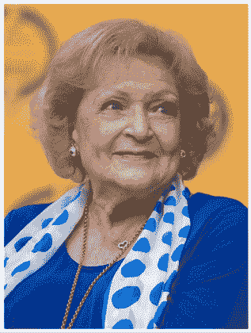

图 10.1:贝蒂·怀特图像

我们可以沿垂直或水平轴翻转图像:

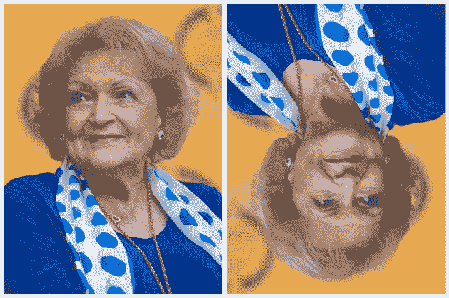

图 10.2:贝蒂·怀特图像-垂直翻转(左)和水平翻转(右)

旋转是不言自明的；请注意背景中图像的自动填充:

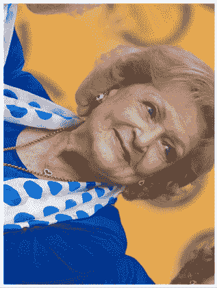

图 10.3:顺时针旋转的贝蒂·怀特图像

我们还可以将图像裁剪到感兴趣的区域:

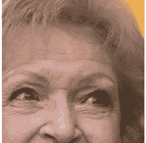

图 10.4:裁剪后的贝蒂·怀特图像

在高层次上，我们可以说增强可以以两种方式之一应用:

*   **离线**:这些通常适用于较小的数据集(更少的图像或更小的尺寸，尽管“小”的定义取决于可用的硬件)。想法是生成原始图像的修改版本，作为数据集的预处理步骤，然后与“原始”图像一起使用。
*   **在线**:这些用于更大的数据集。增强的图像不会保存在磁盘上；增量以小批量应用并输入模型。

在接下来的几节中，我们将概述两种最常用的扩充影像数据集的方法:内置的 Keras 功能和`albumentations`包。有几个其他的选项可供选择(`skimage`、OpenCV、`imgaug`、Augmentor、SOLT)，但是我们将把重点放在最流行的选项上。

本章讨论的方法侧重于由 GPU 支持的图像分析。使用**张量处理单元** ( **TPUs** )的是一种新兴的、但仍有些小众的应用。鼓励对结合 TPU 分析的图像增强感兴趣的读者查看*克里斯·德奥特* ( **@cdeotte** )的优秀作品:

[https://www . ka ggle . com/cdeotte/triple-layered-kfold-with-TF records](https://www.kaggle.com/cdeotte/triple-stratified-kfold-with-tfrecords)

通过他创作的笔记本和他参与的讨论，克里斯是一个四重 Kaggle 大师和一个了不起的教育家；总的来说，一个绝对值得任何一个 Kaggler 追随的人，不管你的经验水平如何。

我们将使用来自*木薯叶疾病分类*竞赛的数据([https://www . ka ggle . com/c/木薯叶疾病分类](https://www.kaggle.com/c/cassava-leaf-disease-classification))。像往常一样，我们从基础工作开始:首先，加载必要的包:

```py
import os

import glob

import numpy as np

import scipy as sp

import pandas as pd

import cv2

from skimage.io import imshow, imread, imsave

# imgaug

import imageio

import imgaug as ia

import imgaug.augmenters as iaa

# Albumentations

import albumentations as A

# Keras

# from keras.preprocessing.image import ImageDataGenerator, array_to_img, img_to_array, load_img

# Visualization

import matplotlib.pyplot as plt

import matplotlib.image as mpimg

%matplotlib inline

import seaborn as sns

from IPython.display import HTML, Image

# Warnings

import warnings

warnings.filterwarnings("ignore") 
```

接下来，我们定义一些辅助函数，它们将在以后简化演示。我们需要一种将图像加载到数组中的方法:

```py
def load_image(image_id):

    file_path = image_id 

    image = imread(Image_Data_Path + file_path)

    return image 
```

我们希望在 gallery 样式中显示多个图像，因此我们创建了一个函数，该函数将包含图像以及所需列数的数组作为输入，并将该数组输出到具有给定列数的网格中:

```py
def gallery(array, ncols=3):

    nindex, height, width, intensity = array.shape

    nrows = nindex//ncols

    assert nindex == nrows*ncols

    result = (array.reshape(nrows, ncols, height, width, intensity)

              .swapaxes(1,2)

              .reshape(height*nrows, width*ncols, intensity))

    return result 
```

样板文件处理好后，我们可以加载图像进行增强:

```py
data_dir = '../input/cassava-leaf-disease-classification/'

Image_Data_Path = data_dir + '/train_images/'

train_data = pd.read_csv(data_dir + '/train.csv')

# We load and store the first 10 images in memory for faster access

train_images = train_data["image_id"][:10].apply(load_image) 
```

让我们加载一个图像，这样我们就知道我们的参考是什么:

```py
curr_img = train_images[7]

plt.figure(figsize = (15,15))

plt.imshow(curr_img)

plt.axis('off') 
```

这是:

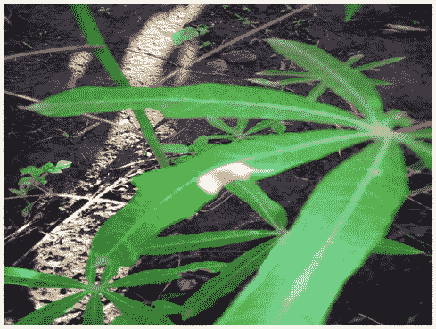

图 10.5:参考图像

在接下来的章节中，我们将演示如何使用内置的 Keras 功能和`albumentations`库从这个参考图像生成增强图像。

## Keras 内置增强功能

Keras 库有一个内置的扩充功能。虽然不像专用包那样广泛，但它具有易于与您的代码集成的优势。我们不需要一个单独的代码块来定义增强转换，但是可以将它们合并到`ImageDataGenerator`中，这是一个我们无论如何都会用到的功能。

我们研究的第一种 Keras 方法是基于`ImageDataGenerator`类的。顾名思义，它可以通过实时数据增强来生成批量图像数据。

### 图像数据生成器方法

我们以下面的方式通过实例化一个类`ImageDataGenerator`的对象来开始:

```py
import tensorflow as tf

from tensorflow.keras.preprocessing.image import ImageDataGenerator,

array_to_img, img_to_array, load_img 

datagen = ImageDataGenerator( 

        rotation_range = 40, 

        shear_range = 0.2, 

        zoom_range = 0.2, 

        horizontal_flip = True, 

        brightness_range = (0.5, 1.5)) 

curr_img_array = img_to_array(curr_img)

curr_img_array = curr_img_array.reshape((1,) + curr_img_array.shape) 
```

我们将期望的增强定义为`ImageDataGenerator`的参数。官方文档似乎没有涉及该主题，但是实际结果表明，扩充是按照它们被定义为参数的顺序来应用的。

在上面的例子中，我们只利用了可能选项的有限子集；完整的名单，鼓励读者查阅官方文件:[https://keras.io/api/preprocessing/image/](https://keras.io/api/preprocessing/image/)。

接下来，我们用`ImageDataGenerator`对象的`.flow`方法遍历图像。该类提供了三种不同的函数来将影像数据集加载到内存中并生成批量扩充数据:

*   `flow`
*   `flow_from_directory`
*   `flow_from_dataframe`

它们都实现了相同的目标，但是在指定文件位置的方式上有所不同。在我们的例子中，图像已经在内存中，所以我们可以使用最简单的方法进行迭代:

```py
i = 0

for batch in datagen.flow(

    curr_img_array,

    batch_size=1,

    save_to_dir='.',

    save_prefix='Augmented_image',

    save_format='jpeg'):

    i += 1

    # Hard-coded stop - without it, the generator enters an infinite loop

    if i > 9: 

        break 
```

我们可以使用我们之前定义的辅助函数来检查增强的图像:

```py
aug_images = []

for img_path in glob.glob("*.jpeg"):

    aug_images.append(mpimg.imread(img_path))

plt.figure(figsize=(20,20))

plt.axis('off')

plt.imshow(gallery(np.array(aug_images[0:9]), ncols = 3))

plt.title('Augmentation examples') 
```

结果如下:

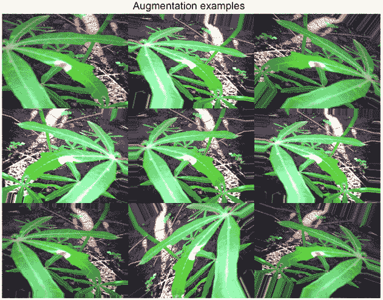

图 10.6:增强图像的集合

增强是一个非常有用的工具，但是有效地使用它们需要判断力。首先，将它们可视化以感受对数据的影响显然是一个好主意。一方面，我们希望在数据中引入一些变化，以增加模型的通用性；另一方面，如果我们过于激进地改变图像，输入数据的信息量将会减少，模型性能可能会受到影响。此外，选择使用哪种增强也可能因问题而异，这一点我们可以通过比较不同的比赛来看出。

如果你看上面的*图 10.6* (来自*木薯叶疾病分类*竞赛的参考图像)，由于植物的形状和图像拍摄方式的差异，我们应该识别疾病的叶子可能有不同的大小，指向不同的角度，等等。这意味着垂直或水平翻转、裁剪和旋转等变换在这种情况下都是有意义的。

通过对比，我们可以看一张来自*谢韦尔钢铁公司:钢铁缺陷检测*竞赛([https://www.kaggle.com/c/severstal-steel-defect-detection](https://www.kaggle.com/c/severstal-steel-defect-detection))的样本图像。在这次比赛中，参赛者必须对钢板上的缺陷进行定位和分类。所有图像都有相同的尺寸和方向，这意味着旋转或裁剪会产生不真实的图像，增加噪声，并对算法的泛化能力产生不利影响。

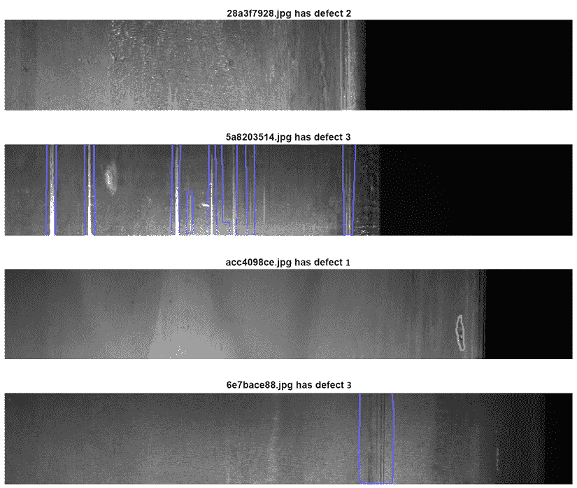

图 10.7:谢维尔斯塔尔竞赛的样本图像

### 预处理层

以本地 Keras 方式作为预处理步骤的另一种方法是使用`preprocessing`层 API。功能非常灵活:这些管道既可以与 Keras 模型结合使用，也可以以类似于`ImageDataGenerator`的方式独立使用。

下面我们将简要介绍如何建立预处理层。首先，进口:

```py
from tensorflow.keras.layers.experimental import preprocessing

from tensorflow.keras import layers 
```

我们以标准的 Keras 方式加载预训练模型:

```py
pretrained_base = tf.keras.models.load_model(

    '../input/cv-course-models/cv-course-models/vgg16-pretrained-base',

)

pretrained_base.trainable = False 
```

预处理层的使用方式与其他层在`Sequential`构造函数中的使用方式相同；唯一的要求是，在我们的模型定义开始时，它们需要在任何其他对象之前被指定:

```py
model = tf.keras.Sequential([

    # Preprocessing layers

    preprocessing.RandomFlip('horizontal'), # Flip left-to-right

    preprocessing.RandomContrast(0.5), # Contrast change by up to 50%

    # Base model

    pretrained_base,

    # model head definition 

    layers.Flatten(),

    layers.Dense(6, activation='relu'),

    layers.Dense(1, activation='sigmoid'),

]) 
```

## 白蛋白

`albumentations`包是一个快速图像增强库，它是作为其他库的包装器构建的。

该软件包是在许多 Kaggle 竞赛中密集编码的结果(见[https://medium . com/@ Iglovikov/the-birth-of-album ations-fe38c 1411 CB 3](https://medium.com/@iglovikov/the-birth-of-albumentations-fe38c1411cb3))，其核心开发者和贡献者中声称有许多著名的 Kaggle 人，包括*尤金·赫韦德琴亚*([https://www.kaggle.com/bloodaxe](https://www.kaggle.com/bloodaxe))、*弗拉迪米尔·伊格洛维科夫*([https://www.kaggle.com/iglovikov](https://www.kaggle.com/iglovikov))、

 *完整的文件可以在 https://albumentations.readthedocs.io/en/latest/[找到。](https://albumentations.readthedocs.io/en/latest/)*  *下面我们列出的重要特征:

*   不同数据类型的统一 API
*   支持所有常见的计算机视觉任务
*   与 TensorFlow 和 PyTorch 的集成

使用`albumentations`功能转换图像非常简单。我们从初始化所需的转换开始:

```py
import albumentations as A

horizontal_flip = A.HorizontalFlip(p=1)

rotate = A.ShiftScaleRotate(p=1)

gaus_noise = A.GaussNoise() 

bright_contrast = A.RandomBrightnessContrast(p=1) 

gamma = A.RandomGamma(p=1) 

blur = A.Blur() 
```

接下来，我们将变换应用于我们的参考图像:

```py
img_flip = horizontal_flip(image = curr_img)

img_gaus = gaus_noise(image = curr_img)

img_rotate = rotate(image = curr_img)

img_bc = bright_contrast(image = curr_img)

img_gamma = gamma(image = curr_img)

img_blur = blur(image = curr_img) 
```

我们可以使用`'image'`键访问增强图像并可视化结果:

```py
img_list = [img_flip['image'],img_gaus['image'], img_rotate['image'],

            img_bc['image'], img_gamma['image'], img_blur['image']]

plt.figure(figsize=(20,20))

plt.axis('off')

plt.imshow(gallery(np.array(img_list), ncols = 3))

plt.title('Augmentation examples') 
```

以下是我们的结果:

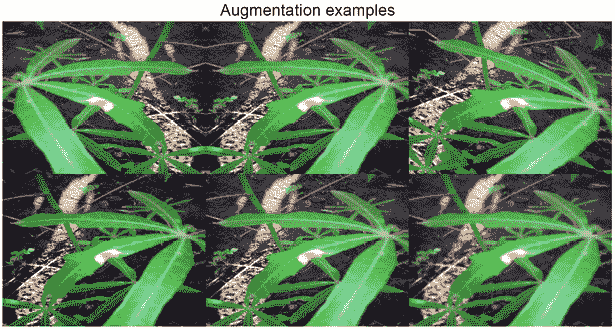

图 10.8:使用白蛋白库增强的图像

已经讨论了增强作为处理计算机视觉问题的关键预处理步骤，我们现在可以在下面的部分中应用这些知识，从一个非常普通的任务开始:图像分类。


克里斯·德奥特

[https://www.kaggle.com/cdeotte](https://www.kaggle.com/cdeotte)

在我们继续之前，让我们看一下我们与克里斯·德奥特的简短对话，我们在本书中多次提到他(包括在本章的前面)，理由很充分。他是 NVIDIA 的四重 Kaggle 大师和高级数据科学家&研究员，于 2019 年加入 Kaggle。

你最喜欢哪种比赛，为什么？从技术和解决途径来说，你在 Kaggle 上的特长是什么？

*我喜欢拥有迷人数据的竞赛，以及需要构建创造性的新颖模型的竞赛。我的专长是分析经过训练的模型，以确定它们的优缺点。之后，我喜欢改进模型和/或开发后处理来提高 CV LB。*

你是如何对待一场 Kaggle 比赛的？这种方法与你在日常工作中的做法有什么不同？

*我通过执行 EDA(探索性数据分析)，创建本地验证，构建一些简单的模型，并提交给 Kaggle 以获得排名分数，来开始每场比赛。这培养了一种直觉，即为了建立一个准确且有竞赛力的模型，需要做什么。*

告诉我们你参加的一个特别有挑战性的比赛，以及你用什么样的洞察力来完成这个任务。

Kaggle 的 Shopee 价格匹配保证*是一场挑战性的比赛，需要图像模型和自然语言模型。一个关键的见解是从两种类型的模型中提取嵌入，然后确定如何同时使用图像和语言信息来找到产品匹配。*

Kaggle 对你的职业生涯有帮助吗？如果有，如何实现？

*是的。Kaggle 通过提高我的技能和提升我简历的市场价值，帮助我成为了 NVIDIA 的一名高级数据科学家。*

许多雇主仔细阅读 Kaggle 上的工作，寻找具有特定技能的员工来帮助解决他们的特定项目。就这样，我被征求了很多工作机会。

以你的经验来看，没有经验的 Kagglers 经常会忽略什么？你现在知道了什么，你希望在你刚开始的时候就知道？

在我看来，没有经验的 Kagglers 经常忽视本地验证的重要性。看到你的名字出现在排名上令人激动。我们很容易专注于提高我们的排名分数，而不是交叉验证分数。

你在过去的比赛中犯过什么错误？

*很多次，我犯了这样的错误:相信排名分数而不是交叉验证分数，并选择了错误的最终提交。*

对于数据分析或机器学习，你有什么特别推荐的工具或库吗？

*绝对。优化表格数据模型时，特征工程和快速试验非常重要。为了加快实验和验证的周期，在 GPU 上使用 NVIDIA RAPIDS cuDF 和 cuML 是必不可少的。*

当一个人参加比赛时，他应该记住或做的最重要的事情是什么？

最重要的是开心和学习。不要担心你最终的位置。如果你专注于学习和娱乐，那么随着时间的推移，你的最终排名会越来越好。

你使用其他比赛平台吗？他们和 Kaggle 相比如何？

*是的，我参加过 Kaggle 以外的比赛。像 Booking.com 或 Twitter.com 这样的公司偶尔会举办比赛。这些比赛很有趣，涉及高质量的真实数据。*

# 分类

在本节中，我们将演示一个端到端的管道，它可以用作处理图像分类问题的模板。我们将通过必要的步骤，从数据准备，到模型设置和估计，到结果可视化。除了提供信息(并且很酷)，如果您需要深入检查代码以更好地理解性能，这最后一步也非常有用。

我们将继续使用来自*木薯叶疾病分类*竞赛的数据([https://www . ka ggle . com/c/木薯叶疾病分类](https://www.kaggle.com/c/cassava-leaf-disease-classification))。

像往常一样，我们首先加载必要的库:

```py
import numpy as np

import pandas as pd

import matplotlib.pyplot as plt

import datetime

from sklearn.model_selection import train_test_split

from sklearn.metrics import accuracy_score

import tensorflow as tf

from tensorflow.keras import models, layers

from tensorflow.keras.preprocessing import image

from tensorflow.keras.preprocessing.image import ImageDataGenerator

from tensorflow.keras.callbacks import ModelCheckpoint, EarlyStopping, ReduceLROnPlateau

from tensorflow.keras.applications import EfficientNetB0

from tensorflow.keras.optimizers import Adam

import os, cv2, json

from PIL import Image 
```

定义几个助手函数通常是个好主意；它使得代码更容易阅读和调试。如果你正在处理一个一般的图像分类问题，一个好的起点可以由来自 **EfficientNet** 家族的模型提供，该模型是在 2019 年由谷歌研究大脑团队([https://arxiv.org/abs/1905.11946](https://arxiv.org/abs/1905.11946))的一篇论文中介绍的。基本思想是平衡网络深度、宽度和分辨率，以便在所有维度上实现更高效的扩展，从而获得更好的性能。对于我们的解决方案，我们将使用该系列中最简单的成员， **EfficientNet B0** ，它是一个具有 1100 万个可训练参数的移动网络。

对于 EfficientNet 网络的适当详细的解释，鼓励您探索[https://ai . Google blog . com/2019/05/efficient net-improving-accuracy-and . html](https://ai.googleblog.com/2019/05/efficientnet-improving-accuracy-and.html)作为起点。

我们以 B0 为基础构建我们的模型，随后是用于改进的平移不变性的汇集层和具有适合于我们的多类分类问题的激活函数的密集层:

```py
class CFG:    

    # config

    WORK_DIR = '../input/cassava-leaf-disease-classification'

    BATCH_SIZE = 8

    EPOCHS = 5

    TARGET_SIZE = 512

def create_model():

    conv_base = EfficientNetB0(include_top = False, weights = None,

                               input_shape = (CFG.TARGET_SIZE,

                               CFG.TARGET_SIZE, 3))

    model = conv_base.output

    model = layers.GlobalAveragePooling2D()(model)

    model = layers.Dense(5, activation = "softmax")(model)

    model = models.Model(conv_base.input, model)

    model.compile(optimizer = Adam(lr = 0.001),

                  loss = "sparse_categorical_crossentropy",

                  metrics = ["acc"])

    return model 
```

关于我们传递给`EfficientNetB0`函数的参数的一些简短说明:

*   `include_top`参数允许您决定是否包含最终的密集层。因为我们想要使用预先训练的模型作为特征提取器，所以默认策略是跳过它们，然后自己定义头部。
*   如果我们想要从头开始训练模型，可以将`weights`设置为`None`，或者如果我们更喜欢利用在大型图像集合上预先训练的权重，可以将`weights`设置为`'imagenet'`或`'noisy-student'`。

下面的辅助函数让我们可以将激活层可视化，这样我们就可以从一个视角来考察网络性能。这通常有助于在一个以不透明而闻名的领域发展直觉:

```py
def activation_layer_vis(img, activation_layer = 0, layers = 10):

    layer_outputs = [layer.output for layer in model.layers[:layers]]

    activation_model = models.Model(inputs = model.input,

                                    outputs = layer_outputs)

    activations = activation_model.predict(img)

    rows = int(activations[activation_layer].shape[3] / 3)

    cols = int(activations[activation_layer].shape[3] / rows)

    fig, axes = plt.subplots(rows, cols, figsize = (15, 15 * cols))

    axes = axes.flatten()

    for i, ax in zip(range(activations[activation_layer].shape[3]), axes):

        ax.matshow(activations[activation_layer][0, :, :, i],

                   cmap = 'viridis')

        ax.axis('off')

    plt.tight_layout()

    plt.show() 
```

我们通过基于“受限”模型为给定模型创建预测来生成激活，换句话说，使用整个架构直到倒数第二层；这是到`activations`变量的代码。该函数的其余部分确保我们显示激活的正确布局，对应于适当卷积层中滤波器的形状。

接下来，我们处理标签并设置验证方案；数据中没有特殊的结构(例如，时间维度或跨类的重叠)，因此我们可以使用简单的随机拆分:

```py
train_labels = pd.read_csv(os.path.join(CFG.WORK_DIR, "train.csv"))

STEPS_PER_EPOCH = len(train_labels)*0.8 / CFG.BATCH_SIZE

VALIDATION_STEPS = len(train_labels)*0.2 / CFG.BATCH_SIZE 
```

有关更详细验证方案的复习，请参考*第 6 章*、*设计良好验证*。

我们现在能够设置数据生成器，这是我们基于 TF 的算法遍历图像数据所必需的。

首先，我们实例化两个`ImageDataGenerator`对象；这是我们加入图像增强的时候。出于演示的目的，我们将使用 Keras 内置的。之后，我们使用`flow_from_dataframe()`方法创建生成器，该方法用于通过实时数据扩充生成批量张量图像数据:

```py
train_labels.label = train_labels.label.astype('str')

train_datagen = ImageDataGenerator(

    validation_split = 0.2, preprocessing_function = None,

        rotation_range = 45, zoom_range = 0.2,

        horizontal_flip = True, vertical_flip = True,

        fill_mode = 'nearest', shear_range = 0.1,

        height_shift_range = 0.1, width_shift_range = 0.1)

train_generator = train_datagen.flow_from_dataframe(

    train_labels, 

    directory = os.path.join(CFG.WORK_DIR, "train_images"),

    subset = "training", 

    x_col = "image_id",y_col = "label", 

    target_size = (CFG.TARGET_SIZE, CFG.TARGET_SIZE),

    batch_size = CFG.BATCH_SIZE, 

    class_mode = "sparse")

validation_datagen = ImageDataGenerator(validation_split = 0.2)

validation_generator = validation_datagen.flow_from_dataframe(

        train_labels,

        directory = os.path.join(CFG.WORK_DIR, "train_images"),

        subset = "validation", 

        x_col = "image_id",y_col = "label", 

        target_size = (CFG.TARGET_SIZE, CFG.TARGET_SIZE),

        batch_size = CFG.BATCH_SIZE, class_mode = "sparse") 
```

指定数据结构后，我们可以创建模型:

```py
model = create_model()

model.summary() 
```

一旦我们的模型被创建，我们可以快速检查一个概要。这对于健全性检查非常有用，因为除非你有过目不忘的记忆力，否则你很可能不会记得像 EffNetB0 这样复杂模型的图层合成批次。在实践中，您可以使用摘要来检查输出过滤器的尺寸是否正确，或者参数计数(可训练和不可训练)是否符合预期。为了简洁起见，我们只演示了下面输出的前几行；检查 B0 的架构图可以让你知道完整的输出会有多长。

```py
Model: "functional_1"

__________________________________________________________________________

Layer (type)                  Output Shape         Param # Connected to

==========================================================================

input_1 (InputLayer)          [(None, 512, 512, 3) 0

__________________________________________________________________________

rescaling (Rescaling)         (None, 512, 512, 3)  0       input_1[0][0]

__________________________________________________________________________

normalization (Normalization) (None, 512, 512, 3)  7       rescaling[0][0]

___________________________________________________________________________

stem_conv_pad (ZeroPadding2D) (None, 513, 513, 3)  0       normalization[0][0]

___________________________________________________________________________

stem_conv (Conv2D)              (None, 256, 256, 32) 864    stem_conv_pad[0][0]

___________________________________________________________________________

stem_bn (BatchNormalization)    (None, 256, 256, 32) 128    stem_conv[0][0]

___________________________________________________________________________

stem_activation (Activation)    (None, 256, 256, 32) 0      stem_bn[0][0]

___________________________________________________________________________

block1a_dwconv (DepthwiseConv2D (None, 256, 256, 32) 288    stem_activation[0][0]

___________________________________________________________________________

block1a_bn (BatchNormalization) (None, 256, 256, 32) 128    block1a_dwconv[0][0]

___________________________________________________________________________ 
```

完成上述步骤后，我们可以开始拟合模型。在这一步，我们还可以非常方便地定义回调。第一个是`ModelCheckpoint`:

```py
model_save = ModelCheckpoint('./EffNetB0_512_8_best_weights.h5', 

                             save_best_only = True, 

                             save_weights_only = True,

                             monitor = 'val_loss', 

                             mode = 'min', verbose = 1) 
```

该检查点使用了几个值得详细说明的参数:

*   我们可以通过设置`save_best_only = True`来保留模型权重的最佳集合。
*   我们通过仅保留权重而不是完整的优化器状态集来减小模型的大小。
*   我们通过定位验证损失的最小值来决定哪个模型是最优的。

接下来，我们使用防止过拟合的流行方法之一，**提前停止**。我们监控模型在维持集上的性能，如果度量在给定的时期数内停止改善，则停止算法，在本例中为`5`:

```py
early_stop = EarlyStopping(monitor = 'val_loss', min_delta = 0.001,

                           patience = 5, mode = 'min',

                           verbose = 1, restore_best_weights = True) 
```

`ReduceLROnPlateau`回调监控保持集的损失，如果在`patience`个时期内没有看到改善，则学习率降低，在这种情况下降低 0.3 倍。虽然不是通用的解决方案，但它通常有助于融合:

```py
reduce_lr = ReduceLROnPlateau(monitor = 'val_loss', factor = 0.3, 

                              patience = 2, min_delta = 0.001, 

                              mode = 'min', verbose = 1) 
```

我们现在准备好拟合模型:

```py
history = model.fit(

    train_generator,

    steps_per_epoch = STEPS_PER_EPOCH,

    epochs = CFG.EPOCHS,

    validation_data = validation_generator,

    validation_steps = VALIDATION_STEPS,

    callbacks = [model_save, early_stop, reduce_lr]

) 
```

我们将简单解释一下我们以前没有遇到过的两个参数:

*   训练生成器在每个训练时期产生`steps_per_epoch`批。
*   当纪元结束时，验证发生器产生`validation_steps`批次。

调用`model.fit()`后的输出示例如下:

```py
Epoch 00001: val_loss improved from inf to 0.57514, saving model to ./EffNetB0_512_8_best_weights.h5 
```

一旦模型被拟合，我们就可以使用我们在开始时编写的助手函数来检查样本图像上的激活。虽然这不是成功执行模型所必需的，但它有助于在应用顶部的分类层之前确定我们的模型正在提取哪种类型的特征:

```py
activation_layer_vis(img_tensor, 0) 
```

下面是我们可能会看到的情况:


图 10.9:来自拟合模型的样本激活

我们可以用`model.predict()`生成预测:

```py
ss = pd.read_csv(os.path.join(CFG.WORK_DIR, "sample_submission.csv"))

preds = []

for image_id in ss.image_id:

    image = Image.open(os.path.join(CFG.WORK_DIR,  "test_images",

                                    image_id))

    image = image.resize((CFG.TARGET_SIZE, CFG.TARGET_SIZE))

    image = np.expand_dims(image, axis = 0)

    preds.append(np.argmax(model.predict(image)))

ss['label'] = preds 
```

我们通过遍历图像列表来构建预测。对于它们中的每一个，我们将图像重塑为所需的尺寸，并选择信号最强的通道(该模型预测类别概率，其中我们使用`argmax`选择最大的一个)。最终的预测是类别号，与竞赛中使用的度量一致。

我们现在已经展示了用于图像分类的最小端到端流水线。当然，许多改进是可能的——例如，更多的扩充、更大的架构、回调定制——但是基本的底层模板应该为您提供一个前进的良好起点。

我们现在继续讨论计算机视觉中的第二个热门问题:目标检测。

# 目标检测

**对象检测**是一项计算机视觉/图像处理任务，我们需要在图像或视频中识别某类语义对象的实例。在前面讨论的分类问题中，我们只需要给每张图像分配一个类别，而在对象检测任务中，我们希望在感兴趣的对象周围绘制一个**边界框**，以便在图像中定位它。

在本节中，我们将使用来自*全球小麦检测*竞赛([https://www.kaggle.com/c/global-wheat-detection](https://www.kaggle.com/c/global-wheat-detection))的数据。在这场比赛中，参与者必须检测麦穗，这是含有谷物的植物顶部的穗。在植物图像中检测这些被用于估计不同作物品种的小麦穗的大小和密度。我们将演示如何使用 **Yolov5** 训练一个模型来解决这个问题，Yolov5 是一个在对象检测方面成熟的模型，也是最先进的，直到 2021 年底(根据初步结果)被 YoloX 架构超越。Yolov5 在比赛中取得了极具竞赛力的成绩，尽管最终由于许可问题被组织者否决，但它非常适合本次演示的目的。

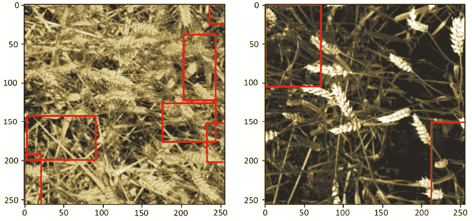

图 10.10:检测到的麦穗的样本图像可视化

在我们开始之前，值得一提的重要一点是边界框注释的不同格式；有不同的(但数学上等价的)方法来描述一个矩形的坐标。

最常见的类型是 coco、voc-pascal 和 yolo。下图清楚地显示了它们之间的差异:


图 10.11:边界框的注释格式

我们需要定义的另一个部分是网格结构:Yolo 通过在图像上放置一个网格并检查任何单元格中感兴趣的对象(在我们的例子中是小麦头)的存在来检测对象。边界框被重新整形以在图像的相关单元内偏移，并且 *(x，y，w，h)* 参数被缩放至单位间隔:

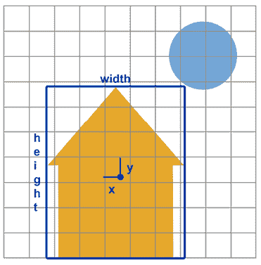

图 10.12: Yolo 注释定位

我们从加载训练数据的注释开始:

```py
df = pd.read_csv('../input/global-wheat-detection/train.csv')

df.head(3) 
```

让我们检查几个:


图 10.13:带注释的训练数据

我们从`bbox`列中提取边界框的实际坐标:

```py
bboxs = np.stack(df['bbox'].apply(lambda x: np.fromstring(x[1:-1],

                                  sep=',')))

bboxs 
```

让我们看一下阵列:

```py
array([[834., 222.,  56.,  36.],

       [226., 548., 130.,  58.],

       [377., 504.,  74., 160.],

       ...,

       [134., 228., 141.,  71.],

       [430.,  13., 184.,  79.],

       [875., 740.,  94.,  61.]]) 
```

下一步是将 Yolo 格式的坐标提取到单独的列中:

```py
for i, column in enumerate(['x', 'y', 'w', 'h']):

    df[column] = bboxs[:,i]

df.drop(columns=['bbox'], inplace=True)

df['x_center'] = df['x'] + df['w']/2

df['y_center'] = df['y'] + df['h']/2

df['classes'] = 0

df = df[['image_id','x', 'y', 'w', 'h','x_center','y_center','classes']]

df.head(3) 
```

Ultralytics 的实现对数据集的结构有一些要求，特别是存储注释的位置和用于训练/验证数据的文件夹。

在下面的代码中创建文件夹相当简单，但是鼓励更好奇的读者参考官方文档([https://github . com/ultralytics/yolov 5/wiki/Train-Custom-Data](https://github.com/ultralytics/yolov5/wiki/Train-Custom-Data)):

```py
# stratify on source

source = 'train'

# Pick a single fold for demonstration's sake

fold = 0 

val_index = set(df[df['fold'] == fold]['image_id'])

# Loop through the bounding boxes per image

for name,mini in tqdm(df.groupby('image_id')):

    # Where to save the files

    if name in val_index:

        path2save = 'valid/'

    else:

        path2save = 'train/'   

    # Storage path for labels

    if not os.path.exists('convertor/fold{}/labels/'.

                          format(fold)+path2save):

        os.makedirs('convertor/fold{}/labels/'.format(fold)+path2save)

    with open('convertor/fold{}/labels/'.format(fold)+path2save+name+".

              txt", 'w+') as f:

   # Normalize the coordinates in accordance with the Yolo format requirements

        row = mini[['classes','x_center','y_center','w','h']].

        astype(float).values

        row = row/1024

        row = row.astype(str)

        for j in range(len(row)):

            text = ' '.join(row[j])

            f.write(text)

            f.write("\n")

    if not os.path.exists('convertor/fold{}/images/{}'.

                          format(fold,path2save)):

        os.makedirs('convertor/fold{}/images/{}'.format(fold,path2save))

    # No preprocessing needed for images => copy them as a batch

    sh.copy("../input/global-wheat-detection/{}/{}.jpg".

            format(source,name),

            'convertor/fold{}/images/{}/{}.jpg'.

            format(fold,path2save,name)) 
```

接下来我们要做的是安装 Yolo 包本身。如果你在 Kaggle 笔记本或 Colab 上运行这个，确保仔细检查 GPU 是否启用；Yolo 安装实际上没有它也能工作，但是由于 CPU 和 GPU 的性能差异，您可能会遇到各种各样的超时和内存问题。

```py
!git clone https://github.com/ultralytics/yolov5  && cd yolov5 &&

pip install -r requirements.txt 
```

我们省略了输出，因为它相当广泛。需要准备的最后一点是 YAML 配置文件，我们在其中指定训练和验证数据的位置以及类的数量。我们只对检测麦穗感兴趣，而不区分不同的类型，所以我们有一个类(它的名称只是为了符号的一致性而提供的，在这个实例中可以是任意的字符串):

```py
yaml_text = """train: /kaggle/working/convertor/fold0/images/train/

            val: /kaggle/working/convertor/fold0/images/valid/

            nc: 1

            names: ['wheat']"""

with open("wheat.yaml", 'w') as f:

    f.write(yaml_text)

%cat wheat.yaml 
```

这样，我们就可以开始训练我们的模型了:

```py
!python ./yolov5/train.py --img 512 --batch 2 --epochs 3 --workers 2 --data wheat.yaml --cfg "./yolov5/models/yolov5s.yaml" --name yolov5x_fold0 --cache 
```

除非您习惯于从命令行启动，否则上面的咒语非常神秘，所以让我们详细讨论一下它的组成:

*   `train.py`是训练 YoloV5 模型的常用脚本，从预先训练的重量开始。
*   `--img 512`表示我们希望原始图像(如您所见，我们没有以任何方式进行预处理)被重新缩放到 512x512。为了获得有竞赛力的结果，您应该使用更高的分辨率，但这段代码是在 Kaggle 笔记本上执行的，对资源有一定的限制。
*   `--batch`指训练过程中的批量大小。
*   `--epochs 3`表示我们希望为三个时期训练模型。
*   `--workers 2`指定数据加载器中的工作线程数量。增加这个数字可能有助于提高性能，但是在 6.0 版本中有一个已知的错误(在撰写本文时 Kaggle Docker 映像中可用的最新版本)，当工作线程的数量过多时，即使在一台可能有更多工作线程的机器上也是如此。
*   `--data wheat.yaml`是指向我们的数据规范 YAML 文件的文件，如上所述。
*   `--cfg "./yolov5/models/yolov5s.yaml"`指定用于初始化的模型架构和相应的权重集。您可以使用安装时提供的文件(查看官方文档以了解详细信息)，或者您可以自定义自己的文件并保持相同的`.yaml`格式。
*   `--name`指定结果模型的存储位置。

我们将训练命令的输出分解如下。首先，基础工作:

```py
Downloading the pretrained weights, setting up Weights&Biases https://wandb.ai/site integration, GitHub sanity check.

Downloading https://ultralytics.com/assets/Arial.ttf to /root/.config/Ultralytics/Arial.ttf...

wandb: (1) Create a W&B account

wandb: (2) Use an existing W&B account

wandb: (3) Don't visualize my results

wandb: Enter your choice: (30 second timeout) 

wandb: W&B disabled due to login timeout.

train: weights=yolov5/yolov5s.pt, cfg=./yolov5/models/yolov5s.yaml, data=wheat.yaml, hyp=yolov5/data/hyps/hyp.scratch-low.yaml, epochs=3, batch_size=2, imgsz=512, rect=False, resume=False, nosave=False, noval=False, noautoanchor=False, evolve=None, bucket=, cache=ram, image_weights=False, device=, multi_scale=False, single_cls=False, optimizer=SGD, sync_bn=False, workers=2, project=yolov5/runs/train, name=yolov5x_fold0, exist_ok=False, quad=False, cos_lr=False, label_smoothing=0.0, patience=100, freeze=[0], save_period=-1, local_rank=-1, entity=None, upload_dataset=False, bbox_interval=-1, artifact_alias=latest

github: up to date with https://github.com/ultralytics/yolov5 

YOLOv5  v6.1-76-gc94736a torch 1.9.1 CUDA:0 (Tesla P100-PCIE-16GB, 16281MiB)

hyperparameters: lr0=0.01, lrf=0.01, momentum=0.937, weight_decay=0.0005, warmup_epochs=3.0, warmup_momentum=0.8, warmup_bias_lr=0.1, box=0.05, cls=0.5, cls_pw=1.0, obj=1.0, obj_pw=1.0, iou_t=0.2, anchor_t=4.0, fl_gamma=0.0, hsv_h=0.015, hsv_s=0.7, hsv_v=0.4, degrees=0.0, translate=0.1, scale=0.5, shear=0.0, perspective=0.0, flipud=0.0, fliplr=0.5, mosaic=1.0, mixup=0.0, copy_paste=0.0

Weights & Biases: run 'pip install wandb' to automatically track and visualize YOLOv5  runs (RECOMMENDED)

TensorBoard: Start with 'tensorboard --logdir yolov5/runs/train', view at http://localhost:6006/

Downloading https://github.com/ultralytics/yolov5/releases/download/v6.1/yolov5s.pt to yolov5/yolov5s.pt...

100%|██████████████████████████████████████| 14.1M/14.1M [00:00<00:00, 40.7MB/s] 
```

然后是模型。我们看到了架构、优化器设置和所使用的扩展的摘要:

```py
Overriding model.yaml nc=80 with nc=1

                 from  n    params  module                                  arguments

  0                -1  1    3520  models.common.Conv                      [3, 32, 6, 2, 2]

  1                -1  1    18560  models.common.Conv                      [32, 64, 3, 2]

  2                -1  1    18816  models.common.C3                        [64, 64, 1]

  3                -1  1    73984  models.common.Conv                      [64, 128, 3, 2]

  4                -1  2    115712  models.common.C3                        [128, 128, 2]

  5                -1  1    295424  models.common.Conv                      [128, 256, 3, 2]

  6                -1  3    625152  models.common.C3                        [256, 256, 3]

  7                -1  1   1180672  models.common.Conv                      [256, 512, 3, 2]

  8                -1  1   1182720  models.common.C3                        [512, 512, 1]

  9                -1  1    656896  models.common.SPPF                      [512, 512, 5]

 10                -1  1    131584  models.common.Conv                      [512, 256, 1, 1]

 11                -1  1         0  torch.nn.modules.upsampling.Upsample    [None, 2, 'nearest']

 12           [-1, 6]  1         0  models.common.Concat                    [1]

 13                -1  1    361984  models.common.C3                        [512, 256, 1, False]

 14                -1  1     33024  models.common.Conv                      [256, 128, 1, 1]

 15                -1  1         0  torch.nn.modules.upsampling.Upsample    [None, 2, 'nearest']

 16           [-1, 4]  1         0  models.common.Concat                    [1]

 17                -1  1     90880  models.common.C3                        [256, 128, 1, False]

 18                -1  1    147712  models.common.Conv                      [128, 128, 3, 2]

 19          [-1, 14]  1         0  models.common.Concat                    [1]

 20                -1  1    296448  models.common.C3                        [256, 256, 1, False]

 21                -1  1    590336  models.common.Conv                      [256, 256, 3, 2]

 22          [-1, 10]  1         0  models.common.Concat                    [1]

 23                -1  1   1182720  models.common.C3                        [512, 512, 1, False]

 24      [17, 20, 23]  1     16182  models.yolo.Detect                      [1, [[10, 13, 16, 30, 33, 23], [30, 61, 62, 45, 59, 119], [116, 90, 156, 198, 373, 326]], [128, 256, 512]]

YOLOv5s summary: 270 layers, 7022326 parameters, 7022326 gradients, 15.8 GFLOPs

Transferred 342/349 items from yolov5/yolov5s.pt

Scaled weight_decay = 0.0005

optimizer: SGD with parameter groups 57 weight (no decay), 60 weight, 60 bias

albumentations: Blur(always_apply=False, p=0.01, blur_limit=(3, 7)), MedianBlur(always_apply=False, p=0.01, blur_limit=(3, 7)), ToGray(always_apply=False, p=0.01), CLAHE(always_apply=False, p=0.01, clip_limit=(1, 4.0), tile_grid_size=(8, 8))

train: Scanning '/kaggle/working/convertor/fold0/labels/train' images and labels

train: New cache created: /kaggle/working/convertor/fold0/labels/train.cache

train: Caching images (0.0GB ram): 100%|██████████| 51/51 [00:00<00:00, 76.00it/

val: Scanning '/kaggle/working/convertor/fold0/labels/valid' images and labels..

val: New cache created: /kaggle/working/convertor/fold0/labels/valid.cache

val: Caching images (2.6GB ram): 100%|██████████| 3322/3322 [00:47<00:00, 70.51i

Plotting labels to yolov5/runs/train/yolov5x_fold0/labels.jpg... 

AutoAnchor: 6.00 anchors/target, 0.997 Best Possible Recall (BPR). Current anchors are a good fit to dataset 

Image sizes 512 train, 512 val

Using 2 dataloader workers 
```

这是之后的实际训练日志:

```py
Starting training for 3 epochs...

     Epoch   gpu_mem       box       obj       cls    labels  img_size

       0/2    0.371G    0.1196   0.05478         0        14       512: 100%|███

               Class     Images     Labels          P          R     mAP@.5 mAP@WARNING: NMS time limit 0.120s exceeded

               Class     Images     Labels          P          R     mAP@.5 mAP@

                 all       3322     147409    0.00774     0.0523    0.00437   0.000952

     Epoch   gpu_mem       box       obj       cls    labels  img_size

       1/2    0.474G    0.1176   0.05625         0         5       512: 100%|███

               Class     Images     Labels          P          R     mAP@.5 mAP@WARNING: NMS time limit 0.120s exceeded

               Class     Images     Labels          P          R     mAP@.5 mAP@WARNING: NMS time limit 0.120s exceeded

               Class     Images     Labels          P          R     mAP@.5 mAP@

                 all       3322     147409    0.00914     0.0618    0.00493    0.00108

     Epoch   gpu_mem       box       obj       cls    labels  img_size

       2/2    0.474G    0.1146   0.06308         0        12       512: 100%|███

               Class     Images     Labels          P          R     mAP@.5 mAP@

                 all       3322     147409    0.00997     0.0674    0.00558    0.00123

3 epochs completed in 0.073 hours.

Optimizer stripped from yolov5/runs/train/yolov5x_fold0/weights/last.pt, 14.4MB

Optimizer stripped from yolov5/runs/train/yolov5x_fold0/weights/best.pt, 14.4MB

Validating yolov5/runs/train/yolov5x_fold0/weights/best.pt...

Fusing layers... 

YOLOv5s summary: 213 layers, 7012822 parameters, 0 gradients, 15.8 GFLOPs

               Class     Images     Labels          P          R     mAP@.5 mAP@WARNING: NMS time limit 0.120s exceeded

               Class     Images     Labels          P          R     mAP@.5 mAP@WARNING: NMS time limit 0.120s exceeded

               Class     Images     Labels          P          R     mAP@.5 mAP@WARNING: NMS time limit 0.120s exceeded

               Class     Images     Labels          P          R     mAP@.5 mAP@WARNING: NMS time limit 0.120s exceeded

               Class     Images     Labels          P          R     mAP@.5 mAP@WARNING: NMS time limit 0.120s exceeded

               Class     Images     Labels          P          R     mAP@.5 mAP@WARNING: NMS time limit 0.120s exceeded

               Class     Images     Labels          P          R     mAP@.5 mAP@WARNING: NMS time limit 0.120s exceeded

               Class     Images     Labels          P          R     mAP@.5 mAP@WARNING: NMS time limit 0.120s exceeded

               Class     Images     Labels          P          R     mAP@.5 mAP@WARNING: NMS time limit 0.120s exceeded

               Class     Images     Labels          P          R     mAP@.5 mAP@WARNING: NMS time limit 0.120s exceeded

               Class     Images     Labels          P          R     mAP@.5 mAP@

                 all       3322     147409    0.00997     0.0673    0.00556    0.00122

Results saved to yolov5/runs/train/yolov5x_fold0 
```

可以检查训练和验证阶段的结果；它们存储在`./yolov5/runs/train/yolov5x_fold0`下的`yolov5`文件夹中:

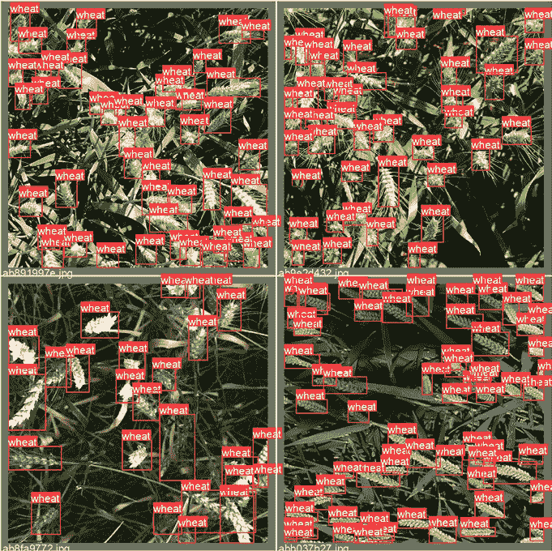

图 10.14:带注释的验证数据

一旦我们训练了模型，我们可以使用来自最佳执行模型的权重(Yolov5 具有自动保持最佳和最后时期模型的简洁功能，将它们存储为`best.pt`和`last.pt`)来生成对测试数据的预测:

```py
!python ./yolov5/detect.py --weights ./yolov5/runs/train/yolov5x_fold0/weights/best.pt --img 512 --conf 0.1 --source /kaggle/input/global-wheat-detection/test --save-txt --save-conf --exist-ok 
```

我们将讨论特定于推断阶段的参数:

*   `--weights`从上面训练的模型中指出最佳权重的位置。
*   `--conf 0.1`指定由模型生成的哪些候选边界框应该被保留。像往常一样，这是精确度和召回率之间的折衷(太低的阈值会产生大量的假阳性，而将阈值移动得太高则意味着我们可能根本找不到任何麦穗)。
*   `--source`是测试数据的位置。

可以在本地检查为我们的测试图像创建的标签:

```py
!ls ./yolov5/runs/detect/exp/labels/ 
```

这是我们可能会看到的:

```py
2fd875eaa.txt  53f253011.txt  aac893a91.txt  f5a1f0358.txt

348a992bb.txt  796707dd7.txt  cc3532ff6.txt 
```

让我们来看一个个人预测:

```py
!cat 2fd875eaa.txt 
```

它具有以下格式:

```py
0 0.527832 0.580566 0.202148 0.838867 0.101574

0 0.894531 0.587891 0.210938 0.316406 0.113519 
```

这意味着在图像`2fd875eaa`中，我们训练的模型检测到两个边界框(它们的坐标是该行中的条目 2-5)，在行的末尾给出了高于 0.1 的置信度得分。

我们如何将这些预测按照要求的格式组合成一份报告呢？我们首先定义一个帮助函数，帮助我们将坐标从 yolo 格式转换为 coco(如本次比赛所要求的):这是一个简单的重新排列顺序的问题，并通过将分数乘以图像大小来归一化到原始值范围:

```py
def convert(s):

    x = int(1024 * (s[1] - s[3]/2))

    y = int(1024 * (s[2] - s[4]/2))

    w = int(1024 * s[3])

    h = int(1024 * s[4])

    return(str(s[5]) + ' ' + str(x) + ' ' + str(y) + ' ' + str(w)

           + ' ' + str(h)) 
```

然后我们继续来生成一个提交文件:

1.  我们循环上面列出的文件。
2.  对于每个文件，所有行都被转换为所需格式的字符串(一行代表检测到的一个边界框)。
3.  然后，这些行被连接成与该文件对应的单个字符串。

代码如下:

```py
with open('submission.csv', 'w') as myfile:

    # Prepare submission

    wfolder = './yolov5/runs/detect/exp/labels/'

    for f in os.listdir(wfolder):

        fname = wfolder + f

        xdat = pd.read_csv(fname, sep = ' ', header = None)

        outline = f[:-4] + ' ' + ' '.join(list(xdat.apply(lambda s:

                                     convert(s), axis = 1)))

        myfile.write(outline + '\n')

myfile.close() 
```

让我们看看它是什么样子的:

```py
!cat submission.csv 
```

```py
53f253011 0.100472 61 669 961 57 0.106223 0 125 234 183 0.1082 96 696 928 126 0.108863 515 393 86 161 0.11459 31 0 167 209 0.120246 517 466 89 147

aac893a91 0.108037 376 435 325 188

796707dd7 0.235373 684 128 234 113

cc3532ff6 0.100443 406 752 144 108 0.102479 405 87 4 89 0.107173 576 537 138 94 0.113459 256 498 179 211 0.114847 836 618 186 65 0.121121 154 544 248 115 0.125105 40 567 483 199

2fd875eaa 0.101398 439 163 204 860 0.112546 807 440 216 323

348a992bb 0.100572 0 10 440 298 0.101236 344 445 401 211

f5a1f0358 0.102549 398 424 295 96 
```

生成的`submission.csv`文件完成了我们的管道。

在本节中，我们已经演示了如何使用 YoloV5 来解决对象检测的问题:如何处理不同格式的注释，如何为特定任务定制模型，训练它，并评估结果。

基于这些知识，您应该能够开始处理对象检测问题。

我们现在转到计算机视觉任务的第三个流行类别:语义分割。

# 语义分割

考虑**分割**最简单的方法是，它对图像中的每个像素进行分类，将其分配到相应的类别；结合起来，这些像素形成了感兴趣的区域，例如医学图像中某个器官上的疾病区域。相比之下，对象检测(在上一节中讨论)将图像的面片分类为不同的对象类，并在它们周围创建边界框。

我们将使用来自*Sartorius-Cell Instance Segmentation*竞赛的数据来演示建模方法([https://www . ka ggle . com/c/Sartorius-Cell-Instance-Segmentation](https://www.kaggle.com/c/sartorius-cell-instance-segmentation))。在这个项目中，参与者的任务是使用一组显微镜图像来训练模型，例如神经细胞的分割。

我们的解决方案将围绕 **Detectron2** 构建，这是一个由脸书人工智能研究所创建的库，支持多种检测和分割算法。

Detectron2 是最初的 Detectron 库([https://github.com/facebookresearch/Detectron/](https://github.com/facebookresearch/Detectron/))和 Mask R-CNN 项目([https://github.com/facebookresearch/maskrcnn-benchmark/](https://github.com/facebookresearch/maskrcnn-benchmark/))的继承者。

我们从安装额外的软件包开始:

```py
!pip install pycocotools

!pip install 'git+https://github.com/facebookresearch/detectron2.git' 
```

我们安装`pycocotools`([https://github . com/coco dataset/coco API/tree/master/python API/pycocotools](https://github.com/cocodataset/cocoapi/tree/master/PythonAPI/pycocotools))，我们将需要它来格式化注释，并检测我们在这项任务中的主力工具 2([https://github.com/facebookresearch/detectron2](https://github.com/facebookresearch/detectron2))。

在我们可以训练我们的模型之前，我们需要做一点准备:注释需要从组织者提供的**游程编码** ( **RLE** )格式转换为 Detectron2 输入所需的 COCO 格式。RLE 背后的基本思想是节省空间:创建一个分割意味着以某种方式标记一组像素。因为图像可以被认为是一个数组，所以这个区域可以用一系列直线来表示(按行或按列)。

您可以通过列出索引，或者通过指定后续连续块的起始位置和长度来对这些行中的每一行进行编码。下面给出了一个直观的例子:

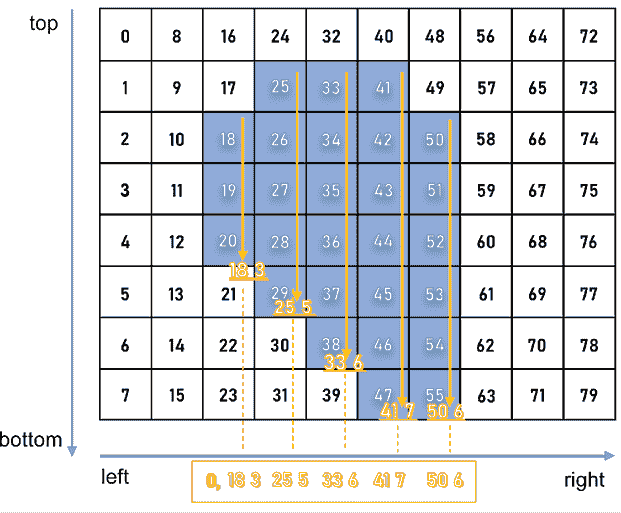

图 10.15:RLE 的可视化表示

微软的**通用对象上下文** ( **COCO** )格式是一种特定的 JSON 结构，规定了如何为图像数据集保存标签和元数据。下面，我们演示如何将 RLE 转换为 COCO 并将其与一个 *k* 折叠验证分割相结合，这样我们就可以为每个折叠获得所需的 JSON 文件的训练/验证对。

让我们开始吧:

```py
# from pycocotools.coco import COCO

import skimage.io as io

import matplotlib.pyplot as plt

from pathlib import Path

from PIL import Image

import pandas as pd

import numpy as np

from tqdm.notebook import tqdm

import json,itertools

from sklearn.model_selection import GroupKFold

# Config

class CFG:

    data_path = '../input/sartorius-cell-instance-segmentation/'

    nfolds = 5 
```

从 RLE 到可可，我们需要三个函数。首先，我们需要将 RLE 转换为二进制掩码:

```py
# From https://www.kaggle.com/stainsby/fast-tested-rle

def rle_decode(mask_rle, shape):

    '''

    mask_rle: run-length as string formatted (start length)

    shape: (height,width) of array to return 

    Returns numpy array, 1 - mask, 0 - background

    '''

    s = mask_rle.split()

    starts, lengths = [np.asarray(x, dtype=int)

                       for x in (s[0:][::2], s[1:][::2])]

    starts -= 1

    ends = starts + lengths

    img = np.zeros(shape[0]*shape[1], dtype=np.uint8)

    for lo, hi in zip(starts, ends):

        img[lo:hi] = 1

    return img.reshape(shape)  # Needed to align to RLE direction 
```

第二个将二进制掩码转换为 RLE:

```py
# From https://newbedev.com/encode-numpy-array-using-uncompressed-rle-for-

# coco-dataset

def binary_mask_to_rle(binary_mask):

    rle = {'counts': [], 'size': list(binary_mask.shape)}

    counts = rle.get('counts')

    for i, (value, elements) in enumerate(

            itertools.groupby(binary_mask.ravel(order='F'))):

        if i == 0 and value == 1:

            counts.append(0)

        counts.append(len(list(elements)))

    return rle 
```

最后，我们将两者结合起来，以产生 COCO 输出:

```py
def coco_structure(train_df):

    cat_ids = {name: id+1 for id, name in enumerate(

        train_df.cell_type.unique())}

    cats = [{'name': name, 'id': id} for name, id in cat_ids.items()]

    images = [{'id': id, 'width': row.width, 'height': row.height,

               'file_name':f'train/{id}.png'} for id,

               row in train_df.groupby('id').agg('first').iterrows()]

    annotations = []

    for idx, row in tqdm(train_df.iterrows()):

        mk = rle_decode(row.annotation, (row.height, row.width))

        ys, xs = np.where(mk)

        x1, x2 = min(xs), max(xs)

        y1, y2 = min(ys), max(ys)

        enc =binary_mask_to_rle(mk)

        seg = {

            'segmentation':enc, 

            'bbox': [int(x1), int(y1), int(x2-x1+1), int(y2-y1+1)],

            'area': int(np.sum(mk)),

            'image_id':row.id, 

            'category_id':cat_ids[row.cell_type], 

            'iscrowd':0, 

            'id':idx

        }

        annotations.append(seg)

    return {'categories':cats, 'images':images,'annotations':annotations} 
```

我们将数据分成不重叠的折叠:

```py
train_df = pd.read_csv(CFG.data_path + 'train.csv')

gkf = GroupKFold(n_splits = CFG.nfolds)

train_df["fold"] = -1

y = train_df.width.values

for f, (t_, v_) in enumerate(gkf.split(X=train_df, y=y,

                             groups=train_df.id.values)):

    train_df.loc[v_, "fold"] = f

fold_id = train_df.fold.copy() 
```

我们现在可以循环折叠:

```py
all_ids = train_df.id.unique()

# For fold in range(CFG.nfolds):

for fold in range(4,5):    

    train_sample = train_df.loc[fold_id != fold]

    root = coco_structure(train_sample)

    with open('annotations_train_f' + str(fold) + 

              '.json', 'w', encoding='utf-8') as f:

        json.dump(root, f, ensure_ascii=True, indent=4)

    valid_sample = train_df.loc[fold_id == fold]

    print('fold ' + str(fold) + ': produced')

for fold in range(4,5):    

    train_sample = train_df.loc[fold_id == fold]

    root = coco_structure(train_sample)

    with open('annotations_valid_f' + str(fold) + 

              '.json', 'w', encoding='utf-8') as f:

        json.dump(root, f, ensure_ascii=True, indent=4)

    valid_sample = train_df.loc[fold_id == fold]

    print('fold ' + str(fold) + ': produced') 
```

为什么循环必须分段执行的原因是 Kaggle 环境的大小限制:笔记本输出的最大大小限制为 20 GB，5 个文件夹，每个文件夹有 2 个文件(训练/验证),这意味着总共有 10 个 JSON 文件，超过了这个限制。

当在 Kaggle 笔记本中运行代码时，这种实际考虑是值得记住的，尽管对于这种“准备”工作，您当然可以在其他地方生成结果，并在之后将它们作为 Kaggle 数据集上传。

有了生成的分割，我们可以继续为我们的数据集训练 Detectron2 模型。像往常一样，我们首先加载必要的包:

```py
from datetime import datetime

import os

import pandas as pd

import numpy as np

import pycocotools.mask as mask_util

import detectron2

from pathlib import Path

import random, cv2, os

import matplotlib.pyplot as plt

# Import some common detectron2 utilities

from detectron2 import model_zoo

from detectron2.engine import DefaultPredictor, DefaultTrainer

from detectron2.config import get_cfg

from detectron2.utils.visualizer import Visualizer, ColorMode

from detectron2.data import MetadataCatalog, DatasetCatalog

from detectron2.data.datasets import register_coco_instances

from detectron2.utils.logger import setup_logger

from detectron2.evaluation.evaluator import DatasetEvaluator

from detectron2.engine import BestCheckpointer

from detectron2.checkpoint import DetectionCheckpointer

setup_logger()

import torch 
```

虽然一开始从 Detectron2 导入的数量看起来令人生畏，但是随着我们对任务定义的深入，它们的功能将变得清晰；我们首先指定输入数据文件夹、注释文件夹和定义我们首选模型架构的 YAML 文件的路径:

```py
class CFG:

    wfold = 4

    data_folder = '../input/sartorius-cell-instance-segmentation/'

    anno_folder = '../input/sartoriusannotations/'

    model_arch = 'mask_rcnn_R_50_FPN_3x.yaml'

    nof_iters = 10000 

    seed = 45 
```

这里值得一提的一点是迭代参数(上面的`nof_iters`)。通常，模型训练根据时期的数量来参数化，换句话说，通过训练数据的完整遍数。Detectron2 的设计有所不同:一次迭代指的是一个小批量，不同的小批量大小用于模型的不同部分。

为了确保结果的可重复性，我们固定了模型不同组件使用的随机种子:

```py
def seed_everything(seed):

    random.seed(seed)

    os.environ['PYTHONHASHSEED'] = str(seed)

    np.random.seed(seed)

    torch.manual_seed(seed)

    torch.cuda.manual_seed(seed)

    torch.backends.cudnn.deterministic = True

seed_everything(CFG.seed) 
```

竞赛指标是不同**交叉点的平均精度超过联合** ( **IoU** )阈值。作为对第 5 章、*竞赛任务和指标*的复习，建议的一组目标像素和一组真实目标像素的 IoU 计算如下:


该指标在 IoU 阈值范围内扫描，在每个点计算平均精度值。阈值范围从 0.5 到 0.95，增量为 0.05。

在每个阈值处，基于通过将预测对象与所有地面真实对象进行比较而产生的**真阳性** ( **TP** )、**假阴性** ( **FN** )和**假阳性** ( **FP** )的数量来计算精度值。最后，竞赛度量返回的分数是测试数据集中每个图像的单个平均精度的平均值。

下面，我们定义计算指标所需的函数，并在模型中直接将其用作目标函数:

```py
# Taken from https://www.kaggle.com/theoviel/competition-metric-map-iou

def precision_at(threshold, iou):

    matches = iou > threshold

    true_positives = np.sum(matches, axis=1) == 1  # Correct objects

    false_positives = np.sum(matches, axis=0) == 0  # Missed objects

    false_negatives = np.sum(matches, axis=1) == 0  # Extra objects

    return np.sum(true_positives), np.sum(false_positives),

    np.sum(false_negatives)

def score(pred, targ):

    pred_masks = pred['instances'].pred_masks.cpu().numpy()

    enc_preds = [mask_util.encode(np.asarray(p, order='F'))

                 for p in pred_masks]

    enc_targs = list(map(lambda x:x['segmentation'], targ))

    ious = mask_util.iou(enc_preds, enc_targs, [0]*len(enc_targs))

    prec = []

    for t in np.arange(0.5, 1.0, 0.05):

        tp, fp, fn = precision_at(t, ious)

        p = tp / (tp + fp + fn)

        prec.append(p)

    return np.mean(prec) 
```

定义了指标后，我们可以在模型中使用它:

```py
class MAPIOUEvaluator(DatasetEvaluator):

    def __init__(self, dataset_name):

        dataset_dicts = DatasetCatalog.get(dataset_name)

        self.annotations_cache = {item['image_id']:item['annotations']

                                  for item in dataset_dicts}

    def reset(self):

        self.scores = []

    def process(self, inputs, outputs):

        for inp, out in zip(inputs, outputs):

            if len(out['instances']) == 0:

                self.scores.append(0)    

            else:

                targ = self.annotations_cache[inp['image_id']]

                self.scores.append(score(out, targ))

    def evaluate(self):

        return {"MaP IoU": np.mean(self.scores)} 
```

这给了我们创建`Trainer`对象的基础，这是我们围绕探测器 2 构建的解决方案的主力:

```py
class Trainer(DefaultTrainer):

    @classmethod

    def build_evaluator(cls, cfg, dataset_name, output_folder=None):

        return MAPIOUEvaluator(dataset_name)

    def build_hooks(self):

        # copy of cfg

        cfg = self.cfg.clone()

        # build the original model hooks

        hooks = super().build_hooks()

        # add the best checkpointer hook

        hooks.insert(-1, BestCheckpointer(cfg.TEST.EVAL_PERIOD, 

                                         DetectionCheckpointer(self.model,

                                         cfg.OUTPUT_DIR),

                                         "MaP IoU",

                                         "max",

                                         ))

        return hooks 
```

我们现在开始以 Detectron2 的方式加载训练/验证数据:

```py
dataDir=Path(CFG.data_folder)

register_coco_instances('sartorius_train',{}, CFG.anno_folder + 

                        'annotations_train_f' + str(CFG.wfold) + 

                        '.json', dataDir)

register_coco_instances('sartorius_val',{}, CFG.anno_folder + 

                        'annotations_valid_f' + str(CFG.wfold) + 

                        '.json', dataDir)

metadata = MetadataCatalog.get('sartorius_train')

train_ds = DatasetCatalog.get('sartorius_train') 
```

在我们实例化 Detectron2 模型之前，我们需要注意配置它。大多数值可以保留默认值(至少在第一次通过时)；如果你决定再做一点修改，从`BATCH_SIZE_PER_IMAGE`(提高泛化性能)和`SCORE_THRESH_TEST`(限制假阴性)开始:

```py
cfg = get_cfg()

cfg.INPUT.MASK_FORMAT='bitmask'

cfg.merge_from_file(model_zoo.get_config_file('COCO-InstanceSegmentation/' +

                    CFG.model_arch))

cfg.DATASETS.TRAIN = ("sartorius_train",)

cfg.DATASETS.TEST = ("sartorius_val",)

cfg.DATALOADER.NUM_WORKERS = 2

cfg.MODEL.WEIGHTS = model_zoo.get_checkpoint_url('COCO-InstanceSegmentation/'

                    + CFG.model_arch)

cfg.SOLVER.IMS_PER_BATCH = 2

cfg.SOLVER.BASE_LR = 0.001

cfg.SOLVER.MAX_ITER = CFG.nof_iters

cfg.SOLVER.STEPS = []

cfg.MODEL.ROI_HEADS.BATCH_SIZE_PER_IMAGE = 512

cfg.MODEL.ROI_HEADS.NUM_CLASSES = 3  

cfg.MODEL.ROI_HEADS.SCORE_THRESH_TEST = .4

cfg.TEST.EVAL_PERIOD = len(DatasetCatalog.get('sartorius_train')) 

                           // cfg.SOLVER.IMS_PER_BATCH 
```

训练一个模型很简单:

```py
os.makedirs(cfg.OUTPUT_DIR, exist_ok=True)

trainer = Trainer(cfg) 

trainer.resume_or_load(resume=False)

trainer.train() 
```

您会注意到，训练期间的输出中包含了大量关于过程进度的信息:

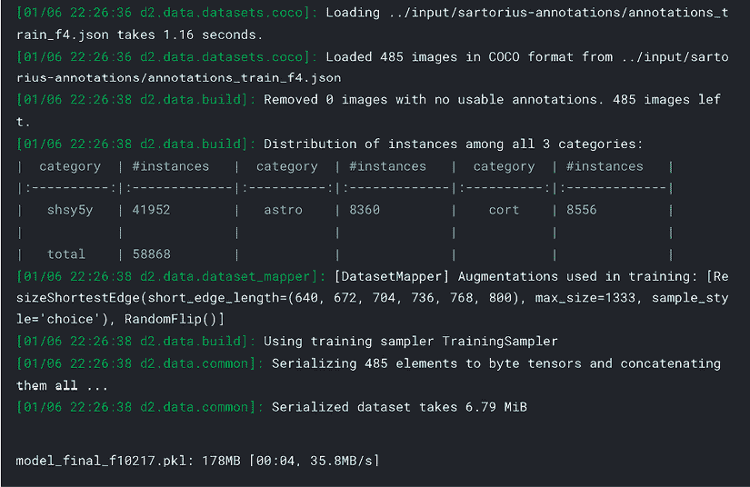

图 10.16:检测器 2 的训练输出

一旦模型经过训练，我们就可以保存权重并将其用于推理(可能在单独的笔记本中——参见本章前面的讨论)和提交准备。我们从添加新参数开始，这些参数允许我们调整预测，设置置信阈值和最小掩码大小:

```py
THRESHOLDS = [.18, .35, .58]

MIN_PIXELS = [75, 150, 75] 
```

我们需要一个辅助函数来将单个遮罩编码为 RLE 格式:

```py
def rle_encode(img):

    '''

    img: numpy array, 1 - mask, 0 - background

    Returns run length as string formatted

    '''

    pixels = img.flatten()

    pixels = np.concatenate([[0], pixels, [0]])

    runs = np.where(pixels[1:] != pixels[:-1])[0] + 1

    runs[1::2] -= runs[::2]

    return ' '.join(str(x) for x in runs) 
```

下面是主函数，用于生成每幅图像的所有蒙版，过滤掉面积小(包含的像素比`MIN_PIXELS`少)的可疑蒙版(置信度得分低于`THRESHOLDS`):

```py
def get_masks(fn, predictor):

    im = cv2.imread(str(fn))

    pred = predictor(im)

    pred_class = torch.mode(pred['instances'].pred_classes)[0]

    take = pred['instances'].scores >= THRESHOLDS[pred_class]

    pred_masks = pred['instances'].pred_masks[take]

    pred_masks = pred_masks.cpu().numpy()

    res = []

    used = np.zeros(im.shape[:2], dtype=int) 

    for mask in pred_masks:

        mask = mask * (1-used)

        # Skip predictions with small area

        if mask.sum() >= MIN_PIXELS[pred_class]:

            used += mask

            res.append(rle_encode(mask))

    return res 
```

然后，我们准备存储图像 id 和遮罩的列表:

```py
dataDir=Path(CFG.data_folder)

ids, masks=[],[]

test_names = (dataDir/'test').ls() 
```

具有大型图像集的比赛——就像本节中讨论的那些——通常需要超过 9 个小时的训练模型，这是代码比赛规定的时间限制(参见[https://www.kaggle.com/docs/competitions](https://www.kaggle.com/docs/competitions))。这意味着在同一个笔记本中训练模型和运行推理变得不可能。一个典型的解决方法是首先在 Kaggle、Google Colab、GCP 或本地运行一个训练笔记本/脚本作为独立的笔记本。第一个笔记本的输出(训练的权重)被用作第二个笔记本的输入，换句话说，定义用于预测的模型。

我们以这种方式加载训练模型的权重:

```py
cfg = get_cfg()

cfg.merge_from_file(model_zoo.get_config_file("COCO-InstanceSegmentation/"+

                    CFG.arch+".yaml"))

cfg.INPUT.MASK_FORMAT = 'bitmask'

cfg.MODEL.ROI_HEADS.NUM_CLASSES = 3 

cfg.MODEL.WEIGHTS = CFG.model_folder + 'model_best_f' + 

                    str(CFG.wfold)+'.pth' 

cfg.MODEL.ROI_HEADS.SCORE_THRESH_TEST = 0.5

cfg.TEST.DETECTIONS_PER_IMAGE = 1000

predictor = DefaultPredictor(cfg) 
```

我们可以想象一些预测:

```py
encoded_masks = get_masks(test_names[0], predictor)

_, axs = plt.subplots(1,2, figsize = (40, 15))

axs[1].imshow(cv2.imread(str(test_names[0])))

for enc in encoded_masks:

    dec = rle_decode(enc)

axs[0].imshow(np.ma.masked_where(dec == 0, dec)) 
```

这里有一个例子:

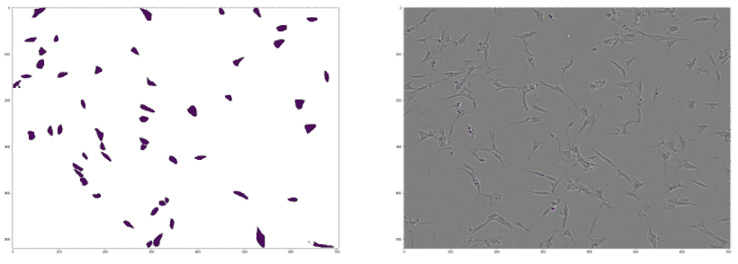

图 10.17:在源图像旁边显示来自检测器 2 的样品预测

利用上面定义的辅助函数，以 RLE 格式生成用于提交的掩模是简单的:

```py
for fn in test_names:

    encoded_masks = get_masks(fn, predictor)

    for enc in encoded_masks:

        ids.append(fn.stem)

        masks.append(enc)

pd.DataFrame({'id':ids, 'predicted':masks}).to_csv('submission.csv', 

                                                   index=False)

pd.read_csv('submission.csv').head() 
```

以下是最终提交的前几行:


图 10.18:来自训练有素的检测器 2 模型的格式化提交

我们已经到达本节的结尾。上面的管道演示了如何建立一个语义分割模型并训练它。我们使用了少量的迭代，但是为了获得有竞赛力的结果，更长的训练是必要的。

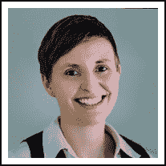

劳拉·芬克

[https://www.kaggle.com/allunia](https://www.kaggle.com/allunia)

为了结束这一章，让我们看看卡格勒·劳拉·芬克对她在平台上的时光说了些什么。她不仅是笔记本大师，还制作了许多一流的笔记本，她还是 MicroMata 的数据科学主管。

你最喜欢哪种比赛，为什么？从技术和解决途径来说，你在 Kaggle 上的特长是什么？

我最喜欢的竞赛是那些希望为人类带来美好事物的竞赛。我尤其喜欢所有与医疗保健相关的挑战。尽管如此，每次比赛对我来说都像是一次冒险，都有自己的难题需要解决。我真的很喜欢学习新技能，探索新的数据集或问题。因此，我不专注于特定的技术，而是学习新的东西。我认为我在探索性数据分析(EDA)方面的优势是众所周知的。

你是如何对待一场 Kaggle 比赛的？这种方法与你在日常工作中的做法有什么不同？

*参加比赛时，我会先阅读问题陈述和数据描述。在浏览论坛和公共笔记本收集想法后，我通常会从开发自己的解决方案开始。在初始阶段，我会花一些时间在 EDA 上搜索隐藏组，获得一些直觉。这对于建立适当的验证策略非常有帮助，我认为这是所有剩余步骤的基础。然后，我开始迭代机器学习管道的不同部分，如特征工程或预处理，改进模型架构，询问有关数据收集的问题，搜索泄漏，做更多的 EDA，或建立集成。我试图以贪婪的方式改进我的解决方案。Kaggle 竞赛是非常动态的，你需要尝试不同的想法和不同的解决方案才能最终生存下来。*

*这绝对不同于我的日常工作，我的工作重点是从数据中获得洞察力，并找到简单而有效的解决方案来改善业务流程。在这里，任务通常比使用的模型更复杂。要解决的问题必须非常清楚地定义，这意味着必须与不同背景的专家讨论应该达到哪些目标，涉及哪些过程，以及需要如何收集或融合数据。与 Kaggle 比赛相比，我的日常工作需要更多的交流，而不是机器学习技能。*

告诉我们你参加的一个特别有挑战性的比赛，以及你用什么样的洞察力来完成这个任务。

G2Net 引力波探测比赛是我最喜欢的比赛之一。目标是探测隐藏在探测器组件和地球作用力产生的噪音中的模拟引力波信号。在这次比赛中，一个重要的观点是，你应该批判性地看待分析数据的标准方法，并尝试你自己的想法。在我阅读的论文中，数据主要是在白化数据并应用带通滤波器后，通过使用傅立叶或常数 Q 变换来准备的。

*很快就发现白化没有帮助，因为它使用了功率谱密度的样条插值，这本身就非常嘈杂。将多项式拟合到小的噪声数据子集会因为过度拟合而增加另一个误差源。*

*在放弃白化之后，我尝试了常数-Q 变换的不同超参数，这在很长一段时间内都是论坛和公共* *笔记本中的领先方法。由于有两个引力波源可以被不同范围的 Q 值所覆盖，我尝试了一套在这些超参数上不同的模型。这被证明对提高我的分数是有帮助的，但后来我达到了一个极限。常数 Q 变换将一系列滤波器应用于时间序列，并将它们变换到频域。我开始问自己，是否有一种方法可以更好、更灵活地完成这些过滤任务。与此同时，社区中出现了使用 1 dim CNNs 的想法，我很喜欢它。我们都知道 2 dim CNNs 的滤波器能够检测给定图像数据的边缘、线条和纹理。同样的事情也可以用像拉普拉斯或索贝尔滤波器这样的“经典”滤波器来完成。出于这个原因，我问自己:我们不能使用 1dCNN 自己学习最重要的滤波器，而不是应用已经以某种方式固定的变换吗？*

*我无法让我的 1 dim CNN 解决方案发挥作用，但事实证明许多顶级团队都做得很好。G2Net 比赛是我最喜欢的比赛之一，尽管我错过了赢得奖牌的目标。然而，我在这个过程中获得的知识以及我学到的关于所谓的标准方法的经验是非常有价值的。*

Kaggle 对你的职业生涯有帮助吗？如果有，如何实现？

我大学毕业后的第一份工作是 Java 软件开发人员，尽管我在硕士论文期间已经第一次接触了机器学习。我有兴趣做更多的数据分析，但在那个时候，几乎没有数据科学的工作，或者说他们不是这样命名的。当我第一次听说 Kaggle 的时候，我从一开始就被困住了。从那以后，我经常在晚上去 Kaggle 上找点乐子。当时我并没有打算改变我的立场，但后来一个需要机器学习技能的研究项目出现了。我能够证明我是这个项目的合适候选人，因为我通过参与 Kaggle 获得了知识。这成了我数据科学生涯的切入点。

*Kaggle 一直是我试验想法、学习新方法和工具、获得实践经验的好地方。我通过这种方式获得的技能对工作中的数据科学项目非常有帮助。这就像是知识的增长，因为 Kaggle 为你提供了一个沙箱，让你尝试不同的想法，并在没有风险的情况下发挥创造力。在竞赛中失败意味着至少有一个教训可以吸取，但是在一个项目中失败会对你自己和其他人产生巨大的负面影响。*

*除了参加比赛，另一个积累作品集的好方法是写笔记本。这样做，你可以向世界展示你是如何处理问题的，以及如何交流见解和结论的。当你必须与来自不同背景的管理层、客户和专家一起工作时，后者是非常重要的。*

以你的经验来看，没有经验的 Kagglers 经常会忽略什么？你现在知道了什么，你希望在你刚开始的时候就知道？

我认为许多参加比赛的初学者被公共排名所诱惑，在没有一个好的验证策略的情况下建立他们的模型。当在排名上衡量他们的成功时，他们可能会过度适应公共测试数据。比赛结束后，他们的模型并不能够归纳到看不见的私人测试数据中，他们经常会跌出数百个名次。我仍然记得在梅赛德斯-奔驰绿色制造*比赛期间，我是多么沮丧，因为我没能登上公众排名。但是当最后的积分榜出来的时候，有多少人在排名上上下洗牌，这是一个很大的惊喜。从那以后，我一直牢记，一个合适的验证方案对于应对欠拟合和过拟合的挑战是非常重要的。*

你在过去的比赛中犯过什么错误？

*迄今为止，我最大的错误是在比赛开始时，在我的解决方案的细节上花费了太多的时间和精力。事实上，在构建了适当的验证策略之后，快速迭代各种不同的想法要好得多。这样，就能更容易、更快地找到有希望的改进方向，陷入困境的危险也小得多。*

对于数据分析或机器学习，你有什么特别推荐的工具或库吗？

*在 Kaggle 社区中活跃起来后，你可以学习和实践许多常用的工具和库，我只能推荐它们。保持灵活性并了解它们的优缺点是很重要的。这样，你的解决方案不依赖于你的工具，而是依赖于你的想法和创造力。*

当一个人参加比赛时，他应该记住或做的最重要的事情是什么？

*数据科学不是关于构建模型，而是关于理解数据及其收集方式。到目前为止，我参加的许多比赛都显示了测试数据中的泄漏或隐藏组，人们可以通过探索性数据分析找到这些泄漏或隐藏组。*

# 摘要

在这一章中，我们从一个 Kaggle 竞赛的角度给你概述了与计算机视觉相关的最重要的主题。我们介绍了增强，这是一类用于扩展算法泛化能力的重要技术，然后演示了三个最常见问题的端到端管道:图像分类、对象检测和语义分割。

在下一章，我们将注意力转移到自然语言处理上，这是另一个极其广泛和流行的问题类别。

# 加入我们书的不和谐空间

加入这本书的 Discord workspace，每月与作者进行一次*向我提问*会议:

[https://packt.link/KaggleDiscord](https://packt.link/KaggleDiscord)

*