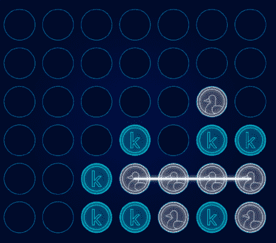
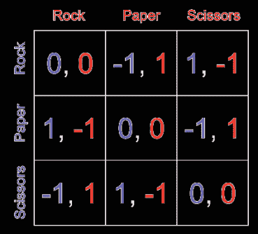
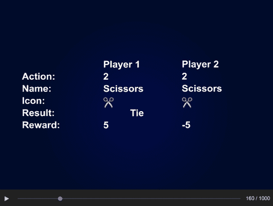
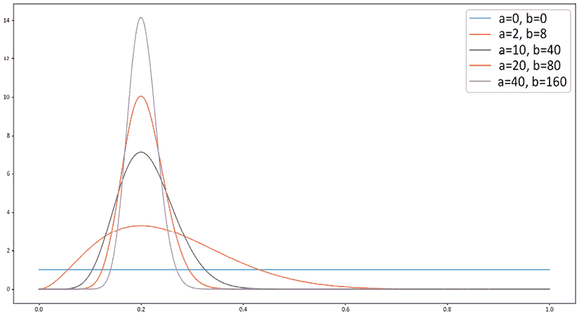
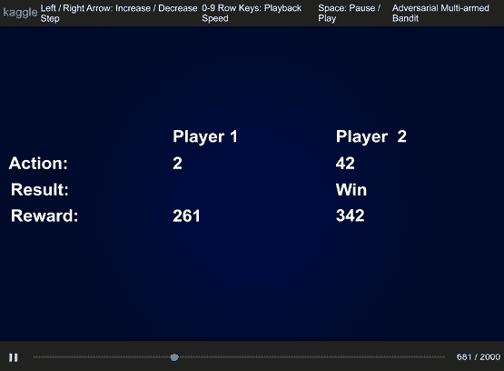
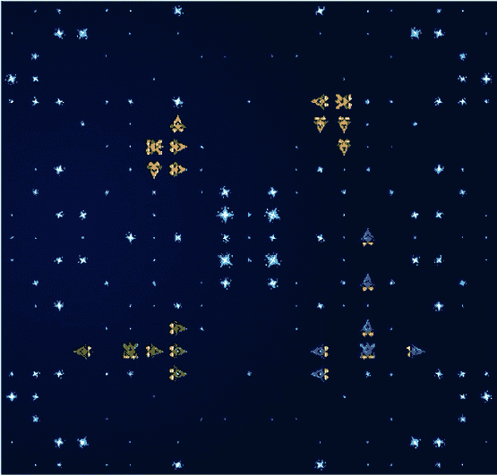

# 十二、仿真和优化竞赛

**强化学习** ( **RL** )是机器学习不同分支中一个有趣的案例。一方面，从技术的角度来看，这是相当苛刻的:来自监督学习的各种直觉并不成立，相关的数学仪器要先进得多；另一方面，这是最容易向外人或外行人解释的。一个简单的类比是教你的宠物(我有意避开狗和猫的辩论)表演把戏:你为表演得好的把戏提供奖励，否则拒绝它。

强化学习是 Kaggle 上竞赛派对的后来者，但随着仿真竞赛的引入，这种情况在过去几年发生了变化。在这一章中，我们将描述 Kaggle 宇宙中这个令人兴奋的新部分。到目前为止——在撰写本文时——已经有四个**特色**比赛和两个**游乐场**比赛；这个列表虽然不全面，但让我们可以给出一个大致的概述。

在本章中，我们将展示几个仿真竞赛中出现的问题的解决方案:

*   我们从*连接 X* 开始。
*   我们接着看*石头、布、剪刀*，这里展示了一种构建竞赛性代理的双重方法。
*   接下来，我们将展示一个基于多臂强盗的解决方案，用于*圣诞老人*竞赛。
*   我们以其余比赛的概述结束，这些比赛稍微超出了本章的范围。

如果强化学习对你来说是一个全新的概念，那么先获得一些基本的了解大概是个不错的主意。在游戏人工智能的背景下， RL 冒险的一个非常好的开始方式是致力于这个主题的 Kaggle 学习课程([https://www . ka ggle . com/learn/intro-to-Game-AI-and-reinforcement-Learning](https://www.kaggle.com/learn/intro-to-game-ai-and-reinforcement-learning))。该课程介绍了代理和策略等基本概念，还提供了深度强化学习的(速成)介绍。课程中的所有例子都使用了操场竞赛 *Connect X* 的数据，其中的目标是训练一个能够玩将跳棋连成一条线的游戏([https://www.kaggle.com/c/connectx/overview](https://www.kaggle.com/c/connectx/overview))的智能体。

在更一般的层面上，值得指出的是仿真和优化竞赛的一个重要方面是**环境**:由于问题的本质，你的解决方案需要展现出更多的动态特征，而不仅仅是提交一组数字(就像“常规”监督学习竞赛的情况一样)。在[https://github . com/ka ggle/ka ggle-environments/blob/master/readme . MD](https://github.com/Kaggle/kaggle-environments/blob/master/README.md)中可以找到关于仿真比赛中使用的环境的非常翔实和详细的描述。

# 连接 X

在这一节中，我们将展示如何使用试探法解决玩跳棋的简单问题。虽然不是一个深度学习解决方案，但我们认为这种概念的基本介绍对于之前没有大量接触过 RL 的人来说更有用。

如果你对在棋盘游戏中使用人工智能的概念还不熟悉，那么汤姆·范·德·维勒([https://www.kaggle.com/tvdwiele](https://www.kaggle.com/tvdwiele))的演示是一个值得探索的资源:[https://tinyurl.com/36rdv5sa](https://tinyurl.com/36rdv5sa)。

*Connect X* 的目的是在你的对手之前，在游戏棋盘上水平、垂直或对角地获得一定数量( *X* )的棋子。玩家轮流把他们的跳棋丢进棋盘顶部的一个柱子里。这意味着每一步棋都可能有试图为你赢得胜利或试图阻止你的对手赢得胜利的目的。



图 12.1:连接 X 板

*Connect X* 是第一个引入**代理**的比赛:代替静态提交(或根据看不见的数据集评估的笔记本)，参与者必须提交能够与他人玩游戏的代理。评估分步骤进行:

1.  上传时，提交会与自身进行对抗，以确保其正常工作。
2.  如果这一验证环节成功，将分配一个技能等级，提交的作品将加入所有竞赛者的行列。
3.  每一天，每一次提交都会播放几集，随后会调整排名。

记住这个设置，让我们继续演示如何为 *Connect X* 竞赛构建提交内容。我们给出的代码是针对 *X=4* 的，但是可以容易地适用于其他值或变量 *X* 。

首先，我们安装 Kaggle 环境包:

```
!pip install kaggle-environments --upgrade 
```

我们定义了评估我们代理人的环境:

```
from kaggle_environments import evaluate, make

env = make("connectx", debug=True)

env.render() 
```

虽然你可能经常有尝试复杂方法的冲动，但从简单开始是有用的——就像我们在这里将要做的，通过使用简单的试探法。这些在附带的代码中被组合成一个单一的函数，但是为了便于演示，我们在这里一次描述一个。

第一个规则是检查任何一个玩家是否有机会垂直连接四个棋子，如果有，返回可能的位置。我们可以通过使用一个简单的变量作为输入参数来实现这一点，它可以采用两个可能的值来指示正在分析哪些玩家机会:

```
def my_agent(observation, configuration):

    from random import choice

    # me:me_or_enemy=1, enemy:me_or_enemy=2

    def check_vertical_chance(me_or_enemy):

        for i in range(0, 7):

            if observation.board[i+7*5] == me_or_enemy \

            and observation.board[i+7*4] == me_or_enemy \

            and observation.board[i+7*3] == me_or_enemy \

            and observation.board[i+7*2] == 0:

                return i

            elif observation.board[i+7*4] == me_or_enemy \

            and observation.board[i+7*3] == me_or_enemy \

            and observation.board[i+7*2] == me_or_enemy \

            and observation.board[i+7*1] == 0:

                return i

            elif observation.board[i+7*3] == me_or_enemy \

            and observation.board[i+7*2] == me_or_enemy \

            and observation.board[i+7*1] == me_or_enemy \

            and observation.board[i+7*0] == 0:

                return i

        # no chance

        return -99 
```

我们可以为水平机会定义一个类似的方法:

```
 def check_horizontal_chance(me_or_enemy):

        chance_cell_num = -99

        for i in [0,7,14,21,28,35]:

            for j in range(0, 4):

                val_1 = i+j+0

                val_2 = i+j+1

                val_3 = i+j+2

                val_4 = i+j+3

                if sum([observation.board[val_1] == me_or_enemy, \

                        observation.board[val_2] == me_or_enemy, \

                        observation.board[val_3] == me_or_enemy, \

                        observation.board[val_4] == me_or_enemy]) == 3:

                    for k in [val_1,val_2,val_3,val_4]:

                        if observation.board[k] == 0:

                            chance_cell_num = k

                            # bottom line

                            for l in range(35, 42):

                                if chance_cell_num == l:

                                    return l - 35

                            # others

                            if observation.board[chance_cell_num+7] != 0:

                                return chance_cell_num % 7

        # no chance

        return -99 
```

我们对对角线组合重复相同的方法:

```
# me:me_or_enemy=1, enemy:me_or_enemy=2

def check_slanting_chance(me_or_enemy, lag, cell_list):

        chance_cell_num = -99

        for i in cell_list:

            val_1 = i+lag*0

            val_2 = i+lag*1

            val_3 = i+lag*2

            val_4 = i+lag*3

            if sum([observation.board[val_1] == me_or_enemy, \

                    observation.board[val_2] == me_or_enemy, \

                    observation.board[val_3] == me_or_enemy, \

                    observation.board[val_4] == me_or_enemy]) == 3:

                for j in [val_1,val_2,val_3,val_4]:

                    if observation.board[j] == 0:

                        chance_cell_num = j

                        # bottom line

                        for k in range(35, 42):

                            if chance_cell_num == k:

                                return k - 35

                        # others

                        if chance_cell_num != -99 \

                        and observation.board[chance_cell_num+7] != 0:

                            return chance_cell_num % 7

        # no chance

        return -99 
```

我们可以将逻辑结合到一个检查机会的功能中(与对手进行游戏):

```
 def check_my_chances():

        # check my vertical chance

        result = check_vertical_chance(my_num)

        if result != -99:

            return result

        # check my horizontal chance

        result = check_horizontal_chance(my_num)

        if result != -99:

            return result

        # check my slanting chance 1 (up-right to down-left)

        result = check_slanting_chance(my_num, 6, [3,4,5,6,10,11,12,13,17,18,19,20])

        if result != -99:

            return result

        # check my slanting chance 2 (up-left to down-right)

        result = check_slanting_chance(my_num, 8, [0,1,2,3,7,8,9,10,14,15,16,17])

        if result != -99:

            return result

        # no chance

        return -99 
```

这些模块构成了逻辑的基础。虽然表述起来有点麻烦，但它们是将直觉转化为启发式的有用练习，可用于在游戏中竞赛的代理。

请查看存储库中附带的代码，以获得本例中代理的完整定义。

我们新定义的代理的性能可以对照预定义的代理进行评估，例如随机代理:

```
env.reset()

env.run([my_agent, "random"])

env.render(mode="ipython", width=500, height=450) 
```

上面的代码向您展示了如何从零开始为一个相对简单的问题建立一个解决方案(这就是为什么 *Connect X* 是一个游乐场而不是一个特色比赛的原因)。有趣的是，这个简单的问题可以用(几乎)最先进的方法来处理，比如 alpha zero:[https://www . ka ggle . com/connect 4 alpha zero/alpha zero-baseline-connectx](https://www.kaggle.com/connect4alphazero/alphazero-baseline-connectx)。

有了这个介绍性的例子，你应该准备好投入到更复杂的(或者在任何情况下，不是基于玩具例子的)竞赛中。

# 石头剪刀布

仿真竞赛中的几个问题都与玩游戏有关，这并不是巧合:在不同的复杂程度上，游戏提供了一个有明确规则的环境，自然地将自己借给了代理人-行动-奖励框架。除了井字游戏，连接跳棋是竞技游戏中最简单的例子之一。沿着(游戏的)难度阶梯往上走，让我们看看**石头剪刀布**以及围绕这个游戏的卡格尔竞赛是如何进行的。

石头、布、剪刀*比赛([https://www.kaggle.com/c/rock-paper-scissors/code](https://www.kaggle.com/c/rock-paper-scissors/code))的理念是基本的石头、布、剪刀游戏(在世界的一些地方被称为 *roshambo* )的延伸:我们使用“1000 分中的最佳”而不是通常的“3 分中的最佳”*

我们将描述解决这个问题的两种可能的方法:一种基于博弈论的方法，另一种更侧重于算法方面。

我们从纳什均衡开始。维基百科将此定义为涉及两个或更多参与者的非合作游戏的解决方案，其中每个参与者都被假设知道其他人的均衡策略，没有一个参与者可以通过仅改变自己的策略来获得优势。

在[https://www.youtube.com/watch?v=-1GDMXoMdaY](https://www.youtube.com/watch?v=-1GDMXoMdaY)可以找到一个关于博弈论框架中石头剪刀布的精彩介绍。

用红色和蓝色表示我们的玩家，结果矩阵中的每个单元格显示给定移动组合的结果:



图 12.2:石头剪子布的收益矩阵

举个例子，如果都玩摇滚(左上角单元格)，都得 0 分；如果蓝色玩石头，红色玩纸(第一行第二列的单元格)，红色赢–因此红色获得+1 点，结果蓝色获得-1 点。

如果我们以 1/3 的等概率玩每一个动作，那么对手一定也这样做；否则，如果他们一直玩石头，他们会以 1/3 的概率(或三分之一的时间)平手石头，输给纸，赢给剪刀。在这种情况下，预期回报是 0，在这种情况下，我们可以将策略改为纸上谈兵，并一直获胜。同样的推理也适用于布对剪刀和剪刀对石头的策略，由于冗余，我们不会向您展示结果矩阵。

为了达到均衡，剩下的选项是两个玩家都需要采取随机策略——这就是纳什均衡。我们可以围绕这个想法构建一个简单的代理:

```
%%writefile submission.py

import random

def nash_equilibrium_agent(observation, configuration):

    return random.randint(0, 2) 
```

开始时的魔术(从笔记本直接写到文件)对于满足这个特定比赛的提交限制是必要的。

我们的纳什特工和其他人相比表现如何？通过评估性能，我们可以发现:

```
!pip install -q -U kaggle_environments

from kaggle_environments import make 
```

在编写的时候，有一个错误在这个导入之后弹出(**加载一个名为‘gfootball’的模块失败**)；Kaggle 的官方建议是忽略它。实际上，它似乎对代码的执行没有任何影响。

我们从开始，创建石头剪子布的环境，并将限制设置为每次仿真 1000 集:

```
env = make(

    "rps", 

    configuration={"episodeSteps": 1000}

) 
```

我们将使用在本次竞赛中创建的笔记本，该笔记本基于确定性试探法([https://www . ka ggle . com/Ili alar/multi-armed-bandit-vs-deterministic-agents](https://www.kaggle.com/ilialar/multi-armed-bandit-vs-deterministic-agents))实现了许多代理，并从那里导入我们与之竞赛的代理的代码:

```
%%writefile submission_copy_opponent.py

def copy_opponent_agent(observation, configuration):

    if observation.step > 0:

        return observation.lastOpponentAction

    else:

        return 0

# nash_equilibrium_agent vs copy_opponent_agent

env.run(

    ["submission.py", "submission_copy_opponent.py"]

)

env.render(mode="ipython", width=500, height=400) 
```

当我们执行前面的程序块并运行环境时，我们可以看到 1000 个时期的动画板。快照如下所示:



图 12.3:评估代理性能的渲染环境快照

在监督学习中——无论是分类还是回归——用简单的基准(通常是线性模型)开始处理任何问题通常都很有用。即使不是最先进的，它也能提供有用的期望和性能的度量。在强化学习中，类似的观点也成立；在这种情况下，一种值得尝试的方法是多臂 bandit，这是最简单的算法，我们可以诚实地称之为 RL。在下一节中，我们将演示如何在仿真竞赛中使用这种方法。

# 2020 年圣诞老人竞赛

在过去的几年里，Kaggle 上出现了一种传统:在 12 月初，有一场以圣诞老人为主题的比赛。实际的算法方面每年都有所不同，但就我们的目的而言，2020 年的比赛是一个有趣的案例:[https://www.kaggle.com/c/santa-2020](https://www.kaggle.com/c/santa-2020)。

这是一个典型的多臂强盗 ( **MAB** )试图通过在自动售货机上重复动作来获得最大回报，但是有两个额外的东西:

*   **奖励衰减**:在每一步，从机器获得奖励的概率降低 3%。
*   竞赛:你不仅会受到时间的限制(尝试次数有限)，还会受到另一个试图达到相同目标的玩家的限制。我们提到这个约束主要是为了完整性，因为在我们演示的解决方案中明确包含它并不重要。

为了更好地解释处理一般 MAB 问题的方法，读者可以参考[https://lilian Weng . github . io/lil-log/2018/01/23/the-multi-armed-bandit-problem-and-its-solutions . html](https://lilianweng.github.io/lil-log/2018/01/23/the-multi-armed-bandit-problem-and-its-solutions.html)。

我们演示的解决方案改编自[https://www.kaggle.com/ilialar/simple-multi-armed-bandit](https://www.kaggle.com/ilialar/simple-multi-armed-bandit)，代码来自*伊利亚·拉琴科*([https://www.kaggle.com/ilialar](https://www.kaggle.com/ilialar))。我们的方法基于对奖励分布的连续更新:在每一步，我们从带有参数( *a+1* ， *b+1* )的 Beta 分布中生成一个随机数，其中:

*   *a* 是该手臂的总奖励(获胜次数)
*   *b* 是历史损失的数量

当我们需要决定拉哪只手臂时，我们选择生成数最高的手臂，用它来生成下一步；我们的后验分布成为下一步的先验。

下图显示了不同( *a* 、 *b* )值对的贝塔分布的形状:



图 12.4:不同(a，b)参数组合的贝塔分布密度形状

正如您所看到的，最初，分布是平坦的(Beta(0，0)是均匀的)，但随着我们收集更多的信息，它将概率质量集中在模式周围，这意味着不确定性更少，我们对自己的判断更有信心。我们可以通过在每次使用手臂时减少 *a* 参数来合并特定比赛的奖励衰减。

我们通过编写提交文件开始创建代理。首先，必要的导入和变量初始化:

```
%%writefile submission.py

import json

import numpy as np

import pandas as pd

bandit_state = None

total_reward = 0

last_step = None 
```

我们定义了指定 MAB 代理的类。为了阅读的连贯性，我们复制了整个代码，并在注释中包含了解释:

```
def multi_armed_bandit_agent (observation, configuration):

    global history, history_bandit

    step = 1.0         # balance exploration / exploitation

    decay_rate = 0.97  # how much do we decay the win count after each call

    global bandit_state,total_reward,last_step

    if observation.step == 0:

        # initial bandit state

        bandit_state = [[1,1] for i in range(configuration["banditCount"])]

    else:       

        # updating bandit_state using the result of the previous step

        last_reward = observation["reward"] - total_reward

        total_reward = observation["reward"]

        # we need to understand who we are Player 1 or 2

        player = int(last_step == observation.lastActions[1])

        if last_reward > 0:

            bandit_state[observation.lastActions[player]][0] += last_reward * step

        else:

            bandit_state[observation.lastActions[player]][1] += step

        bandit_state[observation.lastActions[0]][0] = (bandit_state[observation.lastActions[0]][0] - 1) * decay_rate + 1

        bandit_state[observation.lastActions[1]][0] = (bandit_state[observation.lastActions[1]][0] - 1) * decay_rate + 1

    # generate random number from Beta distribution for each agent and select the most lucky one

    best_proba = -1

    best_agent = None

    for k in range(configuration["banditCount"]):

        proba = np.random.beta(bandit_state[k][0],bandit_state[k][1])

        if proba > best_proba:

            best_proba = proba

            best_agent = k

    last_step = best_agent

    return best_agent 
```

如您所见，该函数的核心逻辑是 MAB 算法的简单实现。针对我们比赛的调整发生在`bandit_state`变量上，这里我们应用了衰减乘数。

与前面的案例类似，我们现在准备评估我们的代理在竞赛环境中的表现。下面的代码片段演示了如何实现这一点:

```
%%writefile random_agent.py

import random

def random_agent(observation, configuration):

    return random.randrange(configuration.banditCount)

from kaggle_environments import make

env = make("mab", debug=True)

env.reset()

env.run(["random_agent.py", "submission.py"])

env.render(mode="ipython", width=800, height=700) 
```

我们看到这样的情况:



图 12.5:评估代理性能的渲染环境快照

在本部分，我们展示了如何在 Kaggle 上的仿真比赛中使用老式的多臂 bandit 算法。虽然这是一个有用的起点，但还不足以进入奖牌区，在奖牌区，深度强化学习方法更受欢迎。

接下来，我们将在各种竞赛中讨论基于其他方法的方法。

# 最要紧的东西

除了上面讨论的相对简单的游戏之外，仿真比赛还包括更复杂的设置。在本节中，我们将简要讨论这些问题。第一个例子是*石盐*，在竞赛页面([https://www.kaggle.com/c/halite](https://www.kaggle.com/c/halite))上定义如下:

> 石盐[...]是一款资源管理游戏，在这里你可以建造并控制一个小型舰队。你的算法决定它们的运动来收集石盐，一种发光能源。比赛结束时最多的石盐获胜，但如何做出有效和高效的移动取决于你。你控制你的舰队，建造新船，创建造船厂，并在游戏板上开采再生的石盐。

这是游戏的样子:



图 12.6: Halite 游戏板

Kaggle 围绕游戏组织了两场比赛:一场游乐场版([https://www.kaggle.com/c/halite-iv-playground-edition](https://www.kaggle.com/c/halite-iv-playground-edition))和一场普通特色版([https://www.kaggle.com/c/halite](https://www.kaggle.com/c/halite))。经典的强化学习方法在这种情况下不太有用，因为在任意数量的单位(船只/基地)和动态对手池的情况下，信用分配的问题对于能够访问“正常”水平的计算资源的人来说变得难以处理。

全面解释学分分配的问题超出了本书的范围，但是鼓励有兴趣的读者从维基百科条目([https://en.wikipedia.org/wiki/Assignment_problem](https://en.wikipedia.org/wiki/Assignment_problem))开始，然后继续阅读梅斯纳尔等人的这篇优秀的介绍性文章:[https://proceedings.mlr.press/v139/mesnard21a.html](https://proceedings.mlr.press/v139/mesnard21a.html)。

汤姆·范·德·维尔([https://www.kaggle.com/c/halite/discussion/183543](https://www.kaggle.com/c/halite/discussion/183543))对获胜方案的描述很好地概述了在这种情况下证明是成功的改进方法(深度 RL，每个单元有独立的信用分配)。

另一个涉及相对复杂游戏的比赛是*力士艾*([https://www.kaggle.com/c/lux-ai-2021](https://www.kaggle.com/c/lux-ai-2021))。在这场比赛中，参与者的任务是设计代理来解决多变量优化问题，结合资源收集和分配，与其他参与者竞赛。此外，成功的特工必须分析对手的行动并做出相应的反应。这场竞赛的一个有趣的特点是一种“元”方法的流行:**模仿学习**([https://paperswithcode.com/task/imitation-learning](https://paperswithcode.com/task/imitation-learning))。这在 RL 中是一种相当新颖的方法，集中于从演示中学习行为策略——没有特定的模型来描述状态-动作对的生成。Kaggle 用户 iron bar([https://www.kaggle.com/c/lux-ai-2021/discussion/293911](https://www.kaggle.com/c/lux-ai-2021/discussion/293911))给出了这个想法的一个竞赛性实现(在撰写本文时)。

最后，如果没有*谷歌研究足球与曼城足球俱乐部的*比赛([https://www.kaggle.com/c/google-football/overview](https://www.kaggle.com/c/google-football/overview))，任何关于卡格尔仿真比赛的讨论都是不完整的。这场比赛背后的动机是让研究人员探索人工智能代理在足球等复杂环境中的能力。竞赛**概述**部分将问题表述如下:

> 这项运动需要短期控制的平衡，学习的概念，如传球，和高水平的策略，这可能很难教代理人。目前存在一个培训和测试代理的环境，但其他解决方案可能会提供更好的结果。

与上面给出的一些例子不同，这个竞赛由强化学习方法主导:

*   团队 Raw Beast (3 ^(rd) )遵循了受*阿尔法星*:[https://www.kaggle.com/c/google-football/discussion/200709](https://www.kaggle.com/c/google-football/discussion/200709)启发的方法论
*   咸鱼(2 ^和)利用了一种自我游戏的形式:[https://www.kaggle.com/c/google-football/discussion/202977](https://www.kaggle.com/c/google-football/discussion/202977)
*   获胜者 WeKick 使用了一种基于深度学习的解决方案，具有创造性的特征工程和奖励结构调整:[https://www.kaggle.com/c/google-football/discussion/202232](https://www.kaggle.com/c/google-football/discussion/202232)

研究上面列出的解决方案是学习如何利用 RL 解决这类问题的一个很好的起点。


费拉·戈宁

[https://www.kaggle.com/frtgnn](https://www.kaggle.com/frtgnn)

在本章的采访中，我们采访了菲拉特·戈宁，他是数据集、笔记本和讨论领域的三级大师，也是惠普数据科学全球大使。他向我们展示了他对 Kaggle 方法的看法，以及他的态度是如何随着时间的推移而演变的。

你最喜欢哪种比赛，为什么？就技术和解决方法而言，你在 Kaggle 上的专长是什么？

随着时间的推移，我最喜欢的一种进化了。我过去更喜欢非常普通的表格比赛，一台好的笔记本和一些耐心就足以掌握趋势。我觉得我过去能够很好地看到训练和测试集之间的外围趋势。随着时间的推移，随着惠普和我的工作站设备被 Z 授予大使职位，我有点把自己转向更多的计算机视觉竞赛，尽管我还有很多东西要学。

你是如何对待一场 Kaggle 比赛的？这种方法与你在日常工作中的做法有什么不同？

*我通常更喜欢尽可能延迟建模部分。我喜欢把那段时间用在 EDAs，outliers，阅读论坛等上面。，努力保持耐心。当我觉得我已经完成了特性工程之后，我试图只建立基准模型来掌握不同的架构结果。当涉及到专业工作时，我的技术也非常相似。我发现试图在大量的时间里做到最好是没有用的；时间和成功之间必须有一个平衡。*

告诉我们你参加的一个特别有挑战性的比赛，以及你用什么样的洞察力来完成这个任务。

由 Franç ois Chollet 主持的比赛极具挑战性；迫使我们进入 AGI 的第一场比赛。我记得我在那次比赛中感到非常无力，在那里我学到了几项新技术。我认为每个人都这样做了，同时记住数据科学不仅仅是机器学习。其他一些技术，比如混合整数编程，在 Kaggle 上重新出现。

Kaggle 对你的职业生涯有帮助吗？如果有，如何实现？

*当然:多亏了 Kaggle，我学到了很多新技术，并保持了与时俱进。在我的职业生涯中，我的主要职责主要是管理。这就是为什么 Kaggle 对我来说非常重要，因为它能让我在很多事情上保持最新。*

多亏了 Kaggle，你是如何建立起自己的投资组合的？

*我认为优势是以一种更间接的方式体现的，人们在我更传统的教育资历中看到了实践技能(多亏了卡格尔)和更多的理论技能。*

以你的经验来看，没有经验的 Kagglers 经常会忽略什么？你现在知道了什么，你希望在你刚开始的时候就知道？

我认为新人会做错两件事。第一个是害怕参加新的比赛，认为他们会得到不好的分数，这会被记录下来。这是胡说八道。每个人都有不好的分数；关键在于你对新的比赛投入了多少。第二个是他们想尽快进入建模阶段，这是非常错误的；他们希望看到自己的基准分数，然后感到沮丧。我建议他们在特性生成和选择以及 EDA 阶段慢慢来。

你在过去的比赛中犯过什么错误？

不幸的是，我的错误和新手非常相似。我在几场没有足够重视早期阶段的比赛中变得不耐烦，一段时间后你会觉得没有足够的时间回去。

对于数据分析或机器学习，你有什么特别推荐的工具或库吗？

*我推荐 PyCaret 用于基准测试，以提高速度，推荐 PyTorch 用于建模框架。*

当一个人参加比赛时，他应该记住或做的最重要的事情是什么？

*探索性数据分析及以往类似比赛讨论。*

你使用其他比赛平台吗？他们和 Kaggle 相比如何？

*老实说，我没有在 Kaggle 之外掷骰子，但从游客的角度来看，我有我的一份。适应其他平台需要时间。*

# 摘要

在本章中，我们讨论了仿真竞赛，这是一种越来越受欢迎的新型竞赛。与以视觉或 NLP 为中心的竞赛相比，仿真竞赛涉及的方法范围更广(数学含量略高)，这反映了监督学习和强化学习之间的差异。

这一章结束了这本书的技术部分。在剩余部分，我们将讨论如何将你的 Kaggle 笔记本变成一个项目组合，并利用它来寻找新的职业机会。

# 加入我们书的不和谐空间

加入这本书的 Discord workspace，每月与作者进行一次*向我提问*会议:

[https://packt.link/KaggleDiscord](https://packt.link/KaggleDiscord)

