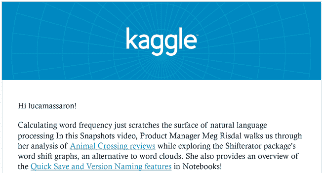

<title>Chapter_13</title>

# 13

# 创建您的项目和想法组合

参与 Kaggle 有它的好处:在这四个领域取得好成绩，并因此在其他 ka ggle 人的尊重中排名靠前，肯定会带来满足感和成就感。然而，你在 Kaggle 上的经历也有超出 Kaggle 的影响，可以帮助推进你的职业生涯。它不仅仅是你从参加比赛中获得的经验，对你以前从未做过的数据进行实验，或者用新技术重复实验；这也是你与其他数据科学家建立的联系，以及你可能从公司获得的关注。

虽然 Kaggle 没有被很多公司完全认可为一种资格，但你在比赛中所做的工作可以展示你的能力，并帮助你脱颖而出。在这一章中，我们将探索如何通过适当的方式在 Kaggle 和其他网站上展示你的作品来脱颖而出。我们将讨论以下主题:

*   与 Kaggle 一起构建您的投资组合
*   在 Kaggle 之外安排您的在线展示
*   监控竞争动态和时事通讯

在下一章，我们将通过探索 Kaggle 如何通过增强你的职业网络和为你提供职业机会来直接影响你的职业生涯来结束这本书。

# 与 Kaggle 一起构建您的投资组合

Kaggle 声称是数据科学的*之家，这一点必须从的角度来看。正如我们已经详细讨论过的，Kaggle 向所有愿意根据给定的评估指标，在预测任务中找出最佳模型的人开放。*

没有基于您在世界上的位置、您的教育或您在预测建模方面的熟练程度的限制。有时也有本质上不具有预测性的竞赛，例如，强化学习竞赛、算法挑战和分析竞赛，这些竞赛不仅面向数据科学家，还面向更多受众。然而，根据指标从数据中做出最佳预测是 Kaggle 竞赛的核心目的。

相反，真实世界的数据科学有许多方面。首先，您的首要任务是解决问题，对您的模型进行评分的标准只是对它解决问题的程度的或多或少的精确测量。您可能不仅要处理单个指标，还要考虑多个指标。此外，问题可以用不同的方式解决，这很大程度上取决于你如何表述它们。

至于数据，您很少得到关于您必须使用的数据的规范，并且您可以修改任何现有的数据集来满足您的需要。如果需要，有时您甚至可以从头开始创建自己的数据集。没有迹象表明如何把数据放在一起或处理它。解决问题时，您还必须考虑:

*   技术债务
*   解决方案随时间推移的可维护性
*   运行解决方案的时间和计算成本
*   模型工作的可解释性
*   对营业收入的影响(如果现实世界的项目是商业项目，增加利润和/或降低成本是主旨)
*   不同复杂程度和抽象程度的结果交流

通常，所有这些方面都比评估指标的原始性能更重要。

**技术债务**是软件开发中比数据科学更常见的一个术语，尽管它是一个相关的术语。对于技术债务，您应该考虑为了更快地交付项目您必须做的任何事情，但是您将不得不以更高的成本重新做一次。大卫·斯卡利*和其他谷歌研究人员撰写的经典论文*机器学习系统中隐藏的技术债务*应该会启发你这个问题与数据科学的相关性:[https://proceedings . neur IPS . cc/paper/2015/file/86 df 7 dcfd 896 fcaf 2674 f 757 a 2463 EBA-paper . pdf](https://proceedings.neurips.cc/paper/2015/file/86df7dcfd896fcaf2674f757a2463eba-Paper.pdf)*

并非所有这些专业知识都可以通过 Kaggle 竞赛来补充。大部分应该通过在企业环境中的直接实践和经验积累来获得。然而，Kaggle 竞赛附带的知识和技能并没有完全脱离我们上面讨论的许多考虑因素，它们是许多企业级数据科学流程的良好补充。通过在 Kaggle 上竞争，你会接触到不同类型的数据和问题；你需要执行广泛的特征工程和模型假设的快速迭代；您还必须设计一些方法，使用常见的开源软件包将最先进的解决方案组合在一起。这是一套很有价值的技能，应该在你这边推广。最好的方法是建立一个**作品集**，一个基于 Kaggle 竞赛和来自 Kaggle 的其他资源的你的解决方案和作品的集合。

为了从 Kaggle 竞赛中建立一个投资组合，你可以采取多种方法。最简单的方法是利用 Kaggle 提供的工具，尤其是数据集、笔记本和讨论。


吉尔伯托·蒂埃里茨

【https://www.kaggle.com/titericz 

在我们继续之前，我们在与 *Gilberto Titericz* 的访谈中讨论了 Kaggle 带来的职业机会。他是比赛和讨论中的大师级人物，前排名第一，目前是 Kaggle 比赛金牌总数的第一名。他也是 NVIDIA 的高级数据科学家，不久前在 Wired 上发表了一篇关于该主题的文章([https://www . Wired . com/story/solve-things-tough-Data-problems-and-watch-job-offers-roll-in/](https://www.wired.com/story/solve-these-tough-data-problems-and-watch-job-offers-roll-in/))。

你最喜欢哪种比赛，为什么？从技术和解决途径来说，你在 Kaggle 上的特长是什么？

*自从我在 2011 年开始在 Kaggle 上比赛以来，我更喜欢使用结构化表格数据的比赛类型。我在 Kaggle 中使用较多的技术是分类特征的目标编码(有无数种方法可以出错)和叠加集成。*

你是如何对待一场 Kaggle 比赛的？这种方法与你在日常工作中的做法有什么不同？

*Kaggle 是机器学习的好去处。与现实项目的主要区别在于，在 Kaggle 中，我们已经很好地定义和格式化了问题，创建了数据集，构建了目标变量，并选择了度量标准。所以，我总是和 EDA* *开始一场 Kaggle 比赛。* *理解问题，了解数据集，是比其他玩家更有优势的关键之一。之后，我花了一些时间来定义一个合适的验证策略。这对于正确验证您的模型以及与 Kaggle 对私有测试集评分的方式保持一致非常重要。除了使用分层 Kfold 适用于大多数二进制分类问题这一事实之外，我们还必须评估是否必须使用分组 Kfold 或基于时间的分割，以便* *正确验证，避免过度拟合，并尽可能模仿私有测试集。之后，花一些时间进行特征工程和超参数优化的实验是很重要的。此外，我总是用至少一个梯度增强树模型和一个基于深度学习的方法来结束比赛。这种不同方法的混合对于增加预测的多样性和提高竞争指标非常重要。*

Kaggle 对你的职业生涯有帮助吗？如果有，如何实现？

是的，Kaggle 是我改变职业方向的主要原因。直到 2016 年，我一直是一名电子工程师，由于从 2011 年开始我在竞赛中学到的一切，我能够转向数据科学领域。Kaggle 帮助我理解了机器学习的概念，并应用了我从理论中学到的一切。此外，Kaggle 是一个很好的实验场所，您可以下载一个数据集并使用它从数据中提取尽可能多的信息。那种，再加上竞争环境，让学习编码和机器学习变得完美，同时也变得上瘾，让你越来越想学。赢得一些比赛让你的名字在排行榜上名列前茅，这对任何人的职业生涯都是无价的。世界各地的猎头都在 Kaggle 寻找合适的职位，从竞争中获得的知识和经验可以促进任何职业发展。

多亏了 Kaggle，你是如何建立起自己的投资组合的？

一旦我加入 Kaggle，我花了几年时间学习所有的技术、算法和技巧，以从数据中提取更多的信息，并尽可能提高指标。高精度是大多数比赛的主要目标，但是仅仅依靠运气几乎不可能做到这一点；当目标是赢得比赛或至少在金牌区结束比赛时，知识和经验起着很大的作用。我在 Kaggle 比赛中获得的奖牌数就是我的作品集；到目前为止(2021 年 11 月)是 58 金 47 银，这很好地总结了我从 Kaggle 得到的 ML 经验。考虑到每场比赛至少进行 1 个月，这超过了连续 105 个月的比赛经验。

以你的经验来看，没有经验的 Kagglers 经常会忽略什么？你现在知道了什么，你希望在你刚开始的时候就知道？

*新手往往* *忽略了一个恰当的验证策略。这不仅仅发生在卡格尔。我看到世界各地的数据科学家都在构建模型，却忽略了实验理论中最重要的一点。在设置适当的验证策略时，没有通用的规则，但是数据科学家必须考虑模型在未来的使用方式，并尽可能地进行验证。*

你在过去的比赛中犯过什么错误？

*几个错误；不可能一一列举。我可能已经犯了所有可能的错误组合。错误的好处是你可以从中吸取教训。一旦你犯了一个错误，你发现了它，很可能你不会再犯。人们在 Kaggle 中犯的主要错误是相信排行榜分数，而不是他们的本地验证分数。过度适应排行榜是 Kaggle 中的一个常量，这是与现实世界的主要区别。在一个真实的项目中，我们必须建立一个我们可以信任的强大的验证策略，因为在现实世界中，模型将在真实数据上进行测试，并且您只有一次机会达到目标，而不是每天多次提交。*

对于数据分析和机器学习，你有什么特别推荐的工具或库吗？

*几年前，我会推荐 R，但是考虑到 Python 在 ML 领域的发展速度以及它在生产中的通用性和易用性，我建议任何开始学习 ML 的人学习它。就表格数据的库而言，我推荐 pandas 进行操作，如果你想要速度，那么使用 cuDF(pandas 的 RAPIDS.ai GPU 版本)。对于 EDA，我建议将 DataFrame 与 Seaborn 或 Matplotlib 库一起使用，对于机器学习 Scikit-learn、SciPy、cuML (GPU)、XGBoost、LightGBM、CatBoost 和 PyTorch。请记住，使用原始特性构建一个简单的 XGBoost 模型速度很快，可以为您提供一个很好的基准来与其他模型进行比较。*

当一个人参加比赛时，他应该记住或做的最重要的事情是什么？

*参加 Kaggle 比赛并提交公共笔记本很容易，但在黄金区完成比赛却极具挑战性。因此，最重要的事情，至少对我来说，是要记住，独立于最终排名，我们应该使用 Kaggle 来获得乐趣，并尽可能多地从讨论论坛、公共笔记本，甚至从截止日期后描述他们的想法和工作的获奖者的帖子中学习。*

*还要记住的是，竞争的赢家不仅仅是复制其他人正在做的事情，而是跳出框框思考，提出新颖的想法、策略、架构和方法。*

你使用其他比赛平台吗？他们和 Kaggle 相比如何？

*我在其他比赛平台上赢过几个* *的比赛，但和 Kaggle 相比主要区别是用户数量。截至 2021 年 11 月，Kaggle 拥有 17.1 万活跃用户，这使得论坛、笔记本和数据集交互在内容方面更加丰富。此外，Kaggle 提供了一些独特的东西:笔记本电脑，你可以使用谷歌服务器免费编写和运行代码，如果你没有好的硬件，这可能是无价的。*

## 利用笔记本和讨论

除了排名本身，笔记本也是让你在 Kaggle 上受到关注的方式，因为它们同时展示了你如何解决问题，如何提出想法，以及如何编写代码。笔记本被认为是参与者之间轻松、公开地分享解决方案和想法的一种方式，是展示雇主所欣赏的能力的最重要工具(仅次于排名)。

事实上，近年来数据科学领域最重要的变化之一是从杰出人才(独角兽数据科学家)的游戏转变为团队游戏，数据科学家必须相互合作并与其他部门合作，以确保项目的成功。因此，在招聘过程中，公司通常更关心你是否能够交流想法和结果，以及以干净有效的方式编码。

在上一节中，我们讨论了现实世界的项目如何需要更广泛的技能，从处理技术债务到设计成本有效的解决方案。你仍然可以在 Kaggle 上展示这些技能，即使它们不会让你赢得一场比赛。笔记本是最好的工具。

有关 Kaggle 笔记本的介绍，请参考*第 3 章*、*使用 Kaggle 笔记本工作和学习*。

你会在 Kaggle 上找到不同类型的笔记本。作为一个很好的近似，我们可以将它们分为四类:

*   竞赛中排名的解决方案和想法
*   **探索性数据分析** ( **EDA** )对数据进行分析
*   解释机器学习模型或数据科学原理的教程
*   来自论文或其他原始解决方案的模型的新实现

这些都可以通过一系列有趣的技能为你提供优势。如果竞赛的解决方案和想法是展示您知道如何解决数据科学中复杂问题的经典方式，那么其他三个可以向世界展示您可以:

*   从数据中操纵、表示和提取视觉和非视觉洞察(EDA)，这是一项在从科学研究到商业的每个环境中都被认为非常重要的技能
*   开展数据科学教育，为教育、指导和开发人员宣传中的角色打开大门
*   将研究转化为实践，这是一项关键技能，因为数据科学(特别是深度学习)的创新每天都在出现，需要快速转化为工作解决方案

即使你在 Kaggle 比赛中排名不高，或者没有惊人的解决方案可以展示，但如果你能以最好的方式推广它们，这另外三种笔记本(EDA、教程和纸质实现)可以在现实世界中为你提供机会。要做到这一点，你需要了解如何编写可读和有趣的笔记本，这是你从实践和经验中学到的东西。既然这是一门艺术，我们的建议是向他人学习，尤其是向那些在笔记本用户排名中名列前茅的笔记本大师们学习。

我们建议你看看他们开发了什么样的笔记本，他们如何使用图形安排他们的工作，他们如何构建他们的代码，然后，最后，根据你的技能和兴趣，尝试模仿他们的一个笔记本。我们还建议你不要把成功的机会仅仅押在代码和图表上，还要押在你所陈述的故事上。无论你是在展示一个解决方案，教学，还是在 TensorFlow 中实现一个神经架构，你如何用文字解释笔记本的细胞在留下持久的积极印象方面非常重要。

除了浏览高排名者的笔记本，还有一种方式可以获得关于最近出现在 Kaggle 上的不太主流但仍然精雕细琢的笔记本的通知。天体物理学家和狂热的 Kaggle 用户头或尾，*马丁·亨策*([https://www.kaggle.com/headsortails](https://www.kaggle.com/headsortails))在论坛上发布了每周一期的*本周笔记本:隐藏的宝石*帖子，这是一组最有趣的笔记本。目前，已经有超过 100 卷，作者继续在 Kaggle 上搜索任何可能证明是有趣的东西。如果你想了解关于酷炫笔记本的最新消息，只需关注马丁·亨策在 Kaggle 上的个人资料，或者查看他是否不时在自己的讨论下发表了新的东西。

如果你喜欢翻看笔记本寻找想法并从中学习，我们会不厌其烦地强调你不应该盲目抄袭他人的作品。Kaggle 上有很多笔记本，经常会有人复制一个，做一些小改动，把笔记本重新呈现给其他 ka ggle 人，就好像这是他们自己的原创想法一样。习惯上也是从笔记本中挑选一个函数或部分代码，然后插入到你自己的程序中。在这两种情况下，请记住总是引用来源和作者。如果你不能追溯到最初的作者，甚至参考你找到你使用的代码的最后一个笔记本就足够了。虽然展示的主要目的是展示您自己的努力和技能，但认识到您的代码的某些部分或某些想法来自其他地方也是非常重要的。除了是对你的同事尊重的一种表现外，来源归因强调你有足够的知识去认可别人的努力和发明，并且你知道如何在自己的工作中运用它们。

在一个次要的方面，Kaggle 论坛上的讨论可以帮助你获得数据科学和软件开发中特定角色的关注。最初，Kaggle 上的讨论只是为了与组织者交流，或者询问关于比赛本身的紧迫问题。在比赛结束时，参与者很少会觉得有必要展示或讨论他们的解决方案。然而，自从讨论获得了他们自己的用户排名和精通等级，你就可以在论坛上找到更多的信息。

参考*第 4 章*、*利用论坛*，了解关于 Kaggle 的讨论介绍。

根据我们的经验，关于 Kaggle 的讨论可以分为四类:

*   竞赛解决方案，详细解释(有时借助相关笔记本)一个团队如何在私人排行榜上取得特定位置
*   在比赛中提供帮助并解释要求
*   感谢、赞美和闲聊
*   帮助和指导其他竞争对手的帖子，向他们解释事情

我们观察到，在最后一种类型的帖子中表现出色并因此受到广泛关注可以帮助您实现开发人员倡导者的角色，特别是如果您还有其他活跃的渠道与您的数据科学家同事进行互动(例如，Twitch 或 YouTube 渠道、Twitter 帐户或中型博客)。

随着大公司和初创公司中开发倡导角色的增长，对擅长在其项目中帮助其他数据科学家和开发人员的专家有着重要的需求。如果你想了解更多关于这个角色的信息，下面这篇关于 [draft.dev](https://draft.dev) 的文章很有解释力，也很详尽:[https://draft.dev/learn/what-is-a-developer-advocate](https://draft.dev/learn/what-is-a-developer-advocate)。

## 利用数据集

Kaggle 竞赛经常被批评为呈现的数据已经被清理过，安排得很好，而且远不能代表现实世界中的数据。我们的观点略有不同；我们发现 Kaggle 在比赛中展示的数据也可能非常混乱或嘈杂。有时，提供的数据在质量和数量上实际上不足以获得高分，你需要在互联网上寻找额外的数据。

Kaggle 在数据科学项目中遗漏的数据是在有组织的存储库和文件中收集和收集数据的过程，在现实世界的设置中，该过程是不可能标准化的，因为它因公司和问题而异。现实世界中的数据处理大部分应该在现场学习。

将数据集引入 Kaggle 的目的是缓解 Kaggle 只是专注于建模问题的想法。Kaggle 数据集在这个意义上非常有用，因为它们允许您创建和上传自己的数据，并记录要素及其值；它们还要求您通过计划更新或完全替换数据的频率来管理数据。

参考*第 2 章*、*用数据集组织数据*，了解 Kaggle 数据集的介绍。

更有趣的是，在 Kaggle 数据集中，你也有机会附上使用 Kaggle 笔记本建立的不同分析和模型，从你的数据或比赛中上传。这些模型可能是你在比赛中想到的作品，或者是你设计的东西，因为你仔细研究了上传的数据，发现了一组你可以用它解决的有趣问题。

此外，Kaggle 数据集为您提供了一个模板来检查伴随数据的元信息的完整性。描述、标签、许可证、来源和更新频率:这些只是一些必需的信息(用于计算可用性分数)，可以帮助任何使用你的数据的人理解如何使用它。您甚至可以(在描述或讨论中)指出数据集的任务，这些任务与您希望对其进行的工作相关。这是一个很好的方式来传达你对你上传的数据的潜在价值的充分理解。

以前，任务是 Kaggle 数据集功能的一部分，但最近它们被移除了:【https://www.kaggle.com/product-feedback/292674。然而，你可以使用数据描述和讨论来指出你所期望的数据用途。

所有这些特征使 Kaggle 数据集成为一种非常好的方式来展示你在 Kaggle 上处理问题的经验，以及总体而言，你对数据和机器学习算法的能力，因为它们允许你:

*   发布和维护数据集
*   通过任务路线图证明您已经理解了数据的价值
*   展示编码和完全工作的解决方案(因为 Kaggle 笔记本可以立即处理相同的数据，无需任何准备)，范围从数据准备到解释性数据分析到预测建模

我们强烈建议使用 Kaggle 数据集来展示您在 Kaggle 竞赛或任何其他项目中所做的工作，因为它们将您的工作与其他人的工作分开，并将数据和笔记本整合在一起。简而言之，Kaggle 数据集可以向任何人展示您已经实现的工作解决方案。但是，这也有一个缺点:您主要依赖于笔记本环境(即使您使用脚本)，这对于人们在其他环境中运行代码所必需的包和版本要求来说并不是完全透明的。

事实上，Kaggle 笔记本依赖于一个 Docker 环境([https://www.docker.com/](https://www.docker.com/))，由一个配置文件，一个**Docker 文件**设置，决定安装了哪些版本。当浏览一个笔记本时，在检查这个配置文件之前，并不能立即看出使用的是什么版本的包。为此，以及为了复制设置，Dockerfile 可以在 GitHub 上的 Kaggle 存储库中找到([https://GitHub . com/ka ggle/docker-python/blob/main/docker file . tmpl](https://github.com/Kaggle/docker-python/blob/main/Dockerfile.tmpl))，尽管它会随着时间的推移而变化，您可能需要跟踪您工作中使用的文件。

最后，除了这个方面，不要忘记，即使是对数据集及其相关笔记本的一瞥，也需要访问 Kaggle 社区。


加布里埃尔·普雷达

[https://www.kaggle.com/gpreda](https://www.kaggle.com/gpreda)

我们与 *Gabriel Preda* 进行了一次鼓舞人心的面向职业的谈话，Gabriel Preda 是 Kaggle 在数据集、笔记本和讨论方面的大师，也是 Endava 的首席数据科学家。Gabriel 拥有计算电磁学博士学位，在完全投身于数据科学之前，他从事了很长时间的软件开发工作。当他发现 Kaggle 时，他在平台上感觉很自在，并为此投入了大量时间和精力，这在专业上为他带来了回报。

Kaggle 对你的职业生涯有帮助吗？怎么会？

*Kaggle 帮助我加快了数据科学的学习曲线。在 Kaggle 之前，我四处寻找信息来源或要解决的问题，但这不是很有条理或有效的。在 Kaggle 上，我发现了一个和我兴趣相同的社区。我能够看到该领域顶级专家的工作，从他们出版的带有分析或模型的笔记本中学习，从他们那里获得见解，向他们提问，甚至与他们竞争。在我加入 Kaggle 的时候，我主要从事数据分析，但很快我开始参与竞争；这意味着学习如何构建、验证和迭代改进模型。在 Kaggle 上呆了大约两年后，我改变了我的职业；我从管理软件项目变成了全职的数据科学工作。Kaggle 也给了我一些知名度，在我现在的公司面试候选人时，他们提到他们想加入，因为他们看到我在那里工作。*

你有没有用你在 Kaggle 上做过的东西作为你作品集的一部分向潜在雇主展示过？

*我把我的 Kaggle 作品集作为潜在雇主的主要信息来源；我的 LinkedIn 个人资料指向我的 Kaggle 个人资料。此外，近年来，雇主对 Kaggle 的了解越来越多，其中一些雇主会专门询问你的 Kaggle 个人资料。也有一些潜在的雇主明确表示，他们认为 Kaggle 无关紧要。我不同意这个观点；就我个人而言，在面试候选人之前，我通常会查看他们的 GitHub 和 Kaggle 个人资料。我发现它们非常相关。一份好的 Kaggle 个人资料不仅会展示技术技能和使用某些语言、工具、技术或解决问题技能的经验，还会展示某人通过讨论和笔记本交流的能力。这是一个数据科学家非常重要的素质。*

你首先在笔记本(内核)中接触到特级大师，然后在讨论中，最后在数据集中。你能告诉我们你的旅程吗？

*我成为了第七届核仁特级大师，我的等级高达第三。大概有两年* *的时间，我认为我在内核等级中也是前 10 名。我开始编写内核主要是为了提高我对 R 语言的了解，同时分析我发现更有趣的数据集。我还试验了各种各样的技术，包括多边形剪辑、构建 Voronoi 多边形的双重网格和 2D 德劳内镶嵌。我逐渐开始专注于探索性的数据分析，然后是为数据集建立模型，然后是竞争。同样，一旦我开始更多地参与竞争，我就开始用 Python 编写用于竞争的内核。大约在同一时间，我开始注意到我的一些内核吸引了 Kagglers 的注意，主要是 upvotes 和 forks，但也有好评。我写的一些在活跃比赛中探索数据的内核，受众非常广泛，给我带来了很多金牌；因此，我达到了大师级和特级大师级。目前，我没有发布很多与竞赛相关的内核；大多数情况下，我创建与我发布的数据集相关的初始内核。*

*接下来，我还获得了特级大师级别的讨论。我从来没有预料到我会在讨论中达到这个层次。首先，我开始评论别人的内核。后来，随着我越来越多地参与比赛，我的大多数评论都在积极比赛的讨论部分，要么就这些比赛中感兴趣的话题提出问题，要么开始新的话题，例如，为比赛中的一个问题提出解决方案，或者收集资源来解决与比赛有关的各种开放问题。我想提一下我添加的一组特殊的评论。作为一名 Kaggle 内核大师(首批大师之一)，当我发现非常好的内容时，我经常会推荐新的 Kagglers 笔记本。*

*在这种情况下，我会试着找一些时间来赞美(尤其是如果内容质量好的话)作者的成就。尤其是对初学者来说，不仅要通过对他们的工作给予好评来表达你的赞赏，还要对他们的贡献给予一些积极的反馈，这可能会增强他们的信心，这样他们就会在学习上投入更多，并为 Kaggle 做出更多贡献。我喜欢这样做，希望有帮助。我曾经还整理了一份关于如何评论 Kaggle 的建议清单。这是清单:要短(但不要太短)；要具体；提供信息，而不是意见；有机会就赞美别人的工作；保持冷静，尽量乐于助人；除非有意义，否则不要在你的评论中给人加标签(例如，如果是一个讨论，你需要把你的评论发给在那条线索中给你留言的人)。*

我到达的最后一个特级大师层是在数据集中。这也是我排名最高的一级，第二。我的晋升速度很慢。我从我喜欢的东西开始。获得数据集的高姿态需要投资于数据的管理、清理和记录。如果它不是你真正喜欢的东西，你很可能不会坚持下去。我追求的东西对我来说很重要，但对更广泛的群体来说也很重要:对我的国家、我的大陆或整个世界。我发表了关于我的国家选举的数据集，以及关于欧洲各种社会、人口和经济主题的数据集。我专注于现实的主题，这些主题既相关又对社区非常重要。例如，在疫情期间，我发表了关于新冠肺炎病例的数据集，包括来自我的国家 *和世界各地的疫苗接种、检测和病毒变异。我捕获的数据不仅仅是简单的数字、表格值。文本数据，尤其是来自人们的直接贡献，为许多人提供了重要的见解。我最喜欢的数据集之一是 Reddit 帖子和评论或 Twitter 帖子(tweets)的集合，主题广泛，如疫苗神话、板球、流行病、体育赛事和政治人物。我在自动化数据收集、数据清理和数据处理脚本方面进行了大量投资。这为我节省了宝贵的时间(特别是对于频繁更新的数据集——其中一些是连续收集的，脚本每小时触发一次),但也使得更好地控制过程成为可能。每次我发布一个新的数据集，我也会写一个或多个起始内核。这些内核并不打算接触到大量的观众。我将它们创建为我的数据集的潜在用户的辅助内核，以便他们发现使用数据更容易。在许多情况下，我更喜欢保留原始数据(如我收集的数据，或从其他来源下载的数据),并包含一个用于数据清理、转换和初步分析的内核，以及这个过程的结果，以更易于访问的格式保存数据。这样，我试图在数据集中捕捉到比数据本身更多的东西；我还提供了关于数据转换技术的信息。*

# 在 Kaggle 之外安排您的在线展示

由于 Kaggle 数据集和笔记本需要一个 Kaggle 帐户，你必须考虑到，不是每个人都已经有了一个帐户，或者只是想创建一个帐户来查看你的工作。您还必须考虑更容易获得的替代方案。更常见的是，Kagglers 们选择在 GitHub([https://github.com/](https://github.com/))上使用一个项目，在媒体([https://medium.com/](https://medium.com/))以及其他发布平台上写一篇文章，或者在自己的博客上发表文章。然而，还有其他机会来提升你的工作和技能，例如:

*   在[https://deepnote.com/](https://deepnote.com/)上发布可从浏览器执行的与 Kaggle 竞赛相关的代码
*   建立一个不和谐的社区来聚集 Kagglers，比如*阿布舍克·塔库尔*的 ml space([https://discord.com/invite/4RMwz64gdH](https://discord.com/invite/4RMwz64gdH))，或者运营一个 YouTube 频道(同样来自阿布舍克·塔库尔:[https://www.youtube.com/channel/UCBPRJjIWfyNG4X-CRbnv78A](https://www.youtube.com/channel/UCBPRJjIWfyNG4X-CRbnv78A))
*   建立一个类似罗布·穆拉的*的 Twitch 频道，在那里他演示了与 Kaggle 竞赛相关的编码:[https://www.twitch.tv/medallionstallion](https://www.twitch.tv/medallionstallion)(也在 GitHub 上:[https://github.com/RobMulla/twitch-stream-projects](https://github.com/RobMulla/twitch-stream-projects))*
*   在 Kaggle news 上发布每周时事通讯，如*石原慎太郎*:[https://www.getrevue.co/profile/upura](https://www.getrevue.co/profile/upura)
*   采访卡格勒和其他数据科学专家，就像*桑雅姆·布塔尼*正在做的那样，并使用视频、播客和博客帖子广播这些采访:[https://chaitimedatascience.com/](https://chaitimedatascience.com/)(你可以浏览由*罗汉·拉奥*:[https://www.kaggle.com/rohanrao/chai-time-data-science](https://www.kaggle.com/rohanrao/chai-time-data-science)准备的包含迄今为止所有采访数据的数据集)

正如你可以推断的那样，真的有相当多的机会和媒介，通过它们你可以在 Kaggle 上传播你的工作和技能，这取决于你想要实现什么。在这一章中，我们只关注博客和 GitHub(这是最常见的选择，也是非常有效的)，但是你可以自由决定任何你认为适合你的目的的不同方法。

## 博客和出版物

写作可以是一种方式，既可以精炼你的知识——因为你需要对一个主题进行阅读才能写出来——也可以让别人了解你和你的技能。因写作而出名对你有多方面的帮助，从被招聘者和公司发现到为 Kaggle 竞赛和你更广泛的职业生活建立联系。

社交媒体(LinkedIn、Twitter 和脸书)允许你发表想法和短文，这是我们建议你利用的东西。鉴于数据科学和 Kaggle 竞赛主题需要长时间的讨论和推理，然而，最好的方法是写**长文章**，并通过博客或发布文章的网站发布。理想情况下，我们建议你协调社交媒体和你的文章之间的沟通，以便推广它们，用专门的帖子宣布它们或讨论你写作中的关键点。

让我们先来讨论一下你可以如何以及在哪里发表你的文章。

一篇关于媒体的文章，尤其是在**的媒体刊物**上，比如《走向数据科学》([https://towardsdatascience.com/](https://towardsdatascience.com/))，会得到很多关注。中型出版物是围绕一个共同主题或话题撰写的故事的共享空间，通常由多个作者撰写。作为一个网站，Medium 可以接触到广泛的读者，一些出版物因其文章质量而在数据科学社区中享有很好的声誉。一个出版物可以有一个或多个编辑来选择文章，并确保文章内容符合出版物的政策和质量水平。Medium 您可以发表文章的出版物有:

*   **走向数据科学**，如前所述([https://towardsdatascience.com/questions-96667b06af5](https://towardsdatascience.com/questions-96667b06af5))
*   **更好的编程**([https://betterprogramming.pub/write-for-us-5c4bcba59397](https://betterprogramming.pub/write-for-us-5c4bcba59397))
*   **mlearning . ai**([https://medium . com/mlearning-ai/mlearning-ai-submission-suggestions-b 51e 2b 130 bfb](https://medium.com/mlearning-ai/mlearning-ai-submission-suggestions-b51e2b130bfb))
*   【https://becominghuman.ai/write-for-us-48270209de63】变成人类()
*   **走向 AI**([https://pub . toward sai . net/submit-your-medium-story-to-oriented-AI-a4fa 7 E8 b 141d](https://pub.towardsai.net/submit-your-medium-story-to-towards-ai-a4fa7e8b141d))

这些出版物都有一个很大的优势，那就是拥有大量的读者，可能比你在社交媒体上的粉丝还多。你会得到比你想象中更多的读者，接触到公司里的人以及其他你可以交往的专业人士。

除了 Medium，这些其他网站也可能接受您的出版物:

*   **黑客正午**([https://www.publish.hackernoon.com/](https://www.publish.hackernoon.com/)):在科技博主中相当受欢迎，包含任何与科技相关的内容(相当通才)。每月有 400 万观众，如果你想接触许多技术爱好者，这是一个合适的地方。登上首页是极其困难的，也是一把双刃剑:你会得到很多关注，也会受到很多批评。
*   **dev . to**([https://dev.to/](https://dev.to/)):主要是拥有开发人员的受众(将近 80 万)，并提供关于编码的文章和教程。您的帖子应该更加关注代码的质量和效率(建模在后台)。
*   **FreeCodeCamp**([https://www . FreeCodeCamp . org/news/developer-news-style-guide/](https://www.freecodecamp.org/news/developer-news-style-guide/)):更多专注教程；人们去那里学习如何编码。它非常适合推广机器学习的课程和推广新的软件包。
*   **分析 vid hya**([https://www.analyticsvidhya.com/about/write/](https://www.analyticsvidhya.com/about/write/)):在印度相当受欢迎；它更多地围绕着解释机器学习和深度学习构建模块的文章。
*   KD nuggets([https://www.kdnuggets.com/news/submissions.html](https://www.kdnuggets.com/news/submissions.html)):数据挖掘领域最古老的出版物之一。在数据科学家和学者的老一代人中，它仍然拥有相当多的追随者(2021 年 3 月有 100 万独立访客)。

每种出版物都有优点和缺点，读者也不尽相同，所以你必须决定哪一种更适合你的内容。从浏览他们提供的出版物开始，以了解你的写作如何适应。

当然，如果你愿意，你可以使用你自己的博客。拥有自己的博客有它的好处，比如你写的东西没有广告或编辑审查。另一方面，你不能利用现有的受众，你必须努力通过在社交媒体上推广你的文章来创造一个受众。你可以在自己选择的域名上从头开始建立自己的网站，也可以在 GitHub 上创建自己的博客。

如果你决定使用 GitHub(因为它是免费的，而且你可能已经用它作为你的代码库)，这里有一个简单快速的创建 GitHub 博客帖子的指南:[http://jmcglone.com/guides/github-pages/](http://jmcglone.com/guides/github-pages/)

如果你需要更自动化的东西，使用一个平台，比如 https://github.com/fastai/fastpages 的快速页面可以简化你处理编写内容和代码示例的方式，因为它可以自动将笔记本和 Word 文档转换成博客页面并为你发布。

如果你更喜欢完全独立，建立自己的网站，这将需要更多的努力和一些费用；域名和网络空间不是免费的。在这种情况下，自我推销你的内容变得至关重要。

写你的解决方案的主要优势是讲故事的元素，因为你必须用描述和解释来伴随你的代码片段，并且你需要用比你在笔记本上能做的更冗长的方式来写。在某种意义上，你如何描述你的工作变得和你写的代码一样重要。通过调整你写作的语气，你可以接触到不同类型的观众。用一种容易理解的方式来写概念意味着你将扩大你的受众，并与更多的专业人士联系。相反，用高度技术性的方式写作会给更多可能考虑雇佣你的潜在公司留下深刻印象，尽管这会限制你获得的读者数量。

由于写作是一种非常个人化的行为，我们的提示和建议不会适用于每一种情况，我们的一般建议是事先决定你写作的目的以及你想把它传达给谁。

## 开源代码库

除了写文章和拥有一个可以指引读者的代码库之外，在 GitHub 上拥有你的代码也可以帮助你不要在你参加的每一场比赛中重新发明轮子。您可以将想要重用的代码存储在项目或**Gists**([https://docs . github . com/en/github/writing-on-github/editing-and-sharing-content-with-Gists](https://docs.github.com/en/github/writing-on-github/editing-and-sharing-content-with-gists))中，它们是可以单独访问的小代码片段。

即使把所有代码都放在 Kaggle 上可能会吸引你，但随着时间的推移，你会发现很难访问它们，甚至很难找到它们。这是因为你不能将你的 Kaggle 笔记本安排到单独的项目中；它们会以一个长列表的形式呈现，你可以根据一些属性来排序，比如投票数或者你上次运行笔记本的时间。GitHub 让你更容易找到你需要的东西并重用它。例如，您可以创建包含所有代码的脚本，然后下载并导入到 Kaggle 笔记本中，而无需复制任何内容。

在下面的例子中，我们为一个`tabular`神经网络下载并重用辅助函数:

```
!wget https://raw.githubusercontent.com/lmassaron/deep_learning_for_tabular_data/master/tabular.py

# Importing from Tabular

from tabular import gelu, Mish, mish

from tabular import TabularTransformer, DataGenerator 
```

一个`wget`命令会直接访问 GitHub 上的代码并下载到笔记本的磁盘上；之后，您可以从其中导入您需要的函数和类。要获得提供直接访问您代码的链接，您只需在 GitHub 存储库中查找包含它的文件，然后点击页面标题上的 **Raw** 按钮:


图 13.1:GitHub 上一个可视化文件的头。注意标题栏右上角的 Raw 按钮。

点击 **Raw** 按钮后，您将被带到 GitHub 上存储该文件的网址。您可以使用该网址从 GitHub 外部引用该文件。

GitHub 对于存储你可以在 Kaggle 讨论中使用的图片也很有用(因为你不能再在 Kaggle 论坛上传图片)。在图像的情况下，你不会有一个 **Raw** 按钮可以点击，但是你可以用鼠标右键点击图像，在另一个标签中打开文件；这样会有同样的效果。

GitHub 是展示你作品的另一个很好的方式，但是考虑到网站的性质(它是针对开发者的)和你可以放在上面的内容(包含代码的文件)，你应该期待一个非常技术性的观众。在公司，人力资源可能不会太深入地查看你的 GitHub 帐户，而是停留在`README.md`上，因此应该写得很好，视觉上有吸引力。另一方面，招聘经理会对你项目中的代码更感兴趣。您应该努力在文件、过程和类中包含结构良好的代码，还包括安装和复制结果所必需的指令。

你必须使用工具，比如【https://docs.conda.io/en/latest/】()或者`poetry`([【https://python-poetry.org/】](https://python-poetry.org/))来确保安装了正确的包，这样你的代码才能工作。为了给你的项目最好的结构，你可能需要类似于 https://drivendata.github.io/cookiecutter-data-science/的 T4([)。为您的项目使用一个`template`，就像 CookieCutter 提供的那样，可以让您的代码很容易地被安排到特定的目录中，并提供允许使用和理解它的文件。CookieCutter 模板将使您的项目更容易阅读、理解和维护。](https://drivendata.github.io/cookiecutter-data-science/)

最后，为了管理你的实验和数据源，你还需要一些**版本控制系统**用于正在使用的数据，而不仅仅是你的代码，例如使用**数据版本控制**(**https://dvc.org/**:[DVC](https://dvc.org/))。所有这些资源和正确运行它们所需的技能(创建您的环境、构建您的项目、版本化数据和模型)更接近于软件工程，而不是数据科学能力。它们在 Kaggle 上不那么相关——或者可以用简单的方法完成——并且需要努力和学习。然而，它们将成为你在 GitHub 上展示项目的能力的一部分，增加你给面试官留下好印象的机会。

如果你想展示你的模型，你有几个不同的选择。最简单的方法是让代码在原始笔记本上运行(只需在 GitHub 项目的`README.md`文件中放一个到 Kaggle 笔记本的链接)或者在 **Google Colab** 上运行。要让你存储在 GitHub 上的笔记本自动在 Google Colab 上运行，只需发布其域名从[github.com](https://github.com)更改为[githubtocolab.com](https://githubtocolab.com)的链接:该链接将在 Colab 中打开你的笔记本。

然而，你能准备的最令人印象深刻的展示是使用**hugging face Spaces**([https://huggingface.co/spaces](https://huggingface.co/spaces))来演示你的 Kaggle 模型如何在在线应用中使用。正如文档([https://huggingface.co/docs/hub/spaces](https://huggingface.co/docs/hub/spaces))中所解释的那样，空间是一种主持机器学习演示和创建在线作品组合的简单方式。它们被限制为 16GB 的 RAM 和 8 个 CPU 内核，但它们是免费的，足以演示您的模型如何在专用应用程序中运行。你可以在 HuggingFace 远程机器上安装你的依赖项，用 GitHub 同步代码和模型，或者用`Streamlit`([https://streamlit.io/](https://streamlit.io/))或者`Gradio`([https://gradio.app/](https://gradio.app/))构建一个 app 。

例如，*哈佛大学([https://www.kaggle.com/rashmibanthia](https://www.kaggle.com/rashmibanthia))的 Kaggle 专家兼助教 Rashmi Banthia* 发布了她的模型演示，该模型来自*裁缝细胞实例分割*竞赛:[https://hugging face . co/spaces/Rashmi/Cell-Instance-Segmentation-mm detection](https://huggingface.co/spaces/rashmi/Cell-Instance-Segmentation-MMDetection)。通过在实时演示中展示你的模型和一些例子，你甚至可以立即向非机器学习的观众传达它的有效性。

# 监控竞争动态和时事通讯

现在，你可以看到展示你在 Kaggle 上的工作是很重要的，这样你就可以向世界传达你对某些类型的模型和数据问题的兴趣。从这个角度来看，重要的是你要时刻意识到竞争所提供的机会。

主要方法是经常访问 Kaggle 网站，并同意接收他们的电子邮件。您可以在**通知和电子邮件设置**页面的个人资料中设置此选项，您可以同意在网站上和通过电子邮件接收通知。您还可以选择接收包含 Kaggle 新功能和新举措提示的电子邮件，以及最近推出的竞赛新闻:



图 13.2:一封 Kaggle 电子邮件宣布了 Kaggle 团队的一系列视频

如果你是一个 Twitter 用户，你会发现关注几个个人资料对你了解 Kaggle 上的新东西很有用。**Kagoole**([https://twitter.com/kagoole](https://twitter.com/kagoole))是一个网络应用程序，可以通知你关于新的比赛，并且在其 Heroku 应用程序表单([https://kagoole.herokuapp.com/](https://kagoole.herokuapp.com/))中，为你提供过去比赛的解决方案。是由【https://github.com/Doarakko/】()创作的。你可以关注的另一个 Twitter 个人资料是**他是 Kerneler 吗？**([https://twitter.com/HKerneler](https://twitter.com/HKerneler))，由`Regonn`([https://github.com/regonn/](https://github.com/regonn/))创造，它告诉你在每场活跃的 Kaggle 比赛结束之前还剩多少时间。

从*第一章*我们知道，Kaggle 并不是唯一举办数据科学竞赛的组织。为了更好地跟踪 Kaggle 和其他数据科学竞赛网站上实际发生的事情，我们建议使用像[https://mlcontests.com/](https://mlcontests.com/)或[https://ods.ai/competitions](https://ods.ai/competitions)这样的网站，这些网站监控 Kaggle 上所有正在进行的竞赛，以及像 AICrowd 和 DrivenData 这样的其他平台。例如，[mlcontests.com](https://mlcontests.com)为你提供每场比赛的奖品、截止日期和有用链接的信息。

它还提供了云 GPU 在性能、机器和价格方面的比较。您可以注册您的电子邮件，并直接在您的收件箱中接收这些信息。

# 摘要

在本章中，我们讨论了如何展示你的工作，以及这对你的职业发展有何价值。它有助于您展示能力，虽然(当然)没有涵盖您的数据科学知识和经验的全部范围，但仍然是一项巨大的资产。

为了展示你的作品，你可以使用 Kaggle 资源，也可以使用外部资源。Kaggle resources 为您提供了一个集成的环境，如果您手头上有所有的东西，那么您可以很容易地设置好它。外部资源(媒体出版物、GitHub、HuggingFace Spaces 等等)更广为人知，也更容易被大多数招聘人员、人力资源官员和招聘经理所获取，因为他们经常使用这些资源。

在下一章中，我们将通过谈论网络建设以及如何利用你的 Kaggle 努力来获得面试机会，来结束我们对 Kaggle 竞赛为你提供的机会的讨论。

# 加入我们书的不和谐空间

加入该书的 Discord workspace，每月与作者进行一次*向我提问*会议:

https://packt.link/KaggleDiscord

