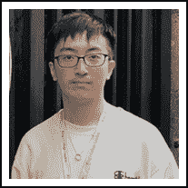
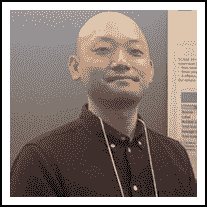
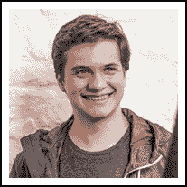
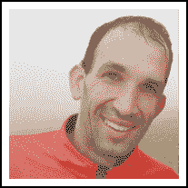
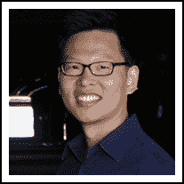

<title>Chapter_14</title>

# 14

# 寻找新的职业机会

在前一章介绍了如何在比赛中更好地突出你的工作和成就后，我们现在将总结一下 Kaggle 如何对你的职业生涯产生积极影响。这最后一章讨论了利用你所有的努力来寻找新的职业机会的最佳方法。我们希望你现在已经有了所有之前描述的工具(你的 Kaggle 讨论、笔记本、数据集，以及一个 GitHub 账户，展示了相当多的从 Kaggle 衍生的项目)，所以本章将转向更软的方面:如何建立关系网，以及如何向招聘人员和公司展示你的 Kaggle 经验。

众所周知，网络带来了许多可能性，从公开论坛上没有出现的新工作机会，到在你不擅长的数据科学问题上有人可以依靠。Kaggle 上的网络主要与比赛期间的团队合作以及在聚会和 ka ggler 组织的其他活动中建立的联系有关。

当谈到工作机会时，正如我们以前经常重复的那样，Kaggle 并不是人力资源和招聘经理用来选择候选人的公认来源。有些公司确实会很好地考虑你的排名和成就，但那是特例，不是普遍规律。一般来说，你应该预料到你的卡格尔经历会被忽视，有时甚至会受到批评。然而，我们的经验告诉我们，你在 Kaggle 上学习和实践的东西是非常有价值的，可以通过展示你的编码和建模工作来推广，也可以通过谈论你单独工作或在团队中工作的经历来推广。

在这里，我们将涵盖:

*   与其他竞争数据科学家建立联系
*   参加 Kaggle Days 和其他 Kaggle 聚会
*   被发现和其他工作机会

# 与其他竞争数据科学家建立联系

人脉对于找工作来说至关重要，因为他们可以帮助你在机会公开之前和那些可能知道机会的人取得联系，并开始寻找潜在的候选人。近年来，Kaggle 越来越成为一个你可以与其他数据科学家联系、合作和交朋友的地方。在过去，比赛不会在论坛上引起很多交流，团队在全球排名中受到严重惩罚，因为比赛分数在团队成员中平均分配。排名的提高(见[https://www.kaggle.com/general/14196](https://www.kaggle.com/general/14196))帮助许多卡格勒人更好地看待合作。

如果你已经认识了其他团队成员，并且已经有了分配任务和远程协作的既定方法，那么在 Kaggle 比赛中组队会很好。在这些情况下，每个团队成员都已经知道如何通过以下方式进行协作:

*   承担团队成员同意的部分实验
*   与另一名团队成员合作构建解决方案
*   根据他们的技能和经验探索新的解决方案
*   准备模型和提交，以便它们易于堆叠或混合

然而，如果你是团队的新手，你会发现加入一个团队或者自己组织一个团队都很困难。除非你有联系人，否则很难与排行榜上的其他人取得联系。首先，并不是所有的人都想组队，因为他们更喜欢独自竞争。此外，其他竞争对手中的一些可能对组队感兴趣，但会过于谨慎而不接受你的提议。当与你不认识的卡格勒人组成一个团队时，有几个问题:

*   进入团队的人不会给团队带来任何价值
*   进入团队的人实际上不会合作，而只是一个吃白食的人
*   进入团队的人已经违反(或将违反)Kaggle 规则，这将导致整个团队被取消资格
*   进入团队的人实际上对刺探和泄露信息给其他团队感兴趣

这些情况在比赛中大多是病态的，你应该意识到这些是许多人在评估是否第一次与另一个 Kaggler 合作时的常见考虑。你只有把自己呈现为在 Kaggle 有强大背景的人，才能打消这些感知到的潜在问题；也就是单独参加过一些比赛，特别是发表过笔记，参与过讨论的人。这将增加你的提议的可信度，更有可能让你被团队接受。

当你最终加入一个团队时，在团队成员之间建立**高效且专注的沟通方式**是很重要的(例如，通过建立一个关于懈怠或不和的渠道)。同样重要的是，就涉及以下两方面的日常操作达成一致:

*   决定如何分配你的实验工作。
*   决定如何使用每日提交的内容，这些内容数量有限(通常是团队中发生冲突的原因)。最后，只有团队领导选择最后的两个提交，但到达那里的过程自然涉及讨论和分歧。准备向你的队友展示你的本地交叉验证策略和结果，向他们展示你为什么决定将某些提交作为最终结果。

当你以积极的态度在团队中一起工作时，你肯定会赢得其他团队成员的尊重和信任。在未来的比赛中，你可能会发现与同样的人再次组队更容易，或者在他们的帮助下加入他们所属的不同团队。

您将在 Kaggle 上遇到并与之共事的人包括数据科学家、数据爱好者、学生、领域专家等等。下面，我们采访了各种各样的 Kaggler，他们描述了自己的日常工作以及 ka ggle 如何融入他们的生活。

张怡润

【https://www.kaggle.com/gogo827jz 

张怡润是伦敦大学国王学院四年级博士生。一位笔记本和讨论大师，他是*简街市场预测*竞赛([https://www.kaggle.com/c/jane-street-market-prediction](https://www.kaggle.com/c/jane-street-market-prediction))中获胜团队的一员。

你能给我们介绍一下你自己吗？

*我的研究领域是应用机器学习算法解决现代无线通信网络中的挑战性问题，如时间序列预测、资源分配和优化。我还参与了研究人工智能隐私、联邦学习以及数据压缩和传输的项目。*

*除了日常的博士研究，我已经活跃在 Kaggle 上快两年了，从我博士的第二年开始。我在 Kaggle 上参加的第一个比赛是*即时满足*，在比赛中我利用了来自* `sklearn` *库的多种机器学习和统计方法。这个比赛帮助我对 Kaggle 比赛的机器学习建模管道有了一个大致的了解。*

*我一直在 Kaggle 上通过笔记本和讨论帖子与社区积极分享我的知识，现在我是 Kaggle 笔记本和讨论大师。通过在论坛上与他人分享和讨论，我获得了宝贵的反馈和新知识，这也帮助我最终成为了最近一场 Kaggle 比赛的获胜者。*

告诉我们一些你赢得的比赛。

简街市场预测真的很难。原因是很难建立一个强大的交叉验证(CV)策略，许多人只是使用公共排行榜作为 *验证集。他们在数百个时期内训练神经网络，而没有使用验证策略来过度适应公共排行榜。我们的团队努力保持我们自己的 CV 战略，并在动荡中幸存下来。*

你在 Kaggle 上的做法与你在日常工作中的做法有多大不同？

*Kaggle 比赛有* *跟我日常的博士研究很不一样。前者非常紧张，包含即时反馈，后者是一个长期过程。但是，我发现我从 Kaggle 竞赛中学到的新知识和方法论在我的博士研究中也非常有用。*

秋山修

[https://www.kaggle.com/osciiart](https://www.kaggle.com/osciiart)

Osamu Akiyama，又名 OsciiArt，是一名卡格勒，他的日常工作不涉及数据科学。他是大阪大学医院的医学博士和竞赛大师。

你能给我们介绍一下你自己吗？

*我是大阪大学医院的二年级住院医师* *。我在京都大学获得了生命科学硕士学位。在我为一家制药公司从事研发工作后，我转到了大阪大学医学院，并获得了去日本的行医执照。*

*因为被 AlphaGo 震撼，开始自学数据科学和 AI。我开始参与 Kaggle，以便学习和测试我在数据科学和人工智能方面的技能。我的第一场比赛是 2017 年的* NOAA 渔业斯特勒海狮数量统计*。我经常参加高尔夫球比赛，已经获得了三枚金牌。*

Kaggle 对你的职业生涯有帮助吗？

*因为我不是* *受过信息科学教育，所以当我申请在一家人工智能公司实习和申请成为人工智能实验室的短期学生时，我用我在 Kaggle 的结果来展示我的技能。由于我只是一名医学博士，我从未在我的主要工作中使用过我的数据科学技能。不过，多亏了我的 Kaggle 成果，我有时也有机会参与医学数据研究。*

你最喜欢的比赛类型是什么，为什么？

*我最喜欢的一种比赛是* *医学数据比赛。我喜欢尝试用我的医学知识从医学数据中发现一些真知灼见。*

你是如何对待一场 Kaggle 比赛的？

*我喜欢寻找一种* *大多数其他竞争者不知道的竞赛数据的秘密特征，或者尝试一种根据竞赛数据的特征定制的独特方法。实际上，这种方法在大多数情况下并不成功，但尽管如此，尝试一下还是很有趣的。*

告诉我们你参加的一个特别有挑战性的比赛，以及你用什么样的洞察力来完成这个任务。

*我想在* *提一下*Freesound Audio Tagging 2019*，这是一个针对声音数据的多标签分类任务。训练数据由少量可靠标记的数据(干净数据)和大量带有不可靠标记的数据(有噪声的数据)组成。此外，在精选数据和噪声数据中的数据分布之间存在差异。为了解决这个困难，我们使用了两种策略。第一种是多任务学习，在这种学习中，对嘈杂数据的训练被视为与干净数据不同的任务。第二种是伪标记(一种半监督学习)，其中用来自用干净数据训练的模型的预测标签来重新标记有噪声的数据。*

你使用其他比赛平台吗？他们和 Kaggle 相比如何？

*我用 Signate(*[https://signate.jp/](https://signate.jp/)*)和 guruguru(*[https://www.guruguru.science/](https://www.guruguru.science/)*)。这些是日本数据科学* *竞赛平台。他们没有 Kaggle 这样的平台大；这些平台上的比赛一般使用比 Kaggle 更小的数据集，因此更容易参与。还有，有时候会有和 Kaggle 上不一样的有趣的比赛。*

米克尔·博贝尔-伊里扎尔

[https://www.kaggle.com/anokas](https://www.kaggle.com/anokas)

Mikel Bober-Irizar，又名 Anokas，是一名竞赛大师，是笔记本和讨论的大师，也是 ForecomAI 的**机器学习科学家**。他还是剑桥大学计算机科学专业的学生，也是 Kaggle 上最年轻的特级大师。

你能给我们介绍一下你自己吗？

*我于 2016 年加入 Kaggle，当时我是* *14 岁，我不知道自己在做什么——我刚刚在网上读到过机器学习，这似乎很酷。在我最初的几场比赛中，我从论坛上复制别人的公共代码，并对它们做一些小的调整。在几场比赛中，我慢慢理解了事情是如何运作的，并在努力爬上排行榜的激励下——直到我开始取得良好的进展，最终在当年晚些时候的 Avito Duplicate Ads 比赛中获得第二名。*

*从那以后，我参加了 75 场比赛，在 2018 年成为最年轻的比赛特级大师和第一位三级大师。我是萨里大学的访问研究员，现在在剑桥大学学习计算机科学，在那里我也从事机器学习和安全方面的研究。*

你最喜欢哪种比赛，为什么？在技术和解决方法方面，你在 Kaggle 上的专长是什么？

*我真的很喜欢有很多* *功能工程机会的比赛，以及那些有很多不同类型数据的比赛，这让你在解决问题的方法上真正有创造力——这比每个人都必须采取相同的方法而你却在争夺最后一个小数位的比赛有趣得多。*

我不会说我在方法上有专长，但我喜欢尝试不同的东西。

告诉我们你参加的一个特别有挑战性的比赛，以及你用什么样的洞察力来完成这个任务。

*几年前，谷歌举办了一场* *比赛，旨在检测图像中的物体以及它们之间的关系(例如，“餐桌上的椅子”)。其他团队花了很长时间采用传统的方法和训练大型神经网络来解决这些任务，而我没有知识或计算能力与之竞争。我选择从一个不同的角度来解决这个问题，并使用一些简洁的启发法和树模型，仅用了几个小时的工作，我就获得了第七名。*

Kaggle 对你的职业生涯有帮助吗？

*Kaggle 给我带来了很多* *的机会，这是一个可以让我了解的非常棒的社区。在我参加的所有比赛中，我遇到了很多人，学到了很多东西。但 Kaggle 也是我最初进入机器学习的原因——否则我不认为我会在这个领域。所以是的，帮助很大。*

你在过去的比赛中犯过什么错误？

*很容易得到一个复杂的* *解决方案，你不能从头开始复制，因为你可能会在最终的解决方案中使用各种版本的代码和中间数据集。然后，如果你足够幸运地赢了，向宿主交付工作代码会非常有压力！如果你做得很好，确定你的解决方案并清理你的代码是个好主意。*

*还很容易出现这样的情况，即对不同的模型使用不同的验证集，或者不保留验证预测，这可能会使它们很难进行比较，或者在竞争的后期进行元学习。*

对于数据分析或机器学习，你有什么特别推荐的工具或库吗？

*我真的很喜欢 XGBoost，它仍然倾向于* *在表格数据上击败神经网络(以及它更新的表亲 LightGBM)。SHAP 非常擅长解释模型(即使是复杂的模型)，这可以让你对下一步该做什么有更多的了解。*

当一个人参加比赛时，他应该记住或做的最重要的事情是什么？

我认为重要的是不要在实施极其复杂的解决方案时陷入困境，而是尝试制定渐进的解决方案。

现在的比赛比我刚开始的时候难多了，所以看看别人的代码(很多人在比赛期间公开这些代码)并试着向他们学习是个好主意。你可能想考虑加入一个有其他卡格勒人的团队:团队中的比赛对我来说是最有趣的比赛，并且一直是一个奇妙的学习经历。

最后:大多数想法都不可行——如果你想赢得比赛，你需要坚持不懈，不断尝试！

Kaggle 在之前三位受访者丰富的生活和职业生涯中肯定是有影响力的，他们才刚刚开始。下面我们采访两位 Kaggler，他们现在在各自的公司担任高级职位，他们也因为 ka ggle 而经历了漫长而富有成效的旅程。

丹·贝克尔

[https://www.kaggle.com/dansbecker](https://www.kaggle.com/dansbecker)

首先，我们有请 Dan Becker，一位笔记本电脑大师，DataRobot 的决策智能产品副总裁。卡格尔在丹的职业生涯中扮演了重要的角色。

你能给我们介绍一下你自己吗？

我第一次尝试使用机器学习是在 2000 年的一家 3 人初创公司，当时我们试图使用神经网络来帮助零售商优化他们为易贝上的商品设定的保留价格。我们不知道我们在做什么，我们悲惨地失败了。

到 2002 年，我确信机器学习永远不会成功。我获得了经济学博士学位，并在美国政府找到了一份经济学家的工作。我想搬到科罗拉多，但是那里没有很多寻找经济学博士的工作。所以我想找一份不那么学术的证书。

*2010 年，我在报纸上看到一篇关于*遗产健康奖*的文章。这是一个早期的卡格尔比赛，奖金为 300 万美元。我仍然相信，像我作为经济学家使用的更简单的模型会比花哨的机器学习模型给出更好的预测。所以我开始参加比赛，认为这次比赛的好成绩将是我在科罗拉多州找到一份有趣工作所需的凭证。我第一次提交参赛作品不是最后一名，但也很接近了。当我看到我的模型被评分，然后看到其他人都远远领先于我时，我的心沉了下去。我一度放弃了在比赛中取得好成绩的任何希望，但我甚至没有达到平均水平，这让我感到沮丧。*

为了登上排行榜，我把所有的夜晚和周末都花在了比赛上。我重新学习了机器学习，自从我第一次尝试以来的 10 年里，它已经取得了很大的进步。我会学习更多，每天上传一个新的模型。这花了很多时间，但每天在排行榜上攀升是值得的。当我的分数在排行榜中间时，我想继续努力可能会让我进入前 10%。所以我继续工作。很快我就进入了前 10%，心想我可能会进入前 10 名竞争者。

*当我进入前 10 名时，一家分析咨询公司主动联系我，问我是否愿意被聘用，并以他们公司的名义参与竞争，他们会用这个名字进行营销。我告诉他们，如果我能在科罗拉多工作，我会去做。所以 Kaggle 比赛帮我实现了最初的目标。*

我们获得了第二名。在那里，我没有获得第二名，但从那以后我在职业生涯中所做的一切都得益于这场卡格尔比赛。这是一个比我想象的还要大的成功。

Kaggle 在你的职业生涯中还帮了你什么？

*Kaggle 几乎已经完全成就了* *我的事业。我作为数据科学家的第一份工作是有人把我从排行榜上招下来的。之后我的下一份工作是为卡格尔工作。然后我在 DataRobot 工作，它当时的招聘策略是雇佣在 Kaggle 比赛中表现出色的人。然后回到 Kaggle 创办 Kaggle Learn，这是 Kaggle 的数据科学教育平台。这样的例子不胜枚举。我在过去十年中的每一份工作都明显归功于我最初的成功。*

当我从经济学转向数据科学时，我在 Kaggle 的成就是我被聘用的核心原因。现在在我的职业生涯中，我不考虑投资组合...我很幸运，我被录用的次数比我找工作的次数多。

你最喜欢哪种比赛，为什么？从技术和解决途径来说，你在 Kaggle 上的特长是什么？

*我已经在社区周围* *很久了，但是我已经有 7、8 年没有激烈地投入到一场比赛中了。我喜欢新类型的比赛。例如，我第一次接触深度学习是在 2013 年，作为 Kaggle 第一次深度学习有竞争力的比赛的一部分。这是在 Keras、TensorFlow、PyTorch 或任何现有的深度学习框架出现之前。社区中没有人真正知道如何进行深度学习，所以每个人都是第一次学习新的东西。*

Kaggle 还举办了一个对抗性的建模比赛，一些人制作了一些模型，试图稍微操纵图像来愚弄其他模型。这是非常实验性的，我不知道他们是否会再次运行这样的东西。但是我真的很喜欢实验性的东西，当社区中的每个人都在论坛中一起解决问题的时候。

你是如何对待一场 Kaggle 比赛的？这种方法与你在日常工作中的做法有什么不同？

*最近几次* *我参加竞赛的时候，我关注的是“我能为这个竞赛构建什么样的工具来自动化我跨项目的工作？”。这不是特别成功，但这是一个有趣的挑战。这与我专业处理其他事情的方式非常不同。*

除了比赛，我喜欢分析，喜欢看有趣话题的数据。我有时会说，作为一名数据科学家，我的优势在于我只看数据(以不被 ML 模型过滤的方式)。

*我也花了很多时间思考我们如何从一个 ML 模型的预测到我们做出的决定。例如，如果一个机器学习模型预测，在下一批货物到来之前，一家杂货店将销售 1000 个芒果，那么这家杂货店应该有多少库存？有些人认为是 1000...正是你预测你能卖出的。那是错误的。*

*你需要考虑买太多芒果会变质的成本和吃完的成本之间的权衡。它们的保质期是多久？在下一批货来之前，你能不能多带些存货？有很多优化工作要做，这是我日常工作的一部分，也是 Kaggle 比赛中不会出现的东西。*

告诉我们你参加的一个特别有挑战性的比赛，以及你用什么样的洞察力来完成这个任务。

*我试图构建一个* *自动化系统，为*实践融合糖尿病分类*挑战做连接和特征工程。我学到的主要东西是，如果你有很多文件，你仍然需要一个人来查看数据，并理解什么样的特征工程是有意义的。*

以你的经验来看，没有经验的 Kagglers 经常会忽略什么？你现在知道了什么，你希望在你刚开始的时候就知道？

*新参赛选手没有意识到* *要在 Kaggle 比赛中做好，门槛有多高。他们认为他们可以用一种非常普通的方法进入前 50%...这通常是不正确的。最让我惊讶的是，在汇总以前的提交材料时，使用不同模型的排行榜分数来分配权重的价值。*

你在过去的比赛中犯过什么错误？

*我曾多次在多阶段比赛中搞砸最后一分钟的* *提交资料的细节(结果是最后一名或接近最后一名)。*

对于数据分析或机器学习，你有什么特别推荐的工具或库吗？

大部分是标准的东西。

*在 Kaggle* *比赛之外，我个人喜欢牛郎星进行可视化...而且我写了很多 SQL。SQL 被设计用来查看简单的聚合或趋势，而不是构建复杂的模型，但是我认为这是一个特性而不是一个错误。*

李贞铉

[https://www.kaggle.com/jeongyoonlee](https://www.kaggle.com/jeongyoonlee)

最后，我们有 Jeong-Yoon Lee，一位多次获得奖牌的竞赛大师和网飞研究公司排名和搜索算法工程团队的高级研究科学家。

你能给我们介绍一下你自己吗？

我叫郑，是网飞大学的高级研究科学家。2011 年，当我完成博士学位并加入一家分析咨询初创公司 Opera Solutions 时，我创办了 Kaggle。在那里，我遇到了狂热的 Kaggle 竞争对手，包括 Michael Jahrer，我们一起参加了 KDD 杯和 Kaggle 比赛。从那以后，即使在离开公司后，我仍然继续以参赛者和组织者的身份参加比赛。最近，我不像以前那样花那么多时间在 Kaggle 上，但仍然不时地查看它来学习 ML 的最新工具和方法。

Kaggle 对你的职业生涯有帮助吗？

*巨大地。首先，它提供了**ML 形式的凭证。许多招聘经理(当我是被面试者时)和候选人(当我是面试官时)都提到我的 Kaggle 跟踪记录引起了他们的注意。第二，它提供了在 ML 中最先进的方法的学习。通过在 100 多个不同领域的比赛中工作，我比我的同龄人更熟悉几乎所有 ML 问题的解决方法。第三，它提供了全球顶级数据科学家的网络。我在 Kaggle 遇到了这么多有才华的数据科学家，并喜欢与他们一起工作。我翻译了 Abhishek Thakur 的书，和 Mario，Giba，Abhishek 一起在 KDD 组织了一个小组，并且正在为 Luca 的书进行采访。；)*

2012 年，我使用了由 Steffen Rendle 在 2012 年 KDD 杯上推出的因子分解机，在我加入新公司后的一个月内，它的预测性能比现有的 SVM 模型提高了 30%。在我参与创办的一家初创公司，我们的主要卖点是集成算法，以 *击败市场标准的线性回归。在优步，我引入了对抗性验证来解决机器学习管道中特征的协变量变化。*

你最喜欢哪种比赛，为什么？从技术和解决途径来说，你在 Kaggle 上的特长是什么？

*我喜欢小到* *中等规模数据集的比赛，大多是表格数据比赛，因为我可以随时随地甚至在笔记本电脑上快速迭代不同的方法。在 2015 年我在 Kaggle 的高峰期，我经常在飞机上或在我的保姆轮班之间建立我的解决方案。我的三胞胎在 2014 年末出生，我在自己联合创办的一家新创业公司工作。*

*我不认为我有任何特殊的建模技术，但我的专长更多地是围绕竞赛管理，包括招募团队成员，建立协作框架(例如，Git、S3、Messenger、Wiki、内部排行榜、交叉验证拆分)，帮助团队在整个竞赛过程中有效工作等。所以我自己不是比赛特级大师，但能够进入前 10 名是因为其他特级大师喜欢和我一起工作。*

你是如何对待一场 Kaggle 比赛的？这种方法与你在日常工作中的做法有什么不同？

*我试图建立一个管道，使* *能够实现快速迭代和增量改进。你尝试的想法越多，你在比赛中取得好成绩的机会就越大。这个原则也适用于我的日常工作。不过，范围不同。在工作中，我们从定义问题和确定数据开始，而在 Kaggle，两者都给，我们从 EDA 开始。*

以你的经验来看，没有经验的 Kagglers 经常会忽略什么？你现在知道了什么，你希望在你刚开始的时候就知道？

*最近我注意到，很多* *用户只是简单地叉了一个其他用户分享的笔记本，并对其进行微调，以获得更好的分数。最终重要的是学习，而不是 Kaggle 排名或分数。我建议新的 Kagglers 花更多的时间建立他们自己的解决方案。*

当一个人参加比赛时，他应该记住或做的最重要的事情是什么？

这是学习的问题，不是取胜的问题。

你使用其他比赛平台吗？他们和 Kaggle 相比如何？

*我是辅佐 Dacon AI，一家* *韩国 ML 竞赛平台公司。它始于 2018 年，迄今为止已举办了 96 场比赛。与 Kaggle 相比，它仍处于早期阶段，但为韩国用户提供了类似的体验。*

# 参加 Kaggle Days 和其他 Kaggle 聚会

与其他团队成员建立联系(也更容易被团队接受)的一个好方法就是去见他们。聚会和会议一直是这样做的好方法，即使它们不专门处理 Kaggle 比赛，因为发言者谈论他们在 Kaggle 上的经历，或者因为这些主题已经在 Kaggle 比赛中处理过。例如，许多研究竞赛要求成功的竞争者就他们的经验写论文，并且论文可以在会议演讲中展示或引用。

直到 2018 年，由 *Maria Parysz* 和*pawejankiewicz*创建的 LogicAI 公司与 Kaggle 合作，在波兰华沙举办了首届 Kaggle Days 活动。他们召集了 100 多名参与者和 8 名围棋大师作为演讲者。

接下来是更多的日子。以下是安排的活动，以及材料和讲座的链接:

*   华沙，2018 年 5 月([https://kaggledays.com/events/warsaw2018](https://kaggledays.com/events/warsaw2018))
*   巴黎，2019 年 1 月([https://kaggledays.com/events/paris2019](https://kaggledays.com/events/paris2019))
*   三藩市，2019 年 4 月([https://kaggledays.com/event/sanfrancisco2019](https://kaggledays.com/event/sanfrancisco2019))
*   迪拜，2019 年 4 月([https://kaggledays.com/events/dubai2019](https://kaggledays.com/events/dubai2019))
*   北京，2019 年 10 月([https://kaggledays.com/events/beijing2019](https://kaggledays.com/events/beijing2019))
*   东京，2019 年 12 月(【https://kaggledays.com/events/tokyo2019】T2)

从在巴黎举办的第二届活动开始，在不同的城市举办了聚会形式的小型活动(在 30 个不同的地点举办了 50 多场聚会)。参加重大活动或聚会是结识其他 Kaggle 人和交朋友的好机会，对职业目标或未来 ka ggle 比赛的团队合作都有帮助。

事实上，其中一位作者就是这样找到了下一份工作。

# 被发现和其他工作机会

一段时间以来，Kaggle 是一个热点，雇主可以在这里找到数据分析和机器学习建模方面的罕见能力。Kaggle 本身在讨论论坛中提供了一个工作板，许多招聘人员在排行榜上漫游，寻找可以联系的个人资料。公司本身举行竞赛来寻找候选人(脸书、英特尔和 Yelp 为此安排了招聘竞赛)，或者在看到最佳竞争对手在某些问题上表现出色后，方便地挑选他们(如保险公司 AXA 在远程信息处理竞赛后所做的)。这一切的顶峰是《连线》杂志对 Gilberto Titericz 的一次采访，采访中称“*排名靠前的解决者收到了大量工作邀请*”([https://www . Wired . com/story/solve-this-tough-data-problems-and-watch-job-offers-roll-in/](https://www.wired.com/story/solve-these-tough-data-problems-and-watch-job-offers-roll-in/))。

最近，事情有所改变，许多 Kagglers 报告说，当你在竞争中获胜或取得好成绩时，你所能期待的最好结果是招聘人员几个月的联系。让我们看看事情是如何变化的，为什么会这样。

如今，你很少能找到需要丰富经验的工作机会，因为公司通常要求有该领域的经验(更好的是，在同一行业或知识领域)，数学密集型学科的学术背景，或者谷歌、亚马逊或微软的认证。你在 Kaggle 上的存在仍然会有一些影响，因为它将允许你:

*   被监控 Kaggle 排名和竞争的招聘人员发现
*   被公司自己发现，因为许多经理和人力资源部门都在关注 Kaggle 的个人资料
*   有一些你的编码和机器学习能力的证明，可以帮助公司选择你，也许不需要你做任何进一步的测试
*   拥有与某些公司高度相关的问题的具体经验，否则您无法获得这些经验，因为每个人都不容易获得数据(例如，远程信息处理、欺诈检测或 deepfakes，这些都是 Kaggle 竞赛的主题)

不过，你的成绩和排名很少会被表面上考虑在内，因为很难区分实际上是因为你的技能的部分和影响结果的其他因素，这些因素对考虑聘用你的公司来说不太感兴趣(例如，你可用于比赛的时间、硬件可用性或运气)。

在以下情况下，您的 Kaggle 排名和结果更有可能受到关注:

*   你在一场竞争中取得了好成绩，而这场竞争的问题对公司来说尤为重要。
*   你在围绕公司感兴趣的主题的多个竞赛中系统地取得了良好的成绩，这是真正能力的标志，意味着你不是简单地给自己贴上没有坚实基础的“数据科学家”或“机器学习工程师”的标签。
*   通过您对 Kaggle 的参与，您展示了对数据分析的真正热情，以至于您可以免费投资您的空闲时间。这是积极的，但也可能变成一把双刃剑，带来更低的薪水，除非你表明你认识到自己的价值。

虽然它们可能不会单独产生影响，但你的 Kaggle 排名和结果可以作为**区分因素**。招聘人员和公司可能会使用 Kaggle 排名来列出潜在候选人名单。最受关注的两个排名是竞赛和笔记本(因此，在四个排名领域中，他们也有更激烈的竞争和更多的大师)，但有时他们也会观看特定竞赛的排名。当某些罕见的能力(例如，NLP 或计算机视觉)受到追捧时，在需要你熟练使用它们才能成功的竞争中找到它们就更容易了。

另一个巨大的差异来自面试时间。你可以引用你的比赛来展示你是如何解决问题的，你是如何编码解决方案的，以及你是如何与队友互动和协作的。在这些场合，除了你从 Kaggle 获得的排名或奖牌，谈论 Kaggle 竞赛的具体情况也很重要，例如它涉及的行业、你必须处理的数据类型以及为什么你对它感兴趣，并且使用求职面试中常用的 **STAR 方法**展示你在竞赛中的表现。

## 恒星方法

在 STAR 方法中，你应该根据框架**情况**、**任务**、**行动**和**结果**来构建你在比赛中所做的事情。这种方法旨在让你更多地谈论行为，而不是技术，因此更强调你的能力，而不是你所选择的算法的能力；其他任何人都可以使用相同的算法，但是是你成功地使用了它。

这种方法主要适用于处理成功的故事，但你也可以将它应用于不成功的故事，尤其是当你对失败的原因有了重要的认识，从而避免了再次以同样的方式失败的时候。

为了应用这个方法，你把你的故事分成四个部分:

*   **情景**:描述情景的背景和细节，让面试官一眼就能明白问题和机会
*   **任务**:描述你在这种情况下的具体角色和职责，帮助你在技能和行为方面做出个人贡献
*   **行动**:解释你为了处理任务采取了什么行动
*   **结果**:说明你的行动的结果以及总体结果

一些公司确实明确地要求 STAR 方法(或其相对的**目标-影响-挑战-发现**方法，更强调结果)；其他人没有，但期待类似的东西。

最好的答案是那些适合你面试的公司的价值观和目标的答案。

因为仅仅报告你在比赛中获得的排名和奖牌可能不足以打动你的面试官，所以重新描述你在 Kaggle 比赛中的成功经验是至关重要的。这种方法既可以在你独自比赛时使用，也可以在团队中使用；在后一种情况下，要描述的一个重要方面是你如何与其他队友互动并积极影响他们。让我们讨论一些你可以做到这一点的方法。

首先，你描述一下比赛中出现的情况。这可能是在初始阶段，在试验阶段，或在最后总结。重要的是，你要提供清晰的背景，以便让听者评估你的行为在这种情况下是否正确。非常详细地解释情况以及为什么需要你的关注和行动。

然后，你应该解释你承担的任务。例如，它可能是清理您的数据，进行探索性分析，创建基准模型，或者持续改进您的解决方案。

接下来，你描述一下你是如何执行任务的。在这里，如果你能提供一篇中型文章或一个 GitHub 项目来支持你的描述(正如我们在前一章所讨论的)，那将会非常方便。通过精心编写的文档和良好的编码系统地展示你的经验和能力，将会在面试官面前强化你的价值主张。

最后，你必须解释获得的结果，这可以是定性的(例如，你如何协调 Kaggle 上一个团队的工作)，也可以是定量的(例如，你的贡献对最终结果有多大影响)。

# 总结(和一些离别词)

在这一章中，我们讨论了在 Kaggle 上竞争如何有助于改善你的职业前景。我们已经接触到建立联系，既通过在比赛中合作，参加与过去比赛相关的活动，也通过使用你的卡格尔经验来寻找新的工作。我们已经讨论过，根据我们的经验和其他 Kaggler 的经验，单凭 ka ggle 的结果不能确保你得到一个职位。然而，它们可以帮助你获得招聘人员和人力资源部门的关注，然后强化你如何展示数据科学方面的能力(如果它们得到精心构建的投资组合的支持，正如我们在上一章中所述)。

这一章也标志着这本书的结论。通过十四章，我们已经讨论了 Kaggle 竞赛、数据集、笔记本和讨论。我们涵盖了机器学习和深度学习(从评估指标到模拟竞赛)的技术主题，旨在帮助您在 Kaggle 上和 Kaggle 之后取得更多成就。

我们已经参与 Kaggle 比赛十年了，我们非常清楚，你可以在 Kaggle 上找到你可能需要知道的一切——但一切都分散在数百个比赛和数千个笔记本、讨论和数据集上。对于任何开始使用 Kaggle 的人来说，在你需要的时候找到你需要的东西可能会令人生畏。我们汇编了我们认为必不可少、不可或缺的知识，来指导你参加所有你可能想参加的比赛。这就是为什么这不是一本严格意义上的数据科学的书，而是一本专门关于 Kaggle 的数据科学的书。

除了技术和实践上的提示，我们还想传达这样一个信息:在过去的十多年里，我们总能找到一种方法将我们在 Kaggle 上的经历转化为积极的经历。你可以把这部作品作为一本书来重读，这本书描述了我们在数据科学竞赛世界中的无尽旅程。当你获得所有大师头衔并在全球排名第一时，Kaggle 之旅并没有结束。它实际上永远不会结束，因为你可以重新发明你如何参与和利用你的经验，在竞争中无止境的方式。随着这本书的结束，你在 Kaggle 的旅程也开始了，我们希望你有一个漫长、丰富和富有成效的经历——就像我们一样。旅途愉快！

# 加入我们书的不和谐空间

加入该书的 Discord workspace，每月与作者进行一次*向我提问*会议:

https://packt.link/KaggleDiscord

