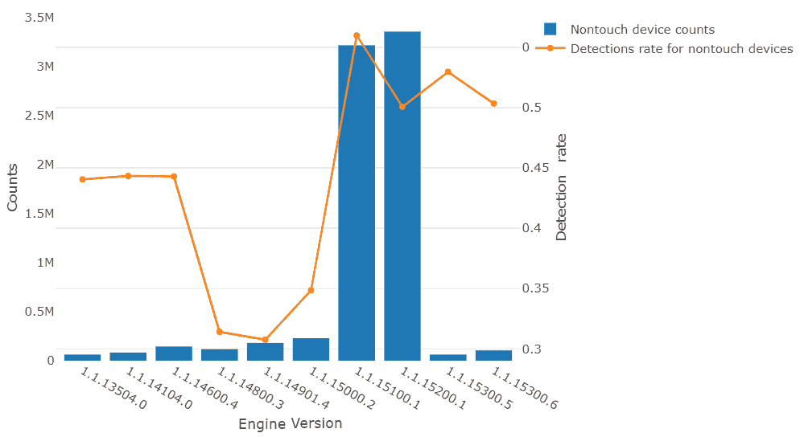
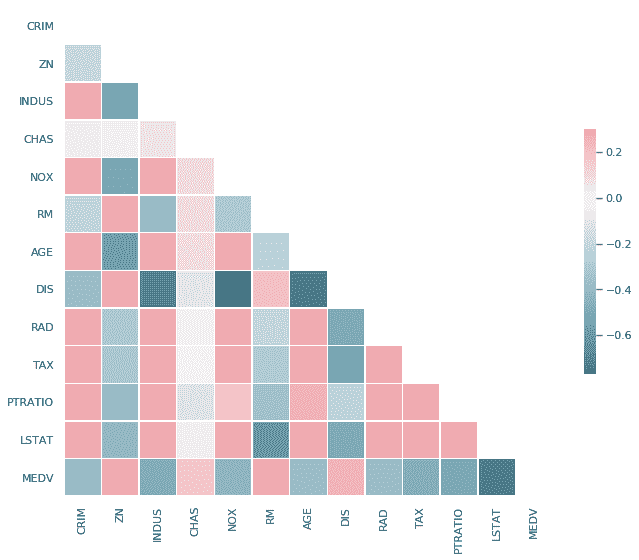
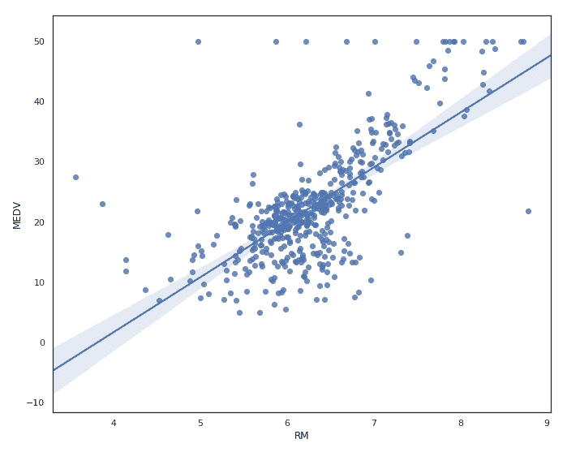
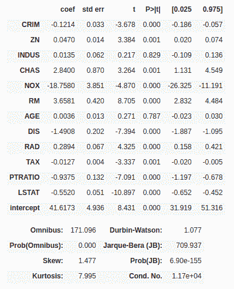
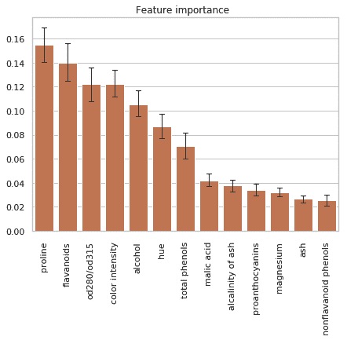
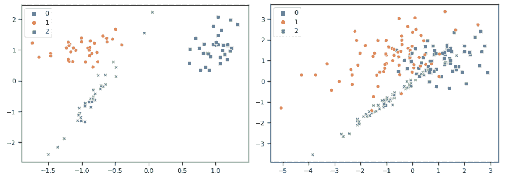
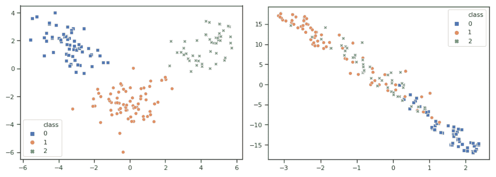
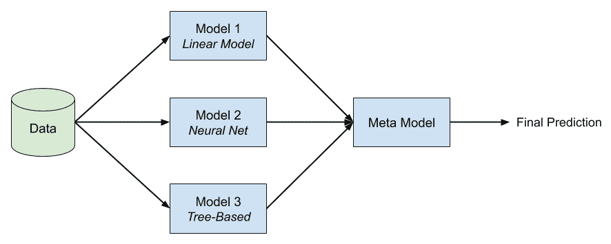

# 一、在 Azure 中构建端到端的机器学习管道

这第一章涵盖了在 Azure 中运行自定义端到端**机器学习** ( **ML** )管道所需的所有组件。有些部分可能是对你现有知识的总结，包括有用的实用技巧、分步指南和使用 Azure 服务大规模执行 ML 的指针。您可以将它视为本书的概述，在本书的剩余章节中，我们将通过许多实际示例和大量代码深入到每一节中。

首先，我们将把数据实验技术视为分析常见见解的逐步过程，如缺失值、数据分布、特征重要性和二维嵌入技术，以估计分类任务的预期模型性能。在第二部分中，我们将使用这些关于数据的见解来执行数据预处理和特征工程，例如标准化、分类和时间变量的编码，以及使用**自然语言处理** ( **NLP** )将文本列转换为有意义的特征。

在随后的部分中，我们将回顾通过选择模型、误差度量和训练测试分割来训练 ML 模型的分析过程，并执行交叉验证。然后，我们将了解通过超参数调整、模型堆叠和**自动机器学习** ( **AutoML** )来帮助提高单个模型预测性能的技术。最后，我们将介绍模型部署的最常见技术，例如在线实时评分和批量评分。

本章将涵盖以下主题:

*   执行描述性数据浏览
*   数据准备的常用技术
*   选择正确的 ML 模型来训练数据
*   优化技术
*   部署和操作模型

# 执行描述性数据浏览

毫无疑问，描述性数据探索是 ML 项目中最重要的步骤之一。如果您想要清理数据并构建派生要素，或者选择 ML 算法来预测数据集中的目标变量，那么您需要首先了解您的数据。您的数据将定义许多必要的清理和预处理步骤；它将定义您可以选择的算法，并最终定义您的预测模型的性能。

因此，数据探索应被视为一个重要的分析步骤，以了解您的数据是否有助于首先构建 ML 模型。通过分析步骤，我们的意思是探索应该作为一个结构化的分析过程来完成，而不是一系列的实验任务。因此，在开始任何数据清理、预处理、特征工程或模型选择之前，我们将浏览一份数据探索任务清单，作为每个 ML 项目的初始步骤。

一旦提供了数据，我们将完成以下数据探索清单，并尝试获得尽可能多的关于数据及其与目标变量的关系的见解:

1.  分析数据分布并检查以下内容:

*   数据类型(连续、顺序、标称或文本)
*   平均值、中间值和百分位数
*   数据偏斜
*   异常值、最小值和最大值
*   空值和缺失值
*   最常见的价值观
*   唯一值的数量(在分类特征中)
*   相关性(在连续特征中)

2.  分析目标变量如何受到特征的影响，并检查以下内容:

*   回归系数(在回归中)
*   特征重要性(在分类中)
*   错误率高的分类值(在二进制分类中)

3.  分析你预测任务的难度。

通过应用这些步骤，您将能够理解数据并获得关于数据所需的预处理任务(要素和目标变量)的知识。除此之外，它还会让您很好地估计在预测任务中可能遇到的困难，这对于判断所需的算法和验证策略至关重要。您还将深入了解哪些可能的要素工程方法可应用于您的数据集，并更好地理解如何选择良好的误差度量。

您可以使用数据的代表性子集，并将您的假设和见解外推至整个数据集。

# 将数据移动到云

在我们开始探索数据之前，我们需要让它在我们的云环境中可用。虽然这看起来是一项微不足道的任务，但从企业环境中的新环境高效地访问数据并不总是容易的。此外，向许多**虚拟机** ( **虚拟机**)和数据科学环境上传、复制和分发相同的数据是不可持续的，并且不能很好地扩展。对于数据探索，我们只需要可以轻松连接到所有其他环境的数据的重要子集，而不是对生产数据库或数据仓库的实时访问。

不存在将**逗号分隔值** ( **CSV** )或**制表符分隔值** ( **TSV** )文件上传到您的实验环境或通过 **Java 数据库连接** ( **JDBC** )从源系统访问数据的*错误*做法。然而，有一些简单的技巧来优化您的工作流程。

首先，我们将选择一种为数据探索而优化的数据格式。在探索阶段，我们需要多次浏览源数据，探索值、特征维度和目标变量。因此，使用人类可读的文本格式通常非常实用。为了有效地解析它，强烈建议使用分隔符分隔的文件，比如 CSV。CSV 可以被有效地解析，您可以使用任何文本编辑器打开和浏览它。

另一个可以显著提高性能的小调整是在上传到云之前使用 Gzip 压缩文件。这将使上传、加载和下载该文件的速度更快，同时花费在解压缩上的计算资源最少。由于表格数据的性质，压缩率会非常高。大多数用于数据处理的分析框架，比如 pandas 和 Spark，都可以本地读取和解析 Gzipped 文件，只需要很少甚至不需要修改代码。此外，这只是增加了一个小的额外步骤，用编辑器手动读取和分析文件。

一旦你的训练数据被压缩，建议将 Gzipped CSV 文件上传到 Azure 存储容器；Azure Blob 存储是一个不错的选择。当数据存储在 Blob 存储中时，可以方便地从 Azure 中的任何其他服务以及从您的本地机器访问它。这意味着如果你将实验环境从 Azure 笔记本扩展到计算集群，你访问和读取数据的代码将保持不变。

与许多不同的 Azure 存储服务交互的一个奇妙的跨平台 GUI 工具是 Azure Storage Explorer。使用这个工具，很容易高效地将大小文件上传到 Blob 存储中。它还允许您使用嵌入的访问键生成指向文件的直接链接。这种技术很简单，但是当从你的本地机器上传数百万亿字节的数据到云端时，这种技术非常有效。我们将在[第 4 章](927e1d71-b0a2-4bc4-b986-322427e7ffc3.xhtml) *、ETL 以及数据准备和特征提取*中对此进行更详细的讨论。

# 了解缺失值

一旦数据上传到云中，例如，使用 Azure Storage Explorer 和 Azure Blob storage 来存储文件，我们就可以启动一个笔记本环境并开始探索数据。目标是在分析过程中彻底探索您的数据，以了解数据的每个维度的分布。这对于为您的用例选择任何合适的数据预处理特征工程和 ML 算法是必不可少的。

请记住，不仅特征尺寸，而且目标变量都需要预处理和彻底分析。

分析包含 100 多个要素维度的数据集的每个维度是一项极其耗时的任务。但是，您可以按要素重要性排序来分析维度，而不是随机探索要素维度，从而显著减少处理数据的时间。像计算机科学的许多其他领域一样，在最初的数据探索中使用 80/20 原则是很好的，因此只使用 20%的特性就可以获得 80%的性能。这为您提供了一个良好的开端，如果需要，您可以随时回来添加更多维度。

在新数据集中首先要寻找的是每个特征维度的**缺失值**。这将有助于您更深入地了解数据集以及可以采取哪些措施来解决这些问题。在项目开始时，删除缺失值或用零对其进行估算的情况并不少见，但是，这种方法存在一开始就不能正确分析缺失值的风险。

缺失值可以伪装成*有效的*数值或分类值。典型的例子是最小值或最大值，-1、0 或 NaN。因此，如果您发现值 32，767 (= 2 ^(15) -1)或 65，535 (= 2 ^(16) -1)在一个整数数据列中多次出现，它们很可能是伪装成最大有符号或无符号 16 位整数表示的丢失值。始终假设您的数据包含不同形状和表示形式的缺失值和异常值。你的任务是发现、找到并清理它们。

任何关于数据或领域的先验知识都会让您在处理数据时获得竞争优势。这样做的原因是，您将能够了解与数据和域相关的**缺失值**、**异常值**和**极端值**，这将帮助您执行更好的插补、清理或转换。下一步，您应该在数据中寻找这些异常值，特别是以下值:

*   空值的绝对数量(或百分比)(查找 null、“Null”、“NaN”等)
*   最小值和最大值的绝对数(或百分比)
*   最常见值(众数)的绝对数值(或百分比)
*   值 0 的绝对数字(或百分比)
*   唯一值的绝对数量(或百分比)

一旦您确定了这些值，我们就可以使用不同的预处理技术来估算缺失值，并正常化或排除具有异常值的维度。在第 4 章 *、ETL、数据准备和特征提取*中，您会发现许多这样的技术，例如组均值插补。

# 可视化数据分布

知道了离群值，您最终可以探索数据集的**值分布**。这将帮助您理解在数据准备期间应该应用哪些转换和规范化技术。在连续变量中查找的常见分布统计如下:

*   平均值或中间值
*   最小值和最大值
*   第 25 个^第个、第 50 个^第个(中位数)和第 75 个^第个百分位数
*   数据偏差

可视化这些分布的常用技术是箱线图、密度图或直方图。下图显示了针对多类识别数据集的每个目标类绘制的不同可视化技术。每种方法都有优点和缺点——箱线图显示了所有相关的指标，但有点难以阅读；密度图显示了非常平滑的形状，同时隐藏了一些异常值；直方图并不能让您轻易地发现中位数和百分位数，但却能让您很好地估计数据偏差:

从前面的可视化技术来看，只有直方图适用于分类数据(名义数据和顺序数据)，但是，您可以查看每个类别的值的数量。显示价值分布与目标比率的另一个好方法是在二进制分类任务中。下图显示了来自微软恶意软件检测数据集的 Windows Defender 反恶意软件*检测率*(针对非触摸设备)的*版本号*:

许多统计最大似然算法要求数据是正态分布的，因此需要归一化或标准化。了解数据分布有助于您选择在数据准备期间需要应用哪些转换。在实践中，数据经常需要转换、缩放或规范化。

# 查找相关维度

数据探索中的另一个常见任务是在数据集中寻找相关性。这将帮助您消除高度相关的特征尺寸，因此可能会影响您的 ML 模型。例如，在线性回归模型中，两个高度相关的独立变量将导致符号相反的大系数，最终相互抵消。通过移除其中一个相关维度，可以找到更稳定的回归模型。

例如，**皮尔逊相关系数** *，*是一种流行的技术，用于在从`-1`(强负相关)到`1`(强正相关)的范围内测量两个变量之间的*线性*关系。`0`表示皮尔逊相关系数中的两个变量之间没有线性关系。

下图显示了波士顿房价数据集的相关矩阵示例，该矩阵仅包含连续变量。相关性范围从`-1`到`1`，并相应地进行着色。最后一行显示了每个特征维度和目标变量之间的线性相关性。我们可以立即看出，自住住房的**中值**(**【MEDV】**)与人口中的**(**LSTAT**)较低地位百分比呈负相关:**

 **

值得一提的是，很多相关系数只能在数值之间。顺序变量可以被编码，例如，使用整数编码，并且还可以计算有意义的相关系数。对于名义数据，您需要依靠不同的方法，如 Cramér 的 V 来计算相关性。值得注意的是，在计算相关系数之前，输入数据不需要归一化(线性缩放)。

# 测量回归的特征和目标相关性

一旦我们分析了缺失值、数据分布和相关性，我们就可以开始分析特征和目标变量之间的关系。这将使我们很好地了解预测问题的难度，从而了解预期的基线性能，这对于区分特征工程工作的优先级和选择适当的 ML 模型是至关重要的。测量这种依赖性的另一个好处是根据对目标变量的影响对特征维度进行排序，这可以用作数据探索和预处理的优先级列表。

在回归任务中，目标变量是数字或序数。因此，我们可以计算单个特征和目标变量之间的相关系数，以计算特征和目标之间的线性相关性。高相关性以及高绝对相关系数表明存在强线性关系。这为我们进一步探索提供了一个很好的起点。然而，在许多实际问题中，很少看到特征和目标变量之间的高度(线性)相关性。

还可以使用散点图或回归图来可视化特征和目标变量之间的这种依赖性。下图显示了 UCI 波斯顿住房数据集的特征*每所住宅的平均房间数* (RM)和目标变量*自有住房的中值* (MEDV)之间的回归图。如果回归线在 45 度，那么我们有一个完美的线性相关性:

确定这种依赖性的另一个很好的方法是用线性或逻辑回归模型来拟合训练数据。现在，生成的模型系数很好地解释了这种关系——系数越高，对目标变量的线性(对于线性回归)或边际(对于逻辑回归)依赖性越大。因此，按系数排序会产生按重要性排序的特征列表。根据回归类型，应该对输入数据进行规范化或标准化。

下图显示了拟合的**普通最小二乘法** ( **OLS** )回归模型的相关系数(第一列)的示例:

虽然得到的 R 平方度量(未显示)对于基线模型来说可能不够好，但是系数的排序可以帮助我们优先考虑进一步的数据探索、预处理和特征工程。

# 可视化用于分类的要素和标注依赖关系

在具有多类名义目标变量的分类任务中，如果不对数据进行进一步预处理，我们就不能使用回归系数。另一种现成的流行方法是将简单的基于树的分类器与训练数据相匹配。根据训练数据的大小，我们可以使用决策树或基于树的集成分类器，如**随机森林**或**梯度增强**树。这样做的结果是根据所选择的分割标准对特征尺寸进行特征重要性排序。在通过熵进行分割的情况下，特征将通过*信息增益*进行分类，并因此指示哪些变量携带关于目标的最多信息。

下图显示了基于树的集成分类器使用 UCI 葡萄酒识别数据集中的熵标准拟合的特征重要性:

这些线条代表了不同树木之间特征信息增益的变化。这个输出是按照特性重要性顺序进一步分析和研究数据的第一步。

这是发现数据集可分性的另一种流行方法。下图-一个是线性可分的(左)和一个是不可分的(右)-显示了包含三个类的数据集:

当观察三个集群以及这些集群之间的重叠时，您可以看到这一点。具有清楚分离的聚类意味着训练的分类模型将在该数据集上表现得非常好。另一方面，当我们知道数据不是线性可分的，我们知道这项任务将需要先进的特征工程和建模来产生良好的结果。

上图显示了两个二维数据集；我们实际上使用了前两个特征维度进行可视化。然而，高维 most 数据无法在二维中轻松准确地可视化。为了实现这一点，我们需要一种投影或嵌入技术来在二维空间中嵌入特征空间。存在许多线性和非线性嵌入技术来产生数据的二维投影；以下是最常见的几种:

*   **主成分分析** ( **PCA** )
*   **线性判别分析** ( **LDA** )
*   **t-分布随机邻居嵌入** ( **t-SNE** )
*   **一致流形逼近和投影** ( **UMAP** )

下图显示了 13 维 https://archive.ics.uci.edu/ml/datasets/wine 葡萄酒识别数据集([)的 LDA(左)和 t-SNE(右)嵌入。在 LDA 嵌入中，我们可以看到所有的类应该是线性可分的。在我们开始模型选择或训练之前，我们已经从使用两行代码来绘制嵌入中学到了很多:](https://archive.ics.uci.edu/ml/datasets/wine)

LDA 和 t-SNE 嵌入都非常有助于判断单个类的可分性，从而判断分类任务的难度。在开始选择和训练特定算法之前，评估特定模型在数据上的表现总是好的。你将在[第三章](f94e748a-d4f6-4b43-9026-6236984368e8.xhtml)、*使用 Azure 进行数据实验和可视化*中了解更多关于这些技术的内容。

# 探索数据准备的常用技术

在数据实验阶段之后，您应该已经收集了足够的知识来开始预处理数据。这个过程通常也被称为**特征工程**。当您的数据来自多个来源(如应用程序、数据库或仓库)以及外部来源时，无法立即对其进行分析或解释。

因此，在选择模型来解释问题之前，对数据进行预处理是非常重要的。除此之外，数据准备还涉及到不同的步骤，这取决于您可用的数据，例如您想要解决的问题，以及可用于该问题的 ML 算法。

你可能会问自己，为什么数据准备如此重要。答案是，如果处理得当，数据准备工作可能会提高模型的准确性。这可能是由于准备工作简化了数据中的关系。通过试验数据准备，您还可以在以后提高模型的准确性。通常，数据科学家花费大量时间进行数据准备、特征工程和理解他们的数据。除此之外，数据准备对于产生洞察力也很重要。

数据准备意味着收集数据、清理数据、转换数据和巩固数据。通过这样做，您可以丰富您的数据，转换它，并如前所述，提高您的模型的准确性。事实上，在许多情况下，ML 模型的性能可以通过更好的特征工程得到显著提高。

伴随数据准备而来的挑战是，例如，不同的文件格式、数据类型、数据的不一致性、对数据的有限或过多的访问，有时甚至是围绕数据集成的基础设施不足。另一个困难的问题是将文本(如名词或序数类别或自由文本)转换成数值。

人们目前查看数据准备和执行这一步骤的方式是通过提取、转换和加载工具。使用各种数据标准调整和转换组织内的数据是非常重要的。各种数据源的有效集成应该通过对齐数据、转换数据，然后促进数据标准的开发和采用来完成。所有这些都有效地帮助管理数据的数量、种类、准确性和速度。

在下面的小节中，将更深入地展示数据准备中的一些关键技术，如标记、存储、编码和标准化数据，以及特征提取。

# 标记训练数据

先来个扫兴的；数据准备之旅的第一步是标注，也称为**注释**。这是令人失望的，因为它是 ML 项目中最不令人兴奋的部分，然而却是整个过程中最重要的任务之一。*垃圾进*，*垃圾出—* 就这么简单。最终目标是将高质量的训练数据输入到 ML 算法中，这就是标记训练数据如此重要的原因。

虽然正确的标注有助于提高预测性能，但标注过程也有助于您更详细地研究数据集。但是，让我澄清一下，标注数据需要对数据集的上下文和预测过程有深刻的见解和理解。如果我们的目标是使用 ct 扫描来预测乳腺癌，我们还需要了解如何在 CT 图像中检测乳腺癌，以便标记数据。

错误标记训练数据会产生一些后果，例如**标记噪声**，这是您希望避免的，因为它会影响 ML 管道中每个下游流程的性能，例如特征选择、特征排序和最终建模性能。学习非常依赖于训练数据集中标签的准确性。然而，在瞄准特定目标指标时，我们应该始终将标签噪声考虑在内，因为提供的所有标签都绝对精确和准确是极不可能的。

在某些情况下，您的标注方法取决于为预测问题选择的 ML 方法。一个很好的例子是对象检测和分割之间的差异，这两者都需要完全不同的标记数据。由于用于分割的标记比用于对象检测甚至分类的标记更耗时，所以在开始 ML 项目之前，这也是一个重要的权衡。

您可以使用一些技术来加快标注过程，这些技术有望由您的标注系统提供:

*   **监督学习**:通过监督学习，ML 模型可以在标记时为您的数据推荐正确的标签。然后，您可以决定是使用预测标签，还是选择不同的或修改过的标签。这对于对象检测和图像数据非常有效。
*   **主动学习**:另一种加速标记过程的技术是允许半监督学习过程基于一些手动标记的样本进行学习和预测。使用这些已标记的样本，模型会自动建议新的标签，这些标签可以被接受，也可以被更改和修改。每个标签将微调模型以预测更好的标签。
*   **无监督学习**:通过将相似的数据样本聚类在一起，标注环境可以对接下来应该标注哪些数据点进行优先排序。使用这些见解，标注环境可以总是尝试在训练数据中提出大量变化很大的样本来进行手动标注。

贴标是 ML 流程中一个必要、漫长且成本高昂的步骤。有便于贴标签的技术；然而，它们总是需要领域知识来正确地执行。如果有任何机会可以通过您的应用程序直接收集标记数据，那么您非常幸运，应该开始收集这些数据。一个很好的例子是基于真实用户的实际结果和点击来收集搜索结果的点击率的训练数据。

# 机器学习中的规范化和转化

规范化是一种常见的数据预处理技术，通过(线性)变换将数据缩放到不同的值范围。对于许多统计 ML 模型，训练数据需要遵循某个分布，因此需要首先沿其所有维度进行归一化。以下是一些最常用的数据规范化方法:

*   缩放至单位长度，或标准缩放
*   最小/最大缩放比例
*   均值归一化
*   分位数标准化

除此之外，在概率密度函数的情况下，您还可以通过确保值落在`0`和`1`之间来监控标准化，概率密度函数用于化学等领域。对于指数分布和泊松分布，您可以使用变异系数，因为它可以很好地处理正分布。

在 ML 算法中，如**支持向量机** ( **SVM** )、逻辑回归和神经网络，一种非常常见的标准化技术是标准化，它通过给特征一个`0`均值和单位方差来标准化特征。这通常称为标准定标器。

除了线性变换之外，出于与归一化相同的原因，对数据应用非线性变换也很常见，这是为了满足特定分布的假设。如果您的数据有偏差，您可以使用幂或对数变换来归一化分布。这非常重要，例如，对于线性模型，正态假设是预测向量的必要条件。对于高度倾斜的数据，您还可以多次应用这些转换。对于包含`0`的数据范围，通常应用 *log plus 1* 变换来避免数值不稳定。

# 编码分类变量

使用真实世界的数据集，您将很快达到规范化和变换的极限，因为这些变换的数据需要是连续的。许多统计 ML 算法也是如此，如线性回归、SVM 或神经网络；输入数据必须是数字。因此，为了处理分类数据，我们需要研究不同的数字编码技术。

我们区分三种不同类型的分类数据:顺序数据、名词性数据和文本数据(例如，自由文本)。我们对名词性数据和文本性数据进行了区分，因为文本性数据通常用于提取语义，而名词性分类数据通常只是被编码。

您可以使用各种类型的数字编码技术。它们列在下面:

*   **标签编码**:这是每个类别映射到一个数字或标签的地方。类别的标签彼此不相关；因此，相关的类别在编码后会丢失这些信息。
*   **一键编码**:另一种流行的方法是虚拟编码，也称为一键编码。每个类别都用正交特征向量代替，其中特征向量的维数取决于不同值的数量。对于高基数特性，这种方法效率不高。
*   **Bin 编码**:尽管 Bin 编码非常类似于一键编码，但它不同于将类别存储为二进制位串。bin 编码的目标是将基数散列成二进制值，并且每个二进制数字得到一列。这将导致一些信息丢失；但是，您可以处理更少的维度。它还创建了更少的列，因此学习速度更快，内存效率更高。
*   **计数编码**:在计数编码中，我们将分类值替换为整个训练集的相对或绝对计数。这是编码大量唯一标签的常用技术。
*   **目标编码**:在这种编码方法中，我们用这个类别的目标变量的平均值来代替分类值。这对于高基数特性也是有效的。
*   **哈希编码**:当有大量大规模分类特征时使用。哈希函数将大量的值映射到一个小的有限的值集中。不同的值可能会创建相同的哈希，这称为冲突。

我们将在[第 5 章](2e9b480a-5003-4fc8-a5c6-bc2ba75c21b3.xhtml)、*使用 NLP 的高级特征提取*中详细了解这些编码技术。

# 使用时序数据的特征工程示例

要素工程强烈依赖于数据集的属性域。在处理人口统计或地理信息时，您可以对人物角色和人口统计指标进行建模，或者加入地理属性，例如靠近大城市、边境、GDP 等。让我们看一个时序数据的例子，这在现实世界的例子中极其常见。

许多真实世界的数据集具有时间依赖性，因此它们将日期和时间存储在训练数据的至少一个维度中。根据日期时间变量的分布，该日期时间字段可以被视为编码变量或有序分类变量。

根据日期-时间数据的分布和模式，您希望将日期-时间字段转换为不同的值，这些值对当前日期或时间的特定属性进行编码。以下是可以从日期-时间变量中提取的一些特征:

*   绝对时间
*   一天中的某个时刻
*   一周中的第几天
*   一个月中的第几天
*   一年中的某一天
*   一年中的月份

如果在一段时间内看到维度之间的周期性关系，还可以对时间维度的周期特征进行编码。这可以通过计算一天中的绝对小时来计算一天中标准化小时的正弦和余弦分量来实现。使用这种技术，得到的值将包含对编码的日期-时间维度的循环依赖。

提高模型性能的另一个好方法是在训练数据中包含附加数据。这在日期-时间维度上非常有效，例如，您可以按日期加入公共假日、公共事件或其他类型的事件。这允许您创建如下特征:

*   距下一次或上一次活动的天数
*   距下一个或上一个假期的天数
*   将一个日期标记为公共假日
*   将一个日期标记为重大体育赛事

如您所见，有许多方法可以转换和编码日期时间变量。鼓励深入原始数据，并在数据中寻找应该由 ML 模型解释的视觉模式。无论何时处理日期-时间维度，都有进行创造性特征工程的空间。

# 利用自然语言处理从文本中提取复杂特征

使用 NLP 从文本中提取特征作为 ML 模型的输入是非常有用的。NLP 用于将 ML 算法应用于文本和语音，并且通常用于预处理原始文本数据和分类嵌入。我们经常区分基于出现的嵌入，比如词袋，和语义嵌入，比如 Word2Vec。NLP 在处理文本数据的任何时候都非常有用。

类似于分类嵌入，NLP 技术将文本转换成数值。这些值通常是高维的，需要被简化——通常通过**奇异值分解** ( **SVD** )或者聚合来完成。NLP 中用于从文本中提取特征的一些流行技术如下:

*   词汇化、词干化和停用词移除
*   n-grams
*   tf-idf
*   嵌入，比如 Word2vec
*   完全训练的模型，例如序列对序列模型

如果我们的目标是将文本转换成数值，我们实际上可以使用单词包预测器、Word2Vec 嵌入或序列到序列模型来实现编码。同样的想法也可以扩展到文档，不是学习单词的特征表示，而是学习文档的特征表示。

我们将仔细研究通过自然语言处理的特征提取，以及之前在[第 5 章](2e9b480a-5003-4fc8-a5c6-bc2ba75c21b3.xhtml)、*使用自然语言处理的高级特征提取*中提到的所有技术。

# 选择正确的 ML 模型来训练数据

与数据实验和预处理类似，训练 ML 模型是一个分析性的逐步过程。每一步都包含一个思考过程，根据实验阶段的结果评估每种算法的利弊。像其他科学过程一样，建议你先提出一个假设，然后验证这个假设是否正确。

让我们看看定义训练 ML 模型的过程的步骤:

1.  **定义你的 ML 任务**:首先，我们需要定义我们面临的 ML 任务，这个任务大部分时间是由你用例背后的业务决策定义的。根据标记数据的数量，您可以在无监督、半监督和监督学习以及许多其他子类别之间进行选择。
2.  **选择一个合适的模型来执行该任务**:为所选的 ML 任务选择一个合适的模型。这包括逻辑回归、梯度增强的树集成和深度神经网络，仅举几个流行的 ML 模型选择为例。选择主要取决于培训(或生产)基础设施(如 Python、R、Julia、C 等等)和数据的形式。当训练数据有限时，建议您使用简单的传统集成技术，如梯度增强树集成。这些模型在一组广泛的输入值(序号、标称值和数值)上表现良好，并且训练有效，它们是可理解的。当需要强大的概括和表达能力，并且给定合理数量的训练数据时，应该使用深度学习模型。当有限的数据可用于构建高度复杂的模型时(例如，用于对象检测)，建议您使用预训练的模型作为特征提取器，并且仅训练顶层的分类器。然而，只要有可能，当使用深度学习技术时，建议您建立在预先训练的模型之上。
3.  **选择一个训练验证分割**:将你的数据分割成一个训练和验证集，让你对训练和优化过程的性能有更多的了解。这包括群组混洗分割、时间分割、分层分割等等。
4.  **选择或实现一个误差指标**:在数据实验阶段，你应该已经想出了一个如何测试模型性能的策略。因此，您应该已经选择了验证分割和错误度量。如果您还没有这样做，我建议您评估您想要测量和优化的内容(例如绝对误差、相对误差、百分比、真正率、真负率等等)。这包括 F1-score、MSE、ROC、加权 Cohen's kappa 等等。
5.  **使用交叉验证训练一个简单的模型**:最后，当前面所有的选择都完成后，你就可以继续训练你的 ML 模型了。在最佳情况下，这是作为对训练和验证集的交叉验证来完成的，而不会将训练数据泄漏到验证中。在训练了基线模型之后，是时候解释验证运行的误差度量了。有意义吗？是预期的高还是低？它(希望)比随机好，比总是预测最受欢迎的目标好吗？随机种子对这个结果有什么影响？

一旦收集了这些问题的答案，您就可以回到有趣的部分:通过数据分析、特征工程和数据预处理来提高模型性能。

# 选择误差度量

在查看了特征和目标尺寸之间的关系以及数据的可分离性之后，您应该继续评估稍后将用于训练 ML 模型的误差度量。有许多度量标准可供选择，用于测量回归的绝对误差、平方误差和百分比误差，以及分类的准确度、真正率、真负率和有序类别的加权距离度量标准，等等。

为优化问题定义合适的误差度量并不简单，因为它取决于多种情况。例如，在一个分类问题中，我们面临精度-召回的困境，你可以优化最大精度(从而最小化假阳性)或最大召回(从而最大化真阳性)。任何一个决定都会产生一个不同的模型，具有相反的优势和劣势。

许多机器学习实践者没有足够高度地重视适当的误差度量的重要性，而是使用他们用例的默认度量(例如，准确性、均方误差等等)。如果你发现自己陷入了这个陷阱，记住正确的误差度量的重要性。错误度量的选择是绝对关键的，甚至可能导致您的 ML 用例成功或失败。

在开始模型训练和优化(包括模型选择和参数调整等任务)之前，了解基线性能和模型对噪声的鲁棒性是很有用的。第一个可以通过仅使用出现次数最多的目标变量作为预测来计算误差度量来实现——这将是您的基线性能。第二种方法是修改 ML 模型的随机种子(例如，用于特征重要性的基于树的模型)并观察误差度量的变化。这将显示您可以信任的误差度量的小数位数。

# 培训和测试分离

一旦选择了 ML 方法和误差度量，就需要考虑拆分数据集进行训练。最理想的情况是，数据应该分成三个不相关的集合:一个训练集、一个验证集和一个测试集。我们使用多个集合来确保模型对看不见的数据进行很好的概括，并且报告的误差度量是可信的。因此，您可以看到，将数据划分为代表性的集合是一项应该作为分析过程来执行的任务。

您需要不惜一切代价避免训练数据泄露到验证或测试集中，从而过度拟合训练数据并扭曲验证和测试结果。为了确保这一点，您需要始终创建不连续的数据集，并使用验证集进行交叉验证和参数调整，而测试集仅用于报告您的最终模型性能。

有许多不同的技术可用，例如分层分裂(基于类分布的采样)、时间分裂和基于组的分裂。我们将在第六章 、*使用 Azure 机器学习*构建 ML 模型中了解这些。

# 使用基于树的集成模型实现出色的性能

存在许多令人惊叹的传统 ML 方法，如朴素贝叶斯 SVM 和线性回归。但是，有一种技术由于其灵活性，可以让您快速入门，同时提供出色的预测性能，而无需大量的调优和数据准备。虽然大多数基于决策树的集成估计器符合这种描述，但我们想特别关注一种:梯度提升树。

在前面的部分中，我们提到了为评估基线性能建立基线模型是每个 ML 项目的良好开端。事实上，我们将在许多章节中看到，构建基线模型有助于您关注项目的所有重要方面，例如数据、基础设施和自动化。

决策树非常通用。它们可以与作为输入的数值和分类数据一起使用，并且可以预测连续值和分类值。基于树的集成模型将许多弱学习器组合成基于决策树的单个预测器。这大大减少了单个决策树的过拟合和不稳定问题。在提升时，我们使用迭代方法，通过在每次训练迭代后对错误分类的训练样本进行加权来优化模型性能。使用默认参数进行几次迭代后的输出通常会为许多不同的应用程序提供很好的基线结果。

在[第 6 章](ef8acb66-47eb-415f-ba95-680d645e2ef3.xhtml)，*使用 Azure 机器学习*构建 ML 模型中，我们专门用一个完整的部分来使用 LightGBM 训练一个梯度增强的树集成分类器，light GBM 是微软的一个流行的树集成库。

# 使用深度学习技术对大型复杂数据进行建模

为了捕捉大量复杂训练数据的含义，我们需要大型参数模型。然而，由于爆炸和消失梯度、通过这种复杂模型的损失传播、数值不稳定性和归一化，训练具有数亿个参数的参数模型并非易事。近年来，这种高参数模型的一个分支通过许多复杂的任务取得了极其良好的结果——即深度学习。

深度神经网络在具有大量复杂输入数据的复杂预测任务中工作得非常好。大多数模型结合了特征提取器和分类/回归部分，并以完全端到端的方法进行训练。全连接神经网络——也称为**人工神经网络**(**ANNs**)——工作方式非常类似于逻辑回归模型，具有不同的损失函数和多层堆叠。**卷积神经网络**(**CNN**)使用具有共享权重的局部约束连接来移除所需参数的数量，同时利用数据局部性。在卷积和池层对应于经典计算机视觉过滤器和操作符的情况下，它们非常适合处理图像数据。

**递归神经网络** ( **RNNs** )和**长短期记忆** ( **LSTM** )层通过保持状态随时间变化来帮助建模时间依赖性。大多数模型架构都可以通过**通用编程图形处理单元** ( **GPGPU** )，甚至虚拟化或专用深度学习硬件来利用并行计算。

[第七章](7d5c6115-68ca-44bc-ae88-986309d1929b.xhtml)、*在 Azure 上训练深度神经网络、*和第九章、*在 Azure ML 集群上的分布式机器学习*，致力于在单机和分布式 GPU 集群上训练大型、复杂的深度学习模型。

# 优化技术

如果我们已经训练了一个简单的集合模型，该模型的性能比基线模型合理地更好，并且根据在数据准备期间估计的预期性能达到了可接受的性能，则我们可以继续进行优化。这是我们非常想强调的一点。当简单的集成技术无法提供有用的结果时，强烈建议不要开始模型优化和叠加。如果是这种情况，最好退一步，更深入地研究数据分析和特征工程。

常见的 ML 优化技术，如超参数优化、模型堆叠，甚至 AutoML，可以帮助您从模型中获得最后 10%的性能提升，而其余 90%是通过单个集成模型实现的。如果您决定使用这些优化技术中的任何一种，建议您在分布式集群上并行且完全自动化地执行它们。

在看到太多的 ML 实践者手动地参数化、调整和堆叠模型之后，我们想提出一个重要的信息:训练和优化 ML 模型是令人厌烦的。应该很少手动执行，因为作为端到端优化过程自动执行要快得多。你的大部分时间和精力应该放在实验、数据准备和功能工程上——也就是说，所有不能用原始计算能力轻易自动化和优化的事情。当投入时间改进模型性能时，关于数据的先验知识和对 ML 用例的理解以及业务洞察力是更深入挖掘的最佳地方。

# 超参数优化

一旦使用带有默认参数化的简单单个模型获得了合理的性能，就可以继续优化模型的超参数。由于多个参数的组合和复杂性，浪费时间手动调整参数没有太大意义。相反，这种调整应该总是以最佳的自动化方式执行，这将总是导致更好的交叉验证性能。

首先，您需要为每个可训练超参数定义参数搜索空间和采样分布。该定义是具有不同采样分布的连续或分类区域；例如，均匀、对数或正态分布采样。这通常可以通过使用超参数优化库生成参数配置来实现。

你需要决定的下一件事是搜索空间中参数的采样技术。三种最常见的采样和优化技术如下:

*   网格采样
*   随意采样
*   贝叶斯优化

前两种算法在搜索空间中以网格或随机方式采样，而第三种算法通过贝叶斯优化执行更智能的搜索。在实践中，随机和贝叶斯抽样是最常用的。

为了避免在错误的参数配置上花费任何不必要的计算时间，建议在使用超参数优化时定义早期停止标准。

训练不同参数集的许多组合是一项计算复杂的任务。因此，强烈建议在多台机器上并行执行该任务，并在一个中心位置跟踪所有参数组合和模型交叉验证性能。对于高度可扩展的云计算环境来说，这是一项特别有益的任务，因为这些任务是自动执行的。在 Azure ML 中，您可以使用 HyperDrive 功能来做到这一点。我们将在[第 8 章](7d5c6115-68ca-44bc-ae88-986309d1929b.xhtml)、*超参数调整和自动化机器学习*中详细讨论这一点。

# 模型堆叠

模型堆叠是一种非常常用的技术，通过将多个模型组合到单个堆叠模型中来提高预测性能。因此，每个模型的输出都被输入到元模型中，元模型本身通过交叉验证和超参数调整来训练。通过将显著不同的模型组合成一个单一的堆叠模型，您总是可以胜过单一的模型。

下图显示了一个堆叠模型，它由级别 1 中的不同监督模型组成，这些模型将它们的输出提供给另一个元模型。这是一种常见的架构，一旦充分利用了所有的特征工程和模型调整选项，它将进一步提高预测性能:

模型堆叠给你的 ML 过程增加了很多复杂性，但几乎总是能带来更好的性能。这种技术将使你的算法获得最后 1%的性能增益。为了有效地将模型堆叠成一个元集合，建议您完全自动化地完成这项工作；比如通过 Azure 中的 AutoML 等技术。但是，需要注意的一点是，您很容易过度拟合训练数据，或者创建比单个模型大得多的堆叠模型。

# AutoML

正如我们所展示的，构建 ML 模型是一个复杂的逐步过程，需要许多不同的技能，例如领域知识(允许您洞察数据的先验知识)、数学专业知识和计算机科学技能。在此过程中，仍然存在人为错误和偏见，这可能不仅会影响模型的性能和准确性，还会影响您希望从中获得的洞察力。

AutoML 可以通过缩短实现价值的时间来组合和自动化所有这一切。对于一些行业，AutoML 可以通过自动化手动建模任务来利用 ML 和 AI 技术，以便数据科学家可以专注于更复杂的问题。特别是当使用重复的 ML 任务时，例如数据预处理、特征工程、模型选择、参数调整和模型堆叠，使用 AutoML 可能是有用的。

我们将在第 8 章、*超参数调整和自动化机器学习*中更详细地讨论和查看真实世界的例子。

# 部署和操作模型

一旦你训练和优化了一个 ML 模型，它就可以部署了。实际上，许多数据科学团队在这里停下来，将模型作为 Docker 映像转移到生产中，通常使用 Flask 或类似的框架嵌入到 REST API 中。然而，正如您所想象的，根据您的用例需求，这并不总是最佳的解决方案。ML 或数据工程师的责任不止于此。

当在生产中的实时数据上测试模型时，可以最好地看到 ML 管道的部署和操作。进行测试以收集见解和数据，从而不断改进模型。因此，随着时间的推移收集模型性能是保证和改进模型性能的重要步骤。

总的来说，我们区分了 ML 评分管道的两种架构，我们将在本节简要讨论这两种架构:

*   使用管道进行批量评分
*   使用基于容器的 web 服务进行实时评分

这些体系结构按照操作复杂性的增加顺序进行讨论，离线评分是最不复杂的，异步评分是更复杂的系统。复杂性源于大规模操作这种管道所涉及的组件数量。

最后，我们将研究收集运行时、延迟和其他操作指标以及模型性能的有效方法。为了分析和改进一个 ML 模型，记录所有被评分的请求也是一个很好的实践。

这两种架构以及监控解决方案将在第 11 章、*部署和操作机器学习模型*中详细讨论和实施。

# 使用管道进行批量评分

对于**离线评分**，或**批量评分** *，*我们讨论的是一个离线过程，在这个过程中，您可以针对一批数据评估一个 ML 模型。这种评分技术的结果通常不是时间关键的，并且要评分的数据通常比模型大。当在另一个批处理过程中对 ML 模型进行评分时，例如每天、每小时或每周的任务，通常使用该过程。

以下是我们期望的输入和输出数据:

*   **输入**:查找输入数据的位置
*   **输出**:所有分数的响应

虽然输入和输出格式非常直观，但是我们仍然希望给出一个使用这种架构的例子列表。这样做的原因是，当处理类似的 ML 任务时，您可以为您的用例决定适当的架构。以下是一些实际例子:

*   流媒体服务的推荐引擎每周为即将到来的一周生成新的推荐。
*   移动电信运营商的分类算法每月一次计算每个客户的流失分数。

如果模型是在分布式系统上训练的，那么在用于训练的同一系统上执行批量评分是非常常见的，因为评分任务与计算测试集的分数是相同的。

# 使用基于容器的 web 服务进行实时评分

术语**在线同步评分**，或**实时评分**，指的是我们对一个 ML 模型评分并立即需要结果分数的技术。这在流处理中很常见，其中单个事件被实时评分。很明显，这个任务是高度时间关键的，在计算出结果分数之前，执行是被阻塞的。

以下是我们期望的输入和输出数据:

*   输入:一个或多个观察值
*   输出:只有一个分数的响应

输入输出配置也相当直观。以下是一些典型实时评分用例的实际示例:

*   自动驾驶车辆中的物体检测算法可以检测障碍物，因此它可以控制和驾驶车辆安全地绕过物体。
*   对象检测算法检测相机图像中的面部并聚焦相机。
*   分类算法决定传送带上的当前产品是否符合质量标准。

在线同步评分服务的模型通常被部署到云中，作为分布式集群中的并行化服务，在它们前面有一个负载平衡器。这样，当需要更高的吞吐量时，可以容易地扩大或缩小评分集群。如果延迟要求受到限制，这些模型也部署到边缘设备，如移动电话或工业计算机，以避免数据往返于最近的云区域。

# 跟踪模型性能、遥测和数据偏差

跟踪一个已部署的 ML 模型的适当度量是必要的。虽然关于的流行指标包括消耗的 CPU 时间、RAM、GPU 内存以及延迟，但我们还希望关注模型的评分性能。正如我们已经看到的，大多数真实世界的数据都依赖于时间，因此许多习惯都会随着时间而改变。在生产中操作 ML 模型也意味着持续保证模型的质量和性能。

为了跟踪模型的性能，可以使用标准的应用程序监控工具，比如 Azure Application Insights 或任何其他高度可伸缩的键值数据库。这对于理解你的用户如何使用你的模型以及你的模型在生产中预测什么是很重要的。

另一个重要的洞察是跟踪用于对模型评分的数据。如果我们保留这些数据，我们可以将其与用于部署模型的训练数据进行比较，并计算训练数据和评分数据之间的数据偏差。通过定义最大模型偏差的阈值，一旦偏差过大，我们可以将此作为重新训练模型的触发器。我们将在[第 11 章](c6e3ad17-9212-42ee-ae25-b111e530518a.xhtml)、*部署和操作机器学习模型*中看到这一点。

# 摘要

在本章中，我们看到了定制 ML 管道的所有步骤的概述。您可能已经看到了熟悉的数据预处理或分析概念，并学到了重要的一课。数据实验是一种循序渐进的方法，而不是实验过程。寻找缺失值、数据分布以及特征和目标之间的关系。这种分析将极大地帮助您理解要执行的预处理步骤以及预期的模型性能。

你现在知道数据预处理，或特征工程，是整个 ML 过程中最重要的部分。关于数据的先验知识越多，就越能更好地对分类变量和时间变量进行编码，或者使用 NLP 技术将文本转换成数字空间。您了解了选择适当的 ML 任务、模型、误差度量和训练测试分割主要是由业务决策(例如，针对分段的对象检测)或性能权衡(例如，堆叠)来定义的。

使用您新获得的技能，您现在应该能够起草一个端到端的 ML 流程，并理解从实验到部署的每个步骤。在下一章，我们将看一下哪些特定的 Azure 服务可以用来在云中有效地训练 ML 模型。**