# 三、使用 Azure 进行数据实验和可视化

在前一章中，我们学习了如何在云中导航不同的 Azure 服务来实现 ML 解决方案。我们意识到，以编程方式训练定制 ML 模型以及自动化基础设施和部署的最佳服务是 Azure ML 服务。在本章中，我们将设置 Azure ML 工作空间，创建一个训练集群，并在 Azure 中收集所有工件的同时执行数据实验。

首先，您将学习如何准备 ML 工作空间并与之交互。一旦设置好，你将能够在 Azure 中执行和跟踪实验，以及训练好的模型、图、度量和代码快照。这些都可以在您的创作 Python 环境中完成；比如使用 Azure ML 的 compute 实例的 Jupyter 类似于 Data Science VMs(dsvm)或者任何在 PyCharm、VS Code 中运行的 Python 解释器等等。我们将首先在创作环境中本地运行实验代码，然后逐渐转移到自动扩展的训练集群。

在本章的第二部分，我们将应用所学的知识并执行降维来可视化高维数据集。我们还将跟踪这些可视化以及 Azure ML 中的关键指标。首先我们将比较两种线性投影:**主成分分析** ( **PCA** )和**线性判别分析** ( **LDA** )作为无监督和有监督嵌入的例子。然后我们再来看两个流行的无监督非线性技术: **t 分布随机邻居嵌入** ( **t-SNE** )和**一致流形逼近和投影** ( **UMAP** )。这将帮助你快速试验任何数据集，并将你的试验保存在 Azure ML 中。

让我们开始设置您的 Azure ML 工作空间。我们建议你使用 Azure Cloud Shell、Azure ML 和 Azure ML 计算实例，在你的 Azure 帐户中关注我们。如果有些内容听起来仍然不熟悉，请不要担心；我们将一步一步地解决设置和实验问题。

以下是本章将涉及的主题:

*   准备您的 Azure ML 工作区
*   可视化高维数据


# 准备您的 Azure ML 工作区

在第一部分中，我们将使用 Azure 命令行在 Azure 中设置 ML 工作区。这将帮助您重复创建开发、试运行和生产环境。你可以在本地机器上完成部分工作，比如运行 Azure 命令行脚本或简单的 Python 创作环境，或者使用 Azure Cloud Shell 在云中完成。在 Azure 中使用预配置的 shell 是最快的方法，因为所有必需的扩展和别名都已经为您预安装和配置好了。

然后，我们将从您的创作和实验环境(例如，您的本地开发机器或 Azure ML 中的小型笔记本虚拟机)运行简单的实验，然后平稳地过渡到 Azure ML 计算集群——Azure 上高度可扩展的执行环境。这种设置的好处在于，从那时起，您将能够决定是要在本地开发机器上运行代码(并且仍然受益于 Azure ML 的许多功能),还是要在预配置的虚拟机或可自动扩展的计算集群上运行代码。

发现 Azure ML 的一个很好的方法是获取一个当前的 ML 项目，并开始添加来自 Azure ML 的一些片段来增强该项目。我们将开始跟踪工作目录、输出工件(例如，一个经过训练的模型)，以及您的实验每次运行的所有相关度量。稍后，我们可以注册模型并在执行环境之间切换，或者调整参数。这应该会让您从当前的工作流中非常平稳地过渡，并为 Azure ML 提供出色的入门体验——一次只使用几行代码。


# 设置 ML 服务工作空间

在本书中，我们将尽可能多地尝试自动化手动步骤，为您提供一种重现所有环境和实验的方法。有许多不同的方法来以编程方式在 Azure 中设置资源:ARM 模板、Azure CLI、Azure SDKs、Terraform，以及更多可用的工具。总的来说，我们将使用 Azure CLI 来设置和配置 Azure ML 工作区，稍后专门使用用于 Python 的 Azure ML SDK 来设置和配置训练集群和其他资源。

使用这种方法将极大地促进 Azure 中执行的所有任务的可重复性和自动化。如果你是 Azure CLI 的新手，你应该通过 Azure 文档中提供的信息继续安装它:[https://docs . Microsoft . com/en-us/CLI/Azure/install-Azure-CLI-windows](https://docs.microsoft.com/en-us/cli/azure/install-azure-cli-windows)。如果您已经安装了 Azure CLI，请确保您有最新的可用版本，这是许多新的 ML 功能所必需的。

让我们按照以下步骤设置 Azure ML 工作空间:

1.  首先，我们需要为 Azure CLI 安装 Azure ML 扩展。这将允许您通过命令行与 Azure ML 进行交互。让我们使用以下命令安装 ML 扩展:

```py
$ az extension add -n azure-cli-ml
```

2.  安装后，您将能够使用`az ml`命令来使用该扩展。确保在继续之前，您运行以下命令来浏览 Azure CLI ML 扩展提供的操作:

```py
$ az ml -h

Group
 az ml : Access Machine Learning commands.

Subgroups:
 computetarget : Access compute context related commands.
 datastore : Manage and use datastores.
 experiment : Manage experiments in the AzureML Workspace.
 folder : Access folder related commands.
 model : Manage machine learning models.
 pipeline : Access and manage machine learning pipelines.
 run : Manage and submit AzureML runs.
 service : Manage operationalized services.
 workspace : Access workspace related commands.
```

3.  接下来，在`westus2`区域创建一个新的资源组`mldemo`，并创建一个 Azure ML 工作区`mldemows`。这不仅会创建工作区，还会创建 ML 项目所需的所有其他资源，比如`StorageAccount`、`ServicePrincipal`、`AppInsights`和`KeyVault`容器。这些服务都是 Azure ML 工作空间的一部分:

```py
$ az group create -n mldemo -l westus2
{ ... }

$ az ml workspace create -w mldemows -g mldemo
Deploying StorageAccount with name mldemowsstorage01509a813.
Deploying AppInsights with name mldemowsinsightsd847e989.
Deployed AppInsights with name mldemowsinsightsd847e989.
Deploying KeyVault with name mldemowskeyvaultba9841b6.
Deployed KeyVault with name mldemowskeyvaultba9841b6.
Deployed StorageAccount with name mldemowsstorage01509a813.
Deploying Workspace with name mldemows.
Deployed Workspace with name mldemows.
{ ... }
```

如您所见，前面的命令创建了运行 ML 实验所需的多个资源，以及 Azure ML 工作空间。`KeyVault`将用于自动管理您引擎盖下的秘密和密钥；`StorageAccount`将用于存储源文件、训练好的模型、数据等工件；`AppInsights`将用于跟踪你的实验部署的度量和遥测数据。

4.  下一步，我们将切换到 shell 中的工作目录，并将 Azure ML 工作区配置导出到磁盘。这将帮助我们从该文件加载配置，而不是在脚本中跟踪您的订阅 ID 和 ML 工作区名称:

```py
$ az ml folder attach -w mldemows -g mldemo -e mldemos 
{
 "Experiment name": "mldemos",
 "Project path": "~/ch03-data-experimentation",
 "Resource group": "mldemo",
 "Subscription id": "***",
 "Workspace name": "mldemows"
}
```

前面的命令在当前工作目录中创建一个包含您的工作区配置的`.azureml/`文件夹。它还创建了一个`.amlignore`文件，该文件定义了 Azure ML 服务应该忽略的文件和文件夹的所有文件模式。这些文件不会在实验运行的快照过程中上传——类似于您的版本控制系统中的`.gitignore`文件。

5.  在接下来的步骤中，我们可以安装 Python 扩展来从 Python 内部与 Azure ML 交互。该扩展非常强大，让您不仅可以与 Azure ML 交互，还可以创建训练集群、部署集群等等。

请注意，只有在您自己的机器上运行您的实验时，才需要这样做——而不是在预先配置的 Azure ML Compute 或 Azure 中的 **Data Science 虚拟机** ( **DSVM** )上。

如果在本地运行，需要安装用于 Azure 和 Azure ML 的 Python SDK。下面是如何使用 pip 和 Python 3 实现这一点的一个片段:

```py
python3 -m pip install azure-cli azureml-sdk 
```

如果你想在云中运行你的创作环境，你可以简单地在 Azure 中导航到你的机器学习工作区，并打开 Azure ML 接口以使用那里提供的笔记本查看器。下面的截图展示了 Azure ML 界面。您可以在左侧菜单中看到“笔记本”选项卡。选择此选项卡可直接在您的工作区中为您提供一个成熟的笔记本环境:

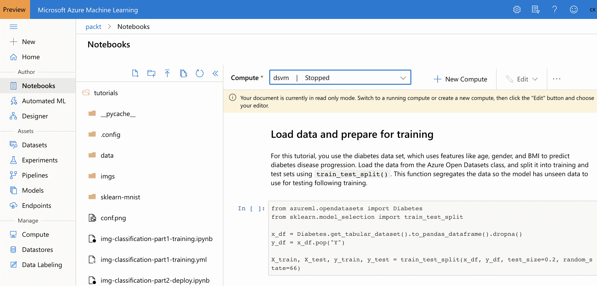

要在此环境中运行代码，请单击 Compute 并为您的笔记本创建一个计算实例。完成后，如果您喜欢这些环境，您还会看到启动单独的 Jupyter 笔记本或 JupyterLab 会话的选项。但是，您也可以通过在安装了 Azure 和 Azure ML Python SDKs 的本地运行以下代码来继续。下面的截图展示了这在 Azure ML 界面中的样子。您可以单击 JupyterLab 在此计算实例上打开一个 JupyterLab 会话:

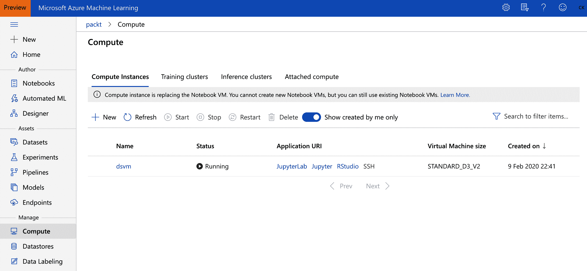

前面的屏幕截图向您展示了如何通过简单地部署一个计算实例，在 Azure ML 工作区中快速建立一个成熟的创作和实验环境。如果您喜欢更加集成的体验，您也可以切换回左侧菜单中的“笔记本”选项卡，并使用此计算执行笔记本。

计算实例以前称为笔记本虚拟机，类似于预先配置的 DSVMs。

6.  接下来，我们可以从这个文件加载工作区配置，而无需在每个实验中显式指定工作区和订阅。在交互式 Python 笔记本环境或您手边的任何 Python 解释器中，您可以运行以下代码在当前上下文中加载您的工作空间:

```py
from azureml.core import Workspace

ws = Workspace.from_config()
```

前面的代码将从我们之前使用 Azure CLI 创建的配置目录中加载您的配置。每当您在 Azure ML 计算实例中运行代码时，您都会获得这些与您的工作空间一起预先配置的设置。

在 Python 中加载工作空间将提示您登录到您的 Azure 帐户，以允许您当前的计算环境和 Azure ML 工作空间之间的通信。

运行前面的代码块将输出一个交互式链接，以便使用设备代码登录到您的 Azure 帐户。请点击链接并使用所提供的代码进行登录，以授予您当前的执行环境对 Azure ML 工作区的访问权限。如果您运行非交互式 Python 脚本而不是笔记本环境，您可以提供 Azure CLI 凭据来登录您的 Azure 帐户，如下所示:

```py
from azureml.core import Workspace
from azureml.core.authentication import AzureCliAuthentication
cli_auth = AzureCliAuthentication()
ws = Workspace.from_config(auth=cli_auth)
```

一旦您成功地将工作空间加载到`ws`对象中，您就可以继续为您的 ML 实验添加跟踪功能。我们将使用这个对象来创建实验、运行、记录指标和注册模型。


# 用 Azure ML 运行一个简单的实验

从 Azure ML 开始的一个很好的用例是向现有的 ML 管道添加高级日志、跟踪和监控功能。想象一下，您有一个中心位置来跟踪所有数据科学家的 ML 实验，监控您的训练和验证指标，收集您的训练模型和其他输出文件，以及保存当前环境的快照。我们可以通过简单地在您的训练脚本中添加几行代码来实现这一点。

在 Azure ML 工作空间中，一个实验将一组**运行**分组。运行是您的实验(您的训练脚本)的一次执行，具有不同的设置、模型、代码、数据等等，但是具有相同的可比较的度量。您可以使用运行来测试给定实验的多个假设，并跟踪相同实验中的所有结果。然后运行用于跟踪和收集信息。我们现在将创建一个实验，然后创建一个运行:

1.  首先，加载并创建一个实验。以下代码行将创建一个新的实验，或者在 ML 工作区中加载一个现有的实验，并使用提供的名称:

```py
# Load or create an experiment
exp = Experiment(workspace=ws, name="cifar10_cnn_local")
```

上面的代码创建了一个名为`cifar10_cnn_local`的实验，用于跟踪新的运行，仅此而已。如果同名的实验已经存在，调用将返回现有的实验。现在，该实验中的所有运行都分组在一起，可以在单个仪表板上显示和分析。

2.  一旦我们加载了一个实验，我们就可以创建一个`run`对象，并开始为当前的 Python 脚本或笔记本记录这次运行:

```py
# Create and start an interactive run
run = exp.start_logging(snapshot_directory='examples')
```

前面的代码实际上不仅创建和初始化了一个新的运行；它还获取当前环境的快照——通过`snapshot`目录定义——并将它上传到 Azure ML 工作区。要禁用这个特性，您需要显式地将`snapshot_directory=None`传递给`start_logging()`函数。您可能想知道为什么我们指定一个单独的目录，而不是引用当前目录。这样做的原因是我们只想在这里跟踪`examples`目录，因为它包含了我们所有的代码样本。但是，请随意将其设置为当前目录。

此外，同样使用`.amlignore`文件，我们可以指定当前工作目录的哪一部分不应该在工作区中被跟踪。只需使用两行代码，您就可以自动跟踪每次实验运行的快照——因此永远不会丢失代码或配置，并且总是会返回到您的一次 ML 运行所使用的特定代码、参数或模型。这还不是很令人印象深刻，但我们才刚刚开始。

以下快照显示了在 Azure ML 服务中运行的特定实验的跟踪文件:

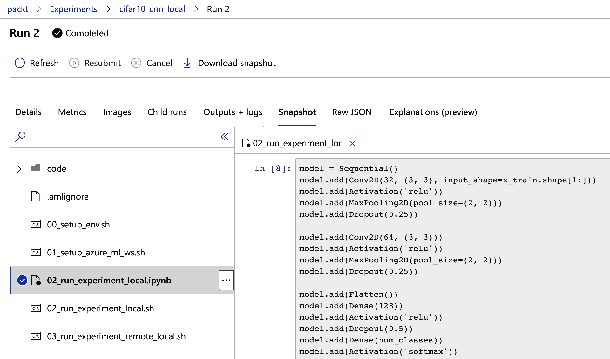

3.  如果你在脚本中运行你的代码，而不是在笔记本中，将你的训练代码包装在一个`try` - `except`块中是一个很好的实践，以便将你的运行状态传播给 Azure。如果训练运行失败，那么该运行将在 Azure 中被报告为失败运行。您可以通过使用以下代码片段来实现这一点:

```py
run = exp.start_logging()
try:
  # train your model here
  run.complete()
except:
  run.cancel()
  raise
```

我们包含了`raise`语句，以便在出现错误时使脚本失败。这通常不会发生，因为所有的异常都被捕获了。您可以通过使用`with`语句来简化前面的代码。这将产生相同的结果，并且更容易阅读:

```py
with exp.start_logging() as run:
  # train your model here
  pass
```

4.  除了在运行开始前上传的`snapshot`目录之外，`outputs`和`logs`目录在运行中是特殊的。一旦使用`run.complete()`完成一次运行，`outputs`目录的所有内容都会自动上传到 Azure ML 工作区。在一个使用 Keras 的简单示例中，我们可以将每个时期的最佳模型检查到`outputs`目录，并因此自动对每个实验的训练模型进行版本化和跟踪:

```py
import os
from keras.calbacks import ModelCheckpoint

outputs_dir = os.path.join(os.getcwd(), 'outputs')
model_name = 'keras_cifar10_trained_model.h5'
model_path = os.path.join(outputs_dir, model_name)

# define a checkpoint callback
checkpoint_cb = ModelCheckpoint(model_path,
  monitor='val_loss',
  save_best_only=True)

# train the model
model.fit(x_train, y_train,
  batch_size=batch_size,
  epochs=epochs,
  validation_data=(x_test, y_test),
  callbacks=[checkpoint_cb])
```

在前面的代码中，我们训练了一个 Keras 模型，并在每次迭代中将最佳模型写入定义的输出文件夹。因此，每当我们使用之前的实验跟踪运行训练时，一旦运行完成，模型就会自动上传。

我们可以看到(在下面的截图中)最好的模型被上传到了 Azure ML 工作区。这也非常方便，因为你不会失去你的训练模型了。最重要的是，所有工件都存储在 Blob 存储中，这是高度可伸缩且廉价的:

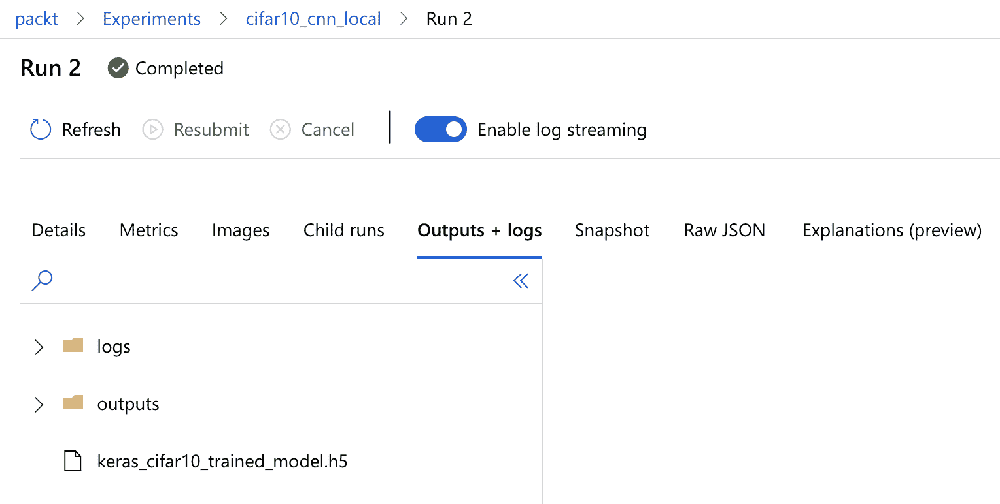

如果训练脚本是通过`ScriptRunConfig`调用的，而不是直接执行的，那么日志目录将会是流式的——我们将在下一节中看到这一点。这意味着您的日志将会出现并在发生时得到更新，而不仅仅是在每次运行结束时。

另一个要添加的实用工具是在 Azure ML 的模型工件存储中注册训练好的模型。为此，您只需要调用`run.register_model()`方法，如下面的代码片段所示:

```py
# Upload the best model
run.upload_file(model_name, model_path)

# Register the best model
run.register_model(model_name, model_path=model_name, 
    model_framework='TfKeras')
```

在前面的代码中，我们首先强制上传模型。这是必需的，因为所有输出资源都是在运行完成时才上传，而不是立即上传。因此，在上传模型之后，我们可以简单地在模型存储中注册它。模型被版本化，并在模型存储中可用，如下面的屏幕截图所示:

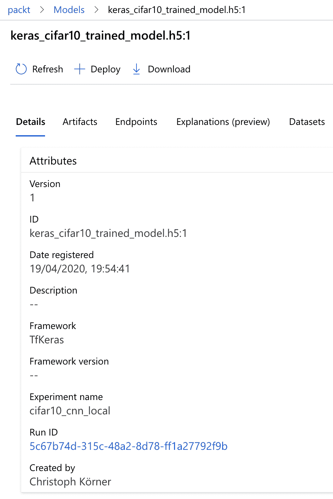

然后，该模型可用于 Azure ML 服务的自动部署。我们将在[第 11 章](c6e3ad17-9212-42ee-ae25-b111e530518a.xhtml)、*部署和操作机器学习模型*中更详细地了解这一点。

使用以前的代码，我们总是在新模型可用时用新版本更新模型。然而，这并不自动意味着新模型具有更好的训练或验证性能。因此，一种常见的方法是，只有当指定的度量比先前存储的实验的最高度量更好时，才注册新的模型。让我们实现这一点。我们可以使用以下函数从定义的实验中返回一个指标生成器:

```py
from azureml.core import Run

def get_metrics_from_exp(experiment, metric, status='Completed'):
  for run in Run.list(exp, status=status):
    yield run.get_metrics().get(metric)
```

前面的生成器函数为每个完成的运行生成指定的跟踪指标。现在，我们可以使用这个函数返回所有先前实验运行的最佳度量。我们使用最佳指标来比较当前模型的评估分数，并决定我们是否应该注册新版本的模型。只有当当前模型的性能优于先前记录的模型时，我们才应该这样做。此功能的代码如下所示:我们期望模型跟踪一个叫做`Test accuracy`的指标。我们将在下一节学习如何记录这一指标:

```py
# Get the highest test accuracy
best_test_acc = max(get_metrics_from_exp(exp, 'Test accuracy'))

# Evaluate the current model
scores = model.evaluate(x_test, y_test, verbose=1)

# Upload the model
run.upload_file(model_name, model_path)

if scores[0] > best_test_acc:
  # Register the best model as a new version
  run.register_model(model_name, model_path=model_name)
```

在前面的代码中，我们现在只在新模型的分数高于先前存储的最佳分数时才注册该模型。尽管如此，我们还是上传并跟踪了实验运行的模型二进制文件。现在我们知道了如何运行一个简单的实验，让我们在下一节学习如何记录指标和跟踪结果。


# 记录指标和跟踪结果

我们已经看到了三个有用的特性，用于在 Azure ML 工作空间中跟踪快照代码、上传输出工件和注册训练的模型文件。这些特性可以通过几行代码添加到任何现有的实验和训练 Python 脚本或笔记本中。同样，我们可以扩展实验脚本来跟踪各种变量，例如每个时期的训练精度和验证损失，以及最佳模型的测试集精度。

使用`run.log()`方法，您可以在训练和实验期间跟踪任何参数。您只需提供一个名称和值，Azure 会为您完成剩下的工作。后端会自动检测您是否发送了一个值列表——因此，当您在同一次运行中多次记录相同的值时，会有多个值具有相同的键——或者每次运行只发送一个值，例如，测试性能。在 Azure ML UI 中，这些值将自动用于显示您的训练表现。数值列表用于可视化您的运行性能，而每次运行的单个数值将用于显示您的实验性能。

让我们看一个例子，在这个例子中，我们使用了两种类型的指标。下面是一个简单的片段，展示了如何跟踪训练、验证和测试性能:

```py
for i in range(epochs):
  model.fit(X_train, y_train)
  scores = model.evaluate(x_val, y_val)
  run.log('Validation loss', scores[0])
  run.log('Validation accuracy', scores[1])

# Evaluate trained model
scores = model.evaluate(x_test, y_test)
run.log('Test loss', scores[0])
run.log('Test accuracy', scores[1])
```

前面的代码将这些值记录到 ML 工作空间运行中。当您在 Azure 门户的 UI 中打开运行时，列表值会自动转换为折线图，如以下屏幕截图所示:

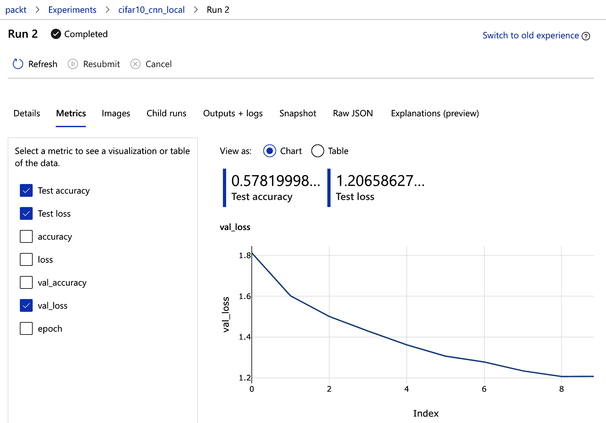

另一个漂亮的特性是 ML workspace 实验为您提供了所有运行的良好概览。它会自动使用每次运行记录的数值，并将其显示在仪表板上。您可以修改显示的值和用于在单次运行中聚合这些值的聚合方法。

下面的屏幕截图直接在实验仪表板上显示了最小测试损失和最大测试准确度:

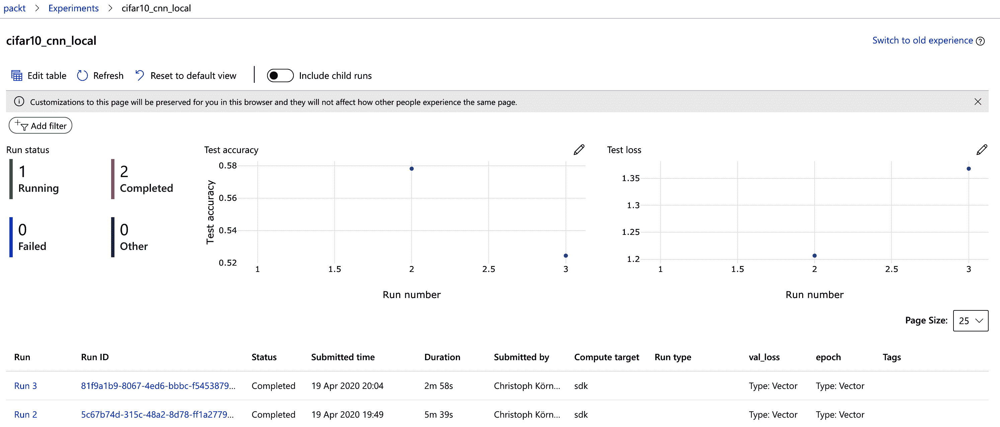

这是跟踪运行值并显示相应实验值的最简单方法。然而，我们已经可以看到，这些智能可视化也非常有帮助。值得一提的是，所有这些都是通过简单地向您现有的 ML 训练脚本添加几行代码来实现的，与您使用的框架无关。

将值记录到 Azure ML 的命令可以很容易地转换成更高级别的操作符来扩展您的 ML 项目。一个例子是在 fit 生成器中执行每个时期的 Keras 回调。我们可以编写这样一个类似于内置`RemoteMonitor`回调的回调函数:

```py
from keras.callbacks import Callback
import numpy as np

class AzureMlKerasCallback(Callback):

  def __init__(self, run)
    super(AzureMlKerasCallback, self).__init__()
    self.run = run

  def on_epoch_end(self, epoch, logs=None):
    logs = logs or {}
    send = {}
    send['epoch'] = epoch
    for k, v in logs.items(): 
      if isinstance(v, (np.ndarray, np.generic)):
        send[k] = v.item()
      else:
        send[k] = v
    for k, v in send.items():
      if isinstance(v, list):
        self.run.log_list(k, v)
      else:
        self.run.log(k, v)
```

前面的代码实现了一个简单的 Keras 回调函数。它收集要在字典中发送的指标，可以是数组或单个指标。现在，我们不再手工记录每个参数，而是简单地使用 Keras 训练脚本中的回调函数，如以下代码所示:

```py
# Create an Azure Machine Learning monitor callback
azureml_cb = AzureMlKerasCallback(run)

model.fit(x_train, y_train,
  batch_size=batch_size,
  epochs=epochs,
  validation_data=(x_test, y_test),
  callbacks=[azureml_cb])
```

前面的代码使用回调函数自然地扩展了 Keras，以跟踪 Azure ML 服务中的训练和验证损失和准确性。您可以在本书提供的源代码中找到完整的工作示例。也可以为其他 ML 库编写类似的模块；我们把这个留给你做练习。


# 计划和运行脚本

在上一节中，我们看到了如何用几行代码注释您现有的 ML 实验和训练代码，以便跟踪相关的度量并在您的工作空间中运行工件。在本节中，我们将从直接调用训练脚本转移到调度训练脚本在本地机器上运行。您可能会立即问为什么这个额外的步骤是有用的，因为直接调用训练脚本和安排训练脚本在本地运行之间没有太大的区别。

这一练习背后的主要动机是，在后续步骤中，我们可以将执行目标更改为远程目标，并在云中的计算集群而不是本地机器上运行训练代码。这将是一个巨大的优势，因为我们现在可以轻松地在本地测试代码，然后将相同的代码部署到云中高度可扩展的计算环境中。

另一个区别是，当调度训练脚本而不是调用它时，标准输出和错误流，以及`logs`目录中的所有文件将直接传输到 Azure ML 工作空间运行。这为您带来了巨大的好处——现在，您可以在 ML 工作空间中实时跟踪脚本输出，即使您的代码正在计算集群上运行。

让我们在一个*创作*脚本中实现它。我们称之为*创作*脚本(或*创作*环境)，当脚本或环境的工作是安排另一个训练或实验脚本时。当我们谈到实际运行和执行训练或实验脚本的脚本或环境时，我们指的是*执行*脚本(或*执行*环境)。

我们需要在创作脚本中定义两件事——定义执行环境的运行配置`RunConfiguration`和指定应该执行的脚本的运行脚本配置`ScriptRunConfig`。下面是定义这两者的代码片段:

```py
from azureml.core.runconfig import RunConfiguration
from azureml.core import ScriptRunConfig
import os

run_local = RunConfiguration()
run_local.environment.python.user_managed_dependencies = True

script_folder = os.path.join(os.getcwd(), 'examples')
src = ScriptRunConfig(source_directory=script_folder,
                      script='cifar10_cnn_remote.py',
                      run_config=run_local)
run = exp.submit(src)
run.wait_for_completion(show_output = True)
```

在前面的代码中，我们像前面几节一样提供了`exp`对象。首先，我们用用户管理的依赖项创建一个本地运行配置来定义执行环境。这意味着当我们在本地运行时，所有的依赖项都已经提供了。当我们随后将这个训练跑步转移到云中时，我们只需要更改跑步配置。

在下一行中，我们定义了想要在本地执行的目录和训练文件。最后，我们提交脚本，运行它，并等待它完成。现在，我们可以在 ML workspace 运行的日志部分跟踪脚本的输出，如下面的屏幕截图所示:

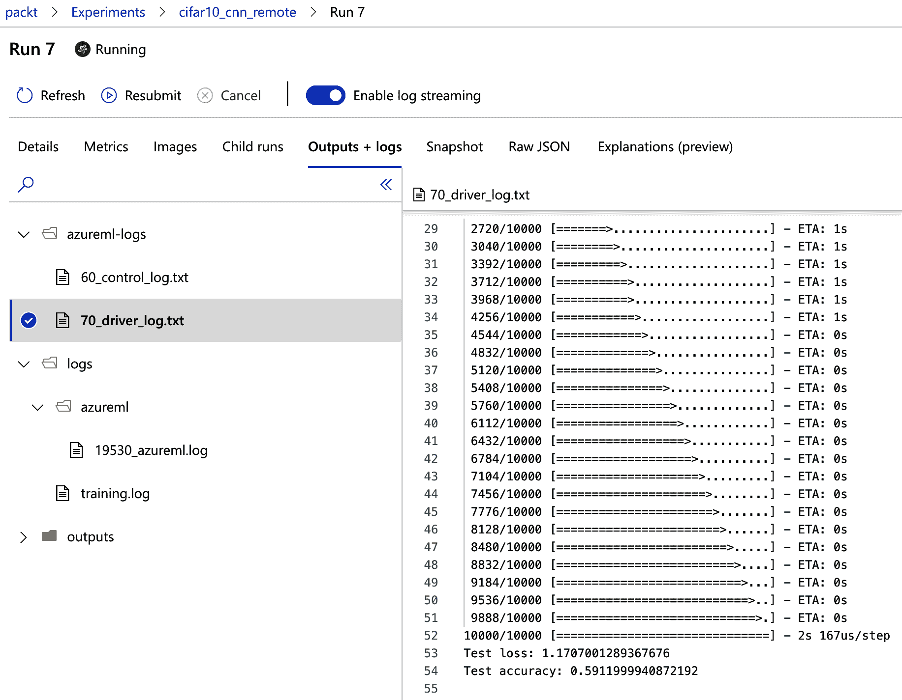

这非常方便，因为现在我们不需要知道代码最终在哪里执行。我们关心的只是看到输出；进度；并跟踪所有的度量、生成的模型以及所有其他的工件。通过调用`print(run.get_portal_url())`方法可以检索到当前运行的链接。然而，我们可以在笔记本环境中嵌入一个小部件，直接在 JupyterLab 中提供相同(或更多)的功能，而不是每次运行训练脚本时都导航到 Azure 门户。为此，我们需要用下面的代码片段替换`run.wait_for_completion()`行:

```py
from azureml.widgets import RunDetails

RunDetails(run).show()
```

最后，如果我们想转移到远程执行环境，我们需要推断运行上下文。在执行脚本中，我们现在从当前执行上下文中加载`run`对象，而不是像前面几节那样创建一个新的运行。我们可以用下面的语句改变`exp.start_logging`调用:

```py
from azureml.core import Run

# Load the current run
run = Run.get_context()
```

在前面的代码中，我们用从当前上下文自动推断出`run`对象的代码替换了前面的`start_logging()`方法。当`run`对象通过实验被调度时，它将自动与实验链接。这对于远程执行来说非常方便，因为我们不再需要显式指定`run`对象。

使用推断出的`run`对象，我们可以记录值、上传文件和文件夹，以及注册模型，就像在前面的小节中一样。您可以在本书提供的源代码中找到一个工作示例。


# 将云计算添加到工作空间

在 Azure ML 服务中，您可以在 Azure 中使用两种不同类型的计算目标——托管和非托管。托管计算将直接从 ML 工作区内进行管理，而非托管计算将仅连接到您的工作区。当 ML 工作空间被删除时，所有被管理的计算目标也将被删除，而未被管理的(附加的)计算目标将继续存在。

在 Azure 中训练 ML 模型的推荐计算目标是托管 Azure ML 计算服务——一个在 Azure 订阅中直接管理的自动扩展计算集群。如果你已经将 Azure 用于批处理工作负载，你会发现它类似于 Azure Batch 和 Azure Batch AI，配置更少，并且紧密嵌入在 Azure ML 中。您可以通过单击“Training clusters”在 UI 中的“Compute”菜单下找到它。在 SDK 中，我们使用`Amlcompute`计算类型(Azure ML Compute cluster 的缩写)来定义这样一个训练集群。

让我们使用 Azure ML Python SDK 创建一个新的计算目标作为执行环境:

```py
from azureml.core.compute import ComputeTarget, AmlCompute

compute_config = AmlCompute.provisioning_configuration(
  vm_size='STANDARD_D2_V2',
  max_nodes=4)

cpu_cluster = ComputeTarget.create(ws, cpu_cluster_name, compute_config)
cpu_cluster.wait_for_completion(show_output=True)
```

前面的代码使用`STANDARD_D2_V2`虚拟机(2 个 CPU、7 GB RAM 和 100 GB HDD)作为工作节点，直接在您的 Azure ML 工作空间中创建一个针对 ML 优化的自动扩展计算集群。正如您所看到的，我们正在调整工作节点的最大数量以及所需的虚拟机大小和更多参数，如 VNet、子网、SSL 或负载平衡器配置。您甚至可以为您的计算集群配置低优先级虚拟机。

您还可以定义使用 GPU 作为工作节点的虚拟机类型，例如，`Standard_NC6` (6 个 CPU、56 GB RAM、340 GB SSD、1 个 GPU 和 12 GB GPU 内存)，只需更改配置即可。这很好，因为与 Azure Databricks 等其他托管集群相比，您不需要为头节点或主节点付费，只需要为工作节点付费。我们将在[第 7 章](ef8acb66-47eb-415f-ba95-680d645e2ef3.xhtml)、*在 Azure 上训练深度神经网络*中更详细地讨论深度学习的虚拟机类型，并在[第 9 章](8a4eafa1-2b6b-4fca-ab84-edaeeb149b25.xhtml)、*在 Azure ML 集群上运行分布式机器学习*中对 GPU 集群进行分布式训练。

值得注意的是，设置和配置您的集群也可以使用 Azure ML CLI 或 Azure ML SDK 的任何其他支持的语言来完成。

你可能会问自己，在某个特定的位置，Azure ML 有哪些可用的 VM 类型。您可以使用`AmlCompute.supported_vmsizes()`方法检索一个最新的列表，并传递您的工作区和(可选)您的目标位置:

```py
from azureml.core.compute import AmlCompute

AmlCompute.supported_vmsizes(workspace=ws, location='northeurope')
```

现在，我们返回创作脚本，并将执行目标更改为在这个远程计算集群`amldemocompute`上执行训练脚本。在这种情况下，我们按名称加载计算目标，并等待它可用—如果它不存在，我们就创建它。如果将以下脚本封装在一个函数中，该函数将配置作为参数，并在创建集群之前阻止执行，那么该脚本会非常方便:

```py
from azureml.core.compute import ComputeTarget, AmlCompute
from azureml.core.compute_target import ComputeTargetException

# Choose a name for your AML cluster
aml_cluster_name = "amldemocompute"

# Configure your compute cluster
vm_size='STANDARD_D2_V2'
max_nodes=4

# Verify that the cluster exists already
try:
  aml_cluster = ComputeTarget(workspace=ws, name=aml_cluster_name)
except ComputeTargetException:
  print('Cluster not `%s` found, creating one now.' % aml_cluster_name)
  compute_config = AmlCompute.provisioning_configuration(
    vm_size=vm_size, max_nodes=max_nodes)
  aml_cluster = ComputeTarget.create(ws, aml_cluster_name, compute_config)

# Wait until the cluster is ready
aml_cluster.wait_for_completion(show_output=True)
```

在前面的代码中，我们重用了前面的功能来创建集群，并将它们嵌入到一个函数中，该函数要么返回集群并启动它(如果它存在)，要么创建一个全新的集群。

接下来，我们必须配置运行配置，从而配置我们想要在其中运行代码的计算目标上的环境。这意味着我们需要配置训练脚本所需的所有库、框架和服务。这种环境可以由 Docker 基本映像以及其他 Conda 包来定义:

```py
from azureml.core.runconfig import RunConfiguration
from azureml.core.conda_dependencies import CondaDependencies
from azureml.core.runconfig import DEFAULT_CPU_IMAGE

# Create a remote run configuration
run_amlcompute = RunConfiguration()

run_amlcompute.target = aml_cluster
run_amlcompute.environment.docker.enabled = True
run_amlcompute.environment.docker.base_image = DEFAULT_CPU_IMAGE

ds_packages = [
  'numpy', 'pandas', 'matplotlib', 'seaborn', 'scikit-learn', 'keras'
]

run_amlcompute.auto_prepare_environment = True
run_amlcompute.environment.python.user_managed_dependencies = False
run_amlcompute.environment.python.conda_dependencies = 
  CondaDependencies.create(conda_packages=ds_packages)
```

在前面的代码中，我们创建了一个新的运行配置，并指定了基本 Docker 映像，以及要安装在该环境中的其他 Conda 包。我们定义了通用数据科学库，并将它们附加到我们的 Conda 环境的训练集群中。

请注意，一旦您为作业运行创建了此运行配置，它将被加载到您的容器注册表中，该注册表会自动添加到您的 Azure ML 工作区中。

最后，我们修改脚本配置，以便它使用新创建的运行配置作为计算目标:

```py
from azureml.core import ScriptRunConfig
from azureml.widgets import RunDetails

script = 'cifar10_cnn_remote.py'
script_folder = os.path.join(os.getcwd(), 'examples')

src = ScriptRunConfig(
 source_directory=script_folder,
 script=script,
 run_config=run_amlcompute)
run = exp.submit(src)
RunDetails(run).show()
```

训练脚本现在在 Azure 上的远程计算目标中执行。在 ML 工作区中，收集快照、输出和日志看起来非常类似于本地运行。但是，我们现在还可以看到用于此次运行的 Docker 环境构建的日志，如下面的屏幕截图所示:

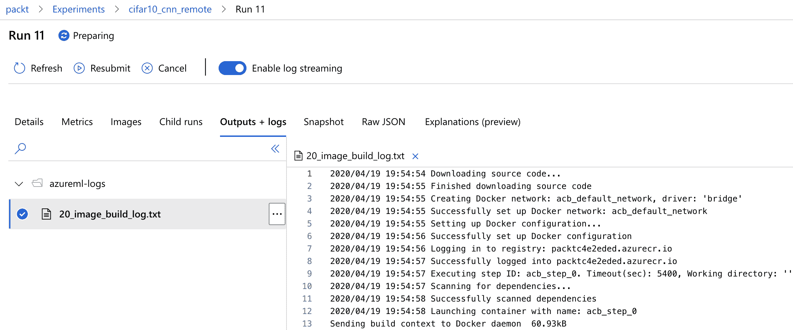

让我们再次捕捉当我们将运行提交给 Azure ML 时发生了什么:

*   Azure ML 在 Docker 中构建配置好的环境，如果它还不存在的话。
*   Azure ML 在私有容器注册表中注册您的环境，因此它可以被其他脚本和部署重用。
*   Azure ML 将您的脚本执行排队。
*   Azure ML Compute 初始化并扩展一个计算节点。
*   Azure ML Compute 执行脚本。
*   Azure ML Compute 捕获日志、工件和指标，并将它们流式传输到 Azure ML。
*   Azure ML 在 Blob 存储中存储所有工件，在应用洞察中存储您的指标。
*   Azure ML 通过 UI 或 API 为你提供了所有关于运行的信息。
*   Azure ML 内联 Juptyer 笔记本中用作创作环境的所有日志。
*   Azure ML Compute 会在 *x* 分钟不活动后自动缩减集群。

这简直不可思议。考虑到设置 Azure ML 工作空间只花了我们大约 5 分钟的时间，我们为所有 ML 工作负载提供了一个成熟的批处理计算调度和执行环境。这个环境的许多部分都可以根据您的喜好进行调整和配置，最棒的是:一切都可以通过 Azure CLI 或 Azure SDK 实现自动化。在本书的以下章节中，我们将使用 Python SDK 来配置、启动、缩放和删除用于训练和评分的聚类。

在下一章中，我们将学习如何执行降维以可视化高维数据集，并像 Azure ML 中的指标一样自动跟踪它们。


# 可视化高维数据

处理新数据集的第一步应该是系统地研究数据，通过手动检查数据集来找到模式、假设和见解。虽然这个建议一开始可能对您有意义，但当您的数据集在电子表格中包含数千个数值时，它将很难遵循。你应该如何浏览数据？你应该寻找什么？又能得到哪些感悟？

快速洞察和充分理解数据的一个好方法是将数据可视化。这也有助于您识别数据中的聚类以及不规则和异常，所有这些都需要在所有进一步的数据处理中加以考虑。但是，如何可视化具有 10、100、1000 个特征维度的数据集呢？你应该把分析放在哪里？

在本节中，我们将回答所有这些问题。首先，我们将探索 Azure ML 功能，用您的实验注册 Matplotlib 图形。这将对您的所有特征工作非常有帮助，因为您将能够将可视化附加到您的所有实验，从而有助于在稍后阶段理解您的数据、模型和实验。

然后，我们将研究线性嵌入技术 PCA(无监督降维)和 LDA(一种监督技术，用于在给定目标标签的情况下计算数据集中的判别向量)。然后，我们将这两种技术与两种流行的无监督非线性嵌入技术进行比较，t-SNE 和 UMAP——t-SNE 的广义和更快版本。在你的工具链中拥有这四种技术将有助于你理解数据集和创建有意义的可视化。


# 在 Azure ML 中跟踪实验中的数字

在上一节中，我们发现了如何使用 Azure ML 跟踪 ML 实验的指标和文件。数据转换和 ML 脚本的其他重要输出是可视化、数据分布图、关于模型的见解以及解释结果。因此，Azure ML 提供了一种类似的方法来跟踪图像、图形和 Matplotlib 引用的指标。

让我们来看一个典型的场景；我们将从查看高维数据的最简单方法开始:一个可视化所有特征组合的二维网格。该可视化也被称为 **pairplot** ，是可视化库 **seaborn** 中的标准可视化类型。

下面的截图显示了流行的 iris flower 数据集的 pairplot，它包含四个特征维度(`sepal_length`、`sepal_width`、`petal_length`和`petal_width`)和一个目标类(`species`)。在网格单元中，我们可以看到两个特征维度组合的微小散点图。沿着对角线，我们简单地画出特征尺寸的分布。作为附加信息，我们在每个单元格中将目标类编码为`hue`:

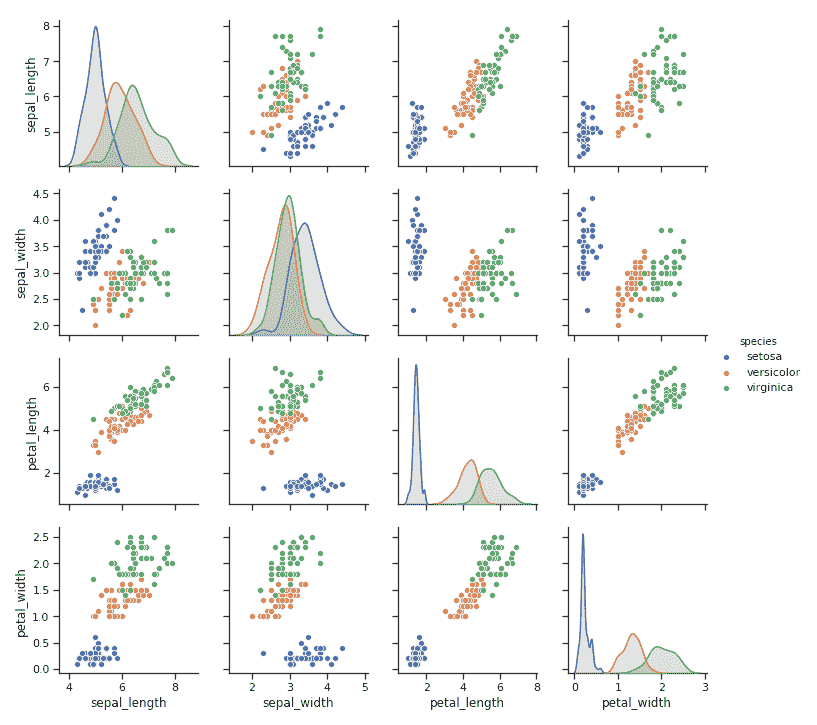

要在笔记本中复制该图，请运行以下代码片段。首先，我们加载 seaborn 库中打包的 iris 数据集，接下来，我们调用`pairplot()`方法绘制它。这将返回一个 Matplotlib 图形，并在笔记本环境中显示它:

```py
import seaborn as sns
sns.set(style="ticks")

df = sns.load_dataset("iris")
sns.pairplot(df, hue="species")
```

前面的代码很有趣，因为它是一种非常简单的可视化高维数据的方式，类似于您在接收新数据集时首先要做的事情。虽然它对于非常高维的数据并不真正有用，但它为我们提供了一个很好的起点。我们将在接下来的章节中研究更复杂的技术。

更有趣的是，我们如何在我们的数据实验和准备脚本中，以及随后在训练和优化管道中自动嵌入像前面那样的代码。通过几行代码，我们可以跟踪所有的 Matplotlib 图形，并将它们附加到我们的实验运行中。为此，我们只需将 Matplotlib 引用传递给`run.log_image()`方法，并给它一个合适的名称。以下代码片段显示了这在实验中的表现:

```py
with exp.start_logging() as run:
  fig = sns.pairplot(df, hue="species")
  run.log_image("pairplot", plot=fig)
```

现在，这是令人惊奇的部分。通过调用带有 Matplotlib 引用的函数，Azure ML 将呈现该图，保存它，并将其附加到实验运行中。下面的截图显示了点击了 Images 选项卡的 Azure ML UI。您可以看到我们刚刚创建并注册的`pairplot`图像，附在跑步记录上:

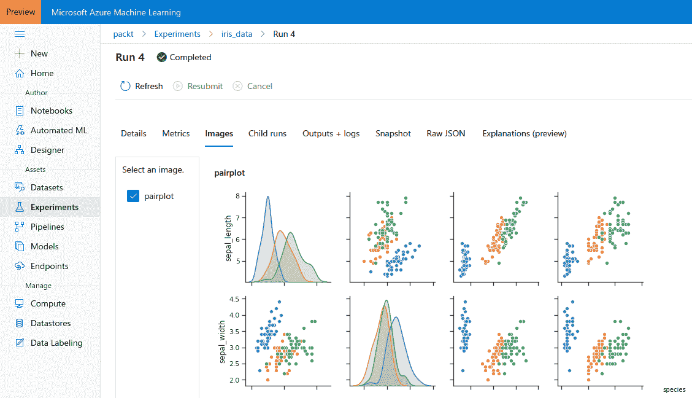

这看起来是一个微小的特性，但在现实世界的实验中却非常有用。习惯于自动生成数据、模型和结果的图，并将它们附加到您的跑步中。无论您以后何时进行实验，您都将拥有已经附加到您的跑步、度量和配置的所有可视化。

考虑在训练回归模型时存储回归图，在训练分类模型时存储混淆矩阵和 ROC 曲线。为神经网络训练基于树的集成和激活时，存储您的特征重要性。您只需实现一次，就可以为您的数据和 ML 管道添加大量有用的信息。

当使用 AutoML 和 HyperDrive 优化参数、预处理、特征工程和模型选择时，您将获得大量现成的可视化结果，帮助您理解数据、模型和结果。

让我们来发现一些对可视化数据集洞察力和高维数据有用的算法。为了简洁起见，本节省略了生成嵌入的代码，但是可以在本书相应的 Github 资源库中找到。


# 无监督的 PCA 降维方法

最流行的线性降维技术是 PCA，因为它是一种无监督的方法，因此不需要任何训练标签。PCA 嵌入线性变换数据集，使得结果投影不相关。这个项目的轴被称为**主成分**，并且以这样的方式计算，即它们中的每一个都具有下一个最高的方差。

主成分是数据中最高方差的方向。这意味着主成分或特征向量描述了数据集的最强方向，下一个维度显示了与前一个方向的正交差异。在 NLP 中，主要组件对应于高级概念——在推荐引擎中，它们对应于用户或项目特征。

PCA 可以作为协方差或相关矩阵的特征值分解来计算，或者通过使用 SVD 在非方阵上计算。PCA 和特征值分解通常用作可视化的数据实验步骤，而 SVD 通常用作稀疏数据集的降维，例如 NLP 的词袋模型。我们将在[第 5 章](2e9b480a-5003-4fc8-a5c6-bc2ba75c21b3.xhtml)、*使用 NLP 的高级特征提取*中看到 SVD 的实际应用。

嵌入技术可以通过简单地移除除了第一个 *x* 分量之外的所有分量来用作降维，因为这些第一个也是最大的分量解释了数据集的一定百分比的方差。因此，我们移除具有低方差的数据以接收低维数据集。

对 PCA 后的数据进行二维可视化(或在任何嵌入技术后),就是对变换数据集的前两个分量进行可视化——两个最大的主分量。生成的数据沿轴(主成分)旋转，缩放，并以零为中心。如下图所示，所有可视化都在 *x* 轴上投影了最高方差，在 *y* 轴上投影了第二高方差，依此类推。

图中显示了 PCA 应用于三个日益复杂的数据集:

*   **鸢尾花数据集**:三类四个特征维度
*   **UCI 葡萄酒识别数据集**:三类十三个特征维度
*   **MNIST 手写数字数据集** : 10 个类别和 784 个特征尺寸(28×28 像素图像)

作为第一个观察，我们应该承认，我们可以在二维空间显示所有这三个数据集，并立即识别集群，这是一个伟大的第一步。如果你回到鸢尾花配对图可视化，看看萼片宽度对萼片长度散点图，我们将无法在数据中看到线性可分离的集群。然而，通过将数据投射到前两个主成分上，我们可以在左图中看到，所有的聚类看起来都是线性可分的(在二维空间中)。

当看右边的 UCI 葡萄酒数据集时，我们已经可以看出这些聚类不再非常明显了。现在，13 个特征尺寸沿着前两个主成分被投影，最高方差沿着 *x* 轴，第二高方差沿着 *x* 轴。在 PCA 中，聚类形状通常与 *x* 轴对齐，因为这是算法的工作方式:

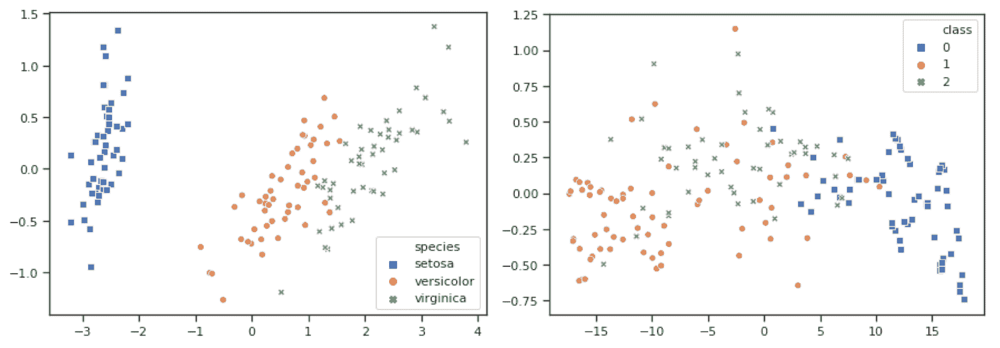

最后，当查看 MNIST 手写数字数据集的更复杂的嵌入时，除了顶部的数字 0 的群集之外，我们看不到许多群集。数据以零为中心，并缩放到-30 和 30 之间的范围。因此，我们已经可以看出 PCA 的缺点——它没有考虑任何目标标签，因此没有对可分离的类进行优化:

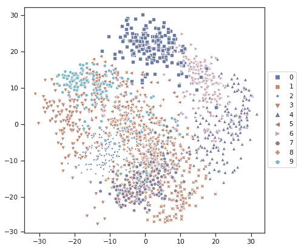

让我们来看看一种将目标标签考虑在内的技术。


# 使用 LDA 进行监督投影

在 LDA 中，我们对输入数据执行线性变换(类似于 PCA ),并对变换进行优化，以使结果方向具有最高的类间方差和最低的类内方差。这意味着优化会尝试使同一聚类的样本接近聚类的均值，同时尝试使聚类的均值尽可能远离。

在 LDA 中，我们还接收一组线性加权方向作为结果变换。数据以 0 为中心，方向按最高的类间方差排序。因此，在这个意义上，LDA 类似于考虑目标标签的 PCA。LDA 和 PCA 都没有真正的调谐旋钮，除了我们希望保留在投影中的分量数量和可能的随机初始化种子。

当查看与上一节相同的数据集的以下可视化时，我们可以看到数据被转换为二维，其方式是聚类平均值在 *x* 轴上彼此相距最远。我们观察到虹膜(左)和 UCI 葡萄酒(右)识别数据集的效果相同。我们可以在两种嵌入中观察到的另一个有趣的事实是，数据也可以线性分离。我们几乎可以在两种可视化效果中放置两条直线来区分集群:

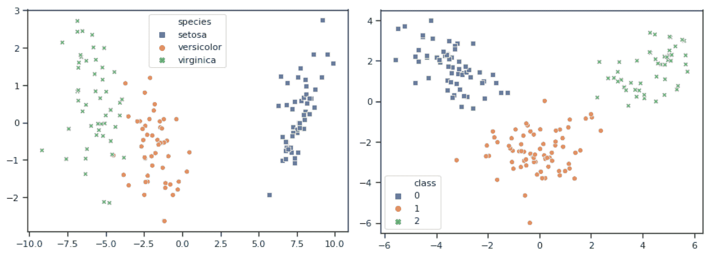

就数据按类的可分性而言，前面两个数据集的 LDA 嵌入看起来相当好。前面的屏幕截图将给出一个有把握的估计，即两个数据集的线性分类器应该实现很好的性能，例如，95%以上的准确率。虽然这可能只是一个大概的估计，但我们已经知道通过最少的分析和数据预处理可以从线性分类器中得到什么。不幸的是，大多数真实世界的嵌入看起来更像下面的数字，而不像前两个数字:

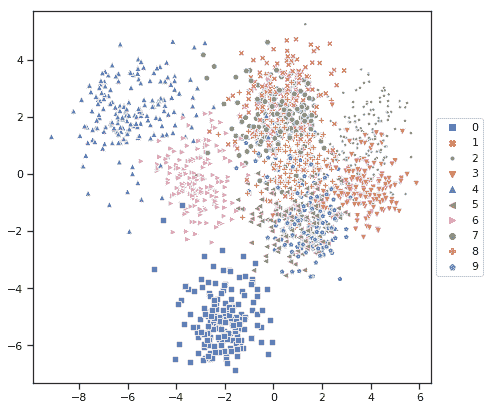

大多数真实世界的数据都是高维的，通常有 10 个甚至 100 个以上的特征维。在前面的示例中，我们再次看到底部包含 0 位数字的群集和左侧包含 4 位和 6 位数字的两个群集的良好分离。所有其他的集群都被绘制在彼此之上，看起来不像是线性可分的。因此，我们可以说线性分类器不会表现得很好，可能只有大约 30%的准确率——这仍然比随机分类器好得多。然而，我们无法真正说出我们期望从复杂的非线性模型中获得什么样的性能，甚至可能是非参数模型，如基于决策树的集成分类器。

正如我们所看到的，LDA 毫不奇怪地比 PCA 表现得更好，因为它考虑了类别标签。对于小于 100 维和分类目标变量的线性可分数据集，这是一种很好的嵌入技术。LDA 的扩展是**二次判别分析** ( **QDA** )，它使用两个变量的组合来执行非线性预测。

如果您正在处理连续的目标变量，您可以使用一种非常类似的技术，称为**方差分析** ( **ANOVA** )来建模集群之间的方差。ANOVA 变换的结果表明数据集中的方差是否归因于不同分量的方差的组合。

正如我们所见，PCA 和 LDA 在分离高维数据(如图像数据)时表现不佳。在手写图像数据集中，我们只处理来自 28 x 28 像素图像的*784 个特征尺寸。想象一下，您的数据集由 1024 x 1024 像素的图像组成，您的数据集将有超过一百万个维度。因此，对于非常高维的数据集，我们确实需要一种更好的嵌入技术。*


# 基于 t-SNE 的非线性降维

几年前，将高维数据集投影到二维或三维是极其困难和繁琐的。如果您想要在二维图形上可视化图像数据，您可以使用之前讨论过的任何技术(如果它们能够计算出结果的话),或者尝试一些奇特的嵌入方法，比如自组织地图。

然而，在 2012 年末，在默克 Viz Kaggle 竞赛中排名第一的团队使用了 t-SNE 嵌入——这是一种非常规的发布伟大嵌入算法的方式。然而，自那场比赛结束以来，t-SNE 一直定期在其他 Kaggle 比赛中使用，并被大公司用于嵌入高维数据集，取得了巨大的成功。

t-SNE 将高维特征投影到二维或三维空间，同时最小化高维和低维空间中相似点的差异。因此，彼此接近的高维特征向量很可能在二维嵌入中彼此接近。

下面的截图显示了 t-SNE 应用于虹膜和 UCI 葡萄酒识别数据集。正如我们所看到的，复杂的非线性嵌入并不比简单的 PCA 或 LDA 技术好多少。然而，它的真正威力是在非常大和高维的数据集上凸显出来的，多达 3000 万次对数千种特征维度的观察:

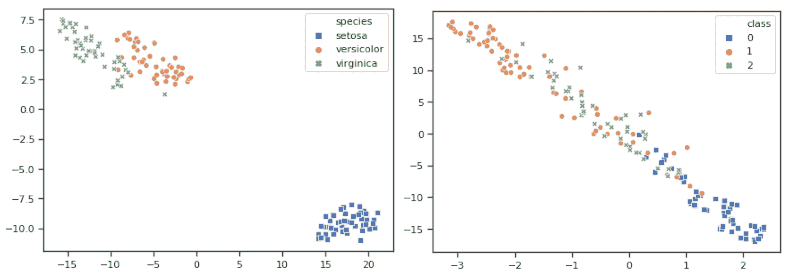

正如我们在下面的截图中看到的，t-SNE 在 MNIST 数据集上表现得更好，毫不费力地分离了 10 个手写数字的聚类。虽然在二维 LDA 嵌入中分离数据似乎是不可能的——其中前二维仅解释了总方差的 47%——t-SNE 嵌入表明 99%的准确性是可能的:

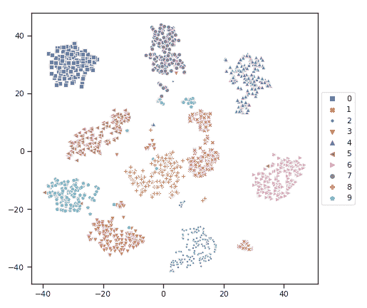

这种可视化的美妙之处不仅在于我们可以看到数据实际上是可分离的，我们还可以想象当分类器根据数据进行训练时，混淆矩阵会是什么样子——只需查看前面的可视化即可。下面是一些观察结果(在 PCA 或 LDA 嵌入中我们不容易识别),这些观察结果是我们可以从嵌入中推断出来的:

*   有三组 1，其中一组远离平均值。
*   有三组 9，其中一组看起来像 1，另一组看起来像 7。
*   有一串看起来像 8 的 3。
*   有一小簇看起来像 8 的 2。
*   3 和 9 的群集非常接近，所以它们可能看起来很相似。
*   由 0、4 和 6 组成的群集与其他群集相距甚远。

这些都是很棒的见解，因为您现在知道在手动探索样本时，在您的数据中应该期待什么和寻找什么。它还可以帮助您调整您的特征工程，例如，尝试区分 1、7 和 9，因为它们将导致以后的大多数错误分类。


# 用 UMAP 推广 t-SNE

降维 UMAP 是一种通用流形学习和降维算法。它是基于黎曼几何和代数拓扑的 t-SNE 的推广。

总的来说，UMAP 执行与 t-SNE 相似的结果，具有拓扑方法、更好的特征维度可伸缩性和运行时更快的计算。由于它速度更快，并且在拓扑结构方面表现略好，所以它很快受到欢迎。

如果我们再次查看 iris 和 UCI 葡萄酒识别数据集的嵌入，我们会看到与之前 t-SNE 相似的效果。得到的嵌入看起来合理，但并不比 LDA 的线性可分结果更好。然而，我们不能只通过比较结果来衡量计算性能，这就是 UMAP 真正的亮点:

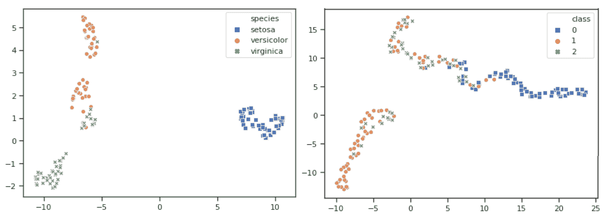

当涉及到更高维的数据时，比如 MNIST 手写数字数据集，UMAP 作为一种二维嵌入技术表现得非常好。它在嵌入时将簇简化为完全可分离的实体，簇之间的重叠最小，距离很大。类似的观察结果，如类 1 和类 9 的聚类仍然是可能的，但是在下面的屏幕截图中，聚类看起来更容易分离:

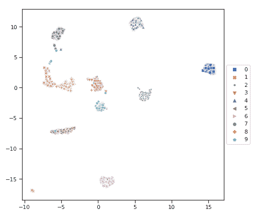

从这些数据实验和可视化技术中，我们希望您获得以下关键知识:

*   执行 PCA 以尝试分析特征向量。
*   执行 LDA 或 ANOVA 以了解数据的差异。
*   如果有复杂的高维数据，请执行 UMAP 嵌入。

有了这些知识，我们可以直接进入数据处理和特征工程，知道哪些数据样本将容易处理，哪些样本将在未来导致高误分类率。


# 摘要

在这一章中，我们设置了我们的 Azure ML 工作空间，创建了我们的第一个 Azure ML 计算集群(`Amlcompute`)，并在集群上运行了一个初始实验。从工作区的设置到集群的创建和训练脚本的提交，一切都是自动化的。

Azure ML 帮助你跟踪实验、度量、训练脚本、日志、训练模型、工件、度量、图像等等。在本章中，我们从一个小的 ML 脚本开始，一步一步地添加额外的功能来利用现代 ML 基础设施和管理技术。我们注册实验，在本地和计算集群上执行运行，在每次运行时存储训练文件夹的快照，收集每个时期的训练分数和每次运行的测试分数，并将输出直接传输回笔记本环境。通过几行代码，您可以将训练好的模型与所有以前注册的模型进行比较。然后，您可以将该模型注册为新版本。

然后，您学习了可视化高维数据集的降维技术。Azure ML 的伟大之处在于，您还可以在计算集群上执行数据实验和分析，并跟踪所有生成的数字和输出。我们比较了无监督 PCA 和有监督 LDA——两者都是线性嵌入。然后，我们比较了线性技术和非线性降维，如 t-SNE 和广义形式，UMAP。所有这些技术对于理解数据、主成分、判别方向和可分性都非常有用。

在下一章中，我们将使用到目前为止学到的所有知识，通过执行数据加载(ETL)、数据准备和特征提取来开始数据建模。试着养成一种习惯，创建你的数据的可视化，并在你的 Azure ML 实验中以图形的形式附上它们。