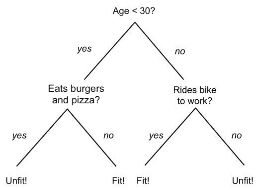
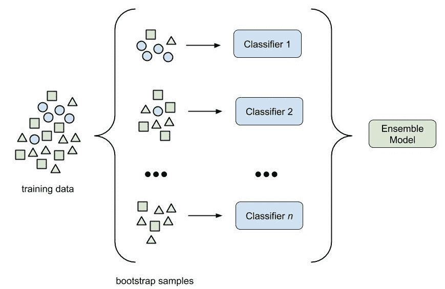
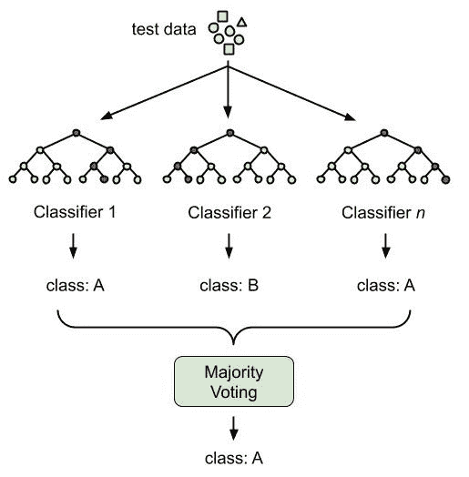
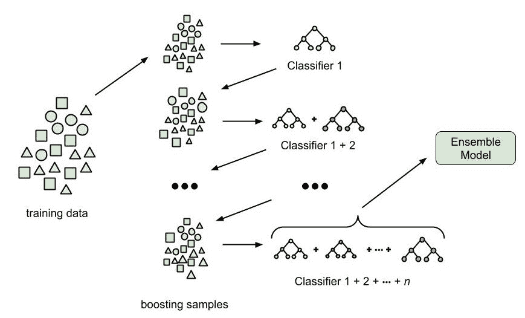
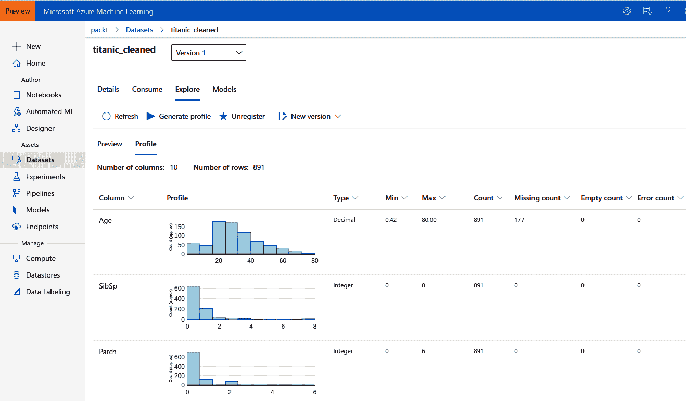
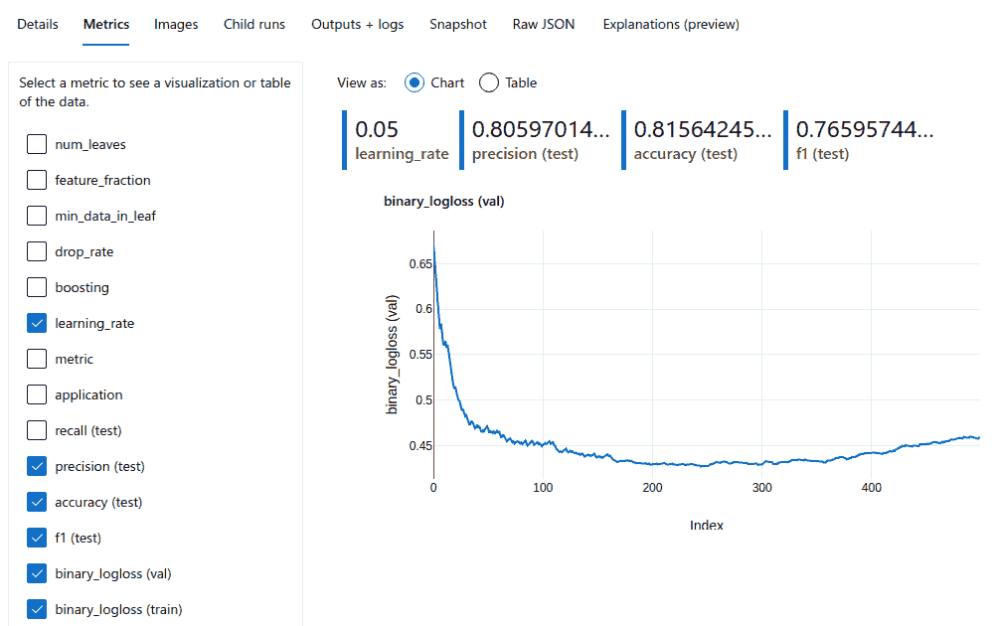
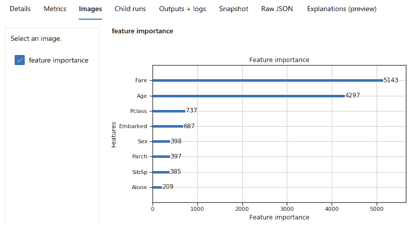

# 六、使用 Azure 机器学习构建 ML 模型

在前一章中，我们学习了如何使用 NLP 技术从文本和分类列中提取特征。在这一章中，我们将使用我们迄今为止所获得的知识来创建和训练一个强大的基于树的集成分类器。

首先，我们将看看流行的集成分类器的幕后，如 random forest、XGBoost 和 LightGBM。这些分类器在实际的真实场景中表现得非常好，并且都是基于幕后的决策树。通过理解它们的主要好处，你将能够很容易地发现可以用集成决策树分类器解决的问题。

我们还将了解梯度推进和随机森林之间的区别，以及是什么使这些树集合对实际应用有用。这两种技术都有助于克服决策树的主要弱点，并且可以应用于许多不同的分类和回归问题。

最后，我们将使用到目前为止所学的所有技术，在一个样本数据集上训练一个 LightGBM 分类器。我们将编写一个训练脚本，自动记录所有参数、评估指标和数字，并且可以使用命令行参数进行配置。然后，我们将在 Azure 机器学习计算集群上安排训练脚本，我们将用两行 Python 代码生成该脚本。

在本章中，我们将讨论以下主题:

*   使用基于树的集成分类器
*   使用 LightGBM 训练集成分类器模型


# 使用基于树的集成分类器

近年来，基于监督树的集成分类和回归技术在许多实际应用中被证明是非常成功的。因此，如今它们被广泛应用于各种应用中，例如欺诈检测、推荐引擎、标签引擎等等。您最喜爱的操作系统(移动和桌面)、办公程序以及音频或视频流服务每天都会大量使用它们。

因此，在本节中，我们将深入探讨他们受欢迎程度和表现的主要原因和驱动因素，包括训练和得分。如果你是传统 ML 算法的专家，并且知道 boosting 和 bagging 之间的区别，你可能会直接跳到*使用 LightGBM* 训练集成分类器模型一节——否则，我鼓励你仔细阅读这一节。

我们首先来看决策树，这是一种已经有几十年历史的非常简单的技术。我鼓励你跟随甚至简单的方法，因为它们建立了当今最先进的经典监督 ML 方法的基础。我们还将详细探讨基于树的分类器的优势，以帮助您选择经典方法而不是基于深度学习的 ML 模型。

单个决策树也有很多缺点，并且总是用于集合模型，而不是作为单独的模型；我们将在这一部分的后面更仔细地看看缺点。之后，我们将发现将多个弱个体树组合成单个强集成分类器的方法，该集成分类器建立在基于树的方法的优势基础上，并将它们转换成今天的样子——功能强大的多用途监督 ML 模型，该模型集成到几乎每个现成的 ML 平台中。


# 理解简单的决策树

我们先来讨论一下什么是决策树，它是如何工作的。决策树估计器是一种受监督的 ML 方法，它学习用多个嵌套的`if` / `else`语句来逼近一个函数。该函数可以是连续回归函数或决策边界函数。因此，像许多其他 ML 方法一样，决策树可以用于学习回归和分类问题。

从前面的描述中，我们可以立即发现决策树的一些重要优势:

*   一个是处理不同数据分布、数据类型和 ML 问题的灵活性。
*   另一个优势也是它们与更复杂的模型竞争的原因之一是它们的可解释性。基于树的模型和集合可以可视化，甚至可以打印在纸上，以解释评分结果的决策(输出)。
*   第三个优势在于它们在训练性能、模型大小和有效性方面的实际应用。将预先训练好的决策树集成到桌面、web 或移动应用程序中，比深度学习方法简单得多，速度也更快。

请注意，我们不打算出售基于树的集成作为每个 ML 问题的解决方案，也不打算淡化深度学习方法的重要性。我们更想让你意识到传统方法的优势，这样你就可以针对你的问题评估正确的方法。

下图显示了用于决定一个人是否合适的决策树示例:



这是一个经过训练的决策树的例子，我们可以通过简单地遍历每个节点并到达树的叶子上的类标签来对模型进行评分。


# 决策树的优势

基于决策树的 ML 模型非常受欢迎，因为它们在处理数据混乱、有偏见和不完整的现实世界应用程序时有很大的优势。主要优势如下:

*   支持广泛的应用程序
*   它们几乎不需要数据准备
*   模型的可解释性
*   快速训练和快速得分

首先，让我们关注决策树的灵活性，这是与许多其他经典/统计 ML 方法相比，决策树的主要优势之一。虽然通用框架非常灵活，并支持分类、回归以及多输出问题，但由于它可以开箱即用地处理数值和分类数据，因此它受到了广泛的欢迎。由于嵌套的`if` - `else`树，它还可以处理名义类别以及数据中的`NULL`或缺失值。决策树很受欢迎，因为它们不需要事先进行大量的预处理和数据清理。

虽然数据准备和清理是每个 ML 管道中的重要步骤，但拥有一个自然支持开箱即用的分类输入数据的框架仍然非常好。一些基于集成树的分类器建立在这一优势之上，例如，CatBoost——Yandex Research 的梯度提升树实现，具有对分类数据的本机支持。

基于树的模型的另一个重要优势是模型的可解释性，尤其是从商业角度来看。与其他 ML 方法不同，决策树分类器模型的输出不是巨大的参数决策边界函数。经过训练的深度学习模型通常会生成一个具有超过 10-100 百万个参数的模型，因此表现得像一个黑盒——尤其是对商业决策者而言。虽然可以获得关于深度学习模型中激活的见解和推理，但通常很难推理出输入参数对输出变量的影响。

可解释性是基于树的方法的亮点。与许多其他传统的 ML 方法(如 SVM、逻辑回归或深度学习)相比，决策树是非参数模型，因此，不使用参数来描述要学习的函数。它使用一个嵌套的决策树，可以在纸上绘制、可视化和打印出来。这使得决策者能够理解基于树的分类模型的每个决策(输出)——这可能需要大量的纸张，但这总是可能的。

说到可解释性，我想提到另一个重要的方面，那就是单个变量(维度)对输出的影响。这在线性回归(没有相关输入)中非常有效，我们可以将系数的绝对值解释为重要性的度量。

请注意，许多其他方法，如 SVM 和深度学习，不会为模型的单个输入维度提供特征重要性的概念。

然而，基于决策树的方法在这方面表现出色，因为它们基于重要性标准在内部创建每个单独的分割(决策)。这导致对最终模型如何以及哪些特征尺寸是重要的固有理解。

我们处于如此良好的状态，让我们在组合中添加另一个巨大的优势。决策树比非参数方法得到的传统统计模型有许多实际的好处。基于树的模型通常在各种各样的输入分布上产生良好的结果，甚至在违反模型假设时也能很好地工作。最重要的是，与深度学习方法相比，训练树的大小很小，推理/评分很快。


# 决策树的缺点

正如生活中的一切都有优点和缺点一样，决策树也是如此。单个决策树有很多严重的缺点，这应该会让你觉得永远不要在 ML 管道中使用单个决策树分类器。决策树的主要缺点是该树适合所有训练样本，因此很可能过度适合。其原因是模型本身倾向于构建复杂的`if` - `else`树来模拟连续函数。另一个要点是，即使对于简单的概念，寻找最优决策树也是一个 **NP-hard 问题**(不太为人所知的是**非确定性多项式时间-hard** **问题**)。因此，它是通过试探法来解决的，并且产生的单个决策通常不是最优的。

过度拟合是不好的——非常不好——并且会导致机器学习的严重复杂化。一旦模型过度拟合，它就不能很好地概括，因此在看不见的数据上表现很差。另一个相关的问题是，训练数据中的小变化会导致非常不同的嵌套树，因此，训练收敛不稳定。单一决策树极易过度拟合。最重要的是，决策树很可能偏向样本数量最多的训练类。

您可以通过打包和提升集成模型来组合多个决策树，从而克服单个树的缺点，例如过度拟合、不稳定和非最优树。还有许多基于树的优化，如树修剪，以提高泛化能力。使用这些技术的流行模型是随机森林和梯度增强树，它们克服了单个决策树的大部分问题，同时保留了它们的大部分优势。我们将在下一节中研究这两种方法。

值得一提的是，即使是基于树的集成方法有时也会出现一些更基本的缺点。由于决策树的性质，基于树的模型难以学习复杂的函数，例如 XOR 问题。对于这些问题，最好使用神经网络和深度学习方法。


# 结合分类器和 bagging

单个决策树的一个主要缺点是过度适应训练数据，因此泛化性能差，并且由于训练数据的微小变化而不稳定。bagging(也称为 **bootstrap aggregation** )分类器使用简单的概念将多个独立的模型组合成一个单一的集成模型，该模型根据训练数据的子集进行训练(带有替换的随机选择)来克服这个确切的问题。对于分类，通过多数投票选择输出；对于回归问题，通过均值聚合选择输出。

通过组合独立模型，我们可以在不增加偏差的情况下减少组合模型的方差，从而大大提高泛化能力。然而，使用单个模型还有一个很大的好处，并行化。由于每个单独的模型都使用训练数据的随机子集，因此训练过程可以很容易地并行化并拆分到多个计算节点中。因此，在大型数据集上训练大量基于树的分类器时，bagging 是一种流行的技术。

下图显示了如何对相同的训练数据独立训练每个分类器-每个模型使用一个随机子集进行替换。所有单个模型的组合构成了*集合模型*:



装袋可以用来组合任何 ML 模型；然而，它通常与基于树的分类器一起使用，因为它们最容易过度拟合。随机森林的思想建立在 bagging 方法的基础上，并结合了每个分割(决策)的随机要素子集。当随机选择一个特征时，计算分裂的最佳阈值，从而优化某个信息标准(通常是 GINI 或信息增益)。因此，随机森林使用训练数据的随机子集、随机特征选择和最优分割阈值。

随机森林因其简单的基于决策树的模型、更好的泛化能力和易于并行化而被广泛使用。采用随机特征子集的另一个好处是，这种技术对于非常高维的输入也非常有效。因此，当处理经典的 ML 方法时，随机森林通常用于大规模的树集合。

另一种流行的基于树的装袋技术是 extra-trees(极度随机化的树)算法，它在分裂维度上增加了另一个随机化步骤。对于每次分割，随机抽取阈值，并为该决策选择最佳阈值。因此，除了随机特征，extra-trees 还使用随机分割阈值来进一步提高泛化能力。

下图显示了所有树集成技术如何用于推理。每棵树计算一个单独的分数，而每棵树的结果被汇总以产生最终结果:



在许多流行的 ML 库中，比如 scikit-learn、Spark MLlib、ML.NET 等等，你可以找到基于树的打包集合，比如 random forest，有时还有 extra-trees。


# 使用增强回合优化分类器

通常在计算机科学问题中，我们可以用更复杂但更优化的方法来代替随机的贪婪方法。这同样适用于树集合，并且为增强的树集合建立了基础。

boosting 背后的基本思想非常简单:

1.  我们开始在整个训练数据上训练一个单独的模型。
2.  然后，我们计算模型对训练数据的预测，并开始对产生错误结果的训练样本进行更高的加权。
3.  接下来，我们使用加权训练集训练另一个决策树。然后，我们将两个决策树组合成一个集成，并再次预测加权训练集的输出类。正如你可能已经猜到的，我们在下一轮提升中进一步增加错误分类的训练样本的权重。
4.  我们继续这个算法，直到达到停止标准。

下图显示了使用提升优化的定型错误如何随着新树的添加而减少每次迭代(提升循环):



第一个 boosting 算法是 AdaBoost，它通过在加权训练集上拟合多个弱模型来将多个弱模型组合成一个集成，加权训练集通过学习率来适应每次迭代。这种方法的概念是添加单独的树，专注于预测以前的树无法预测的事情。

一种特别成功的增强技术是梯度增强树(或梯度增强)。在梯度增强中，将梯度下降优化技术与增强相结合，以便将增强推广到任意损失函数。现在，我们可以计算损失函数的梯度，并在每次迭代中选择最佳权重(最小化损失函数的权重)，而不是使用权重调整数据集样本。由于优化的使用，这种技术产生了非常好的结果，增加了决策树的现有优势。

许多流行的 ML 库中都包含梯度增强的基于树的集成，如 scikit-learn、Spark ML 等。然而，一些单独的实现，如 XGBoost 和 LightGBM，已经获得了相当多的流行，并作为独立的库和 scikit-learn 和 Spark 的插件提供。


# 使用 LightGBM 训练集成分类器模型

随机森林和梯度提升树都是非常强大的 ML 技术，因为它们具有简单的决策树基础和多分类器集成。在这个例子中，我们将使用微软的一个流行库在一个测试数据集上实现这两种技术: *LightGBM* ，这是一个用于梯度提升的框架，它合并了多个基于树的学习算法。

对于本节，我们将遵循使用 Azure 机器学习的典型最佳实践方法，并执行以下步骤:

1.  在 Azure 中注册数据集。
2.  创建远程计算群集。
3.  实施可配置的培训脚本。
4.  在计算集群上运行培训脚本。
5.  记录并收集数据集、参数和性能。
6.  注册训练好的模型。

在我们开始这个令人兴奋的方法之前，我们将快速看一下为什么我们选择 LightGBM 作为训练打包和增强树集合的工具。


# 简而言之

LightGBM 使用了经典的基于树的集成技术的许多优化，以在分类和连续特征上提供优异的性能。后者使用基于直方图的方法进行分析，并转换为最佳分裂的离散仓，这减少了内存消耗并加快了训练。这使得 LightGBM 比其他使用基于预排序的算法来计算分割的 boosting 库更快，内存效率更高，因此是大型数据集的最佳选择。

LightGBM 中的另一个优化是树是垂直生长的，一片叶子接着一片叶子，而其他类似的库是水平生长的，一层接着一层。在逐叶算法中，新添加的叶总是具有最大的损失减少。这意味着与逐级算法相比，这些算法趋向于实现更少的损失。然而，更大的深度也会导致过度拟合，因此您必须限制每棵树的最大深度。总的来说，LightGBM 在大量应用程序上使用默认参数可以产生很好的结果。

在[第 5 章](2e9b480a-5003-4fc8-a5c6-bc2ba75c21b3.xhtml)、*NLP 高级特征提取*中，我们了解了很多关于分类特征嵌入和从文本特征中提取语义的内容。我们研究了嵌入名义分类变量的常见技术，如标签编码和一键编码等。然而，为了在基于树的学习器中优化分类变量的分割标准，有更好的编码来产生最佳分割。因此，我们根本不对范畴变量进行编码，而是简单地告诉 LightGBM 哪些使用的变量是范畴变量。

最后要提到的是，LightGBM 可以利用 GPU 加速，训练可以以数据并行或模型并行的方式并行化。我们将在[第 9 章](8a4eafa1-2b6b-4fca-ab84-edaeeb149b25.xhtml)、*Azure ML 集群上的分布式机器学习*中了解更多关于分布式训练的内容。但是，请记住，LightGBM 是基于树的集成模型的一个很好的选择，尤其是对于非常大的数据集。

在本书中，我们将使用带有名称空间`lgbm`的 LightGBM。然后，我们可以通过少键入四个字符直接从名称空间调用不同的方法，这是 Python 中数据科学家的最佳实践方法:

```
import lightgbm as lgbm

# Construct a LGBM dataset
lgbm.Dataset(..)

# Train a LGBM predictor
clf = lgbm.train(..)
```

值得注意的是，所有算法都是通过`lgbm.train()`方法训练的，我们使用不同的参数来指定算法、应用类型和损失函数，以及每个算法的附加超参数。LightGBM 支持多个基于决策树的集成模型，用于打包和提升。这些是您可以从中选择的算法选项以及它们的名称，以便为`boosting`参数识别它们:

*   `gbdt`:传统梯度推进决策树
*   `rf`:随机森林
*   `dart`:漏失符合多重可加回归树
*   `goss`:基于梯度的单侧采样

前两个选项，即梯度提升决策树(`gbdt`)—这是 LightGBM 的默认选择—和随机森林(`rf`)是提升和打包技术的经典实现，在本章的第一节中进行了解释，并针对 LightGBM 进行了优化。其他两种技术，droptos meet multiple additive regression trees(`dart`)和基于梯度的单侧采样(`goss`)，是 LightGBM 特有的，在训练速度的折衷中提供了更多优化以获得更好的结果。

`objective`参数——这是最重要的参数之一——指定了模型的应用程序类型，因此也指定了您试图解决的 ML 问题。在 LightGBM 中，您有以下标准选项，这些选项类似于大多数其他基于决策树的集成算法:

*   `regression`:预测连续目标变量
*   `binary`:针对二元分类任务
*   `multiclass`:针对多类分类问题

除了标准选项之外，您还可以在以下更具体的目标中进行选择:`regression_l1`、`huber`、`fair`、`poisson`、`quantile`、`mape`、`gamma`、`tweedie`、`multiclassova`、`cross_entropy`、`cross_entropy_lambda`、`lambdarank`和`rank_xendcg`。

与模型的`objective`参数直接相关的是损失函数的选择，以衡量和优化训练性能。同样在这里，LightGBM 为我们提供了默认选项，这些选项在大多数其他 boosting 库中也是可用的，我们可以通过`metric`参数来指定这些选项:

*   `mae`:平均绝对误差
*   `mse`:均方误差
*   `binary_logloss`:二进制分类丢失
*   `multi_logloss`:多分类损失

除了这些损失指标之外，还支持其他指标，例如`rmse`、`quantile`、`mape`、`huber`、`fair`、`poisson`等等。在我们的分类场景中，我们将选择`dart`(漏失符合多重可加回归树)，使用`binary`目标和`binary_logloss`度量。

您也可以使用 LightGBM 算法的旧版本作为`sklearn`估计器。为此，从`lightgbm`名称空间中调用`LGBMModel`、`LGBMClassifier`或`LGBMRegressor`模型。但是，最新的特性只能通过 LightGBM 接口使用:`clf = lgbm.LGBMModel()`。

现在，知道了如何使用 LightGBM，我们可以开始实现数据准备和创作脚本了。


# 准备数据

在本节中，我们将读取和准备数据，并将清理后的数据注册为 Azure Machine Learning 中的新数据集。这将允许我们从与工作区连接的任何计算目标访问数据，而无需手动拷贝数据、装载磁盘或设置到数据存储的连接。所有的设置、调度和操作都将在一个创作环境中完成——一个基于 Azure 机器学习计算实例的 Jupyter 笔记本。

对于分类示例，我们将使用泰坦尼克号数据集，这是一个受机器学习从业者欢迎的数据集，用于预测泰坦尼克号上每个乘客的二进制生存概率。该数据集的要素描述了乘客并包含以下属性:乘客 ID、班级、姓名、性别、年龄、船上兄弟姐妹或配偶的数量、船上子女或父母的数量、船票识别号、票价、船舱号和上船港口。

关于这个数据集的细节，以及完整的预处理管道，可以在本书附带的源代码中找到。

在不了解更多细节的情况下，我们将卷起袖子，设置工作空间，并在 Azure ML 计算实例中进行实验:

1.  我们从`azureml.core`导入`Workspace`和`Experiment`，并为该实验指定名称`titanic-lgbm`:

```
from azureml.core import Workspace, Experiment

# Configure workspace and experiment
ws = Workspace.from_config()
exp = Experiment(workspace=ws, name="titanic-lgbm")
```

2.  接下来，我们使用 pandas 加载数据集，并开始清理和预处理数据:

```
import pandas as pd

# Read the data
df = pd.read_csv('data/titanic.csv')

# Transform attributes
df.loc[df['Sex'] == 'female', 'Sex'] = 0
df.loc[df['Sex'] == 'male', 'Sex'] = 1

# Perform all data pre-paraption, feature extraction and cleaning
# ...

# Register the data
df_to_dataset(ws, df, 'titanic_cleaned', 
  'data/titanic_cleaned.csv')
```

在前面的例子中，我们用标签`0`和`1`替换了`Sex`特性的值。最后，我们获取 pandas 数据帧，并将该数据集注册为一个新清理的数据集，名为`titanic_cleaned`。我们编写了一个小的实用函数`df_to_dataset()`，它将帮助我们存储 pandas 数据帧并将它们注册为 Azure 数据集，以便在 Azure ML 环境中的任何地方轻松地重用它们。

3.  然后，我们为数据集注册一个新版本:

```
import os
from azureml.core import Dataset

def df_to_dataset(ws, df, name, data_dir='./data'):
  data_path = os.path.join(data_dir, "%s.csv" % name)

  # save data to disk
  df.to_csv(data_path)

  # get the default datastore
  datastore = ws.get_default_datastore()

  # upload the data to the datastore
  datastore.upload(src_dir=data_dir, target_path=data_dir)

  # create a dataset
  dataset = Dataset.Tabular.from_delimited_files(
    datastore.path(data_path))

  # register the dataset
  dataset.register(workspace=ws, name=name, 
    create_new_version=True)
  return dataset
```

上述函数的第一步是将经过清理和预处理的 pandas 数据帧保存到磁盘上。接下来，我们检索对 ML 工作空间的默认数据存储的引用——这是我们第一次设置工作空间时创建的 Azure Blob 存储。接下来，我们将数据集上传到这个默认的数据存储中，以便使用表格数据集从那里引用它。这个数据集保存了对 Azure datastore 的引用，因此我们可以调用`register(create_new_version=True)`方法。

4.  一旦完成了前面的步骤，数据集就在 Azure 中注册了，并且可以在 Azure ML 工作区的任何地方访问。如果我们现在转到 UI 并单击数据集菜单，我们将找到`titanic_cleaned`数据集。在 UI 中，我们还可以轻松检查和预览数据，如下面的屏幕截图所示:



值得一提的是，我们将首先使用标签编码将分类变量编码为整数，但稍后会告诉 LightGBM 哪些变量在数字列中包含分类信息。这将有助于 LightGBM 在计算直方图和最佳参数分割时区别对待这些列。

注册数据集的最大好处是，我们现在可以简单地运行以下代码片段，在 Azure ML 的任何执行环境中以 pandas 数据帧的形式检索数据集:

```
from azureml.core import Dataset

# Get a dataset by name
df = Dataset.get_by_name(workspace=ws, 
  name='titanic_cleaned').to_pandas_dataframe()
```

前面的代码现在可以放在 Azure ML 中安排的任何培训脚本中，或者可以访问 Azure ML 工作区的任何地方，它将返回清理后的数据集。此外，数据是有版本的，因此从现在开始，数据工程师和数据科学家可以并行处理同一版本的数据集。让我们创建一个集群，我们最终可以在这个集群上训练一个 LightGBM 分类器。


# 设置计算集群和执行环境

在我们开始训练 LightBGM 分类器之前，我们需要设置我们的训练环境，以及我们的训练集群和带有所有必需 Python 库的训练映像。对于这个 ML 模型，我们选择一个最多有四个类型为`STANDARD_D2_V2`的节点的 CPU 集群。为此，我们调用两个助手函数，我们将在后面定义:

1.  首先，我们创建 Azure ML 计算集群，然后用所有需要的 pip 包配置一个 Python 映像，包括`lightgbm`:

```
# Create a compute cluster
aml_cluster = get_aml_cluster(ws, cluster_name="amldemocompute", 
  vm_size="STANDARD_D2_V2")

# Create a remote run configuration
run_amlcompute = run_config(aml_cluster, [
  'numpy', 'pandas', 'matplotlib', 'seaborn', 'scikit-learn', 
  'lightgbm'
])
```

上述代码片段中使用的两个函数非常有用。使用 Azure ML 的时间越长，您将构建越多的抽象来轻松地与 Azure ML 服务交互。

2.  然后，我们检索一个现有的集群，或者创建一个新的集群，并在集群启动后返回该集群:

```
from azureml.core.compute import ComputeTarget, AmlCompute
from azureml.core.compute_target import ComputeTargetException

def get_aml_cluster(ws, cluster_name, vm_size='STANDARD_D2_V2', 
  max_nodes=4)
  try:
    cluster = ComputeTarget(workspace=ws, name=cluster_name)
  except ComputeTargetException:
    compute_config = AmlCompute.provisioning_configuration(
    vm_size=vm_size, max_nodes=max_nodes)
    cluster = ComputeTarget.create(ws, cluster_name, 
    compute_config)
  cluster.wait_for_completion(show_output=True) 
  return cluster
```

我们已经在前面的章节中看到了前面的脚本，其中我们调用了`AmlCompute.provisioning_configuration()`来提供新的集群。在创作环境中定义所有的基础设施是非常有用的。对于您的 Python 解释器和包来说也是如此。

3.  接下来，我们配置`run_config()`函数，用 Python 配置返回远程执行目标:

```
from azureml.core.runconfig import RunConfiguration
from azureml.core.conda_dependencies import CondaDependencies
from azureml.core.runconfig import DEFAULT_CPU_IMAGE

def run_config(target, packages=None):
  packages = packages or []
  config = RunConfiguration()
  config.target = target
  config.environment.docker.enabled = True
  config.environment.docker.base_image = DEFAULT_CPU_IMAGE

  azureml_pip_packages = [
   'azureml-defaults', 'azureml-contrib-interpret', 'azureml-core', 
   'azureml-telemetry',
   'azureml-interpret', 'sklearn-pandas', 'azureml-dataprep'
  ]

  config.auto_prepare_environment = True
  config.environment.python.user_managed_dependencies = False
  config.environment.python.conda_dependencies = 
    CondaDependencies.create(
    pip_packages=azureml_pip_packages + packages)

  return config
```

在前面的脚本中，我们在`RunConfiguration`对象上设置了几个选项，比如启用 Docker 和指定 Azure ML 默认 CPU 映像。然后，我们定义了 Azure ML 所需的包，比如`core`、`defaults`和`dataprep`包。最后，我们添加了所有自定义的包，并将它们传递给了`pip_packages`参数。

使用前面的配置，Azure ML 将设置适当的 Docker 图像，并自动为我们在容器注册表中注册它们——只要我们使用这个配置调度一个作业。让我们首先构建训练脚本，然后将它调度到集群。很高兴看到，除了两个函数调用和几行代码之外，您可以启动自动扩展计算集群和自定义 Docker 执行环境。

让我们看一下培训脚本，然后我们可以在新创建的群集上安排该脚本。


# 构建 LightGBM 分类器

现在我们已经准备好了数据集，并且已经为 LightGBM 分类模型的训练设置了环境和集群，我们可以设置训练脚本了。上一节的代码是在 Jupyter 笔记本上写的。本节中的以下代码现在将被编写并存储在一个名为`train_lgbm.py`的 Python 文件中。我们将使用以下步骤开始构建分类器:

1.  让我们从 Azure ML 的基础知识开始。我们配置`run`并从`run`中提取`workspace`配置。然后，我们可以引用清理后的数据集，并使用`to_pandas_dataframe()`方法将其加载到内存中:

```
from azureml.core import Dataset, Run

# Load the current run and ws
run = Run.get_context()
ws = run.experiment.workspace

# Get a dataset by name
dataset = Dataset.get_by_name(workspace=ws, name='titanic_cleaned')

# Load a TabularDataset into pandas DataFrame
df = dataset.to_pandas_dataframe()
```

2.  将数据集作为 pandas DataFrame 加载后，我们现在可以开始将训练数据分成训练集和验证集。我们还将把目标变量`Survived`从训练数据集中分割成它自己的变量:

```
import lightgbm as lgbm
from sklearn.model_selection import train_test_split

# Target labels
y = df.pop('Survived')

# Train / validation split
X_train, X_test, y_train, y_test = train_test_split(df, y, test_size=0.2, random_state=42)
```

3.  接下来，我们告诉 LightGBM 分类特征——它们实际上已经转换为数值变量——但需要特殊处理来计算最佳分割值:

```
# Convert to LGBM dataset for training
categorical_features = ['Alone', 'Sex', 'Pclass', 'Embarked']
train_data = lgbm.Dataset(data=X_train, label=y_train,
  categorical_feature=categorical_features, free_raw_data=False)
test_data = lgbm.Dataset(data=X_test, label=y_test,
  categorical_feature=categorical_features, free_raw_data=False)
```

与 scikit-learn 相反，我们不能在 LightGBM 中直接处理 pandas 数据帧，而是需要使用一个包装类，`lgbm.Dataset`。这将使我们能够访问所有需要的优化和特性，比如分布式训练、稀疏数据的优化和关于分类特性的元信息。

4.  接下来，我们设置一个参数解析器，将命令行参数解析为 LightGBM 参数:

```
parser = argparse.ArgumentParser()
parser.add_argument('--boosting', type=str, dest='boosting', 
  default='dart')
parser.add_argument('--num-boost-round', type=int, 
  dest='num_boost_round', default=500)
parser.add_argument('--early-stopping', type=int, 
  dest='early_stopping_rounds', default=200)
parser.add_argument('--drop-rate', type=float, dest='drop_rate', 
  default=0.15)
parser.add_argument('--learning-rate', type=float, 
  dest='learning_rate', default=0.001)
parser.add_argument('--min-data-in-leaf', type=int, 
  dest='min_data_in_leaf', default=20)
parser.add_argument('--feature-fraction', type=float, 
  dest='feature_fraction', default=0.7)
parser.add_argument('--num-leaves', type=int, dest='num_leaves', 
  default=40)
args = parser.parse_args()
```

这在开始时并不是必须的，但是我们强烈建议让你的训练脚本可配置。如果您使用前面的方法向您的训练脚本传递参数，您将能够自动调整超参数，而无需更改您的训练脚本中的一行代码。

5.  解析完命令行参数后，我们现在将它们传递到一个参数字典中，然后该字典将被传递给 LightGBM 训练方法:

```
lgbm_params = {
  'application': 'binary',
  'metric': 'binary_logloss',
  'learning_rate': args.learning_rate,
  'boosting': args.boosting,
  'drop_rate': args.drop_rate,
  'min_data_in_leaf': args.min_data_in_leaf,
  'feature_fraction': args.feature_fraction,
  'num_leaves': args.num_leaves,
}
```

6.  为了跟踪我们所有的实验，以及哪些参数用于训练，我们通过用`run`方法记录参数来跟踪这些参数。这将把所有参数附加到我们执行的每次运行中，在将来会非常有用:

```
# Log the parameters
for k, v in lgbm_params.items():
  run.log(k, v)
```

梯度推进是一种迭代优化方法，具有可变的迭代次数和可选的提前停止标准。因此，我们还希望记录训练脚本的每次迭代的所有度量。在本书中，我们将对所有 ML 框架使用类似的技术——也就是说，使用回调函数将所有可用的指标记录到 Azure ML 工作空间中。让我们使用 LightGBM 的自定义回调规范来编写这样一个函数。

7.  这里，我们创建一个`callback`对象，它遍历所有评估结果并为`run`记录它们:

```
def azure_ml_callback(run):
  def callback(env):
    if env.evaluation_result_list:
      for data_name, eval_name, result, _ in 
        env.evaluation_result_list:
        run.log("%s (%s)" % (eval_name, data_name), result)
   callback.order = 10
   return callback
```

8.  为 LightGBM 预测器设置参数后，我们可以使用`lgbm.train()`方法配置训练和验证程序。我们需要提供所有的参数、参数和回调:

```
clf = lgbm.train(train_set=train_data,
  params=lgbm_params,
  valid_sets=[train_data, test_data], 
  valid_names=['train', 'val'],
  num_boost_round=args.num_boost_round,
  early_stopping_rounds=args.early_stopping_rounds,
  callbacks = [azure_ml_callback(run)])
```

上述代码的伟大之处在于，通过提供通用的`callback`函数，所有的训练和验证分数都会自动记录到 Azure 中。因此，我们可以在 UI 中或者通过 API 实时跟踪训练迭代——例如，在自动收集所有`run`信息的 Jupyter 小部件中。

9.  为了评估训练的最终分数，我们使用训练的分类器来预测几个默认的分类分数，例如`accuracy`、`precision`和`recall`，以及组合的`f1`分数:

```
from sklearn.metrics import accuracy_score, recall_score, precision_score, f1_score

y_pred = clf.predict(X_test)
run.log("accuracy (test)", accuracy_score(y_test, y_pred))
run.log("precision (test)", precision_score(y_test, y_pred))
run.log("recall (test)", recall_score(y_test, y_pred))
run.log("f1 (test)", f1_score(y_test, y_pred))
```

我们已经可以运行脚本，并在 Azure 中查看模型的所有指标和性能。但这仅仅是开始，我们还想要更多！

10.  让我们计算`feature importance`，跟踪它的一个图，并在 Azure ML 中运行它。这很简单，我们只用几行代码就可以做到:

```
import matplotlib.pyplot as plt

fig = plt.figure()
ax = plt.subplot(111)
lgbm.plot_importance(clf, ax=ax)
run.log_image("feature importance", plot=fig)
```

一旦这个片段被添加到训练脚本中，每个训练运行也将存储一个特征重要性图。这对于了解不同的度量如何影响特性的重要性非常有帮助。

11.  我们还想增加一个步骤。每当训练脚本运行时，我们想要上传训练好的模型，并在模型注册中心注册它。通过这样做，我们可以在以后进行任何训练，并手动或自动地将模型部署到容器服务中。然而，这只能通过保存每次运行的训练工件来实现:

```
from sklearn.externals import joblib

joblib.dump(clf, 'outputs/lgbm.pkl')
run.upload_file('lgbm.pkl', 'outputs/lgbm.pkl')
run.register_model(
  model_name='lgbm_titanic', model_path='lgbm.pkl')
```

在前面的代码片段中，我们使用来自`sklearn.externals`包的`joblib`对象将分类器保存到磁盘。虽然 LightGBM 提供了自己的导出和导入模型的功能，但是我们更喜欢使用`sklearn`库来获得跨多个 Python 版本的可再现结果。

就这样，我们已经写好了整个培训脚本。它不是非常长，也不是超级复杂。最棘手的部分是理解如何选择 LightGBM 的一些参数，以及理解一般的梯度增强——这就是为什么我们在本章的前半部分专门讨论这个主题。让我们启动集群并提交培训脚本。


# 在 Azure ML 集群上安排培训脚本

我们逻辑上跳回到创作环境，Jupyter 笔记本。上一节的代码存储为一个`train_lgbm.py`文件，现在我们准备将它提交给集群。一件很棒的事情是，我们使训练脚本可以通过命令行参数进行配置，因此我们可以使用 CLI 参数调整 LightGBM 模型的基本参数。在以下步骤中，我们将配置创作脚本来执行培训过程:

1.  让我们定义这个模型的参数—我们将使用`dart`，标准学习率为`0.01`，辍学率为`0.15`:

```
script_params = [
 '--boosting', 'dart',
 '--learning-rate', '0.01',
 '--drop-rate', '0.15',
]
```

我们指定了升压方法`dart`。正如我们在上一节中了解到的，这种技术执行得非常好，但不是非常高效，并且比其他选项— `gbdt`、`rf`和`goss`要慢一些。

这也是 HyperOpt(Azure ML 中的超参数调整工具)将超参数传递给训练脚本的相同方式。我们将在第 8 章、*超参数调整和自动机器学习*中了解更多相关信息。

2.  接下来，我们终于可以将参数传递给`ScriptRunConfig`并开始训练脚本了。让我们把所有的碎片放在一起:

```
from azureml.core import ScriptRunConfig

script = 'train_lightgbm.py'
script_folder = os.getcwd()

src = ScriptRunConfig(
  source_directory=script_folder,
  script=script,
  run_config=run_amlcompute,
  arguments=script_params)
```

在前面的代码中，我们指定了分类器的文件，该文件相对于当前创作脚本存储。Azure ML 将把训练脚本上传到默认的数据存储，并使它在所有运行脚本的集群节点上可用。

3.  最后，让我们提交运行配置并执行培训脚本:

```
from azureml.widgets import RunDetails

run = exp.submit(src)
RunDetails(run).show()
```

`RunDetails`方法为我们提供了一个漂亮的交互式小部件，其中包含远程计算服务的实时日志。我们可以看到集群得到初始化和扩展，Docker 映像得到构建和注册，最后还有培训脚本日志。

如果您喜欢其他方法而不是交互式 Jupyter 小部件，您也可以使用`run.wait_for_completion(show_output=True)`或`print(run.get_portal_url())`跟踪日志，以获得在 Azure 中运行的实验的 URL。

4.  让我们切换到 Azure ML UI，并在实验中寻找运行。单击它后，我们可以导航到“Metrics”部分，并找到所有记录的指标的概览。在下面的屏幕截图中可以很好地看到，以相同名称多次记录的指标是如何转换为向量并显示为折线图的:



5.  然后，单击图像部分。正如我们所料，当我们这样做时，我们会看到我们在训练脚本中创建的特性重要性。下面的截图展示了这在 Azure ML UI 中的样子:



我们看到了如何利用自动扩展的 Azure ML 计算集群，在 Azure ML 中训练 LightGBM 分类器。记录度量、数字和参数将关于训练运行的所有信息保存在一个地方。连同保存训练脚本、输出、日志和训练模型的快照，这对于任何专业的、大规模的 ML 项目都是无价的。

从这一章中你应该记住的是，梯度提升树是一种非常高性能和可扩展的经典 ML 方法，有许多很棒的库，并支持分布式学习和 GPU 加速。LightGBM 是微软提供的一个替代方案，它很好地嵌入了微软和开源生态系统。如果您必须选择一种经典、快速且易于理解的方法，我们的建议是使用 LightGBM。


# 摘要

在这一章中，你学习了如何在 Azure ML 中构建一个经典的 ML 模型。

您了解了决策树，这是一种用于各种分类和回归问题的流行技术。决策树的主要优势是它们需要很少的数据准备，因为它们可以很好地处理分类数据和不同的数据分布。另一个重要的好处是它们的可解释性，这对商业决策和用户来说尤其重要。这有助于您理解何时适合使用基于决策树的集成预测器。

然而，我们也了解到了一些弱点，尤其是过度拟合和泛化能力差。幸运的是，基于树的集成技术，如 bagging (bootstrap aggregation)和 boosting 有助于克服这些问题。虽然 bagging 有一些流行的方法，如可以很好地并行化的随机森林，但 boosting(尤其是梯度 boosting)有一些高效的实现，如 XGBoost 和 LightGBM。

您使用 LightGBM 库在 Azure ML 中实现并训练了一个基于决策树的分类器。LightGBM 由微软开发，通过一些优化提供了很好的性能和训练时间。这些优化有助于 LightGBM 保持较小的内存占用，即使对于较大的数据集也是如此，并通过较少的迭代产生更好的损失。您不仅使用 Azure ML 来执行您的训练脚本，还使用它来跟踪您的模型的训练性能和最终的分类器。

在下一章中，我们将了解一些流行的深度学习技术，以及如何使用 Azure ML 训练它们。