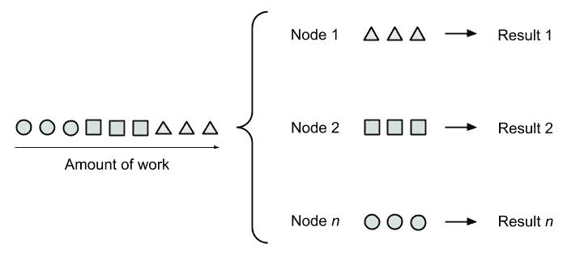
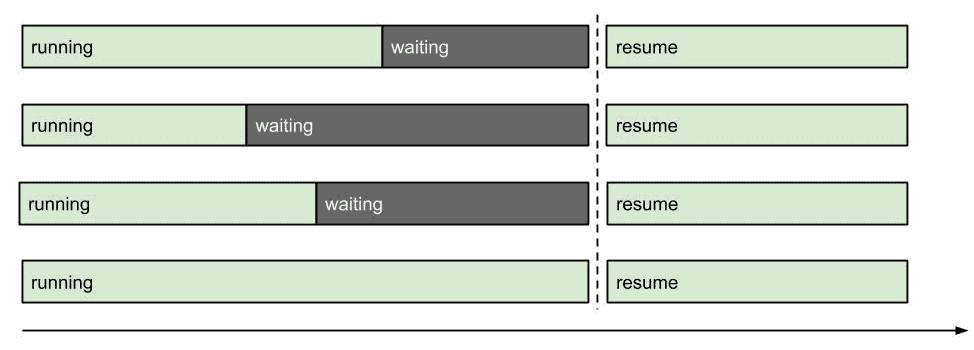
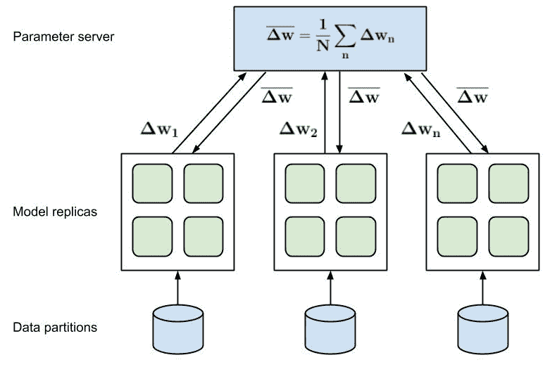
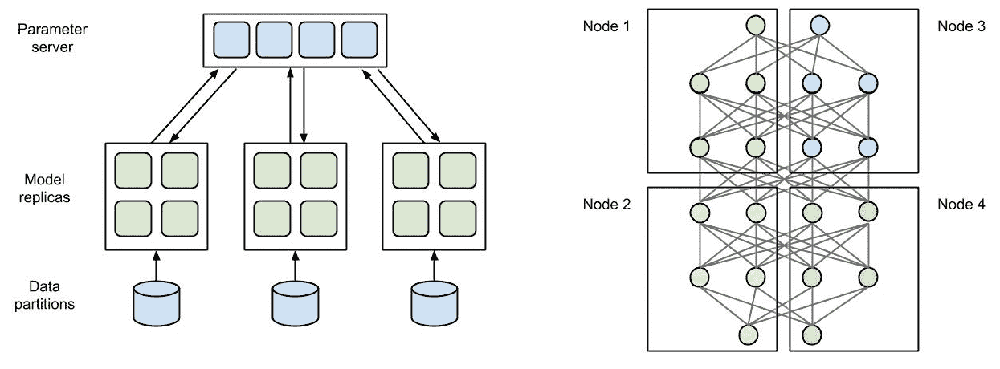

# Azure ML 集群上的分布式机器学习

在前一章中，我们通过使用 HyperDrive 和 AutoML 进行搜索和优化，了解了超参数调整，这是超参数优化的一个特例，涉及特征工程、模型选择和模型堆叠。AutoML 是**机器学习即服务** ( **MLaaS** )，其中唯一的输入是你的数据、一个 ML 任务和一个错误度量。很难想象在一台机器或一个 CPU/GPU 上运行 AutoML 的所有实验和参数组合——我们正在寻找通过并行化和分布式计算来加快训练过程的方法。

在这一章中，我们将研究分布式和并行计算的算法和框架，以便有效地并行训练 ML 模型。本章的目标是在 Azure 中构建一个环境，在这个环境中，您可以通过向您的训练环境添加更多的机器来加速经典 ML 和**深度学习(DL)** 模型的训练过程，从而扩展集群。

首先，我们将看看分布式 ML 的不同方法和基本构件。您将了解并行训练独立模型(如在 HyperDrive 和 AutoML 中所做的)与通过划分训练数据并行训练大型数据集上的单个模型集合之间的区别。然后，我们将研究单个模型的分布式 ML，并发现数据分布和模型分布的训练方法。这两种方法通常用于现实世界场景中，以加速或支持大型**深度神经网络** ( **DNNs** )的训练。

之后，我们将发现最流行的分布式 ML 框架，以及它们如何在 Azure 中使用以及如何与 Azure ML compute 结合使用。执行引擎、通信库和分布式 ML 库的功能之间的转换是平滑的，但通常难以理解。不过，读完这一章，你就会明白在 Databricks 中用 MLlib 运行 Apache Spark 和使用 Horovod、Gloo、PyTorch、TensorFlow 参数服务器的区别了。

在最后一节，我们将看看两个实际例子，如何实现我们将在 Azure 中讨论的功能，并将其与 Azure ML compute 集成。

本章涵盖以下主题:

*   探索分布式 ML 的方法
*   在 Azure 中使用分布式 ML


# 探索分布式 ML 的方法

对于许多用户来说，实现 ML 管道的过程是非常相似的，并且通常与前面章节中描述的步骤相似。当用户开始从实验切换到真实世界的数据，或者从小的例子切换到更大的模型时，他们经常会遇到类似的问题:在大量数据上训练大型参数模型——尤其是 DL 模型——需要非常长的时间。有时候，时代持续几个小时，而训练需要几天才能融合。

对于许多工程师来说，等待模型收敛的数小时甚至数天意味着宝贵的时间浪费，因为这使得交互式调整训练过程变得更加困难。因此，许多 ML 工程师需要通过利用各种分布式计算技术来加速他们的培训过程。分布式 ML 的想法就像通过增加更多的计算资源来加速训练过程一样简单。在最好的情况下，通过向训练集群添加更多的机器(横向扩展),训练性能线性提高。在这一节中，我们将看看最常见的分布式 ML 模式，并尝试理解和推理它们。在本章的下一节，我们还将把它们应用到一些真实世界的例子中。

一旦数据或模型变大，大多数现代 ML 管道使用本章讨论的一些技术来加速训练过程。这类似于一旦数据变大，就需要大数据平台(如 Spark、Hive 等)进行数据预处理。因此，尽管这一章看起来过于复杂，我还是建议你在等待你的模型收敛或者想要更快产生更好的结果的任何时候重温这一章。

通常有三种利用 ML 分布式计算的模式:

*   并行训练独立模型
*   在数据的不同子集上并行训练模型的副本
*   并行训练同一模型的不同部分

让我们来看看这些方法。


# 并行训练小数据上的独立模型

我们将首先看最简单的例子，在(小)数据集上训练(小)独立模型。这种并行训练的典型用例是执行超参数搜索或经典 ML 模型或小型神经网络的优化。这与我们在上一章中讨论的内容非常相似。甚至 AutoML——训练和比较多个独立的模型——也在幕后使用这种方法。在并行训练中，我们的目标是通过并行训练这些模型来加速具有不同参数的多个独立模型的训练。

下图显示了这种情况，我们不是在单台计算机上按顺序训练各个模型，而是并行训练它们:



您可以看到，在各个模型的训练过程中，不需要通信或同步。这意味着我们既可以在同一台机器上的多个 CPU/GPU 上训练，也可以在多台机器上训练。

当使用 Azure ML 进行超参数调优时，这种并行化很容易实现，只需配置一个具有多个节点的 Azure ML 计算目标，并通过 HyperDrive 配置的`max_concurrent_runs`参数选择并发运行的数量。在 Azure ML HyperDrive 中，只需指定一个估计器和`param_sampling`，并提交 HyperDrive 配置作为实验，以便并行运行单个任务，如下所示:

```
from azureml.train.hyperdrive import HyperDriveConfig
hyperdrive_run_config = HyperDriveConfig(estimator=estimator,
    hyperparameter_sampling=param_sampling, 
    primary_metric_name="accuracy", 
    primary_metric_goal=PrimaryMetricGoal.MAXIMIZE,
    max_total_runs=100,
    max_concurrent_runs=4)

from azureml.core.experiment import Experiment
experiment = Experiment(workspace, experiment_name)
hyperdrive_run = experiment.submit(hyperdrive_run_config)
```

以下是一些计算超空间驱动或任何其他分布式计算设置的`max_concurrent_runs`值的公式:

*   对于基于 CPU 的训练，如果每个节点都有足够的内存来存储训练数据和模型参数，我们可以同时训练至少 *N [个总共]个模型，使用以下等式:*


*   对于基于 GPU 的训练，假设每个节点都有足够的可用 GPU 内存，则并发模型的数量 *N [total]* 以相同的方式计算:


以下是如何估计单个模型将消耗多少内存的指南:

*   单个参数的大小:
*   **半精度浮点型** : 16 位(2 字节)
*   **单精度浮点型** : 32 位(4 字节)——这通常是默认值
*   **双精度浮点型** : 64 位(8 字节)

*   模型所需的参数数量:
*   **参数化** **模型** : *所有参数的总和*
*   **非参数模型** : *表示的数量(例如决策树)*表示的参数数量*
*   然后乘以其他因素:
*   **采用反向传播的型号** : *总内存* 2*
*   **使用批处理的型号** : *总内存*批处理大小*
*   **模型使用** ( **递归** ) **状态** : *每状态内存*递归步数*

虽然这个用例看起来非常相似，但让我们继续下一个用例，在这个用例中，我们有一个无法复制到每台机器上的大型数据集。


# 在大数据集上并行训练模型集成

接下来我们将讨论 ML 中一个非常常见的优化，尤其是在大型数据集上训练模型时。为了训练模型，我们通常需要大量的数据，而这些数据很少能全部放入单台机器的内存中。因此，通常需要将数据分割成块，并在不同的块上训练多个单独的模型。

下图显示了将数据拆分为较小块的两种方法，即水平拆分行(左)或垂直拆分列(右):


您还可以混合使用这两种技术，从训练数据中提取一个子集。每当您使用 MapReduce、Hive 或 Spark 等大数据领域的工具时，对数据进行分区将有助于您加快训练过程，或者首先支持对大量数据进行训练。

执行数据分布式训练的一个很好的例子是训练完全独立的决策树模型的大规模树集合，也称为**随机** **森林**。通过将数据分成成千上万个随机块，您可以为每个数据块训练一个决策树，并将所有训练好的树组合成一个集成模型。Apache Hivemall 是一个基于 Hive 和 Spark 的库，它在这两个执行引擎中的任何一个上都可以做到这一点。下面是一个使用 HiveQL 和 Apache Hivemall 在 Hive 上训练多个 XGBoost 多类集成模型的例子:

```
-- explicitly use 3 reducers
-- set mapred.reduce.tasks=3;

create table xgb_softmax_model as
select 
  train_xgboost(features, label, 
    '-objective multi:softmax -num_class 10 -num_round 10') 
    as (model_id, model)
from (
  select features, (label - 1) as label
  from data_train
  cluster by rand(43) -- shuffle data to reducers
) data;
```

在前面的函数中，我们使用`cluster`关键字将数据行随机移动到 reducers。这将对数据进行水平分区，并为每个 reducer 上的每个分区训练一个 XGBoost 模型。通过定义缩减器的数量，我们还定义了并行训练的模型的数量。生成的模型存储在一个表中，其中每一行定义一个模型的参数。在预测中，我们将简单地组合所有单个模型，并执行平均投票标准来检索最终结果。

这种方法的另一个例子是在垂直和水平数据分区上训练多个独立模型的标准 Spark 管道。当我们完成对单个模型的训练后，我们可以在推理过程中使用平均投票标准来找到预测任务的最佳结果。下面是一个使用 Python、PySpark 和 scikit-learn 在水平分区数据上并行训练多个模型的小示例脚本:

```
# read the input data
df = spark.read.parquet("data/")

# define your training function
from sklearn.ensemble import RandomForestClassifier
def train_model(data):
   clf = RandomForestClassifier(n_estimators=10)
   return clf.fit(data['train_x'], data['train_y'])

# split your data into partitions and train models
num_models = 100
models = df.rdd.repartition(num_models)
  .mapPartitions(train_model)
  .collect()
```

在前面的函数中，我们现在可以加载几乎任何数量的数据，并对其进行重新分区，以便每个分区都适合单个节点的本地内存。如果我们有 1 TB 的训练数据，我们可以将它分成 100 个 10 GB 数据块的分区，分布在 10 个 12 核工作节点上，每个节点有 128 GB RAM。并行训练 100 个模型的训练时间最多需要几秒钟。一旦所有的模型都训练好了，我们使用`collect()`函数将所有训练好的模型返回给头节点。

我们还可以决定将来自每个个体工作者的模型存储到磁盘或分布式文件系统中，但是将结果组合到单个节点上可能更好。你看，在这个例子中，我们有选择两种方法中任何一种的自由，因为所有的模型都是相互独立的。对于模型突然相互依赖的情况，这是不正确的，例如，当最小化全局梯度时，或者在多台机器上分割单个模型时，这两种情况都是以相同方式训练 dnn 时的常见用例。在这种情况下，我们需要一些新的操作符来控制数据和梯度的控制流。让我们在下一节研究这些操作符。


# 分布式 ML 的基本构件

正如我们在前面的例子中看到的，我们需要一些基本的构建块或操作符来管理分布式系统中的数据流。我们把这些算子**统称为** **算法**。这些算法实现了分布式计算的通用同步和通信模式，并且在训练 ML 模型时是必需的。在我们开始学习 DNNs 的分布式训练方法之前，我们将快速浏览一下这些模式以理解其基础。

分布式系统中最常见的通信模式如下:

*   一对一
*   一对多(也叫*播*或*散*
*   多对一(也称*减少*或*聚集*
*   多对多(也称*全减*或*全聚*

下图很好地概述了这些模式，并显示了数据如何在系统的各个参与者之间流动:


我们可以马上回想起贝叶斯优化的超参数优化技术。首先，我们需要从主节点向所有工作节点广播训练数据。然后，我们可以从主节点的参数空间中选择参数组合，**也可以将这些参数组合广播给工作节点。最后，我们在工作者节点上执行训练，然后**从主节点上的工作者节点收集**所有模型验证分数。通过比较分数并应用贝叶斯定理，我们可以预测下一个可能的参数组合，并重复**将它们广播**到工作节点。**

你注意到前面算法中的一些东西了吗？我们如何知道所有工作节点都完成了训练过程，并且我们收集了所有工作节点的所有分数？为此，我们将使用另一个构建模块，称为**同步**，或**屏障** **同步**。使用屏障同步，我们可以调度任务的执行，使其需要等待所有其他分布式任务完成。下图很好地概括了多处理器中的同步模式:



正如你所看到的，我们在前一章已经隐含地使用了这些算法，它们隐藏在术语**优化**之后。现在我们将通过改变优化器来明确地使用它们，以便在多台机器上训练单个模型。

正如您可能已经意识到的，这些模式并不新，每秒钟都会被您的操作系统使用多次。然而，在这种情况下，我们可以利用这些模式，并通过专门的硬件(例如，通过使用 InfiniBand 将两个 GPU 连接在一起)将它们应用于分布式训练过程的执行图。

为了在不同级别的硬件支持(GPU 支持和矢量化)下使用这种集体算法，您需要选择一个通信后端。这些后端是库，通常作为单独的进程运行，并实现通信和同步模式。流行的集体算法库包括 Gloo、MPI 和 NCCL。

大多数 DL 框架，如 PyTorch 或 TensorFlow，都在这些通信后端之一上提供了自己的高级抽象，例如 PyTorch RPC 和 TensorFlow 参数服务器。除了使用不同的执行和通信框架，您还可以选择一个通用的分布式计算框架，比如 Spark。

如您所见，可能的选择列表是无穷无尽的，并且可能有多种组合。我们甚至还没有谈到 Horovod，这是一个用于通过分布式优化器将分布式训练添加到其他 DL 框架中的框架。好的一面是，这些框架和库大部分都在所有 Azure ML 运行时中提供，并通过 Azure ML SDK 得到支持。这意味着您通常只需指定所需的后端，将您的模型提供给任何特定的框架，并让 Azure ML 处理这些工具的设置、初始化和管理。我们将在本章的后半部分看到这一点。


# 利用数据并行训练加速数据挖掘

分布式数据并行训练的另一种变体在 DL 中非常常见。为了加速更大模型的训练，我们可以在同一模型的分布式副本上使用不同的数据块运行多次训练迭代。当每个训练迭代花费大量时间(例如，几秒钟)时，这一点尤其重要，这是训练大型 dnn 的典型场景，我们希望利用多 GPU 环境。

DL 的数据分布式训练基于使用分布式梯度下降算法的思想:

1.  将模型的副本分发给每个节点。
2.  将数据块分发到每个节点。

3.  在每个节点上对网络进行全面检查，并计算梯度。
4.  收集单个节点上的所有梯度，并计算平均梯度。
5.  将平均渐变发送到所有节点。
6.  使用平均梯度更新所有模型。

下图显示了多个模型的实际情况，分别运行向前/向后传递，并将梯度发送回参数服务器:



如此处所示，服务器计算平均梯度，并将其发送回所有其他节点。我们可以立即看到，突然之间，工作者节点和主节点(让我们称之为参数服务器)之间需要通信，并且在等待所有模型完成梯度计算时也需要同步。

这种用例的一个很好的例子是通过并行化反向传播步骤并将来自每个节点的梯度组合成总梯度来加速 DL 模型的训练过程。TensorFlow 目前使用所谓的**参数** **服务器**支持这种分发模式。在优步开发的 Horovod 框架为分布式优化器提供了方便的抽象，并插入到许多可用的 ML 框架或分布式执行引擎中，如 TensorFlow、PyTorch 和 Apache Spark。在*Horovod——分布式 DL 培训框架*一节中，我们将看看使用 horo VOD 和 Azure ML 的实际例子。


# 使用模型并行训练来训练大型模型

最后，DL 中的另一个常见用例是训练比单个 GPU 提供的 GPU 内存更大的模型。这种方法有点棘手，因为它需要在不同的 GPU 甚至不同的机器之间分割模型执行图。虽然这在基于 CPU 的执行中不是一个大问题，并且经常在 Spark、Hive 或 TensorFlow 中完成，但我们还需要在多个 GPU 内存之间传输中间结果。为了有效地做到这一点，需要额外的硬件和驱动程序，如 InfiniBand (GPU 到 GPU 通信)和 GPUDirect(高效 GPU 内存访问)。

下图显示了并行计算多个梯度(左侧)和计算分布式模型的单个正向传递(右侧)之间的差异:



后者要复杂得多，因为数据必须在多个 GPU 和/或多个节点之间来回传递。

一般来说，我们选择两种场景:单机多 GPU 训练和多机多 GPU 训练。如您所料，后者要困难得多，因为它需要网络上多台机器之间的通信和同步。

下面是一个使用 PyTorch 在多个 GPU 上训练一个小模型的简单 Python 脚本:

```
import torch
import torch.nn as nn
import torch.optim as optim

class ParallelModel(nn.Module):
    def __init__(self):
        super(ParallelModel, self).__init__()
        self.net1 = torch.nn.Linear(10, 10).to('cuda:0')
        self.relu = torch.nn.ReLU()
        self.net2 = torch.nn.Linear(10, 5).to('cuda:1')

    def forward(self, x):
        x = self.relu(self.net1(x.to('cuda:0')))
        return self.net2(x.to('cuda:1'))

model = ParallelModel()
loss_fn = nn.MSELoss()
optimizer = optim.SGD(model.parameters(), lr=0.001)

optimizer.zero_grad()
outputs = model(torch.randn(20, 10))
labels = torch.randn(20, 5).to('cuda:1')
loss_fn(outputs, labels).backward()
optimizer.step()
```

正如您所看到的，我们现在将各个层拆分为在多个 GPU 上运行，而这些层之间的数据需要在向前和向后传递期间进行传输。我们在前面的代码示例中观察到，我们现在将代码更改应用到模型本身，以便指定模型的哪些部分应该在哪个 GPU 上运行。

请注意，我们也可以使这种分割动态化，例如我们将模型分割成在*x*GPU 上执行的 *x* 个连续子图。

有趣的是，本章中讨论的许多技术可以结合起来。例如，我们可以在每台机器上训练一个多 GPU 模型，同时将数据划分为块，并在多台机器上计算梯度的多个部分——因此采用了数据分布式模型并行方法。


# 在 Azure 中使用分布式 ML

*探索分布式 ML 的方法*部分包含了大量不同的并行化场景、集体算法的各种通信后端，以及使用不同 ML 框架甚至执行引擎的代码示例。当谈到 ML 框架时，选择的数量相当大，做出明智的决定并不容易。当 Azure ML 支持一些现成的框架，而其他框架必须由用户安装、配置和管理时，这种选择变得更加复杂。

在这一部分，我们将经历最常见的场景，学习如何选择正确的框架组合，并在 Azure 中实现分布式 ML 管道。

一般来说，在 Azure 中运行分布式 ML 有三种选择:

*   第一个显而易见的选择是使用 Azure ML、笔记本环境、Azure ML SDK 和 Azure ML 计算集群。对于许多复杂的用例来说，这将是最简单的解决方案。巨大的数据集可以存储在 Azure Blob 存储上，模型可以被训练成具有不同通信后端的数据并行和/或模型并行模型。通过用评估者抽象来包装你的训练脚本，一切都被管理了。
*   第二种选择是为您的代码使用不同的创作和执行引擎，而不是 Azure ML 笔记本和 Azure ML 计算集群。一个流行的选择是 Azure Databricks，它集成了交互式笔记本和 Apache Spark 作为分布式执行引擎。使用 Databricks，您可以使用预先构建的 ML 图像和自动缩放集群，这为运行分布式 ML 培训提供了一个很好的环境。
*   第三种选择是构建并推出您自己的定制解决方案。为此，您需要用虚拟机或 Kubernetes 构建一个单独的集群，并协调基础设施和代码的设置、安装和管理。虽然这是最灵活的解决方案，但它也是迄今为止设置起来最复杂、最耗时的。对于这本书，在深入研究 Azure ML 之前，我们将首先研究 Horovod 优化器、Azure Databricks 和 Apache Spark。


# horo VOD——一个分布式 DL 培训框架

Horovod 是一个支持分布式 DL 的框架，最初由优步开发并开源。它为以下受支持的框架提供了一种统一的方式来支持现有 DL 训练代码的分布式训练——tensor flow、Keras、PyTorch 和 Apache MXNet。设计目标是使任何现有项目从单节点训练到数据并行训练的过渡变得极其简单，从而使这些模型能够在分布式环境中的多个 GPU 上更快地训练。

在任何支持数据并行训练的框架中，Horovod 作为优化器的替代物是一个很好的选择。通过简单地从 DL 代码中抽象出 GPU，它可以通过初始化和更新步骤或更新挂钩与支持的框架很好地集成。从用户的角度来看，只需做最少的代码更改就可以支持模型的数据并行训练。让我们看一个使用 Keras 的例子，并实现以下步骤:

1.  初始化 Horovod。
2.  配置 Keras 从 Horovod 读取 GPU 信息。
3.  加载模型并拆分培训数据。
4.  将 Keras 优化器包装成 Horovod 分布式优化器。
5.  实施模型训练。
6.  使用`horovodrun`执行脚本。

具体步骤如下:

1.  对于任何使用 Horovod 的脚本来说，第一步都非常相似——我们首先需要从正确的包中加载`horovod`并初始化它:

```
import horovod.keras as hvd
hvd.init()
```

2.  接下来，我们需要执行一个定制的设置步骤，这取决于所使用的框架。这一步将为框架设置 GPU 配置，并确保它可以通过 Horovod 调用抽象版本:

```
from keras import backend as K
import tensorflow as tf

# pin GPU to be used to process local rank (one GPU per process)
config = tf.ConfigProto()
config.gpu_options.allow_growth = True
config.gpu_options.visible_device_list = str(hvd.local_rank())
K.set_session(tf.Session(config=config))
```

3.  现在，我们可以简单地采用我们的单节点、单 GPU Keras 模型，并定义所有参数、训练和验证数据。在此步骤中没有任何特殊要求:

```
# standard model and data
batch_size = 10
epochs = 100
model = load_model(...)
x_train, y_train = load_train_data(...)
x_test, y_test = load_test_data(...)
```

4.  最后，我们到达了神奇的部分，在这里我们将框架优化器——在这里是来自 Keras 的`Adadelta`——包装成一个 Horovod 分布式优化器。对于所有后续代码，我们将简单地使用分布式优化器，而不是普通的优化器。我们还需要根据使用的 GPU 数量来调整学习速率，因为最终的梯度将是单个变化的平均值。这可以使用以下代码来完成:

```
# adjust learning rate based on number of GPUs
opt = keras.optimizers.Adadelta(1.0 * hvd.size())

# add Horovod Distributed Optimizer
opt = hvd.DistributedOptimizer(opt)
```

5.  剩下的部分看起来相当简单。它涉及到编译模型、拟合模型和评估模型，就像单节点的对应部分一样。值得一提的是，我们需要添加一个回调来初始化训练过程中的所有渐变:

```
model.compile(loss=keras.losses.categorical_crossentropy,
    optimizer=opt, 
      metrics=['accuracy'])
callbacks = [
    hvd.callbacks.BroadcastGlobalVariablesCallback(0),
]
model.fit(x_train, y_train,
    batch_size=batch_size,
    callbacks=callbacks,
    epochs=epochs,
    verbose=1 if hvd.rank() == 0 else 0,
    validation_data=(x_test, y_test))
score = model.evaluate(x_test, y_test)
print('Test loss:', score[0])
print('Test accuracy:', score[1])
```

当查看前面的代码时，公平地说，Horovod 在使用数据并行方法和分布式梯度计算轻松扩展分布式执行代码方面并没有过分乐观。如果您研究过本机 TensorFlow 或 PyTorch 版本，您会发现这需要的代码更改要少得多，并且比参数服务器或 RPC 框架更具可读性和可移植性。

Horovod 框架使用 MPI 通信后端来处理幕后的集体算法，并且通常需要每个节点的每个 GPU 运行一个进程。然而，它也可以通过配置选项在 Gloo 后端或自定义 MPI 后端上运行。下面是如何使用`horovodrun`命令在两台机器`server1`和`server2`上启动训练过程的示例片段，每台机器使用四个独立的 GPU:

```
$ horovodrun -np 8 -H server1:4,server2:4 python train.py
```

当您只想通过扩展集群来加快训练进度时，在您自己的集群上运行和调试 Horovod 仍然会很痛苦。因此，Azure ML compute 提供了一个为您完成所有繁重工作的包装器，只需要一个带有 Horovod 注释的训练脚本。我们将在*在 Azure ML 计算上运行 horo VOD*部分看到这一点。

通过使用底层框架的模型并行特性，并且每台机器只使用一个 Horovod 进程而不是每块 GPU，模型并行训练可以与 Horovod 相结合。但是，这是一个自定义配置，目前在 Azure ML 中不支持。


# 为 Spark 作业实现 HorovodRunner API

在许多公司中，ML 是现有数据管道之上的附加数据处理步骤。因此，如果你有大量的数据，并且你已经在管理 Spark 集群或者使用 Azure Databricks 来处理这些数据，那么也很容易添加分布式培训功能。

正如我们在本章的*探索分布式 ML 的方法*一节中所看到的，我们可以使用并行化或者通过划分训练数据来简单地训练多个模型。然而，我们也可以训练 DL 模型，并受益于分布式 ML 技术来加速训练过程。

当使用 Databricks ML 运行时，您可以利用 Horovod for Spark 来分发您的培训过程。该功能可通过`HorovodRunner` API 获得，由 Spark 的屏障模式执行引擎提供支持，为长时间运行的作业提供稳定的通信后端。使用头节点上的`HorovodRunner`,它将培训功能发送给工人，并使用 MPI 后端启动该功能。这一切都发生在引擎盖下的火花过程。

同样，这也是 Horovod 非常容易使用的原因之一，因为它实际上只是您当前优化器的替代产品。假设您通常使用 PySpark 引擎在 Azure Databricks 上运行 Keras 模型。但是，您可能希望添加 Horovod，通过利用集群中的其他机器并在多台机器上分割梯度下降来加快训练过程。为此，您只需将两行代码添加到上一节的示例中，如下所示:

```
hr = HorovodRunner(np=2)

def train():
  # Perform your training here..
  import horovod.keras as hvd
  hvd.init()
  ...

hr.run(train)
```

在前面的代码中，我们发现我们只需要用工作节点的数量初始化`HorovodRunner()`。用 training 函数调用`run()`方法，会自动启动新的 worker，MPI 通信后端，发送训练代码给 worker，并行执行训练。因此，您现在可以将数据并行训练添加到长期运行的 Spark ML 作业中。


# 在 Azure ML 计算上运行 Horovod

迁移到云服务的好处之一是，您可以将功能作为服务来使用，而不是自己管理基础架构。很好的例子是托管数据库、lambda 函数、托管 Kubernetes 或容器实例，其中选择托管服务意味着您可以专注于您的应用程序代码，而基础架构是在云中为您管理的。

Azure ML 服务处于类似的位置，您可以通过 SDK 使用许多不同的功能(如模型管理、优化、培训和部署)，因此您不必维护 ML 集群基础架构。当涉及到通过分布式 ML 加速 DNNs 时，这带来了巨大的好处。如果你一直坚持使用 Azure ML compute，那么转移到数据并行训练就像在训练配置中添加一个参数一样困难——对于本章中讨论的各种选择。

让我们考虑在分布式环境中使用 Horovod 优化器以数据并行模式运行 Keras 训练脚本。您需要确保您的工具的所有正确版本都已设置好(从 CUDA 到 cuDNN、GPUDirect、MPI、Horovod、TensorFlow 和 Keras ),并且能够与您当前的操作系统和硬件很好地配合使用。然后，您需要将训练代码分发到所有机器上，启动 MPI 进程，然后在集群中的每台机器上使用 Horovod 和相关的命令行参数调用脚本。我们甚至还没有谈到身份验证、数据访问或自动扩展。

有了 Azure ML，你就有了一个可以正常工作的 ML 环境，并且可以随时更新。让我们来看看之前的 Horovod 和 Keras 训练脚本，我们将它存储在一个`train.py`文件中。现在，类似于前面的章节，我们创建一个估算器来包装 Azure ML SDK 的训练调用。为了使用 Horovod 和 MPI 后端实现多 GPU 数据并行训练，我们只需添加相关参数。生成的脚本看起来像下面的代码片段:

```
from azureml.train.dnn import TensorFlow, Mpi

estimator = TensorFlow(source_directory=project_folder*, 
*              compute_target=compute_target,                       
              entry_script='train.py',                       
              script_params=script_params,                       
              node_*c*ount=2, 
              distributed_training=Mpi(process_count_pernode=1), 
              pip_packages=['keras'],                       
              framework_version='1.13',                       
              use_gpu=True)
```

使用`use_gpu`标志，我们可以为我们的 Azure ML 计算集群启用带有预编译二进制文件的特定于 GPU 的机器及其对应的映像。使用`node_count`和`process_count_per_node`，我们指定数据并行训练的并发级别，其中`process_count_per_node`应该对应于每个节点可用的 GPU 数量。最后，我们将`distributed_backend`参数设置为`mpi`，以便为这个估计器启用 MPI 通信后端。另一个可能的选择是使用`ps`来启用 TensorFlow `ParameterServer`后端。

最后，为了启动作业，我们只需提交实验，它将自动在每个节点上设置 MPI 会话，并为我们调用带有相关参数的训练脚本。我不知道你对此有什么感觉，但对我来说，这确实比以前的手动示例前进了一大步。下面一行显示了如何提交实验:

```
run = experiment.submit(estimator)
```

将您的训练包装为 Azure ML estimator 的一部分，可以为多种环境微调您的训练脚本配置，无论是用于分布式梯度下降训练的多 GPU 数据并行模型还是用于快速推理的单节点实例。通过将分布式 DL 与 Azure ML 计算自动扩展集群相结合，您可以通过使用预构建的托管服务来充分利用云，而不是手动摆弄基础架构和配置。


# 摘要

分布式 ML 是扩展您的培训基础设施的一个很好的方法，可以加快您的培训过程。它被应用于许多现实场景中，并且非常容易与 Horovod 和 Azure ML 一起使用。

并行执行类似于超参数搜索，分布式执行类似于贝叶斯优化，我们在前一章已经详细讨论过。分布式执行需要有效地执行通信(例如一对一、一对多、多对一和多对多)和同步(例如屏障同步)的方法。这些所谓的集体算法由通信后端(MPI、Gloo 和 NCCL)提供，允许高效的 GPU 到 GPU 通信。

DL 框架在通信后端之上构建更高级别的抽象，以执行模型并行和数据并行训练。在数据并行训练中，我们对输入数据进行分区，以在不同的机器上计算模型的多个独立部分，并在稍后的步骤中将结果相加。DL 中的一种常见技术是分布式梯度下降，其中每个节点在输入批次的一个分区上执行梯度下降，并且主节点收集所有单独的梯度以计算组合模型的总体平均梯度。在模型并行训练中，您将一个模型分布在多台机器上。当模型不适合单个 GPU 的 GPU 内存时，通常会出现这种情况。

Horovod 是其他 ML 框架的现有优化器的抽象，如 TensorFlow、Keras、PyTorch 和 Apache MXNet。它提供了一个易于使用的界面，可以将数据分布的培训添加到现有模型中，而无需进行大量代码更改。虽然您可以在独立的集群上运行 Horovod，但 Azure ML 服务通过将其功能包装为评估器对象来提供良好的集成。您了解了如何在 Azure ML 计算集群上运行 Horovod，以通过分布式 ML 加速您的训练过程，只需几行 Horovod 初始化和当前优化器上的包装器。

在下一章，我们将使用前面章节的所有知识来训练 Azure 上的推荐引擎。推荐引擎通常建立在其他 NLP 特征提取或分类模型的基础上，因此结合了我们目前所学的许多技术。