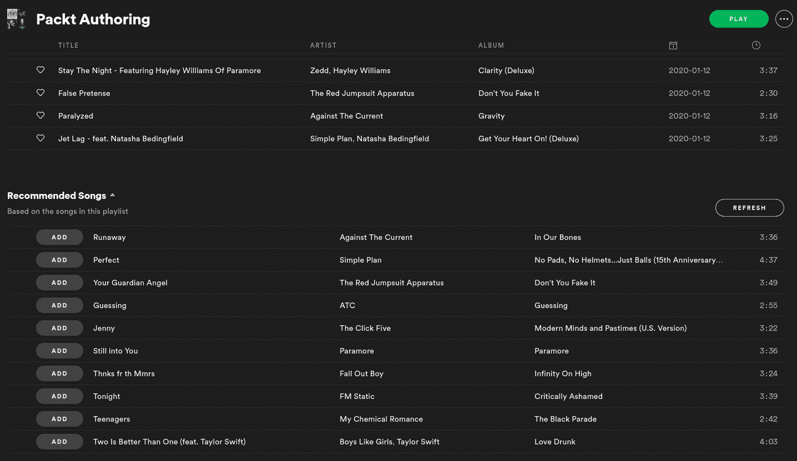
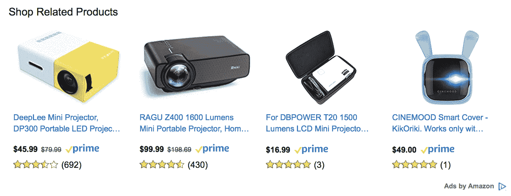
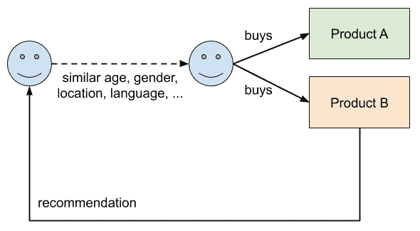
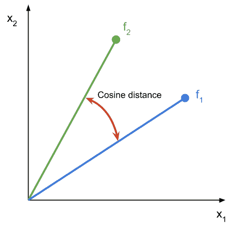
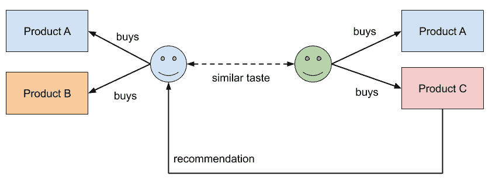
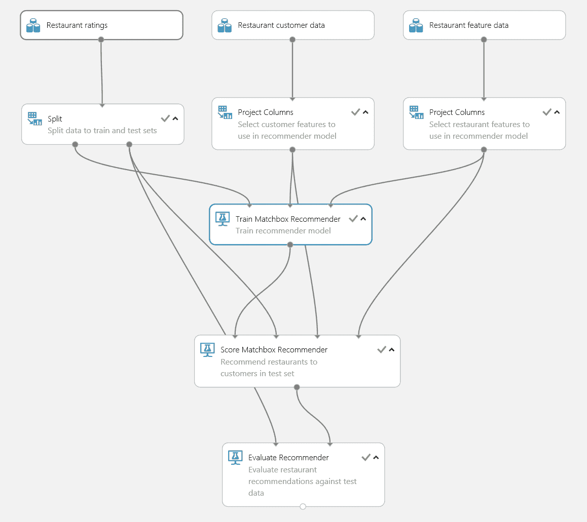
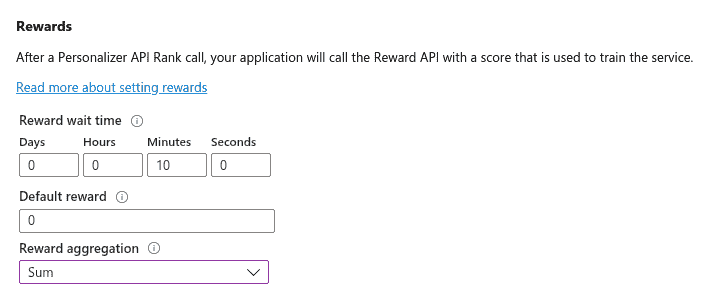

# 十、在 Azure 中构建推荐引擎

在前一章中，我们讨论了用于**机器学习** ( **ML** )模型的分布式训练方法，并且您学习了如何在 Azure 中高效地训练分布式 ML 模型。在这一章中，我们将深入探讨传统和现代的推荐引擎，它们通常结合了前面章节中介绍的技术和技巧。

首先，我们将快速了解不同类型的推荐引擎，每种类型需要什么数据，以及使用这些不同的方法可以推荐什么。这将帮助您了解何时从非个性化、基于内容或基于评级的推荐者中进行选择。

之后，我们将深入研究基于内容的推荐，即基于特征向量和相似性的项目-项目和用户-用户推荐器。您将学习余弦距离来衡量特征向量之间的相似性，以及在构建基于内容的推荐引擎时避免常见陷阱的特征工程技术。

随后，我们将讨论基于评级的推荐，一旦收集了足够的用户-项目交互数据，就可以使用这些推荐。您将了解隐式和显式评级的区别，开发您自己的隐式度量函数，并考虑用户评级的新近性。

在接下来的章节中，我们将把基于内容和基于评级的推荐器合并成一个混合推荐器，并了解现代推荐引擎的最新技术。您将使用 Azure ML 实现两个混合推荐器，一个使用 Python，一个使用 Azure ML Designer——Azure ML 的图形 UI。

在最后一节中，我们将研究一个使用强化学习的在线推荐系统——Azure Personalizer。了解了基于内容和基于评级的方法后，您将学习如何使用适应度函数和在线学习来即时改进您的推荐。

本章将涵盖以下主题:

*   推荐引擎简介
*   基于内容的推荐
*   协同过滤——基于评级的推荐引擎
*   在混合推荐引擎中组合内容和评级
*   通过强化学习实现自动优化


# 推荐引擎简介

在当今的数字世界中，推荐引擎在许多行业中无处不在。许多在线业务，如流媒体、购物、新闻和社交媒体，其核心依赖于向用户推荐最相关的文章、新闻和项目。你点击 YouTube 上的推荐视频、滚动浏览你的脸书订阅源、在 Spotify 上听个性化播放列表或在亚马逊上点击推荐文章的频率有多高？

如果你问自己，术语*相关*对于不同的服务和行业意味着什么，你就对了。为了向用户推荐相关信息，我们需要首先定义一个相关性度量，以及一种描述和比较不同项目及其相似性的方法。这两个属性是理解不同推荐引擎的关键。我们将在本章的以下章节中了解更多相关内容。

虽然大多数人都清楚推荐引擎的目的，但是不同的方法通常都不清楚。因此，为了更好地理解这一点，在这一章中，我们将比较不同类型的推荐系统，并给出一些你可能在野外见过的例子。值得一提的是，许多服务实现了不止一种方法来产生好的推荐。

最简单的推荐引擎和方法是*非个性化*推荐。它们通常用于显示全球兴趣(例如，Twitter 全球趋势、受欢迎的网飞节目和新闻网站的首页)或没有用户数据的趋势。一个很好的例子是当你注册并首次登录服务时出现的任何流媒体服务的推荐。

一旦你登录一个网络服务并开始适度地使用它，你通常会遇到基于内容的推荐。基于内容的推荐器基于项目和用户简档特征来寻找相似的项目或相似用户的项目。用户配置文件项目可能包括以下内容:

*   年龄
*   性别
*   国籍
*   侨居国
*   母语

想象一下，登录亚马逊，却没有购买任何东西。大多数推荐商品将与您刚刚查看的商品相似，或者与您的人口统计数据和位置相匹配。

一旦有了足够的互动数据，你就会开始看到基于*评级的*推荐，这种方法也被称为协同过滤。在基于评级的推荐器中，用户与项目的交互被转换成显式或隐式评级。基于这些评级，基于其他用户给出的类似推荐来做出推荐。在网飞上对一部电影进行评级是一种显性评级，而在 YouTube 上观看一部完整的 20 分钟纪录片是一种隐性评级。因此，将向用户显示其他人喜欢的电影，这些人也喜欢您刚刚评级的电影。同样，YouTube 将显示其他用户观看的视频，这些用户也观看了您刚刚观看的视频。

微软在 https://github.com/Microsoft/Recommenders/[的 GitHub 仓库中为流行的推荐引擎提供了许多不同的实现。这使得在 Azure 上开始、选择正确的算法、实现、训练和部署推荐引擎变得容易。](https://github.com/Microsoft/Recommenders/tree/master/)

下一个自然的步骤是将内容和基于评级的推荐器结合成一个单一的*混合推荐*引擎，该引擎可以处理用户评级和冷启动没有评级的用户。这种方法的好处是两个推荐系统一起被优化，并产生一个组合推荐。Azure ML Studio (classic)和 Azure ML Designer 提供了训练和部署火柴盒推荐器的构建模块，这是一个由微软研究院构建的在线贝叶斯混合推荐引擎。

过去一年中最令人兴奋的新发展是基于强化学习的混合在线推荐优化的引入。通过为用户评级提供适合度函数，该算法可以不断学习以优化该函数。在本章的最后一节，我们将看看 Azure Personalizer，一个基于强化学习的推荐引擎服务。

让我们深入讨论这些方法，并为 Azure 中的可伸缩推荐引擎开发一些示例解决方案。


# 基于内容的推荐

我们首先从基于内容的推荐开始，因为它们与我们之前在本书中讨论的最相似。术语*内容*指的是仅使用(数字)特征向量形式的项目或用户的内容信息。从商品(网上商店中的一篇文章)或用户(网络服务中的一个浏览器会话)获得特征向量的方法是通过数据挖掘、数据预处理和特征工程——您在[第 4 章](927e1d71-b0a2-4bc4-b986-322427e7ffc3.xhtml)、 *ETL 和数据准备*和[第 5 章](2e9b480a-5003-4fc8-a5c6-bc2ba75c21b3.xhtml)、*NLP 高级特征提取*中学到的技能。

使用用户和项目的特征向量，我们可以将基于内容的推荐大致分为两种方法:

*   项目-项目相似性
*   用户-用户相似性

因此，推荐是基于项目的相似性或用户的相似性。这两种方法在用户和商品之间的交互数据很少或没有的情况下都非常有效，例如，用户没有在亚马逊上的购买历史，没有在 YouTube 上的搜索历史，或者没有在网飞上看过电影，这就是所谓的冷启动问题。

当你决定推出推荐服务或者一个新用户开始使用你的服务时，你总是要处理冷启动问题。在这两种情况下，你都没有足够的用户-项目互动(所谓的评级),只需要根据内容推荐项目。

对于第一种方法，我们设计了一个系统来推荐与用户交互的项目相似的项目。项目的相似性是基于项目的特征向量的相似性——我们将在随后的部分中看到如何计算这种相似性。当完全没有用户交互数据可用时，可以使用这种方法。下图显示了这种基于内容特征和单一用户交互推荐相似项目的方法:


在 Spotify 上创建一个播放列表，会在底部出现一个框，里面有推荐的歌曲，如下图所示。我们可以看到，推荐的歌曲基于播放列表中的歌曲，因此，内容相似:



我们可以看到列表中的歌曲与播放列表中的歌曲相似——在流派、风格、艺术家和更多功能方面相似。

点击亚马逊上的一个产品，会在页面底部出现一个框，里面有相关产品，如下图所示。同样，类似产品意味着这是一个基于内容的推荐:



该推荐与您之前的购物体验无关，即使没有找到用户购买历史，也可以显示该推荐。

在第二种方法中，系统基于用户简档推荐相似的用户。从这些相似的用户中，我们可以选择最喜欢的项目，并将其作为推荐呈现。请注意，在数字系统中，用户配置文件可以通过位置(例如，通过 IP 地址)、语言、人口统计和设备指纹来隐式定义。当用户-项目交互数据可以从其他用户处获得，但不能从当前用户处获得时，可以使用这种技术。下图根据内容特征可视化了类似用户的购买建议:



从用户的角度来看，通常很难区分这种推荐和非个性化推荐，例如，您所在位置针对您的人口统计或您的语言的顶级产品——所有属性都可以从您的浏览器指纹中提取。

测量项目之间的相似性

训练基于内容的推荐引擎的关键部分是指定可以测量和排列两个项目之间的相似性的度量。一种流行的选择是使用项目特征向量之间的余弦距离函数来测量两个项目之间的相似性。余弦距离被计算为两个向量之间的 *1 - cos(f1，f2)* 。下图显示了两个数字特征向量和余弦距离，余弦距离为 1 减去以弧度表示的特征向量之间的角度:




# 因此，两个特征向量的余弦相似度产生介于 1 和 0 之间的值，1 表示两个向量指向相同的方向，0 表示两个向量彼此正交。我们得出结论，在值 1 时，特征向量是相同的，而在值 0 时，特征向量是完全不同的。

如果您不确定，您总是可以使用以下代码计算两个特征向量之间的余弦相似性(确保您的数据帧`df`没有额外的`id`列，并且所有列都是数字):

查看前面的代码片段，我建议您从数据集中选取几行，估计它们的相似性(1 表示它们相同，0 表示它们完全不同)，然后使用前面提到的方法计算余弦相似性。如果你的猜测和计算的方法非常不同，你不明白原因，你最好回到数据预处理和特征工程。在下一节中，您将了解推荐系统的特征工程中最常见的错误。

基于内容的推荐器的特征工程

训练基于内容的推荐引擎非常类似于训练经典的 ML 模型。对于端到端的 ML 管道，所有步骤，如数据准备、训练、验证、优化和部署，都完全相同，并且使用与任何传统的嵌入、聚类、回归或分类技术非常相似甚至相同的工具和库。

```
from scipy import spatial
f1 = df.iloc[0, :]
f2 = df.iloc[1, :]

# compute the cosine similarity between the first 2 rows
cosine_sim = 1 - spatial.distance.cosine(f1, f2)
print(cosine_sim)
```

至于大多数其他 ML 算法，强大的特征工程是推荐引擎取得好结果的关键。基于聚类的推荐器的困难在于大多数嵌入和相似性度量只在数字空间中起作用。虽然其他技术(如基于树的分类器)在输入数据的结构方面给了您更多的自由，但许多聚类技术需要数字特征。


# 训练基于内容的推荐器的另一个重要因素是分类特征的语义。因此，您很可能希望使用高级的 NLP 方法将分类特征嵌入到数字空间中，以捕捉这种语义并将其提供给推荐引擎。分类特征在推荐系统中的作用是基于相似性的度量方式。

正如我们在上一节中讨论的，相似性通常被表示/测量为余弦相似性，因此计算两个特征向量之间的余弦。因此，即使两个分类值之间只有一个不同的字符，使用一键编码，这些分类值的相似度也会为 0，尽管它们在语义上非常相似。使用简单的标签编码，结果更不明显。使用标签编码，得到的相似性现在不仅是 0，而且是不同于 0 的不可解释的值。

因此，我们建议对名词性/文本性变量进行语义嵌入，以捕捉它们在数字空间中的语义含义，并避免分类嵌入泄漏到相似性度量中的常见缺陷。

通常，有两种可能的方法来实现基于内容的推荐器。如果您正在寻找一个纯粹的相似性搜索，您可以使用任何非监督的嵌入和聚类技术来寻找相似的项目或用户。第二种可能性是将推荐器实现为回归或分类技术。这样，您可以预测所有项目的离散或连续相关性值，只考虑项目特征或项目和用户特征的组合。在下一节中，我们将看看一个示例方法。

基于内容的梯度提升树推荐

对于我们基于内容的模型，我们将使用 Criteo 数据集根据一些文章特征来预测每篇文章的**点击率** ( **点击率**)。我们将使用预测点击率来推荐预测点击率最高的文章。如您所见，将基于内容的推荐引擎公式化为标准的分类或回归问题非常简单。

Therefore, we recommend semantic embedding of nominal/textual variables in order to capture their semantic meaning in numeric space and avoid common pitfalls with categorical embeddings leaking into the similarity metric.

对于这个例子，我们将使用 LightGBM 的梯度增强树回归器。预测 CTR 的模型与本书之前训练的任何回归模型非常相似。让我们开始吧:


# 首先，我们定义 LightGBM 模型的参数:

接下来，我们将训练集和测试集定义为 LightGBM 数据集:

使用这些信息，我们现在可以训练模型:

最后，我们可以通过预测 CTR 并计算 ROC 曲线下的面积作为误差度量来评估模型性能:

1.  太棒了——你已经学会了根据商品的相似性来推荐商品。但是这些推荐的多样性很差，只会推荐相似的物品。因此，它们可以在没有用户-项目交互数据可用时使用，但是一旦用户在您的服务上处于活动状态，它们的性能就会很差。一个更好的推荐引擎将推荐各种不同的项目，以帮助用户探索和发现他们可能喜欢的新的和不相关的项目。这正是我们将在下一节中对协同过滤所做的。

```
params = {
    'task': 'train',
    'boosting_type': 'gbdt',
    'num_class': 1,
    'objective': "binary",
    'metric': "auc",
    'num_leaves': 64,
    'min_data': 20,
    'boost_from_average': True,
    'feature_fraction': 0.8,
    'learning_rate': 0.15,
}
```

2.  协同过滤——基于评级的推荐引擎

```
lgb_train = lgb.Dataset(x_train, y_train.reshape(-1), 
  params=params)
lgb_test = lgb.Dataset(x_test, y_test.reshape(-1), 
  reference=lgb_train)
```

3.  通过只推荐相似的商品或者来自相似用户的商品，你的用户可能会因为缺乏多样性和多样性而对提供的推荐感到厌烦。一旦用户开始与一项服务互动，例如，在 YouTube 上观看视频，在脸书上阅读和喜欢帖子，或者在网飞上给电影评分，我们希望为他们提供出色的个性化推荐和相关内容，让他们保持快乐和参与。一个很好的方法是提供相似内容和新内容的良好组合，以供探索和发现。

```
lgb_model = lgb.train(params, lgb_train, num_boost_round=100)
```

4.  协同过滤是一种流行的方法，用于通过比较用户-项目交互、找到与类似项目交互的其他用户、以及推荐那些用户也与之交互的项目来提供这种多样的推荐。这就好像您要构建许多定制的原型，并推荐来自同一个原型的其他消费项目。下图说明了这个示例:

```
y_pred = lgb_model.predict(x_test)
auc = roc_auc_score(np.asarray(y_test.reshape(-1)), 
  np.asarray(y_pred))
```




# 由于左边的人购买了与右边的人相似的商品，我们可以向右边的人推荐左边的人购买的新商品。在这种情况下，用户-项目交互是一个购买产品的人。然而，在推荐者的语言中，我们把评级作为一个术语来概括用户和项目之间所有可能的交互。让我们来看看如何构建这样一个评级函数(也称为反馈函数)。

By recommending only similar items or items from similar users, your users might get bored of the recommendations provided due to the lack of diversity and variety. Once a user starts interacting with a service, for example, watching videos on YouTube, reading and liking posts on Facebook, or rating movies on Netflix, we want to provide them with great personalized recommendations and relevant content to keep them happy and engaged. A great way to do so is to provide a good mix of similar content and new content to explore and discover.

Spotify 中的个性化推荐播放列表就是一个很好的例子，如下图所示。与之前每个播放列表底部的 Spotify 推荐相比，这些推荐是基于我的互动历史和反馈进行个性化的:


这些播放列表包含的歌曲与我听过的相似，也有和我一样品味的人听过。另一个巧妙的扩展是，歌曲推荐按照流派分类到这六个播放列表中。

什么是评级？与内隐反馈相反的外显反馈

反馈功能(或评级)量化了用户和项目之间的交互。我们区分了两种类型的反馈:显性评级(或不可观察到的反馈)和隐性评级(或直接可观察到的反馈)。一个明确的评级是在亚马逊上留下一个 5 星级的产品评论，而一个隐含的评级是购买该产品。虽然前者是用户的一个有偏见的决定，但后者可以被客观地观察和评估。

最明显的评分形式是明确要求用户反馈，例如，对某部电影、歌曲、文章或支持文档的有用性进行评分。这是大多数人在首次实现推荐引擎时考虑的方法。在明确评级的情况下，我们不能直接观察用户的情绪，而是依靠用户用评级来量化他们情绪的能力，比如按从 1 到 5 的顺序对电影进行评级。

在构建反馈函数时，我们应该考虑许多关于明确评分的问题，尤其是在顺序评分(例如，从 1 到 5 分的评分)方面。大多数人在按顺序评分时会有偏见，例如，一些用户可能对一部电影的评分为 3/5(如果他们不满意), 5/5(如果他们喜欢这部电影),而其他用户可能对一部糟糕的电影评分为 1/5，对一部好电影评分为 3/5，很少对一部特别的电影评分为 5/5。


# 因此，顺序量表要么需要在用户中标准化，要么需要使用二进制量表(如竖起大拇指/竖起大拇指)来收集二进制反馈。二进制反馈通常更容易处理，因为我们可以消除反馈函数中的用户偏差，简化误差度量，从而提供更好的建议。如今，许多流行的流媒体服务收集二进制(竖起大拇指/竖起大拇指、启动/停止等)反馈。

这里有一个小片段来帮助标准化用户评分。它对每组用户评级进行归一化:

另一种流行的训练推荐系统的方法是基于对隐式用户评价的直接观察来构建隐式反馈函数。这样做的好处是，用户反馈是无偏见的。常见的隐式评级包括用户向购物车添加项目、用户购买项目、用户滚动到文章末尾、用户观看完整视频到最后，等等。

There are many problems with explicit ratings—especially on ordinal scales (for example, stars from 1 to 5)—that we should consider when building our feedback function. Most people will have a bias when rating items on an ordinal scale, for example, some users might rate a movie 3/5 if they are unsatisfied and 5/5 if they liked the movie, while other users might rate 1/5 for a bad movie, 3/5 for a good one and only very rarely 5/5 for an exceptional one.

Therefore, the ordinal scales either need to be normalized across users or you'll need to use a binary scale (such as thumbs up/thumbs down) to collect binary feedback. Binary feedback is usually much easier to handle as we can remove the user bias from the feedback function, simplify the error metric, and therefore provide better recommendations. Many popular streaming services nowadays collect binary (thumbs up/thumbs down, star/unstar, and so on) feedback.

Here is a little snippet to help normalize user ratings. It applies a normalization across each group of user ratings:

```
import numpy as np

def normalize_ratings(df, rating_col="rating", user_col="user"):    
    groups = df.groupby(user_col)[rating_col]    

    # computes group-wise mean/std    
    mean = groups.transform(np.mean)    
    std = groups.transform(np.std)    
    return (df[rating_col] - mean) / std

df["rating_normalized"] = normalize_ratings(df)
```

需要考虑的另一个问题是，用户与项目交互的方式会随着时间的推移而改变。这可能是由于用户习惯于消费越来越多的服务项目或改变用户偏好。向您推荐一个您童年时曾经喜欢的视频可能对另一个成年人没有帮助。类似于这种用户漂移，项目的受欢迎程度也会随着时间而变化。今天向用户推荐我曾经认识的某人这首歌可能不会像 2011 年那样产生同样的效果。因此，我们还必须考虑项目评分和反馈功能的时间和时间漂移。

显式或隐式评级的时间漂移可以使用数值评级的指数时间衰减来建模。例如，根据业务规则，我们可以使用二元标度[1，-1]的显式评级，并以 1 年的半衰期指数衰减这些评级。因此，1 年后，1 的评级变为 0.5，2 年后，变为 0.25，依此类推。以下是一个会使您的评分呈指数级下降的片段:

我们了解到，选择合适的反馈功能非常重要，对于设计基于评级的推荐引擎来说，这一点与特征工程对于基于内容的推荐器一样重要。

预测缺失的评级以提出建议

到目前为止，我们所有的东西都是一个稀疏的用户项目评分矩阵，看起来类似于下图。但是，为了提出建议，我们首先需要填写图表中以灰色显示的未知评级。协作过滤是根据预测用例来填充用户项目评分矩阵的空白行或空白列。

The time drift of explicit or implicit ratings can be modeled using an exponential time decay on the numeric rating. Depending on the business rules, we could, for example, use explicit ratings with a binary scale [1, -1] and exponentially decay these ratings with a half-life time of 1 year. Hence, after 1 year, a rating of 1 becomes 0.5, after 2 years, it becomes 0.25, and so on. Here is a snippet to exponentially decay your ratings:

```
import numpy as np

def cumsum_days(s, duration='D'):    
  diff = s.diff().astype('timedelta64[%s]' % duration)
  return diff.fillna(0).cumsum().values

def decay_ratings(df, decay=1, rating_col="rating", time_col="t"):    
  weight = np.exp(-cumsum_days(df[time_col]) * decay)    
  return df[rating_col] * weighthalf_life_t = 1

half_life_t = 1
df["rating_decayed"] = decay_ratings(df, decay=np.log(2)/half_life_t)
```

为了给爱丽丝推荐最好的电影，我们只需要计算等级矩阵的第一行，而为了计算终结者的最佳候选人，我们只需要计算矩阵的最后一列。重要的是要知道，我们不必总是计算整个矩阵，这有助于显著提高推荐性能:


# 

您可能已经猜到，随着用户和/或项目数量的增长，这个矩阵会变得非常非常大。因此，我们需要一种高效的可并行化算法来计算空白评级，以便做出推荐。解决这个问题最流行的方法是使用矩阵分解，从而将矩阵分解为两个低维矩阵的乘积。这两个矩阵及其维度可以解释为用户特质和物品特质矩阵；通过类比，维度指的是不同特征的数量——所谓的潜在表征。

一旦潜在表征已知，我们可以通过乘以潜在特征矩阵的正确行和列来填充缺失的评级。然后，可以通过使用前 *n* 个最高计算评级来做出推荐。但是理论已经足够了——让我们看一个使用**交替最小二乘** ( **ALS** )方法在 PySpark 中执行矩阵分解的例子。除了方法之外，管道中的其他一切都与标准 ML 管道中的完全相同。

与所有之前的管道类似，我们还使用分组选择算法(例如，LevePGroupsOut 和 GroupShuffleSplit)计算用于验证模型性能的训练和测试集，执行训练，优化超参数，验证模型测试性能，并最终将多个模型堆叠在一起。与许多其他方法一样，大多数模型都是使用梯度下降来训练的。我们还可以使用一个标准的回归损失函数，比如**均方根误差** ( **RMSE** )，来计算我们的推荐对测试集的适合度。让我们深入一下这个例子。


You can also probably already guess that this matrix will get really, really large as the number of users and/or items grows. Therefore, we need an efficient parallelizable algorithm for computing the blank ratings in order to make a recommendation. The most popular method to solve this problem is to use of matrix factorization and, hence, decompose the matrix into a product of two lower dimensional matrices. These two matrices and their dimensions can be interpreted as user trait and item trait matrices; by way of analogy, the dimension refers to the number of different distinct traits—the so called latent representation.

使用 ALS 因子分解的可扩展推荐

为了使用矩阵分解来训练大型协作过滤模型，我们需要一种易于分发的算法。Spark MLlib 包的 ALS 算法是一个很好的选择——然而，还有许多其他分解矩阵的算法可用，如贝叶斯个性化排序、FastAI EmbeddingDotBias 或神经协同过滤。

使用上述方法的示例应用的总结可以在微软位于 https://github.com/Microsoft/Recommenders 的 GitHub 知识库中找到。

通过使用 Spark，确切地说是 py Spark——Spark 及其库的 Python 绑定——我们可以利用 Spark 的分发框架。虽然可以在本地的单节点、单核进程上运行 Spark，但是它可以很容易地分布到具有成百上千个节点的集群中。因此，这是一个很好的选择，因为如果输入数据扩展并超过单个节点的内存限制，您的代码会自动变得可伸缩:


# 让我们首先使用 ML lib——Spark 的标准 ML 库——在 PySpark 中创建和参数化一个`ALS`估计器。我们在 MLlib 的推荐包中找到 ALS:

在前面的代码中，我们初始化了`ALS`估计器，并定义了梯度下降优化的迭代次数、潜在特征矩阵的秩和 L2 正则化常数。

接下来，我们使用这个估计量来拟合模型:

By using Spark, precisely PySpark—the Python bindings for Spark and its libraries—we can take advantage of the distribution framework of Spark. While it's possible to run Spark on a single-node, single-core process locally, it can be easily distributed to a cluster with hundreds and thousands of nodes. Hence, it is a good choice as your code automatically becomes scalable if your input data scales and exceeds the memory limits of a single node:

1.  Let's first create and parametrize an `ALS` estimator in PySpark using MLlib, the standard ML library of Spark. We find ALS in the recommendation package of MLlib:

```
from pyspark.ml.recommendation import ALS
n_iter = 10
rank = 10
l2_reg = 1
als = ALS().setMaxIter(n_iter).setRank(rank).setRegParam(l2_reg)
```

In the preceding code, we initialize the `ALS` estimator and define the number of iterations for gradient descent optimization, the rank of the latent trait matrices, and the L2 regularization constant.

2.  Next, we fit the model using this estimator:

```
model = als.fit(train_data)
```

这就是我们要做的。一旦模型被成功训练，我们现在可以通过调用训练模型上的`transform`函数来预测测试集的评级:

为了计算建议的性能，我们使用回归评估器和`rmse`指标作为评分函数:

为了计算`rmse`分数，我们简单地调用`scoring`函数上的`evaluate`方法:

太棒了——您通过分解用户-项目-评分矩阵，使用协作过滤方法成功实施了基于评分的推荐引擎。您是否意识到这种方法类似于寻找矩阵的特征向量，并且这些特征向量可以被解释为用户的原型(或者用户的品味、特征等等)？虽然这种方法非常适合创建多样化的推荐，但它需要(许多)用户项目评级的可用性。因此，它在有大量用户交互的服务中工作得很好，而在全新用户中工作得很差(冷启动问题)。

3.  在混合推荐引擎中组合内容和评级

```
y_test = model.transform(test_data)
```

4.  不要把基于评级的推荐器看作是基于内容的推荐器的继承者，在获得足够的用户-项目交互数据以提供仅评级的推荐之后，你应该把它们看作是不同的推荐器。在大多数实际情况下，这两种方法都有一个推荐引擎——要么是两种不同的算法，要么是一个混合模型。在本节中，我们将研究如何训练这样一个混合模型。

```
from pyspark.ml.evaluation import RegressionEvaluator

scoring_fn = RegressionEvaluator(
  metricName="rmse", labelCol="rating", predictionCol="prediction")
```

5.  使用火柴盒推荐器构建最先进的推荐器

```
rmse = scoring_fn.evaluate(y_test)
```

为了使用火柴盒推荐器构建一个最先进的推荐器，我们打开 Azure Machine Learning Designer，并将火柴盒推荐器的构建块添加到画布，如下图所示。正如我们所看到的，推荐器现在可以将评级、用户和项目特征作为输入来创建混合推荐模型:


# 

Instead of seeing rating-based recommenders as a successor to content-based recommenders, you should consider them as a different recommender after having acquired enough user-item interaction data to provide rating-only recommendations. In most practical cases, a recommendation engine will exist for both approaches—either as two distinct algorithms or as a single hybrid model. In this section, we will look into training such a hybrid model.


# 为了配置火柴盒推荐器，我们需要配置特征的数量，以及潜在空间矩阵的维数。我们将这个值设置为 10。类似于基于内容的推荐器，我们应该使用先进的 NLP 技术对数据进行预处理并对分类变量进行编码，而不是将未经处理的原始特征向量输入推荐器。

在 Azure ML Designer 中构建推荐引擎后，只需按 Run 来训练模型。您还可以将请求输入和输出块拉至画布，以将该模型部署为 web 服务。

目前，火柴盒推荐器只能通过图形界面使用。但是，您可以使用其他混合模型，如 Extreme Deep 因子分解机器和 Wide and Deep，来训练来自 Python 的混合推荐器。

通过强化学习实现自动优化

您可以通过提供在线培训技术来改进您的推荐，这将在每次用户-项目交互后重新培训您的推荐系统。通过用奖励函数替换反馈函数并添加强化学习模型，我们现在可以提出建议、做出决策并优化优化奖励函数的选择。

这是一种训练推荐模型的奇妙的新方法。Azure Personalizer 服务正是提供了这种功能，通过向用户提供上下文特征和奖励功能来做出并优化决策和选择。Azure Personalizer 使用上下文强盗，这是一种强化学习的方法，围绕在给定上下文中的离散动作之间做出决策或选择。

在引擎盖下，Azure Personalizer 使用微软研究院的 vow pal Wabbit([https://github.com/VowpalWabbit/vowpal_wabbit/wiki](https://github.com/VowpalWabbit/vowpal_wabbit/wiki))学习系统，为推荐系统提供高吞吐量、低延迟的优化。


# 从开发者的角度来看，Azure Personalizer 非常容易使用。基本的推荐器 API 由两个主要请求组成，等级请求和奖励请求。在等级请求过程中，我们将当前用户的用户特征以及所有可能的项目特征发送给 API，并在响应中返回这些项目的等级和事件 ID。

You can improve your recommendations by providing online training techniques, which will retrain your recommender systems after every user-item interaction. By replacing the feedback function with a reward function and adding a reinforcement learning model, we can now make recommendations, take decisions, and optimize choices that optimize the reward function.

使用这个响应，我们可以将项目呈现给用户，然后用户将与这些项目进行交互。每当用户创建隐式反馈时(例如，他们点击一个项目，或者滚动到项目的末尾)，我们第二次调用服务，这次是调用奖励 API。在这个请求中，我们只将事件 ID 和奖励(一个数值)发送给服务。这将使用新的奖励和先前提交的用户和项目特征触发另一个训练迭代。因此，通过每次迭代和每次服务调用，我们优化了推荐引擎的性能。

在 Python 中使用 Azure Personalizer 的示例

Azure Personalizer SDKs 可用于许多不同的语言，主要是官方 REST API 的包装器。为了安装 Python SDK，请在您的 shell 中运行以下命令:

现在，转到 Azure 门户，从您的门户部署 Azure Personalizer 的一个实例，并按照以下段落中的讨论配置奖励和探索设置。

首先，你需要配置算法应该等待多长时间来收集某个事件的奖励，如下图所示。到目前为止，奖励是由奖励聚集函数收集和聚集的。您还可以定义模型更新频率，这允许您在需要针对快速变化的用户行为的建议时频繁地训练您的模型。将奖励时间和模型更新频率设置为相同的值是有意义的，例如，10 分钟:


# 

在前面的屏幕截图中，我们还可以为在奖励等待时间内对同一事件收集的奖励选择聚合功能。可能的选项有“最早”和“总和”——因此，在奖励期内只使用第一笔奖励或所有奖励的总和。

```
pip install azure-cognitiveservices-personalizer
```

Exploration 设置使算法随着时间的推移探索替代模式，这对于通过探索发现一组不同的项目非常有帮助。它可以通过用于探索的等级调用的百分比来设置，如下面的截图所示:


因此，在 20%的调用中，模型不会返回排名最高的项目，但会随机探索新的项目及其奖励。探索值应该大于 0，以让强化算法尝试项目随时间的变化，并且将其设置为低于 100%以避免算法完全随机，这听起来很合理:

在 https://docs . Microsoft . com/en-us/Azure/cognitive-services/Personalizer/how-to-settings 的官方文档中阅读更多关于配置 Azure Personalizer 的信息。

让我们获取您的资源键，打开一个 Python 环境，并开始实现等级和奖励调用。首先，我们为两个调用定义 API URLs:

接下来，我们创建一个唯一的`eventid`函数和一个包含当前用户的用户特征和所有可能动作的项目特征的对象。一旦构造了请求，我们就可以将它发送给 rank API:

响应包含可能项目/动作的排名和概率值，以及`rewardActionId`属性下的获胜项目:

让我们解析来自`response`的`rewardActionId`——它包含了获胜的项目，因此也包含了推荐给用户的动作:

1.  使用这个排名，我们可以根据`rewardActionId`将获胜的商品返回给用户。我们现在给用户一些时间与项目进行交互。最后，我们使用这个 ID 将跟踪的隐式反馈作为奖励值返回给奖励 API:

```
personalization_base_url = 
  "https://<your-resource-name>.cognitiveservices.azure.com/"
resource_key = "<your-resource-key>"
rank_url = personalization_base_url + "personalizer/v1.0/rank"
reward_url = personalization_base_url + "personalizer/v1.0/events/"
```

2.  这就是使用 Python 和 Azure Personalizer 在应用中嵌入完全在线的自我训练推荐引擎所需的全部内容。就这么简单。如前所述，包装 API 调用的其他 SDK 可用于许多其他语言。

```
eventid = uuid.uuid4().hex
data = {"eventid": eventid, "contextFeatures": user_features, "actions": item_features}
response = requests.post(rank_url, headers=headers, json=data)
```

3.  在[https://personalizationdemo.azurewebsites.net/](https://personalizationdemo.azurewebsites.net/)可以找到 Personalizer 测试奖励功能的演示，以及服务的请求和响应。
    GitHub 上的[https://GitHub . com/Azure-Samples/cognitive-services-personalizer-Samples](https://github.com/Azure-Samples/cognitive-services-personalizer-samples)提供了其他语言的详细最新示例。

```
{
  "result": {
    "ranking": [
      {
        "id": "ai-for-earth",
        "probability": 0.664000034
      }, ...
    ],
    "eventId": "482d82bc-2ff8-4721-8e92-607310a0a415",
    "rewardActionId": "ai-for-earth"
  }
}

```

4.  摘要

```
prediction = json.dumps(
  response.json()["rewardActionId"]).replace('"','')
```

5.  在这一章中，我们讨论了对不同类型推荐引擎的需求，从非个性化的到基于评级和内容的，以及混合模型。

```
response = requests.post(reward_url + eventid + 
  "/reward", headers=headers, json = {"value": reward})
```

我们了解到，基于内容的推荐引擎使用特征向量和余弦相似度，仅基于内容来计算相似的项目和相似的用户。这使我们能够通过 *k* 的方式——聚类或基于树的回归模型——提出建议。一个重要的考虑因素是分类数据的嵌入，如果可能的话，应该使用语义嵌入来避免基于一次性或标签编码的混淆相似性。

基于评级的推荐或协作过滤方法依赖于用户-项目交互，即所谓的评级或反馈。虽然显式反馈是通过顺序或二进制尺度收集用户评级的最明显的可能性，但我们需要确保这些评级被适当地规范化。


# 另一种可能是通过隐性评分直接观察反馈；例如，用户购买了一件产品，用户点击了一篇文章，用户滚动了一页直到结尾，或者用户观看了整个视频直到结尾。然而，这些评级也将受到用户偏好随时间的漂移以及项目受欢迎程度随时间的影响。为了避免这种情况，您可以使用指数时间衰减来降低等级。

基于评级的方法非常适合提供多样化的推荐，但是需要大量的现有评级才能获得良好的性能。因此，它们通常与基于内容的推荐相结合来解决冷启动问题。因此，流行的最新推荐模型通常将这两种方法结合在一个混合模型中，其中火柴盒推荐器就是一个这样的例子。

最后，您了解了使用强化学习动态优化推荐者反馈功能的可能性。Azure Personalizer 是一个可以用来创建混合在线推荐器的服务。

在下一章中，我们将研究直接从 Azure ML 服务中部署我们的训练模型作为批处理或实时评分系统。

Another possibility is to directly observe the feedback through implicit ratings; for example, a user bought a product, a user clicked on an article, a user scrolled a page until the end, or a user watched the whole video until the end. However, these ratings will also be affected by user preference drift over time, as well as item popularity over time. To avoid this, you can use exponential time decay to decrease ratings over time.

Rating-based methods are great for providing diverse recommendations, but require a lot of existing ratings for a good performance. Hence they are often combined with content-based recommendations to fight this cold-start problem. Therefore, popular state-of-the-art recommendation models often combine both methods in a single hybrid model, of which Matchbox Recommender is one such example.

Finally, you learned about the possibility of using reinforcement learning to optimize the recommender's feedback function on the fly. Azure Personalizer is a service that can be used to create hybrid online recommenders.

In the next chapter, we will look into deploying our trained models as batch or real-time scoring systems directly from the Azure ML service.