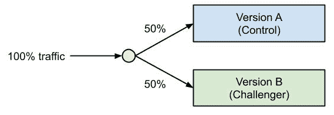
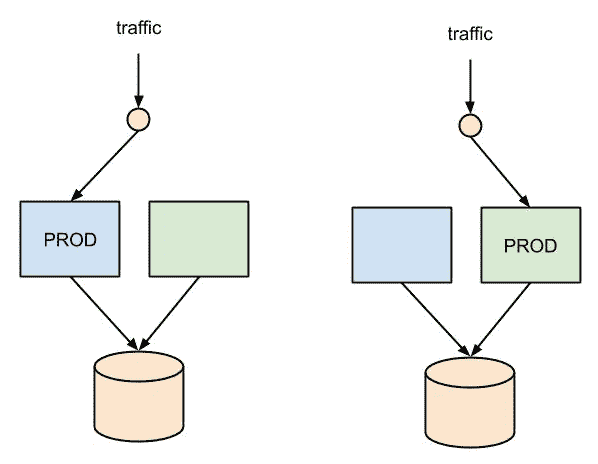

# 十三、下一步是什么？

祝贺你，你成功了——这是一次多么不可思议的旅行啊！到目前为止，您应该已经学会了如何在云中预处理数据，试验 ML 模型，在自动扩展集群上训练深度学习模型和推荐引擎，以及优化模型并将其作为 web 服务部署到 Kubernetes。此外，在上一章中，我们学习了如何在确保高质量构建和部署的同时，将此过程作为 MLOps 管道进行自动化。

在这最后一章中，我们将着眼于这一旅程中最重要的几点，并帮助你在 Azure 上实现 ML 项目时做出正确的决定。很容易迷失或者被技术和算法的选择淹没；您可以深入研究建模、基础设施或监控，而不会更接近拥有一个好的预测模型。

首先，我们将再次提醒您，ML 实际上主要是关于数据的。AI 大概应该叫数据清洗和标注，当然，这个听起来没有 AI 好听。您将会明白，您的数据是实现卓越性能的关键，因此是您首先应该关心的唯一事情。您的数据才是最重要的！

一旦涵盖了这一点，我们将稍微看一下未来，ML 将主要是自动化的，或者被称为 MLaaS。了解未来的走向总是很棒，就人工智能而言，元学习和 ML 模型已经知道应该使用和堆叠哪些模型来实现良好的预测性能。而 ML 全自动化的时候还剩下什么？完全正确—您的数据！

然后，我们将讨论云服务的不断变化和发展，尤其关注 PaaS 产品。我们将了解为什么要构建 PaaS 解决方案，以及它们的基础是什么。这将帮助你知道如何最好地为变化做准备，以及为什么你仍然在正确的基础上下赌注，尽管不断到来的变化。

我们将在多个部分讨论 ML，甚至不讨论 ML，而只讨论数据的重要性。我知道你一定感到被背叛、失望或困惑。深度神经网络在哪里？我们需要训练的一亿个参数在哪里？我们应该尝试的很酷的新框架在哪里？运行这些模型的 TPU 和 FPGAs 在哪里？

在接下来的章节中，我们将看看在 Azure 中训练和部署 ML 模型时一些重要的基础设施和监控最佳实践。

最后，我们将讨论 ML 模型的系统测量和推广。你会发现，在这个我们可以跟踪、测量和调整一切的领域，我们不会依赖个人感觉、品味或直觉。我们使用硬性指标来衡量 ML 模型的性能，我们对它们进行 A/B 测试以进行比较，并为我们的用户推出最佳版本。

本章将涵盖以下主题:

*   理解数据的重要性
*   ML 的未来是自动化的
*   变化是唯一不变的——为变化做准备
*   首先关注基础设施和监控
*   受控推出和 A/B 测试


# 理解数据的重要性

许多用于预测和模型拟合的算法问题很难使用经典的优化算法或复杂的试探法来建模、计算和优化。监督机器学习提供了一种强大的新方法，使用优化和大量带标签的训练数据来解决最复杂的问题。数据越多，模型越好。

使用 ML 算法时要记住的一件重要事情是，模型是由您提供给它们的训练数据和训练标签驱动的。好的数据是好的性能的关键。对于数据，我们通常指训练数据和使用标签注释，这是 ML 项目中最臭名昭著但也是最重要的任务之一。

在大多数 ML 项目中，您将花费超过 75%的时间进行数据分析、预处理和特征工程。彻底了解您的数据对于开发成功的预测模型至关重要。这么想吧——让你在竞争中脱颖而出的唯一东西就是你的数据。最有可能的是，你的竞争对手拥有与你相似的算法、优化和计算基础设施；他们唯一没有的是你的数据(希望如此)。因此，这就是你成功的秘诀所在:理解、解释、建模并准备好高质量预测的数据。

同样重要的是要记住，提高任何模型的预测基线性能的最大机会是改善数据，例如，通过更好的特征工程或添加更多或新的数据。不要迷失在尝试、调整和堆叠模型上，而是将大部分时间和资源花在数据预处理和特征工程上。

特性工程是你可以大放异彩并赢得预测游戏的地方。你在处理约会吗？引入其他数据源，如当地和全球假日，以及附近的活动；添加相对日期，例如，假期前几天、周末前几天。诸如此类。你处理的是地点、城市还是国家？引入人口数据，引入政治数据，引入地理数据。你明白了:你的数据越好，你的模型就越好。

你的模型只能做这么多。是的，您可以堆叠多个模型，对它们进行调优和优化，针对不同的指标进行优化，等等。然而，你最大的优势是你的数据。对于任何 ML 模型，一个好的计划是从一个非常简单的基线模型开始。使用分类数据？选择一个梯度增强的树集合，并坚持使用默认参数。预测连续值？选择逻辑回归模型。从小处着手，确保在开始摆弄模型之前获得正确的数据。

总是从基线模型开始。使用这个模型来构建所有的自动化、基础设施和指标，然后部署基线模型。值得注意的是，基线模型应该比随机方法表现得更好。一旦管道完成，您现在就可以深入数据，添加新数据，执行更好的功能工程，再次部署，测试和迭代。将您的模型简化为原始基线模型是一个困难的步骤，但是它将帮助您在项目的第一阶段成功地管理您的优先级。

为什么基线模型方法如此重要？因为它为迭代项目设定了你的思维模式，在那里你不断地度量、添加数据、重新训练和改进你的模型。您的模型将需要重新培训，您需要衡量何时会出现这种情况。为了重新培训，您需要新的培训数据。

在一个完美的设置中，您将安装一个连续的数据收集管道，直接从您当前的产品中收集新的训练数据和训练标签。你的模型能预测搜索相关性吗？收集搜索查询和点击结果。你的模型能预测欺诈吗？收集新数据和人工验证的欺诈案例的结果。你的模型能预测标签吗？跟踪预测，如果预测不准确，让您的用户更改它们。

在所有这些例子中，我们持续跟踪相关的训练数据，我们可以使用这些数据进行持续的再训练和微调。拥有这种源源不断的培训数据可能会成为你的企业的竞争优势，让你走向成功。因此，当你负责一个 ML 项目时，想想你将来如何重新训练这个模型。

最后但并非最不重要的一点是，你需要获得数据策略的首席级支持。数据是你的燃料——你需要大量的数据来实现和改进 ML 模型。这通常需要大多数公司的思维转变，因为数据现在直接用于预测。因此，数据质量很重要，数据血统很重要，以便您可以了解它来自哪里，及时性很重要，而正确性是绝对必要的。因此，请确保数据在您的公司中是一等公民，得到它应得的支持、爱护和关心。


# ML 的未来是自动化的

训练 ML 模型是一个复杂的迭代过程，包括数据准备、特征工程、模型选择、优化和部署。最重要的是，企业级端到端 ML 管道需要可复制、可解释、安全和自动化，这在专业知识、成本和基础设施要求方面给大多数公司带来了额外的挑战。

在前几章中，我们已经了解了这个过程的来龙去脉，因此我们可以肯定，这个过程一点也不简单。调整特征工程方法将影响模型训练；数据清理过程中的缺失值策略会影响优化过程。

最重要的是，您的模型捕获的信息很少是恒定的，因此大多数 ML 模型需要频繁的重新训练和部署。这导致了对 MLOps 的全新需求:ML 的 DevOps 管道，以确保您的数据、管道和模型的持续集成和持续部署。我们在前一章中讨论过这个问题。

通过自动化人工智能中的许多挑战，自动化 ML 有助于简化这一复杂的迭代过程。自动化 ML 服务只需要输入数据和一些与业务相关的配置，如要训练和执行的预测类型，而不是手动调整输入数据，然后选择、优化和部署 ML 模型。

Azure 自动化 ML 服务目前允许用户在分类、回归或时间序列预测任务之间进行选择。通过自动化所有手动步骤，该服务可以优化整个 ML 管道，甚至堆叠多个模型以提高预测性能。结果是单一模型。这样做的最大好处是，用户现在可以专注于 ML 过程中最重要的部分:理解、获取和清理数据。

在许多情况下，自动化的 ML 服务将优于人工训练的模型，同时所需的培训和运营成本也大大降低。其原因是，许多任务，如选择正确的分类嵌入、处理不平衡数据、选择最佳模型、找到最佳参数以及组合多个模型以提高性能，都可以进行系统优化，而不是手动选择。

每个主要的云提供商都提供成熟的服务来在云中执行自动化的 ML，并提供方便地部署这些模型的功能。自动化 ML 是节省时间和成本的好方法，同时为您现有的员工提供培训复杂的端到端 ML 管道所需的工具。这有助于您的公司专注于理解您的数据和业务需求，而不是修补 ML 模型和工具。这使得自动化 ML 成为真正的服务—MLaaS。


# 变化是唯一不变的——为变化做准备

在与任何大型云提供商合作时，您应该将他们的产品大致分为三种类型的服务:

*   **基础设施** **即服务** ( **IaaS** )
*   **平台** **即服务** ( **PaaS** )
*   **软件** **即服务** ( **SaaS** )

IaaS 服务是所有基础设施的抽象，如虚拟机(计算)、磁盘(存储)和网络；PaaS 服务是构建在这些组件之上的平台，具有公开底层服务的附加功能。相比之下，SaaS 服务只是通过用户界面公开，并不提供对底层数据的任何访问。

Azure ML 是 PaaS 产品的一个很好的例子，因为它结合了不同的基础设施服务、ui 和 SDK，为您提供了出色的新功能和对底层服务的完全访问，如 blob 存储、训练集群和容器注册。您还会在每月的 Azure 账单上看到，在使用 PaaS 解决方案时，您会将大部分资金花在基础设施服务上。

虽然 IaaS 解决方案为所有其他云服务奠定了基础，但它们不太可能在未来几年内发生巨大变化。新的改进将进入市场，如超固态硬盘和新的计算实例类型，但现有的 API 和产品不太可能停止。

对于 PaaS 服务来说就不一样了，因为当很多客户都有类似的问题需要解决时，它们通常被构建为托管服务。PaaS 解决方案旨在帮助客户使用其他基础设施服务，而无需反复实施大量样板文件。有多少次你看到 Azure ML 的一个特性，然后想，"嘿，我可以很容易地用我自己的实现它"？相信我，你并不孤单。这也是 PaaS 最初存在的原因。

然而，客户驱动的需求的缺点是这些需求和使用模式是不断发展的。新的用例正在出现(如 MLOps ),要求支持新的服务或现有服务的扩展。因此，您应该始终期望 PaaS 会随着时间的推移而改变，在这一节中，我将帮助您为这种改变做好准备。

通读这本书时，你可能会发现我们描述的特性或 API 与 Azure 中当前的 API 和特性之间有一点差异。如果你感到困惑，问自己这本书怎么可能已经过时了，这是可以理解的，我想向你保证，我们所展示的是值得押注的正确技术。总的来说，PaaS 产品和 MLaaS 产品一直在经历巨大的变化和改进。期待改变！

期待名字的变化——这可能是最常见的变化。众所周知，公司不擅长给产品命名，Azure 和所有其他云提供商也不例外。这可能看起来是一个很大的改变或不便，但事实上这只不过是改变服务或组件的名称，或者将其隐藏在 UI 中的其他地方。在过去的一年里，我们从 ML Studio，到 Azure ML 服务，再到 Azure ML，计算实例被称为 Azure Batch，BatchAI，AML Compute 和 training clusters。不要让这分散你的注意力——期待一些新的有趣的名字出现在你知道和喜欢的功能上。

期待用户界面的改变——这是最近 Azure 中最明显和最常见的模式。许多服务改进了用户界面，有些集成到 Azure 用户界面中，有些集成在一个单独的应用程序中。预计某些功能只在一个 UI 中公开，而不会在另一个中公开。然而，最常见的情况是，新的 UI 意味着可以通过新的界面访问相同或相似的功能。这就是为什么我们如此多地使用 Python API 而不是图形界面的原因之一——你也应该如此。

预计类会改变，包会在 SDK 中移动。大多数云提供商的 ML 解决方案的大多数 API 都在不断发展(AutoML 和 MLOps 目前处于预览阶段，正在经历大量的变化)。Azure 在其 ML 服务上投入了大量资金，因此变革是不可避免的。为这种变化做准备的一个好方法是将代码抽象成特定的实现，这些实现可以很容易地与新功能交换。另一个好的实践是小心库的更新，但是也不要在最新版本之后停留太久。

考虑到所有这些情况，你同意改变是唯一不变的吗？此外，不要忘记，所有 PaaS 解决方案最终都建立在 IaaS 解决方案的基础上，它为您的计算、存储和网络基础架构提供了坚如磐石的基础，这是一个使用自动扩展多 GPU 培训集群和 Kubernetes 上的实时评分部署的基础。

尽管不断变化，你正在建立在正确的基础上！


# 首先关注基础设施和监控

成功应用的 ML 项目依赖于解决数据收集、数据清理、特征工程和建模的迭代方法。在成功的部署和展示之后，您应该回到起点，关注您的指标，并收集更多的数据。到目前为止，应该很清楚，在您的项目中，您肯定会重复一些开发和部署步骤。

让你的 ML 项目周围的基础设施正确将会省去你很多麻烦。正如我们在前一章所讨论的，成功的基础设施的关键是自动化和版本控制。因此，我建议你多花几天时间来设置你的基础设施自动化，并注册你的数据集、模型和环境——所有这些都在 Azure ML 中完成。

监控也是如此。为了对您的模型是否按预期工作、训练数据是否仍然准确或者资源利用率是否足够高做出有根据的决策，您需要准确的度量。在部署之后向项目中添加度量是非常棘手的，因此您应该真正意识到您测量什么，您监视什么，以及您警告什么。在项目开始时，花一些额外的时间来思考您将要跟踪的度量标准。

在处理数据和模型的同时确定基础设施的优先级是很困难的。如果您能够负担得起将这些分成 ML 基础设施、建模和数据的独立团队，那么这可能不适合您。然而，这通常是不可行的。为了避免这个优先级问题，我总是建议从简单的基线模型开始，并使用简单的基线模型开始构建您的基础设施自动化。

选择最简单的模型，并为您的用例、少量训练数据和最重要的工程特性提供默认参数。在下一步中，您将它构建到一个管道中，该管道自动构建您的模型并将其部署到一个登台环境中。这种方法的优点在于，您可以自动确定基础设施的优先级，并始终输出已部署的评分服务。这将为你的成功奠定基础。

下一步，深入研究数据。确保您了解数据及其质量、如何填充缺失值以及如何预处理要素。您可以添加额外的数据并使用要素工程将原始输入数据转换为可解释的数据。如果您选择了一个好的基线模型，这项工作将极大地提高基线的性能，并为您的同事提供一个评分服务 API 以用于新服务。

一旦您确信已经构建了一个可靠的数据管道，就可以开始建模了，包括模型选择、训练、验证、优化和堆叠。同样，您应该能够看到增量改进，这些改进可以被测量并持续部署到任何 QA 环境中。一旦您的表现足够好，就向您的客户推出服务，并开始收集指标和更多培训数据。

当您在云中使用计算基础架构进行开发时，很容易很快花费几千美元来购买几台未使用或未充分利用的虚拟机。因此，我还建议您定期检查机器的数量及其利用率。如果某样东西不再被使用，那就把它关闭或者缩减到只有几个实例。请记住，云的头号优势是可扩展的基础设施。所以，请好好利用。当你不再使用的时候，关闭你的笔记本。


# 受控推出和 A/B 测试

ML 模型的部署可以被认为类似于应用程序开发中的特性和变化的部署。将经过重新训练和优化的模型看作是向用户展示模型时应用程序中的一个小的 UI 变化。这可能一开始并不明显，但是将您自己放在用户的位置，在一个场景中，推荐算法突然改变了它以前的行为。

推广不应不受控制或基于个人感觉或偏好——它们应完全基于硬性指标。向您的用户推出新功能和更新的最佳和最系统的方法是定义一个关键指标，向一部分用户(B 组)推出新模型，向其余部分用户(A 组)提供旧模型。一旦 B 组用户的指标在一段时间内超过了 A 组用户的指标，您就可以放心地向所有用户推广这个特性了。

这个概念被称为 A/B 测试，在许多科技公司用于推出新的服务和功能。正如您在下图中所看到的，您将流量分为控制组和挑战者组，其中只有后者接受新模型的服务:



部署代码变更的另一个最佳实践在前一章中已经介绍过:蓝绿色部署。在这种部署方法中，您为每次代码更改部署一个单独的服务。每个服务都连接到您的数据库，但是每个服务都包含不同版本的代码。首先，您为旧服务的所有流量提供服务。一旦新服务启动并运行，健康检查成功完成，路由器将向新服务发送所有请求。最后，如果旧服务上没有活动请求，您可以关闭它。

这个过程是更新无状态应用程序服务的一种非常安全的方式，不停机或停机时间很少。如果新服务部署不成功，它还可以帮助您回退到旧服务。下图显示了蓝绿色策略，其中蓝色和绿色代表您的应用服务或 ML 模型的完全独立的版本。我们可以看到两个无状态服务连接到同一个数据库，我们从一个服务切换到第二个全功能服务:



A/B 测试和蓝绿色部署配合得非常好，因为它们非常相似。这两者都需要部署一个功能完整的服务，通过路由策略，您的一部分用户可以访问该服务。如果你使用 Azure ML 作为你的部署和展示策略，你会得到很好的保护。首先，通过 Azure ML 到 ACI 或 AKS 的所有部署都是蓝绿色的部署，这使得您很容易退回到您的模型的以前版本。

AKS 上的 Azure ML 部署支持同一端点后面的多达六个模型版本，以实现蓝绿色部署或 A/B 测试策略。然后，您可以定义在这些端点之间拆分流量的策略；例如，您可以按百分比划分流量。下面是一个小代码示例，展示了如何在 AKS 端点上创建另一个版本，为 10%的用户提供模型的另一个版本:

```
from azureml.core.webservice import AksEndpoint

endpoint.create_version(version_name = "version-2",
                       inference_config=inference_config,
                       models=[model],
                       tags = {'modelVersion':'2'},
                       description = "my second version",
                       traffic_percentile = 10)
```

在前面的代码中，我们展示了 Azure ML 和 AKS 的受控展开的预览功能。我们使用模型和推理配置的不同组合在同一个端点下部署单独的服务。现在，流量分流通过 Kubernetes 中的路由自动发生。然而，为了与本章的前一节保持一致，预计该功能将在未来得到改进，因为它在推出 ML 模型时被许多客户使用。


# 摘要

在这一章中，我们从较高的层面看了一些东西—数据、自动化、变化、基础设施、监控和部署。我希望在阅读了前面章节中的实验、特性工程、培训、优化和部署之后，我们对这些主题的介绍对您有意义。

了解您的数据将控制和影响一切非常重要，因此让数据成为您公司的一等公民是重要的第一步。雇佣一个数据副总裁，定义数据质量、血统和可发现性的标准，这只是你可以采取的一些措施。

AutoML 将在几年内统治世界。这个想法很简单:一个训练有素的元模型总是比人类更善于提出、训练、优化和堆叠模型，以获得更高的预测性能。这完全有道理；这只是另一个参数优化步骤，也包括模型架构。另一个有趣的想法是，AutoML 将为不了解 ML 的用户提供真正的 MLaaS。也许 Excel 中会提供一个预测列，或者 Power BI 中的 ML 转换步骤，这意味着普通的办公室用户可以通过电子表格应用程序突然利用 ML 的强大功能。

我们在本章中提到，在云中使用 PaaS 时，变化是不可避免的。这是因为 PaaS 解决方案旨在实施典型的客户解决方案，并推动您消费更多的基础设施服务。随着客户需求的发展，这些 PaaS 产品也在发展。因此，一个好的收获是不要太依赖于产品名称、ui 或 SDK 包，而是要了解底层基础设施是否适合您。如果是这样，那么您可以轻松地从代码中抽象出实现细节，为变化做好准备。

在最后一节中，我们介绍了通过 A/B 测试和蓝绿色部署进行受控部署的想法。这些是 ML 部署的最佳实践，因为蓝绿色部署有助于您实施零停机部署，而 A/B 测试使您能够验证和比较新模型与控制组的性能。

我们希望你喜欢这本书，并学会如何掌握 Azure ML。在社交媒体上联系我们，告诉我们你学到了什么，你喜欢什么，以及这本书可以改进的地方。我们希望听到您的反馈。

在那之前，机器学习快乐！