# 深度学习恶意软件检测

人类的思维是一个迷人的实体。我们潜意识和潜意识的力量是不可思议的。让这种力量成为现实的是我们不断自我学习和快速适应的能力。在你意识到它的作用之前，这种大自然的神奇天赋可以计算数十亿个任务。几十年来，科学家们一直在试图建造能够像人脑一样同时执行任务的机器——换句话说，就是能够以令人难以置信的速度高效执行大量任务的系统。机器学习的一个子领域叫做**深度学习(DL)** ，它的出现是为了帮助我们构建像人脑一样工作的算法，并受到人脑结构的启发。信息安全专业人员也对此类技术感兴趣，因为它们在防御重大网络威胁和攻击方面提供了有希望的结果。恶意软件分析是实现 DL 的最合适的候选者之一。

在本章中，我们将发现:

*   人工神经网络:深入综述
*   如何用 Python 构建你的第一个神经网络
*   如何用多层感知器构建恶意软件检测器
*   恶意软件可视化技术以及如何用卷积神经网络构建恶意软件分类器


# 技术要求

基本上，在这一章中，我们将使用我们已经安装的相同的 Python 库。一般来说，我们将在本书的大部分章节中使用这些库。所以，我们花了第一章教你如何安装我们将在大多数章节和项目中使用的所有必需的库。在这个链接找到代码文件:[https://github . com/packt publishing/Mastering-Machine-Learning-for-Penetration-Testing/tree/master/chapter 04](https://github.com/PacktPublishing/Mastering-Machine-Learning-for-Penetration-Testing/tree/master/Chapter04)。


# 人工神经网络概述

我们的大脑在眨眼之间执行许多复杂的功能。因此，为了构建使用与人脑相同的技术来执行和学习的算法，我们有必要了解大脑是如何工作的。通过获得对人类大脑如何运作的公平理解，我们将对深度学习有更好的理解。三个主要的不同的心智功能是:

*   思考(分析、比较和判断)
*   感觉(快乐、悲伤和兴奋)
*   想要(动机、欲望和目标)

这三种功能在动态过程中不断相互作用。

大脑主要由三个部分组成:大脑的**，它是大脑最大的部分，控制高级功能，如视觉、听觉和味觉；**小脑**，它是负责协调肌肉运动和人体一般姿势的实体，包括其平衡；第三部分被称为**脑干**，它连接前两部分，并控制许多其他任务，包括打喷嚏、咳嗽和消化。**

 **大脑因其不同的部分而执行复杂的操作。从逻辑上讲，人脑的解剖结构由许多区域组成，因此每个区域都基于特定的算法工作。虽然大脑的每个部分都使用自己的算法工作，但令人惊讶的是，人脑使用本质上相同的算法来理解许多不同的输入模式。这个假设叫做**一个学习算法**假设。Roe 等人在 1992 年做的许多研究证明了这一点，尤其是雪貂实验，其中视觉输入被插入雪貂大脑的听觉部分，听觉皮层学会了如何看。

下图描述了**人工智能(AI)** 、**机器学习(ML)** 、**深度学习(DL)** 之间的关系:

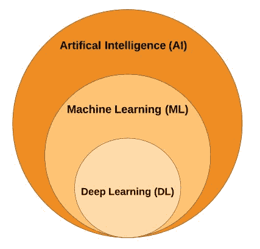

从生物学上来说，人脑是由数十亿个被称为神经元的小器官组成的。神经元是通过电信号和化学信号处理和传递信息的单位。这些神经细胞主要由:

*   树突
*   轴索
*   突触
*   细胞体
*   核

下图说明了生物神经元的不同组成部分:

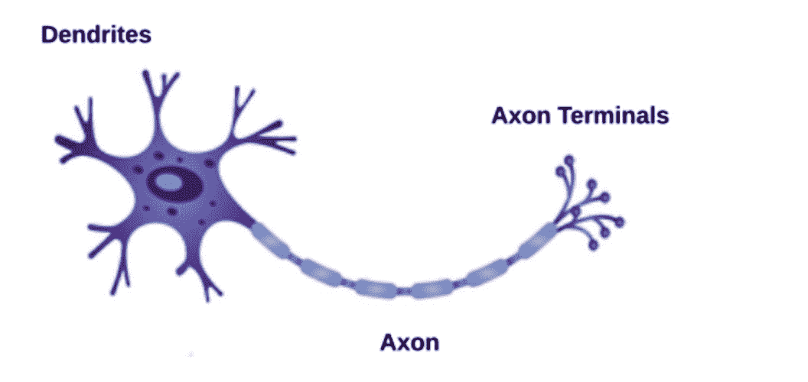

生物神经元的类比表示称为**感知器**。感知器可以分为:

*   输入
*   砝码
*   净输入函数
*   激活功能
*   输出

感知器和人类神经元之间的类比并不完全正确。它只是用来给一个感知器如何工作的一瞥。人类的思维远比人工神经网络复杂。有一些相似之处，但是直接比较大脑和神经网络是不合适的。


# 用 Python 实现神经网络

当谈到基于一系列指令和算法的计算操作时，经典的计算机程序是伟大的，但是它们在许多其他情况下面临困难和挑战；例如，手写识别。作为热身，让我们构建一个手写数字识别器，借此机会安装下一节中需要的 Python 库，并学习如何用 Python 构建和实现我们的第一个神经网络。为了训练这个模型，我们需要给它输入数据。在我们的实施中，我们将使用 MNIST 数据集:

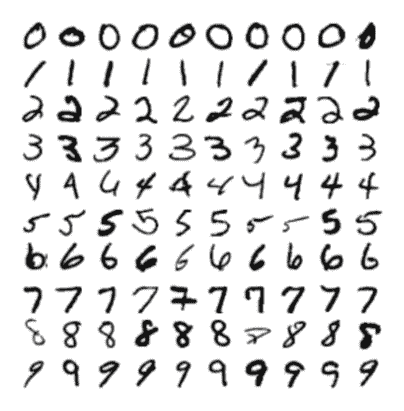

首先，让我们使用`pip install`命令安装`keras`库，如下所示:

```
# pip install keras
```

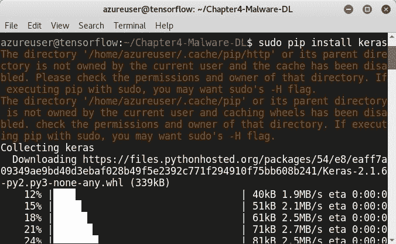

然后，使用以下命令安装 TensorFlow ( `tensorflow`):

```
# pip install tensorflow
```

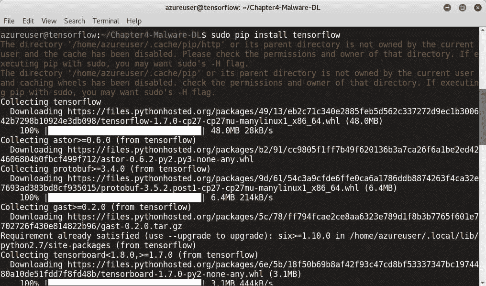

最后，安装`np_utils`:

```
# pip install np_utils
```

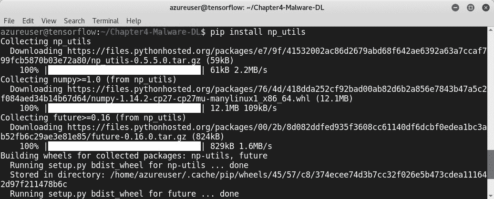

打开 Python 命令行界面，使用如下所示的导入命令导入以下模块:

*   `mnist`数据集
*   `Sequential`型号
*   `Dense`和`Dropout`层
*   `np_utils`模块

```
>>> from keras.models import Sequential
>>> from keras.layers import Dense
>>> from keras.layers import Dropout
>>> from keras.utils import np_utils
```

下图说明了前面的代码:

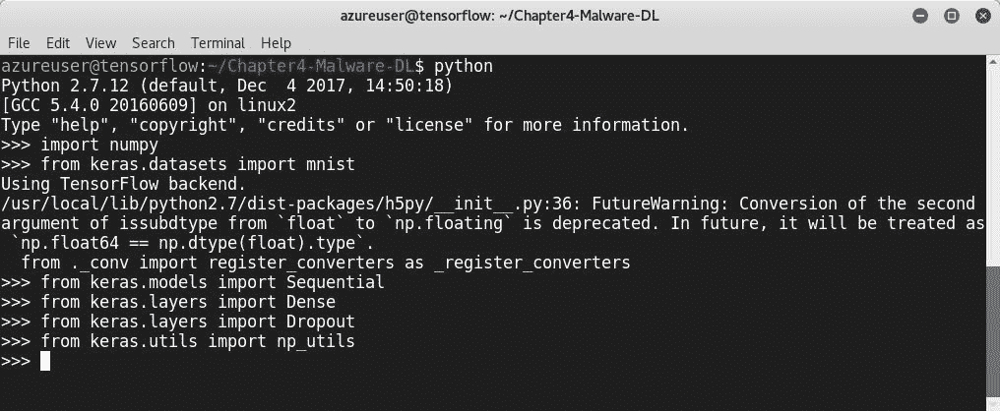

使用 Seed 是因为我们想要可重复的结果。`numpy.random.seed(seed)`用于种子发生器:

```
>>> seed = 7
>>> numpy.random.seed(seed)
>>> (X_train, y_train), (X_test, y_test) = mnist.load_data()
```

从 https://s3.amazonaws.com/img-datasets/mnist.pkl.gz[下载数据](https://s3.amazonaws.com/img-datasets/mnist.pkl.gz):

```
>>> num_pixels = X_train.shape[1] * X_train.shape[2]
>>> X_train = X_train.reshape(X_train.shape[0], num_pixels).astype('float32')
>>> X_test = X_test.reshape(X_test.shape[0], num_pixels).astype('float32')
>>> X_train = X_train / 255
>>> X_test = X_test / 255

>>> y_train = np_utils.to_categorical(y_train)
>>> y_test = np_utils.to_categorical(y_test)
>>> num_classes = y_test.shape[1]
>>> model = Sequential()
>>>model.add(Dense(num_pixels, input_dim=num_pixels, activation='relu'))
>>>model.add(Dense(num_classes,activation='softmax'))
>>>model.compile(loss='categorical_crossentropy', optimizer='adam', metrics=['accuracy'])
```

这里，`.astype()`用于转换变量，`.reshape()`用于在不改变数据的情况下给数组一个新的形状:

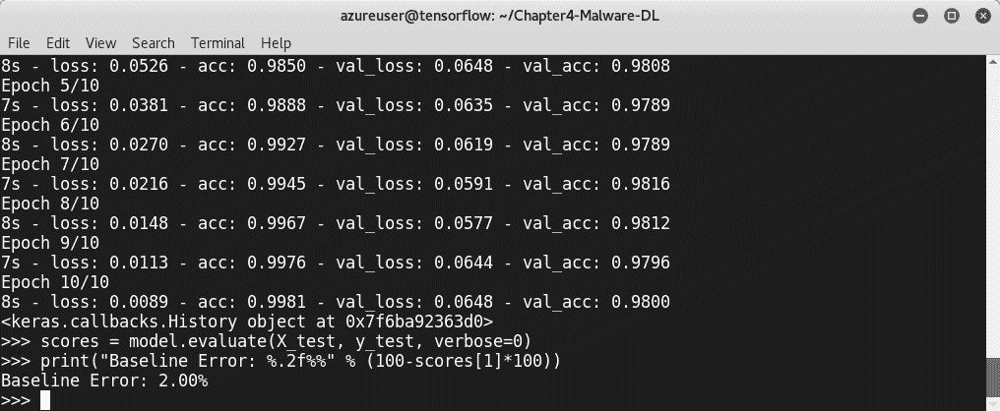

我们的手写数字分类器的准确率达到了 99.8%，这是一个惊人的结果。现在我们已经学习了如何构建我们的第一个神经网络程序，是时候利用我们的技能，并获得如何使用人工神经网络(尤其是 DL 网络)构建恶意软件分类器的实践经验了。


# 使用 PE 头的深度学习模型

根据我们所学的概念，我们将使用人工神经网络构建一个恶意软件检测器。让我们从识别数据集开始。到目前为止，您已经熟悉了构建机器学习模型所需的步骤。对于这个模型，我们将使用**可移植可执行文件** ( **PE** )作为进给数据。正如你在前一章中注意到的，我们安装了一个名为`pefile`的 Python 库。是时候在这个模型中使用它了。一旦我们用 Python 包安装管理器 PIP 安装了`pefile`，我们就可以开始使用`pefile`从任何 PE 文件中提取信息。为了从 PE 文件中收集信息，导入`os`和`pefile`库。`os`库允许你与运行 Python 的底层操作系统接口。

作为演示，我们将下载一个由 Palo Alto networks 提供的恶意软件 PE 文件，用于实验目的。使用`wget`命令下载，如下所示:

```
# wget https://wildfire.paloaltonetworks.com/publicapi/test/pe  
```

安装 PE 文件后，打开 Python 环境并导入所需的库，如下所示:

```
>>> import os
>>> import pefile
```

使用以下命令加载文件:

```
>>> PEfile = pefile.PE("pe", fast_load=True)
```

现在我们可以从 PE 文件中提取`PE_HEADER_OPTIONAL`信息，包括`MajorLinkerVersion`、`MajorLinkerVersion`、`SizeOfImage`和`DllCharacteristics`。您可以通过查看 Microsoft 文档找到完整的列表:

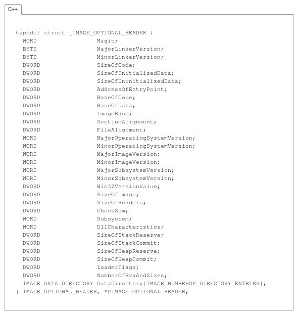

在以下脚本中，我提取了以下信息:

*   `LinkerVersion`
*   `NumberOfSections`
*   `ImageVersion`

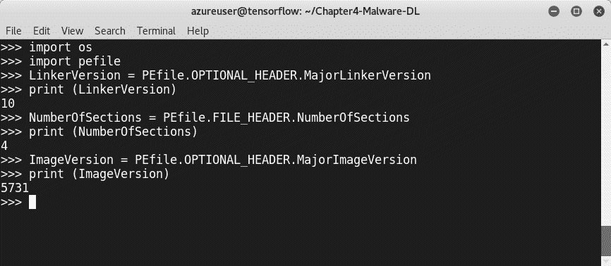

我们知道，就计算而言，训练模型是一项高消耗的任务。因此，用所有的头信息处理和输入模型并不是一个明智的决定。所以，我们需要对它们进行特征设计。选择好的特性是每个数据科学任务都需要的技能。Adobe Systems 的**产品安全事件响应团队** ( **PSIRT** )的 Karthik Raman 进行了一项名为*选择特征对恶意软件*进行分类的研究，提出了一个解决这个问题的建议，即建议我们需要选择最重要的 PE 头；它们是:

*   `DebugSize`
*   `DebugRVA`
*   `ImageVersion`
*   `OperatingSystemVersion`
*   `SizeOfStackReserve`
*   `LinkerVersion`

*   `DllCharacteristics`
*   `IatRVA`
*   `ExportSize`
*   `ExportRVA`
*   `ExportNameLen`
*   `ResourceSize`
*   `ExportFunctionsCount`

要提取它们，你可以像我们之前做的那样使用导入的`PEfile`模块:

```
DebugSize = PEfile.OPTIONAL_HEADER.DATA_DIRECTORY[6].Size
print (DebugSize)
DebugRVA = PEfile.OPTIONAL_HEADER.DATA_DIRECTORY[6].VirtualAddress
print (DebugRVA)
 ImageVersion = PEfile.OPTIONAL_HEADER.MajorImageVersion
 print (ImageVersion)
OSVersion = PEfile.OPTIONAL_HEADER.MajorOperatingSystemVersion
print (OSVersion)
ExportRVA = PEfile.OPTIONAL_HEADER.DATA_DIRECTORY[0].VirtualAddress
 print (ExportRVA)
ExportSize = PEfile.OPTIONAL_HEADER.DATA_DIRECTORY[0].Size
print (ExportSize)
IATRVA = PEfile.OPTIONAL_HEADER.DATA_DIRECTORY[12].VirtualAddress
 print (IATRVA)
ResSize = PEfile.OPTIONAL_HEADER.DATA_DIRECTORY[2].Size
 print (ResSize)
LinkerVersion = PEfile.OPTIONAL_HEADER.MajorLinkerVersion
 print (LinkerVersion)
NumberOfSections = PEfile.FILE_HEADER.NumberOfSections
 print (NumberOfSections)
StackReserveSize = PEfile.OPTIONAL_HEADER.SizeOfStackReserve
 print (StackReserveSize)
Dll = PEfile.OPTIONAL_HEADER.DllCharacteristics
print (Dll)
```

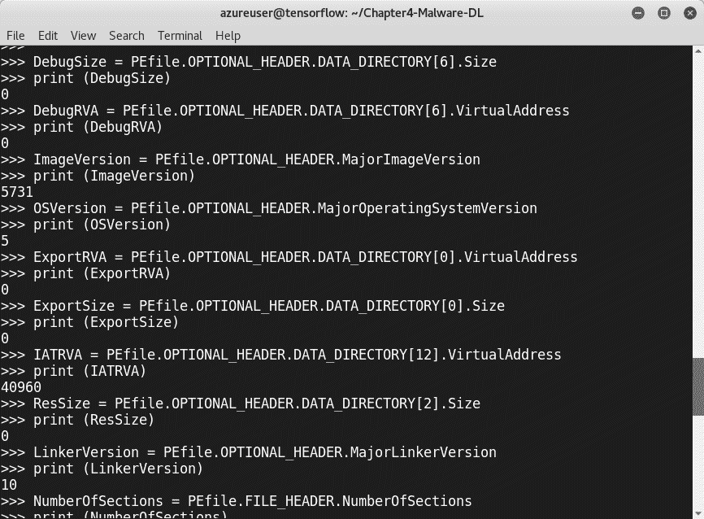

为了训练该模型，有许多公开可用的来源。您可以从大量组织和教育机构下载不同类型的文件(干净的和恶意的)，例如:

*   **病毒登录**:[http://www.virusign.com/](http://www.virusign.com/)
*   **马尔沙尔**:[http://malshare.com/](http://malshare.com/)
*   **恶意软件数据库**:[http://ytisf.github.io/theZoo/](http://ytisf.github.io/theZoo/)
*   **end game Malware BEnchmark for Research(EMBER)**:最大的数据集之一，包含 110 万个来自 PE 文件的 SHA256 哈希，这些文件在 2017 年的某个时候被扫描。我强烈建议您下载它，并尝试使用它来构建您的模型。可以从 https://pubdata.endgame.com/ember/ember_dataset.tar.bz2 的[下载(1.6 GB，扩展到 9.2 GB):](https://pubdata.endgame.com/ember/ember_dataset.tar.bz2)


你的数据集应该包含两类 PE 文件:**干净**和**恶意文件**。我们至少需要 10，000 个文件来训练模型。您将不得不使用前面的脚本开始提取标题信息。您可以通过自己开发自动化脚本来自动化该任务。随意使用任何编程语言。最好的方法是将所有文件中选定的特性导出到 CSV 文件中，这样我们就可以使用我们在前面章节中学到的内容，这样我们就可以在以后使用 pandas 加载它们:

```
Malware  = pd.read_csv("Malware.csv")
Clean_Files = pd.read_csv("Clean_Files.csv")
```

准备好特性后，我们需要将两种类型的数据合并成一个。例如，我们可以使用`pd.concat`来合并两个文件。为了训练模型，我们需要导入所需的模块:

```
>>> import numpy as np
>>> from sklearn.model_selection import train_test_split
>>> from sklearn.metrics import confusion_matrix
>>> from sklearn.neural_network import MLPClassifier
>>> from sklearn.preprocessing import StandardScaler
```

对于数据准备:

```
y = dataset['Clean_Files']
X = dataset.drop('Clean_Files',axis = 1)
X = np.asarray(X)
y = np.asarray(y)
```

这条线用于分割，正如我们在其他模型中所做的那样:

```
X_train,X_test,y_train,y_test = train_test_split(X,y,test_size = 0.3,random_state=0)
```

为了更好的预测，我们可以使用`StandScaler()`；它用于通过移除平均值和缩放至单位方差来标准化特征:

```
scaler = StandardScaler()
scaler.fit(X_train)
X_train = scaler.transform(X_train)
X_test = scaler.transform(X_test)
```

在准备和特征工程数据之后，我们必须建立**多层感知器** ( **MLP** )网络:

```
MLP = MLPClassifier(hidden_layer_sizes=(12,12,12,12,12,12))
```

在这里，`12`是层数和特征数。让我们训练模型并计算预测值:

```
MLP.fit(X_train,y_train)
Predictions = MLP.predict(X_test)
```

要检查评估指标，请添加以下行:

```
TN, FP, FN TP = confusion_matrix(y_test,predictions).ravel()
```

`ravel()`在这里用来返回一个连续的扁平数组。它相当于`reshape(-1, order=order)`:

```
print ("True Positive:" , TP)
print ("True Negative:" , TN)
print ("False Positive:" , FP)
print ("False Negative:" , FN)
```


# 具有卷积神经网络和恶意软件可视化的深度学习模型

前一部分是检测恶意软件的 MLP 网络的真实实现。现在，我们将探索其他人工网络架构，我们还将学习如何使用其中一种架构来帮助恶意软件分析师和信息安全专业人员检测和分类恶意代码。在深入研究 DL 方法的技术细节和实际实现步骤之前，有必要了解和发现人工神经网络的其他不同架构。我们在[第 1 章](part0021.html#K0RQ0-49a67f1d6e7843d3b2296f38e3fe05f5)、*Pentesting 中的机器学习介绍*中简要讨论了其中的一些。现在讨论主要的人工神经网络。


# 卷积神经网络

**卷积神经网络**(**CNN**)是一种深度学习方法，用于解决图像分类问题，或者我们所说的计算机视觉问题，因为经典的计算机程序面临许多挑战和困难来识别物体，原因有很多，包括光照、视点、变形和分割。这项技术的灵感来自于眼睛的工作方式，尤其是动物的视觉皮层功能算法。在 CNN 中，以宽度、高度和深度为特征排列成三维结构。对于图像，高度是图像高度，宽度是图像宽度，深度是 RGB 通道。要构建 CNN，我们需要三种主要类型的层:

*   **卷积层**:卷积运算是指从输入图像中提取特征，并将滤波器中的值与原始像素值相乘
*   **汇集层**:汇集操作降低了每个特征图的维度
*   **全连接层**:全连接层是一个经典的多层感知器，在输出层有一个 softmax 激活函数

要使用 Python 实现 CNN，您可以使用以下 Python 脚本:

```
import numpy
from keras.datasets import mnist
from keras.models import Sequential
from keras.layers import Dense
from keras.layers import Dropout
from keras.layers import Flatten
from keras.layers.convolutional import Conv2D
from keras.layers.convolutional import MaxPooling2D
from keras.utils import np_utils
from keras import backend 
backend.set_image_dim_ordering('th')

model = Sequential()
model.add(Conv2D(32, (5, 5), input_shape=(1, 28, 28), activation='relu'))
model.add(MaxPooling2D(pool_size=(2, 2)))
model.add(Dropout(0.2))
model.add(Flatten())
model.add(Dense(128, activation='relu'))
model.add(Dense(num_classes, activation='softmax'))
model.compile(loss='categorical_crossentropy', optimizer='adam', metrics=['accuracy'])
```


# 循环神经网络

**循环神经网络** ( **RNNs** )是人工神经网络，我们可以利用序列信息，比如句子。换句话说，rnn 对序列的每个元素执行相同的任务，输出取决于先前的计算。rnn 广泛用于语言建模和文本生成(机器翻译、语音识别和许多其他应用)。RNNs 不记得长时间的事情。


# 长短期记忆网络

**长短期记忆** ( **LSTM** )通过构建记忆块解决了循环神经网络中的短期记忆问题。这个块有时被称为**存储单元**。


# Hopfield 网络

Hopfield 网络是由 John Hopfield 在 1982 年开发的。Hopfield 网络的主要目标是自动关联和优化。我们有两类 Hopfield 网络:**离散**和**连续**。


# 玻尔兹曼机器网络

玻尔兹曼机器网络使用循环结构，并且它们只使用本地可用的信息。它们是由 Geoffrey Hinton 和 Terry Sejnowski 在 1985 年开发的。此外，玻尔兹曼机器的目标是优化解决方案。


# 使用 CNN 检测恶意软件

对于这个新模型，我们将发现如何用 CNN 构建一个恶意软件分类器。但我敢打赌，你一定在想，当 CNN 把图像作为输入时，我们如何才能做到这一点。答案很简单，这里的技巧是将恶意软件转换成图像。这可能吗？是的，它是。恶意软件可视化是过去几年中许多研究课题之一。提出的解决方案之一来自加州大学圣巴巴拉分校视觉研究实验室的 Lakshmanan Nataraj 的一项名为*恶意软件图像:可视化和自动分类*的研究。

下图详细说明了如何将恶意软件转换为映像:

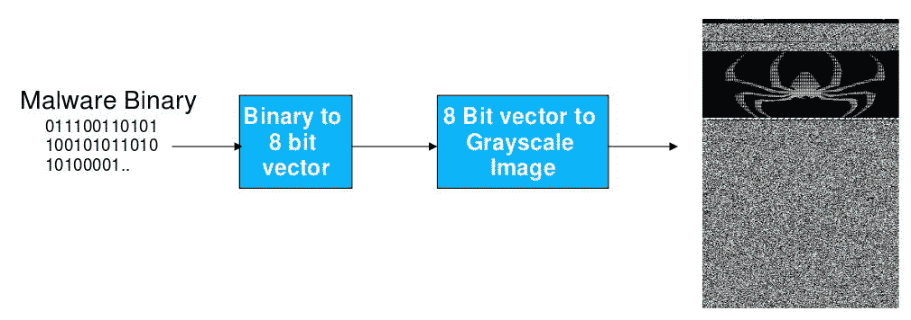

以下是 **Alueron.gen 的图片！J** 恶意软件:


这种技术还使我们能够以一种详细的方式可视化恶意软件部分:

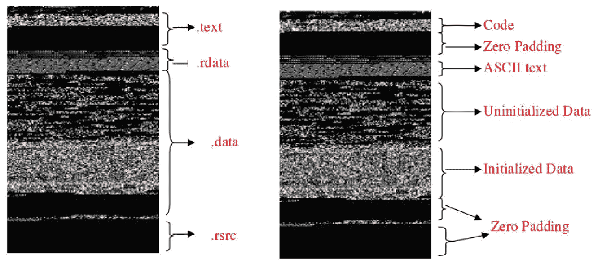

通过解决如何通过图像向使用 CNN 的恶意软件机器学习分类器提供信息的问题，信息安全专业人员可以使用 CNN 的能力来训练模型。最常用于馈送 CNN 的恶意软件数据集之一是**恶意数据集**。该恶意软件数据集包含来自 25 个不同恶意软件家族的 9，339 个恶意软件样本。您可以通过访问此链接从 Kaggle(预测建模和分析竞赛平台)下载:[https://www.kaggle.com/afagarap/malimg-dataset/data](https://www.kaggle.com/afagarap/malimg-dataset/data)。

这些是恶意软件家族:

*   所有人。L
*   所有人。A
*   云儿。A
*   洛丽达。AA 1
*   洛丽达。AA 2
*   洛丽达。AA 3
*   C2Lop。P
*   C2Lop.gen！G
*   即时访问
*   Swizzor.gen！我
*   Swizzor.gen！E
*   VB。在(某时间或时刻);在(学习或工作地点);在(某处)
*   Fakerean
*   Alueron.gen！J
*   Malex.gen！J
*   洛丽达。在(某时间或时刻);在(学习或工作地点);在(某处)
*   阿迪尔。C
*   温特里姆。布朗克斯(Bronx)
*   拨号平台。B
*   东托沃。A
*   混淆器。广告
*   特工。供参考
*   自动运行。K
*   Rbot！情报
*   皮肤修整。普通

将恶意软件转换为灰度图像后，您可以获得以下恶意软件表示，以便稍后可以使用它们来输入机器学习模型:

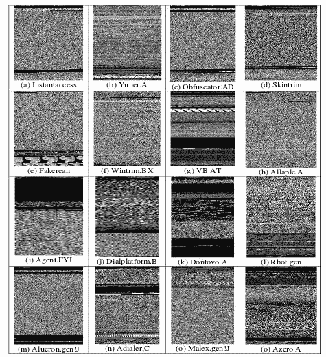

可以使用以下 Python 脚本将每个恶意软件转换为灰度图像:

```
import os
import scipy
import array
 filename = '<Malware_File_Name_Here>';
 f = open(filename,'rb');
 ln = os.path.getsize(filename);
width = 256;
 rem = ln%width;
 a = array.array("B");
 a.fromfile(f,ln-rem);
 f.close();
 g = numpy.reshape(a,(len(a)/width,width));
 g = numpy.uint8(g);
 scipy.misc.imsave('<Malware_File_Name_Here>.png',g);
```

对于特征选择，您可以提取或使用任何图像特征，如纹理图案、图像中的频率、强度或颜色特征，使用不同的技术，如**欧几里德距离**或均值和标准差，以生成后续特征向量。在我们的例子中，我们可以使用诸如颜色布局描述符、同质纹理描述符或**全局图像描述符** ( **要点**)等算法。让我们假设我们选择了要点；`pyleargist`是一个很棒的 Python 库来计算它。要安装它，请照常使用 PIP:

```
# pip install pyleargist==1.0.1
```

作为一个用例，要计算要点，您可以使用以下 Python 脚本:

```
import Image
Import leargist
 image = Image.open('<Image_Name_Here>.png');
 New_im = image.resize((64,64));
des = leargist.color_gist(New_im);
Feature_Vector = des[0:320];
```

这里，`320`指的是我们使用灰度图像时的第一个`320`值。不要忘记将它们保存为 *NumPy 数组*以便稍后使用它们来训练模型。

在获得特征向量之后，我们可以训练许多不同的模型，包括 SVM、k-means 和人工神经网络。有用的算法之一是 CNN 的算法。

一旦特征选择和工程完成，我们就可以建立一个 CNN。例如，对于我们的模型，我们将构建一个具有两个卷积层的卷积网络，输入为 *32 * 32* 。要使用 Python 库构建模型，我们可以使用之前安装的 TensorFlow 和 utils 库来实现它。

因此，CNN 的整体架构如下图所示:

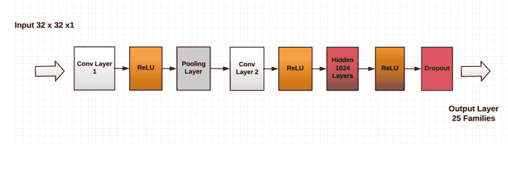

这种 CNN 架构并不是构建模型的唯一建议，但目前我们将使用它来实现。

为了建立模型和 CNN，我强烈推荐 Keras。所需的进口如下:

```
import keras
 from keras.models import Sequential,Input,Model
 from keras.layers import Dense, Dropout, Flatten
 from keras.layers import Conv2D, MaxPooling2D
 from keras.layers.normalization import BatchNormalization
 from keras.layers.advanced_activations import LeakyReLU
```

正如我们之前所讨论的，灰度图像的像素值范围从 0 到 255，因此我们需要向网络提供尺寸为 *32 * 32 * 1* 的图像:

```
train_X = train_X.reshape(-1, 32,32, 1)
test_X = test_X.reshape(-1, 32,32, 1)
```

我们将用这些参数训练我们的网络:

```
batch_size = 64
epochs = 20
num_classes = 25
```

要构建架构，就其格式而言，请使用以下内容:

```
Malware_Model = Sequential()
Malware_Model.add(Conv2D(32, kernel_size=(3,3),activation='linear',input_shape=(32,32,1),padding='same'))
Malware_Model.add(LeakyReLU(alpha=0.1))
Malware_model.add(MaxPooling2D(pool_size=(2, 2),padding='same'))
Malware_Model.add(Conv2D(64, (3, 3), activation='linear',padding='same'))
Malware_Model.add(LeakyReLU(alpha=0.1))
Malware_Model.add(Dense(1024, activation='linear'))
Malware_Model.add(LeakyReLU(alpha=0.1))
Malware_Model.add(Dropout(0.4))
Malware_Model.add(Dense(num_classes, activation='softmax'))
```

要编译模型，请使用以下代码:

```
Malware_Model.compile(loss=keras.losses.categorical_crossentropy, optimizer=keras.optimizers.Adam(),metrics=['accuracy'])
```

拟合和训练模型:

```
Malware_Model.fit(train_X, train_label, batch_size=batch_size,epochs=epochs,verbose=1,validation_data=(valid_X, valid_label))
```

正如你所注意到的，我们尊重前几章讨论过的训练神经网络的流程。若要评估模型，请使用以下代码:

```
Malware_Model.evaluate(test_X, test_Y_one_hot, verbose=0)
print('The accuracy of the Test is:', test_eval[1])
```


# 将深度学习应用于恶意软件检测的前景和挑战

机器学习从业者和恶意软件分析师提出了许多不同的深度网络架构来检测已知和未知的恶意软件；一些提出的架构包括受限玻尔兹曼机和混合方法。你可以在*延伸阅读*部分查看其中一些。检测恶意软件和恶意软件的新方法显示出许多有希望的结果。然而，当使用深度学习网络来检测恶意软件时，恶意软件分析师面临许多挑战，特别是在分析 PE 文件时，因为为了分析 PE 文件，我们将每个字节作为输入单元，所以我们要处理数百万步的分类序列，此外，由于函数调用和跳转命令，还需要保持函数之间复杂的空间相关性。


# 摘要

恶意软件是每个现代组织的噩梦。攻击者和网络罪犯总是想出新的恶意软件来攻击他们的目标。安全供应商正在尽最大努力防御恶意软件攻击，但不幸的是，随着每月发现数百万恶意软件，他们无法实现这一目标。因此，需要新的方法，这正是我们在这一章和前一章所看到的。我们发现了如何使用不同的机器学习算法来构建恶意软件检测器，特别是使用深度学习技术的力量。在下一章，我们将学习如何通过构建和开发健壮的智能系统来检测僵尸网络。


# 问题

1.  MLP 网络和深度学习网络有什么区别？
2.  为什么 DL 最近正在腾飞？
3.  为什么我们需要多次迭代不同的模型？
4.  将英语翻译成法语需要什么类型的翻译人员？
5.  为什么恶意软件可视化是对恶意软件进行分类的好方法？
6.  激活功能的作用是什么？
7.  能提三个 DL 架构吗？


# 进一步阅读

*   **博文**:
    *   Keras 教程:Python 中的深度学习([https://www . data camp . com/community/tutorials/Deep-Learning-Python](https://www.datacamp.com/community/tutorials/deep-learning-python))
    *   用 Keras 一步一步地用 Python 开发你的第一个神经网络([https://machinelingmastery . com/tutorial-First-Neural-Network-Python-Keras/](https://machinelearningmastery.com/tutorial-first-neural-network-python-keras/))
    *   手写数字的 MNIST 数据库([http://yann.lecun.com/exdb/mnist](http://yann.lecun.com/exdb/mnist)/)

*   **论文和演讲**:
    *   恶意软件家族的高维可视化([https://www . RSA conference . com/writable/presentations/file _ upload/TTA-f04-high-dimension-visualization-of-malware-families . pdf](https://www.rsaconference.com/writable/presentations/file_upload/tta-f04-high-dimensional-visualization-of-malware-families.pdf))
    *   一种基于深度学习的混合恶意代码检测方法([http://www . covert . io/research-papers/Deep-Learning-security/A % 20 Hybrid % 20 Malicious % 20 Code % 20 Detection % 20 Method % 20 based % 20 on % 20 Deep % 20 Learning . pdf](http://www.covert.io/research-papers/deep-learning-security/A%20Hybrid%20Malicious%20Code%20Detection%20Method%20based%20on%20Deep%20Learning.pdf)
    *   恶意软件分类的多任务学习模型，具有来自 API 调用序列的有用文件访问模式([http://www . covert . io/research-papers/deep-Learning-security/A % 20 Multi-task % 20 Learning % 20 Model % 20 for % 20 Malware % 20 class ification % 20 with % 20 usefull % 20 File % 20 Access % 20 Pattern % 20 from % 20 API % 20 Call % 20 Sequence . pdf](http://www.covert.io/research-papers/deep-learning-security/A%20Multi-task%20Learning%20Model%20for%20Malware%20Classification%20with%20Useful%20File%20Access%20Pattern%20from%20API%20Call%20Sequence.pdf)
    *   结合受限的 Boltzmann 机器和单侧感知器进行恶意软件检测([http://www . covert . io/research-papers/deep-learning-security/Combining % 20 Restricted % 20 Boltzmann % 20 Machine % 20 和% 20One % 20Side %感知器% 20 for % 20 Malware % 20 Detection . pdf](http://www.covert.io/research-papers/deep-learning-security/Combining%20Restricted%20Boltzmann%20Machine%20and%20One%20Side%20Perceptron%20for%20Malware%20Detection.pdf)
    *   用于恶意软件分类的卷积神经网络-论文([http://www . covert . io/research-papers/deep-learning-security/卷积% 20 Neural % 20 Networks % 20 for % 20 Malware % 20 Classification . pdf](http://www.covert.io/research-papers/deep-learning-security/Convolutional%20Neural%20Networks%20for%20Malware%20Classification.pdf)
    *   用于恶意软件系统调用序列分类的深度学习([http://www . covert . io/research-papers/Deep-Learning-security/Deep % 20 Learning % 20 for % 20 class ification % 20 of % 20 Malware % 20 System % 20 Call % 20 Sequences . pdf](http://www.covert.io/research-papers/deep-learning-security/Deep%20Learning%20for%20Classification%20of%20Malware%20System%20Call%20Sequences.pdf)
    *   使用二维二进制程序特征的基于深度神经网络的恶意软件检测([http://www . covert . io/research-papers/Deep-learning-security/Deep % 20 Neural % 20 Network % 20 Based % 20 Malware % 20 Detection % 20 using % 20 Two % 20 dimension % 20 Binary % 20 Program % 20 Features . pdf](http://www.covert.io/research-papers/deep-learning-security/Deep%20Neural%20Network%20Based%20Malware%20Detection%20Using%20Two%20Dimensional%20Binary%20Program%20Features.pdf)
    *   DL4MD:用于智能恶意软件检测的深度学习框架([http://www . covert . io/research-papers/Deep-Learning-security/DL4MD-% 20A % 20 Deep % 20 Learning % 20 Framework % 20 for % 20 Intelligent % 20 Malware % 20 Detection . pdf](http://www.covert.io/research-papers/deep-learning-security/DL4MD-%20A%20Deep%20Learning%20Framework%20for%20Intelligent%20Malware%20Detection.pdf))
    *   droid-Sec:Android 恶意软件检测中的深度学习([http://www . covert . io/research-papers/Deep-Learning-security/droid Sec % 20-% 20 Deep % 20 Learning % 20 in % 20 Android % 20 Malware % 20 Detection . pdf](http://www.covert.io/research-papers/deep-learning-security/DroidSec%20-%20Deep%20Learning%20in%20Android%20Malware%20Detection.pdf)
    *   HADM:检测恶意软件的混合分析([http://www . covert . io/research-papers/deep-learning-security/HADM-% 20 Hybrid % 20 Analysis % 20 for % 20 Detection % 20 of % 20 Malware . pdf](http://www.covert.io/research-papers/deep-learning-security/HADM-%20Hybrid%20Analysis%20for%20Detection%20of%20Malware.pdf))
    *   使用循环网络的恶意软件分类([http://www . covert . io/research-papers/deep-learning-security/Malware % 20 class ification % 20 with % 20 Recurrent % 20 Networks . pdf](http://www.covert.io/research-papers/deep-learning-security/Malware%20Classification%20with%20Recurrent%20Networks.pdf))**