<title>Botnet Detection with Machine Learning</title> 

# 基于机器学习的僵尸网络检测

如今，互联设备在现代生活中扮演着重要角色。从智能家电、电脑、咖啡机和相机，到联网汽车，我们生活方式的这一巨大转变让我们的生活变得更加轻松。不幸的是，这些暴露的设备可能会受到攻击者和网络罪犯的攻击和访问，他们以后可能会使用它们来实施更大规模的攻击。安全供应商提供了许多解决方案和产品来防御僵尸网络，但在本章中，正如我们在前面章节中所做的那样，我们将学习如何使用 Python 和机器学习技术来构建新颖的僵尸网络检测系统。

在本章中，我们将看到:

*   僵尸网络概述
*   如何用不同的机器学习算法构建僵尸网络检测器
*   如何构建一个 Twitter 机器人检测器

<title>Technical requirements</title> 

# 技术要求

除了一些其他有用的脚本之外，您可以在下面的资源库中找到所有讨论的代码:[https://github . com/packt publishing/Mastering-Machine-Learning-for-Penetration-Testing/tree/master/chapter 5](https://github.com/PacktPublishing/Mastering-Machine-Learning-for-Penetration-Testing/tree/master/Chapter5)。

<title>Botnet overview</title> 

# 僵尸网络概述

僵尸网络是两个术语**僵尸**和**网络**的组合。bot 部分代表了这种恶意软件像机器人一样自动完成事情和任务的事实。第二部分指的是一个网络，换句话说，是一个被入侵设备的网络。因此，根据定义，僵尸网络是一种恶意软件，它攻击互联网上的计算机，并用命令和控制服务器控制它们执行各种各样的自动化任务，包括发送垃圾邮件和执行**分布式拒绝服务** ( **DDoS** )攻击。被攻击的机器加入了一个巨大的被入侵机器网络。前几年最著名的僵尸网络之一是 Mirai 未来组合僵尸网络。Mirai 未来组合在日语中是未来的意思。这个僵尸网络通过扫描和识别易受攻击的机器，攻击了数百万台在线设备，特别是**物联网** ( **物联网**)设备，利用了大多数设备都是使用默认登录凭据访问的事实。僵尸网络执行的一些任务是:

*   广告欺诈和发送垃圾邮件
*   加密货币挖掘
*   窃取个人数据和敏感信息
*   执行 DDoS 攻击
*   执行暴力攻击

下图描述了僵尸网络生态系统的不同参与者:

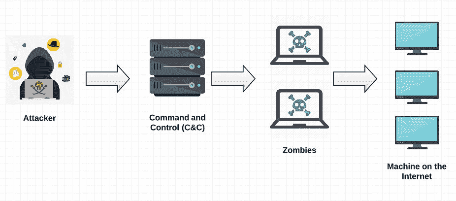

黑客是一项方法论任务。罪犯和网络攻击者通常使用相同的定义步骤。作为渗透测试人员和信息安全专业人员，您知道黑客攻击的各个阶段，即信息收集，或者我们称之为侦察；扫描；获得访问权；维护访问权；最后清理铁轨。因此，僵尸网络通常遵循一些定义好的步骤。僵尸网络基于四个不同的阶段工作:

*   **感染**:在这个阶段，攻击者通过发送恶意软件来感染目标机器。
*   **连接**:在这个阶段，僵尸网络启动与控制和命令服务器的互联网连接，以接收命令和自动化任务。
*   **控制**:在这个阶段，攻击发生，比如发送垃圾邮件。
*   **倍增**:在这一阶段，僵尸网络会试图让更多的机器加入网络，成为我们所说的**僵尸**:

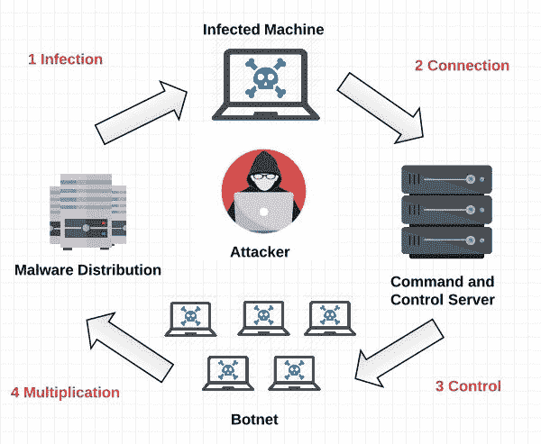<title>Building a botnet detector model with multiple machine learning techniques</title> 

# 利用多种机器学习技术构建僵尸网络检测器模型

在本节中，我们将学习如何使用许多机器学习算法来构建不同的僵尸网络检测系统。作为第一个实际实验室的开始，让我们从使用不同的分类器构建一个基于机器学习的僵尸网络检测器开始。到目前为止，我希望您已经清楚地了解了构建机器学习系统的主要步骤。所以，我相信你已经知道，作为第一步，我们需要寻找一个数据集。许多教育机构和组织得到了一组从内部实验室收集的数据集。最著名的僵尸网络数据集之一被称为 **CTU-13** 数据集。这是一个由捷克共和国 CTU 大学提供的标记数据集，包含僵尸网络、正常流量和后台流量。在他们的工作中，他们试图捕捉真实的僵尸网络流量与正常流量和背景流量的混合。要下载数据集并查看有关它的更多信息，可以访问以下链接:[https://mcfp . wee bly . com/the-CTU-13-dataset-a-labelled-dataset-with-botnet-normal-and-background-traffic . html](https://mcfp.weebly.com/the-ctu-13-dataset-a-labeled-dataset-with-botnet-normal-and-background-traffic.html)。

数据集是双向网络流文件。但是什么是双向网流文件呢？Netflow 是由 Cisco 开发的互联网协议。该协议的目标是收集 IP 流量信息并监控网络流量，以便更清楚地了解网络流量。网络流架构的主要组件是一个**网络流导出器**、一个**网络流收集器**和一个**流存储器**。下图说明了 NetFlow 基础架构的不同组件:

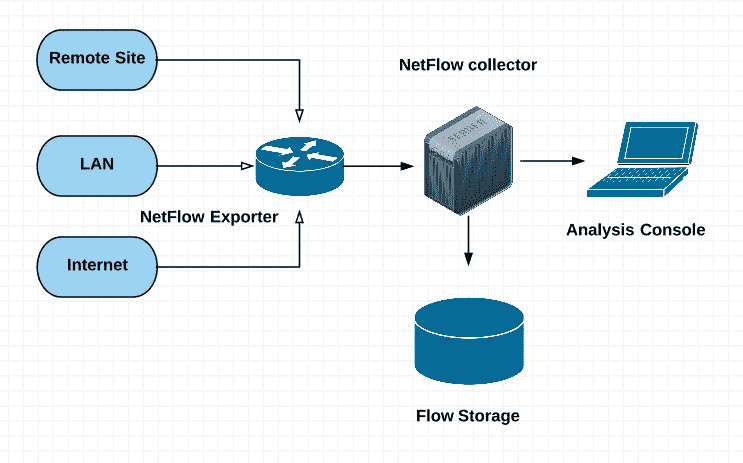

对于 NetFlow 一般来说，当主机 A 向**主机 B** 发送一个信息，并从**主机 B** 向**主机 A** 发送一个信息作为回复时，这种操作称为单向 NetFlow。发送和回复被认为是不同的操作。在双向网络流中，我们将来自**主机 A** 和**主机 B** 的流视为一个流。让我们使用以下命令下载数据集:

```
$ wget --no-check-certificate https://mcfp.felk.cvut.cz/publicDatasets/CTU-13-Dataset/CTU-13-Dataset.tar.bz2
```

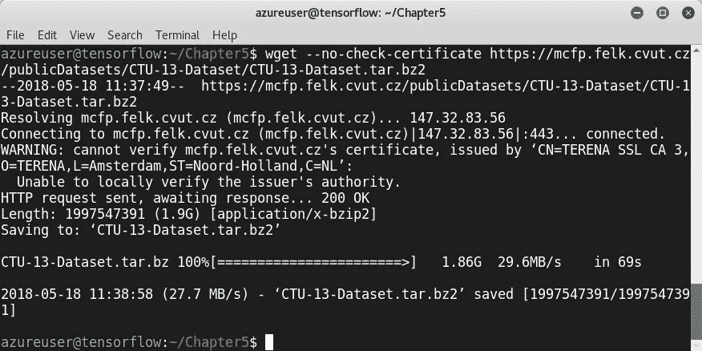

使用以下命令提取下载的`tar.bz2`文件:

```
# tar xvjf  CTU-13-Dataset.tar.bz2
```

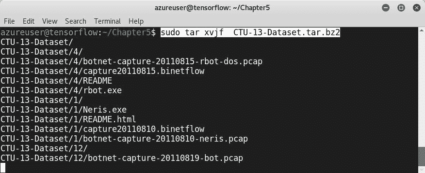

该文件包含所有不同场景的数据集。在演示中，我们将使用数据集 8(场景 8)。您可以选择任何场景，也可以使用您自己收集的数据，或者其他机构提供的任何其他`.binetflow`文件:


像往常一样使用 pandas 加载数据:

```
>>> import pandas as pd
>>> data = pd.read_csv("capture20110816-3.binetflow")
>>> data['Label'] = data.Label.str.contains("Botnet")
```

在任何以数据为中心的项目中，探索数据都是必不可少的。例如，您可以从检查特征或列的名称开始:

```
>> data.columns
```

该命令产生数据集的列:`StartTime`、`Dur`、`Proto`、`SrcAddr`、`Sport`、`Dir`、`DstAddr`、`Dport`、`State`、`sTos`、`dTos`、`TotPkts`、`TotBytes`、`SrcBytes`和`Label`。列表示数据集中使用的要素；例如，`Dur`代表持续时间，`Sport`代表源端口，依此类推。你可以在本章的 GitHub 资源库中找到完整的特性列表。

在训练模型之前，我们需要构建一些脚本来准备数据。这一次，我们将构建一个单独的 Python 脚本来准备数据，稍后我们可以将其导入到主脚本中。

我将调用第一个脚本`DataPreparation.py`。有许多建议用来帮助提取特征和准备数据，以使用机器学习来构建僵尸网络检测器。在我们的例子中，我定制了两个新的脚本，灵感来自 *NagabhushanS* 构建的数据加载脚本:

```
from __future__ import division
import os, sys
import threading
```

在导入所需的 Python 包之后，我们创建了一个名为`Prepare`的类来选择训练和测试数据:

```
class Prepare(threading.Thread): 
def __init__(self, X, Y, XT, YT, accLabel=None):
 threading.Thread.__init__(self)
 self.X = X
 self.Y = Y
 self.XT=XT
 self.YT=YT
 self.accLabel= accLabel

def run(self):
 X = np.zeros(self.X.shape)
 Y = np.zeros(self.Y.shape)
 XT = np.zeros(self.XT.shape)
 YT = np.zeros(self.YT.shape)
 np.copyto(X, self.X)
 np.copyto(Y, self.Y)
 np.copyto(XT, self.XT)
 np.copyto(YT, self.YT)
 for i in range(9):
 X[:, i] = (X[:, i] - X[:, i].mean()) / (X[:, i].std())
 for i in range(9):
 XT[:, i] = (XT[:, i] - XT[:, i].mean()) / (XT[:, i].std())
```

第二个剧本叫`LoadData.py`。你可以在 GitHub 上找到它，并在你的项目中直接使用它从`.binetflow`文件中加载数据并生成一个`pickle`文件。

让我们使用之前开发的工具来训练模型。在构建数据加载器并准备好我们将要使用的机器学习算法之后，是时候训练和测试模型了。

首先，从`pickle`文件加载数据，这就是为什么我们需要导入`pickle` Python 库。不要忘记使用以下命令导入前面的脚本:

```
import LoadData
import DataPreparation
import pickle
file = open('flowdata.pickle', 'rb')
data  = pickle.load(file)
```

选择数据节:

```
Xdata = data[0]
Ydata =  data[1]
XdataT = data[2]
YdataT = data[3]
```

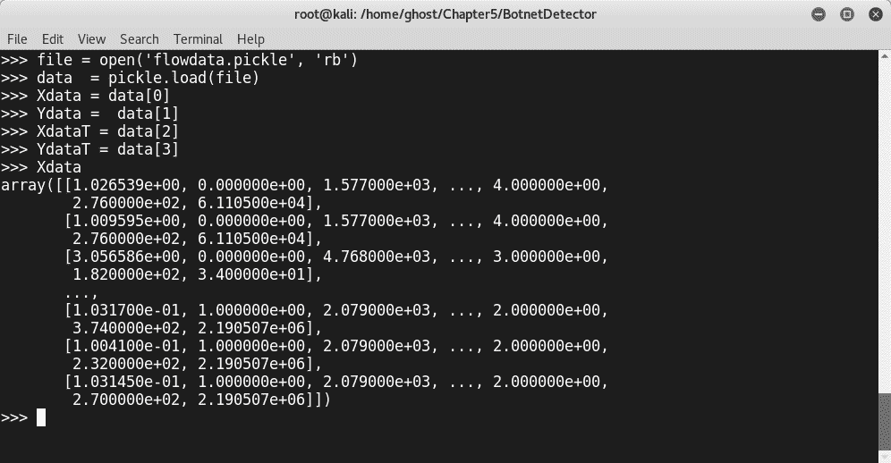

作为机器学习分类器，我们将尝试许多不同的算法，以便稍后我们可以为我们的模型选择最佳算法。导入所需的模块以使用来自`sklearn`的四种机器学习算法:

```
from sklearn.linear_model import *
from sklearn.tree import *
from sklearn.naive_bayes import *
from sklearn.neighbors import *
```

通过使用先前的模块构建来准备数据。不要忘记通过键入`import DataPreparation`来导入`DataPreparation`:

```
>>> DataPreparation.Prepare(Xdata,Ydata,XdataT,YdataT)
```

现在，我们可以训练模型；为此，我们将使用不同的技术来训练模型，以便稍后我们可以为我们的项目选择最合适的机器学习技术。步骤就像我们在之前的项目中学到的:准备好数据，选择好特征后，定义机器学习算法，拟合模型，定义好它的变量后打印出分数。

作为机器学习分类器，我们将测试其中的许多分类器。让我们从决策树开始:

*   **决策树模型**:

```
>>> clf = DecisionTreeClassifier()
>>> clf.fit(Xdata,Ydata)
>>> Prediction = clf.predict(XdataT)
>>> Score = clf.score(XdataT,YdataT)
>>> print (“The Score of the Decision Tree Classifier is”, Score * 100)
```

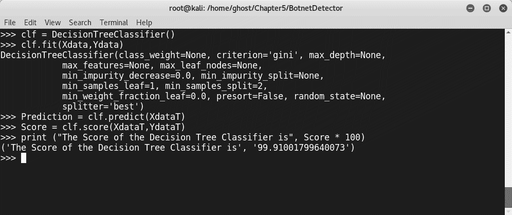

决策树分类器的得分是 99%

*   **逻辑回归模型**:

```
>>> clf = LogisticRegression(C=10000)
>>> clf.fit(Xdata,Ydata)
>>> Prediction = clf.predict(XdataT) >>> Score = clf.score(XdataT,YdataT)
```

```
>>> print ("The Score of the Logistic Regression Classifier is", Score * 100)
```

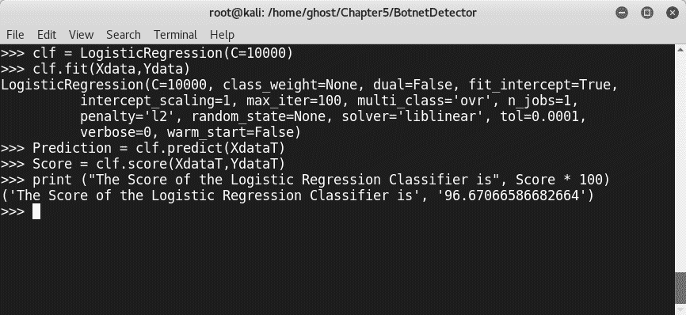

逻辑回归分类器的得分是 96%

*   **高斯朴素贝叶斯模型**:

```
>>> clf = GaussianNB()
>>> clf.fit(Xdata,Ydata)
>>> Prediction = clf.predict(XdataT)
>>> Score = clf.score(XdataT,YdataT)
>>> print("The Score of the Gaussian Naive Bayes classifier is", Score * 100)
```

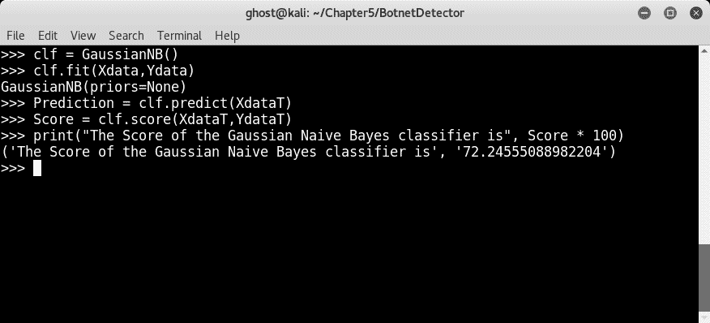

高斯朴素贝叶斯分类器的得分是 72%

*   **k-最近邻模型**:

```
>>> clf = KNeighborsClassifier()
>>> clf.fit(Xdata,Ydata)
>>> Prediction = clf.predict(XdataT)
>>> Score = clf.score(XdataT,YdataT)
>>> print("The Score of the K-Nearest Neighbours classifier is", Score * 100)
```

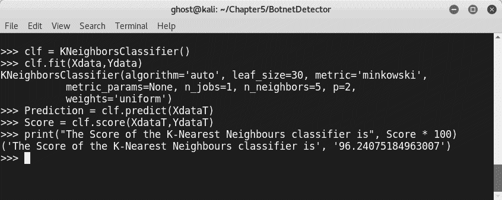

k-最近邻分类器的得分是 96%

*   **神经网络模型**:

若要建立神经网络模型，请使用以下代码:

```
>>> from keras.models import *
>>> from keras.layers import Dense, Activation
>>> from keras.optimizers import *

model = Sequential()
model.add(Dense(10, input_dim=9, activation="sigmoid")) model.add(Dense(10, activation='sigmoid'))
model.add(Dense(1))
sgd = SGD(lr=0.01, decay=0.000001, momentum=0.9, nesterov=True) 
model.compile(optimizer=sgd, loss='mse')
model.fit(Xdata, Ydata, nb_epoch=200, batch_size=100)
Score = model.evaluate(XdataT, YdataT, verbose=0)
Print(“The Score of the Neural Network is”, Score * 100  )
```

使用这段代码，我们导入了所需的 Keras 模块，构建了各个层，用 SGD 优化器编译了模型，拟合了模型，并打印出了模型的分数。

<title>How to build a Twitter bot detector</title> 

# 如何构建一个 Twitter 机器人检测器

在前面的章节中，我们看到了如何构建基于机器学习的僵尸网络检测器。在这个新项目中，我们将处理一个不同的问题，而不是防御僵尸网络恶意软件。我们将检测 Twitter 机器人，因为它们也很危险，可以执行恶意操作。对于模型，我们将使用*NYU·坦登 2017 年春季机器学习竞赛:Twitter Bot 分类*数据集。你可以从这个链接下载:[https://www.kaggle.com/c/twitter-bot-classification/data](https://www.kaggle.com/c/twitter-bot-classification/data)。导入所需的 Python 包:

```
>>> import pandas as pd
>>> import numpy as np
>>> import seaborn
```

让我们使用 pandas 加载数据，并突出显示机器人和非机器人数据:

```
>>> data = pd.read_csv('training_data_2_csv_UTF.csv')
>>> Bots = data[data.bot==1]
>> NonBots = data[data.bot==0]
```

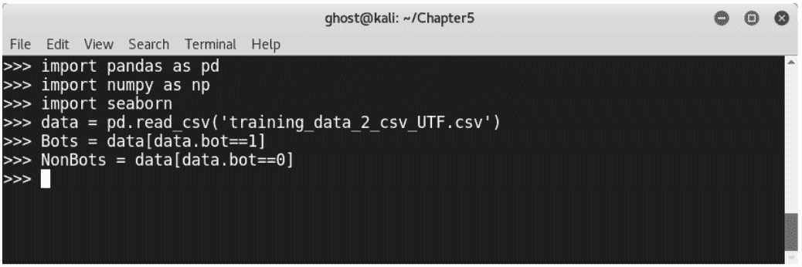<title>Visualization with seaborn</title> 

# seaborn 可视化

在每个项目中，我都想帮助您发现新的数据可视化 Python 库，因为正如您所见，数据工程和可视化对于每个以数据为中心的现代项目都是必不可少的。这一次，我选择了 seaborn 来可视化数据，并在开始训练阶段之前进行探索。Seaborn 是一个用于制作统计可视化的 Python 库。以下是使用 seaborn 生成图的示例:

```
>>> data = np.random.multivariate_normal([0, 0], [[5, 2], [2, 2]], size=2000)
>>> data = pd.DataFrame(data, columns=['x', 'y'])
>>> for col in 'xy':
... seaborn.kdeplot(data[col], shade=True)
```

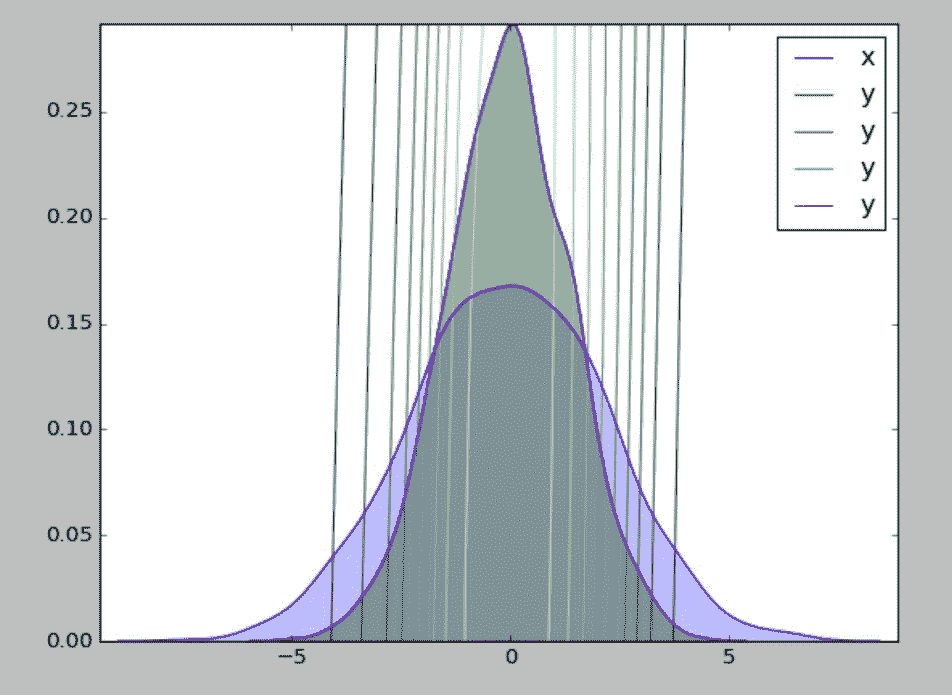

例如，在我们的例子中，如果我们想要识别丢失的数据:

```
matplotlib.pyplot.figure(figsize=(10,6))
 seaborn.heatmap(data.isnull(), yticklabels=False, cbar=False, cmap='viridis')
 matplotlib.pyplot.tight_layout()
```

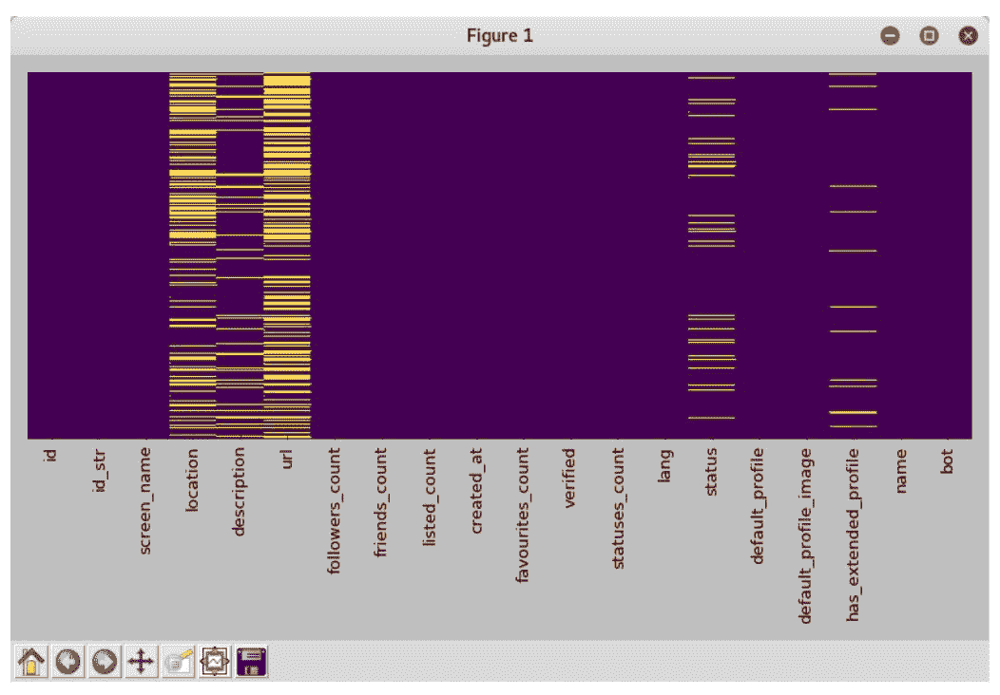

前面的两个代码片段是学习如何可视化数据的一些例子。可视化有助于数据科学家探索和了解更多数据。现在，让我们回去继续构建我们的模型。

通过选择 Twitter 机器人使用的一些不良单词来识别单词包。下面是一个机器人使用脏话的例子。当然，你可以添加更多的单词:

```
bag_of_words_bot = r'bot|b0t|cannabis|tweet me|mishear|follow me|updates every|gorilla|yes_ofc|forget' \
r'expos|kill|bbb|truthe|fake|anony|free|virus|funky|RNA|jargon' \                 r'nerd|swag|jack|chick|prison|paper|pokem|xx|freak|ffd|dunia|clone|genie|bbb' \                r'ffd|onlyman|emoji|joke|troll|droop|free|every|wow|cheese|yeah|bio|magic|wizard|face'
```

*   现在，是时候确定培训功能了:

```
data['screen_name_binary'] = data.screen_name.str.contains(bag_of_words_bot, case=False, na=False)
data['name_binary'] = data.name.str.contains(bag_of_words_bot, case=False, na=False)
data['description_binary'] = data.description.str.contains(bag_of_words_bot, case=False, na=False)
data['status_binary'] = data.status.str.contains(bag_of_words_bot, case=False, na=False)
```

*   特征提取:让我们选择`features`用于我们的模型:

```
data['listed_count_binary'] = (data.listed_count>20000)==False
 features = ['screen_name_binary', 'name_binary', 'description_binary', 'status_binary', 'verified', 'followers_count', 'friends_count', 'statuses_count', 'listed_count_binary', 'bot']
```

*   现在，用决策树分类器训练模型:

```
from sklearn.tree import DecisionTreeClassifier
from sklearn.metrics import accuracy_score, roc_curve, auc
from sklearn.model_selection import train_test_split
```

*   我们导入了一些之前讨论过的模块:

```
 X = data[features].iloc[:,:-1]
 y = data[features].iloc[:,-1]
```

*   我们定义分类器:

```
clf = DecisionTreeClassifier(criterion='entropy', min_samples_leaf=50, min_samples_split=10)
```

*   我们拆分分类器:

```
X_train, X_test, y_train, y_test = train_test_split(X, y, test_size=0.3, random_state=101)
```

*   我们符合这个模型:

```
clf.fit(X_train, y_train)
y_pred_train = clf.predict(X_train)
y_pred_test = clf.predict(X_test)
```

*   我们打印出准确度分数:

```
print("Training Accuracy: %.5f" %accuracy_score(y_train, y_pred_train))
print("Test Accuracy: %.5f" %accuracy_score(y_test, y_pred_test))
```

我们的模型以 88%的检测率检测 Twitter 机器人，这是一个很好的准确率。

这种技术并不是检测僵尸网络的唯一可能的方法。研究人员基于不同的机器学习算法提出了许多其他模型，如线性 SVM 和决策树。所有这些技术都有 90%的准确率。大多数研究表明，特征工程是改进机器学习模型的关键因素。

为了研究一个真实世界的案例，请查看一篇名为*我们从学习中学到了什么——理解机器学习在僵尸网络攻击中的能力和局限性*([https://arxiv.org/pdf/1805.01333.pdf](https://arxiv.org/pdf/1805.01333.pdf))的论文，该论文由大卫·桑塔纳、尚·苏塔哈兰和索米亚·莫汉蒂主持。

<title>Summary</title> 

# 摘要

本章是学习僵尸网络基础知识以及如何使用不同技术构建基于机器学习的检测器的轻量级指南。此外，我们还讨论了如何识别 Twitter 机器人。下一章将深入异常，以及如何构建许多项目来使用新颖的方法识别异常。

<title>Questions</title> 

# 问题

正如我们在每一章之后所做的那样，我们将会给你机会来练习你所学的知识和评估你的技能。本章的 GitHub 存储库包含一个链接，指向`Practice`文件夹中的僵尸网络流量数据集:

1.  下载数据集并用 pandas 库加载它
2.  选择合适的功能
3.  识别训练集和测试集，然后将它们导出到 pickle 文件中
4.  加载 pickle 文件
5.  导入支持向量机分类器并拟合模型
6.  训练 SVM 模型
7.  打印出所建模型的精确度

<title>Further reading</title> 

# 进一步阅读

要了解更多关于僵尸网络以及如何使用机器学习来检测它们的信息，我强烈建议您查看这些有用的外部链接:

*   **僵尸网络如何扩张，如何防范:**[https://bit ninja . io/blog/2016/01/11/How-botnets-expand-How-protect-against-them](https://bitninja.io/blog/2016/01/11/how-botnets-expand-and-how-protect-against-them)
*   **僵尸网络基础——不要变成僵尸！**:【https://blog.trendmicro.com/botnet-basics/】T2
*   用于僵尸检测的深度神经网络:[https://arxiv.org/abs/1802.04289](https://arxiv.org/abs/1802.04289)
*   **使用深度自动编码器对物联网僵尸网络攻击(N-BaIoT)进行基于网络的检测**:[https://arxiv.org/abs/1805.03409](https://arxiv.org/abs/1805.03409)

*   **一种用于传感器网络入侵检测的混合谱聚类和深度神经网络集成算法**([http://www . covert . io/research-papers/Deep-learning-security/A % 20 Hybrid % 20 Spectral % 20 Clustering % 20 and % 20 Deep % 20 Neural % 20 Network % 20 Ensemble % 20 Algorithm % 20 for % 20 Intrusion % 20 Detection % 20 in % 20 Sensor % 20 Networks . pdf](http://www.covert.io/research-papers/deep-learning-security/A%20Hybrid%20Spectral%20Clustering%20and%20Deep%20Neural%20Network%20Ensemble%20Algorithm%20for%20Intrusion%20Detection%20in%20Sensor%20Networks.pdf)
*   **针对僵尸网络检测行为的递归神经网络分析**([http://www . covert . io/research-papers/deep-learning-security/An % 20 Analysis % 20 of % 20 Recurrent % 20 Neural % 20 Networks % 20 for % 20 Botnet % 20 Detection % 20 Behavior . pdf](http://www.covert.io/research-papers/deep-learning-security/An%20Analysis%20of%20Recurrent%20Neural%20Networks%20for%20Botnet%20Detection%20Behavior.pdf)