<title>Machine Learning in Anomaly Detection Systems</title> 

# 异常检测系统中的机器学习

网络上未经授权的活动对任何企业来说都是一场噩梦。保护客户的数据是最关心的问题，也是每个企业所有者的责任。部署入侵检测系统是现代组织防御恶意入侵的明智决策。不幸的是，攻击者和黑帽黑客总是在发明绕过保护的新技术，以便获得对网络的未授权访问。这就是为什么机器学习技术是保护网络免受复杂攻击的良好解决方案。

本章将是发现网络异常和学习如何使用公开可用的数据集和尖端的开源 Python 数据科学库从头构建入侵检测系统的一站式指南。

在本章中，我们将介绍以下内容:

*   异常检测技术综述
*   网络攻击
*   检测网络异常
*   **基于主机的入侵检测系统** ( **HIDS**
*   **基于网络的入侵检测系统** ( **NIDS** )

<title>Technical requirements</title> 

# 技术要求

本章需要满足以下要求:

*   本章要求具备网络工作知识。
*   我们将使用我们在前面章节中看到的相同的 Python 库，并添加一个新的库，名为 **Yellowbrick** 。(您可以在本章中找到安装说明。)
*   你可以在[https://GitHub . com/packt publishing/Mastering-Machine-Learning-for-Penetration-Testing/tree/master/chapter 06](https://github.com/PacktPublishing/Mastering-Machine-Learning-for-Penetration-Testing/tree/master/Chapter06)的 GitHub 资源库中找到本章使用的代码文件。

<title>An overview of anomaly detection techniques</title> 

# 异常检测技术综述

我们现在将讨论网络异常(这是我们主要关心的)及其检测方法。根据定义，异常是超出正常范围的东西，是数据中一种意想不到的模式。术语异常在数据挖掘中广泛使用，有时也称为异常值。异常检测技术通常用于欺诈检测和发现恶意活动。在网络中，出现异常的原因有很多，但在这种情况下，对我们来说重要的是恶意活动检测。通常，我们会看到三种异常情况:

*   **点异常**:与其余数据相比，个别数据实例异常。
*   **上下文异常**:仅在特定上下文(时间段、区域等)中出现的异常行为。
*   **集体异常**:与其余数据相比，异常活动的集合。

基于可用的数据，可以使用许多技术来检测这些异常。

<title>Static rules technique</title> 

# 静态规则技术

如果我们有训练数据，那么我们需要检查数据是否平衡。如果我们没有训练数据，将基于异常类型做出决定；要检测点异常，建议您使用百分位数和直方图。为了检测集体异常，决策将基于异常的方差；要检测单变量异常，可以使用马尔可夫链，也可以建立模型，看残差。在多变量情况下，我们可以使用聚类和马尔可夫模型(如果异常是有序的)或 k-最近邻(如果异常是无序的)。

下图显示了不同的技术:

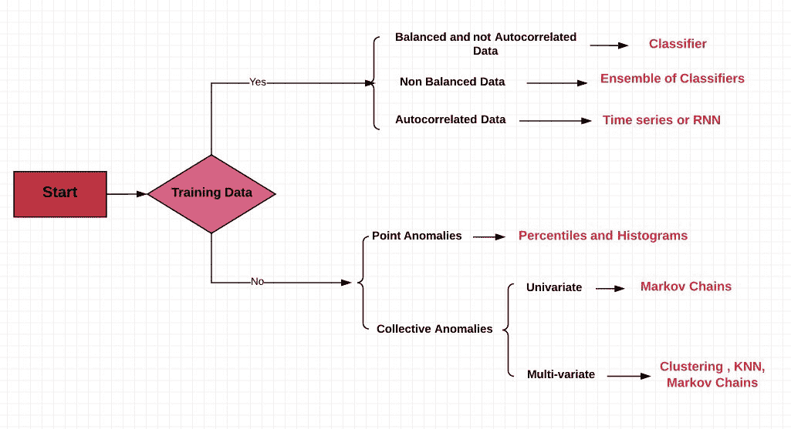<title>Network attacks taxonomy</title> 

# 网络攻击分类法

当涉及到网络异常时，我们的工作是保护组织的网络免受入侵。网络入侵是威胁网络安全的恶意活动。为了更好地进行研究，信息安全专家提出了许多分类方法来对网络攻击进行分类。例如，他们将网络攻击分为以下几类:

*   感染(恶意软件)
*   爆炸(缓冲区溢出)
*   探测(嗅探)
*   作弊(欺骗)
*   遍历(强力)
*   并发性(DDoS)

攻击也可以分为被动攻击和主动攻击。主动攻击是指攻击者对网络产生直接影响。国防高级研究计划局在其入侵检测评估计划中将主动攻击分为四大类。这四个类别如下:

*   **拒绝服务(DoS)** : DoS 攻击是指试图中断授权用户对网络的访问。换句话说，他们阻止用户访问在线服务，如电子邮件。
*   **用户对 Root (U2R)攻击** : U2R 攻击难以检测；他们试图获得高级(超级用户)权限。这是通过以普通用户身份访问系统，然后试图利用系统的弱点来提升权限来实现的。
*   **远程到本地(R2L)**:R2L 攻击是试图与远程机器交互以获得访问权限。使用的一种技术是密码猜测。
*   **探测**:探测是试图获取网络中主机的信息，包括有效的 IP 地址、运行的服务和开放的端口。通常通过扫描来完成。如您所知，收集的信息稍后将用于识别漏洞，以便加以利用。

<title>The detection of network anomalies</title> 

# 网络异常的检测

网络**入侵检测系统** ( **IDSs** )并不是一个新概念。它们从最早的网络攻击开始就被提出了。根据部署情况，IDS 可以分为两大类:HIDS 和 NIDS。下图说明了 IDS 体系结构的高级概述:

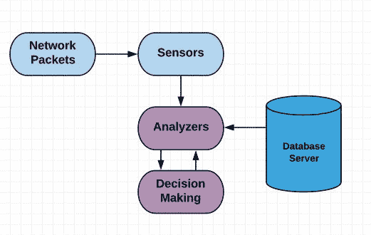<title>HIDS</title> 

# HIDS

HIDS 能够收集和监控计算机系统(尤其是其内部)，以便让安全分析师深入了解工作站、服务器和移动设备等关键系统上发生的情况。HIDS 的主要目标是检测入侵。

<title>NIDS</title> 

# NIDS

NIDS 负责检测网络数据中的入侵。基本上，检测是基于顺序数据中的特定模式进行的。换句话说，NIDSs 读取所有传入的数据包，并试图从中发现异常。

<title>Anomaly-based IDS</title> 

# 基于异常的入侵检测系统

说到 IDS，我们一般说的是两类:基于主机的和基于网络的。但是一种新的 IDS 也出现了。新的类别是基于异常的。这些系统通过使用机器学习技术来识别数据中的入侵和异常。在前面的章节中，特别是在第 1 章、*笔测试中的机器学习介绍*中，我们看了机器学习的不同模型:监督、非监督、半监督和强化学习。根据用于检测网络入侵的机器学习模型，基于异常的入侵检测系统也可分为监督系统和非监督系统。经过多年的研究，信息安全社区已经成功地提供了 IDS 中使用的不同方法的分类。其中一个名为*浅层和深层网络入侵检测系统:分类和调查*的提案由 Elike Hodo、Xavier J. A. Bellekens、Andrew Hamilton、克里斯特斯·塔塔齐斯和罗伯特·阿特金森提交，详细概述了许多用于可靠入侵检测的机器学习技术。下图展示了一些技术:

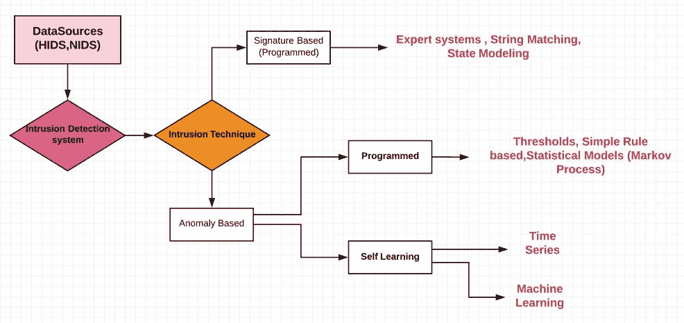

正如你所看到的，我们在前几章讨论了许多建议的技术。通常，在监督异常检测中，输入数据和异常类别是已知的。换句话说，所有的数据都被标记；即使收集标记的数据也是一项既费时又费力的任务。捕获的数据将在发送到检测引擎之前进行处理。无监督的异常检测系统可以是新的解决方案，即使数据没有被标记，它们也可以工作。

聚类是无监督系统中最常用的技术之一。这两个不同的系统可以合并成一个混合入侵检测系统。这里显示了一个完整的混合异常入侵检测系统:

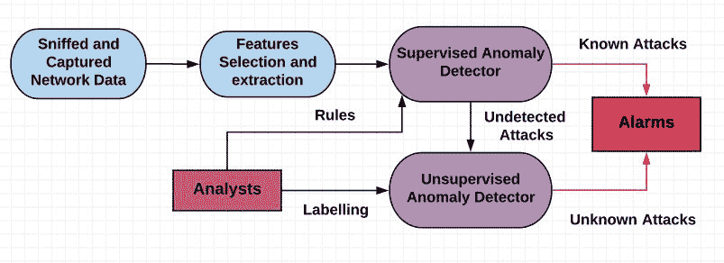

如果要构建一个成功可靠的基于异常的网络入侵检测系统，需要考虑很多重要因素。这些因素之一是邻近性度量；根据定义，邻近意味着对象相似性或不相似性的度量。因此，如前所述，这些系统试图将数据分类或聚类成组，从而分别测量对象彼此的接近度。相似性度量取值在`0`和`1`之间，其中`1`是最大的相似性值。欧几里德距离和曼哈顿距离是一些常见的邻近性度量。合适的度量标准的选择取决于数据的类型(数值型或分类型)。异常不是任意检测的，而是基于一个评分系统。子样本由称为**异常分数**的入侵分数来标记。这个评分系统对信息安全分析师非常有利；根据异常的有序和分级列表，他们可以根据严重性选择一个阈值。以下是异常网络入侵检测系统使用的一些常见异常评分技术:

*   **基于距离的异常分值估计**:
    *   **进化数据集中基于链接的离群点和异常检测**:数据集包含连续属性和分类属性。它使用相似性度量来测量两点之间的链接强度和关联程度。
    *   **减少内存负载**:这将异常定义为一个数据点，该数据点的子集属性具有不寻常的值。

*   **基于密度的异常分值估计**:
    *   **混合属性数据集的异常值检测**:通过计算值的不规则性和不同类型属性之间的关系来检测异常。

<title>Building your own IDS</title> 

# 构建您自己的 id

至此，您已经了解了不同的网络异常检测技术。我们现在打算用 Python 从头开始构建我们自己的网络 id。加州大学举办了一场名为*第三届国际知识发现和数据挖掘工具大赛*的比赛，他们提供了一个名为 **KDD 杯 1999 年数据、**或 **KDD 1990 年**的数据集。你可以在 http://kdd.ics.uci.edu/databases/kddcup99/kddcup99.html 的 T21 找到它。

竞赛的主要目的是建立一个能够区分不良(攻击)和良好(正常)连接的系统。许多现代建议和机器学习解决方案都是使用数据集制定的。但是你可以看到，数据集是旧的；这些模型无法检测现代网络攻击，以及数据冗余等其他问题。由 Mahbod Tavallaee、Ebrahim Bagheri、芦伟和 Ali A. Ghorbani 完成的一项名为*对 KDD 杯 99 数据集的详细分析的伟大研究突出了 KDD99 数据集中的许多问题。一个新的数据集应运而生来解决这些问题，它被命名为 NSL-KDD([http://www.unb.ca/cic/datasets/nsl.html](http://www.unb.ca/cic/datasets/nsl.html))。即使这样也没有解决所有的问题，但是还是做了很多改进。这些改进将数据减少了约 75%。*

这些是一些额外的公开可用的数据集，可以帮助您构建自己的入侵检测系统:

*   **科堡入侵检测数据集**(**CIDDS**):[https://www.hs-coburg.de/index.php?id=927](https://www.hs-coburg.de/index.php?id=927)
*   **https://nesg.ugr.es/nesg-ugr16/index.php#CAL基于循环平稳的网络 IDSs 评估新数据集 UGR【16】**
*   **入侵检测评估数据集(cicids 2017)**:[http://www.unb.ca/cic/datasets/ids-2017.html](http://www.unb.ca/cic/datasets/ids-2017.html)

对于我们的模型，我们将使用 **NSL_KDD** 作为训练和测试的数据集。要获得它，只需从 GitHub 克隆它，或者直接使用它，因为我们在本书的 GitHub 资源库中提供了本书中讨论的所有数据集。您可以在`Chapter 06`文件夹中找到它:

```
# git clone https://github.com/defcom17/NSL_KDD
```

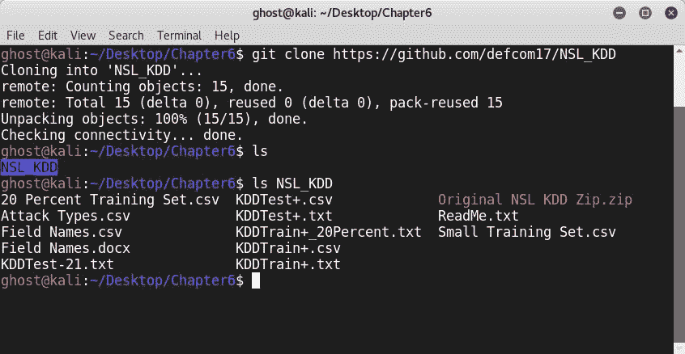

数据集包含不同的文件:

*   `KDDTrain+.arff`:完整的 NSL-KDD 训练集，带有 ARFF 格式的二进制标签。
*   `KDDTrain+.txt`:完整的 NSL-KDD 训练集，包括 CSV 格式的攻击类型标签和难度等级。
*   `KDDTrain+_20Percent.ARFF`:`KDDTrain+.arff`文件的 20%子集。
*   `KDDTrain+_20Percent.TXT`:`KDDTrain+.txt`文件的 20%子集。
*   完整的 NSL-KDD 测试集，带有 ARFF 格式的二进制标签。
*   `KDDTest+.TXT`:完整的 NSL-KDD 测试集，包括 CSV 格式的攻击类型标签和难度等级。
*   `KDDTest-21.ARFF`:`KDDTest+.arff`文件的子集，不包括记录，难度等级为 21/21。
*   `KDDTest-21.TXT`:不包括记录的`KDDTest+.txt`文件的子集，难度等级为 21/21。

如果您打开`Field Names.csv`，您将看到所有 40 个字段:

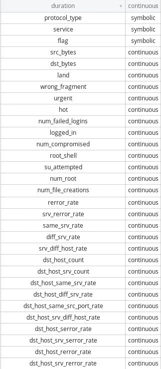

为了导入这个数据集，我们将使用`pandas`:

```
>>> import pandas as pd
>>> Data = pd.read_csv("KDDTrain+.csv", header=None)
```

如果我们用`Data.columns`检查列，我们会看到列或字段用数字表示:

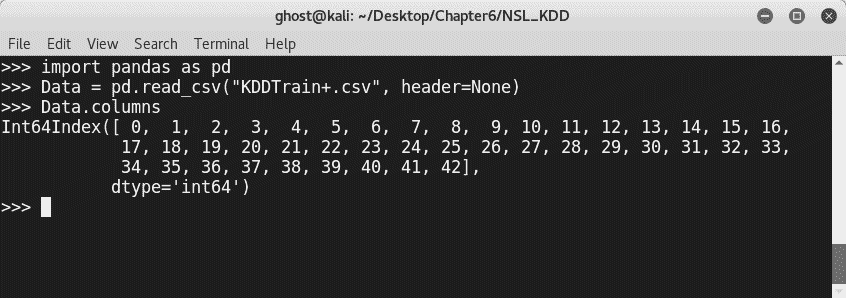

为了使我们的特征分析更容易，让我们将一个字段名称分配给一个数字，以便更好地表示特征。为此，我们将创建一个名为`Columns`的数组，用字段名填充，并用它加载数据集:

```
Columns = ["duration","protocol_type","service","flag","src_bytes",
 "dst_bytes","land","wrong_fragment","urgent","hot","num_failed_logins",
 "logged_in","num_compromised","root_shell","su_attempted","num_root",
 "num_file_creations","num_shells","num_access_files","num_outbound_cmds",
 "is_host_login","is_guest_login","count","srv_count","serror_rate",
 "srv_serror_rate","rerror_rate","srv_rerror_rate","same_srv_rate",
 "diff_srv_rate","srv_diff_host_rate","dst_host_count","dst_host_srv_count",
 "dst_host_same_srv_rate","dst_host_diff_srv_rate","dst_host_same_src_port_rate",
 "dst_host_srv_diff_host_rate","dst_host_serror_rate","dst_host_srv_serror_rate",
 "dst_host_rerror_rate","dst_host_srv_rerror_rate","label","difficulty"]
```

加载数据:

```
Data = pd.read_csv("KDDTrain+.csv", header=None, names = Columns)
Data.columns
```

这些是功能名称:

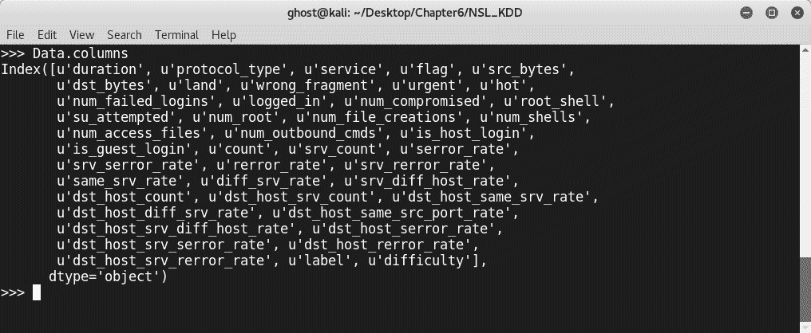

为了更好地理解数据集，我们可以使用`pandas.DataFrame.describe`:

```
Data.describe()
```

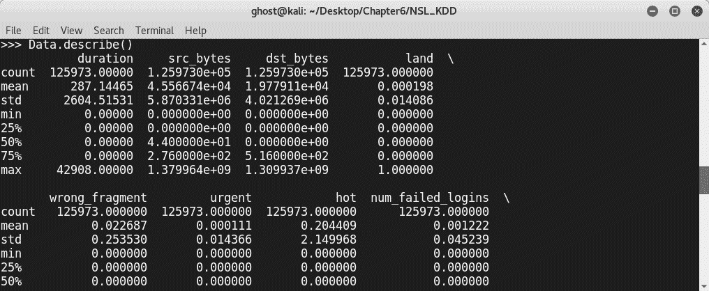

在训练模型之前，需要进行一些额外的处理。`sklearn.preprocessing.LabelEncoder`对值在`0`和`n_classes-1`和`fit_transform(y)`之间的标签进行编码。安装标签编码器并返回编码标签。在我们的例子中，我们将非数字标签转换成数字标签。同样，我们需要预处理四个标签:`protocol_type`、`service`、`flag`和`label`。

为此，我们使用`fit.transform()`，校准我们的测量值:

```
from sklearn import preprocessing 
Data.protocol_type = preprocessing.LabelEncoder().fit_transform(Data["protocol_type"])
 Data.service = preprocessing.LabelEncoder().fit_transform(Data["service"])
 Data.flag = preprocessing.LabelEncoder().fit_transform(Data["flag"])
 Data.label = preprocessing.LabelEncoder().fit_transform(Data["label"])
```

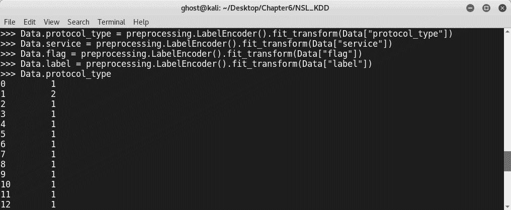

在 scikit-learn 中，有两种不同的方法:`fit`和`fit_transform`。这两种方法的区别在于，`fit`计算参数(μ和σ，其中μ是总体的平均值，σ是总体的标准差)并在内部保存它们，而`fit_transform`执行相同的任务，但也对特定的样本集应用变换。

让我们确定我们的数据。在接下来的几行中，我们使用了一个额外的 NumPy 方法，`as_matrix()`，将帧转换成它的 NumPy 数组表示。根据官方文档，在 NumPy-array 中，返回的不是 NumPy 矩阵，而是 NumPy 数组:

```
X = Data[Columns].as_matrix()
y = Data.label.as_matrix()
```

通常，在这一步之后，我们会进行模型训练；但这一次，我们将花更多的时间来分析和可视化我们的数据和功能。数据科学的任务之一是获得洞察力和知识，而可视化对于数据科学和机器学习来说是必不可少的。我的建议是尽可能多地使用数据，并尝试不同的技术。正如你已经注意到的，机器学习系统通常尊重相同的技术，作为数据科学家或机器学习专家，你的工作是从数据中选择正确的特征。机器学习算法是基于数学的，通常，你不打算改变算法本身；相反，您将希望执行一些良好的特征工程来构建一个可靠的、良好的模型，具有满足您的目标的高精度。

Yellowbrick 是一个很棒的可视化库和可视化诊断工具套件(可视化工具)。这个库依赖于 scikit-learn 和 Matplotlib。您可以使用`pip`进行安装:

```
pip install yellowbrick
```

这个库非常丰富，允许您可视化特征、分类、回归、聚类，甚至文本(例如，可视化语料库中术语的频率分布):

```
visualizer = Rank1D(features=Columns, algorithm='shapiro')
visualizer.fit(X, y) 
visualizer.transform(X) 
visualizer.poof()
```

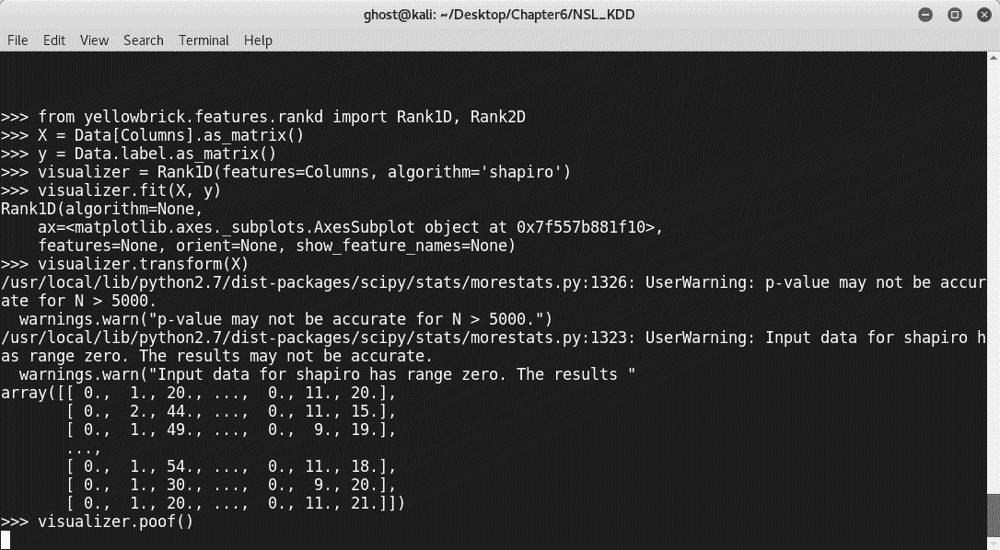

`visualizer.poof()`将显示如下图:

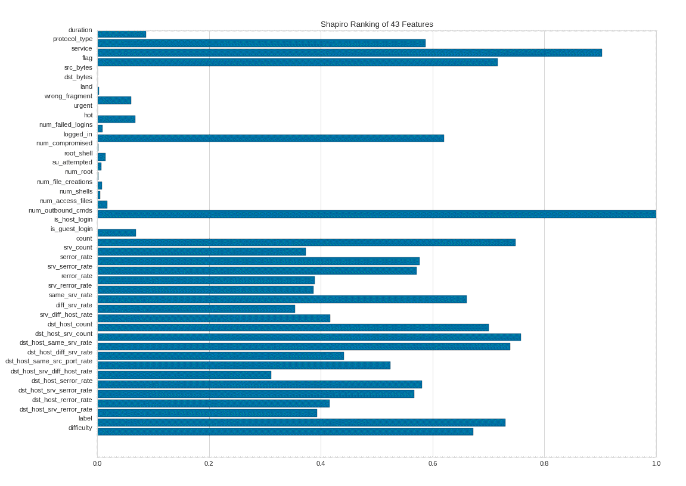

要保存这个情节，你可以添加`outpath`，如下所示:

```
visualizer.poof(outpath="Figure1.png") 
```

您甚至可以将其导出为 PDF 文件。您可能已经注意到，在第`visualizer = Rank1D(features=Columns, algorithm='shapiro')`行中，我们使用了一种叫做`Rank1D`的方法和一种叫做`shapiro`的算法，来对特性进行排序并检测它们之间的关系。`Rank1D`和`Rank2D`评估单个特征或成对特征。在我们的例子中，我们使用了一维的特征排序。

`Rank2D`是特征的二维排序。下面显示了如何实现它:

```
visualizer = Rank2D(features=Columns, algorithm='covariance')
```

您可以从`pearson`或`covariance`中选择:

```
visualizer.fit(X, y)
visualizer.transform(X)
visualizer.poof()
```

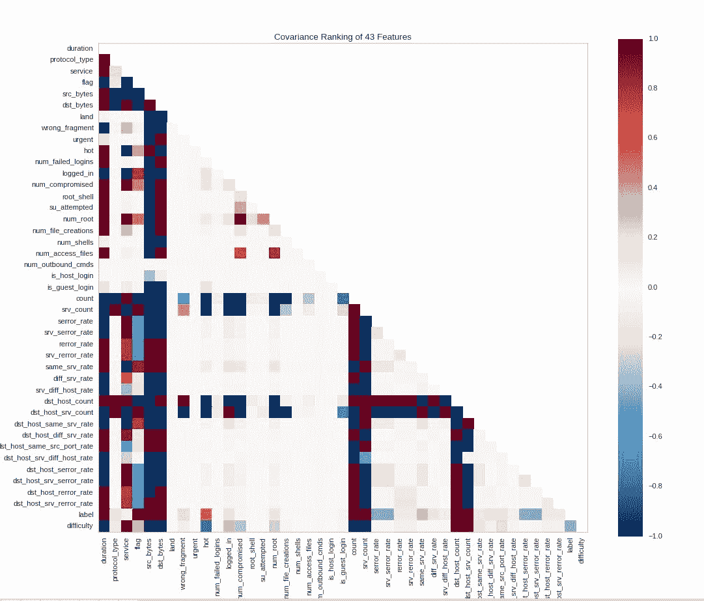

让我们回到我们使用的排名算法。`shapiro`参数是指夏皮罗-维尔克排名算法。您可以选择您的排名算法:

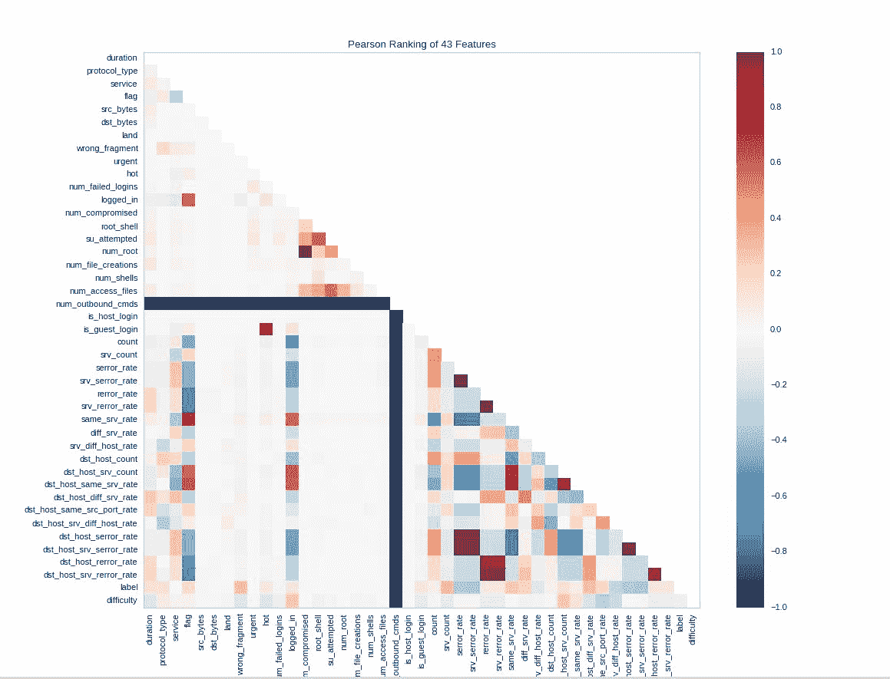

我们之前发现了**P**主成分分析 ( **PCA** )。Yellowbrick 使您能够将高维数据分解为二维或三维数据，并绘制它们:

```
visualizer = PCADecomposition(scale=True, center=False, col=y)
visualizer.fit_transform(X,y)
visualizer.poof()
```

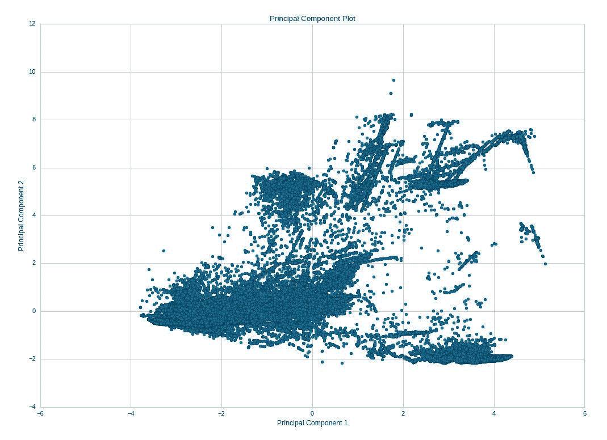

此外，绘图可以是 3D 的:

```
visualizer = PCADecomposition(scale=True, center=False, color=y, proj_dim=3)
 visualizer.fit_transform(X,y)
 visualizer.poof()
```

前面的代码显示在此图中:

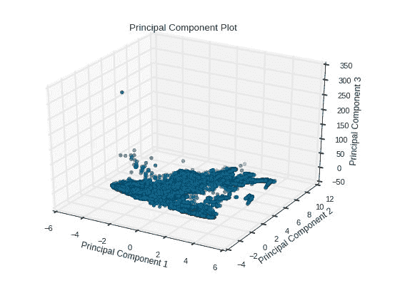

现在是时候训练我们的入侵检测机器学习模型了。像往常一样，我们分割数据，选择使用的分类器，拟合模型，并获得评分结果:

```
clf = RandomForestClassifier(max_depth=2, random_state=0)
clf.fit(X, y)
Score = clf.score(X_test,y_test)
print(Score*100)
```

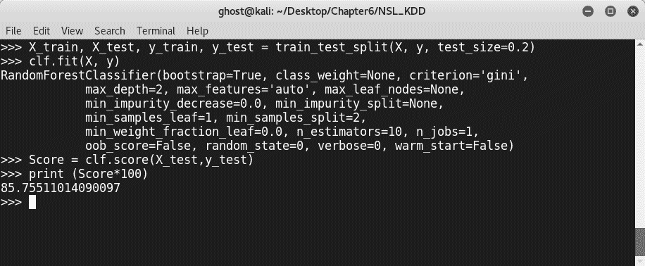

我们的入侵检测系统的得分是 85.7%。要了解更多的细节，您可以输出评估指标(TF、FP、TN、FN 和 Recall)，就像前面的模型一样。

<title>The Kale stack</title> 

# 甘蓝垛

监控是一项困难的任务，尤其是对于一个有数百名工程师的团队来说，可能会出现度量超载。要解决这个问题，除了基于时间序列的异常检测能力，还有很多项目可以利用。其中之一是羽衣甘蓝堆。由 Skyline 和 Oculus 两部分组成。Skyline 的作用是检测异常指标(一个异常检测系统)，而 Oculus 是异常关联组件。要下载这两个组件，可以查看以下存储库:

*   天际线:[http://github.com/etsy/skyline](http://github.com/etsy/skyline)
*   http://github.com/etsy/oculus[oculus](http://github.com/etsy/oculus)

您将需要以下内容:

*   至少 8 GB 内存
*   四核至强 5620 CPU 或同等产品
*   1 GB 磁盘空间

<title>Summary</title> 

# 摘要

在这一章中，我们探讨了网络异常检测技术的基础，以及它们背后的理论。您学习了如何使用 Python 构建基于机器学习的网络异常检测器。还有许多其他技术可以用来构建机器学习 IDS。下一章将通过指导您部署一个全功能的威胁搜索平台来增强您的技能，使用一个令人惊叹的称为 ELK stack 的开源项目堆栈。

<title>Questions</title> 

# 问题

1.  什么是异常？
2.  什么是马尔可夫链？
3.  什么是隐马尔可夫模型？
4.  如何用隐马尔可夫模型检测异常？
5.  时间序列异常检测和其他类型的异常检测有什么区别？
6.  时间序列异常检测和其他类型的异常检测有什么区别？
7.  有监督和无监督的机器学习异常检测有什么区别？

<title>Further reading</title> 

# 进一步阅读

*   **博文**:
    *   **异常检测篇**:[https://www.kdnuggets.com/tag/anomaly-detection](https://www.kdnuggets.com/tag/anomaly-detection)
    *   **devo PS 异常检测实用指南**:[https://www . big panda . io/blog/A-practical-guide-to-anomaly-detection/](https://www.bigpanda.io/blog/a-practical-guide-to-anomaly-detection/)
*   **论文**:
    *   **基于分布式复杂系统时空图建模的时序异常根本原因分析**:*[https://arxiv.org/abs/1805.12296](https://arxiv.org/abs/1805.12296)*
    **   **无监督异常检测的广义主动学习方法**:*[https://arxiv.org/abs/1805.09411](https://arxiv.org/abs/1805.09411)***   **走向解释异常:一类模型的深度泰勒分解**:*[https://arxiv.org/abs/1805.06230](https://arxiv.org/abs/1805.06230)***   **面向软件定义网络的高效基于异常的入侵检测**:*[https://arxiv.org/abs/1803.06762](https://arxiv.org/abs/1803.06762)****