# 九、绕过机器学习恶意软件检测器

在前一章中，您已经了解到，您可以通过使用对抗性的机器学习技术来侵入机器学习模型，并让它们执行恶意活动。在这一章中，我们将探索进一步的技术，比如如何欺骗人工神经网络和深度学习网络。我们将反恶意软件系统绕过作为一个案例来研究。

在本章中，我们将介绍以下内容:

*   对抗性深度学习
*   如何通过生成式对抗网络绕过下一代恶意软件检测器
*   用强化学习绕过机器学习


# 技术要求

你可以在[https://github . com/packt publishing/Mastering-Machine-Learning-for-Penetration-Testing/tree/master/chapter 09](https://github.com/PacktPublishing/Mastering-Machine-Learning-for-Penetration-Testing/tree/master/Chapter09)找到这一章的代码文件。


# 对抗性深度学习

信息安全专业人员正在尽最大努力想出新的技术来检测恶意软件和恶意软件。趋势技术之一是使用机器学习算法的能力来检测恶意软件。另一方面，攻击者和网络罪犯也在想方设法绕过下一代系统。在前一章中，我们看了如何攻击机器学习模型以及如何绕过入侵检测系统。

恶意软件开发人员使用许多技术来绕过机器学习恶意软件检测器。之前，我们探索了一种通过用灰度图像向量训练系统来构建恶意软件分类器的方法。在 UCSB 视觉研究实验室的**搜索和检索恶意软件** ( **SARVAM** )研究小组所做的演示中，研究人员举例说明，通过改变几个字节，一个模型就可以将恶意软件归类为好软件。攻击者可以通过改变几个字节和像素来绕过恶意软件分类器。在演示中，研究人员使用了 NETSTAT 程序的一个变种，这是一个命令行网络实用工具，可以显示网络连接。在下图中，左侧是一个代表`NETSTAT.EXE`的恶意软件，第二个被检测为一个好软件。如您所见，在将两种类型的文件转换为灰度图像并检查两者之间的差异后，两个程序之间的差异是不明显的(36，864 字节中的 88 字节:0.78%):

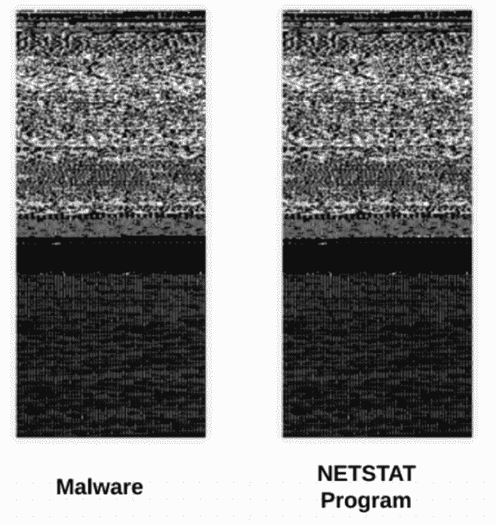

这项技术只是开始；在这一章中，我们将深入探讨如何欺骗他们(机器学习模型，在我们的例子中是恶意软件分类器)进行恶意活动。

前一章是对对抗性机器学习的概述。我们了解了机器学习如何被攻击者绕过。在这一章中，我们将更深入，发现如何绕过基于恶意软件机器学习的检测器；在此之前，我们要学习如何用 Python，开源库，开源项目来忽悠人工神经网络，避免深度学习网络。神经网络可以被**敌对样本**欺骗。对立样本被用作神经网络的输入，以影响学习结果。由伊恩·j·古德费勒、黄邦贤·施伦斯和克里斯蒂安·塞格迪(谷歌)进行的一项名为*解释和利用敌对网络的开创性研究项目*表明，少量精心构建的噪声可以欺骗神经网络，使其认为输入的图像是一只长臂猿而不是一只熊猫，置信度为 99.3%。神经网络原本认为提供的图像是熊猫，有 57.7%的置信度，这是真的；但在愚弄网络之后，第二个示例中的情况并非如此:

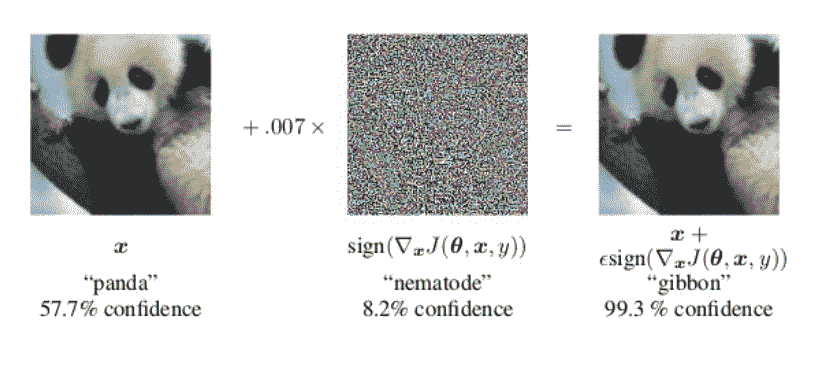

许多电子设备和系统依赖深度学习作为保护机制，包括人脸识别；想象一下攻击者可以做些什么来攻击他们并获得对关键系统的未授权访问。

现在，让我们试着愚弄一个神经网络。我们将使用著名的 MNIST 数据集来欺骗手写数字检测系统。在[第 4 章](part0081.html#2D7TI0-49a67f1d6e7843d3b2296f38e3fe05f5)、*深度学习恶意软件检测*中，我们学习了如何构建一个。为了演示，我们要愚弄一个由迈克尔·尼尔森设计的预先训练好的神经网络。他使用了 50，000 张训练图像和 10，000 张测试图像。或者，你可以简单地使用你自己的神经网络。你可以在本章的 GitHub 资源库中找到培训信息。文件名为`trained_network.pkl`；你还会找到 MNIST 档案(`mnist.pkl.gz`):

```
import network.network as network
import network.mnist_loader as mnist_loader
# To serialize data
import pickle
import matplotlib.pyplot as plt
import numpy as np
```

让我们检查一下模型是否训练有素。加载`pickle`文件。用`pickle.load()`加载数据，并识别训练、验证和测试数据:

```
Model = pickle.load( open( "trained_network.pkl", "rb" ) )    trainData, valData, testData =mnist_loader.load_data_wrapper()
```

例如，为了检查数字 2，我们将选择`test_data[1][0]`:

```
>>> data = test_data[1][0]
>>> activations = Model.feedforward(data)
>>> prediction = np.argmax(activations) 
```

下面的屏幕截图说明了前面的代码:

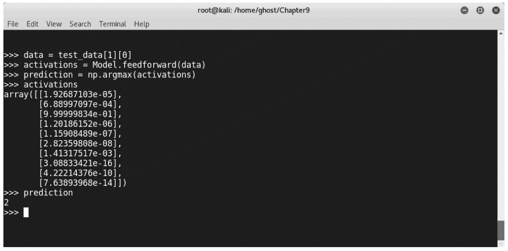

使用`matplotlib.pyplot (plt)`绘制结果以便进一步检查:

```
>>> plt.imshow(data.reshape((28,28)), cmap='Greys')
>>> plt.show()
```

如您所见，我们生成了数字 **2** ，因此模型训练良好:

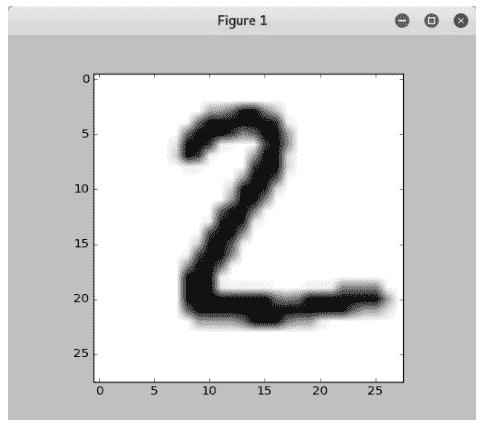

一切都设置正确。现在我们要用两种类型的攻击来攻击神经网络:**针对性**和**非针对性。**

对于非针对性攻击，我们要生成一个对抗性样本，让网络给出一定的输出，例如 *6* :


在这次攻击中，我们希望神经网络认为输入的图像是 *6* 。目标图像(姑且称之为 *X)* 是一个 *784* 维度的向量，因为图像维度是 *28×28* 像素。我们的目标是找到一个向量`*⃗x*`，使成本 *C，*最小化，从而产生神经网络预测为我们的目标标签的图像。成本函数*C*定义如下:


以下代码块是一个导数函数的实现:

```
def input_derivative(net, x, y):
    """ Calculate derivatives wrt the inputs"""
    nabla_b = [np.zeros(b.shape) for b in net.biases]
    nabla_w = [np.zeros(w.shape) for w in net.weights]

    # feedforward
    activation = x
    activations = [x] # list to store all the activations, layer by layer
    zs = [] # list to store all the z vectors, layer by layer
    for b, w in zip(net.biases, net.weights):
        z = np.dot(w, activation)+b
        zs.append(z)
        activation = sigmoid(z)
        activations.append(activation)

    # backward pass
    delta = net.cost_derivative(activations[-1], y) * \
        sigmoid_prime(zs[-1])
    nabla_b[-1] = delta
    nabla_w[-1] = np.dot(delta, activations[-2].transpose())

    for l in xrange(2, net.num_layers):
        z = zs[-l]
        sp = sigmoid_prime(z)
        delta = np.dot(net.weights[-l+1].transpose(), delta) * sp
        nabla_b[-l] = delta
        nabla_w[-l] = np.dot(delta, activations[-l-1].transpose())
    return net.weights[0].T.dot(delta)
```

为了生成对抗性样本，我们需要设定目标:

```
goal = np.zeros((10, 1))
goal[n] = 1
```

为梯度下降初始化创建随机图像，如下所示:

```
x = np.random.normal(.5, .3, (784, 1))
```

计算梯度下降，如下所示:

```
for i in range(steps):
        # Calculate the derivative
        d = input_derivative(net,x,goal)       
        x -= eta * d       
    return x

```

现在，您可以生成示例:

```
a = adversarial(net, n, 1000, 1)
x = np.round(net.feedforward(a), 2)
Print ("The input is:", str(x))
Print ("The prediction is", str(np.argmax(x)))
```

绘制对立样本，如下所示:

```
plt.imshow(a.reshape(28,28), cmap='Greys')
plt.show()
```

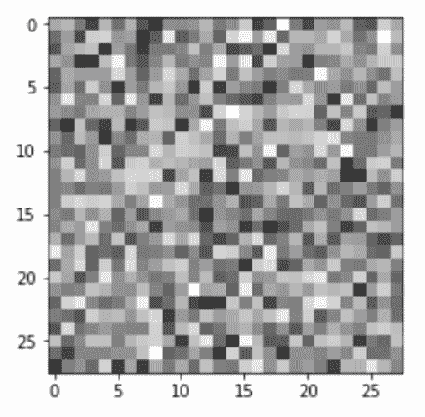

在目标攻击中，我们使用相同的技术和相同的代码，但是我们在代价函数中添加了一个新的项。因此，它将如下:

<title>Foolbox</title> 

# 傻瓜盒子

Foolbox 是一个 Python 工具箱，用于测试机器学习模型的健壮性。它受到许多框架的支持，包括:

*   张量流
*   PyTorch
*   Theano
*   克拉斯
*   千层面
*   MXNet

要安装 Foolbox，请使用`pip`实用程序:

```
pip install foolbox
```

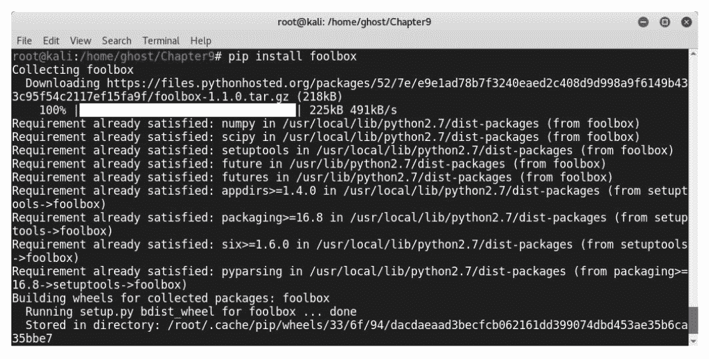

以下是一些愚蠢的攻击:

*   **基于梯度的攻击**:通过线性化输入周围的损耗， *x*
*   **梯度符号攻击(FGSM)** :通过计算梯度， *g(x0)* ，一次，然后求最小步长
*   **迭代梯度攻击**:通过沿梯度方向的小步长最大化损失， *g(x)*
*   **迭代梯度符号攻击**:通过最大化沿上升方向的小步长的损失，*符号(g(x))*
*   **DeepFool L2Attack** :通过计算，对于每个类，到达类边界所需的最小距离 *d(ℓ，ℓ0)*
*   **deep fool L∞攻击**:类似 L2 攻击，但是最小化了 *L∞范数*
*   **基于雅克比的显著性图攻击**:通过计算每个输入特征的显著性得分
*   **单像素攻击**:将单个像素设置为白色或黑色

要使用 Foolbox 实施攻击，请使用以下代码:

```
import foolbox
import keras
import numpy as np
from keras.applications.resnet50 import ResNet50

keras.backend.set_learning_phase(0)
kmodel = ResNet50(weights='imagenet')
preprocessing = (np.array([104, 116, 123]), 1)
fmodel = foolbox.models.KerasModel(kmodel, bounds=(0, 255), preprocessing=preprocessing)

image, label = foolbox.utils.imagenet_example()
attack = foolbox.attacks.FGSM(fmodel)
adversarial = attack(image[:, :, ::-1], label)
```

如果收到错误`ImportError('`load_weights` requires h5py.')`，通过安装 **h5py** 库(`pip install h5py`)来解决。

要绘制结果，请使用以下代码:

```
import matplotlib.pyplot as plt
plt.figure()
plt.subplot(1, 3, 1)
plt.title('Original')
plt.imshow(image / 255) 
plt.axis('off')
plt.subplot(1, 3, 2)
plt.title('Adversarial')
plt.imshow(adversarial[:, :, ::-1] / 255)  # ::-1 to convert BGR to RGB
plt.axis('off')
plt.subplot(1, 3, 3)
plt.title('Difference')
difference = adversarial[:, :, ::-1] - image
plt.imshow(difference / abs(difference).max() * 0.2 + 0.5)
plt.axis('off')
plt.show()
```

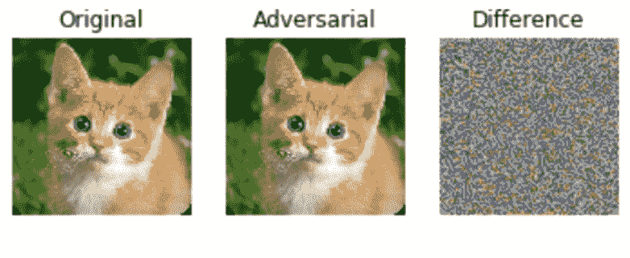<title>Deep-pwning</title> 

# 深冲

Deep-pwning 是一个轻量级框架，用于实验机器学习模型，目标是评估它们对有动机的对手的鲁棒性。它被称为机器学习的**元程序**。你可以从位于 https://github.com/cchio/deep-pwning 的 GitHub 仓库中克隆它。

不要忘记安装所有的要求:

```
pip install -r requirements.txt 
```

以下是使用深度挖掘所需的 Python 库:

*   张量流 0.8.0
*   Matplotlib >= 1.5.1
*   数字> = 1.11.1
*   熊猫> = 0.18.1
*   六> = 1.10.0


# EvadeML

EvadeML([https://evademl.org](https://evademl.org/))是一个基于遗传编程的进化框架，用于自动寻找逃避基于机器学习的恶意软件分类器检测的变体。它是由弗吉尼亚大学的机器学习小组和安全研究小组开发的。

要下载 EvadeML，从[https://github.com/uvasrg/EvadeML](https://github.com/uvasrg/EvadeML)克隆它。

要安装 EvadeML，您需要安装这些必需的工具:

*   用于解析 pdf 的 pdfrw 的修改版本:[https://github.com/mzweilin/pdfrw](https://github.com/mzweilin/pdfrw)
*   布谷鸟沙盒 v1.2，如神谕:[https://github.com/cuckoosandbox/cuckoo/releases/tag/1.2](https://github.com/cuckoosandbox/cuckoo/releases/tag/1.2)
*   目标分类器 PD frate-Mimi cus:[https://github.com/srndic/mimicus](https://github.com/srndic/mimicus)
*   目标分类器 Hidost:[https://github.com/srndic/hidost](https://github.com/srndic/hidost)

要配置项目，请复制模板，并使用编辑器对其进行配置:

```
cp project.conf.template project.conf
Vi  project.conf
```

在运行主程序`./gp.py`之前，运行带有预定义恶意软件签名的集中式检测代理，如文档中所示:

```
./utils/detection_agent_server.py ./utils/36vms_sigs.pickle
```

选择几个良性 PDF 文件:

```
./utils/generate_ext_genome.py [classifier_name] [benign_sample_folder] [file_number]
```

要添加新的分类器来绕过，只需在`./classifiers/`中添加一个包装器。


# 利用生成对抗网络绕过下一代恶意软件检测器

2014 年，Ian Goodfellow、Yoshua Bengio 和他们的团队提出了一个名为**生成对抗网络(GAN)** 的框架。生成敌对网络具有从随机噪声中生成图像的能力。例如，我们可以训练一个生成网络来从 MNIST 数据集中生成手写数字的图像。

生成对抗网络由两个主要部分组成:一个**生成器**和一个**鉴别器**。


# 发电机

生成器将潜在样本作为输入；它们是随机生成的数字，并被训练生成图像:


例如，为了生成一个手写数字，生成器将是一个完全连接的网络，它获取潜在样本并生成`784`数据点，将它们重塑为 *28x28* 像素图像(MNIST 数字)。强烈建议使用`tanh`作为激活功能:

```
generator = Sequential([
Dense(128, input_shape=(100,)),
LeakyReLU(alpha=0.01),
Dense(784),
Activation('tanh')
], name='generator')
```


# 鉴别器

鉴别器只是一个用监督学习技术训练的分类器，用来检查图像是真的(`1`)还是假的(`0`)。它由 MNIST 数据集和生成器样本训练。鉴别器将 MNIST 数据分类为真实的，而发生器样本分类为假的:

```
discriminator = Sequential([
Dense(128, input_shape=(784,)),
LeakyReLU(alpha=0.01),
Dense(1),
Activation('sigmoid')], name='discriminator')
```

通过连接两个网络，生成器和鉴别器，我们产生了一个生成对抗网络:

```
gan = Sequential([
generator,
discriminator])
```

这是一个生成对抗网络的高级表示:

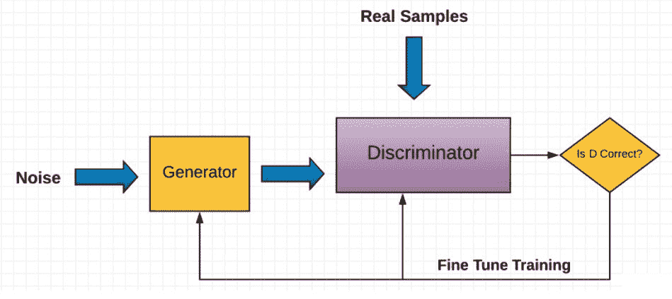

为了训练 GAN，我们需要训练发生器(在进一步的步骤中鉴别器被设置为不可训练的)；在训练中，反向传播更新生成器的权重以生成逼真的图像。因此，为了训练 GAN，我们使用以下步骤作为循环:

*   用真实图像训练鉴别器(鉴别器在这里是可训练的)
*   将鉴别器设置为不可训练
*   训练发电机

训练循环将会发生，直到两个网络都不能被进一步改进。

要使用 Python 构建 GAN，请使用以下代码:

```
import pickle as pkl
import numpy as np
import tensorflow as tf
import matplotlib.pyplot as plt
batch_size = 100
epochs = 100
samples = []
losses = []
saver = tf.train.Saver(var_list=g_vars)
with tf.Session() as sess:
    sess.run(tf.global_variables_initializer())
    for e in range(epochs):
        for ii in range(mnist.train.num_examples//batch_size):
            batch = mnist.train.next_batch(batch_size)

            batch_images = batch[0].reshape((batch_size, 784))
            batch_images = batch_images*2 - 1

            batch_z = np.random.uniform(-1, 1, size=(batch_size, z_size))

            _ = sess.run(d_train_opt, feed_dict={input_real: batch_images, input_z: batch_z})
            _ = sess.run(g_train_opt, feed_dict={input_z: batch_z})

        train_loss_d = sess.run(d_loss, {input_z: batch_z, input_real: batch_images})
        train_loss_g = g_loss.eval({input_z: batch_z})

        print("Epoch {}/{}...".format(e+1, epochs),
              "Discriminator Loss: {:.4f}...".format(train_loss_d),
              "Generator Loss: {:.4f}".format(train_loss_g))    

        losses.append((train_loss_d, train_loss_g))

        sample_z = np.random.uniform(-1, 1, size=(16, z_size))
        gen_samples = sess.run(
                       generator(input_z, input_size, n_units=g_hidden_size, reuse=True, alpha=alpha),
                       feed_dict={input_z: sample_z})
        samples.append(gen_samples)
        saver.save(sess, './checkpoints/generator.ckpt')
with open('train_samples.pkl', 'wb') as f:
    pkl.dump(samples, f)
```

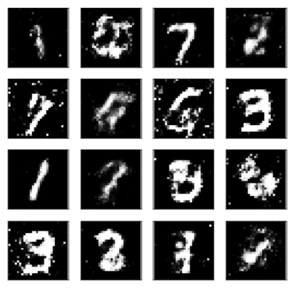

为了用 Python 构建一个 GAN，我们将使用 NumPy 和 TensorFlow。


# 马尔甘

为了生成恶意软件样本来攻击机器学习模型，攻击者现在使用 GANs 来实现他们的目标。使用我们之前讨论的相同技术(生成器和鉴别器)，网络犯罪分子对下一代反恶意软件系统进行攻击，甚至不知道所使用的机器学习技术(黑盒攻击)。其中一种技术是 MalGAN，它出现在由机器感知重点实验室(MOE)和机器智能部的胡玮炜和 Ying Tan 进行的名为*基于 GAN 为黑盒攻击生成对抗性恶意软件示例的研究项目中。MalGAN 的架构如下:*

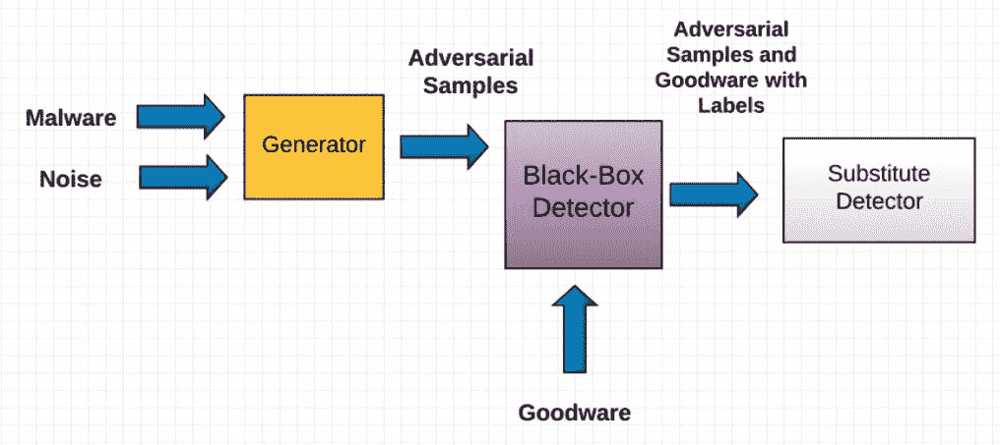

生成器通过将恶意软件(特征向量 *m* 和噪声向量 *z、*作为输入来创建敌对的恶意软件样本。替代检测器是一个多层前馈神经网络，它采用一个程序特征向量， *X，*作为输入。它将程序分为良性程序和恶意程序。

为了训练生成对抗网络，研究人员使用了这种算法:

```
While not converging do:
    Sample a minibatch of Malware M
    Generate adversarial samples M' from the generator
    Sample a minibatch of Goodware B
    Label M' and B using the detector
    Update the weight of the detector
    Update the generator weights
End while
```

生成的许多样本可能不是有效的 PE 文件。为了保留突变和格式，系统需要一个沙箱来确保功能得以保留。

生成对抗性网络训练不能简单地产生巨大的效果；这就是为什么许多黑客需要达到更好的效果。一些技巧被 Soumith Chintala、Emily Denton、Martin Arjovsky 和迈克尔·马修引入，以获得改进的结果:

*   归一化 *-1* 和 *1* 之间的图像
*   使用最大对数 *D，*作为损失函数，优化 *G* 而不是最小值(*对数 1-D*
*   从高斯分布取样，而不是均匀分布
*   为真货和假货构建不同的小批量
*   避免使用 ReLU 和 MaxPool，而是使用 LeakyReLU 和 Average Pooling
*   使用**深度卷积 GAN** ( **DCGAN** )，如果可能的话
*   使用`ADAM`优化器


# 用强化学习绕过机器学习

在前面的技术中，我们注意到，如果我们正在生成对立的样本，特别是如果结果是二进制的，我们将面临一些问题，包括生成无效的样本。信息安全研究人员提出了一种新技术，可以通过强化学习绕过机器学习反恶意软件系统。


# 强化学习

之前(尤其是在第一章)，我们探讨了不同的机器学习模型:监督、半监督、非监督和强化模型。强化机器学习模型是构建智能机器的重要途径。在强化学习中，代理通过与环境交互，从经验中学习；它根据状态和奖励函数选择最佳决策:

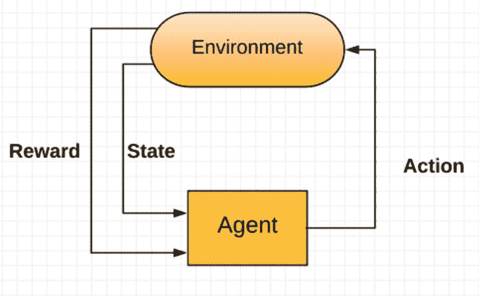

强化学习的一个著名例子是基于人工智能的雅达利突破。在这种情况下，环境包括以下内容:

*   球和砖块
*   移动桨(左或右)
*   消除砖块的奖励

下图高度概括了用于教授模型如何玩 Atari 突破的强化模型:

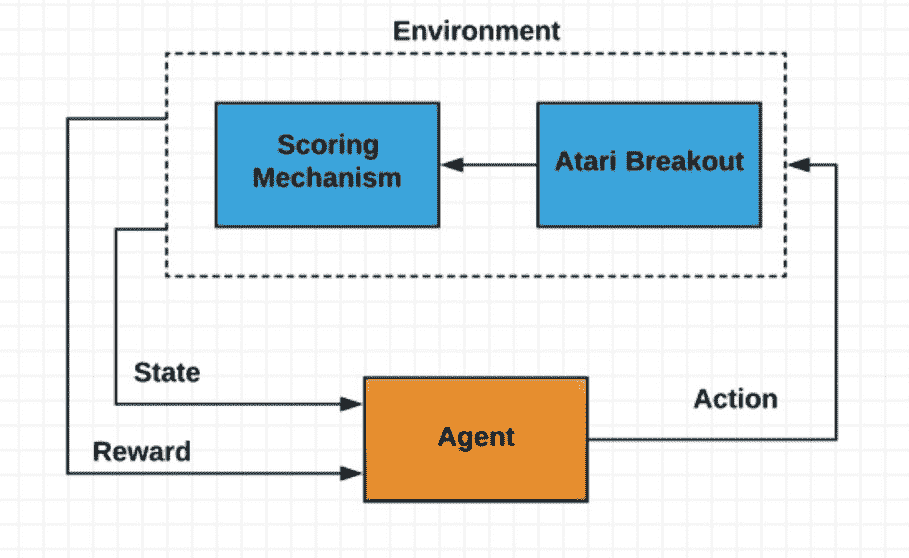

以 Atari Breakout 环境作为类比来学习如何避开反恶意软件系统，我们的环境将如下:

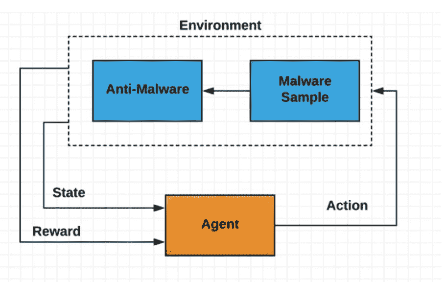

对于代理，它利用环境状态(一般文件信息、标题信息、导入和导出的函数、字符串等)来优化其性能，并从反病毒报告和结果操作(创建入口点和新部分、修改部分等)中获得回报输入。换句话说，执行和学习代理需要两个输入(状态和奖励)。

作为我们讨论的概念的实现，信息安全专业人员在 OpenAI 环境中工作，构建一个可以使用强化学习技术逃避检测的恶意软件。其中一个环境是**健身房恶意软件**。这个伟大的环境是由 endgame 开发的。

OpenAI gym 包含一个开源 Python 框架，由一家名为 open AI([https://openai.com/](https://openai.com/))的非营利人工智能研究公司开发，用于开发和评估强化学习算法。要安装 OpenAI Gym，请使用以下代码(您需要安装 Python 3.5 以上版本):

```
git clone https://github.com/openai/gym
cd gym
pip install -e
```

OpenAI Gym 加载了预先制作的环境。你可以在 http://gym.openai.com/envs/查看所有可用的环境:

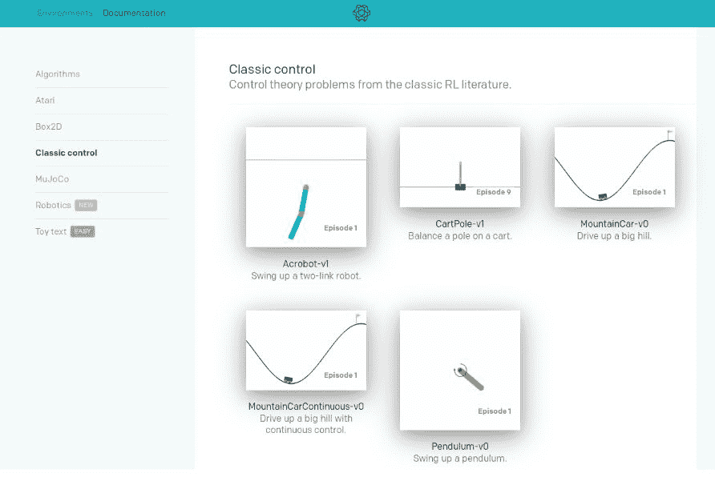

```
CartPole-v0 environment:
```

```
import gym
 env = gym.make('CartPole-v0')
 env.reset()
 for _ in range(1000): # run for 1000 steps
    env.render()
    action = env.action_space.sampe() # pick a random action
    env.step(action) # take action
```

要使用 Gym-malware 环境，您需要安装 Python 3.6 和一个名为 Instrument Executable Formats 的库，名为`LIEF`。您可以通过键入以下内容来添加它:

```
pip install https://github.com/lief-project/LIEF/releases/download/0.7.0/linux_lief-0.7.0_py3.6.tar.gz
```

从 https://github.com/endgameinc/gym-malware 下载恶意软件。[将已安装的健身房恶意软件环境移至`gym_malware/gym_malware/envs/utils/samples/`。](https://github.com/endgameinc/gym-malware)

要检查样本是否在正确的目录中，请键入以下内容:

```
python test_agent_chainer.py
```

此环境中可用的操作如下:

*   `append_zero`
*   `append_random_ascii`
*   `append_random_bytes`
*   `remove_signature`
*   `upx_pack`
*   `upx_unpack`
*   `change_section_names_from_list`
*   `change_section_names_to random`
*   `modify_export`
*   `remove_debug`
*   `break_optional_header_checksum`


# 摘要

在这一章中，我们继续了学习如何绕过机器学习模型的旅程。在前一章，我们发现了对抗性机器学习；在这一延续中，我们探索了对抗性深度学习以及如何欺骗深度学习网络。我们查看了一些真实世界的案例，以了解如何通过使用最先进的技术逃离反恶意软件系统。在下一章也是最后一章，我们将获得更多的知识，学习如何构建健壮的模型。


# 问题

1.  生成对抗网络的组成部分是什么？
2.  生成器和鉴别器有什么区别？
3.  我们如何确保恶意软件对抗样本在生成时仍然有效？
4.  做一点研究，然后简要解释如何检测敌对样本。
5.  强化学习和深度学习有什么区别？
6.  监督学习和强化学习有什么区别？
7.  一个 agent 如何在强化学习中学习？


# 进一步阅读

以下资源包含大量信息:

*   *解释和治理敌对样本*:【https://arxiv.org/pdf/1412.6572.pdf 
*   【https://arxiv.org/pdf/1611.02770.pdf】钻研可转移的对抗性例子和黑盒攻击:[](https://arxiv.org/pdf/1611.02770.pdf)
*   *fool box——一个测试机器学习模型健壮性的 Python 工具箱*:[https://arxiv.org/pdf/1707.04131.pdf](https://arxiv.org/pdf/1707.04131.pdf)
*   *傻瓜盒子*GitHub:[https://github.com/bethgelab/foolbox](https://github.com/bethgelab/foolbox)
*   *基于 GAN 生成对抗性恶意软件黑盒攻击实例*:[https://arxiv.org/pdf/1702.05983.pdf](https://arxiv.org/pdf/1702.05983.pdf)
*   *恶意软件图片:可视化和自动分类【https://arxiv.org/pdf/1702.05983.pdf :*
*   *SARVAM:恶意软件的搜索和检索*:[http://vision . ECE . ucsb . edu/sites/vision . ECE . ucsb . edu/files/publications/2013 _ sar VAM _ ng mad _ 0 . pdf](http://vision.ece.ucsb.edu/sites/vision.ece.ucsb.edu/files/publications/2013_sarvam_ngmad_0.pdf)
*   *SigMal:基于静态信号处理的恶意软件分类*:[http://vision.ece.ucsb.edu/publications/view_abstract.cgi?416](http://vision.ece.ucsb.edu/publications/view_abstract.cgi?416)