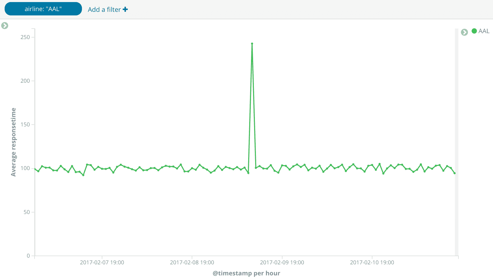
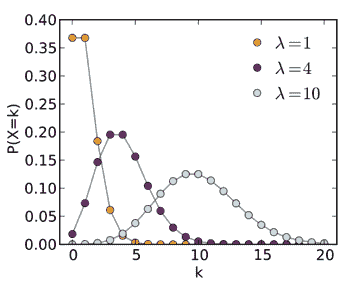
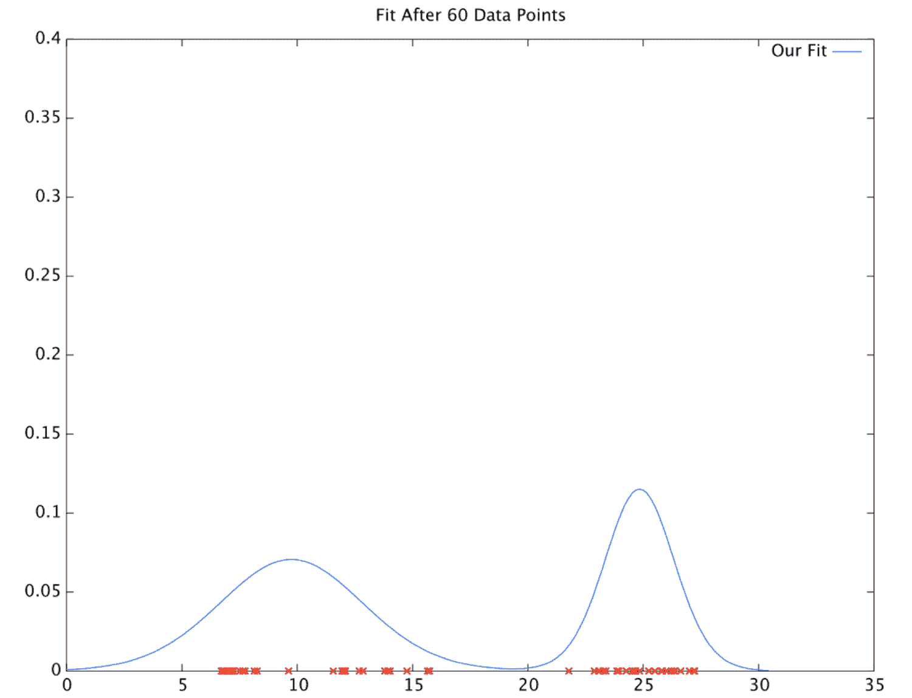
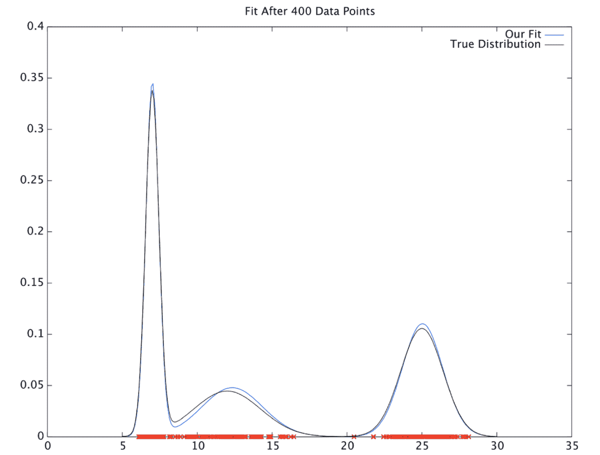
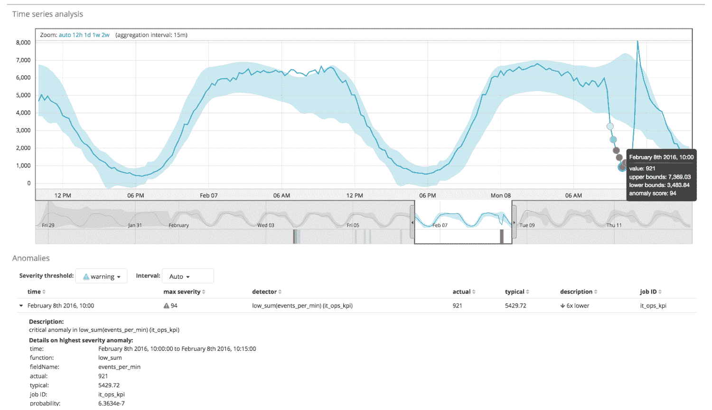
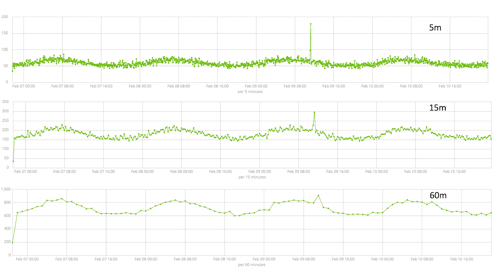
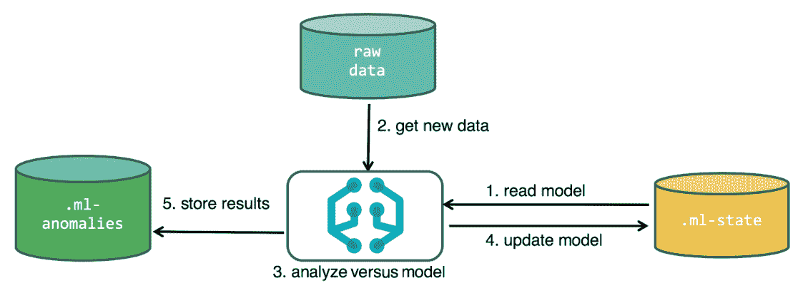

# 一、面向 IT 的机器学习

十年前，在 IT 运营或 IT 安全中使用基于**机器学习** ( **ML** )的技术似乎有点像科幻小说。然而今天，它是软件供应商最常用的术语之一。很明显，无论是对技术需求的认识，还是技术的最新实现所能带来的能力，都发生了重大转变。理解这一演变对于充分理解 Elastic 的 ML 是如何形成的以及它旨在解决什么问题是很重要的。

本章致力于回顾 Elastic ML 工作原理背后的历史和概念。如果你不感兴趣，想直接进入产品的安装和使用，请随意跳到[第 2 章](44c612a3-3b28-47fa-8064-d6724e2c9067.xhtml)、*安装带 ML 的Elastic栈*。

# 克服历史挑战

IT 应用支持专家和应用架构师的工作要求很高，期望也很高。他们的任务不仅是将新的和创新的项目转移到业务的适当位置，而且还必须尽可能平稳地保持当前部署的应用正常运行。今天的应用比以往任何时候都要复杂得多——它们高度组件化、分布式，并且可能虚拟化。它们可以使用敏捷开发，或者由外包团队开发。此外，它们很可能会不断变化。一些 DevOps 团队声称，他们通常每天可以对一个实时生产系统进行一百多次更改。试图理解一个现代应用的健康和行为就像一个机械师试图检查一辆行驶中的汽车。

IT 安全运营分析师在跟上日常运营方面也有类似的困难，但他们显然有不同的关注点，即保持企业安全和减少新出现的威胁。黑客、恶意软件和流氓内部人员已经变得如此普遍和复杂，以至于普遍的看法是，不再有一个组织是否会受到危害的问题，而是他们何时会发现的问题。很明显，尽早知道这件事(在造成太大损害之前)比第一次从执法部门或晚间新闻中得知要好得多。

那么，如何帮助他们呢？问题的关键是应用专家和安全分析师缺乏对数据的访问以帮助他们有效地完成工作吗？其实大多数情况下，恰恰相反。许多 IT 组织淹没在数据中。

# 过多的数据

几十年来，IT 部门一直在监控工具上投资，每天有十几个甚至更多的工具在收集和归档以 TB 甚至 Pb 为单位的数据，这种情况并不少见。数据的范围可以从基本的基础设施和网络级数据到深层诊断数据和/或系统和应用日志文件。业务级别的**关键表现指标**(**KPI**)也可以被跟踪，有时包括关于最终用户体验的数据。从某些方面来说，现有数据的深度和广度是有史以来最全面的。

为了检测隐藏在数据中的新出现的问题或威胁，传统上有几种主要方法将数据提取为信息洞察:

*   **过滤/搜索**:一些工具允许用户定义搜索，以帮助将数据精简到更易于管理的集合中。虽然非常有用，但这种功能通常是在怀疑有问题时临时使用的。即使这样，使用这种方法的成功通常取决于用户知道他们正在寻找什么的能力和他们的经验水平——既有经历过类似情况的先验知识，又有搜索技术本身的专业知识。
*   **可视化**:仪表盘、图表和小部件对于帮助我们了解数据的变化和趋势非常有用。然而，可视化是被动的，需要被*观察*才能发现有意义的偏差。一旦收集和绘制的指标数量超过了可以观看它们的眼球数量(甚至超过了显示它们的屏幕空间)，纯视觉分析就变得越来越没用了。
*   **阈值/规则**:为了绕过对数据进行物理观察的要求，使其具有前瞻性，许多工具允许用户定义规则或条件，这些规则或条件在已知条件或项目之间的已知依赖关系时触发。然而，在当今复杂的分布式应用中，您不可能现实地定义所有适当的操作范围或模拟所有实际的依赖关系。此外，应用或环境中变化的数量和速度可能会很快使任何静态规则集变得无用。分析师发现他们自己追踪了许多误报警报，建立了一个*男孩喊狼来了*的范例，这导致了对生成警报的工具的不满以及对警报可能提供的价值的怀疑。

最终，需要一种不同的方法——这种方法不一定要完全否定过去的技术，但可以以一种有意义的方式带来一定程度的自动化和数据评估的经验增强。让我们面对现实吧，人类是不完美的——我们有隐藏的偏见，记忆信息的能力有限，我们容易分心和疲劳。算法如果做的对，可以很容易的弥补这些缺点。

# 自动化异常检测的出现

虽然 ML 是一个非常广泛的话题，涵盖了从自动驾驶汽车到赢得游戏的计算机程序的一切，但它是寻找解决方案的自然场所。如果您意识到有效的应用监控或安全威胁搜寻的大部分需求仅仅是主题*给我找一些不同于平常的东西*的变体，那么异常检测学科就成为开始使用 ML 技术为 IT 专业人员解决这些问题的自然场所。

然而，异常检测科学并不新鲜。多年来，许多非常聪明的人研究并采用了各种算法和技术。然而，IT 数据异常检测的实际应用提出了一些有趣的限制，使得其他有学术价值的算法不适合这项工作。其中包括以下内容:

*   **及时性**:应尽快通知停机、违规或其他重大异常情况，以便减轻影响。如果能够快速补救或控制，停机成本或持续安全威胁的风险将降至最低。跟不上当今 IT 数据实时性的算法价值有限。
*   **可扩展性**:如前所述，在现代 IT 环境中，IT 数据的数量、速度和变化持续呈爆炸式增长。检查这种大量数据的算法必须能够随着数据线性缩放，以便在实际意义上可用。
*   **效率** : IT 预算经常被严格审查是否存在浪费支出，许多组织经常被要求*少花钱多办事*。增加一批超级计算机来运行算法是不切实际的。相反，具有典型规格的普通商用硬件必须能够作为解决方案的一部分。
*   **适用性**:虽然高度专业化的数据科学通常是解决特定信息问题的最佳方式，但 IT 环境中数据的多样性推动了对可广泛应用于绝大多数用例的需求。从长远来看，相同技术的可重用性更具成本效益。
*   **适应性**:不断变化的 IT 环境会很快让脆弱的算法变得毫无用处。训练和再训练 ML 模型只会带来另一个浪费时间的风险，这是我们无法承受的。
*   **准确性**:我们已经知道，来自传统阈值和基于规则的系统的警报疲劳是一个现实问题。用一个假警报发生器替换另一个不会给任何人留下深刻印象。
*   **易用性**:即使前面提到的所有约束条件都能得到满足，任何需要大量数据科学家来实现的解决方案都过于昂贵，而且会立即被取消资格。

所以，现在我们开始真正的挑战——创建一个快速、可扩展、准确、低成本的异常检测解决方案，每个人都会使用和喜欢，因为它工作完美。没问题！

这听起来令人生畏，Prelert 创始人兼首席技术官史蒂夫·多德森在 2010 年接受了这一挑战。虽然史蒂夫无疑带来了他的学术成就，但最终成为 Elastic 的 X-Pack ML 的技术起源于试图解决实际 IT 应用问题的痛苦——第一个问题是伦敦一家大型金融公司的交易平台出现令人讨厌的间歇性故障。史蒂夫和几名加入该合资企业的工程师帮助银行团队使用异常检测技术，仅自动露出干草堆中的*根针*，使分析师能够专注于一小组相关指标和出错的日志消息。根本原因的识别(一个失败的服务，其恢复导致了一系列后续的网络问题，造成了严重的破坏)最终为应用带来了稳定性，并避免了银行在先前的解决方案上花费大量资金，这是一个计划外的、昂贵的网络升级。

然而，随着时间的推移，很明显，即使是最初的成功也仅仅是开始。几年后，在几千个真实世界的使用案例中，Prelert 和 Elastic 的结合是一种自然的结合——一个使大数据易于访问的平台与帮助克服人类分析局限性的技术的结合。

本文描述的是从版本 6.5 开始的 Elastic ML 中的技术的理论和操作。

# 操作理论

为了更深入地了解该技术的工作原理，我们将讨论以下内容:

*   关于技术方面不寻常的的*的严格定义*
*   无监督学习的直观例子
*   技术如何对数据建模、去趋势化和评分的描述

# 定义不寻常

异常检测是我们几乎所有人都有基本直觉的东西。人类非常擅长模式识别，所以如果我在街上问一百个人“有什么不寻常的？”在下图中，绝大多数人(包括非技术人员)会识别绿线中的尖峰:

类似地，假设我们问了“什么不寻常？”使用下面的图片:

我们可能会再次得到大多数人的支持，认为海豹是不寻常的东西。但是，人们可能很难清楚地说出得出这些结论所使用的实际启发法。

在第一种情况下，用于将尖峰定义为异常的启发式规则可以表述如下:

*   如果某事物的行为明显偏离了基于其过去历史的既定模式或范围，则该事物是异常的

在第二种情况下，启发式算法采用以下形式:

*   如果一个实体的某些特征与一个集合或群体中其他成员的相同特征有显著差异，那么这个实体就是不寻常的

这些关键定义将与Elastic ML 相关，因为它们形成了异常检测算法的两个主要基本操作模式。正如我们将看到的，用户将可以控制特定用例所采用的操作模式。

# 正常学习，无人监督

ML——这门学科——在学习过程中有许多变化和技巧。ML——Elastic栈中的特性——使用一种特定的类型，称为*u*n 监督学习。无监督学习的主要属性是学习发生*而无需教授任何东西*。没有人为的帮助来塑造学习的决策；它只是通过检查提供给它的数据自己完成这项工作。这有点类似于通过沉浸过程学习语言，而不是坐下来阅读词汇和语法规则。

为了从一个对情况一无所知的完全幼稚的状态转变为一个可以非常确定地做出预测的状态，需要构建一个情况的*模型*。如何创建该模型极其重要，因为基于该模型采取的所有后续行动的效力将高度依赖于该模型的准确性。该模型将需要灵活，并根据新信息不断更新，因为这是在这种无人监管的范式中必须进行的。

# 概率模型

概率分布可以很好地服务于这个目的。分布有许多基本类型，但首先讨论泊松分布是个好方法，因为它适用于在时间上有离散事件发生的情况:

来源:https://en . Wikipedia . org/wiki/Poisson _ distribution #/media/File:Poisson _ PMF . SVG

这里显示了三种不同的分布变量，每一种都有不同的均值( **λ** )，以及最高期望值 **k** 。我们可以打个比方说，这些分布模拟了一个人每天投递到家中的邮件的预期数量，由轴 *x* 上的 **k** 表示:

*   对于 **λ = 1** ，每天有大约 37%的几率投递零封邮件或一封邮件。也许这对一个不经常收到邮件的大学生来说是合适的。
*   对于 **λ = 4** ，大概有 20%的几率收到三四张。从表面上看，这是一个年轻专业人士的好榜样。
*   对于 **λ = 10** ，每天收到 10 封邮件的概率约为 13%——可能代表一个大家庭，或者至少是一个不知何故出现在许多邮件列表上的家庭！

每条曲线上的离散点也给出了 **k** 其他值的似然(概率)。因此，该模型可以提供信息，并回答诸如“可能收到 15 封邮件吗？”。我们可以看到，对于学生( **λ = 1** )或者年轻的专业人士( **λ = 4** )来说不太可能，但是对于大家庭( **λ = 10** )来说就有点可能了。

显然，这里有一个简单的声明，显示的模型适用于所描述的某些人——但似乎显而易见的是，需要有一个机制来学习每个单独情况的模型，而不只是断言它。学习它的过程是直观的。

# 学习模型

坚持用邮件类比，人们会本能地意识到，确定哪种型号最适合特定家庭的方法可以简单地通过每天在邮箱旁闲逛并记录邮递员向邮箱中投入的邮件来确定。同样显而易见的是，观察越多，您对模型准确性的信心就越高。换句话说，只花 3 天时间在邮箱旁，提供的信息和信心都不如花 30 天或 300 天。

从算法上讲，可以设计一个类似的过程，根据观察结果自行选择合适的模型。仔细检查算法对模型类型本身(即泊松、高斯、对数正态等)的选择以及该模型类型的特定系数(如前面的 **λ** 示例所示)也需要成为这种自我选择过程的一部分。要做到这一点，需要不断评估模型的适当性。贝叶斯技术也用于评估模型的可能参数值，给定数据集作为一个整体，但允许基于在特定时间点之前已经看到多少信息来调整这些决策。ML 算法自动完成这一任务。

对于那些想要更深入地探究一些有代表性的数学现象背后的人来说，请参考在 http://www.ijmlc.org/papers/398-LC018.pdf 的学术论文。

最重要的是，所做的建模是*连续的*，因此新信息与旧信息一起被考虑，新信息具有指数权重。经过 60 次观察后，这样一个模型可能如下所示:

60 次观察后的样本模型

经过 400 次观察后，情况似乎会有很大的不同，因为数据本身会出现一系列新的观察结果，其值介于 **5** 和 **10** 之间:

400 次观察后的样本模型

还要注意，模型有可能有多个*模式*，或者更高概率的区域/集群。学习模型(显示为蓝色曲线)与理论上的理想模型(黑色)的拟合的复杂性和真实性非常重要。模型越精确，数据集的*正常状态*的表示就越好，因此最终，对未来值如何与该模型相符的预测就越精确。

建模的连续性还要求该模型能够*序列化*到长期存储，这样，如果模型创建/分析暂停，可以在以后恢复。正如我们将看到的，这个模型创建、存储和利用过程的操作化是一个复杂的编排，幸运的是，它是由 ML 自动处理的。

# 去趋势化

真实建模现实世界数据的另一个重要方面是考虑自然发生的显著泛音趋势和模式。数据是否每小时和/或每天都有起伏，在工作时间或工作日有更多活动？如果是这样的话，那么这需要加以说明。ML 自动搜寻数据中的显著趋势(线性增长、周期性谐波等)，并将其分解出来。让我们观察下图:

检测到三个周期后，周期性趋势下降

在这里，周期性的每日循环被学习，然后被分解。在自动检测到该周期的三次连续迭代后，模型的预测边界(在深蓝色信号周围的浅蓝色包络中表示)会显著调整。

因此，随着时间的推移观察到更多的数据，从概率分布函数变得更加成熟的角度来看，以及通过可能几天或几周都不会出现的其他模式的去趋势化，模型获得了准确性。

# 异常性评分

一旦构建了模型，就可以在概率分布中找到任何未来观察值的可能性。如前所述，我们提出了这样一个问题，“收到 15 封邮件可能吗？”。这个问题现在可以凭经验回答，取决于模型，数字在零(没有可能性)和一(绝对确定性)之间。ML 将使用该模型计算出大约 300 位有效数字的分数值(这在处理非常低的概率时会有所帮助)。让我们观察下图:

ML 计算这个时间序列中值下降的概率

这里，在这个时间点观察到 921 的实际值的概率被计算为 6.3634e-7(或者更常见的是仅有 0.000063634%的机会)。这个非常小的值对大多数人来说可能不是那么直观。因此，ML 将采用这种概率计算，并通过分位数归一化的过程，在 0 到 100 的严重度范围内重新预测该观察，其中 100 是该特定数据集可能的最高异常水平。在前面的例子中，6.3634e-7 的概率计算被标准化为 94 分。这个标准化分数将在以后派上用场，作为一种评估异常的*严重性*的方法，用于报警和/或分类。

# 操作化

虽然[第 2 章](44c612a3-3b28-47fa-8064-d6724e2c9067.xhtml)、*使用机器学习安装Elastic栈*将重点关注产品本身的安装和设置，但从逻辑角度理解 ML 如何工作的几个关键概念是有好处的——事情在哪里和何时运行——以及在这个复杂的编排中涉及哪些流程和索引。

# 乔布斯

在 Elastic 的 ML 中，*工作*是工作的单位，类似于*手表*对于 Elastic 的提醒。正如我们将在后面更深入地看到的，作业的主要配置元素如下:

*   作业名称/ID
*   分析时段化窗口(时段范围)
*   用于获取要分析的原始数据(数据馈送)的查询的定义和设置
*   异常检测配置方案(检测器)

ML 工作是独立自主的。多个可以同时运行，做独立的事情，分析不同指数的数据。乔布斯可以分析历史数据、实时数据，或者两者的混合。可以使用 Kibana 中的机器学习 UI 创建作业，或者通过 API 以编程方式创建作业。它们还需要支持 ML 的节点。

# ML 节点

首先，由于 Elasticsearch 本质上是一个分布式多节点解决方案，因此 Elastic Stack 的 ML 特性作为一个遵循许多相同操作概念的本机插件来工作是很自然的。如文档中所述，可以在任何或所有节点上启用 ML，但在生产系统中，拥有专用的 ML 节点是最佳实践。这有助于优化 ML 特别需要的资源类型。与由于索引和搜索而涉及大量 I/O 负载的数据节点不同，ML 节点需要更多的计算和内存。有了这些知识，您就可以为专用的 ML 节点确定合适的硬件规模。

需要注意的一个关键点是——ML 算法不在 JVM 中运行。它们是基于 C++的可执行文件，将使用分配给 **Java 虚拟机** ( **JVM** )堆的剩余的*RAM。运行作业时，调用分析的主流程(称为`autodetect`)可以在流程列表中看到:*

View of top processes when a ML job is running

对于每个正在运行的 ML 作业，将有一个`autodetect`进程。在多节点设置中，ML 会将作业分配给每个启用 ML 的节点，以平衡工作负载。

# 桶装化

分桶输入数据是 ML 中需要理解的一个重要概念。通过在作业级设置一个名为`bucket_span`的关键参数，来自数据馈送(如下所述)的输入数据被收集成小批量进行处理。将时段跨度视为一个*分析前聚合间隔—* 一个时间窗口，在此期间聚合一部分数据以进行分析。`bucket_span`的持续时间越短，分析就越精细，但数据中出现噪声的可能性也就越大。

下图显示了在三个不同时间间隔内聚合的相同数据集:

三个不同时间间隔内相同数据的聚合

请注意，如果数据在 60 分钟间隔内聚合，则在 5 分钟间隔内聚合的版本中看到的显著异常峰值几乎会丢失，这是因为峰值很短(<2 minute) duration. In fact, at this 60-minute interval, the spike doesn't even seem that anomalous anymore.

This is a practical consideration for the choice of 【 . On one hand, having a shorter aggregation period is helpful because it will increase the frequency of the analysis (and thus reduce the interval of notification on if there is something anomalous), but making it too short may highlight features in the data that you don't really care about. If the brief spike that's shown in the preceding data is a meaningful anomaly for you, then the 5-minute view of the data is sufficient. If, however, a perturbation of the data that's very brief seems like an unnecessary distraction, then avoid a low value of 【 .

Some additional practical considerations can be found on Elastic's blog: [https://www . elastic . co/blog/explaining-the-bucket-span-in-machine-learning-for-elastic search](https://www.elastic.co/blog/explaining-the-bucket-span-in-machine-learning-for-elasticsearch))。

# 数据馈送

ML 显然需要数据来分析(并用来建立和完善统计模型)。这些数据来自你在 Elasticsearch 中的时间序列指数。数据馈送是一种机制，通过这种机制，数据被例行地检索(搜索)并呈现给 ML 算法。除了在 UI 中创建高级作业(或通过使用 ML API)的情况之外，它的配置对用户来说是模糊的。然而，理解数据馈送在幕后做什么是很重要的。

类似于警报中的监视输入的概念，数据馈送将根据索引例行地查询数据，该索引包含要分析的数据。数据馈送查询数据的频率(以及一次查询多少数据)取决于几个因素:

*   `bucket_span`:我们已经确定`bucket_span`控制正在进行的分析窗口的宽度。因此，datafeed 的工作是确保桶中充满了按时间顺序排列的数据。因此，您可以看到 datafeed 将对 Elasticsearch 进行日期范围查询。
*   `frequency`:控制原始数据物理查询频率的参数。如果这在 2 到 20 分钟之间，`frequency`将等于`bucket_span`(就像，每 5 分钟查询一次最近 5 分钟的数据)。如果`bucket_span`更长，默认情况下`frequency`将是一个更小的数字(更频繁),因此整个长间隔预计不会被一次查询完。如果数据集非常庞大，这将很有帮助。换句话说，一个长的`bucket_span`的区间将被分割成更小的区间，仅仅是为了查询的目的。
*   `query_delay`:这控制了数据馈送应该查询一个时段跨度的数据的“滞后”时间量。默认为 60s。因此，在 12:01 PM 的`bucket_span`值为`5m`且`query_delay`值为`60s`的情况下，datafeed 将请求上午 11:55 到午夜之间的数据。这一极小的延迟考虑到了接收管道中的延迟，以确保在数据接收因任何原因而延迟时，不会有数据被排除在分析之外。
*   `scroll_size`:在大多数情况下，datafeed 对 Elasticsearch 执行的搜索类型使用 scroll API。滚动大小定义了 Elasticsearch 一次查询的数据量。例如，如果 datafeed 设置为每 5 分钟查询一次日志数据，但在典型的 5 分钟窗口中有 100 万个事件，滚动该数据的想法意味着一个巨大的查询不会获取所有 100 万个事件。相反，它会以`scroll_size`的增量进行多次查询。默认情况下，此滚动大小保守地设置为 1，000。因此，为了向 ML 返回 100 万条记录，datafeed 将向 Elasticsearch 请求 1000 行，请求 1000 次。将`scroll_size`增加到 10000 会使卷轴数量减少到一百。一般来说，更强大的集群应该能够处理更大的`scroll_size`，从而在整个过程中更加高效。

但是，在单一指标作业的情况下有一个例外。单指标作业(稍后将详细描述)是一个简单的 ML 作业，它只允许分析一个时间序列指标。在这种情况下，scroll API 是*而不是*用于获取原始数据——相反，datafeed 将自动创建一个查询聚合(使用`date_histogram`聚合)。这种聚合技术也可以用于高级作业，但是它目前需要直接编辑作业的 JSON 配置，应该留给专家用户使用。

# 支持指数

对于Elastic的 ML 的功能，有几个支持指数存在，并服务于特定的目的。我们将了解以下指数并描述它们的作用:

*   `.ml-state`
*   `.ml-notifications`
*   `.ml-anomalies-*`

# 。ml-状态

`.ml-state`索引是 ML 保存关于统计模型的内部信息的地方，该统计模型是为特定数据集学习的，加上附加的逻辑信息。这个索引并不意味着用户可以理解——它是 ML 的后端算法，将在这个索引中读写条目。

`.ml-state`索引中的信息经过压缩，是 ML 作业正在分析的原始数据大小的一小部分。

# 。ml-通知

`.ml-notifications`索引存储 ML 的审计消息，这些消息出现在 UI 的作业管理页面的作业消息部分:

Audit messages for a particular job in the ML UI

这些消息传达了有关作业创建和活动的基本信息。此外，基本的操作错误也可以在这里找到。然而，关于 ML 任务执行的详细信息可以在`elasticsearch.log`文件中找到。

# 。ml-异常-*

`.ml-anomalies-*`指数包含了 ML 工作的详细结果。有一个单独的`.ml-anomalies-shared`索引可以包含来自多个任务的信息(以`job_id`字段为关键字)。如果用户在创建作业时选择在用户界面中使用专用索引(或在使用 API 时设置`results_index_name`，则将为该作业创建专用结果索引。

这些指数有助于利用最大似然算法的输出。ML 用户界面中显示的所有信息都将来自该结果数据。此外，通过根据这些指标配置观察器，可以实现对异常情况的主动警报。更多相关信息将在第 6 章、*关于 ML 分析的警告*中介绍。

# 配器

当 ML 作业被配置为运行时，ML 将所有这些部分按顺序排列在一起。下图显示了此过程的简化版本:

每桶 ML 程序的简化顺序 _span

一般来说，前面的过程每个`bucket_span`执行一次——然而，额外的优化是为了最小化 I/O。这些细节超出了本书的范围。然而，关键的一点是，这种编排使 ML 能够在线(也就是说，不是离线/批处理)并不断地学习新获取的数据。这个过程也是由 ML 自动处理的，因此用户不必担心完成这一切所需的复杂的后勤工作。

# 摘要

既然对 Elastic 的 ML 的理论和实际操作都有了了解，我们现在可以集中精力正确安装它并将其应用于不同的用例。接下来的章节将带领我们踏上使用 Elastic 最先进的自动化异常检测解决 IT 运营和 IT 安全中一些现实问题的旅程。