<title>Event Change Detection</title>  

# 事件变化检测

如前一章所示，[第 2 章](44c612a3-3b28-47fa-8064-d6724e2c9067.xhtml)，*用机器学习安装弹性堆栈，*随着时间的推移跟踪指标及其潜在异常无疑是异常检测对 IT 数据的一个极其重要的应用。这提供了对许多关键性能和可用性指标的广泛、主动的覆盖。

然而，有许多重要的用例围绕着事件变化检测的思想。其中包括以下内容:

*   发现日志文件中突然出现大量错误消息
*   检测在线系统处理的订单量的突然下降
*   确定突然过多的访问尝试(例如，暴力验证或侦察扫描)

在这一章中，我们将讨论根据事物的发生率来确定异常的概念，并且我们将通过几个实际的例子，如下所示:

*   计数函数
*   人口分析中的计数
*   检测很少发生的事情
*   通过分类统计基于消息的日志

<title>How to understand the normal rate of occurrence</title>  

# 如何理解正常发生率

假设您正在通过查看特定的日志文件来解决问题。您会在日志中看到类似如下的一行:

```
18/05/2017 15:16:00 DB Not Updated [Master] Table
```

除非您非常了解创建该日志的应用程序的内部工作原理，否则您可能不知道该消息是否重要。让数据库成为`Not Updated`听起来可能是一种负面的情况。但是，如果您知道应用程序每天每小时都要写几百次这条消息，那么您自然会意识到这条消息是良性的，应该可以忽略，因为很明显，尽管这条消息被写入日志文件，应用程序每天都工作得很好。

显然，这是一个人类解释的问题。检查消息的文本和阅读否定短语(`Not Updated`)可能会使人倾向于认为该消息是值得注意的，因为可能存在问题。但是，消息的频率(它经常发生)应该告诉人们，尽管这些消息被写入日志，但是该消息一定没有那么重要，因为应用程序正在工作(也就是说，没有报告中断)。

对于一个日志文件中的几种类型的消息，人们可能很难处理这些信息(评估消息内容/相关性以及随时间变化的频率)。想象一下，如果有成千上万种不同的消息类型以每天数百万行日志的总速率出现。即使是应用程序内容和搜索/可视化方面最有经验的专家也会发现这是不切实际的，如果不是不可能的话。

ML 提供了允许对消息内容的独特性和相对发生频率进行经验评估的能力。让我们首先通过对计数函数的介绍来关注事物的频率方面。

<title>Exploring count functions</title>  

# 探索计数函数

如在[第 2 章](44c612a3-3b28-47fa-8064-d6724e2c9067.xhtml)、*使用机器学习安装弹性堆栈中所见，*弹性 ML 作业包含应用于数据某些方面(例如，字段)的函数组合的检测器。[第 2 章](44c612a3-3b28-47fa-8064-d6724e2c9067.xhtml)、*使用机器学习安装弹性堆栈、*中显示的示例作业具有使用基于度量的函数的检测器，这些函数对基于度量的字段进行操作(如 CPU 利用率)。然而，我们将在这一章中探索的检测器将是那些简单地计数随时间发生的事情的检测器。

需要熟悉的三个主要功能如下:

*   Count:统计查询原始数据索引所产生的存储桶中的文档数
*   高计数:与计数相同，但只有当计数高于预期时才会标记异常
*   低计数:与计数相同，但只有在计数低于预期时才会标记异常

你会看到 ML 中有各种各样的单边函数(只检测某个方向的异常)。此外，重要的是要知道这个函数不是对一个字段计数，甚至不是对文档中字段的存在计数，它只是对文档计数。

为了更直观地了解 Count 函数的功能，让我们来看看标准(非 ML) Kibana 可视化为我们展示了一个特定数据集，该数据集在 Y 轴上显示计数聚合，在 X 轴上显示 10 分钟分辨率的日期直方图聚合:

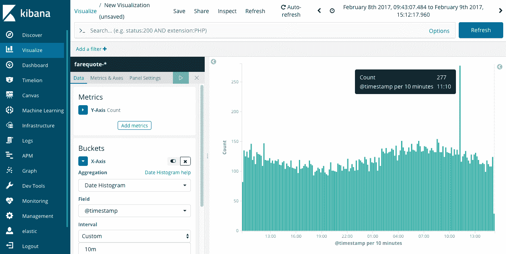

从前面的截图中，我们可以观察到一些情况:

*   这个垂直条可视化统计了每个 10 分钟时段的索引中的文档数量，并显示了结果视图。例如，我们可以看到，在 2 月 9 日上午 11:10 标记的文档数量在文档/事件中有一个峰值，该峰值似乎比典型的*速率(不包括峰值的时间点)高得多；在这种情况下，计数是 277。*
*   为了自动分析这些数据，我们用 ML 作业绘制了它。我们可以使用单个指标作业，因为只有一个时间序列(该索引中所有文档的计数)。完成单指标作业向导的初始步骤后，配置作业将如下所示(如[第 2 章](44c612a3-3b28-47fa-8064-d6724e2c9067.xhtml)、*使用机器学习* *ing* 安装弹性堆栈中所述):

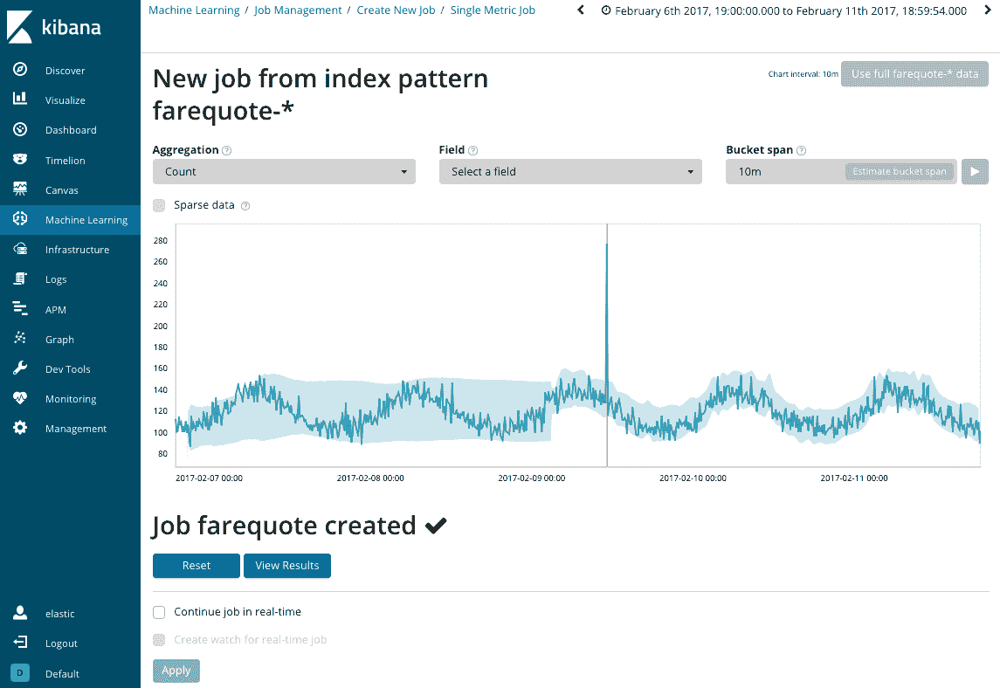

我们可以看到使用了 Count 聚合函数(尽管高计数也是合适的)，并且将 Bucket span 设置为与构建 Kibana 可视化时相同的值。运行作业后，会发现产生的异常情况:

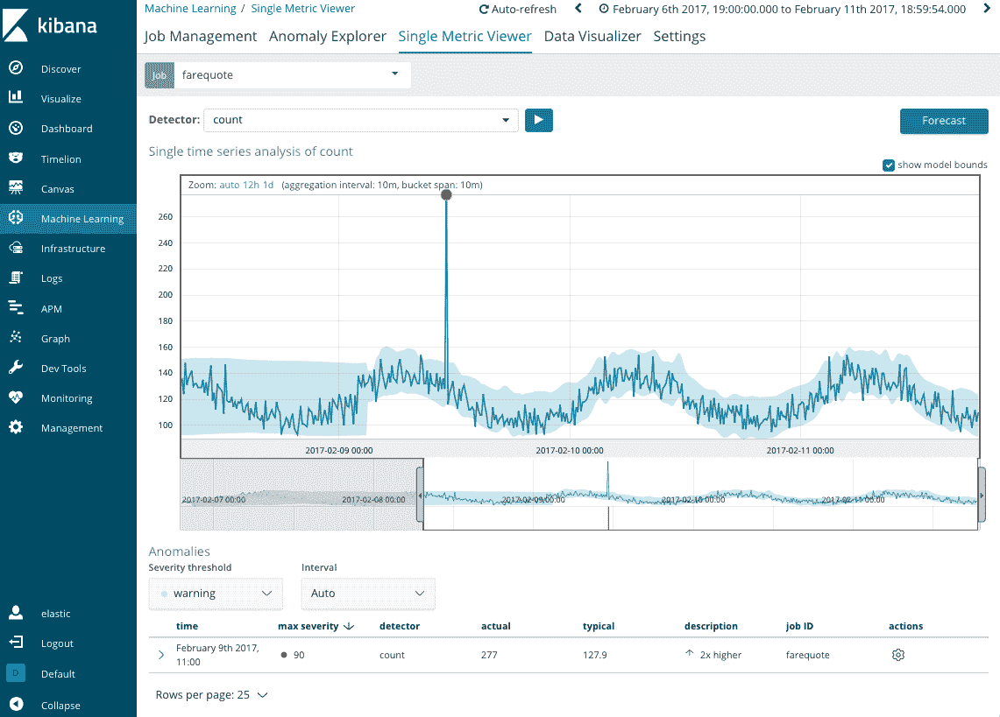

当然，277 个文档/事件的异常正是我们所希望发现的，因为这正是我们早先在垂直条可视化中手动分析数据时所看到的。

但是，请注意，如果用`60m`桶跨度而不是`10m`桶跨度分析相同的数据，会发生什么:

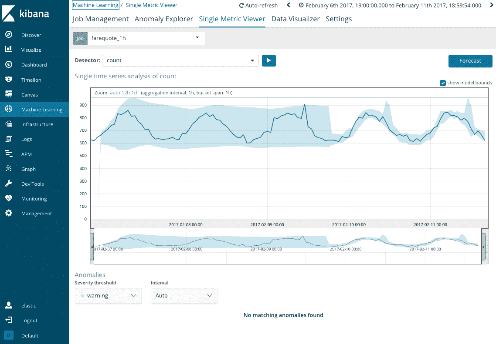

请注意，由于发生的速率峰值非常短，当事件计数在一个小时内聚集时，峰值看起来不再异常，因此 ML 甚至不认为它异常。这类似于[第 1 章](07120c76-7474-476f-af36-e1b3e3d8688f.xhtml)、*IT 机器学习*中指出的情况，铲斗跨度的值对结果分析有直接影响。

如前所述，低计数和高计数的*单侧*功能在试图寻找仅一个方向的偏差时特别有用。也许你只想在你的电子商务网站上找到一点订单(因为订单激增是个好消息！)，或者您可能只想发现错误的峰值(因为错误的下降也是一件好事！).

记住，Count 函数计算文档数，而不是字段数。如果您有一个表示某个事物的汇总计数的字段，那么将需要特殊处理，如下一节所述。

<title>Summarized counts</title>  

# 汇总计数

我们清楚地说明了计数函数只是记录单位时间内的文档数量。但是，如果您使用的数据实际上有一个已经包含汇总计数的字段值，该怎么办呢？例如，在下面的数据中，`events_per_min`字段表示前一分钟发生的某件事情(在本例中为在线购买)的汇总次数:

```
{ 

    "metrictype": "kpi", 

    "@timestamp": "2016-02-12T23:11:09.000Z", 

    "events_per_min": 22, 

    "@version": "1", 

    "type": "it_ops_kpi", 

    "metricname": "online_purchases", 

    "metricvalue": "22", 

    "kpi_indicator": "online_purchases" 

  } 
```

为了让 ML 作业认识到需要记录的是`events_per_min`字段(而不是文档本身)，我们需要设置 summary_count_field_name 指令(只能在高级作业的 UI 中设置):

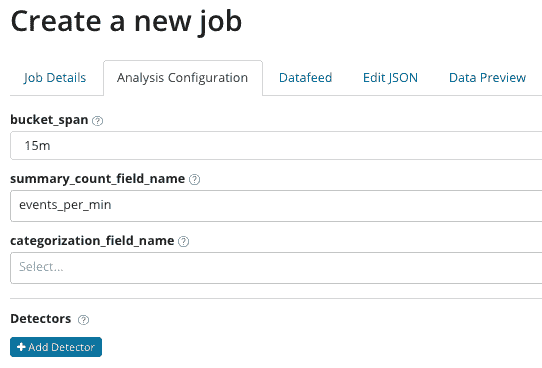

将`events_per_min`指定为 summary_count_field_name 后，这种情况下适当的检测机配置只需使用 low_count 函数:

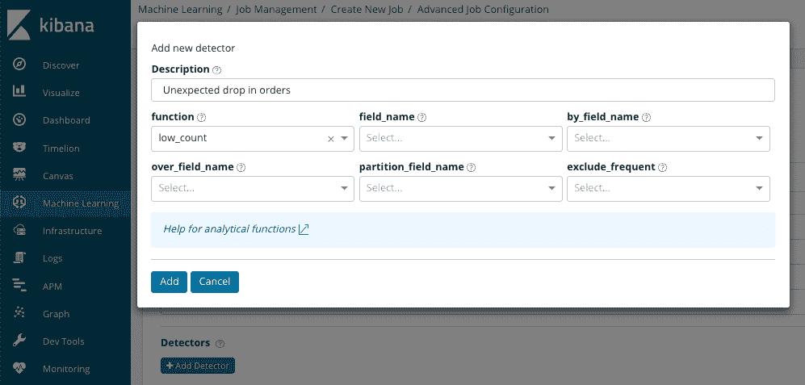

运行该作业的结果与我们预期的完全一致—检测到我的客户在线购买量低于应有水平的一些情况，包括订单完全降至零的时间，以及某个中午的部分订单丢失:

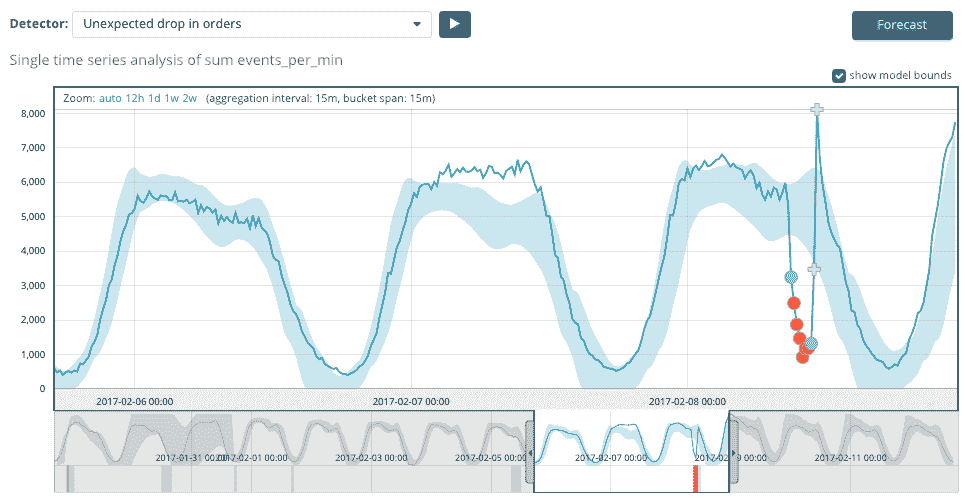

<title>Splitting the counts</title>  

# 拆分计数

与前几章中所示的沿分类字段拆分和/或划分分析的方法类似，这可以通过计数函数来完成。这使得一次获得多个并发事件率分析变得非常方便，可以通过多指标作业或高级作业 UI 向导来完成。

这方面的一些常见用例如下:

*   按错误 ID 或类型查找日志中错误消息的增加
*   按主机查找日志量的变化；也许某些配置被改变了
*   决定某些产品是否突然比以前卖得更好或更差

为此，使用了相同的机制。例如，在多指标作业中，在使用计数(事件率)函数时，用户可以选择一个分类字段来分割数据:

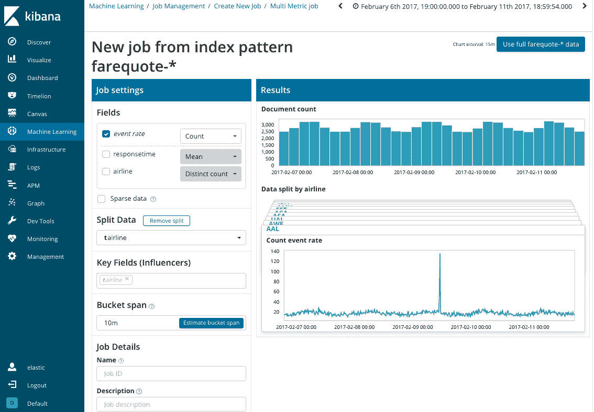

这导致如下结果，其中确定被建模的许多实体中只有一个实际上是不寻常的(对 AAL 航空公司的请求量的峰值):

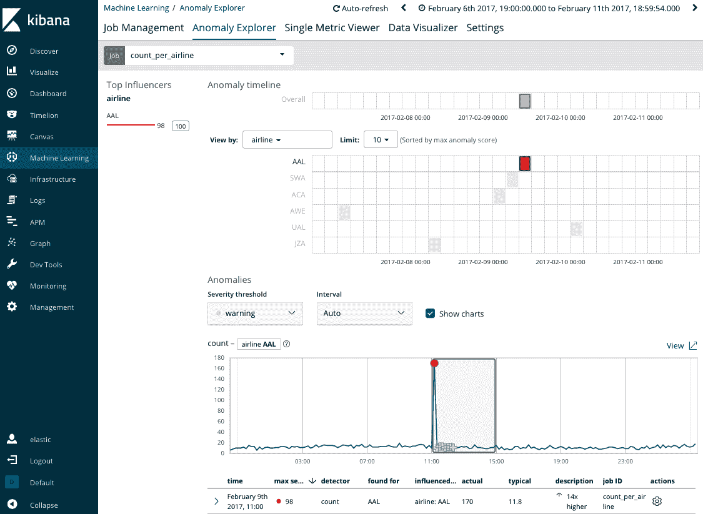

如您所见，在数据中某个分类字段的大量唯一实例中，很容易看到基于数量的变化。我们一眼就能看出哪些实体是不寻常的，哪些不是。

<title>Other counting functions</title>  

# 其他计数功能

除了我们到目前为止已经描述过的函数，还有几个其他的计数函数支持更广泛的用例。

<title>Non-zero count</title>  

# 非零计数

非零计数函数(`non_zero_count`、`low_non_zero_count`和`high_non_zero_count`)允许处理基于计数的分析，但也允许在数据稀疏的情况下进行精确建模，并且您不希望不存在的数据被显式地视为零，而是 null。换句话说，时间数据集，如下所示:

```
4,3,0,0,2,0,5,3,2,0,2,0,0,1,0,4
```

使用`non_zero_count`功能的数据将被解释如下:

```
4,3,2,5,3,2,2,1,4
```

在预期不存在规则间隔的测量的情况下，将零视为零的行为可能是有用的。这方面的一些实例如下:

*   个人每月购买的机票数量
*   服务器一天内重新启动的次数
*   每小时尝试登录系统的次数

<title>Distinct count</title>  

# 独特计数

不同的计数函数(`distinct_count`、`low_distinct_count`和`high_distinct_count`)测量特定字段值的唯一性(基数)。该函数有许多可能的用途，特别是在群体分析(见下一页)的环境中使用时，可以发现记录了一组过度多样化的字段值的实体。一个典型的例子是寻找参与端口扫描的 IP 地址，访问远程机器上异常大量的不同目的端口号:

```
{ 

  "function" : "high_distinct_count", 

  "field_name" : "dest_port", 

  "over_field_name": "src_ip" 

} 
```

请注意，`src_ip`字段被定义为`over`字段，从而调用群体分析并相互比较源 IP 的活动。接下来是关于群体分析的附加讨论。

<title>Counting in population analysis</title>  

# 人口分析中的计数

根据一个实体自身的历史来计数事件的发生，执行异常检测显然是有用的。但是，正如我们在[第 1 章](07120c76-7474-476f-af36-e1b3e3d8688f.xhtml)、*IT 的机器学习、*中概念性地介绍的那样，将某事物的行为与其同类进行比较的想法也是有益的，尤其是在我们评估某事物发生的次数的情况下。通过统计人群中事物的出现次数来发现个体异常值有多种重要的用例。其中一些使用案例包括:

*   查找比类似配置的机器记录更多(或更少)日志的机器。以下是一些示例场景:
    *   不正确的配置更改导致系统或应用程序的日志文件中突然出现更多错误。
    *   可能受到恶意软件危害的系统实际上可能被指示在某些情况下抑制日志记录，从而大幅减少日志量。
    *   失去连接或操作失败的系统，因此其日志量减少。
    *   对日志级别设置的无害更改(debug 而不是 normal ),现在使您的日志占用更多的磁盘空间。
*   发现与大多数*正常*用户不同的行为。作为用户行为分析方向的一个标志，比较用户与其同行的活动率在以下情况下会很有用:
    *   **自动化用户**:与典型的人类行为或使用模式不同，自动化脚本可能会表现出在速度、持续时间和他们创建的事件的多样性方面看起来非常不同的行为模式。无论是寻找试图收获在线目录的产品和价格的爬虫，还是检测可能在社交媒体上传播错误信息的机器人，自动识别自动用户都是有帮助的。
    *   窥探用户:无论是真正的人类测试他们可以逃脱的边界，还是智能恶意软件进行一些侦察，窥探者可能会执行各种各样的事情，希望找到匹配或找到进入的方法(例如通过端口扫描)。通常，使用`distinct_count`函数可以帮助找到一个窥探器。
    *   **恶意/滥用用户**:在侦察阶段之后，恶意用户或恶意软件现在正在积极进行破坏，并参与主动措施，如拒绝服务、暴力破解或窃取有价值的信息。同样，与典型用户相比，恶意用户和滥用用户在数量、多样性和单位时间活动强度方面的行为形成鲜明对比。

揭露行为异常的一个实际例子是分析跟踪使用情况的日志，比如 web 访问日志。我们可以建立一个寻找不寻常的客户端 IP 地址的工作，这些客户端 IP 地址的行为像自动化的机器人，而不像人类(因为机器人通常比人类发出更高数量、频率和多样性的请求)。该配置将每单位时间内的 web 请求计数(按 HTTP 状态代码划分，因为僵尸工具通常也会随机访问，从而产生一组不同的响应代码)与客户端 IP 群体进行比较:

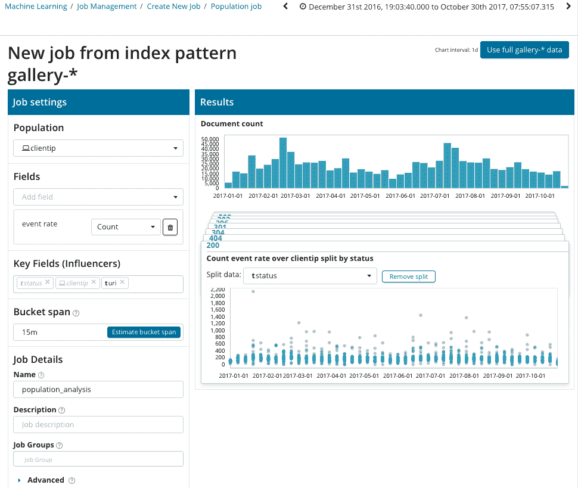

执行时，该作业可以很好地识别一些流氓 IP 地址:

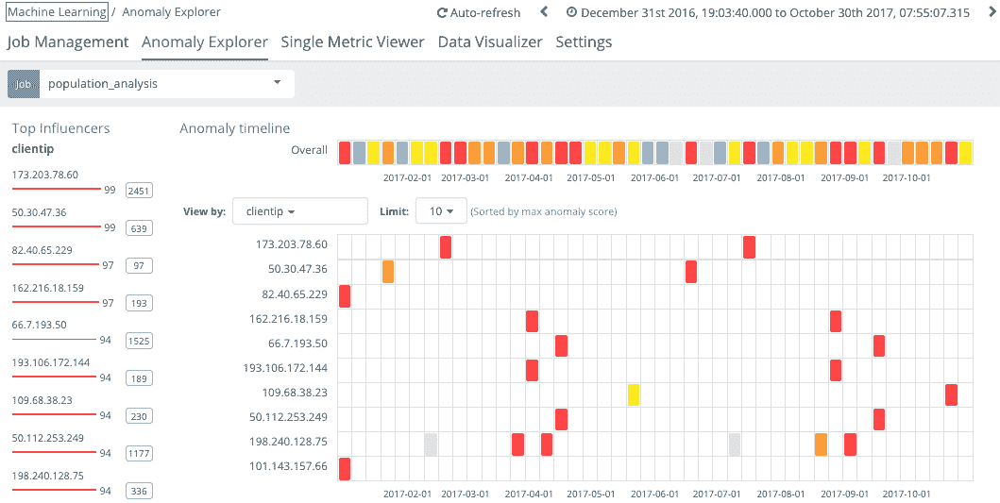

热图显示了前 10 个最不常见的客户端 IP 地址，同样基于单位时间内的请求量。关注头号违规者`173.203.78.60`，当点击其泳道中的红色方块时，我们可以看到详细信息:

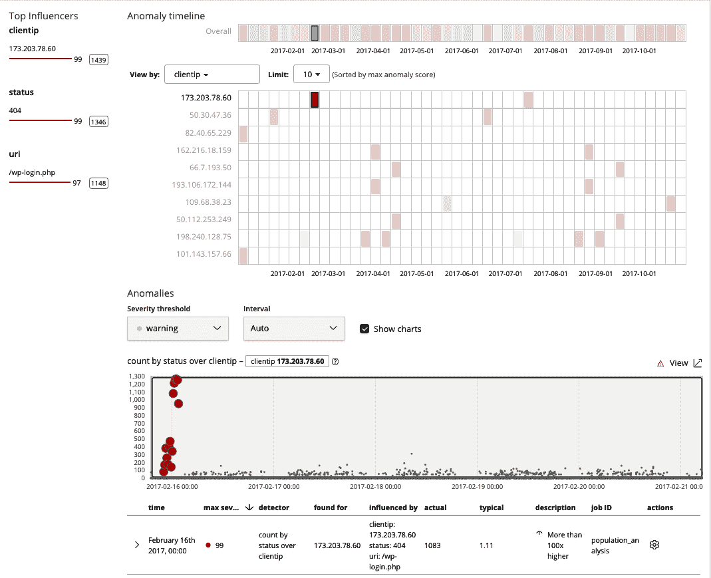

我们可以看到，这个流氓 IP 地址实际上正在执行数千个对`/wp-login.php`的 URI 的请求，幸运的是，这个请求在这个 web 服务器上并不存在(因此产生了状态代码 404)。这似乎是一个相当简单的暴力登录尝试，但仍然是一个有趣的发现。

作为比较，如果 web 日志的分析利用了 URL 字段的`distinct_count`,而不是标准计数函数，那么前面的恶意 IP 地址就不会被突出显示为异常。这仅仅是因为成千上万的请求都是针对同一个网址(`wp-login.php`)。因此，请求的多样性非常低。然而，在寻找具有异常高的 URL 请求多样性的 IP 地址的工作中，使用`distinct_count`会发现不同的情况，例如这个 IP:

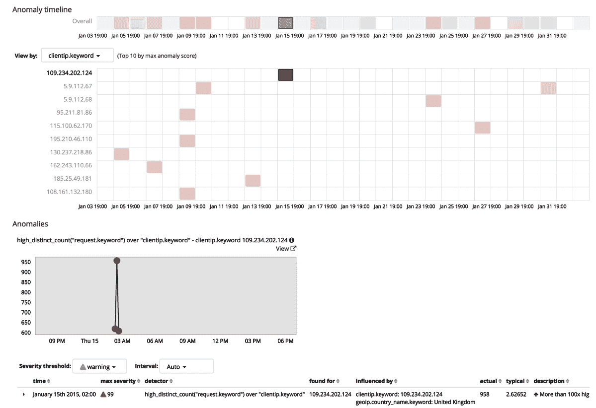

这个 IP ( `109.234.202.124`)对唯一的 URL 发出了数百个请求(而人类不会在相同的时间内发出那么多不同的请求)。如果您使用 Kibana 的 Discover 面板来查看 web 日志中的原始请求，并针对该 IP 地址进行过滤，就会发现该 IP 正在尝试针对不同 PHP 页面的各种请求，每次都会在查询字符串中传递一个看起来很奇怪的参数:

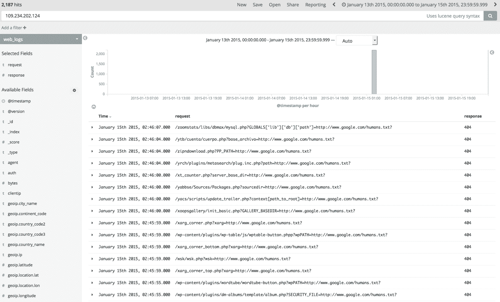

这种流量似乎是由希望在网站的 PHP 代码中找到漏洞的机器人驱动的。它盲目地测试各种可能众所周知的 PHP 文件名，传递一个已建立的文本文件(总是托管在 Google 上)的内容可能会向 bot 表明该 PHP 页面存在漏洞。如果发现，很可能会对该 PHP 页面采取一些恶意的后续操作。

<title>Detecting things that rarely occur</title>  

# 检测很少发生的事情

在时态信息流(如日志文件)的上下文中，统计上罕见的东西(出现频率低)的概念既直观又难以理解。例如，如果我被要求在一个日志文件中查找一条罕见的消息，我可能会试图将我看到的第一条新奇的消息标记为罕见消息。但是如果几乎所有的信息都是新奇的呢？都是稀有的吗？还是什么都不稀罕？

为了定义*稀有性*在一系列时间事件的背景下是有用的，我们需要同意宣布某样东西稀有必须考虑它存在的背景。如果有许多其他常规的东西和少量独特的东西，那么我们可以认为独特的东西是罕见的。如果有许多独特的东西，那么我们会认为没有什么是罕见的。

在 ML 作业中应用稀有函数时，需要声明稀有函数关注哪个字段。然后在“按字段名称”框中定义该字段。因此，例如，要查找引用罕见国家名称的日志条目，请按如下方式构建您的检测器:

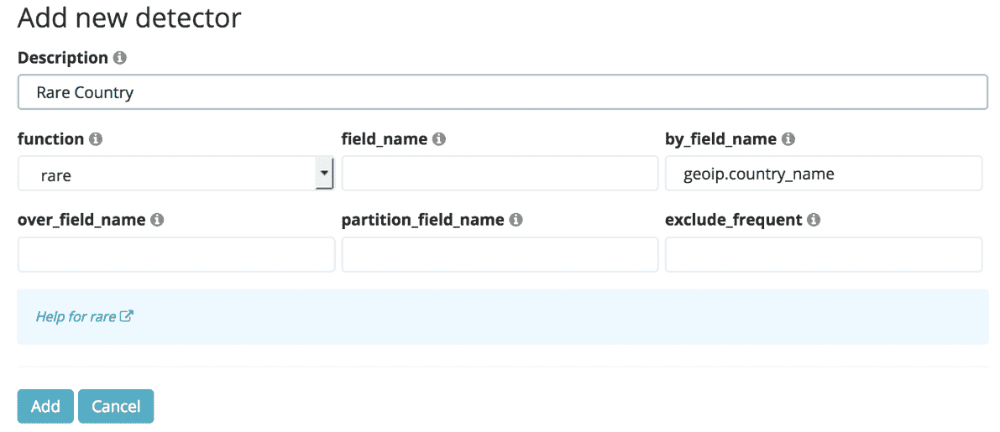

这可以方便地找到意想不到的地理访问(在*中，我们的管理员几乎每天都从纽约和伦敦办公室登录，但从来没有从莫斯科登录过！*)。

当查看稀有性分析的结果时(例如主机上运行的稀有进程名称)，您会看到异常浏览器的外观略有不同。更多详情可以参考[https://discuse . elastic . co/t/dec-4th-2018-en-ml-rarity-analysis-with-machine-learning/158979](https://discuss.elastic.co/t/dec-4th-2018-en-ml-rarity-analysis-with-machine-learning/158979)的链接。

<title>Counting message-based logs via categorization</title>  

# 通过分类统计基于消息的日志

如果您有基于消息但由机器生成的日志条目，那么在它们可用于异常检测之前，它们首先需要被组织成相似的消息类型。这个过程叫做分类，而弹性 ML 可以帮助这个过程。

<title>Types of messages that can be categorized by ML</title>  

# 可以通过 ML 分类的消息类型

在定义这里考虑的基于消息的日志行时，我们需要稍微严格一些。我们*没有*考虑的是完全自由形式的日志行/事件/文档，很可能是人类创造的结果(电子邮件、推文、评论等等)。这类信息在结构和内容上过于武断和多变。

相反，我们专注于机器生成的消息，这些消息显然是在应用程序遇到不同的情况或异常时发出的，因此将它们的构造和内容限制在一组相对离散的可能性中(要理解消息可能确实有一些可变的方面)。例如，让我们看看应用程序日志的以下几行:

```
18/05/2016 15:16:00 S ACME6 DB Not Updated [Master] Table 18/05/2016 15:16:00 S ACME6 REC Not INSERTED [DB TRAN] Table 18/05/2016 15:16:07 S ACME6 Using: 10.16.1.63!svc_prod#uid=demo;pwd=demo 18/05/2016 15:16:07 S ACME6 Opening Database = DRIVER={SQL Server};SERVER=10.16.1.63;network=dbmssocn;address=10.16.1.63,1433;DATABASE=svc_prod;uid=demo;pwd=demo;AnsiNPW=No 18/05/2016 15:16:29 S ACME6 DBMS ERROR : db=10.16.1.63!svc_prod#uid=demo;pwd=demo Err=-11 [Microsoft][ODBC SQL Server Driver][TCP/IP Sockets]General network error. Check your network documentation. 
```

在这里，我们可以看到有各种各样的消息，每个消息都有不同的文本，但这里有一些结构。在日期/时间戳和发出消息的服务器名称(这里是`ACME6`)之后，是消息的实际内容，应用程序在这里通知外界当时发生了什么——是正在尝试什么还是发生了错误。

<title>The categorization process</title>  

# 分类过程

为了给日志文件中无序的消息流带来一些秩序，Elastic ML 将使用一种技术，通过使用字符串相似性聚类算法将相似的消息分组在一起。该算法背后的启发大致如下:

*   更多地关注(英语)字典中的单词而不是可变的(即，*网络*和*地址*是字典中的单词，但`dbmssocn`很可能是可变的/可变的字符串)
*   通过字符串相似性算法(类似于 Levenshtein 距离)传递不可变字典单词，以确定测井曲线与过去测井曲线的相似程度
*   如果当前日志行和现有类别之间的差异很小，则将现有日志行归入该类别
*   否则，为当前日志行创建一个新类别

举个简单的例子，考虑这三条消息:

```
Error writing file "foo" on host "acme6"

Error writing file "bar" on host "acme5"

Opening database on host "acme7"
```

该算法将前两条消息聚集在同一类别中，因为它们将被视为`Error writing file on`类型的消息，而第三条消息将被赋予其自己的(新)类别。

这些类别的命名很简单:ML 称它们为`mlcategory N`，其中`N`是一个递增的整数。因此，在本例中，前两行将与`mlcategory 1`相关联，第三行将与`mlcategory 2`相关联。在真实的机器日志中，由于日志消息的多样性，可能会生成数千个(甚至数万个)类别，但是可能的类别集应该是有限的。但是，如果类别的数量开始达到几十万，那么很明显，日志消息不是一组受约束的可能消息类型，因此不适合进行这种类型的分析。

<title>Counting the categories</title>  

# 清点类别

既然消息将被前面描述的算法分类，下一步就是计数。在这种情况下，我们不会计算日志行(以及 Elasticsearch 索引的文档)本身；相反，我们将计算算法输出的不同类别的出现率。因此，例如，给定上一节中的示例日志行，如果它们出现在相同的时段范围内，我们将得到分类算法的以下输出:

```
mlcategory 1: 2 

mlcategory 2: 1 
```

换句话说，在最后一个时段跨度间隔中，`Error writing file on`类型的消息出现了两次，而`Opening database on host`类型的消息出现了一次。如下一节所示，正是这些信息将最终被建模并在 ML 作业发现异常时被确定。

<title>Putting it all together</title>  

# 把所有的放在一起

首先对基于消息的日志行进行分类，然后对其进行计数的两步过程是作为 ML 作业中的一个配置步骤来实现的。然而，ML 作业配置需要有两个关键部分:

*   将 categorization_field_name 定义为 Elasticsearch 文档中的字段，其中包含要由 ML 分类的文本
*   使用`mlcategory`字段作为检测机配置的一部分

请注意，`mlcategory`字段不是正在分析的原始数据的实际文档的一部分；它类似于脚本字段，仅当分类字段名称被定义为作业配置的一部分时才存在。

让我们来看看以下步骤:

1.  给定一组摄取到 Elasticsearch 中的示例日志行，如下所示(JSON 格式，仅显示相关字段):

```
        { 

          "@timestamp": "2016-02-08T15:21:06.000Z", 

          "message": "REC Not INSERTED [DB TRAN] Table", 

        } 

         { 

          "@timestamp": "2016-02-08T15:21:06.000Z", 

          "message": "Fail To Connect Database   ReActivate Application / Check Connection String", 

        } 

        { 

          "@timestamp": "2016-02-08T15:21:06.000Z", 

          "message": "Opening Database = DRIVER={SQL Server};SERVER=127.0.0.1;network=dbmssocn;address=127.0.0.1 1433;DATABASE=svc_prod;;Trusted_Connection=Yes;AnsiNPW=No", 

        } 

        { 

          "@timestamp": "2016-02-08T15:21:23.000Z", 

          "message": "REC Not INSERTED [DB TRAN] Table", 

        } 

        { 

          "@timestamp": "2016-02-02T07:36:00.000Z", 

          "message": "012 Head Office Link Active 127.0.0.1", 

        } 

        { 

          "@timestamp": "2016-02-02T10:52:00.000Z", 

          "message": "Transaction Match In DB / Duplicate Transaction", 

        } 
```

2.  我们将利用`message`字段作为高级作业中的分类字段名称:

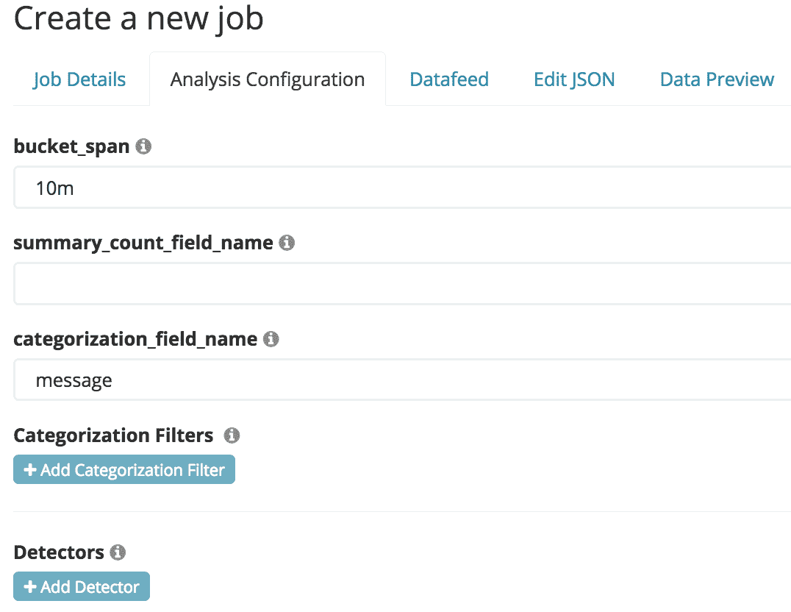

然后，在检测器配置中，我们可以使用`mlcategory`的 by_field_name 分割计数检测器:

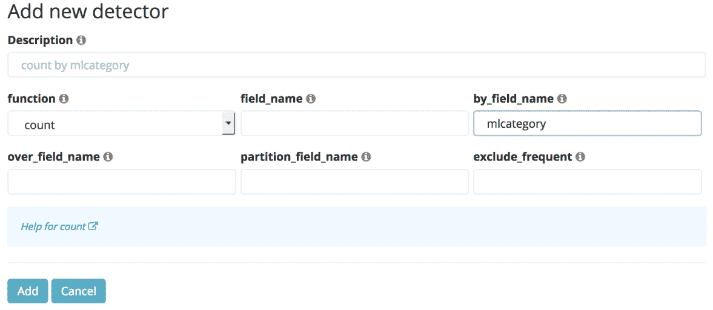

3.  最终结果是，ML 作业将使用这种动态分类来查找不寻常的文档拆分计数。输出可能如下图所示:

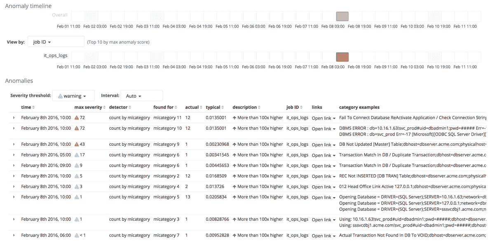

在这里，我们看到 ML 作业已经确定了在此时间段内出现次数增加的几类消息。与数据库问题(无法连接数据库、DBMS 错误等)相关的消息明显增多。

此外，请注意表中的“类别示例”列。在其中，ML 将向您显示(默认情况下)最多四个匹配并被归入该类别的示例日志消息。在某些情况下，只有一个例子(因为随后的消息完全相同)，而如果有多个，那么就会有细微的差别(比如主机名或 IP 地址)。这些样本的存储是 ML 存储日志消息副本的唯一时间，该日志消息是作为 ML 作业执行的一部分而被分析的。在所有其他情况下，只存储关于数据的汇总信息。

关于控制分类如何工作以及如何查看分类结果的参数的更多信息可以在位于[https://www . Elastic . co/guide/en/Elastic-stack-overview/current/ml-configuring-categories . html](https://www.elastic.co/guide/en/elastic-stack-overview/current/ml-configuring-categories.html)的 Elastic 网站的*文档*部分以及位于[https://www . Elastic . co/guide/en/Elastic search/reference/current/ml-Get-category . html](https://www.elastic.co/guide/en/elasticsearch/reference/current/ml-get-category.html)的 *Get categories API* 文档中找到。

<title>When not to use categorization</title>  

# 何时不使用分类

尽管分类非常有用，但它也有其局限性。具体来说，在以下一些情况下，尝试使用分类可能会返回较差的结果:

*   自由格式的文本字段，可能是由人类创建的。例子包括推文、评论、电子邮件和笔记。
*   实际上应该被解析成正确的名称/值对的日志行，例如 web 访问日志。
*   包含大量多行文本、XML 等的文档。

<title>Summary</title>  

# 摘要

我们已经看到，ML 可以突出日志行中的数量变化、多样性和唯一性，包括那些首先需要分类的内容。这些技术有助于解决我们在本章第一部分中描述的挑战，在这一部分中，人们必须既认识到内容的唯一性，又认识到每个原始日志消息出现的相对频率。

本章中学习的技能将在下一章[第 4 章](30e51bb2-df59-4ae5-943f-52c3a2e9682e.xhtml)、 *IT 运营分析和根本原因分析、*中有所帮助，在下一章中，我们将使用 ML 来帮助找到跨多个数据集的复杂问题的根本原因，包括日志文件和性能指标。分析肯定会包括检测异常发生的日志事件。