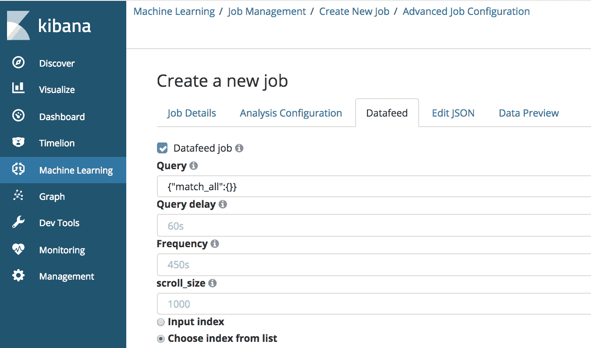
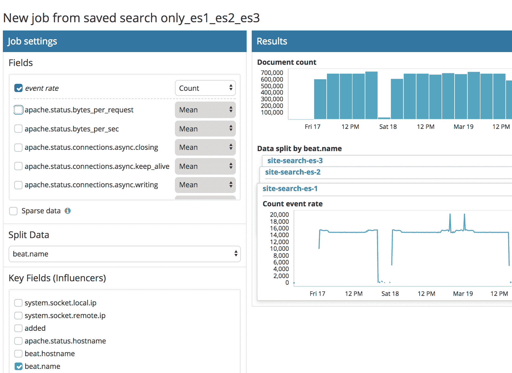
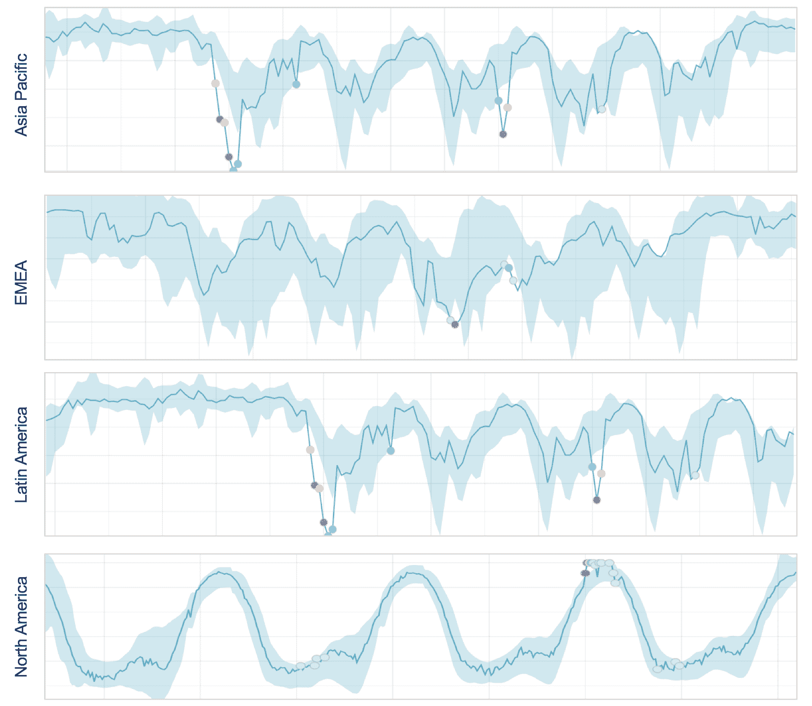
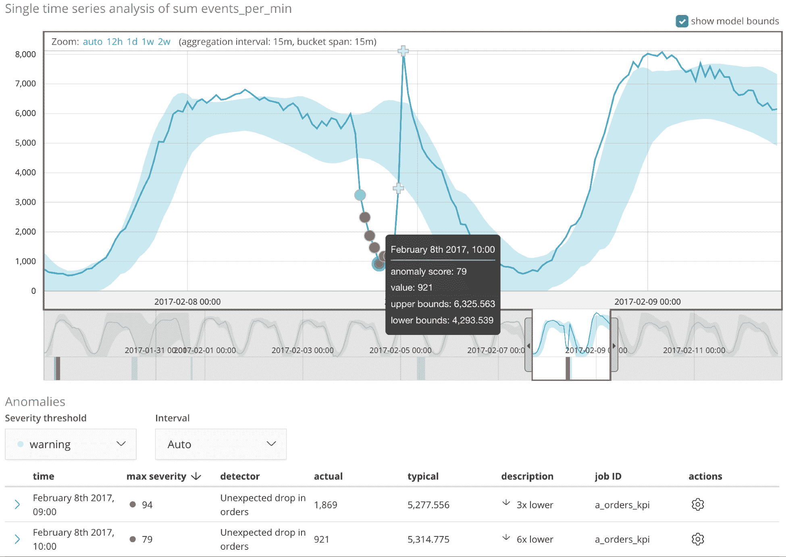
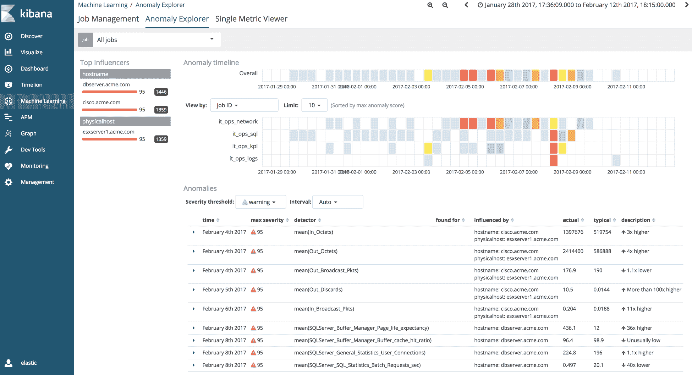
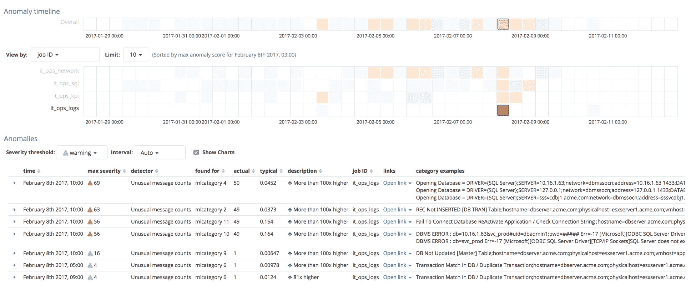
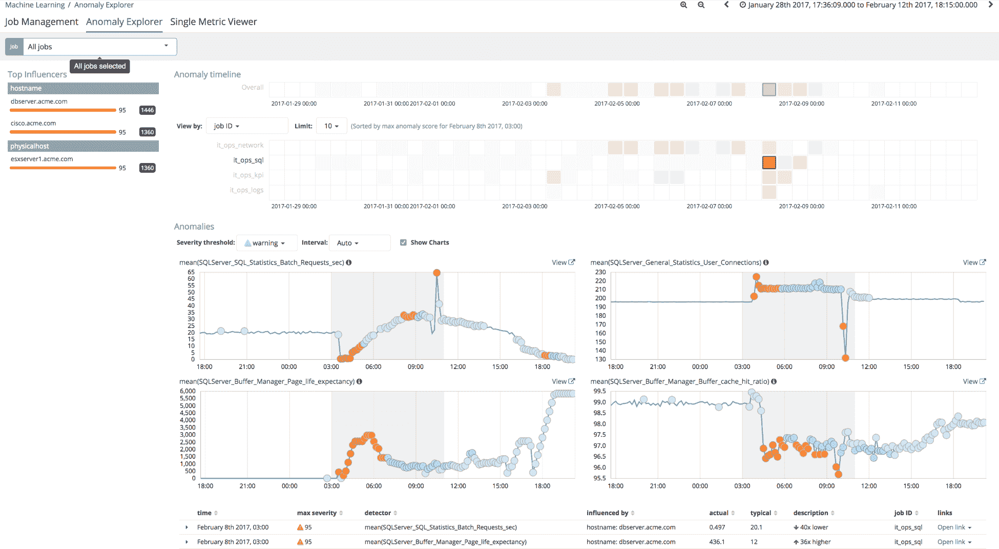
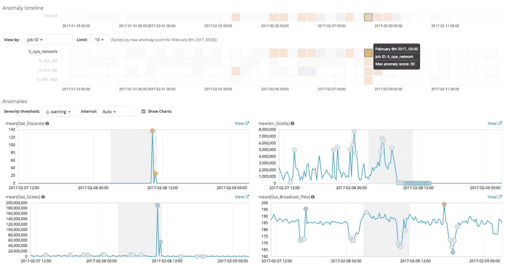

# 四、IT 运营分析和根本原因分析

到目前为止，我们已经广泛地解释了分别跨指标和日志检测异常的价值。这当然是非常有价值的。然而，在某些情况下，知道某个特定的指标或日志文件出错可能并不能说明事情的全部。例如，它可能指向症状，而不是问题的原因。为了更好地理解一个正在出现的问题的全部范围，从整体上看一个系统或情况的许多方面通常是有帮助的。这包括一起智能地分析多种相关数据集。

在本章中，我们将讨论以下主题:

*   了解**关键表现指标**(**KPI**)和其他支持指标的作用和重要性
*   学习组织、过滤和丰富数据以提供背景的方法
*   通过采用数据拆分和统计影响因素的 ML 作业利用上下文信息
*   将 ML 创建的异常合并到一个通用视图中，以实现更好的分类、协作和解决


# 整体应用可见性

IT 运营和 IT 安全组织正在收集大量数据。这些数据中的一些被收集和/或存储在专用工具中，但是一些可能被收集在通用数据平台中，例如 Elastic 栈。但问题依然存在:这些数据中有多大比例得到了关注？这里，我们指的是由人工主动检查的收集数据的百分比，或者由某种类型的自动化手段(基于规则、阈值等定义的警报)监视的收集数据的百分比。即使是慷慨的估计也可能把这个百分比放在一位数的范围内。因此，90%或更多的数据被收集到无人监管的地方，有什么被遗漏了呢？正确的答案可能是我们实际上不知道。

在我们指责 IT 组织收集大量数据，而不是*观看这些数据*的罪过之前，我们需要理解与这种操作相关的挑战的规模。典型的面向用户的应用可能会执行以下操作:

*   跨越数百台物理服务器
*   拥有数十个(如果不是数百个)微服务，每个微服务可能有数十个或数百个描述其操作的操作指标或日志条目

这种组合学可以很容易地上升到六或七位数范围的独特测量点。此外，在 IT 组织的管理下，可能有几十甚至几百个这样的应用。难怪这些系统每天收集的数据量可以很容易地用 TB 来衡量。

因此，直接采用主动覆盖所有(或至少大部分)数据的策略来获得整体应用可见性是非常令人畏惧的。您应该从哪里开始以及优先处理哪些数据不是一项简单的任务，但是它通常从关注应用的 KPI 开始。


# KPI 的重要性和局限性

由于规模问题以及在使收集的数据可操作方面取得一定进展的愿望，主动检查首先要解决的一些指标自然是性能或操作的最佳指标。IT 组织选择用于度量、跟踪和标记的 KPI 可以跨越多种指标，包括:

*   **客户**:影响应用响应时间或错误计数等指标
*   **可用性**:面向指标，如正常运行时间或**平均修复时间** ( **MTTR** )
*   **业务**:面向指标，如每分钟订单数、收入或活跃用户数

因此，这些类型的指标通常显示在大多数高级运营仪表板的前端和中央，或者显示在从技术人员到高管的员工报告上。在谷歌上快速搜索`KPI dashboard`，会返回无数图表、仪表、表盘、地图和其他赏心悦目的东西。

虽然这种只需扫一眼就能看到的信息显示具有巨大的价值，但手动检测仍然存在一些根本性的挑战:

*   **解释**:难以理解*正常*运行和*异常*运行之间的差异，除非这种差异已经被人类内在理解。
*   **规模挑战**:尽管 KPI 已经从所有指标中提炼出一组*重要的*指标，但考虑到仪表盘显示屏幕的实际面积，可能仍有更多的 KPI 需要显示。最终结果可能是拥挤的可视化或需要滚动/分页的冗长仪表板。
*   **缺乏主动性**:许多类似这样的仪表板没有将它们的指标与警报相关联，因此如果预先知道一个不稳定的 KPI 很重要，就需要持续的监督。

底线是 KPI 是识别和跟踪 IT 系统健康和行为的有意义指标的过程中极其重要的一步。然而，显而易见的是，仅仅用可视化范例来识别和跟踪一组 KPI 的行为将会在成功的 it 运营计划的策略中留下一些重大的缺陷。

为了有助于这一点，显而易见，KPI 是可以被 Elastic 的 ML 跟踪的度量的一个很好的候选。我们在[第 3 章](16a1d55a-08d3-47a7-afec-b433d9beecc6.xhtml)、*事件变化检测*中看到了一个这样的例子，数据如下:

```py
{ 

    "metrictype": "kpi", 

    "@timestamp": "2016-02-12T23:11:09.000Z", 

    "events_per_min": 22, 

    "@version": "1", 

    "type": "it_ops_kpi", 

    "metricname": "online_purchases", 

    "metricvalue": "22", 

    "kpi_indicator": "online_purchases" 

  } 
```

在这种情况下，`kpi`表示某个在线交易处理系统每分钟的总购买次数。我们还看到，随着时间的推移，使用 ML 跟踪该 KPI 非常容易，并且检测到在线销售额的意外下降(值为 921)并标记为异常:


我们还在[第 3 章](16a1d55a-08d3-47a7-afec-b433d9beecc6.xhtml)、*事件变化检测*中看到，如果数据中有另一个分类字段允许对其进行细分(例如，按产品 ID、产品类别、地理区域等进行销售)，那么 ML 可以轻松地沿该字段拆分分析，以并行方式扩展分析(在[第 6 章](7ba6aa9b-aaee-4a1e-91cb-8b062aeaa181.xhtml)、*ML 分析的警报*中，我们将看到如何轻松地将检测到的异常与主动警报联系起来)。但是，尽管如此，我们不要忘记我们正在完成的事情:对某个人可能关心的关键指标进行主动分析。每单位时间的在线销售额与收入直接相关，因此是一个显而易见的 KPI。

然而，尽管知道我们的 KPI 发生了一些不寻常的事情很重要，但是仍然不知道为什么会发生这种事情。支持这一面向客户的应用的后端系统之一是否存在操作问题？最新版本中是否存在用户界面编码错误，使得用户更难完成交易？依赖的第三方支付处理提供商有问题吗？这些问题都不能仅仅通过仔细检查 KPI 来回答。

为了获得这种洞察力，我们将需要扩大我们的分析，以包括其他相关和相关的信息。


# 超越 KPI

一般来说，选择 KPI 的过程应该相对容易，因为很明显哪些指标是最好的指标(如果在线销售下降，那么应用可能无法工作)。但是，如果我们想要更全面地了解可能导致运营问题的原因，我们必须将分析扩展到 KPI 以外的指标，这些指标来自支持应用的底层系统和技术。

幸运的是，有大量的工具允许收集各种类型的数据，以便集中在 Elastic 栈中。来自 Elastic 免费和开源工具组合的一些例子如下:

*   **Elastic Metricbeat** :一个易于使用的轻量级数据发送器，可以从系统中收集性能指标，并将它们转发给 Elasticsearch
*   **Elastic file Beat**:Beat 家族的另一个成员，它将来自任何应用或系统日志的日志行转发给 Elasticsearch
*   **Elastic** **应用性能监控** ( **APM** ):允许在代码级别对详细的应用性能指标进行检测和度量

不管您使用什么工具来收集底层应用和系统数据，有一件事可能是真的:当一切都结束时，将会有大量的数据。

请记住，我们的最终目标是主动全面地关注整个数据集的更大比例。要做到这一点，我们必须首先组织这些数据，以便我们可以用 ML 有效地分析它们。


# 数据结构

在我们能够有效地处理所有这些底层数据之前，我们需要智能地对其进行细分，尽可能地丰富它，并利用其中包含的上下文信息。首先，我们将重点放在细分和丰富。


# 有效的数据分割

仅仅通过从底层服务器/主机收集某些类型的数据(系统性能指标、日志文件等)，就可能已经有了按服务器/主机对数据进行的自然分段。让我们来看看 Metricbeat 的一个测量示例:

```py
{  
   "_index":"metricbeat-6.0.0-2018.01.01",
   "_type":"doc",
   "_id":"ZQtas2ABB_sNnq-vMrgR",
   "_score":1,
   "_source":{  
      "@timestamp":"2018-01-01T20:10:19.227Z",
      "system":{  
         "memory":{  
            "swap":{  
               "used":{  
                  "bytes":0,
                  "pct":0
               },
               "free":0,
               "total":0
            },
            "total":15464677376,
            "used":{  
               "bytes":9050693632,
               "pct":0.5852
            },
            "free":6158319616,
            "actual":{  
               "free":6413983744,
               "used":{  
                  "pct":0.5852,
                  "bytes":9050693632
               }
            }
         }
      },
      "metricset":{  
         "rtt":214,
         "module":"system",
         "name":"memory"
      },
      "beat":{  
         "name":"demo",
         "hostname":"demo",
         "version":"6.0.0"
      }
   }
}
```

在文档中，我们可以看到`beat.name`嵌套的对象字段(和/或`beat.hostname`，在本例中两者的值都是`demo`)。这是产生数据的系统的名称。默认情况下，来自 Metricbeat 所有实例的所有数据将被整理到一个单独的每日文档索引中，其名称类似于`metricbeat-6.0.0.2018-01.01`，其中日期是记录数据的特定日期。对于这种时间序列数据，基于时间的索引名称是 Elastic 栈中的一种常见做法，主要是因为基于特定的保留策略管理历史数据很容易(删除超过 X 天的数据是通过删除适当的索引来实现的)。

也许我们环境中的一些主机支持一种应用(即在线购物)，但其他主机支持不同的应用(即发票处理)。由于所有主机都将其 Metricbeat 数据报告到单个索引中，如果我们希望针对其中一个或两个应用报告和分析数据，那么仅根据索引进行分析显然是不合适的。而且，正如我们在前面关于设置 ML 作业的章节中所看到的，作业配置是非常以索引为中心的:您需要在配置的第一步指定要分析的数据的索引。

尽管这看起来像一个难题，但我们希望我们的分析以应用为中心，而我们的数据不是以应用为中心，我们有几个选择:

*   修改 ML 作业的基本查询，以便它过滤与感兴趣的应用相关联的主机的数据
*   在接收时修改数据，以将附加的上下文信息插入到每个文档中，这些信息稍后将用于过滤 ML 作业发出的查询

两者都需要定制 ML 作业对原始数据进行的数据查询。然而，第一个选项通常需要一个更复杂的查询，第二个选项需要使用类似 Logstash 的工具进行数据充实。我们来简单讨论一下每一个。


# ML 作业的自定义查询

虽然在配置除高级作业(或通过 API 配置作业)之外的任何内容时，用户会感觉有些模糊，但是用户确实可以完全控制对原始数据索引进行的查询，以提供给 ML 作业。这是 ML 作业配置的查询参数:



默认值是`{"match_all":{}}`(返回索引中的每条记录)，但是几乎所有有效的 Elasticsearch DSL 都支持过滤数据。在这个文本字段中自由组合 Elasticsearch DSL 有点容易出错。因此，更直观的方法是通过保存的搜索从 Kibana 进行搜索。

例如，假设我们有一个名为`operational-analytics-metricbeat-*`的索引模式，并且与我们要监控和分析的应用相关联的适当主机由三个服务器组成，即站点搜索 es1、站点搜索 es2 和站点搜索 es3。在 Kibana 的 Discover 选项中，我们可以构建一个过滤器，通过选择将`beat.name`过滤为索引中所有可用主机的子列表之一，来指定我们只想为这些主机选择数据:


创建过滤器后，Kibana 会将其应用于原始数据(现在，您可以看到返回的经过过滤的数据集变小了，包含 2100 万条记录，而不是原来的 72 M 条记录):


在幕后，这个过滤器在使用 Kibana UI 构建时，最终表现为以下形式的 Elasticsearch DSL:


基巴纳为我们做了这项工作。Kibana 还为我们提供了保存搜索的能力，这意味着我们可以命名它并在以后引用它。通过点击保存菜单项，我们可以给我们的搜索命名为`only_es1_es2_es3`:

现在搜索已保存，当我们创建 ML 作业时，我们可以选择此保存的搜索作为我们作业的基础:

```py
{ 

  "query": { 

    "bool": { 

      "should": [ 

        { 

          "match_phrase": { 

            "beat.name": "site-search-es-1" 

          } 

        }, 

        { 

          "match_phrase": { 

            "beat.name": "site-search-es-2" 

          } 

        }, 

        { 

          "match_phrase": { 

            "beat.name": "site-search-es-3" 

          } 

        } 

      ], 

      "minimum_should_match": 1 

    } 

  } 

} 
```

因此，我们的 ML 作业现在将只为这个特定应用感兴趣的主机运行。我们还可以看到，如果我们沿着`beat.name`字段分割数据，只有三个感兴趣的主机的数据会被 ML 作业分析，如右侧分割的可视化表示所示:





As such, our ML job will now only run for the hosts of interest for this specific application. We can also see that if we split the data along the `beat.name` field, that only the three hosts of interest will have their data analyzed by the ML job, as indicated by following the visual representation of the split on the right-hand side:

因此，我们能够有效地将数据分析限制和细分到我们定义为对该应用有贡献的主机。

摄取时的数据丰富

另一种选择是将关于哪些主机属于哪些应用的决策时间提前到接收时。一种方法是通过 Logstash 引导您的数据，并使用过滤器插件根据对资产列表(文件、数据库等)的查找向数据添加额外的字段。请参考位于[https://www . elastic . co/guide/en/Logstash/current/lookup-enrichment . html](https://www.elastic.co/guide/en/logstash/current/lookup-enrichment.html)的 log stash 文档，该文档向您展示了如何使用额外的字段动态丰富索引文档以提供上下文。


# 例如，您可以让 Logstash 添加一个`application_name`字段，并用适当的应用名称动态填充该字段的值，例如(这里是截断的 JSON):

或者，您可以执行以下操作:

一旦设置了该字段的值并将其插入到索引文档中，您就可以使用`application_name`字段，以及过滤 ML 作业查询的能力(如前所述),将您的数据分析限制在感兴趣的相关应用中。添加数据丰富步骤可能看起来更像是一项前期工作，但从长远来看，它应该会带来好处，因为随着资产名称的变化或发展，它会更容易维护，因为第一种方法需要将资产名称硬编码到 ML 作业的搜索中。

```py
   "host": "wasinv2.acme.com", 
   "application_name": "invoice_processing",
```

利用上下文信息

```py
   "host": "www3.acme.com", 
   "application_name": "online_purchases",
```

既然我们已经有效地组织了数据，并且可能用额外的信息丰富了我们的数据，我们应该充分利用它。实现这一点的两个主要方法是通过分析分割和统计影响因素。


# Leveraging the contextual information

分析拆分

我们已经看到，ML 作业可以基于任何分类字段进行拆分。因此，我们可以为该字段的每个实例单独建模行为。这非常有价值，尤其是在每个实例都需要自己单独的模型的情况下。


# 例如，我们有世界不同地区的数据:



Take, for example, the case where we have data for different regions of the world:

无论这是什么数据(销售 KPI、利用率指标等等)，很明显它都有非常独特的模式，每个地区都有。在这种情况下，为了利用这种独特性，将我们使用 ML 对每个区域进行的任何分析分开是有意义的。我们将能够检测出每个区域特有的行为异常。

让我们再想象一下，在每个地区，有一组服务器支持应用和事务处理，但是它们是负载平衡的，对性能/操作的贡献是相等的。这样，每个服务器对一个地区的贡献就没有什么独特之处了。因此，按服务器划分分析可能没有意义。

我们很自然地得出结论，按地区划分比按服务器划分更有效。但是，如果某个区域内的特定服务器出现问题，导致检测到异常，该怎么办呢？难道我们不想立即获得这些信息，而不是进一步手动诊断吗？这可以通过 ML 中的一个叫做影响者的实现来知道。

统计影响者

在 ML 作业配置中，可以将字段定义为影响者(有时也称为用户界面中的关键字段)。影响者的概念是描述一个实体的领域，您希望知道该实体对异常的存在负有责任，或者至少做出了重大贡献。请注意，任何被选作影响者候选的字段都不需要成为检测逻辑的一部分，尽管选择用作分裂的字段也成为影响者是很自然的。为了了解影响者是如何工作的，我们来讨论一个例子。


# 假设我们有描述一个家庭每月信用卡账单的商户金融交易的数据。该数据包括以下字段:

`timestamp`

`merchant`

*   `purchase_amount`
*   `location`
*   `user`(调用交易的人的名字)
*   请注意，在共享帐户的信用卡账单中不会跟踪实际的购买用户，但是为了示例的方便，我们假设这一点。
*   `user` (the name of the person who invokes the transaction)

Note that the actual purchasing user isn't tracked in a credit card bill for a shared account, but let's assume this for the sake of the example.

让我们也假设我们的愿望是找到*每个商家*异常高的购买量。因此，我们可能会创建一个 ML 作业，该作业通过 merchant 关注于`high_sum(purchase_amount)`(在这里，我们对`merchant`字段进行拆分分析)。在这种情况下，选择哪些领域作为影响者会很有意思？理想情况下，它们应该是以下几种:

因为这是分析被分割的领域，自然我们想知道哪个商人是最有影响力的

所有(或大部分)异常交易发生的具体地点是哪里？

*   什么人(如果有的话)调用了导致异常的大部分交易？
*   请注意，我们特意没有选择使用`purchase_amount`作为影响者的候选人。有希望的是，显然购买的数值更可能是随机的，并且购买量的任何特定值不可能占主导地位。
*   给定这三个影响因素的选择，现在让我们假设我们已经检测到当前账单周期在`Starbucks`花费了大量资金的异常情况。以下是这个虚构示例的部分异常记录:

关于如何查询异常结果指标以获得异常记录结果的信息，请参见[第六章](7ba6aa9b-aaee-4a1e-91cb-8b062aeaa181.xhtml)、*关于 ML 分析的警报*。

我们可以看到这个月花了 100 多美元，而通常只花了 10 美元。该怪谁呢？谁/什么是影响者？它们似乎如下:

```py
... 

          "timestamp": 1514764800000, 

          "partition_field_name": "merchant", 

          "partition_field_value": "Starbucks", 

          "function": "high_sum", 

          "function_description": "high_sum", 

          "typical": [ 

            10.21 

          ], 

          "actual": [ 

            104.52 

          ], 

          "field_name": "purchase_amount", 

          "influencers": [ 

            { 

              "influencer_field_name": "merchant", 

              "influencer_field_values": [ 

                "Starbucks" 

              ] 

            }, 

            { 

              "influencer_field_name": "user", 

              "influencer_field_values": [ 

                "Rich" 

              ] 

            } 

          ], 

... 
```

`merchant=Starbucks`:同样，这一点很明显，因为这就是分析的拆分方式。说星巴克是这种异常的影响者有点同义反复，因为这种异常已经是商家的了`Starbucks`。

`user=Rich`:在这种情况下，`Starbucks`的大部分事务被`Rich`调用。其他家庭成员也可能在这个月从`Starbucks`购买了物品，但是 Rich 的交易在我们分析的特征中占主导地位，即花费的金额。

*   在我们虚构的例子中，地点并没有成为一个影响因素。这是因为 Rich 在`Starbucks`的交易发生在整个月的许多不同地点，这是由于他频繁的商务旅行。因此，没有一个地点的交易占主导地位。因此，位置不会作为影响因素出现，也不会在结果中列出。
*   总而言之，三个候选领域中的两个被确定为影响者。尽管`location`在这个场景中不是一个有影响力的人，选择`location`作为候选人仍然是有意义的，并且可能对其他一些未来的异常有用。
*   理解发现潜在影响者的过程发生在 ML 发现异常之后也很关键。换句话说，它不影响作为检测一部分的任何概率计算。一旦确定异常，ML 将系统地检查每个候选影响者字段的所有实例，并移除该实例对该时段中的数据的贡献。如果一旦删除，剩余的数据不再异常，那么通过反事实推理，该实例的贡献一定是有影响的，并被相应地评分(结果中有一个`influencer_score`)。

To summarize, two out of the three fields that were candidates for being influencers were identified as being influencers. Despite `location` not being an influencer in this scenario, the choice of `location` as a candidate still makes sense and may be useful on some other future anomaly.

更重要的是，这是我们在查看不仅仅是单个 ML 工作的结果，而是潜在的几个相关工作的结果时，如何利用这些影响者。让我们继续讨论分组和一起查看作业的过程，以帮助进行根本原因分析。

将所有信息汇集在一起，进行根本原因分析

我们现在正处于可以讨论如何将一切整合在一起的时刻。为了提高我们在 IT 运营方面的效率，并更全面地了解应用的运行状况，我们现在需要实现我们在前面章节中准备的内容，并相应地配置我们的 ML 工作。为此，让我们来看一个真实的场景，在这个场景中，ML 帮助我们找到了操作问题的根本原因。


# 断电背景

这个场景大致基于一个真实的应用中断，尽管数据经过了某种程度的简化和清理，以混淆原始用户。问题出在处理礼品卡交易的零售应用上。偶尔，应用会停止工作，交易无法处理。只有当个别商店打电话到总部投诉时，才会发现这一点。问题的根本原因未知，客户也不容易确定。因为他们从未找到根本原因，并且因为问题可以通过简单地重启应用服务器来修复，所以问题会随机地再次出现并困扰他们几个月。


# 以下数据已收集并包含在分析中，以帮助理解问题的根源。这些数据包括以下内容:

交易量的汇总(1 分钟)计数(主要 KPI)

来自交易处理引擎的应用日志(基于半结构化文本的消息)

*   来自支持事务处理引擎的数据库的 SQL Server 性能指标
*   事务处理引擎运行的网络的网络利用率性能指标
*   SQL Server performance metrics from the database that backed the transaction processing engine
*   Network utilization performance metrics from the network the transaction processing engine operates on

因此，针对数据配置了四个 ML 作业。它们如下:

`it_ops_kpi`:使用`low_sum`统计每分钟处理的交易数量

`it_ops_logs`:使用`mlcategory`检测器的`count`来根据类型统计日志消息的数量，但是使用基于 ML 的动态分类来描述不同的消息类型

*   `it_ops_sql`:索引中每个 SQL Server 指标的简单平均值分析
*   `it_ops_network`:指标中每个网络性能指标的简单均值分析
*   当应用中出现问题时，这四个作业是在数据上配置和运行的。发现了异常，尤其是在跟踪正在处理的事务数量的 KPI 中。事实上，这与我们在本章开始时看到的 KPI 相同，其中订单处理的意外下降是出现问题的主要指标:
*   

然而，直到这个 KPI 的异常与查看底层技术和基础架构中的数据的其他三个 ML 作业中的异常相关联时，根本原因才被理解。让我们看看视觉关联和共享影响者的力量是如何发现潜在原因的。

视觉关联和共享影响因素

除了事务处理 KPI 中的异常(其中发生了意外下降)，其他三个 ML 作业(网络指标、应用日志和 SQL 数据库指标)在异常浏览器中的同一时间范围内重叠。下面的屏幕截图显示了这样做的结果:

However, the root cause wasn't understood until this KPI's anomaly was correlated with the anomalies in the other three ML jobs that were looking at the data in the underlying technology and infrastructure. Let's see how the power of visual correlation and shared influencers allowed the underlying cause to be discovered.


# 请注意，在 KPI 于 2017 年 2 月 8 日出现问题期间，其他三项作业也显示了相关异常(请参见所有四项作业中带注释的红色圆圈中的垂直条纹显著异常)。经过更仔细的检查(通过点击`it_ops_sql`作业的红色方块)，您可以看到几个 SQL Server 指标同时出现问题:

请注意，缩略图图表的灰色阴影区域突出显示了与前面泳道中所选红色区域的宽度相关的时间窗口。这个时间窗口可能大于分析的时段跨度(这里就是这种情况)，因此灰色阴影区域可能包含该时间范围内的许多单独异常。



如果我们查看应用日志的 ML 作业中的异常，就会发现大量错误都引用了数据库(进一步证实了不稳定的 SQL Server):





然而，有趣的事情也发生在网络上:



具体来说，网络流量中有一个很大的峰值(由 Out_Octets 度量显示)，在网络接口丢弃的数据包中有一个很大的峰值(由 Out_Discards 度量显示)。

在这一点上，很明显，这个网络峰值可能与数据库问题有关。而且，虽然相关性并不总是因果关系，但它足以吸引运营团队回顾以前停机的一些历史数据。在每一次中断中，这种大的网络峰值和数据包丢失模式也存在。

网络高峰的最终原因是 VMware 将虚拟机移动到新的 ESX 服务器的行为。有人错误配置了网络交换机，VMware 通过应用 VLAN 而不是管理 VLAN 发送了这一大堆流量。当这种情况发生时(当然是随机的)，事务处理应用会暂时失去与数据库的连接，并尝试重新连接。但是，这个重新连接代码有一个严重的缺陷，它不会尝试重新连接到属于 SQL Server 的远程 IP 地址上的数据库。相反，它尝试重新连接到`localhost` (IP 地址 127.0.01)，当然，这里没有这样的数据库。这个 bug 的线索可以在 ML 在 examples 列中显示的一个示例日志行中找到(在下面的屏幕截图中圈出):


一旦出现问题，只有应用服务器完全重启，重新读取启动配置文件，并重新获取 SQL Server 的 IP 地址，才能连接到 SQL Server。这就是为什么完全重启总能解决问题。

需要注意的一件关键事情是，UI 中的影响者也有助于缩小*谁对异常*负有责任的范围:


在仪表板中选定的时间范围内，排名靠前的评分影响因素列在左侧的排名靠前的影响因素部分中。对于每个影响者，将显示最大影响者分数(在任何时段中)，以及控制面板时间范围内的总影响者分数(在所有时段中求和)。此外，如果多个职位一起显示，那么这些职位中常见的影响者的总和会更高，从而提高他们的排名。

这是非常关键的一点，因为现在很容易看到不同工作中违规实体的共性。如果`esxserver1.acme.com`是查看多个作业时作为影响者出现的唯一物理主机，那么我们立即知道应该关注哪台机器；我们知道这不是一个普遍的问题。


The top scoring influencers over the time span selected in the dashboard are listed in the Top Influencers section on the left. For each influencer, the maximum influencer score (in any bucket) is displayed, together with the total influencer score over the dashboard time range (summed across all buckets). And, if multiple jobs are being displayed together, then those influencers that are common across jobs have higher sums, thus pushing their ranking higher.

摘要

ML 当然可以增加 IT 组织*关注*的数据量，从而从他们的数据中获得更多的洞察力和前瞻性价值。跨数据类型组织、关联和整体查看相关异常的能力对于问题隔离和根本原因识别至关重要。它减少了应用停机时间，并限制了问题再次出现的可能性。

在下一章[第 5 章](d83c0a94-7b17-4824-9ead-a374df317bac.xhtml)、*采用 Elastic 机器学习的安全分析*中，我们将看到 ML 如何通过允许我们提取出可能是妥协或恶意迹象的不良行为和异常活动，来使那些更加关注安全运营的人受益。


# Summary

ML can certainly boost the amount of data that IT organizations *pay attention to*, and thus get more insight and proactive value out of their data. The ability to organize, correlate, and holistically view related anomalies across data types is critical to problem isolation and root cause identification. It reduces application downtime and limits the possibility of problem recurrence.

在下一章[第 5 章](d83c0a94-7b17-4824-9ead-a374df317bac.xhtml)、*采用 Elastic 机器学习的安全分析*中，我们将看到 ML 如何通过允许我们提取出可能是妥协或恶意迹象的不良行为和异常活动，来使那些更加关注安全运营的人受益。