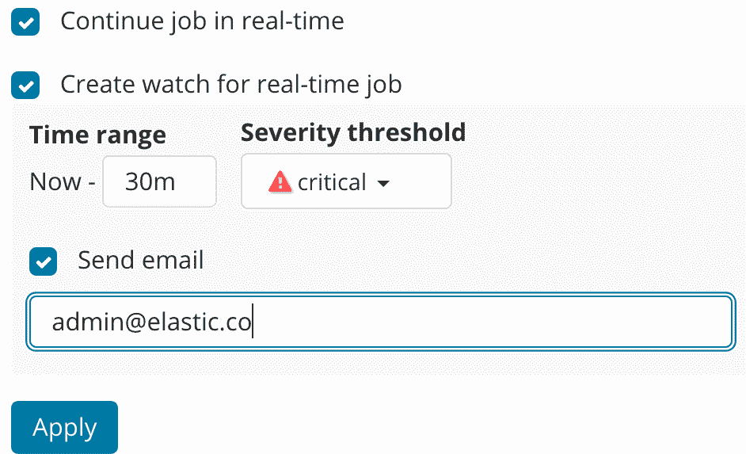
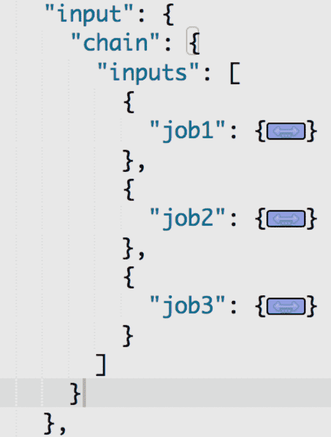

# 六、ML 分析警报

在本书中，我们已经看到，ML 非常强大、灵活，对于确定和突出大规模数据集中存在的意外事件和实体非常有用。然而，该技术的真正价值通常是它能够近乎实时地发现这些见解，从而使这些见解变得主动和可行。在这一章中，我们将讨论如何有效地集成 ML 和 Alerting(即 Watcher)。为此，我们将讨论以下主题:

*   了解 ML 的结果是如何发布到结果索引中的
*   查看 ML 作业的默认监视是如何工作的
*   了解如何为高级功能创建自定义手表

然而，本章并不是对警报(观察器)的全面概述。要了解有关观察器及其功能的更多信息，请参考位于[https://www . elastic . co/guide/en/elastic-stack-overview/current/xpack-Alerting . html](https://www.elastic.co/guide/en/elastic-stack-overview/current/xpack-alerting.html)的警报文档。


# 结果展示

在我们详细了解结果存储在哪里以及它们在文档级别看起来是什么样之前，我们需要理解 ML 作业的结果是在三个不同的抽象级别上呈现的:

*   **时段级别**:该级别总结了每个时段 ML 作业的整体结果。从本质上来说，它代表了在给定作业配置的情况下，该时间段有多不寻常。如果您的工作有多个检测器，或者分析中的拆分可能同时导致许多实体的结果，那么每个桶级别的结果都是所有这些事情的聚合表示。
*   **记录级别**:这是一个时段内每一个异常事件或异常实体的最详细信息。同样，根据作业配置(多个检测器、拆分等)，每个时段可能有许多记录级文档。
*   **影响者级别**:这用于更好地理解一段时间内最不寻常的实体(影响者)。

一般来说，正如我们将在本章后面给出的示例中看到的，利用这些不同的抽象级别对于不同类型的警报(如摘要警报、详细警报等)非常有用。

获得对结果的实际访问意味着必须实现两种方法之一:

*   使用 ML `/results` API
*   查询 ML 在 Elasticsearch 中创建的结果索引

选择哪种方法取决于用户。一般来说，直接查询结果索引比使用结果 API 提供了更大的灵活性，也更常见，因此我们将把讨论重点放在理解结果索引和其中不同种类的文档上。


# 结果索引

正如我们前面提到的，ML 分析数据并将结果汇总到一个结果索引中。默认情况下，该索引称为`.ml-anomalies-shared`，除非在使用 API 时，通过勾选配置**用户界面** ( **UI** )中的复选框或通过设置`results_index_name`字段，将作业配置为使用专用索引。如果是这种情况，那么结果索引将被称为`.ml-anomalies-custom-myname`，其中`myname`或者是使用 API 时`results_index_name`字段的声明值，或者是使用 UI 时作业本身的名称。在这两种情况下，与用于 ML 分析的数据大小相比，结果索引可能非常小。此外，还为`.ml-anomalies-jobname`表单创建了一个索引别名，其中`jobname`是作业的名称。这个别名的定义可以通过点击下面的 API 调用来查看:

```
GET ml-anomalies-*/_alias
```

结果将包括如下所示的条目:

```
      ".ml-anomalies-farequote": {
        "filter": {
          "term": {
            "job_id": {
              "value": "farequote",
              "boost": 1
            }
          }
        }
      },
```

这里，`farequote`是 ML 作业的名称。很明显，别名的目的是通过`term`过滤器只显示特定`job_id`的结果。否则，查询`.ml-anomalies-shared`索引(或者更贪婪的`.ml-anomalies-*`索引模式)将返回许多作业的记录。如果用户只想查询一个 ML 作业的结果，则由用户决定是使用这个索引别名，还是在适当的`job_id`上进行自己的术语过滤。

在结果索引中，有各种不同的文档，每一个都有自己的警报用途。我们将要讨论的是与我们之前讨论的三个抽象层次直接相关的那些。它们被恰当地命名如下:

*   `result_type:bucket`:给出桶级结果
*   `result_type:record`:给出记录级结果
*   `result_type:influencer`:给出影响者级别的结果

这些文档类型的分布将取决于 ML 作业配置和正在分析的数据集的特征。这些文档类型使用以下启发式规则编写:

*   `result_type:bucket`:每一个时段都有一个文档。换句话说，如果 bucket span 是`15m`，那么每 15 分钟就会有一个这种类型的文档被写入。它的时间戳将等于桶的前沿。例如，对于包含 11:30 和 11:45 之间的时间段，这种类型的结果文档将具有 11:30 的时间戳。
*   `result_type:record`:在一个时间段内，每次发生异常，都会记录一个文档。因此，对于包含许多实体(IP 地址、主机名等)的大数据集，在重大异常事件或大范围停机期间，特定时段可能会有数百甚至数千条异常记录。该文档还将具有与桶的前沿相等的时间戳。
*   `result_type:influencer`:为每个异常记录找到的每个影响者编写一个文档。因为对于每个异常记录，可能会发现不止一种影响者类型，所以这种类型的文档可能比记录结果更庞大。这个文档还将有一个等于桶的前沿的时间戳。

理解这一点对警报如此重要的原因是，在警报细节(通常，越多越好)和单位时间内单个警报的数量(通常，越少越好)之间必然会有一个平衡。当我们开始编写实际的警报时，我们将再次讨论这个问题。


# 存储桶结果

在最高层的抽象是桶级别的结果。本质上，这是整个作业作为时间函数的汇总结果，并且本质上回答了“这段时间有多不寻常？”为了理解桶级结果的结构和内容，让我们查询特定 ML 作业的结果。我们将从查看一个简单、单一指标作业的结果开始，该作业没有已定义的影响因素:

```
GET .ml-anomalies-*/_search
{
    "query": {
            "bool": {
              "filter": [
                  { "range" : { "timestamp" : { "gte": "now-2y" } } },
                  { "term" :  { "job_id" : "farequote_single" } },
                  { "term" :  { "result_type" : "bucket" } },
                  { "range" : { "anomaly_score" : {"gte" : "90"}}}
              ]
            }
    }
}
```

在这里，查询要求在过去两年中存在的任何存储桶结果，其中`anomaly_score`大于或等于`90`。结果如下所示:

```
{
  …
  "hits": {
    "total": 1,
    "max_score": 0,
    "hits": [
      {
        "_index": ".ml-anomalies-shared",
        "_type": "doc",
        "_id": "farequote_single_bucket_1486656600000_600",
        "_score": 0,
        "_source": {
          "job_id": "farequote_single",
          "timestamp": 1486656600000,
          "anomaly_score": 90.67726,
          "bucket_span": 600,
          "initial_anomaly_score": 85.04854039170988,
          "event_count": 277,
          "is_interim": false,
          "bucket_influencers": [
            {
              "job_id": "farequote_single",
              "result_type": "bucket_influencer",
              "influencer_field_name": "bucket_time",
              "initial_anomaly_score": 85.04854039170988,
              "anomaly_score": 90.67726,
              "raw_anomaly_score": 13.99180406849176,
             "probability": 6.362276028576088e-17,
              "timestamp": 1486656600000,
              "bucket_span": 600,
              "is_interim": false
            }
          ],
          "processing_time_ms": 7,
          "result_type": "bucket"
        }
      }
    ]
  }
}
```

您可以看到，只返回了一条结果记录，一个异常时段(在时间戳`1486656600000`，或者在我的时区，2017 年 2 月 9 日星期四上午 11:10:00 GMT-05:00)的`anomaly_score`大于`90`。换句话说，在这个时间范围内，没有其他时段出现如此大的异常。让我们来看看输出的一些关键部分，以充分理解它告诉我们什么:

*   `timestamp`:时段前沿的时间戳(历元格式)。
*   `anomaly_score`:该时段的当前标准化分数，基于整个作业中出现的概率范围。随着作业处理新数据和发现新异常，该分值可能会随时间波动。
*   `initial_anomaly_score`:该时段的标准化分数，即该时段首次被分析时的分数。与`anomaly_score`不同，这个分数不会随着更多数据的分析而改变。
*   `event_count`:在时段跨度内，ML 算法看到的原始 Elasticsearch 文档的数量。
*   `is_interim`:表示桶是否完成或者桶是否仍在等待接收桶跨度内的所有数据的标志。此字段与实时运行的正在进行的作业相关。对于某些类型的分析，可能会有临时结果，尽管并没有看到该时段的所有数据。
*   `bucket_influencers`:针对当前时段确定的影响者(及其详细信息)的数组。即使没有选择影响者作为工作配置的一部分，或者没有影响者作为分析的一部分，也总是会有一个默认的`influencer_field_name:bucket_time`类型的影响者，它通常是一个内部记录保存设备，以便在无法确定显式影响者的情况下对桶级异常进行排序。

如果一项工作确实有已命名和已确定的影响者，那么`bucket_influencers`数组可能如下所示:

```
          "bucket_influencers": [
            {
              "job_id": "farequote",
              "result_type": "bucket_influencer",
              "influencer_field_name": "airline",
              "initial_anomaly_score": 85.06429298617539,
              "anomaly_score": 99.7634,
              "raw_anomaly_score": 15.040566947916583,
              "probability": 6.5926436244031685e-18,
              "timestamp": 1486656000000,
              "bucket_span": 900,
              "is_interim": false
            },
            {
              "job_id": "farequote",
              "result_type": "bucket_influencer",
              "influencer_field_name": "bucket_time",
              "initial_anomaly_score": 85.06429298617539,
              "anomaly_score": 99.76353,
              "raw_anomaly_score": 15.040566947916583,
              "probability": 6.5926436244031685e-18,
              "timestamp": 1486656000000,
              "bucket_span": 900,
              "is_interim": false
            }
          ],
```

请注意，除了默认的`influencer_field_name:bucket_time`类型的条目之外，在本例中，对于`airline`字段，还有一个由分析确定的影响者的字段名条目。这是一个线索，表明`airline`是在这个异常时发现的相关影响者类型。由于在职务配置中可以选择多个影响者候选人，因此应该注意，在这种情况下，`airline`是唯一的影响者字段，没有发现其他字段有影响。还应该注意的是，在这个细节层次上，没有公开`airline`的特定实例(即哪一个)；这些信息将在较低抽象级别的查询中公开，我们将在接下来讨论。

现在我们已经了解了存储桶级别的详细信息，我们可以看看如何利用这些信息来生成摘要警报。我们将在本章的后面讨论这一点。


# 记录结果

在较低的抽象层次上，在记录层次上有结果。记录结果给出了最多的细节，显示了异常的具体实例，并且基本上回答了“什么实体异常以及异常程度如何？”为了理解记录级结果的结构和内容，让我们查询特定 ML 作业的结果。我们将从查看以下结果开始，这些结果是针对一个简单的单一指标作业的，没有定义影响因素:

```
GET .ml-anomalies-*/_search
{
    "query": {
            "bool": {
              "filter": [
                  { "range" : { "timestamp" : { "gte": "now-2y" } } },
                  { "term" :  { "job_id" : "farequote_single" } },
                  { "term" :  { "result_type" : "record" } },
                  { "range" : { "record_score" : {"gte" : "90"}}}
              ]
            }
    }
}
```

这里，查询要求任何在过去两年中存在的记录结果，其中`record_score`大于或等于`90`。结果如下所示:

```
{
  …
  "hits": {
    "total": 1,
    "max_score": 0,
   "hits": {
   "total": 1,
    "max_score": 0,
    "hits": [
      {
        "_index": ".ml-anomalies-shared",
        "_type": "doc",
        "_id": "farequote_single_record_1486656600000_600_0_29791_0",
        "_score": 0,
        "_source": {
          "job_id": "farequote_single",
          "result_type": "record",
          "probability": 3.3099524615371287e-20,
          "record_score": 90.67726,
          "initial_record_score": 85.04854039170988,
          "bucket_span": 600,
          "detector_index": 0,
          "is_interim": false,
          "timestamp": 1486656600000,
          "function": "count",
          "function_description": "count",
          "typical": [
            120.30986417315765
          ],
          "actual": [
            277
          ]
        }
      }
    ]
  }
}
```

让我们看看输出的一些关键部分:

*   `timestamp`:发生异常的时段前沿的时间戳。
*   `record_score`:异常记录的当前标准化分数，基于整个作业中出现的概率范围。随着作业处理新数据和发现新异常，该分值可能会随时间波动。
*   `initial_record_score`:异常记录的标准化分数，即分析首次分析该时段的时间。与`record_score`不同，该分数不会随着更多数据的分析而改变。
*   `detector_index`:内部计数器，用于跟踪该异常属于哪个检测器配置。显然，对于单检测器作业，该值将为零，但在具有多个检测器的作业中，该值可能非零。
*   `function`:跟踪哪个`detector`函数被用于创建该异常的参考。
*   `is_interim`:一个标志，表示存储桶是否完成，或者存储桶是否仍在等待接收存储桶跨度内的所有数据。此字段与实时运行的正在进行的作业相关。对于某些类型的分析，可能会有临时结果，尽管并没有看到该时段的所有数据。
*   `actual`:该桶中分析数据的实际观察值。例如，如果函数是`count`，那么这表示在这个时间段中遇到(和计数)的文档的数量。
*   `typical`:基于该数据集的 ML 模型的预期或预测值的表示。

如果工作定义了拆分(使用`by_field_name`和/或`partition_field_name`)并确定了影响者，则记录结果文档将包含更多信息:

```
…
          "timestamp": 1486656000000,
          "partition_field_name": "airline",
          "partition_field_value": "AAL",
          "function": "count",
          "function_description": "count",
          "typical": [
            17.853294505163284
          ],
          "actual": [
            54
          ],
          "influencers": [
            {
              "influencer_field_name": "airline",
              "influencer_field_values": [
                "AAL"
              ]
            }
          ],
          "airline": [
            "AAL"
          ]
        } …
```

在这里，我们不仅可以看到添加了`partition_field_name`和`partition_field_value`字段(如果使用了`by_field`的话，它们应该是`by_field_name`和`by_field_value`)，而且我们还可以看到为`partition_field_name` ( `airline`)构造了一个数组，其中的一个值位于被发现是异常的字段的单个实例中。此外，与存储桶结果一样，还有一个`influencers`数组，其中明确说明了哪些影响因素(以及这些影响因素的值)与此异常记录相关。

在某些示例中，结果文档中的某些信息似乎是多余的，尤其是在作业中定义的唯一影响者与您分割分析的字段相同的情况下。虽然这是推荐的做法，但它会导致输出记录结果似乎包含多余的信息。如果你的工作配置中定义了更多有影响力的候选人，事情会看起来更有趣(也不那么多余)。

如果您的工作是进行人口分析(通过使用`over_field_name`)，那么记录结果文档的组织方式将略有不同，因为报告是针对人口中的异常成员进行的。例如，假设我们有一个分析 Apache web 日志的示例作业，配置如下:

```
…
"analysis_config": {
    "bucket_span": "15m",
    "detectors": [
      {
        "detector_description": "count by status over clientip",
        "function": "count",
        "by_field_name": "status",
        "over_field_name": "clientip",
        "detector_index": 0
      }
    ],
    "influencers": [
      "clientip",
      "status",
      "uri"
    ]
  },
…
```

这里，一个异常记录的例子可能是这样的:

```
…
      {
        "_index": ".ml-anomalies-shared",
        "_type": "doc",
        "_id": "gallery_record_1487223000000_900_0_-628922254_13",
        "_score": 0,
        "_source": {
          "job_id": "gallery",
          "result_type": "record",
          "probability": 4.593248987780696e-31,
          "record_score": 99.71500910125427,
          "initial_record_score": 99.71500910125427,
          "bucket_span": 900,
          "detector_index": 0,
          "is_interim": false,
          "timestamp": 1487223000000,
          "by_field_name": "status",
          "function": "count",
          "function_description": "count",
          "over_field_name": "clientip",
          "over_field_value": "173.203.78.60",
          "causes": [
            {
              "probability": 4.593248987780688e-31,
              "by_field_name": "status",
              "by_field_value": "404",
              "function": "count",
              "function_description": "count",
              "typical": [
                1.1177332137173952
              ],
              "actual": [
                1215
              ],
              "over_field_name": "clientip",
              "over_field_value": "173.203.78.60"
            }
          ],
          "influencers": [
            {
              "influencer_field_name": "uri",
              "influencer_field_values": [
                "/wp-login.php"
              ]
            },
            {
              "influencer_field_name": "status",
              "influencer_field_values": [
                "404"
              ]
            },
            {
              "influencer_field_name": "clientip",
              "influencer_field_values": [
                "173.203.78.60"
              ]
            }
          ],
          "clientip": [
            "173.203.78.60"
          ],
          "uri": [
            "/wp-login.php"
          ],
          "status": [
            "404"
          ]
        }
      },…
```

这个例子与我们在[第 3 章](16a1d55a-08d3-47a7-afec-b433d9beecc6.xhtml)、*事件变化检测*中看到的针对一个不存在的 WordPress 登录页面的暴力认证尝试相同。

请注意，首先，主要方向是围绕`over_field`(在本例中，是访问网站的客户端的 IP 地址)，一旦发现异常 IP，就会构建一个`causes`数组来简洁地表示该 IP 在该桶中所做的所有异常事情。同样，许多事情看起来是多余的，但这主要是因为这些不同的记录信息的方式更容易汇总。在 Kibana 的用户界面中以不同的方式显示这些信息也更容易。也就是说，我们将会看到，访问这些详细信息意味着我们可以发出非常详细的警报。


# 影响者结果

另一个观察结果的角度是通过影响者。以这种方式查看结果允许我们回答问题“在我的 ML 工作中最不寻常的实体是什么，它们什么时候不寻常？”为了理解影响者级别结果的结构和内容，让我们查询特定 ML 作业的结果。我们将从查看分区字段上作业拆分的结果开始。该字段也将是在职务配置中选择的唯一影响因素:

```
GET .ml-anomalies-*/_search
{
    "query": {
            "bool": {
              "filter": [
                  { "range" : { "timestamp" : { "gte": "now-2y" } } },
                  { "term" :  { "job_id" : "farequote" } },
                  { "term" :  { "result_type" : "influencer" } },
                  { "range" : { "influencer_score" : {"gte" : "98"}}}
              ]
            }
    }
}
```

这里，查询要求任何在过去两年中存在的影响者结果，其中`influencer_score`大于或等于`98`。结果如下所示:

```
{
  …
    "hits": {
    "total": 1,
    "max_score": 0,
    "hits": [
      {
        "_index": ".ml-anomalies-shared",
        "_type": "doc",
        "_id": "farequote_influencer_1486656000000_900_airline_64556_3",
        "_score": 0,
        "_source": {
          "job_id": "farequote",
          "result_type": "influencer",
          "influencer_field_name": "airline",
          "influencer_field_value": "AAL",
          "airline": "AAL",
          "influencer_score": 98.56065708451416,
          "initial_influencer_score": 98.56065708451416,
          "probability": 6.252543460836487e-19,
          "bucket_span": 900,
          "is_interim": false,
          "timestamp": 1486656000000
        }
      }
    ]
  }
…
```

让我们看看输出的一些关键部分:

*   `timestamp`:时间桶前沿的时间戳，在该时间桶内该实体异常。
*   `influencer_score`:影响者的当前标准化分数，基于在整个工作中看到的影响者的范围。随着作业处理新数据和发现新的影响因素，该分值可能会随时间波动。
*   `initial_influencer_score`:影响者的标准化分数，从数据分析第一次分析该时段开始。与`influencer_score`不同，这个分数不会随着更多数据的分析而改变。
*   `influencer_field_name`:此处描述的影响者字段的名称，以防此异常中有多个影响者。
*   `influencer_field_value`:这里描述的影响者字段的值。
*   `is_interim`:一个标志，表示存储桶是否完成，或者存储桶是否仍在等待接收存储桶跨度内的所有数据。此字段与实时运行的正在进行的作业相关。对于某些类型的分析，可能会有临时结果，尽管尚未看到该时段的所有数据。

在这种情况下，我们可以看到，由于`influencer_score`较高，在该时段内与特定航空公司相关的数据对异常的形成起了重要作用。

总之，在不同的抽象层次上，ML 结果索引中有相当多的细节。在构建不同细节级别的警报时，这显然很有用。


# 来自基巴纳机器学习用户界面的警告

在这一节中，我们将介绍几种报警技术，但我们应该首先从最简单的方法开始，然后再逐步增加复杂性。获取与您的 ML 作业相关的警报的第一种方法是使用机器学习 UI 中的内置警报向导。有两个地方可以调用该向导:

*   在其中一个作业创建向导(单度量作业、多度量作业、填充作业等)中单击创建新作业按钮后
*   在 ML 作业列表页面中启动之前停止的数据馈送时，如以下屏幕截图所示:



在这两种情况下，只有当 ML 作业设置为在继续作业中实时运行时，通过 UI 创建警报(观察器)的选项才可用，这意味着作业将被安排为连续运行(否则，警报实际上没有意义)。UI 只要求用户输入一些信息:

*   时间范围:默认为 *now-2 ×桶跨度*的范围，虽然 UI 会根据作业的实际桶跨度将 *2 ×桶跨度*显示为数值。在大多数情况下，这是明智的。只要数据馈送设置中的查询延迟不大于时段跨度，该范围的真正最小值现在应该是*-(时段跨度+查询延迟)*。由于观察器将有自己的时间表，并且与 ML 作业异步运行，所以这个时间范围不能错过`.ml-anomalies`索引中的任何结果是很重要的，因为我们已经知道结果是用时间戳写入的，该时间戳是存储桶的前沿。
*   严重性阈值:这使用户有机会就最小存储桶异常分数发出警报。例如，将该值设置为 critical 意味着只有当存储桶异常分数大于或等于 75 时，手表才会触发。
*   发送电子邮件:如果选中，并且您的群集已配置为发送电子邮件，则除了将消息记录到文件中之外，这将允许监视操作通过电子邮件向收件人发送警报。

在 Watcher 中发送电子邮件的说明可以在在线文档中找到，网址为[https://www . elastic . co/guide/en/elastic search/reference/current/notification-settings . html # email-notification-settings](https://www.elastic.co/guide/en/elasticsearch/reference/current/notification-settings.html#email-notification-settings)。

在从 ML UI 创建观察器之后，观察器是可查看、可编辑的，并且可以通过观察器 UI(当然也可以通过 API)进行测试/模拟。让我们花点时间来检查一下 ML 创建的手表的内容。通过这样做，我们可以了解手表正在做什么的细节，并利用这些知识来制作更详细、更复杂的手表。


# 剖析 Kibana 中 ML UI 的默认观察器

在 Kibana 的 ML UI 中创建后，观察器定义的内容将类似于 GitHub 存储库中的代码:[https://GitHub . com/packt publishing/Machine-Learning-with-the-Elastic-Stack/blob/master/chapter 06/default _ ML _ watch . JSON](https://github.com/PacktPublishing/Machine-Learning-with-the-Elastic-Stack/blob/master/Chapter06/default_ML_watch.json)。

由于这款腕表相当冗长，我们就把它分成几个部分吧。首先，我们来看一下`trigger`部分:

```
{
  "trigger": {
    "schedule": {
      "interval": "109s"
    }
  },
```

这里我们可以看到手表会实时开火的间隔是每隔`109s`。这将是一个介于 60 到 120 秒之间的随机值，这样，如果一个节点重新启动，所有的观察器将不会同步，它们的执行时间将更均匀地分布，以减少集群上的任何潜在负载。此间隔值小于或等于作业的时段跨度也很重要。如果它大于存储桶跨度，可能会导致观察器错过最近写入的异常记录。由于`interval`小于(甚至远小于)作业的时段跨度，所以您还可以利用在有临时结果时可用的高级通知，即使没有看到时段跨度内的所有数据，仍然可以确定异常。

输入部分从`query`部分开始:

```
          "query": {
            "bool": {
              "filter": [
                {
                  "term": {
                    "job_id": "farequote"
                  }
                },
                {
                  "range": {
                    "timestamp": {
                      "gte": "now-30m"
                    }
                  }
                },
                {
                  "terms": {
                    "result_type": [
                      "bucket",
                      "record",
                      "influencer"
                    ]
                  }
                }
              ]
            }
},
```

这里，我们要求 Watcher 查询(在`.ml-anomalies-*`索引模式中)过去 30 分钟内名为`farequote`的作业的存储桶、记录和影响者结果文档(同样，默认窗口是 ML 作业存储桶跨度的两倍，在本例中是 15 分钟)。虽然所有结果类型都是必填的，但我们稍后会看到，只有存储桶级别的结果用于评估是否创建警报。

接下来是一系列的三个聚合。折叠后，它们看起来如下:


`bucket_results`聚集首先过滤异常分数大于或等于`75`的存储桶:

```
          "aggs": {
            "bucket_results": {
              "filter": {
                "range": {
                  "anomaly_score": {
                    "gte": 75
                  }
                }
              },
```

然后，一个子聚合请求按`anomaly_score`排序的顶部`1`桶:

```
              "aggs": {
               "top_bucket_hits": {
                  "top_hits": {
                    "sort": [
                      {
                        "anomaly_score": {
                          "order": "desc"
                        }
                      }
                    ],
                    "_source": {
                      "includes": [
                        "job_id",
                        "result_type",
                        "timestamp",
                        "anomaly_score",
                        "is_interim"
                      ]
                    },
                    "size": 1,
```

接下来，仍然在`top_bucket_hits`子聚合中，有一系列已定义的脚本字段:

```
                    "script_fields": {
                      "start": {
                        "script": {
                          "lang": "painless",
                          "inline": "LocalDateTime.ofEpochSecond((doc[\"timestamp\"].date.getMillis()-((doc[\"bucket_span\"].value * 1000)\n * params.padding)) / 1000, 0, ZoneOffset.UTC).toString()+\":00.000Z\"",
                          "params": {
                            "padding": 10
                          }
                        }
                      },
                      "end": {
                        "script": {
                          "lang": "painless",
                          "inline": "LocalDateTime.ofEpochSecond((doc[\"timestamp\"].date.getMillis()+((doc[\"bucket_span\"].value * 1000)\n * params.padding)) / 1000, 0, ZoneOffset.UTC).toString()+\":00.000Z\"",
                          "params": {
                            "padding": 10
                          }
                        }
                      },
                      "timestamp_epoch": {
                        "script": {
                          "lang": "painless",
                          "inline": "doc[\"timestamp\"].date.getMillis()/1000"
                        }
                      },
                      "timestamp_iso8601": {
                        "script": {
                          "lang": "painless",
                          "inline": "doc[\"timestamp\"].date"
                        }
                      },
                      "score": {
                        "script": {
                          "lang": "painless",
                          "inline": "Math.round(doc[\"anomaly_score\"].value)"
                        }
                      }
                    }
```

手表将使用这些新定义的变量来提供更多的功能和上下文。一些变量仅仅是重新格式化的值(`score`仅仅是`anomaly_score`的舍入版本)，而`start`和`end`稍后将通过定义从异常时段的时间起等于+/- 10 个时段跨度的开始和结束时间来填充功能角色。稍后，UI 使用它来显示异常存储桶之前和之后的适当上下文时间范围，以便用户可以更清楚地看到事情。

`influencer_results`和`record_results`聚合请求前三名影响者分数和记录分数，但是只有`record_results`聚合的输出用于手表的后续部分(并且只用于默认的电子邮件文本)。

手表的`condition`部分是评估输入的地方，以查看`action`部分是否被执行。在这种情况下，`condition`部分如下:

```
  "condition": {
    "compare": {
      "ctx.payload.aggregations.bucket_results.doc_count": {
        "gt": 0
      }
    }
  },
```

我们用它来检查`bucket_results`聚合是否返回了任何文档(其中`doc_count`大于`0`)。换句话说，如果`bucket_results`聚合确实返回非零结果，这表明确实存在`anomaly_score`大于`75`的文档。如果为真，那么将调用`action`部分。

在我们的例子中,`action`部分有两个部分:一个是将信息记录到文件中的动作，另一个是发送电子邮件的动作。如果`action`段由于`condition`段返回`true`而被执行，那么`log`动作和`email`动作都被调用:

```
  "actions": {
    "log": {
      "logging": {
        "level": "info",
        "text": "Alert for job [{{ctx.payload.aggregations.bucket_results.top_bucket_hits.hits.hits.0._source.job_id}}] at [{{ctx.payload.aggregations.bucket_results.top_bucket_hits.hits.hits.0.fields.timestamp_iso8601.0}}] score [{{ctx.payload.aggregations.bucket_results.top_bucket_hits.hits.hits.0.fields.score.0}}]"
      }
    },
    "send_email": {
      "throttle_period_in_millis": 900000,
      "email": {
        "profile": "standard",
        "to": [
          "ops@acme.co"
        ],
        "subject": "ML Watcher Alert",
        "body": {
          "html": "<html>\n  <body>\n    <strong>Elastic Stack Machine Learning Alert</strong>\n    <br />\n    <br />\n\n    <strong>Job</strong>: {{ctx.payload.aggregations.bucket_results.top_bucket_hits.hits.hits.0._source.job_id}}\n    <br />\n\n    <strong>Time</strong>: {{ctx.payload.aggregations.bucket_results.top_bucket_hits.hits.hits.0.fields.timestamp_iso8601.0}}\n    <br />\n\n    <strong>Anomaly score</strong>: {{ctx.payload.aggregations.bucket_results.top_bucket_hits.hits.hits.0.fields.score.0}}\n    <br />\n    <br />\n\n    <a href=\"http://localhost:5601/app/ml#/explorer/?_g=(ml:(jobIds:!('{{ctx.payload.aggregations.bucket_results.top_bucket_hits.hits.hits.0._source.job_id}}')),refreshInterval:(display:Off,pause:!f,value:0),time:(from:'{{ctx.payload.aggregations.bucket_results.top_bucket_hits.hits.hits.0.fields.start.0}}',mode:absolute,to:'{{ctx.payload.aggregations.bucket_results.top_bucket_hits.hits.hits.0.fields.end.0}}'))&_a=(filters:!(),mlAnomaliesTable:(intervalValue:auto,thresholdValue:0),mlExplorerSwimlane:(selectedLane:Overall,selectedTime:{{ctx.payload.aggregations.bucket_results.top_bucket_hits.hits.hits.0.fields.timestamp_epoch.0}},selectedType:overall),query:(query_string:(analyze_wildcard:!t,query:'*')))\">\n    Click here to open in Anomaly Explorer</a>.\n    <br />\n    <br />\n\n    \n\n    <strong>Top records:</strong>\n    <br />\n    {{#ctx.payload.aggregations.record_results.top_record_hits.hits.hits}}\n      {{_source.function}}({{_source.field_name}}) {{_source.by_field_value}} {{_source.over_field_value}} {{_source.partition_field_value}} [{{fields.score.0}}]\n      <br />\n    {{/ctx.payload.aggregations.record_results.top_record_hits.hits.hits}}\n\n  </body>\n</html>\n"
        }
      }
    }
  }
```

`log`部分会将一条消息打印到一个输出文件中，该文件默认为 Elasticsearch 日志文件。注意，消息的语法使用了名为 Mustache 的模板语言(因为大量使用了花括号而得名)。简单地说，包含在 Mustache 的双花括号中的变量将被替换为它们的实际值。因此，对于一个示例作业，写到文件中的日志文本可能如下所示:

```
Alert for job [farequote_alert] at [2017-02-12T00:00:00.000Z] score [91]
```

电子邮件可能如下所示:

```
Elastic Stack Machine Learning Alert 

 Job: farequote_alert 
 Time: 2017-02-09T16:15:00.000Z 
 Anomaly score: 91 Click here to open in Anomaly Explorer. Top records: 
 count() [91]
```

很明显，警报 HTML 的格式实际上是为了让用户获得信息的摘要，但也是为了诱使用户通过单击电子邮件中的链接来进一步调查。此链接的 URL 包含上下文，查看 URL 本身可以为我们提供这些线索:

```
http://localhost:5601/app/ml#/explorer/?_g=(ml:(jobIds:!('farequote_alert')),refreshInterval:(display:Off,pause:!f,value:0),time:(from:'2017-02-09T13:45:00.000Z',mode:absolute,to:'2017-02-09T18:45:00.000Z'))&_a=(filters:!(),mlAnomaliesTable:(intervalValue:auto,thresholdValue:0),mlExplorerSwimlane:(selectedLane:Overall,selectedTime:1486656900,selectedType:overall),query:(query_string:(analyze_wildcard:!t,query:'*')))
```

`job_id`、`from`和`to`时间戳以及`epoch`时间戳`selectedTime`对应于通过 watch 定义中的 Mustache 填充的变量，实际值来自我们之前查看的`input`部分中提到的脚本字段。

此外，值得注意的是，前三个记录在电子邮件回复的文本中报告。在我们的示例中，只有一个记录(得分为`91`的`count`检测器)。这部分信息来自我们之前在手表的`input`部分描述的`record_results`聚合。

由 ML 创建的默认观察器是一个很好的、可用的警报，它提供了关于数据集随时间变化的不寻常性的汇总信息，但是理解使用(不加修改)由 Kibana 中的 ML 用户界面创建的观察器的含义也是很好的:

*   发出警报的主要条件是铲斗异常值高于某个值。因此，如果一个存储桶中的个别异常记录的分数没有将整个存储桶的分数提升到规定的阈值以上，它不会对这些异常记录发出警报。
*   默认情况下，只有在选择了电子邮件操作的情况下，才会在输出中最多报告存储桶中的前三个记录分数。
*   即使 ML 作业被删除，监视程序仍将存在。你需要记得也删除这个手表。
*   这款手表的唯一功能是记录日志和收发电子邮件。添加其他操作(slack message、webhook 等)需要手动编辑观察器。

了解了这些信息后，在某个时候可能有必要创建一个功能更全、更复杂的手表，以完全定制手表的行为和输出。在下一节中，我们将讨论更多从头开始创建手表的示例。


# 手动创建 ML 警报

现在我们已经看到了通过使用 Kibana 中的 ML UI 自动获得的默认桶级警报，让我们来看一个更复杂的观察器，它是手动创建的，用来解决一个更有趣的用例。

在本例中，当某个 ML 作业在存储桶级别具有较高的异常分数时，需要发出警报，但是如果在 10 分钟的时间窗口(向后看)内其他两个支持 ML 作业也存在异常，它只会通知我们(调用`action`子句)。这里的主要前提是，第一项工作是分析一些值得警惕的重要 KPI，但前提是有可能导致 KPI 偏离的支持性证据，一些支持性证据，证实来自其他 ML 工作中分析的其他数据集的异常。如果这是真的，那么给用户一个警告，将所有的信息整合在一起。

示例的完整文本显示在[https://github . com/packt publishing/Machine-Learning-with-the-Elastic-Stack/blob/master/chapter 06/custom _ ML _ watch . JSON](https://github.com/PacktPublishing/Machine-Learning-with-the-Elastic-Stack/blob/master/Chapter06/custom_ML_watch.json)。

本例中使用的场景与我们在第 4 章、 *IT 运营分析和根本原因分析*结尾引用的场景相同。在这种情况下，我们希望主动识别作业之间的相关性，而不是在异常浏览器中进行可视化关联。

仅分解这款腕表的独特部分，我们可以立即看到一个新概念，即`metadata`部分:

```
    "metadata": {
      "watch_timespan" : "10m",        //how far back watch looks each invocation (should be > 2x bucket_span)
      "lookback_window" : "10m",      //how far back to look in other jobs for related anomalies
      "job1_name" : "it_ops_kpi",     
      "job1_min_anomaly_score": 75,   //minimum anomaly score (bucket score) for job1
      "job2_name" : "it_ops_network",
      "job2_min_record_score" : 10,   //minimum record score for anomalies in job2
      "job3_name" : "it_ops_sql",
      "job3_min_record_score" : 5     //minimum record score for anomalies in job3
    },
```

Watcher 中的这种技术允许在 watch 定义的后续部分中使用变量，从而使事情的原型化和修改变得更加容易。这里定义的要点包括该监视中涉及的三个作业的名称，第一个作业(`it_ops_kpi`)是整个警报条件的锚。如果这第一个工作从来没有异常，那么手表将永远不会火。其他两个作业(`it_ops_network`和`it_ops_sql`)中的相关异常将在第一个作业异常之前的 10 分钟内被查找，并且这些后续作业中的每一个都有其自己的最低记录分数阈值。

下一部分(手表`input`部分)利用了一种称为输入链的特殊功能，在输入链中，一系列输入可以链接在一起并串行执行，它们之间还添加了可选的依赖关系。在我们的例子中，它的折叠视图如下:



链中的每个输入不仅使用来自元数据部分的参数(使用查询过滤器选择特定数据)，而且第二个和第三个输入利用第一个输入链中收集的信息。具体来说，这是异常存储桶的时间戳。该信息被显式地传递给第二个和第三个输入的范围过滤器，如下所示(这里，我们只显示第二个输入):

```
 { "range": { "timestamp": {"gte": "{{ctx.payload.job1.hits.hits.0._source.timestamp}}||-{{ctx.metadata.lookback_window}}", "lte": "{{ctx.payload.job1.hits.hits.0._source.timestamp}}"}}},
```

对此的解释如下:只查看 X 中异常桶的时间戳的范围，减去回看窗口。注意 job1 的上下文有效负载`ctx.payload.job1`变量的使用，这将产生异常存储桶的时间戳。`||-`符号用于使用日期数学来执行时间戳的减法。

在手表的`condition`部分，采用了以下逻辑:

```
  "condition" : {
    "script" : {
      "source" : "return ctx.payload.job1.hits.total > 0 && ctx.payload.job2.hits.total > 0 && ctx.payload.job3.hits.total > 0"
    }
  },
```

换句话说，返回`true`，但仅当三个作业都有异常时(最初的 KPI 作业在`job1`，加上确证的异常在`job2`和`job3`)。当然，如果需要，对于不同的逻辑，可以修改逻辑与(`&&`)的使用，例如(`job1`和(`job2`或`job3`))。这里的关键点是，你可以让它以你想要的任何方式运行。

手表最难解释的部分是`actions`部分的`transform`。在这种情况下，我们利用 Elasticsearch 脚本语言的全部功能来重新格式化和组织从所有三项工作中收集的信息:

```
        "transform": {
          "script": "return ['anomaly_score': ctx.payload.job1.hits.hits.0._source.anomaly_score, 'bucket_time': Instant.ofEpochMilli(ctx.payload.job1.hits.hits.0._source.timestamp).atZone(ZoneOffset.UTC).format(DateTimeFormatter.ofPattern('yyyy-MM-dd HH:mm:ss')),'job2_anomaly_details':ctx.payload.job2.hits.hits.stream().map(p -> ['bucket_time': Instant.ofEpochMilli(ctx.payload.job2.hits.hits.0._source.timestamp).atZone(ZoneOffset.UTC).format(DateTimeFormatter.ofPattern('yyyy-MM-dd HH:mm:ss')),'field_name':p._source.field_name,'score':p._source.record_score,'actual':p._source.actual.0,'typical':p._source.typical.0]).collect(Collectors.toList()),'job3_anomaly_details':ctx.payload.job3.hits.hits.stream().map(p -> ['bucket_time': Instant.ofEpochMilli(ctx.payload.job3.hits.hits.0._source.timestamp).atZone(ZoneOffset.UTC).format(DateTimeFormatter.ofPattern('yyyy-MM-dd HH:mm:ss')),'hostname':p._source.hostname.0,'field_name':p._source.field_name,'score':p._source.record_score,'actual':p._source.actual.0,'typical':p._source.typical.0]).collect(Collectors.toList())]"
        },
```

这里使用的技术是利用 Java 流将这些不同的信息组装成一个简洁的 JSON 对象列表，以后可以使用 Mustache 语法轻松地遍历这些对象。尽管语法看起来很复杂，但要意识到这里的目的是创建四样东西:

*   `anomaly_score`:输入链中第一个作业的`anomaly_score`，即锚定该手表的 KPI 作业
*   `bucket_time`:输入链第一个作业的异常时段时间
*   `job2_details`:在`bucket_time`之前的 10 分钟内从第二个作业收集的异常记录的数组
*   `Job3_details`:在`bucket_time`之前的 10 分钟内，从第三个作业收集的异常记录数组

一旦这个转换被运行(假设条件部分已经被满足)，那么这个转换的输出的一个例子可能看起来像这样:

```
            "payload": {
              "anomaly_score": 85.4309,
              "job3_anomaly_details": [
                {
                  "score": 6.023424,
                  "actual": 846.0000000000005,
                  "hostname": "dbserver.acme.com",
                  "bucket_time": "2017-02-08 15:10:00",
                  "typical": 12.609336298838242,
                  "field_name": "SQLServer_Buffer_Manager_Page_life_expectancy"
                },
                {
                  "score": 8.337633,
                  "actual": 96.93249340057375,
                  "hostname": "dbserver.acme.com",
                  "bucket_time": "2017-02-08 15:10:00",
                  "typical": 98.93088463835487,
                  "field_name": "SQLServer_Buffer_Manager_Buffer_cache_hit_ratio"
                },
                {
                  "score": 27.97728,
                  "actual": 168.15000000000006,
                  "hostname": "dbserver.acme.com",
                  "bucket_time": "2017-02-08 15:10:00",
                  "typical": 196.1486370757187,
                  "field_name": "SQLServer_General_Statistics_User_Connections"
                }
              ],
              "bucket_time": "2017-02-08 15:15:00",
              "job2_anomaly_details": [
                {
                  "score": 11.217614808972602,
                  "actual": 13610.62255859375,
                  "bucket_time": "2017-02-08 15:15:00",
                  "typical": 855553.8944717721,
                  "field_name": "In_Octets"
                },
                {
                  "score": 17.00518,
                  "actual": 190795357.83333334,
                  "bucket_time": "2017-02-08 15:15:00",
                  "typical": 1116062.402864764,
                  "field_name": "Out_Octets"
                },
                {
                  "score": 72.99199,
                  "actual": 137.04444376627606,
                  "bucket_time": "2017-02-08 15:15:00",
                  "typical": 0.012289061361553099,
                  "field_name": "Out_Discards"
                }
              ]
            }
```

我们可以看到第一份工作的`anomaly_score`是`85.4309`，超过了`75`手表中定义的阈值。这个水桶的时间是`2017-02-08 15:15:00`，见`bucket_time`。`job2_anomaly_details`和`job3_anomaly_details`数组填充了在 15:05 到 15:15 之间的 10 分钟内，在各自的作业中发现的几个异常。为简单起见，`actual`、`typical`和`score`值没有四舍五入到合理的有效数字，但这也可以在`transform`模块中完成。

`action`部分的日志记录部分使用 Mustache 简单地遍历这些值:

```
        "logging": {
          "text": "[CRITICAL] Anomaly Alert for job {{ctx.metadata.job1_name}}: score={{ctx.payload.anomaly_score}} at {{ctx.payload.bucket_time}} UTC \nPossibly influenced by these other anomalous metrics (within the prior 10 minutes):\njob:{{ctx.metadata.job2_name}}: (anomalies with at least a record score of {{ctx.metadata.job2_min_record_score}}):\n{{#ctx.payload.job2_anomaly_details}}field={{field_name}}: score={{score}}, value={{actual}} (typical={{typical}}) at {{bucket_time}} UTC\n{{/ctx.payload.job2_anomaly_details}}\njob:{{ctx.metadata.job3_name}}: (anomalies with at least a record score of {{ctx.metadata.job3_min_record_score}}):\n{{#ctx.payload.job3_anomaly_details}}hostname={{hostname}} field={{field_name}}: score={{score}}, value={{actual}} (typical={{typical}}) at {{bucket_time}} UTC\n{{/ctx.payload.job3_anomaly_details}}"
       }
```

给定转换的示例输出，这会产生以下登录输出:

```
[CRITICAL] Anomaly Alert for job it_ops_kpi: score=85.4309 at 2017-02-08 15:15:00 UTC
 Possibly influenced by these other anomalous metrics (within the prior 10 minutes):
job:it_ops_network: (anomalies with at least a record score of 10):
field=In_Octets: score=11.217614808972602, value=13610.62255859375 (typical=855553.8944717721) at 2017-02-08 15:15:00 UTC
field=Out_Octets: score=17.00518, value=1.9079535783333334E8 (typical=1116062.402864764) at 2017-02-08 15:15:00 UTC
field=Out_Discards: score=72.99199, value=137.04444376627606 (typical=0.012289061361553099) at 2017-02-08 15:15:00 UTC
job:it_ops_sql: (anomalies with at least a record score of 5):
hostname=dbserver.acme.com field=SQLServer_Buffer_Manager_Page_life_expectancy: score=6.023424,
 value=846.0000000000005 (typical=12.609336298838242) at 2017-02-08 15:10:00 UTC
hostname=dbserver.acme.com field=SQLServer_Buffer_Manager_Buffer_cache_hit_ratio: score=8.337633, value=96.93249340057375 (typical=98.93088463835487) at 2017-02-08 15:10:00 UTC
hostname=dbserver.acme.com field=SQLServer_General_Statistics_User_Connections: score=27.97728, value=168.15000000000006 (typical=196.1486370757187) at 2017-02-08 15:10:00 UTC
```


# 摘要

虽然本章并不打算全面展示 Watcher 的强大功能，但重要的是要看到可以使用 ML 的详细结果来创建警报——既可以使用内置机制，也可以通过自定义定义。而且，如果 Elastic 选择在未来提供一个不同的或更新的警报平台来代替 Watcher，ML 提供的基本原理不太可能随着时间的推移而改变。最关键的一点是，Elastic ML 提供了存储在 Elasticsearch 索引中的详细结果，可以查询和报告这些结果，以便发出警报。

在下一章[第 7 章](44a171c9-7dc9-4798-b69a-64a9e9a47898.xhtml)、*在 Kibana 仪表板中使用Elastic ML 数据*中，我们还将学习如何在 Kibana 中利用 ML 的详细结果进行定制可视化和仪表板。