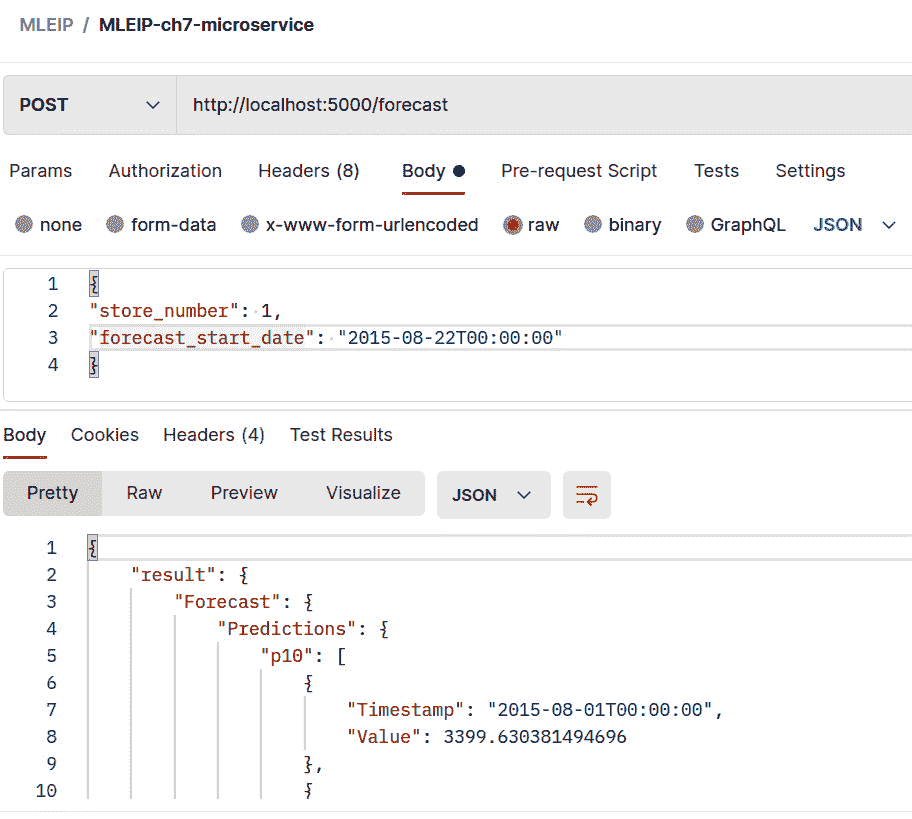

# 七、搭建一个 ML 微服务的例子

这一章将会用一个现实的例子来总结我们在书中学到的东西。这将基于 [*第 1 章*](B17343_01_Final_JC_ePub.xhtml#_idTextAnchor014) 、*ML 工程简介*中介绍的场景之一，我们需要为商店商品销售构建预测服务。我们将稍微详细地讨论该场景，并概述使解决方案成为现实所必须做出的关键决策，然后展示我们如何从 ML 工程的角度利用我们在本书中学到的过程、工具和技术来解决问题的关键部分。在本章结束时，你应该清楚地了解如何构建自己的 ML 微服务来解决各种业务问题。

在本章中，我们将讨论以下主题:

*   理解预测问题
*   设计我们的预测服务
*   选择工具
*   执行构建

每一个主题都将为我们提供一个机会，让我们了解作为工程师在复杂的 ML 交付中必须做出的不同决定。这将为我们在现实世界中做这件事提供方便的参考。

现在，让我们开始构建一个预测微服务吧！

# 技术要求

要按照本章中的示例进行操作，您需要安装以下软件:

*   AWS CLI v2
*   瓶
*   邮递员

# 了解预测问题

在 [*第 1 章*](B17343_01_Final_JC_ePub.xhtml#_idTextAnchor014) 、*ML 工程简介*中，我们考虑了一个 ML 团队的例子，该团队的任务是在零售业务中提供单个商店级别的商品预测。虚构的业务用户有以下需求:

*   预测应该通过一个基于网络的仪表板呈现和访问。
*   如有必要，用户应该能够请求更新预测。
*   预测应在单个商店层面进行。
*   在任何一次会议中，用户都会对自己的地区/商店感兴趣，而不会关注全球趋势。
*   在任何一个会话中，更新预测的请求数量都很少。

考虑到这些需求，我们可以与企业合作创建以下用户故事，我们可以将这些故事放入 JIRA 等工具中，如第 2 章*中的 [*所述。涵盖这些需求的一些用户故事示例如下:*](B17343_02_Final_JC_ePub.xhtml#_idTextAnchor030)*

 **   **用户故事 1** :作为一名当地物流计划员，我想在早上登录仪表板，并能够看到未来几天商店层面的商品需求预测。
*   **用户故事 2** :作为一名当地物流规划人员，如果我发现我的预测已经过时，我希望能够请求更新。我希望在合理的时间内检索新的预测。
*   **用户故事 3** :作为一名当地物流计划员，我希望能够根据具体商店筛选预测。

这些用户故事对于整个解决方案的开发非常重要。由于我们关注的是问题的 ML 工程方面，我们现在可以深入研究这些对于构建解决方案意味着什么。

例如，希望*能够看到商店层面的商品需求预测*可以很好地转化为解决方案 ML 部分的一些技术需求。这告诉我们，目标变量将是某一天所需的物品数量。它告诉我们，我们的 ML 模型需要能够在商店级别工作，所以要么我们每个商店有一个模型，要么商店的概念可以作为某种功能。

类似地，用户希望*能够请求更新我的预测，如果我看到它是过时的...我希望在合理的时间内检索到新的预测*对训练提出了严格的延迟要求。我们无法构建需要花费天时间来重新训练的东西，因此这可能意味着跨所有数据构建的一个模型可能不是最佳解决方案。

最后，用户希望能够基于特定商店过滤预测的请求再次支持了这样一个概念，即无论我们构建什么，都必须将商店作为某种输入，但不一定是一个功能。这应该让我们思考我们的应用逻辑可能想要如何接收这些请求值(存储)并在执行推理之前使用它们来拉入适当的 ML 模型。

走过这个过程，我们可以看到仅仅几行需求就让我们开始充实我们将如何在实践中解决问题。其中一些想法和其他想法可以通过我们团队的头脑风暴整合到一个类似于图 7.1 的表格中:


图 7.1——将用户故事转化为技术需求

现在，我们将基于对问题的理解，开始整合解决方案 ML 部分的设计。

# 设计我们的预测服务

*理解预测问题*部分中的要求是我们需要达到的目标的定义，但它们不是达到目标的方法。利用我们从 [*第 5 章*](B17343_05_Final_JC_ePub.xhtml#_idTextAnchor116) 、*部署模式和工具*中对设计和架构的理解，我们可以开始构建我们的设计。

首先，我们应该确认我们应该做什么样的设计。因为我们需要动态请求，所以我们遵循在第 5 章 、*部署模式和工具*中讨论的微服务架构是有意义的。这将允许我们构建一个服务，该服务的唯一焦点是从我们的模型存储中检索正确的模型并执行所请求的推理。因此，预测服务应该在仪表板和模型存储之间有可用的接口。

此外，由于用户可能希望在任何一个会话中使用一些不同的商店组合，并可能在这些预测之间来回切换，因此我们应该提供一种高效的机制。

从这个场景中还可以清楚地看到，我们可以很容易地获得大量的预测请求，但对模型更新的请求较少。这意味着将训练和预测分开是有意义的，我们可以遵循 [*第 3 章*](B17343_03_Final_JC_ePub.xhtml#_idTextAnchor055) 、*中概述的从模型到模型工厂*的训练-持续过程。这将意味着预测将不依赖于每次完整的训练运行，并且检索用于预测的模型相对较快。

我们还从需求中收集到，在这种情况下，我们的训练系统不一定需要由漂移监控来触发，而是由用户做出的动态请求来触发。这增加了一点复杂性，因为这意味着我们的解决方案不应该为每个进来的请求重新训练，而是能够确定对于给定的请求重新训练是否值得，或者模型是否已经是最新的。例如，如果四个用户登录并查看相同的区域/商店/商品组合，并且都请求重新培训，那么很明显我们不需要重新培训我们的模型四次！相反，应该发生的是训练系统注册一个请求，执行重新训练，然后安全地忽略其他请求。

我们可以将这些设计点整合到一个高级设计图中，例如图 7.2 :


图 7.2-预测微服务的概要设计

下一节将重点介绍这些高级设计考虑事项，因为我们在开发之前会进行一些工具选择。

# 选择工具

既然我们已经有了一个高层次的设计，并且我们已经写下了一些清晰的技术需求，我们可以开始选择我们将用来实现我们的解决方案的工具集了。

在这方面最重要的考虑之一将是我们使用什么框架来建模我们的数据和建立我们的预测功能。鉴于该问题是一个需要快速再训练和预测的时间序列建模问题，我们可以在进行之前考虑一些可能符合要求的选项的利弊。

本次练习的结果如图*图 7.3* 所示:


图 7.3–解决这一预测问题的一些不同 ML 工具包的利弊

基于图 7.3 中的信息，看起来`Prophet`库将是一个很好的选择，并在预测能力、期望的时间序列能力以及团队中开发人员和科学家的经验之间提供了一个很好的平衡。

然后，数据科学家可以使用这些信息来构建概念验证，其代码非常类似于 [*第 1 章*](B17343_01_Final_JC_ePub.xhtml#_idTextAnchor014) 、*ML 工程简介*、*示例 2:预测 API* 部分中所示的代码，该部分将 Prophet 应用于标准零售数据集。

有了这个概念证明，下一个挑战是进入 ML 模型开发生命周期的后期阶段，这将在下一节中讨论。

# 执行构建

正如在 [*第 2 章*](B17343_02_Final_JC_ePub.xhtml#_idTextAnchor030) 、*机器学习开发过程*中所讨论的，在执行发现和构建初始概念验证之后，我们必须在 ML 项目生命周期中经历几个阶段。这些步骤侧重于解决方案的开发，然后是解决方案的部署。

首先，我们将关注如何将这些阶段分解成可管理的任务，这些任务可以由我们的工程团队执行。*图 7.2* 中的每个组件大致对应这些任务之一，如下所示:

*   **预测处理程序/训练处理程序**:每一个都将由应用逻辑组成，它从仪表板获取请求(通过 HTTP 上的 API 请求)，然后触发适当的流程。这些可以在一个简单的 web 服务中作为不同的端点集合在一起，充当仪表板和系统其他组件之间的接口。
*   **培训管道和预测者**:正如前面章节和 [*第三章*](B17343_03_Final_JC_ePub.xhtml#_idTextAnchor055)*中的*设计你的培训系统章节*所讨论的，从模型到模型工厂*，这应该是一个可以被触发的独立过程，运行模型的培训，然后将模型输出到模型存储，以供系统的其他部分参考。为此，我们实际上可以使用 AWS 的一个名为 **Forecast** 的服务，它提供了一系列预测器，可以通过 API 以编程方式对这些预测器进行培训和公开。这是一个*不要多此一举*的好例子，一个我们在 [*第四章*](B17343_04_Final_JC_ePub.xhtml#_idTextAnchor095)*包装起来*中简要讨论过的哲学。
*   模型存储:我们需要一个地方来存储我们的模型并在以后引用它。方便的是，这由**预测**服务来处理。

在接下来的几节中，我们将介绍构建或连接这些组件时的一些主要考虑事项。

## 培训管道和预测者

如*了解预测问题*部分所述，此解决方案的再培训过程应通过用户请求触发，而不是基于任何类型的漂移监控。这意味着此处的培训设置实际上比第 3 章 、*从模型到模型工厂*中详细介绍的情况更简单。

对于这个例子，我们将使用 AWS 提供的一个非常方便的服务，称为**预测**，这是一个托管的服务，允许我们通过 API 调用从不同的时间序列预测模型中创建、训练和预测。这将我们原本必须做的大量繁重工作抽象化，并允许我们快速创建我们的训练和预测处理程序可以与之交互的预测服务。

首先，我们必须使用 AWS CLI 和凭据设置我们的预测服务。为了做到这一点，我们可以在 https://docs.aws.amazon.com/forecast/latest/dg/gs-cli.html[运行教程中概述的步骤](https://docs.aws.amazon.com/forecast/latest/dg/gs-cli.html)，但是在运行命令行命令时进行以下变量交换:

```
--dataset-name "store_demand"
--dataset-group-name "store_demand_group"
--dataset-import-job-name "store_demand_import_job"
```

设置您的第一个预测服务的步骤在 GitHub 资源库文件夹中的 shell 脚本中给出，该资源库位于[https://GitHub . com/packt publishing/Machine-Learning-Engineering-with-Python/tree/main/chapter 07/Forecast-service](https://github.com/PacktPublishing/Machine-Learning-Engineering-with-Python/tree/main/Chapter07/forecast-service)。您还可以使用这些命令的 Python API 等价物，例如在笔记本中的[https://github . com/packt publishing/Machine-Learning-Engineering-with-Python/blob/main/chapter 07/exploration/AWS-forecast-training . ipynb](https://github.com/PacktPublishing/Machine-Learning-Engineering-with-Python/blob/main/Chapter07/exploration/aws-forecast-training.ipynb)中所示。运行完这些设置步骤后，我们就可以开始训练预测器了。

我们现在将使用 AWS Python SDK 创建和培训我们的预测器，因为这将允许我们通过我们的处理程序 web 应用与**预测**服务进行交互:

1.  首先，我们将 CLI 会话连接到预测服务

    ```
    import boto3 session = boto3.Session(region_name='eu-west-1')  forecast = session.client(service_name='forecast')  forecastquery = session.client(service_name='forecastquery')
    ```

2.  然后我们可以创建我们的预测器并开始它的训练运行:

    ```
    create_predictor_response = \     forecast.create_predictor(PredictorName=predictor_name,                               AlgorithmArn=algorithm_arn,                               ForecastHorizon=7,                               PerformAutoML=False,                               PerformHPO=False,                               InputDataConfig= {"DatasetGroupArn": dataset_group_arn},                               FeaturizationConfig= {"ForecastFrequency": DATASET_FREQUENCY}                              )
    ```

3.  提交前面的`create_predictor()`命令后，我们可以使用预测器`arn`执行`aws forecast`命令，以确定训练的状态。该命令将返回一个相对较大的响应，但在最后会有一个标记表示`"Status": "CREATE_IN_PROGRESS"`。为了继续预测步骤:

    ```
    aws forecast --region eu-west-1 describe-predictor --predictor-arn arn:aws:forecast:eu-west-1:508972911348:predictor/store_demand_prophet
    ```

    ，我们必须等待，直到它变为`"Status": "ACTIVE"`
4.  在预测器被训练后，你可以创建一个预测:

    ```
    forecast_name = f"store_demand_forecast" create_forecast_response = \     forecast.create_forecast(ForecastName=forecast_name,                              PredictorArn=predictor_arn)  forecast_arn = create_forecast_response['ForecastArn']
    ```

5.  现在我们可以像查询预测器一样查询预测状态:

    ```
    forecast.describe_forecast(ForecastArn=forecast_arn) {'ForecastArn': 'arn:aws:forecast:eu-west-1:508972911348:forecast/store_demand_forecast', 'ForecastName': 'store_demand_forecast', 'ForecastTypes': ['0.1', '0.5', '0.9'], 'PredictorArn': 'arn:aws:forecast:eu-west-1:508972911348:predictor/store_demand_prophet', 'DatasetGroupArn': 'arn:aws:forecast:eu-west-1:508972911348:dataset-group/store_demand_group', 'Status': 'ACTIVE', ...}}
    ```

6.  最后，我们可以通过 API 请求预测结果。在这里，`item_id`指的是店铺编号。运行这个 Python 语法的结果显示在下面的代码块中:

    ```
    forecast_response = forecastquery.query_forecast(     ForecastArn=forecast_arn,     Filters={"item_id": "1"})  {'Forecast': {'Predictions': {'p10': [{'Timestamp': '2015-08-01T00:00:00',      'Value': 3238.8896484375},...],    'p50': [{'Timestamp': '2015-08-01T00:00:00', 'Value': 4690.10107421875},...],    'p90': [{'Timestamp': '2015-08-01T00:00:00', 'Value': 6157.83935546875},...]}},...}
    ```

我们可以在解决方案中使用这种功能来查询和重新训练预测模型。构建解决方案的关键焦点实际上是将这些工具结合在一起，并通过训练和预测处理程序 web 服务为它们提供一个接口，我们现在继续讨论这一点。

## 培训和预测处理程序

正如前面提到的，这个系统的预测和训练处理程序可以包含在一个简单的 web 应用中。我们可以使用一个托管在**弹性容器注册中心** ( **ECR** )上的简单 Flask web 应用来做到这一点，就像在 [*第 5 章*](B17343_05_Final_JC_ePub.xhtml#_idTextAnchor116) 、*部署模式和工具*中的*在 AWS* 上托管您自己的微服务一节一样。

本节的其余部分将集中在需要实现哪些关键的代码片段，以利用我们在本书中讨论的 ML 工程实践的方式来推进解决方案。

在我们的 web 应用中，我们将需要可以出于训练或预测目的查询的端点，因此我们将端点命名为(想象中的)`training`和`forecast`。以下部分将讨论这些端点..

### 训练终点

在继续请求新的培训工作和模型更新之前，培训终点背后的应用逻辑应包含一项检查，即再次培训所请求的模型最近尚未更新。这个逻辑的具体细节在很大程度上取决于客户的需求，但是我们可以在这里涵盖一个基本的场景。

逻辑的大致流程如下所示:

*   本次培训申请的日期是什么时候？
*   找到最近的预测器被训练的时间。
*   如果训练请求日期(现在)和最近预测器训练时间之间的差异在容差范围内(例如 2 天)，则返回一条消息，说明*新预测器的训练未启动，时间在容差范围内*。
*   如果训练请求日期和最近预测器训练时间之间的时间间隔超出容差，则开始训练。

这个逻辑可以通过包装 AWS CLI 功能的类来处理，我们使用这些功能与预测服务进行交互:

1.  例如，我们可以创建一个简单的类来包装到预测服务的连接，以供其他功能使用:

    ```
    class ForecastSession(object):          def __init__(self):         self.session = boto3.Session(region_name=REGION)          self.forecast = session.client(service_name='forecast')          self.forecastquery = session.client(service_name='forecastquery')
    ```

2.  然后，我们可以定义依赖于`ForecastSession`对象的实例来访问 AWS 预测服务的类，并执行我们需要的步骤。首先，我们可以定义一个`Trainer`类来处理服务中新预测器的训练。为了简洁起见，我们在这里没有展示完整的类，而是展示了`ForecastSession`对象的一个实例的使用，这里称为`forecast_session`，以及该类的方法名:

    ```
    class Trainer(object):     def __init__(self, forecast_session):         self.forecast_session = forecast_session ...     def get_df_pred_metadata(self): ...             def get_latest_predictor(self): ...             def latest_predictor_in_tolerance(self, tolerance_days=2): ...               def train_new_predictor(self): ...      def create_latest_forecast(self): ...
    ```

存储库中给出了所有这些功能的示例逻辑，但关键是这里我们已经利用了我们在第 4 章 、*打包*中探索的许多面向对象编程技术。

我们现在将继续简要讨论预测端点中必须包含的内容。

### 预测终点

预测端点背后的应用逻辑应该首先确保预测所需的模型在处理程序服务的上下文中可用；如果不是，那么它应该从我们的模型库中检索它。这样做之后，它应该使用模型来生成一个可以在用户的仪表板中呈现和存储的预测。

现在，我们将介绍在我们的容器化 web 应用中创建预测端点的步骤:

1.  在主应用目录中的一个名为`resources`的子模块中，我们有一个名为`forecast.py`的文件。这包括一个简单的`ForecastHandler`，它管理`Forecaster`对象的输出:

    ```
    class ForecastHandler(Resource):     def __init__(self, **kwargs):         self.forecaster = kwargs['forecaster']       def get(self):         return {}       def post(self):         args = post_parser.parse_args()         print(args)         result = {"store_number": args["store_number"], "result": self.forecaster.get_forecast(store_id=args["store_number"])}         return jsonify(result)
    ```

2.  `forecast.py`文件还包括`Forecaster`类，它与预测服务交互，类似于*培训端点*部分中讨论的`Trainer`类:

    ```
    class Forecaster(object):       def __init__(self, forecast_session):   ...      def get_df_forecast_metadata(self):   ...      def get_latest_forecast(self):         ...      def get_forecast(self, store_id):         ...
    ```

然后，`ForecastHandler`和`Forecaster`对象就是我们需要连接并从服务中检索预测的全部内容。

最后一节将讨论如何将所有这些整合到处理程序服务中。

### 将它整合在一起

现在必须通过将训练和预测部分部署为 web 应用中的端点来将处理程序服务集合在一起。我们将展示如何为预测端点执行此操作；培训端点本质上是以下内容的副本:

1.  我们在一个名为`app.py` :

    ```
    from flask import Flask from flask_restful import Api, Resource from resources.forecast import ForecastHandler, Forecaster import logging
    ```

    的文件中导入创建 Flask web 应用所需的所有库
2.  在`app.py`中，我们使用`flask_restful`功能:

    ```
    app = Flask(__name__) api = Api(app)
    ```

    实例化 Flask 应用
3.  我们在应用中添加了一个预测端点。这个端点使用一个我们称为`ForecastHandler`的类，它本身利用了一个名为 `Forecaster` :

    ```
    forecaster = Forecaster() api.add_resource(ForecastHandler, '/forecast', resource_class_kwargs={'forecaster': forecaster})
    ```

    的类中的功能
4.  然后，我们定义应用的主入口点，在这里将配置日志记录，在这里可以运行应用:

    ```
    if __name__ == '__main__':     logging.basicConfig(filename='app.log', level=logging.INFO, format='%(asctime)s | %(name)s | %(levelname)s | %(message)s')     logging.info('Main app sequence begun')     app.run(debug=True, host='0.0.0.0', port=5000) # change debug=False in production     logging.info('App finished')
    ```

5.  然后，我们可以通过用`python app.py`触发应用，然后用 **Postman** 查询端点来测试这个基本的预测处理服务:



图 7.4–在我们的预测微服务中查询预测端点的结果

仅此而已。我们的处理程序服务非常简单。由于我们正致力于微服务架构，我们不需要构建任何非常复杂的东西，可以专注于所需的每个独立组件。正如我们在第 5 章 、*部署模式和工具*中所讨论的，这是使用这种架构的原因之一。

我们现在总结一下本章所讲的内容。

# 总结

在这一章中，我们已经通过一个例子说明了如何利用本书前六章中的工具和技术，并将它们一起应用于解决一个现实的业务问题。我们已经详细讨论了对动态触发预测算法的需求如何能够很快导致需要几个小服务无缝交互的设计。特别是，我们创建了一个设计，其中包含负责处理事件、训练模型、存储模型和执行预测的组件。然后，我们通过考虑诸如是否适合手头的任务以及开发人员可能的熟悉程度等因素，介绍了在现实场景中如何选择工具集来构建这种设计。最后，我们仔细定义了构建解决方案所需的关键代码片段，以便能够重复地、健壮地解决问题。

在下一章，也是最后一章，我们将构建一个 ML 批处理的例子。我们将这种坚持的模式称为提取、转换、机器学习，并探索在任何旨在构建这种类型的解决方案的项目中应该涵盖哪些关键点。*