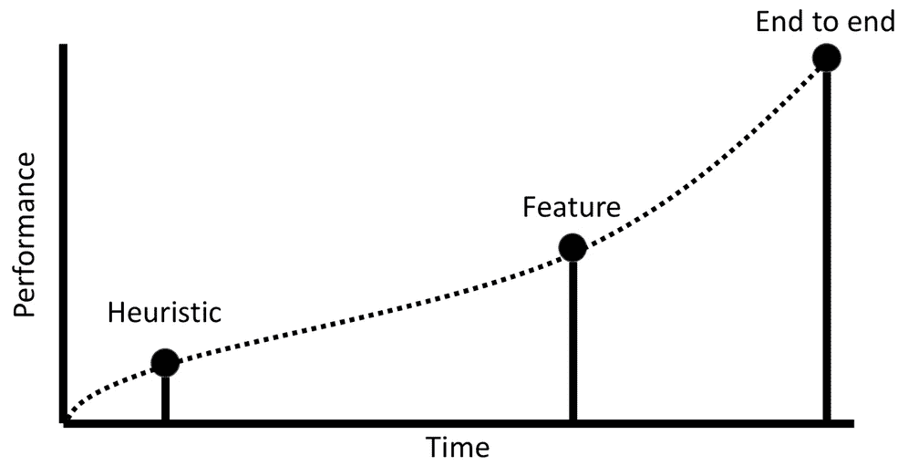
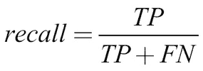
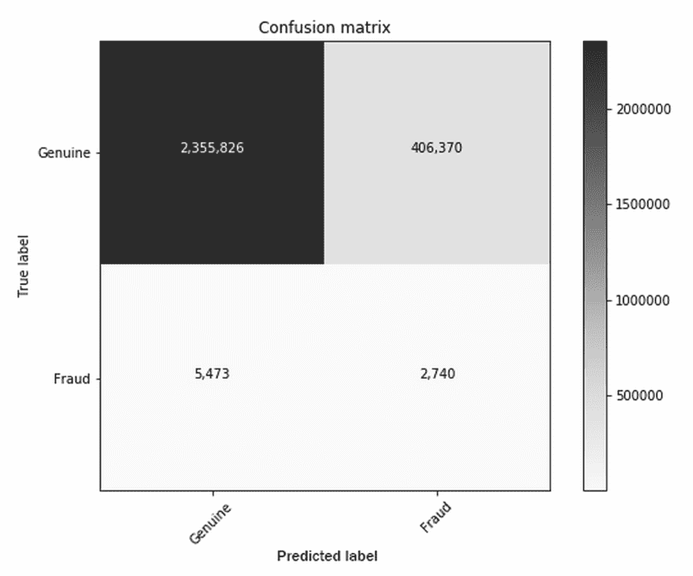
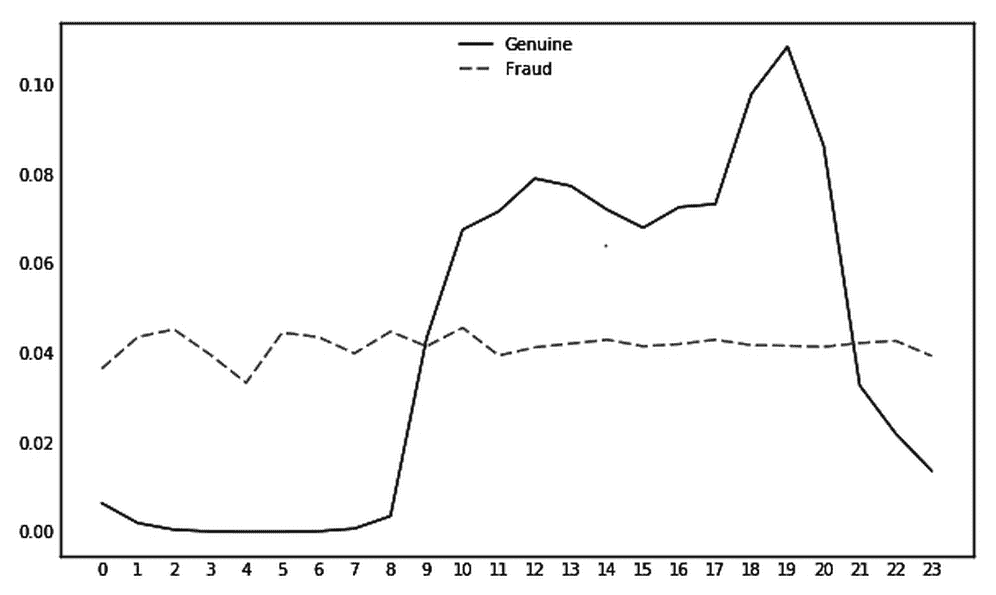
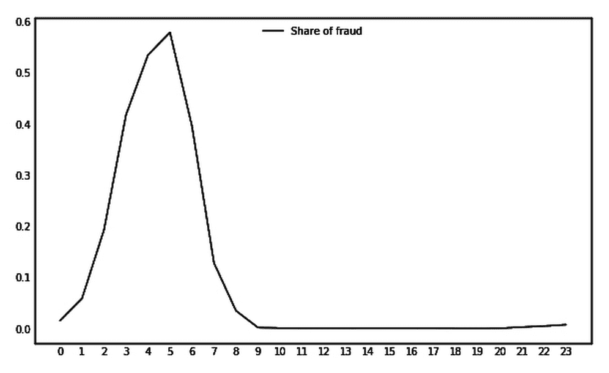
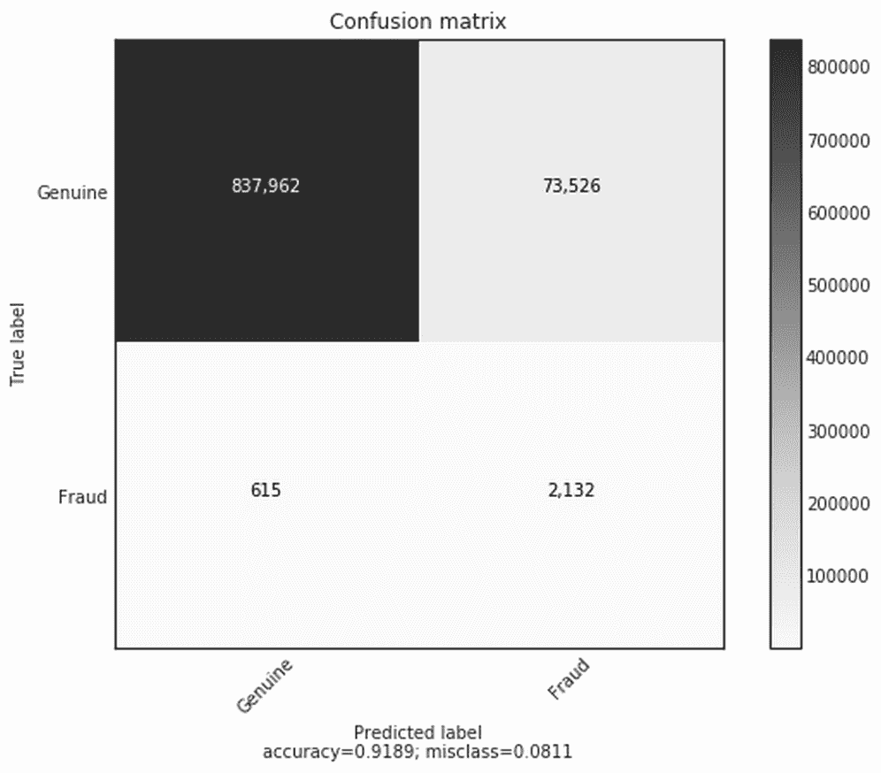
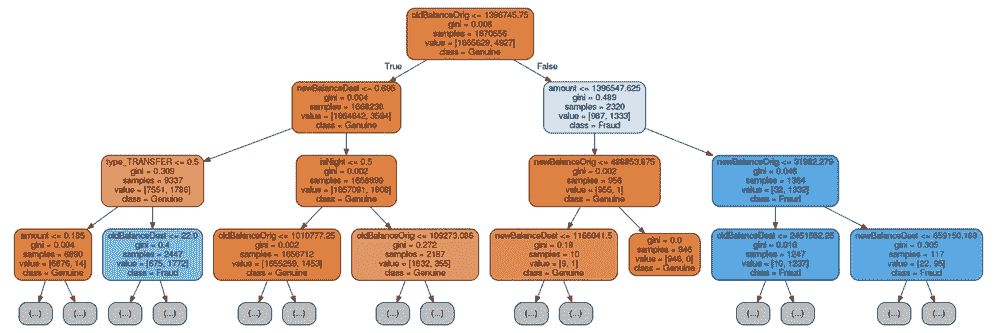
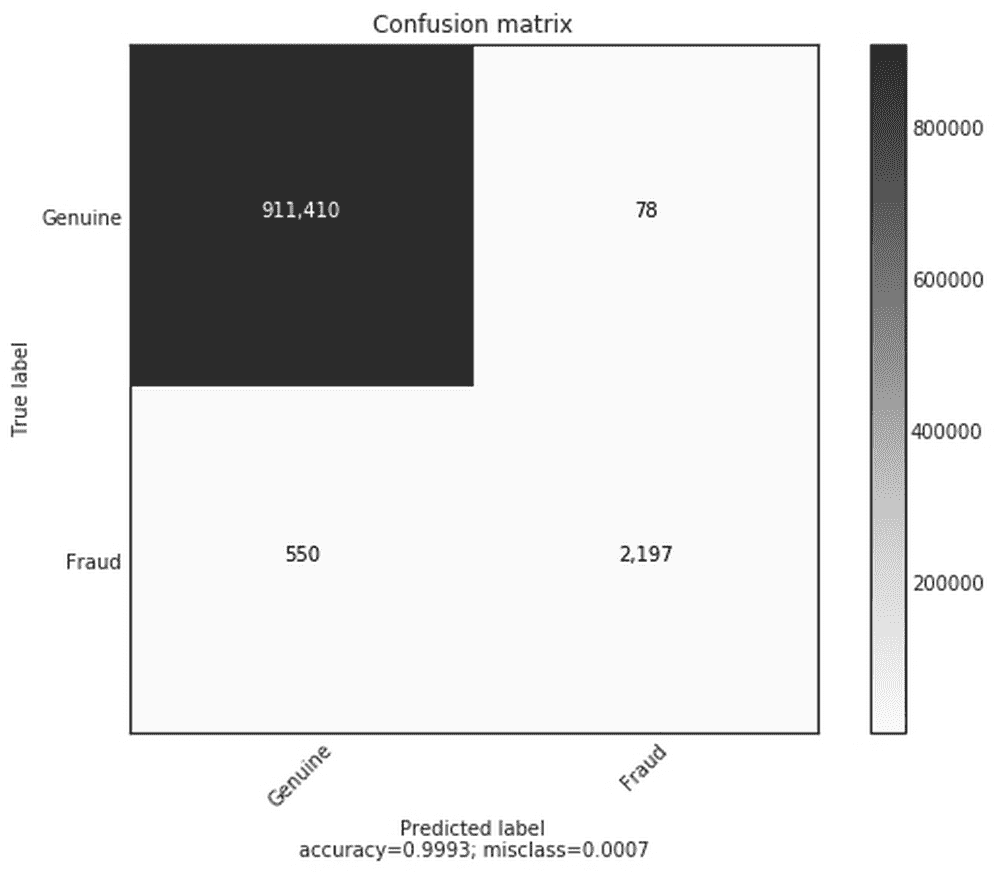

# 第二章。将机器学习应用于结构化数据

结构化数据是一个术语，用于表示驻留在记录或文件的固定字段中的任何数据，两个这样的例子是关系数据库和电子表格。通常，结构化数据以表格的形式呈现，其中每一列代表一种类型的值，每一行代表一个新条目。它的结构化格式意味着这种类型的数据适合经典的统计分析，这也是为什么大多数数据科学和分析工作都是在结构化数据上完成的。

在日常生活中，结构化数据也是企业最常见的数据类型，金融中需要解决的大多数机器学习问题都以这样或那样的方式处理结构化数据。任何现代公司日常运营的基础都是围绕结构化数据构建的，包括交易、订单簿、期权价格和供应商，这些都是通常在电子表格或数据库中收集的信息示例。

本章将带您了解一个涉及信用卡欺诈的结构化数据问题，其中我们将使用特征工程从数据集中成功识别欺诈交易。我们还将介绍**端到端** ( **E2E** )方法的基本原理，以便我们可以解决常见的财务问题。

欺诈是所有金融机构都必须面对的不幸现实。试图保护其系统的公司和试图破坏现有保护的欺诈者之间的竞争一直在持续。长期以来，欺诈检测依赖于简单的启发式方法。例如，当你在一个你通常不居住的国家进行一笔大交易时，可能会导致该交易被标记。

然而，随着欺诈者继续理解和规避规则，信用卡提供商正在部署越来越复杂的机器学习系统来应对这一点。

在这一章中，我们将看看一家真正的银行可能如何解决欺诈问题。这是对数据科学家团队如何从启发式基线开始，然后发展对其特征的理解，并由此建立越来越复杂的机器学习模型以检测欺诈的真实探索。虽然我们将使用的数据是合成的，但我们将用于应对欺诈的开发流程和工具与国际零售银行每天使用的工具和流程相似。

那么你从哪里开始呢？用一位匿名欺诈检测专家的话来说，我一直在想如何从我的雇主那里偷东西，然后我创造一些特征来抓住我的抢劫。要抓诈骗犯，要像诈骗犯一样思考。”然而，即使是最巧妙的功能工程师也无法发现所有微妙的、有时违反直觉的欺诈迹象，这就是为什么该行业正在慢慢转向完全由 E2E 训练的系统。除了机器学习，这些系统都是本章的重点，我们将探讨几种常用的方法来标记欺诈。

本章将作为使用生成模型的[第 6 章](ch06.html "Chapter 6. Using Generative Models")、*的重要基线，在这里，我们将使用自编码器再次回顾完整 E2E 模型的信用卡欺诈问题。*

# 数据

我们将使用的数据集是一个由支付模拟器生成的交易的合成数据集。本案例研究的目标和本章的重点是发现数据集中的欺诈交易，这是许多金融机构处理的经典机器学习问题。

### 注意

**注意**:在我们进一步讨论之前，可通过以下两个链接在线获取该代码的数字副本以及本章的交互式笔记本:

包含本章代码的交互式笔记本可以在[https://www.kaggle.com/jannesklaas/structured-data-code](https://www.kaggle.com/jannesklaas/structured-data-code)下找到

代码也可以在 GitHub 上找到，在这本书的知识库中:[https://GitHub . com/packt publishing/Machine-Learning-for-Finance](https://github.com/PacktPublishing/Machine-Learning-for-Finance)

我们使用的数据集来自 E. A. Lopez-Rojas、A. Elmir 和 S. Axelsson 的论文 *PaySim:一个用于欺诈检测的金融移动货币模拟器*。数据集可以在 Kaggle 上找到，网址:[https://www.kaggle.com/ntnu-testimon/paysim1](https://www.kaggle.com/ntnu-testimon/paysim1)。

在我们在下一页分解它之前，让我们花点时间看看我们将在本章中使用的数据集。请记住，您可以通过前面的链接下载数据。

| 

步骤

 | 

类型

 | 

数量

 | 

nameOrig

 | 

旧余额原始

 | 

新平衡原始值

 | 

最有名的

 | 

旧余额目的地

 | 

新平衡目标

 | 

伊斯弗劳德

 | 

ISF 标记的欺诈

 |
| --- | --- | --- | --- | --- | --- | --- | --- | --- | --- | --- |
| 一 | 支付 | 9839.64 | C1231006815 | 170136.0 | 160296.36 | M1979787155 | 0.0 | 0.0 | 0 | 0 |
| 一 | 支付 | 1864.28 | C1666544295 | 21249.0 | 19384.72 | M2044282225 | 0.0 | 0.0 | 0 | 0 |
| 一 | 转移 | 181.0 | C1305486145 | 181.0 | 0.0 | C553264065 | 0.0 | 0.0 | 一 | 0 |
| 一 | 提现 | 181.0 | C840083671 | 181.0 | 0.0 | C38997010 | 21182.0 | 0.0 | 一 | 0 |
| 一 | 支付 | 11668.14 | C2048537720 | 41554.0 | 29885.86 | M1230701703 | 0.0 | 0.0 | 0 | 0 |
| 一 | 支付 | 7817.71 | C90045638 | 53860.0 | 46042.29 | M573487274 | 0.0 | 0.0 | 0 | 0 |
| 一 | 支付 | 7107.77 | C154988899 | 183195.0 | 176087.23 | M408069119 | 0.0 | 0.0 | 0 | 0 |
| 一 | 支付 | 7861.64 | C1912850431 | 176087.23 | 168225.59 | M633326333 | 0.0 | 0.0 | 0 | 0 |
| 一 | 支付 | 4024.36 | C1265012928 | 2671.0 | 0.0 | M1176932104 | 0.0 | 0.0 | 0 | 0 |
| 一 | 借方 | 5337.77 | C712410124 | 41720.0 | 36382.23 | C195600860 | 41898.0 | 40348.79 | 0 | 0 |

如第一个行所示，数据集有 11 列。在我们继续之前，让我们解释一下每一个都代表着什么:

*   **步骤**:绘制时间，每一步对应一个小时。
*   **类型**:交易类型，可以是现金入、现金出、借记、支付、转账。
*   **金额**:交易金额。
*   **nameOrig** :开始交易的原始账户。c 与客户账户相关，而 M 是商家的账户。
*   **oldbalanceOrig** :原始账户的旧余额。
*   **newbalanceOrig** :原始账户新增交易金额后的新余额。
*   **指定账户**:目的账户。
*   **oldbalanceDest** :目的账户的旧余额。此信息不适用于名称以 m 开头的商户帐户。
*   **newbalanceDest** :目的账户的新余额。此信息不适用于商家账户。
*   **是否欺诈**:交易是否欺诈。
*   **isFlaggedFraud** :旧系统是否将交易标记为欺诈。

在上表中，我们可以看到 10 行数据。值得注意的是，在我们的总数据集中有大约 630 万笔交易，所以我们看到的只是总量的一小部分。由于我们所关注的欺诈只发生在标记为 TRANSFER 或 CASH_OUT 的交易中，所有其他交易都可以被删除，这样我们就有大约 280 万个例子可以处理。


# 启发式、基于特征和 E2E 模型

在我们开始开发检测欺诈的模型之前，让我们停下来思考一下我们可以建立的不同类型的模型。

*   基于启发式的模型是纯粹由人类开发的简单的“经验法则”。通常，启发式模型源于对问题的专家知识。
*   基于特征的模型在很大程度上依赖于人类修改数据来创建新的有意义的特征，然后将这些特征输入到(简单的)机器学习算法中。这种方法混合了专家知识和从数据中学习。
*   E2E 模型纯粹从原始数据中学习。没有使用人类的专业知识，模型直接从观察中学习一切。

在我们的案例中，可以创建一个基于启发式的模型，将所有转账交易类型和金额超过 200，000 美元的交易标记为欺诈交易。基于启发的模型的优点是，它们既能快速开发，又易于实现；然而，这是有回报的，他们的表现往往很差，欺诈者可以很容易地玩这个系统。假设我们使用前面的启发式模型，欺诈者只转移 199，999 美元，低于欺诈限额，将逃避检测。

交易领域的一个重要启发是动量策略。动量策略包括押注一只上涨的股票会继续上涨，然后人们会买入这只股票。虽然这种策略听起来太简单了，没有任何好处，但事实上，这是一种相当成功的策略，许多高频交易和量化交易机构今天都在使用。

为了创造特征，专家们设计了能够区分欺诈交易和真实交易的指标。这通常是使用统计数据分析来完成的，与我们之前提出的基于启发式的模型相比，这将花费更长的时间，但会带来更好的结果。

基于特征工程的模型是数据和人类形成规则的中间环节，在这里，人类知识和创造力被用来制造良好的特征，数据和机器学习被用来从这些特征中创建模型。

E2E 模型纯粹从收集的数据中学习，不使用专家知识。如前所述，这通常会产生更好的结果，但代价是要花很多时间来完成。这种方法还有一些额外的因素值得考虑。例如，收集所需的大量数据是一项昂贵的任务，因为人类必须标记数百万条记录。

虽然对于现在业内的许多人来说，他们认为运送一个劣质的模型通常比什么都不运送要好。毕竟，防范欺诈总比什么都没有好。

使用启发式方法让一半的欺诈交易通过比根本没有欺诈检测要好。该图显示了我们之前介绍的三个模型的性能，以及实现它们所花费的时间。



开发过程中使用的方法和系统的性能

最好的方法是三者结合使用。如果我们部署了一个启发式模型，它满足了任务的基本需求，那么它就可以被交付。通过使用这种方法，启发式算法就成为了任何其他方法必须超越的基线。一旦您的启发式模型被部署，那么您所有的努力都应该指向构建一个基于特征的模型，一旦它击败了最初部署的启发式模型，您就可以在继续优化模型的同时部署它。

正如我们之前讨论过的，基于特征的模型通常在结构化数据任务上提供相当不错的性能；这给了公司时间去承担漫长而昂贵的建立 E2E 模型的任务，一旦它击败了基于特征的模型，就可以发货。现在我们已经了解了我们将要构建的模型类型，让我们来看看构建它们所需的软件。


# 机器学习软件栈

在这一章中，我们将会用到一系列机器学习中常用的不同库。让我们花一点时间来看看我们的堆栈，它由以下软件组成:

*   **Keras** :一个神经网络库，可以充当 TensorFlow 的简化接口。
*   **NumPy** :增加了对大型多维数组以及大量数学函数的支持。
*   **Pandas** :用于数据操作和分析的库。它类似于微软的 Excel，但使用的是 Python，因为它提供了处理表格的数据结构和操作表格的工具。
*   **Scikit-learn** :一个机器学习库，提供了广泛的算法和实用程序。
*   **TensorFlow** :一个数据流编程库，便于与神经网络一起工作。
*   **Matplotlib** :一个绘图库。
*   **Jupyter** :一个开发环境。本书中的所有代码示例都可以在 Jupyter 笔记本中找到。

这本书的大部分致力于使用 Keras 库，而这一章广泛使用了提到的其他库。这里的目标不是教您所有不同库的所有技巧和诀窍，而是向您展示如何将它们集成到创建预测模型的过程中。

### 注

**注意**:本章需要的所有库都默认安装在 Kaggle 内核上。如果您正在本地运行此代码，请参考第 1 章、*神经网络和基于梯度的优化*中的设置说明，并安装所有需要的库。


# 启发式方法

在本章早些时候，我们介绍了我们将用于检测欺诈的三种模型，现在是时候更详细地探讨每一种模型了。我们将从启发式方法开始。

让我们首先定义一个简单的启发式模型，并测量它在测量欺诈率方面的表现。

## 使用启发式模型进行预测

我们将使用启发式方法对整个训练数据集进行预测，以了解这种启发式模型在预测欺诈交易方面的表现。

下面的代码将创建一个新列`Fraud_Heuristic`，然后在类型为`TRANSFER`且金额超过 200，000 美元的行中分配一个值`1`:

```
df['Fraud_Heuristic '] = np.where(((df['type'] == 'TRANSFER') &(df['amount'] > 200000)),1,0)
```

只需两行代码，就可以很容易地看到这样一个简单的指标是如何易于编写和快速部署的。

## F1 的分数

我们必须考虑的一件重要事情是，我们需要一个通用的指标来评估我们所有的模型。在第 1 章、*神经网络和基于梯度的优化*中，我们使用精度作为我们的仿真工具。然而，正如我们所看到的，欺诈交易比真实交易少得多。因此，将所有交易分类为真实交易的模型可以具有非常高的准确度。

旨在处理这种偏态分布的一个指标是 F1 分数，它考虑了真、假阳性和阴性，如下图所示:

|   | 

预测阴性

 | 

预测阳性

 |
| --- | --- | --- |
| 实际负值 | **真阴性** ( **TN** ) | **假阳性** ( **FP** ) |
| 实际正值 | **假阴性** ( **FN** ) | **真阳性** ( **TP** ) |

我们可以首先使用以下公式计算模型的精度，该精度指定了预测为阳性的比例:


召回衡量预测阳性与实际阳性的比例，如下式所示:



然后从两个测量值的调和平均值计算 F1 分数，这可以在下面的公式中看到:


为了在 Python 中计算这个度量，我们可以使用 scikit-learn 的`metrics`模块，或简称为 sklearn:

```
from sklearn.metrics import f1_score
```

根据我们所做的预测，我们现在可以使用以下命令轻松计算 F1 分数:

```
f1_score(y_pred=df['Fraud_Heuristic '],y_true=df['isFraud'])
```

```

out: 0.013131315551742895

```

你会看到前面的命令输出一个数字-从 0.013131315 开始…-这个数字的确切意思是我们的启发式模型做得不太好，因为最好的 F1 分数可能是 1，最差的是 0。在我们的例子中，这个数字代表被正确发现的欺诈行为占所有被标记为欺诈行为的份额的调和平均值，以及被正确发现的欺诈行为占所有欺诈行为的份额的调和平均值。

## 用混淆矩阵评估

评估一个模型的更定性的和可解释的方式是使用混淆矩阵。顾名思义，矩阵显示了我们的分类器是如何混淆类的。

首先，让我们研究一下`plot_confusion_matrix`函数的代码附录:

```
from sklearn.metrics import confusion_matrix cm = confusion_matrix(

    y_pred=df['Fraud_Heuristic '],y_true=df['isFraud']) 

plot_confusion_matrix(cm,['Genuine','Fraud'])
```

当我们运行时，它会生成下面的图形:



启发式模型的混淆矩阵

那么，这个模型有多准确呢？正如您在我们的混淆矩阵中看到的，从我们的 2，770，409 个示例的数据集来看，2，355，826 个示例被正确分类为正品，而 406，370 个示例被错误分类为欺诈。事实上，只有 2740 例被正确归类为欺诈。

当我们的启发式模型将交易归类为欺诈时，99.3%的情况下它都是真实的。只有 34.2%的诈骗案被抓住。所有这些信息都包含在我们制定的 F1 分数中。然而，正如我们所见，从生成的混淆矩阵图中更容易理解这一点。我们同时使用启发式模型和 F1 分数的原因是，用一个数字告诉我们哪个模型更好是一种很好的做法，同时也是一种更图形化的方式来了解该模型如何更好。

坦率地说，我们的启发式模型表现得相当差，仅检测到 34.2%的欺诈，这还不够好。因此，使用下面几节中的另外两种方法，我们将看看我们是否能做得更好。


# 特征工程方法

特征工程的目标是利用人类的定性洞察力来创建更好的机器学习模型。一个人类工程师通常使用三种类型的洞察力:*直觉*、*专家领域知识*和*统计分析*。通常，仅凭直觉就能想出问题的特征是可能的。

例如，在我们的欺诈案例中，凭直觉，欺诈者会为他们的欺诈计划创建新账户，而不会使用他们支付食品杂货的同一银行账户。

领域专家能够利用他们对某个问题的广博知识来提出其他类似直觉的例子。他们将更加了解欺诈者的行为方式，并能编造出表明此类行为的特征。然后，所有这些直觉通常都被统计分析所证实，这甚至可以用来打开发现新特征的可能性。

统计分析有时可以发现可以转化为预测特征的怪癖。然而，使用这种方法，工程师必须小心**数据陷阱**。在数据中发现的预测特征可能只存在于该数据中，因为如果争论的时间足够长，任何数据集都会产生预测特征。

数据陷阱是指工程师永远在数据中挖掘特征，从不质疑他们正在搜索的特征是否相关。

陷入数据陷阱的数据科学家们兴高采烈地寻找特征，却在后来意识到他们的模型，尽管有这些特征，并不能很好地工作。对于数据科学团队来说，在训练集中找到强预测特征就像一种药物。是的，有一个直接的回报，一个快速的胜利，感觉像是对一个人技能的认可。然而，与许多药物一样，数据陷阱可能会导致后遗症，即团队发现数周或数月寻找这些特征的工作实际上是无用的。

花一分钟问问你自己，你在那个位置吗？如果您发现自己一次又一次地应用分析，以各种可能的方式转换数据，追逐相关值，您很可能会陷入数据陷阱。

为了避免数据陷阱，重要的是建立一个**定性的基本原理**来解释为什么这个统计预测特征存在，以及应该存在于数据集之外。通过建立这种基本原理，您将使您自己和您的团队保持警惕，避免精心制作代表噪声的特性。数据陷阱是过度拟合和寻找噪声模式的人类形式，这也是模型的一个问题。

人类可以利用他们的定性推理技能来避免拟合噪声，这是人类相对于机器的一大优势。如果你是一名数据科学家，你应该使用这项技能来创建更通用的模型。

本节的目标不是展示要素工程可以在该数据集上执行的所有要素，而只是强调三种方法以及如何将它们转化为要素。

## 直觉的一个特征——诈骗犯不睡觉

在不太了解欺诈的情况下，我们可以直观地将欺诈者描述为在黑暗中活动的黑幕人物。在大多数情况下，真正的交易发生在白天，因为人们晚上睡觉。

我们的数据集中的时间步长代表一个小时。因此，我们只需将除法的余数除以 24，就可以生成一天中的时间，如以下代码所示:

```
df['hour'] = df['step'] % 24
```

从那里，我们可以计算不同时间的欺诈交易和真实交易的数量。为了计算这一点，我们必须运行以下代码:

```
frauds = []

genuine = []

for i in range(24):

    f = len(df[(df['hour'] == i) & (df['isFraud'] == 1)])

    g = len(df[(df['hour'] == i) & (df['isFraud'] == 0)])

    frauds.append(f)

    genuine.append(g)
```

最后，我们可以将一天中真实交易和欺诈交易的比例绘制成图表。为此，我们必须运行以下代码:

```
fig, ax = plt.subplots(figsize=(10,6)) 

ax.plot(genuine/np.sum(genuine), label='Genuine') 

ax.plot(frauds/np.sum(frauds),dashes=[5, 2], label='Fraud') 

plt.xticks(np.arange(24))

legend = ax.legend(loc='upper center', shadow=True)
```



一天中每个小时进行的欺诈交易和真实交易的份额

正如我们在前面的图表中所看到的，夜间的真实交易少得多，而欺诈性的行为在一天中仍在继续。为了确保夜晚是我们希望抓住欺诈的时间，我们还可以绘制欺诈交易的数量占所有交易的份额。为此，我们必须运行以下命令:

```
fig, ax = plt.subplots(figsize=(10,6))

ax.plot(np.divide(frauds,np.add(genuine,frauds)), label='Share of fraud')

plt.xticks(np.arange(24))

legend = ax.legend(loc='upper center', shadow=True)
```



一天中每小时欺诈性交易的份额

一旦我们运行该代码，我们可以看到在凌晨 5 点左右，超过 60%的交易似乎是欺诈性的，这似乎使这成为一天中捕捉欺诈的最佳时间。

## 专家洞察——转账，然后提现

该数据集的描述伴随着另一个解释欺诈者预期行为的描述。首先，他们把钱转到他们控制的银行账户。然后，他们从自动取款机里取出钱。

我们可以通过运行以下代码来检查是否有欺诈性转账目的地账户是欺诈性提款的来源:

```
dfFraudTransfer = df[(df.isFraud == 1) & (df.type == 'TRANSFER')]

dfFraudCashOut = df[(df.isFraud == 1) & (df.type == 'CASH_OUT')]

dfFraudTransfer.nameDest.isin(dfFraudCashOut.nameOrig).any()
```

```

out: False

```

根据输出，似乎没有欺诈性转账是欺诈性提款的来源。专家预期的行为在我们的数据中看不到。这可能意味着两件事:首先，这可能意味着欺诈者现在的行为有所不同，或者其次，我们的数据没有捕捉到他们的行为。无论哪种方式，我们都不能将这种洞察力用于预测建模。

## 统计怪癖——余额中的错误

对数据的进一步检查显示，尽管交易金额不为零，但仍有一些交易的目的账户新旧余额为零。这很奇怪，或者更确切地说是一种怪癖，所以我们想研究这种类型的奇怪现象是否会产生预测能力。

首先，我们可以通过运行下面的代码来计算该财产的欺诈交易份额:

```
dfOdd = df[(df.oldBalanceDest == 0) &

           (df.newBalanceDest == 0) & 

           (df.amount)]

len(dfOdd[(df.isFraud == 1)]) / len(dfOdd)
```

```

out: 0.7046398891966759

```

如您所见，欺诈性交易的比例为 70%,因此这种怪癖似乎是检测交易欺诈的一个很好的特征。然而，重要的是问问我们自己，这种怪癖最初是如何进入我们的数据的。一种可能是交易永远不会实现。

这可能由于多种原因而发生，包括可能存在阻止交易的另一个防欺诈系统，或者交易的原始账户没有足够的资金。

虽然我们无法验证是否有另一个防欺诈系统，但我们可以检查原始帐户是否资金不足。为此，我们必须运行以下代码:

```
len(dfOdd[(dfOdd.oldBalanceOrig <= dfOdd.amount)]) / len(dfOdd)
```

```

out: 0.8966412742382271

```

正如我们在输出中看到的，接近 90%的零头交易在其原始帐户中资金不足。由此，我们现在可以构建一个理由，欺诈者比普通人更频繁地试图从银行账户中取出所有资金。

我们需要这个基本原理来避免数据陷阱。一旦确立，就必须不断审查其理由。在我们的例子中，它无法解释 10%的异常交易，如果这个数字上升，最终可能会损害我们的模型在生产中的性能。


# 为 Keras 库准备数据

在[第 1 章](ch01.html "Chapter 1. Neural Networks and Gradient-Based Optimization")、*神经网络和基于梯度的优化*中，我们看到神经网络只接受数字作为输入。在我们的数据集中,的问题是，表中的信息并不都是数字，有些是以字符的形式出现的。

因此，在本节中，我们将为 Keras 准备数据，以便我们能够有意义地使用它。

在我们开始之前，让我们看看三种类型的数据，*名义*、*序数*和*数值*:

*   **名义数据**:这是不可订购的离散类别。在我们的例子中，传输的类型是一个名义变量。有四种不同的类型，但是按任何顺序排列都没有意义。例如，转账不能超过 CASH_OUT，所以它们只是单独的类别。
*   **序数数据**:这也是离散的类别，但与名义数据不同，它可以被排序。例如，如果咖啡有大、中、小三种规格，那么它们就是不同的类别，因为它们可以进行比较。大号比小号含有更多的咖啡。
*   **数值数据**:这个是可以排序的，但是我们也可以对它进行数学运算。我们的数据中的一个例子是基金的数量，因为我们既可以比较金额，也可以减去或加上它们。

名义和顺序数据都是**分类数据**，因为它们描述离散类别。虽然数值数据在神经网络中运行良好，但是分类数据需要特殊处理。

## 一键编码

最常用的编码分类数据的方法叫做**一键编码**。在 one-hot 编码中，我们为每个类别创建一个新变量，即所谓的**虚拟变量**。然后，如果事务是某个类别的成员，我们将虚拟变量设置为 1，否则设置为零。

我们如何将此应用于数据集的示例如下:

这是一次性编码之前分类数据的样子:

| 

交易

 | 

类型

 |
| --- | --- |
| 一 | 转移 |
| 2 | 提现 |
| 3 | 转移 |

这是一次性编码后的数据:

| 

交易

 | 

类型 _ 转移

 | 

Type_CASH_OUT

 |
| --- | --- | --- |
| 一 | 一 | 0 |
| 2 | 0 | 一 |
| 3 | 一 | 0 |

Pandas 软件库提供了一个功能，允许我们创建开箱即用的虚拟变量。然而，在这样做之前，在所有实际事务类型的前面添加`Type_`是有意义的。虚拟变量将以类别命名。通过在开头添加`Type_`，我们知道这些虚拟变量表示类型。

下面的代码行做了三件事。首先，`df['type'].astype(str)`将**类型**列中的所有条目转换成字符串。其次，作为组合字符串的结果，添加了`Type_`前缀。第三，组合字符串的新列替换原来的**类型**列:

```
df['type'] = 'Type_' + df['type'].astype(str)
```

现在，我们可以通过运行以下代码来获取虚拟变量:

```
dummies = pd.get_dummies(df['type'])
```

我们应该注意到`get_dummies()`函数创建了一个新的数据帧。接下来，我们将此数据框附加到主数据框，这可以通过运行以下命令来完成:

```
df = pd.concat([df,dummies],axis=1)
```

如前面的代码所示，`concat()`方法连接了两个数据帧。我们沿着轴 1 连接，将数据框添加为新列。既然虚拟变量在我们的主数据框中，我们可以通过运行以下命令删除原始列:

```
del df['type']
```

然后，瞧！我们已经把我们的分类变量变成了神经网络能够处理的东西。

## 实体嵌入

在这一节中，我们将通过使用嵌入和 Keras 功能 API，向您展示一般的工作流程。在[第 5 章](ch05.html "Chapter 5. Parsing Textual Data with Natural Language Processing")、*用自然语言处理解析文本数据*中，我们将全面介绍和探讨这两个主题，在这里，我们将超越这里提出的一般概念，并开始讨论实现等主题。

如果你不明白刚才发生的一切，那也没关系；这毕竟是高级段。如果你想同时使用这两种技术，读完这本书后你会有充分的准备，因为我们会在整本书中解释这两种方法的不同元素。

在本节中，我们将为分类数据创建嵌入向量。在开始之前，我们需要理解嵌入向量是表示分类值的向量。我们使用嵌入向量作为神经网络的输入。我们用神经网络一起训练嵌入，这样，随着时间的推移，我们可以获得更有用的嵌入。嵌入是一个非常有用的工具。

为什么嵌入如此有用？嵌入不仅减少了一次性编码所需的维数，从而减少了内存使用，而且还减少了输入激活的稀疏性，这有助于减少过度拟合，并且可以将语义编码为向量。使嵌入对文本有用的相同优势，[第 5 章](ch05.html "Chapter 5. Parsing Textual Data with Natural Language Processing")，*用自然语言处理解析文本数据*，也使它们对分类数据有用。

### 标记类别

就像文本一样，我们必须在将输入输入到嵌入层之前对其进行标记。为此，我们必须创建一个映射字典，将类别映射到一个令牌。我们可以通过运行以下命令来实现这一点:

```
map_dict = {}

for token, value in enumerate(df['type'].unique()):

    map_dict[value] = token
```

这段代码在向上计数的同时遍历所有唯一的类型类别。第一个类别获得令牌 0，第二个类别获得令牌 1，依此类推。我们的`map_dict`长这样:

```

{'CASH_IN': 4, 'CASH_OUT': 2, 'DEBIT': 3, 'PAYMENT': 0, 'TRANSFER': 1}

```

我们现在可以将这种映射应用到我们的数据框:

```
df["type"].replace(map_dict, inplace=True)
```

因此，所有类型现在都将被它们的标记替换。

我们必须单独处理数据框架中的非分类值。我们可以创建一个既不是类型也不是目标的列列表，如下所示:

```
other_cols = [c for c in df.columns if ((c != 'type') and (c != 'isFraud'))]
```

### 创建输入模型

我们正在创建的模型将有两个输入:一个用于具有嵌入层的类型，另一个用于所有其他非分类变量。为了在稍后更容易地组合它们，我们将使用两个数组来跟踪它们的输入和输出:

```
inputs = []

outputs = []
```

作为该类型输入的模型接收一维输入，并通过嵌入层对其进行解析。然后，嵌入层的输出被整形为平面数组，正如我们在下面的代码中看到的:

```
num_types = len(df['type'].unique()) 

type_embedding_dim = 3

type_in = Input(shape=(1,))

type_embedding = Embedding(num_types,type_embedding_dim,input_ length=1)(type_in)

type_out = Reshape(target_shape=(type_embedding_dim,))(type_embedding)

type_model = Model(type_in,type_out)

inputs.append(type_in)

outputs.append(type_out)
```

这里的`type`嵌入有三层。这是一个任意的选择，不同维数的实验可以改善结果。

对于所有其他输入，我们创建另一个输入，它具有与非分类变量一样多的维度，并且由没有激活函数的单个密集层组成。致密层是可选的；输入也可以直接传递到头部模型中。还可以添加更多层，包括:

```
num_rest = len(other_cols)

rest_in = Input(shape = (num_rest,)) 

rest_out = Dense(16)(rest_in)

rest_model = Model(rest_in,rest_out)

inputs.append(rest_in)

outputs.append(rest_out)
```

现在我们已经创建了两个输入模型，我们可以将它们连接起来。在这两个连接的输入之上，我们还将建立我们的头部模型。要开始此过程，我们必须首先运行以下程序:

```
concatenated = Concatenate()(outputs)
```

然后，通过运行下面的代码，我们可以构建并编译整个模型:

```
x = Dense(16)(concatenated)

x = Activation('sigmoid')(x)

x = Dense(1)(concatenated)

model_out = Activation('sigmoid')(x)

merged_model = Model(inputs, model_out)

merged_model.compile(loss='binary_crossentropy',optimizer='adam', metrics=['accuracy'])
```

### 训练模型

在本节中，我们将训练一个具有多个输入的模型。要做到这一点，我们需要为每个输入提供一个 *X* 值的列表。因此，首先我们必须分割我们的数据帧。我们可以通过运行以下代码来实现这一点:

```
types = df['type']

rest = df[other_cols]

target = df['isFraud']
```

然后，我们可以通过提供两个输入和目标的列表来训练模型，如下面的代码所示:

```
history = merged_model.fit([types.values,rest.values],target.values, epochs = 1, batch_size = 128)
```

```

out:

Epoch 1/1

6362620/6362620 [==============================] - 78s 12us/step - loss: 0.0208 - acc: 0.9987

```


# 使用 Keras 创建预测模型

我们的数据现在包含以下列:

```
amount, 

oldBalanceOrig, 

newBalanceOrig, 

oldBalanceDest, 

newBalanceDest, 

isFraud, 

isFlaggedFraud, 

type_CASH_OUT, 

type_TRANSFER, isNight
```

现在我们已经得到了列，我们的数据也准备好了，我们可以用它来创建一个模型。

## 提取目标

为了训练模型，神经网络需要一个目标。在我们的例子中，`isFraud`是目标，所以我们必须将它与其他数据分开。我们可以通过运行以下命令来实现:

```
y_df = df['isFraud']

x_df = df.drop('isFraud',axis=1)
```

第一步只返回`isFraud`列并将其分配给`y_df`。

第二步返回除`isFraud`之外的所有列，并将它们分配给`x_df`。

我们还需要将数据从 pandas `DataFrame`转换成 NumPy 数组。pandas `DataFrame`构建在 NumPy 数组之上，但是附带了许多额外的附加功能，使得我们之前所做的预处理成为可能。然而，为了训练神经网络，我们只需要底层数据，我们可以通过简单地运行以下命令来获得这些数据:

```
y = y_df.values

X = x_df.values
```

## 创建测试集

当我们训练我们的模型时，我们冒着**过拟合**的风险。过度拟合意味着我们的模型记住了我们训练数据集中的 *x* 和 *y* 映射，但是没有找到描述 *x* 和 *y* 之间真实关系的函数。这是有问题的，因为一旦我们在样本之外运行我们的模型**——也就是说，在不在我们的训练集中的数据上，它可能做得很差。为了防止这种情况，我们将创建一个所谓的**测试集**。**

测试集是一个维持数据集，只有当我们认为它做得相当好时，我们才使用它来评估我们的模型，以查看它在尚未看到的数据上的表现如何。测试集通常是从完整数据中随机抽取的。Scikit-learn 提供了一个方便的函数来做到这一点，我们可以在下面的代码中看到:

```
from sklearn.model_selection import train_test_split

X_train, X_test, y_train, y_test = train_test_split(X, y, test_size=0.33, random_state=42)
```

元素`train_test_split`将随机地将行分配给训练集或测试集。您可以指定`test_size`，进入测试集的数据份额(在我们的例子中是 33%)，以及一个随机状态。分配`random_state`确保了尽管这个过程是伪随机的，但它将总是返回相同的分割，这使得我们的工作更具可重复性。注意，数字的实际选择(例如，`42`)并不重要。重要的是，所有的实验都使用相同的数字。

## 创建验证集

现在，您可能会尝试许多不同的模型，直到在测试集上获得真正高的性能。然而，问问你自己:你怎么知道你没有选择一个偶然在测试集上工作良好但在现实生活中不工作的模型？

答案是，每当您对测试集进行评估时，您都会招致一点“信息泄漏”，也就是说，来自测试集的信息通过影响您对模型的选择而泄漏到您的模型中。渐渐地，测试集变得没什么价值了。验证集是一种“脏测试集”,您可以使用它频繁地测试模型的样本性能，而不必担心。尽管需要注意的是，我们不希望过于频繁地使用测试集，但它仍然经常用于测量样本外的性能。

为此，我们将创建一个“验证集”，也称为开发集。

我们可以像创建测试集一样，通过再次拆分训练数据来实现这一点，如下面的代码所示:

```
X_train, X_test, y_train, y_test = train_test_split(X_train, y_train, test_size=0.1, random_state=42)
```

## 过采样训练数据

请记住，在我们的数据集中，只有一小部分交易是欺诈性的，并且总是将交易分类为真实交易的模型将具有非常高的准确性。为了确保我们在真实关系上训练我们的模型，我们可以**过采样**训练数据。

这意味着我们会将欺诈性的数据添加到我们的数据集中，直到我们拥有与真实交易相同数量的欺诈性交易。

### 注意

**注意**:对于这种任务来说，一个有用的库是`imblearn`，它包括一个 SMOTE 函数。参见，[http://contrib.scikitlearn.org/imbalanced-learn/](http://contrib.scikitlearn.org/imbalanced-learn/)。

**合成少数过采样技术** ( **SMOTE** )是一种巧妙的过采样方式。这个方法试图创建新的样本，同时为类保持相同的决策边界。我们可以使用 SMOTE 进行过采样，只需运行:

```
From imblearn.over_sampling import SMOTE

sm = SMOTE(random_state=42)

X_train_res, y_train_res = sm.fit_sample(X_train, y_train)
```

## 建立模型

我们已经成功地解决了几个关键的学习点，所以现在终于到了建立神经网络的时候了！如[第 1 章](ch01.html "Chapter 1. Neural Networks and Gradient-Based Optimization")、*神经网络和基于梯度的优化*中所述，我们需要使用以下代码导入所需的 Keras 模块:

```
from keras.models import Sequential

from keras.layers import Dense, Activation
```

在实践中，许多结构化数据问题需要非常低的学习率。为了设置梯度下降优化器的学习率，我们还需要导入优化器。我们可以通过运行以下命令来实现:

```
from keras.optimizers import SGD
```

### 创建简单基线

在我们深入更高级的模型之前，明智的做法是从简单的逻辑回归基线开始。这是为了确保我们的模型实际上可以成功训练。

为了创建一个简单的基线，我们需要运行下面的代码:

```
model = Sequential()

model.add(Dense(1, input_dim=9))

model.add(Activation('sigmoid'))
```

您可以在这里看到一个逻辑回归器，它与一个单层神经网络相同:

```
model.compile(loss='binary_crossentropy', optimizer=SGD(lr=1e-5), metrics=['acc'])
```

在这里，我们将编译模型。我们将创建一个 SGD 的定制实例，将学习率设置为 0.00001，而不是仅仅通过`SGD`来指定随机梯度下降的优化器。在这个例子中，不需要跟踪精度，因为我们使用 F1 分数来评估我们的模型。尽管如此，它仍然揭示了一些有趣的行为，正如您可以在下面的代码中看到的:

```
model.fit(X_train_res,y_train_res, epochs=5, batch_size=256, validation_data=(X_val,y_val))
```

注意我们是如何通过创建一个存储数据和标签的元组将验证数据传递到 Keras 中的。我们将针对 5 个时期训练该模型:

```

Train on 3331258 samples, validate on 185618 samples Epoch 1/5

3331258/3331258 [==============================] - 20s 6us/step - loss: 

3.3568 - acc: 0.7900 - val_loss: 3.4959 - val_acc: 0.7807 Epoch 2/5

3331258/3331258 [==============================] - 20s 6us/step - loss: 

3.0356 - acc: 0.8103 - val_loss: 2.9473 - val_acc: 0.8151 Epoch 3/5

3331258/3331258 [==============================] - 20s 6us/step - loss: 

2.4450 - acc: 0.8475 - val_loss: 0.9431 - val_acc: 0.9408 Epoch 4/5

3331258/3331258 [==============================] - 20s 6us/step - loss: 

2.3416 - acc: 0.8541 - val_loss: 1.0552 - val_acc: 0.9338 Epoch 5/5

3331258/3331258 [==============================] - 20s 6us/step - loss: 

2.3336 - acc: 0.8546 - val_loss: 0.8829 - val_acc: 0.9446

```

注意这里的一些事情:首先，我们已经对大约 330 万个样本进行了训练，这比我们最初拥有的数据要多。突然的增加来自于我们在本章前面所做的过采样。第二，训练集的准确性明显低于验证集的准确性。这是因为训练集是平衡的，而验证集是不平衡的。

我们通过向训练集中添加比现实生活中更多的欺诈案例来对数据进行过采样，正如我们所讨论的那样，这有助于我们的模型更好地检测欺诈。如果我们不进行过采样，我们的模型会倾向于将所有交易分类为真实交易，因为训练集中的绝大多数样本都是真实的。

通过添加欺诈案例，我们迫使模型了解欺诈案例的不同之处。然而，我们希望在现实数据上验证我们的模型。因此，我们的验证集不会人为地包含许多欺诈案例。

一个将所有东西都归类为真品的模型在验证集上有超过 99%的准确率，但在训练集上只有 50%的准确率。对于这种不平衡的数据集，准确性是一个有缺陷的度量。这是一个不太好的替代，比仅仅是一个损失更容易解释，这就是为什么我们在 Keras 中跟踪它。

为了评估我们的模型，我们应该使用我们在本章开始时讨论的 F1 分数。然而，Keras 无法直接跟踪训练中的 F1 分数，因为 F1 分数的计算有些慢，最终会减慢我们模型的训练。

### 注意

**注意**:记住，不平衡数据集的精确度可能非常高，即使模型表现不佳。

如果模型在不平衡的验证集上比在平衡的训练集上表现出更高的准确度，那么它几乎不能说明模型表现良好。

将训练集的性能与以前的训练集的性能进行比较，同样将验证集的性能与以前的验证集的性能进行比较。然而，在高度不平衡的数据上比较训练集的性能和验证集的性能时要小心。但是，如果您的数据同样平衡，那么比较验证集和定型集是衡量过度拟合的好方法。

我们现在可以对我们的测试集进行预测，以评估基线。我们首先使用`model.predict`对测试集进行预测:

```
y_pred = model.predict(X_test)
```

在评估我们的基线之前，我们需要将模型给出的概率转化为绝对预测。在我们的示例中，我们将把欺诈概率超过 50%的一切都归类为欺诈。为此，我们需要运行以下代码:

```
y_pred[y_pred > 0.5] = 1

y_pred[y_pred < 0.5] = 0
```

我们的 F1 分数已经明显好于启发式模型，如果你回去，你会看到它只达到了 0.013351742895 的比率:

```
f1_score(y_pred=y_pred,y_true=y_test)
```

```

out: 0.054384286716408395

```

通过绘制混淆矩阵，我们能够看到我们的基于特征的模型确实比启发式模型有所改进:

```
cm = confusion_matrix(y_pred=y_pred,y_true=y_test)

plot_confusion_matrix(cm,['Genuine','Fraud'], normalize=False)
```

该代码应产生以下混淆矩阵:



简单 Keras 模型的混淆矩阵

但是如果我们想要建立比我们刚刚建立的模型更复杂的模型来表达更微妙的关系呢？让我们现在就去做吧！

### 构建更复杂的模型

在我们创建了一个简单的基线之后，我们可以继续更复杂的模型。以下代码是双层网络的示例:

```
model = Sequential() 

model.add(Dense(16,input_dim=9)) 

model.add(Activation('tanh')) 

model.add(Dense(1)) 

model.add(Activation('sigmoid'))

model.compile(loss='binary_crossentropy',optimizer=SGD(lr=1e-5), metrics=['acc'])

model.fit(X_train_res,y_train_res, epochs=5, batch_size=256, validation_data=(X_val,y_val))

y_pred = model.predict(X_test)

y_pred[y_pred > 0.5] = 1

y_pred[y_pred < 0.5] = 0
```

运行该代码后，我们将再次使用 F1 分数进行基准测试:

```
f1_score(y_pred=y_pred,y_true=y_test)
```

```

out: 0.087220701988752675

```

在这种情况下，更复杂的模型比之前创建的简单基线做得更好。将交易数据映射到欺诈的功能似乎很复杂，可以通过更深层次的网络来更好地近似。

在本节中，我们构建并评估了用于欺诈检测的简单和复杂神经网络模型。我们小心翼翼地使用验证集来衡量初始样本外性能。

有了这些，我们就可以建立更复杂的神经网络(我们会的)。但首先我们将看看现代企业级机器学习的主力:基于树的方法。


# 基于树的方法简介

如果没有提到基于树的方法，比如随机森林或 XGBoost，关于结构化数据的任何一章都是不完整的。

了解它们是值得的，因为在结构化数据的预测建模领域，基于树的方法非常成功。然而，它们在更高级的任务上表现不佳，如图像识别或序列间建模。这就是本书其余部分不涉及基于树的方法的原因。

### 注

**注意**:要深入了解 XGBoost，请查看 XGBoost 文档页面上的教程:[http://XGBoost . readthedocs . io](http://xgboost.readthedocs.io)。在网站的**教程**部分有一个很好的解释，说明了基于树的方法和梯度提升在理论和实践中是如何工作的。

## 简单的决策树

基于树的方法背后的基本思想是决策树。决策树分割数据以产生结果的最大差异。

让我们假设我们的`isNight`特征是最大的欺诈预测器。决策树会根据交易是否发生在晚上来分割我们的数据集。它会查看所有夜间交易，寻找欺诈的下一个最佳预测者，并对所有白天交易进行同样的操作。

Scikit-learn 有一个方便的决策树模块。我们可以通过运行以下代码为我们的数据创建一个:

```
from sklearn.tree import DecisionTreeClassifier

dtree=DecisionTreeClassifier()

dtree.fit(X_train,y_train)
```

生成的树将如下所示:



欺诈检测的决策树

简单的决策树，就像我们制作的这种，可以提供很多对数据的洞察。例如，在我们的决策树中，最重要的特征似乎是原始帐户的旧余额，因为它是树中的第一个节点。

## 随机森林

简单决策树的更高级版本是随机森林，它是决策树的集合。通过获取训练数据的子集并在这些子集上训练决策树来训练森林。

通常，这些子集不包括训练数据的每个特征。通过这种方式，不同的决策树可以适应数据的不同方面，并从总体上获取更多信息。在许多树被创建之后，它们的预测被平均以创建最终的预测。

这个想法是，由树表示的误差是不相关的，因此通过使用多个树，可以抵消误差。您可以像这样创建和训练一个随机森林分类器:

```
from sklearn.ensemble import RandomForestClassifier

rf = RandomForestClassifier(n_estimators=10,n_jobs=-1)

rf.fit(X_train_res,y_train_res)
```

您会注意到，使用我们刚刚生成的代码，随机森林比神经网络需要调整的旋钮少得多。在这种情况下，我们只需指定估算者的数量，即我们希望森林拥有的树木数量。

`n_jobs`参数告诉随机森林我们想要并行训练多少棵树。注意`-1`代表“有多少 CPU 核心就有多少”:

```
y_pred = rf.predict(X_test)

f1_score(y_pred=y_pred,y_true=y_test)
```

```

out: 0.8749502190362406

```

随机森林比神经网络做得好一个数量级，因为它的 F1 分数接近 1，这是最大分数。它的混淆图，如下图所示，显示随机森林显著减少了误报的数量:



随机森林的混淆矩阵

在相对简单的问题上，浅层学习方法，如随机森林，通常比深度学习做得更好。其原因是，对于深度学习模型来说，与低维数据的简单关系可能很难学习，深度学习模型必须精确拟合多个参数，以便匹配简单函数。

正如我们将在本书后面的章节中看到的，一旦关系变得更加复杂，深度学习就会大放异彩。

## XGBoost

**XGBoost** 代表**极限梯度提升**。梯度推进背后的想法是训练一个决策树，然后根据第一个决策树产生的错误训练第二个决策树。

通过这种方法，可以增加多层决策树，慢慢减少模型错误总数。XGBoost 是一个非常流行的库，它非常有效地实现了梯度增强。

### 注意

**注意** : XGBoost 默认安装在 Kaggle 内核上。如果您正在本地运行这些示例，请参阅 XGBoost 手册以获得安装说明和更多信息:[http://xgboost.readthedocs.io/](http://xgboost.readthedocs.io/)。

可以像来自`sklearn`的随机森林一样创建和训练梯度增强分类器，如下面的代码所示:

```
import xgboost as xgb

booster = xgb.XGBClassifier(n_jobs=-1)

booster = booster.fit(X_train,y_train)

y_pred = booster.predict(X_test)

f1_score(y_pred=y_pred,y_true=y_test)
```

```

out: 0.85572959604286891

```

梯度提升器在这项任务中的表现几乎与随机森林相同。常用的方法是采用随机森林和梯度增强器，并对预测进行平均，以获得更好的模型。

当今商业中的大部分机器学习工作都是在相对简单的结构化数据上完成的。我们今天学到的方法，随机森林和梯度推进，因此是大多数从业者在现实世界中使用的标准工具。

在大多数企业机器学习应用程序中，价值创造不是来自于仔细调整模型或提出酷的架构，而是来自于按摩数据和创建良好的功能。然而，随着任务变得越来越复杂，需要对非结构化数据进行更多的语义理解，这些工具开始失效。


# E2E 造型

我们目前的方法依赖于工程特征。正如我们在本章开始时讨论的，另一种方法是 E2E 建模。在 E2E 建模中，交易的原始数据和非结构化数据都会用到。这可能包括转账的描述文本、监控提款机的摄像头提供的视频或其他数据源。E2E 往往比特征工程更成功，前提是你有足够的可用数据。

要获得有效的结果，并成功地用 E2E 模型训练数据，需要数百万个例子。然而，通常这是获得可接受结果的唯一方法，尤其是当很难为某件事制定规则的时候。人类可以很好地识别图像中的事物，但很难提出区分事物的确切规则，这正是 E2E 的闪光点。

在本章使用的数据集中，我们无法访问更多的数据，但本书的其余章节演示了各种 E2E 模型。


# 演习

如果你访问[https://kaggle.com](https://kaggle.com)，搜索有结构化数据的比赛。泰坦尼克号比赛就是一个例子。在这里，您可以创建一个新的内核，进行一些功能工程，并尝试建立一个预测模型。

通过在特征工程和模型调整上投入时间，你能在多大程度上改进它？有没有解决这个问题的 E2E 方法？


# 总结

在这一章中，我们将结构化数据问题从原始数据转化为强大而可靠的预测模型。我们已经学习了启发式、特征工程和 E2E 建模。我们也看到了清晰的评估指标和基线的价值。

在下一章中，我们将研究深度学习真正闪耀的一个领域，计算机视觉。在这里，我们将发现计算机视觉管道，从处理简单的模型到用强大的预处理软件增强的非常深的网络。“看”的能力使计算机能够进入全新的领域。