# 五、使用自然语言处理解析文本数据

复兴科技(Renaissance Technologies)是有史以来最成功的量化对冲基金之一，其联席首席执行官彼得·布朗此前曾在 IBM 工作，在那里他将机器学习应用于自然语言问题，这并非偶然。

正如我们在前面章节中所探讨的，在当今世界，信息驱动金融，最重要的信息来源是书面和口头语言。问任何一个金融专业人士他们实际上在花什么时间，你会发现他们很大一部分时间花在阅读上。这可以涵盖一切，从阅读 tickers 上的标题，到阅读 10K、金融媒体或各种分析报告；这个清单还在继续。自动处理这些信息可以提高交易的速度，扩大交易信息的范围，同时降低总体成本。

**自然语言处理** ( **NLP** )正在进军金融领域。例如，保险公司越来越希望自动处理索赔，而零售银行试图简化客户服务，为客户提供更好的产品。对文本的理解正日益成为机器学习在金融领域的首选应用。

历史上，NLP 依赖于语言学家创造的手工规则。今天，语言学家正被神经网络所取代，神经网络能够学习复杂的、通常难以编纂的语言规则。

在这一章中，你将学习如何用 Keras 构建强大的自然语言模型，以及如何使用 spaCy NLP 库。

本章的重点将放在以下方面:

*   为您自己的定制应用微调 spaCy 的模型
*   寻找词类并绘制句子的语法结构
*   使用诸如词袋和 TF-IDF 等技术进行分类
*   了解如何使用 Keras functional API 构建高级模型
*   训练模型以集中注意力，并使用序列到序列(seq2seq)模型翻译句子

所以，让我们开始吧！

# 空间入门指南

spaCy 是一个用于高级 NLP 的库。该库运行速度非常快，还附带了一系列有用的工具和预训练的模型，使 NLP 更容易、更可靠。如果你已经安装了 Kaggle，你就不需要下载 spaCy，因为所有型号都预装了它。

要在本地使用 spaCy，您需要安装库并单独下载它的预训练模型。

要安装该库，我们只需运行以下命令:

```

$ pip install -U spacy

$ python -m spacy download en

```

### 注意

**注意**:这一章使用了英语语言模型，但是还有更多可用的。大多数功能都有英语、德语、西班牙语、葡萄牙语、法语、意大利语和荷兰语版本。通过多语言模型，实体识别可用于更多的语言。

spaCy 的核心由`Doc`和`Vocab`类组成。一个`Doc`实例包含一个文档，包括它的文本、标记化版本和已识别的实体。与此同时，`Vocab`类跟踪文档中的所有公共信息。

spaCy 的管道特性非常有用，它包含了 NLP 所需的许多部分。如果这一切现在看起来有点抽象，不要担心，因为这一节将向您展示如何使用 spaCy 完成广泛的实际任务。

### 提示

你可以在[https://www.kaggle.com/jannesklaas/analyzing-the-news](https://www.kaggle.com/jannesklaas/analyzing-the-news)的 Kaggle 上找到该部分的数据和代码。

我们将在第一部分使用的数据来自 15 种美国出版物中的 143，000 篇文章。数据分布在三个文件中。我们将分别加载它们，将它们合并成一个大的数据帧，然后删除各个数据帧以节省内存。

为此，我们必须运行:

```
a1 = pd.read_csv('../input/articles1.csv',index_col=0)

a2 = pd.read_csv('../input/articles2.csv',index_col=0)

a3 = pd.read_csv('../input/articles3.csv',index_col=0)

df = pd.concat([a1,a2,a3])

del a1, a2, a3
```

运行上述代码的结果是，数据将看起来像这样:

| 

身份证明（identification）

 | 

标题

 | 

出版

 | 

作者

 | 

日期

 | 

年

 | 

月

 | 

全球资源定位器(Uniform Resource Locator)

 | 

内容

 |
| --- | --- | --- | --- | --- | --- | --- | --- | --- |
| 17283 | 众议院共和党人烦恼... | 纽约时报 | 卡尔·赫尔斯 | 2016-12-31 | 2016.0 | 12.0 | 圆盘烤饼 | 华盛顿——国会共和党人... |

在获得这个状态的数据后，我们可以绘制发布者的分布图,以了解我们正在处理的是什么样的新闻。

为此，我们必须运行以下代码:

```
import matplotlib.pyplot as plt

plt.figure(figsize=(10,7))

df.publication.value_counts().plot(kind='bar')
```

成功运行这段代码后，我们将看到这个图表，显示了我们的数据集中新闻来源的分布情况:

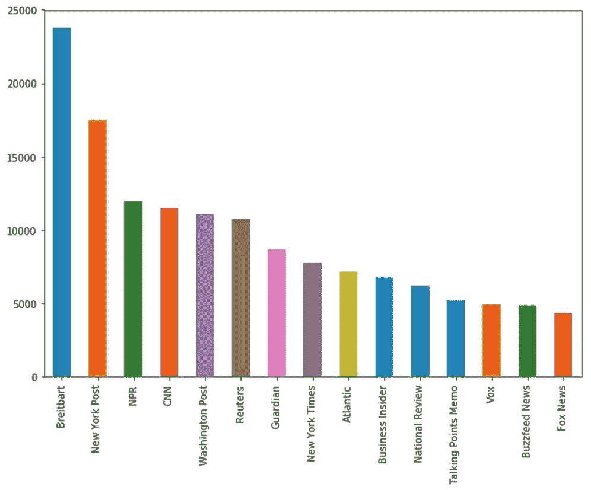

新闻版面分发

正如您在前面的图中看到的，我们提取的数据集不包含来自传统金融新闻媒体的文章，而是主要包含来自主流和政治导向出版物的文章。


# 命名实体识别

NLP 中的一个常见任务是**命名实体识别** ( **NER** )。《NER》是关于寻找文本中明确提到的东西。在讨论发生了什么之前，让我们直接开始，对我们数据集中的第一篇文章做一些实际操作 NER。

除了用于英语语言处理的模型之外，我们需要做的第一件事是加载空间:

```
import spacy

nlp = spacy.load('en')
```

接下来，我们必须从我们的数据中选择文章的文本:

```
text = df.loc[0,'content']
```

最后，我们将通过英语语言模型管道运行这段文本。这将创建一个`Doc`实例，我们在本章前面已经解释过了。该文件将保存大量信息，包括命名实体:

```
doc = nlp(text)
```

spaCy 最好的特性之一是它带有一个方便的可视化工具`displacy`，我们可以用它来显示文本中的命名实体。为了让可视化工具根据我们文章中的文本生成显示，我们必须运行以下代码:

```
from spacy import displacy

displacy.render(doc,              #1style='ent',      #2jupyter=True)     #3
```

现在执行了这个命令，我们完成了三件重要的事情，它们是:

1.  我们已经通过了文件
2.  我们已经指定要呈现实体
3.  我们让`displacy`知道我们正在 Jupyter 笔记本上运行这个程序，这样渲染就能正常工作

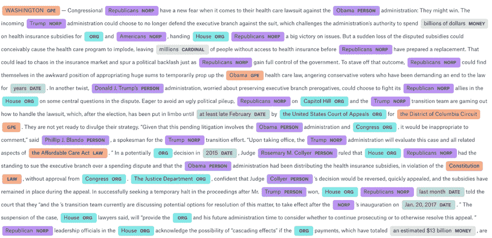

使用 spaCy 标签的先前 NER 的输出

瞧！正如你所看到的，有一些小错误，比如空格被归类为组织，而“奥巴马”被归类为一个地方。

那么，为什么会发生这种情况呢？这是因为标记是由神经网络完成的，而神经网络强烈依赖于它们被训练的数据。因此，由于这些不完善，我们可能会发现我们需要为自己的目的微调标记模型，过一会儿，我们将看到这是如何工作的。

您还可以在我们的输出中看到，NER 提供了广泛的标签，其中一些带有奇怪的缩写。现在，不要担心，因为我们将在本章的后面检查标签的完整列表。

现在，让我们回答一个不同的问题:我们数据集中的新闻写的是什么组织？为了使这个练习运行得更快，我们将创建一个新的管道，在这个管道中，我们将禁用除 NER 之外的所有东西。

为了找出这个问题的答案，我们必须首先运行下面的代码:

```
nlp = spacy.load('en',disable=['parser','tagger','textcat'])
```

下一步，我们将遍历数据集中的前 1，000 篇文章，这可以通过以下代码完成:

```
from tqdm import tqdm_notebook

frames = []

for i in tqdm_notebook(range(1000)):

    doc = df.loc[i,'content']                              #1

    text_id = df.loc[i,'id']                               #2

    doc = nlp(doc)                                         #3

    ents = [(e.text, e.start_char, e.end_char, e.label_)   #4

            for e in doc.ents 

            if len(e.text.strip(' -—')) > 0]

    frame = pd.DataFrame(ents)                             #5

    frame['id'] = text_id                                  #6

    frames.append(frame)                                   #7

npf = pd.concat(frames)                                    #8

npf.columns = ['Text','Start','Stop','Type','id']          #9
```

我们刚刚创建的代码有九个要点。让我们花一分钟来分析一下，这样我们就有信心理解我们刚刚写的内容。注意，在前面的代码中，hashtag，`#`，指的是它在下面的列表中相关的数字:

1.  我们在第`i`行得到文章的内容。
2.  我们得到了文章的 id。
3.  我们通过管道运行文章。
4.  对于找到的所有实体，我们保存文本、第一个和最后一个字符的索引以及标签。只有当标签不仅仅由空格和破折号组成时，才会出现这种情况。这消除了我们之前在分类标记空段或分隔符时遇到的一些麻烦。
5.  我们从创建的元组数组中创建了一个熊猫数据帧。
6.  我们将文章的 id 添加到命名实体的所有记录中。
7.  我们将包含一个文档的所有标记实体的数据帧添加到一个列表中。通过这种方式，我们可以在大量的文章上建立一个标记实体的集合。
8.  我们连接列表中的所有数据帧，这意味着我们创建了一个包含所有标签的大表。
9.  为了便于使用，我们给这些列起了有意义的名字

现在我们已经完成了，下一步是绘制我们发现的实体类型的分布图。该代码将生成一个图表，可以使用以下代码创建该图表:

```
npf.Type.value_counts().plot(kind='bar')
```

代码的输出如下图所示:

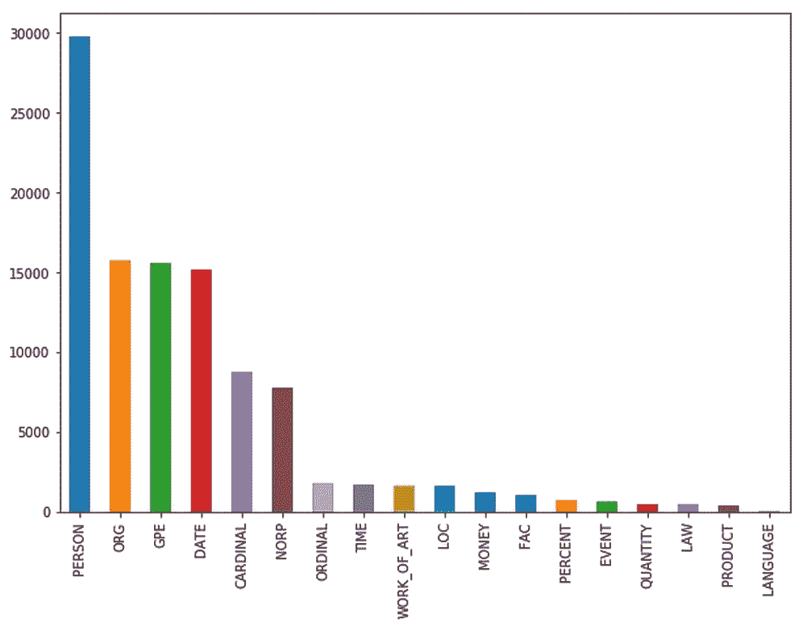

空间标签分布

看到上图后，问 spaCy 可以识别哪些类别以及它们来自哪里是一个合理的问题。spaCy 附带的英语 NER 是一个在 *OntoNotes 5.0 语料库*上训练的神经网络，这意味着它可以识别以下类别:

*   **人物**:人物，包括虚构人物
*   **组织**:公司、代理、机构
*   **GPE** :地点包括国家、城市、州
*   **日期**:绝对日期(如 2017 年 1 月)或相对日期(如两周)
*   **基数**:其他类型不包含的数字
*   NORP:民族、宗教或政治团体
*   **序号**:“第一”、“第二”，依此类推
*   **时间**:比一天短的时间(例如两个小时)
*   艺术作品:书籍、歌曲等的名称
*   **位置**:不在`GPE` s 的位置，例如，山脉或溪流
*   **货币**:货币价值
*   **FAC** :机场、公路或桥梁等设施
*   **百分比**:百分比
*   **事件**:命名的飓风、战斗、体育赛事等等
*   **数量**:重量或距离等测量
*   **法律**:被命名为法律的文件
*   **产品**:物品、车辆、食物等等
*   **语言**:任何命名语言

利用这个列表，我们现在来看看 15 个最常被提及的组织，归类为 ORG。作为其中的一部分，我们将制作一个类似的图表来显示这些信息。

要获得图表，我们必须运行以下命令:

```
orgs = npf[npf.Type == 'ORG']

orgs.Text.value_counts()[:15].plot(kind='bar')
```

生成的代码将给出下图:

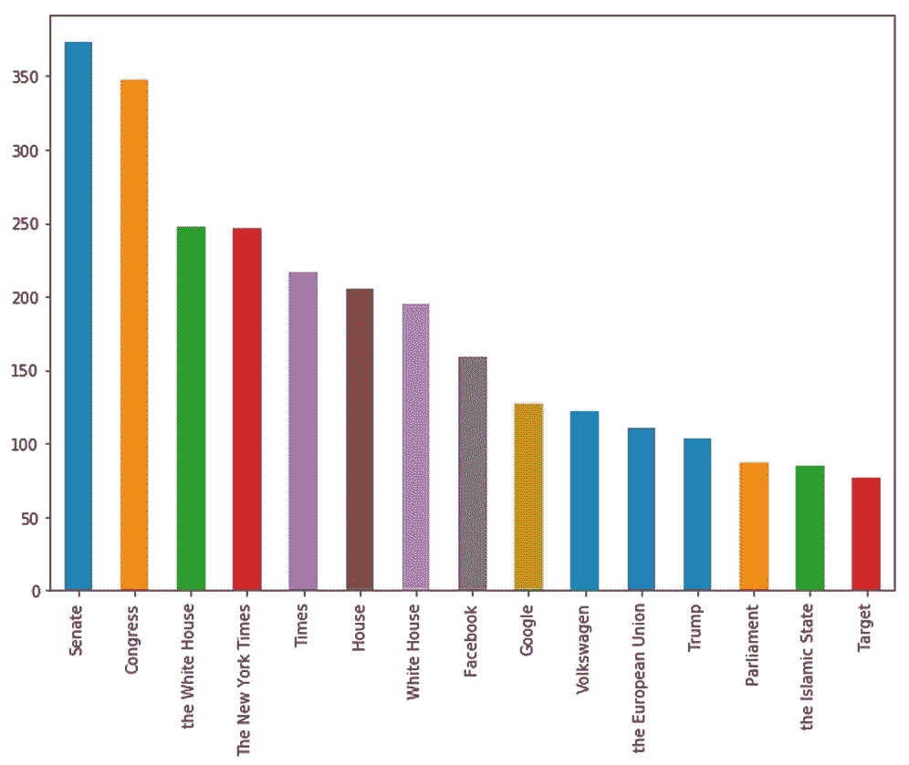

空间组织距离

正如你所看到的，像 T42 参议院这样的政治机构在我们的新闻数据集中出现的频率最高。同样，一些处于媒体关注中心的公司，如大众汽车也可以在图表中找到。花点时间也注意一下**白宫**和**白宫**是如何被列为两个独立的组织，尽管我们知道它们是同一个实体。

根据您的需要，您可能希望进行一些后处理，例如从组织名称中删除“the”。Python 附带了一个内置的字符串替换方法，您可以将它用于 pandas。这将允许您实现后处理。然而，这不是我们将在这里深入讨论的内容。

如果您想更详细地了解它，可以从下面的链接获得文档和示例:[https://pandas . pydata . org/pandas-docs/stable/generated/pandas。Series.str.replace.html](https://pandas.pydata.org/pandas-docs/stable/generated/pandas.Series.str.replace.html)

另外，请注意 **Trump** 在这里显示为一个组织。然而，如果你看一下标签文本，你还会看到“Trump”被多次标记为 NORP，一个政治组织。这是因为 NER 从上下文中推断出标签的类型。由于特朗普是美国总统，他的名字经常在与(政治)组织相同的上下文中使用。

这个经过预先训练的 NER 给了你一个强大的工具，可以解决许多常见的自然语言处理任务。所以，实际上，从这里你可以进行各种其他的调查。例如，我们可以叉开笔记本，看看《纽约时报》作为不同的实体是否比《华盛顿邮报》或《布莱巴特》更常被提及。

## 微调 NER

您可能会发现的一个常见问题是，预训练的 NER 在您希望它处理的特定类型的文本上表现得不够好。要解决这个问题，您需要通过使用自定义数据对 NER 模型进行训练来对其进行微调。实现这一点将是本节的重点。

您使用的训练数据应该是这样的形式:

```
TRAIN_DATA = [

    ('Who is Shaka Khan?', {

        'entities': [(7, 17, 'PERSON')]

    }),

    ('I like London and Berlin.', {

        'entities': [(7, 13, 'LOC'), (18, 24, 'LOC')]

    })

]
```

正如您所看到的，您提供了一个字符串的元组列表，连同开始点和结束点，以及您想要标记的实体的类型。像这样的数据通常是通过人工标记收集的，通常是在亚马逊的**Mechanical Turk**(**MTurk**)等平台上。

spaCy 背后的公司 Explosion AI 也制作了一个名为 *Prodigy* 的(付费)数据标记系统，可以实现高效的数据收集。一旦你收集了足够的数据，你可以微调一个预训练的模型或者初始化一个全新的模型。

为了加载和微调模型，我们需要使用`load()`函数:

```
nlp = spacy.load('en')
```

或者，使用`blank`函数从头开始创建一个新的空模型，为英语语言做好准备:

```
nlp = spacy.blank('en')
```

不管怎样，我们都需要接近 NER 组件。如果您已经创建了一个空白模型，那么您需要创建一个 NER 管道组件并将其添加到模型中。

如果您已经加载了一个现有的模型，那么您可以通过运行以下代码来访问其现有的 NER:

```
if 'ner' not in nlp.pipe_names:

    ner = nlp.create_pipe('ner')

    nlp.add_pipe(ner, last=True)

else:

    ner = nlp.get_pipe('ner')
```

下一步是确保我们的 NER 能够识别我们的标签。假设我们的数据包含一种新类型的命名实体，比如`ANIMAL`。使用`add_label`函数，我们可以向 NER 添加标签类型。

实现这一点的代码可以在下面看到，但是如果它现在没有意义，不要担心，我们将在下一页分解它:

```
for _, annotations in TRAIN_DATA:

    for ent in annotations.get('entities'):

        ner.add_label(ent[2])

import random

                                                   #1

other_pipes = [pipe for pipe in nlp.pipe_names if pipe != 'ner']

with nlp.disable_pipes(*other_pipes):

    optimizer = nlp._optimizer                     #2

    if not nlp._optimizer:

        optimizer = nlp.begin_training()

    for itn in range(5):                           #3

        random.shuffle(TRAIN_DATA)                 #4

        losses = {} #5

        for text, annotations in TRAIN_DATA:       #6

            nlp.update(                            #7

                [text],  

                [annotations],  

                drop=0.5,                          #8

                sgd=optimizer,                     #9

                losses=losses)                     #10

        print(losses)
```

我们刚刚写的由 10 个关键元素组成:

1.  我们禁用所有不属于 NER 的管道组件，方法是首先获取所有不属于 NER 的组件的列表，然后禁用它们进行训练。
2.  预训练模型带有一个优化器。如果您有一个空白模型，您将需要创建一个新的优化器。请注意，这也会重置模型权重。
3.  我们现在训练许多个纪元，在这种情况下，是 5 个。
4.  在每个时期的开始，我们使用 Python 的内置`random`模块来混洗训练数据。
5.  我们创建一个空字典来记录损失。
6.  然后，我们对训练数据中的文本和注释进行循环。
7.  `nlp.update`执行一次向前和向后传递，并更新神经网络权重。我们需要提供文本和注释，以便该函数可以从中找出如何训练网络。
8.  我们可以手动指定训练时要使用的辍学率。
9.  我们通过一个随机梯度下降优化器来执行模型更新。注意，这里不能只传递一个 Keras 或 TensorFlow 优化器，因为 spaCy 有自己的优化器。
10.  我们还可以通过字典来记录损失，以便以后打印出来监控进度。

一旦您运行了代码，输出应该如下所示:

```

{'ner': 5.0091189558407585}

{'ner': 3.9693684224622108}

{'ner': 3.984836024903589}

{'ner': 3.457960373417813}

{'ner': 2.570318400714134}

```

你看到的是空间管道的一部分的损失值，在这个例子中，是**命名实体识别** ( **NER** )引擎。类似于我们在前面章节中讨论的交叉熵损失，实际值很难解释，也不能告诉你太多。这里重要的是，损耗随着时间的推移而减少，并且达到比初始损耗低得多的值。


# 词性标注

2017 年 10 月 10 日星期二，上午 9 点 34 分至 9 点 36 分之间，美国道琼斯通讯社遇到了一个技术错误，导致其发布了一些奇怪的标题。其中一条是，“谷歌收购苹果。”这四个字使得苹果公司的股票上涨了超过百分之二。

在这里，算法交易系统显然没有理解这样的收购是不可能的，因为苹果当时的市值为 8000 亿美元，加上此举可能不会获得监管机构的批准。

那么，问题就来了，为什么交易算法会根据这四个字来选择买入股票呢？答案是通过**词性** ( **词性**)标注。词性标注有助于理解哪些单词在句子中起什么作用以及这些单词之间的关系。

spaCy 配有一个方便的、经过预先训练的 POS tagger。在这一节中，我们将把它应用到 Google/Apple 新闻报道中。要启动 POS tagger，我们需要运行以下代码:

```
import spacy

from spacy import displacy

nlp = spacy.load('en')

doc = 'Google to buy Apple'

doc = nlp(doc)

displacy.render(doc,style='dep',jupyter=True, options={'distance':120})
```

同样，我们将加载预训练的英语模型，并通过它运行我们的句子。然后我们将使用`displacy`,就像我们对 NER 所做的那样。

为了使图形更好地适应本书，我们将把`distance`选项设置为比默认值更短的值，在本例中为 1，120，以便单词显示得更近，如下图所示:

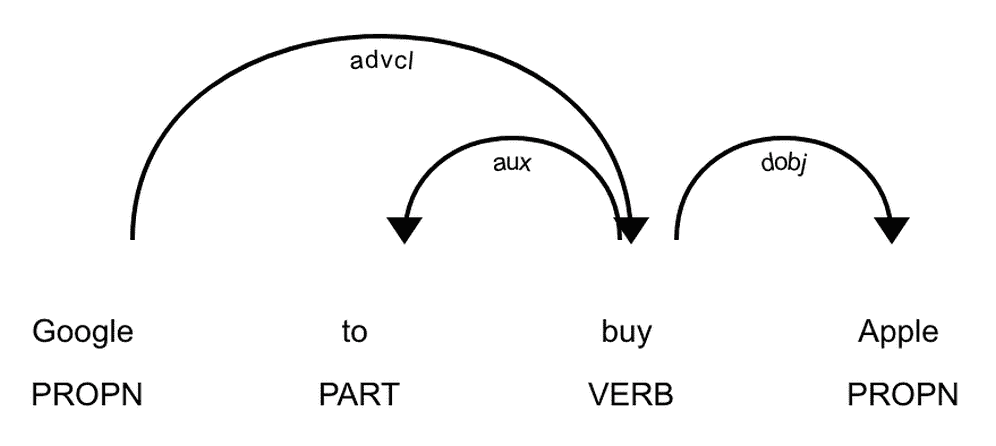

空间位置标签

正如你所看到的，POS tagger 将 **buy** 识别为动词，将 **Google** 和 **Apple** 识别为句子中的名词。它还识别出**苹果**是应用动作的对象，而**谷歌**正在应用动作。

我们可以通过以下代码访问名词的信息:

```
nlp = spacy.load('en')

doc = 'Google to buy Apple'

doc = nlp(doc)

for chunk in doc.noun_chunks:

    print(chunk.text, chunk.root.text, chunk.root.dep_,chunk.root.head.text)
```

运行上述代码后，我们得到了下表:

| 

文本

 | 

根文本

 | 

根 dep

 | 

根标题文本

 |
| --- | --- | --- | --- |
| 谷歌 | 谷歌 | 根 | 谷歌 |
| 苹果 | 苹果 | dobj | 买 |

在我们的例子中，Google 是句子的词根，而 Apple 是句子的宾语。应用于苹果的动词是“购买”。

从这里开始，它只是一个收购下价格发展的硬编码模型(对目标股票的需求上升，价格也随之上升)和一个简单的事件驱动交易算法的股票查找表。然而，让这些算法理解上下文和合理性是另一回事。


# 基于规则的匹配

在深度学习和统计建模接管之前，NLP 都是关于规则的。这并不是说基于规则的系统已经死亡！当涉及到做简单的任务时，它们通常很容易设置并且执行得很好。

假设您想在一个文本中找到所有提到 Google 的内容。你真的会训练一个基于神经网络的命名实体识别器吗？如果你这样做了，你必须通过神经网络运行所有的文本，然后在实体文本中寻找谷歌。或者，你宁愿用经典搜索算法搜索与谷歌完全匹配的文本吗？好吧，我们很幸运，因为 spaCy 附带了一个易于使用、基于规则的匹配器，允许我们这样做。

在开始这一部分之前，我们首先必须确保重新加载英语语言模型并导入匹配器。这是一个非常简单的任务，可以通过运行以下代码来完成:

```
import spacy

from spacy.matcher import Matcher

nlp = spacy.load('en')
```

匹配器搜索模式，我们将其编码为一个字典列表。它逐个符号地操作，也就是说，逐字地操作，除了标点符号和数字，在标点符号和数字中，单个符号可以是一个符号。

作为一个开始的例子，让我们搜索短语“你好，世界。”为此，我们将定义如下模式:

```
pattern = [{'LOWER': 'hello'}, {'IS_PUNCT': True}, {'LOWER': 'world'}]
```

如果小写的第一个标记是`hello`，则满足该模式。`LOWER`属性检查如果两个单词都被转换成小写，它们是否匹配。这意味着如果实际的令牌文本是“HELLO”或“Hello”，那么它也将满足要求。第二个标记必须是标点符号，以获得逗号，因此短语“hello。世界”或“你好！“世界”都可以，但“你好，世界”不行。

第三个令牌的小写字母必须是“world”，所以“WoRlD”也没问题。

令牌的可能属性如下:

*   `ORTH`:令牌文本必须完全匹配
*   `LOWER`:令牌的小写必须匹配
*   `LENGTH`:令牌文本的长度必须匹配
*   `IS_ALPHA`、`IS_ASCII`、`IS_DIGIT`:令牌文本必须由字母数字字符、ASCII 符号或数字组成
*   `IS_LOWER`、`IS_UPPER`、`IS_TITLE`:令牌文本必须是小写、大写或标题大写
*   `IS_PUNCT`、`IS_SPACE`、`IS_STOP`:令牌文本必须是标点符号、空白或停用词
*   `LIKE_NUM`、`LIKE_URL`、`LIKE_EMAIL`:令牌必须类似于数字、URL 或电子邮件
*   `POS`、`TAG`、`DEP`、`LEMMA`、`SHAPE`:令牌的位置、标签、依赖性、引理或形状必须匹配
*   `ENT_TYPE`:来自 NER 的令牌的实体类型必须匹配

spaCy 的引理化极其有用。一个引理是一个词的基本版本。例如，“was”是“be”的一个版本，所以“be”是“was”的引理，也是“is”的引理。spaCy 可以在上下文中对单词进行词汇化，这意味着它使用周围的单词来确定单词的实际基本版本。

要创建一个匹配器，我们必须传递匹配器使用的词汇。在这种情况下，我们可以通过运行以下命令来传递英语语言模型的词汇:

```
matcher = Matcher(nlp.vocab)
```

为了将所需的属性添加到我们的匹配器中，我们必须调用以下内容:

```
matcher.add('HelloWorld', None, pattern)
```

`add`函数需要三个参数。第一个是模式的名称，在本例中是`HelloWorld`，这样我们可以跟踪我们添加的模式。第二个是一个函数，一旦找到匹配就可以处理。这里我们通过了`None`，这意味着不会应用任何函数，尽管我们稍后会用到这个工具。最后，我们需要传递我们想要搜索的令牌属性列表。

要使用我们的匹配器，我们可以简单地调用`matcher(doc)`。这将返回匹配器找到的所有匹配。我们可以通过运行以下命令来调用它:

```
doc = nlp(u'Hello, world! Hello world!')

matches = matcher(doc)
```

如果我们打印出匹配，我们可以看到结构:

```

matches

[(15578876784678163569, 0, 3)]

```

匹配的第一件事是找到的字符串的散列。这只是为了确定内部发现了什么；我们不会在这里使用它。接下来的两个数字表示匹配器找到的东西的范围，这里是令牌 0 到 3。

我们可以通过索引原始文档来获取文本:

```
doc[0:3]
```

```

Hello, wor

ld

```

在下一节中，我们将看看如何向匹配器添加自定义函数。

## 向匹配器添加自定义功能

让我们来看一个更复杂的案例。我们知道 iPhone 是一种产品。然而，基于神经网络的匹配器通常将它归类为一个组织。发生这种情况是因为“iPhone”这个词在与组织类似的上下文中被大量使用，例如“iPhone 提供了……”或者“iPhone 卖出去了……”

让我们构建一个基于规则的匹配器，它总是将单词“iPhone”归类为产品实体。

首先，我们必须得到单词 PRODUCT 的散列。空间中的单词可以通过它们的散列来唯一地识别。实体类型也通过它们的散列来识别。要设置产品类型的实体，我们必须能够提供实体名称的散列。

我们可以通过运行以下代码从语言模型的词汇表中获取名称:

```
PRODUCT = nlp.vocab.strings['PRODUCT']
```

接下来，我们需要定义一个`on_match`规则。每当匹配器找到一个匹配项时，就会调用这个函数。`on_match`规则有四个自变量:

*   `matcher`:进行匹配的匹配器。
*   `doc`:进行匹配的文档。
*   `i`:匹配的索引。文档中第一个匹配项的索引为 0，第二个匹配项的索引为 1，依此类推。
*   `matches`:所有匹配的列表。

在我们的`on_match`规则中发生了两件事:

```
def add_product_ent(matcher, doc, i, matches):

    match_id, start, end = matches[i]            #1

    doc.ents += ((PRODUCT, start, end),)         #2
```

让我们来分解一下它们是什么:

1.  我们对所有匹配进行索引，以在索引`i`处找到我们的匹配。一个匹配是一个`match_id`、匹配的开始和匹配的结束的元组。
2.  我们向文档的命名实体添加一个新的实体。实体是实体的类型的散列(这里是单词`PRODUCT`的散列)、实体的开始和实体的结束的元组。要追加一个实体，我们必须将它嵌套在另一个元组中。只包含一个值的元组需要在末尾包含一个逗号。重要的是不要覆盖`doc.ents`，否则我们会删除已经找到的所有实体。

现在我们有了一个`on_match`规则，我们可以定义我们的匹配器了。

我们应该注意，匹配器允许我们添加多个模式，所以我们可以只为单词“iPhone”添加一个匹配器，为单词“iPhone”添加另一个模式以及版本号，如“iPhone 5”:

```
pattern1 = [{'LOWER': 'iPhone'}]                           #1

pattern2 = [{'ORTH': 'iPhone'}, {'IS_DIGIT': True}]        #2

matcher = Matcher(nlp.vocab)                               #3

matcher.add('iPhone', add_product_ent,pattern1, pattern2)  #4
```

那么，是什么让这些命令起作用的呢？

1.  我们定义第一种模式。
2.  我们定义第二种模式。
3.  我们创建一个新的空匹配器。
4.  我们将模式添加到匹配器中。这两个都属于被称为`iPhone`的规则，这两个都将我们的`on_match`规则称为`add_product_ent`。

我们现在将通过匹配器传递一篇新闻文章:

```
doc = nlp(df.content.iloc[14])         #1

matches = matcher(doc)                 #2
```

这段代码相对简单，只有两步:

1.  我们通过管道运行文本来创建带注释的文档。
2.  我们用匹配器检索文件。这将修改上一步中创建的文档。我们不太关心匹配，而是更关心`on_match`方法如何将匹配作为实体添加到我们的文档中。

既然 matcher 已经设置好了，我们需要将它添加到管道中，以便 spaCy 可以自动使用它。这将是下一节的重点。

## 向管道添加匹配器

单独调用 matcher 有些繁琐。要将它添加到管道中，我们必须将其包装到一个函数中，这可以通过运行以下代码来实现:

```
def matcher_component(doc):

    matches = matcher(doc)

    return doc
```

空间管道将管道的组件作为函数调用，并且总是期望返回带注释的文档。退回任何其他东西都可能会破坏管道。

然后，我们可以将匹配器添加到主管道中，如下面的代码所示:

```
nlp.add_pipe(matcher_component,last=True)
```

匹配器现在是管道的最后一部分。从这一点开始，iPhones 现在将根据匹配器的规则进行标记。

然后嘣！所有提到“iPhone”(不区分大小写)的地方现在都被标记为产品类型的命名实体。您可以通过显示带有`displacy`的实体来验证这一点，正如我们在下面的代码中所做的那样:

```
displacy.render(doc,style='ent',jupyter=True)
```

代码的结果可以在下面的屏幕截图中看到:


spaCy 现在发现 iPhone 是一种产品

## 结合基于规则和基于学习的系统

spaCy 的管道系统的一个特别有趣的方面是，它可以相对容易地组合它的不同方面。例如，我们可以将基于神经网络的命名实体识别与基于规则的匹配器结合起来，以便找到诸如高管薪酬信息之类的信息。

媒体经常报道高管薪酬，但很难找到总体数据。高管薪酬的一种可能的基于规则的匹配模式如下所示:

```
pattern = [{'ENT_TYPE':'PERSON'},{'LEMMA':'receive'},{'ENT_TYPE':'MONEY'}]
```

寻找这种模式的匹配器将选取人名的任意组合，例如，John Appleseed 或 Daniel 单词 receive 的任何版本，例如 received、received 等；后面是钱的表达式，比如 400 万美元。

这个匹配器可以在大型文本语料库上运行，使用`on_match`规则可以方便地将找到的片段保存到数据库中。用于命名实体的机器学习方法和基于规则的方法无缝地携手并进。

由于有更多的带有姓名和金钱注释的训练数据，而不是关于高管教育的陈述，因此将 NER 与基于规则的方法结合起来，比训练一个新的 NER 要容易得多。


# 正则表达式

正则表达式是一种强大的基于规则的匹配形式。它们发明于 20 世纪 50 年代，在很长一段时间里，它们是在文本中寻找东西的最有用的方式，支持者认为它们仍然是。

如果不提到正则表达式，关于 NLP 的任何一章都是不完整的。也就是说，本节绝不是一个完整的正则表达式教程。它旨在介绍一般概念，并展示如何在 Python、pandas 和 spaCy 中使用正则表达式。

一个非常简单的正则表达式模式可以是“a”，它只能找到小写字母 a 后面跟一个点的实例。然而，正则表达式也允许您添加模式范围；例如，“[a-z]。”会找到任何小写字母后面跟一个点和“xy”只会找到后面带点的字母“x”或“y”。

正则表达式模式是区分大小写的，所以“A-Z”只能捕获大写字母。如果我们在搜索拼写经常不同的表达式，这是很有用的；例如，模式“seriali[sz]e”将捕获该单词的英式和美式英语版本。

数字也是如此。“0-9”表示从 0 到 9 的所有数字。要查找重复项，可以使用“*”来捕获零个或多个重复项，或者使用“+”来捕获一个或多个重复项。例如，“[0-9]+”将捕获任何一系列数字，这在查找年份时可能很有用。而“[A-Z][a-z] + [0-9] +”会查找以大写字母开头、后跟一个或多个数字的所有单词，如“2018 年 3 月”以及“大白鲨 2”

花括号可以用来定义重复的次数。例如，“[0-9]{4}”将查找正好有四个数字的数字序列。如您所见，正则表达式并不试图理解文本中的内容，而是提供了一种寻找匹配模式的文本的巧妙方法。

金融行业的一个实际用例是在发票中查找公司的增值税号码。这些在大多数国家都遵循一个非常严格的模式，很容易被编码。例如，荷兰的增值税数字遵循以下正则表达式模式:“NL[0-9]{9}B[0-9]{2}”。

## 使用 Python 的 regex 模块

Python 有一个名为`re`的用于正则表达式的内置工具。虽然不需要安装它，因为它是 Python 本身的一部分，但是我们可以用下面的代码导入它:

```
import re
```

假设我们正在开发自动发票处理器，我们想要找到给我们发送发票的公司的增值税号。为了简单起见，我们将只处理荷兰的增值税数字(荷兰语中的“增值税”是“BTW”)。如前所述，我们知道荷兰增值税号码的模式如下:

```
pattern = 'NL[0-9]{9}B[0-9]{2}'
```

用于查找 BTW 号码的字符串可能如下所示:

```
my_string = 'ING Bank N.V. BTW:NL003028112B01'
```

因此，要在字符串中找到某个 BTW 号码的所有出现，我们可以调用`re.findall`，它将返回与找到的模式匹配的所有字符串的列表。要调用它，我们只需运行:

```
re.findall(pattern,my_string)
```

```

['NL003028112B01']

```

`re`还允许传递标志，使得正则表达式模式的开发变得更加容易。例如，为了在匹配正则表达式时忽略字母的大小写，我们可以添加一个`re.IGNORECASE`标志，就像我们在这里做的那样:

```
re.findall(pattern,my_string, flags=re.IGNORECASE)
```

通常，我们对比赛的更多信息感兴趣。为此，有一个`match`对象。`re.search`为找到的第一个匹配产生一个`match`对象:

```
match = re.search(pattern,my_string)
```

我们可以从这个对象中获得更多的信息，比如我们匹配的位置，只需运行:

```
match.span()

(18, 32)

```

跨度，我们匹配的开始和结束，是字符 18 到 32。

## 熊猫里的正则表达式

自然语言处理问题的数据通常来自熊猫数据框。幸运的是，熊猫天生支持正则表达式。例如，如果我们想找出新闻数据集中是否有任何文章包含荷兰 BTW 号码，那么我们可以传递以下代码:

```
df[df.content.str.contains(pattern)]
```

这将产生所有包含荷兰 BTW 号的文章，但不出所料，我们的数据集中没有包含荷兰 BTW 号的文章。

## 何时使用正则表达式，何时不使用

正则表达式是一个强大的工具，这个非常简短的介绍并没有公正地对待它。事实上，有几本书比这本书更长，它们纯粹是关于正则表达式的。然而，出于本书的目的，我们只打算简单地向您介绍一下这个主题。

作为一种工具，正则表达式可以很好地处理简单且定义清晰的模式。VAT/BTW 号码是一个很好的例子，电子邮件地址和电话号码也是，这两个都是非常流行的正则表达式用例。然而，当模式难以定义或者只能从上下文中推断时，正则表达式就会失败。不可能创建一个基于规则的命名实体识别器来发现一个单词是指一个人的名字，因为名字没有明确的区分模式。

所以，下一次你想找一些人类容易发现但难以用规则描述的东西时，请使用基于机器学习的解决方案。同样，下一次您在寻找编码清晰的内容时，比如增值税号，请使用正则表达式。


# 文本分类任务

一个常见的 NLP 任务是分类文本。最常见的文本分类是在情感分析中完成的，其中文本被分类为正面或负面。在这一节中，我们将考虑一个稍微难一点的问题，对一条推文是否是关于一场实际发生的灾难进行分类。

今天，投资者已经开发了许多从推特上获取信息的方法。Twitter 用户通常比新闻媒体更快地报道灾难，如火灾或洪水。就金融而言，这种速度优势可以用于并转化为事件驱动的交易策略。

然而，并不是所有包含与灾难相关的词的推文实际上都是关于灾难的。诸如“旧金山附近的加州森林着火了”这样的推文应该被考虑在内，而“这个周末加州着火了，旧金山的美好时光”可以被安全地忽略。

这里的任务的目标是建立一个分类器，将与真实灾难相关的推文与不相关的推文分开。我们使用的数据集由手工标注的推文组成，这些推文是通过在 Twitter 上搜索灾难推文中常见的词(如“着火”或“火灾”)获得的。

### 注

**注**:为准备本节，可在[https://www.kaggle.com/jannesklaas/nl](https://www.kaggle.com/jannesklaas/nl)的 Kaggle 上找到代码和数据。


# 准备数据

编写案文本身就是一项任务。这是因为在现实世界中，文本通常是杂乱的，无法通过简单的缩放操作来修复。例如，人们在添加不必要的字符后经常会出现打字错误，因为他们添加了我们无法阅读的文本编码。NLP 涉及它自己的一套数据清理挑战和技术。

## 消毒字符

为了存储文本，计算机需要将字符编码成比特。有几种不同的方法可以做到这一点，并不是所有的方法都可以处理所有的角色。

将所有文本文件保存在一种编码方案中是一种好的做法，通常是 UTF-8，但是当然，这并不总是发生。文件也可能被破坏，这意味着一些位是关闭的，因此呈现一些字符不可读。因此，在我们做任何事情之前，我们需要净化我们的输入。

Python 提供了一个有用的`codecs`库，它允许我们处理不同的编码。我们的数据是 UTF-8 编码的，但是有一些特殊的字符不容易阅读。因此，我们必须清除文本中的这些特殊字符，这可以通过运行以下命令来实现:

```
import codecs

input_file = codecs.open('../input/socialmedia-disaster-tweets-DFE.csv','r',',encoding='utf-8', errors='replace')
```

在前面的代码中，`codecs.open`充当 Python 的标准文件打开函数的替身。它返回一个文件对象，我们以后可以逐行读取。我们指定我们想要读取文件的输入路径(用`r`)、期望的编码以及如何处理错误。在这种情况下，我们将使用特殊的不可读字符标记来替换错误。

要写入输出文件，我们可以只使用 Python 的标准`open()`函数。该函数将在我们可以写入的指定文件路径创建一个文件:

```
output_file = open('clean_socialmedia-disaster.csv', 'w')
```

现在已经完成了，我们所要做的就是遍历我们用`codecs`阅读器读取的输入文件中的行，并再次将其保存为一个普通的 CSV 文件。我们可以通过运行以下命令来实现这一点:

```
for line in input_file:

    out = line

    output_file.write(line)
```

同样，最好在之后关闭文件对象，我们可以通过运行:

```
input_file.close()

output_file.close()
```

现在我们可以用 pandas 来读取经过清理的 CSV 文件:

```
df = pd.read_csv('clean_socialmedia-disaster.csv')
```

## 词汇化

在这一章中，引理已经出现了几次。语言学领域的一个词条，也称为中心词，是一组相关单词或形式出现在词典中的单词。例如，“was”和“is”出现在“be”下，“mouse”出现在“mouse”下，依此类推。通常，单词的具体形式并不重要，因此将所有文本转换成其词条形式是个好主意。

spaCy 提供了一种简便的方法来对文本进行词汇化，所以我们将再次加载 spaCy 管道。只是在这种情况下，除了标记器之外，我们不需要任何管道模块。记号赋予器通常通过空格将文本分割成单独的单词。这些单独的单词或记号可以用来查找它们的引理。在我们的例子中，它看起来像这样:

```
import spacy

nlp = spacy.load('en',disable=['tagger','parser','ner'])
```

术语化可能会很慢，尤其是对于大文件，所以跟踪我们的进度是有意义的。`tqdm`允许我们在熊猫`apply`功能上显示进度条。我们所要做的就是导入`tqdm`以及笔记本组件，以便在我们的工作环境中进行漂亮的渲染。然后我们必须告诉`tqdm`我们想把它用在熊猫身上。我们可以通过运行以下命令来实现这一点:

```
from tqdm import tqdm, tqdm_notebook

tqdm.pandas(tqdm_notebook)
```

我们现在可以在数据帧上运行`progress_apply`，就像我们使用标准的`apply`方法一样，但是这里有一个进度条。

对于每一行，我们循环遍历`text`列中的单词，并将单词的词条保存在新的`lemmas`列中:

```
df['lemmas'] = df["text"].progress_apply(lambda row: [w.lemma_ for w in nlp(row)])
```

我们的`lemmas`列现在充满了列表，所以为了将列表转换回文本，我们将使用空格作为分隔符来连接列表的所有元素，如下面的代码所示:

```
df['joint_lemmas'] = df['lemmas'].progress_apply(lambda row: ' '.join(row))
```

## 准备目标

该数据集中有几个可能的预测目标。在我们的例子中，人们被要求对一条推文进行评级，他们有三个选项，`Relevant`、`Not Relevant`和`Can't Decide`，如词条化的文本所示:

```
df.choose_one.unique()

array(['Relevant', 'Not Relevant', "Can't Decide"], dtype=object)
```

人类无法判断是否是关于一场真正的灾难的推文对我们来说并不有趣。因此，我们将只移除类别，*不能决定*，这可以在下面的代码中完成:

```
df = df[df.choose_one != "Can't Decide"]
```

我们也只对将文本映射到相关性感兴趣，因此我们可以删除所有其他元数据，只保留这两列，我们在这里这样做:

```
df = df[['text','choose_one']]
```

最后，我们要把目标转换成数字。这是一个二元分类任务，因为只有两个类别。因此，我们将`Relevant`映射到`1`并将`Not Relevant`映射到`0`:

```
f['relevant'] = df.choose_one.map({'Relevant':1,'Not Relevant':0})
```

## 准备训练集和测试集

在我们开始构建模型之前，我们将把数据分成两组，训练数据集和测试数据集。为此，我们只需运行以下代码:

```
from sklearn.model_selection import train_test_split

X_train, X_test, y_train, y_test = train_test_split(df['joint_lemmas'], 

                                                    df['relevant'], 

                                                    test_size=0.2,

                                                    random_state=42)
```


# 词汇袋

对文本进行分类的一个简单而有效的方法是把文本看作一个单词包。这意味着我们不关心单词在文本中出现的顺序，相反，我们只关心哪些单词出现在文本中。

进行单词袋分类的方法之一是简单地统计文本中不同单词的出现次数。这是通过所谓的**计数向量**来完成的。每个单词都有一个索引，对于每个文本，该索引处的计数向量的值是属于该索引的单词的出现次数。

举个例子:文本“我看见猫、狗和大象”的计数向量可能是这样的:

| 

我

 | 

看见

 | 

猫

 | 

和

 | 

狗

 | 

大象

 |
| --- | --- | --- | --- | --- | --- |
| 一 | 一 | 一 | 2 | 一 | 一 |

实际上，计数向量非常稀疏。在我们的文本语料库中大约有 23，000 个不同的单词，因此限制我们希望包含在计数向量中的单词数量是有意义的。这可能意味着排除那些通常只是胡言乱语或毫无意义的错别字。顺便提一下，如果我们保留所有的生僻字，这可能是过度拟合的来源。

我们正在使用`sklearn`的内置计数矢量器。通过设置`max_features`，我们可以控制我们想要在计数向量中考虑多少个单词。在这种情况下，我们将只考虑 10，000 个最常用的单词:

```
from sklearn.feature_extraction.text import CountVectorizer

count_vectorizer = CountVectorizer(max_features=10000)
```

我们的计数矢量器现在可以将文本转换成计数矢量。每个计数向量将有 10，000 个维度:

```
X_train_counts = count_vectorizer.fit_transform(X_train)

X_test_counts = count_vectorizer.transform(X_test)
```

一旦我们获得了 count 向量，我们就可以对它们进行简单的逻辑回归。虽然我们可以使用 Keras 进行逻辑回归，就像我们在本书的第一章中所做的那样，但是使用 scikit-learn 中的逻辑回归类通常更容易:

```
from sklearn.linear_model import LogisticRegression

clf = LogisticRegression()

clf.fit(X_train_counts, y_train)

y_predicted = clf.predict(X_test_counts)
```

既然我们有了逻辑回归的预测，我们可以用`sklearn`来衡量它的准确性:

```
from sklearn.metrics import accuracy_score

accuracy_score(y_test, y_predicted)
```

```

0.8011049723756906

```

如你所见，我们有 80%的准确率，对于这样一个简单的方法来说，这已经很不错了。一个简单的基于计数向量的分类作为更高级方法的基线是有用的，我们将在后面讨论。

## TF-IDF

**TF-IDF** 代表**词频，逆文档频率**。它旨在解决简单的单词计数问题，即频繁出现在文本中的单词是重要的，而出现在*所有*文本中的单词是不重要的。

TF 组件就像一个计数向量，只是 TF 将计数除以文本中的总字数。同时，IDF 分量是整个语料库中的文本总数除以包括特定单词的文本数量的对数。

TF-IDF 是这两个测量值的乘积。TF-IDF 向量类似于计数向量，只是它们包含 TF-IDF 分数而不是计数。罕见词将在 TF-IDF 向量中获得高分。

我们创建 TF-IDF 向量，就像我们用`sklearn`创建 count 向量一样:

```
from sklearn.feature_extraction.text import TfidfVectorizer

tfidf_vectorizer = TfidfVectorizer()

X_train_tfidf = tfidf_vectorizer.fit_transform(X_train)

X_test_tfidf = tfidf_vectorizer.transform(X_test)
```

一旦我们有了 TF-IDF 向量，我们就可以对它们训练一个逻辑回归器，就像我们对计数向量所做的那样:

```
clf_tfidf = LogisticRegression()

clf_tfidf.fit(X_train_tfidf, y_train)

y_predicted = clf_tfidf.predict(X_test_tfidf)
```

在这种情况下，TF-IDF 的表现比 count vectors 稍差。但是，因为性能差异非常小，所以在这种情况下，这种较差的性能可能归因于偶然因素:

```
accuracy_score(y_pred=y_predicted, y_true=y_test)
```

```

0.79788213627992

63

```


# 话题建模

字数统计的最后一个非常有用的应用是主题建模。给定一组文本，我们能找到主题群吗？做到这一点的方法叫做**潜在狄利克雷分配** ( **LDA** )。

### 注意

**注**:该部分的代码和数据可在[https://www.kaggle.com/jannesklaas/topic-modeling-with-lda](https://www.kaggle.com/jannesklaas/topic-modeling-with-lda)的 Kaggle 上找到。

虽然这个名字很拗口，但算法是非常有用的，所以我们将一步一步来看。LDA 对如何书写文本做了如下假设:

1.  首先选择一个话题分布，比如 70%机器学习，30%金融。
2.  第二，选择每个题目的单词分布。例如，主题“机器学习”可能由 20%的单词“张量”、10%的单词“梯度”等组成。这意味着我们的主题分布是分布的*分布，也称为狄利克雷分布。*
3.  一旦文本写好了，就要为每个单词做两个概率决策:首先，从文档中的主题分布中选择一个主题。然后，为该文档中的单词分布选择一个单词。

注意，不是所有的文档在一个语料库中都有相同的主题分布。我们需要指定固定数量的主题。在学习过程中，我们首先将语料库中的每个单词随机分配给一个主题。对于每个文档，我们计算如下:


前面的公式是每个主题 *t、*被包含在文档 *d* 中的概率。对于每个单词，我们然后计算:


那就是一个词的概率， *w，*属于一个话题， *t* 。然后，我们以下面的概率将单词分配给新主题， *t，*:


换句话说，我们假设除了当前正在考虑的单词之外，所有的单词都已经被正确地分配给一个主题。然后，我们尝试将单词分配给主题，以使文档在主题分布上更加同质。这样，实际上属于一个主题的单词会聚集在一起。

Scikit-learn 提供了一个易于使用的 LDA 工具来帮助我们实现这一目标。要使用它，我们必须首先创建一个新的 LDA 分析器，并指定主题的数量，即我们期望的组件。

这可以通过简单地运行以下命令来完成:

```
from sklearn.decomposition import LatentDirichletAllocation

lda = LatentDirichletAllocation(n_components=2)
```

然后，我们创建计数向量，就像我们对单词袋分析所做的那样。对于 LDA 来说，重要的是删除没有任何意义的常用词，如“an”或“the”，即所谓的停用词。`CountVectorizer`带有一个内置的停用词词典，可以自动删除这些单词。要使用它，我们需要运行以下代码:

```
from sklearn.feature_extraction.text import TfidfVectorizer, CountVectorizer

vectorizer = CountVectorizer(stop_words='english')

tf = vectorizer.fit_transform(df['joint_lemmas'])
```

接下来，我们将 LDA 拟合到计数向量:

```
lda.fit(tf)
```

为了检查我们的结果，我们可以打印出每个主题最常用的单词。为此，我们首先需要指定我们想要打印的每个主题的字数，在本例中是 5。我们还需要提取单词计数向量索引到单词的映射:

```
n_top_words = 5

tf_feature_names = vectorizer.get_feature_names()
```

现在我们可以循环浏览 LDA 的主题，以便打印最常用的单词:

```
for topic_idx, topic in enumerate(lda.components_):

        message = "Topic #%d: " % topic_idx

        message += " ".join([tf_feature_names[i]

                             for i in topic.argsort()[:-n_top_words - 1:-1]])

        print(message)

Topic #0: http news bomb kill disaster

Topic #1: pron http like just https

```

正如你所看到的，LDA 似乎在没有给定目标的情况下，自己发现了严重和非严重推文的分组。

这种方法对于新闻文章的分类也非常有用。回到金融领域，投资者可能想知道是否有一篇新闻文章提到了他们面临的风险因素。面向消费者的组织的支持请求也是如此，可以通过这种方式进行集群。


# 词语嵌入

文本中单词的顺序很重要。因此，如果我们不只是从整体上看文本，而是把它们看作一个序列，我们可以期待更高的性能。本节使用了前一章中讨论的许多技术；然而，这里我们要添加一个关键的成分，词向量。

单词和单词标记是分类特征。因此，我们不能直接将它们输入神经网络。以前，我们通过将分类数据转换成一个热编码向量来处理分类数据。然而对于文字来说，这是不切实际的。因为我们的词汇量是 10，000 个单词，所以每个向量将包含 10，000 个数字，除了一个以外，这些数字都是零。这是非常低效的，所以我们将使用嵌入。

实际上，嵌入就像一个查找表。对于每个令牌，它们存储一个向量。当令牌被提供给嵌入层时，它返回该令牌的向量，并将其传递给神经网络。随着网络的训练，嵌入也得到优化。

记住，神经网络的工作原理是用计算损失函数相对于模型参数(权重)的导数。通过反向传播，我们还可以计算损失函数相对于模型输入的导数。因此，我们可以优化嵌入，以交付有助于我们的模型的理想输入。

## 用词向量进行训练的预处理

在我们开始训练单词嵌入之前，我们需要做一些预处理步骤。也就是说，我们需要给每个单词标记分配一个数字，并创建一个充满序列的 NumPy 数组。

将数字分配给记号使得训练过程更加平滑，并且将记号化过程与单词向量分离。Keras 有一个`Tokenizer`类，可以为单词创建数字标记。默认情况下，这个标记器按空格分割文本。虽然这在英语中很好，但在其他语言中可能会有问题。需要学习的一个关键点是，最好先用 spaCy 对文本进行标记，就像我们在前面的两个方法中所做的那样，然后用 Keras 分配数字标记。

`Tokenizer`类还允许我们指定要考虑多少个单词，所以我们将再次只使用 10，000 个最常用的单词，我们可以通过运行以下命令来指定:

```
from keras.preprocessing.text import Tokenizer

import numpy as np

max_words = 10000
```

记号赋予器的工作方式很像`sklearn`中的`CountVectorizer`。首先，我们创建一个新的`tokenizer`对象。然后我们安装记号化器，最后，我们可以将文本转换成记号化的序列:

```
tokenizer = Tokenizer(num_words=max_words)

tokenizer.fit_on_texts(df['joint_lemmas'])

sequences = tokenizer.texts_to_sequences(df['joint_lemmas'])
```

`sequences`变量现在将我们所有的文本保存为数字标记。我们可以用下面的代码从分词器的单词索引中查找单词到数字的映射:

```
word_index = tokenizer.word_index

print('Token for "the"',word_index['the'])

print('Token for "Movie"',word_index['movie'])

Token for "the" 4

Token for "Movie" 333

```

如您所见，频繁使用的单词(如“the ”)比不常用的单词(如“movie ”)具有更低的令牌数你也可以看到`word_index`是一本字典。如果您在生产中使用您的模型，您可以将这个字典保存到磁盘上，以便在以后将单词转换成标记。

最后，我们需要把我们的序列变成等长的序列。这并不总是必要的，因为一些 model 类型可以处理不同长度的序列，但是这通常是有意义的，并且经常是必需的。在构建定制 NLP 模型的下一节中，我们将研究哪些模型需要等长序列。

Keras' `pad_sequences`函数允许我们通过截掉序列或在末尾添加零来轻松地将所有的序列变成相同的长度。我们将使所有推文的长度达到 140 个字符，这在很长一段时间内是推文的最大长度:

```
from keras.preprocessing.sequence import pad_sequences

maxlen = 140

data = pad_sequences(sequences, maxlen=maxlen)
```

最后，我们将数据分成训练和验证集:

```
from sklearn.model_selection import train_test_split

X_train, X_test, y_train, y_test = train_test_split(data, df['relevant'],test_size = 0.2, shuffle=True, random_state = 42)
```

现在我们准备训练我们自己的单词向量。

在 Keras 中，嵌入是它们自己的层类型。要使用它们，我们必须指定我们希望单词向量有多大。我们选择使用的 50 维向量能够捕捉良好的嵌入，即使对于非常大的词汇表也是如此。此外，我们还必须指定我们想要嵌入多少单词以及我们的序列有多长。我们的模型现在是一个简单的逻辑回归器，它训练自己的嵌入:

```
from keras.models import Sequential

from keras.layers import Embedding, Flatten, Dense

embedding_dim = 50

model = Sequential()

model.add(Embedding(max_words, embedding_dim, input_length=maxlen))

model.add(Flatten())

model.add(Dense(1, activation='sigmoid'))
```

请注意，我们不必指定输入形状。如果下面的层需要输入长度的知识，甚至指定输入长度也仅仅是必要的。`Dense`层需要关于输入大小的知识，但是因为我们直接使用密集层，我们需要在这里指定输入长度。

单词嵌入有*许多*参数。如果您正在打印模型摘要，您可以看到以下内容:

```
model.summary()
```

```

_________________________________________________________________Layer (type)                 Output Shape              Param #   =================================================================embedding_2 (Embedding)      (None, 140, 50)           500000    _________________________________________________________________flatten_2 (Flatten)          (None, 7000)              0         _________________________________________________________________dense_3 (Dense)              (None, 1)                 7001      =================================================================Total params: 507,001Trainable params: 507,001Non-trainable params: 0

_________________________________________________________________

```

如您所见，嵌入层有 50 个参数用于 10，000 个单词，总共等于 500，000 个参数。这使得训练更慢，并可能增加过度适应的机会。

下一步是像往常一样编译和训练我们的模型:

```
model.compile(optimizer='adam',loss='binary_crossentropy',metrics=['acc'])

history = model.fit(X_train, y_train,epochs=10,batch_size=32,validation_data=(X_test, y_test))
```

该模型在测试集上达到约 76%的准确率，但在训练集上达到 90%以上的准确率。然而，自定义嵌入中的大量参数导致我们过度拟合。为了避免过度拟合并减少训练时间，通常最好使用预训练的单词嵌入。

## 加载预训练的词向量

像在计算机视觉中一样，NLP 模型可以从使用其他模型的预训练片段中受益。在这种情况下，我们将使用预训练的手套向量。 **GloVe** 代表 Word 8 的 **Global Vectors** ，是斯坦福 NLP 小组的项目。GloVe 提供了在不同文本中训练的不同向量集。

在这一节中，我们将使用在维基百科文本以及 Gigaword 数据集上训练的单词嵌入。总之，向量在 60 亿个标记的文本上被训练。

综上所述，手套是有替代品的，比如 Word2Vec。GloVe 和 Word2Vec 都比较相似，虽然对它们的训练方式不同。它们各有优缺点，在实践中，两者都尝试一下通常是值得的。

手套向量的一个很好的特点是，它们在向量空间中编码单词的含义，从而使“单词代数”成为可能。例如，代表“国王”的向量减去代表“男人”的向量加上代表“女人”的向量，得到的向量非常接近“女王”。这意味着“男人”和“女人”的向量之间的差异与“国王”和“王后”的向量之间的差异相同，因为两者的区分特征几乎相同。

同样，描述类似事物的词，如“青蛙”和“蟾蜍”，在手套向量空间中彼此非常接近。在向量中编码语义为文档相似性和主题建模提供了一系列其他令人兴奋的机会，我们将在本章后面看到。语义向量对于大范围的自然语言处理任务也非常有用，比如我们的文本分类问题。

实际的手套向量在一个文本文件中。我们将使用在 60 亿个令牌上训练的 50 维嵌入。为此，我们需要打开文件:

```
import os

glove_dir = '../input/glove6b50d'

f = open(os.path.join(glove_dir, 'glove.6B.50d.txt'))
```

然后我们创建一个空字典，稍后将单词映射到嵌入:

```
embeddings_index = {}
```

在数据集中，每一行代表一个新的单词嵌入。该行以单词开始，随后是嵌入值。我们可以像这样读出嵌入内容:

```
for line in f:                                            #1

    values = line.split()                                 #2

    word = values[0]                                      #3

    embedding = np.asarray(values[1:], dtype='float32')   #4

    embeddings_index[word] = embedding dictionary         #5

f.close()                                                 #6
```

但这意味着什么呢？让我们花点时间来分析代码背后的含义，它有六个关键元素:

1.  我们遍历文件中的所有行。每行包含一个单词和嵌入。
2.  我们用空白分割这一行。
3.  排在第一位的永远是单词。
4.  然后是嵌入值。我们立即将它们转换为 NumPy 数组，并确保它们都是浮点数，即小数。
5.  然后，我们将嵌入向量保存在我们的嵌入字典中。
6.  一旦我们完成它，我们关闭文件。

运行这段代码的结果是，我们现在有了一个字典，将单词映射到它们的嵌入:

```
print('Found %s word vectors.' % len(embeddings_index))
```

```

Found 400000-word vectors.

```

这个版本的 GloVe 有 40 万个单词的向量，应该足以涵盖我们会遇到的大部分单词。然而，可能有些词我们仍然没有向量。对于这些单词，我们将创建随机向量。为了确保这些向量不会相差太远，对随机向量使用与训练向量相同的均值和标准差是一个好主意。

为此，我们需要计算手套向量的平均值和标准偏差:

```
all_embs = np.stack(embeddings_index.values())

emb_mean = all_embs.mean()

emb_std = all_embs.std()
```

我们的嵌入层将是一个矩阵，每个单词占一行，嵌入的每个元素占一列。因此，我们需要指定一个嵌入有多少维。我们之前加载的 GloVe 版本有 50 维向量:

```
embedding_dim = 50
```

接下来，我们需要找出我们实际上有多少单词。尽管我们将最大值设置为 10，000，但是我们的语料库中的单词可能会更少。此时，我们还从标记器中检索单词索引，我们将在后面使用:

```
word_index = tokenizer.word_index

nb_words = min(max_words, len(word_index))
```

为了创建我们的嵌入矩阵，我们首先创建一个随机矩阵，具有与嵌入相同的`mean`和`std`:

```
embedding_matrix = np.random.normal(emb_mean, emb_std, (nb_words, embedding_dim))
```

嵌入向量需要位于与它们的令牌号相同的位置。具有标记 1 的单词需要在第 1 行(行从零开始)，依此类推。我们现在可以用随机嵌入替换我们已经训练嵌入的单词:

```
for word, i in word_index.items():                    #1

    if i >= max_words:                                #2

        continue  

    embedding_vector = embeddings_index.get(word)     #3

    if embedding_vector is None:                      #4

        embedding_matrix[i] = embedding_vector
```

该命令有四个关键要素，我们应该在继续之前更详细地了解:

1.  我们循环单词索引中的所有单词。
2.  如果我们超过了我们想要使用的字数，我们什么也不做。
3.  我们得到单词的嵌入向量。如果该单词没有嵌入，此操作可能返回 none。
4.  如果有嵌入向量，我们把它放在嵌入矩阵中。

要使用预训练嵌入，我们只需将嵌入层中的权重设置为我们刚刚创建的嵌入矩阵。为了确保精心创建的权重不会被破坏，我们将把层设置为不可训练的，这可以通过运行以下命令来实现:

```
model = Sequential()

model.add(Embedding(max_words, embedding_dim, input_length=maxlen, weights = [embedding_matrix], trainable = False))

model.add(Flatten())

model.add(Dense(1, activation='sigmoid'))
```

这个模型可以像其他 Keras 模型一样进行编译和训练。你会注意到，它的训练速度比我们训练自己的嵌入的模型快得多，并且更少受到过度拟合的影响。然而，在测试集上的整体性能大致相同。

单词嵌入在减少训练时间和帮助建立精确模型方面非常酷。然而，语义嵌入走得更远。例如，它们可以用来衡量两个文本在语义层面上的相似程度，即使它们包含不同的单词。

## 带词向量的时间序列模型

文本是一个时间序列。不同的单词互相跟随，它们的顺序很重要。因此，前一章中的每一种基于神经网络的技术也可以用于 NLP。此外，还有一些在[第 4 章](ch04.html "Chapter 4. Understanding Time Series")、*了解时间序列*中没有介绍的构建模块对 NLP 很有用。

让我们从 LSTM 开始，也就是所谓的长短期记忆。与上一章中的实现相比，你所要做的改变是网络的第一层应该是一个嵌入层。下面的例子使用了一个`CuDNNLSTM`层，层，它的训练速度比常规的`LSTM`层快得多。

除此之外，图层保持不变。如果你没有 GPU，用`LSTM`替换`CuDNNLSTM`:

```
from keras.layers import CuDNNLSTM

model = Sequential()

model.add(Embedding(max_words, embedding_dim, input_length=maxlen, weights = [embedding_matrix], trainable = False))

model.add(CuDNNLSTM(32))

model.add(Dense(1, activation='sigmoid'))
```

在 NLP 中经常使用但在时间序列预测中不太常用的一种技术是双向**循环神经网络** ( **RNN** )。双向 RNN 实际上只是两个 rnn，其中一个向前馈送序列，而另一个向后馈送序列:

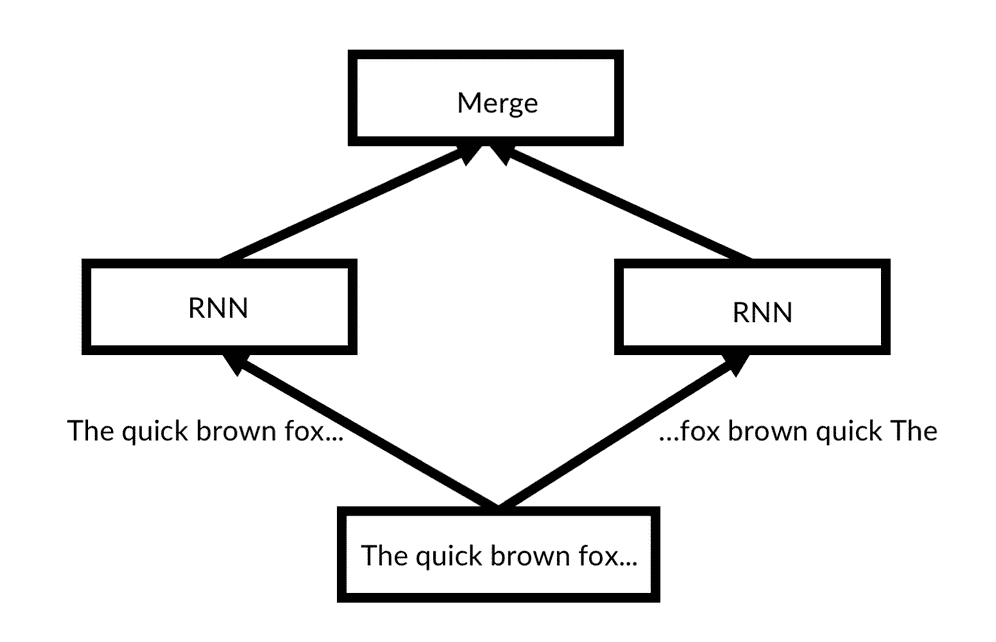

双向 RNN

在 Keras 中，有一个`Bidirectional`层，我们可以环绕任何 RNN 层，例如作为`LSTM`。我们在下面的代码中实现了这一点:

```
from keras.layers import Bidirectional

model = Sequential()

model.add(Embedding(max_words, embedding_dim, input_length=maxlen, weights = [embedding_matrix], trainable = False))

model.add(Bidirectional(CuDNNLSTM(32)))

model.add(Dense(1, activation='sigmoid'))
```

单词嵌入很棒，因为它们丰富了神经网络。它们是一种节省空间的强大方法，允许我们将单词转换为神经网络可以处理的数字。也就是说，将语义编码为向量有更多的好处，比如我们可以对它们执行向量数学运算！例如，如果我们想要测量两个文本之间的相似性，这是很有用的。


# 具有单词嵌入的文档相似性

词向量的实际用例是比较文档之间的语义相似度。如果您是零售银行、保险公司或任何其他向最终用户销售产品的公司，您将不得不处理支持请求。您会经常发现许多客户有相似的请求，因此通过找出相似文本在语义上的相似程度，可以重用以前对相似请求的回答，并且可以改进您组织的整体服务。

spaCy 有一个内置函数来衡量两个句子之间的相似性。它还带有来自 Word2Vec 模型的预训练向量，类似于 GloVe。这种方法的工作原理是平均文本中所有单词的嵌入向量，然后测量平均向量之间的角度余弦。指向大致相同方向的两个向量将具有高相似性得分，而指向不同方向的向量将具有低相似性得分。下图显示了这一点:

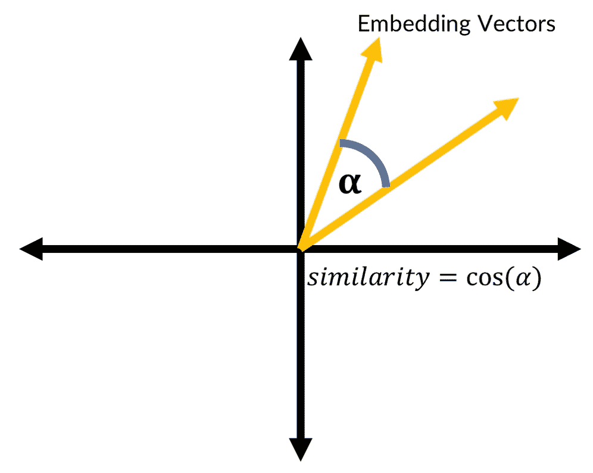

相似性向量

通过运行以下命令，我们可以看到两个短语之间的相似性:

```
sup1 = nlp('I would like to open a new checking account')

sup2 = nlp('How do I open a checking account?')
```

如您所见，这些请求非常相似，达到了 70%的比率:

```
sup1.similarity(sup2)
```

```

0.7079433112862716

```

你可以看到，他们的相似度得分相当高。这个简单的平均方法工作得相当不错。然而，它不能捕捉诸如负值或单个偏离向量之类的东西，这可能不会对平均值产生太大影响。

例如，“我想开立一个支票账户”和“我想开立一个支票账户”在语义上是不同的然而，该模型认为它们与非常相似。然而，这种方法仍然是有用的，并且很好地说明了将语义表示为向量的优点。


# 快速浏览 Keras 功能 API

到目前为止，我们已经使用了连续的模型。在顺序模型中，当我们调用`model.add()`时，层堆叠在彼此之上。函数式 API 的优点是简单并且防止错误。缺点是它只允许我们线性堆叠层:


从赛格迪和其他人的“用回旋走得更深”看谷歌网络建筑

看看前面的 GoogLeNet 架构。虽然该图非常详细，但我们需要了解的是，该模型并不只是一层层堆叠在一起。取而代之的是平行的多层；在这种情况下，模型有三个输出。然而，问题仍然存在，作者是如何建立这个复杂的模型的？顺序 API 不允许他们这样做，但是函数式 API 可以很容易地像串珠子一样把层串起来，并创建像前面这样的架构。

对于许多 NLP 应用，我们需要更复杂的模型，例如，两个独立的层并行运行。在 Keras functional API 中，我们有更多的控制权，可以指定层应该如何连接。我们可以用它来创建更高级更复杂的模型。

从现在开始，我们将更多地使用函数式 API。本章的这一节旨在提供 Keras 功能 API 的简要概述，因为我们将在后面的章节中进行更深入的探讨。首先，让我们从顺序和功能两个方面来看一个简单的双层网络:

```
from keras.models import Sequential

from keras.layers import Dense, Activation

model = Sequential()

model.add(Dense(64, input_dim=64))

model.add(Activation('relu'))

model.add(Dense(4))

model.add(Activation('softmax'))

model.summary()
```

```

Layer (type)                 Output Shape              Param #   =================================================================dense_1 (Dense)              (None, 64)                4160      _________________________________________________________________activation_1 (Activation)    (None, 64)                0         _________________________________________________________________dense_2 (Dense)              (None, 4)                 260       _________________________________________________________________activation_2 (Activation)    (None, 4)                 0         =================================================================Total params: 4,420Trainable params: 4,420Non-trainable params: 0

_________________________________________________________________

```

前面的模型是在顺序 API 中实现的简单模型。请注意，到目前为止，我们在本书中一直是这样做的。我们现在将在函数式 API 中实现相同的模型:

```
from keras.models import Model                        #1

from keras.layers import Dense, Activation, Input

model_input = Input(shape=(64,))                      #2

x = Dense(64)(model_input)                            #3

x = Activation('relu')(x)                             #4

x = Dense(4)(x)

model_output = Activation('softmax')(x)

model = Model(model_input, model_output)              #5

model.summary()
```

请注意顺序 API 的不同之处:

1.  现在，不是先用`model = Sequential()`定义模型，而是先定义计算图，然后用`Model`类将它转换成模型。
2.  输入现在是它们自己的层。
3.  不是使用`model.add()`，而是定义层，然后传递一个输入层或前一层的输出张量。
4.  您可以通过将层串在一条链上来创建模型。例如，`Dense(64)(model_input)`返回一个张量。你把这个张量传递给下一层，就像在`Activation('relu')(x)`中一样。这个函数将返回一个新的输出张量，您可以将它传递给下一层，以此类推。这样，你就创建了一个像链一样的计算图。
5.  要创建一个模型，您需要将模型输入层以及图形的最终输出张量传递给`Model`类。

功能 API 模型可以像顺序 API 模型一样使用。事实上，从这个模型的摘要的输出中，您可以看到它与我们刚刚用顺序 API 创建的模型非常相似:

```

Layer (type)                 Output Shape              Param #   =================================================================input_2 (InputLayer)         (None, 64)                0         _________________________________________________________________dense_3 (Dense)              (None, 64)                4160      _________________________________________________________________activation_3 (Activation)    (None, 64)                0         _________________________________________________________________dense_4 (Dense)              (None, 4)                 260       _________________________________________________________________activation_4 (Activation)    (None, 4)                 0         =================================================================Total params: 4,420Trainable params: 4,420Non-trainable params: 0

_________________________________________________________________

```

您可以看到，与顺序 API 相比，函数式 API 可以用更高级的方式连接层。我们也可以将层创建和连接步骤分开。这保持了代码的整洁，并允许我们将同一层用于不同的目的。

以下代码段将创建与前面代码段完全相同的模型，但具有单独的层创建和连接步骤:

```
model_input = Input(shape=(64,))

dense = Dense(64)

x = dense(model_input)

activation = Activation('relu')

x = activation(x)

dense_2 = Dense(4)

x = dense_2(x)

model_output = Activation('softmax')(x)

model = Model(model_input, model_output)
```

图层可以重复使用。例如，我们可以在一个计算图中训练一些层，然后将它们用于另一个计算图，正如我们将在本章后面的 seq2seq 模型一节中所做的那样。

在我们继续使用函数式 API 构建高级模型之前，还有一点需要注意。我们应该注意到任何层的激活功能也可以直接在层中指定。到目前为止，我们已经使用了一个单独的激活层，它增加了清晰度，但不是严格要求的。具有`relu`激活功能的`Dense`层也可以指定为:

```
Dense(24, activation='relu')
```

当使用函数式 API 时，这可能比添加激活函数更容易。


# 注意

你注意到了吗？如果是这样，肯定不会对每个人一视同仁。在任何文本中，有些词比其他词更重要。注意机制是神经网络将*注意力*集中在序列中某个元素上的一种方式。对于神经网络来说，聚焦意味着放大重要的东西:

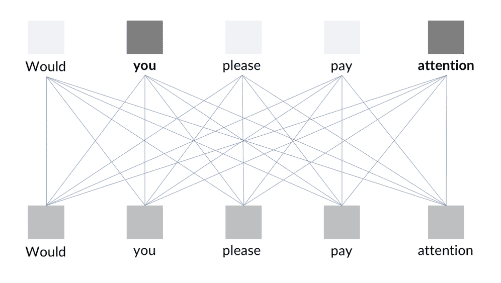

注意机制的一个例子

注意层是完全连接的层，接收序列并输出序列的权重。然后将序列乘以权重:

```
def attention_3d_block(inputs,time_steps,single_attention_vector = False):

    input_dim = int(inputs.shape[2])                             #1

    a = Permute((2, 1),name='Attent_Permute')(inputs)            #2

    a = Reshape((input_dim, time_steps),name='Reshape')(a)       #3

    a = Dense(time_steps, activation='softmax', name='Attent_Dense')(a) # Create attention vector            #4

    if single_attention_vector:                                  #5

        a = Lambda(lambda x: K.mean(x, axis=1), name='Dim_reduction')(a)                             #6

        a = RepeatVector(input_dim, name='Repeat')(a)            #7

        a_probs = Permute((2, 1), name='Attention_vec')(a)       #8

    output_attention_mul = Multiply(name='Attention_mul')([inputs, a_probs])                                          #9

    return output_attention_mul
```

让我们分解刚刚创建的序列。如您所见，它由九个关键元素组成:

1.  我们的输入具有形状`(batch_size, time_steps, input_dim)`，其中`time_steps`是序列的长度，`input_dim`是输入的维度。如果我们将它直接应用于使用嵌入的文本序列，`input_dim`将是 50，与嵌入维数相同。
2.  然后我们交换`time_steps`和`input_dim`的轴，这样张量就有了`(batch_size, input_dim, time_steps)`的形状。
3.  如果一切顺利，我们的张量已经是我们想要的形状了。这里我们添加了一个整形操作，以确保万无一失。
4.  现在诀窍来了。我们通过一个激活了`softmax`的`dense`层运行我们的输入。这将为系列中的每个元素生成一个权重，正如前面所示。这个`dense`层是在`attention`块内部训练的。
5.  默认情况下，`dense`层单独计算每个输入维度的关注度。也就是说，对于我们的单词向量，它会计算 50 个不同的权重。如果我们正在处理输入维度实际上代表不同事物的时间序列模型，这可能是有用的。在这种情况下，我们要对单词进行整体加权。
6.  为了给每个单词创建一个注意力值，我们对输入维度的注意力层进行平均。我们的新张量具有形状`(batch_size, 1, time_steps)`。
7.  为了将注意力向量与输入相乘，我们需要在输入维度上重复权重。重复之后，张量再次具有形状`(batch_size, input_dim, time_steps)`，但是在`input_dim`维度上具有相同的权重。
8.  为了匹配输入的形状，我们将轴换成`time_steps`和`input_dim`的形式，这样注意力向量又变成了`(batch_size, time_steps, input_dim)`的形状。
9.  最后，我们通过将注意力向量与输入逐元素相乘来将注意力应用于输入。我们返回结果张量。

以下流程图概述了该流程:


注意块

请注意前面的函数如何定义接受一个张量作为输入，定义一个图，并返回一个张量。我们现在可以调用这个函数作为模型构建过程的一部分:

```
input_tokens = Input(shape=(maxlen,),name='input')

embedding = Embedding(max_words, embedding_dim, input_length=maxlen, weights = [embedding_matrix], trainable = False, name='embedding')(input_tokens)

attention_mul = attention_3d_block(inputs = embedding,time_steps = maxlen,single_attention_vector = True)

lstm_out = CuDNNLSTM(32, return_sequences=True, name='lstm')(attention_mul)

attention_mul = Flatten(name='flatten')(attention_mul)

output = Dense(1, activation='sigmoid',name='output')(attention_mul)

model = Model(input_tokens, output)
```

在这种情况下，我们在嵌入之后立即使用关注块。这意味着我们可以放大或抑制某些单词嵌入。同样，我们可以在 LSTM 之后使用注意块。在许多情况下，当涉及到建立处理任何类型的序列的模型时，尤其是在 NLP 中，你会发现注意块是你的武器库中的强大工具。

为了更好地理解函数式 API 如何将层串起来，以及注意力模块如何重塑张量，请看下面的模型总结:

```
model.summary()
```

```

__________________________________________________________________________________________________Layer (type)                    Output Shape         Param #     Connected to                     ==================================================================================================input (InputLayer)              (None, 140)          0                                            __________________________________________________________________________________________________embedding (Embedding)           (None, 140, 50)      500000      input[0][0]                      __________________________________________________________________________________________________Attent_Permute (Permute)        (None, 50, 140)      0           embedding[0][0]                  __________________________________________________________________________________________________Reshape (Reshape)               (None, 50, 140)      0           Attent_Permute[0][0]             __________________________________________________________________________________________________Attent_Dense (Dense)            (None, 50, 140)      19740       Reshape[0][0]                    __________________________________________________________________________________________________Dim_reduction (Lambda)          (None, 140)          0           Attent_Dense[0][0]               __________________________________________________________________________________________________Repeat (RepeatVector)           (None, 50, 140)      0           Dim_reduction[0][0]              __________________________________________________________________________________________________Attention_vec (Permute)         (None, 140, 50)      0           Repeat[0][0]                     __________________________________________________________________________________________________Attention_mul (Multiply)        (None, 140, 50)      0           embedding[0][0]                  Attention_vec[0][0]              __________________________________________________________________________________________________flatten (Flatten)               (None, 7000)         0           Attention_mul[0][0]              __________________________________________________________________________________________________output (Dense)                  (None, 1)            7001        flatten[0][0]                    ==================================================================================================Total params: 526,741Trainable params: 26,741Non-trainable params: 500,000

__________________________________________________________________________________________________

```

该模型可以像任何 Keras 模型一样被训练，并且在验证集上达到大约 80%的准确度。


# Seq2seq 型号

2016 年，谷歌宣布用单个神经网络取代了整个谷歌翻译算法。谷歌神经机器翻译系统的特别之处在于，它只使用一个模型来“端到端”翻译多种语言。它的工作原理是对句子的语义进行编码，然后将语义解码成所需的输出语言。

事实上，这样一个系统是可能的，这让许多语言学家和其他研究人员感到困惑，因为它表明，在没有任何明确规则的情况下，机器学习可以创建准确捕捉高级含义和语义的系统。

这些语义表示为一个编码向量，虽然我们还不知道如何解释这些向量，但它们有很多有用的应用。从一种语言翻译到另一种语言是一种流行的方法，但是我们可以使用类似的方法将报告“翻译”成摘要。文本摘要已经取得了很大的进步，但缺点是它需要大量的计算能力来提供有意义的结果，所以我们将专注于语言翻译。

## Seq2seq 架构概述

如果所有短语都有完全相同的长度，我们可以简单地使用一个 LSTM(或多个 lstm)。请记住，LSTM 也可以返回与输入序列长度相同的完整序列。然而，在许多情况下，序列不会具有相同的长度。

为了处理不同长度的短语，我们需要创建一个编码器来捕捉句子的语义。然后我们创建一个解码器，它有两个输入:编码的语义和已经生成的序列。然后，解码器预测序列中的下一项。对于我们的字符级翻译器，它看起来像这样:

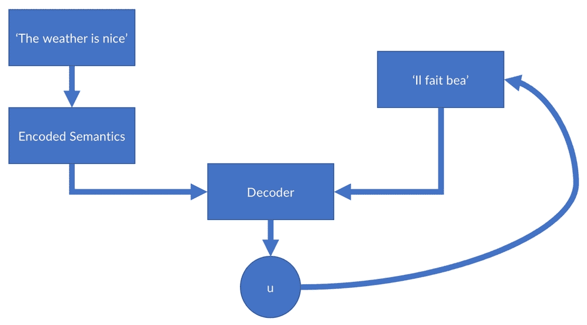

Seq2seq 架构概述

请注意解码器的输出如何再次用作解码器的输入。该过程仅在解码器产生一个`<STOP>`标签时停止，该标签指示序列结束。

### 注意

**注**:本节的数据和代码可以在 Kaggle 上找到[https://www . ka ggle . com/jannesklaas/a-simple-seq 2 seq-translate](https://www.kaggle.com/jannesklaas/a-simple-seq2seq-translat)。

## 数据

我们使用英语短语及其翻译的数据集。这个数据集是从 **Tabotea** 项目获得的，这是一个翻译数据库，你可以在 Kaggle 上找到代码附带的文件。我们在字符级别上实现这个模型，这意味着与以前的模型不同，我们不会标记单词，而是字符。这使得我们的网络任务更加困难，因为它现在还必须学习如何拼写单词！然而，另一方面，字符比单词少得多，因此我们可以对字符进行一次性编码，而不必使用嵌入。这使得我们的模型稍微简单了一些。

首先，我们必须设置一些参数:

```
batch_size = 64                #1

epochs = 100                   #2

latent_dim = 256               #3 

num_samples = 10000            #4

data_path = 'fra-eng/fra.txt'  #5
```

但是我们设置的参数是什么呢？

1.  训练的批量大小。
2.  要训练的纪元数。
3.  编码向量的维数。我们用多少数字来编码一个句子的意思。
4.  一些样本进行训练。整个数据集大约有 140，000 个样本。然而，由于记忆和时间的原因，我们将减少训练次数。
5.  磁盘上数据`.txt`文件的路径。

在数据文件中，输入(英语)和目标(法语)用制表符分隔。每行代表一个新短语。翻译由制表符分隔(转义字符:`\t`)。因此，我们循环遍历这些行，并通过在 tab 符号处拆分这些行来读出输入和目标。

为了构建我们的标记器，我们还需要知道哪些字符出现在我们的数据集中。因此，对于所有的字符，我们需要检查它们是否已经在我们的可见字符集中，如果不是，就把它们添加到我们的可见字符集中。

为此，我们必须首先为文本和字符设置保存变量:

```
input_texts = []

target_texts = []

input_characters = set()

target_characters = set()
```

然后我们循环遍历尽可能多的行，提取文本和字符:

```
lines = open(data_path).read().split('\n')

for line in lines[: min(num_samples, len(lines) - 1)]:

    input_text, target_text = line.split('\t')          #1

    target_text = '\t' + target_text + '\n'             #2

    input_texts.append(input_text)

    target_texts.append(target_text)

    for char in input_text:                             #3

        if char not in input_characters:

            input_characters.add(char)

    for char in target_text:                            #4

        if char not in target_characters:

            target_characters.add(char)
```

让我们将这段代码分解，以便更详细地理解它:

1.  输入和目标由制表符分割，英语制表符法语，所以我们通过制表符分割行以获得输入和目标文本。
2.  我们使用`\t`作为目标的“开始序列”字符，使用`\n`作为“结束序列”字符。这样，我们就知道何时停止解码。
3.  我们循环输入文本中的字符，将所有我们还没有见过的字符添加到我们的输入字符集中。
4.  我们遍历输出文本中的字符，将所有我们还没有看到的字符添加到我们的输出字符集中。

## 编码字符

我们现在需要创建按字母顺序排序的输入和输出字符的列表，我们可以通过运行:

```
input_characters = sorted(list(input_characters))

target_characters = sorted(list(target_characters))
```

我们还要计算我们有多少输入和输出字符。这很重要，因为我们需要知道我们的一键编码应该有多少个维度。我们可以通过编写以下内容来找到这一点:

```
num_encoder_tokens = len(input_characters)

num_decoder_tokens = len(target_characters)
```

我们将构建自己的字典，将字符映射到标记号，而不是使用 Keras 标记器。我们可以通过运行以下命令来实现这一点:

```
input_token_index = {char: i for i, char in enumerate(input_characters)}

target_token_index = {char: i for i, char in enumerate(target_characters)}
```

我们可以通过打印一个短句中所有字符的标记号来了解其工作原理:

```
for c in 'the cat sits on the mat':

    print(input_token_index[c], end = ' ')
```

```

63 51 48 0 46 44 63 0 62 52 63 62 0 58 57 0 63 51 48 0 56 44 63

```

接下来，我们建立模型训练数据。记住，我们的模型有两个输入，但只有一个输出。虽然我们的模型可以处理任意长度的序列，但是在 NumPy 中准备数据是很方便的，因此可以知道我们的最长序列有多长:

```
max_encoder_seq_length = max([len(txt) for txt in input_texts])

max_decoder_seq_length = max([len(txt) for txt in target_texts])

print('Max sequence length for inputs:', max_encoder_seq_length)

print('Max sequence length for outputs:', max_decoder_seq_length)
```

```

Max sequence length for inputs: 16

Max sequence length for outputs: 59

```

现在我们为模型准备输入和输出数据。`encoder_input_data`是一个形状为`(num_pairs, max_english_sentence_length, num_english_characters)`的 3D 数组，包含英语句子的一键矢量化:

```
encoder_input_data = np.zeros((len(input_texts), max_encoder_seq_length, num_encoder_tokens),dtype='float32')
```

`decoder_input_data`是一个形状为`(num_pairs, max_french_sentence_length, num_french_characters)`的 3D 数组，包含法语句子的一键矢量化:

```
decoder_input_data = np.zeros((len(input_texts), max_decoder_seq_length, num_decoder_tokens),dtype='float32')
```

`decoder_target_data`与`decoder_input_data`相同，但偏移一个时间步长。`decoder_target_data[:, t, :]`将与`decoder_input_data[:, t + 1, :]`相同。

```
decoder_target_data = np.zeros((len(input_texts), max_decoder_seq_length, num_decoder_tokens),dtype='float32')
```

可以看到，解码器的输入和输出是相同的，只是输出超前了一个时间步长。当你考虑到我们将一个未完成的序列输入解码器并希望它预测下一个字符时，这个是有意义的。我们将使用函数式 API 来创建一个具有两个输入的模型。

你可以看到解码器也有两个输入:*解码器输入*和*编码语义*。然而，编码的语义不是编码器 LSTM 的直接输出，而是其状态*的输出。在 LSTM 中，状态是细胞的隐藏记忆。所发生的是，我们解码器的第一个“记忆”是编码的语义。为了给解码器这个第一存储器，我们可以用解码器 LSTM 的状态初始化它的状态。*

要返回状态，我们必须设置`return_state`参数，配置 RNN 层以返回一个列表，其中第一个条目是输出，接下来的条目是内部 RNN 状态。我们再次使用`CuDNNLSTM`。如果您没有 GPU，请用`LSTM`替换它，但请注意，在没有 GPU 的情况下训练该模型可能需要很长时间才能完成:

```
encoder_inputs = Input(shape=(None, num_encoder_tokens), name = 'encoder_inputs')               #1

encoder = CuDNNLSTM(latent_dim, return_state=True, name = 'encoder')                         #2

encoder_outputs, state_h, state_c = encoder(encoder_inputs)   #3

encoder_states = [state_h, state_c]                           #4
```

让我们来看看准则的四个关键要素:

1.  我们为编码器创建一个输入层
2.  我们创造了 LSTM 编码器
3.  我们将 LSTM 编码器链接到输入层，并获取输出和状态
4.  我们丢弃`encoder_outputs`，只保留状态

现在我们定义解码器。解码器使用编码器的状态作为其解码 LSTM 的初始状态。

你可以这样想:想象你是一个把英语翻译成法语的翻译。当承担翻译任务时，你首先要听英语演讲者，并在你的头脑中形成关于演讲者想说什么的想法。然后你可以用这些想法组成一个表达同样想法的法语句子。

重要的是理解我们不仅仅是传递一个变量，而是计算图的一部分。这意味着我们以后可以从解码器反向传播到编码器。在我们之前的类比中，你可能认为你的法语翻译对英语句子理解不佳，所以你可能开始根据法语翻译的结果改变你的英语理解，例如:

```
decoder_inputs = Input(shape=(None, num_decoder_tokens), name = 'decoder_inputs')                    #1

decoder_lstm = CuDNNLSTM(latent_dim, return_sequences=True, return_state=True, name = 'decoder_lstm')                     #2

decoder_outputs, _, _ = decoder_lstm(decoder_inputs,initial_state=encoder_states) #3

decoder_dense = Dense(num_decoder_tokens, activation='softmax', name = 'decoder_dense')

decoder_outputs = decoder_dense(decoder_outputs)                   #4
```

上述代码由四个关键元素组成:

1.  设置解码器输入。
2.  我们设置解码器返回完整的输出序列，也返回内部状态。我们在训练模型中不使用返回状态，但是我们将使用它们进行推理。
3.  将解码器连接到解码器输入，并指定内部状态。如前所述，我们不使用解码器的内部状态进行训练，因此我们在这里将其丢弃。
4.  最后，我们需要决定我们想要使用哪个字符作为下一个字符。这是一个分类任务，所以我们将使用一个简单的`Dense`层和一个`softmax`激活函数。

现在，我们已经有了定义具有两个输入和一个输出的模型所需的部分:

```
model = Model([encoder_inputs, decoder_inputs], decoder_outputs)
```

如果您安装了`graphviz`库，您可以使用下面的代码行非常好地可视化模型。然而，不幸的是，这段代码在 Kaggle 上不起作用:

```
from IPython.display import SVG

from keras.utils.vis_utils import model_to_dot

SVG(model_to_dot(model).create(prog='dot', format='svg'))
```

如您所见，这种可视化显示在下图中:

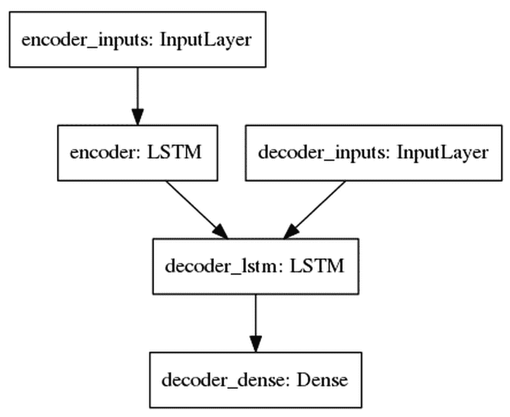

Seq2seq 可视

您现在可以编译和训练模型了。由于我们必须在接下来输出的多个可能的字符中进行选择，这基本上是一个多类分类任务。因此，我们将使用分类交叉熵损失:

```
model.compile(optimizer='rmsprop', loss='categorical_crossentropy')

history = model.fit([encoder_input_data, decoder_input_data], decoder_target_data,batch_size=batch_size,epochs=epochs,validation_split=0.2)
```

训练过程在 GPU 上大约需要 7 分钟。然而，如果我们绘制模型的进度，你可以看到它是过度拟合的:

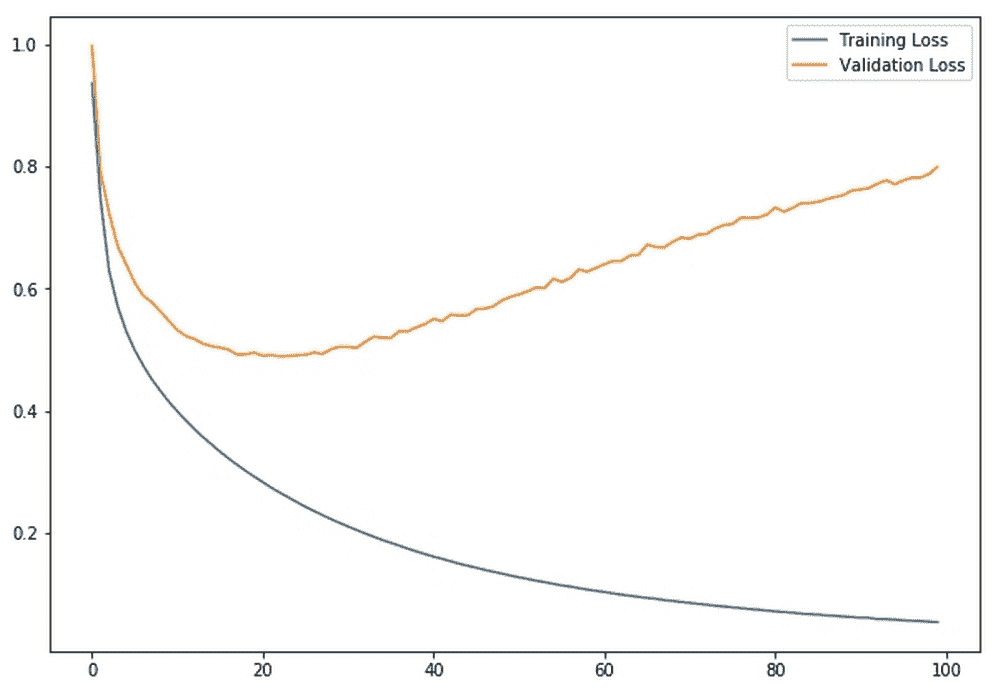

Seq2seq 过度拟合

过度拟合的原因很大程度上是因为我们只使用了 10，000 对相对较短的句子。为了得到一个更大的模型，一个真正的翻译或摘要系统必须在更多的例子上进行训练。为了让您在不拥有大型数据中心的情况下也能了解这些示例，我们只是使用一个较小的模型来举例说明 seq2seq 架构能做些什么。

## 创建推理模型

不管是否合适，我们都希望现在就使用我们的模型。使用 seq2seq 模型进行推理，在这种情况下进行翻译，需要我们建立一个单独的推理模型，该模型使用训练模型中训练的权重，但路由略有不同。更具体地说，我们将编码器和解码器分开。这样，我们可以先创建一次编码，然后使用它进行解码，而不是一次又一次地创建它。

编码器模型从编码器输入映射到编码器状态:

```
encoder_model = Model(encoder_inputs, encoder_states)
```

然后，解码器模型从最后一个字符开始接收编码器存储器加上它自己的存储器作为输入。然后它吐出一个预测加上它自己的记忆，用于下一个字符:

```
#Inputs from the encoder

decoder_state_input_h = Input(shape=(latent_dim,))     #1

decoder_state_input_c = Input(shape=(latent_dim,))

#Create a combined memory to input into the decoder

decoder_states_inputs = [decoder_state_input_h, decoder_state_input_c]                                 #2

#Decoder

decoder_outputs, state_h, state_c = decoder_lstm(decoder_inputs, initial_state=decoder_states_inputs)                   #3

decoder_states = [state_h, state_c]                    #4

#Predict next char

decoder_outputs = decoder_dense(decoder_outputs)       #5

decoder_model = Model([decoder_inputs] + decoder_states_inputs,[decoder_outputs] + decoder_states)                #6
```

让我们看看这段代码的六个元素:

1.  编码器存储器由两种状态组成。我们需要为它们创建两个输入。
2.  然后，我们将这两种状态组合成一个内存表示。
3.  然后，我们将之前训练的解码器 LSTM 连接到解码器输入和编码器存储器。
4.  我们将解码器 LSTM 的两种状态组合成一个内存表示。
5.  我们重用解码器的密集层来预测下一个字符。
6.  最后，我们设置解码器模型来接收字符输入和状态输入，并将其映射到字符输出和状态输出。

## 进行翻译

我们现在可以开始使用我们的型号了。为此，我们必须首先创建一个索引，再次将标记映射到字符:

```
reverse_input_char_index = {i: char for char, i in input_token_index.items()}

reverse_target_char_index = {i: char for char, i in target_token_index.items()}
```

当我们翻译一个短语时，我们必须首先对输入进行编码。然后我们将循环，将解码器状态反馈给解码器，直到我们收到一个停止；在我们的例子中，我们使用制表符来表示停止。

`target_seq`是代表解码器预测的最后一个字符的 NumPy 数组:

```
def decode_sequence(input_seq):

    states_value = encoder_model.predict(input_seq)      #1

    target_seq = np.zeros((1, 1, num_decoder_tokens))    #2

    target_seq[0, 0, target_token_index['\t']] = 1\.      #3

    stop_condition = False                               #4

    decoded_sentence = ''

    while not stop_condition:                            #5

        output_tokens, h, c = decoder_model.predict(

            [target_seq] + states_value)                           #6

        sampled_token_index = np.argmax(output_tokens[0, -1, :])   #7

        sampled_char = reverse_target_char_index[sampled_token_index]                                               #8

        decoded_sentence += sampled_char                           #9

        if (sampled_char == '\n' or                               #10

           len(decoded_sentence) > max_decoder_seq_length):

            stop_condition = True

        target_seq = np.zeros((1, 1, num_decoder_tokens))         #11

        target_seq[0, 0, sampled_token_index] = 1.

        states_value = [h, c]                                     #12

    return decoded_sentence
```

在本章中，我们最后一次分解代码:

1.  将输入编码为状态向量
2.  生成长度为 1 的空目标序列
3.  用起始字符填充目标序列的第一个字符
4.  没有停车标志，解码序列目前是空的
5.  循环，直到我们收到一个停止标志
6.  获取解码器的输出和内部状态
7.  获取预测的令牌(概率最高的令牌)
8.  获取属于令牌号的字符
9.  将字符追加到输出中
10.  退出条件:要么命中最大长度，要么找到停止字符
11.  更新目标序列(长度为 1)
12.  更新状态

现在我们可以把英语翻译成法语了！至少对于某些短语来说，它工作得相当好。鉴于我们没有为我们的模型提供任何关于法语单词或语法的规则，这是相当令人印象深刻的。当然，谷歌翻译等翻译系统使用更大的数据集和模型，但基本原理是相同的。

为了翻译文本，我们首先创建一个充满零的占位符数组:

```
my_text = 'Thanks!'

placeholder = np.zeros((1,len(my_text)+10,num_encoder_tokens))
```

然后，我们通过将字符标记号索引处的元素设置为`1`，对文本中的所有字符进行一次性编码:

```
for i, char in enumerate(my_text):

    print(i,char, input_token_index[char])

    placeholder[0,i,input_token_index[char]] = 1
```

这将在字符旁边打印出字符的标记号及其在文本中的位置:

```

0 T 38

1 h 51

2 a 44

3 n 57

4 k 54

5 s 62

6 ! 1

```

现在我们可以将这个占位符输入解码器:

```
decode_sequence(placeholder)
```

我们得到的翻译是:

```

'Merci !\n'

```

Seq2seq 模型不仅适用于语言之间的翻译。他们可以接受任何以序列作为输入并输出序列的训练。

还记得上一章的预测任务吗？预测问题的最佳解决方案是 seq2seq 模型。文本摘要是另一个有用的应用。Seq2seq 模型也可以被训练来输出一系列的动作，例如可以将大订单的影响最小化的一系列交易。


# 演习

既然我们已经学完了这一章，让我们来看看我们都学了些什么。为了结束这一章，我在本章内容的基础上增加了三个挑战你的练习:

1.  向翻译模型的编码器添加一个额外的层。如果翻译模型有更多的能力来学习法语句子的结构，它可能会工作得更好。增加一个 LSTM 层将是学习函数式 API 的一个很好的练习。
2.  请注意翻译模型的编码器。注意力将允许模型专注于对翻译真正重要的(英语)单词。最好把注意力作为最后一层。这个任务比前一个要难一点，但是你会更好地理解注意力的内部运作。
3.  在 https://www.kaggle.com/aaron7sun/stocknews[的访问*每日股市预测新闻*](https://www.kaggle.com/aaron7sun/stocknews)。任务是使用每日新闻作为输入来预测股票价格。已经有很多内核可以帮助你做到这一点。用本章所学的知识来预测一些股票价格！


# 总结

在这一章中，你已经学习了最重要的自然语言处理技术。我们学到了很多东西，以下是我们在本章中讲述的一大串内容，以及你现在应该有信心理解的所有内容:

*   查找命名实体
*   为您自己的定制应用微调 spaCy 的模型
*   寻找词类并绘制句子的语法结构
*   使用正则表达式
*   为分类任务准备文本数据
*   使用诸如词袋和 TF-IDF 等技术进行分类
*   用 LDA 对文本中的主题进行建模
*   使用预训练的单词嵌入
*   使用 Keras functional API 构建高级模型
*   训练你的模型专注于注意力
*   用 seq2seq 模型翻译句子

现在，您的工具箱中有了一大套工具，可以帮助您解决 NLP 问题。在本书的其余部分，你将再次看到这些技术中的一些，在不同的上下文中被用来解决困难的问题。这些技术在整个行业都很有用，从零售银行到对冲基金投资。虽然你的机构试图解决的问题可能需要一点调整，但一般的方法是可以转移的。

在下一章中，我们将研究一项自 DeepMind 击败人类围棋冠军以来备受关注的技术:强化学习。这种技术在金融市场工作时特别有用，而且在许多方面是许多量化投资公司已经在做的事情的自然延伸。所以，请继续关注，我们另一边见。