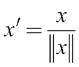
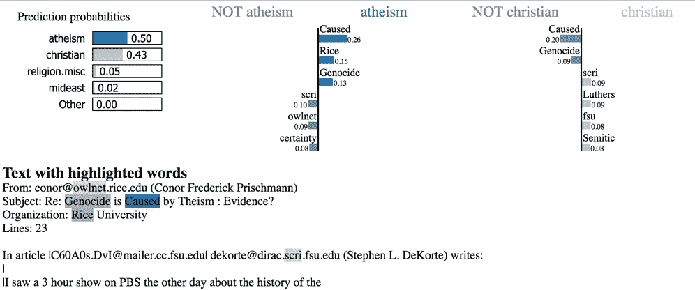
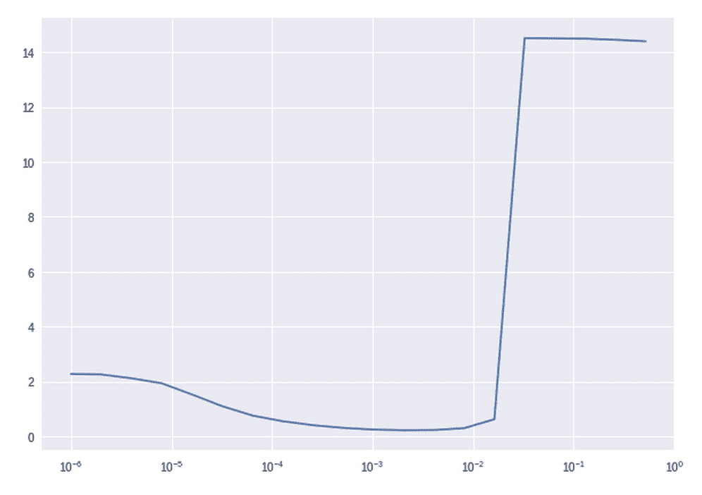
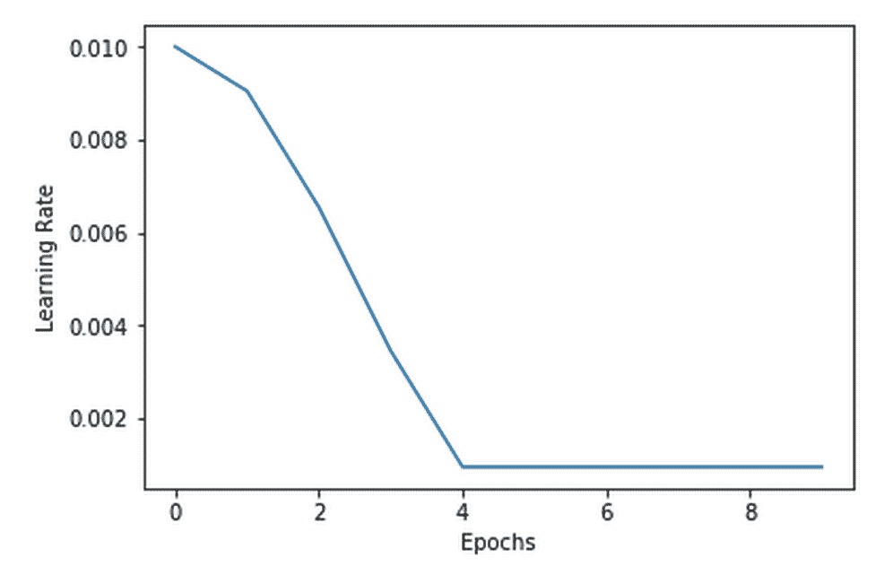
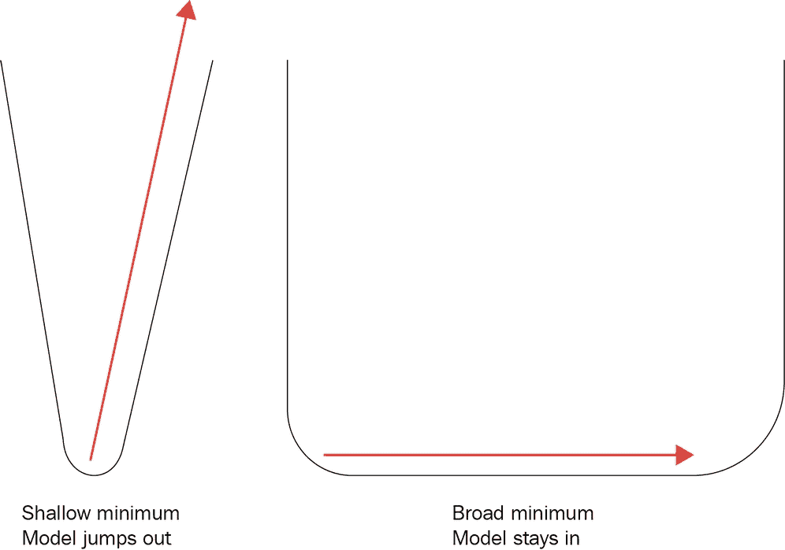
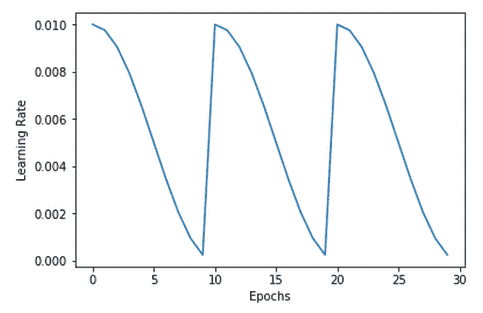
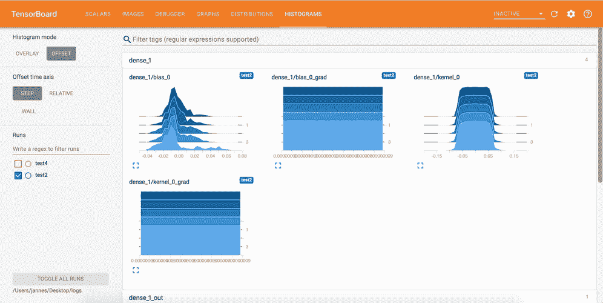
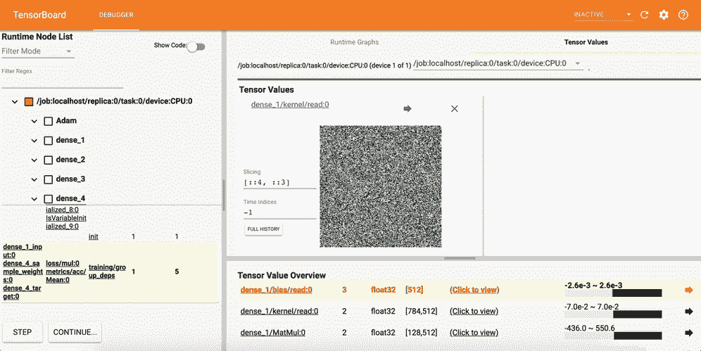
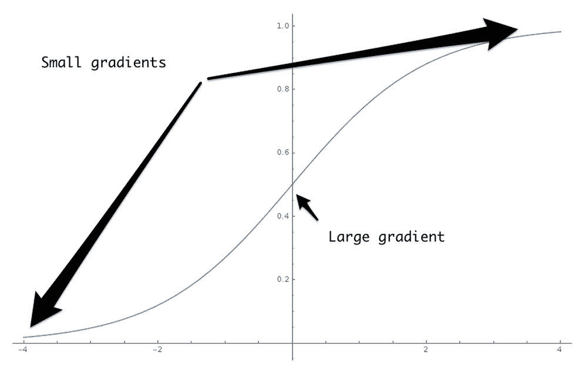
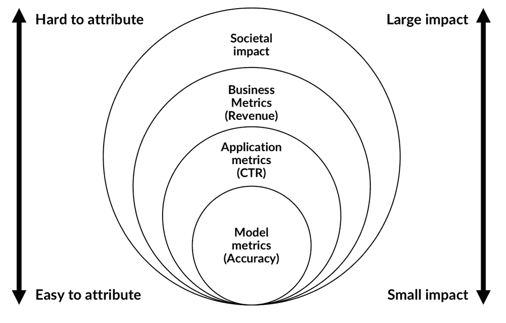

<title>Chapter 8. Privacy, Debugging, and Launching Your Products</title> 

# 第八章。隐私、调试和发布您的产品

在过去七章的过程中，我们开发了一个大型的机器学习算法工具箱，可以用来解决金融领域的机器学习问题。为了帮助完善这个工具箱，我们现在要看看如果你的算法不起作用，你能做什么。

机器学习模型以最糟糕的方式失败:无声无息。在传统的软件中，一个错误通常会导致程序崩溃，虽然它们让用户很烦，但对程序员却很有帮助。至少很清楚代码失败了，开发人员通常会发现一个附带的崩溃报告，描述了哪里出错了。然而，当你超越这本书并开始开发自己的模型时，你有时也会遇到机器学习代码崩溃，例如，如果你输入算法的数据格式或形状错误，就可能导致这种情况。

这些问题通常可以通过仔细跟踪数据在什么点具有什么形状来调试。然而，更常见的是，失败的模型只会输出糟糕的预测。他们不会给出失败的信号，以至于你可能根本没有意识到他们已经失败了，但在其他时候，模型可能训练得不好，不会收敛，或者不会实现低损失率。

在这一章中，我们将重点关注如何调试这些静默故障，以便它们不会影响您创建的机器学习算法。这将包括研究以下主题领域:

*   在你的数据中寻找导致你所学模型缺陷的缺陷
*   使用创造性的技巧让你的模型从更少的数据中学到更多
*   生产或培训中的单元测试数据，以确保符合标准
*   注意隐私和监管，如 GDPR
*   为培训准备数据并避免常见陷阱
*   检查模型并窥视“黑匣子”
*   寻找最佳超参数
*   调度学习率以减少过拟合
*   使用 TensorBoard 监控训练进度
*   部署机器学习产品并对其进行迭代
*   加速训练和推理

在试图调试程序之前，你必须采取的第一步是承认，即使是优秀的机器学习工程师也经常失败。机器学习项目失败的原因有很多，大多数与工程师的技能无关，所以不要认为只是因为它不起作用，你就有错。

如果这些错误被发现得足够早，那么时间和金钱都可以节省。此外，在高风险的环境中，包括基于金融的情况，如交易，意识到的工程师可以在发现他们的模型失败时拔掉插头。这不应该被视为失败，而应该被视为避免问题的成功。

# 调试数据

你会记得，在本书的第一章，我们讨论了机器学习模型如何成为其训练数据的函数，这意味着，例如，坏数据将导致坏模型，或者正如我们所说的，垃圾进来，垃圾出去。如果您的项目失败了，您的数据很可能是罪魁祸首。因此，在本章中，我们将首先查看数据，然后再继续查看可能导致我们的模型崩溃的其他问题。

然而，即使您有一个工作模型，现实世界中的数据可能无法完成任务。在本节中，我们将学习如何发现您是否有好的数据，如果您没有得到足够的数据该怎么办，以及如何测试您的数据。

## 如何发现您的数据是否符合任务要求

当想要知道您的数据是否能够胜任训练一个好模型的任务时，需要考虑两个方面:

*   数据预测的是你希望它预测的吗？
*   你有足够的数据吗？

为了找出你的模型是否包含预测信息，也称为信号，你可以问自己这样一个问题，给定这些数据，人类能做出预测吗？为你的人工智能提供人类可以理解的数据是很重要的，因为毕竟，我们知道智能是可能的唯一原因是因为我们在人类身上观察到了它。人类擅长理解书面文本，但是如果人类不能理解文本，那么很可能你的模型也不能理解它。

这个测试的一个常见陷阱是，人类拥有你的模型所没有的环境。人类交易者不仅消费金融数据，他们还可能体验过公司的产品，或者在电视上见过 CEO。这种外部环境会影响交易者的决策，但在建立模型时往往会被遗忘。同样，人类也擅长关注重要数据。人类交易者不会消耗所有的金融数据，因为大部分都是不相关的。

给你的模型增加更多的输入不会使它变得更好；相反，这往往会使情况变得更糟，因为模型过拟合，并被所有的噪声分散了注意力。另一方面，人类是非理性的；他们跟随同伴的压力，在抽象和陌生的环境中很难做出决定。例如，人类将很难找到一个最佳的交通灯政策，因为交通灯操作的数据对我们来说并不直观。

这给我们带来了第二个理智检查:一个人可能无法做出预测，但可能有一个因果(经济)原理。一个公司的利润和它的股价，一条路上的交通和交通堵塞，客户投诉和客户离开你的公司等等之间存在因果联系。虽然人类可能无法直观地理解这些联系，但我们可以通过推理来发现它们。

有些任务需要因果联系。例如，长期以来，许多定量交易公司坚持认为他们的数据与模型的预测结果有因果关系。然而如今，随着该行业对测试其算法越来越有信心，它似乎已经稍微偏离了这一想法。如果人类无法做出预测，并且没有因果原理来解释为什么您的数据是可预测的，那么您可能需要重新考虑您的项目是否可行。

一旦您确定您的数据包含足够的信号，您需要问自己是否有足够的数据来训练模型以提取信号。多少才算够这个问题没有明确的答案，但大致来说，需要的量取决于你希望创建的模型的复杂程度。但是，有一些经验法则需要遵循:

*   为了分类，你应该每类有大约 30 个独立的样本。
*   你应该有 10 倍于特征的样本，尤其是结构化数据问题。
*   随着模型中参数数量的增加，数据集也应该变大。

请记住，这些规则只是经验法则，对于您的特定应用可能会有很大不同。如果你能利用迁移学习，那么你就可以大大减少你需要的样本数量。这就是为什么大多数计算机视觉应用使用迁移学习。

如果你有合理数量的数据，比如说几百个样本，那么你就可以开始构建你的模型了。在这种情况下，明智的建议是从一个简单的模型开始，您可以在收集更多数据的同时部署该模型。

## 如果没有足够的数据该怎么办

有时候，你会发现自己处于一种的境地，尽管你已经开始了你的项目，但你还是没有足够的数据。例如，法律团队可能已经改变了主意，并决定您不能使用这些数据，例如由于 GDPR，即使他们早些时候批准了它。在这种情况下，您有多种选择。

大多数情况下，最好的选择之一是“扩充您的数据”我们已经在第三章[、](ch03.html "Chapter 3. Utilizing Computer Vision")、T5【利用计算机视觉】中看到了一些数据增强。当然，您可以用各种方式增加各种数据，包括稍微改变一些数据库条目。更进一步，你可能能够*生成你的数据*，例如，在模拟中。这是大多数强化学习研究人员收集数据的有效方式，但这也适用于其他情况。

我们在[第 2 章](ch02.html "Chapter 2. Applying Machine Learning to Structured Data")、*中用于欺诈检测的数据是从模拟中获得的，这些数据将机器学习应用于结构化数据*。模拟要求你能够在一个程序中写下你的环境的规则。强大的学习算法往往会找出这些往往过于简单的规则，因此它们可能无法推广到现实世界。然而，模拟数据可以成为真实数据的有力补充。

同样，你可以经常*找到外部数据*。仅仅因为你没有跟踪某个数据点，并不意味着其他人没有。互联网上有数量惊人的数据。即使数据最初不是为您的目的而收集的，您也可以通过重新标记数据或通过将其用于**迁移学习**来重组数据。您也许可以针对不同的任务在大型数据集上训练模型，然后将该模型用作您的任务的基础。同样，你可以找到一个别人为不同的任务训练过的模型，并把它重新用于你的任务。

最后，您可能能够创建一个**简单模型**，它没有完全捕获数据中的关系，但足以交付一个产品。随机森林和其他基于树的方法通常比神经网络需要更少的数据。

重要的是要记住，在大多数情况下，数据的质量比数量更重要。获取一个小的、高质量的数据集并训练一个弱模型通常是尽早发现数据问题的最佳方法。您随时可以在以后扩大数据收集。许多从业者犯的一个错误是，他们花费了大量的时间和金钱来获得一个大数据集，却发现他们的项目使用了错误的数据。

## 单元测试数据

如果你建立一个模型，你是在对你的数据做假设。例如，假设您输入到时间序列模型中的数据实际上是一个时间序列，其日期按顺序依次排列。你需要测试你的数据，以确保这个假设是正确的。一旦您的模型已经投入生产，那么对于您收到的实时数据来说尤其如此。坏数据可能导致模型性能差，这可能是危险的，尤其是在高风险的环境中。

此外，您需要测试您的数据是否干净，例如个人信息。正如我们将在下面关于隐私的部分看到的，个人信息是你想要摆脱的责任，除非你有充分的理由并得到用户的同意使用它。

由于在基于许多数据源进行交易时，监控数据质量非常重要，总部位于纽约市的国际对冲基金 Two 适马投资有限公司(Two Bernstein Investments LP)创建了一个用于数据监控的开源库。它叫做*弹珠*，你可以在这里了解更多:[https://github.com/twosigma/marbles](https://github.com/twosigma/marbles)。marbles 建立在 Python 的`unittest`库之上。

您可以使用以下命令安装它:

```

pip install marbles

```

### 注意

**注**:你可以在这里找到一个演示弹珠的 Kaggle 内核:[https://www.kaggle.com/jannesklaas/marbles-test](https://www.kaggle.com/jannesklaas/marbles-test)。

下面的代码示例显示了一个简单的 marbles 单元测试。假设您正在收集关于爱尔兰失业率的数据。为了让您的模型工作，您需要确保您实际上获得了连续几个月的数据，例如，不要将一个月计算两次。

我们可以通过运行以下代码来确保这一点:

```
import marbles.core                                 #1

from marbles.mixins import mixins

import pandas as pd                                 #2

import numpy as np

from datetime import datetime, timedelta

class TimeSeriesTestCase(marbles.core.TestCase,mixins.MonotonicMixins):                            #3

    def setUp(self):                                            #4

        self.df = pd.DataFrame({'dates':[datetime(2018,1,1),datetime(2018,2,1),datetime(2018,2,1)],'ireland_unemployment':[6.2,6.1,6.0]})   #5

    def tearDown(self):

        self.df = None                                          #6

    def test_date_order(self):                                  #7

        self.assertMonotonicIncreasing(sequence=self.df.dates,note = 'Dates need to increase monotonically')                                                 #8
```

如果您没有完全理解代码，也不用担心。我们现在将检查代码的每个阶段:

1.  弹珠有两个主要部件。`core`模块进行实际的测试，而`mixins`模块为不同类型的数据提供了许多有用的测试。这简化了您的测试编写，并为您提供了更具可读性和语义可解释性的测试。
2.  您可以使用所有的库，比如 pandas，这些库通常用于处理测试数据。
3.  现在是时候定义我们的测试类了。新的测试类必须继承 marbles 的`TestCase`类。这样，我们的测试类被自动设置为作为弹珠测试运行。如果你想使用一个 mixin，你也需要继承相应的 mixin 类。
4.  在本例中，我们正在处理一系列应该单调递增的日期。`MonotonicMixins`类提供了一系列工具，允许你自动测试单调递增的序列。
5.  如果您来自 Java 编程，多重继承的概念可能会让您觉得奇怪，但是在 Python 中，类可以很容易地继承多个其他类。如果您希望您的类继承两种不同的功能，例如运行测试和测试与时间相关的概念，这是很有用的。
6.  `setUp`函数是一个标准的测试函数，我们可以在其中加载数据并为测试做准备。在这种情况下，我们只需要手动定义一个熊猫数据帧。或者，您也可以加载一个 CSV 文件，加载一个 web 资源，或者通过任何其他方式来获取您的数据。
7.  在我们的数据框架中，我们有爱尔兰两个月的失业率。如你所见，上个月已经计算了两次。因为这不应该发生，所以会导致错误。
8.  方法是一个标准的测试方法，允许我们在测试完成后进行清理。在这种情况下，我们只是释放 RAM，但是您也可以选择删除刚刚为测试而创建的文件或数据库。
9.  描述实际测试的方法应该从`test_`开始。设置完成后，marbles 将自动运行所有的测试方法。
10.  我们断言，我们的数据的时间指标严格增加。如果我们的断言需要中间变量，比如最大值，marbles 会在错误报告中显示出来。为了使我们的错误更易读，我们可以附上一个方便的注释。

要在 Jupyter 笔记本中运行单元测试，我们需要告诉 marbles 忽略第一个参数；我们通过运行以下命令来实现这一点:

```
if __name__ == '__main__':

    marbles.core.main(argv=['first-arg-is-ignored'], exit=False)
```

更常见的是直接从命令行运行单元测试。因此，如果您在命令行中保存了前面的代码，您可以使用以下命令运行它:

```

python -m marbles marbles_test.py

```

当然，我们的数据有问题。对我们来说幸运的是，我们的测试确保这个错误不会传递到我们的模型上，在那里它会以坏预测的形式导致一个无声的失败。相反，测试将失败，并输出以下错误:

### 注意

**注意**:这段代码不会运行，会失败。

```
F                                                     #1

==================================================================

FAIL: test_date_order (__main__.TimeSeriesTestCase)   #2

------------------------------------------------------------------

marbles.core.marbles.ContextualAssertionError: Elements in 0   2018-01-01

1   2018-02-01

2   2018-02-01                                        #3

Name: dates, dtype: datetime64[ns] are not strictly monotonically increasing

Source (<ipython-input-1-ebdbd8f0d69f>):              #4

     19 

 >   20 self.assertMonotonicIncreasing(sequence=self.df.dates,

     21                           note = 'Dates need to increase monotonically')

     22 

Locals:                                               #5

Note:                                                 #6

    Dates need to increase monotonically

----------------------------------------------------------------------
```

```

Ran 1 test in 0.007s

FAILED (failures=1)

```

那么，到底是什么原因导致了数据失效呢？让我们来看看:

1.  第一行显示了整个测试的状态。在这种情况下，只有一个测试方法，它失败了。您的测试可能有多种不同的测试方法，marbles 会通过显示测试如何失败或通过来显示进度。
The 接下来的几行描述了失败的测试方法。这一行描述了`TimeSeriesTestCase`类的`test_date_order`方法失败。
2.  marbles 精确地展示了测试是如何失败的。显示测试日期的值，以及失败的原因。
3.  除了实际的失败，marbles 还会显示一个回溯，显示我们测试失败的实际代码。
4.  marbles 的一个特殊功能是显示局部变量的能力。这样，我们可以确保测试的设置没有问题。它还帮助我们了解测试失败的具体原因。
5.  最后，marbles 将显示我们的注释，这有助于测试消费者了解哪里出错了。
6.  总之，marbles 显示测试失败了一次。有时，即使数据没有通过某些测试，您也可以接受它，但更多的时候，您会希望深入了解发生了什么。

单元测试数据的要点是让失败变得响亮，以防止数据问题给你不好的预测。有错误消息的失败比没有错误消息的失败好得多。通常，失败是由您的数据供应商造成的，通过测试您从所有供应商处获得的所有数据，它将允许您意识到供应商何时犯了错误。

单元测试数据还有助于确保没有不应该有的数据，比如个人数据。供应商需要清理所有个人识别信息的数据集，例如社会安全号码，但是当然，他们有时会忘记。遵守越来越严格的数据隐私法规是许多从事机器学习的金融机构的一大担忧。

因此，下一节将讨论如何在从机器学习中获益的同时保护隐私并遵守法规。

## 保持数据隐私并遵守法规

近年来，消费者已经意识到他们的数据正以他们无法控制的方式被收集和分析，这有时违背了他们自己的利益。自然，他们对此很不高兴，监管者不得不提出一些新的数据法规。

在撰写本文时，欧盟已经引入了**通用数据保护条例** ( **GDPR** )，但其他司法管辖区也可能会制定更严格的隐私保护措施。

本文将不深入讨论如何具体遵守这一法律。然而，如果您希望扩大对该主题的理解，那么英国政府的《GDPR 指南》是一个很好的起点，可以帮助您了解更多有关该法规的细节以及如何遵守该法规:[https://www . gov . UK/government/publications/guide-to-the-general-data-protection-regulation](https://www.gov.uk/government/publications/guide-to-the-general-data-protection-regulation)。

本节将概述最近隐私立法的主要原则以及一些您可以用来遵守这些原则的技术解决方案。

这里最重要的规则是，“删除你不需要的东西。”很长一段时间以来，很大一部分公司只是存储了他们能够得到的所有数据，但这是一个坏主意。存储个人数据对您的企业来说是一种负担。它是别人的，你要负责保管它。下一次，当你听到类似“我们的数据库中有 500，000 条记录”这样的陈述时，不妨多想想，“我们的账本上有 500，000 笔债务。”承担债务可能是个好主意，但前提是有经济价值证明这些债务是合理的。令人惊讶的是，你可能会不小心收集个人数据。假设您正在跟踪设备使用情况，但意外地将客户 ID 包含在您的记录中。您需要采取措施来监控和预防此类事故，以下是四个关键措施:

*   **透明并获得同意**:客户想要好的产品，他们明白他们的数据如何能让你的产品对他们更好。与其追求一种对抗性的方法，将你所有的实践都包装在一个很长的协议中，然后让用户同意它，通常更明智的做法是清楚地告诉用户你在做什么，他们的数据是如何使用的，以及这如何改进产品。如果你需要个人数据，你需要同意。透明将有助于你，因为用户会更加信任你，这可以用来通过客户反馈改进你的产品。
*   **记住，漏洞总是发生在最优秀的人身上**:无论你的安全措施有多好，你还是有可能被黑客攻击。所以，你应该在假设有一天整个数据库可能被转储到互联网上的情况下设计你的个人数据存储。这种假设将帮助您创建更强的隐私，并帮助您避免灾难一旦你真的被黑客攻击。
*   **Be mindful about what can be inferred from data**: You might not be tracking personally identifying information in your database, but when combined with another database, your customers can still be individually identified.

    假设你和一个朋友去喝咖啡，用信用卡支付，并在 Instagram 上发布了咖啡的照片。银行可能会收集匿名信用卡记录，但如果有人去交叉检查 Instagram 图片上的信用卡记录，那么只会有一名顾客买了一杯咖啡，并在同一时间在同一地区发布了一张咖啡的照片。这样，你所有的信用卡交易不再是匿名的。消费者希望公司注意到这些影响。

*   **Encrypt and Obfuscate data**: Apple, for instance, collects phone data but adds random noise to the collected data. The noise renders each individual record incorrect, but in aggregate the records still give a picture of user behavior. There are a few caveats to this approach; for example, you can only collect so many data points from a user before the noise cancels out, and the individual behavior is revealed.

    混淆引入的噪声是随机的。当对关于单个用户的大样本数据进行平均时，噪声的平均值将为零，因为它本身不呈现模式。用户的真实简档将被揭示。同样，最近的研究表明，深度学习模型可以在同态加密数据上进行学习。同态加密是一种保留数据基本代数属性的加密方法。在数学上，这可以表示如下:

    

    这里的 *E* 是加密函数， *m* 是一些明文数据， *D* 是解密函数。如您所见，添加加密数据与先添加数据，然后再加密是一样的。添加数据、加密数据、然后解密数据与只添加数据是一样的。

    这意味着您可以加密数据，并在此基础上训练模型。同态加密仍处于初级阶段，但通过这样的方法，您可以确保在数据泄露的情况下，没有敏感的个人信息被泄露。

*   **Train locally, and upload only a few gradients**: One way to avoid uploading user data is to train your model on the user's device. The user accumulates data on the device. You can then download your model on to the device and perform a single forward and backward pass on the device.

    为了避免从渐变中推断用户数据的可能性，您只需随机上传几个渐变。然后，您可以将渐变应用到您的主模型。

    为了进一步提高系统的整体私密性，您不需要将所有新更新的重量从主模型下载到用户的设备上，只需下载少量即可。通过这种方式，您可以异步训练您的模型，而无需访问任何数据。如果您的数据库遭到破坏，用户数据不会丢失。但是，我们需要注意的是，这只有在你有足够大的用户群的情况下才行得通。

## 准备培训数据

在前面的章节中，我们已经看到了标准化和缩放特征的好处，我们也讨论了如何缩放所有的数字特征。有四种特征缩放方式；这些包括 s *标准化、最小-最大、平均标准化、*和*单位长度缩放*。在这一部分中，我们将逐一分析:

*   **Standardization** ensures that all of the data has a mean of zero and a standard deviation of one. It is computed by subtracting the mean and dividing by the standard deviation of the data:

    这可能是缩放特征的最常见方式。如果您怀疑您的数据包含异常值，这将非常有用，因为它非常稳健。另一方面，标准化并不能确保你的特征在零和一之间，这是神经网络学习最好的范围。

*   **Min-Max** rescaling does exactly that. It scales all data between zero and one by first subtracting the minimum value and then dividing by the range of values. We can see this expressed in the formula below:

    例如，如果您确定您的数据不包含异常值，图像就是这种情况，最小-最大缩放将为您提供介于 0 和 1 之间的良好缩放值。

*   Similar to Min-Max, **mean normalization** ensures your data has values between minus one and one with a mean of zero. This is done by subtracting the mean and then dividing by the range of data, which is expressed in the following formula:

    意味着规范化不太频繁，但根据您的应用程序，这可能是一个好方法。

*   For some applications, it is better to not scale individual features, but instead vectors of features. In this case, you would apply **unit length scaling** by dividing each element in the vector by the total length of the vector, as we can see below:

    向量的长度通常是指向量的 L2 范数，即平方和的平方根。对于一些应用，向量长度意味着向量的 L1 范数，，它是向量元素的总和。

无论如何缩放，重要的是只测量测试集的缩放因子、平均值和标准偏差。这些因素只包括选定数量的数据信息。如果您在整个数据集上测量它们，那么由于这种信息优势，该算法在测试集上的性能可能会比在生产中的性能更好。

同样重要的是，您应该检查您的产品代码是否具有适当的特性伸缩。随着时间的推移，您应该重新计算要素分布并调整缩放比例。

## 理解哪些输入导致了哪些预测

为什么你的模型做出了它做出的预测？对于复杂的模型，这个问题很难回答。对一个非常复杂的模型的整体解释本身就可能非常复杂。**局部可解释模型不可知解释** ( **LIME** )是一种流行的模型解释算法，专注于局部解释。而不是试图回答；“这个模型是如何做出预测的？”莱姆试着回答；“为什么模型对*这个*数据做出*这个*的预测？”

### 注意

**注意**:LIME、Ribeiro、Singh 和 Guestrin 的作者围绕他们的算法策划了一个很棒的 GitHub 知识库，有很多解释和教程，你可以在这里找到:[https://github.com/marcotcr/lime](https://github.com/marcotcr/lime)。

在 Kaggle 内核上，缺省情况下安装 LIME。但是，您可以使用以下命令在本地安装 LIME:

```

pip install lime

```

LIME 算法适用于任何分类器，这就是为什么它是模型不可知的。为了进行解释，LIME 将数据分割成几个部分，例如图像的区域或文本中的话语。然后，它通过移除其中的一些要素来创建新的数据集。它通过黑盒分类器运行这个新数据集，并获得不同类别的分类器预测概率。LIME 然后将数据编码为描述存在哪些特征的向量。最后，它训练一个线性模型来预测去除不同特征的黑盒模型的结果。由于线性模型易于解释，LIME 将使用线性模型来确定最重要的特征。

假设您正在使用一个文本分类器，比如 TF-IDF，来分类电子邮件，比如 20 个新闻组数据集中的邮件。要从这个分类器中获得解释，您可以使用下面的代码片段:

```
from lime.lime_text import LimeTextExplainer               #1

explainer = LimeTextExplainer(class_names=class_names)     #2

exp = explainer.explain_instance(test_example,             #3classifier.predict_proba, #4num_features=6)           #5

exp.show_in_notebook()                                     #6
```

现在，让我们了解一下代码片段中发生了什么:

1.  LIME 包为不同类型的数据提供了几个类。
2.  为了创建一个新的空白解释器，我们需要传递分类器的类名。
3.  我们将提供一个需要解释的文本示例。
4.  我们提供了分类器的预测功能。我们需要提供一个提供概率的函数。对于 Keras 来说，这只是`model.predict`；对于 scikit 模型，我们需要使用`predict_proba`方法。
5.  石灰显示最大数量的特征。在这种情况下，我们只想展示六个最重要的特性的重要性。
6.  最后，我们可以将预测可视化，如下所示:



石灰文本输出

解释显示了文本最常被归类的具有不同特征的类别。它显示了在两个最常见的类别中对分类贡献最大的单词。在那下面，你可以看到在文本中突出显示的有助于分类的单词。

正如你所看到的，我们的模型提取了发件人电子邮件地址的一部分作为区别特征，还有大学的名字，“莱斯”它认为“导致”是一个强有力的指标，该文本是关于无神论的。综合起来，这些都是我们在调试数据集时想知道的事情。

LIME 并没有完美地解决解释模型的问题。举例来说，如果多个特征的交互导致了某种结果，那么它就会陷入困境。然而，它足以成为一个有用的数据调试工具。通常，模特会发现一些他们不应该发现的东西。为了调试数据集，我们需要删除所有这些统计模型喜欢过度拟合的“放弃”特征。

回头看这一节，您已经看到了可以用来调试数据集的各种工具。然而，即使有一个完美的数据集，在训练时也会有问题。下一节是关于如何调试你的模型。

<title>Debugging your model</title> 

# 调试您的模型

复杂的深度学习模型容易出错。由于有数百万个参数，有许多事情可能会出错。幸运的是，该领域已经开发了许多有用的工具来提高模型性能。在这一节中，我们将介绍最有用的工具，您可以使用这些工具来调试和改进您的模型。

## 使用 Hyperas 进行超参数搜索

手动调整神经网络的超参数可能是一项乏味的任务。尽管您可能对什么可行什么不可行有一些直觉，但是在优化超参数时没有硬性规则可以应用。这就是为什么手头有很多计算能力的从业者使用自动超参数搜索。毕竟，超参数就像模型的参数一样形成了一个搜索空间。不同之处在于，我们不能对它们进行反向传播，也不能对它们求导。我们仍然可以对它们应用所有基于非梯度的优化算法。

有许多不同的超参数优化工具，但我们将着眼于 Hyperas，因为它易于使用。Hyperas 是一个`hyperopt`的包装器，这是一个流行的优化库，用于处理 Keras。

### 注意

**注**:你可以在GitHub:[https://github.com/maxpumperla/hyperas](https://github.com/maxpumperla/hyperas)上找到 Hyperas。

我们可以用`pip`安装 Hyperas:

```

pip install hyperas

```

根据您的设置，您可能需要对安装进行一些调整。如果是这种情况，那么 Hyperas GitHub 页面，上面的链接，提供了更多的信息。

Hyperas 提供了两种优化方法，**随机搜索**和**Parzen 估计器树**。在我们认为合理的参数范围内，随机搜索会随机采样，用随机超参数训练一个模型。然后，它会选择性能最佳的型号作为解决方案。

**随机搜索**简单且健壮，且易于扩展。它基本上没有对超参数、超参数之间的关系以及损失面做任何假设。另一方面，它相对较慢。

Parzen 的**树** ( **TPE** )算法对关系*P(x | y)*进行建模，其中 *x* 表示超参数， *y* 表示相关性能。这是与高斯过程完全相反的建模，高斯过程建模 *P(y|x)* 并受到许多研究人员的欢迎。

经验证明，TPE 表现更好。有关精确的详细信息，请参见 2011 年的论文“用于超参数优化的*算法*，可从以下网址获得:[https://papers . nips . cc/paper/4443-用于超参数优化的算法](https://papers.nips.cc/paper/4443-algorithms-for-hyper-parameter-optimization)——该论文由 James S. Bergstra 等人撰写。TPE 比随机搜索更快，但会陷入局部极小值，并与一些困难的损失曲面进行斗争。根据经验，从 TPE 开始是有意义的，如果 TPE 遇到困难，就转向随机搜索。

### 注意

**注**:这个例子的代码可以在:[https://www.kaggle.com/jannesklaas/Hyperas](https://www.kaggle.com/jannesklaas/Hyperas)找到。

以下示例将向您展示如何将 Hyperas 和 Hyperopt 用于 MNIST 数据集分类器:

```
from hyperopt import Trials, STATUS_OK, tpe        #1

from hyperas import optim                          #2

from hyperas.distributions import choice, uniform 
```

虽然代码很短，但让我们解释一下它的含义:

1.  由于 Hyperas 是基于 Hyperopt 构建的，我们需要直接从`hyperopt`导入一些片段。`Trials`类运行实际的试验，`STATUS_OK`帮助传达测试进展顺利，`tpe`是 TPE 算法的实现。
2.  Hyperas 提供了许多方便的功能，使使用远视更容易。`optim`函数寻找最佳超参数，可以像 Keras 的`fit`函数一样使用。`choice`和`uniform`可分别用于在离散和连续超参数之间进行选择。

为了建立在我们已经探索过的前面的想法上，现在让我们添加下面的内容，我们将在编写完代码后更详细地解释这些内容:

```
def data():                                      #1

    import numpy as np                           #2

    from keras.utils import np_utils

    from keras.models import Sequential 

    from keras.layers import Dense, Activation, Dropout

    from keras.optimizers import RMSprop

    path = '../input/mnist.npz'                  #3

    with np.load(path) as f:

        X_train, y_train = f['x_train'], f['y_train']

        X_test, y_test = f['x_test'], f['y_test']

    X_train = X_train.reshape(60000, 784)        #4

    X_test = X_test.reshape(10000, 784)

    X_train = X_train.astype('float32')

    X_test = X_test.astype('float32')

    X_train /= 255

    X_test /= 255

    nb_classes = 10

    y_train = np_utils.to_categorical(y_train, nb_classes)

    y_test = np_utils.to_categorical(y_test, nb_classes)

    return X_train, y_train, X_test, y_test      #5
```

让我们花点时间来看看我们刚刚生成的代码:

1.  Hyperas 需要一个加载数据的函数；我们不能仅仅从记忆中传递数据集。
2.  为了扩大搜索范围，Hyperas 创建了一个新的运行时，在其中进行模型创建和评估。这也意味着我们在笔记本中做的导入并不总是转移到运行时中。为了确保所有模块都可用，我们需要在`data`函数中进行所有导入。对于只会用于模型的模块也是如此。
3.  We now load the data. Since Kaggle kernels do not have access to the internet, we need to load the MNIST data from disk. If you have internet, but no local version of the files, you can get the data using following code:

    ```
    from keras.datasets import mnist

    (Y_train, y_train), (X_test, y_test) = mnist.load_data() 
    ```

    我仍然会保留无互联网版本，因为这是默认设置。

4.  `data`函数也需要对数据进行预处理。我们做了标准的整形和缩放，就像我们之前和 MNIST 合作时做的那样。
5.  最后，我们返回数据。这些数据将被传递到构建和评估模型的函数中:

    ```
    def model(X_train, y_train, X_test, y_test):                   #1      model = Sequential()                                       #2      model.add(Dense(512, input_shape=(784,)))            model.add(Activation('relu'))            model.add(Dropout({{uniform(0, 0.5)}}))                    #3            model.add(Dense({{choice([256, 512, 1024])}}))             #4            model.add(Activation({{choice(['relu','tanh'])}}))         #5            model.add(Dropout({{uniform(0, 0.5)}}))            model.add(Dense(10))      model.add(Activation('softmax'))        rms = RMSprop()      model.compile(loss='categorical_crossentropy', optimizer=rms, metrics=['accuracy'])        model.fit(X_train, y_train,                                #6batch_size={{choice([64, 128])}},epochs=1,verbose=2,validation_data=(X_test, y_test))      score, acc = model.evaluate(X_test, y_test, verbose=0)     #7      print('Test accuracy:', acc)      return {'loss': -acc, 'status': STATUS_OK, 'model': model} #8
    ```

如您所见，前面的代码片段由八个定义部分组成。现在让我们来研究一下它们，这样我们就能够完全理解我们刚刚生成的代码:

1.  `model`函数既定义模型又评估它。给定来自`data`函数的训练数据集，它返回一组质量度量。
2.  当使用 Hyperas 进行微调时，我们可以像平常一样定义一个 Keras 模型。这里，我们只需要用 Hyperas 函数替换我们想要调整的超参数。
3.  例如，为了调整 dropout，，我们用`{{uniform(0, 0.5)}}`替换`Dropout`超参数。Hyperas 将自动采样并评估从均匀分布中抽取的`0`和`0.5`之间的辍学率。
4.  为了从离散分布中取样，例如，隐藏层的大小，我们用`{{choice([256, 512, 1024])}}`代替超参数。Hyperas 现在将从 256、512 和 1，024 的隐藏层大小中进行选择。
5.  我们可以同样选择激活函数。
6.  为了评估模型，我们需要编译并拟合它。在这个过程中，我们还可以选择不同的批量。在这种情况下，我们只训练一个时期，以保持这个例子所需的时间短。你也可以用 Hyperas 完成整个训练过程。
7.  为了深入了解模型的表现，我们根据测试数据对其进行评估。
8.  Finally, we return the model's score, the model itself, and an indicator that everything went okay. Hyperas tries to minimize a loss function. To maximize accuracy, we set the loss to be the negative accuracy. You could also pass the model loss here, depending on what the best optimization method is for your problem.

    最后，我们运行优化:

    ```

    best_run, best_model = optim.minimize(model=model,

    									data=data,

    									algo=tpe.suggest,

    									max_evals=5,

    									trials=Trials(),

    				notebook_name='__notebook_source__')

    ```

我们传递`model`方法和`data`方法，并指定我们想要运行多少次试验以及哪个类应该控制这些试验。Hyperopt 还提供了一个分布式试验类，在这个类中，工作人员通过 MongoDB 进行交流。

在 Jupyter 笔记本中工作时，我们需要提供正在工作的笔记本的名称。Kaggle 笔记本都有文件名`__notebook_source__`，不管你给它们取了什么名字。

运行之后，Hyperas 会返回性能最佳的模型以及最佳模型的超参数。如果您打印出`best_run`，您应该会看到类似如下的输出:

```

{'Activation': 1,

 'Dense': 1,

 'Dropout': 0.3462695171578595,

 'Dropout_1': 0.10640021656377913,

 'batch_size': 0}

```

对于`choice`选择，Hyperas 显示索引。在这种情况下，选择了激活功能`tanh`。

在这种情况下，我们只对少数试验运行超参数搜索。通常，你会运行数百或数千次试验。为此，我们将使用自动超参数搜索，如果您有足够的计算能力，这将是提高模型性能的一个很好的工具。

然而，它不会让一个根本不工作的模型工作。当选择这种方法时，在投资超参数搜索之前，您需要确保首先有一个多少有点用的方法。

## 高效学习率搜索

最重要的超参数之一是学习率。找到一个好的学习率很难。太小你的模型可能训练得太慢，以至于你认为它根本不是在训练，但如果太大，它会超调，也不会减少损失。

在寻找学习率时，标准的超参数搜索技术并不是最佳选择。对于学习率，最好执行线搜索并可视化不同学习率的损失，因为这将使您了解损失函数的行为。

做线搜索的时候，最好是成倍的提高学习率。你更可能关心较小学习率的区域，而不是非常大的学习率。

在下面的例子中，我们进行了 20 次评估，并且在每次评估中学习速度都加倍。我们可以通过执行以下代码来运行它:

```
init_lr = 1e-6                                            #1

losses = [] 

lrs = []

for i in range(20):                                       #2

    model = Sequential()

    model.add(Dense(512, input_shape=(784,)))

    model.add(Activation('relu')) 

    model.add(Dropout(0.2))

    model.add(Dense(512))

    model.add(Activation('relu'))

    model.add(Dropout(0.2))

    model.add(Dense(10))

    model.add(Activation('softmax'))

    opt = Adam(lr=init_lr*2**i)                           #3

    model.compile(loss='categorical_crossentropy',optimizer=opt,metrics=['acc'])

    hist = model.fit(X_train, Y_train, batch_size = 128, epochs=1)                                                 #4

    loss = hist.history['loss'][0]                        #5

    losses.append(loss)

    lrs.append(init_lr*2**i)
```

现在让我们更详细地看看前面的特色代码:

1.  我们指定了一个较低但仍然合理的初始学习率，从这个学习率开始我们的搜索。
2.  然后我们以不同的学习速度进行 20 次训练。我们每次都需要从头开始建立模型。
3.  我们计算新的学习率。在我们的例子中，我们在每个评估步骤中加倍学习率。如果您想要更精细的图片，也可以使用较小的增量。
4.  然后，我们用新的学习率来拟合模型。
5.  最后，我们记录损失。

如果数据集非常大，可以对数据子集执行学习率搜索。有趣的部分来自学习率的可视化:

```
fig, ax = plt.subplots(figsize = (10,7))

plt.plot(lrs,losses)

ax.set_xscale('log')
```

当您运行此代码时，它将输出以下图表:



学习率探测器

如你所见，损耗在 1e-3 和 1e-2 之间最优。我们还可以看到，这个区域的损失面比较平坦。这给了我们启示，我们应该使用 1e-3 左右的学习率。为了避免过冲，我们选择一个比线搜索找到的最优值稍低的学习速率。

## 学习率调度

为什么停留在使用一个学习率？在开始时，你的模型可能远离最优解，因此你想尽可能快地移动。然而，当你接近最小损失时，你想放慢速度以避免超调。一种流行的方法是对学习速率进行退火，使其代表余弦函数。为此，我们需要找到一个学习率调度函数，即给定一个时间步长， *t* ，在 epochs 中返回一个学习率。学习率成为 *t* 的函数:


这里 *l* 是周期长度，是初始学习率。我们修改此功能以确保 *t* 不会变得大于循环长度:

```
def cosine_anneal_schedule(t):

    lr_init = 1e-2                               #1

    anneal_len = 5

    if t >= anneal_len: t = anneal_len -1        #2

    cos_inner = np.pi * (t % (anneal_len))       #3

    cos_inner /= anneal_len

    cos_out = np.cos(cos_inner) + 1

    return float(lr_init / 2 * cos_out)
```

前面的代码具有三个关键特性:

1.  在我们的函数中，我们需要设置一个退火的起点。这可以是一个比较大的学习率。我们还需要指定需要退火多少个时期。
2.  余弦函数不是单调递减的；经过一个周期后，它又上升了。我们稍后将使用该属性；目前，我们只是要确保学习率不会回升。
3.  最后，我们使用前面的公式计算新的学习率。这是新的学习率。

为了更好地理解学习率调度功能的作用，我们可以绘制它在 10 个时期内设置的学习率:

```
srs = [cosine_anneal_schedule(t) for t in range(10)]

plt.plot(srs)
```

代码的输出如下图所示:



余弦退火

我们可以使用此功能通过 Keras' `LearningRateScheduler`回调来安排学习率:

```
from keras.callbacks import LearningRateScheduler

cb = LearningRateScheduler(cosine_anneal_schedule)
```

我们现在有一个回调函数，Keras 将在每个时期结束时调用它，以便获得一个新的学习率。我们将这个回调传递给`fit`方法，瞧，我们的模型以递减的学习速率训练:

```
model.fit(x_train,y_train,batch_size=128,epochs=5,callbacks=[cb])
```

学习率退火的一个版本是增加重启。在退火周期结束时，我们将学习率重新调高。这是一种用于避免过度拟合的方法。在学习率很小的情况下，我们的模型可能会找到一个非常窄的最小值。如果我们要使用模型的数据与训练数据略有不同，那么损失面可能会发生一些变化，我们的模型可能会超出这个新损失面的狭窄最小值。如果我们重新设置学习率，我们的模型将会跳出狭窄的最小值。然而，广泛的极小值对于模型来说是足够稳定的:



浅宽极小值

当余弦函数自己返回时，我们只需要删除这条线来阻止它这样做:

```
def cosine_anneal_schedule(t):

    lr_init = 1e-2 

    anneal_len = 10 

    cos_inner = np.pi * (t % (anneal_len))  

    cos_inner /= anneal_len

    cos_out = np.cos(cos_inner) + 1

    return float(lr_init / 2 * cos_out)
```

新的学习率计划现在看起来像这样:



学习率重启

## 使用 TensorBoard 监控训练

调试模型的一个重要部分是在投入大量时间训练模型之前知道什么时候出错。TensorBoard 是一个 TensorFlow 扩展，允许您在浏览器中轻松监控您的模型。

为了提供一个可以观察模型进度的界面，TensorBoard 还提供了一些对调试有用的选项。例如，您可以在训练期间观察模型的权重和梯度的分布。

### 注意

**注意** : TensorBoard 不在 Kaggle 上运行。要试用 TensorBoard，请在自己的计算机上安装 Keras 和 TensorFlow。

为了在 Keras 中使用 TensorBoard，我们设置了一个新的回调函数。TensorBoard 有许多选项，因此让我们一步一步地了解它们:

```
from keras.callbacks import TensorBoard

tb = TensorBoard(log_dir='./logs/test2',           #1

                 histogram_freq=1,                 #2

                 batch_size=32,                    #3

                 write_graph=True,                 #4

                 write_grads=True, 

                 write_images=True, 

                 embeddings_freq=0,                #5

                 embeddings_layer_names=None, 

                 embeddings_metadata=None)
```

我们需要考虑前面代码的五个关键部分:

1.  首先，我们需要指定 Keras 应该在哪里保存 TensorBoard 以后可视化的数据。一般来说，将不同的运行的所有日志保存在一个`logs`文件夹中并给每个运行一个自己的子文件夹是一个好主意，比如本例中的`test2`。这样，你可以很容易地在 TensorBoard 中比较不同的跑步记录，同时也可以将不同的跑步记录分开。
2.  默认情况下，TensorBoard 只会显示你的模型的损失和准确性。在这种情况下，我们感兴趣的是显示权重和分布的直方图。我们保存每个时期直方图的数据。
3.  为了生成数据，TensorBoard 通过模型批量运行。我们需要为此流程指定一个批量。
4.  我们需要告诉 TensorBoard 该救什么。TensorBoard 可以可视化模型的计算图、梯度和显示权重的图像。然而，我们救得越多，训练就越慢。
5.  TensorBoard 还可以很好地可视化经过训练的嵌入。我们的模型没有嵌入，所以我们对保存它们不感兴趣。

一旦我们设置了回调，我们就可以将其传递到培训流程。我们将再次训练 MNIST 模型。我们将输入乘以 255，使得训练更加困难。为了实现这一切，我们需要运行以下代码:

```
hist = model.fit(x_train*255,y_train,batch_size=128,epochs=5,callbacks=[tb],validation_data=(x_test*255,y_test))
```

要启动 TensorBoard，请打开您的控制台并键入以下内容:

```

tensorboard --logdir=/full_path_to_your_logs

```

这里的`full_path_to_your_logs`是您保存日志的路径，例如，在我们的例子中是`logs`。TensorBoard 默认运行在`6006`端口，所以在你的浏览器里，去`http://localhost:6006`看 TensorBoard。

页面加载后，导航到**直方图**部分；这一部分应该如下所示:



张量板直方图

你可以在第一层看到渐变和权重的分布。正如你所看到的，梯度是均匀分布的，非常接近于零。不同时期的权重几乎没有变化。我们正在处理一个**消失梯度问题**；我们将在后面深入讨论这个问题。

有了这个问题正在发生的实时洞察力，我们可以更快地做出反应。如果你真的想深入研究你的模型，TensorBoard 还提供了一个可视化调试器。在这个调试器中，您可以逐步执行 TensorFlow 模型，并检查其中的每个值。如果你正在处理复杂的模型，比如生成性对抗网络，并且试图理解为什么一些复杂的东西会出错，这是特别有用的。

### 注意

**注意**:tensor flow 调试器不能很好地处理 Jupyter 笔记本中训练的模型。将您的模型训练代码保存到 Python `.py`脚本并运行该脚本。

要使用 TensorFlow 调试器，必须将模型的运行时设置为特殊的调试器运行时。在指定调试器运行时时，您还需要指定希望调试器运行的端口，在本例中是端口`2018`:

```
import tensorflow as tf

from tensorflow.python import debug as tf_debug

import keras

keras.backend.set_session(tf_debug.TensorBoardDebugWrapperSession(tf.Session(), "localhost:2018"))
```

一旦 Keras 开始使用调试器运行时，你就可以调试你的模型了。为了让调试器工作，您需要将 Keras 模型命名为`model`。但是，您不需要使用 TensorBoard 回调来训练模型。

现在，启动 TensorBoard 并通过指定调试器端口激活调试器，如下所示:

```

tensorboard --logdir=/full_path_to_your_logs --debugger_port 2018

```

现在你可以像往常一样在`6006`端口的浏览器中打开 TensorBoard。TensorBoard 现在有一个新的部分叫做**调试器**:



张量板调试器

点击**步骤**，执行培训流程的下一步。使用**继续…，**你可以训练你的模型一个或多个纪元。通过导航左侧的树，您可以查看模型的组件。您可以可视化模型的单个元素，以查看不同的操作如何影响它们。有效地使用调试器需要一些实践，但是如果您正在处理复杂的模型，它是一个很好的工具。

## 爆炸和消失渐变

消失梯度问题描述了有时深度神经网络中的梯度变得非常小，因此训练进行得非常慢的问题。爆炸渐变是相反的问题；这些梯度变得如此之大，以至于网络无法收敛。

在这两个问题中，消失梯度问题是更持久的问题。消失梯度是由以下事实引起的:在深层网络中，早期图层的梯度取决于更接近输出的图层的梯度。如果输出渐变很小，那么它们后面的渐变就更小。因此，网络越深，关于渐变消失的问题就越多。

小梯度的关键原因包括 sigmoid 和`tanh`激活函数。如果你看看下面的 sigmoid 函数，你会发现它对大值非常平坦:



乙状结肠消失

sigmoid 函数的小梯度是 ReLU 激活函数在训练深度神经网络中变得流行的原因。对于所有正输入值，其梯度等于 1。但是，对于所有负输入值，它都为零。

消失梯度的另一个原因是损失函数中的鞍点。虽然没有达到最小值，但损失函数在某些区域非常平坦，产生小的梯度。

为了解决渐变消失的问题，你应该使用 ReLU 激活。如果您发现您的模型训练缓慢，请考虑提高学习速率，以便更快地离开鞍点。最后，如果模型的坡度较小，您可能只想让它训练得更久。

爆炸梯度问题通常是由大的绝对权重值引起的。当反向传播将后面层的梯度与层的权重相乘时，大的权重会放大梯度。为了抵消爆炸梯度问题，您可以使用权重正则化，这激励较小的权重。使用一种叫做**渐变剪辑**的方法，你可以确保渐变不会变得大于某个值。在 Keras 中，您可以裁剪渐变的标准值和绝对值:

```
from keras.optimizers import SGD

clip_val_sgd = SGD(lr=0.01, clipvalue=0.5)

clip_norm_sgd = SGD(lr=0.01, clipnorm=1.)
```

卷积层和**长短期记忆(LSTM)网络**对消失和爆发梯度都不太敏感。ReLU 和批量归一化一般会稳定网络。这两个问题都可能是由非正则化输入引起的，所以你也应该检查你的数据。批量标准化还会抵消爆炸渐变。

如果分解渐变是一个问题，您可以按如下方式向模型添加批量归一化图层:

```
from keras.layers import BatchNormalization

model.add(BatchNormalization())
```

批量标准化还降低了梯度消失的风险，并且最近已经能够构建更深层次的网络。

现在，您已经看到了可以用来调试模型的各种工具。作为最后一步，我们将学习一些在生产中运行模型的方法，并加快机器学习过程。

<title>Deployment</title> 

# 部署

部署到产品中通常被认为是与模型的创建分开的。在许多公司，数据科学家在隔离的开发环境中创建模型，对收集来创建模型的数据进行培训、验证和测试。

一旦模型在测试集上表现良好，它就被传递给部署工程师，他们对模型的工作方式和原因知之甚少。这是一个错误。毕竟你开发模型是为了用模型，而不是为了开发模型的乐趣。

随着时间的推移，模型的性能往往会下降，原因有几个。世界在变，所以你训练的数据可能不再代表真实世界。您的模型可能依赖于一些其他系统的输出，这些系统可能会发生变化。你的模型可能会有意想不到的副作用和弱点，只有在长期使用后才会显现出来。你的模型可能会影响它试图模拟的世界。**型号衰退**描述了型号的使用寿命，在此之后性能会下降。

数据科学家应该记住他们模型的整个生命周期。他们需要了解他们的模型在长期生产中是如何工作的。

事实上，生产环境是优化您的模型的完美环境。您的数据集只是真实世界的近似值。实时数据提供了一个更新鲜、更准确的世界视图。通过使用在线学习或主动学习方法，你可以大大减少对训练数据的需求。

本节描述了让您的模型在现实世界中工作的一些最佳实践。根据您的应用，为您的模型提供服务的确切方法可能会有所不同。请参见下一节*性能提示*，了解选择部署方法的更多详情。

## 下水快

开发模型的过程依赖于真实世界的数据以及对模型性能如何影响业务结果的洞察。越早收集数据并观察模型行为如何影响结果，效果越好。不要犹豫，用一个简单的试探法来推出你的产品。

以欺诈检测为例。您不仅需要收集交易数据以及关于正在发生的欺诈的信息，还需要了解欺诈者如何快速找到绕过您的检测方法的方法。您想知道其交易被错误地标记为欺诈的客户会如何反应。所有这些信息都会影响您的模型设计和模型评估指标。如果你能想出一个简单的启发式方法，部署启发式方法，然后研究机器学习方法。

开发机器学习模型时，先尝试简单的模型。数量惊人的任务可以用简单的线性模型来建模。您不仅可以更快地获得结果，还可以快速识别模型可能过度拟合的特征。在处理复杂模型之前调试数据集可以省去许多麻烦。

快速获得简单方法的第二个优势是您可以准备好基础设施。您的基础设施团队可能由来自建模团队的不同人员组成。如果基础设施团队不必等待建模团队，而是可以立即开始优化基础设施，那么您就获得了时间优势。

## 了解和监控指标

为了确保优化诸如均方误差或交叉熵损失之类的指标实际上会产生更好的结果，您需要注意您的模型指标如何与更高阶的指标相关联，这可以在下图中看到。想象一下，你有一个面向消费者的应用程序，在其中你向散户投资者推荐不同的投资产品。



高阶效应

你可以通过用户阅读产品描述来预测用户是否对给定的产品感兴趣。但是，您希望在应用程序中优化的指标不是您的模型准确性，而是用户访问描述屏幕的点击率。在更高的层次上，你的业务不是为了最大化点击率而设计的，而是为了收益。如果你的用户只点击低收入的产品，你的点击率对你没有帮助。

最后，你的企业收入可能会优化，对社会造成损害。在这种情况下，监管机构将会介入。高阶效果受您的模型影响。效果的阶数越高，就越难归属于单一模型。高阶效应有很大的影响，因此有效地，高阶效应作为低阶效应的元度量。要判断您的应用程序运行得有多好，您需要将它的指标(例如，点击率)与高阶效应的相关指标(例如，收入)对齐。同样，您的模型指标需要与您的应用程序指标保持一致。

这种对齐通常是一种突发特征。渴望最大化他们自己的度量的产品经理选择最大化他们的度量的模型，而不管建模者正在优化什么度量。收入丰厚的产品经理会得到提升。对社会有益的企业获得补贴和优惠政策。通过明确对齐，您可以设计更好的监控流程。例如，如果您有两个模型，您可以 A/B 测试它们，看看哪一个改进了应用程序指标。

通常，您会发现，为了与更高阶的度量标准保持一致，您需要结合几个度量标准，比如预测的准确性和速度。在这种情况下，您应该精心设计一个公式，将这些指标组合成一个数字。一个单一的数字无疑会让你在两个模型中做出选择，并帮助你的工程师创造更好的模型。

例如，您可以将最大延迟设置为 200 毫秒，您的度量标准是，“如果延迟低于 200 毫秒，则为准确性，否则为零。”如果您不想设置一个最大延迟值，您可以选择“精度除以延迟(以毫秒为单位)”该公式的确切设计取决于您的应用。当您观察您的模型如何影响它的高阶度量时，您可以调整您的模型度量。衡量标准应该简单且易于量化。

接下来，为了定期测试您的模型对高阶度量的影响，您应该定期测试您的模型自己的度量，比如准确性。为此，你需要一个持续不断的基础事实标签和你的数据。在某些情况下，如检测欺诈，基本事实数据很容易收集，尽管它可能会有一些延迟。在这种情况下，客户可能需要几个星期才能发现他们被多收了钱。

在其他情况下，你可能没有基本事实标签。通常，你可以手工标注那些你没有地面事实标签的数据。通过良好的 UI 设计，检查模型预测的过程可以很快。测试人员只需要决定你的模型的预测是否正确，他们可以通过在网络或移动应用程序中按下按钮来完成。如果您有一个好的审查系统，处理模型的数据科学家应该定期检查模型的输出。这样，可以快速检测出故障模式(我们的模型在暗图像上表现不佳)，并改进模型。

## 了解数据的来源

通常情况下，您的数据是由您作为模型开发人员无法控制的其他系统收集的。您的数据可能由数据供应商或您公司的不同部门收集。它甚至可能是为了不同于你的模型的目的而收集的。数据的收集者可能甚至不知道您正在为您的模型使用数据。

比方说，如果数据的收集方法发生变化，数据的分布也可能发生变化。这可能会破坏你的模型。同样，现实世界可能会改变，数据分布也会随之改变。为了避免数据的变化破坏您的模型，您首先需要知道您正在使用什么数据，并为每个特征分配一个所有者。特性所有者的工作是调查数据来自哪里，并在数据即将发生变化时提醒团队。功能所有者还应该写下数据背后的假设。在最好的情况下，您为所有新的数据流测试这些假设。如果数据没有通过测试，调查并最终修改您的模型。

同样，您的模型输出可能会被用作其他模型的输入。通过清楚地表明你是模型的所有者，帮助你的数据消费者找到你。

提醒模型用户模型的变化。在部署模型之前，将新模型的预测与旧模型的预测进行比较。将模型视为软件，并尝试识别会显著改变模型行为的“突破性变化”。通常，您可能不知道谁在访问您的模型的预测。如有必要，通过清晰的通信和设置访问控制来避免这种情况。

就像软件有依赖关系，需要安装库才能让软件工作一样，机器学习模型也有数据依赖关系。数据依赖不像软件依赖那样容易理解。通过调查模型的依赖关系，可以降低数据更改时模型崩溃的风险。

<title>Performance tips</title> 

# 性能提示

在许多金融应用中，速度是关键。机器学习，尤其是深度学习，素有速度慢的名声。然而，最近，在硬件和软件方面有了许多进步，使机器学习应用程序能够更快地运行。

## 针对您的问题使用合适的硬件

使用**图形处理单元**(**GPU**)推动了深度学习的大量进展。GPU 以工作频率为代价实现高度并行计算。最近，多家制造商开始致力于专门的深度学习硬件。大多数时候，GPU 是深度学习模型或其他可并行化算法(如 XGboost 梯度提升树)的好选择。然而，并不是所有的应用程序都能同等受益。

例如，在**自然语言处理(NLP)** 中，批量通常需要较小，因此操作的并行化效果不佳，因为同时处理的样本并不多。此外，有些单词比其他单词出现得更频繁，这对缓存频繁出现的单词有很大好处。因此，许多 NLP 任务在 CPU 上比在 GPU 上运行得更快。但是，如果您可以处理大批量数据，那么最好使用 GPU 甚至专用硬件。

## 利用 TF 估计器的分布式训练

Keras 不仅是一个可以使用 TensorFlow 的独立库，它还是 TensorFlow 的一个集成部分。TensorFlow 具有多个高级 API，可用于创建和训练模型。

从版本 1.8 开始，estimator API 的特性将训练分布在多台机器上，而 Keras API 还没有这种特性。估计器还有许多其他的加速技巧，所以它们通常比 Keras 模型更快。

### 注意

你可以在这里找到关于如何为分布式张量流设置集群的信息:[https://www.tensorflow.org/deploy/distributed](https://www.tensorflow.org/deploy/distributed)。

通过更改`import`语句，您可以轻松地将 Keras 用作 TensorFlow 的一部分，而不必更改您的主要代码:

```
import tensorflow as tf

from tensorflow.python import keras

from tensorflow.python.keras.models import Sequential
from tensorflow.python.keras.layers import Dense,Activation
```

在本节中，我们将创建一个模型来学习 MNIST 问题，然后使用 estimator API 对其进行训练。首先，我们像往常一样加载和准备数据集。有关更有效的数据集加载，请参见下一节:

```
(x_train, y_train), (x_test, y_test) = keras.datasets.mnist.load_data()

x_train.shape = (60000, 28 * 28)

x_train = x_train / 255

y_train = keras.utils.to_categorical(y_train)
```

我们可以像往常一样创建一个 Keras 模型:

```
model = Sequential()

model.add(Dense(786, input_dim = 28*28))

model.add(Activation('relu'))

model.add(Dense(256))

model.add(Activation('relu'))

model.add(Dense(160))

model.add(Activation('relu'))

model.add(Dense(10))

model.add(Activation('softmax'))

model.compile(optimizer=keras.optimizers.SGD(lr=0.0001, momentum=0.9),loss='categorical_crossentropy',metric='accuracy')
```

Keras 的 TensorFlow 版本提供到 TF 估计量的一行转换:

```
estimator = keras.estimator.model_to_estimator(keras_model=model)
```

为了设置训练，我们需要知道分配给模型输入的名称。我们可以用下面的代码快速检查这一点:

```
model.input_names

['dense_1_input']
```

估计器通过输入函数得到训练。输入函数允许我们指定一个完整的管道，它将被有效地执行。在这种情况下，我们只需要一个产生训练集的输入函数:

```
train_input_fn = tf.estimator.inputs.numpy_input_fn(x={'dense_1_input': x_train},y=y_train,num_epochs=1,shuffle=False)
```

最后，我们根据输入训练估计器。仅此而已；现在，您可以将分布式张量流用于估算器:

```
estimator.train(input_fn=train_input_fn, steps=2000)
```

## 使用 CuDNNLSTM 等优化层

你经常会发现有人创建了一个特殊的优化层，用于在特定的硬件上执行特定的任务。例如，Keras 的`CuDNNLSTM`层只能在支持 CUDA 的 GPU 上运行，CUDA 是一种专门针对 GPU 的编程语言。

当您将模型锁定在专门的硬件上时，您通常可以在性能上获得显著的提升。如果您有足够的资源，用 CUDA 编写您自己的专用层可能更有意义。如果以后想要更改硬件，通常可以导出权重，然后将它们导入到不同的层。

## 优化您的渠道

有了合适的硬件和优化的软件，您的模型通常不再是瓶颈。您应该通过在终端中输入以下命令来检查您的 GPU 利用率:

```

nvidia-smi -l 2

```

如果您的 GPU 利用率不在 80%到 100%左右，您可以通过优化您的管道获得显著收益。您可以采取几个步骤来优化您的渠道:

*   **创建一个与模型并行运行的管道**:否则，当数据加载时，你的 GPU 将会空闲。Keras 默认这样做。如果您有一个生成器，并且想要为预处理准备一个更大的数据队列，那么更改`fit_generator`方法的`max_queue_size`参数。如果将`fit_generator`方法的`workers`参数设置为零，生成器将在主线程上运行，这会降低速度。
*   **Preprocess data in parallel**: Even if you have a generator working independently of the model training, it might not keep up with the model. So, it is better to run multiple generators in parallel. In Keras, you can do this by setting `use_multiprocessing` to `true` and setting the number of workers to anything larger than one, preferably to the number of CPUs available. Let's look at an example:

    ```
    model.fit_generator(generator, steps_per_epoch = 40, workers=4, use_multiprocessing=False)
    ```

    您需要确保您的生成器是线程安全的。您可以使用以下代码片段使任何生成器线程安全:

    ```
    import threading

    class thread_safe_iter:                   #1

        def __init__(self, it):

            self.it = it

            self.lock = threading.Lock()

        def __iter__(self):

            return self

        def next(self):                       #2

            with self.lock:

                return self.it.next()

    def thread_safe_generator(f):             #3

        def g(*a, **kw):

            return thread_safe_iter(f(*a, **kw))

        return g

    @thread_safe_generator

    def gen():
    ```

    让我们看看前面代码的三个关键部分:

    1.  当迭代器必须产生下一个结果时，`thread_safe_iter`类通过锁定线程使迭代器线程安全。
    2.  当迭代器上调用`next()`时，迭代器线程被锁定。锁定意味着当线程被锁定时，没有其他函数(比如另一个变量)可以访问线程中的变量。一旦线程被锁定，它将产生下一个元素。
    3.  `thread_safe_generator`是一个 Python 装饰器，它将任何它装饰的迭代器变成一个线程安全迭代器。它接受函数，将其传递给线程安全的迭代器，然后返回函数的线程安全版本。

    您还可以将`tf.data` API 与一个估算器一起使用，它会为您完成大部分工作。

*   **将文件合并成大文件**:读取一个文件需要时间。如果你必须阅读成千上万的小文件，这会大大降低你的速度。TensorFlow 提供了自己的数据格式 TFRecord。您也可以将整个批处理融合到一个 NumPy 数组中，并保存该数组，而不是保存每个示例。
*   **Train with the** `tf.data.Dataset` **API**: If you are using the TensorFlow version of Keras, you can use the `Dataset` API, which optimizes data loading and processing for you. The `Dataset` API is the recommended way to load data into TensorFlow. It offers a wide range of ways to load data, for instance, from a CSV file with `tf.data.TextLineDataset`, or from TFRecord files with `tf.data.TFRecordDataset`.

    ### 注意

    **注**:关于更全面的`Dat` `aset` API 指南，参见[https://www.tensorflow.org/get_started/datasets_quickstart](https://www.tensorflow.org/get_started/datasets_quickstart)。

    在本例中，我们将使用带有 NumPy 数组的数据集 API，这些数组已经加载到 RAM 中，比如 MNIST 数据库。

    首先，我们为数据和目标创建两个普通数据集:

    ```
    dxtrain = tf.data.Dataset.from_tensor_slices(x_test)

    dytrain = tf.data.Dataset.from_tensor_slices(y_train)
    ```

    `map`函数允许我们在将数据传递给模型之前对其执行操作。在这种情况下，我们对目标应用一键编码。然而，这可以是任何函数。通过设置`num_parallel_calls`参数，我们可以指定我们想要并行运行多少个进程:

    ```
    def apply_one_hot(z):

        return tf.one_hot(z,10)

    dytrain = dytrain.map(apply_one_hot,num_parallel_calls=4)
    ```

    我们将数据和目标压缩到一个数据集中。我们指示 TensorFlow 在加载时打乱数据，在内存中保存 200 个实例以从中抽取样本。最后，我们让数据集产生批量大小为`32`的批次:

    ```
    train_data = tf.data.Dataset.zip((dxtrain,dytrain)).shuffle(200).batch(32)
    ```

    现在，我们可以在该数据集上拟合 Keras 模型，就像我们将它拟合到生成器一样:

    ```
    model.fit(dataset, epochs=10, steps_per_epoch=60000 // 32)
    ```

如果您拥有真正的大型数据集，那么并行化程度越高越好。然而，并行化确实会带来开销成本，而且并不是每个问题都有庞大的数据集。在这种情况下，不要试图做太多的并行工作，而是专注于精简网络，使用 CPU，尽可能将所有数据保存在 RAM 中。

## 使用 Cython 加速您的代码

Python 是一种流行的语言，因为用 Python 开发代码既简单又快速。然而，Python 可能会很慢，这就是为什么许多生产应用程序是用 C 或 C++编写的。Cython 是带有 C 数据类型的 Python，这大大加快了执行速度。使用这种语言，您可以编写非常普通的 Python 代码，Cython 会将其转换为快速运行的 C 代码。

### 注意

**注**:你可以在这里阅读完整的 Cython 文档:[http://cy thon . readthedocs . io](http://cython.readthedocs.io)。本节是对 Cython 的简短介绍。如果性能对您的应用程序很重要，您应该考虑深入研究。

假设您有一个 Python 函数，它打印出直到指定点的斐波那契数列。这段代码直接取自 Python 文档:

```
from __future__ import print_function

def fib(n):

    a, b = 0, 1

    while b < n:

        print(b, end=' ')

        a, b = b, a + b

    print()
```

注意，我们必须导入`print_function`以确保`print()`以 Python 3 风格工作。要在 Cython 中使用这个代码片段，请将其另存为`cython_fib_8_7.pyx`。

现在创建一个名为`8_7_cython_setup.py`的新文件:

```
from distutils.core import setup                   #1

from Cython.Build import cythonize                 #2

setup(                                             #3ext_modules=cythonize("cython_fib_8_7.pyx"),)
```

代码的三个主要特征如下:

1.  `setup`函数是一个创建模块的 Python 函数，比如你用`pip`安装的那些模块。
2.  `cythonize`是一个将`pyx` Python 文件转换成 Cython C 代码的函数。
3.  我们通过调用`setup`并传递我们的 Cythonized 代码来创建新的模型。

为此，我们现在在终端中运行以下命令:

```

python 8_7_cython_setup.py build_ext --inplace

```

这将创建一个 C 文件、一个构建文件和一个编译后的模块。我们现在可以通过运行以下命令来导入该模块:

```
import cython_fib_8_7

cython_fib_8_7.fib(1000)
```

这将打印出 1000 以内的斐波那契数列。Cython 还附带了一个方便的调试器，可以显示 Cython 必须在哪里退回到 Python 代码，这会降低速度。在终端中键入以下命令:

```

cython -a cython_fib_8_7.pyx

```

这将创建一个 HTML 文件，当在浏览器中打开时，该文件看起来如下所示:


Cython 简介

如你所见，在我们的脚本中，Cython 不得不一直依靠 Python，因为我们没有指定变量的类型。通过让 Cython 知道变量的数据类型，我们可以大大加快代码的速度。为了定义一个有类型的变量，我们使用`cdef`:

```
from __future__ import print_function

def fib(int n):

    cdef int a = 0

    cdef int b = 1

    while b < n:

        print(b, end=' ')

        a, b = b, a + b

    print()
```

这个片段已经比较好了。进一步的优化当然是可能的，通过在打印之前先计算数字，我们可以减少对 Python `print`语句的依赖。总的来说，Cython 是保持 Python 的开发速度和易用性并获得执行速度的一个很好的方法。

## 缓存频繁请求

让模型运行得更快的一个不太受重视的方法是在数据库中缓存频繁的请求。你甚至可以在数据库中缓存数百万个预测，然后查找它们。这样做的好处是，你可以让你的模型变得尽可能大，并消耗大量的计算能力来进行预测。

通过使用 MapReduce 数据库，在一个非常大的可能请求和预测池中查找请求是完全可能的。当然，这要求请求在某种程度上是离散的。如果你有连续的特征，如果精度不是很重要，你可以倒圆它们。

<title>Exercises</title> 

# 练习题

既然我们已经学完了这一章，是时候把我们所学的东西付诸实践了。利用你在本章学到的知识，为什么不试试下面的练习呢？

*   尝试在训练中建立任何具有爆炸梯度的模型。提示:不要标准化输入和玩层的初始化。
*   去看看这本书里的任何一个例子，试着通过改善数据管道来优化性能。

<title>Summary</title> 

# 总结

在这一章中，你已经学习了许多调试和改进模型的实用技巧。让我们回顾一下我们已经看过的所有内容:

*   在你的数据中寻找导致你所学模型缺陷的缺陷
*   使用创造性的技巧让你的模型从更少的数据中学到更多
*   生产或培训中的单元测试数据，以确保符合标准
*   注意隐私
*   为培训准备数据并避免常见陷阱
*   检查模型并窥视“黑匣子”
*   寻找最佳超参数
*   调度学习率以减少过拟合
*   使用 TensorBoard 监控训练进度
*   部署机器学习产品并对其进行迭代
*   加速训练和推理

现在，您的工具箱中有大量工具可以帮助您运行实际、实用的机器学习项目，并将其部署到现实生活(例如，交易)应用程序中。

在部署之前确保你的模型能够工作是至关重要的，如果不能正确地审查你的模型，你、你的雇主或者你的客户会损失数百万美元。出于这些原因，一些公司根本不愿意在交易中部署机器学习模型。他们担心他们永远不会理解模型，因此无法在生产环境中管理它们。希望这一章通过展示一些实用的工具来减轻这种恐惧，这些工具可以使模型变得可理解、可推广和安全部署。

在下一章，我们将关注一个与机器学习模型相关的特殊的、持久的、危险的问题:偏见。统计模型倾向于适应并放大人类的偏见。金融机构必须遵守严格的规定，以防止他们带有种族或性别偏见。我们的重点将是看看我们如何从我们的模型中发现和消除偏见，以使它们既公平又合规。