<title>Chapter 10. Bayesian Inference and Probabilistic Programming</title> 

# 第十章。贝叶斯推理和概率规划

数学是一个巨大的空间，迄今为止人类只绘制了一小部分。我们知道数学中有无数我们想探索的领域，但是这些领域在计算上是不容易处理的。

牛顿物理学以及许多定量金融学是围绕优雅但过于简化的模型建立的，其主要原因是这些模型易于计算。几个世纪以来，数学家们已经在数学宇宙中绘制出了他们可以用纸和笔走下去的小路径。然而，随着现代高性能计算的出现，这一切都改变了。它让我们有能力探索更广阔的数学空间，从而获得更精确的模型。

在本书的最后一章，您将了解以下内容:

*   贝叶斯公式的经验推导
*   马尔可夫链蒙特卡罗的工作原理和原因
*   如何使用 PyMC3 进行贝叶斯推理和概率编程
*   各种方法在随机波动模型中的应用

这本书在很大程度上涵盖了深度学习及其在金融业的应用。正如我们所见证的，通过现代计算能力，深度学习已经变得可行，但它不是受益于这种能力大幅增长的唯一技术。

贝叶斯推理和概率规划是两种新兴的技术，其最近的进展是由计算能力的增加推动的。虽然该领域的进展比深度学习受到的媒体报道少得多，但它们可能对金融从业者更有用。

贝叶斯模型是可解释的，可以自然地表达不确定性。它们不是“黑箱”，而是使建模者的假设更加明确。

# 贝叶斯推理直观指南

在开始之前，我们需要导入`numpy`和`matplotlib`，我们可以通过运行以下代码来完成:

```
import numpy as np

import matplotlib.pyplot as plt% matplotlib inline
```

这个例子类似于 2015 年卡梅伦·戴维森-皮隆(Cameron Davidson-Pilon)所著的《黑客的贝叶斯方法:概率编程和贝叶斯推理》(Bayesian Methods for Hackers:probabilical Programming and Bayesian 推论)一书中给出的例子。然而，在我们的情况下，这是适应于金融环境和重写，使数学概念直观地从代码中产生。

### 注意

**注**:您可以在以下链接查看示例:[http://camdavidsonpilon . github . io/Probabilistic-Programming-and-Bayesian-Methods-for-Hackers/](http://camdavidsonpilon.github.io/Probabilistic-Programming-and-Bayesian-Methods-for-Hackers/)。

让我们假设你有一只证券，要么支付 1 美元，要么什么也不支付。回报取决于一个两步的过程。有 50%的概率，回报是随机的，有 50%的机会得到 1 美元，有 50%的机会什么都没得到。得到美元的 50%几率是**真实收益概率** ( **TPP** )， *x* 。

下图显示了这种支付方案:

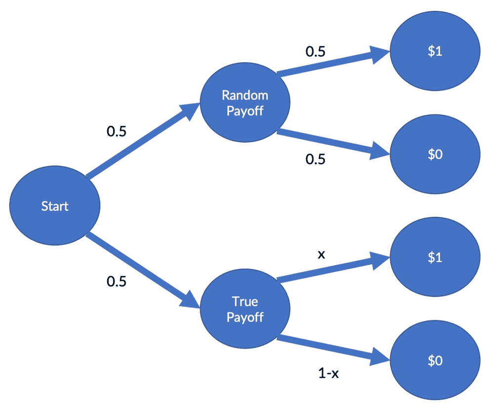

支付方案

你感兴趣的是找出真实的收益率，因为它会影响你的交易策略。在我们的例子中，你的老板允许你购买 100 单位的证券。你做了，100 种证券中有 54 种付给你 1 美元。

但实际的 TPP 是什么？在这种情况下，有一个解析解来计算最有可能的 TPP，但我们将使用一种也适用于更复杂情况的计算方法。

在下一节中，我们将模拟证券支付过程。

## 平面先验

变量 *x* 代表 TPP。我们随机抽取了 100 个真实值，如果你在真实收益下得到了 1 美元，那就是 1，否则就是 0。我们还在前面的方案中在**开始**和**随机收益**对两个随机选择进行采样。对所有试验的随机结果进行一次性取样在计算上更有效，即使它们并不都是必需的。

最后，我们将收益相加，并除以模拟中的证券数量，以获得模拟中的收益份额。

下面的代码片段运行一个模拟。但是，重要的是要确保您理解我们的证券结构是如何进行计算的:

```
def run_sim(x):

    truth = np.random.uniform(size=100) < x

    first_random = np.random.randint(2,size=100)

    second_random = np.random.randint(2,size=100)

    res = np.sum(first_random*truth + (1-first_random)*second_random)/100

    return res
```

接下来，我们想尝试一些可能的 TPP。因此，在我们的例子中，我们将对一个候选 TPP 进行采样，并用候选概率进行模拟。如果模拟输出的回报和我们在现实生活中观察到的一样，那么我们的候选人是一个真正的可能性。

以下示例方法返回真实的可能性，或者如果它尝试的候选人不合适，则返回`None`:

```
def sample(data = 0.54):

    x = np.random.uniform()

    if run_sim(x) == data:

        return x
```

由于我们必须对许多可能的 TPP 进行采样，我们希望加快这一过程是很自然的。为此，我们可以使用一个名为`JobLib`的库，它将有助于并行执行。

### 注

**注** : `JobLib`预装在 Kaggle 内核上。要了解更多信息，你可以访问 https://joblib.readthedocs.io/en/latest/。

为此，我们需要导入`Parallel`类和`delayed`方法，前者有助于并行运行循环，后者有助于在并行循环中按顺序执行函数。我们可以通过运行以下命令来导入它们:

```
from JobLib import Parallel, delayed
```

细节与本例不相关，但是`Parallel(n_jobs=-1)`方法使得作业以机器上有多少 CPU 就有多少并行执行来运行。例如，`delayed(sample)() for i in range(100000)`运行样本方法 100，000 次。

我们获得了一个 Python 列表，`t`，我们把它变成了一个 NumPy 数组。正如您在下面的代码片段中看到的，数组中大约 98%是`None`值。这意味着采样器为 *x* 尝试的 98%的值没有产生与我们的数据相匹配的结果:

```
t = Parallel(n_jobs=-1)(delayed(sample)() for i in range(100000))

t = np.array(t,dtype=float)

share = np.sum(np.isnan(t))/len(t)*100

print(f'{share:.2f}% are throwaways')
```

```

98.01% are throwaways

```

因此，我们现在将丢弃所有的`None`值，留给我们 *x* 的可能值:

```
t_flat = t[~np.isnan(t)]

plt.hist(t_flat, bins=30,density=True)

plt.title('Distribution of possible TPPs')

plt.xlim(0,1);
```

运行这段代码的结果是，我们将得到以下输出:

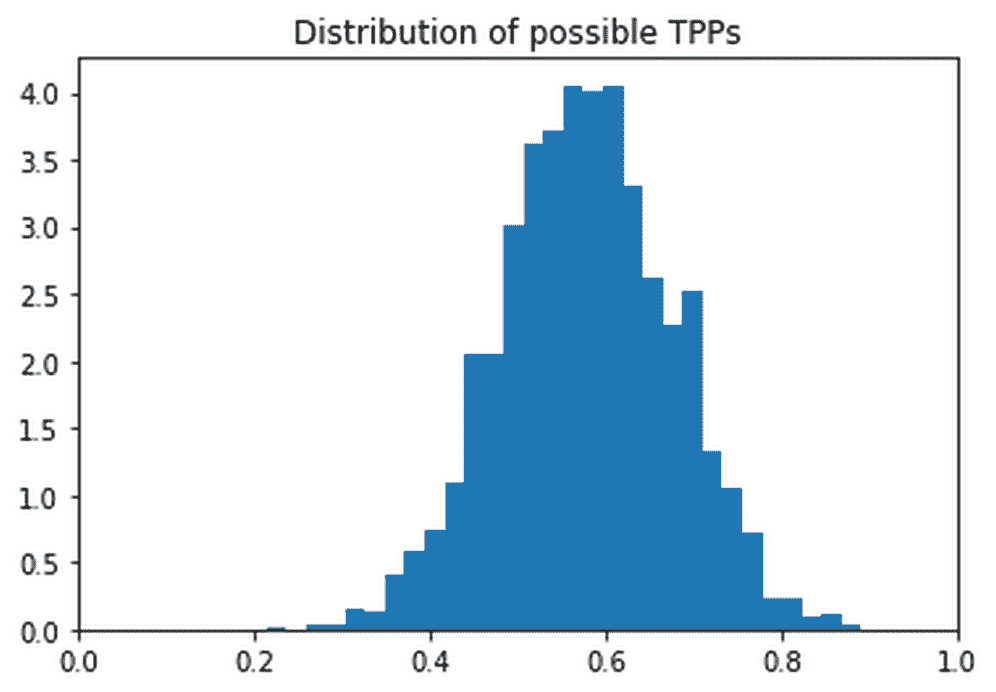

由我们天真的抽样者发现的可能的真实收益概率的分布

如您所见，可能的 TPP 有一个*分布*。这张图表向我们展示的是，最有可能的 TPP 在 50%到 60%左右；虽然其他值也是可能的，但可能性不大。

你刚刚看到的是贝叶斯方法的一大优势。所有的估计都是分布的，我们可以计算置信区间，或者可信区间，这在贝叶斯术语中是已知的。

这使我们能够更精确地确定我们对事物的确信程度，以及我们的模型中的其他参数值。将其与我们对金融的兴趣联系起来，在金融应用中，数百万的赌注押在模型的输出上，量化这种不确定性变得非常有利。

## < 50%优先

此时，你可以把你的结果告诉你的老板，他是你所交易证券的领域专家。他看着你的分析，摇摇头说，“TPP 不能超过 0.5。”他解释说，*“从基础业务来看，实际上不可能做得更多。”*

那么，如何将这一事实纳入您的模拟分析中呢？好吧，直接的解决方案是只尝试从 0 到 0.5 的候选 TPP。您所要做的就是限制您对候选值 *x* 进行采样的空间，这可以通过运行以下代码来实现:

```
def sample(data = 0.54):

    x = np.random.uniform(low=0,high=0.5)

    if run_sim(x) == data:

        return x
```

现在你可以像以前一样运行模拟了:

```
t = Parallel(n_jobs=-1)(delayed(sample)() for i in range(100000))

t = np.array(t,dtype=float)

# Optional

share = np.sum(np.isnan(t))/len(t)*100

print(f'{share:.2f}% are throwaways')
```

```

99.10% are throwaways

```

```
t_cut = t[~np.isnan(t)]

plt.hist(t_cut, bins=15,density=True)

plt.title('Distribution of possible TPPs')

plt.xlim(0,1);
```

与之前一样，它将为我们提供以下输出:

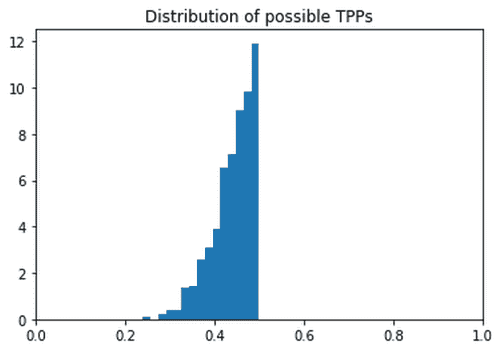

从 0 到 0.5 的可能 TPP 分布

## 事前和事后

显然，您选择的值会影响您的模拟分析结果；它也反映了你对 *x* 的可能值的信念。

第一次，在看到任何数据之前，你认为 0 到 100%之间的所有 TPP 都是同等可能的。这称为平坦先验，因为值的分布对于所有值都是相同的，因此是平坦的。第二次，你认为 TPP 必须低于 50%。

在看到数据之前表达你对 *x* 的信念的分布叫做先验分布， *P* ( *TPP* )，或者就叫做先验。我们从模拟中，也就是在看到数据 *D* 后得到的 *x* 的可能值的分布，称为后验分布，，或者简称为后验。

下图显示了第一轮和第二轮的前一轮和后一轮的样本。第一个图显示了具有`flat`后验概率的结果:

```
flat_prior = np.random.uniform(size=1000000)

plt.hist(flat_prior,bins=10,density=True, label='Prior')

plt.hist(t_flat, bins=30,density=True, label='Posterior')

plt.title('Distribution of $x$ with no assumptions')

plt.legend()

plt.xlim(0,1);
```

这会产生以下图表:

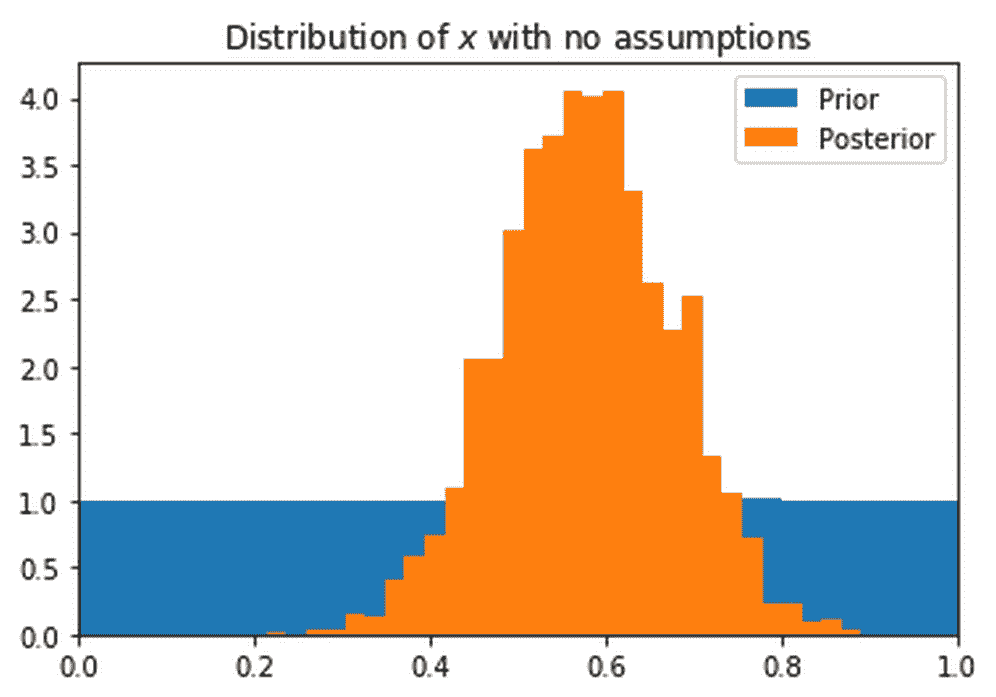

具有平坦先验的采样器的结果

下一张图显示了我们的采样器在<50% prior:

```
cut_prior = np.random.uniform(low=0,high=0.5,size=1000000)

plt.hist(cut_prior,bins=10,density=True, label='Prior')

plt.hist(t_cut, bins=15,density=True, label='Posterior')

plt.title('Distribution of $x$ assuming TPP <50%')

plt.legend()

plt.xlim(0,1);
```

While it's still the same sampler, you can see that the outcome is quite different:

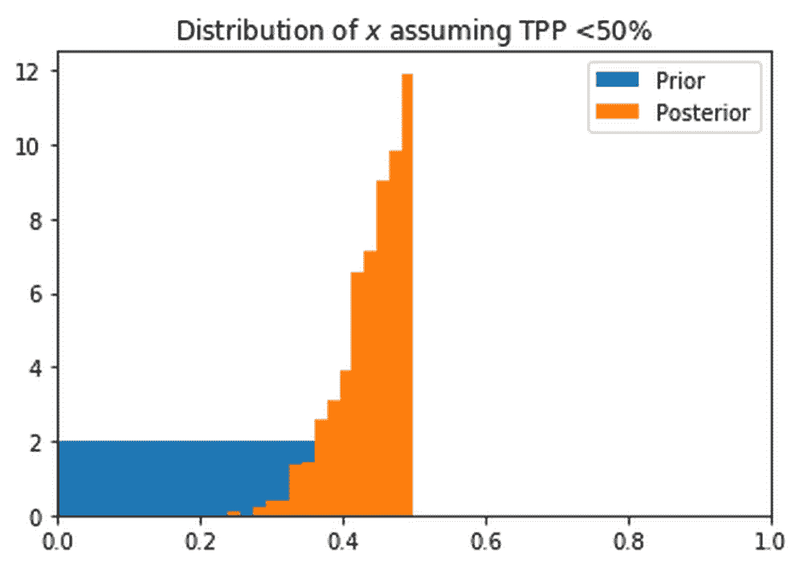

The results of our sampler with a <50% prior

Have you noticed anything curious? The posterior values of the second回合中的输出大致等于第一回合的后验值，但在这里它们被截为 0.5。这是因为对于高于 0.5 的值，第二轮先验为 0，而对于其他所有值，第二轮先验为 1。

由于我们只保留与数据匹配的模拟结果，直方图中显示的保留模拟结果的数量反映了运行模拟的概率，该模拟产生给定 TPP、 *C* 、的观察数据 *D* 。

我们从模拟中获得的后验概率等于我们在试验给定 TPP 时观察到数据的概率乘以概率 *P* ( *TPP* )。

在数学上，这表示如下:


当数据是自然获得的，比如通过面对面的会议，那么我们可能需要考虑数据收集方法中的偏差。大多数时候，我们不必担心这一点，可以简单地忽略它，但有时测量可以放大某些结果。

为了减轻这一点，我们将除以数据分布，，作为我们的后验公式的最后补充，并得出以下公式:


如你所见，这是贝叶斯公式！当运行我们的模拟时，我们从后面取样。那么，为什么我们不能用贝叶斯公式来计算后验概率呢？简单的答案是因为评估


需要在 *TPP* 上进行整合，这是很棘手的。作为替代方案，我们的模拟方法是一种简单方便的变通方法。

### 注

**注意**:第一轮先验(所有 TPP 的可能性相等)被称为“平坦先验”，因为我们对值的分布不做任何假设。在这种情况下，贝叶斯后验等于最大似然估计。

## 马尔可夫链蒙特卡罗

在上一节中，我们通过从我们的先验中随机采样来近似后验分布，然后尝试采样值。如果我们的模型只有一个参数，例如 TPP，这种随机尝试就很好。然而，随着我们的模型变得越来越复杂，我们添加了更多的参数，随机搜索方法会变得更慢。

最终，会有太多可能的参数组合没有机会生成我们的数据。因此，我们需要更多地使用更高的后验概率来指导我们的搜索和样本参数。

一种引导但仍然随机的采样方法被称为“马尔可夫链蒙特卡罗算法”。“蒙特卡洛”组件意味着随机性和模拟是相关的，而“马尔可夫链”意味着我们在某些概率下在参数空间中移动。

在这里所涉及的特定算法中，我们将移动到一个不同的参数值，其概率是参数值的后验概率之比。这里，我们会想到去参数值的后验概率。由于概率不能大于 1，我们将比率限制在 1，但这只是一个数学上的有限值，对算法来说并不重要。

下图显示了马尔可夫链蒙特卡罗算法的基本工作原理:

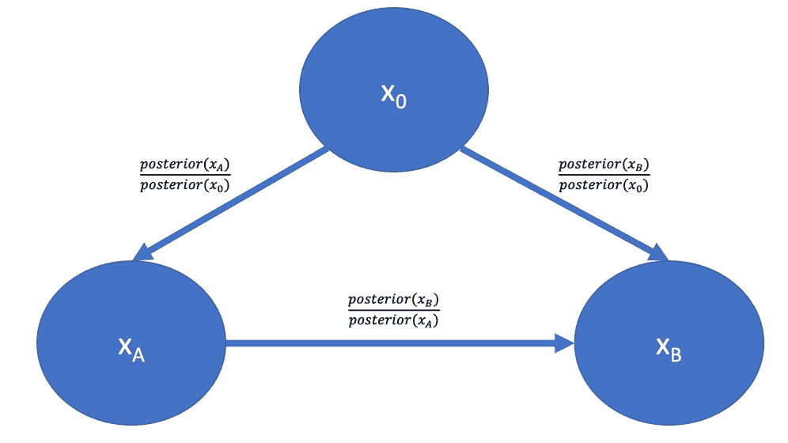

马尔可夫链蒙特卡罗算法

这张图片显示的是，我们正在进行一次“随机漫步”,或多或少地随机查看不同的参数值。然而，我们并不完全随机地移动*，而是更喜欢具有高后验概率的参数值。*

为了执行这个算法，我们需要做四件事:

1.  从我们当前的参数值 *x* 建议一个新的参数值。
2.  估计、的后验概率。对此我们可以使用贝叶斯法则。
3.  计算移动到新参数值的概率(记住概率必须小于 1):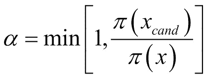
4.  以概率移动到新的参数值。

下一步是逐步构建这些组件:

```
# REPETITION FROM FIRST SECTION

def run_sim(x):

    truth = np.random.uniform(size=100) < x

    first_random = np.random.randint(2,size=100)

    second_random = np.random.randint(2,size=100)

    res = np.sum(first_random*truth + (1-first_random)*second_random)/100

    return res

# REPETITION FROM FIRST SECTION

def sample(x,data = 0.54):

    if run_sim(x) == data:

        return x
```

首先，我们需要提出一个新的*X[c]。这必须依赖于 *x* 的先前值，因为我们不希望盲目的随机搜索，而是更精确的随机行走。在这种情况下，我们将从平均值为 *x* 且标准偏差为 0.1 的正态分布中抽取 *x [和]* 样本。*

只要 *x [和]与 *x* 相关，也可以从其他分布或其他标准偏差中取样:*

```
def propose(x):

    return np.random.randn() * 0.1 + x
```

在第一部分中，通过从前一部分采样，然后运行模拟，我们直接从后一部分采样。由于我们现在通过我们提出的方法进行采样，我们不再直接从后面采样。因此，为了计算后验概率，我们将使用贝叶斯规则。

请记住，我们通常不需要除以 *P* ( *D* )，因为我们不假设有偏差的测量。贝叶斯法则简化为，其中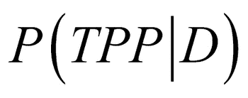为后验， *P* ( *TPP* )为先验，为似然。因此，为了估计参数值 *x* 的可能性，我们对该参数进行了多次模拟。

可能性是与我们的数据相匹配的模拟份额:

```
def likelihood(x):

    t = Parallel(n_jobs=-1)(delayed(sample)(x) for i in range(10000))

    t = np.array(t,dtype=float)

    return (1 - np.sum(np.isnan(t))/len(t))
```

首先，我们将再次使用平坦的先验；每个 TPP 都同样有可能:

```
def prior(x):

    return 1 #Flat prior
```

参数值的后验概率 *x* 是似然乘以先验:

```
def posterior(x):    

    return likelihood(x) * prior(x)
```

现在，我们准备将所有这些放入 Metropolis-Hastings MCMC 算法中！

首先，我们需要为 *x* 设置一些初始值。为了使算法快速找到可能的值，明智的做法是将其初始化为最大似然值或我们认为可能的某个估计值。我们还需要计算这个初始值的后验概率，这可以通过运行以下代码来完成:

```
x = 0.5

pi_x = posterior(x)
```

同样，我们需要跟踪在跟踪中采样的所有值。纯粹为了展示的目的，我们也将跟踪后验概率。为此，我们将运行以下程序:

```
trace = [x]

pi_trace = [pi_x]
```

现在我们进入主循环。然而，在此之前，重要的是要记住算法由四个步骤组成:

1.  提出新的候选人*x[cand]*
2.  Compute the posterior probability of

    计算接受概率:

    
3.  设置 *x* 为*X[C]并以一个概率， :

    ```
    for i in range(1000): #Main Loop            x_cand = propose(x)            pi_x_cand = posterior(x_cand)            alpha = np.min([1,pi_x_cand/(pi_x + 0.00001)]) # Save division            u = np.random.uniform()             (x, pi_x) = (x_cand,pi_x_cand) if u<alpha else (x,pi_x)      trace.append(x)      pi_trace.append(pi_x)            if i % 10 == 0:          print(f'Epoch {i}, X = {x:.2f}, pi = {pi_x:.2f}')
    ``` 
4.  在运行这个算法若干个时期后，我们最终得到了一个可能有收益的骗子份额的分布。正如我们之前所做的那样，我们可以简单地运行以下代码来实现这一点:

```

Epoch 0, X = 0.50, pi = 0.00Epoch 10, X = 0.46, pi = 0.04...Epoch 990, X = 0.50, pi = 0.06g

```

一旦我们运行了前面的代码，我们将收到这个图形作为输出:

```
plt.hist(trace,bins=30)

plt.title('Metropolis Hastings Outcome')

plt.xlim(0,1);
```

大都会黑斯廷斯采样器的结果

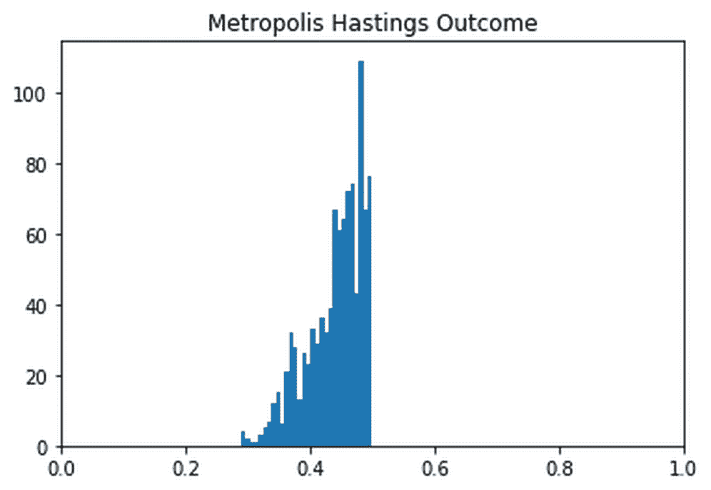

通过查看一段时间内的轨迹，显示了算法如何随机移动，但集中在极有可能的值上:

然后我们将得到一个输出，以图表的形式，向我们显示了**Metropolis Hasings**(**MH**)采样器的轨迹:

```
plt.plot(trace)

plt.title('MH Trace');
```

大都会黑斯廷斯采样器的痕迹

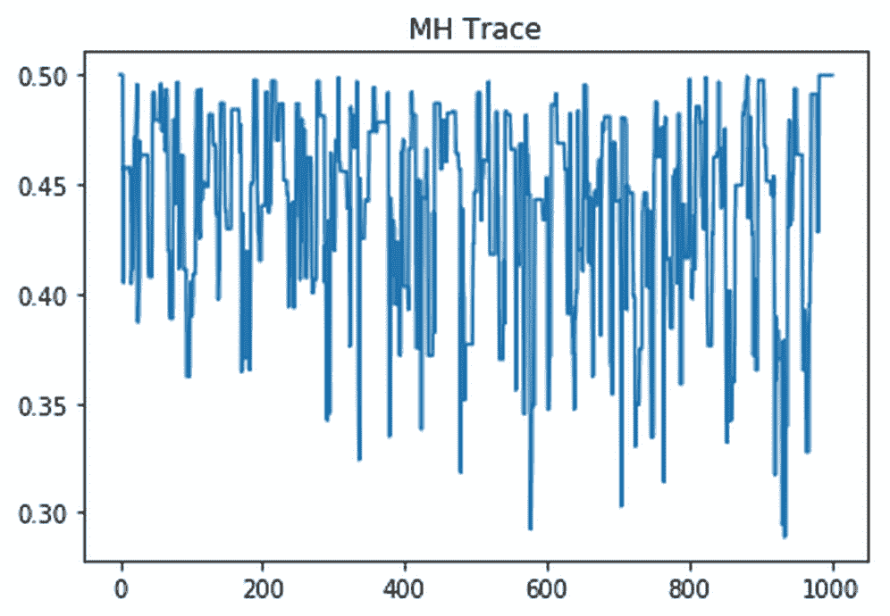

为了更好的理解，我们可以绘制出试验值的后验概率:

成功执行代码后，我们将得到下面的输出图表:

```
plt.scatter(x=trace,y=pi_trace)

plt.xlabel('Proposed X')

plt.ylabel('Posterior Probability')

plt.title('X vs Pi');
```

建议值对后验概率

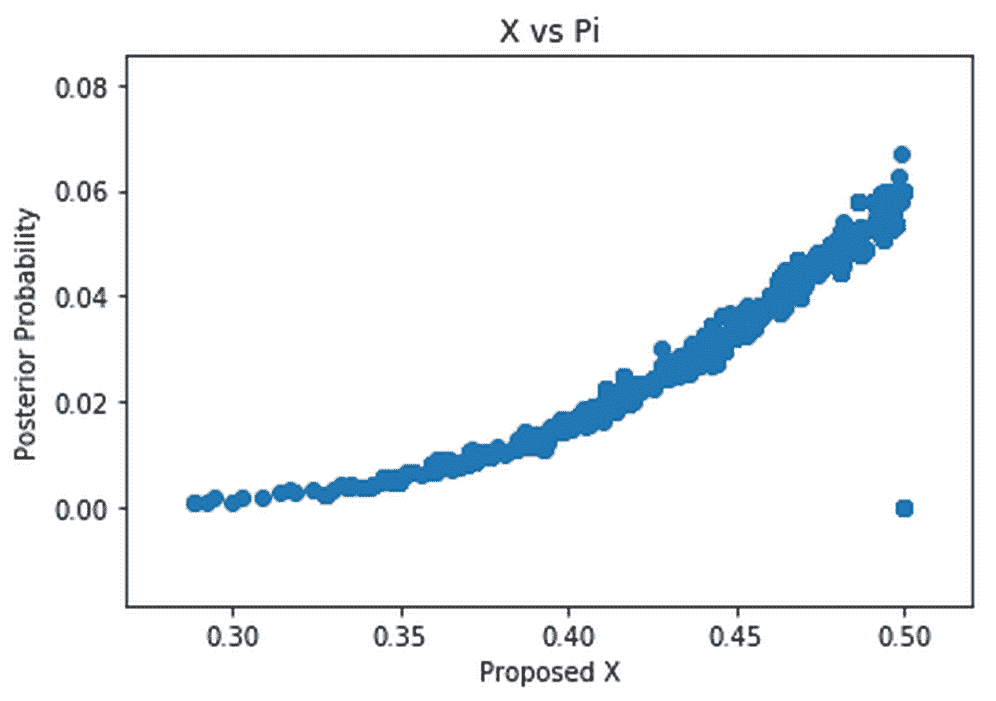

大都会-黑斯廷斯 MCMC

## 为了展示 PyMC3 的强大功能和灵活性，我们将使用来完成一个经典的计量经济学任务，但是我们将对它进行贝叶斯分析。

注

### **注**:这个例子直接改编自 PyMC3 文档中的一个例子:[https://docs.pymc.io/notebooks/stochastic_volatility.html](https://docs.pymc.io/notebooks/stochastic_volatility.html)。反过来，这是改编自 Hoffman 2011 年论文*不掉头采样器*中的一个例子，可在[https://arxiv.org/abs/1111.4246](https://arxiv.org/abs/1111.4246)获得。

股票价格和其他金融资产价格是波动的，日收益的方差称为波动率。波动性是一种常用的风险度量，因此准确地度量它非常重要。

这里最简单的解决方法是计算一个回顾性的收益方差。然而，表达实际波动的不确定性是有好处的。类似于我们之前看到的回报例子，有一个“实际”价值的分布，从中可以得出实现的价值。这也被称为“随机波动率”，因为有一个可能的波动率值分布，从中观察到的波动率是一个实现的样本。

在这种情况下，我们感兴趣的是建立一个美国股票市场指数标准普尔 500 的随机波动模型。为此，我们必须首先加载数据。你可以直接从雅虎财经下载，也可以在 https://www.kaggle.com/crescenzo/sp500 T4 的 Kaggle 上找到。

若要加载数据，请运行以下代码:

在我们看到的例子中，我们对收盘价感兴趣，所以我们需要从数据集中提取收盘价。数据集首先显示新数据，因此我们需要对其进行反转，这是通过以下代码实现的:

```
df = pd.read_csv('../input/S&P.csv')

df['Date'] = pd.to_datetime(df['Date'])
```

当我们在下面的代码中绘制收盘价时，通过输出的图形，我们看到一个熟悉的图形:

```
close = pd.Series(df.Close.values,index=pd.DatetimeIndex(df.Date))

close = close[::-1]
```

因此，我们将得到以下图表作为输出:

```
close.plot(title='S&P 500 From Inception');
```

```

SP500

```

从成立到 2018 年底的标准普尔 500

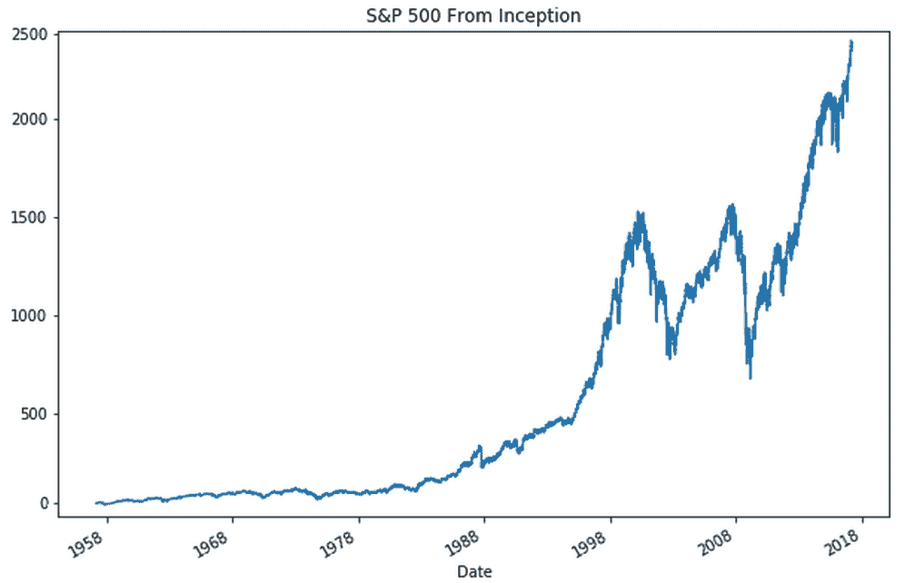

数据集包含了自开始以来的 S & P，这对我们来说有点多，所以在我们的例子中，我们将在 1990 年将其截掉。我们可以通过运行以下命令来指定这个日期:

因为我们对回报感兴趣，所以我们需要计算价格差异。我们可以使用`np.diff`来获得每日价格差异。我们将把整个事情打包成一个熊猫系列，以便更容易策划:

```
close = close['1990-01-01':]
```

这将为我们提供以下图表:

```
returns = pd.Series(np.diff(close.values),index=close.index[1:])

returns.plot();
```

标准普尔 500 从 1990 年到 2018 年底的回归

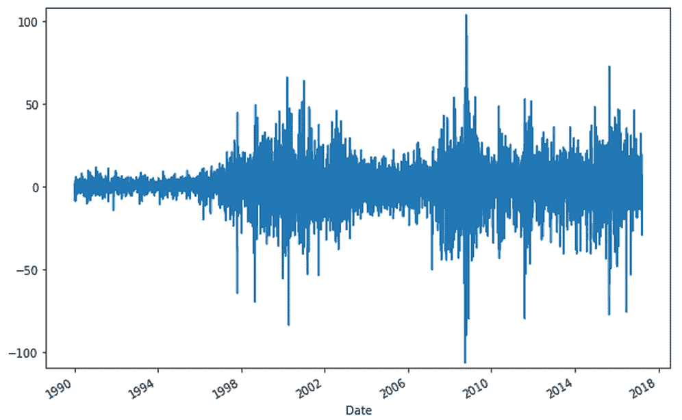

现在 PyMC3 的乐趣开始了。PyMC3 包括一些处理时间序列的特殊分布，比如随机行走。当我们想要对股票价格建模时，这正是正确的方法。

首先，我们需要导入 PyMC3 和它的时间序列工具，即随机漫步类:

最后，我们需要建立模型。我们可以通过运行以下代码来实现这一点:

```
import pymc3 as pm

from pymc3.distributions.timeseries import GaussianRandomWalk
```

现在让我们来看看我们刚刚执行的命令，以便建立模型。如您所见，它由四个关键元素组成:

```
with pm.Model() as model:

    step_size = pm.Exponential('sigma', 50.)      #1

    s = GaussianRandomWalk('s', sd=step_size,     #2

                           shape=len(returns))

    nu = pm.Exponential('nu', .1)                 #3

    r = pm.StudentT('r', nu=nu,                   #4

                    lam=pm.math.exp(-2*s),

                    observed=returns.values)
```

波动率`s`被建模为一个随机游走，其基本步长为`step_size`。我们的步长先验是一个带的指数分布(同样，理解所使用的每个分布的细节对于演示来说是不必要的)。

1.  然后，我们对随机波动率本身进行建模。注意我们是如何插入步长的，步长本身就是一个随机变量。随机游走的长度应该与观察到的返回值相同。
2.  我们对实际的股票收益建模，这些收益来自具有自由度的分布。我们对`nu`的先验也是一个指数分布。
3.  (或代码中的`lam`)由我们的随机波动模型产生。为了使模型以观察到的数据为条件，我们传递观察到的返回值。
4.  Finally, we get to model the actual returns. We model them to be drawn from a `StudentT` distribution with a scaling factor

    PyMC3 的标准采样器不是 Metropolis Hastings，而是**不掉头采样器** ( **螺母**)。如果我们不指定采样器，只调用`sample`，PyMC3 将默认为 NUTS。

为了使这里的采样顺利进行，我们需要指定相对较高数量的`tune`样本。这些是取样者将从中提取的样本，以便找到一个好的起点，这不会是后验的一部分，类似于之前被烧毁的样本。

我们还需要通过设置一个高的`target_accept`值来告诉 NUTS 在接受值时要宽容。我们可以通过运行以下命令来实现这一点:

PyMC3 有一个很好的工具，我们可以用它来可视化采样的结果。我们感兴趣的是波动率随机游走的标准差，，以及从中得出实际收益的`StudentT`分布的自由度。

```
with model:

    trace = pm.sample(tune=2000, nuts_kwargs=dict(target_accept=.9))
```

当我们并行运行两条链时，可以看到我们获得了两种不同的输出分布。如果我们运行采样器的时间更长，这两种结果就会趋同。我们可以通过对它们进行平均来获得更好的估计，这就是 PyMC3 对预测所做的。例如，现在让我们用下面的代码来尝试一下:

下面的图表显示了该代码的结果:

```
pm.traceplot(trace, varnames=['sigma', 'nu']);

TracePlot
```

PyMC3 采样器的结果概述。在左边，你可以看到由两个采样器链产生的分布。在右边，你可以看到它们的踪迹。


在最后一步，我们可以展示随机波动是如何随时间变化的。你可以看到它是如何与 2008 年金融危机等动荡时期完美契合的。您还可以看到，在某些时期，模型对波动性或多或少有些把握:

正如我们所看到的，该代码的输出将返回我们在下面看到的图表:

```
plt.plot(returns.values)

plt.plot(np.exp(trace[s].T), 'r', alpha=.03);

plt.xlabel('time')

plt.ylabel('returns')

plt.legend(['S&P500', 'Stochastic Vol.']);
```

从 1990 年到 2018 年末推断的随机波动性

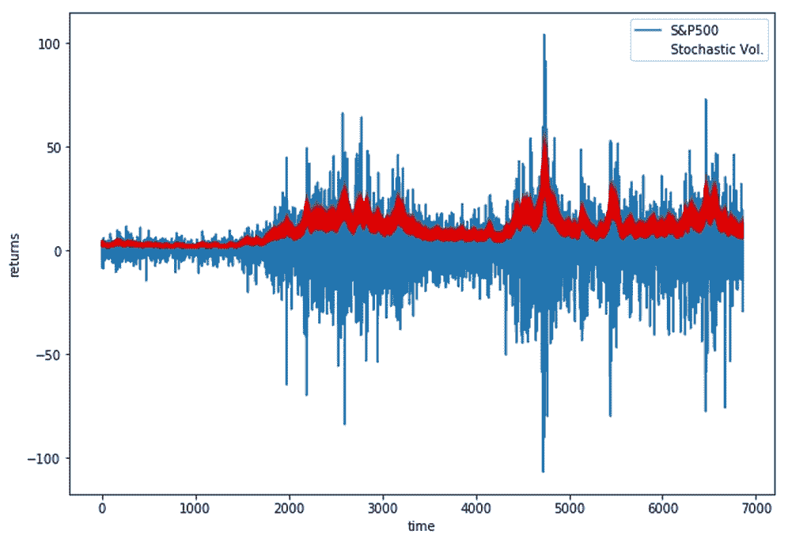

有大量的应用程序可以用这种相对较小的贝叶斯模型很好地建模。主要优点是模型易于解释，并能很好地表达不确定性。概率编程与数据科学的“讲故事”方法非常一致，因为故事在模型中得到了清晰的表达。

在下一节中，我们将从浅层概率规划转移到深层概率规划。

从概率规划到深度概率规划

## 到目前为止，我们开发的贝叶斯模型都很肤浅。因此，让我们问问自己，我们是否可以将深度网络的预测能力与贝叶斯模型的优势结合起来。这是一个活跃的研究领域，也是结束本书的合适方式。

深层网络有许多参数；这使得搜索整个参数空间成为一个难题。在传统的监督深度学习中，我们会使用反向传播来解决这个问题。反向传播也可以用于贝叶斯模型。然而，这不是唯一的，甚至不一定是最好的，进行贝叶斯深度学习的方法。

总的来说，有四种方法可以进行贝叶斯深度学习:

使用**自动微分变分推理** ( **AVI** )。这意味着用引导模型近似后验模型，然后使用梯度下降优化模型参数。PyMC3 可以使用 AVI 优化器来完成这项工作。参见 Alp Kucukelbir 等人在[https://arxiv.org/abs/1603.00788](https://arxiv.org/abs/1603.00788)发表的论文*自动微分变分推理*。

*   或者，你可以使用 Pyro，它实现了快速的、GPU 优化的 AVI，你可以在这里查看:[http://pyro.ai/](http://pyro.ai/)。
*   虽然在这里给出这种方法的详细教程太多了，但是 PyMC3 文档有一个很好的教程:[https://docs.pymc.io/笔记本/Bayesian _ neural _ network _ advi . html](https://docs.pymc.io/%20notebooks/bayesian_neural_network_advi.html)。
*   假设后验值呈正态分布，然后使用标准神经网络库，如 Keras，学习每个参数的平均值和标准差。还记得我们在处理变型自动编码器时如何从参数化正态分布中采样 z 值吗？我们可以对每一层都这样做。与 AVI 相比，这种方法训练速度更快，需要的计算能力和内存更少，但灵活性较差，参数是非贝叶斯神经网络的两倍。
*   使用辍学伎俩。在处理时间序列时，我们在测试时打开了 dropout，并多次运行推断以获得置信区间。这是一种非常容易实现的贝叶斯学习形式，没有比常规神经网络更多的参数。然而，它在推理时速度较慢，也没有 AVI 的所有灵活性。
*   挑选和混合。为了训练一个神经网络，我们需要一个梯度信号，我们可以从 AVI 获得。我们可以以常规方式训练神经网络的插座，有时称为特征提取器，并以贝叶斯方式训练网络的头部。这样，我们获得了不确定性估计，而不必支付贝叶斯方法的全部成本。
*   总结

<title>Summary</title> 

# 在这一章中，你简要了解了现代贝叶斯机器学习及其在金融领域的应用。我们只是触及了这一点，因为这是一个非常活跃的研究领域，我们可以期待在不久的将来会有许多突破。观察它的发展并将其应用于生产将是令人兴奋的。

回顾本章，我们应该有信心理解以下内容:

贝叶斯公式的经验推导

*   马尔可夫链蒙特卡罗的工作原理和原因
*   如何使用 PyMC3 进行贝叶斯推理和概率编程
*   这些方法如何应用于随机波动模型
*   注意你在这里学到的一切是如何转移到更大的模型中的，比如我们在整本书中讨论的深度神经网络。对于非常大的模型，采样过程仍然有点慢，但研究人员正在积极努力使它更快，你所学到的是未来的一个伟大的基础。

告别

<title>Farewell</title> 

# 就这样，我们结束了旅程的最后一章，我向你说再见，亲爱的读者。让我们回头看看旅程开始时遇到的目录。

在过去的 10 章中，我们讨论了很多内容，包括以下内容:

基于梯度下降的优化

*   特征工程
*   基于树的方法
*   计算机视觉
*   时间序列模型
*   自然语言处理
*   生成模型
*   调试机器学习系统
*   机器学习中的伦理
*   贝叶斯推理
*   在每一章中，我们都创造了一大袋实用的技巧和诀窍供你使用。这将允许你建立最先进的系统，改变金融行业。

然而，在许多方面，我们只是触及了表面。每一章的主题都值得写一本书，即使这样也不足以涵盖金融领域机器学习的所有内容。

我留给你这样一个想法:金融领域的机器学习是一个令人兴奋的领域，其中仍有许多有待发现，所以亲爱的读者，继续前进；有模型要训练，有数据要分析，有推论要做！

延伸阅读

<title>Further reading</title> 

# 你坚持到了书的结尾！你现在打算做什么？多读书！机器学习，尤其是深度学习，是一个快速发展的领域，所以任何阅读清单都有可能在你阅读时过时。然而，下面的列表旨在向你展示最相关的书籍，它们有一个在未来几年保持相关性的安全网。

一般数据分析

## 韦斯·麦金尼，*用于数据分析的 Python*，[http://wesmckinney.com/pages/book.html](http://wesmckinney.com/pages/book.html)。

Wes 是 pandas 的原创者，pandas 是一个流行的 Python 数据处理工具，我们在第 2 章，*中看到它将机器学习应用于结构化数据*。pandas 是 Python 中任何数据科学工作流的核心组件，并且在可预见的未来仍将如此。投资于他所展示的工具的可靠知识绝对值得您花费时间。

机器学习中的声音科学

## 马科斯·洛佩兹·德·普拉多，*金融机器学习进展*，[https://www . Wiley . com/en-us/Advances+in+Financial+Machine+Learning-p-9781119482086](https://www.wiley.com/en-us/Advances+in+Financial+Machine+Learning-p-9781119482086)。

马科斯是在金融领域应用机器学习的专家。他的书主要关注过度拟合的危险，以及研究人员在进行适当的科学研究时必须多小心。虽然更侧重于高频交易，但马科斯写得非常清楚，使潜在的问题和解决方案非常容易理解。

通用机器学习

## 特雷弗·哈斯蒂、罗伯特·蒂伯拉尼和杰罗姆·弗里德曼，*统计学习的要素*，[https://web.stanford.edu/~hastie/ElemStatLearn/](https://web.stanford.edu/~hastie/ElemStatLearn/)。

统计机器学习的“圣经”，包含了对统计学习所有重要概念的很好的解释。当你需要某个概念的深入信息时，这本书是最好的查找书。

加雷思·詹姆斯，丹妮拉·威滕，特雷弗·哈斯蒂，罗伯特·蒂布拉尼，*统计学习导论*，[https://www-bcf.usc.edu/~gareth/ISL/](https://www-bcf.usc.edu/~gareth/ISL/)。

*统计学习简介*有点像*统计学习要素*的伴侣。由一些相同的作者写的，它以严格的方式介绍了统计学习中最重要的概念。如果你是统计学学习的新手，这是非常理想的。

通用深度学习

## 伊恩·古德菲勒、约舒阿·本吉奥、亚伦·库维尔、*深度学习*、[https://www.deeplearningbook.org/](https://www.deeplearningbook.org/)。

虽然这本书非常注重实践，但*深度学习*更侧重于深度学习背后的理论。它涵盖了广泛的主题，并从理论概念的实际应用。

强化学习

## 理查德 s 萨顿和安德鲁 g 巴尔托，*强化学习:介绍*，[http://incompleteideas.net/book/the-book-2nd.html](http://incompleteideas.net/book/the-book-2nd.html)。

强化学习的标准工作深入讨论了所有主要算法。重点不在于华而不实的结果，而在于强化学习算法背后的推理和推导。

贝叶斯机器学习

## 凯文·p·墨菲，*机器学习:概率视角*，[https://www.cs.ubc.ca/~murphyk/MLbook/](https://www.cs.ubc.ca/~murphyk/MLbook/)。

这本书涵盖了机器学习技术从概率和更多的贝叶斯观点。如果你想以不同的方式思考机器学习，这是一个非常好的指南。

Cameron Davidson-Pilon，*黑客的概率编程和贝叶斯方法*，[http://camdavidsonpilon . github . io/probability-Programming-and-Bayesian-Methods-for-hacker/](http://camdavidsonpilon.github.io/Probabilistic-Programming-and-Bayesian-Methods-for-Hackers/)。

这可能是唯一一本专注于实际应用的概率编程书籍。它不仅是免费和开源的，而且还可以通过新的库和工具得到频繁的更新，从而始终保持相关性。

This is probably the only probabilistic programming book that focuses on practical applications. Not only is it free and open source, it also gets frequent updates with new libraries and tools so that it always stays relevant.