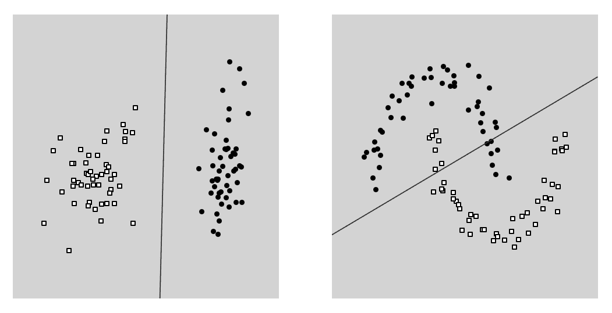
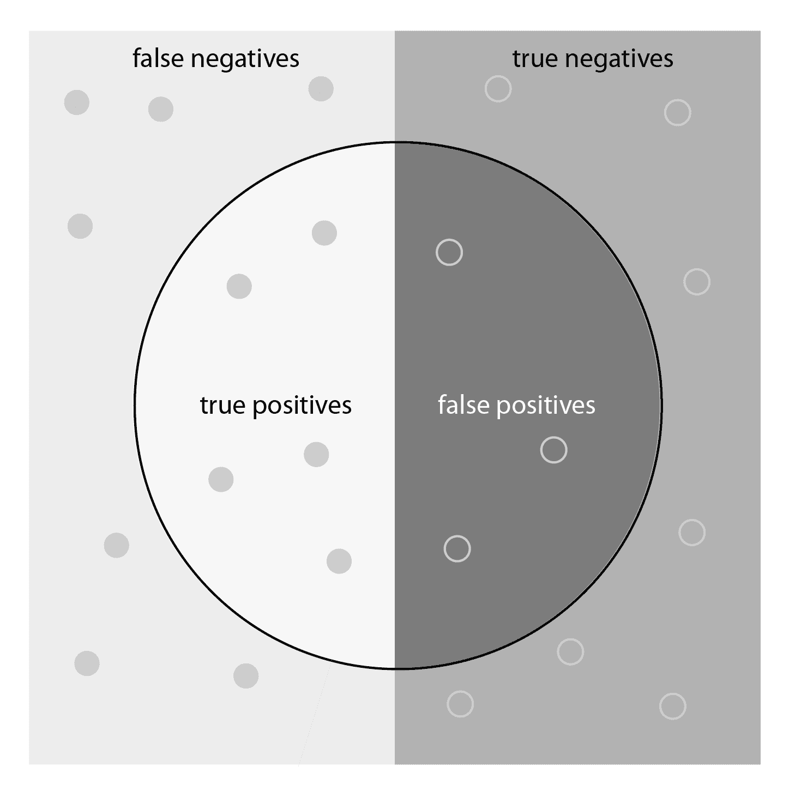
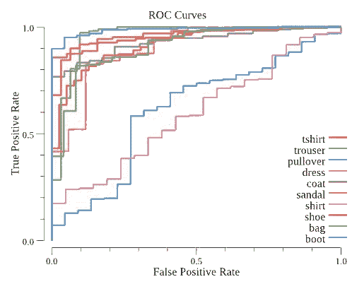
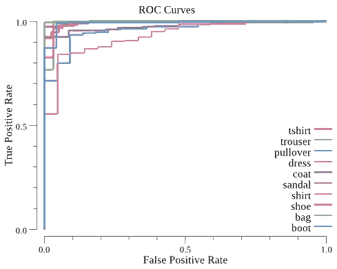

# 监督学习

正如我们在第一章中了解到的，监督学习是机器学习的两个主要分支之一。在某种程度上，这类似于人类学习新技能的方式:其他人向我们展示该做什么，然后我们能够通过效仿他们来学习。在监督学习算法的情况下，我们通常需要大量的例子，也就是说，为我们的算法提供**输入**和**预期输出**应该是什么的大量数据。该算法将从这些数据中学习，然后能够**预测**基于以前没有见过的新输入的输出。

使用监督学习可以解决数量惊人的问题。许多电子邮件系统使用它来分类电子邮件，无论是重要的还是不重要的，只要有新消息到达收件箱。更复杂的例子包括图像识别系统，它可以纯粹从输入像素值中识别图像包含的内容^(【1】)。这些系统首先从庞大的图像数据集学习，这些数据集已经由人类手动标记，但随后能够自动对全新的图像进行分类。甚至有可能使用监督学习来驾驶汽车在赛道上自动行驶:该算法从学习人类驾驶员如何控制车辆开始，最终能够复制这种行为^(【2】)。

本章结束时，你将能够使用 Go 实现两种类型的监督学习:

*   **分类**，其中算法必须学会将输入分类为两个或多个离散类别。我们将构建一个简单的图像识别系统来演示这是如何工作的。
*   **回归**，其中算法必须学会预测一个连续变量，例如，网站上销售的商品价格。对于我们的例子，我们将根据输入来预测房价，比如房子的位置、大小和年龄。

在本章中，我们将讨论以下主题:

*   何时使用回归和分类
*   如何使用 Go 机器学习库实现回归和分类
*   如何衡量算法的性能

我们将讨论构建监督学习系统的两个阶段:

*   **训练**，这是我们使用标记数据校准算法的学习阶段
*   **推理**或**预测**，我们使用经过训练的算法来达到预期目的:根据输入数据进行预测


# 分类

当开始任何监督学习问题时，第一步是加载和准备数据。我们将从加载 **MNIST 时尚** **数据集**^(【3】)开始，这是一个小的灰度图像集合，显示不同的服装项目。我们的工作是建立一个系统，可以识别每个图像中的内容；也就是说，它包含一件衣服、一只鞋、一件外套等等吗？

首先，我们需要通过运行代码库中的`download-fashion-mnist.sh`脚本来下载数据集。然后，我们将它加载到 Go 中:

```
import (
    "fmt"
     mnist "github.com/petar/GoMNIST"
    "github.com/kniren/gota/dataframe"
    "github.com/kniren/gota/series"
    "math/rand"
    "github.com/cdipaolo/goml/linear"
    "github.com/cdipaolo/goml/base"
    "image"
    "bytes"
    "math"
    "github.com/gonum/stat"
    "github.com/gonum/integrate"
)
set, err := mnist.ReadSet("../datasets/mnist/images.gz", "../datasets/mnist/labels.gz")
```

让我们先来看看这些图片的样本。每一个都是 28 x 28 像素，每个像素的值都在 0 到 255 之间。我们将使用这些像素值作为我们算法的输入:我们的系统将接受来自一幅图像的 784 个输入，并使用它们根据图像包含哪件衣服来对图像进行分类。在 Jupyter 中，您可以查看如下图像:

```
set.Images[1]
```

这将显示数据集中的 28 x 28 图像之一，如下图所示:


为了使这些数据适用于机器学习算法，我们需要将其转换为 dataframe 格式，正如我们在[第 2 章](532d8304-b31d-41ef-81c1-b13f4c692824.xhtml)、*设置开发环境*中所学。首先，我们将从数据集中加载前 1，000 幅图像:

```
func MNISTSetToDataframe(st *mnist.Set, maxExamples int) dataframe.DataFrame {
 length := maxExamples
 if length > len(st.Images) {
 length = len(st.Images)
 }
 s := make([]string, length, length)
 l := make([]int, length, length)
 for i := 0; i < length; i++ {
 s[i] = string(st.Images[i])
 l[i] = int(st.Labels[i])
 }
 var df dataframe.DataFrame
 images := series.Strings(s)
 images.Name = "Image"
 labels := series.Ints(l)
 labels.Name = "Label"
 df = dataframe.New(images, labels)
 return df
}

df := MNISTSetToDataframe(set, 1000)
```

我们还需要一个字符串数组，其中包含每个图像的可能标签:

```
categories := []string{"tshirt", "trouser", "pullover", "dress", "coat", "sandal", "shirt", "shoe", "bag", "boot"}
```

为了测试完成的算法，从保留一小部分数据开始非常重要。这使我们能够衡量算法在训练期间没有使用的新数据上的工作情况。如果您不这样做，您很可能会构建一个在训练期间工作得很好，但在面对新数据时表现很差的系统。首先，我们将使用 75%的图像来训练我们的模型，25%的图像来测试它。

使用监督学习时，将您的数据分成**训练集**和**测试集**是至关重要的一步。保留 20-30%的数据用于测试是正常的，但是如果你的数据集非常大，你可以少用一些。

使用上一章的`Split(df dataframe.DataFrame, valFraction float64)`函数准备这两个数据集:

```
training, validation := Split(df, 0.75)
```


# 一个简单的模型——逻辑分类器

解决我们问题的最简单的算法之一是逻辑分类器。这就是数学家所说的**线性模型**，我们可以通过思考一个简单的例子来理解，在这个例子中，我们试图将下面两个图表上的点分类为圆形或方形。线性模型将试图通过绘制一条直线来分隔这两种类型的点。这在左边的图表上非常有效，其中输入(在图表轴上)和输出(圆形或方形)之间的关系很简单。但是，它不适用于右边的图表，在右边的图表中，不能使用直线将点分成两个正确的组:



当面对一个新的机器学习问题时，建议你先从一个线性模型开始作为**基线**，然后再将其他模型与之对比。尽管线性模型不能捕捉输入数据中的复杂关系，但它们易于理解，通常可以快速实现和训练。您可能会发现，对于您正在处理的问题，线性模型已经足够好了，并且因为不必实现任何更复杂的东西而节省了时间。如果没有，您可以尝试不同的算法，并使用线性模型来了解它们的效果有多好。

一个**基线**是一个简单的模型，在比较不同的机器学习算法时，你可以用它作为参考点。

回到我们的图像数据集，我们将使用逻辑分类器来确定图像中是否包含裤子。首先，让我们做一些最终的数据准备:将标签简化为裤子(`true`)或非裤子(`false`):

```
func EqualsInt(s series.Series, to int) (*series.Series, error) {
 eq := make([]int, s.Len(), s.Len())
 ints, err := s.Int()
 if err != nil {
 return nil, err
 }
 for i := range ints {
 if ints[i] == to {
 eq[i] = 1
 }
    }
    ret := series.Ints(eq)
    return &ret, nil
}

trainingIsTrouser, err1 := EqualsInt(training.Col("Label"), 1)
validationIsTrouser, err2 := EqualsInt(validation.Col("Label"), 1)
if err1 != nil || err2 != nil {
    fmt.Println("Error", err1, err2)
}
```

我们还将对像素数据进行规范化，这样，它将由 0 到 1 之间的浮点数表示，而不是存储为 0 到 255 之间的整数:

许多有监督的机器学习算法只有在数据被归一化，即被重新缩放以使其在 0 和 1 之间时才能正常工作。如果您在让算法正确训练方面遇到问题，请确保您已经正确地规范化了数据。

```
func NormalizeBytes(bs []byte) []float64 {
    ret := make([]float64, len(bs), len(bs))
    for i := range bs {
        ret[i] = float64(bs[i])/255.
    }
    return ret
}

func ImageSeriesToFloats(df dataframe.DataFrame, col string) [][]float64 {
    s := df.Col(col)
    ret := make([][]float64, s.Len(), s.Len())
    for i := 0; i < s.Len(); i++ {
        b := []byte(s.Elem(i).String())
        ret[i] = NormalizeBytes(b)
    }
    return ret
}

trainingImages := ImageSeriesToFloats(training, "Image")
validationImages := ImageSeriesToFloats(validation, "Image")
```

正确准备数据后，最后是创建逻辑分类器并训练它的时候了:

```
model := linear.NewLogistic(base.BatchGA, 1e-4, 1, 150, trainingImages, trainingIsTrouser.Float())

//Train
err := model.Learn()
if err != nil {
  fmt.Println(err)
}
```


# 衡量绩效

现在我们有了训练好的模型，我们需要通过比较它对每张图像的预测与地面事实(无论图像是否是一条裤子)来衡量它的表现。一个简单的方法是测量**精度**。

**Accuracy** measures what proportion of the input data can be classified correctly by the algorithm, for example, 90%, if 90 out of 100 predictions from the algorithm are correct.

在我们的 Go 代码示例中，我们可以通过循环验证数据集并计算有多少图像被正确分类来测试模型。这将输出 98.8%的模型精度:

```
//Count correct classifications
var correct = 0.
for i := range validationImages {
  prediction, err := model.Predict(validationImages[i])
  if err != nil {
    panic(err)
  }

  if math.Round(prediction[0]) == validationIsTrouser.Elem(i).Float() {
    correct++
  }
}

//accuracy
correct / float64(len(validationImages))
```


# 精确度和召回率

测量精度可能会产生误导。假设您正在构建一个系统来对医疗患者是否会对一种罕见疾病检测呈阳性进行分类，在数据集中，只有 0.1%的例子实际上呈阳性。一个非常糟糕的算法可能预测没有人会检测为阳性，但它有 99.9%的准确率，因为这种疾病很罕见。

一个数据集包含一个分类相对于另一个分类的更多示例，称为**不平衡**。在测量算法性能时，需要小心对待不平衡的数据集。

衡量性能的更好方法是将算法的每个预测归入以下四个类别之一:


我们现在可以定义一些新的性能指标:

*   **精度**衡量模型的真实预测有多少是正确的。在下图中，模型预测的真阳性值(圆圈的左侧)除以所有模型的阳性预测值(圆圈中的所有值)。
*   **回忆**衡量模型识别所有正面例子的能力。换句话说，真阳性(圆圈的左侧)除以所有实际为阳性的数据点(整个左侧):



上图显示了中心圆圈中模型预测为真的数据点。真正正确的点在图的左半部分。

**Precision** and **recall** are more robust performance metrics when working with unbalanced datasets. Both range between 0 and 1, where 1 indicates perfect performance.

以下是真阳性和假阴性总数的代码:

```
//Count true positives and false negatives
var truePositives = 0.
var falsePositives = 0.
var falseNegatives = 0.
for i := range validationImages {
  prediction, err := model.Predict(validationImages[i])
  if err != nil {
    panic(err)
  }
  if validationIsTrouser.Elem(i).Float() == 1 {
    if math.Round(prediction[0]) == 0 {
      // Predicted false, but actually true
      falseNegatives++
    } else {
      // Predicted true, correctly
      truePositives++
    }
  } else {
    if math.Round(prediction[0]) == 1 {
      // Predicted true, but actually false
      falsePositives++
    }
  }
}
```

我们现在可以用下面的代码计算精度和召回率:

```
//precision
truePositives / (truePositives + falsePositives)
//recall
truePositives / (truePositives + falseNegatives)
```

对于我们的线性模型，我们得到 100%的精度，这意味着没有假阳性，召回率为 90.3%。


# ROC 曲线

另一种测量性能的方法是更详细地观察分类器是如何工作的。在我们的模型中，会发生两件事:

*   首先，该模型计算一个介于 0 和 1 之间的值，表明给定图像被归类为一条裤子的可能性有多大。
*   设置阈值，使得只有得分高于阈值的图像被分类为裤子。设置不同的阈值可以以召回为代价来提高精确度，反之亦然。

如果我们观察从 0 到 1 的所有不同阈值的模型输出*，我们可以更好地理解它有多有用。我们使用所谓的**接收器工作特性** ( **ROC** )曲线来实现这一点，该曲线是不同阈值下数据集的真阳性率与假阳性率的关系图。以下三个示例显示了差、中等和非常好的分类器的 ROC 曲线:*


通过测量这些 ROC 曲线下的阴影面积，我们得到了模型有多好的一个简单度量，它被称为曲线下的面积 ( **AUC)** 。对于差的模型来说，这接近于 **0.5** ，但是对于非常好的模型来说，这接近于 **1.0** ，表明该模型能够同时实现*高的真阳性率和低的假阳性率。*

`gonum` / `stat`包为计算 ROC 曲线提供了一个有用的函数，一旦我们扩展了模型以处理数据集中的每一件不同的衣服，我们将使用这个函数。

**接收器工作特性**或 **ROC 曲线**，是不同阈值下真阳性率与假阳性率的关系图。它让我们可以直观地看到模型在分类方面有多好。AUC 给出了分类器有多好的简单度量。


# 多级模型

到目前为止，我们一直使用**二元分类法**；也就是说，如果图像显示一条裤子，它应该输出`true`，否则输出`false`。对于一些问题，比如检测一封邮件是否重要，这就是我们所需要的。但是在这个例子中，我们真正想要的是一个模型，它可以识别我们数据集中所有不同类型的服装，即衬衫、靴子、连衣裙等等。

对于一些算法实现，您需要从对输出应用单热编码开始，如 [第 2 章](532d8304-b31d-41ef-81c1-b13f4c692824.xhtml)，*设置开发环境*中所示。然而，对于我们的例子，我们将在 **goml/linear** 中使用 **softmax regression** ，它会自动完成这一步。我们可以通过简单地将输入(像素值)和整数输出(0，1，2，...代表 t 恤、裤子、套头衫等):

```
model2 := linear.NewSoftmax(base.BatchGA, 1e-4, 1, 10, 100, trainingImages, training.Col("Label").Float())

//Train
err := model2.Learn()
if err != nil {
  fmt.Println(err)
}
```

当使用这个模型进行推理时，它将为每个类别输出一个概率向量；也就是说，它告诉我们输入图像是 t 恤、裤子等等的概率。这正是我们进行 ROC 分析所需要的，但是，如果我们想要对每幅图像进行一次预测，我们可以使用下面的函数来查找具有最高*概率的类:*

```
func MaxIndex(f []float64) (i int) {
  var (
    curr float64
    ix int = -1
  )
  for i := range f {
    if f[i] > curr {
      curr = f[i]
      ix = i
    }
  }
  return ix
}
```

接下来，我们可以绘制各个类别的 ROC 曲线和 AUC。以下代码将循环验证数据集中的每个示例，并使用新模型预测每个类的概率:

```
//create objects for ROC generation
//as per https://godoc.org/github.com/gonum/stat#ROC
y := make([][]float64, len(categories), len(categories))
classes := make([][]bool, len(categories), len(categories))
//Validate
for i := 0; i < validation.Col("Image").Len(); i++ {
  prediction, err := model2.Predict(validationImages[i])
  if err != nil {
    panic(err)
  }
  for j := range categories {
    y[j] = append(y[j], prediction[j])
    classes[j] = append(classes[j], validation.Col("Label").Elem(i).Float() != float64(j))
  }
}

//Calculate ROC
tprs := make([][]float64, len(categories), len(categories))
fprs := make([][]float64, len(categories), len(categories))

for i := range categories {
  stat.SortWeightedLabeled(y[i], classes[i], nil)
  tprs[i], fprs[i] = stat.ROC(0, y[i], classes[i], nil)
}

```

我们现在可以计算每个类别的 AUC 值，这表明我们的模型在某些类别上比其他类别表现得更好:

```
for i := range categories {
  fmt.Println(categories[i])
  auc := integrate.Trapezoidal(fprs[i], tprs[i])
  fmt.Println(auc)
}
```

对于裤子，AUC 值是`0.96`，表明在这种情况下，即使简单的线性模型也能很好地工作。不过衬衫和套头衫的得分都接近`0.6`。这具有直观的意义:衬衫和套头衫看起来非常相似，因此模型更难正确识别。我们可以通过将每个类别的 ROC 曲线绘制为单独的线来更清楚地看到这一点:该模型显然在衬衫和套头衫上表现最差，在具有非常独特形状的衣服(靴子、裤子、凉鞋等)上表现最好。

以下代码加载 gonums 绘图库，创建 ROC 绘图，并将其保存为 JPEG 图像:

```
import (
  "gonum.org/v1/plot"
  "gonum.org/v1/plot/plotter"
  "gonum.org/v1/plot/plotutil"
  "gonum.org/v1/plot/vg"
  "bufio"
)

func plotROCBytes(fprs, tprs [][]float64, labels []string) []byte {
  p, err := plot.New()
  if err != nil {
    panic(err)
  }

  p.Title.Text = "ROC Curves"
  p.X.Label.Text = "False Positive Rate"
  p.Y.Label.Text = "True Positive Rate"

  for i := range labels {
    pts := make(plotter.XYs, len(fprs[i]))
    for j := range fprs[i] {
      pts[j].X = fprs[i][j]
      pts[j].Y = tprs[i][j]
    }
    lines, points, err := plotter.NewLinePoints(pts)
    if err != nil {
      panic(err)
    }
    lines.Color = plotutil.Color(i)
    lines.Width = 2
    points.Shape = nil

    p.Add(lines, points)
    p.Legend.Add(labels[i], lines, points)
  }

  w, err := p.WriterTo(5*vg.Inch, 4*vg.Inch, "jpg")
  if err != nil {
    panic(err)
  }
  if err := p.Save(5*vg.Inch, 4*vg.Inch, "Multi-class ROC.jpg"); err != nil {
    panic(err)
  }
  var b bytes.Buffer
  writer := bufio.NewWriter(&b)
  w.WriteTo(writer)
  return b.Bytes()
}
```

如果我们查看 Jupyter 的图，我们可以看到最差的类沿着接近对角线的线，再次表明 AUC 接近`0.5`:




# 非线性模型——支持向量机

为了前进，我们需要使用不同的机器学习算法:一种能够模拟像素输入和输出类之间更复杂的非线性关系的算法。虽然一些主流的围棋机器学习库(如 Golearn)支持像局部最小二乘法这样的基本算法，但没有一个库支持像 Python 的 scikit-learn 或 R 的标准库那样广泛的算法集。由于这个原因，通常有必要搜索实现与广泛使用的 C 库的绑定的替代库，或者包含适用于特定问题的算法的可配置实现的替代库。对于这个例子，我们将使用一种叫做**支持向量机** ( **SVM** )的算法。与线性模型相比，支持向量机可能更难使用，因为它们需要调整的参数更多，但其优势在于能够对数据中更复杂的模式进行建模。

SVM 是一种更高级的机器学习方法，既可以用于分类，也可以用于回归。它们允许我们将**内核**应用于输入数据，这意味着它们可以模拟输入/输出之间的非线性关系。

SVM 模型的一个重要特征是它们能够使用内核函数。简而言之，这意味着该算法可以对输入数据进行变换，从而找到非线性模式。对于我们的例子，我们将使用 **LIBSVM** 库来训练图像数据上的 SVM。LIBSVM 是一个开源库，绑定了许多不同的语言，这意味着如果您想移植 Python 流行的 scikit-learn 库中构建的模型，它也很有用。首先，我们需要做一些数据准备，使我们的输入/输出数据适合输入到 Go 库:

```
trainingOutputs := make([]float64, len(trainingImages))
validationOutputs := make([]float64, len(validationImages))

ltCol:= training.Col("Label")
for i := range trainingImages {
    trainingOutputs[i] = ltCol.Elem(i).Float()
}

lvCol:= validation.Col("Label")
for i := range validationImages {
    validationOutputs[i] = lvCol.Elem(i).Float()
}

// FloatstoSVMNode converts a slice of float64 to SVMNode with sequential indices starting at 1
func FloatsToSVMNode(f []float64) []libsvm.SVMNode {
    ret := make([]libsvm.SVMNode, len(f), len(f))
    for i := range f {
        ret[i] = libsvm.SVMNode{
            Index: i+1,
            Value: f[i],
        }
    }
    //End of Vector
    ret = append(ret, libsvm.SVMNode{
        Index: -1,
        Value: 0,
    })
    return ret
}
```

接下来，我们可以建立 SVM 模型，并用**径向基函数** ( **RBF** ) **内核**对其进行配置。使用支持向量机时，RBF 核是一种常见的选择，但比线性模型需要更长的训练时间:

```
var (
  trainingProblem libsvm.SVMProblem
  validationProblem libsvm.SVMProblem
)

trainingProblem.L = len(trainingImages)
validationProblem.L = len(validationImages)
for i := range trainingImages {
  trainingProblem.X = append(trainingProblem.X, FloatsToSVMNode(trainingImages[i]))
}
trainingProblem.Y = trainingOutputs

for i := range validationImages {
  validationProblem.X = append(validationProblem.X, FloatsToSVMNode(validationImages[i]))
}
validationProblem.Y = validationOutputs

// configure SVM
svm := libsvm.NewSvm()
param := libsvm.SVMParameter{
  SvmType: libsvm.CSVC,
  KernelType: libsvm.RBF,
  C: 100,
  Gamma: 0.01,
  Coef0: 0,
  Degree: 3,
  Eps: 0.001,
  Probability: 1,
}
```

最后，我们可以将我们的模型拟合到 750 幅图像的训练数据，然后使用`svm.SVMPredictProbability`来预测概率，就像我们对线性多类模型所做的那样:

```
model := svm.SVMTrain(&trainingProblem, &param)
```

正如我们之前所做的，我们计算了 AUC 和 ROC 曲线，这表明该模型在所有方面都表现得更好，包括像衬衫和套头衫这样的困难类别:




# 过度拟合和欠拟合

SVM 模型在我们的验证数据集上的表现比线性模型好得多，但是，为了理解下一步该做什么，我们需要引入机器学习中的两个重要概念:**过拟合**和**欠拟合**。这两者都是指在训练模型时可能出现的问题。

如果模型**对数据**的拟合不足，那么*太简单*无法解释输入数据中的模式，因此在针对训练数据集和验证数据集进行评估时表现不佳。这个问题的另一个术语是模型有**高偏差**。如果一个模型**过度拟合**数据，那么它*太复杂*，并且不能很好地推广到没有作为训练的一部分包括的新数据点。这意味着该模型在根据定型数据进行评估时表现良好，但在根据验证数据集进行评估时表现不佳。这个问题的另一个术语是模型有**高方差**。

理解过度拟合和欠拟合之间的区别的一个简单方法是看下面这个简单的例子:当构建一个模型时，我们的目标是构建一个恰好适合数据集的东西。左边的例子不合适，因为直线模型不能准确地划分圆和正方形。右边的模型太复杂:它正确地分离了所有的圆和正方形，但不太可能在新数据上工作得很好:


我们的线性模型存在拟合不足的问题:建模所有类别之间的差异过于简单。查看 SVM 的准确性，我们可以看到它在训练数据上的得分为 100%，但在验证上的得分仅为 82%。这是一个明显的信号，表明它正在过度拟合:与它训练过的图像相比，它在分类新图像方面要差得多。

处理过度拟合的一种方法是使用更多的训练数据:如果训练数据集足够大，即使复杂的模型也无法过度拟合。另一种方法是引入正则化:许多机器学习模型都有一个参数，你可以调整它来减少过度拟合。


# 深度学习

到目前为止，我们已经使用 SVM 改进了模型的性能，但是仍然面临两个问题:

*   我们的 SVM 过度拟合了训练数据。
*   也很难扩展到 60，000 张图像的完整数据集:尝试用更多图像训练最后一个例子，你会发现它变得*慢得多*。如果我们将数据点的数量增加一倍，SVM 算法花费的时间会比 T4 多一倍。

在本节中，我们将使用一个**深度神经网络**来解决这个问题。这些类型的模型已经能够在图像分类任务以及许多其他机器学习问题上实现最先进的性能。它们能够模拟复杂的非线性模式，也可以很好地扩展到大型数据集。

数据科学家将经常使用 Python 来开发和训练神经网络，因为它可以访问得到非常好支持的深度学习框架，如 **TensorFlow** 和 **Keras** 。这些框架使得构建复杂的神经网络并在大型数据集上训练它们比以往任何时候都更容易。它们通常是构建复杂的深度学习模型的最佳选择。在[第 5 章](815e42bb-64e4-4f04-9dbd-c58af28f2580.xhtml)、*使用预训练模型*中，我们将看看如何从 Python 中导出一个训练好的模型，然后从 Go 中调用它进行推理。在本节中，我们将使用`go-deep`库从头开始构建一个更简单的神经网络来演示关键概念。


# 神经网络

神经网络的基本构建模块是一个**神经元**(也称为**感知器**)。这实际上和我们简单的线性模型一样:它结合了所有的输入，即 *x [1] ，x [2] ，x [3] ...*依此类推成单一输出， *y* ，按以下公式计算:


神经网络的魔力来自于当我们组合这些简单的神经元时所发生的事情:

1.  首先，我们创建一个由许多神经元组成的**层**，向其中输入数据。
2.  在每个神经元的输出端，我们引入一个**激活函数**。
3.  这个**输入层**的输出然后被馈送到另一层神经元和激活层，称为**隐藏层**。
4.  对于多个隐藏层，这种情况会重复发生——隐藏层越多，网络的**就越深。**
5.  神经元的最终**输出**层将网络的结果组合成最终输出。
6.  使用一种被称为**反向传播**的技术，我们可以通过找到权重来训练网络， *w [0] ，w [1] ，w [2] ...*，对于每个允许整个网络拟合训练数据的神经网络。

下图显示了这种布局:箭头表示每个神经元的输出，这些输出馈入下一层神经元的输入:


据说这个网络中的神经元排列成全连接或 T21 密集层。计算能力和软件方面的最新进展使得研究人员能够构建和训练比以往更复杂的神经网络架构。例如，最先进的图像识别系统可能包含数百万个单独的砝码，并且需要许多天的计算时间来训练所有这些参数以适应大型数据集。它们通常包含不同的神经元排列，例如，在**卷积层**中，它们在这些类型的系统中执行更专业的学习。

在实践中成功使用深度学习所需的大部分技能涉及对如何选择和调整网络以获得良好性能的广泛理解。有许多博客和在线资源提供了关于这些网络如何工作以及它们所应用的问题类型的更多细节。

神经网络中的**全连接**层是指每个神经元的输入连接到前一层中所有神经元的输出。


# 一个简单的深度学习模型架构

构建成功的深度学习模型的大部分技能都涉及选择正确的模型架构:层数/大小/类型，以及每个神经元的激活功能。在开始之前，值得研究一下，看看是否有人已经使用深度学习解决了与你类似的问题，并发布了一个工作良好的架构。一如既往，最好从简单的东西开始，然后迭代地修改网络以提高其性能。

对于我们的示例，我们将从以下架构开始:

*   输入层
*   两个隐藏层，每个包含 128 个神经元
*   10 个神经元的输出层(数据集中的每个输出类一个)
*   隐含层中的每个神经元将使用一个**整流线性单元** ( **ReLU** )作为其输出函数

ReLUs 是神经网络中激活函数的常见选择。它们是将非线性引入模型的非常简单的方法。其他常见的激活功能包括**逻辑**功能和 **tanh** 功能。

`go-deep`库让我们可以非常快速地构建这个架构:

```
import (
 "github.com/patrikeh/go-deep"
 "github.com/patrikeh/go-deep/training"
)

network := deep.NewNeural(&deep.Config{
 // Input size: 784 in our case (number of pixels in each image)
 Inputs: len(trainingImages[0]),
 // Two hidden layers of 128 neurons each, and an output layer 10 neurons (one for each class)
 Layout: []int{128, 128, len(categories)},
 // ReLU activation to introduce some additional non-linearity
 Activation: deep.ActivationReLU,
 // We need a multi-class model
 Mode: deep.ModeMultiClass,
 // Initialise the weights of each neuron using normally distributed random numbers
 Weight: deep.NewNormal(0.5, 0.1),
 Bias: true,
})
```


# 神经网络训练

训练神经网络是另一个领域，在这个领域中，你需要进行有技巧的调整以获得好的结果。训练算法的工作原理是计算模型与一小批训练数据(称为**损失**)的拟合程度，然后对权重进行小幅调整以提高拟合度。然后，对不同批次的训练数据一遍又一遍地重复这个过程。**学习率**是一个重要参数，它控制算法调整神经元权重的速度。

在训练神经网络时，该算法会将所有输入数据重复输入网络，并在此过程中调整网络权重。数据的每次完整传递被称为一个**时期**。

训练神经网络时，在每个历元后监测网络的**精度**和**损耗**(精度应增加，损耗应减少)。如果准确度没有提高，尝试降低学习率。继续训练网络，直到精度停止提高:此时，网络被认为已经收敛**。**

 **以下代码针对`500`次迭代使用`0.006`的学习率来训练我们的模型，并在每个时期后打印出精确度:

```
// Parameters: learning rate, momentum, alpha decay, nesterov
optimizer := training.NewSGD(0.006, 0.1, 1e-6, true)
trainer := training.NewTrainer(optimizer, 1)

trainer.Train(network, trainingExamples, validationExamples, 500) 
// training, validation, iterations
```

这个神经网络在训练和验证数据集上都提供了 80%的准确率，这是模型没有过度拟合的好迹象。看看能不能通过调整网络架构和重新训练来提高它的性能。在[第 5 章](815e42bb-64e4-4f04-9dbd-c58af28f2580.xhtml)、*使用预训练的模型*中，我们将通过用 Python 构建一个更复杂的神经网络，然后将其导出到 Go，来重温这个例子。


# 回归

在掌握了*分类*部分中的许多关键机器学习概念之后，在这一部分，我们将把我们所学的应用到一个回归问题中。我们将使用一个数据集，其中包含加利福尼亚州不同地点的房屋群信息。我们的目标是使用输入数据(如纬度/经度位置、中值房屋大小、年龄等)来预测每个组中的中值房价。

使用`download-housing.sh`脚本下载数据集，然后将其加载到 Go:

```
import (
    "fmt"
    "github.com/kniren/gota/dataframe"
    "github.com/kniren/gota/series"
    "math/rand"
    "image"
    "bytes"
    "math"
    "github.com/gonum/stat"
    "github.com/gonum/integrate"
    "github.com/sajari/regression"
    "io/ioutil"
)

const path = "../datasets/housing/CaliforniaHousing/cal_housing.data"

columns := []string{"longitude", "latitude", "housingMedianAge", "totalRooms", "totalBedrooms", "population", "households", "medianIncome", "medianHouseValue"}
b, err := ioutil.ReadFile(path)
if err != nil {
    fmt.Println("Error!", err)
}
df := dataframe.ReadCSV(bytes.NewReader(b), dataframe.Names(columns...))
```

我们需要进行一些数据准备，以在数据框架中创建代表每个地区房屋的平均房间和卧室数量以及平均入住率的列。我们还将把中值房价调整为 100，000 美元的单位:

```
// Divide divides two series and returns a series with the given name. The series must have the same length.
func Divide(s1 series.Series, s2 series.Series, name string) series.Series {
    if s1.Len() != s2.Len() {
        panic("Series must have the same length!")
    }

    ret := make([]interface{}, s1.Len(), s1.Len())
    for i := 0; i < s1.Len(); i ++ {
        ret[i] = s1.Elem(i).Float()/s2.Elem(i).Float()
    }
    s := series.Floats(ret)
    s.Name = name
    return s
}

// MultiplyConst multiplies the series by a constant and returns another series with the same name.
func MultiplyConst(s series.Series, f float64) series.Series {
    ret := make([]interface{}, s.Len(), s.Len())
    for i := 0; i < s.Len(); i ++ {
        ret[i] = s.Elem(i).Float()*f
    }
    ss := series.Floats(ret)
    ss.Name = s.Name
    return ss
}

df = df.Mutate(Divide(df.Col("totalRooms"), df.Col("households"), "averageRooms"))
df = df.Mutate(Divide(df.Col("totalBedrooms"), df.Col("households"), "averageBedrooms"))
df = df.Mutate(Divide(df.Col("population"), df.Col("households"), "averageOccupancy"))
df = df.Mutate(MultiplyConst(df.Col("medianHouseValue"), 0.00001))
df = df.Select([]string{"medianIncome", "housingMedianAge", "averageRooms", "averageBedrooms", "population", "averageOccupancy", "latitude", "longitude", "medianHouseValue" })
```

像以前一样，我们需要将这些数据分成训练集和验证集:

```
func Split(df dataframe.DataFrame, valFraction float64) (training dataframe.DataFrame, validation dataframe.DataFrame){
    perm := rand.Perm(df.Nrow())
    cutoff := int(valFraction*float64(len(perm)))
    training = df.Subset(perm[:cutoff])
    validation = df.Subset(perm[cutoff:])
    return training, validation
}

training, validation := Split(df, 0.75)

// DataFrameToXYs converts a dataframe with float64 columns to a slice of independent variable columns as floats
// and the dependent variable (yCol). This can then be used with eg. goml's linear ML algorithms.
// yCol is optional - if it does not exist only the x (independent) variables will be returned.
func DataFrameToXYs(df dataframe.DataFrame, yCol string) ([][]float64, []float64){
    var (
        x [][]float64
        y []float64
        yColIx = -1
    )

    //find dependent variable column index
    for i, col := range df.Names() {
        if col == yCol {
            yColIx = i
            break
        }
    }
    if yColIx == -1 {
        fmt.Println("Warning - no dependent variable")
    }
    x = make([][]float64, df.Nrow(), df.Nrow()) 
    y = make([]float64, df.Nrow())
    for i := 0; i < df.Nrow(); i++ {
        var xx []float64
        for j := 0; j < df.Ncol(); j ++ {
            if j == yColIx {
                y[i] = df.Elem(i, j).Float()
                continue
            }
            xx = append(xx, df.Elem(i,j).Float())
        }
        x[i] = xx 
    }
    return x, y
}

trainingX, trainingY := DataFrameToXYs(training, "medianHouseValue")
validationX, validationY := DataFrameToXYs(validation, "medianHouseValue")
```


# 线性回归

与分类示例一样，我们将从使用线性模型作为基线开始。不过，这次我们预测的是一个**连续输出变量**，所以我们需要一个不同的性能指标。用于回归的一个常见指标是**均方误差** ( **MSE** )，即模型预测和真实值之间的平方差之和。通过使用*平方*误差，我们确保低估和高估的值增加是真实值。

回归问题的 MSE 的一个常见替代方法是平均绝对误差 ( **MAE** )。当输入数据包含异常值时，这很有用。

使用 Golang 回归库，我们可以按如下方式训练模型:

```
model := new(regression.Regression)

for i := range trainingX {
  model.Train(regression.DataPoint(trainingY[i], trainingX[i]))
}
if err := model.Run(); err != nil {
  fmt.Println(err)
}
```

最后，我们可以计算验证集的均方误差为`0.51`。这提供了一个性能基准，我们可以在比较其他型号时参考:

```
//On validation set
errors := make([]float64, len(validationX), len(validationX))
for i := range validationX {
  prediction, err := model.Predict(validationX[i])
  if err != nil {
    panic(fmt.Println("Prediction error", err))
  }
  errors[i] = (prediction - validationY[i]) * (prediction - validationY[i])
}

fmt.Printf("MSE: %5.2f\n", stat.Mean(errors, nil))
```


# 随机森林回归

我们知道，房价随着位置的不同而变化，通常以复杂的方式变化，这是我们的线性模型不太可能捕捉到的。因此，我们将引入**随机森林回归**作为替代模型。

**Random forest regression** is an example of an **ensemble model**: it works by training a large number of simple **base models** and then uses statistical averaging to output a final prediction. With random forests, the base models are decision trees, and, by adjusting the parameters of these trees and the number of models in the ensemble, you can control overfitting.

使用`RF.go`库，我们可以在房价数据上训练一个随机森林。首先，让我们对训练集和验证集做一些数据准备:

```
func FloatsToInterfaces(f []float64) []interface{} {
    iif := make([]interface{}, len(f), len(f))
    for i := range f {
        iif[i] = f[i]
    }
    return iif
}

tx, trainingY := DataFrameToXYs(training, "medianHouseValue")
vx, validationY := DataFrameToXYs(validation, "medianHouseValue")

var (
    trainingX = make([][]interface{}, len(tx), len(tx))
    validationX = make([][]interface{}, len(vx), len(vx))
)

for i := range tx {
    trainingX[i] = FloatsToInterfaces(tx[i])
}
for i := range vx {
    validationX[i] = FloatsToInterfaces(vx[i])
}
```

现在，我们可以拟合一个包含 25 个底层决策树的随机森林:

```
model := Regression.BuildForest(trainingX, trainingY, 25, len(trainingX), 1)
```

这使得验证集上的`0.29`的 MSE 有了很大的改进，但是显示出过度拟合的迹象，在训练数据上只有`0.05`的误差。


# 其他回归模型

您可以在该数据集上尝试许多其他回归模型。事实上，我们在前面的例子中使用的 SVM 和深度学习模型也可以适用于回归问题。看看是否可以通过使用不同的模型来提高随机森林的性能。请记住，其中一些模型需要对数据进行规范化，以便对它们进行适当的训练。


# 摘要

在这一章中，我们已经覆盖了很多领域，并介绍了许多重要的机器学习概念。解决监督学习问题的第一步是收集和预处理数据，确保数据是标准化的，并分成训练集和验证集。我们讨论了一系列用于分类和回归的不同算法。在每个例子中，都有两个阶段:训练算法，然后进行推理；也就是说，使用经过训练的模型根据新的输入数据进行预测。每当您在数据上尝试新的机器学习技术时，根据训练和验证数据集跟踪其性能是非常重要的。这有两个主要目的:它帮助您诊断欠拟合/过拟合，并提供您的模型工作情况的指示。

通常最好是选择最简单的模型，为您正在处理的任务提供足够好的性能。简单的模型通常更快，更容易实现和使用。在每个例子中，我们从一个简单的线性模型开始，然后根据这个基线评估更复杂的技术。

网上有很多不同的围棋机器学习模型实现。正如我们在本章中所做的，找到并使用一个现有的库通常比完全从零开始实现一个算法更快。通常，这些库在数据准备和调优参数方面有稍微不同的要求，所以一定要仔细阅读每种情况下的文档。

下一章将重用我们在这里实现的许多数据加载和准备技术，但是，取而代之的是，将重点放在无监督的机器学习上。


# 进一步阅读

1.  [http://yann.lecun.com/exdb/lenet/](http://yann.lecun.com/exdb/lenet/)。检索时间 2019 年 3 月 24 日。
2.  [https://blogs . NVIDIA . com/blog/2016/05/06/自驾-汽车-3/](https://blogs.nvidia.com/blog/2016/05/06/self-driving-cars-3/) 。检索时间 2019 年 3 月 24 日。
3.  【https://github.com/zalandoresearch/fashion-mnist】T4。检索时间 2019 年 3 月 24 日。
4.  [http://colah.github.io/](http://colah.github.io/)。检索时间 2019 年 5 月 15 日。
5.  [https://karpathy.github.io/](https://karpathy.github.io/)。检索时间 2019 年 5 月 15 日。
6.  [http://www.dcc.fc.up.pt/~ltorgo/Regression/cal_housing.html](http://www.dcc.fc.up.pt/~ltorgo/Regression/cal_housing.html)。检索时间 2019 年 3 月 24 日。**