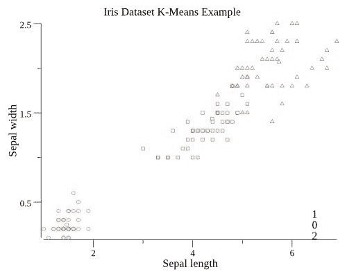
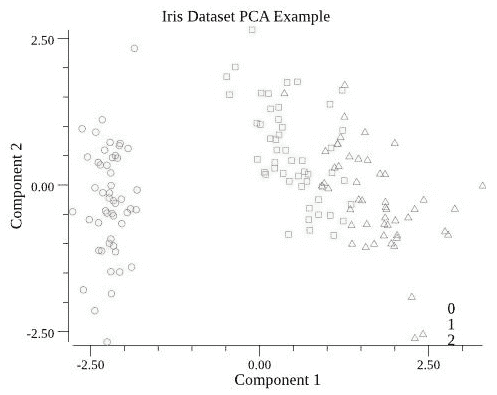

<title>Unsupervised Learning</title>  

# 无监督学习

虽然大多数机器学习问题都涉及标记数据，但正如我们在前一章中看到的，还有另一个重要的分支叫做**无监督学习**。这适用于输入数据可能没有标签的情况，因此算法无法通过尝试预测每个输入的输出标签来工作。相反，无监督算法通过尝试发现输入中的模式或结构来工作。当对具有许多不同输入变量的大型数据集执行探索性分析时，这是一种有用的技术。在这种情况下，绘制所有不同变量的图表来试图找出模式将非常耗时，因此，可以使用无监督学习来自动完成这项工作。

作为人类，我们非常熟悉这个概念:我们做的很多事情从来没有被别人明确地教给我们。相反，我们探索我们周围的世界，寻找和发现模式。出于这个原因，无监督学习对那些试图为**一般智能**开发系统的研究人员来说特别感兴趣:可以独立学习他们需要的东西的计算机^(【1】)。

在本章中，我们将介绍两种流行的无监督算法，并在 Go 中实现它们。首先，我们将使用一个**聚类算法**将一个数据集分成不同的组，而不需要任何关于寻找什么的指导。然后，我们将使用一种称为**主成分分析**的技术，通过首先找到数据集内的隐藏结构来压缩数据集。

这仅仅触及了无监督学习所能达到的表面。一些尖端算法能够让计算机执行通常需要人类创造力的任务。一个值得一看的例子是 NVIDIA 的从草图创建真实图片的系统。你还可以在网上找到一些代码示例，这些代码可以对图像的显示方式做出逼真的改变，例如，将马变成斑马，或者将橙子变成苹果。

本章将涵盖以下主题:

*   使聚集
*   主成分分析

<title>Clustering</title>  

# 使聚集

聚类算法旨在将数据集分成组。一旦经过训练，任何新数据到达时都可以分配给一个组。假设您正在处理一个电子商务商店的客户信息数据集。您可以使用聚类分析来识别客户群，例如商业/私人客户。这些信息可以用来决定如何更好地服务这些客户类型。

在应用监督学习之前，您也可以使用聚类作为准备步骤。例如，图像数据集可能需要手动标注，这通常既费时又费钱。如果您可以使用聚类算法将数据集分成不同的组，那么您可以只标记一小部分图像，然后假设每个聚类都包含具有相同标签的图像，从而节省时间。

聚类还被应用到自动驾驶汽车的计算机视觉应用中，可以用来帮助车辆在未知的道路上导航。通过对来自车辆摄像头的数据进行聚类，可以识别每个传入图像的哪个区域包含车辆必须行驶的道路^(【4】)。

对于我们的例子，我们将使用一个包含不同类型鸢尾花测量值的数据集，您可以使用代码库中的`./download-iris.sh`脚本下载该数据集。这些数据通常用于演示监督学习:你可以使用机器学习根据鸢尾花的种类对数据进行分类。然而，在这种情况下，我们不会向聚类算法提供标签，这意味着它必须纯粹从测量数据中识别聚类:

1.  首先，将数据加载到 Go 中，就像我们在前面的例子中所做的那样:

```
import (
 "fmt"
 "github.com/kniren/gota/dataframe"
 "github.com/kniren/gota/series"
 "io/ioutil"
 "bytes"
 "math/rand"
)

const path = "../datasets/iris/iris.csv"

b, err := ioutil.ReadFile(path)
if err != nil {
    fmt.Println("Error!", err)
}
df := dataframe.ReadCSV(bytes.NewReader(b))
df.SetNames("petal length", "petal width", "sepal length", "sepal width", "species")
```

2.  接下来，我们需要通过将 species 列从其余数据中分离出来来准备数据:这将仅用于聚类后的组的最终评估。为此，使用前面示例中的`DataFrameToXYs`函数:

```
features, classification := DataFrameToXYs(df, "species")
```

3.  现在，我们可以训练一个名为 **k-means** 的算法，尝试将数据集分成三个聚类。k-means 的工作方式是首先随机选择每个聚类的中间(称为**质心**)，然后将训练集中的每个数据点分配到其最近的质心。然后，它迭代地更新每个聚类的位置，在每一步重新分配数据点，直到它达到收敛。

**k-means** is a simple algorithm and is fast to train, so it is a good starting point when clustering data. However, it does require you to specify how many clusters to find, which is not always obvious. Other clustering algorithms, such as DBSCAN, do not have this limitation.

使用 goml 中的 k-means 实现，我们可以尝试在数据中找到三个聚类。通常，您可能需要使用试错法来确定使用多少个聚类-K。如果在运行 k-means 后有许多非常小的聚类，那么您可能需要减少 K:

```
import (
    "gonum.org/v1/plot"
    "gonum.org/v1/plot/plotter"
    "gonum.org/v1/plot/plotutil"
    "gonum.org/v1/plot/vg"
    "github.com/cdipaolo/goml/cluster"
    "github.com/cdipaolo/goml/base"
    "bufio"
    "strconv"
)

model := cluster.NewKMeans(3, 30, features)

if err := model.Learn(); err != nil {
    panic(err)
}
```

一旦我们将模型与数据进行了拟合，我们就可以从中生成预测；也就是说，找出每个数据点属于哪个聚类:

```
func PredictionsToScatterData(features [][]float64, model base.Model, featureForXAxis, featureForYAxis int) (map[int]plotter.XYs) {
    ret := make(map[int]plotter.XYs)
    if features == nil {
        panic("No features to plot")
    }

    for i := range features {
        var pt struct{X, Y float64}
        pt.X = features[i][featureForXAxis]
        pt.Y = features[i][featureForYAxis]
        p, _ := model.Predict(features[i])
        ret[int(p[0])] = append(ret[int(p[0])], pt)
    }
    return ret
}

scatterData := PredictionsToScatterData(features, model, 2, 3)
```

现在，我们可以使用下面的代码绘制聚类图:

```
func PredictionsToScatterData(features [][]float64, model base.Model, featureForXAxis, featureForYAxis int) (map[int]plotter.XYs) {
    ret := make(map[int]plotter.XYs)
    if features == nil {
        panic("No features to plot")
    }

    for i := range features {
        var pt struct{X, Y float64}
        pt.X = features[i][featureForXAxis]
        pt.Y = features[i][featureForYAxis]
        p, _ := model.Predict(features[i])
        ret[int(p[0])] = append(ret[int(p[0])], pt)
    }
    return ret
}

scatterData := PredictionsToScatterData(features, model, 2, 3)
```

这是使用两个输入特征`Sepal width`和`Sepal length`来显示数据，如下图所示:



每个点的形状根据虹膜种类设置，而颜色由 k-means 的输出设置，即算法将每个数据点分配给哪个聚类。我们现在可以看到的是，这些聚类与每个鸢尾的物种几乎完全匹配:k-means 已经能够将数据细分为三个不同的组，对应于不同的物种。

虽然 k-means 在这种情况下工作得很好，但您可能会发现需要在自己的数据集上使用不同的算法。Python 的 scikit-learn 库提供了一个有用的演示，演示了哪些算法在不同类型的数据集上效果最好^(【5】)。您可能还会发现，以某种方式准备数据是有帮助的；例如，将其标准化或对其应用非线性变换。

<title>Principal component analysis</title>  

# 主成分分析

**主成分分析** ( **PCA** )是一种降低数据集中维数的方法。我们可以把它想象成一种压缩数据集的方式。假设你的数据集中有 100 个不同的变量。情况可能是，这些变量中有许多是相互关联的。如果是这种情况，那么就有可能通过组合变量建立一个更小的数据集来解释数据中的大多数变化。PCA 执行这项任务:它试图找到输入变量的线性组合，并报告每个组合解释了多少变化。

主成分分析是一种降低数据集中维数的方法:实际上，是对数据进行总结，以便您可以关注最重要的特征，这些特征解释了数据集中的大多数变化。

PCA 在两个方面对机器学习有用:

*   在应用监督学习方法之前，这可能是一个有用的预处理步骤。在对你的数据进行主成分分析后，你可能会发现，例如，95%的变化只能由少数几个变量来解释。您可以使用这些知识来减少输入数据中的变量数量，这意味着您的后续模型将训练得更快。
*   在构建模型之前可视化数据集时，这也很有帮助。如果您的数据有三个以上的变量，那么很难在图表上可视化它，也很难理解它包含什么样的模式。PCA 让你转换数据，这样你就可以绘制出它最重要的方面。

对于我们的例子，我们将使用主成分分析来可视化虹膜数据集。目前，它有四个输入特征:花瓣宽度、花瓣长度、萼片宽度和萼片长度。使用主成分分析，我们可以将其减少到两个变量，然后我们可以很容易地在散点图上可视化。

1.  首先像以前一样加载 sepal 数据，并将其规范化如下:

```
df = Standardise(df, "petal length")
df = Standardise(df, "petal width")
df = Standardise(df, "sepal length")
df = Standardise(df, "sepal width")
labels := df.Col("species").Float()
df = DropColumn(df, "species")
```

2.  接下来，我们需要将数据转换成矩阵格式。`gonum`库有一个`mat64`类型可以用于这个目的:

```
import (
    "github.com/gonum/matrix/mat64"
)

// DataFrameToMatrix converts the given dataframe to a gonum matrix
func DataFrameToMatrix(df dataframe.DataFrame) mat64.Matrix {
    var x []float64 //slice to hold matrix entries in row-major order

    for i := 0; i < df.Nrow(); i++ {
        for j := 0; j < df.Ncol(); j ++ {
            x = append(x, df.Elem(i,j).Float())
        } 
    }
    return mat64.NewDense(df.Nrow(), df.Ncol(), x)
}

features := DataFrameToMatrix(df)
```

PCA 的工作原理是找到数据集的**特征向量**和**特征值**。出于这个原因，大多数软件库需要数据处于矩阵结构中，以便可以使用标准的线性代数例程如 **blas** 和 **lapack** 来进行计算。

3.  现在，我们可以利用高纳姆的`stat`包来实现 PCA:

```
model := stat.PC{}
if ok := model.PrincipalComponents(features, nil); !ok {
  fmt.Println("Error!")
}
variances := model.Vars(nil)
components := model.Vectors(nil)
```

这就给了我们两个变量:`components`，它是一个矩阵，告诉我们如何将原来的变量映射到新的组件上；还有`variances`，它告诉我们每个分量解释了多少方差。如果我们打印出每个组件的方差，我们可以看到前两个解释了整个数据集的 96%(组件 1 解释了 73%，组件 2 解释了 23%):

```
total_variance := 0.0
for i := range variances {
  total_variance += variances[i]
}

for i := range variances {
  fmt.Printf("Component %d: %5.3f\n", i+1, variances[i]/total_variance)
}
```

4.  最后，我们可以将数据转换成新的组件，并保留前两个组件，以便我们可以使用它们进行可视化:

```
transform := mat64.NewDense(df.Nrow(), 4, nil)
transform.Mul(features, components)

func PCAToScatterData(m mat64.Matrix, labels []float64) map[int]plotter.XYs {
    ret := make(map[int]plotter.XYs)
    nrows, _ := m.Dims()
    for i := 0; i < nrows; i++ {
        var pt struct{X, Y float64}
        pt.X = m.At(i, 0)
        pt.Y = m.At(i, 1)
        ret[int(labels[i])] = append(ret[int(labels[i])], pt)
    }
    return ret
} 

scatterData := PCAToScatterData(transform, labels)
```

下图根据前两个主成分显示了每个数据点，而颜色表示每个数据点属于哪个鸢尾物种。我们现在可以看到，三个组沿着第一个组件形成了不同的条带，这在绘制四个原始输入要素时是不容易看到的:



现在，您可以尝试训练一个监督学习模型，使用前两个 PCA 特征来预测鸢尾物种:将其性能与在所有四个输入特征上训练的模型进行比较。

<title>Summary</title>  

# 摘要

在这一章中，我们讨论了无监督机器学习中的两种常见技术。两者都经常被数据科学家用于探索性分析，但也可以构成生产系统中数据处理管道的一部分。您已经学习了如何训练聚类分析算法将数据自动分组。这种技术可用于对电子商务网站上新注册的客户进行分类，以便为他们提供个性化信息。我们还介绍了主成分分析作为一种压缩数据的手段，换句话说，减少其维数。这可以用作在运行监督学习技术之前的预处理步骤，以便减小数据集的大小。

在这两种情况下，都可以利用`gonum`和`goml`库用最少的代码在 Go 中构建高效的实现。

<title>Further readings</title>  

# 进一步阅读

1.  https://deepmind.com/blog/unsupervised-learning/[。检索时间 2019 年 4 月 12 日。](https://deepmind.com/blog/unsupervised-learning/)
2.  [https://blogs . NVIDIA . com/blog/2019/03/18/gaugan-照片级真实感-风景-nvidia-research/](https://blogs.nvidia.com/blog/2019/03/18/gaugan-photorealistic-landscapes-nvidia-research/) 。检索时间 2019 年 4 月 12 日。
3.  [https://github.com/junyanz/CycleGAN](https://github.com/junyanz/CycleGAN)。检索时间 2019 年 4 月 12 日。
4.  [http://robots . Stanford . edu/papers/Dahl kamp . adapt vision 06 . pdf](http://robots.stanford.edu/papers/dahlkamp.adaptvision06.pdf)。检索时间 2019 年 4 月 13 日。
5.  [https://scikit-learn . org/stable/modules/clustering . html # overview-of-clustering-methods](https://scikit-learn.org/stable/modules/clustering.html#overview-of-clustering-methods)。检索时间 2019 年 4 月 12 日。