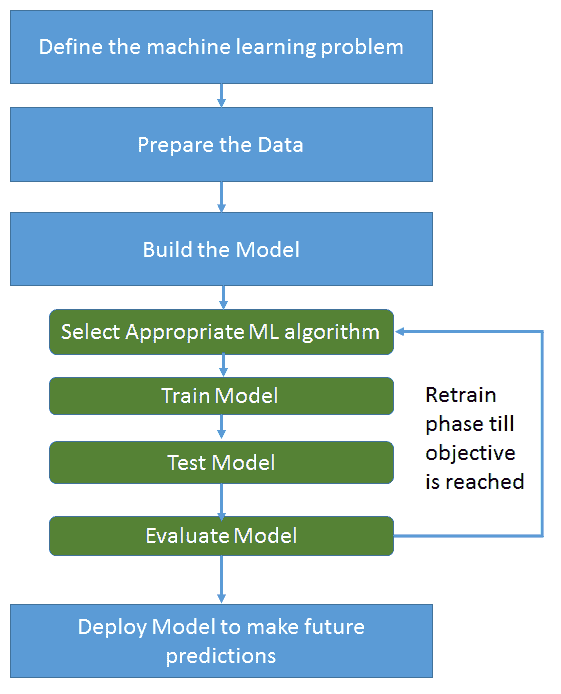
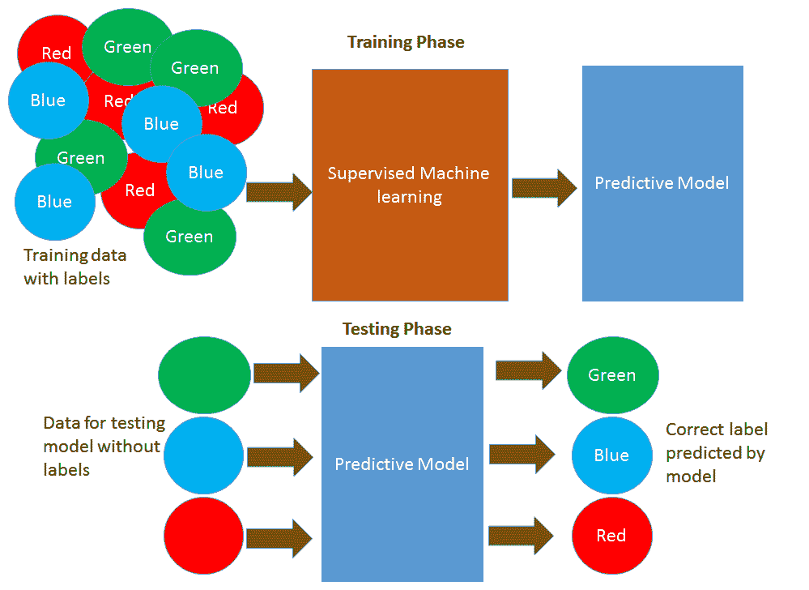
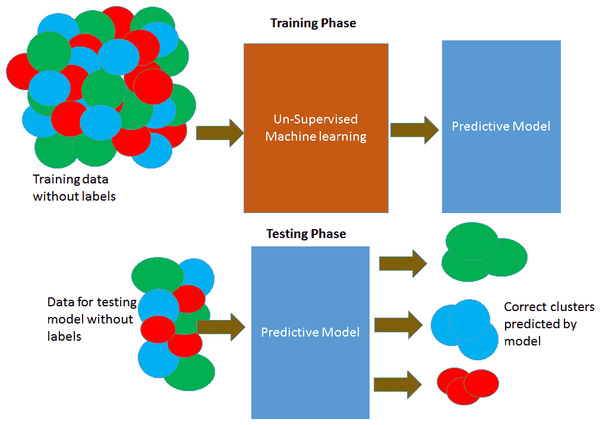
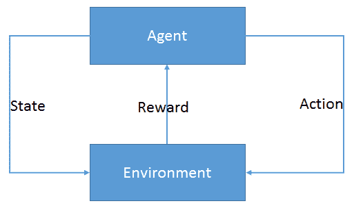
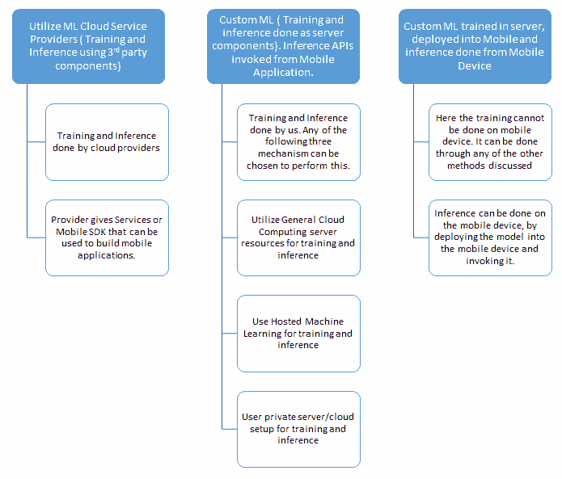
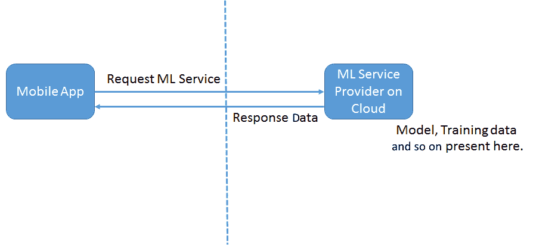
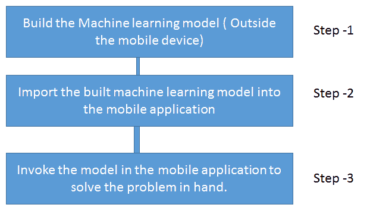

# 手机上的机器学习简介

我们生活在一个移动应用的世界里。它们已经成为我们日常生活中不可或缺的一部分，以至于我们很少关注它们背后的数字。(这些包括他们的收入，业务的实际市场规模，以及推动移动应用增长的量化数据。)我们来看一下数字:

*   《福布斯》预测，到 2020 年，移动应用收入将达到 1890 亿美元
*   我们还看到，全球智能手机安装基数正呈指数级增长。因此，来自安装在其上的应用的收入也在以难以想象的速度增长

移动设备和服务现在是人们娱乐和商业生活以及通信的中心。智能手机已经取代个人电脑成为最重要的智能互联设备。移动创新、新的商业模式和移动技术正在改变人类生活的方方面面。

现在，我们来看机器学习。为什么机器学习最近很火？机器学习并不是一门新学科。它在 10-20 年前就存在了，那么为什么它现在成为焦点，为什么每个人都在谈论它？原因很简单:数据爆炸。社交网络和移动设备使得用户数据的生成前所未有。十年前，你没有像今天这样上传图片到云端，因为那时的手机普及率无法与今天相比。4G 连接使得现在甚至可以在 T2(**VDO**)点播直播**视频数据，因此这意味着更多的数据以前所未有的方式在世界各地运行。据预测，下一个时代将是**物联网** ( **IOT** )时代，届时将会出现更多基于数据传感器的数据。**

只有当我们能够恰当地使用这些数据，从中获得能够为我们带来价值的见解，并产生能够提供新业务机会的未知数据模式时，所有这些数据才是有价值的。因此，要实现这一点，机器学习是解锁这些每天积累的成堆数据中的存储价值的正确工具。

因此，很明显，这是成为移动应用开发人员的好时机，也是成为机器学习数据科学家的好时机。但是，如果我们能够将机器学习的力量带到移动设备上，并开发出利用机器学习力量的非常酷的移动应用，那该有多酷呢？这就是我们试图通过这本书做的事情:向移动应用开发人员提供关于机器学习基础知识的见解，让他们接触各种机器学习算法和移动机器学习 SDK/工具，并使用这些 SDK/工具开发移动机器学习应用。

移动领域的机器学习是一个关键的创新领域，移动开发者必须正确理解，因为它正在改变用户可视化和利用移动应用的方式。那么，机器学习如何改造移动应用，将其转化为任何用户梦寐以求的应用呢？让我举几个例子来鸟瞰机器学习可以为移动应用做些什么:

*   脸书和 YouTube 移动应用使用机器学习— *推荐*或*你可能认识的人*只不过是机器学习在起作用。
*   苹果和谷歌读取每个用户行为的行为或措辞，并推荐适合你打字风格的下一个单词。他们已经在 iOS 和 Android 设备中实现了这一点。
*   Oval Money 分析用户以前的交易，并为他们提供不同的方法来避免额外支出。
*   谷歌地图正在利用机器学习让你的生活变得更简单。
*   Django 使用机器学习来解决问题，以找到一个完美的表情符号。它是一个浮动助手，可以集成到不同的信使中。

机器学习可以应用于属于任何领域的移动应用——医疗保健、金融、游戏、通信或世界上的任何东西。那么，我们来了解一下机器学习到底是怎么回事。

在本章中，我们将讨论以下主题:

*   什么是机器学习？
*   什么时候适合使用机器学习来实现解决方案？

*   机器学习的类别
*   机器学习中的关键算法
*   实施机器学习需要遵循的流程
*   了解机器学习的一些关键概念是有好处的
*   实现机器学习的挑战
*   为什么要在移动应用中使用机器学习？
*   在移动应用中实现机器学习的方法

# 机器学习的定义

机器学习专注于编写可以从过去的经验中学习的软件。由**卡耐基梅隆大学** ( **CMU** )教授 Tom Mitchell 给出的机器学习的一个标准定义如下:

如果由 P 测量的计算机程序在任务 T 中的性能随着经验 E 而提高，则称该计算机程序相对于某类任务 T 和性能测量 P 从经验 E 中学习。

例如，一个学习下棋的计算机程序可以通过与自己对弈获得的经验来提高它的性能，这可以通过它在涉及下棋的任务类别中获胜的能力来衡量。一般来说，要有一个定义明确的学习问题，我们必须确定任务的类别、要提高的成绩的衡量标准以及经验的来源。考虑一个国际象棋学习问题包括以下内容:任务、表现测量和训练经验，其中:

*   任务 T 正在下棋
*   **绩效指标 P** 是战胜对手赢得比赛的百分比
*   **训练体验 E** 是程序玩的对弈对弈游戏

简单来说，如果一个计算机程序能够在以前经验的帮助下改进它执行任务的方式，这样你就知道计算机已经学习了。这种情况与程序可以执行特定任务的情况非常不同，因为它的程序员已经定义了所有的参数并提供了这样做所需的数据。一个正常的程序可以执行下棋的任务，因为程序员已经编写了带有内置获胜策略的下棋代码。然而，机器学习程序并不拥有内置的策略；事实上，它只有一套游戏中的合法移动规则，以及什么是获胜的场景。在这种情况下，程序需要通过反复玩游戏来学习，直到它能够获胜。

# 什么时候适合使用机器学习系统？

机器学习是否适用于所有场景？我们到底应该在什么时候让机器学习，而不是直接用指令给机器编程来执行任务？

机器学习系统不是基于知识的系统。在基于知识的系统中，我们可以直接使用知识来编纂所有可能的规则，以推断解决方案。当指令的这种编码不是直截了当的时候，我们就去进行机器学习。机器学习程序将更适用于以下场景:

*   **很难编程的非常复杂的任务**:有一些人类执行的常规任务，比如说话、开车、看东西、识别东西、品尝、通过看东西来分类东西，这些任务在我们看来都很简单。但是，我们不知道我们的大脑是如何连接或编程的，也不知道需要定义什么规则来无缝地执行这一切，为此我们可以创建一个程序来复制这些行为。通过机器学习来执行其中一些是可能的，虽然没有达到人类的程度，但机器学习在这里有很大的潜力。
*   处理大量数据的非常复杂的任务:有些任务包括分析大量数据，发现隐藏的模式，或者在数据中找出新的相关性，这些都是人类无法完成的。机器学习有助于我们不知道解决方案的步骤的任务，以及由于各种解决方案的可能性，人类不可能确定解决方案而在本质上如此复杂的任务。
*   **适应环境和数据的变化**:用一组指令硬编码的程序不能适应变化的环境，也不能扩展到新的环境。这两者都可以通过使用机器学习程序来实现。

机器学习是一门艺术，专门从事机器学习的数据科学家需要掌握多种技能——数学、统计学、数据分析、工程学、创意艺术、簿记、神经科学、认知科学、经济学等等。他需要成为万事通和机器学习大师。

# 机器学习过程

机器学习过程是一个迭代的过程。不可能一蹴而就。对于机器学习解决方案，要执行的最重要的活动如下:

1.  定义机器学习问题(必须定义明确)。
2.  收集、准备和增强所需的数据。
3.  使用这些数据建立一个模型。该步骤循环进行，包括以下子步骤。有时，这还可能导致对数据重新进行*步骤 2* ，甚至需要重新定义问题陈述:
    *   选择合适的模型/机器学习算法
    *   在训练数据上训练机器学习算法并建立模型
    *   测试模型
    *   评估结果
    *   继续此阶段，直到评估结果令人满意，并最终确定模型
4.  使用最终确定的模型对问题陈述进行未来预测。

整个过程包括四个主要步骤，这是一个反复的过程，直到实现目标。让我们在接下来的章节中深入了解每一步的细节。下图将快速概述整个过程，因此很容易进入细节:

# 定义机器学习问题

按照 Tom Mitchell 的定义，问题一定是定义良好的机器学习问题。这一阶段需要解决的三个重要问题包括:

*   我们有正确的问题吗？
*   我们有正确的数据吗？
*   我们有正确的成功标准吗？

问题应该是这样的，即作为问题的解决方案所获得的结果对业务是有价值的。应该有足够的历史数据可用于学习/培训目的。目标应该是可衡量的，我们应该知道在任何时间点目标实现了多少。

例如，如果我们要从一组在线交易中识别欺诈性交易，那么确定此类欺诈性交易对企业来说肯定是有价值的。我们需要有足够多的在线交易。我们应该有足够多的属于各种欺诈类别的交易。我们还应该有一个机制来确定预测为欺诈或非欺诈交易的结果是否可以验证和确认预测的准确性。

为了让用户了解什么样的数据足以实现机器学习，我们可以说，对于初学者来说，至少 100 个项目的数据集应该是合适的，1000 个就更好了。我们拥有的覆盖问题领域所有现实场景的数据越多，对学习算法就越有利。

# 准备数据

数据准备活动是学习解决方案成功的关键。数据是机器学习所需的关键实体，必须正确准备以确保获得正确的最终结果和目标。

数据工程师通常在数据准备阶段花费大约 80-90%的总时间来获得正确的数据，因为这是机器学习程序成功实施的基础和最关键的任务。

为了准备数据，需要执行以下操作:

1.  **确定所有数据源**:我们需要确定所有能够解决手头问题的数据源，并从多个来源收集数据——文件、数据库、电子邮件、移动设备、互联网等等。
2.  **探索数据**:这一步包括理解数据的本质，如下所示:
    *   整合来自不同系统的数据，并对其进行探索。
    *   理解数据的特征和性质。
    *   浏览数据实体之间的相关性。
    *   识别异常值。离群值将有助于识别数据中的任何问题。
    *   应用各种统计原理，例如计算中位数、平均值、众数、范围和标准差，以得出数据偏斜度。这将有助于理解数据的性质和传播。
    *   如果数据是倾斜的，或者我们看到范围的值超出了预期的边界，我们知道数据有问题，我们需要重新访问数据源。
    *   通过图表显示数据也有助于理解数据的分布和质量。
3.  **数据预处理**:这一步的目的是以一种可用于下一步的格式创建数据；
    *   **数据清理**:
        *   解决缺失值的问题。用于估算缺失值的常用策略是用平均值或中值替换缺失值。定义替换缺失值的策略非常重要。
        *   解决重复值、无效数据、不一致数据、异常值等问题。
    *   **特征选择**:选择最适合手头问题的数据特征。删除冗余或不相关的功能，以简化流程。
    *   **特征转换**:这个阶段将数据从一种格式映射到另一种格式，这将有助于进行机器学习的下一步。这涉及到数据的规范化和维度的减少。这包括将各种功能组合成一个功能或创建新功能。例如，假设我们将日期和时间作为属性。将它们转换为一周中的某一天、一个月中的某一天以及一年中的某一天会更有意义，这将提供更有意义的洞察力:
        *   创建一个变量与另一个变量的笛卡尔乘积。例如，如果我们有两个变量，如人口密度(数学、物理和商业)和性别(女孩和男孩)，由这两个变量的笛卡尔乘积形成的特征可能包含有用的信息，从而产生诸如(`maths_girls`、`physics_girls`、`commerce_girls`、`maths_boys`、`physics_boys`和`commerce_boys`)的特征。
        *   宁滨数字变量分类。例如，臀部/肩部的尺寸值可以分成小、中、大和特大等类别。
        *   特定领域的特性，例如，将数学、物理和化学科目合并到一个数学组，将物理、化学和生物合并到一个生物组。
4.  **将数据分为训练集和测试集**:一旦数据被转换，我们就需要选择所需的测试集和一个训练集。在训练数据集上训练算法之后，针对测试数据集对算法进行评估。将数据拆分为训练数据集和测试数据集可能与执行随机数据拆分一样直接(66%用于训练，34%用于测试)，也可能涉及更复杂的采样方法。

66%和 34%的比例只是一个参考。如果您有 100 万条数据，90%和 10%的分割应该足够了。对于 1 亿条数据，你甚至可以减少到 99%或 1%。

在训练期间，已训练的模型不会暴露给测试数据集，并且对该数据集所做的任何预测都旨在指示模型的总体性能。因此，我们需要确保数据集的选择能够代表我们正在解决的问题。

# 构建模型

如前所述，模型建立阶段由许多子步骤组成，例如选择合适的机器学习算法、训练模型、测试模型、评估模型以确定是否已经达到目标，如果没有达到目标，则通过选择具有不同数据集的相同算法或选择全新算法进入再训练阶段，直到达到目标。

# 选择正确的机器学习算法

建立模型的第一步是选择可能解决问题的正确的机器学习算法。

这一步包括选择正确的机器学习算法并建立模型，然后使用训练集对其进行训练。该算法将从将变量映射到目标的训练数据模式中学习，并将输出捕捉这些关系的模型。然后，可以使用机器学习模型对您不知道目标答案的新数据进行预测。

# 训练机器学习模型

目标是选择最合适的算法来建立机器学习模型，训练它，然后分析收到的结果。我们首先选择合适的机器学习技术来分析数据。下一章，也就是[第二章](10656284-f170-420b-a35c-e11cf1f3d988.xhtml)，*iOS 上的随机森林*，将会谈到不同的机器学习算法，并详细介绍它们可能适用的问题类型。

训练过程和对结果的分析也根据为训练选择的算法而变化。

训练阶段通常使用变换数据中存在的所有数据属性，这将包括预测属性以及客观属性。所有数据特征都用于训练阶段。

# 测试模型

一旦在训练数据中训练了机器学习算法，下一步就是在测试数据中运行模型。

数据的整个属性或特征集被分为预测属性和客观属性。数据集的预测器属性/特征被作为输入馈送到机器学习模型，并且该模型使用这些属性来预测客观属性。测试集仅使用预测值属性。现在，该算法使用预测属性并输出对客观属性的预测。一旦提供了输出，就将其与实际数据进行比较，以了解算法输出的质量。

结果应该被恰当地呈现以供进一步分析。在结果中呈现什么以及如何呈现至关重要。它们也可能带来新的商业问题。

# 模型评估

应该有一个过程来测试机器学习算法，发现我们是否选择了正确的算法，并根据问题陈述验证算法提供的输出。

这是机器学习过程中的最后一步，我们用定义的成功标准阈值检查准确度，如果准确度大于或等于阈值，那么我们就完成了。如果没有，我们需要用不同的机器学习算法，不同的参数设置，更多的数据，改变的数据转换重新开始。整个机器学习过程中的所有步骤都可以重复，或者可以重复它的子集。这些重复进行，直到我们得出“完成”的定义，并对结果感到满意。

机器学习过程是一个非常迭代的过程。一个步骤的发现可能需要用新信息重复前一个步骤。例如，在数据转换步骤中，我们可能会发现一些数据质量问题，这可能需要我们从不同的来源获取更多的数据。

每个步骤也可能需要多次迭代。这是特别令人感兴趣的，因为数据准备步骤可能经历多次迭代，并且模型选择可能经历多次迭代。在执行机器学习的整个活动序列中，任何活动都可以重复任意次。例如，在继续测试模型之前，通常会尝试不同的机器学习算法来训练模型。因此，重要的是要认识到这是一个高度迭代的过程，而不是线性的。

**测试集创建**:我们必须明确定义测试数据集。测试数据集的目标如下:

*   快速、一致地测试用来解决问题的算法
*   测试各种算法，以确定它们是否能够解决问题
*   确定哪种算法值得用来解决问题
*   确定用于评估目的的数据是否有问题，因为如果所有算法始终无法产生正确的结果，则数据本身可能需要重新访问

**性能度量**:性能度量是评估所创建模型的一种方式。需要使用不同的性能指标来评估不同的机器学习模型。这些是标准的性能度量，我们可以从中选择来测试我们的模型。可能不需要为我们的模型定制性能度量。

以下是理解算法性能测量需要了解的一些重要术语:

*   **过拟合**:当我们看到机器学习模型在训练数据上表现良好，但在评测数据上表现不佳时，机器学习模型在对训练数据进行过拟合。这是因为模型正在记忆它已经看到的数据，并且不能归纳到看不见的例子。
*   **欠拟合**:当模型对训练数据表现不佳时，机器学习模型欠拟合训练数据。这是因为模型无法捕捉输入示例(通常称为 **X** )和目标值(通常称为 **Y** )之间的关系。
*   **交叉验证**:交叉验证是一种评估预测模型的技术，它将原始样本划分为训练模型的训练集和评估模型的测试集。在 k 重交叉验证中，原始样本被随机分成 *k 个*大小相等的子样本。
*   **混淆矩阵**:在机器学习领域，特别是统计分类问题中，混淆矩阵，也称为**误差矩阵**，是一种特定的表格布局，允许算法性能的可视化。
*   **偏差**:偏差是模型以一致的方式做出预测的趋势。
*   **方差**:方差是模型做出的预测偏离参数和标签之间真实关系的趋势。
*   **准确度**:正确结果除以总结果。
*   **错误**:错误结果除以总结果。

*   **精度**:机器学习算法返回的正确结果数除以所有返回结果数。
*   **回忆**:机器学习算法返回的正确结果数除以本应返回的结果数。

# 进行预测/实地部署

一旦模型准备就绪，就可以部署到现场使用。可以使用已在现场构建和部署的模型对即将到来的数据集进行预测。

# 学习的类型

在如何定义机器学习算法的类型方面有一些变化。最常见的算法分类是基于算法的学习者类型，分类如下:

*   监督学习
*   无监督学习
*   半监督学习
*   强化学习

# 监督学习

监督学习是一种学习类型，在这种学习中，模型被提供了足够的信息和知识，并被密切监督以进行学习，因此，基于它已经完成的学习，它可以预测新数据集的结果。

这里，模型在监督模式下训练，类似于教师的监督，其中我们向模型提供足够的包含输入/预测的训练数据，并训练它，显示正确的答案或输出。因此，基于这一点，它学习并能够预测未来可能出现的未知数据的输出。

这方面的一个经典例子是标准虹膜数据集。鸢尾数据集由三种鸢尾组成，给出了每种鸢尾的萼片长度、萼片宽度、花瓣长度和花瓣宽度。并且对于四个参数的特定模式，提供关于这样的集合应该属于什么物种的标签。有了这种学习，模型将能够预测标签——在这种情况下，是基于特征集的鸢尾物种——在这种情况下，是四个参数。

监督学习算法尝试对目标预测输出和输入要素之间的关系和依赖关系进行建模，以便我们可以根据从以前的数据集中学习到的关系来预测新数据的输出值。

下图将让你了解什么是监督学习。带有标签的数据作为输入，通过监督学习算法建立模型。这是训练阶段。然后，该模型用于预测任何没有标签的输入数据的类别标签。这是测试阶段:

同样，在监督学习算法中，基于所考虑的场景类型和所考虑的数据集，预测输出可以是离散/分类值，也可以是连续值。如果预测的输出是离散/分类值，则此类算法属于分类算法，如果预测的输出是连续值，则此类算法属于回归算法。

如果有一组电子邮件，并且您想要从中学习，并且能够辨别哪些电子邮件属于垃圾邮件类别，哪些电子邮件属于非垃圾邮件类别，则用于此目的的算法将是属于分类类型的监督学习算法。这里，您需要向模型提供一组电子邮件，并向模型提供足够的属性知识，基于这些知识，它会将电子邮件分为垃圾邮件类别或非垃圾邮件类别。因此，预测的输出将是一个分类值，即垃圾邮件或非垃圾邮件。

让我们以这样一个用例为例，基于一组给定的参数，我们需要预测给定地区的房价。这不能是分类值。它将是一个范围或一个连续的值，并且会定期发生变化。在这个问题中，模型也需要被提供足够的知识，基于这些知识它将预测定价值。这类算法属于监督学习回归类算法。

有各种算法属于机器学习家族的监督类别:

*   k-最近邻
*   朴素贝叶斯
*   决策树
*   线性回归
*   逻辑回归
*   支持向量机
*   随机森林

# 无监督学习

在这种学习模式中，没有对模型进行监督以使其学习。该模型根据提供给它的数据进行自我学习，并向我们提供它所学习的模式。它不预测任何离散的分类值或连续值，而是通过查看输入其中的数据来提供它所理解的模式。输入的训练数据是未标记的，没有为模型学习提供足够的知识信息。

在这里，根本没有监督。实际上，模型在学习了数据之后，也许能够教给我们新的东西。这些算法在特征集太大并且用户不知道在数据中寻找什么的情况下非常有用。

这类算法主要用于**模式检测**和**描述建模**。描述性建模总结了数据中的相关信息，并提供了已经发生的事情的摘要，而预测性建模总结了数据，并提供了可能发生的事情的摘要。

无监督学习算法可用于这两类预测。他们使用输入数据来得出不同的模式、数据点的总结以及人眼不可见的见解。他们提出对最终用户有帮助的有意义的派生数据或数据模式。

下图将让你了解什么是无监督学习。无标签数据作为输入，通过无监督学习算法建立模型。这是**训练阶段**。然后，该模型用于预测任何没有标签的输入数据的正确模式。这是**测试阶段**:

在这一系列算法中，也是基于提供给模型的输入数据和模型用来推断数据集中模式的方法，出现了两种常见的算法类别。这些是聚类和关联规则映射算法。

聚类是分析输入数据集并将具有相似性的数据项分组到同一个聚类中的模型。它产生不同的聚类，并且每个聚类将保存彼此比属于其他聚类的项目更相似的数据项。有各种机制可以用来创建这些集群。

客户细分是聚类的一个例子。我们有一个庞大的客户数据集，并捕捉客户的所有特征。该模型可以得出有趣的客户聚类模式，这些模式对人眼来说可能非常明显。这种集群对于有针对性的活动和营销非常有帮助。

另一方面，关联规则学习是一种发现大型数据集中变量之间关系的模型。一个经典的例子是市场篮子分析。在这里，模型试图找到购物篮中不同项目之间的强关系。它预测商品之间的关系，并确定用户在购买某一商品的同时购买另一商品的可能性。例如，它可能预测购买面包的用户也将购买牛奶，或者购买葡萄酒的用户也将购买尿布，等等。

属于此类别的算法包括以下几种:

*   聚类算法:
    *   基于质心的算法
    *   基于连通性的算法
    *   基于密度的算法
    *   盖然论的
    *   降维
    *   神经网络/深度学习
*   关联规则学习算法

# 半监督学习

在前两种类型中，要么数据集中的所有观测值都没有标注，要么所有观测值都有标注。半监督学习介于这两者之间。在许多实际情况下，贴标签的成本相当高，因为这需要熟练的人类专家来做。因此，如果标签在大多数观察中不存在，但在少数观察中存在，那么半监督算法是模型构建的最佳候选。

语音分析是半监督学习模型的一个例子。标记音频文件是非常昂贵的，并且需要非常高水平的人力。应用半监督学习模型确实有助于改进传统的语音分析模型。

在这类算法中，也基于预测的输出，其可以是分类的或连续的，算法族可以是回归或分类。

# 强化学习

强化学习是基于与环境互动的目标导向学习。强化学习算法(称为**代理**)以迭代的方式不断地从环境中学习。在这个过程中，代理从它的环境经验中学习，直到它探索所有可能的状态，并能够达到目标状态。

让我们举一个小孩学骑自行车的例子。孩子试图通过骑它来学习，它可能会摔倒，它会明白如何平衡，如何继续流动而不摔倒，如何坐在合适的位置以使重量不移动到一边，研究表面，并根据表面、斜坡、山坡等来计划行动。因此，它将学习学习骑自行车所需的所有可能的场景和状态。跌倒可能被认为是负面反馈，而能够大步骑行可能是对孩子的正面奖励。这是经典的强化学习。这与模型为了最大化其性能而确定特定上下文中的理想行为是一样的。需要简单的奖励反馈让代理学习它的行为；这就是所谓的**强化信号**:

现在，我们将通过图表来总结我们所看到的学习算法的类型，以便您在为给定的问题陈述选择算法时能够方便地使用它并作为一个参考点:

# 机器学习的挑战

我们在机器学习中面临的一些挑战如下:

*   缺少一个定义良好的机器学习问题。如果问题没有按照具有所需标准的定义被清楚地定义，机器学习问题很可能失败。
*   特征工程。这涉及到与数据及其特征相关的每一项活动，这些活动对于机器学习问题的成功至关重要。
*   训练集和测试集之间不清晰。通常，该模型在训练阶段表现良好，但在现场却因为缺少训练集中所有可能的数据而惨败。为了使模型在现场获得成功，应该注意这一点。
*   算法的正确选择。有很多种算法可供选择，但是哪一种最适合我们的问题呢？这应该在迭代中用所需的适当参数正确选择。

# 为什么要在移动设备上使用机器学习？

需要机器学习从海量数据中提取有意义、可操作的信息。分析大量数据并得出结论需要大量的计算。这种处理非常适合云环境。然而，如果我们能够在手机上进行机器学习，将会有以下优势:

*   机器学习可以离线执行，因为不需要将移动设备拥有的所有数据发送到网络并等待服务器返回结果。
*   避免了由于向服务器传输移动数据而导致的网络带宽成本(如果有的话)。
*   通过在本地处理数据可以避免延迟。移动机器学习具有很强的响应能力，因为我们不必等待连接和从服务器返回的响应。服务器响应可能需要 1-2 秒，但移动机器学习可以立即完成。
*   隐私——这是移动机器学习的另一个优势。无需将用户数据发送到移动设备之外，从而实现更好的隐私保护。

机器学习始于计算机，但新兴趋势表明，在移动设备上实现机器学习的移动应用开发是下一件大事。现代移动设备显示出高生产能力水平，足以像传统计算机一样执行适当的任务。此外，来自全球企业的一些信号也证实了这一假设:

*   谷歌推出了面向移动的 TensorFlow。开发者社区也对此非常感兴趣。
*   苹果已经推出了 Siri SDK 和 Core ML，现在所有开发者都可以将这一功能融入他们的应用中。
*   联想正在开发他们的新智能手机，它也可以在没有互联网连接的情况下运行，并执行室内地理定位和增强现实。
*   大多数移动芯片制造商都在进行重要的研究，无论是苹果、高通、三星，甚至是谷歌本身，都在致力于加速移动设备上的机器学习的硬件。
*   硬件层正在进行许多创新，以实现硬件加速，这将使移动设备上的机器学习变得容易。
*   许多移动优化模型，如 MobileNets、Squeeze Net 等都是开源的。
*   物联网设备和智能硬件设备的可用性正在增加，这将有助于创新。
*   人们对离线场景感兴趣的用例更多。
*   越来越多的人开始关注用户数据隐私以及用户希望他们的个人数据不要离开他们的移动设备。

移动设备上机器学习的一些经典例子如下:

*   语音识别
*   计算机视觉和图像分类
*   手势识别
*   从一种语言翻译成另一种语言
*   交互式设备上文本检测
*   自动驾驶汽车、无人机导航和机器人
*   与医疗设备交互的患者监护系统和移动应用

# 在移动应用中实现机器学习的方法

现在，我们清楚地了解了什么是机器学习，以及在一个学习问题中要执行的关键任务是什么。对于任何机器学习问题，要执行的四个主要活动如下:

1.  定义机器学习问题
2.  收集所需的数据
3.  使用该数据建立/训练模型
4.  使用模型进行预测

训练模型是整个过程中最困难的部分。一旦我们训练了模型，并准备好模型，使用它来推断或预测新的数据集是非常容易的。

对于前面提到的所有四个步骤，我们显然需要决定我们打算在哪里使用它们——在设备上还是在云中。

我们需要决定的主要事情如下:

*   首先，我们是要训练和创建一个定制模型，还是使用一个预先构建的模型？
*   如果我们想要训练我们自己的模型，我们是在我们的桌面机器上还是在云中进行这种训练？有可能在移动设备上训练模型吗？
*   一旦模型可用，我们是将它放在本地设备上并在设备上进行推理，还是将模型部署在云中并从那里进行推理？

以下是在移动应用中实现机器学习的广泛可能性。我们将在接下来的章节中详细介绍它:

# 为机器学习模型利用机器学习服务提供商

有许多服务提供商提供机器学习服务。我们可以利用它们。

以下几点列出了将机器学习作为服务提供的此类提供商的示例。这个列表每天都在增加:

*   克拉里菲
*   谷歌云愿景

*   微软 Azure 认知服务
*   IBM 沃森
*   亚马逊网络服务

如果我们采用这种模型，那么培训已经完成，模型已经建立，模型特性作为 web 服务公开。因此，我们只需从移动应用中调用带有所需数据集的模型服务，从云提供商处获取结果，然后根据我们的要求在移动应用中显示结果:

一些提供商提供了 SDK，使得集成工作变得非常简单。

我们可能需要向云服务提供商收取费用，以使用他们的机器学习 web 服务。可能有各种模型，根据这些模型来收取费用，例如，调用的次数、模型的类型等等。

所以，这是一个非常简单的使用机器学习服务的方法，实际上不需要对模型做任何事情。最重要的是，机器学习服务提供商通过不断的再训练来保持模型更新，包括在需要时加入新的数据集，等等。因此，模型的维护和改进是自动进行的。

所以，这种类型的模型对于移动领域的专家，但对 ML 一无所知，但想构建一个支持 ML 的应用的人来说很容易。

因此，这种基于云的机器学习服务的明显优势如下:

*   它很容易使用。
*   不需要机器学习的知识，训练的艰难部分由服务提供商完成。

*   再培训、模型更新、支持和模型维护由提供者完成。
*   费用只按使用量支付。没有维护模型、训练数据等的开销。

这种方法的一些不利方面如下:

*   预测将在云中完成。因此，要进行预测或推断的数据集必须被发送到云中。数据集必须保持在最佳大小。
*   由于数据在网络上移动，应用可能会遇到一些性能问题，因为整个事情现在变得依赖于网络。
*   移动应用无法在离线模式下工作，只能作为完全在线的应用工作。
*   大多数情况下，费用是按要求支付的。因此，如果应用的用户数量呈指数增长，机器学习服务的成本也会增加。
*   培训和再培训由云服务提供商控制。因此，他们可能已经对公共数据集进行了训练。如果我们的移动应用要使用真正独特的东西，那么预测可能不会奏效。

要开始使用支持 ML 的移动应用，该模型在成本和技术可行性方面都是合适的。对于一个机器学习新手来说绝对没问题。

# 训练机器学习模型的方法

有各种各样的方法来训练我们自己的机器学习模型。在开始训练我们的模型之前，我们为什么要训练我们自己的模型呢？

大多数情况下，如果我们的数据在某些方面是特殊的或唯一的，并且非常符合我们的要求，并且当现有的解决方案不能用于解决我们的问题时，我们可能会决定训练我们自己的模型。

为了训练我们自己的模型，需要一个好的数据集。一个好的数据集是一个在质量和数量上都很好的大型数据集。

根据我们的要求和数据量，可以通过多种方式/地点训练我们的模型:

*   **在桌面上(在云端训练)**:
    *   通用云计算
    *   托管机器学习
    *   私有云/简单服务器
*   **在一个设备上**:这个不太可行。我们只能在移动设备上部署训练好的模型，并从移动设备调用它。到目前为止，从移动设备上训练过程本身是不可行的。

# 在桌面上(在云中培训)

如果我们决定在桌面上执行培训过程，我们必须根据我们的需要，在云中或在我们简陋的本地服务器上进行。

如果我们决定使用云，我们还有以下两个选择:

*   通用云计算
*   托管机器学习

通用云计算类似于利用云服务提供商来执行我们的工作。我们要进行机器学习训练。因此，为了实现这一点，无论需要什么，比如硬件、存储等等，都必须从他们那里获得。我们可以利用这些资源做任何我们需要的事情。我们需要将我们的训练数据集放在这里，运行训练逻辑/算法，构建模型，等等。

一旦训练完成，模型创建完成，模型可以被带到任何地方使用。对于云提供商，我们只支付使用硬件和存储的费用。

**亚马逊网络服务** ( **AWS** )和 Azure 都是云计算供应商。

使用这种方法的好处如下:

*   硬件/存储可以随时购买和使用。当训练数据量增加时，不需要担心增加存储等问题。它可以在需要时通过付费增加。
*   一旦训练完成，模型创建完成，我们就可以释放计算资源了。计算资源产生的成本仅用于培训期间，因此，如果我们能够快速完成培训，我们将节省大量成本。
*   我们可以免费下载训练好的模型，并在任何地方使用。

当我们采用这种方法时，我们需要注意以下几点:

*   我们需要负责整个培训工作和模型创建。我们将只使用执行这项工作所需的计算资源。
*   所以，我们需要知道如何训练和建立模型。

亚马逊、微软和谷歌等几家公司现在在其现有云服务的基础上提供机器学习服务。在托管机器学习模型中，我们既不需要担心计算资源，也不需要担心机器学习模型。我们需要上传我们的问题集的数据，从可用的模型列表中选择我们想要为我们的数据训练的模型，就这样。机器学习服务负责训练模型，并将训练好的模型提供给我们使用。

当我们不太擅长编写自己的定制模型并训练它，但也不想完全去机器学习提供商那里使用他们的服务，而是想在两者之间做一些事情时，这种方法真的很好。我们可以在模型之间进行选择，上传我们独特的数据集，然后根据我们的要求对其进行训练。

在这种方法中，提供商通常让我们依赖于他们的平台。我们可能无法下载该模型并将其部署到其他地方使用。我们可能需要绑定到他们，并利用他们的平台从我们的应用使用训练有素的模型。

还有一点需要注意的是，如果在以后的某个时间点，我们决定转移到另一个提供者，那么训练好的模型不能被导出和导入到另一个提供者。我们可能需要在新的提供商平台上再次执行培训流程。

在这种方法中，我们可能需要为计算资源(硬件/存储)付费，此外，在培训之后，为了使用经过培训的模型，我们可能需要按使用量付费，即按需付费；无论何时我们使用它，我们都需要为我们使用的东西付费。

使用这种方法的好处如下:

*   无需担心训练数据所需的计算资源/存储。
*   无需担心理解机器学习模型的细节来构建和训练定制模型。
*   只需上传数据，选择用于训练的模型，就可以了。获取用于使用的训练模型
*   不需要担心将模型部署到任何地方，以便从移动应用中使用。

当我们采用这种方法时，我们需要注意以下几点:

*   大多数情况下，我们可能会在培训过程后绑定到他们的平台，以便使用培训后获得的模型。不过也有少数例外，比如谷歌的云平台。
*   我们可能只能从供应商提供的型号中进行选择。我们只能从可用列表中选择。
*   来自一个平台的已训练模型不能移动到另一个平台。所以，如果我们决定以后更换平台，我们可能需要在他们的平台上再次保留。
*   我们可能需要为计算资源付费，也需要为模型的持续使用付费。

使用我们的私有云/简单服务器类似于在通用云上进行培训，只是我们需要管理计算资源/存储。在这种方法中，我们唯一错过的是通用云解决方案提供商提供的灵活性，包括增加/减少计算和存储资源、维护和管理这些计算资源的开销等等。

这种方法的主要优势在于我们获得的数据的安全性。如果我们认为我们的数据确实是独一无二的，需要保持完全安全，这是一个很好的方法。在这里，一切都是在内部使用我们自己的资源完成的。

使用这种方法的好处如下:

*   一切都在我们的掌控之中，包括计算资源、培训数据、模型等等
*   它更安全

当我们采用这种方法时，我们需要注意以下几点:

*   一切都需要我们来管理
*   我们应该清楚机器学习的概念、数据、模型和训练过程
*   计算资源/硬件的持续可用性将由我们管理
*   如果我们的数据集很大，这可能不是很有效，因为我们可能需要根据数据集大小的增加来扩展计算资源和存储

# 在设备上

设备上的训练过程仍然没有加快。对于非常小的数据集，这可能是可行的。由于训练数据所需的计算资源以及存储数据所需的存储更多，因此通常移动平台不是执行训练过程的首选平台。

如果我们使用移动设备作为培训过程的平台，再培训阶段也会变得复杂。

# 进行推理的方法——做预测

一旦创建了模型，我们需要将该模型用于新的数据集，以便进行推断或做出预测。类似于我们有各种方法来执行训练过程，我们也可以有多种方法来执行推理过程:

*   在服务器上:
    *   通用云计算
    *   托管机器学习
    *   私有云/简单服务器
*   在设备上

服务器上的推理需要网络请求，应用需要在线才能使用这种方法。但是，设备上的推断意味着应用可以是完全离线的应用。因此，显然，在线应用的所有开销，就速度/性能等而言，都比离线应用更好。

但是，对于推断，如果有更多的计算资源，也就是说，需要处理能力/内存，则不能在设备上进行推断。

# 服务器上的推理

在这种方法中，一旦模型被训练，我们就将模型托管在服务器上，以便从应用中利用它。

该模型可以托管在云机器或本地服务器上，或者它可以是托管的机器学习提供商的模型。服务器将发布端点 URL，需要访问该 URL 来利用它进行所需的预测。所需的数据集将作为输入传递给服务。

在服务器上进行推理使得移动应用变得简单。该模型可以定期改进，而不必重新部署移动客户端应用。新功能可以很容易地添加到模型中。任何型号的更改都不需要升级移动应用。

使用这种方法的好处如下:

*   移动应用变得相对简单。
*   无需重新部署客户端应用，就可以随时更新模型。
*   无需在特定于操作系统的平台上编写复杂的推理逻辑，就可以轻松支持多个操作系统平台。一切都在后台完成。

当我们采用这种方法时，我们需要注意以下几点:

*   该应用只能在在线模式下工作。为了执行推理逻辑，应用必须连接到后端组件。
*   需要维护服务器硬件和软件，并确保其正常运行。它需要针对用户进行扩展。对于可扩展性，需要额外的成本来管理多台服务器，并确保它们始终正常运行。
*   用户需要将数据传输到后端进行推理。如果数据量很大，他们可能会遇到性能问题，并且用户需要为传输数据付费。

# 设备上的推理

在这种方法中，机器学习模型被加载到客户端移动应用中。为了进行预测，移动应用在设备上本地运行所有的推理计算，在它自己的 CPU 或 GPU 上。它不需要与服务器进行任何与机器学习相关的通信。

速度是直接在设备上进行推理的主要原因。我们不需要通过服务器发送请求并等待回复。事情几乎是瞬间发生的。

由于模型与移动应用捆绑在一起，因此在一个地方升级模型并重用它并不容易。移动应用升级必须完成。必须向所有活动用户提供升级推送。所有这些都是很大的开销，会消耗很多精力和时间。

即使对于很小的变化，用很少的附加参数重新训练模型也将涉及应用升级的复杂过程，将升级推给实时用户，并维护同样所需的基础设施。

使用这种方法的好处如下:

*   用户可以在离线模式下使用移动应用。网络的可用性对于运行移动应用并不重要。
*   预测和推断可以很快发生，因为模型就在那里，和应用源代码在一起。
*   预测所需的数据不需要通过网络发送，因此对用户来说不涉及带宽成本。
*   没有运行和维护服务器基础设施的开销，并且可以管理多台服务器以实现用户可伸缩性。

当我们采用这种方法时，我们需要注意以下几点:

*   由于模型包含在应用中，因此很难对模型进行更改。可以进行更改，但是要让所有客户端应用都接受这些更改是一个耗费精力和时间的昂贵过程。
*   如果模型文件很大，会显著增加应用的大小。
*   应该为应用支持的每个操作系统平台编写预测逻辑，比如 iOS 或 Android。
*   所有的模型都必须进行适当的加密或混淆，以确保它不会被其他开发人员破解。

在本书中，我们将详细介绍如何利用 SDK 和工具在移动设备上本地执行与机器学习相关的任务。

# 流行的移动机器学习工具和 SDK

以下是我们将在本书中探讨的关键机器学习 SDK:

*   来自 Google 的 TensorFlow Lite
*   苹果核心 ML
*   来自脸书的咖啡
*   谷歌的 ML 工具包
*   Fritz.ai

我们将讨论 SDK 的细节，并对使用这些 SDK 构建的移动机器学习应用进行示例，利用不同类型的机器学习算法。

# 实施设备上机器学习所需的技能

为了在移动设备上实现机器学习，不需要对机器学习算法、整个过程以及如何构建机器学习模型有深入的了解。对于知道如何使用 iOS 或 Android SDK 创建移动应用的移动应用开发人员来说，就像他们如何利用后端 API 来调用后端业务逻辑一样，他们需要知道从他们的移动应用中调用机器学习模型来进行预测的机制。他们需要知道将机器学习模型导入移动资源文件夹的机制，然后调用模型的各种功能来进行预测。

总而言之，下图显示了移动开发人员在设备上实现机器学习的步骤:

移动设备上的机器学习实现可以被认为类似于后端 API 集成。您可以单独构建 API，然后根据需要进行集成。类似地，您可以在设备之外单独构建模型，然后将其导入移动应用，并根据需要进行集成。

# 摘要

在这一章中，我们介绍了机器学习，包括机器学习的类型，它们在哪里被使用，以及它们可以被使用的实际场景。我们还看到了什么是定义良好的机器学习问题，也理解了我们何时需要寻求机器学习解决方案。然后我们看到了机器学习过程和建立机器学习模型所涉及的步骤，从定义将模型部署到现场的问题。我们看到了机器学习名称空间中使用的某些重要术语，这些术语非常值得了解。

我们看到了实现机器学习的挑战，特别是，我们看到了在手机上实现机器学习的需求以及围绕这一需求的挑战。我们看到了在移动应用上实现机器学习的不同设计方法。我们还看到了使用每种设计方法的好处，也注意到了当我们决定使用每种解决方案在移动设备上实现机器学习时，我们需要分析和记住的重要考虑因素。最后，我们浏览了重要的移动机器学习 SDK，我们将在后续章节中详细介绍。其中包括 TensorFlow lite、Core ML、Fritz、ML Kit，最后是基于云的 Google Vision。

在下一章，我们将了解更多关于监督和非监督机器学习以及如何在移动设备上实现它。