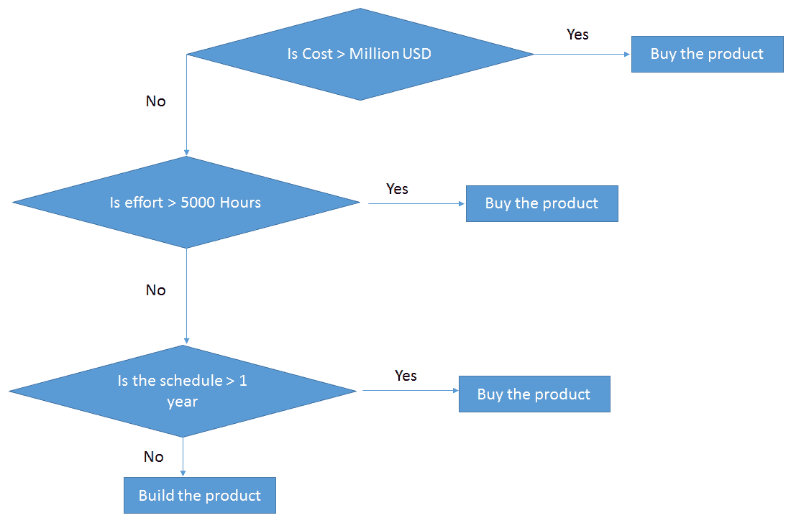
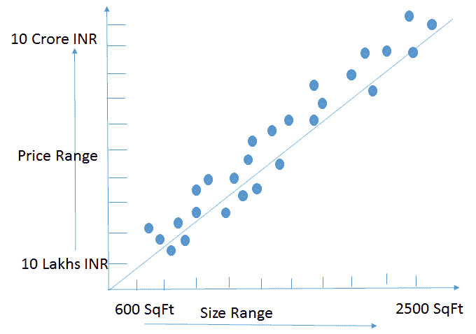
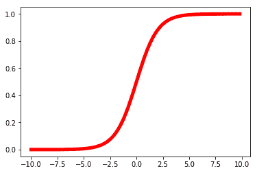
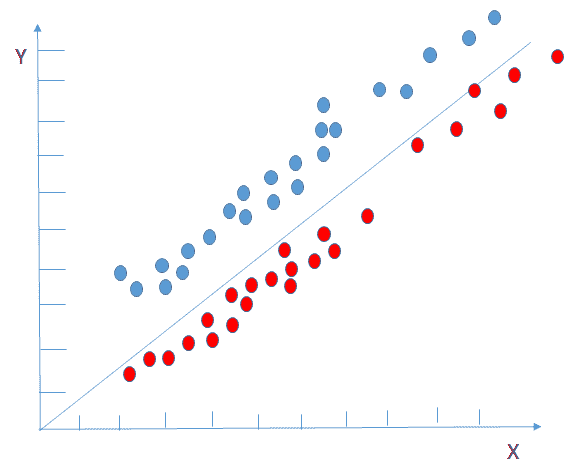
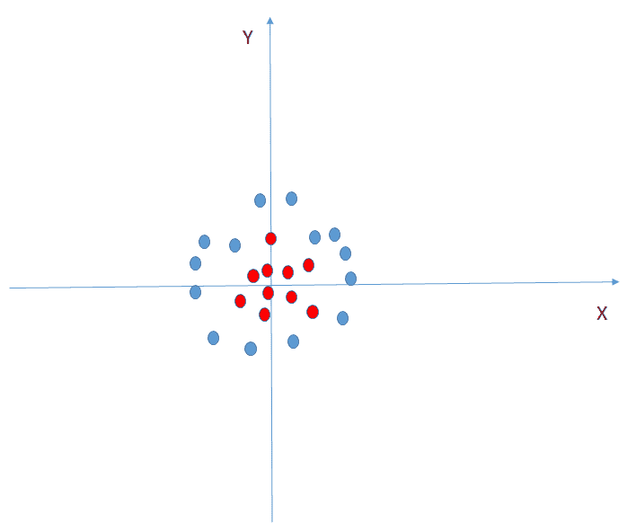
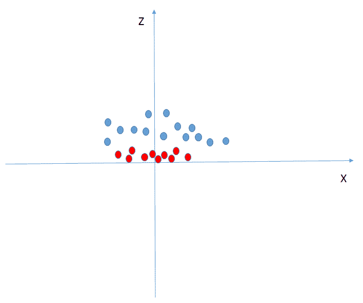
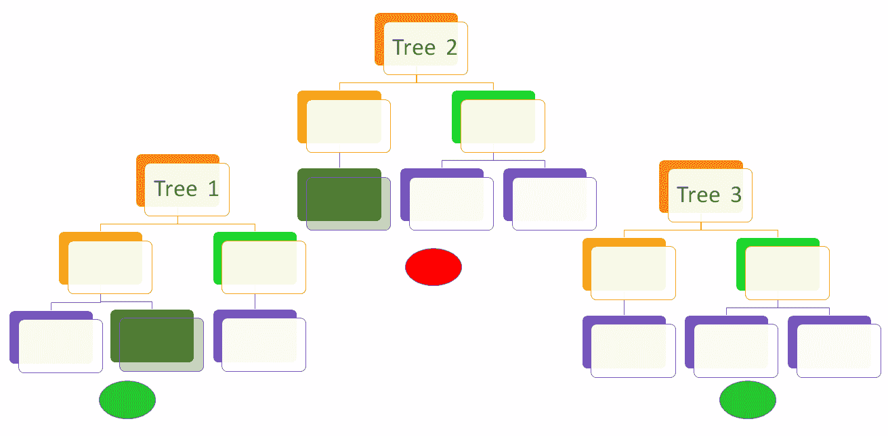
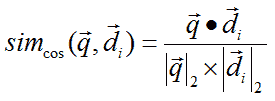
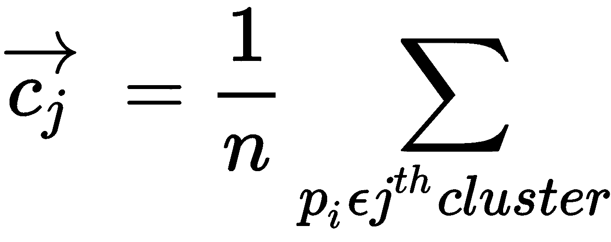

# 二、监督和非监督学习算法

在前一章中，我们了解了机器学习的各个方面，并介绍了机器学习算法的各种分类方法。在这一章中，我们将进一步深入机器学习算法，并尝试理解监督和非监督学习算法。这种分类基于算法的学习机制，并且是最流行的。

在本章中，我们将讨论以下主题:

*   以详细的实际例子的形式介绍监督学习算法，以帮助理解它和它的指导原则
*   关键的监督学习算法及其应用领域:
    *   朴素贝叶斯
    *   决策树
    *   线性回归
    *   逻辑回归
    *   支持向量机
    *   随机森林
*   以一个详细的实际例子的形式介绍无监督学习算法，以帮助理解它
*   关键的无监督学习算法及其应用领域:
    *   聚类算法
    *   关联规则映射
*   概述了可用于在移动设备中实现这些算法的不同移动 SDK 和工具

# 监督学习算法简介

让我们看看简单日常活动的监督学习。一位家长让他们 15 岁的儿子去商店买些蔬菜。他们给了他一份蔬菜清单，比如甜菜、胡萝卜、豆类和西红柿，希望他买。他去商店并且能够根据他母亲提供的清单从商店中存在的所有其他众多种类的蔬菜中识别出蔬菜清单，并且在去结账之前将它们放入他的购物车中。这怎么可能呢？

简单。这位家长通过提供每一种蔬菜的实例，给儿子提供了足够的训练，这使他对蔬菜有了足够的了解。儿子用他学到的知识选择正确的蔬菜。他使用蔬菜的各种属性来得出蔬菜的正确类别标签，在本例中，这是蔬菜的名称。下表给出了列表中蔬菜的一些属性，通过这些属性，儿子能够识别类别标签，即蔬菜名称:

| **菜名=****阶级标签** | **胡萝卜** | **甜菜** | **豆子** | **西红柿** |
| 属性 1 =颜色 | 柑橘 | 粉红色 | 格林（姓氏）；绿色的 | 红色 |
| 属性 2 =形状 | 圆锥体 | 轮次 | 粘贴 | 轮次 |
| 属性 3 =纹理 | 困难的 | 困难的 | 柔软的 | 柔软多汁 |
| 属性 4 =大小 | 10 厘米长 | 半径 3 厘米 | 10 厘米长 | 半径 3 厘米 |
| 属性 5 =品味 | 甜食 | 甜食 | 温和的 | 酸甜的 |

我们刚刚接触了监督学习。我们将把这项活动与机器学习的关键步骤联系起来:

*   **定义 ML 问题**:根据已经获得的关于蔬菜不同属性的培训和经验，从商店中所有种类的蔬菜中购买正确种类的蔬菜。
*   **准备/收集数据并训练模型**:15 岁的儿子已经接受了充分的蔬菜知识训练。他所见过和吃过的所有不同类型的蔬菜的知识，以及它们的属性和特征，形成了问题的历史训练数据，模型是 15 岁的儿子。

*   **评估模型**:儿子被要求从商店购买一些蔬菜。这是提供给他评估模型的测试集。该模型现在的任务是根据提供的列表识别商店中蔬菜的正确类别标签。

在某些情况下，识别和购买正确的蔬菜可能会出现错误。例如，儿子可能会购买双豆(豆的一种变体)而不是普通豆。这可能是由于缺乏足够的训练给予他之间的豆类和双豆的区别特征。如果有这样的错误，父母会用新的蔬菜重新训练他，这样下次他就不会犯同样的错误了。

所以，我们看到了监督机器学习问题的基本概念和功能。现在让我们进入监督学习的细节。

# 深入研究监督学习算法

假设有预测器属性， *x1* ， *x2* ，.... *xn* ，以及给定数据集的客观属性`y`。然后，监督学习是寻找预测函数的机器学习任务，该预测函数将来自该数据集中的预测属性和目标属性作为输入，并且能够以最小的误差将预测属性映射到甚至当前不在训练数据集中的看不见的数据的目标属性。

用于实现预测函数的数据集中的数据被称为**训练数据**，它由一组训练示例组成，其中每个示例由一个输入对象`x`(通常是一个向量)和一个期望的输出值`Y`组成。监督学习算法分析训练数据并产生将输入映射到输出的推断函数，并且还可以用于映射新的、看不见的示例数据:

*Y = f(X) +误差*

整个算法类别被称为**监督学习**，因为这里我们同时考虑了输入和输出变量进行学习。因此，学习是有监督的算法，即通过为所有训练数据实例提供训练数据中的输入和预期输出。

监督算法具有预测器属性和目标函数。一组数据项中的预测器属性是被认为是预测目标函数的那些项。目标函数是机器学习的目标。这通常包括预测值属性，可能还有一些其他计算功能，并且通常会输出一个数值。

一旦我们定义了一个需要监督学习的适当的机器学习问题，下一步就是选择解决该问题的机器学习算法。这是最艰巨的任务，因为目前有一个庞大的学习算法列表，从其中选择最合适的是一场噩梦。

佩德罗·多明戈斯教授提供了一个简单的参考架构([https://homes.cs.washington.edu/~pedrod/papers/cacm12.pdf](https://homes.cs.washington.edu/~pedrod/papers/cacm12.pdf))，在此基础上，我们可以使用任何机器学习算法所需的三个关键组件来执行算法选择，如下所示:

*   **表现**:模型的表现方式，使其能被计算机理解。它也可以被认为是模型将在其中起作用的假设空间。
*   **评价**:对于每一个算法或者模型，都需要有一个评价或者评分函数来决定哪个表现更好。对于每种类型的算法，评分函数是不同的。
*   **优化**:在语言模型中搜索最高分模型的方法。优化技术的选择对于学习者的效率是不可或缺的，并且如果评估函数具有一个以上的最优值，也有助于确定所产生的模型。

监督学习问题可以进一步分为回归和分类问题:

*   **分类**:当输出变量为类别时，如绿色或红色，或好或坏。
*   **回归**:当输出变量为实值时，如美元或重量。

在本节中，我们将通过简单易懂的示例来介绍以下监督学习算法:

*   朴素贝叶斯
*   决策树
*   线性回归

*   逻辑回归
*   支持向量机
*   随机森林

# 朴素贝叶斯

朴素贝叶斯是一种强大的分类算法，根据贝叶斯定理的原理实现。它假设数据集中考虑的特征变量之间不存在相关性。

贝叶斯定理描述了一个事件的概率，它基于可能与该事件相关的条件的先验知识。例如，如果癌症与年龄有关，那么使用贝叶斯定理，与在不知道人的年龄的情况下做出的癌症概率的评估相比，可以使用人的年龄来更准确地评估他们患有癌症的概率。

朴素贝叶斯分类器假设一个类中特定特征的存在与任何其他特征的存在无关。例如，如果一种蔬菜是橙色的，圆锥形的，大约三英寸长，它可以被认为是胡萝卜。该算法是天真的，因为它独立地考虑了所有这些属性，以促成这种蔬菜是胡萝卜的概率。通常，特征是不独立的，但是朴素贝叶斯认为它们是独立的，用于预测。

让我们来看看朴素贝叶斯算法的实际应用。假设我们有几个新闻提要，我们希望将这些提要分为文化事件和非文化事件。让我们考虑下面的句子:

*   *戏剧活动进展顺利——文化活动*
*   *这个良好的公众集会有一个庞大的人群——非文化活动*
*   *音乐秀不错——文化活动*
*   *戏剧活动有庞大的人群——文化活动*
*   *这场政治辩论信息量很大——非文化事件*

当我们使用贝叶斯定理时，我们想要做的就是使用概率来计算句子是属于文化事件还是非文化事件。

在胡萝卜的例子中，我们有颜色、形状和大小的特征，我们把它们作为独立的东西来处理，以确定所考虑的蔬菜是否是胡萝卜。

类似地，为了确定一个提要是否与一个文化事件相关，我们取一个句子，然后从这个句子中，将每个单词视为一个独立的特征。

贝叶斯定理说明 *p(A|B) = p(B|A)。P(A)/ P(B)* ，其中 *P(文化事件|剧秀好)= P(剧秀好|文化事件)。P(文化事件)/P(戏剧表演好)*。

我们可以在这里丢弃分母，因为我们正在确定哪个标签在文化和非文化类别中具有更高的概率。文化和非文化事件的分母将是整个数据集，因此是相同的。

*P(戏剧表演好)*找不到，因为这句话没有出现在训练数据中。这就是朴素贝叶斯定理真正有用的地方:

*P(戏剧表演好)= P(戏剧)。p(秀)。p(好)*

*P(戏剧表演好/文化事件)= P(戏剧|文化事件)。P(表演|文化事件)|P(好|文化事件)*

现在很容易计算这些并确定新的新闻提要是文化新闻提要还是政治新闻提要的概率:

P(文化事件)= 3/5(总共 5 句话中的 3 句)

P(非文化事件)= 2/5

*P(戏剧性/文化事件)=统计戏剧性出现在文化事件标签中的次数* *= 2/13 ( 2 次戏剧性出现在文化事件标签的总字数)*

P(表演/文化活动)= 1/13

*P(好/文化事件)=1/13*

有各种各样的技术，如去除停用词、词汇化、n-grams 和 TF-IDF，可以用来使文本分类的特征识别更加有效。我们将在接下来的章节中讨论其中的一些。

以下是最终的计算总结:

| **字** | **P(词&#124;文化事件)** | **P(词&#124;非文化事件)** |
| 戏剧性的 | 2/13 | 0 |
| 显示 | 1/13 | 0 |
| 好的 | 1/13 | 1/13 |

现在，我们只是将概率相乘，看看哪个更大，然后将句子归入那个标签类别。

因此，我们从表中知道，标签将属于文化事件类别，因为当个体概率成倍增加时，这将导致更大的产品。

这些例子很好地向我们介绍了朴素贝叶斯定理，它可以应用于以下领域:

*   文本分类
*   垃圾邮件过滤
*   文档分类
*   社交媒体中的情感分析
*   基于体裁的新闻文章分类

# 决策树

决策树算法用于根据特定条件做出决策。决策树被倒过来画，它的根在顶部*。*

让我们以一个组织的数据为例，其中特性集包括某些软件产品及其属性——构建产品所花费的时间 *T* ，构建产品所花费的精力 *E* ，以及构建产品所花费的成本 *C* 。需要决定这些产品是在公司内部制造，还是直接从公司外部购买。

现在，让我们看看如何为此创建决策树。在下图中，黑色粗体文本表示条件/内部节点，树基于该节点拆分为分支/边。不再分裂的分支的末端是决策/叶子。

决策树用于项目管理、项目管理和风险规划。让我们来看一个实际的例子。下图显示了一个组织用来决定哪个软件需要内部构建或者直接从外部购买的决策树。在做出决策之前，需要考虑各种决策点，这可以用树的形式来表示。成本、工作量和进度参数这三个特征被认为是决定**购买**还是**制造**的因素:

前面的树被称为**分类树**，因为其目的是将产品性质分类为购买或制造。**回归树**以同样的方式表示，只是它们预测连续值，比如房子的价格。一般来说，决策树算法被称为**车**或**分类和回归树**。

决策树可应用于以下领域:

*   风险辨认
*   贷款处理
*   选举结果预测
*   最佳处理
*   可选定价

# 线性回归

回归分析线性回归是一种统计分析方法，可以发现变量之间的关系。它有助于我们理解输入和输出数值变量之间的关系。

在这种方法中，确定因变量很重要。例如，房子的价值(因变量)根据房子的大小而变化；也就是它的面积是多少平方英尺(自变量)。房子的价值因位置不同而不同。线性回归技术可用于预测。

当响应是连续变量时，使用线性回归。下图清楚地显示了一个变量的线性回归是如何工作的。房子的价格根据它的大小而变化，如下图所示:

线性回归可应用于以下领域:

*   营销
*   定价
*   促销
*   分析消费者行为

# 逻辑回归

逻辑回归是一种分类算法，最适用于要预测的输出为二进制类型(真或假、男或女、赢或输等)的情况。二进制类型意味着只有两种可能的结果。

逻辑回归之所以被称为逻辑回归，是因为该算法使用了 sigmoid 函数。

逻辑函数或逻辑曲线是一种常见的 S 形(sigmoid 曲线)，由以下等式描述:

在上式中，符号具有以下含义:

*   *e* :自然对数底数(又称**欧拉数**
*   *x[0]:乙状结肠中点的 x 值*
*   *L* :曲线的最大值
*   k :曲线的陡度

标准逻辑函数被称为 **sigmoid 函数**:

这里描绘了 s 形曲线。这是一条 S 形曲线:

该曲线有以下有限限制:

*   当 *x* 接近*∞*时 *0*
*   *1* 随着 *x* 接近 *+∞*

当 *x=0* 时，sigmoid 函数的输出为 *0.5* 。

因此，如果输出大于 *0.5* ，我们可以将结果分类为 1(或**是**)，如果小于 *0.5* ，我们可以将其分类为 0(或**否**)。例如:如果输出是 *0.65* ，从概率上来说，可以解释为— *今天有 65%的几率会下雨。*

因此，sigmoid 函数的输出不能仅用于分类是/否；它还可用于确定是/否的概率。它可应用于以下领域:

*   图像分割和分类
*   地理图像处理
*   手写识别
*   医疗保健，用于疾病预测和基因分析
*   在预期有二元结果的各种领域中的预测

# 支持向量机

**支持向量机** ( **SVM** )是一种监督机器学习算法，可用于分类和回归。支持向量机更常用于分类。

给定一些数据点，每个数据点属于两个二进制类中的一个，目标是决定一个新的数据点将属于哪个类。我们需要将数据点可视化为一个 p 维向量，我们需要确定是否可以用一个(p-1)维超平面来分隔两个这样的数据点。

可能有许多超平面分隔这样的数据点，该算法将帮助我们达到提供最大分隔的最佳超平面。这个超平面叫做**最大间隔超平面**，分类器叫做**最大间隔分类器**。我们可以扩展分离超平面的概念，使用所谓的**软边界**来开发几乎分离类的超平面。最大间隔分类器对不可分情况的推广被称为**支持向量** **分类器**。

让我们举第一个例子。在这里，有一个超平面将红点和蓝点分开:

但是，假设这些点的分布如下——我们将如何识别分隔红点和蓝点的超平面:

解决方法是用 SVM 识别超平面。它可以执行变换来识别将两者分开用于分类的超平面。它将引入一个新功能， *z* ，也就是 *z=x^2+y^2* 。让我们用 *x* 和 *z* 轴绘制图形，并确定分类的超平面:

现在我们已经了解了 SVM 的基本知识，让我们看看它可以应用的领域:

*   人脸检测
*   图像分类
*   生物信息学
*   地质和环境科学
*   遗传学
*   蛋白质研究
*   手写识别

# 随机森林

我们已经看到了什么是决策树。理解了决策树之后，让我们来看看随机森林。随机森林将许多决策树组合成一个模型。单独来看，决策树(或人类)做出的预测可能不准确，但综合起来，平均来说，预测会更接近目标。

下图显示了一个随机森林，其中有多棵树，每棵树都在进行预测:

随机森林是许多决策树的组合，因此，具有来自森林中所有树的许多视图以达到最终期望结果/预测的可能性更大。如果只考虑单个决策树进行预测，则考虑用于预测的信息较少。但在随机森林中，当涉及的树很多时，信息的来源是多样而广泛的。与决策树不同，随机森林没有偏见，因为它们不依赖于一个来源。

下图演示了随机森林的概念:

随机森林可应用于以下领域:

*   风险辨认
*   贷款处理
*   选举结果预测
*   最佳处理
*   可选定价

# 无监督学习算法简介

考虑一个场景，给一个孩子一个装满不同大小、颜色、形状和由不同材料制成的珠子的袋子。我们只是让孩子随心所欲地处理整袋珠子。

根据孩子的兴趣，他们可以做各种各样的事情:

*   根据尺寸将珠子分类
*   根据形状将珠子分类

*   根据颜色和形状将珠子分类
*   根据材料、颜色和形状的组合将珠子分类

可能性是无限的。然而，没有任何预先教导的孩子能够穿过珠子并发现图案，这根本不需要任何预先的知识。他们纯粹是在翻阅手头的珠子，也就是手头的数据的基础上发现模式的。我们刚刚接触了无监督机器学习！

我们将把前面的活动与机器学习的关键步骤联系起来:

1.  **定义 ML 问题**:从给定的一袋珠子中发现隐藏的珠子图案。
2.  **准备/收集数据并训练模型**:孩子打开装满珠子的袋子，并理解袋子里装的是什么。他们发现了不同珠子的属性:
    *   颜色
    *   形状
    *   大小
    *   材料
3.  **评估模型**:如果给孩子一套新的珠子，根据他们之前串珠的经验，他们会如何把这些珠子串起来？

在对珠子进行分组时可能会出现错误，需要进行纠正/修复，以便它们在将来不会再次出现。

那么，现在我们已经看到了无监督机器学习问题的基本概念和功能，让我们进入无监督学习的细节。

# 深入研究无监督学习算法

无监督的机器学习处理学习未标记的数据，即没有被分类或归类的数据，并得出与它们相关的结论/模式。

这些类别从没有被标记、分类或归类的测试数据中学习。无监督学习不是对反馈做出反应，而是识别数据中的共性，并根据每个新数据中是否存在这种共性做出反应。

给予学习算法的输入是未标记的，因此，没有直接的方法来评估作为算法输出产生的结构的准确性。这是区别无监督学习和有监督学习的一个特征。

无监督算法有预测属性，但没有目标函数。

没有目标的学习意味着什么？请考虑以下情况:

*   探索自然分组的数据。
*   学习关联规则，然后检查它们是否有用。

以下是一些经典的例子:

*   执行购物篮分析，然后优化货架分配和放置
*   级联或相关的机械故障
*   超出已知阶层的人口统计分组
*   计划产品捆绑优惠

在本节中，我们将通过简单易懂的示例来介绍以下无监督学习算法:

*   聚类算法
*   关联规则映射

**Principal component analysis** (**PCA**) and **singular value decomposition** (**SVD**) may also be of interest if you want to deep dive into those concepts.<title>Clustering algorithms</title> 

# 聚类算法

聚类算法就是将数据集聚类成有用的组。聚类的目标是创建数据点组，使得不同聚类中的点不相似，而同一聚类中的点相似。

聚类算法的工作有两个基本要素:

*   **相似度函数**:这决定了我们如何判断两点是否相似。
*   **聚类方法**:这是为了得到聚类而观察到的方法。

需要一种机制来确定点之间的相似性，在此基础上可以将它们分类为相似或不相似。有各种相似性度量。以下是一些例子:

*   **欧几里得**:

*   **余弦**:

*   **KL-diversion**:

# 聚类方法

一旦我们知道了相似性度量，我们接下来需要选择聚类方法。我们将讨论两种聚类方法:

*   层次凝聚聚类方法
*   k 均值聚类

# 层次凝聚聚类方法

凝聚层次聚类是统计领域的一种经典聚类算法。它涉及两个最相似的组的迭代合并，这两个组在第一个实例中包含单个元素。该算法的名称是指其工作方式，因为它以聚合或自下而上的方式创建分层结果，即通过将较小的组合并为较大的组。

下面是文档聚类中使用的这种聚类方法的高级算法。

1.  一般凝聚过程(Salton，G: *自动文本处理:计算机对信息的转换、分析和检索*， *Addison-Wesley* ，1989)通过迭代产生嵌套聚类。
2.  计算所有成对的文档-文档相似性系数
3.  将每个 *n* 文档放入其自己的类中
4.  将两个最相似的集群合并为一个:
    *   用新的集群替换这两个集群
    *   重新计算关于新聚类的聚类间相似性得分
    *   如果群集半径大于 maxsize，则阻止进一步合并
5.  重复上述步骤，直到只剩下 *k 个*簇(注意: *k* 可能等于 *1* )

# k 均值聚类

K-means 聚类算法的目标是在数据中找到 K 个组，每个组都有相似的数据点。该算法迭代地工作，根据所提供的特征将每个数据点分配给 *K* 组中的一个。数据点基于特征相似性进行聚类。

K 值是在算法开始时随机分配的，通过改变 K 值可以获得不同的结果变化。一旦在选择 K 之后启动了活动的算法序列，如以下几点所描述的，我们发现有两个主要步骤一直重复，直到在集群中没有进一步的变化范围。

重复的两个主要步骤是*步骤 2* 和*步骤 3* ，描述如下:

*   **步骤 2** :将数据集中的数据点分配给 K 个聚类中的任意一个。这是通过计算数据点到聚类质心的距离来实现的。如上所述，我们已经讨论过的任何一个距离函数都可以用于这个计算。
*   **步骤 3** :这里再次发生质心的重新校准。这是通过取分配给该质心簇的所有数据点的平均值来完成的。

该算法的最终输出是具有相似数据点的 K 个聚类:

1.  选择*k-种子 d(k [i] ，kj)>d[min]*
2.  根据最小距离将点分配给聚类:

3.  计算新的聚类质心:

4.  将点重新分配给集群(如*步骤 2*
5.  迭代直到没有点改变聚类。

以下是使用聚类算法的一些领域:

*   城市规划
*   地震研究
*   保险
*   营销
*   医学，用于抗菌活性分析和医学成像
*   犯罪分析
*   机器人技术，用于异常检测和自然语言处理

# 关联规则学习算法

关联规则挖掘对于分类非数值数据更有用。关联规则挖掘主要集中在发现项目集合中频繁出现的关联。它有时也被称为**市场篮子分析**。

在购物篮中，目标是确定哪些商品经常一起出现。这显示了随机抽样方法很难发现的相互关系。这方面的经典例子是著名的啤酒和尿布协会，这是数据挖掘书籍中经常提到的。场景是这样的:去商店买尿布的男人也会倾向于买啤酒。这种情况很难通过随机抽样凭直觉判断或确定。

另一个例子是沃尔玛在 2004 年发现的，当时一系列飓风袭击了佛罗里达州。沃尔玛想知道购物者在飓风来袭前通常会买些什么。他们发现有一种特殊商品的销售额比正常购物日增长了 7 倍；那个东西不是瓶装水，电池，啤酒，手电筒，发电机，或者任何我们可能想象的普通东西。商品是**草莓馅饼**！对于为什么这是飓风到来之前最受欢迎的产品，可以有多种原因——蛋挞不需要冷藏，不需要烹饪，独立包装，保质期长，是零食，是早餐，孩子们喜欢，我们也喜欢，不胜枚举。尽管有这些显而易见的原因，它仍然是一个巨大的惊喜！

当挖掘关联时，以下可能是有用的:

*   搜索非数字项目的罕见和不寻常的同现关联。
*   如果数据是基于时间的数据，请考虑在数据挖掘实验中引入时间延迟的影响，以查看相关性的强度是否在稍后的时间达到峰值。

市场篮子分析可以应用于以下领域:

*   零售管理
*   商店管理
*   存货管理
*   美国宇航局和环境研究
*   医疗诊断

# 摘要

在这一章中，我们通过一个简单的例子了解了什么是监督学习，并深入研究了监督学习的概念。我们研究了各种有监督的学习算法，包括实际例子和它们的应用领域，然后我们开始研究无监督的学习，包括简单的例子。我们还讲述了无监督学习的概念，然后我们通过实际的例子和它们的应用领域介绍了各种无监督学习算法。

在接下来的章节中，我们将通过使用本章中介绍的一些有监督和无监督的机器学习算法来解决移动机器学习问题。我们还将向您展示移动机器学习 SDK，这些 SDK 将用于实施移动机器学习解决方案。

# 参考

*   佩德罗·多明哥博士的论文——[https://homes.cs.washington.edu/~pedrod/papers/cacm12.pdf](https://homes.cs.washington.edu/~pedrod/papers/cacm12.pdf)、[总结了机器学习研究人员和实践者学到的十二个关键教训，包括要避免的陷阱、要关注的重要问题以及该领域常见问题的答案。](https://homes.cs.washington.edu/~pedrod/papers/cacm12.pdf)