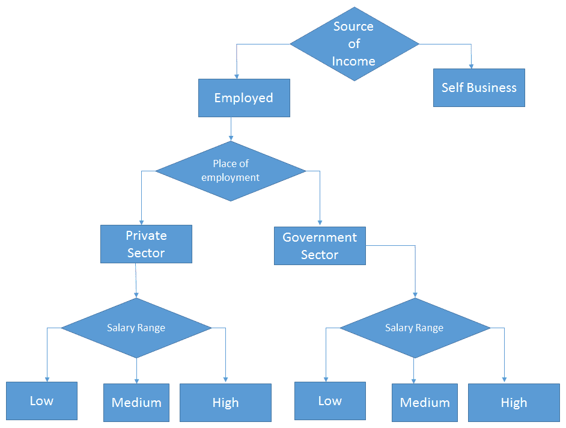
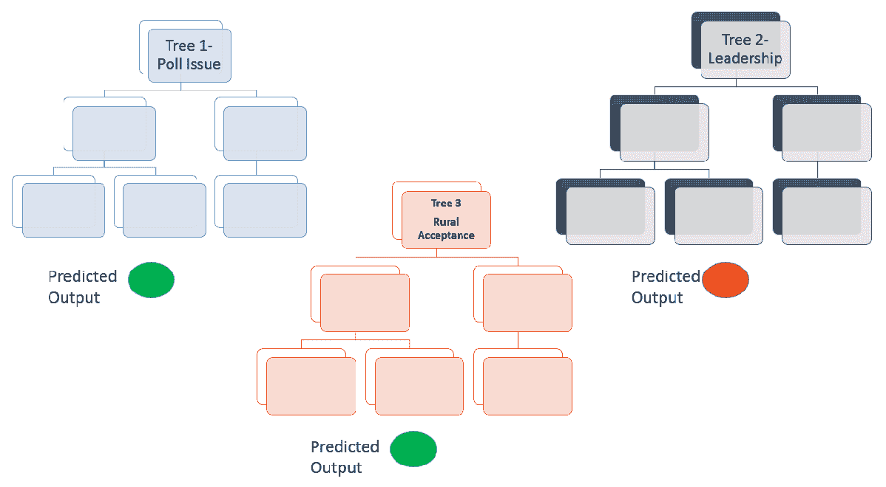
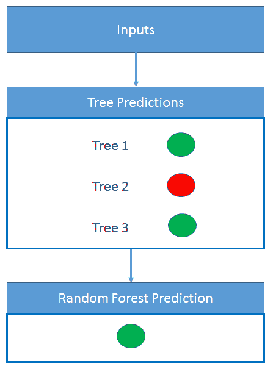
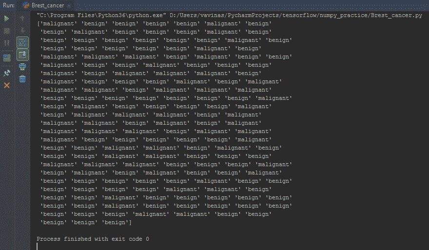
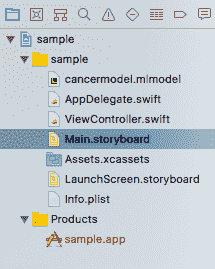
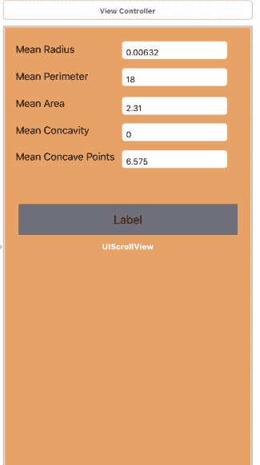
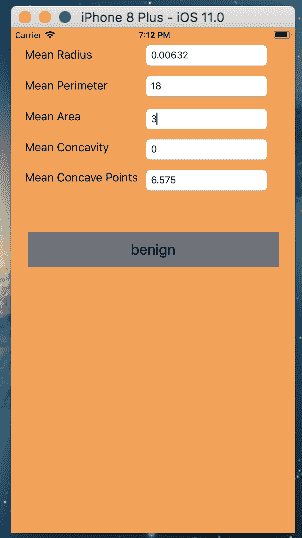

<title>Random Forest on iOS</title> 

# iOS 上的随机森林

本章将为你提供随机森林算法的概述。我们将首先看看决策树算法，一旦我们掌握了它，试着理解随机森林算法。然后，我们将使用 Core ML 创建一个机器学习程序，该程序利用随机森林算法，并根据一组给定的乳腺癌患者数据预测患者被诊断为乳腺癌的可能性。

正如我们在[第 1 章](51fcaf51-eb68-4493-afc2-0b02f1c1d50e.xhtml)、*移动机器学习简介、*中已经看到的，任何机器学习程序都有四个阶段:定义机器学习问题、准备数据、构建/重建/测试模型、部署使用。在本章中，我们将尝试将这些与随机森林联系起来，并解决底层的机器学习问题。

**问题定义**:提供了某些患者的乳腺癌数据，我们想预测一个新数据项诊断乳腺癌的可能性。

我们将讨论以下主题:

*   理解决策树以及如何应用它们解决 ML 问题
*   通过示例数据集和 Excel 了解决策树
*   了解随机森林
*   在核心 ML 中使用随机森林解决问题:
    *   技术要求
    *   使用 scikit-learn 和 pandas 库创建模型文件
    *   测试模型
    *   将 scikit-learn 模型导入核心 ML 项目
    *   编写一个 iOS 移动应用程序并使用其中的 scikit-learn 模型来执行乳腺癌预测

<title>Introduction to algorithms</title> 

# 算法简介

在这一节中，我们将研究决策树算法。我们将通过一个例子来理解算法。一旦我们对算法有了一些了解，我们将通过一个例子来理解随机森林算法。

<title>Decision tree </title> 

# 决策图表

要理解随机森林模型，我们必须首先了解决策树，它是随机森林的基本构造块。我们在日常生活中都使用决策树，即使你不知道它的名字。一旦我们开始看这个例子，你将能够理解决策树的概念。

想象一下你向银行申请贷款。在批准贷款之前，银行会仔细检查你的一系列资格标准。对于每个人来说，他们提供的贷款金额会根据他们满足的不同资格标准而有所不同。

他们可能会继续进行各种决策点，以做出最终决定，从而确定是否可能发放贷款以及可以发放的贷款金额，例如:

*   **收入来源**:就业还是个体户？
*   **如果就业，就业地点**:私营部门还是政府部门？
*   **如果是私营企业，薪资范围**:低、中、高？
*   **如果是政府部门，工资范围**:低、中、高？

可能会有进一步的问题，比如你在那家公司工作了多长时间，或者你是否有未偿还的贷款。这个过程最基本的形式是一个决策树:



正如您在前面的图表中所看到的，决策树是一种广泛用于分类问题的非参数有效机器学习建模技术。为了找到解决方案，决策树根据预测数据对结果做出连续的分层决策。

对于任何给定的数据项，会询问一系列问题，这些问题会导致一个类标签或一个值。该模型询问传入数据项的一系列预定义问题，并基于这些答案，分支到该系列并继续进行，直到到达结果数据值或类标签。该模型是基于观察到的数据构建的，并且没有关于误差分布或数据本身分布的假设。

在目标变量使用一组离散值的决策树模型中，这被称为**分类树**。在这些树中，每个节点或叶子代表类别标签，而分支代表通向类别标签的特征。

目标变量取连续值(通常是数字)的决策树被称为**回归树**。

使用**有向无环图** ( **DAGs** )可以很好地表示这些决策树。在这些图中，节点代表决策点，边是节点之间的连接。在前面的贷款场景中，30，000 美元到 70，000 美元的工资范围是优势，中间是节点。

<title>Advantages of the decision tree algorithm</title> 

# 决策树算法的优势

决策树的目标是对给定的问题做出最佳选择。最后的叶节点应该是手头问题的最佳选择。该算法贪婪地运行，并试图在其做出的每个决策中找到最佳选择。

整个问题被分成多个子问题，每个子问题又分支到其他子问题。到达的子集基于名为**纯度**的参数。当所有的决定将导致属于同一类的数据时，称一个节点是 100%纯的。当有可能将其子集分成类别时，它将是 100%不纯的。该算法的目标是使树中的每个节点达到 100%的纯度。

节点的纯度使用基尼系数来衡量，基尼系数是一个标准的度量标准，有助于分裂决策树的节点。

决策树中使用的另一个度量是信息增益，它将用于决定在树中的每一步应该使用数据集的什么特征进行分割。信息增益是在属性上分割数据集后熵(随机性)的减少。构建决策树就是要找到返回最高信息增益的属性，也就是最同质的分支，这意味着所有数据都属于同一个子集或类。

<title>Disadvantages of decision trees</title> 

# 决策树的缺点

只有当所有数据点都可以归入一个类/类别时，模型才会停止。因此，对于复杂的问题，它可能不能很好地推广，出现偏差的可能性很大。

这些问题可以通过定义树的最大深度或指定在树中进一步分割节点所需的最小数据点数来解决。

<title>Advantages of decision trees</title> 

# 决策树的优势

下面列出了一些优点:

*   易于理解和可视化
*   非常容易构建，可以处理定性和定量数据
*   易于验证
*   从计算上来说，这并不昂贵

总结一下决策树模型，我们可以得出这样的结论:它基本上是一个问题的流程图，这些问题导致一个预测。

<title>Random forests</title> 

# 随机森林

现在，让我们从单个决策树转移到随机森林。如果你想猜测下一任总统会是谁，你会如何预测？让我们看看我们会问哪些不同类型的问题来预测这一点:

*   有多少候选人？他们是谁？
*   现任总统是谁？
*   他们表现如何？
*   他们属于哪个政党？
*   目前有反对该党运动吗？
*   这个政党有可能在多少个州获胜
*   他们是现任总统吗？
*   主要的投票议题是什么？

许多类似这样的问题会浮现在我们的脑海中，我们会赋予它们不同的权重/重要性。

每个人对前面问题的预测可能不一样。要考虑的因素太多了，而且每个人的猜测可能都不一样。每个人都有不同的背景和知识水平来回答这些问题，并且可能对问题有不同的解释。

所以答案有可能有很大的差异。如果我们把不同个体给出的所有预测分别拿出来，然后平均一下，就变成了随机森林。

随机森林将许多决策树组合成一个模型。单独来看，决策树(或人类)做出的预测可能不准确，但是当组合起来时，平均来说，预测会更接近目标。

下图将帮助我们理解使用随机森林算法的投票预测:



下图给出了上图的流程图视图:



让我们看看为什么随机森林比决策树更好:

*   随机森林是许多决策树的组合，因此，很有可能会有许多观点来达成最终预测。
*   如果只考虑单个决策树进行预测，则考虑用于预测的信息较少。但是，在一个随机的森林中，当涉及到许多树木时，就有更多的信息，而且更加多样化。
*   与决策树的情况不同，随机森林可能没有偏向，因为它不依赖于单个源。

为什么叫随机森林？尽管人们可能依赖不同的来源来做出预测，但森林中的每个决策树在形成问题时都会考虑随机的特征子集，并且只能访问随机的一组训练数据点。这增加了森林中的多样性，导致更稳健的整体预测，因此命名为随机森林。

<title>Solving the problem using random forest in Core ML</title> 

# 在核心 ML 中使用随机森林解决问题

在本节中，我们将通过一个带有特定数据集的详细示例来尝试理解随机森林。我们将使用相同的数据集来计算 iOS 核心 ML 示例。

<title>Dataset</title> 

# 资料组

我们将使用乳腺癌数据集来解决随机森林问题。从乳腺肿块的**细针抽吸** ( **FNA** )的数字化图像中计算特征。它们描述了图像中出现的细胞核的特征。数据集可以在[https://archive . ics . UCI . edu/ml/datasets/Breast+Cancer+Wisconsin+(Diagnostic)](https://archive.ics.uci.edu/ml/datasets/Breast+Cancer+Wisconsin+(Diagnostic))找到。

<title>Naming the dataset</title> 

# 命名数据集

我们将使用乳腺癌数据集。以下列表包含数据集中使用的各种约定:

*   识别号
*   诊断( *M* =恶性，而 *B* =良性)

*   为每个细胞核计算 10 个实值特征:
    *   半径(从中心到周边各点的平均距离)
    *   纹理(灰度值的标准偏差)
    *   周长
    *   面积
    *   平滑度(半径长度的局部变化)
    *   紧凑性( *perimeter^2/area - 1.0* )
    *   凹度(轮廓凹陷部分的严重程度)
    *   凹点(轮廓凹陷部分的数量)
    *   对称
    *   分形维数(海岸线近似值-1)

我们将通过 Excel 使用随机森林，应用乳腺癌数据集，详细了解随机森林。出于分析的目的，我们将只考虑来自乳腺癌数据集的 569 个样本数据的数据元素。

<title>Technical requirements</title> 

# 技术要求

开发人员计算机上需要安装以下软件:

*   计算机编程语言
*   macOS 环境中的 Xcode

本章的练习程序可以在 GitHub 资源库([https://GitHub . com/packt publishing/Machine-Learning-for-Mobile](https://github.com/PacktPublishing/Machine-Learning-for-Mobile))的`Chapter03`文件夹下找到。让我们从输入安装 Python 包的命令开始:

```
pip install pandas
pip install -U scikit-learn
pip install -U pandas
```

然后，发出安装`coremltools`的命令:

```
pip install -U coremltools
```

<title>Creating the model file using scikit-learn </title> 

# 使用 scikit-learn 创建模型文件

本节将解释我们如何使用 scikit-learn 创建随机森林模型文件，并将其转换成与 Core ML 兼容的`.mlmodel`文件。我们将使用乳腺癌数据集来创建模型。以下是使用 scikit-learn 和乳腺癌数据集创建简单随机森林模型的 Python 程序。然后，核心 ML 工具将它转换成核心 ML 兼容的模型文件。让我们详细地看一下这个程序。

首先，我们需要导入所需的包:

```
# importing required packages
 import numpy as np
```

NumPy 是使用 Python 进行科学计算的基础包。它包含了一个强大的 N 维数组对象。这个`numpy`数组将在这个程序中用于存储数据集，它有 14 个维度:

```
import pandas as pd
 from pandas.core import series
```

这里，我们使用 pandas([https://pandas.pydata.org/pandas-docs/stable/10min.html](https://pandas.pydata.org/pandas-docs/stable/10min.html))，它是一个开源的、BSD 许可的库，为 Python 编程语言提供了高性能、易于使用的数据结构和数据分析工具。使用熊猫，我们可以创建一个数据框。你可以假设熊猫数据框架是一个 Excel 表格，其中每个表格都有标题和数据。

现在，让我们继续理解为解决手头的机器学习问题而编写的程序:

```
from sklearn.ensemble import RandomForestClassifier

from sklearn.metrics import accuracy_score
import sklearn.datasets as dsimport sklearn.datasets as ds
```

前面几行导入了`sklearn`包。现在，我们将导入`sklearn`包中的内置数据集:

```
dataset = ds.load_breast_cancer()
```

前面一行从`sklearn`数据集包中加载乳腺癌数据集:

```
 cancerdata = pd.DataFrame(dataset.data)
```

这将从数据集中的数据创建一个数据帧。让我们假设数据集是一个 Excel 表，包含带有列标题的行和列:

```
 cancerdata.columns = dataset.feature_names
```

下面这段代码将向数据集中的列添加列标题:

```
for i in range(0,len(dataset.feature_names)):
if ['mean concave points', 'mean area', 'mean radius', 'mean perimeter', 'mean concavity'].\
__contains__(dataset.feature_names[i]):
continue
else:
cancerdata = cancerdata.drop(dataset.feature_names[i], axis=1)
```

前面的行将删除除下列以外的所有列:

*   平均凹点
*   平均面积
*   平均半径
*   平均周长
*   平均凹度

为了减少数据集中要素列的数量，我删除了一些对模型影响较小的列:

```
cancerdata.to_csv("myfile.csv")
```

这一行将数据保存到一个 CSV 文件中；您可以打开它并在 Excel 中查看，找出数据集中存在的内容:

```
 cancer_types = dataset.target_names
```

在 Excel 数据集中，当您检查它时，您会知道诊断将包括值 0 或 1，其中 0 是恶性的，1 是良性的。为了将这些数值改为真实的名称，我们编写了以下代码:

```
cancer_names = []
//getting all the corresponding cancer types with name [string] format.
for i in range(len(dataset.target)):
cancer_names.append(cancer_types[dataset.target[i]])
x_train, x_test, y_train, y_test = sklearn.model_selection.train_test_split(cancerdata,cancer_names,test_size=0.3, random_state=5)
```

这一行代码将数据集一分为二，一个用于训练，一个用于测试，并将它保存在为此目的定义的相应变量中:

```
 classifier = RandomForestClassifier()
```

下面将创建一个分类器:

```
classifier.fit(x_train, y_train)
```

此代码将提供训练数据并训练模型:

```
//testing the model with test data
print(classifier.predict(x_test))
```

前面一行将把测试数据的预测癌症类型打印到控制台，如下所示:



<title>Converting the scikit model to the Core ML model</title> 

# 将 scikit 模型转换为核心 ML 模型

让我用一个例子来解释:假设你来自法国，你只会说法语和英语。想象你去印度度假。你去旅馆的餐厅，服务员给你一份用当地语言写的菜单。现在，你会怎么做？让我猜猜，你会要求服务员，或者另一个顾客/你的导游，向你解释这些项目，或者你只是在谷歌翻译中扫描图片。

我的观点是你需要一个翻译。就是这样。类似地，为了让 iOS 移动应用程序理解 scikit 模型，需要一个将它转换为核心 ML 格式的转换器。

这就是下面代码的全部工作。它会将 scikit-learn 格式转换为核心 ML 格式:

```
//converting the fitted model to a Core ML Model file

model = coremltools.converters.sklearn.convert(classifier, input_features=list(cancerdata.columns.values), output_feature_names='typeofcancer')

model.save("cancermodel.mlmodel")
```

为此，要工作，你必须使用你的`pip`安装`coremltools`。然后，在顶部编写以下代码来导入它:

```
import coremltools
```

一旦你运行这个程序，你会在你的磁盘上得到一个模型文件，名为`cancermodel.mlmodel`，你将在你的 iOS 项目中使用它进行推理。

<title>Creating an iOS mobile application using the Core ML model</title> 

# 使用核心 ML 模型创建 iOS 移动应用程序

在本节中，我们将创建一个 iOS 项目来使用 Core ML，为此您将需要 Xcode(它必须是版本 9+)。

让我们从打开 Xcode 并创建一个带有故事板的空 swift 应用程序开始。在主要的故事板设计中，屏幕将如下所示。然后，将生成的模型文件添加到您的项目中。这将为您提供以下结构:



现在，在主故事板文件中创建 UI，如下所示:



为每个文本字段创建出口。并将事件侦听器添加到每个文本字段中。现在，您的视图控制器将如下所示:

```
import UIKit
import Core ML 
class ViewController: UIViewController {
    let model = cancermodel()
    @IBOutlet weak var meanradius: UITextField!
    @IBOutlet weak var cancertype: UILabel!
    @IBOutlet weak var meanperimeter: UITextField!
    @IBOutlet weak var meanarea: UITextField!
    @IBOutlet weak var meanconcavity: UITextField!
    @IBOutlet weak var meanconcavepoints: UITextField!
    override func didReceiveMemoryWarning() {
        super.didReceiveMemoryWarning()
        // Dispose of any resources that can be recreated.
    }
    override func viewDidLoad() {
        super.viewDidLoad();
        updated(meanconcavepoints);
        //This line is to fire the initial update of the cancer type.
    }
    /*
This method will send the input data to your generated model class and display the returned result to the label.
*/

    @IBAction func updated(_ sender: Any) {
        guard let modeloutput = try? model.prediction(mean_radius: 
        Double(meanradius.text!)!, mean_perimeter: 
        Double(meanperimeter.text!)!, mean_area: Double(meanarea.text!)!, 
        mean_concavity: Double(meanconcavity.text!)!, mean_concave_points: 
        Double(meanconcavepoints.text!)!) else {
            fatalError("unexpected runtime error")
        }
        cancertype.text = modeloutput.typeofcancer;
    }
}
```

您可以在本书的 GitHub 资源库中找到相同的代码。

如果您在构建过程中遇到任何问题。如签名或证书，请谷歌它或写信给我们。

一旦在 Xcode 中设置了项目，就可以在模拟器中运行它。结果将如下所示:



<title>Summary</title> 

# 摘要

在这一章中，我们学习了决策树和随机森林，以及它们之间的区别。我们还通过样本数据集和使用样本数据集的 Excel 来探索决策树，并对其使用随机森林算法以建立预测。我们使用 Core ML 编写 iOS 程序，然后应用 scikit-learn 创建模型，并使用 Core ML 工具将 scikit 模型转换为 Core ML 模型。

在下一章中，我们将了解更多关于 TensorFlow 及其在 Android 中的使用。

<title>Further reading</title> 

# 进一步阅读

通过访问 Core ML 的官方网站:[https://developer.apple.com/documentation/coreml](https://developer.apple.com/documentation/coreml)，我们可以进一步了解 Core ML 及其提供的服务。