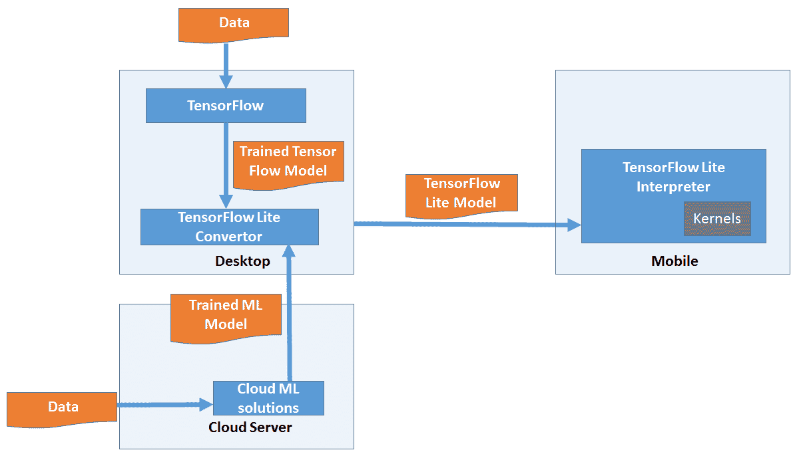
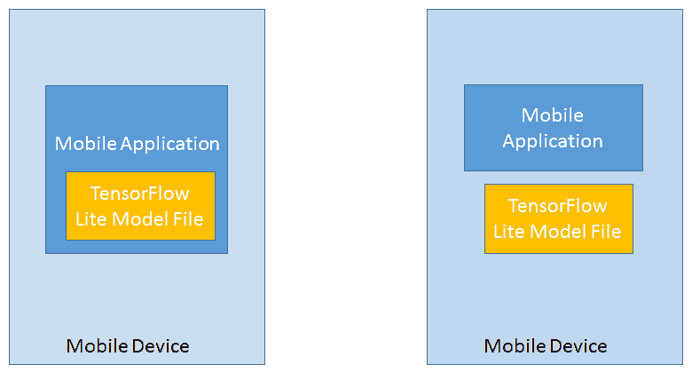
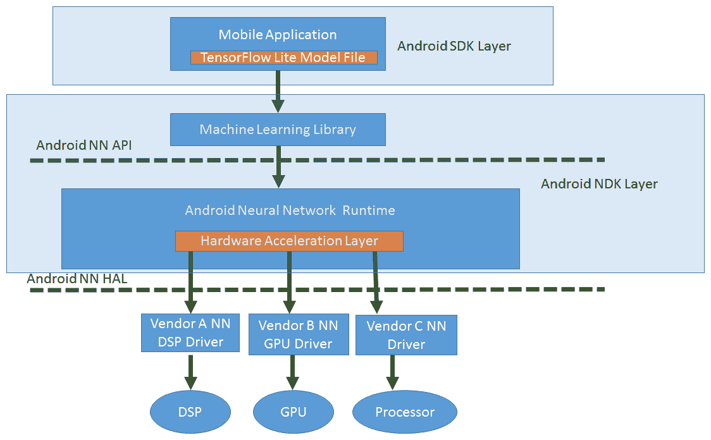
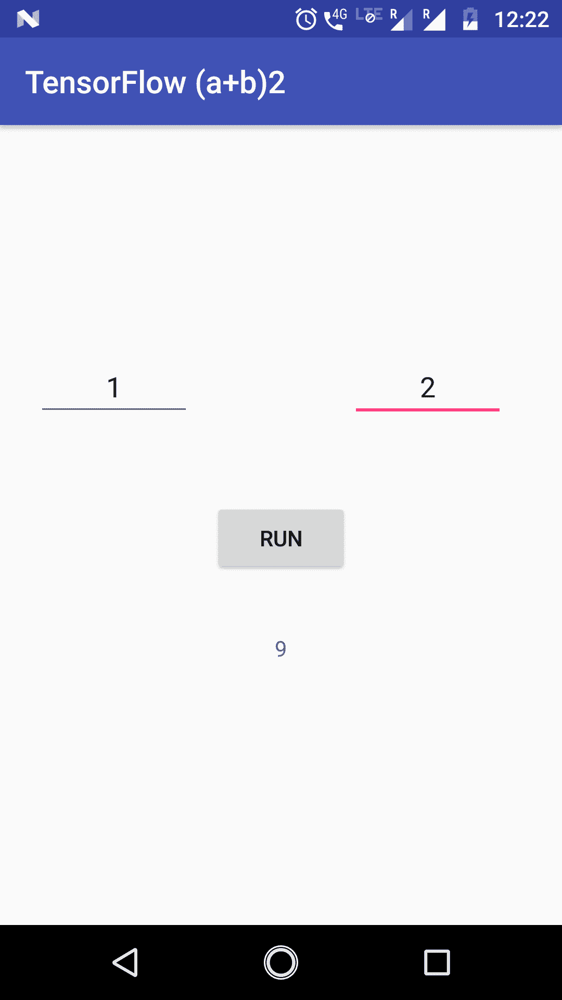

# Android 中的 TensorFlow Mobile

在前一章中，我们重点介绍了监督学习和非监督学习，并了解了不同类型的学习算法。在本章中，我们将介绍 TensorFlow for mobile，并使用 TensorFlow for mobile 完成一个示例程序实现。在第九章[，*的移动神经网络*中，我们将使用它来实现一个分类算法。但我们需要了解 TensorFlow for mobile 的工作原理，并能够使用它编写样本，然后才能用它实现机器学习算法。本章的目的是介绍 TensorFlow、TensorFlow Lite、TensorFlow for mobile 以及它们的工作方式，并尝试在 Android 中使用 TensorFlow for mobile 的动手示例。](3e97f92b-a2d9-4618-9a3b-91552fa3fc3d.xhtml)

在本章中，我们将讨论以下主题:

*   TensorFlow、TensorFlow Lite 和 TensorFlow for mobile 简介
*   手机 TensorFlow 的组件
*   移动机器学习应用的架构
*   在 Android 中使用 TensorFlow 构建一个示例程序

本章结束时，你将知道如何在 Android 中使用 TensorFlow for mobile 构建一个应用。在[第九章](3e97f92b-a2d9-4618-9a3b-91552fa3fc3d.xhtml)、*移动神经网络*中，我们将使用它来实现一个分类算法。


# 张量流简介

TensorFlow 是谷歌开发的实现机器学习的工具，2015 年开源。它是一个可以安装在桌面上的产品，可以用来创建机器学习模型。一旦在桌面上构建并训练了模型，开发人员就可以将这些模型转移到移动设备上，并通过将它们集成到 iOS 和 Android 移动应用中，开始使用它们来预测移动应用中的结果。目前有两种类型的 TensorFlow 可用于在移动和嵌入式设备上实现机器学习解决方案:

*   **移动设备** : TensorFlow for Mobile
*   **移动和嵌入式设备** : TensorFlow Lite

下表将帮助您理解 TensorFlow for mobile 和 TensorFlow Lite 之间的主要区别:

| **手机张量流** | **TensorFlow Lite** |
| 设计用于更大的设备。 | 设计用于非常小的设备。 |
| 二进制为移动优化。 | 二进制文件的大小非常小，针对移动和嵌入式设备进行了优化，依赖性最小，性能增强。 |
| 支持在 Android、iOS 和 Raspberry Pi 上部署 CPU、GPU 和 TPU。 | 支持硬件加速。可以在 iOS、Android 和 Raspberry Pi 上部署。 |
| 建议现在在生产部署的移动设备中使用。 | 仍处于测试阶段，正在进行改进。 |
| 提供更广泛的运营商和 ML 模型支持。 | 支持有限的运算符，并且不是所有的 ML 模型都受支持。 |


# TensorFlow Lite 组件

在本节中，我们将详细介绍 TensorFlow Lite:整体架构、关键组件及其功能。

下图提供了关键组件的高级概述，以及它们如何交互以将机器学习引入移动设备:



以下是在设备上实施 ML 时需要遵循的关键步骤:

1.  使用 TensorFlow 或任何其他机器学习框架，在桌面上创建经过训练的 TensorFlow/ML 模型。经过训练的模型也可以使用任何云 ML 引擎来创建。
2.  使用 TensorFlow Lite 转换器将已定型的 ML 模型转换为 TensorFlow Lite 模型文件。
3.  使用这些文件编写一个移动应用，并将其转换成一个包，以便在移动设备上部署和执行。这些 lite 文件可以直接在内核或硬件加速器(如果设备中有)中解释和执行。

以下是 TensorFlow Lite 的关键组件:

*   模型文件格式
*   解释者
*   操作/内核
*   硬件加速接口


# 模型文件格式

以下是模型文件格式的亮点:

*   它是轻量级的，对软件的依赖性很小。
*   它支持量化。
    *   这种格式是基于 FlatBuffer 的，因此提高了执行速度。FlatBuffer 是 Google 的一个开源项目，最初是为视频游戏设计的。
*   FlatBuffer 是一个跨平台的序列化库，类似于协议缓冲区。
*   这种格式更节省内存，因为它不需要解析/解包步骤来在数据访问之前执行二次表示。没有封送处理步骤，因此使用的代码较少。


# 解释者

以下是解释器的亮点:

*   这是一个移动优化的解释器。
*   它有助于保持移动应用的精简和快速。
*   它使用静态图排序和定制的(动态性较低的)内存分配器来确保最小的负载、初始化和执行延迟。
*   解释器有一个静态内存计划和一个静态执行计划。


# 操作/内核

一组核心操作符，既有量化的也有浮点的，其中许多已经针对移动平台进行了调整。这些可以用来创建和运行定制模型。开发人员也可以编写他们自己的自定义操作符，并在模型中使用它们。


# 硬件加速接口

TensorFlow Lite 有硬件加速器接口；在 Android 中，它是通过 Android 神经网络 API 实现的，在 iOS 中，它是通过 CoreML 实现的。

以下是预测试模型，保证开箱即可使用 TensorFlow Lite:

*   **Inception V3** :检测图像中主要物体的流行模型。

*   **MobileNets:** 可用于分类、检测和分割的计算机视觉模型。MobileNet 模型比 Inception V3 小，但是不太精确。

*   **On-device smart reply** :一种 On-device 模式，通过建议上下文相关的消息，为传入的文本消息提供一键回复。


# 移动机器学习应用的架构

现在，我们已经了解了 TensorFlow Lite 的组件，接下来我们将了解移动应用如何与 TensorFlow 组件一起提供移动 ML 解决方案。

移动应用应利用 TensorFlow Lite 模型文件对未来数据进行推断。TensorFlow Lite 模型文件可以与移动应用打包在一起部署，也可以与移动应用部署包分开。下图描述了两种可能的部署方案:



每种部署都有其优点和缺点。在第一种情况下，当两者耦合时，模型文件有更多的安全性，它可以保持安全。这是一种更直接的方法。但是，由于模型文件的大小，应用包的大小会增加。在第二种情况下，两者是分开的，很容易单独更新模型文件，而不需要执行应用升级。因此，对于模型升级，可以避免与应用升级、部署到 app store 等相关的所有活动。由于这种分离，应用包的大小也可以最小化。但是，由于模型文件是独立的，所以应该更加小心地处理它，不要让它容易受到安全威胁。

对 TensorFlow Lite 模型文件的移动应用有了一个大致的了解后，让我们来看一下整体情况。移动应用与 TensorFlow Lite 模型文件打包在一起。使用 Android SDK 编写的移动应用和 TensorFlow Lite 模型文件之间的这种交互通过 TensorFlow Lite 解释器进行，它是 Android NDK 层的一部分。通过从移动应用暴露给 SDK 层的接口来调用 C 函数，以便通过使用与移动应用一起部署的经过训练的 TensorFlow Lite 模型来进行预测或推断。下图提供了 Android 生态系统的 SDK 和 NDK 层的清晰视图，这些层将涉及典型的机器学习程序。也可以通过 android NN 层在 GPU 或任何专用处理器上触发执行:




# 理解模型概念

在使用 TensorFlow 编写我们的第一个程序之前，我们将简要回顾一下有助于我们理解 TensorFlow Lite 模型如何工作的概念。为了更好地理解，我们不会深入细节，而只是进行概念性的概述。

MobileNet 和 Inception V3 是基于**卷积神经网络**(**CNN**)的内置模型。

在最基本的层面上，CNN 可以被认为是一种使用相同神经元的许多相同副本的神经网络。这使得网络可以拥有大量神经元，并表达计算量大的模型，同时保持需要学习的实际参数(描述神经元行为的值)的数量相当低。

这个概念可以用拼图游戏和我们通常如何解决一个的类比来理解。下图是一个需要解决的难题:


如果我们必须从提供的碎片组装这个拼图，只要想想你将如何开始解决它。你可以把不同颜色的东西放在一起。然后在同一种颜色中，你会检查图案，然后将它们组合起来。这与卷积网络训练图像分类和识别的方式相同。因此只有一小部分，每个神经元都记得。但是父代神经元明白其范围内的事物需要如何组合才能得到全局。

在 Inception V3 和 MobileNet 模型中，两者都基于 CNN 的概念工作。这个模型训练有素，非常稳定。要使用我们的图像集，我们需要做的就是用我们的图像重新训练模型。现在我们已经有了足够的概念和理论，我们将继续使用 TensorFlow Lite for Android 编写我们的第一个示例程序。

我们将在第 9 章、*移动神经网络*中使用 TensorFlow for mobile 进行分类应用


# 使用张量流模型编写移动应用

我们要做什么？

在本节中，我们将在 TensorFlow 中构建一个小的`(a+b)2`模型，将其部署到 android 移动应用中，并从 Android 移动设备上运行它。

**你需要知道什么？**

要继续本节，您需要 python、TensorFlow dependencies 和 android studio 的工作安装，以及 Python 和 java android 的一些知识。你可以在这里找到如何安装 TensorFlow 的说明:[https://www.tensorflow.org/install/](https://www.tensorflow.org/install/)。

如果您需要 Windows 的详细安装步骤，请参考本书第十一章、*移动应用上的 ML 的未来*中提供的截图。

我们已经看到了张量流的细节。用简单的话来说 TensorFlow 就是把用 python 写的张量流程序保存到一个小文件中，这个小文件可以被我们将安装在 Android 应用中的 C++原生库读取，并且可以在移动设备上执行和进行推理。为此，JNI (Java 本地接口)作为 Java 和 C++之间的桥梁。

要了解张量流精简版背后的想法，请查看[https://www.tensorflow.org/mobile/tflite/.](https://www.tensorflow.org/mobile/tflite/)


# 编写我们的第一个程序

为了编写 TensorFlow 移动应用，我们需要遵循几个步骤:

1.  创建 TF(张量流)模型
2.  保存模型
3.  冻结图表

4.  优化模型
5.  编写 Android 应用并执行它

我们现在将详细介绍每个步骤。


# 创建和保存 TF 模型

首先，我们首先创建一个简单的模型，并将它的计算图保存为一个序列化的`GraphDef`文件。训练完模型后，我们将它的变量值保存到一个检查点文件中。我们必须将这两个文件转换成一个优化的独立文件，这是我们在 Android 应用中需要使用的全部内容。

对于本教程，我们创建一个非常简单的 TensorFlow 图，它实现了一个将计算 *(a+b) ² =c* 的小用例。这里，我们将输入保存为 *a* 和 *b* ，输出保存为 *c* 。

为了实现这个示例程序，我们将使用 Python。因此，作为先决条件，您需要在您的机器上安装 python，并使用`pip`在您的机器上安装 TensorFlow 库。

有关如何安装 Python 的说明，请查看本书的软件安装/附录部分。`pip`是 python 自带的一个 Python 包管理器。

一旦安装了 python 并正确设置了路径，就可以在命令提示符下运行`pip`命令。要安装 TensorFlow，请运行以下命令:

```
pip install tensorflow
```

这个示例可能看起来太简单，可能不包含任何与机器学习相关的内容，但这个示例应该是理解张量流及其工作原理的良好起点:

```
import tensorflow as tf 
a = tf.placeholder(tf.int32, name='a') # input 
b = tf.placeholder(tf.int32, name='b') # input 
times = tf.Variable(name="times", dtype=tf.int32, initial_value=2) 
c = tf.pow(tf.add(a, b), times, name="c") 
saver = tf.train.Saver()

init_op = tf.global_variables_initializer() with tf.Session() as sess: sess.run(init_op) tf.train.write_graph(sess.graph_def, '.', 'tfdroid.pbtxt')

sess.run(tf.assign(name="times", value=2, ref=times)) # save the graph 
# save a checkpoint file, which will store the above assignment saver.save(sess, './tfdroid.ckpt')
```

在前面的程序中，我们创建了两个占位符，名为 *a* 和 *b* ，它们可以保存整数值。现在，你可以把占位符想象成决策树的节点。在下一行中，我们将创建一个名为 times 的变量。我们创建这个来存储我们需要乘以输入的次数。在这种情况下，我们给出的两个作为议程是要做为*【a+b】*^(*2*)*。*

在下一行中，我们将在 *a* 和 *b* 节点上应用加法运算。对于这个总和，我们应用幂运算并将结果保存在一个名为 c 的新节点中。要运行代码，首先将它保存在一个扩展名为`.py`的文件中。然后使用`python`命令执行程序，如下所示:

```
python (filename)
```

运行前面的代码将生成两个文件。首先，它将 TF 计算图保存在一个名为`tfdroid.pbtxt`的`GraphDef`文本文件中。接下来，它将执行一个简单的赋值(通常通过实际学习来完成)，并在`tfdroid.ckpt`中保存一个模型变量的检查点。


# 冻结图表

现在我们有了这些文件，我们需要通过将检查点文件中的变量转换成包含变量值的`Const Ops`，并将它们与独立文件中的 GraphDef 组合起来，从而冻结图形。使用该文件可以更容易地在移动应用中加载模型。TensorFlow 为此在`tensorflow.python.tools`中提供了`freeze_graph`:

```
import sys import tensorflow as tf from tensorflow.python.tools 
import freeze_graph from tensorflow.python.tools 
import optimize_for_inference_lib MODEL_NAME = 'tfdroid'
# Freeze the graph

input_graph_path = MODEL_NAME+'.pbtxt' checkpoint_path = './'+MODEL_NAME+'.ckpt' input_saver_def_path = "" input_binary = False output_node_names = "c" restore_op_name = "save/restore_all" filename_tensor_name = "save/Const:0" output_frozen_graph_name = 'frozen_'+MODEL_NAME+'.pb' output_optimized_graph_name = 'optimized_'+MODEL_NAME+'.pb' clear_devices = True freeze_graph.freeze_graph(input_graph_path, input_saver_def_path, input_binary, checkpoint_path, output_node_names, restore_op_name, filename_tensor_name, output_frozen_graph_name, clear_devices, "")
```


# 优化模型文件

一旦我们有了冻结的图，我们可以通过删除图中仅在训练期间需要的部分来进一步优化仅用于推断目的的文件。根据文件，这包括:

*   删除仅用于培训的操作，如检查点保存
*   去掉图中从未到达的部分
*   移除调试操作，如`CheckNumerics`
*   将批量标准化操作合并到预先计算的重量中
*   将通用操作融合到统一版本中

TensorFlow 为此在`tensorflow.python.tools`中提供了`optimize_for_inference_lib`:

```
# Optimize for inference 
input_graph_def = tf.GraphDef() with tf.gfile.Open(output_frozen_graph_name, "r") as f: data = f.read() input_graph_def.ParseFromString(data) 
output_graph_def = optimize_for_inference_lib.optimize_for_inference( input_graph_def, ["a", "b"], 
# an array of the input node(s) ["c"], 
# an array of output nodes tf.int32.as_datatype_enum)

# Save the optimized graph f = tf.gfile.FastGFile(output_optimized_graph_name, "w") f.write(output_graph_def.SerializeToString()) tf.train.write_graph(output_graph_def, './', output_optimized_graph_name)
```

注意前面代码中的输入和输出节点。我们的图只有一个名为 I 的输入节点和一个名为 o 的输出节点。这些名称对应于您在定义张量时使用的名称。如果您使用不同的图表，您应该根据您的图表来调整这些。

现在我们有了一个名为`optimized_tfdroid.pb`的二进制文件，这意味着我们已经准备好构建我们的 Android 应用了。如果您在创建`optimized_tfdroid.pb`时遇到异常，您可以使用`tfdroid.somewhat`，它是模型的一个未优化版本——它相当大。


# 创建 Android 应用

我们需要获得 Android 的 TensorFlow 库，创建一个 Android 应用，配置它使用这些库，然后在应用内部调用 TensorFlow 模型。

虽然您可以从头开始编译 TensorFlow 库，但是使用预构建的库更容易。

现在使用 Android Studio 创建一个包含空活动的 Android 项目。

一旦创建了项目，就将 TF 库添加到项目的`libs`文件夹中。您可以从 GitHub 资源库中获取这些库:[https://GitHub . com/packt publishing/Machine-Learning-for-Mobile/tree/master/tensor flow % 20 simple/tensor flow sample/app/libs](https://github.com/PacktPublishing/Machine-Learning-for-Mobile/tree/master/tensorflow%20simple/TensorflowSample/app/libs)。

现在你的项目的`libs/`文件夹应该是这样的:

```
libs
|____arm64-v8a
| |____libtensorflow_inference.so
|____armeabi-v7a
| |____libtensorflow_inference.so
|____libandroid_tensorflow_inference_java.jar
|____x86
| |____libtensorflow_inference.so
|____x86_64
| |____libtensorflow_inference.so
```

您需要让您的构建系统知道这些库的位置，方法是在`app/build.gradle`中的 Android 块中放入以下代码行:

```
sourceSets { main { jniLibs.srcDirs = ['libs'] } }
```


# 复制 TF 模型

为应用创建一个 Android 资产文件夹，并将我们刚刚创建的`optimized_tfdroid.pb or tfdroid.pb`文件放入其中(`app/src/main/assets/`)。


# 创建活动

点击项目并创建一个名为`MainActivity`的空活动。在该活动的布局中，粘贴以下 XML:

```
<?xml version="1.0" encoding="utf-8"?>
<RelativeLayout xmlns:android="http://schemas.android.com/apk/res/android"
xmlns:tools="http://schemas.android.com/tools"
android:id="@+id/activity_main"
android:layout_width="match_parent"
android:layout_height="match_parent"
android:paddingBottom="@dimen/activity_vertical_margin"
android:paddingLeft="@dimen/activity_horizontal_margin"
android:paddingRight="@dimen/activity_horizontal_margin"
android:paddingTop="@dimen/activity_vertical_margin"
tools:context="com.example.vavinash.tensorflowsample.MainActivity">

<EditText
android:id="@+id/editNum1"
android:layout_width="100dp"
android:layout_height="wrap_content"
android:layout_alignParentTop="true"
android:layout_marginEnd="13dp"
android:layout_marginTop="129dp"
android:layout_toStartOf="@+id/button"
android:ems="10"
android:hint="a"
android:inputType="textPersonName"
android:textAlignment="center" />

<EditText
android:id="@+id/editNum2"
android:layout_width="100dp"
android:layout_height="wrap_content"
android:layout_alignBaseline="@+id/editNum1"
android:layout_alignBottom="@+id/editNum1"
android:layout_toEndOf="@+id/button"
android:ems="10"
android:hint="b"
android:inputType="textPersonName"
android:textAlignment="center" />

<Button
android:text="Run"
android:layout_width="wrap_content"
android:layout_height="wrap_content"
android:id="@+id/button"
android:layout_below="@+id/editNum2"
android:layout_centerHorizontal="true"
android:layout_marginTop="50dp" />

<TextView
android:layout_width="wrap_content"
android:layout_height="wrap_content"
android:text="Output"
android:id="@+id/txtViewResult"
android:layout_marginTop="85dp"
android:textAlignment="center"
android:layout_alignTop="@+id/button"
android:layout_centerHorizontal="true" />
</RelativeLayout>
```

在`mainactivity.java`文件中，粘贴以下代码:

```
package com.example.vavinash.tensorflowsample;
import android.support.v7.app.AppCompatActivity;
import android.os.Bundle;
import android.widget.EditText;
import android.widget.TextView;
import android.widget.Button;
import android.view.View;
import org.tensorflow.contrib.android.TensorFlowInferenceInterface;public class MainActivity extends AppCompatActivity {
    //change with the file name of your own model generated in python tensorflow.
    private static final String MODEL_FILE = "file:///android_asset/tfdroid.pb";

    //here we are using this interface to perform the inference with our generated model. It internally     uses c++ libraries and JNI.
    private TensorFlowInferenceInterface inferenceInterface;
    static {
        System.loadLibrary("tensorflow_inference");
    }
    @Override
    protected void onCreate(Bundle savedInstanceState) {
        super.onCreate(savedInstanceState);
        setContentView(R.layout.activity_main);
        inferenceInterface = new TensorFlowInferenceInterface();
        //instantiatind and setting our model file as input.
        inferenceInterface.initializeTensorFlow(getAssets(), MODEL_FILE);
        final Button button = (Button) findViewById(R.id.button);
        button.setOnClickListener(new View.OnClickListener() {
            public void onClick(View v) {
                final EditText editNum1 = (EditText) findViewById(R.id.editNum1);
                final EditText editNum2 = (EditText) findViewById(R.id.editNum2);
                float num1 = Float.parseFloat(editNum1.getText().toString());
                float num2 = Float.parseFloat(editNum2.getText().toString());
                int[] i = {1};
                int[] a = {((int) num1)};
                int[] b = {((int) num2)};
                //Setting input for variable a and b in our model.
                inferenceInterface.fillNodeInt("a",i,a);
                inferenceInterface.fillNodeInt("b",i,b);
                //performing the inference and getting the output in variable c
                inferenceInterface.runInference(new String[] {"c"});
                //reading received output
                int[] c = {0};
                inferenceInterface.readNodeInt("c", c);
                //projecting to user.
                final TextView textViewR = (TextView) findViewById(R.id.txtViewResult);
                textViewR.setText(Integer.toString(c[0]));
            }
        });
    }
}
```

在前面的程序中，我们使用以下代码片段加载 TensorFlow 二进制文件:

```
System.loadLibrary("tensorflow_inference");
```

在 create Bundle 方法中，我们有主要的逻辑。这里，我们通过提供张量流模型的`.pb`文件来创建张量流推理对象，这个文件已经生成，我们在创建和保存模型一节中已经看到了

然后，我们向运行按钮注册了一个点击事件。在这个例子中，我们将值提供给 TensorFlow 中的 a 和 b 节点并运行推理，然后我们从 C 节点中获取值并显示给用户。

现在运行应用来查看`(a+b)2 = c`表达式的结果:



在左侧，它显示了应用的打开屏幕。在提供的文本框中，我们需要给出`a`和`b`的值。单击 Run 按钮后，您将在输出区域看到结果。

可以从 GitHub 资源库获取前面的 app 代码:[https://GitHub . com/packt publishing/Machine-Learning-for-Mobile/tree/master/tensor flow % 20 simple](https://github.com/PacktPublishing/Machine-Learning-for-Mobile/tree/master/tensorflow%20simple)。


# 摘要

在这一章中，我们介绍了谷歌的移动机器学习工具，并了解了该工具包的各种风格——移动 TensorFlow 和 TensorFlow Lite。我们还探索了支持 TensorFlow-ML 的移动应用的架构。然后我们讨论了 TensorFlow Lite 及其组件的架构和细节，甚至演示了一个使用 TensorFlow for mobile 的 android 移动应用的简单用例。

在下一章中，我们将使用我们在这里讨论的 TensorFlow for mobile 来实现一个分类算法。