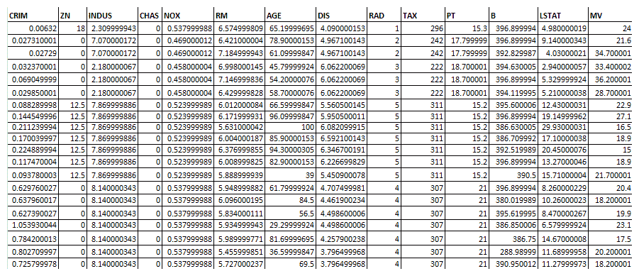
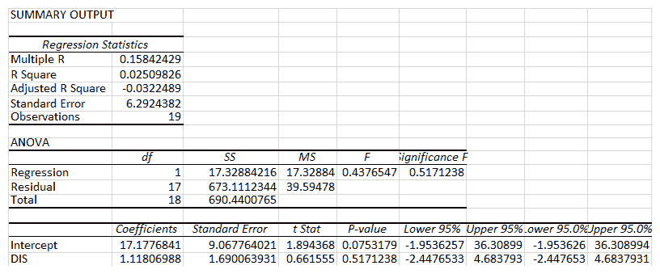
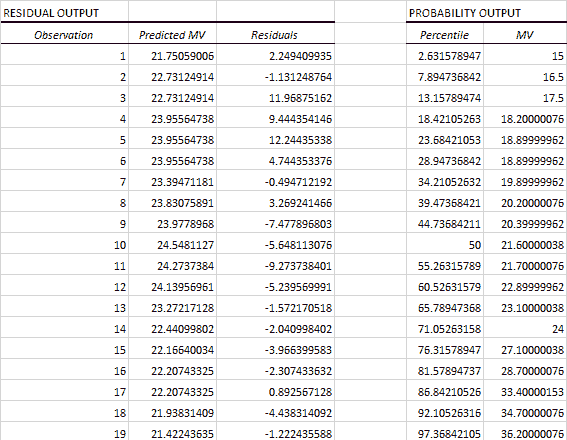
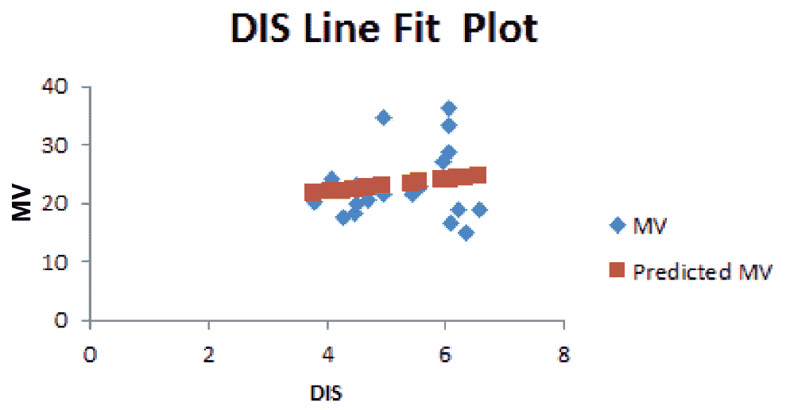
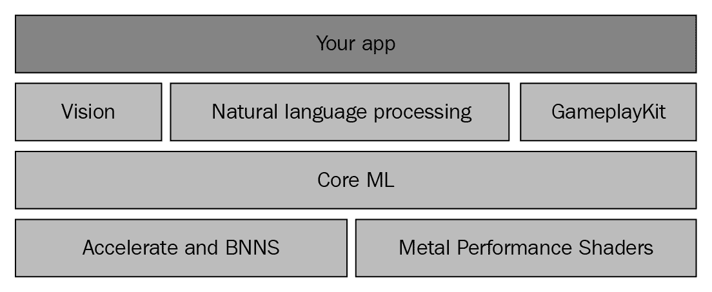
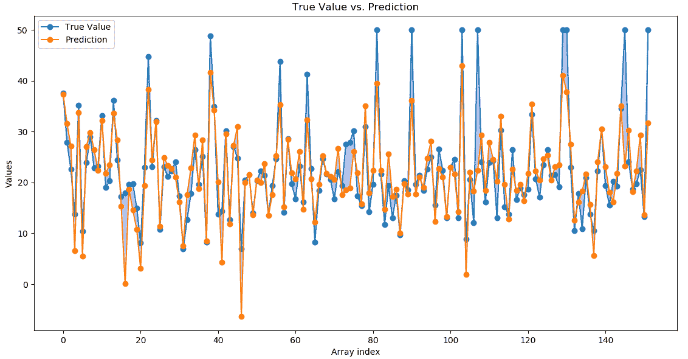
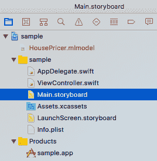
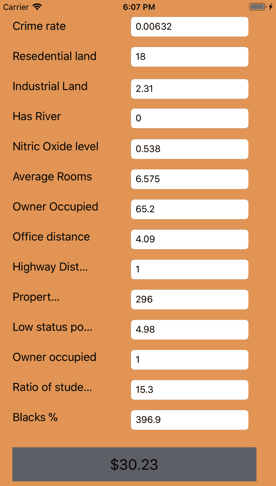

# 五、在 iOS 中使用核心 ML 执行回归

本章将为您提供回归算法的概述和对 Core ML 基础知识的深入了解，并将向您介绍如何创建一个利用回归算法的机器学习程序，以及如何使用 iOS 中的 Core ML 来预测给定的一组住房相关数据的房价。

正如我们在[第一章](51fcaf51-eb68-4493-afc2-0b02f1c1d50e.xhtml)、*移动机器学习简介*中已经看到的，任何机器学习程序都有四个阶段。我们将看到我们将在四个阶段中涵盖什么，以及我们将使用什么工具来解决底层的机器学习问题。

**问题定义**:提供了某个区域的房屋信息，我们想预测该区域一套房屋的中值。

我们将在本章中讨论以下主题:

*   理解什么是回归以及如何应用它来解决一个 ML 问题
*   使用示例数据集和 Excel 了解回归
*   了解核心 ML 的基础知识
*   在核心 ML 中使用回归解决问题:
    *   技术要求
    *   如何使用 scikit-learn 创建模型文件
    *   测试模型
    *   了解如何将 scikit-learn 模型导入到核心 ML 项目中
    *   编写一个 iOS 移动应用，在其中使用 scikit-learn 模型，并进行房价预测


# 回归导论

回归分析是数据统计分析中的一种基本方法。这是一种统计方法，有助于发现变量之间的关系。它主要用于理解输入和输出数值变量之间的关系。我们应该首先确定因变量，它会根据自变量的值而变化。例如，房子的价值(因变量)根据房子的平方英尺(自变量)而变化。回归分析对预测非常有用。

在一个简单的回归问题中(单个 *x* 和单个 *y* ，模型的形式如下:

*y = A + B*x*

在更高的维度中，当我们有多个输入( *x* )时，这条线被称为**平面**或**超平面**。

在我们的示例中，我们根据可能影响特定区域数据价格的各种参数来预测房屋价格。

以下是解决回归问题时要考虑的一些要点:

*   预测是一个数字量。
*   输入变量可以是实值或离散变量。
*   如果有多个输入变量，则称之为**多元回归问题**。
*   当输入变量按时间排序时，回归问题称为**时间序列预测问题**。
*   回归不应与分类混淆。分类是预测离散类别标签的任务，而回归是预测连续数量的任务。

能够学习回归预测模型的算法被称为**回归算法**。


# 线性回归

在本节中，我们将通过一个具体数据集的详细示例来理解线性回归。我们也将使用相同的数据集来解决 iOS Core ML 示例。


# 资料组

我们将使用波士顿数据集来解决回归问题。该数据集包含由美国人口普查局收集的关于马萨诸塞州波士顿地区住房的信息。它是从 StatLib 档案(【http://lib.stat.cmu.edu/datasets/boston】T4)中获得的，并在整个文献中被广泛用于基准算法。数据集很小，只有 506 个案例。


# 数据集命名

这个数据集的名字就叫做**波士顿**。它有两个拍照任务:现在，其中一氧化氮水平将被预测；和价格，其中房屋的中值被预测。

关于数据集的其他详细信息如下:

*   **由来**:波士顿住房数据的由来是自然的。
*   **用途**:该数据集可用于评估。
*   **病例数**:数据集共包含 506 个病例。
*   **顺序**:案件的顺序很神秘。
*   **变量**:数据集的每个案例有 14 个属性。它们是:
    *   **CRIM** :城镇人均犯罪率
    *   ZN :面积超过 25，000 平方英尺的住宅用地比例
    *   印度河流域:每个城镇非零售商业用地的比例
    *   **CHAS** :查尔斯河虚拟变量(1 如果区域边界为河流；否则为 0)
    *   **NOX** :氮氧化物浓度(百万分之一)
    *   RM :每套住宅的平均房间数
    *   **楼龄**:1940 年以前建造的自住单元的比例
    *   **DIS** :到五个波士顿就业中心的加权距离
    *   **RAD** :放射状公路可达性指标
    *   **税**:每万美元的全价值财产税税率
    *   **PTRATIO** :一个镇的学生教师比
    *   **B** : `1000(Bk - 0.63)^2`其中`Bk`是一个城镇的黑人比例
    *   **LSTAT** :人口中地位较低的百分比
    *   MEDV:以 1000 美元计算的自有住房的中值

我们将尝试使用 Excel 对数据集进行简单的线性回归和多元回归，并了解细节。出于分析目的，我们将仅考虑来自波士顿数据集的 506 样本数据空间中的以下 20 个数据元素:



现在，我们可以使用 Excel 中给出的数据分析选项，尝试仅考虑因变量`DIS`来预测`MV`。在数据分析中，选择`Regression`，选择`MV`作为`Y`值，选择`DIS`作为`X`值。这是一个简单的回归，用一个因变量来预测产量。以下是 Excel 生成的输出:



以`DIS`为因变量预测`MV`的线性回归方程为*Y = 1.11 x+17.17*(`DIS`的`DIS`系数+截距值):

*R2 =0.0250*

现在，我们可以看到`MV`对考虑用于分析的 20 个数据样本的预测输出:



因变量`DIS`预测的`MV`输出图如下:



现在，我们了解了线性回归对单个因变量的作用。同样，我们可以有任意数量的因变量，通过将它们包括为 *X1* 、 *X2* 、 *X3* 、... *XN*

在我们的数据集中，我们总共有 14 个变量，我们可以让`MV`依赖于所有剩余的 13 个变量，并以与之前为单个变量指定的相同方式创建回归方程。

现在我们已经了解了如何使用 Excel 对波士顿数据集执行回归，我们将使用 Core ML 执行同样的操作。在继续进行并在 Core ML 中实现之前，我们必须了解什么是 Core ML，并研究 Core ML 的基础知识。


# 了解核心 ML 的基础知识

Core ML 支持 iOS 移动应用在移动设备上本地运行机器学习模型。它使开发人员能够将各种各样的机器学习模型集成到移动应用中。开发人员使用 Core ML 编写机器学习移动应用不需要广泛的机器学习或深度学习知识。他们只需要知道如何像其他资源一样将 ML 模型包含到移动应用中，并在移动应用中调用它。数据科学家或机器学习专家可以用他们熟悉的任何技术创建 ML 模型，比如 Keras、scikit-learn 等等。Core ML 提供了一些工具，可以将使用其他工具(tensor、scikit-learn 等)创建的 ML 数据模型转换成 Core ML 规定的格式。

这种向核心 ML 模型的转换发生在应用开发阶段。当应用正在使用时，它不会实时发生。转换是通过使用`coremltools` Python 库完成的。当应用反序列化一个核心 ML 模型时，它就变成了一个具有`prediction`方法的对象。核心 ML 并不是真的用于训练，只是用于运行预训练的模型。

Core ML 支持广泛的深度学习能力，支持超过 30 层。深度学习中的层实际上暗示了数据转换的层数。它还支持标准模型:树集成、支持向量机和线性模型。它建立在金属等底层技术之上。Core ML 无缝地利用 CPU 和 GPU 来提供最大的性能和效率。它能够根据手头任务的强度在 CPU 和 GPU 之间切换。由于 Core ML 允许机器学习在设备上本地运行，数据不需要离开设备进行分析。

借助 Core ML，我们可以将经过训练的机器学习模型集成到我们的应用中:


经过训练的模型是将机器学习算法应用于一组训练数据的结果。该模型根据新的输入数据进行预测。例如，在给定卧室和浴室数量的情况下，在一个地区的历史房价中训练的模型可能能够预测房子的价格。

Core ML 针对片上性能进行了优化，最大限度地减少了内存占用和功耗。严格在设备上运行可确保用户数据的隐私，并保证我们的应用在网络连接不可用时仍能正常工作和响应。

核心 ML 是特定领域框架和功能的基础。Core ML 支持**视觉**进行图像分析，**自然语言处理**的基础，以及 **G** **ameplaykit** 评估学习过的决策树。 **Core ML** 本身构建于底层原语之上，如 **Accelerate** 和 **BNNS** ，以及**金属性能着色器**:



打算使用 Core ML 编写 ML 程序的 iOS 开发人员需要了解以下基本步骤:

1.  在 iOS 之外创建模型。这可以使用 scikit-learn、TensorFlow 或开发人员认为合适的任何其他方式来完成。创建机器学习模型文件。为了创建机器学习模型文件，他们需要知道已经讨论过的机器学习的四个关键阶段。
2.  一旦模型被构建、测试并准备好使用，这个模型需要被转换成与 Core ML 兼容的格式。Core ML 工具实际上有助于将使用任何工具创建的模型文件转换成 Core ML 规定格式的模型文件(`.mlmodel`文件格式)。
3.  一旦创建了核心 ML 特定的模型文件，就可以将其导入到 iOS 程序中，并且核心 ML 提供的 API 可以用于与模型文件进行交互，以提取 iOS 应用可能需要的所需信息，基本上是将`.mlmodel`文件导入到 Xcode 项目的`resources`文件夹中。

Core ML 最大的优势就是使用起来极其简单。仅仅几行代码就可以帮助集成一个完整的 ML 模型。Core ML 只能帮助将预训练的ML 模型集成到应用中。没有模特培训是不可能的。


# 在核心 ML 中使用回归解决问题

本节将详细介绍如何创建回归模型，然后在 iOS 移动应用中使用回归模型。它将详细介绍创建 iOS 回归 ML 应用以解决所定义问题的各个步骤。


# 技术要求

开发人员计算机上需要安装以下软件:

*   计算机编程语言
*   Mac 环境中的 Xcode

本章的练习程序可以从我们的 GitHub 资源库下载，网址是[https://GitHub . com/packt publishing/Machine-Learning-for-Mobile/tree/master/housing % 20 price % 20 prediction](https://github.com/PacktPublishing/Machine-Learning-for-Mobile/tree/master/housing%20price%20prediction)。

在下面的程序中，我们将使用`pandas`、`numpy`和`scikit-learn`来创建模型。因此，从命令提示符/终端使用以下命令从`pip`包管理器安装这些包:

```
pip install scikit-learn
pip install numpy
pip install pandas
```

为了将创建的模型转换成 Core ML 格式，我们需要使用 Apple 提供的 Core ML `scikit-learn` Python 转换器:

```
pip install -U coremltools
```


# 如何使用 scikit-learn 创建模型文件

本节将解释我们如何使用`scikit-learn`创建线性回归模型文件，并将其转换成与 Core ML 兼容的`.mlmodel`文件。我们将使用波士顿数据集来创建模型。下面是一个简单的 Python 程序，它使用波士顿数据集使用`scikit-learn`创建了一个简单的线性回归模型。然后核心 ML 工具将它转换成与核心 ML 兼容的模型文件。让我们详细地看一下这个程序。

首先，我们需要导入程序所需的包:

```
# importing required packages
 import numpy as np
```

前面几行导入 NumPy 包。NumPy 是使用 Python 进行科学计算的基础包。它包含了一个强大的 N 维数组对象。这个`numpy`数组将在这个程序中用于存储数据集，它有 14 个维度:

```
import pandas as pd
 from pandas.core import series
```

前面的代码行导入了`pandas`包，这是一个开源的、BSD 许可的库，为 Python 编程语言提供了高性能、易于使用的数据结构和数据分析工具。使用熊猫，我们可以创建一个数据框。您可以假设一个`pandas`数据框是一个 Excel 电子表格，其中每个工作表都有标题和数据:

```
import coremltools
 from coremltools.converters.sklearn import _linear_regression
```

前面几行导入了我们在这个程序中使用的线性回归模型的核心 ML Tools 转换包。Core ML Tools 是一个 Python 包，用于创建、检查和测试`.mlmodel`格式的模型。特别是，它可用于执行以下操作:

*   将现有模型从流行的机器学习工具转换成`.mlmodel`格式，包括`Keras`、`Caffe`、`scikit-learn`、`libsvm`和`XGBoost`
*   通过简单的 API 以`.mlmodel`格式表达模型
*   使用`.mlmodel`进行预测(在用于测试目的的选定平台上):

```
from sklearn import datasets, linear_model
 from sklearn.metrics import mean_squared_error, r2_score
```

前面几行导入了`sklearn`包。数据集用于导入`sklearn`包中的内置数据集。在本程序中，我们将使用上一节中介绍的波士顿房价数据集。`linear_model`包用于访问线性回归函数，度量包用于计算我们模型的测试度量，例如均方误差:

```
boston = datasets.load_boston()
```

前面一行从`sklearn`数据集包中加载波士顿数据集:

```
 bos = pd.DataFrame(boston.data)
```

现在，我们需要从整个数据集中提取数据:

```

 bos.columns = boston.feature_names
```

获取列名，即该数据的标题:

```
bos['price'] = boston.target
```

现在，让我们定义我们想要预测的目标列。定义为目标的列将是要预测的列:

```
 x = bos.drop('price', axis=1)
```

一旦我们定义了目标列，我们将从目标列中删除数据，这样它就变成了`x`:

```
 y = bos.price
```

由于我们将价格定义为目标列，`y`是数据集数据中的价格列:

```
 X_train,X_test,Y_train,Y_test = sklearn.model_selection.train_test_split(x,y,test_size=0.3,random_state=5)
```

然后，我们按照 70/30 规则将数据分为训练数据和测试数据:

```
 lm = sklearn.linear_model.LinearRegression() 
```

一旦我们有了训练和测试数据，我们就可以启动一个线性回归对象:

```
 lm.fit(X_train, Y_train)
```

使用已经初始化的线性回归对象，我们只需将训练和测试数据输入回归模型:

```
Y_pred = lm.predict(X_test)
```

前面一行预测了目标:

```
mse = sklearn.metrics.mean_squared_error(Y_test, Y_pred)
print(mse);
```

前面几行将计算拟合模型和预测结果的均方误差。

因为回归预测模型预测一个数量，模型的技巧必须在那些预测中被报告为一个错误。

评估回归预测模型技巧的方法有很多，但最常见的是计算**均方根误差** ( **RMSE** )。

例如，如果一个回归预测模型做出了两个预测，其中一个预测为 *1.5* ，预期值为 *1.0* ，另一个预测为 3.3，预期值为 *3.0* ，则 *RMSE* 将如下所示:

| 一 | *RMSE = sqrt(average(error^2)】* |
| 2 | *RMSE = sqrt((1.0-1.5)^2+(3.0-3.3)^2)/2)* |
| 3 | *RMSE = sqrt((0.25+0.09)/2)* |
| 四 | *RMSE = sqrt(0.17)* |
| 5 | *RMSE = 0.412* |

*RMSE* 的一个好处是误差分数的单位与预测值的单位相同:

```
 model = coremltools.converters.sklearn.convert(
     sk_obj=lm,input_features=boston.feature_names,
     output_feature_names='price')
```

在前一行中，我们将拟合模型转换为核心 ML 格式。基本上，这是创建`.mlmodel`文件的那一行。我们还指定了输入和输出列名:

```
 model.save('HousePricer.mlmodel')
```

在前一行中，我们将模型保存到磁盘上。这可以在我们的 iOS 程序中使用。


# 运行和测试模型

当由`scikit-learn`创建的模型在转换成核心 ML 格式之前被独立执行和测试时，发现了以下方差和均方误差:

*   准备好的模型的均方误差为`30.703232`
*   差异分数为`0.68`
*   该过程以退出代码`0`结束

下图给出了预测值与实际值的对比:




# 将模型导入 iOS 项目

下面是 Xcode 项目的项目结构，其中`.mlmodel`文件被导入并用于预测:



`ViewCcontroller.swift`文件是使用创建的模型文件的地方，住房预测在移动应用中执行。

`housePricer.mlmodel`文件是使用`scikit-learn`创建的模型文件，并使用核心 ML 转换器工具转换成 ML 模型文件。这个文件包含在 iOS Xcode 项目的`resources`文件夹中。


# 编写 iOS 应用

本节提供了使用`.mlmodel`格式的模型并进行房价预测的`Swift`代码的详细信息:

```
//  ViewController.swift
import UIKit
import CoreML
class ViewController: UIViewController {
    let model = HousePricer()
```

这一行用于初始化我们已经导入到项目中的模型类。以下几行定义了文本字段的出口/变量，以便与之交互:

```
 @IBOutlet weak var crim: UITextField!
    @IBOutlet weak var zn: UITextField!
    @IBOutlet weak var price: UILabel!
    @IBOutlet weak var b: UITextField!
    @IBOutlet weak var ptratio: UITextField!
    @IBOutlet weak var medv: UITextField!
    @IBOutlet weak var lstat: UITextField!
    @IBOutlet weak var rad: UITextField!
    @IBOutlet weak var tax: UITextField!
    @IBOutlet weak var dis: UITextField!
    @IBOutlet weak var age: UITextField!
    @IBOutlet weak var rm: UITextField!
    @IBOutlet weak var nox: UITextField!
    @IBOutlet weak var chas: UITextField!
    @IBOutlet weak var indus: UITextField!
    override func didReceiveMemoryWarning() {
        super.didReceiveMemoryWarning()
        // Dispose of any resources that can be recreated.
    }
    override func viewDidLoad() {
        super.viewDidLoad();
        updated(rad);
    }
    @IBAction func updated(_ sender: Any) {
        guard let modeloutput = try? model.prediction(CRIM: Double(crim.text!)!, ZN: Double(zn.text!)!, INDUS: Double(indus.text!)!, CHAS: Double(chas.text!)!, NOX: Double(nox.text!)!, RM: Double(rm.text!)!, AGE: Double(age.text!)!, DIS: Double(dis.text!)!, RAD: Double(rad.text!)!, TAX: Double(tax.text!)!, PTRATIO: Double(ptratio.text!)!, B: Double(b.text!)!, LSTAT: Double(lstat.text!)!) else {
            fatalError("unexpected runtime error")
     }
        price.text = "$" + String(format: "%.2f",modeloutput.price);
    }
}
```

前面的函数作为`onchange`监听器添加到所有前面的文本字段。在这里，我们使用我们之前创建的模型对象，并预测文本字段中给定值的价格。


# 运行 iOS 应用

创建的 Xcode 项目在模拟器中执行，以下是我们获得的示例:




# 进一步阅读

我们可以通过访问 Core ML 的官方网站[https://developer.apple.com/documentation/coreml](https://developer.apple.com/documentation/coreml)，更深入地了解其提供的服务。


# 摘要

在本章中，我们讨论了以下主题:

*   **线性回归**:理解算法，并使用 Excel 表格对 Boston housing 数据集进行实现。
*   Core ML :我们详细介绍了 Core ML 及其提供的各种特性。
*   **使用 Core ML 实现线性回归的示例应用**:我们采用波士顿住房数据集，使用 Core ML 为 iOS 移动应用实现线性回归模型，并在移动应用中查看结果。