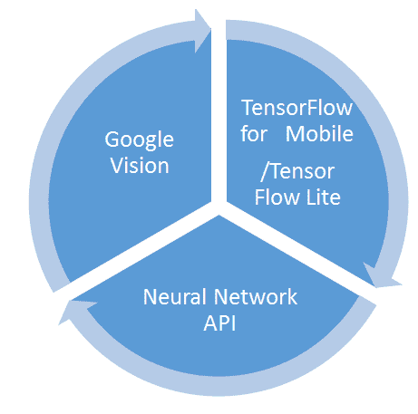
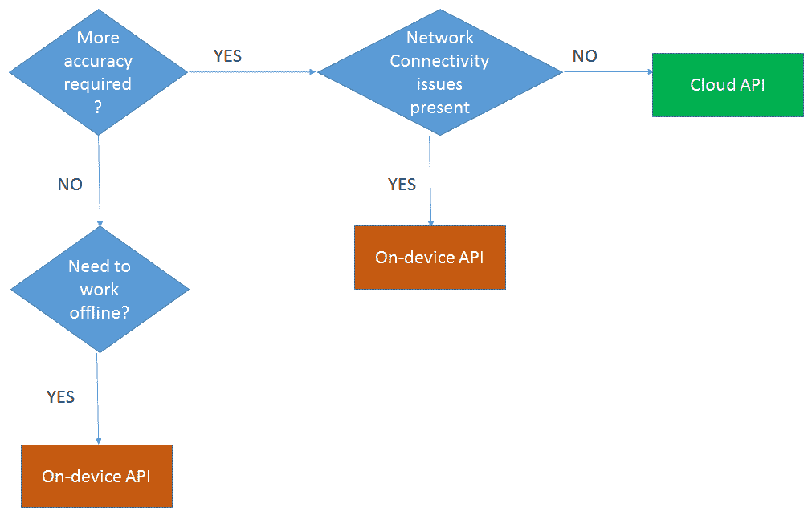
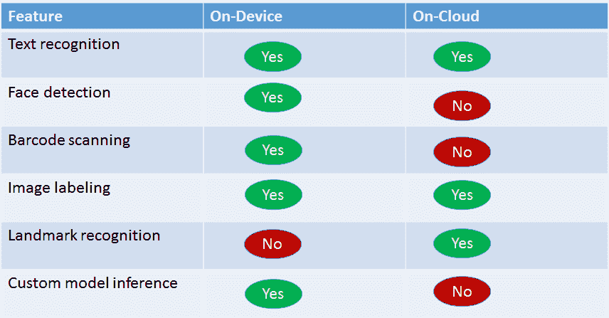
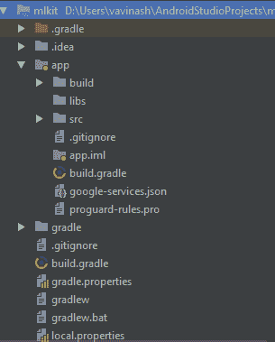
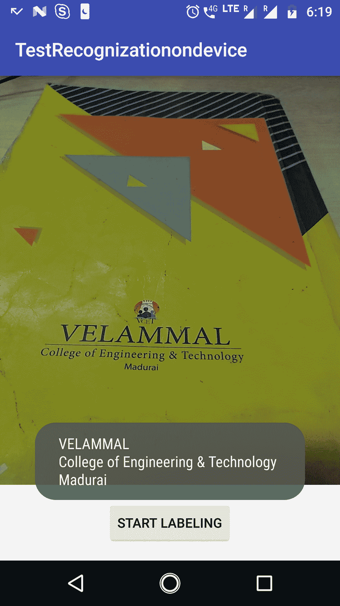
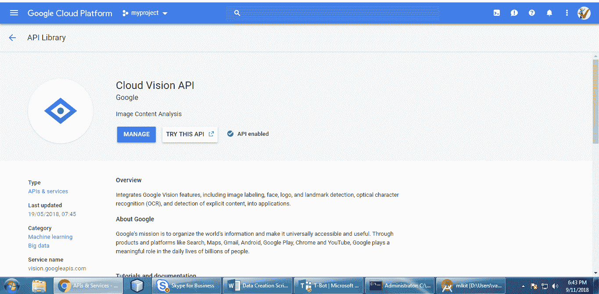
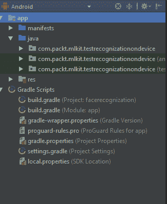
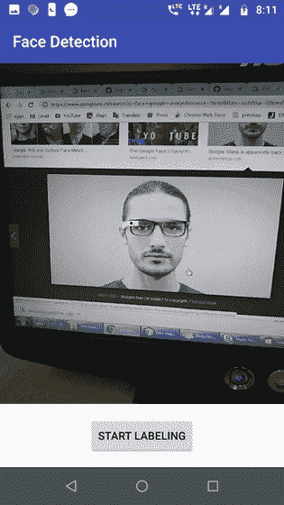
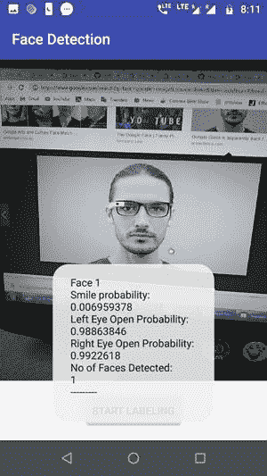

<title>The ML Kit SDK</title> 

# ML 套件 SDK

在本章中，我们将讨论由 Firebase 在 Google I/O 2018 上公布的 ML Kit。这个 SDK 将谷歌的移动机器学习产品打包在一个保护伞下。

移动应用程序开发人员可能希望在他们的移动应用程序中实现需要机器学习功能的功能。然而，他们可能不知道机器学习概念以及哪些算法用于哪些场景，如何建立模型，训练模型等等。

ML Kit 试图通过识别移动设备环境中机器学习的所有潜在用例，并提供现成的 API 来解决这个问题。如果将正确的输入传递给它们，则接收到所需的输出，无需进一步编码。

此外，该工具包支持将输入传递给离线工作的设备上的 API，或者传递给云中托管的在线 API。

最重要的是，ML Kit 还为具有机器学习专业知识的开发人员提供了选项，允许他们使用 TensorFlow/TensorFlow Lite 构建自己的模型，然后将它们导入到应用程序中，并使用 ML Kit APIs 调用它们。

ML Kit 还提供了更多有用的特性，比如模型升级和监控功能(如果使用 Firebase 托管的话)。

我们将在本章中讨论以下主题:

*   ML 试剂盒及其特点
*   使用 ML 试剂盒设备上 API 创建图像标签样本
*   使用 ML Kit cloud APIs 创建相同的示例
*   创建人脸检测应用程序

<title>Understanding ML Kit</title> 

# 了解 ML 套件

ML Kit 包含了 Google 现有的所有在移动设备上进行机器学习的产品。它将 Google Cloud Vision API、TensorFlow Lite 和 Android 神经网络 API 捆绑在单个 SDK 中，如下所示:



ML Kit 使开发人员能够以非常简单的方式在 Android 和 iOS 应用程序的移动应用程序中利用机器学习。可以通过调用设备上或云上的 API 来进行推断。

设备上的 API 的优点是它们完全离线工作，并且更安全，因为没有数据被发送到云中。相比之下，云上 API 确实需要网络连接，并且确实将数据发送到设备之外，但是允许更高的准确性。

ML Kit 提供的 API 涵盖了移动应用程序开发人员可能需要的以下机器学习场景:

*   图像标注
*   文本识别
*   地标检测
*   人脸检测
*   条形码扫描

所有这些 API 都是使用复杂的机器学习算法实现的。然而，这些细节被包装起来了。移动开发者不需要了解用于实现这些 API 的算法的细节；所有需要做的就是将所需的数据传递给 SDK，作为回报，将接收到正确的输出，这取决于使用的是 ML 工具包的哪一部分。

如果提供的 API 没有涵盖特定的用例，您可以构建自己的 TensorFlow Lite 模型。ML Kit 将帮助托管该模型，并将其提供给移动应用程序。

由于 Firebase ML Kit 提供了设备上和云上的功能，开发人员可以根据手头的具体问题，提出创新的解决方案来利用其中之一或两者。他们需要知道的是，设备上的 API 速度很快，可以离线工作，而云 API 利用谷歌云平台来提供更高精度的预测。

下图描述了在选择基于设备还是基于云的 API 时需要考虑的问题:



<title>ML Kit APIs</title> 

# ML 试剂盒 API

并非 ML Kit 提供的所有 API 都在设备上和云模式下受支持。下表显示了每种模式下支持的 API:



让我们来看看每个 API 的细节。

<title>Text recognition</title> 

# 文本识别

ML Kit 的文本识别 API 有助于使用移动设备摄像头识别任何基于拉丁语的语言的文本。它们在设备上和云上都可用。

设备上的 API 允许识别稀疏文本或图像中存在的文本。cloud API 做同样的事情，但是也允许识别大量文本，比如文档中的文本。云 API 还支持比设备 API 更多的语言识别。

这些 API 的可能用例是识别图像中的文本，扫描图像中可能嵌入的字符，或者自动化繁琐的数据输入。

<title>Face detection</title> 

# 人脸检测

ML 套件的人脸检测 API 允许检测图像或视频中的人脸。一旦检测到面部，我们可以应用以下改进:

*   **地标检测**:确定人脸内的特定兴趣点(地标)，如眼睛
*   **分类**:根据某些特征对人脸进行分类，比如眼睛是睁着还是闭着
*   **人脸跟踪**:在不同帧的视频中识别并跟踪同一张人脸(不同位置)

人脸检测只能在设备上实时完成。移动设备应用可能有许多使用案例，其中相机捕捉图像并基于地标或分类对其进行处理，以生成自拍、头像等。

<title>Barcode scanning</title> 

# 条形码扫描

ML Kit 的条形码扫描 API 有助于读取使用大多数标准条形码格式编码的数据。它支持 Codabar、Code 39、Code 93、Code 128、EAN-8、EAN-13、ITF、UPC-A 或 UPC-E 等线性格式，以及 Aztec、Data Matrix、PDF417 或 QR 码等二维格式。

无论条形码的方向如何，API 都可以识别和扫描条形码。任何存储为条形码的结构化数据都可以被识别。

<title>Image labeling</title> 

# 图像标注

ML Kit 的图像标记 API 有助于识别图像中的实体。不需要为该实体识别提供任何其他元数据信息。图像标记让我们深入了解图像的内容。ML Kit API 提供了图像中的实体，以及每个实体的置信度得分。

图像标注在设备上和云上都可用，区别在于支持的标签数量。设备上的 API 支持大约 400 个标签，而基于云的 API 支持多达 10，000 个标签。

<title>Landmark recognition</title> 

# 地标识别

ML Kit 的地标识别 API 有助于识别图像中众所周知的地标。

当给定一个图像作为输入时，这个 API 将提供在图像中找到的地标以及地理坐标和区域信息。还为地标返回知识图实体 ID。该 ID 是唯一标识被识别的地标的字符串。

<title>Custom model inference</title> 

# 自定义模型推理

如果现成提供的 API 不足以满足您的用例，ML Kit 还提供了创建您自己的定制模型并通过 ML Kit 部署它的选项。

<title>Creating a text recognition app using Firebase on-device APIs</title> 

# 使用 Firebase on-device APIs 创建文本识别应用程序

要开始使用 ML Kit，您需要登录您的 Google 帐户，激活您的 Firebase 帐户，并创建一个 Firebase 项目。请遵循以下步骤:

*   去 https://firebase.google.com/.
*   如果您尚未登录，请登录您的 Google 帐户。
*   单击菜单栏中的转到控制台。
*   单击“添加项目”创建一个项目并打开它。

现在打开 Android Studio，创建一个包含空活动的项目。记下您在创建项目时给出的应用程序包名称—例如，`com.packt.mlkit.textrecognizationondevice`。

接下来，转到 Firebase 控制台。在项目概述菜单中，单击添加应用程序并提供所需信息。它会给你一个 JSON 文件来下载。在 Android Studio 的项目视图中添加到您的项目的 app 文件夹中，如以下截图所示:



接下来，将以下代码行添加到清单文件中:

```
<uses-feature android:name="android.hardware.camera2.full" /<
<uses-permission android:name="android.permission.CAMERA" /<
<uses-permission android:name="android.permission.INTERNET" /<
<uses-permission android:name="android.permission.WRITE_EXTERNAL_STORAGE" /<
<uses-permission android:name="android.permission.READ_EXTERNAL_STORAGE" /<
```

我们需要这些权限才能让我们的应用程序工作。下一行告诉 Firebase 依赖项从 Google 服务器下载**文本识别** ( **OCR** )模型，并将其保存在设备中以供推断:

```
<meta-data
   android:name="com.google.firebase.ml.vision.DEPENDENCIES"
    android:value="ocr" /<
```

整个清单文件将如下所示:

```
<?xml version="1.0" encoding="utf-8"?<
<manifest xmlns:android="http://schemas.android.com/apk/res/android"
    package="com.packt.mlkit.testrecognizationondevice"<

    <uses-feature android:name="android.hardware.camera2.full" /<
    <uses-permission android:name="android.permission.CAMERA" /<
    <uses-permission android:name="android.permission.INTERNET" /<
    <uses-permission android:name="android.permission.WRITE_EXTERNAL_STORAGE" /<
    <uses-permission android:name="android.permission.READ_EXTERNAL_STORAGE" /<
    <application
        android:allowBackup="true"
        android:icon="@mipmap/ic_launcher"
        android:label="@string/app_name"
        android:roundIcon="@mipmap/ic_launcher_round"
        android:supportsRtl="true"
        android:theme="@style/AppTheme"<

        <meta-data
            android:name="com.google.firebase.ml.vision.DEPENDENCIES"
            android:value="ocr" /<

        <activity android:name=".MainActivity"<
            <intent-filter<
                <action android:name="android.intent.action.MAIN" /<

                <category android:name="android.intent.category.LAUNCHER" /<
            </intent-filter<
        </activity<
    </application<

</manifest<
```

现在，我们需要将 Firebase 依赖项添加到项目中。为此，我们需要将下面几行添加到项目`build.gradle`文件中:

```
buildscript {

    repositories {
        google()
        jcenter()
    }
    dependencies {
        classpath 'com.android.tools.build:gradle:3.1.4' //this version will defer dependeds on your environment.
        classpath 'com.google.gms:google-services:4.0.1'

        // NOTE: Do not place your application dependencies here; they belong
        // in the individual module build.gradle files
    }
}
```

然后打开模块 app `build.gradle`文件，并添加如下依赖项:

```
implementation 'com.google.firebase:firebase-ml-vision:17.0.0'
implementation 'com.google.firebase:firebase-core:16.0.3'
```

另外，在该文件的底部添加以下行:

```
apply plugin: 'com.google.gms.google-services'
```

现在，在布局文件中，编写下面的`.xml`代码来定义元素:

```
<?xml version="1.0" encoding="utf-8"?<
<RelativeLayout xmlns:android="http://schemas.android.com/apk/res/android"
    xmlns:tools="http://schemas.android.com/tools"
    android:layout_width="match_parent"
    android:layout_height="match_parent"
    tools:context="(main activity)"< <!-- Here your fully qualified main activity class name will come. --<

    <TextureView
        android:id="@+id/preview"
        android:layout_width="match_parent"
        android:layout_height="wrap_content"
        android:layout_above="@id/btn_takepic"
        android:layout_alignParentTop="true"/<

    <Button
        android:id="@+id/btn_takepic"
        android:layout_width="wrap_content"
        android:layout_height="wrap_content"
        android:layout_alignParentBottom="true"
        android:layout_centerHorizontal="true"
        android:layout_marginBottom="16dp"
        android:layout_marginTop="16dp"
        android:text="Start Labeling"
        /<
</RelativeLayout<
```

现在，是时候编写应用程序的主活动类了。

请从位于[https://Github . com/Packt publishing/Machine-Learning-for-Mobile/tree/master/ml kit](https://github.com/PacktPublishing/Machine-Learning-for-Mobile/tree/master/mlkit)的 Packt Github 库下载应用程序代码。

我们假设您已经熟悉 Android——因此，我们正在讨论使用 Firebase 功能的代码:

```
import com.google.firebase.FirebaseApp;
import com.google.firebase.ml.vision.FirebaseVision;
import com.google.firebase.ml.vision.common.FirebaseVisionImage;
import com.google.firebase.ml.vision.text.FirebaseVisionTextRecognizer;
import com.google.firebase.ml.vision.text.*;
```

前面的代码将导入 firebase 库。

```
private FirebaseVisionTextRecognizer textRecognizer;
```

前一行将声明 firebase 文本识别器。

```
FirebaseApp fapp= FirebaseApp.initializeApp(getBaseContext());
```

前面一行将初始化 Firebase 应用程序上下文。

```
        textRecognizer = FirebaseVision.getInstance().getOnDeviceTextRecognizer();
```

前面一行将获取设备上的文本识别器。

```
       takePictureButton.setOnClickListener(new View.OnClickListener() {
            @Override
            public void onClick(View v) {
                takePicture();
                //In this function we are having the code to decode the characters in the picture
            }
        });
    }
```

前面的代码片段为拍照按钮注册了点击事件侦听器。

```
Bitmap bmp = BitmapFactory.decodeByteArray(bytes,0,bytes.length);
```

从字节数组创建位图。

```
FirebaseVisionImage firebase_image = FirebaseVisionImage.fromBitmap(bmp);
```

前面一行创建了一个 firebase image 对象来通过识别器。

```
 textRecognizer.processImage(firebase_image)
```

前面一行将创建的图像对象传递给识别器进行处理。

```
.addOnSuccessListener(new OnSuccessListener<FirebaseVisionText<() {
                                    @Override
                                    public void onSuccess(FirebaseVisionText result) {
//On receiving the results displaying to the user.                                       Toast.makeText(getApplicationContext(),result.getText(),Toast.LENGTH_LONG).show();
                                    }
                                })
```

前面的代码块将添加成功时侦听器。它将接收一个 firebase vision 文本对象，然后以`Toast`消息的形式显示给用户。

```
.addOnFailureListener(
            new OnFailureListener() {
                @Override
                public void onFailure(@NonNull Exception e) 
                    {
                        Toast.makeText(getApplicationContext(),"Unable to read the text",Toast.LENGTH_LONG).show();
                    }
                  });
```

前面的代码块将添加`on-failure`监听器。它将接收一个异常对象，该对象又以`Toast`消息的形式向用户显示错误消息。

当您运行上述代码时，您的设备中将会有以下输出:



请注意，安装此应用程序时，您必须连接到互联网，因为 Firebase 需要将模型下载到您的设备上。

<title>Creating a text recognition app using Firebase on-cloud APIs</title> 

# 使用 Firebase on-cloud API 创建文本识别应用程序

在本节中，我们将把设备上的应用程序转换为云应用程序。不同之处在于，设备上的应用程序下载模型并将其存储在设备上。这使得推断时间更短，允许应用程序快速做出预测。

相比之下，基于云的应用程序将图像上传到谷歌服务器，这意味着推理将在那里发生。如果你没有连接到互联网，它就不能工作。

在这种情况下，为什么要使用基于云的模型？因为在设备上，这种模式的空间和处理硬件有限，而谷歌的服务器是可扩展的。谷歌云文本识别器模型也能够解码多种语言。

要开始使用，您需要订阅 Google Cloud。请遵循以下步骤:

*   转到您的 Firebase 项目控制台
*   在左侧的菜单中，您将看到您当前在 Spark 计划中(自由层)
*   点击升级，并按照说明升级到 Blaze 计划，即现收现付
*   您需要提供信用卡或支付详情以进行验证，这些不会自动收费
*   一旦您订阅，您将每月免费收到 1，000 个 Cloud Vision API 请求

只有当您拥有升级的 Blaze 计划而非免费等级帐户时，才能尝试此计划。给出了创建升级帐户的步骤，请按照步骤让帐户尝试给定的程序。

默认情况下，您的项目未启用云视野。要做到这一点，你需要去以下链接:[https://console . cloud . Google . com/APIs/library/vision . Google APIs . com/？authuser=0](https://console.cloud.google.com/apis/library/vision.googleapis.com/?authuser=0) 。在顶部的下拉菜单中，选择包含您在上一节中添加的 Android 应用程序的 Firebase 项目。

单击启用为您的应用启用此功能。该页面将类似于下面的屏幕截图:



现在返回到您的代码，并进行以下更改。

您可以在我们的 Packt Github 存储库中找到应用程序代码:[https://Github . com/Packt publishing/Machine-Learning-for-Mobile/tree/master/testrecognitiononcloud](https://github.com/PacktPublishing/Machine-Learning-for-Mobile/tree/master/Testrecognizationoncloud)。

除了主活动之外，所有其他文件都没有变化。

这些变化如下:

```
import com.google.firebase.FirebaseApp;
import com.google.firebase.ml.vision.FirebaseVision;
import com.google.firebase.ml.vision.common.FirebaseVisionImage;
import com.google.firebase.ml.vision.document.FirebaseVisionDocumentText;
import com.google.firebase.ml.vision.document.FirebaseVisionDocumentTextRecognizer; 
```

现在，我们需要将前面的包作为依赖项导入。

```
 private FirebaseVisionDocumentTextRecognizer textRecognizer;
```

前面的代码将声明文档文本识别器。

```
textRecognizer = FirebaseVision.getInstance().getCloudDocumentTextRecognizer();
```

前面的代码实例化并分配云文本识别器。

```
       takePictureButton.setOnClickListener(new View.OnClickListener() {
            @Override
            public void onClick(View v) {
                takePicture();
                //In this function we are having the code to decode the characters in the picture
            }
        });
    }
```

前面的代码为拍照按钮注册了点击事件侦听器。

```
Bitmap bmp = BitmapFactory.decodeByteArray(bytes,0,bytes.length);
```

前面一行从字节数组创建了一个位图。

```
FirebaseVisionImage firebase_image = FirebaseVisionImage.fromBitmap(bmp);
```

前面一行创建了一个 firebase image 对象来通过识别器。

```
 textRecognizer.processImage(firebase_image)
```

前面一行将创建的图像对象传递给识别器进行处理。

```
.addOnSuccessListener(new OnSuccessListener<FirebaseVisionDocumentText<() {
                                    @Override
                                    public void onSuccess(FirebaseVisionDocumentText result) {
                                        Toast.makeText(getApplicationContext(),result.getText(),Toast.LENGTH_LONG).show();
                                    }
                                })
```

前面的代码块将添加成功时侦听器。它将接收一个 FirebaseVision 文档文本对象，然后以一条`Toast`消息的形式显示给用户。

```
.addOnFailureListener(
            new OnFailureListener() {
                @Override
                public void onFailure(@NonNull Exception e) 
                    {
                        Toast.makeText(getApplicationContext(),"Unable to read the text",Toast.LENGTH_LONG).show();
                    }
                  });
```

前面的代码块将添加失败时侦听器。它将接收一个异常对象，该异常对象又以`Toast`消息的形式向用户显示错误消息。

```
Once you run the code with the internet-connected device , you will get the same output as before, but from the cloud.
```

<title>Face detection using ML Kit</title> 

# 使用 ML 工具包进行人脸检测

现在，我们将尝试了解面部检测如何与 ML Kit 一起工作。人脸检测，以前是移动视觉 API 的一部分，现在已经移动到 ML Kit。

<title>Face detection concepts</title> 

# 人脸检测概念

谷歌开发者页面将人脸检测定义为在视觉媒体(数字图像或视频)中自动定位和检测人脸的过程。检测到的面部在具有相关尺寸和方向的位置被报告。在检测到面部之后，我们可以搜索面部中存在的标志，例如眼睛和鼻子。

在我们继续使用 ML Kit 对人脸检测进行编程之前，需要了解一些重要术语:

*   **面部朝向**:检测不同角度范围内的面部。
*   **人脸识别**:判断两张脸是否可以属于同一个人。
*   **人脸跟踪**:检测视频中的人脸。
*   **地标**:指人脸内的兴趣点。这对应于面部的显著特征，例如右眼、左眼和鼻根。
*   **分类**:确定有无面部特征，如睁开或闭上眼睛、微笑或严肃的脸。

<title>Sample solution for face detection using ML Kit</title> 

# 使用 ML 试剂盒进行面部检测的样品溶液

现在打开 Android Studio，创建一个包含空活动的项目。记下您在创建项目时给出的应用程序包名称—例如，`com.packt.mlkit.facerecognization`。

这里我们将修改文本识别代码来预测人脸。所以，我们不改变包名和其他东西。只是代码变了。项目结构与前面所示的相同:



是时候编写应用程序的主活动类了。首先，我们需要从位于[https://GitHub . com/Packt publishing/Machine-Learning-for-Mobile/tree/master/face recognition](https://github.com/PacktPublishing/Machine-Learning-for-Mobile/tree/master/facerecognization)的 Packt GitHub 资源库下载应用程序代码。并在 Android Studio 中打开项目。

然后，我们将把下面几行代码添加到 Gradle 依赖项中。打开模块 app 的`build.gradle`文件，添加以下依赖项:

```
implementation 'com.google.android.gms:play-services-vision:11.4.0'
implementation 'com.android.support.constraint:constraint-layout:1.0.2'
```

现在，我们将添加导入语句来处理人脸检测:

```
import com.google.android.gms.vision.Frame;
import com.google.android.gms.vision.face.Face;
import com.google.android.gms.vision.face.FaceDetector;
```

下面的语句将声明`FaceDetector`对象:

```
private FaceDetector detector;
```

现在我们将创建一个对象，并将其分配给声明的检测器:

```
detector = new FaceDetector.Builder(getApplicationContext())
 .setTrackingEnabled(false)
 .setLandmarkType(FaceDetector.ALL_LANDMARKS)
 .setClassificationType(FaceDetector.ALL_CLASSIFICATIONS)
 .build();
```

我们声明了一个 string 对象来保存给用户的预测消息:

```
String scanResults = "";
```

在这里，我们将检查检测器是否可操作；我们还有一个从相机中获得的位图对象:

```
if (detector.isOperational() && bmp != null) {
```

然后我们创建一个帧对象，这个`FaceDetector`类检测方法需要预测人脸信息:

```
Frame frame = new Frame.Builder().setBitmap(bmp).build();SparseArray<Face> faces = detector.detect(frame);
```

一旦检测成功，它将返回人脸对象数组。下面的代码将每个`nface`对象拥有的信息附加到我们的结果字符串中:

```
for (int index = 0; index < faces.size(); ++index) {
    Face face = faces.valueAt(index);
    scanResults += "Face " + (index + 1) + "\n";
    scanResults += "Smile probability:" + "\n" ;
    scanResults += String.valueOf(face.getIsSmilingProbability()) + "\n";          scanResults += "Left Eye Open Probability: " + "\n";
    scanResults += String.valueOf(face.getIsLeftEyeOpenProbability()) + "\n";
    scanResults += "Right Eye Open Probability: " + "\n";
    scanResults += String.valueOf(face.getIsRightEyeOpenProbability()) + "\n";
}
```

如果没有面返回，将显示以下错误消息:

```
if (faces.size() == 0) {
    scanResults += "Scan Failed: Found nothing to scan";
 } 
```

如果面部大小不是`0`，这意味着它已经通过了`for`循环，该循环将面部信息附加到我们的结果文本中。现在，我们将添加面的总数，并结束结果字符串:

```
else {
    scanResults += "No of Faces Detected: " + "\n";
    scanResults += String.valueOf(faces.size()) + 
   \n";
    scanResults += "---------" + "\n";
}
```

如果检测机无法运行，将向用户显示如下错误信息:

```
else {
    scanResults += "Could not set up the detector!";
}
```

最后，下面的代码将向读者显示结果:

```
Toast.makeText(getApplicationContext(),scanResults,Toast.LENGTH_LONG).show();
```

<title>Running the app</title> 

# 运行应用程序

现在该运行应用程序了。为此，您必须通过手机中的 USB 调试选项将手机连接到桌面，并安装应用程序:



运行该应用程序时，您将获得以下输出:



<title>Summary</title> 

# 摘要

在本章中，我们讨论了 Firebase 在 Google I/O 2018 上公布的 ML Kit SDK。我们讨论了 ML Kit 提供的不同 API，比如图像标签、文本识别、地标检测等等。然后，我们使用设备上的 API 创建了一个文本识别应用程序，然后使用云上的 API。我们还通过对文本识别应用程序进行微小的修改来创建一个人脸检测应用程序。在下一章，我们将学习垃圾邮件分类器，并为 iOS 构建一个这样的分类器的示例实现。