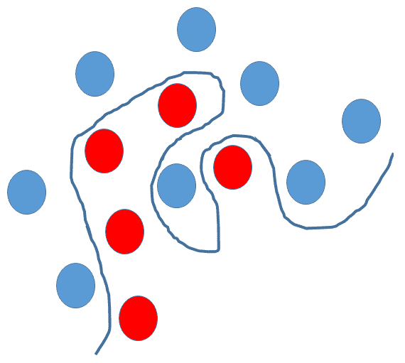
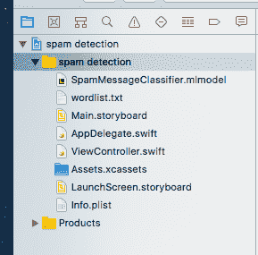
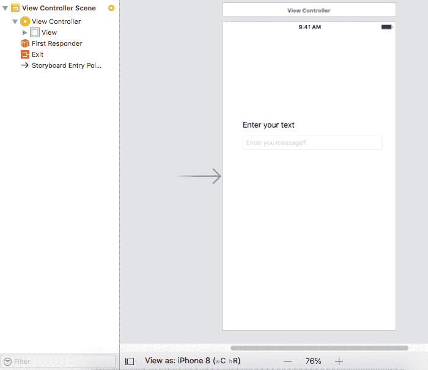

# 七、垃圾邮件检测

本章将为您提供关于**自然语言处理** ( **NLP** )的概述，并讨论 NLP 如何与机器学习相结合来提供问题的解决方案。然后，结合线性 SVM 分类模型，利用自然语言处理进行垃圾邮件检测。该程序将被实现为一个移动应用，使用 iOS 的核心 ML。

为了在机器学习算法中处理文本，我们将通过各种 NLP 技术来处理文本数据，使其为学习算法做好准备。一旦文本准备好了，我们将看到如何使用线性 SVM 模型对其进行分类。

**问题定义**:提供了群发短信数据，需要将这些短信归类为垃圾短信或非垃圾短信。

我们将在本章中讨论以下主题:

*   了解 NLP
*   了解线性 SVM 算法
*   在核心 ML 中使用线性 SVM 解决问题:
    *   技术要求
    *   如何使用 scikit-learn 创建模型文件
    *   测试模型
    *   将 scikit-learn 模型导入核心 ML 项目
    *   编写一个 iOS 移动应用，使用其中的 scikit-learn 模型，并进行垃圾消息检测


# 了解 NLP

NLP 是一个很大的话题，详细讨论这个话题超出了本书的范围。但是，在本节中，我们将详细介绍 NLP 的高级细节，并尝试理解使用 NLP 准备和处理文本数据所需的关键概念，以便为机器学习算法的预测消费做好准备。


# NLP 简介

每天都会产生大量的非结构化文本数据。社交媒体、Twitter 和脸书等网站以及 WhatsApp 等通信应用每天都会产生大量的非结构化数据，更不用说博客、新闻文章、产品评论、服务评论、广告、电子邮件和短信所产生的数据量了。所以，总结一下，有**庞大的数据**(TBS 中)。

然而，计算机不可能从这些数据中获得任何洞察，也不可能直接从这些庞大的数据中基于这些洞察来执行特定的操作，原因如下:

*   数据是非结构化的
*   未经预处理的数据不能被直接理解
*   这些数据不能以未经处理的形式直接输入任何 ML 算法

为了使这些数据更有意义，并从中获取信息，我们使用了 NLP。专注于人类语言和计算机之间互动的研究领域被称为 **NLP** 。NLP 是数据科学的一个分支，与计算语言学密切相关。它涉及计算机科学——从基于人类自然语言的数据中分析、理解和推导信息，这些数据通常是非结构化的，如文本、语音等。

通过 NLP，计算机可以从人类语言中分析和推导出意义，并做许多有用的事情。通过利用 NLP，可以完成许多复杂的任务，例如大型文档的自动摘要、翻译、不同数量的非结构化数据之间的关系提取、情感分析和语音识别。

为了让计算机理解和分析人类语言，我们需要以更结构化的方式分析句子，并理解其核心。在任何一句话中，我们都需要理解三个核心的东西:

*   **语义信息**:这和句子的意思有关。这是单词在句子中的具体含义，例如，*的 k* *的老五苍蝇*。在这里，我们不知道风筝是人造的还是鸟。
*   **句法信息**:这与句子的结构有关。这是一个句子中单词的特定句法含义。Sreeja 看见 Geetha 拿着糖果。在这里，我们不确定谁有糖果:Sreeja 还是 Geetha？
*   **语用信息(语境)**:这与句子的语境(语言或非语言)有关。这是使用句子中单词的特定上下文。例如，*他出局*在棒球和医疗保健的背景下就不同了。

然而，计算机不能像人类一样分析和识别句子。因此，有一种明确定义的方法使计算机能够执行文本处理。以下是该练习中涉及的主要步骤:

1.  **预处理**:这一步处理从句子中去除所有的噪音，因此句子上下文中唯一关键的信息被保留下来用于下一步。例如，语言停止词(“噪声”)，如*是*、*是*或*是*，可以从句子中删除，以便进一步处理。当处理句子时，人类的大脑不会考虑语言中存在的噪音。类似地，计算机可以输入无声的文本进行进一步处理。
2.  **特征工程**:对于计算机处理预处理后的文本，需要知道句子的关键特征。这是通过特征工程步骤完成的。
3.  **NLP 处理**:将人类语言转换成特征矩阵后，计算机可以进行 NLP 处理，可以是分类、情感分析，也可以是文本匹配。

现在，让我们试着理解在这些步骤中的每一步将执行的高级活动。


# 文本预处理技术

在我们能够处理文本之前，它需要被预处理。预处理将处理以下内容:

*   从所考虑的文本中去除噪声
*   使句子规范化
*   规范句子

根据需求，可以有额外的步骤，例如语法检查或拼写检查。


# 消除噪音

句子中出现的任何可能与数据上下文无关的文本都可以被称为噪声。

例如，这可以包括语言停用词(一种语言中常用的词——*是*、*是*、*是*、的*、*中的*)、URL 或链接、社交媒体实体(提及、标签)和标点符号。*

为了从句子中去除噪声，一般的方法是维护一个噪声词的字典，然后根据这个字典遍历所考虑的句子的标记，并去除匹配的停用词。噪声词词典经常更新，以涵盖所有可能的噪声。


# 正常化

句子中单词的差异被转换成归一化形式。一个句子中的单词可能会有所不同，例如*唱*、*唱*、*唱*或*唱*，但它们都或多或少地适合同一上下文，并且可以被标准化。

规范化句子有不同的方法:

*   **词干提取:**从一个单词中去除后缀( *-ing* 、 *-ly* 、 *-es* 、 *-s* )的一个基于规则的基本过程。
*   **词汇化:**识别单词词根形式的更复杂的过程。它涉及到验证语义和语法的更复杂的过程。


# 标准化

这一步包括对句子进行标准化，以确保它只包含来自标准语言词典的标记，而不包含任何其他内容，比如标签、口语词等等。所有这些都在这一步中被删除。


# 特征工程

既然文本已经被处理，下一步是从文本中排列特征，以便它们可以被输入到任何机器学习算法中来执行分类、聚类等等。有多种方法可以将文本转换成特征矩阵，我们将在这一节中介绍其中的一些方法。


# 实体提取

这里，从句子中提取将用于 NLP 处理的关键实体。**命名实体识别** ( **NER** )就是这样一种方法，其中实体可以是命名实体，如地名、人名或纪念碑。


# 主题建模

这是另一种方法，从文本语料库中识别主题。主题可以是单个单词、单词模式或共现单词序列。基于主题中的一些单词，这些可以被称为 **N-Gram。**因此，基于上下文和可重复性，二元模型和三元模型可以用作特征。


# 词袋模型

单词袋模型是描述单词在文档中出现的文本表示。它包括已知单词的表示和已知单词在文档中存在的度量。该模型更多地以文档中已知单词的出现为中心，而不是关于单词的顺序或单词在文档中的结构。


# 统计工程

也可以使用各种技术将文本数据表示为数值。对于一个巨大的文本文档语料库，术语频率-逆文档频率 ( **TF-IDF** )是这类中的一个重要技术。


# TF–IDF

TF-IDF 是一种加权模型，用于根据单词在文档中的出现次数将文本文档转换为矢量模型，而不考虑文本在文档中的确切顺序。

让我们考虑一组 N 个文本文档和任意一个文档是 d。然后，我们定义如下。


# 法国南部（French Southern Territories 的缩写）

这衡量一个术语在文档中出现的频率。由于每个文档都有不同的长度，所以一个术语在长文档中出现的次数可能比短文档多。于是，TF 往往除以文档长度来归一化:
*TF(t) =(术语 t 在文档中出现的次数(D))/(文档中的总术语数(N))* 。


# 反向文档频率(IDF)

这衡量了一个术语对语料库的重要性。在计算 TF 时，所有项都被认为是同等重要的。然而，人们普遍认为停用词出现的频率更高，但就 NLP 而言，它们并不那么重要。因此，有必要降低常用术语的重要性，提高稀有术语的重要性，因此 IDF 的计算如下:

*IDF(t) = log_e(文档总数/包含术语 t 的文档数)*


# TF-IDF

TF IDF 公式给出了语料库(文档列表)中术语的相对重要性，由以下公式给出:


其中:

*   *tf* [*i，j*]= j 中 *i* 出现的次数
*   *df[I]=包含 *i* 的文档数*
*   *N* =文件总数

考虑一个包含 1000 个单词的文档，其中单词 rat 出现了 3 次。rat 的**项频率** ( **TF** )则为(3/1000=) 0.003。现在，在 10000 个文档中，有 1000 个文档中出现了 cat 这个词。因此，**逆文档频率** ( **IDF** )计算为 log(10000/1000) = 1。因此，TF-IDF 重量是这些量的乘积，为 0.003 * 1 = 0.12。

文本语料库中的单词或特征也可以被组织为特征向量，以便于输入到 NLP 处理的下一步。


# 对文本进行分类/聚类

最后一步是使用特征工程矩阵或词向量实际执行分类或聚类。我们可以使用任何分类算法并输入特征向量来进行分类或聚类。

类似于执行聚类，可以使用不同的相似性度量，例如余弦距离或 Levenshtein 距离。


# 理解线性 SVM 算法

在第二章、*监督和非监督学习算法*中，我们介绍了 SVM 算法，现在对 SVM 模型的工作原理有了一个概念。线性支持向量机或线性 SVM 是一种线性分类器，它试图找到一个具有最大余量的超平面，将输入空间分成两个区域。

超平面是平面的推广。在一维中，超平面被称为**点**。在二维中，它是一条线。在三维空间中，它是一个平面。在更多的维度上，你可以称之为超平面。

正如我们看到的，SVM 的目标是识别超平面，该超平面试图找到将输入空间分成两个区域的最大边缘。如果输入空间是线性可分的，就很容易把它们分开。然而，在现实生活中，我们发现输入空间是非常非线性的:



在前面的场景中，SVM 可以帮助我们通过使用所谓的**内核技巧**来分离红色和蓝色的球，这是一种使用线性分类器来解决非线性问题的方法。

将核函数应用于每个数据实例，以将原始非线性观察值映射到高维空间中，在该空间中它们变得可分离。

最流行的可用内核函数如下:

*   线性核
*   多项式核
*   RBF(高斯)核
*   字符串内核

线性核通常被推荐用于文本分类，因为大多数文本分类问题需要被分为两类。在我们的示例中，我们还想将 SMS 消息分为垃圾消息和非垃圾消息。


# 在核心 ML 中使用线性 SVM 解决问题

在本节中，我们将使用本章中介绍的所有概念来研究如何解决垃圾邮件检测问题。

我们将获取一堆短信，并尝试将其分类为垃圾短信或非垃圾短信。这是一个分类问题，考虑到使用该算法进行文本分类的优点，我们将使用线性 SVM 算法来执行这个问题。

我们将使用 NLP 技术将数据 SMS 消息转换成特征向量，以馈入线性 SVM 算法。我们将使用 scikit-learn 矢量器方法将 SMS 消息转换为 TF-IDF 矢量，该矢量可以输入线性 SVM 模型以执行 SMS 垃圾邮件检测(分类为垃圾邮件和非垃圾邮件)。


# 关于数据

我们用来创建检测垃圾邮件的模型的数据来自[http://www.dt.fee.unicamp.br/~tiago/smsspamcollection/](http://www.dt.fee.unicamp.br/~tiago/smsspamcollection/)，其中包含 747 个垃圾邮件样本，以及 4，827 个非垃圾邮件。

这些邮件来自不同的来源，并标有垃圾邮件和非垃圾邮件的类别。如果在记事本或任何文本编辑器中打开下载的文件，它将采用以下格式:

```py
ham   What you doing?how are you?
ham   Ok lar... Joking wif u oni...
 ham   dun say so early hor... U c already then say...
 ham   MY NO. IN LUTON 0125698789 RING ME IF UR AROUND! H*
 ham   Siva is in hostel aha:-.
 ham   Cos i was out shopping with darren jus now n i called him 2 ask wat present he wan lor. Then he started guessing who i was wif n he finally guessed darren lor.
 spam  FreeMsg: Txt: CALL to No: 86888 & claim your reward of 3 hours talk time to use from your phone now! ubscribe6GBP/ mnth inc 3hrs 16 stop?txtStop
 spam  Sunshine Quiz! Win a super Sony DVD recorder if you can name the capital of Australia? Text MQUIZ to 82277\. B
 spam  URGENT! Your Mobile No 07808726822 was awarded a L2,000 Bonus Caller Prize on 02/09/03! This is our 2nd attempt to contact YOU! Call 0871-872-9758 BOX95QU
```

在前面的示例中，我们可以看到每一行都以类别名称开始，后面是实际的消息。


# 技术要求

要创建一个模型来将邮件分类为垃圾邮件或非垃圾邮件，我们需要一个能够做到这一点的库。在这里，我们选择了 scikit-Learn。

要编写这个应用，您需要在桌面上安装 Python3+版本，并且必须在 Mac 计算机上安装 Xcode 9+。如果你没有这两个，请查看本书的附录，了解如何获得它们。在您的机器上安装 Python 之后，执行以下命令来获取所需的包:

```py
pip install scikit-learn pip install numpy pip install coremltools pip install pandas
```

使用前面的代码，我们安装了 scikit-learn 来访问 scikit-learn 需要的算法和 NumPy，pandas ( *pandas* 是一个开源的、BSD 许可的库，为 Python 编程提供了高性能、易于使用的数据结构和数据分析工具)来从文件和 core-ML 工具中读取模型，以生成核心 ML 模型文件。

现在，下载`SMSSpamCollection.txt`，一个来自前一节所述的模型链接的纯文本文件，到您的磁盘上，并放在您的`project`文件夹中。


# 使用 Scikit Learn 创建模型文件

在项目文件夹中，使用以下代码创建一个 python 文件来创建模型文件:

```py
# importing required packages
import numpy as np
import pandas as pd
# Reading in and parsing data
raw_data = open('SMSSpamCollection.txt', 'r')
sms_data = []
for line in raw_data:
    split_line = line.split("\t")
    sms_data.append(split_line)

#Splitting data into messages and labels and training and test in y we are having labels and x with the message text

sms_data = np.array(sms_data)
X = sms_data[:, 1]
y = sms_data[:, 0]

#Build a LinearSVC model
from sklearn.feature_extraction.text import TfidfVectorizer
from sklearn.svm import LinearSVC

#Build tf-idf vector representation of data
vectorizer = TfidfVectorizer()

# converting the message text as vector
vectorized_text = vectorizer.fit_transform(X)

text_clf = LinearSVC()
# fitting the model
text_clf = text_clf.fit(vectorized_text, y)
```

测试拟合的模型，我们可以附加以下代码:

```py
print text_clf.predict(vectorizer.transform(["""XXXMobileMovieClub: To use your credit, click the WAP link in the next txt message or click here>> http://wap. xxxmobilemovieclub.com?n=QJKGIGHJJGCBL"""]))
```

在执行前面的程序时，它会显示给定的消息是垃圾邮件还是非垃圾邮件。


# 将 scikit-learn 模型转换为核心 ML 模型

在上一节中，我们创建了模型来将邮件分类为垃圾邮件和非垃圾邮件。现在，让我们将其转换为核心 ML 模型，以便我们可以在 IOS 应用中使用它。

要创建一个 core-ML 模型，在前面的代码中添加下面几行代码并运行它们。这将创建一个`.mlmodel`文件:

```py
# importing the library
import coremltools

# convert to fitted model in to coreml model
coreml_model = coremltools.converters.sklearn.convert(text_clf, "message", "spam_or_not")

#set parameters of the model
coreml_model.short_description = "Classify whether message is spam or not"
coreml_model.input_description["message"] = "TFIDF of message to be classified"
coreml_model.output_description["spam_or_not"] = "Whether message is spam or not"

#save the model
coreml_model.save("SpamMessageClassifier.mlmodel")
```

现在，您可以获取生成的`SpamMessageClassifier.mlmodel`文件并在 Xcode 中使用它。


# 编写 iOS 应用

您可以在我们的 GitHub 资源库([https://GitHub . com/packt publishing/Machine-Learning-for-Mobile](https://github.com/PacktPublishing/Machine-Learning-for-Mobile))中获得 iOS 项目的代码。下载项目并在 Xcode 中打开项目后，您会发现目录结构:



在此，我想向你解释一下这些重要的文件。主要的。故事板正在为应用进行用户界面设计:



这里，我们有两个标签、一个按钮和一个文本框。这两个标签是标题标签和结果标签。按钮提交输入并获得结果。我们有一个文本框来输入信息。这里，主要处理写在`controller.swift`视图中:

```py
//common imports
import UIKit
import CoreML

class ViewController: UIViewController {
    //binding to the UI elements
    @IBOutlet weak var messageTextField: UITextField!
    @IBOutlet weak var messageLabel: UILabel!
    @IBOutlet weak var spamLabel: UILabel!

// This function will take the text from the user input and convert it in to a vector format which our model requires using the wordslist.txt file and the SMSSpamCollection.txt file that we have downloaded.
    func tfidf(sms: String) -> MLMultiArray{
        //get path for files
        let wordsFile = Bundle.main.path(forResource: "wordlist", ofType: "txt")
        let smsFile = Bundle.main.path(forResource: "SMSSpamCollection", ofType: "txt")
        do {
            //read words file
            let wordsFileText = try String(contentsOfFile: wordsFile!, encoding: String.Encoding.utf8)
            var wordsData = wordsFileText.components(separatedBy: .newlines)
            wordsData.removeLast() // Trailing newline.
            //read spam collection file
            let smsFileText = try String(contentsOfFile: smsFile!, encoding: String.Encoding.utf8)
            var smsData = smsFileText.components(separatedBy: .newlines)
            smsData.removeLast() // Trailing newline.
            let wordsInMessage = sms.split(separator: " ")
            //create a multi-dimensional array
            let vectorized = try MLMultiArray(shape: [NSNumber(integerLiteral: wordsData.count)], dataType: MLMultiArrayDataType.double)
            for i in 0..<wordsData.count{
                let word = wordsData[i]
                if sms.contains(word){
                    var wordCount = 0
                    for substr in wordsInMessage{
                        if substr.elementsEqual(word){
                            wordCount += 1
                        }
                    }
                    let tf = Double(wordCount) / Double(wordsInMessage.count)
                    var docCount = 0
                    for sms in smsData{
                        if sms.contains(word) {
                            docCount += 1
                        }
                    }
                    let idf = log(Double(smsData.count) / Double(docCount))
                    vectorized[i] = NSNumber(value: tf * idf)
                } else {
                    vectorized[i] = 0.0
                }
            }
            return vectorized
        } catch {
            return MLMultiArray()
        }
    }
    override func viewDidLoad() {
        super.viewDidLoad()
        // Do any additional setup after loading the view, typically from a nib.
    }
//This function will call when you click the predict button
    @IBAction func predictSpam(_ sender: UIButton) {
        let enteredMessage =  messageTextField.text!
// checking and handling empty message.
        if (enteredMessage != ""){
            spamLabel.text = ""
        }
// Calling the preceding function to convert the text to vector
        let vec = tfidf(sms: enteredMessage)
        do {
// Passing input to the our model to get the prediction results.
            let prediction = try SpamMessageClassifier().prediction(message: vec).spam_or_not
            print (prediction)
            if (prediction == "spam"){
                spamLabel.text = "SPAM!"
            }

// Our model is having ham as label for not spam messages so our model will send the label as ham. Hence we are converting to Not Spam for displaying purpose
           else if(prediction == "ham"){
                spamLabel.text = "NOT SPAM"
            }
        }
        catch{
                // catching the exception
            spamLabel.text = "No Prediction"
        }
    }
}
```

当您在 Xcode 的模拟器中运行该应用时，它将生成以下结果:


# 摘要

在这一章中，我们经历了许多事情，例如，在高层次上理解 NLP。在 NLP 中涉及各种步骤，例如文本预处理，以及实现这一点的技术，例如特征工程和执行特征工程和特征向量的分类或聚类的方法。我们还研究了线性 SVM 算法，其中我们详细介绍了 SVM 算法、核函数以及它如何更适用于文本分类。

我们在核心 ML 中使用线性 SVM 解决了我们的问题，我们还看到了一个使用我们在 scikit learn 中开发并转换为核心 ML 模型的线性 SVM 算法模型执行垃圾邮件检测的实际示例。我们使用转换后的核心 ML 模型编写了一个 iOS 应用。

在下一章中，我们将介绍另一个 ML 框架 Fritz，它试图解决我们在模型部署和升级中看到的常见问题，以及跨移动 OS 平台处理 ML 模型的统一性。