# 九、移动神经网络

在[第二章](1b52495b-c6cb-4197-8fcd-a1e764c1f1c2.xhtml)、*监督和非监督学习算法、*中，当我们向您介绍 TensorFlow、其组件及其工作原理时，我们简要地讨论了**卷积神经网络**(**CNN**)及其工作原理。在这一章中，我们将深入研究神经网络的基本概念。我们将探索机器学习和神经网络之间的相似性和差异。

我们还将经历在移动设备上执行深度学习算法的一些挑战。我们将简要介绍可直接在移动设备上运行的各种深度学习和神经网络 SDK。在本章快结束时，我们将创建一个有趣的作业，利用张量流和核心 ML。

在本章中，我们将讨论以下主题:

*   创建张量流图像识别模型
*   将张量流模型转换成核心 ML 模型
*   创建利用核心 ML 模型的 iOS 移动应用
*   Keras 简介
*   创建手写数字识别解决方案

在这一章中，我们将实现本书中所有的主要主题。在继续之前，请确保您已经阅读了本书的所有章节。


# 神经网络导论

神经网络是模拟人脑中神经元操作的硬件和/或软件系统。神经网络背后的设计灵感来自人脑及其功能。让我们来了解一下人类大脑的设计。神经元是大脑的基本工作单位。这是一种特殊的细胞，可以将信息传递给其他神经细胞。大脑由大约 100000000000 个神经元组成。神经元的主要功能是处理和传递信息。


# 神经元的通讯步骤

神经元通信遵循四步路径:

*   神经元从外部环境或其他神经元接收信息。
*   神经元整合或处理来自其所有输入的信息，并确定是否发送输出信号。这种整合发生在时间(输入的持续时间和输入之间的时间)和空间(穿过神经元的表面)。
*   神经元沿着它的长度高速传播信号。
*   神经元将这种电信号转换为化学信号，并将其传递给另一个神经元或肌肉或腺体等效应。

为了更好地了解神经元——人类大脑的基本组成部分——是如何工作的，请查看[http://www . biology reference . com/Mo-Nu/neuron . html # ixzz 5 ZD 78 t97 u](http://www.biologyreference.com/Mo-Nu/Neuron.html#ixzz5ZD78t97u)。

现在，来看神经元的人工神经网络，这些神经元的功能是接受一些输入，并发出一个输出。


# 激活功能

为了明确地表达这一点，神经元是一个占位符函数，它接收输入，通过对输入应用函数来处理输入，并产生输出。任何简单的函数都可以放在定义的占位符中:

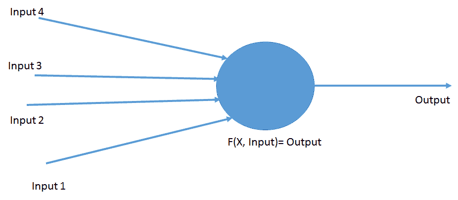

神经元中使用的功能通常被称为激活功能。在人体中，有三种类型的神经元:感觉神经元、运动神经元和中间神经元。在人工世界中，激活函数可能会产生神经元的不同能力和功能。

以下是一些常用的激活功能:

*   步骤
*   乙状结肠的
*   双曲正切
*   再整流
*   线性单元(主要用于深度学习)

深入研究每个函数的细节超出了本书的范围。然而，如果你想进一步研究神经网络，理解这些函数及其复杂性将对你有好处。


# 神经元的排列

我们来看看人体内神经元的排列。一个典型的神经元有几个树突，通常以极端分支的方式排列，以便与许多其他神经元建立联系。人体内的神经元也是分层排列的。这些层的数量在身体和大脑的不同部位有所不同，但通常在三到六层之间。

在人工世界中，这些神经元也是按层排列的。下图将帮助您理解神经元的组织:

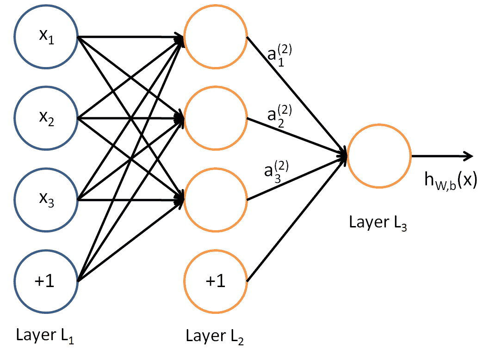

网络最左边的一层称为**输入层**，最右边的一层称为**输出层**。神经元的中间层被称为**隐藏层**，因为在训练集中没有观察到它的值。

在这个样本神经网络中，有三个输入、三个隐藏单元和一个输出单元。任何神经网络都至少有一个输入层和一个输出层。隐藏层的数量可以变化。

对于同一网络，每个隐藏层中使用的激活函数可以不同。这意味着同一网络的隐藏层 1 的激活函数和隐藏层 2 的 b 激活函数。


# 神经网络的类型

神经网络根据隐藏层的数量和每层中使用的激活函数而变化。以下是一些常见的神经网络类型:

*   **深度神经网络**:具有一个以上隐藏层的网络。

*   **CNN** :常用于计算机视觉相关的学习问题。CNN 隐藏层使用卷积函数作为激活函数。
*   **循环神经网络**:常用于自然语言处理相关问题。

改进移动设备中的神经网络领域中的当前项目/研究包括以下内容:

*   MobileNet
*   V2 移动网络
*   mnas net——在移动设备中实现强化学习


# 图像识别解决方案

想象你和你的朋友去一家餐馆。假设你是一个健身狂，虽然你来参加聚会是为了享受自助餐，但作为一个健身狂，你对卡路里很敏感，不想吃得太多。

现在，想象一下，你有一个移动应用来拯救你:它拍下这道菜的照片，识别它的成分，并计算食物的卡路里值！你可以给每一道菜拍张照，计算它的热量，然后决定是否把它放在你的盘子里。此外，这个应用不断学习你拍照的不同菜肴，并在这个行业中继续学习和掌握自己，以便它可以很好地照顾你的健康。

我能看到你眼中的光芒。没错，这就是我们本章要尝试的移动应用。我们还想利用 TensorFlow 和 Core ML 来完成这个活动。我们将执行以下步骤来创建我们刚才讨论的应用:

1.  创建张量流图像识别模型
2.  将其转换成一个`.ml`模型文件
3.  创建一个 iOS/SWIFT 应用来使用该模型

我们将在接下来的章节中详细介绍这些步骤。


# 创建张量流图像识别模型

TensorFlow 是一个开源软件库，用于跨一系列任务的数据流编程。它是一个符号数学库，也用于机器学习应用，如神经网络。它被用于谷歌的研究和生产，经常取代其封闭源代码的前身 DistBelief。TensorFlow 由谷歌大脑团队开发，供谷歌内部使用。2015 年 11 月 9 日在 Apache 2.0 开源许可下发布。

TensorFlow 是跨平台的。它几乎可以在任何东西上运行:GPU 和 CPUs 包括移动和嵌入式平台——甚至是**张量处理单元** ( **TPUs** )，这是执行张量数学的专用硬件。


# TensorFlow 是做什么的？

为了简单起见，我们假设您想要两个数字。现在，如果您想用常规编程语言(如 Python)编写程序，您可以使用以下代码:

*a = 1*

*b = 2*

*打印(a+b)*

如果您运行该程序，您将看到输出为 *3* ，然后您将在`tensorflow`上看到相同的实现:

```py
import tensorflow as tf
x = tf.constant(35, name='x')
y = tf.Variable(x + 5, name='y')
model = tf.global_variables_initializer()
with tf.Session() as session:
    session.run(model)
    print(session.run(y))
```

让我解释一下前面的代码。首先，我们创建一个节点名为`x`的常量，向其添加`5`，并将其存储在另一个变量/节点`y`中。如果此时你能看到 y 的控制台的输出，你会发现节点的定义，而不是 40 的值。

在这里，您定义了图的节点及其相应的操作。一旦初始化了变量，创建并获得了图的会话/实例，就可以使用图了。

下图将帮助您理解这一概念:

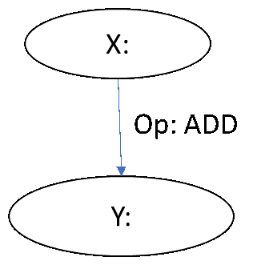

在 TensorFlow 中，我们将用来创建定义的所有常量、占位符和变量以及节点之间的链接将创建一个图，这就像面向对象编程中的类概念一样。把图想象成一个类，把节点想象成数据成员，`tf.globalvariableinitilizer()`想象成调用静态方法来初始化常量和变量，`session.run()`想象成调用类的构造函数。


# 重新训练模型

要创建一个图像分类器，我们需要经历很多事情，做很多编码。为了简单起见，我们将向您展示如何使用 Google Code Lab 提供的代码来创建它。以下内容摘自 Google 的代码实验室教程。

这是用 CNN 制作的。解释所有这些超出了本书的范围。在本章的介绍中，我们简要地探讨了 CNN。然而，与海洋相比，那是非常少的。更多信息，感兴趣的读者可以去 https://colah.github.io/posts/2014-07-Conv-Nets-Modular/看看。

让我们看看在`tensorflow`中创建一个图像分类器有多容易。首先，我们需要安装 anaconda，然后运行以下命令:

```py
conda create -n tensorflow pip python=3.6
```

运行上述命令后，您将得到以下提示:

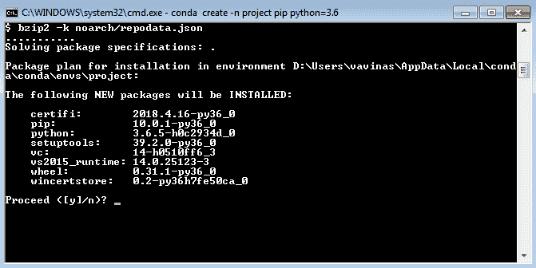

键入`y`继续。命令成功执行后，您将看到以下屏幕:

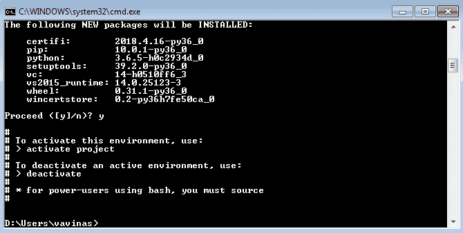

类型`activate`项目。一旦项目被激活，您将看到如下提示:

```py
(project) D:\Users\vavinas>
```

然后，键入以下命令:

```py
pip install tensorflow
```

使用以下命令验证已安装的软件包:

```py
pip list
```

它必须产生以下结果。如果您在计算机中没有看到这些软件包，请重新安装它们:

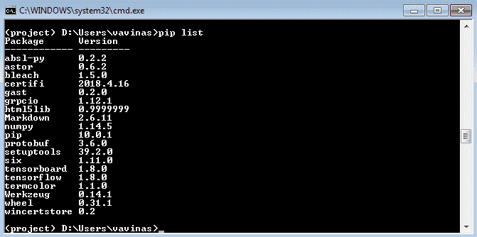

现在，我们已经成功安装了`tensorflow`及其依赖项。让我们从 Google Code Labs 获取代码来进行分类。为此，请确保您的机器上已经安装了 Git。有几种方法可以安装它，但最简单的方法是通过`npm`。

要检查 Git 是否正确安装，请在打开的命令提示符下键入`git`。您将看到该命令的所有可用选项。如果提示为`invalid command`，请尝试正确安装。现在，让我们执行命令来克隆存储库:

```py
 git clone https://github.com/googlecodelabs/tensorflow-for-poets-2
```

完成后，使用以下命令转到`tensorflow-for-poets-2`:

```py
cd tensorflow-for-poets-2
```

以下文件夹包含为图像识别训练模型所需的所有脚本。如果您检查`tf_file`文件夹，它将是空的。在这里，我们将使用此文件夹来保存训练图像，并使用 scripts 文件夹中的脚本来训练模型。

要输入图像，您需要首先下载图像。对于我们的示例，我们使用带有四个类别标签的食物图像。您可以从我们的 Git 资源库`project/food_photos`下载它，然后将该文件夹粘贴到`tf_files`中。如果您无法执行此命令，请在 Internet Explorer 中打开该文件夹，然后下载`tensorflow-for-poets-2/tf_files`中的文件。

将文件提取到平面文件中，如下所示:


现在，我们将使用以下脚本重新训练模型。执行以下命令:

```py
python -m scripts.retrain \
  --bottleneck_dir=tf_files/bottlenecks \
  --how_many_training_steps=500 \
  --model_dir=tf_files/models/ \
  --summaries_dir=tf_files/training_summaries/ mobilenet_0.50_224  \
  --output_graph=tf_files/retrained_graph.pb \
  --output_labels=tf_files/retrained_labels.txt \
  --architecture=mobilenet_0.50_224  \
  --image_dir=tf_files/food_photos
```

前面的 Python 脚本用于重新训练具有许多参数的模型，但我们将仅使用和讨论几个重要的参数，如下所示:

*   `bottleneck_dir`:这将把这些文件保存到瓶颈/目录。
*   这将是一个低于 4000 的数字。较高的数值会使您的模型更加精确，但是构建模型会花费太多时间，并且模型文件会太大。

*   `model_dir` : 这告诉我们保存模型的位置。
*   `summaries_dir`:包含训练总结。
*   `output_graph` : 保存输出图形的位置。这是我们将在手机中使用的合成模型。
*   `output_labels` : 这是保存类标签的文件。通常，图像的类别标签是文件夹名称。
*   `architecture` : 这告诉我们使用哪种架构。这里，我们使用的是 mobilenet 模型，模型的相对大小为 0.50，图像大小为 244。
*   `image_dir` : 输入图像目录，此处为`food_photos`。

执行前面的命令将得到以下输出:

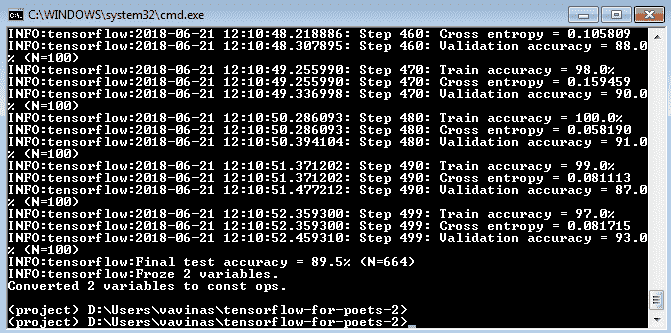


# 关于瓶颈

在这里，我们将试图理解再训练过程是如何工作的。我们使用的 ImageNet 模型是由许多层相互堆叠而成的。这些层是预先训练好的，并且已经有足够的信息来帮助图像分类。我们所要做的就是训练最后一层，`final_training_ops`，当所有前面的层重新训练它们已经训练过的状态。

以下截图摘自 TensorBoard。你可以在浏览器中打开 TensorBoard，以便更好地查看它。您可以在图表选项卡中找到它:

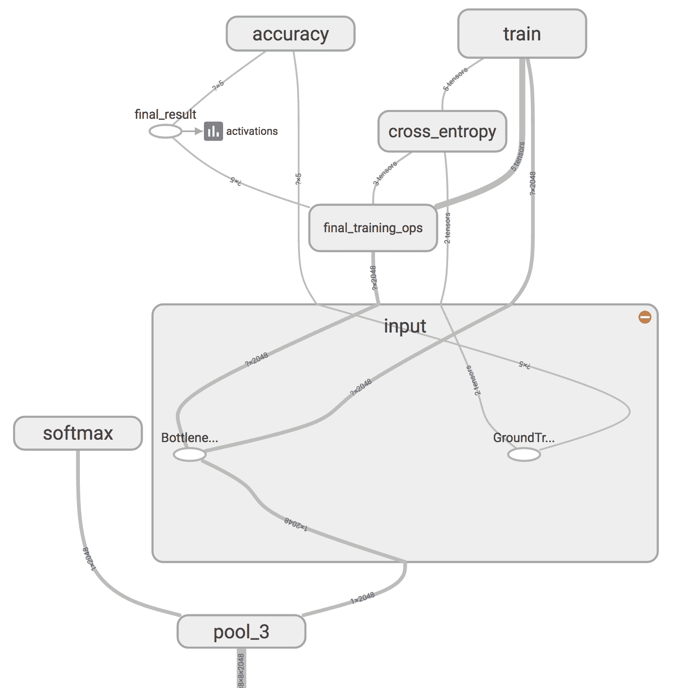

在上图中，左侧的 softmax 节点是原始模型的输出层。softmax 右侧的所有节点都是由重新训练脚本添加的。

请注意，这只有在重新训练脚本完成生成**瓶颈**文件之后才有效。

瓶颈是一个术语，指的是进行分类的最终输出图层之前的图层。瓶颈并不意味着它传统意义上的减慢整个过程的东西。我们使用术语“瓶颈”,因为在输出端附近，其表示比网络主体中的表示要紧凑得多。

在训练期间，每个图像被重复使用多次。为每个映像计算瓶颈背后的层需要大量时间。因为网络的这些较低层没有被修改，所以它们的输出可以被缓存和重用。现在，你手里有了 TensorFlow 再训练的模型。让我们使用以下命令来测试我们刚刚训练的模型:

```py
python -m scripts.label_image \
    --graph=tf_files/retrained_graph.pb  \
    --image=tf_files\food_photos\pizza\1.jpg
```

执行前面的代码块将给出食物图像所属的类。现在，让我们进入下一个任务:将`tensorflow`模型转换成核心的 ML 格式。


# 将张量流模型转换成核心 ML 模型

TensorFlow 团队开发了一个包，用于将 TensorFlow 中创建的模型转换为核心 ML，并在 iOS 应用中使用。要使用此功能，您必须在 macOS 上安装 Python 3.6 和 TensorFlow。使用这个，我们可以将 TensorFlow 模型文件(`.pb`)转换成核心 ML 格式(`.mlmodel`)。首先，您需要执行以下命令:

```py
Pip install tfcoreml
```

安装完成后，在 Python 文件中编写以下代码，将其命名为`inspect.py`，并保存它:

```py
import tensorflow as tf
from tensorflow.core.framework import graph_pb2
import time
import operator
import sys

def inspect(model_pb, output_txt_file):
    graph_def = graph_pb2.GraphDef()
    with open(model_pb, "rb") as f:
        graph_def.ParseFromString(f.read())

    tf.import_graph_def(graph_def)

    sess = tf.Session()
    OPS = sess.graph.get_operations()

    ops_dict = {}

    sys.stdout = open(output_txt_file, 'w')
    for i, op in enumerate(OPS):
        print('---------------------------------------------------------------------------------------------------------------------------------------------')
        print("{}: op name = {}, op type = ( {} ), inputs = {}, outputs = {}".format(i, op.name, op.type, ", ".join([x.name for x in op.inputs]), ", ".join([x.name for x in op.outputs])))
        print('@input shapes:')
        for x in op.inputs:
            print("name = {} : {}".format(x.name, x.get_shape()))
        print('@output shapes:')
        for x in op.outputs:
            print("name = {} : {}".format(x.name, x.get_shape()))
        if op.type in ops_dict:
            ops_dict[op.type] += 1
        else:
            ops_dict[op.type] = 1

    print('---------------------------------------------------------------------------------------------------------------------------------------------')
    sorted_ops_count = sorted(ops_dict.items(), key=operator.itemgetter(1))
    print('OPS counts:')
    for i in sorted_ops_count:
        print("{} : {}".format(i[0], i[1]))

if __name__ == "__main__":
    """
    Write a summary of the frozen TF graph to a text file.
    Summary includes op name, type, input and output names and shapes.

    Arguments
    ----------
    - path to the frozen .pb graph
    - path to the output .txt file where the summary is written

    Usage
    ----------
    python inspect_pb.py frozen.pb text_file.txt

    """
    if len(sys.argv) != 3:
        raise ValueError("Script expects two arguments. " +
              "Usage: python inspect_pb.py /path/to/the/frozen.pb /path/to/the/output/text/file.txt")
    inspect(sys.argv[1], sys.argv[2])
```

前面的代码将模型文件作为输入参数，并将所有操作和输入/输出节点名称以及描述保存在我们作为输入提供的文本文件中。要运行此命令，请输入以下命令:

```py
Python inspect.py retrained_graph.pb summeries.txt
```

在这个命令中，您正在执行之前保存的`inspect.py`代码。这也将输入从上一节获得的图形文件，以及要保存摘要的文本文件的路径。

一旦执行该命令，`summeries.txt`将与所有摘要一起创建，如下所示。这些将被添加到该文件中:

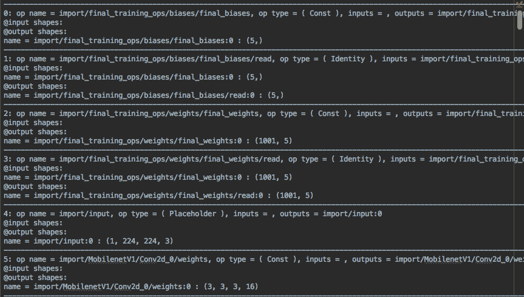

在这个文件中，你可以看到所有的操作，输入和输出名称，以及它们的形状；您还可以看到总体运算符:

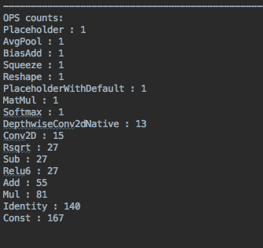

在文件的末尾，您会发现结束节点的定义；在我们的例子中，情况如下:


在这里，您可以看到结束节点操作类型是`Softmax`，它将产生的输出将存储在`final_result:0`名称中。现在，查看下面的代码块，它用于生成相应的核心 ML 模型:

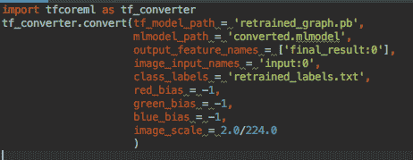

我们来详细了解一下前面的代码块。你一定注意到我们在第一行导入了`tfcoreml`包，然后使用了它的 **convert** 函数。以下是它的论据:

*   `Tf_model_path`:您在上一节中生成的(`.pb`)文件路径，*将 TensorFlow 模型转换为核心 ML 模型*。
*   `Mlmodel_path`:要生成模型的输出模型文件路径。
*   `Output_feature_names`:在这种情况下，我们将获得您从之前的文本文件中获得的输出变量名，该文本文件由我们的模型检查代码生成。
*   `Image_input_names`:您要为图像输入指定的名称。在核心 ML/iOS 中，这将是图像缓冲区。
*   `Class_labels`:这是您将在训练步骤中获得的文件。

一旦您运行了前面的代码，您将在您的目录中看到生成的`converted` `.mlmodel`文件。您可以将它导入 Xcode 项目并加以利用。


# 编写 iOS 移动应用

在本节中，我们将创建一个应用，利用我们创建的图像识别模型来预测使用 iOS 移动摄像头拍摄的图像。

首先，您需要一台运行 Xcode 版本 9+的 Mac PC。从 Git 存储库中下载源代码(x-code 项目),并导航到项目文件夹。在 Xcode 中打开`recognition.xcodeproj`图像。以下屏幕截图显示了项目的文件夹结构:

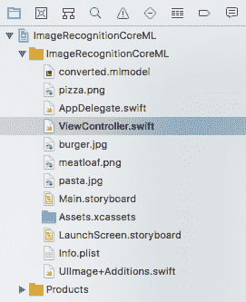

我们要查看的主文件是`con` `troller.swift`。它包含以下代码:

```py
import UIKit class ViewController: UIViewController {
 @IBOutlet weak var pictureImageView :UIImageView! @IBOutlet weak var titleLabel :UILabel!
```

这些是主情节提要中图像视图控件和标题标签控件的出口:

```py
private var model : converted = converted()
```

这是我们添加在上一节中创建的`core-ml`文件时生成的模型实例:

```py
 var content : [ String : String ] = [ "cheeseburger" : "A cheeseburger is a hamburger topped with cheese. Traditionally, the slice of cheese is placed on top of the meat patty, but the burger can include many variations in structure, ingredients, and composition.\nIt has 303 calories per 100 grams.", "carbonara" : "Carbonara is an Italian pasta dish from Rome made with egg, hard cheese, guanciale, and pepper. The recipe is not fixed by a specific type of hard cheese or pasta. The cheese is usually Pecorino Romano.", "meat loaf" : "Meatloaf is a dish of ground meat mixed with other ingredients and formed into a loaf shape, then baked or smoked. The shape is created by either cooking it in a loaf pan, or forming it by hand on a flat pan.\nIt has 149 calories / 100 grams", "pizza" : "Pizza is a traditional Italian dish consisting of a yeasted flatbread typically topped with tomato sauce and cheese and baked in an oven. It can also be topped with additional vegetables, meats, and condiments, and can be made without cheese.\nIt has 285 calories / 100 grams" *]*
```

我们对内容进行了硬编码，以显示在我们训练的相应类标签的标题标签中:

```py
 let images = ["burger.jpg","pizza.png", "pasta.jpg","meatloaf.png"]
```

这些是我们添加到项目中的图像；它们将作为我们预测应用的输入:

```py
 var index = 0 override func viewDidLoad() {
 super.viewDidLoad() nextImage() } @IBAction func nextButtonPressed() { nextImage() } func nextImage() { defer { index = index < images.count - 1 ? index + 1 : 0 }        let filename = images[index]
 guard let img = UIImage(named: filename) else { self.titleLabel.text = "Failed to load image \(filename)" return } self.pictureImageView.image = img let resizedImage = img.resizeTo(size: CGSize(width: 224, height: 224)) guard let buffer = resizedImage.toBuffer() else { self.titleLabel.text = "Failed to make buffer from image \(filename)" return }
```

当我们用 224 px 图像训练我们的模型时，我们也调整输入图像的大小，并将其转换为图像缓冲区，我们希望将其提供给预测方法:

```py
 do { let prediction = try self.model.prediction(input: MymodelInput(input__0: buffer))
```

这里，我们输入图像并获得预测结果:

```py
 if content.keys.contains(prediction.classLabel) { self.titleLabel.text = content[prediction.classLabel] } else { self.titleLabel.text = prediction.classLabel; }
```

在前面的代码中，根据类标签，我们向用户显示内容:

```py
 } catch let error { self.titleLabel.text = error.localizedDescription } } }
```

这就完成了应用的创建。现在，我们将执行应用来查找以下图像作为输出:

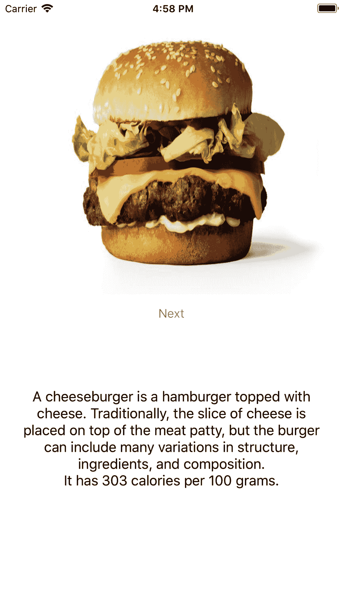

点击下一页，找到我们的下一张图片:

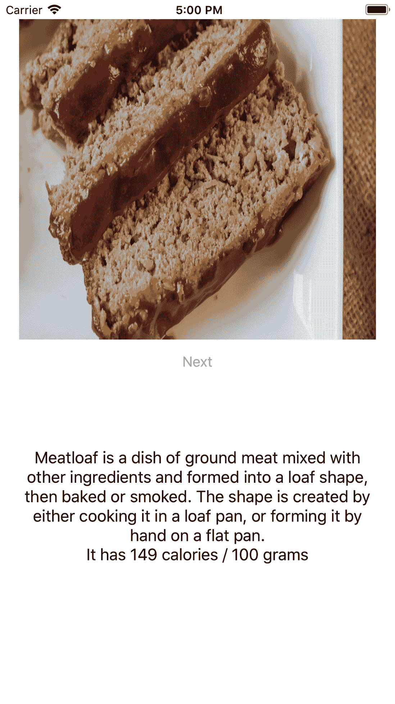


# 手写数字识别解决方案

之前，我们创建了一个应用，帮助我们深入了解使用 TensorFlow 模型在移动设备上实现神经网络图像识别程序。现在，我们将创建另一个应用，它使用神经网络和 Keras 的概念作为手写数字的图像识别程序。在本节中，我们将使用 Keras 为移动设备上的手写数字识别解决方案创建一个应用。然后，我们将把这个 Keras 模型转换成一个核心 ML 模型，并使用它来构建一个 iOS 移动应用。先给你介绍一下 Keras 吧。


# Keras 简介

Keras 是一种高级神经网络 API，用 Python 编写，能够在 TensorFlow、CNTK 或 Theano 之上运行。开发它的目的是实现快速实验。

以下是 Keras 的一些主要用途:

*   允许简单快速的原型制作(通过用户友好性、模块化和可扩展性)
*   支持卷积网络和循环网络，以及两者的组合
*   在 CPU 和 GPU 上无缝运行

Keras 的设计遵循以下原则:

*   方便用户
*   模块性
*   易扩展性
*   与 Python 的兼容性

要了解更多关于 Keras 的信息，请查看 https://keras.io/的。


# 安装 Keras

正如我们已经讨论过的，Keras 没有自己的后端系统。由于它运行在 TensorFlow、CNTK 或 Theano 之上，我们需要安装其中的一个——个人推荐 TensorFlow。

我们需要在`pip`包管理器的帮助下安装`h5py`库，以便将 Keras 模型保存到磁盘:

```py
pip install tensorflow
pip install keras
pip install h5py
```

前面的命令将会为我们现在将要创建的模型安装基本的必需库。


# 解决问题

在本节中，我们将看到一个神经网络的实际实现。我们将定义问题陈述，然后我们将理解我们要用来解决问题的数据集，据此我们将在 Keras 中创建模型来解决问题。一旦在 Keras 中创建了模型，我们将把它转换成与 Core ML 兼容的模型。这个核心 ML 模型将被导入到一个 iOS 应用中，然后编写一个程序来使用这个模型并解释手写数字。


# 定义问题陈述

我们将通过一个机器学习模型来解决识别手写数字的问题，我们将在 iOS 移动应用中实现该模型。第一步是拥有手写数字的数据库，该数据库可用于模型训练和测试。

http://yann.lecun.com/exdb/mnist/的 MNIST 数字数据集()提供了一个手写数字的数据库，并具有 60，000 个样本的训练集和 10，000 个样本的测试集。这是一个更大的集合的子集，可以从 MNIST 获得。数字已经过大小标准化，并在固定大小的图像中居中。对于那些希望学习现实世界数据的技术和模式识别方法，同时在预处理和格式化方面付出最少努力的人来说，这是一个很好的数据库。

在解决这个问题之前，我们将花一些时间来理解这个问题，看看神经网络可以在哪些方面提供帮助。我们可以把识别手写数字的问题分解成两个子问题。假设给我们一个手写数字，如下所示:


首先，我们需要将包含许多数字的图像分解成一系列独立的图像，每个图像包含一个数字。例如，我们希望将此图像分成七个独立的图像，如下所示:


对于人类来说，数字可以很容易地分开，但对于机器来说，完成这个简单的任务是非常具有挑战性的。一旦数字被分开，程序需要对每个单独的数字进行分类。例如，我们希望我们的程序识别出第一个数字是一个 **5** 。

我们现在试图把注意力集中在问题的第二部分:识别单个数字并对它们进行分类。我们将使用神经网络来解决识别单个手写数字的问题。

我们可以使用 3 层神经网络来解决这个问题，输出层有 10 个神经元。输入层和隐藏层是处理发生的地方。在输出层，基于触发的神经元，我们可以很容易地推断出被识别的数字。神经元 0 到 9 各自识别一个数字。


# 问题解决方案

问题解决方案包括以下关键步骤:

1.  准备数据
2.  定义模型
3.  训练和拟合模型
4.  将训练好的 Keras 模型转换成核心 ML 模型
5.  编写 iOS 移动应用

现在，让我们一个接一个地检查这些步骤，看看在每一个步骤中我们需要做什么。


# 准备数据

第一项活动是数据准备。首先，让我们导入所有需要的库。如前所述，我们将使用 MNIST 数据库作为手写数字的数据集:

```py
from __future__ import print_function
from matplotlib import pyplot as plt
import keras
from keras.datasets import mnist
```

`mnist`是包含手写数字数据库的数据集，因此我们需要导入它，如下所示:

```py
from keras.models import Sequential
```

前面的代码从 Keras 导入了`Sequential`模型类型。这只是神经网络层的线性栈:

```py
from keras.layers import Dense, Dropout, Flatten
```

现在，我们需要从 Keras 导入核心层。几乎所有神经网络都使用这些层:

```py
from keras.layers import Conv2D, MaxPooling2D
```

从 Keras 导入 CNN 图层。这些卷积层将帮助我们有效地训练图像数据:

```py
from keras.utils import np_utils
```

导入实用程序。这将有助于我们稍后进行数据转换:

```py
from keras import backend as K 
import coremltools
```

`coremltools`将帮助我们将 Keras 模型转换为核心 ML 模型:

```py
(x_train, y_train), (x_val, y_val) = mnist.load_data()
```

将预混洗的 MNIST 数据加载到训练集和测试集中:

```py
# Inspect x data
print('x_train shape: ', x_train.shape)
print(x_train.shape[0], 'training samples')
print('x_val shape: ', x_val.shape)
print(x_val.shape[0], 'validation samples')
print('First x sample\n', x_train[0])
```

如果运行前面的代码，它将显示 X，Y 的形状，以及 X 的第一条记录。

因此，我们的训练集中有 60，000 个样本，每个图像都是 28 x 28 像素。我们可以通过绘制`matplotlib`中的第一个样本来证实这一点:

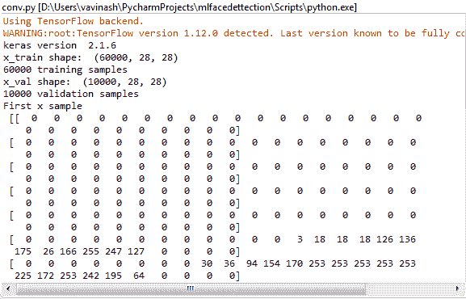

```py
plt.imshow(x_train[0])
```

该语句将使用`matplotlib`库来绘制`x_train`的第一条记录，这将给出以下输出:

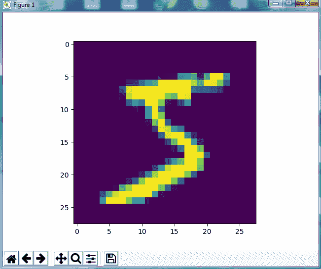

下面几行将打印出`y_train`形状和`y_train`中的前 10 个元素:

```py
print('y_train shape: ', y_train.shape)
print('First 10 y_train elements:', y_train[:10])
```

下面的代码将找到图像的输入形状。MNIST 图像数据值属于`uint8`类型，在*【0，255】*范围内，但 Keras 需要`float32`类型的值，在*【0，1】*范围内:

```py
img_rows, img_cols = x_train.shape[1], x_train.shape[2]
num_classes = 10

# Set input_shape for channels_first or channels_last
if K.image_data_format() == 'channels_first': 
x_train = x_train.reshape(x_train.shape[0], 1, img_rows, img_cols)
x_val = x_val.reshape(x_val.shape[0], 1, img_rows, img_cols)
input_shape = (1, img_rows, img_cols)
else: 
    x_train = x_train.reshape(x_train.shape[0], img_rows, img_cols, 1)
    x_val = x_val.reshape(x_val.shape[0], img_rows, img_cols, 1)
    input_shape = (img_rows, img_cols, 1)                     

print('x_train shape:', x_train.shape)
# x_train shape: (60000, 28, 28, 1)
print('x_val shape:', x_val.shape)
# x_val shape: (10000, 28, 28, 1)
print('input_shape:', input_shape)
```

使用下面的代码，我们将数据类型转换为与 Keras 中定义的数据类型兼容:

```py
x_train = x_train.astype('float32')
x_val = x_val.astype('float32')
x_train /= 255
x_val /= 255
```

现在，我们在`y`中有一个 6 万个元素的一维。让我们将其转换为 60，000 x 10 的数组，如下所示:

```py
y_train = np_utils.to_categorical(y_train, num_classes)
y_val = np_utils.to_categorical(y_val, num_classes)
print('New y_train shape: ', y_train.shape)
# (60000, 10)
print('New y_train shape: ', y_train.shape)
# (60000, 10)
print('First 10 y_train elements, reshaped:\n', y_train[:10])
```

现在，`y_train`会是这样的:

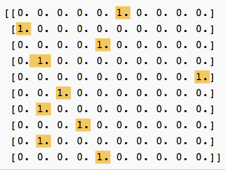

在前面的数组中，我们可以发现，对于存在的数字，相应的位置将用 1 填充，所有其他位置都用 0 填充。对于第一条记录，我们可以理解为预测的数字是 5，因为第 6 个位置(从 0 开始)被填充了 1。

既然数据准备已经完成，我们需要定义模型的架构。


# 定义模型的架构

一旦数据准备完成，下一步就是定义模型并创建它，所以让我们创建模型:

```py
model_m = Sequential()
```

前一行将创建一个顺序模型，该模型将按层的排列顺序处理层。构建 Keras 模型有两种方式，顺序方式和功能方式:

*   顺序 API :这允许我们逐层创建模型。通过这种方式，我们不能创建共享层或者有多个输入或输出的模型。
*   **功能性** **API** :这让我们可以创建模型，并且可以有复杂的连接层——你可以从任何层连接到任何其他层:

```py
model_m.add(Conv2D(32, (5, 5), input_shape=(1,28,28), activation='relu'))
```

输入的形状参数应该是`1`样品的形状。在这种情况下，同样是`(1, 28, 28)`，对应每个数字图像的(深度、宽度、高度)。

但是其他参数代表什么呢？它们分别对应于要使用的卷积滤波器的数量、每个卷积核中的行数以及每个卷积核中的列数:

```py
model_m.add(MaxPooling2D(pool_size=(2, 2)))
```

`MaxPooling2D`是一种减少模型中参数数量的方法，方法是将一个 2 x 2 池过滤器滑过前一层，取 2 x 2 过滤器中 4 个值的最大值:

```py
model_m.add(Dropout(0.5))
```

这是一种调整模型以防止过度拟合的方法:

```py
model_m.add(Conv2D(64, (3, 3), activation='relu'))
model_m.add(MaxPooling2D(pool_size=(2, 2)))
model_m.add(Dropout(0.2))
model_m.add(Conv2D(128, (1, 1), activation='relu'))
model_m.add(MaxPooling2D(pool_size=(2, 2)))
model_m.add(Dropout(0.2))
model_m.add(Flatten())
model_m.add(Dense(128, activation='relu'))
model_m.add(Dense(num_classes, activation='softmax'))
print(model_m.summary())
```

一旦您运行了前面的代码行，模型架构层的名称将会打印在控制台中:

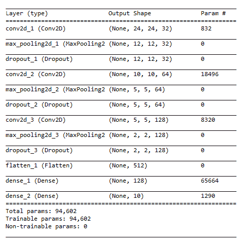


# 编译和拟合模型

下一步是编译和训练模型。我们通过一系列迭代使模型通过训练阶段。时期决定了在训练阶段对模型进行迭代的次数。权重将被传递到模型中定义的层。大量的历元将提供更高的精确度和最小的损失。这里，我们使用 10 个纪元。

Keras 有一个回调机制，将在模型的每次训练迭代中调用，即在每个时期结束时调用。在回调方法中，我们保存该时段的计算权重:

```py
callbacks_list = [
    keras.callbacks.ModelCheckpoint(
        filepath='best_model.{epoch:02d}-{val_loss:.2f}.h5',
        monitor='val_loss', save_best_only=True),
    keras.callbacks.EarlyStopping(monitor='acc', patience=1)]
```

现在，使用以下代码编译模型:

```py
model_m.compile(loss='categorical_crossentropy',optimizer='adam', metrics=['accuracy'])
```

`categorical_crossentropy`损失函数测量由 CNN 计算的概率分布和标签的真实分布之间的距离。

`optimizer`是一种随机梯度下降算法，它试图通过以恰到好处的速度跟随梯度来最小化损失函数。`accuracy`图像被正确分类的比例——这是在训练和测试过程中监控的最常见指标:

```py
# Hyper-parameters
batch_size = 200
epochs = 10
```

现在，使用以下代码拟合模型:

```py
# Enable validation to use ModelCheckpoint and EarlyStopping callbacks.model_m.fit(
    x_train, y_train, batch_size=batch_size, epochs=epochs,    callbacks=callbacks_list, validation_data=(x_val, y_val), verbose=1)
```

一旦程序执行完毕，你会在你的运行目录中找到名为`best_model.01-0.15.h5`的文件。这表示`best_model.{epoch number}-{loss value}.h5`。

这是为给定数据集创建和训练的 Keras 模型。


# 将 Keras 模型转换为核心 ML 模型

既然已经创建了 Keras 模型，下一步就是将 Keras 模型转换成核心 ML 模型。对于第一个参数，使用笔记本文件夹中最新的`.h5`文件的文件名:

```py
output_labels = ['0', '1', '2', '3', '4', '5', '6', '7', '8', '9']
coreml_mnist = coremltools.converters.keras.convert(
    'best_model.10-0.04.h5', input_names=['image'], output_names=['output'],    class_labels=output_labels, image_input_names='image')
coreml_mnist.save("minsit_classifier.mlmodel")
```

一旦成功运行代码，您将会发现在您的目录中创建了`minsit_classifer.mlmodel`文件。我们将使用它来创建一个 iOS 移动应用来检测数字。


# 创建 iOS 移动应用

现在，我们将创建 iOS 应用。您可以从我们的 Packt GitHub 库的`ImageClassificationwithVisionandCoreML`文件夹中下载代码。

在 Xcode9+中打开项目；项目结构将如下所示:

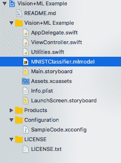

如果你在你的设计器中打开`main.storyboard`，你会看到如下界面:

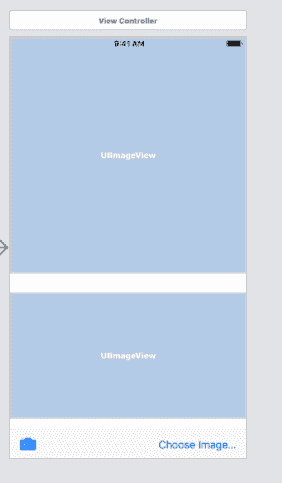

大部分代码都是常见的 iOS 代码。查看下面这段我们特别感兴趣的代码，其中包括手写数字预测代码:

```py
lazy var classificationRequest: VNCoreMLRequest = {
        // Load the ML model through its generated class and create a Vision request for it.
        do {
            let model = try VNCoreMLModel(for: MNISTClassifier().model)
            return VNCoreMLRequest(model: model, completionHandler: self.handleClassification)
        } catch {
            fatalError("can't load Vision ML model: \(error)")
        }
    }()
    func handleClassification(request: VNRequest, error: Error?) {
        guard let observations = request.results as? [VNClassificationObservation]
            else { fatalError("unexpected result type from VNCoreMLRequest") }
        guard let best = observations.first
            else { fatalError("can't get best result") }        DispatchQueue.main.async {
            self.classificationLabel.text = "Classification: \"\(best.identifier)\" Confidence: \(best.confidence)"
        }
    }
```

它的底部有两个按钮:一个用于从手机上选择图片，另一个用于拍摄快照。请注意，如果您在模拟器中运行，相机将无法工作。

您可以在模拟器中构建和运行应用。一旦应用在模拟器中成功打开，将手写数字 6 的图像拖动到模拟器的示例图像文件夹中，这将在模拟器的内存中保存文件。

返回应用，选择设备内存中保存的拖动图像。它将显示以下输出:

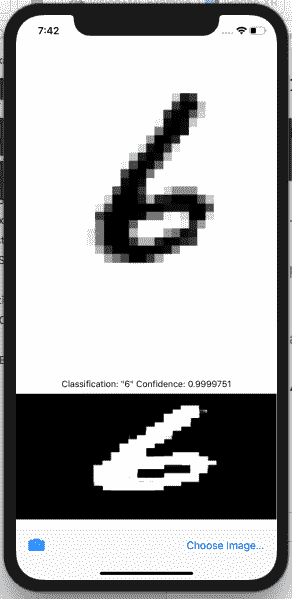


# 摘要

在本章中，我们介绍了神经网络的概念及其在移动机器学习领域的应用。我们创建了一个应用，在 iOS 和 Xcode 中使用 TensorFlow 和 Core ML 来识别图像。我们还探索了 Keras 深度学习框架。我们尝试在 Keras 中使用神经网络来解决手写数字识别问题。我们建立了 Keras 机器学习模型来解决这个问题。然后，我们使用核心 ML 转换工具将这个模型转换成核心 ML 模型。我们在一个 iOS 移动应用中使用这个核心 ML 模型来执行手写数字识别。

在下一章，我们将学习如何在 Android 中使用谷歌云视觉标签检测技术。