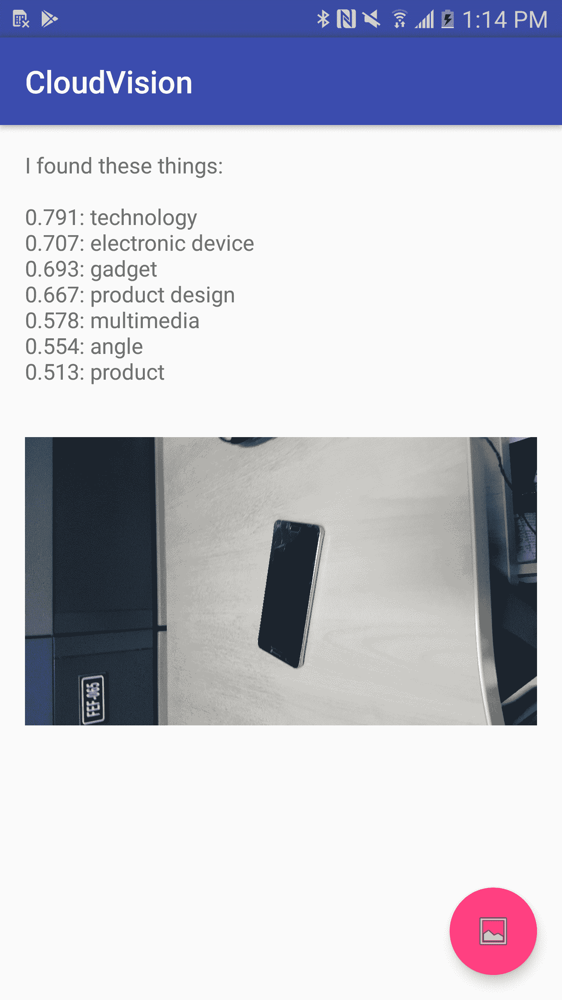

<title>Mobile Application Using Google Vision</title> 

# 使用 Google Vision 的移动应用程序

正如我们在[第 1 章](51fcaf51-eb68-4493-afc2-0b02f1c1d50e.xhtml)、*移动机器学习简介、*中看到的，我们知道移动应用中的机器学习可以在设备上实现，也可以使用机器学习云提供商服务来实现。有各种机器学习云提供商:

*   克拉里菲
*   谷歌云愿景
*   微软 Azure 认知服务
*   IBM 沃森
*   亚马逊机器学习

在本章中，我们将深入了解 Google Cloud Vision，以了解以下内容:

*   谷歌云视觉的特点
*   如何在 Android 移动应用中利用谷歌云视觉标签检测技术来确定相机拍摄的照片是什么。也就是说，我们基本上是将一幅图像输入谷歌云视觉，然后看看它是如何给图像贴标签的。Google Vision 将预测它从移动应用程序接收到的图像，并为该图像提供一个标签。

<title>Features of Google Cloud Vision</title> 

# 谷歌云视觉的特点

谷歌云视觉 API 包括各种复杂而强大的机器学习模型，有助于执行图像分析。它使用一个易于使用的 REST API 将图像分为不同的类别。Google Cloud Vision 提供的重要功能包括:

*   **标签检测**:这使我们能够将图像分成数千种类别。这些图像可以分为各种常见的类别标签，如*动物*和*水果*。
*   **图像属性检测**:这使我们能够从图像中检测单个对象。它还可以检测突出颜色等属性。
*   **人脸检测**:这使我们能够从图像中检测人脸。如果图像中有多张人脸，可以单独检测每一张。它还可以检测与人脸相关的突出属性，如戴头盔。
*   **徽标检测**:这使我们能够从图像中检测印刷文字。训练可以被检测到的显著标志。
*   **地标检测**:它经过训练，可以检测出著名的地标——自然的和人造的——所以这些都是通过谷歌视觉检测出来的。
*   **光学字符识别**:这有助于检测图像中的文本，即使它们不是英文。这支持多种语言。
*   **显性内容检测**:这有助于识别内容的类型或者内容的情绪，比如*暴力*或者*幽默*。它使我们能够通过利用可以构建的元数据信息来执行图像的情感分析。
*   **搜索网页**:在网页上搜索相似的图片。

Google Cloud Vision 提供的所有这些功能都可以通过调用 Google 提供的简单 RESTful APIs 来使用。但是，对于它们的使用来说，使用每个特性都是有代价的。也可以使用特征的组合。定价细节可以在谷歌云视觉网站上找到:[https://cloud.google.com/vision/](https://cloud.google.com/vision/)。

<title>Sample mobile application using Google Cloud Vision</title> 

# 使用 Google Cloud Vision 的示例移动应用程序

在本节中，我们将使用 Google Cloud Vision 尝试一个示例 Android 移动应用程序。我们将从手机摄像头捕捉一张图像，上传到谷歌云视觉，看看它预测的图像是什么。这就要用到 Google Cloud Vision 的标签检测功能，它决定了上传图片的标签。

<title>How does label detection work?</title> 

# 标签检测是如何工作的？

Vision API 可以检测和提取图像中各种类别的实体信息。标签可以识别物体、位置、活动、动物种类、产品等等。标签仅以英文返回。

标签待定的图像和我们打算使用的 Google Vision 的功能需要在请求 API 中发送。该功能可以是谷歌云视觉部分的*功能中列出的任何功能，例如标签检测或徽标检测。如果有任何额外的图像上下文需要和图像一起发送，它可以作为一个额外的参数发送。此处提供了请求 API JSON 格式:*

```
{
  "image": {
    object(Image)// Image which needs to be processed.
  },
  "features": [
    {
      object(Feature) //Google Vision Feature that needs to be invoked.
    }
  ],
  "imageContext": {
    object(ImageContext) //additional image context if required.
  },
}
```

图像对象可以是 base64 编码的字符串，也可以是需要分析的图像的 URL。该 URL 可以是 Google 云存储图像位置，也可以是可公开访问的图像 URL。

对请求的响应将是一个基于所请求特性的注释列表。在我们的例子中，它将是标签注释:

```
{
 "labelAnnotations": [
 {
 object(EntityAnnotation)
 }
 ],
 "error": {
 object(Status)
 },
}
```

返回的`EntityAnnotation`对象将包含图像的标签、预测分数和其他有用的信息。所有匹配输入图像对象的标签都作为一个带有预测分数的数组列表返回，基于此，我们可以执行应用程序中所需的推理。

现在我们已经了解了标签检测的基本原理，让我们开始创建 Android 应用程序。

<title>Prerequisites</title> 

# 先决条件

为了开始探索 Google vision 并使用 Google Vision 提供的服务编写一个程序，需要设置以下内容，这样我们就可以动手了:

*   谷歌云平台账户
*   谷歌云控制台上的一个项目
*   Android Studio 的最新版本
*   运行 Android 5.0 或更高版本的手机

<title>Preparations</title> 

# 准备

本节详细介绍了在开始从我们的移动应用程序中使用 Google Cloud Vision API 之前我们需要完成的关键活动:

1.  Google Cloud Vision API 应该在 Google Cloud 控制台中启用，并且应该创建一个将在移动应用程序代码中使用的 API 密钥。请执行以下步骤来获取云视觉 API 密钥:
    1.  打开[cloud.google.com/vision](http://Google%20Cloud%20Vision)。
    2.  转到控制台。如果您没有试用帐户，它会要求您创建一个并完成该过程。
    3.  启用计费，这样我们就可以获得 300 美元的免费点数。一旦我们有了帐户，我们可以去控制台，并完成创建密钥的过程。
    4.  从控制台中，创建一个项目。
    5.  打开该项目。转到 API 服务|库搜索 cloud vision API。
    6.  点击它并启用它。
    7.  转到 API 服务|凭据。
    8.  转到凭据| API 密钥。
    9.  创建 API 密钥。
    10.  复制 API 密钥；这将在移动应用程序代码中使用。
2.  添加移动客户端应用程序中使用 Google Cloud Vision API 所需的依赖项。将需要谷歌 API 客户端，因此这需要添加到客户端项目。这些将需要在 Gradle 构建文件中指定。具有关键依赖关系的示例 Gradle 文件如下:

```
dependencies {
 compile fileTree(include: ['*.jar'], dir: 'libs')
 testCompile 'junit:junit:4.12'
 compile 'com.android.support:appcompat-v7:27.0.2'
 compile 'com.android.support:design:27.0.2'
 compile 'com.google.api-client:google-api-client-android:1.23.0' exclude module: 'httpclient'
 compile 'com.google.http-client:google-http-client-gson:1.23.0' exclude module: 'httpclient'
 compile 'com.google.apis:google-api-services-vision:v1-rev369-1.23.0'
}
```

<title>Understanding the Application</title> 

# 了解应用程序

在本节中，我们将看到源代码的关键流程，以了解 Google Vision API 如何在 Android 移动应用程序中工作。

Vision 类表示用于云视觉的 Google API 客户端。第一步是初始化 Vision 类。我们通过构建器来完成，我们向构建器指定传输机制和要使用的 JSON 工厂:

```
Vision.Builder builder = new Vision.Builder(httpTransport, jsonFactory, null); 
```

下一步是将 API 键分配给 Vision Builder，这样它就可以开始与云 API 进行交互。我们创建的密钥如下所示:

```
VisionRequestInitializer requestInitializer = new VisionRequestInitializer(CLOUD_VISION_API_KEY)
builder.setVisionRequestInitializer(requestInitializer);
```

最后一步是获得 Vision 实例，通过它可以调用云 API:

```
Vision vision = builder.build();

```

现在我们要捕捉一张图片，将图片发送到云端 API 检测其标签。通过相机捕捉图片的代码是常见的 Android 东西。以下代码详细介绍了如何将图像转换为标签检测的视觉请求:

```
BatchAnnotateImagesRequest batchAnnotateImagesRequest = new BatchAnnotateImagesRequest();

batchAnnotateImagesRequest.setRequests(new ArrayList<AnnotateImageRequest>() {{ AnnotateImageRequest annotateImageRequest = new AnnotateImageRequest();
 // Add the image
 Image base64EncodedImage = new Image();
 // Convert the bitmap to a JPEG
 // Just in case it's a format that Android understands but Cloud Vision
 ByteArrayOutputStream byteArrayOutputStream = new ByteArrayOutputStream(); bitmap.compress(Bitmap.CompressFormat.JPEG, 90, byteArrayOutputStream);
byte[] imageBytes = byteArrayOutputStream.toByteArray();
// Base64 encode the JPEG
base64EncodedImage.encodeContent(imageBytes); annotateImageRequest.setImage(base64EncodedImage);
// add the features we want
annotateImageRequest.setFeatures(new ArrayList<Feature>() {{
Feature labelDetection = new Feature(); labelDetection.setType("LABEL_DETECTION"); labelDetection.setMaxResults(MAX_LABEL_RESULTS);
add(labelDetection);
}});
// Add the list of one thing to the request
add(annotateImageRequest);
}});
Vision.Images.Annotate annotateRequest =  vision.images().annotate(batchAnnotateImagesRequest);
```

谷歌云视觉将被称为**异步任务**。将对从 API 收到的响应进行分析，以用户可读的格式提供数据。以下代码提供了从 Google Vision 收到的响应的详细信息:

```
 //Formatting the response as a string
 private static String convertResponseToString(BatchAnnotateImagesResponse response) {
 StringBuilder message = new StringBuilder("I found these things:\n\n"); List<EntityAnnotation> labels = response.getResponses().get(0).getLabelAnnotations();
 if (labels != null) {
 for (EntityAnnotation label : labels) {
 message.append(String.format(Locale.US, "%.3f: %s", label.getScore(), label.getDescription()));
 message.append("\n");
 }
 } else {
 message.append("nothing");
 }
 return message.toString();
 }

```

用户可以查看为图像返回的标签。

<title>Output</title> 

# 输出

当手机被捕获并发送到 vision API 时，此部分显示 Android 应用程序屏幕。输出屏幕中列出了可能的标签:



<title>Summary</title> 

# 摘要

在这一章中，我们研究了 Google Cloud Vision 的工作原理，以及如何毫不费力地从移动应用程序中调用它。我们看到，在没有模型选择和训练的麻烦的情况下，进行复杂的机器学习预测是多么容易。在下一章，我们将探讨机器学习在移动应用领域的未来。