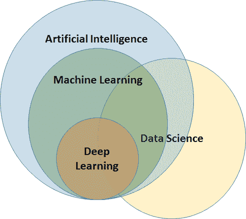

# 十二、问题和答案

在本附录中，我们将讨论章节中无法涵盖的概念和要点，但这些概念和要点对于全面理解和欣赏移动机器学习是必不可少的。我们将详细讨论你可能会想到的问题，并尝试提供与该领域相关的问题的答案。


# 常见问题

我们将常见问题整理成三个基本部分:

*   第一部分将研究本质上更通用的问题，与数据科学、机器学习等相关。
*   第二部分将研究与不同的移动机器学习框架相关的具体问题。
*   第三部分也是最后一部分将研究与移动机器学习项目实施相关的具体问题。


# 数据科学

在这一部分，我们将回答一些与数据科学及其用途相关的问题。


# 什么是数据科学？

数据科学是从数据中提取相关见解。它是许多领域的顶峰，如数学、机器学习、计算机编程、统计建模、数据工程和可视化、模式识别和学习、不确定性建模、数据仓库和云计算。从事这些领域所需的技能包括工程、数学、科学、统计学、编程、创造力和数据保存以及维护。


# 数据科学用在哪里？

数据科学用于**人工智能** ( **AI** )和机器学习。它解决了复杂的数据问题，从而带来了应用它之前未知的洞察力。它揭示了对业务极其相关和有用的数据之间的未知相关性。


# 什么是大数据？

大数据通常包括大小超出常用软件工具捕获、管理和处理能力的数据集。

Gartner 在 2001 年提出了大数据的三个特征:

*   **数据量**:数据量巨大且不断增加
*   **速度**:数据积累的速度很快，而且还在增加
*   **多样性**:被捕获的特征/特性的数量很大，而且还在增长

Gartner 在 2012 年的定义是:*大数据是高容量、高速度和/或高多样性的信息资产，需要新的处理形式来实现增强的决策、洞察发现和流程优化。*

大数据可以包括大数据系统、大数据分析和大数据集。


# 什么是数据挖掘？

数据挖掘是检查大量预先存在的数据集并从中提取有用见解的过程。


# 数据科学和大数据之间的关系

数据科学不一定涉及大数据，但数据不断扩大的事实使大数据成为数据科学的一个重要方面。


# 什么是人工神经网络？

**人工神经网络**(**ann**)是受构成动物大脑的生物神经网络启发的计算系统。这些系统没有用特定的任务规则进行编程，而是通过考虑实例而不被编程来执行任务，例如，图像识别。为了识别玫瑰，它通过学习而不是通过编程来学习玫瑰的特征以将样本定义为玫瑰。


# AI 是什么？

AI 是指机器对人脑功能的模拟。这是通过创建一个可以显示人类智能的人工神经网络来实现的。人工智能机器执行的主要人类功能包括逻辑推理、学习和自我纠正。这是一个非常复杂的领域，要让天生不聪明的机器像人类一样思考和行动，需要大量的计算能力和数据输入。

人工智能分为两部分:

*   **AI 将军**:让机器在大范围内变得聪明，类似于人类的思维和推理。这一点至今仍未实现，许多正在进行的研究活动已经启动。
*   **狭义 AI** :让机器在特定领域变得智能，比如数字识别、下棋。这在今天是可能的。


# 数据科学、人工智能和机器学习是如何相互关联的？

这是一条有趣而重要的信息，关于数据科学、人工智能和机器学习之间到底是如何相互关联的:

*   AI:这个区域试图人工模仿人类的智能。正如人类能够看到、观察周围的数据并做出决定一样，同样的事情也正在通过机器进行尝试。这是一个非常广阔的领域。这项技术仍在发展中。要完成一项人类通过人工智能很容易完成的小任务，需要海量的数据。
*   **机器学习**:AI 的子集。狭隘地关注特定的问题领域。该技术有现实生活用例的实现。它是人工智能和数据科学之间的桥梁。

*   **数据科学**:是研究数据并从中提取信息的领域。这可以使用机器学习来分析数据、大数据等等:




# 机器学习框架

在这一节中，我们将查看我们已经在书中浏览过的一些机器学习框架，以及我们没有浏览过的框架，并给出一些关于它们的提示。


# 咖啡 2

*   来自脸书的 Caffe2 是本书没有讨论的关键移动机器学习框架之一。更多细节可以从[https://caffe2.ai/](https://caffe2.ai/)获得。
*   Caffe2 是一个深度学习框架，它提供了一种简单直接的方法来试验深度学习，并利用新模型和算法的社区贡献。
*   最初的 Caffe 框架对于大规模的产品用例非常有用，尤其是它无与伦比的性能和经过良好测试的 C++代码库。
*   Caffe2 在许多特性上比最初的 Caffe 框架有所改进。
*   理解并开始使用框架编写示例需要很长的学习时间。


# sci kit-学习

*   Scikit-learn 是最著名的机器学习包之一，提供了大量常见机器学习算法的高效实现版本。
*   它不是一个移动机器学习包。然而，使用 scikit-learn 创建的模型可以使用转换工具转换为 Core ML 和 TensorFlow Lite 模型，并直接在移动应用中使用。
*   它在机器学习算法和非常全面的支持文档中有相似和统一的 API 实现。
*   学习 scikit 非常容易——使用它来学习、实现和扩展模型。
*   Scikit-learn 最初是由 David Cournapeau 在 2007 年作为 Google 代码之夏项目开发的。后来，Matthieu Brucher 加入了这个项目，并开始将其作为论文工作的一部分。2010 年，INRIA 参与其中，并于 2010 年 1 月底发布了第一个公开版本(v 0.1 beta)。该项目现在有 30 多个活跃的贡献者，并得到了 INRIA、谷歌、Tinyclues 和 Python 软件基金会的赞助。
*   Scikit-learn 通过 Python 中的一致接口提供了一系列监督和非监督学习算法。
*   它在一个许可的简化 BSD 许可下被许可，并在许多 Linux 发行版下被分发，鼓励学术和商业使用。
*   该库是基于 SciPy 构建的，在使用 scikit-learn 之前必须安装 SciPy。


# 张量流

*   TensorFlow 是一个用于快速数值计算的开源库。它由 Google 创建和维护，并在 Apache 2.0 开源许可下发布。API 使用 Python 编程语言，尽管可以访问底层的 C++ API。
*   移动设备有一个单独的风格，我们已经详细介绍过了，并在本书的实际动手练习中使用过。
*   在 TensorFlow 中创建的模型可用于并转换为 TensorFlow for mobile 和 TensorFlow Lite 的模型，并在移动应用中使用。

*   TensorFlow 设计用于研发和生产系统。它可以运行在单 CPU 系统和 GPU 上，也可以运行在移动设备和数百台机器的大型分布式系统上。
*   数学上，张量是一个 n 维向量。它可以用来表示 n 维数据集。流指的是一个图形；该图不可能是循环的，图中的每个节点代表一个运算，如加、减等。每一次运算都会形成一个新的张量。
*   张量流允许并行评估每个节点，因此张量流消除了像串行模式中那样等待节点评估的空闲浪费时间。
*   TensorFlow 允许用户利用并行计算设备更快地执行操作。


# 核心 ML

*   苹果在 WWDC 2017 年发布了 Core ML，今年更新为 Core ML 2。提醒一下，Core ML 使开发者能够将机器学习模型集成到 iOS 和 MacOS 应用中。这是这一领域的第一次大尝试，最初开发人员非常喜欢它，原因有几个。
*   核心 ML 支持各种机器学习模型，包括神经网络、树集成、支持向量机和广义线性模型。核心 ML 需要核心 ML 模型格式(文件扩展名为`.mlmodel`的模型)。
*   Apple 还提供了转换器，可以将其他几个库中创建的模型转换为 Core ML 格式。由于我们在本书中使用了这些转换器，我们发现这些转换器非常容易使用，并且可以与大多数著名的现有机器学习库一起工作。
*   Apple 还提供了几种流行的开源模型，它们已经是核心 ML 模型格式，可以直接下载并用于构建我们的应用。
*   Core ML 针对片上性能进行了优化，最大限度地减少了内存占用和功耗。严格在设备上运行还可以确保用户数据的安全，即使没有网络连接，应用也可以运行。
*   Core ML 最大的优势就是使用起来极其简单。仅仅几行代码就可以帮助你集成一个完整的机器学习模型。自从 Core ML 发布以来，大量的创新项目都在使用它。然而，围绕核心 ML 所能做的有一些限制。

*   Core ML 只能帮你把预先训练好的 ML 模型集成到你的 app 里。这意味着你只能做预测。没有模特培训是不可能的。
*   到目前为止，Core ML 已经被证明对开发人员非常有用。今年在 WWDC 发布的 Core ML 2 使用了被称为**量化**和**批量预测**的技术，应该可以将推断时间提高 30%。


# 移动机器学习项目实施

在本节中，我们将讨论任何机器学习项目实施者在开始项目之前都会想到的基本问题。


# 在开始项目之前，需要考虑哪些高级别的重要事项？

以下是启动项目前需要解决的高级项目:

*   按照我们已经看到的 ML 定义，清楚地定义问题，清楚地输入任务 T、绩效评估 P 和经验 E
*   所需卷的数据可用性
*   移动或基于云的移动机器学习框架的设计决策
*   正确选择适合我们需求的机器学习框架


# 实施移动机器学习项目需要哪些角色和技能？

可以为移动机器学习项目规划以下技能和角色:

*   **领域专家/专家**:提供关于问题、数据、数据中的特性、业务环境等的输入
*   **机器学习数据科学家**:分析数据，做特征工程和数据预处理，建立机器学习模型
*   **移动应用开发者**:利用移动机器学习模型构建移动应用
*   测试器:测试模型和移动应用

在这里，每个角色都可以通过这本书由其他人学习，并且可以由单人或多人执行，以成功实施移动机器学习项目。


# 测试移动机器学习项目的时候应该重点关注什么？

项目中要测试的关键是移动机器学习模型。因此，独立于移动应用，该模型需要被彻底测试。

我们已经看到了在测试机器学习模型时应该重点关注什么。在测试模型时，需要考虑训练数据、测试数据和交叉验证。要测量的所选模型的性能度量。对每次运行的结果都要做清晰的记录，以便我们清楚地知道对于输入数据特征集的增量变化，输出中的增量变化是什么。测试机器学习模型的工程师应该清楚地理解[第 1 章](51fcaf51-eb68-4493-afc2-0b02f1c1d50e.xhtml)、*移动设备上的机器学习简介*中解释的所有概念，包括准确度、精确度、召回率、误差等等。此外，对于每种类型的算法，误差和性能度量标准各不相同，这在测试模型时应该得到适当的考虑。测试机器学习模型本身就值得一本书，在本书中详述细节超出了范围。


# 领域专家会给机器学习项目提供什么帮助？

领域专家/专家是任何机器学习项目成功的关键角色，他的具体价值将体现在以下领域:

*   问题陈述的定义，并帮助正确理解解决方案的期望
*   数据准备:
    *   在特征工程中选择哪些好的候选对象并作为预测属性保存？
    *   如何结合多个目标/属性来帮助解决问题陈述
    *   如何抽样选择测试集和训练集
    *   帮助清理数据

*   进度监控和结果解释:
    *   定义所需的预测精度
    *   根据所取得的进展，确定是否需要更多数据/额外数据
    *   在两者之间建立一个检查点，并确定所取得的进展是否与所定义的问题陈述一致，所寻求的解决方案是否一致，是否可以在相同的路线上进一步寻求，或者是否需要采取不同的途径/重新校准方法
*   持续更新和反馈进展情况


# 机器学习项目中有哪些常见的陷阱？

以下是任何机器学习项目中常见的一些陷阱:

*   不切实际的目标，没有正确目标的不明确的问题定义
*   数据问题:
    *   数据不足，无法建立预测模式
    *   预测器属性选择不正确
    *   数据准备问题
    *   数据标准化问题—无法跨数据集标准化数据
    *   解决问题的数据使用偏差
*   不适当的机器学习方法选择:
    *   选择的 ML 方法不适合定义的问题陈述
    *   不尝试替代算法
*   过早放弃。这种情况经常发生。如果工程师们看不到最初的结果，无法对各种相关因素进行各种排列和组合，也无法对结果进行系统的簿记，他们往往会失去兴趣。如果持续地/有条不紊地进行适当的记录，并尝试各种可能性，机器学习问题可以很容易地解决。


# 装置

在本节中，我们将介绍设置用于创建本书中的程序的工具和 SDK 所需的不同安装过程。


# 计算机编程语言

在本书中，我们使用 Python 创建了 ML 模型。所以，你必须知道如何在你的系统中安装 Python 来浏览实际的例子。

去 https://www.python.org/downloads/的[。](https://www.python.org/downloads/)

它会显示最新版本供您下载；下载安装程序并安装。

在 Windows 中安装时，它会询问是否将 Python 添加到 path 环境变量中。选中该框，为您的系统自动执行该操作。否则，您需要手动将其添加到 path 变量中。

要检查 Python 是否安装在您的机器上，请进入命令提示符或终端并键入`python`。它应该显示 Python 提示符。否则，如果您已经将 path 变量安装到您的驱动器上，则需要设置它。


# Python 依赖性

默认情况下，Python 会附带`pip`包管理器。您可以使用`pip`进行安装。语法如下:

```
pip install package name
```

欲了解更多关于可用套餐的信息，请访问[https://pypi.org/project/pip/](https://pypi.org/project/pip/)。在本书中，我们已经在各自的章节中给出了所有的依赖项安装命令。


# Xcode

首先，在苹果创建一个开发者账户，并在[https://developer.apple.com/](https://developer.apple.com/)登录你的账户。点击下载，向下滚动/搜索最新的 Xcode，9.4 以上，然后点击下载。它将下载 XZIP 文件。提取并安装在您的 Mac 电脑上，方法是将它拖到您的应用文件夹中。


# 参考

以下是一些参考资料，您可以通过它们了解更多关于移动设备上的机器学习的信息:

*   **机器学习掌握度**:[https://machinelearningmastery.com/](https://machinelearningmastery.com/)
*   **分析 vidya**:[https://www . analyticvidya . com/](https://www.analyticsvidhya.com/)
*   **弗里茨** : [https://fritz.ai/](https://fritz.ai/)
*   **ml kit**:[https://developers . Google . com/ml-kit/](https://developers.google.com/ml-kit/)
*   **tensorlow lite**:[https://www . tensorlow . org/lite/](https://www.tensorflow.org/lite/)
*   **核心 ml**:[https://developer . apple . com/documentation/coreml？变化=_8](https://developer.apple.com/documentation/coreml?changes=_8)
*   **咖啡 2**:[https://caffe 2 . ai/](https://caffe2.ai/)