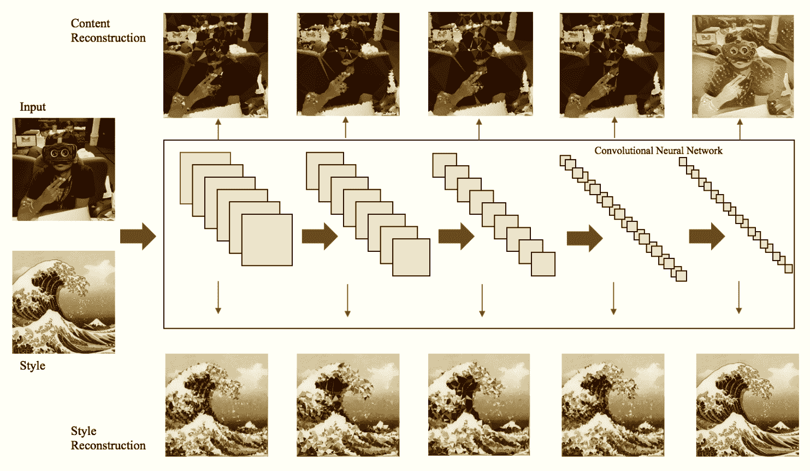
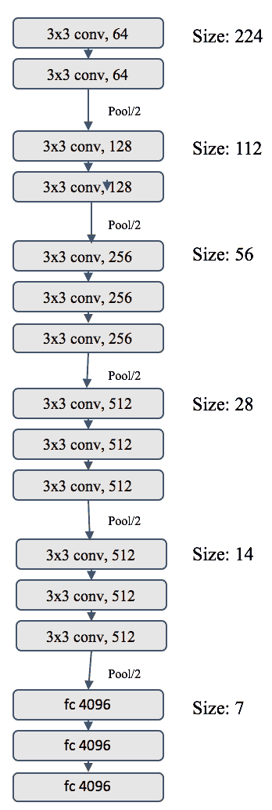
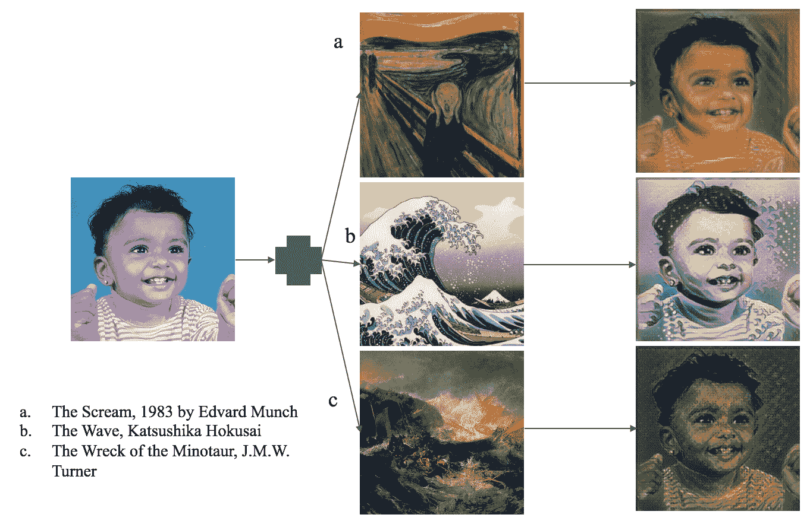
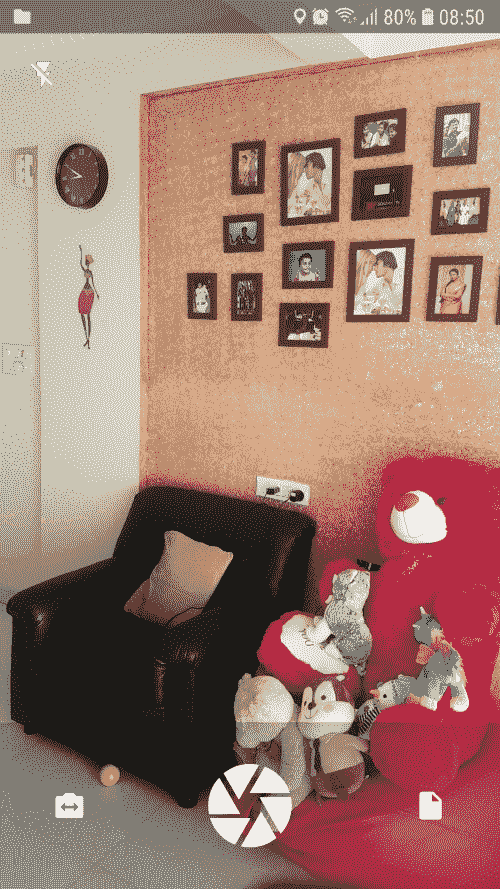
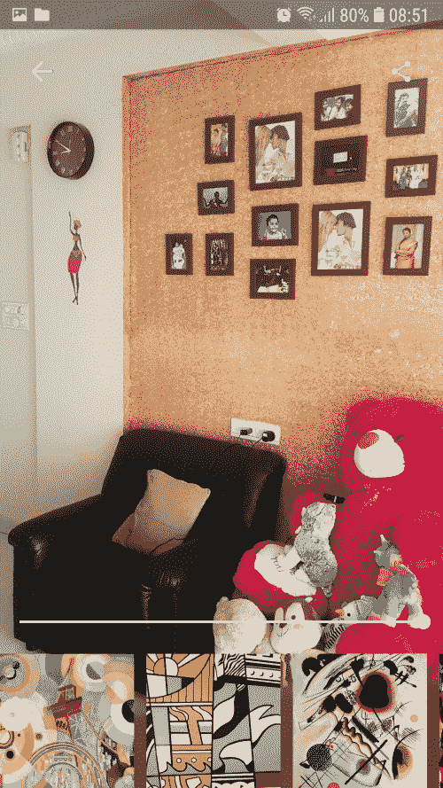
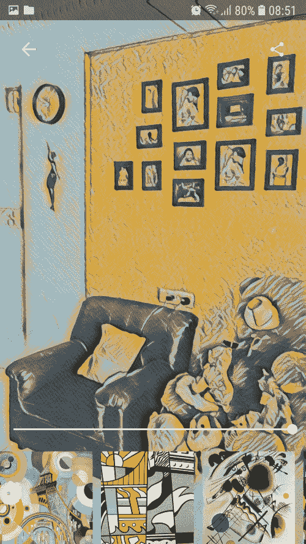

# 三、在照片上应用神经风格迁移

在这一章中，我们将构建一个完整的 iOS 和 Android 应用，其中图像转换以类似于 Instagram 应用的方式应用于我们自己的图像。对于这个应用，我们将在 TensorFlow 的帮助下再次使用 Core ML 和 TensorFlow 模型。为了使这个工作，我们将不得不执行一些小的黑客。

本章的最佳用例是基于一个名为 **Prisma** 的照片编辑应用，通过它你可以使用神经网络将你的图像转换为绘画。你可以把你的图像转换成一种艺术形式，看起来像是毕加索或萨尔瓦多·达利画的。

在本章中，我们将讨论以下主题:

*   艺术神经风格迁移
*   使用神经类型迁移构建应用


# 艺术神经风格迁移

图像变换通过快速样式转换来应用。在实现我们的移动应用之前，让我们更深入地了解一下样式转换是如何工作的。每个人都喜欢看到自己的作品具有艺术风格。艺术神经风格迁移帮助我们以一种艺术形式看到我们自己的图像，这种艺术形式涉及混合你的内容和风格，以便引入一种独特的视觉体验。在此之前，没有基于人工智能的系统能够实现这样的系统。

请看下面的截图，这是一个如何将艺术风格应用于普通图像的示例:


我们将在本章中创建的应用是基于一个类似于前面屏幕截图所示的系统的实现。已经有多篇论文发表，证明它在面部和物体识别方面的表现接近人类。深度神经网络有助于实现人工人类视觉。在这个应用中，我们使用的算法实现了一个深度神经网络，可以创建高视觉质量的图像。神经网络用于对输入图像的内容和风格进行分叉和重新排列。通过这种方式，它提供了一种创造艺术形象的神经逻辑。

这个项目基于以下论文:[https://arxiv.org/pdf/1508.06576.pdf](https://arxiv.org/pdf/1508.06576.pdf)和这里的 GitHub 项目:[https://github.com/lengstrom/fast-style-transfer](https://github.com/lengstrom/fast-style-transfer)。另一篇关于近似人类面部识别的论文可以在以下链接找到:[https://ieeexplore.ieee.org/document/6909616/](https://ieeexplore.ieee.org/document/6909616/)。


# 背景

在神经网络中，**卷积神经网络**(**CNN**)是一种被广泛用于图像分类、对象检测、面部识别等的主要技术。典型的 CNN 算法将图像作为数组格式的输入，并产生其分类作为输出，例如，256 * 256 * 3(高*宽*尺寸)的人的头像照片，RGB 值的矩阵数组。这里的数字 *3* 指的是 RGB 值。

在典型的迁移算法中，更多的焦点将被给予在对象识别上，并且 CNN 将被训练在对象识别上。在 CNN 处理层次中，当处理级别增加时，对象信息在更高层变得更加明确。每个处理层中的转换通过查找图像中的实际内容而不是计算详细的像素值来改进对象识别。在 CNN 的处理中，较高层总是表示所识别的对象及其排列，而较低层表示关于更深像素值的更多信息，以便再现图像。

如下所示，为了找出输入图像的风格，我们设计了一个特征空间来帮助我们捕捉纹理相关的信息。该空间基于网络每层中的滤波器响应，而多层包含有助于在不同尺度上构建输入图像的多种变化的特征相关性。这样，它捕捉纹理信息，但不涉及对象的全局排列:



在前面描述 CNN 流程的屏幕截图中，每个步骤都应用了过滤器。过滤器的数量随着过滤图像尺寸的减小而增加。大小的减小是通过下采样机制(如池化)实现的。在 CNN 层中，可以在特定阶段重建图像，这取决于网络的输入。该信息也可以在 CNN 的不同处理阶段被可视化。这是通过基于特定层中的网络响应重建输入图像来实现的。如前面的屏幕截图所示，可以在每一步重新创建内容，而不必等到最后一步。让我们仔细看看**视觉几何组** ( **VGG** )网络数据集。


# VGG 网络

一个 VGG 网络可以检测给定输入图像中的 1000 个对象。这需要 224 * 244 * 3 大小的图像输入(数字 *3* 代表 RGB 值)。这是使用总共 16 层的 3×3 大小的卷积层构建的。它还提供了 70.5%的前 1 名准确度和 90%的前 5 名准确度。


# VGG 网络中的层

VGG 网络有 16 层，解释如下:



前期训练的 VGG TensorFlow 模型链接可以在这里找到:[https://www . cs . Toronto . edu/~ frossard/vgg 16/vgg 16 _ weights . npz](https://www.cs.toronto.edu/~frossard/vgg16/vgg16_weights.npz)。

我们可以用每一层上的样式特征输出所捕获的信息来可视化和构建图像。我们可以根据局部结构和颜色找到纹理化的图像。正如您在前面的图像中所看到的，本地化图像结构的复杂性和可视化程度随着层次的增加而增加，而像素清晰度却降低了。

神经风格迁移表明，CNN 中的风格和内容是可以分离的，允许我们操纵和产生有意义的输出。它使用的示例是一张照片的内容表示，该照片显示了取自不同艺术时期的几幅著名画作，如下面的屏幕截图所示:



当然，图像内容和风格不能完全相互独立。当应用 CNN 时，一个图像的内容用另一个图像的风格处理，我们不会看到一个完美的图像同时满足两个约束。我们可以在内容和风格之间进行权衡，以创建吸引人的输出图像。

在我们的例子中，我们用著名的绘画作品来渲染照片。这种方法叫做**非照片真实感渲染**。


# 构建应用

接下来是本章的应用构建部分。在构建这个应用时，我们将在预先训练好的模型上使用快速风格转换。我们还可以使用经过调整的定制模型，使应用在 iOS 平台上工作。

下面是两个使用 TensorFlow 实现风格转换的例子:[https://github.com/titu1994/Neural-Style-Transfer](https://github.com/titu1994/Neural-Style-Transfer)和[https://github.com/yining1023/fast_style_transfer_in_ML5/](https://github.com/yining1023/fast_style_transfer_in_ML5/)。

因此，我们将在本教程中使用 TensorFlow-to-Core ML 库 1.1.0+。GitHub 链接如下:[https://github.com/tf-coreml/tf-coreml](https://github.com/tf-coreml/tf-coreml)，依赖项如下:

*   `tensorflow` > = 1.5.0
*   `coremltools` > = 0.8
*   `numpy` > = 1.6.2
*   `protobuf` > = 3.1.0
*   `six` > = 1.10.0

要获得 TensorFlow-to-Core ML 转换器的最新版本，请克隆此存储库并从源安装它，如下所示:

```py
git clone https://github.com/tf-coreml/tf-coreml.git

cd tf-coreml 
pip install -e 
```

或者，您可以运行以下命令:

```py
python setup.py bdist_wheel
```

要安装 PyPI 包，请运行以下命令:

```py
pip install -U tfcoreml
```

现在，让我们从初步步骤开始。这是必要的，因为快速样式迁移并不意味着生产级应用:

1.  作为第一步，我们需要为我们的图找出输出节点的名称。TensorFlow 自动生成这个，我们可以通过打印`evaluate.py`脚本中的`net`来获得它。我们使用下面的块来获取输出节点名:

```py
# function ffwd,line 93

# https://github.com/lengstrom/fast-style-   transfer/blob/master/evaluate.py#L93
preds = transform.net(img_placeholder)

# Printing the output node name

print(preds)
```

2.  完成这些后，我们可以运行脚本来查看打印输出。我们在这里使用预先训练好的`wave`模型。下面的代码块给出了输出节点名:

```py
$ python evaluate.py --checkpoint wave.ckpt --in-path inputs/ --out-
  path outputs/ 

> Tensor("add_37:0", shape=(20, 720, 884, 3), dtype=float32, 
  device=/device:GPU:0)
```

输出节点名是这里的重要数据，是`add_37`。这是有意义的，因为网络中最后一个未命名的运算符是加法，如前面的代码块所示:

```py
#https://github.com/lengstrom/fast-style-transfer/blob/master/src/transform.py#L17
preds = tf.nn.tanh(conv_t3) * 150 + 255./2
```

3.  让我们对`evaluate.py`再做一些修改，并将图形保存到磁盘:

```py
# https://github.com/lengstrom/fast-style-transfer/blob/master/evaluate.py#L98

if os.path.isdir(checkpoint_dir):

    ckpt = tf.train.get_checkpoint_state(checkpoint_dir)

    if ckpt and ckpt.model_checkpoint_path:

        saver.restore(sess, ckpt.model_checkpoint_path)

        ########## for pre-trained models ###########

        frozen_graph_def = 
   tf.graph_util.convert_variables_to_constants(sess,sess.graph_def, 
                                                ['add_37'])

        with open('output_graph.pb', 'wb') as f:

            f.write(frozen_graph_def.SerializeToString())

        #####################################################

  else:

    raise Exception("No checkpoint found...")

else:

       saver.restore(sess, checkpoint_dir)

       ########## for custom models ###########

       frozen_graph_def = tf.graph_util.convert_variables_to_constants(sess,sess.graph_def,
                                             ['add_37'])

       with open('output_graph.pb', 'wb') as f:

           f.write(frozen_graph_def.SerializeToString())

       #####################################################
```

4.  现在，我们在一个模型上运行`evaluate.py`，我们将保存我们的图形文件:

```py
$ python evaluate.py --checkpoint wave/wave.ckpt --in-path inputs/ - 
 -out-path outputs/ --device "/cpu:0" --batch-size 1
```

我们将得到作为输出的`output_graph.pb`文件，然后我们可以继续进行核心的 ML 转换部分。


# 张量流至核心 ML 转换

TensorFlow 到 CoreML 的转换是使用`tf-coreml`库完成的。

点击以下链接查看张量流至堆芯 ML 转换器库:[https://github.com/tf-coreml/tf-coreml](https://github.com/tf-coreml/tf-coreml)。

我们有一个将张量流模型转换为核心 ML 的三步过程。

1.  我们在上一步中生成的模型(`output_graph.pb`)需要支持*能力。*苹果的核心 ML 工具提供了一元转换，支持*幂*。我们需要将这段代码添加到 TensorFlow 实现中，如下所示:

```py
# tfcoreml src

# file1 : _interpret_shapes.py

# in the _SHAPE_TRANSLATOR_REGISTRY we need to add the Pow operation

_SHAPE_TRANSLATOR_REGISTRY = {

     ... previous keys ...

    # add this:

    'Pow': _identity,

}

# file 2: _ops_to_layers.py

# in the _OP_REGISTRY to add the Pow operation

_OP_REGISTRY = {

     ... previous keys ...

    # add this:

    'Pow': _layers.pow

}

# file 3: _layers.py

# in the _layers we need to define the conversion

def pow(op, context):

    const_name = compat.as_bytes(op.inputs[1].name)

    const_val = context.consts[const_name]    
## Note: this is .5 here, you can play around with this 

    input_name = compat.as_bytes(op.inputs[0].name)

    output_name = compat.as_bytes(op.outputs[0].name)

    context.builder.add_unary(output_name, input_name, output_name, 
                              'power', alpha=const_val)

    context.translated[output_name] = True
```

2.  创建并运行转换脚本:

```py
import tfcoreml as tf_converter
tf_converter.convert(tf_model_path = 'output_graph.pb',

                     mlmodel_path = 'model_name.mlmodel',

                     output_feature_names = ['add_37:0'],

                     image_input_names = ['img_placeholder__0'])  

$ python convert.py
```

到目前为止，实际的 Core ML 转换器不提供从模型输出图像的能力。

3.  在模型(`own_model.mlmodel`)上创建并运行输出转换脚本，它是前面的输出:

```py
import coremltools

def convert_multiarray_output_to_image(spec, feature_name,   
                                       is_bgr=False):  

    """  

    Convert an output multiarray to be represented as an image  

    This will modify the Model spec passed in.  

    """ 

    for output in spec.description.output: 
        if output.name != feature_name: 
            continue 
        if output.type.WhichOneof('Type') != 'multiArrayType': 
            raise ValueError("%s is not a multiarray type" % 
                              output.name) 
        array_shape = tuple(output.type.multiArrayType.shape) 
        channels, height, width = array_shape 
        from coremltools.proto import FeatureTypes_pb2 as ft 
        if channels == 1: 
            output.type.imageType.colorSpace = 
               ft.ImageFeatureType.ColorSpace.Value('GRAYSCALE') 
        elif channels == 3: 
            if is_bgr: 
                output.type.imageType.colorSpace = 
                    ft.ImageFeatureType.ColorSpace.Value('BGR') 
            else: 
                output.type.imageType.colorSpace = 
                    ft.ImageFeatureType.ColorSpace.Value('RGB') 
        else: 
            raise ValueError("Channel Value %d not supported for 
                              image inputs" % channels) 
        output.type.imageType.width = width 
        output.type.imageType.height = height 

model = coremltools.models.MLModel('own_model.mlmodel') 
spec = model.get_spec() 
convert_multiarray_output_to_image(spec,'add_37__0',is_bgr=False) 
newModel = coremltools.models.MLModel(spec) 
newModel.save('wave.mlmodel') 
```

现在运行以下代码:

```py
$ python output.py
```

现在我们有了自己的 ML 模型。


# iOS 应用

在 iOS 应用中，我们将在此介绍重要的细节:

1.  将模型导入到 Xcode 项目中。确保将它们添加到目标中。
2.  导入后，您将能够像这样实例化模型:

```py
private let models = [

    wave().model,

    udnie().model,

    rain_princess().model,

    la_muse().model

]
```

3.  为模型输入参数创建一个类，这个类是`MLFeatureProvider`。`img_placeholder`是评估脚本中定义的输入:

```py
//  StyleTransferInput.swift

//  StyleTransfer

import CoreML

class StyleTransferInput : MLFeatureProvider {

    var input: CVPixelBuffer

    var featureNames: Set<String> {

        get {

            return ["img_placeholder__0"]

        }

    }

    func featureValue(for featureName: String) -> MLFeatureValue? {

        if (featureName == "img_placeholder__0") {

            return MLFeatureValue(pixelBuffer: input)

        }

        return nil

    }

    init(input: CVPixelBuffer) {

        self.input = input

    }

}
```

4.  现在，调用模型以获得所需的输出:

```py
private func stylizeImage(cgImage: CGImage, model: MLModel) -> CGImage {

    // size can change here if you want, remember to run right sizes 
       in the fst evaluating script

    let input = StyleTransferInput(input: pixelBuffer(cgImage: 
                               cgImage, width: 883, height: 720))

    // model.prediction will run the style model on input image

    let outFeatures = try! model.prediction(from: input)

    // we get the image buffer after

    let output = outFeatures.featureValue(for: 
                               "add_37__0")!.imageBufferValue!

    // remaining code to convert image buffer here .....

}
```

您可以直接从 GitHub 资源库中提取代码，如下:[https://GitHub . com/intrepidkarthi/MLmobileapps/tree/master/chapter 3](https://github.com/intrepidkarthi/MLmobileapps/tree/master/Chapter3)和[https://GitHub . com/packt publishing/Machine-Learning-Projects-for-Mobile-Applications](https://github.com/PacktPublishing/Machine-Learning-Projects-for-Mobile-Applications)。


# Android 应用

让我们开始使用 TensorFlow 模型构建一个 Android 应用。在这种情况下，我们将使用预先建立的模型从谷歌特色的风格迁移。

该应用的基本功能将类似于在 Instagram 上应用过滤器。我们将使用相机拍摄一张照片，或者从移动画廊中选择一个文件，并在可用设计列表中的图像上应用艺术风格迁移。


# 建立模型

该模型是名为 **Magenta** 的 TensorFlow 研究项目的一部分。它主要涉及将**机器学习** ( **ML** )应用到音乐和艺术创作的过程中，这涉及到使用强化学习和深度学习开发新的算法，这些算法可以应用在音乐文件和图像上，构建将帮助艺术家和音乐家的工具。

张量流研究项目的资源库可以在这里找到:【https://github.com/tensorflow/magenta】T2。

如果您正在下载我们的存储库，它已经准备好了模型文件，那么您可以跳过设置模型这一节。

风格迁移是内容图像和风格图像的组合产生结果仿作图像的过程。这在文森特·杜默林、乔恩·史伦斯和曼朱纳斯·库德鲁尔([https://arxiv.org/abs/1610.07629](https://arxiv.org/abs/1610.07629))的论文《艺术风格的学术代表中有详细讨论。

我们既可以使用现有的模型，也可以在我们的应用中建立自己的模型。为此，我们需要首先设置 Magenta 环境。使用自动化脚本在 Mac 上安装它很简单。如果您在另一个环境中设置，请检查 Magenta 项目中的手动安装细节。

在终端上运行以下命令以安装 Magenta:

```py
curl 
  https://raw.githubusercontent.com/tensorflow/magenta/master/magenta/
          tools/magenta-install.sh > /tmp/magenta-install.sh 
bash /tmp/magenta-install.sh
```

现在，打开一个新的终端窗口并运行以下命令:

```py
source activate magenta
```

我们现在可以使用洋红色了！

有两种预先训练好的模型可用。还是用那个叫**莫奈**的吧。

要下载这个，下面是模型的链接:[http://download . magenta . tensor flow . org/models/multi style-pastiche-generator-Monet . ckpt](http://download.magenta.tensorflow.org/models/multistyle-pastiche-generator-monet.ckpt)。

运行以下命令:

```py
$ image_stylization_transform \

      --num_styles=<NUMBER_OF_STYLES> \ --which_styles="[0,1,2,5,14]" \
 --checkpoint=/path/to/model.ckpt \ 
      --input_image=/path/to/image.jpg \ 
      --output_dir=/tmp/image_stylization/output \ 
      --output_basename="stylized"
```

您应该在参数中传递正确的型号。对于莫奈来说，这就是`10`。`which_styles` 参数指定应用于单个图像的线性样式组合列表。以下是应用莫奈风格的示例:

```py
$ image_stylization_transform \

      --num_styles=10 \

      --checkpoint=multistyle-pastiche-generator-monet.ckpt \
 --which_styles=" 
                 {0:0.1,1:0.1,2:0.1,3:0.1,4:0.1,5:0.1,6:0.1,
                  7:0.1,8:0.1,9:0.1}" \
 --input_image=photo.jpg \ 
 --output_dir=/tmp/image_stylization/output \ 
 --output_basename="all_monet_styles"
```


# 训练你自己的模型

你可以用你自己的风格图像训练你的模型。这可以分三步完成。

准备好自己风格的图片放在一个目录里，从这里下载训练好的 VGG 模型关卡:[http://download . tensor flow . org/models/vgg _ 16 _ 2016 _ 08 _ 28 . tar . gz](http://download.tensorflow.org/models/vgg_16_2016_08_28.tar.gz):

```py
//Setting up your own images
$ image_stylization_create_dataset \
 --vgg_checkpoint=/path/to/vgg_16.ckpt \
 --style_files=/path/to/style/images/*.jpg \
 --output_file=/tmp/image_stylization/style_images.tfrecord
```

然后，您可以开始训练模型:

```py
//Training a model
$ image_stylization_train \
 --train_dir=/tmp/image_stylization/run1/train
 --style_dataset_file=/tmp/image_stylization/style_images.tfrecord \
 --num_styles=<NUMBER_OF_STYLES> \
 --vgg_checkpoint=/path/to/vgg_16.ckpt \
 --imagenet_data_dir=/path/to/imagenet-2012-tfrecord
```

之后，评估你的训练:

```py
$ image_stylization_evaluate \
 --style_dataset_file=/tmp/image_stylization/style_images.tfrecord \
 --num_styles=<NUMBER_OF_STYLES> \
 --train_dir=/tmp/image_stylization/run1/train \
 --eval_dir=/tmp/image_stylization/run1/eval \
 --vgg_checkpoint=/path/to/vgg_16.ckpt \
 --imagenet_data_dir=/path/to/imagenet-2012-tfrecord \
 --style_grid
```

或者，如果您想要微调现有模型，请输入以下内容:

```py
$ image_stylization_finetune \
 --checkpoint=/path/to/model.ckpt \
 --train_dir=/tmp/image_stylization/run2/train
 --style_dataset_file=/tmp/image_stylization/style_images.tfrecord \
 --num_styles=<NUMBER_OF_STYLES> \
 --vgg_checkpoint=/path/to/vgg_16.ckpt \
 --imagenet_data_dir=/path/to/imagenet-2012-tfrecord
```

将这些放在一起，我们剩下以下内容:

```py
# Select an image (any jpg or png).

input_image = 'evaluation_image/hero.jpg'

image = np.expand_dims(image_utils.load_np_image(

                        os.path.expanduser(input_image)), 0)

checkpoint = 'checkpoints/multistyle-pastiche-generator-monet.ckpt'

              num_styles = 10  
# Number of images in checkpoint file. Do not change.

# Styles from checkpoint file to render. They are done in batch, so the # more rendered, the longer it will take and the more memory will be  
# used.These can be modified as you like. Here we randomly select six  
# styles.

styles = range(num_styles)

random.shuffle(styles)

which_styles = styles[0:6]

num_rendered = len(which_styles)  

with tf.Graph().as_default(), tf.Session() as sess:

    stylized_images = model.transform(

        tf.concat([image for _ in range(len(which_styles))], 0),

        normalizer_params={

            'labels': tf.constant(which_styles),

            'num_categories': num_styles,

            'center': True,

            'scale': True})

    model_saver = tf.train.Saver(tf.global_variables())

    model_saver.restore(sess, checkpoint)

    stylized_images = stylized_images.eval()

    # Plot the images.

    counter = 0

    num_cols = 3

    f, axarr = plt.subplots(num_rendered // num_cols, num_cols, 
                                            figsize=(25, 25))

    for col in range(num_cols):

        for row in range( num_rendered // num_cols):

            axarr[row, col].imshow(stylized_images[counter])

            axarr[row, col].set_xlabel('Style %i' % which_styles[counter])

            counter += 1
```

现在，让我们开始构建 Android 应用。在本应用中，我们将使用 TensorFlow 模型，该模型使用 Magenta 项目中的以下网络代码构建:

```py
"""Style transfer network code."""

from __future__ import absolute_import

from __future__ import division

from __future__ import print_function

import tensorflow as tf

from magenta.models.image_stylization import ops

slim = tf.contrib.slim

def transform(input_, normalizer_fn=ops.conditional_instance_norm,

              normalizer_params=None, reuse=False):

  """Maps content images to stylized images.

  Args:

    input_: Tensor. Batch of input images.

    normalizer_fn: normalization layer function.  Defaults to

        ops.conditional_instance_norm.

    normalizer_params: dict of parameters to pass to the conditional 
                       instance

        normalization op.

    reuse: bool. Whether to reuse model parameters. Defaults to False.

  Returns:

    Tensor. The output of the transformer network.

  """

  if normalizer_params is None:

    normalizer_params = {'center': True, 'scale': True}

  with tf.variable_scope('transformer', reuse=reuse):

    with slim.arg_scope(

        [slim.conv2d],

        activation_fn=tf.nn.relu,

        normalizer_fn=normalizer_fn,

        normalizer_params=normalizer_params,

        weights_initializer=tf.random_normal_initializer(0.0, 0.01),

        biases_initializer=tf.constant_initializer(0.0)):

      with tf.variable_scope('contract'):

        h = conv2d(input_, 9, 1, 32, 'conv1')

        h = conv2d(h, 3, 2, 64, 'conv2')

        h = conv2d(h, 3, 2, 128, 'conv3')

      with tf.variable_scope('residual'):

        h = residual_block(h, 3, 'residual1')

        h = residual_block(h, 3, 'residual2')

        h = residual_block(h, 3, 'residual3')

        h = residual_block(h, 3, 'residual4')

        h = residual_block(h, 3, 'residual5')

      with tf.variable_scope('expand'):

        h = upsampling(h, 3, 2, 64, 'conv1')

        h = upsampling(h, 3, 2, 32, 'conv2')

        return upsampling(h, 9, 1, 3, 'conv3', activation_fn=tf.nn.sigmoid)
```

让我们探索用镜像填充代替零填充的相同填充卷积。`conv2d`函数期望`'kernel_size'`为奇数:

```py
def conv2d(input_,
           kernel_size,
           stride,
           num_outputs,
           scope,
 activation_fn=tf.nn.relu):
 """
 Args:
 input_: 4-D Tensor input.
 kernel_size: int (odd-valued) representing the kernel size.
 stride: int representing the strides.
 num_outputs: int. Number of output feature maps.
 scope: str. Scope under which to operate.
 activation_fn: activation function.
 Returns:
 4-D Tensor output.
 Raises:
 ValueError: if `kernel_size` is even.
 """
 if kernel_size % 2 == 0:
 raise ValueError('kernel_size is expected to be odd.')
 padding = kernel_size // 2
 padded_input = tf.pad(
 input_, [[0, 0], [padding, padding], [padding, padding], [0, 0]],
 mode='REFLECT')
 return slim.conv2d(
 padded_input,
 padding='VALID',
 kernel_size=kernel_size,
 stride=stride,
 num_outputs=num_outputs,
 activation_fn=activation_fn,
 scope=scope)
```

现在，让我们来看一个相同填充的转置卷积的平滑替换。该函数首先通过因子`'stride'`计算输入的最近邻上采样，然后应用镜像填充、相同填充卷积。它期望`'kernel_size'`是奇数:

```py
def upsampling(input_,
               kernel_size,
               stride,
               num_outputs,
               scope,
 activation_fn=tf.nn.relu):
 """
 Args:
 input_: 4-D Tensor input.
 kernel_size: int (odd-valued) representing the kernel size.
 stride: int representing the strides.
 num_outputs: int. Number of output feature maps.
 scope: str. Scope under which to operate.
 activation_fn: activation function.
 Returns:
 4-D Tensor output.
 Raises:
 ValueError: if `kernel_size` is even.
 """
 if kernel_size % 2 == 0:
 raise ValueError('kernel_size is expected to be odd.')
 with tf.variable_scope(scope):
 shape = tf.shape(input_)
 height = shape[1]
 width = shape[2]
 upsampled_input = tf.image.resize_nearest_neighbor(
 input_, [stride * height, stride * width])
 return conv2d(
 upsampled_input,
 kernel_size,
 1,
 num_outputs,
 'conv',
 activation_fn=activation_fn)
```

由两个镜像填充、相同填充的卷积构成的剩余块。`residual_block`函数期望`'kernel_size'`为奇数:

```py
def residual_block(input_, kernel_size, scope, activation_fn=tf.nn.relu):
 """
 Args:
 input_: 4-D Tensor, the input.
 kernel_size: int (odd-valued) representing the kernel size.
 scope: str, scope under which to operate.
 activation_fn: activation function.
 Returns:
 4-D Tensor, the output.
 Raises:
 ValueError: if `kernel_size` is even.
 """
 if kernel_size % 2 == 0:
 raise ValueError('kernel_size is expected to be odd.')
 with tf.variable_scope(scope):
 num_outputs = input_.get_shape()[-1].value
 h_1 = conv2d(input_, kernel_size, 1, num_outputs, 'conv1', activation_fn)
 h_2 = conv2d(h_1, kernel_size, 1, num_outputs, 'conv2', None)
 return input_ + h_2
```

现在，我们可以开始构建 Android 应用了。


# 构建应用

此应用使用 TensorFlow 的以下依赖项进行编译，这将获取最新版本:

```py
allprojects {
 repositories {
 jcenter()
 }
}
dependencies {
 compile 'org.tensorflow:tensorflow-android:+'
}
```

我们将创建一个`.CameraActivity`，它将是应用的启动器活动。这在`AndroidManifest.xml`文件中定义:

```py
<activity android:name=".CameraActivity"
    android:icon="@mipmap/ic_launcher">
    <intent-filter>
        <action android:name="android.intent.action.MAIN" />
        <category android:name="android.intent.category.LAUNCHER" />
    </intent-filter>
</activity>
```


# 设置相机和图像拾取器

在`.CameraActivity`中，我们将使用在以下链接找到的`CameraKit`库中的摄像头模块:[https://github.com/CameraKit/camerakit-android](https://github.com/CameraKit/camerakit-android)。

为了开始捕捉图像，我们将从初始化`CameraView`对象开始:

```py
myCamera = findViewById(R.id.camera);
myCamera.setPermissions(CameraKit.Constants.PERMISSIONS_PICTURE);
myCamera.setMethod(CameraKit.Constants.METHOD_STILL);
myCamera.setJpegQuality(70);
myCamera.setCropOutput(true);
```

当您使用相机拍摄照片时，回调方法将启动样式转换:

```py
findViewById(R.id.picture).setOnClickListener(new View.OnClickListener() {
    @Override
    public void onClick(View v) {
        captureStartTime = System.currentTimeMillis();
        mCameraView.captureImage(new 
                    CameraKitEventCallback<CameraKitImage>() {
            @Override
            public void callback(CameraKitImage cameraKitImage) {
                byte[] jpeg = cameraKitImage.getJpeg();

                // Get the dimensions of the bitmap
                BitmapFactory.Options bmOptions = new 
                                          BitmapFactory.Options();

                // Decode the image file into a Bitmap sized to fill 
                //  the View
                //bmOptions.inJustDecodeBounds = false;
                  bmOptions.inMutable = true;

                long callbackTime = System.currentTimeMillis();
                Bitmap bitmap = BitmapFactory.decodeByteArray(jpeg, 0, 
                                jpeg.length, bmOptions);
                ResultHolder.dispose();
                ResultHolder.setImage(bitmap);
                ResultHolder.setNativeCaptureSize(mCameraView.getCaptureSize());
                ResultHolder.setTimeToCallback(callbackTime - 
                captureStartTime);
                Intent intent = new Intent(getApplicationContext(), 
                                           ShowImageActivity.class);
                startActivity(intent);
            }
        });
    }
});
```

或者，您可以选择使用意向从移动图库中挑选图像:

```py
mFile = new File(getExternalFilesDir(null), "pic.jpg");
Intent intent = new Intent();
intent.setType("image/*");
intent.setAction(Intent.ACTION_GET_CONTENT);
startActivityForResult(Intent.createChooser(intent, "Select Picture"), 
                       1);
```

上述代码生成以下输出:



您将在`onActivityResult`方法中得到结果，如下所示:

```py
@Override
public void onActivityResult(int requestCode, int resultCode, Intent data) {
    super.onActivityResult(requestCode, resultCode, data);
    if (requestCode == 1 && resultCode == Activity.RESULT_OK) {
        if (data == null) {
            //Display an error
            return;
        }
        try {
            InputStream inputStream =   
                 getContentResolver().openInputStream(data.getData());

            byte[] buffer = new byte[inputStream.available()];
            inputStream.read(buffer);

            // Get the dimensions of the bitmap
            BitmapFactory.Options bmOptions = new 
                          BitmapFactory.Options();

            // Decode the image file into a Bitmap sized to fill the 
            // View
            //bmOptions.inJustDecodeBounds = false;
            bmOptions.inMutable = true;

            Bitmap bitmap = BitmapFactory.decodeByteArray(buffer, 0,   
                                          buffer.length, bmOptions);
            ResultHolder.dispose();
            ResultHolder.setImage(bitmap);
            Intent intent = new Intent(getApplicationContext(), 
                                       ShowImageActivity.class);
            startActivity(intent);
        } catch (FileNotFoundException e) {
            e.printStackTrace();
        } catch (IOException e) {
            e.printStackTrace();
        }
        //Now you can do whatever you want with your inpustream, save       
          it as file, upload to a server, decode a bitmap...
    }
    finish();
}
```

在`.ShowImageActivity`中，内置了一个类似 Instagram 的用户界面，由此你可以从我们视图底部的横向列表中选择多种风格，并将其中一种应用到选中的图片上。这是用`RecyclerView`上的`HorizontalListAdapter`设置的。

从`Assets`文件夹加载每种风格的缩略图，如下所示:

```py
private void loadStyleBitmaps(){
    for(int i=0;i<NUM_STYLES;i++){
        try{
            myStylesBmList.add(i,BitmapFactory.decodeStream(getAssets().open("thumb
                   nails/style"+i+".jpg")));
        }
        catch(IOException e){
            e.printStackTrace();
            Toast.makeText(ShowImageActivity.this,"Alert! there is an 
                issue while loading images",Toast.LENGTH_SHORT).show();
            finish();
        }
    }
}
```

上述代码的输出如下:



要在选取特定样式时将样式应用于图像，请输入以下内容:

```py
mRecyclerView.addOnItemTouchListener(new 
   RecyclerItemClickListener(getApplicationContext(),mRecyclerView,new    
   RecyclerItemClickListener.OnItemClickListener(){

    @Override
    public void onItemClick(View view, int position) {
        mSelectedStyle = position;
        progress = new ProgressDialog(ShowImageActivity.this);
        progress.setTitle("Loading");
        progress.setMessage("Applying your awesome style! Please 
                             wait!");
        progress.setCancelable(false); // disable dismiss by tapping 
                                          outside of the dialog
        progress.show();
        runInBackground(
                new Runnable() {
                    @Override
                    public void run() {
                        try {
                            stylizeImage();
                        }
                        catch(Exception e){
                            e.printStackTrace();
                            runOnUiThread(new Runnable() {
                                @Override
                                public void run() {
                                    Toast.makeText(getApplicationContext(),"Oops! Some error occurred!",Toast.LENGTH_SHORT).show();
                                    if(progress!=null){
                                        progress.dismiss();
                                    }
                                }
                            });
                        }
                    }
                });
    }

    @Override
    public void onLongItemClick(View view, int position) {
    }
}));
```

然后，调用样式方法来应用样式:

```py
private void stylizeImage() {
    if(bitmapCache.get("style_"+String.valueOf(mSelectedStyle))==null) {
        ActivityManager actManager = (ActivityManager) getApplication().getSystemService(Context.ACTIVITY_SERVICE);
        ActivityManager.MemoryInfo memInfo = new 
                                  ActivityManager.MemoryInfo();
                                  actManager.getMemoryInfo(memInfo);

        mImgBitmap = Bitmap.createBitmap(mOrigBitmap);
        for (int i = 0; i < NUM_STYLES; i++) {
            if (i == mSelectedStyle) {
                styleVals[i] = 1.0f;
            } else styleVals[i] = 0.0f;
        }
        mImgBitmap.getPixels(intValues, 0, mImgBitmap.getWidth(), 0, 0,   
                        mImgBitmap.getWidth(), mImgBitmap.getHeight());

        for(int i=0;i<MY_DIVISOR;i++) {
            float[] floatValuesInput = new  float[floatValues.length/MY_DIVISOR];
            int myArrayLength = intValues.length/MY_DIVISOR;
            for(int x=0;x < myArrayLength;++x){
                final int myPos = x+i*myArrayLength;
                final int val = intValues[myPos];
                floatValuesInput[x * 3] = ((val >> 16) & 0xFF) / 
                                                         255.0f;
                floatValuesInput[x * 3 + 1] = ((val >> 8) & 0xFF) / 
                                                         255.0f;
                floatValuesInput[x * 3 + 2] = (val & 0xFF) / 255.0f;
            }
            Log.i(ShowImageActivity.class.getName(),"Sending following data to tensorflow : floarValuesInput length : " + floatValuesInput.length+" image bitmap height :" + mImgBitmap.getHeight() + " image bitmap width : " + mImgBitmap.getWidth());
            // Copy the input data into TensorFlow.
            inferenceInterface.feed(
                    INPUT_NODE, floatValuesInput, 1, mImgBitmap.getHeight()/MY_DIVISOR, mImgBitmap.getWidth(), 3);
            inferenceInterface.feed(STYLE_NODE, styleVals, NUM_STYLES);
            inferenceInterface.run(new String[]{OUTPUT_NODE}, 
                                   isDebug());
            float[] floatValuesOutput = new float[floatValues.length/MY_DIVISOR];
            //floatValuesOutput  = new float[mImgBitmap.getWidth() * (mImgBitmap.getHeight() + 10) * 3];//add a little buffer to the float array because tensorflow sometimes returns larger images than what is given as input
            inferenceInterface.fetch(OUTPUT_NODE, floatValuesOutput);

            for (int j = 0; j < myArrayLength; ++j) {
                intValues[j+i*myArrayLength] =
                        0xFF000000
                                | (((int) (floatValuesOutput [(j) * 3]  
                                                       * 255)) << 16)
                                | (((int) (floatValuesOutput [(j) * 3 + 
                                                     1] * 255)) << 8)
                                | ((int) (floatValuesOutput [(j) * 3 + 
                                                          2] * 255));
            }
            //floatValues = new float[mImgBitmap.getWidth() * 
                                     (mImgBitmap.getHeight()) * 3];
            mImgBitmap.setPixels(intValues, 0, mImgBitmap.getWidth(), 
                0, 0, mImgBitmap.getWidth(), mImgBitmap.getHeight());
            runOnUiThread(new Runnable() {
                @Override
                public void run() {
                    mPreviewImage.setImageBitmap(mImgBitmap);
                }
            });
        }
    }
    else{
        mImgBitmap = bitmapCache.get("style_"+String.valueOf(mSelectedStyle));
    }
    runOnUiThread(new Runnable() {
        @Override
        public void run() {
            if(mPreviewImage!=null){
                mPreviewImage.setImageBitmap(mImgBitmap);
                bitmapCache.put("style_"+String.valueOf(mSelectedStyle),mImgBitmap);
                if(progress!=null){
                    progress.dismiss();
                }
            }
        }
    });
}
```

上述代码的输出如下:



应用样式后，可以共享图像:

```py
shareButton.setOnClickListener(new View.OnClickListener() {
    @Override
    public void onClick(View view) {
        if(ContextCompat.checkSelfPermission(ShowImageActivity.this, 
                         Manifest.permission.WRITE_EXTERNAL_STORAGE)
                != PackageManager.PERMISSION_GRANTED)
        {
            requestStoragePermission();
            return;
        }
        if(mImgBitmap!=null) {
            try{
                Bitmap newBitmap = Bitmap.createBitmap(mImgBitmap.getWidth(), mImgBitmap.getHeight(), 
                                         Bitmap.Config.ARGB_8888);
                // create a canvas where we can draw on
                Canvas canvas = new Canvas(newBitmap);
                // create a paint instance with alpha
                canvas.drawBitmap(mOrigBitmap,0,0,null);
                Paint alphaPaint = new Paint();
                alphaPaint.setAlpha(mSeekBar.getProgress()*255/100);
                // now lets draw using alphaPaint instance
                canvas.drawBitmap(mImgBitmap, 0, 0, alphaPaint);

                String path = MediaStore.Images.Media.insertImage(ShowImageActivity.this.getContentRe                                   solver(), newBitmap, "Title", null);
                final Intent intent = new Intent(android.content.Intent.ACTION_SEND);
                intent.setFlags(Intent.FLAG_ACTIVITY_NEW_TASK);
                intent.putExtra(Intent.EXTRA_STREAM, Uri.parse(path));
                intent.setType("image/png");
                startActivity(intent);
            }
            catch(Exception e){
                e.printStackTrace();
                Toast.makeText(ShowImageActivity.this,"Error occurred while trying to share",Toast.LENGTH_SHORT).show();
            }

        }
    }
});
```

然后，在对用户的数据执行任何操作之前，我们需要获得用户的适当许可:

```py
private void requestStoragePermission() {
    if (ActivityCompat.shouldShowRequestPermissionRationale(ShowImageActivity.
         this, Manifest.permission.WRITE_EXTERNAL_STORAGE)) {
        Toast.makeText(ShowImageActivity.this,"Write permission required to share",Toast.LENGTH_SHORT).show();
    }
    ActivityCompat.requestPermissions(this, new String[]{Manifest.permission.WRITE_EXTERNAL_STORAGE},
            REQUEST_STORAGE_PERMISSION);
}

@Override
public void onRequestPermissionsResult(int requestCode, @NonNull String[] permissions,
                                       @NonNull int[] grantResults) {
    if (requestCode == REQUEST_STORAGE_PERMISSION) {
        if (grantResults.length != 1 || grantResults[0] != PackageManager.PERMISSION_GRANTED) {
            Camera2BasicFragment.ErrorDialog.newInstance(getString(R.string.request_permission_storage)).show(getFragmentManager(),"dialog");
        }
        else{
            shareButton.performClick();
        }
    } else {
        shareButton.performClick();
        super.onRequestPermissionsResult(requestCode, permissions, grantResults);
    }
}
```


# 摘要

在这一章中，我们学习了从一种艺术形式构建一个风格转换应用。现在，我们非常熟悉 CNN 如何深入工作以及各层如何处理数据。我们也已经熟悉了构建 iOS 应用和 Android 应用的基础。

在下一章，我们将更详细地讨论使用 Firebase 的 ML Kit 框架应用机器学习。


# 参考

*   【https://arxiv.org/abs/1508.06576 号
*   [https://harishnarayanan . org/writing/artistic-style-transfer/](https://harishnarayanan.org/writing/artistic-style-transfer/)
*   [https://medium . com/tensor flow/neural-style-transfer-creating-art-with-deep-learning-using-TF-keras-and-eager-execution-7d 541 AC 31398](https://medium.com/tensorflow/neural-style-transfer-creating-art-with-deep-learning-using-tf-keras-and-eager-execution-7d541ac31398)
*   [https://towards data science . com/artistic-style-transfer-b 7566 a 216431](https://towardsdatascience.com/artistic-style-transfer-b7566a216431)
*   [https://github.com/anishathalye/neural-style](https://github.com/anishathalye/neural-style)
*   [https://shafeentejani.github.io/2016-12-27/style-transfer/](https://shafeentejani.github.io/2016-12-27/style-transfer/)
*   [https://reiinakano . github . io/fast-style-transfer-deeplearnjs/](https://reiinakano.github.io/fast-style-transfer-deeplearnjs/)
*   [https://arxiv.org/abs/1603.08155](https://arxiv.org/abs/1603.08155)