# 使用 Firebase 深入了解 ML 套件

在这一章中，我们将进一步探索基于 Google Firebase 的移动应用 ML 工具包平台。

谷歌在 I/O 2018 上推出 Firebase ML 套件。ML 工具包是 Firebase 应用程序套件的一部分，它使开发人员能够将**机器学习** ( **ML** )功能整合到移动应用程序中。Firebase ML 工具包**软件开发工具包** ( **SDK** )附带了一些移动应用程序中常见的功能，无论 Android 和 iOS 开发人员对 ML 的熟悉程度如何，都可以为他们提供帮助。

本章涵盖的概念如下:

*   了解 ML 试剂盒的基础知识
*   学习将 Firebase 添加到我们的应用程序中
*   使用 Firebase 创建可用于人脸检测、条形码扫描和设备上文本识别的多个应用程序

这是我们本章知识库的链接:[https://g](https://github.com/intrepidkarthi/MLmobileapps/tree/master/Chapter4)ithub.com/intrepidkarthi/MLmobileapps/tree/master/Chapter4 和[https://github . com/packt publishing/Machine-Learning-Projects-for-Mobile-Applications](https://github.com/PacktPublishing/Machine-Learning-Projects-for-Mobile-Applications)。


# ML 试剂盒基础

当然，我们总是可以在没有 Firebase 帮助的情况下完成所有基于 ML 的实现。然而，有几个原因可以解释为什么不是每个人都能做到这一点。这可能是以下原因之一:

*   一个非常优秀的移动应用开发者可能不擅长构建 ML 模型。建立一个 ML 模型肯定需要时间。这可能因具体情况而异。
*   找到解决您的用例的正确的数据模型集将是一个非常困难的问题。假设你想检测一个亚洲人脸上的年龄和性别分类。在这种情况下，可用的现有模型对于您的用例来说可能不够准确。
*   托管您自己的模型将会更昂贵，并且在应用程序的服务器端需要额外的关注。

ML 工具包是本地设备上 Google Cloud Vision API、移动视觉和 TensorFlow Lite 模型的组合:

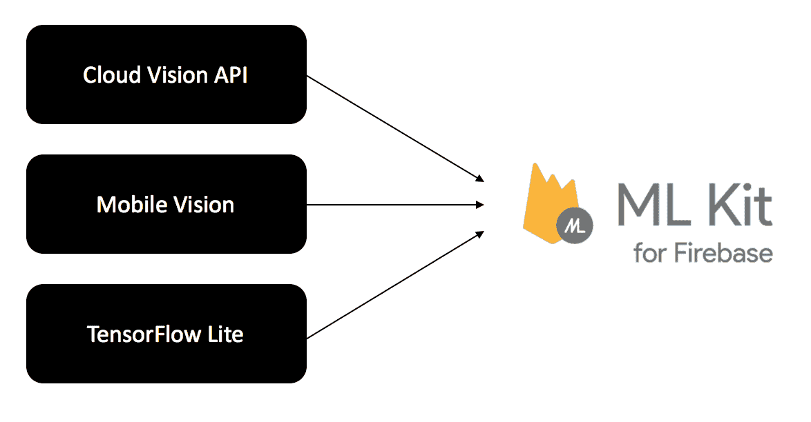


# 基本功能集

ML Kit 附带了一个现成的代码库，可用于常见情况，如从图像中检测人脸、条形码扫描、在图像中查找文本以及图像标记。通过将数据传递给 API，我们可以用几行代码获得基本用例查询的答案。

ML 工具包既提供了设备上的 API，也提供了云 API。根据我们的要求，我们可以使用这些服务中的任何一个。虽然设备上的 API 工作更快，但云 API 将提供更好的准确性。

并非所有的移动应用程序都属于 ML 工具包提供的默认 API。我们总会有自己的案子要通过 ML 来解决。ML Kit 支持将我们的定制 TensorFlow Lite 模型部署到云中，并作为一个层与您的模型进行交互。

在撰写本书时，ML Kit 在测试模式下提供了以下功能:

*   文本识别
*   人脸检测
*   条形码扫描
*   图像标注
*   地标检测

根据使用情况，这些功能可以通过设备上和基于云的检测来实现。例如，离线时从图像中检测人脸可以通过编程在设备上实现，而不是通过将图像上传到云并获得结果。与此同时，从图像中检测地标不能离线高效地完成，因为数据会随时间而变化，并且地标上的数据量将是巨大的。

我们将在将要构建的 Android 应用程序中涵盖上述每一项功能的一个基本示例。在开发应用程序时，在云中运行 ML 模型会带来两个主要问题:

*   这些应用程序需要使用互联网。我们通常在文本、图像、音频和视频之上应用 ML。根据我们的使用案例，我们最终可能会在数据带宽上花费更多。
*   应用程序不会只留在您身边。当设备中的数据离开您的设备时，您可能无法控制它。

记住这些问题，我们需要考虑构建一个更好的基于 ML 的应用程序。下表显示了每个 API 在本地设备和云中的可用性:

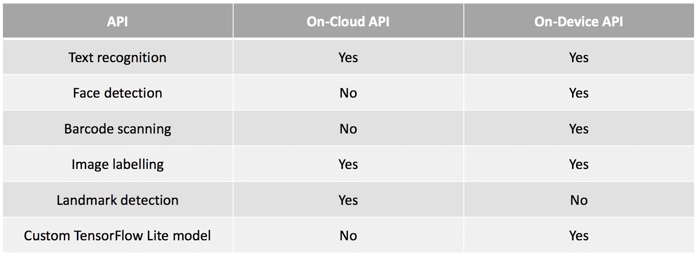


# 构建应用程序

我们现在将使用 Android Studio 安装一个新的 Android 应用程序。为此，安装最新的 Android Studio 并创建一个新项目，如下所示:

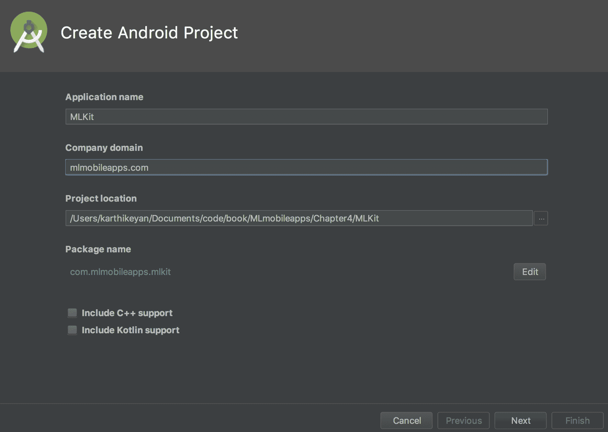

下一个截图描述了我们要瞄准的 Android API。选择 **API 15** 及以上版本几乎涵盖了所有现有的 Android 设备，因此建议使用:

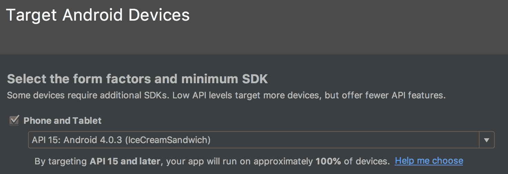


# 将 Firebase 添加到我们的应用程序中

我们已经创建了 Android Studio 应用程序，其中包含一个空白活动。如果您使用的是 Android Studio 2.2 或任何更高版本，请使用 Firebase 助手将您的应用程序连接到 Firebase。该助手将帮助您连接到现有的 Firebase 项目或创建一个新的项目。它还将安装所有必要的 *Gradle 依赖关系*。除此之外，我们还可以手动添加 Firebase 项目。

这个项目是使用 Android Studio 版本 3.1.3 构建的。

如果在您的**工具**部分没有找到 Firebase 助手，请转到文件|设置|构建、执行和部署|所需插件，然后添加 **Firebase 服务**。或者，您可以按照以下步骤手动添加它:

1.  前往[https://console.firebase.google.com/](https://console.firebase.google.com/)。下面的截图有助于我们理解我们的页面是什么样子的:

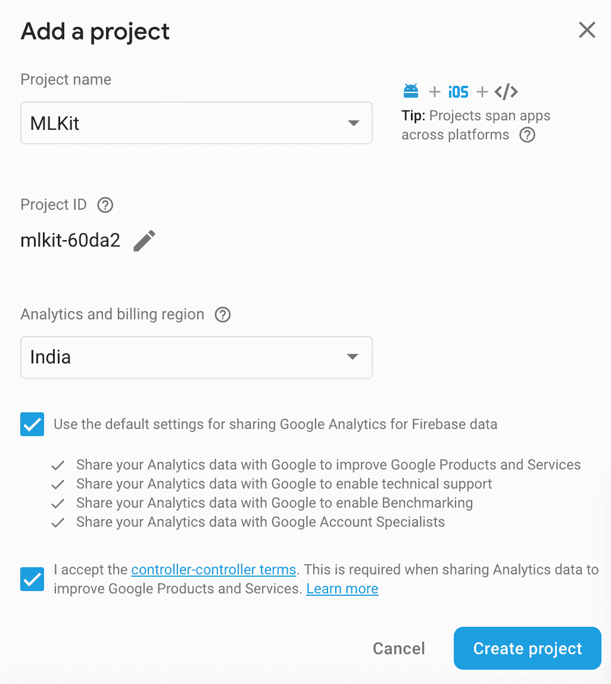

前面的屏幕截图显示了如何添加一个新项目。另一种方法是使用 Firebase 的现有项目。该应用程序支持跨 Android、iOS 和 web 平台的项目。之后，在 Firebase 控制台上添加更多关于您的应用程序的详细信息。您可以从应用程序的`app`文件夹下的`build.gradle`文件中获得您的 Android 软件包名称:

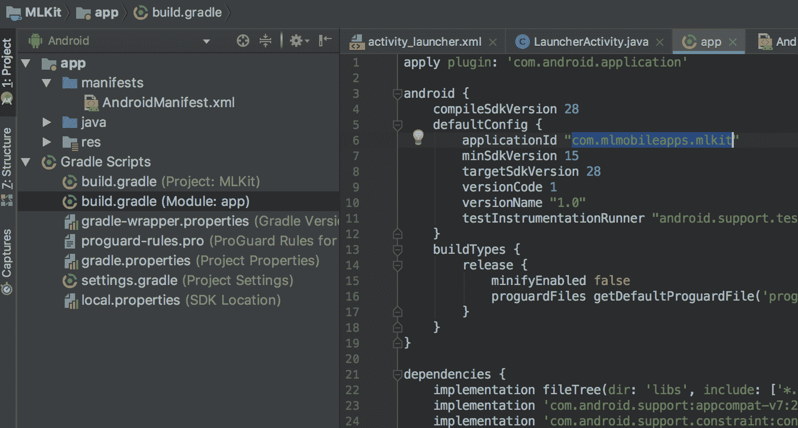

2.  下载`google-services.json`文件。

创建应用程序后，您可以从 Firebase 控件下载该文件:

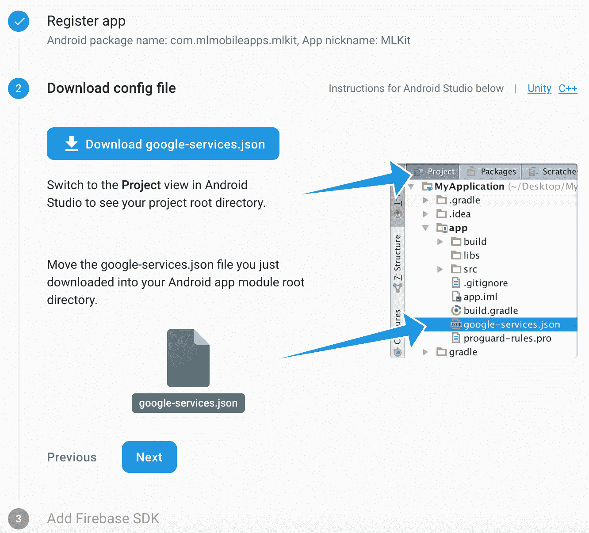

然后你可以将`.json`文件放入你的应用程序的`app`文件夹中。

3.  然后我们继续对`build.gradle`文件进行修改。您将需要在项目级和应用级`build.gradle`文件中进行更改。

项目级的`build.gradle`文件放在项目的主文件夹(`<project>/ build.gradle`)下:

```
buildscript {
    repositories {
        google()
        jcenter()
    }
    dependencies {
        classpath 'com.android.tools.build:gradle:3.1.3'
        classpath 'com.google.gms:google-services:4.0.0'
    }
}
```

app 级`build.gradle`文件放在以下文件夹下:`<project>/<app-module>/build.gradle`。在其中添加以下几行:

```
dependencies {

  // Add this line

  compile 'com.google.firebase:firebase-core:16.0.0'}

...

// Add to the bottom of the file

apply plugin: 'com.google.gms.google-services'
```

默认情况下，这包括 Firebase 的分析服务。

现在，单击 IDE 右上角的“立即同步”按钮。

完成后，在连接的 Android 设备或模拟器上运行应用程序:

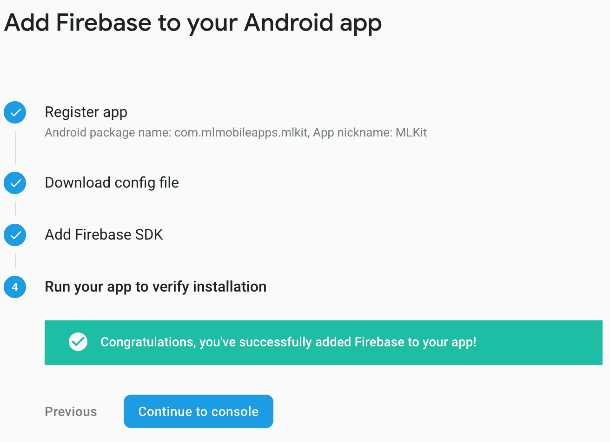

在前面的屏幕截图中看到的消息确认 Firebase 配置已经成功完成。现在，您可以看到控制台中的新应用程序下添加了一个用户。

现在，让我们开始在应用程序中构建特性。在我们开始之前，我们需要在应用程序级的`build.gradle`文件中添加 ML 套件依赖，如下所示:

```
dependencies {
  // You should always use the latest version 
  implementation 'com.google.firebase:firebase-ml-vision:16.0.0'
}
```

在 Firebase 中，你会被默认放在星火计划中。您可以升级到 Blaze 计划，以便使用 Cloud Vision APIs，根据免费计划，每月的请求限制为 1，000 次。在这一章中，我们将在一个直播摄像机上使用他们的所有设备上的模块。

通过设备上的培训，当我们第一次运行应用程序时，模型将自动下载。如果我们只想下载那些特定的模型，可以通过将以下元数据添加到您的应用程序`manifest`文件中来实现:

```
<application ...>
  ...
  <meta-data
      android:name="com.google.firebase.ml.vision.DEPENDENCIES"
      android:value="ocr" />
  <!-- To use multiple models: android:value="ocr, barcode, face, model4, model5" -->
</application>
```

特定模型的使用取决于应用。如果 ML 模型将成为你的应用体验的核心部分，这将是有意义的。否则，应该只在需要时才下载模型。这将减少移动设备上不必要的负载。

在我们正在构建的应用程序中，我们将启动摄像头视图，从这里我们将切换到 ML 套件中的所有设备上 ML 配置。

在相机视图的底部，我们将添加一个`spinner`，此时我们将选择当前的 ML 功能:

```
Spinner spinner = (Spinner) findViewById(R.id.spinner);
//Adding the list of items to be detected 
List<String> options = new ArrayList<>();
options.add(FACE_DETECTION);
options.add(TEXT_DETECTION);
options.add(BARCODE_DETECTION);
options.add(IMAGE_LABEL_DETECTION);
options.add(CLASSIFICATION);
// Creating adapter for spinner
ArrayAdapter<String> dataAdapter = new ArrayAdapter<>(this, 
                           R.layout.spinner_style, options);
// Drop down layout style - list view with radio button
dataAdapter.setDropDownViewResource(android.R.layout.simple_spinner_dro
                                    pdown_item);
// attaching data adapter to spinner
spinner.setAdapter(dataAdapter);
spinner.setOnItemSelectedListener(this);
```

基于用户的选择，摄像机视图将开始在实时摄像机视图中显示结果。让我们从面部检测开始。


# 人脸检测

通过人脸检测，您可以自动检测图像或视频中的人脸。这将报告人脸在媒体中的实际位置以及大小和方向。一旦一张脸被识别出来，我们就可以进一步检测它的其他身体部位，比如鼻子、眼睛和嘴巴。人脸检测 API 检测以下内容:

*   检测到的面部的包围盒
*   脸部的倾斜角度和旋转角度
*   鼻底、口腔底部、口腔左侧和口腔右侧的坐标
*   左眼睁开、右眼睁开并且此人微笑的概率

有几个术语与 ML 工具包的人脸检测功能相关联。


# 人脸方向跟踪

**人脸** **追踪**可以用来检测视频中的特定人脸。我们可以计算特定人脸出现的帧数，还可以根据人脸的位置和运动来检测两张人脸是否相似(这在视频中通常是可能的)。

使用欧拉角跟踪面部位置，欧拉角根据摄像机的角度确定面部的位置:

*   **欧拉 X** :欧拉 X 角为正的面朝上
*   **欧拉 Y** :一个有正欧拉 Y 角的面转向相机的右边和左边
*   **欧拉 Z** :欧拉 Z 角为正的面相对于相机逆时针旋转

这三个角度中，ML Kit 只支持欧拉 Z 角的检测；不支持欧拉 X 角，欧拉 Y 角只在相机运行在*精确*模式下测量。在*快速*模式下，相机会创建快捷方式以更快地获得结果。


# 陆标

ML 套件可以检测组成面部的**标志点**。这些标志点包括左眼、右眼、鼻根、嘴的左侧等等。

它独立于地标信息检测人脸，不使用地标信息作为识别整张脸的依据，所以默认不启用。

根据相关的欧拉 Y 角，可以识别以下所有地标:

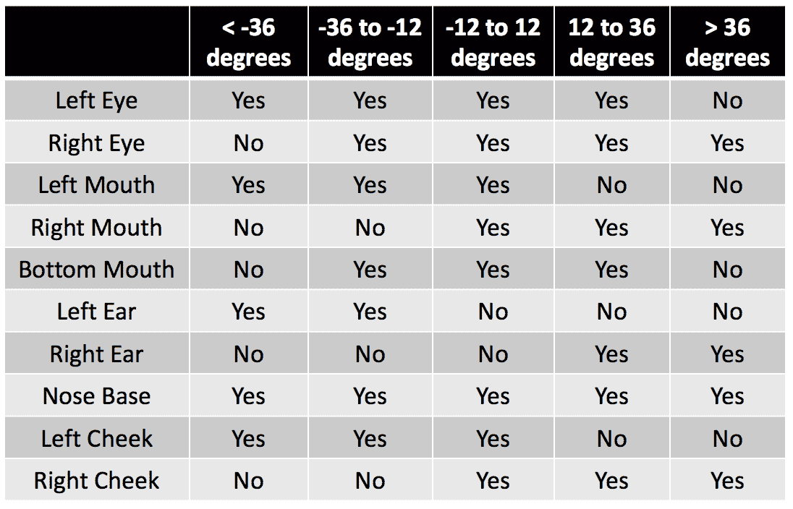

每个检测到的地标包括其在图像中的相关位置。下面是它的代码编写方式:

```
/** Draws the face annotations for position on the supplied canvas. */
@Override
public void draw(Canvas canvas) {
  FirebaseVisionFace face = firebaseVisionFace;
  if (face == null) {
    return;
  }

  // Draws a circle at the position of the detected face, with the   
  // face's track id below.
  float x = translateX(face.getBoundingBox().centerX());
  float y = translateY(face.getBoundingBox().centerY());

  canvas.drawCircle(x, y, FACE_POSITION_RADIUS, facePositionPaint);
  canvas.drawText("id: " + face.getTrackingId(), x + ID_X_OFFSET, y + 
                   ID_Y_OFFSET, idPaint);

  canvas.drawText("happiness: " + 
       String.format("%.2f",face.getSmilingProbability()),
       x + ID_X_OFFSET * 3,
       y - ID_Y_OFFSET, 
       idPaint);

  if (facing == CameraSource.CAMERA_FACING_FRONT) {
        canvas.drawText(
        "right eye: " + String.format("%.2f",                           
                            face.getRightEyeOpenProbability()), 
                            x - ID_X_OFFSET, 
                            y, 
                            idPaint);
        canvas.drawText("left eye: " + String.format("%.2f", 
                           face.getLeftEyeOpenProbability()), 
                           x + ID_X_OFFSET * 6, 
                           y,
                           idPaint);
  } 
  else 
  {
    canvas.drawText(
        "left eye: " + String.format("%.2f", 
                                face.getLeftEyeOpenProbability()),
                                x - ID_X_OFFSET, y, idPaint);
    canvas.drawText(
        "right eye: " + String.format("%.2f",                                              
                           face.getRightEyeOpenProbability()),
                           x + ID_X_OFFSET * 6, y, idPaint);
  }

  // Draws a bounding box around the face.
  float xOffset = scaleX(face.getBoundingBox().width() / 2.0f);
  float yOffset = scaleY(face.getBoundingBox().height() / 2.0f);
  float left = x - xOffset;
  float top = y - yOffset;
  float right = x + xOffset;
  float bottom = y + yOffset;
  canvas.drawRect(left, top, right, bottom, boxPaint);

  // draw landmarks
  drawLandmarkPosition(canvas, face, 
                       FirebaseVisionFaceLandmark.BOTTOM_MOUTH);
  drawLandmarkPosition(canvas, face, 
                       FirebaseVisionFaceLandmark.LEFT_CHEEK);
  drawLandmarkPosition(canvas, face,  
                       FirebaseVisionFaceLandmark.LEFT_EAR);
  drawLandmarkPosition(canvas, face, 
                       FirebaseVisionFaceLandmark.LEFT_MOUTH);
  drawLandmarkPosition(canvas, face, 
                       FirebaseVisionFaceLandmark.LEFT_EYE);
  drawLandmarkPosition(canvas, face, 
                       FirebaseVisionFaceLandmark.NOSE_BASE);
  drawLandmarkPosition(canvas, face, 
                       FirebaseVisionFaceLandmark.RIGHT_CHEEK);
  drawLandmarkPosition(canvas, face, 
                       FirebaseVisionFaceLandmark.RIGHT_EAR);
  drawLandmarkPosition(canvas, face, 
                       FirebaseVisionFaceLandmark.RIGHT_EYE);
  drawLandmarkPosition(canvas, face, 
                       FirebaseVisionFaceLandmark.RIGHT_MOUTH);
}

```

使用前面的代码，我们可以在一张脸上绘制面部标志位置，并在检测到的面部周围绘制一个边框矩形。


# 分类

**分类**用于根据某些面部特征对图像进行分类，例如眼睛是睁开还是闭上，以及此人是否在微笑。

分类以 0 到 1 之间的值表示。例如，在微笑分类中 0.7 或更大的幸福值可以分类该人在微笑。同样，眼睛是否睁开的状态也可以通过分类追踪。

这两种分类都依赖于地标检测。*睁眼*和*微笑*分类只在正面人脸上起作用。这意味着他们需要一个更小的欧拉 Y 角(+/- 18 度)来计算这些因子。


# 实现人脸检测

人脸检测需要将这个额外的依赖项添加到应用程序级的`build.gradle`文件中:

```
implementation 'com.google.firebase:firebase-ml-vision:16.0.0'

```


# 面部检测器配置

为了启动面部识别，我们需要创建一个`FirebaseVisionFaceDetectorOptions`实例。让我们创建一个新实例:

```
FirebaseVisionFaceDetectorOptions options = 
                            FirebaseVisionFaceDetectorOptions.Builder()
```

然后可以用不同属性的集合对其进行配置:

*   **检测模式**:检测人脸时偏向速度或精度。这可以设置为`ACCURATE_MODE` 或`FAST_MODE`。这默认为`FAST_MODE`:

```
.setModeType(FirebaseVisionFaceDetectorOptions.ACCURATE_MODE)
.setModeType(FirebaseVisionFaceDetectorOptions.FAST_MODE)
```

*   **界标检测**:确定是否尝试识别面部界标:眼睛、耳朵、鼻子、脸颊、嘴巴。默认为`NO_LANDMARKS`:

```
.setLandmarkType(FirebaseVisionFaceDetectorOptions.ALL_LANDMARKS)
.setLandmarkType(FirebaseVisionFaceDetectorOptions.NO_LANDMARKS)
```

*   **特征分类**:决定是否将人脸分类为*微笑*和*睁眼*等类别。这默认为`NO_CLASSIFICATIONS`:

```
.setClassificationType(FirebaseVisionFaceDetectorOptions.ALL_
                                      CLASSIFICATIONS)
.setClassificationType(FirebaseVisionFaceDetectorOptions.NO_
                                     CLASSIFICATIONS)
```

*   **最小面部尺寸**:这是相对于图像要检测的面部的最小尺寸:

```
.setMinFaceSize(0.15f)
```

*   **启用人脸跟踪**:决定是否给人脸分配一个 ID，用于跨图像跟踪人脸；

```
.setTrackingEnabled(true)
.setTrackingEnabled(false)
```

将所有这些放在一起，我们只剩下以下内容:

```
val options = FirebaseVisionFaceDetectorOptions.Builder()
        .setModeType(FirebaseVisionFaceDetectorOptions.FAST_MODE)
        .setLandmarkType(
            FirebaseVisionFaceDetectorOptions.ALL_LANDMARKS)      
        .setClassificationType(
            FirebaseVisionFaceDetectorOptions.ALL_CLASSIFICATIONS)
        .setMinFaceSize(0.20f)
        .setTrackingEnabled(true)
        .build()
```

如果您没有使用构建器设置任何选项，那么它们将会被设置为之前所述的默认值。


# 运行面部检测器

让我们看一下运行面部检测器的一步一步的过程。下图显示了面部的边界框以及所有面部标志位置标记:

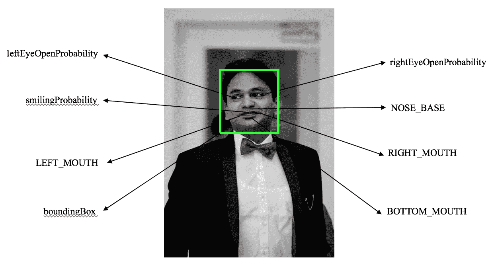

边界框是由两个经度和两个纬度定义的区域，其中:纬度是介于-90.0 和 90.0 之间的十进制数，经度是介于-180.0 和 180.0 之间的十进制数。


# 第一步:从输入创建一个 FirebaseVisionImage

为了运行人脸检测，我们需要创建一个`FirebaseVisionFace`类的实例。创建一个`FirebaseVisionFace`对象有五种方法。该对象可以从位图、字节缓冲区、`media.Image`、字节数组或设备上的文件中创建。

然后，创建的`FirebaseVisionImage`对象将被传递给`FirebaseVisionFaceDetector`对象的`detectInImage()`方法。


# 使用位图

让我们使用一个位图实例来创建这个`FirebaseVisionImage`实例，其中图像中的对象应该向右切换，不需要旋转。我们可以通过将位图传递给`fromBitmap()`函数来创建实例；这将给我们一个如下的`FirebaseVisionImage`:

```
FirebaseVisionImage myImage = FirebaseVisionImage.fromBitmap(bitmap);
```


# 来自媒体。图像

让我们使用一个`media.Image`实例来创建一个`FirebaseVisionImage`的实例。从设备的摄像头捕捉图像时，可能会出现这种情况。在这样做的时候，我们必须传递这个图像的实例以及它的旋转，所以这必须在调用`fromMediaImage()`函数之前进行计算。

旋转功能如下:

```
private static final SparseIntArray ORIENTATIONS = new 
                                                   SparseIntArray();
static {
    ORIENTATIONS.append(Surface.ROTATION_0, 90);
    ORIENTATIONS.append(Surface.ROTATION_90, 0);
    ORIENTATIONS.append(Surface.ROTATION_180, 270);
    ORIENTATIONS.append(Surface.ROTATION_270, 180);
}

/**
 * Get the angle by which an image must be rotated given the device's 
   current orientation.
 */
@RequiresApi(api = Build.VERSION_CODES.LOLLIPOP)
private int getRotationCompensation(String cameraId, Activity activity, 
                                    Context context)
        throws CameraAccessException {
    // Get the device's current rotation relative to its "native"    
    // orientation.
    // Then, from the ORIENTATIONS table, look up the angle the image      
    // must be rotated to compensate for the device's rotation.
    int deviceRotation = 
        activity.getWindowManager().getDefaultDisplay().getRotation();
        int rotationCompensation = ORIENTATIONS.get(deviceRotation);

 // On most devices, the sensor orientation is 90 degrees, but for some
// devices it is 270 degrees. For devices with a sensor orientation of
// 270, rotate the image an additional 180 ((270 + 270) % 360) degrees.
    CameraManager cameraManager = (CameraManager) context.getSystemService(CAMERA_SERVICE);
    int sensorOrientation = cameraManager
            .getCameraCharacteristics(cameraId)
            .get(CameraCharacteristics.SENSOR_ORIENTATION);
    rotationCompensation = (rotationCompensation + sensorOrientation + 
                            270) % 360;

// Return the corresponding FirebaseVisionImageMetadata rotation value.
    int result;
    switch (rotationCompensation) {
        case 0:
            result = FirebaseVisionImageMetadata.ROTATION_0;
            break;
        case 90:
            result = FirebaseVisionImageMetadata.ROTATION_90;
            break;
        case 180:
            result = FirebaseVisionImageMetadata.ROTATION_180;
            break;
        case 270:
            result = FirebaseVisionImageMetadata.ROTATION_270;
            break;
        default:
            result = FirebaseVisionImageMetadata.ROTATION_0;
            Log.e(TAG, "Bad rotation value: " + rotationCompensation);
    }
    return result;
}
```

然后将结果传递给方法，如下所示:

```
FirebaseVisionImage myImage = 
              FirebaseVisionImage.fromMediaImage(mediaImage, rotation);
```


# 来自字节缓冲器

让我们使用 ByteBuffer 创建这个`FirebaseVisionImage`的实例。然而，要做到这一点，我们必须首先创建一个`FirebaseVisionImageMetadata`的实例。这包含构建视觉图像所需的数据，如格式、旋转和测量值(高度和宽度)，如下所示:

```
FirebaseVisionImageMetadata metadata = new 
    FirebaseVisionImageMetadata.Builder()
        .setWidth(1280)
        .setHeight(720)
        .setFormat(FirebaseVisionImageMetadata.IMAGE_FORMAT_NV21)
        .setRotation(rotation)
        .build();
```

然后，我们可以将其与 ByteBuffer 一起传递，以创建以下实例:

```
FirebaseVisionImage myImage = 
                FirebaseVisionImage.fromByteBuffer(buffer, metadata);
```


# 从字节数组

从 ByteArray 创建图像的工作方式与 ByteBuffer 相同，只是我们必须使用`fromByteArray()`函数:

```
FirebaseVisionImage myImage = 
              FirebaseVisionImage.fromByteArray(byteArray, metadata);
```


# 从文件中

通过使用上下文和所需的**统一资源标识符** ( **URI** )调用`fromFilePath()`函数，可以从文件中创建一个视觉图像实例:

```
val image: FirebaseVisionImage?
try {
    image = FirebaseVisionImage.fromFilePath(context, uri);
} catch (IOException e) {
    e.printStackTrace();
}
```


# 第二步:创建 FirebaseVisionFaceDetector 对象的实例

`FirebaseVisionFaceDetector`检测输入图像中的`<FirebaseVisionFace>`个实例。运行人脸检测器后，创建一个`FirebaseVisionFaceDetector`的实例，如下所示:

```
FirebaseVisionFaceDetector detector = FirebaseVision.getInstance()
.getVisionFaceDetector(options);   
```

前面的方法返回一个任务，该任务异步返回一个检测到的`FirebaseVisionFaces` ( `Task<List<FirebaseVisionFace>>`)列表。然后，创建的对象将被传递给图像检测方法。

一定要记住检查控制台中由构造函数生成的错误。


# 第三步:图像检测

基于映像检测，侦听器回调将进入成功或失败方法。输出将包含带有边界框的已识别面的列表。

最后，将图像传递给`detectInImage()`方法，如下所示:

```
@Override
protected Task<List<FirebaseVisionFace>> detectInImage(FirebaseVisionImage image) {
  return detector.detectInImage(image);
}

@Override
protected void onSuccess(
    @NonNull List<FirebaseVisionFace> faces,
    @NonNull FrameMetadata frameMetadata,
    @NonNull GraphicOverlay graphicOverlay) {
  graphicOverlay.clear();
  for (int i = 0; i < faces.size(); ++i) {
    FirebaseVisionFace face = faces.get(i);
    FaceGraphic faceGraphic = new FaceGraphic(graphicOverlay);
    graphicOverlay.add(faceGraphic);
    faceGraphic.updateFace(face, frameMetadata.getCameraFacing());
  }
}

@Override
protected void onFailure(@NonNull Exception e) {
  Log.e(TAG, "Face detection failed " + e);
}
```


# 从检测到的人脸中检索信息

如果面部识别操作成功，一列`FirebaseVisionFace`对象将被传递给成功的监听器。每个`FirebaseVisionFace`对象代表图像中检测到的一张脸。对于每个面部，您可以获得其在输入图像中的边界坐标，以及您配置面部检测器查找的任何其他信息:

```
for (FirebaseVisionFace face : faces) {
    Rect bounds = face.getBoundingBox();
    float rotY = face.getHeadEulerAngleY();  // Head is rotated to the 
                                                right rotY degrees
    float rotZ = face.getHeadEulerAngleZ();  // Head is tilted sideways 
                                                rotZ degrees

   // If landmark detection was enabled (mouth, ears, eyes, cheeks, and
   // nose available):
    FirebaseVisionFaceLandmark leftEar = 
             face.getLandmark(FirebaseVisionFaceLandmark.LEFT_EAR);
    if (leftEar != null) {
        FirebaseVisionPoint leftEarPos = leftEar.getPosition();
    }

    // If classification was enabled:
    if (face.getSmilingProbability() != 
             FirebaseVisionFace.UNCOMPUTED_PROBABILITY) {
        float smileProb = face.getSmilingProbability();
    }
    if (face.getRightEyeOpenProbability() != 
          FirebaseVisionFace.UNCOMPUTED_PROBABILITY) {
            float rightEyeOpenProb = face.getRightEyeOpenProbability();
    }

    // If face tracking was enabled:
    if (face.getTrackingId() != FirebaseVisionFace.INVALID_ID) {
        int id = face.getTrackingId();
    }
}
```

有了这个，我们就可以用 ML 工具包来研究人脸检测器了。现在，去我们的仓库直接从那里提取代码:

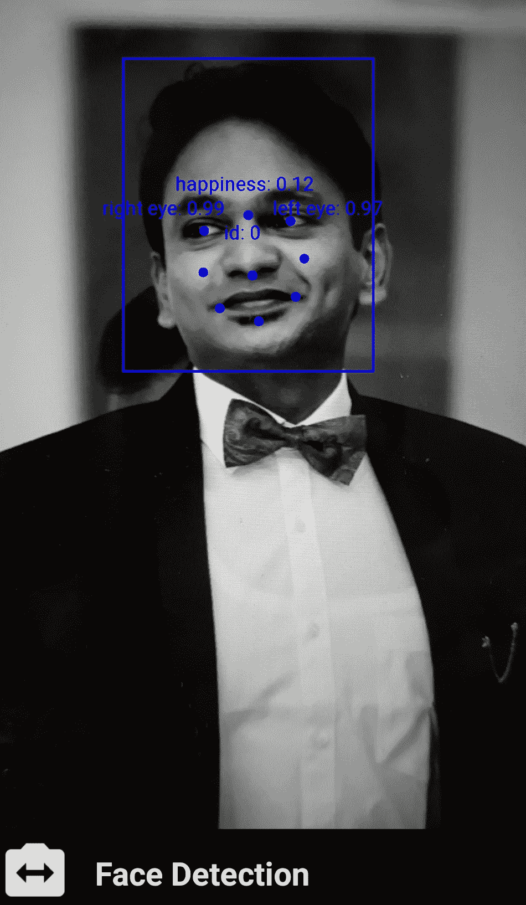

这是我们本章知识库的链接:[https://g](https://github.com/intrepidkarthi/MLmobileapps/tree/master/Chapter4)[it](https://github.com/intrepidkarthi/MLmobileapps/tree/master/Chapter4)[hub.com/intrepidkarthi/MLmobileapps/tree/master/Chapter4](https://github.com/intrepidkarthi/MLmobileapps/tree/master/Chapter4)。以及[https://github . com/packt publishing/Machine-Learning-Projects-for-Mobile-Applications](https://github.com/PacktPublishing/Machine-Learning-Projects-for-Mobile-Applications)。


# 条形码扫描仪

现在让我们开始使用 ML Kit 实现一个基于移动设备的条形码扫描仪。条形码有多种格式。ML 试剂盒支持下列所有格式:

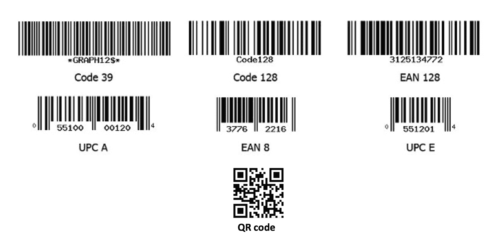

一旦在摄像机视图上识别了条形码，`draw`方法将边界框连同检测到的条形码的原始值放在它的上面。以下代码在提供的`canvas`上绘制位置、大小和原始值的条形码块注释:

```
/**
 * Draws the barcode block annotations
*/
@Override
public void draw(Canvas canvas) {
  if (barcode == null) {
    throw new IllegalStateException("Attempting to draw a null 
                                     barcode.");
  }

  // Draws the bounding box around the BarcodeBlock.
  RectF rect = new RectF(barcode.getBoundingBox());
  rect.left = translateX(rect.left);
  rect.top = translateY(rect.top);
  rect.right = translateX(rect.right);
  rect.bottom = translateY(rect.bottom);
  canvas.drawRect(rect, rectPaint);

  // Renders the barcode at the bottom of the box.
  canvas.drawText(barcode.getRawValue(), rect.left, rect.bottom, 
                  barcodePaint);
}
```

如果我们知道将要读取的条形码格式，我们可以通过仅在配置设置时检测该格式来加快过程。例如，为了检测 QR 码，让我们通过设置如下所示的条形码格式来创建`FirebaseVisionBarcodeDetectorOptions`实例:

```
FirebaseVisionBarcodeDetectorOptions options =
        new FirebaseVisionBarcodeDetectorOptions.Builder()
        .setBarcodeFormats(FirebaseVisionBarcode.FORMAT_QR_CODE)
        .build();
```

现在我们已经定义了这个选项，我们可以使用我们的`FirebaseVision`实例的`get`函数，传入我们的`options`实例:

```
val detector =          
       FirebaseVision.getInstance().getVisionBarcodeDetector(options)
```


# 第一步:创建 FirebaseVisionImage 对象

在构建选项之后，我们可以继续进行识别。与我们对人脸检测所做的类似，`FirebaseVisionImage`对象可以从位图、ByteBuffer、`media.Image`、ByteArray 或设备上的文件中创建。


# 从位图

让我们使用位图创建这个`FirebaseVisionImage`的实例。首先，让我们将一个位图传递给`fromBitmap()`方法，这将返回一个`FirebaseVisionImage`:

```
FirebaseVisionImage image = FirebaseVisionImage.fromBitmap(bitmap);
```


# 来自媒体。图像

让我们使用一个`media.Image`实例来创建这个`FirebaseVisionImage`实例。这将使用设备摄像头捕捉。在图像被捕获之后，我们也需要将它传递给`rotation`方法。必须在调用`fromMediaImage()`方法之前调用`rotation`。给定设备的当前方向，下面的方法获取图像必须旋转的角度:

```
@RequiresApi(api = Build.VERSION_CODES.LOLLIPOP)
private int getRotationCompensation(String cameraId, Activity activity,  
                                    Context context)
        throws CameraAccessException {
// Get the device's current rotation relative to its "native"     
   orientation.
// Then,from the ORIENTATIONS table,look up the angle the image must be
// rotated to compensate for the device's rotation.
    int deviceRotation =  
        activity.getWindowManager().getDefaultDisplay().getRotation();
    int rotationCompensation = ORIENTATIONS.get(deviceRotation);

 // On most devices, the sensor orientation is 90 degrees, but for some
 // devices it is 270 degrees. For devices with a sensor orientation of
 // 270, rotate the image an additional 180 ((270 + 270) % 360)  
    degrees.
    CameraManager cameraManager = (CameraManager) context.getSystemService(CAMERA_SERVICE);
    int sensorOrientation = cameraManager
            .getCameraCharacteristics(cameraId)
            .get(CameraCharacteristics.SENSOR_ORIENTATION);
    rotationCompensation = (rotationCompensation + sensorOrientation + 
                            270) % 360;

// Return the corresponding FirebaseVisionImageMetadata rotation value.
    int result;
    switch (rotationCompensation) {
        case 0:
            result = FirebaseVisionImageMetadata.ROTATION_0;
            break;
        case 90:
            result = FirebaseVisionImageMetadata.ROTATION_90;
            break;
        case 180:
            result = FirebaseVisionImageMetadata.ROTATION_180;
            break;
        case 270:
            result = FirebaseVisionImageMetadata.ROTATION_270;
            break;
        default:
            result = FirebaseVisionImageMetadata.ROTATION_0;
            Log.e(TAG, "Bad rotation value: " + rotationCompensation);
    }
    return result;
}
```

前面的方法与我们用于面部检测的方法相同:

```
FirebaseVisionImage image = 
           FirebaseVisionImage.fromMediaImage(mediaImage, rotation);
```


# 来自 ByteBuffer

让我们使用 ByteBuffer 创建这个`FirebaseVisionImage`的实例。然而，为了做到这一点，我们必须首先创建一个`FirebaseVisionImageMetadata`的实例。这包含构建视觉图像所需的数据，例如旋转和测量，如下所述:

```
FirebaseVisionImageMetadata metadata = new 
    FirebaseVisionImageMetadata.Builder()
        .setWidth(1280)
        .setHeight(720)
        .setFormat(FirebaseVisionImageMetadata.IMAGE_FORMAT_NV21)
        .setRotation(rotation)
        .build();
```

通过前面的实例，我们得到了输入图像的宽度和高度。它可以根据您的应用需求进行配置。

如果想了解更多图片格式参数，可以查看:[https://developer . Android . com/reference/Android/graphics/image format](https://developer.android.com/reference/android/graphics/ImageFormat)。

然后，我们可以将其与 ByteBuffer 一起传递，以创建以下实例:

```
FirebaseVisionImage image = FirebaseVisionImage.fromByteBuffer(buffer, 
                            metadata);
```


# 来自 ByteArray

ByteBuffer 就像一个构建器来创建一个`byte[]`。与数组不同，它有更多的助手方法。从 ByteArray 创建图像的工作方式与 ByteBuffer 相同，只是我们必须使用如下所示的`fromByteArray()`函数:

```
FirebaseVisionImage image =  
            FirebaseVisionImage.fromByteArray(byteArray, metadata);
```


# 从文件

通过使用上下文和 URI 调用`fromFilePath()`函数，可以从文件中创建一个视觉图像实例:

```
val image: FirebaseVisionImage?
try {
    image = FirebaseVisionImage.fromFilePath(context, uri);
} catch (IOException e) {
    e.printStackTrace();
}
```


# 第二步:创建 FirebaseVisionBarcodeDetector 对象

`FirebaseVisionBarcodeDetector`识别提供的`FirebaseVisionImage`中的条形码(各种一维和二维格式),如下所示:

```
FirebaseVisionBarcodeDetector detector = FirebaseVision.getInstance().getVisionBarcodeDetector();
// Or, we can specify the formats to recognize:
FirebaseVisionBarcodeDetector detector = 
FirebaseVision.getInstance().getVisionBarcodeDetector(options);
```


# 第三步:条形码检测

基于映像检测，侦听器回调将进入成功或失败方法。输出将包含如下已识别的`FirebaseVisionBarcode`对象列表:

```
@Override
protected Task<List<FirebaseVisionBarcode>> detectInImage(FirebaseVisionImage image) {
    return detector.detectInImage(image);
}

@Override
protected void onSuccess(
        @NonNull List<FirebaseVisionBarcode> barcodes,
        @NonNull FrameMetadata frameMetadata,
        @NonNull GraphicOverlay graphicOverlay) {
    graphicOverlay.clear();
    for (int i = 0; i < barcodes.size(); ++i) {
        FirebaseVisionBarcode barcode = barcodes.get(i);
        BarcodeGraphic barcodeGraphic = new BarcodeGraphic(graphicOverlay, barcode);
        graphicOverlay.add(barcodeGraphic);
    }
}

@Override
protected void onFailure(@NonNull Exception e) {
    Log.e(TAG, "Barcode detection failed " + e);
}
```

成功检测到一个或多个条形码后，需要将`FirebaseVisionBarcode`对象传递给方法，以便从检测到的条形码中获取数据。根据条形码的类型，我们得到相应的输出如下:

```
for (FirebaseVisionBarcode barcode: barcodes) {
    //Returns a Rect instance that contains the bounding box for the recognized barcode
    Rect bounds = barcode.getBoundingBox();

//Returns the coordinates for each corner of the barcode.
    Point[] corners = barcode.getCornerPoints();

//Returns the barcode value in its raw format
    String rawValue = barcode.getRawValue();

//Returns the format type of the barcode
    int valueType = barcode.getValueType();

// See API reference for complete list of supported types
    switch (valueType) {
        case FirebaseVisionBarcode.TYPE_WIFI:
            String ssid = barcode.getWifi().getSsid();
            String password = barcode.getWifi().getPassword();
            int type = barcode.getWifi().getEncryptionType();
            break;
        case FirebaseVisionBarcode.TYPE_URL:
            String title = barcode.getUrl().getTitle();
            String url = barcode.getUrl().getUrl();
            break;
    }
}
```

这样，我们现在应该能够使用 ML 试剂盒进行条形码扫描。这将是任何零售商业应用的便利工具:

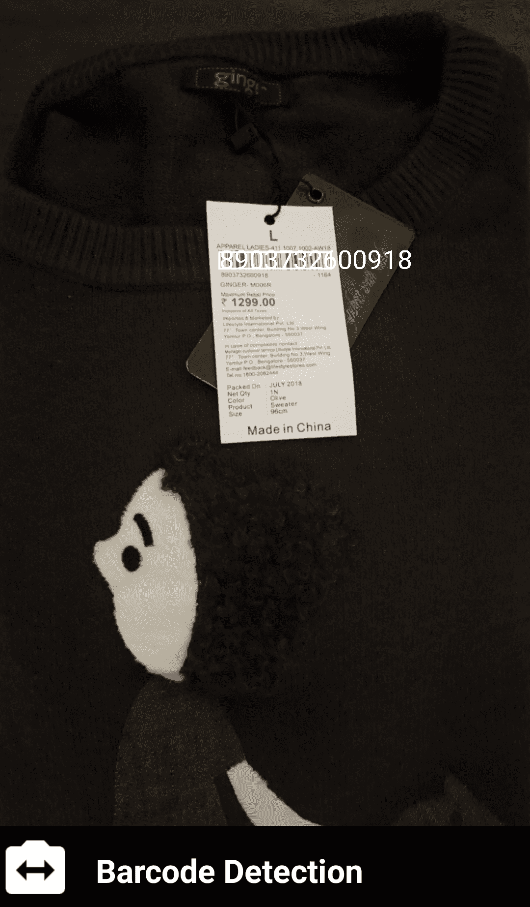

现在，让我们去我们的存储库，从那里提取代码，并开始您的实验。

这是我们本章知识库的链接:[https://g](https://github.com/intrepidkarthi/MLmobileapps/tree/master/Chapter4)ithub.com/intrepidkarthi/MLmobileapps/tree/master/Chapter4。以及[https://github . com/packt publishing/Machine-Learning-Projects-for-Mobile-Applications](https://github.com/PacktPublishing/Machine-Learning-Projects-for-Mobile-Applications)。


# 文本识别

在面部检测和条形码扫描之后，让我们构建一个应用程序来从输入图像或相机馈送中识别文本。这种方法叫做**光学字符识别** ( **OCR** )。文本识别既支持设备上的识别，也支持基于云的识别。


# 设备上的文本识别

让我们跳过我们用于面部检测和条形码扫描的默认方法。

在创建了`FirebaseVisionImage`对象后，我们将创建`detector`实例，在这里我们将传递如下所示的`VisionImage`对象，类似于我们之前在人脸检测和条形码扫描中所做的:

```
FirebaseVisionTextDetector detector = FirebaseVision.getInstance()
        .getVisionTextDetector();
```


# 检测设备上的文本

对于文本检测，将图像对象从`detector`实例传递给`detectInImage()`方法。下面的代码块用于实现这一点:

```
Task<FirebaseVisionText> result =
        detector.detectInImage(image)
                .addOnSuccessListener(new OnSuccessListener<FirebaseVisionText>() {
                    @Override
                    public void onSuccess(FirebaseVisionText firebaseVisionText) {
                        // Task completed successfully
                        // ...
                    }
                })
                .addOnFailureListener(
                        new OnFailureListener() {
                            @Override
                            public void onFailure(@NonNull Exception e) {
                                // Task failed with an exception
                                // ...
                            }
                        });
```

成功识别文本后，我们可以使用下面的代码块解析`FirebaseVisionText`对象以进一步处理它:

```
for (FirebaseVisionText.Block block: firebaseVisionText.getBlocks()) {
    Rect boundingBox = block.getBoundingBox();
    Point[] cornerPoints = block.getCornerPoints();
    String text = block.getText();

    for (FirebaseVisionText.Line line: block.getLines()) {
        // ...
        for (FirebaseVisionText.Element element: line.getElements()) {
            // ...
        }
    }
}
```

既然我们已经熟悉了在任何给定媒体中查找人脸、条形码和文本，那么让我们来看一个如何在云中进行文本识别的示例:


# 基于云的文本识别

要使用基于云的检测，我们需要在开发人员控制台上为您的项目启用 Google Vision API。云 API 需要额外的费用，但是每月对 API 的前 1000 次调用是免费的。无论如何，您仍然需要输入您的信用卡信息以确保订阅计划的安全。根据你的需要选择这个。


# 配置检测器

我们需要配置`FirebaseVisionCloudDetectorOptions`对象。默认情况下，云检测器使用该模型的`STABLE`版本，并返回多达十个结果。但是，我们可以根据自己的需要进行更改，并将参数设置如下:

```
FirebaseVisionCloudDetectorOptions options =
 new FirebaseVisionCloudDetectorOptions.Builder()
 .setModelType(FirebaseVisionCloudDetectorOptions.LATEST_MODEL)
 .setMaxResults(12)
 .build();
```

要使用默认设置，我们可以在下一步使用`FirebaseVisionCloudDetectorOptions.DEFAULT`。

在这之后，我们创建了`FirebaseVisionImage`对象。由于这在前面的人脸检测器和条形码扫描仪的实现中已经讨论过，我们将在这里跳过这一部分。

创建一个`detector`实例来传递图像对象:

```
FirebaseVisionCloudTextDetector detector = FirebaseVision.getInstance()
        .getVisionCloudTextDetector();
// Or, to change the default settings:
// FirebaseVisionCloudTextDetector detector = FirebaseVision.getInstance()
//         .getVisionCloudTextDetector(options);
```

现在，我们可以将图像对象传递给`detectInImage()`方法:

```
Task<FirebaseVisionCloudText> result = detector.detectInImage(image)
        .addOnSuccessListener(new OnSuccessListener<FirebaseVisionCloudText>() {
            @Override
            public void onSuccess(FirebaseVisionCloudText firebaseVisionCloudText) {
                // Task completed successfully
                // ...
            }
        })
        .addOnFailureListener(new OnFailureListener() {
            @Override
            public void onFailure(@NonNull Exception e) {
                // Task failed with an exception
                // ...
            }
        });
```

成功检测到文本后，我们将得到一个文本块列表。然后，我们可以处理输出，以便进一步进行如下操作:

```
String recognizedText = firebaseVisionCloudText.getText();

for (FirebaseVisionCloudText.Page page: firebaseVisionCloudText.getPages()) {
    List<FirebaseVisionCloudText.DetectedLanguage> languages =
            page.getTextProperty().getDetectedLanguages();
    int height = page.getHeight();
    int width = page.getWidth();
    float confidence = page.getConfidence();

    for (FirebaseVisionCloudText.Block block: page.getBlocks()) {
        Rect boundingBox = block.getBoundingBox();
        List<FirebaseVisionCloudText.DetectedLanguage> blockLanguages =
                block.getTextProperty().getDetectedLanguages();
        float blockConfidence = block.getConfidence();
        // And so on: Paragraph, Word, Symbol
    }
}
```


# 摘要

在这一点上，我们很容易实现基于移动设备的 ML 应用程序的基本功能，包括文本内检测、人脸检测和条形码扫描。同样，我们可以通过云 API 实现图像标注和地标检测。我们现在应该能够看到 ML Kit 涵盖了基于移动的 ML 应用程序的基本需求。

在下一章，我们将继续构建类似于 Snapchat 上可用的**增强现实** ( **AR** )过滤器。