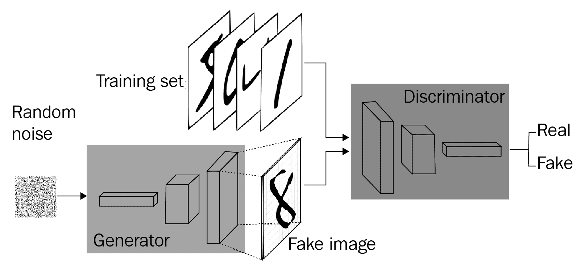
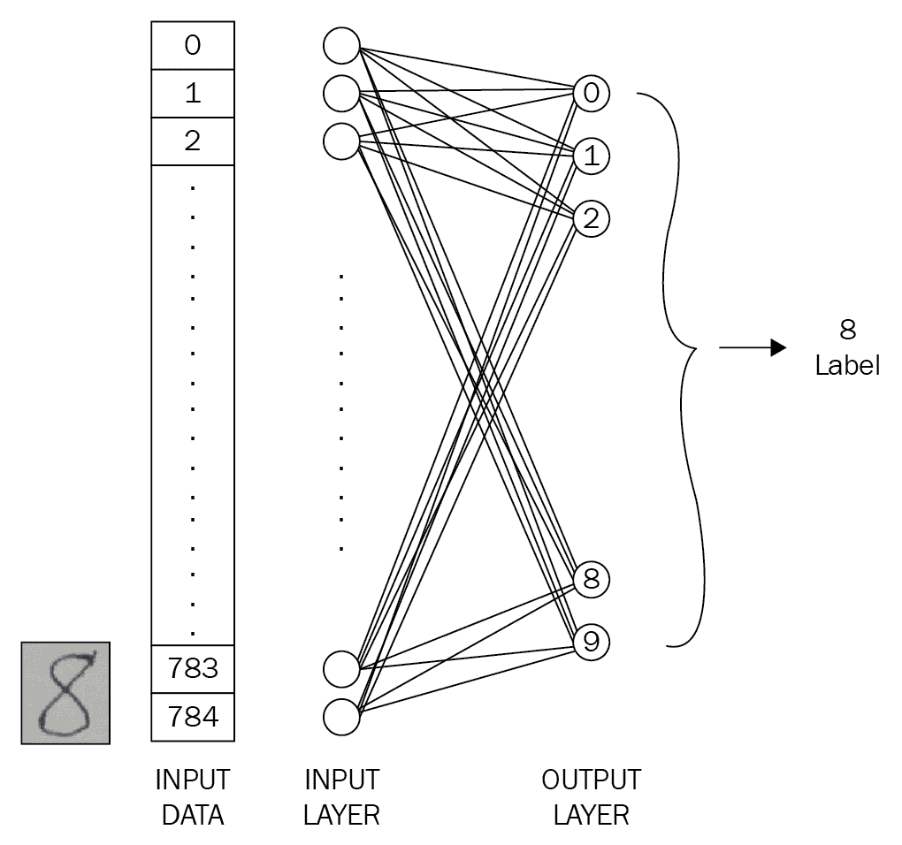
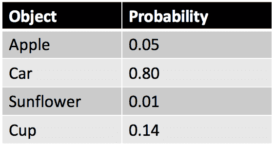
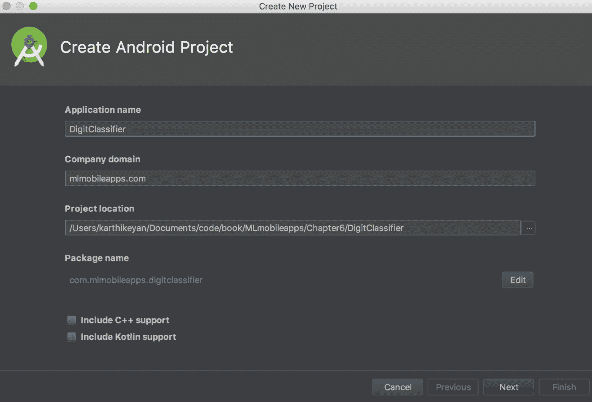
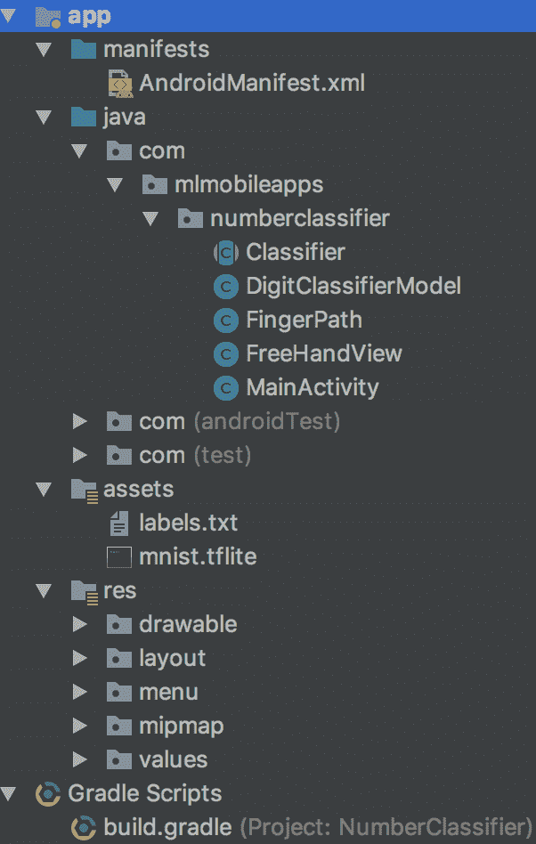
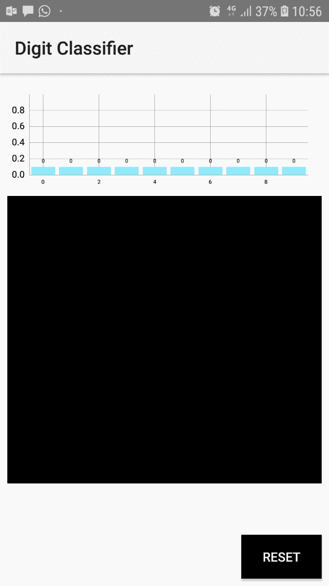
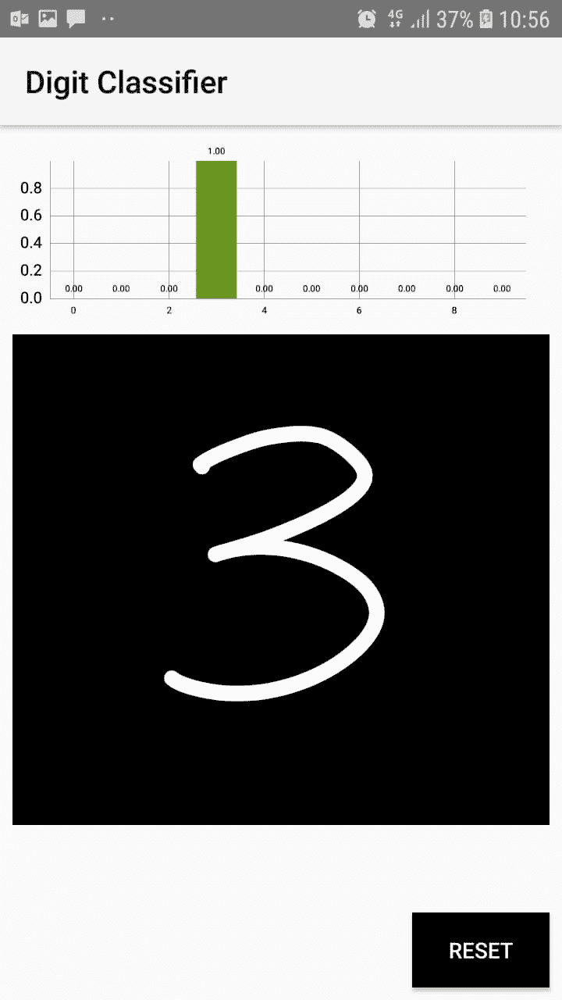
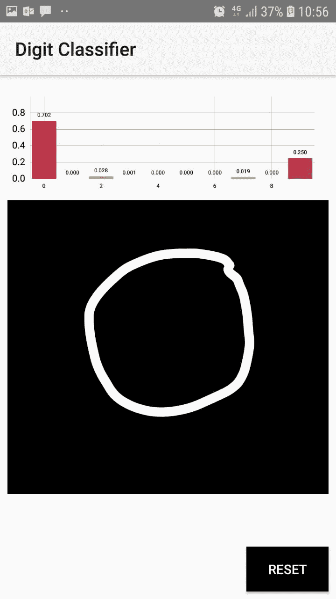
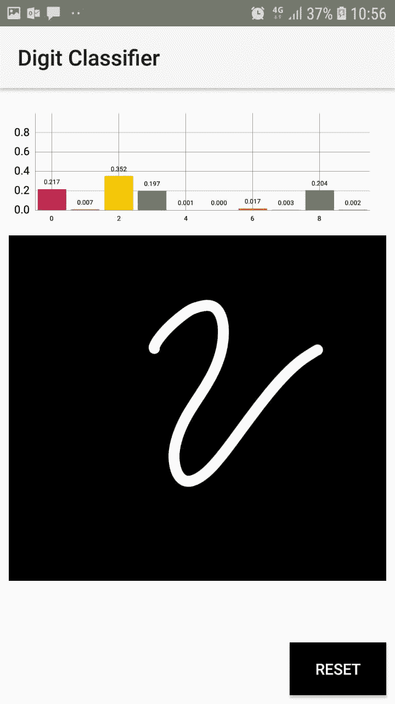

# 六、使用对抗学习的手写数字分类器

在这一章中，我们将构建一个 Android 应用，它可以识别自由手写并使用对抗性学习对数字进行分类。我们将使用 MNIST 数据集进行数字分类。我们将研究**生成对抗网络** ( **甘斯**)的基础知识。

在本章中，我们将详细了解以下内容:

*   GAN 基础
*   了解**修改后的国家标准技术研究院** ( **MNIST** )数据库
*   构建分类器
*   构建 Android 应用

这个应用的代码可以在 https://github . com/intrepidkarthi/MLmobileapps/tree/master/chapter 6 找到。以及[https://github . com/packt publishing/Machine-Learning-Projects-for-Mobile-Applications](https://github.com/PacktPublishing/Machine-Learning-Projects-for-Mobile-Applications)。


# 生成对抗网络

GANs 是一类用于无监督 ML 的**机器学习** ( **ML** )算法，由两个相互竞争的深度神经网络组成(因此单词 *adversarial* )。2014 年，Ian Goodfellow 和蒙特利尔大学的其他研究人员(包括 Yoshua Bengio)引入了 gan。

伊恩·古德菲勒关于甘的论文:[著](https://arxiv.org/abs/1406.2661)。

gan 有模仿任何数据的潜力。这意味着 GANs 可以被训练来创建任何数据的相似版本，如图像、音频或文本。举个简单的例子，佳士得以 432，000 美元的价格出售了一幅由 GANs 基于斯坦福大学的 Robbie Barrat 编写的开源代码生成的肖像。

GAN 的简单工作流程如下图所示:




# 生成算法与判别算法

要理解 GANs，我们应该知道判别和生成算法是如何工作的。判别算法尝试预测标签并对输入数据进行分类，或者将它们归类到数据所属的位置。另一方面，生成算法试图预测给定某个标签的特征。

例如，判别算法可以预测电子邮件消息是垃圾邮件还是非垃圾邮件。这里， *spam* 是其中一个标签，从消息中抓取的文本被认为是输入数据。如果你认为标签为 *y* ，输入为 *x* ，我们可以用公式表示如下:

*p(y|x)*

这意味着在给定 *x* 的情况下 *y* 的概率，也就是说在给定包含单词的情况下*电子邮件是垃圾邮件的概率。*

另一方面，生成算法试图猜测这些输入特征 *x* 的可能性有多大。生成模型关心的是*你如何得到 x* ，而判别模型关心的是 *y* 和 *x* 之间的关系。

按照我们在本章中使用 MNIST 数据库的例子，生成器将生成图像并将它们传递给鉴别器。如果图像确实来自 MNIST 数据集，鉴别器将对其进行认证。生成器生成图像，希望它能通过鉴别器，希望它能被验证，即使它是假的，如上图所示。


# GAN 中的步骤

基于我们的示例，假设我们正在传递数字作为输入:

1.  生成器将随机数作为输入，并返回一个图像作为输出。
2.  输出图像被传入鉴别器，同时鉴别器也接收来自数据集的输入。
3.  鉴别器接受真实和伪造的输入图像，并返回介于 0 和 1 之间的概率，其中 *1* 表示对真实性的预测，而 *0* 表示伪造。

在我们的应用中，我们通过将用户手绘的图像作为伪图像之一进行传递，并尝试获取它的概率值，来表示相同的情况。


# 了解 MNIST 数据库

MNIST 数据集由 60，000 个手写数字组成。它还包含一个由 10，000 个数字组成的测试数据集。虽然它是 NIST 数据集的一个子集，但该数据集中的所有数字都经过了大小归一化，并以 28 x 28 像素大小的图像为中心。这里每个像素都包含一个 0-255 的灰度值。

可以在 http://yann.lecun.com/exdb/mnist/的
T3 找到 MNIST 数据集。
https://www.nist.gov/srd/nist-special-database-19
可以找到 NIST 数据集。


# 构建张量流模型

在这个应用中，我们将构建一个基于 MNIST 数据集的 TensorFlow 模型，用于我们的 Android 应用。一旦我们有了 TensorFlow 模型，我们将把它转换成 TensorFlow Lite 模型。下载模型和构建张量流模型的分步过程如下。

这是我们的模型如何工作的架构图。实现相同目的的方法将进一步解释:



使用 TensorFlow，我们可以用一行 Python 代码下载数据，如下所示:

```
import tensorflow as tf
from tensorflow.examples.tutorials.mnist import input_data
# Reading data
mnist = input_data.read_data_sets("./data/", one_hot=True)
```

现在我们已经下载了 MNIST 数据集。之后，我们将读取前面显示的数据。现在我们可以运行脚本来下载数据集。我们将从控制台运行该脚本，如下所示:

```
 > python mnist.py
Successfully downloaded train-images-idx3-ubyte.gz 9912422 bytes.
Extracting MNIST_data/train-images-idx3-ubyte.gz
Successfully downloaded train-labels-idx1-ubyte.gz 28881 bytes.
Extracting MNIST_data/train-labels-idx1-ubyte.gz
Successfully downloaded t10k-images-idx3-ubyte.gz 1648877 bytes.
Extracting MNIST_data/t10k-images-idx3-ubyte.gz
Successfully downloaded t10k-labels-idx1-ubyte.gz 4542 bytes.
Extracting MNIST_data/t10k-labels-idx1-ubyte.gz
```

一旦我们准备好数据集，我们将添加一些变量，我们将在我们的应用中使用如下。我们需要定义这些变量来控制 TensorFlow 框架所要求的在每一层上建立模型的参数:

```
image_size = 28
labels_size = 10
learning_rate = 0.05
steps_number = 1000
batch_size = 100
```

这个分类过程很简单。28 x 28 图像中存在的像素数量是 784。因此，我们有相应数量的输入层。一旦我们建立了架构，我们将训练网络并评估获得的结果，以了解模型的有效性和准确性。

现在，让我们定义我们之前添加的变量。根据模型是处于训练阶段还是测试阶段，不同的数据将通过分类器。训练过程需要标签，以便能够将它们与当前预测相匹配。这在变量中定义如下:

```
# Define placeholders
training_data = tf.placeholder(tf.float32, [None, 
                               image_size*image_size])
labels = tf.placeholder(tf.float32, [None, labels_size])
```

随着计算图评估的进行，占位符将被填充。在训练过程中，我们调整偏差和权重的值，以提高结果的准确性。为此，我们将定义如下所示的`weight`和`bias`参数:

```
# Variables to be tuned
W = tf.Variable(tf.truncated_normal([image_size*image_size, 
                labels_size], stddev=0.1))
b = tf.Variable(tf.constant(0.1, shape=[labels_size]))
```

一旦我们有了可以调整的变量，我们就可以在下一步中构建输出:

```
#Build the network (only output layer)
output = tf.matmul(training_data, W) + b
```


# 训练神经网络

通过优化损失，我们可以让训练过程发挥作用。我们需要减少实际标签值和网络预测值之间的差异；**交叉熵**是用来定义这种损失的术语。

在张量流中，交叉熵由以下方法提供:

```
tf.nn.softmax_cross_entropy_with_logits
```

此方法将 softmax 应用于模型的预测。Softmax 类似于逻辑回归，产生一个介于 0 和 1.0 之间的小数。例如，电子邮件分类器的逻辑回归输出为 0.9，表明电子邮件有 90%的可能性是垃圾邮件，有 10%的可能性不是垃圾邮件。所有概率的总和为 1.0，如下表中的示例所示。

Softmax 是通过输出层之前的神经网络层实现的。softmax 图层必须具有与输出图层相同的节点数:



使用`tf.reduce_mean`方法定义损失，并且在训练步骤中使用`GradientDescentOptimizer()`方法来最小化损失:

```
# Defining the loss

loss = 
  tf.reduce_mean(tf.nn.softmax_cross_entropy_with_logits(labels=labels, 
                 logits=output))

# Training step with gradient descent

train_step = 
    tf.train.GradientDescentOptimizer(learning_rate).minimize(loss)
```

通过调整输出中的`W`和`b` ( `weight`和`bias`参数)的值，`GradientDescentOptimizer()`方法将采取几个步骤。这些值将被调整，直到我们减少损失并接近更准确的预测:

```
# Accuracy calculation

correct_prediction = tf.equal(tf.argmax(output, 1), tf.argmax(labels, 
                              1))

accuracy = tf.reduce_mean(tf.cast(correct_prediction, tf.float32))
```

我们通过初始化会话和变量开始训练，如下所示:

```
# Run the training

sess = tf.InteractiveSession()

sess.run(tf.global_variables_initializer())
```

基于先前定义的步数参数，算法将使用训练数据集运行。我们按步骤数运行优化器，如下所示:

```
for i in range(steps_number):

  # Get the next batch

  input_batch, labels_batch = mnist.train.next_batch(batch_size)

  feed_dict = {training_data: input_batch, labels: labels_batch}

  # Run the training step

  train_step.run(feed_dict=feed_dict)
```

通过 TensorFlow，我们可以测量我们算法的准确性。我们可以打印精度值。只要精度水平提高，我们就可以不断改进，并找到停止的阈值，如下所示:

```
# Print the accuracy progress on the batch every 100 steps

  if i%100 == 0:

    train_accuracy = accuracy.eval(feed_dict=feed_dict)

    print("Step %d, batch accuracy %g %%"%(i, train_accuracy*100))
```

一旦训练完成，我们就可以评估网络的性能。我们可以使用训练数据来衡量表现:

```
# Evaluate on the test set

test_accuracy = accuracy.eval(feed_dict={training_data: 
                   mnist.test.images, labels: mnist.test.labels})

print("Test accuracy: %g %%"%(test_accuracy*100))
```

当我们运行 Python 脚本时，控制台上的输出如下:

```
Step 0, training batch accuracy 13 %
Step 100, training batch accuracy 80 %
Step 200, training batch accuracy 87 %
Step 300, training batch accuracy 81 %
Step 400, training batch accuracy 86 %
Step 500, training batch accuracy 85 %
Step 600, training batch accuracy 89 %
Step 700, training batch accuracy 90 %
Step 800, training batch accuracy 94 %
Step 900, training batch accuracy 91 %
Test accuracy: 89.49 %
```

现在我们已经达到了 89.2%的准确率；当我们试图进一步优化我们的结果时，准确度会降低；这是我们停止训练的阈值。

让我们为 MNIST 数据集构建张量流模型。在 TensorFlow 框架内，提供的脚本将 MNIST 数据集保存到 TensorFlow ( `.pb`)模型中。相同的脚本附加到该应用的存储库中。

该应用的代码可以在[https://github . com/intrepidkarthi/MLmobileapps/tree/master/chapter 6](https://github.com/intrepidkarthi/MLmobileapps/tree/master/Chapter6)和[https://github . com/packt publishing/Machine-Learning-Projects-for-Mobile-Applications](https://github.com/PacktPublishing/Machine-Learning-Projects-for-Mobile-Applications)找到。

我们首先使用以下 Python 代码行训练模型:

```
$:python mnist.py
```

我们将运行脚本来生成我们的模型。以下脚本通过添加如下所示的一些附加参数来帮助我们导出模型:

```
python mnist.py --export_dir /./mnist_model
```

SavedModel 可以在`/./mnist_model/`下的时间戳目录中找到(例如`/./mnist_model/1536628294/`)。

获得的 TensorFlow 模型将使用`toco`转换成 TensorFlow Lite 模型，如下:

```
toco \
 --input_format=TENSORFLOW_GRAPHDEF 
 --output_format=TFLITE \
 --output_file=./mnist.tflite 
 --inference_type=FLOAT \
 --input_type=FLOAT 
 --input_arrays=x \
 --output_arrays=output 
 --input_shapes=1,28,28,1 \
 --graph_def_file=./mnist.pb
```

Toco 是运行 **TensorFlow Lite 优化转换器** ( **TOCO** )的命令行工具，该转换器将 TensorFlow 模型转换为 TensorFlow Lite 模型。前面的`toco`命令产生`mnist.tflite`作为输出，我们将在下一节的应用中使用它。我们不会深入探讨`toco`工具的选项，因为在另一章中会详细讨论。


# 构建 Android 应用

让我们用已经建立的模型一步一步地创建 Android 应用。我们将从在 Android Studio 中创建一个新项目开始:

1.  在 Android Studio 中创建新应用:



2.  将创建的 TensorFlow Lite 模型与`labels.txt`文件一起拖到`assets`文件夹中。我们将从`assets`文件夹中读取型号和标签:




# 自由书写视图

这个应用的优点之一是我们将创建一个简单的视图，用户可以在其中绘制任意数量的数字。除此之外，屏幕上的条形图将显示检测到的数字的分类。

我们将使用逐步的过程来创建分类器。

这里是我们将用来绘制数字的`FreeHandView`构造函数方法。我们用必要的参数初始化`Paint`对象，如下所示:

```
public FreeHandView(Context context, AttributeSet attrs) {
    super(context, attrs);
    mPaint = new Paint();
    mPaint.setAntiAlias(true);
    mPaint.setDither(true);
    mPaint.setColor(DEFAULT_COLOR);
    mPaint.setStyle(Paint.Style.STROKE);
    mPaint.setStrokeJoin(Paint.Join.ROUND);
    mPaint.setStrokeCap(Paint.Cap.ROUND);
    mPaint.setXfermode(null);
    mPaint.setAlpha(0xff);

    mEmboss = new EmbossMaskFilter(new float[] {1, 1, 1}, 0.4f, 6, 
                                   3.5f);
    mBlur = new BlurMaskFilter(5, BlurMaskFilter.Blur.NORMAL);
}
```

`mPaint.setAntiAlias(true)`: Helper for `setFlags()`, setting or clearing the *ANTI_ALIAS_FLAG* bit. AntiAliasing smooths out the edges of what is being drawn, but is has no impact on the interior of the shape.
`mPaint.setDither(true)`: Helper for `setFlags()`, setting or clearing the *DITHER_FLAG* bit. Dithering affects how colors that are higher precision than the device are down-sampled.
`mPaint.setColor(DEFAULT_COLOR)`: Set the paint's color.
`mPaint.setStyle(Paint.Style.STROKE)`: Set the paint's style, used for controlling how primitives' geometries are interpreted (except for `drawBitmap`, which always assumes `Fill`).
`mPaint.setStrokeJoin(Paint.Join.ROUND)`: Set the paint's Join.
`mPaint.setStrokeCap(Paint.Cap.ROUND)`: Set the paint's Cap.
`mPaint.setXfermode(null)`: Set or clear the transfer mode object.
`mPaint.setAlpha(0xff)`: Helper to `setColor()`, that only assigns the color's alpha value, leaving its r, g, b values unchanged.

在视图生命周期的`init()`方法中，我们将初始化`ImageClassifier`并传递`BarChart`对象:

```
public void init(DisplayMetrics metrics, ImageClassifier classifier, BarChart barChart) {
    int height = 1000;
    int width = 1000;
    mBitmap = Bitmap.createBitmap(width, height, Bitmap.Config.ARGB_8888);
    mCanvas = new Canvas(mBitmap);

    currentColor = DEFAULT_COLOR;
    strokeWidth = BRUSH_SIZE;
    mClassifier = classifier;
    this.predictionBar = predictionBar;
    this.barChart = barChart;
    addValuesToBarEntryLabels();
}
```

我们将使用下面库中的`Barchart`:[https://github.com/PhilJay/MPAndroidChart](https://github.com/PhilJay/MPAndroidChart)。

我们将用包含从 0 到 9 的数字的 *x* 轴和包含从 0 到 1.0 的概率值的 *y* 轴来初始化`Barchart`:

```
BarChart barChart = (BarChart) findViewById(R.id.barChart);
barChart.animateY(3000);
barChart.getXAxis().setEnabled(true);
barChart.getAxisRight().setEnabled(false);
barChart.getAxisLeft().setAxisMinimum(0.0f); // start at zero
barChart.getAxisLeft().setAxisMaximum(1.0f); // the axis maximum is 100
barChart.getDescription().setEnabled(false);
barChart.getLegend().setEnabled(false);

// the labels that should be drawn on the X-Axis
final String[] barLabels = new String[]{"0", "1", "2", "3", "4", "5", "6", "7", "8", "9"};
//To format the value as integers
IAxisValueFormatter formatter = new IAxisValueFormatter() {

    @Override
    public String getFormattedValue(float value, AxisBase axis) {
        return barLabels[(int) value];
    }
};

barChart.getXAxis().setGranularity(0f); // minimum axis-step (interval) is 1
barChart.getXAxis().setValueFormatter(formatter);
barChart.getXAxis().setPosition(XAxis.XAxisPosition.BOTTOM);
barChart.getXAxis().setTextSize(5f);

```

一旦我们用条形图初始化了视图，我们将调用视图生命周期的`OnDraw()`方法，根据用户手指移动的路径应用笔画。`OnDraw()`视图初始化后，方法作为视图生命周期方法的一部分被调用一次。在这里，我们将跟踪用户的手指移动，并在画布上绘制，如下所述:

```
@Override
protected void onDraw(Canvas canvas) {
    canvas.save();
    mCanvas.drawColor(backgroundColor);

    for (FingerPath fp : paths) {
        mPaint.setColor(fp.color);
        mPaint.setStrokeWidth(fp.strokeWidth);
        mPaint.setMaskFilter(null);

        if (fp.emboss)
            mPaint.setMaskFilter(mEmboss);
        else if (fp.blur)
            mPaint.setMaskFilter(mBlur);

        mCanvas.drawPath(fp.path, mPaint);
    }
    canvas.drawBitmap(mBitmap, 0, 0, mBitmapPaint);
    canvas.restore();
}
```

在`onTouchEvent()`方法中，我们跟踪用户在`move/up/down`上的手指位置，并基于此启动操作。这是视图生命周期中跟踪事件的方法之一。当您触摸手机时，将会触发三个事件。我们将根据手指的运动触发动作。在`action_down`和`action_move`的情况下，我们将处理事件，用初始绘制对象属性在视图上绘制手部运动。当`action_up`事件被触发时，我们将视图保存到一个文件中，并将文件图像传递给分类器以识别数字，然后我们将使用`barChart`表示概率值:

```
@Override
public boolean onTouchEvent(MotionEvent event) {
    float x = event.getX();
    float y = event.getY();
    BarData exampleData;

    switch(event.getAction()) {
        case MotionEvent.ACTION_DOWN :
            touchStart(x, y);
            invalidate();
            break;
        case MotionEvent.ACTION_MOVE :
            touchMove(x, y);
            invalidate();
            break;
        case MotionEvent.ACTION_UP :
            touchUp();
            Bitmap scaledBitmap = Bitmap.createScaledBitmap(mBitmap, 
                                  mClassifier.getImageSizeX(), 
                                  mClassifier.getImageSizeY(), true);
            Random rng = new Random();

            try {
                File mFile;
                mFile = 
                   this.getContext().getExternalFilesDir(String.valueOf
                   (rng.nextLong() + ".png"));
                FileOutputStream pngFile = new FileOutputStream(mFile);
            }
            catch (Exception e){
            }
            //scaledBitmap.compress(Bitmap.CompressFormat.PNG, 90, 
                                    pngFile);
            Float prediction = mClassifier.classifyFrame(scaledBitmap);
            exampleData = updateBarEntry();
            barChart.animateY(1000, Easing.EasingOption.EaseOutQuad);
            XAxis xAxis = barChart.getXAxis();
            xAxis.setValueFormatter(new IAxisValueFormatter() {
                @Override
                public String getFormattedValue(float value, AxisBase 
          axis) {
                    return xAxisLabel.get((int) value);
                }
            });
            barChart.setData(exampleData);
            exampleData.notifyDataChanged(); // let the data know a 
                                             // dataset changed
            barChart.notifyDataSetChanged(); // let the chart know it's 
                                             // data changed
            break;
    }

    return true;
}
```

在`ACTION_UP`动作内部，有一个对`updateBarEntry()`的方法调用。这是我们调用分类器来获得结果概率的地方。该方法还根据分类器的结果更新`BarChart`:

```
public BarData updateBarEntry() {
    ArrayList<BarEntry> mBarEntry = new ArrayList<>();
    for (int j = 0; j < 10; ++j) {
        mBarEntry.add(new BarEntry(j, mClassifier.getProbability(j)));
    }
    BarDataSet mBarDataSet = new BarDataSet(mBarEntry, "Projects");
    mBarDataSet.setColors(ColorTemplate.COLORFUL_COLORS);
    BarData mBardData = new BarData(mBarDataSet);
    return mBardData;
}
```

`FreeHandView`看起来像这样，空着一个`BarChart`:




# 数字分类器

现在让我们写分类器。在其中，我们将首先加载模型文件。该方法从`assets`文件夹中读取模型并将其加载到内存中:

```
/** Memory-map the model file in Assets. */
private MappedByteBuffer loadModelFile(Activity activity) throws IOException {
    AssetFileDescriptor fileDescriptor = 
                   activity.getAssets().openFd(getModelPath());
    FileInputStream inputStream = new 
          FileInputStream(fileDescriptor.getFileDescriptor());
          FileChannel fileChannel = inputStream.getChannel();
          long startOffset = fileDescriptor.getStartOffset();
          long declaredLength = fileDescriptor.getDeclaredLength();
          return fileChannel.map(FileChannel.MapMode.READ_ONLY,            
                                 startOffset, declaredLength);
}
```

现在让我们一帧一帧地编写 TensorFlow Lite 分类器。这是我们从数字分类器获得结果的地方。一旦我们收到用户输入的保存文件图像，位图将被转换成字节缓冲区，以在其上运行推理。一旦我们收到输出，使用`SystemClock`时间记录获得结果所需的时间:

```
/** Classifies a frame from the preview stream. */
public float classifyFrame(Bitmap bitmap) {
    if (tflite == null) {
        Log.e(TAG, "classifier has not been initialized; Skipped.");
        return 0.5f;
    }

    convertBitmapToByteBuffer(bitmap);
    // Here's where the classification happens!!!
    long startTime = SystemClock.uptimeMillis();
    runInference();
    long endTime = SystemClock.uptimeMillis();
    Log.d(TAG, "Timecost to run model inference: " +  
                        Long.toString(endTime - startTime));
    return getProbability(0);
}
```

`runInference()`方法从`tflite`调用`run`方法，如下所示:

```
@Override
protected void runInference() {
    tflite.run(imgData, labelProbArray);
}
```

接下来让我们从初始化`barChart`的`MainActivity`开始应用。

用以下值初始化 *x* 和 *y* 轴上的`barChart`:

```
BARENTRY = new ArrayList<>();
initializeBARENTRY();

Bardataset = new BarDataSet(BARENTRY, "project");

BARDATA = new BarData(Bardataset);
barChart.setData(BARDATA);

```

初始化`FreeHandView`开始在`MainActivity`的`OnCreate()`方法内分类:

```
paintView.init(metrics, classifier, barChart);

```

当概率值达到 1.00 时，算法会以 100%的准确率识别该数字。这里显示了一个例子:



在某些情况下，分类降低了部分匹配的概率，如下面的屏幕截图所示:



也有其他情况，概率以多个部分匹配结束。下面的屏幕截图显示了一个例子。任何这种情况都需要对模型进行更严格的训练:



点击重置按钮将清除视图，以便您可以再次绘制。我们将使用以下代码行来实现它:

```
resetButton.setOnClickListener(new View.OnClickListener() {
    public void onClick(View v) {
        paintView.clear();
    }
});
```


# 摘要

使用这个应用，我们可以学习如何使用 TensorFlow Lite 编写一个徒手书写分类器。随着手写字母数据集上的数据越来越多，我们应该能够使用 GAN 识别任何语言的字母。

在下一章，我们将使用 OpenCV 构建一个面部交换应用。