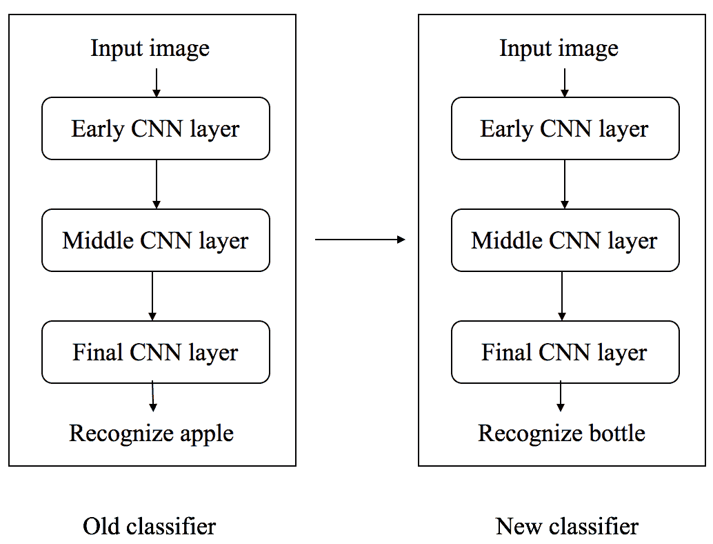
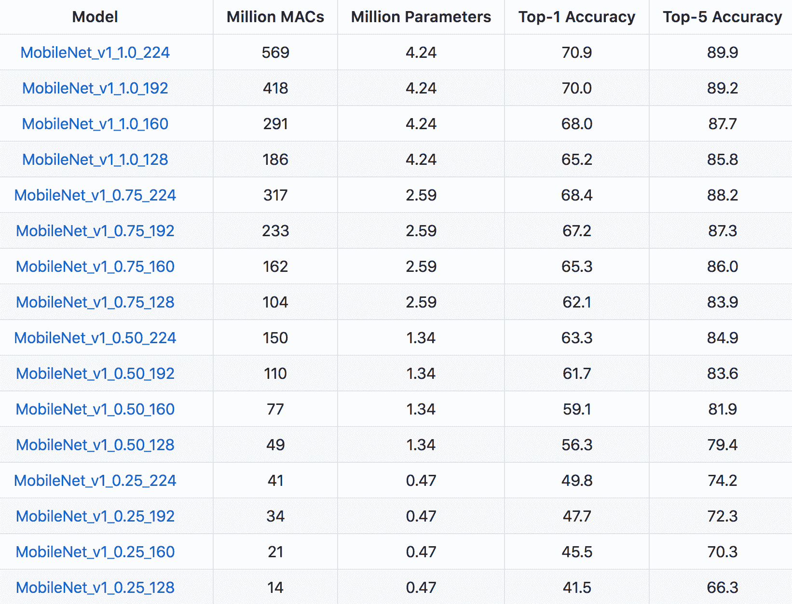
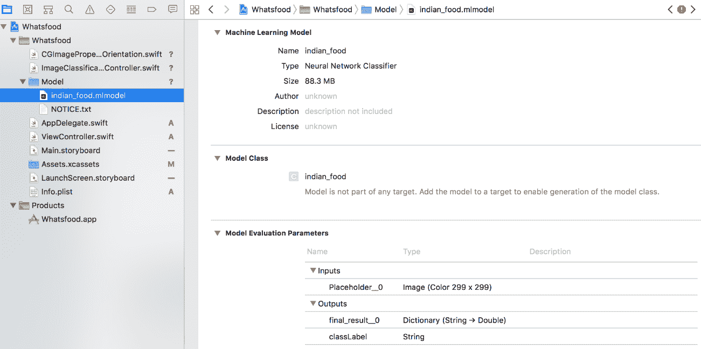
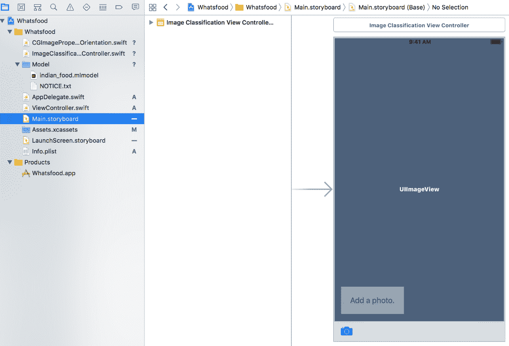
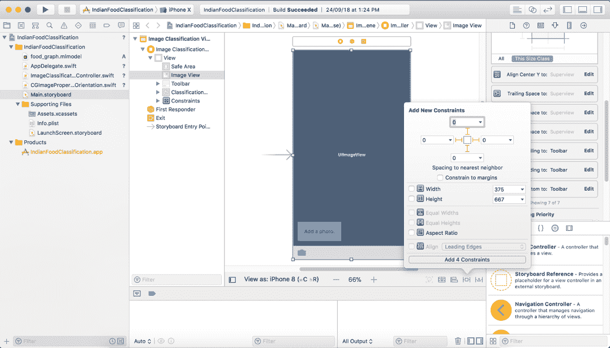
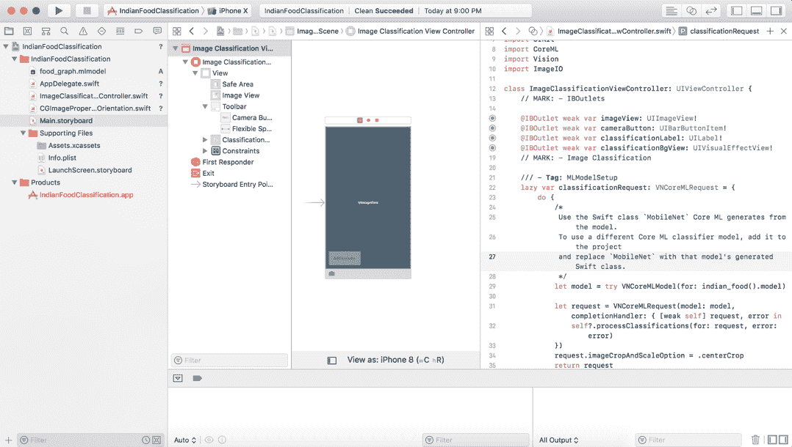
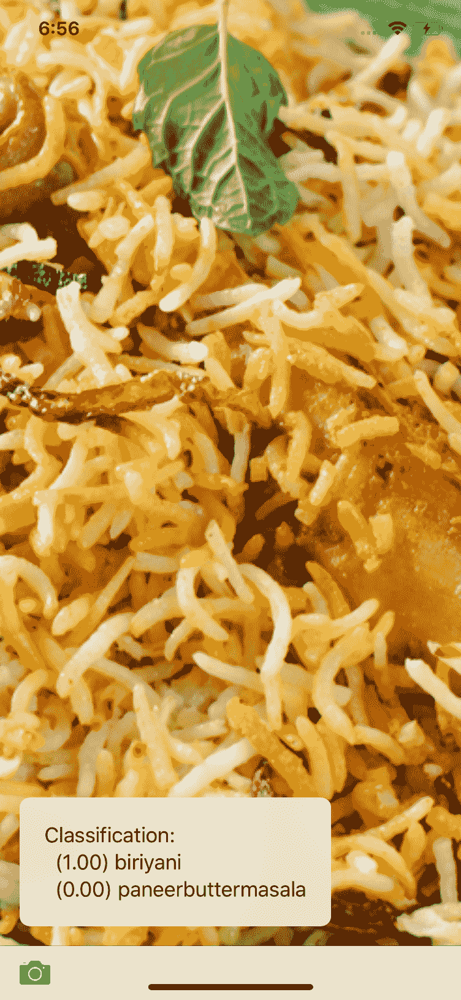
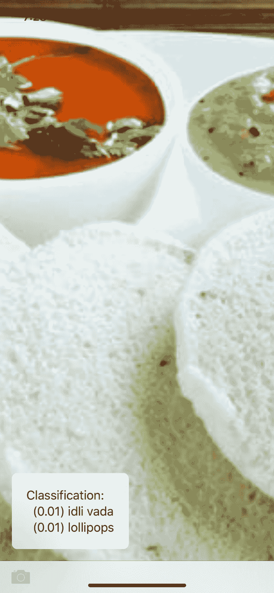

# 八、利用迁移学习分类食物

在本章中，我们将使用**迁移学习**对食物进行分类。为此，我们建立了自己的基于 TensorFlow 的**机器学习** ( **ML** )模型，我们将重点介绍一些印度食品。现代识别模型中有数百万个参数。我们需要大量的时间和数据来从头训练一个新的模型，以及数百个运行数小时的**图形处理单元**(**GPU**)或**张量处理单元** ( **TPUs** )。

迁移学习通过使用已经训练好的现有模型并在新模型上重用它，使这项任务变得更容易。在我们的示例中，我们将使用 MobileNet 模型的特征提取功能，并在此基础上训练我们自己的分类器。即使我们不能获得 100%的准确性，这在很多情况下也是最好的，尤其是在移动电话上，我们不会获得大量的资源。即使没有 GPU，我们也可以在典型的笔记本上轻松训练这个模型几个小时。这款机型基于配备 2.6 GHZ 英特尔 i5 处理器和 8 GB 内存的 MacBook Pro。

在本章中，我们将详细了解以下内容:

*   迁移学习基础
*   训练我们自己的张量流模型
*   构建一个使用模型的 iOS 应用

完整章节的代码可以直接从[https://github . com/intrepidkarthi/MLmobileapps/tree/master/chapter 8](https://github.com/intrepidkarthi/MLmobileapps/tree/master/Chapter8)和[https://github . com/packt publishing/Machine-Learning-Projects-for-Mobile-Applications](https://github.com/PacktPublishing/Machine-Learning-Projects-for-Mobile-Applications)中获取。


# 迁移学习

迁移学习是深度学习中一种流行的方法，其中为一个任务开发的模型被另一个不同任务的另一个模型重用。在这里，如果我们的计算资源和时间非常有限，预先训练的模型被用作基于计算机视觉的任务或基于自然语言处理的任务的第一步。

在典型的基于计算机视觉的问题中，神经网络试图检测它们的初始级别层中的边缘、中间级别层中的形状以及最终级别层中的更具体的特征。对于迁移学习，我们将使用初始和中间水平层，只重新训练最终水平层。

例如，如果我们有一个模型被训练成从输入图像中识别一个苹果，它将被重用来检测水瓶。在初始层中，模型已经被训练来识别对象，所以我们将只重新训练最后一层。这样，我们的模型将了解水瓶与其他物体的区别:



通常我们需要大量数据来训练我们的模型，但大多数时候我们没有足够的相关数据。这就是迁移学习发挥作用的地方，你可以用很少的数据训练你的模型。

如果您的旧分类器是使用 TensorFlow 开发和训练的，您可以重用它来重新训练新分类器的一些层。只有当从旧任务中学到的特性在本质上更加通用时，这才会完美地工作。例如，您不能在基于图像分类的任务中重用为文本分类器开发的模型。此外，两个模型的输入数据大小应该匹配。如果大小不匹配，我们需要添加一个额外的预处理步骤来相应地调整输入数据的大小。


# 迁移学习方法

让我们来看看迁移学习的不同方法。这些方法可能有不同的名称，但概念是相同的:

1.  **使用预先训练好的模型**:有很多预先训练好的模型可以满足你基本的深度学习研究。在本书中，我们使用了许多预先训练好的模型，从中我们可以得出我们的结果。
2.  **为重用训练一个模型**:假设你想解决问题 A，但是你没有足够的数据来实现结果。为了解决这个问题，我们有另一个问题 B，我们有足够多的数据。在这种情况下，我们可以为问题 B 开发一个模型，并使用该模型作为问题 a 的起点。如果我们需要重用所有层或仅重用一些层，这取决于我们正在解决的问题的类型。
3.  **特征提取**:通过深度学习，我们可以提取数据集的特征。大多数时候，这些特性是由开发人员手工制作的。神经网络有能力学习哪些特征，你必须通过，哪些不通过。例如，我们将仅使用初始图层来检测要素的正确表示，但我们不会使用输出，因为它可能更特定于某个特定任务。我们将简单地将数据输入我们的网络，并使用其中一个中间层作为输出层。

这样，我们将开始使用 TensorFlow 构建我们的模型。


# 训练我们自己的张量流模型

构建我们自己的定制模型需要遵循一步一步的过程。首先，我们将使用 TensorFlow Hub 通过预先训练好的模型输入图像。

TensorFlow Hub 是一个用于发布、发现和消费机器学习模型的可重用部分的库。一个*模块*是一个张量流图的独立部分，以及它的权重和资产，可以在一个被称为**迁移学习**的过程中跨不同的任务重用。


# 安装 TensorFlow

写这本书的时候，TensorFlow 1.7.0 已经可以用了。TensorFlow Hub 依赖于 TensorFlow 库，可以按如下方式与`pip`一起安装:

```
$ pip install "tensorflow>=1.7.0"
$ pip install tensorflow-hub
```

安装 TensorFlow 库后，我们需要在训练过程开始前开始收集图像数据集。在开始训练之前，我们需要研究很多东西。


# 训练图像

在这一步中，我们将收集图像，并将它们组织在各自的文件夹类别下。

选择自己的影像数据集的一些常见步骤如下:

1.  首先，我们需要至少 100 张你想识别的每个图像类别的照片。我们的模型的准确性与集合中图像的数量成正比。
2.  我们需要确保图像集中有更多相关的图像。例如，如果我们拍摄了具有单一颜色背景的图像集，假设图像中的所有对象都具有白色背景，并且是在室内拍摄的，并且用户试图识别具有分散注意力的背景的对象(在室外拍摄的彩色背景)，这不会导致更好的准确性。

3.  选择有各种背景的图片。例如，如果我们选择只有两种背景颜色的图像，那么你的预测将偏向于这两种颜色，而不是图像中的对象。
4.  试着把大的类别分成小的部分。例如，我们可以用*猫*、*狗*和*老虎*来代替*动物*。
5.  确保我们选择所有包含我们试图识别的对象的输入图像。例如，如果我们有一个识别狗的应用，我们不会使用汽车、建筑物或山脉作为输入图像。在这种情况下，最好对无法识别的图像使用单独的分类器。
6.  确保我们正确标记图像。例如，将一朵花标记为*茉莉*可能会在图片中显示整株植物或背后有一个人。当输入图像中存在令人分心的物体时，我们的算法的准确性将会不同。

我们从 Google images 上拍摄了一些食物图片。这些图像具有可重复使用的权限，因此在为您的模型收集图像时，请始终确保您拥有此权限。你可以从谷歌图片中搜索任何关键词，然后根据标记为重用的*使用权过滤图片。我们可以通过点击搜索栏下面的工具找到这个选项。*

我们从互联网上收集了一些可重复使用的图片，并将它们组织在以下文件夹中:

```
$:cd ~/Chapter8/images
$:ls
dosa
idly
biriyani
burger
pizza
```

我们在相应的文件夹下保存了大约 100 张每种食物的图片。一旦我们的图像准备好了，我们就可以开始训练了。这些文件夹名称很重要，因为我们要用文件夹名称标记每个文件夹中的所有食品。例如，`pizza`文件夹下的所有食物都将被标记为`pizza`。

当数据收集完成后，我们可以通过迁移学习开始训练过程。


# 用自己的形象再培训

我们将在你的项目目录中使用`retrain.py` 脚本。使用`curl` *:* 下载该脚本

```
mkdir ~/Chapter8/images
cd ~/Chapter8/images
curl -LO https://github.com/tensorflow/hub/raw/master/examples/image_retraining/
        retrain.py
```

在培训开始之前，我们需要查看一些传递给培训脚本的参数。


# 训练步骤参数

一旦我们的数据集准备好了，我们需要考虑改善结果。我们可以通过改变学习过程中的步骤数量来做到这一点。最简单的方法是尝试以下方法:

```
--how_many_training_steps = 4000
```

当步数增加时，精度提高的速度变慢，超过某一点，精度将停止提高。你可以尝试一下，决定什么最适合你。


# 体系结构

MobileNet 是一种更小、低功耗、低延迟的模型，旨在满足移动设备的限制。在我们的应用中，我们从 MobileNet 数据集选择了以下架构，它具有更好的准确性基准:

```
 --architecture="mobilenet_1.0_224"
```

网络的功率和延迟随着**乘累加**(**MAC**)的数量而增长，乘累加用于测量融合乘法和加法运算的数量:



可以从以下链接下载模型:[https://github . com/tensor flow/models/blob/master/research/slim/nets/mobilenet _ v1 . MD](https://github.com/tensorflow/models/blob/master/research/slim/nets/mobilenet_v1.md)。


# 变形

我们可以通过在训练期间给出强硬的输入图像来改善结果。可以通过对输入图像进行随机裁剪、增亮和变形来生成训练图像。这将有助于生成有效的训练数据集。然而，这里启用扭曲有一个缺点，因为瓶颈缓存是没有用的。因此，输入图像不能重复使用，增加了训练时间。有多种方法可以实现失真，如下所示:

```
--random_crop
--random_scale
--random_brightness
```

这并不是在所有情况下都有用。例如，它在数字分类系统中没有帮助，因为翻转和扭曲图像在产生可能的输出时没有意义。


# 超参数

我们可以尝试更多的参数来检查附加参数是否有助于改善结果。

用项目符号中给出的形式说明它们。超参数解释如下:

*   `--learning_rate`:该参数控制训练时对最终层的更新。如果该值很小，训练将花费更多时间。这可能并不总是有助于提高准确性。
*   `--train_batch_size`:该参数有助于控制训练期间检查的图像数量，以估计最终的图层更新。一旦图像准备好了，脚本会将它们分成三个不同的集合。最大的一组用于训练。这种划分主要用于防止模型识别输入图像中不必要的图案。如果只使用某种背景模式训练模型，当它面对具有新背景的图像时，它不会给出正确的结果，因为它记住了来自输入图像的不必要的信息。这就是所谓的**过拟合**。

*   `--testing_percentage` **和** `--validation_percentage` **标志**:为了避免过度拟合，我们将 80%的数据保留在主训练集中。在这些数据中，10%用于在训练过程中进行验证，最后 10%用于测试模型。我们可以使用以下参数调整这些控制:
    *   `--validation_batch_size`:我们可以看到验证的准确性在迭代之间波动。这可以通过设置以下参数来减少。

如果您对此不熟悉，您可以运行默认值，而无需对这些参数进行任何更改。让我们开始构建我们的模型。为此，我们需要训练图像数据。


# 运行培训脚本

讨论完所有与参数相关的细节后，我们现在可以从下载的脚本开始训练了:

```
python retrain.py \
 --bottleneck_dir=./ \
 --how_many_training_steps=4000 \ 
 --model_dir=./ \
 --output_graph=./food_graph.pb \
 --output_labels=food_labels.txt \
 --architecture="mobilenet_1.0_224" \ 
 --image_dir=/Users/karthikeyan/Documents/docs/book/Chapter8/images
```

根据我们的处理器的能力以及我们拥有的图像数量，脚本可能需要更长的时间进行训练。对我来说，我花了 10 多个小时来研究 50 种不同的食物，每种食物包含 1500 张图片。一旦脚本完成，我们将在输出中获得 TensorFlow 模型。


# 模型转换

一旦我们准备好张量流模型，我们将把它转换成一个核心 ML 模型。正如我们在其他章节中所做的转换一样，要获得最新版本的转换器，克隆这个存储库并从源代码安装它，如下所示:

```
git clone https://github.com/tf-coreml/tf-coreml.git

cd tf-coreml 
```

或者，使用`pip`安装:

```
pip install -U tfcoreml
```

从下面的代码中，我们循环通过`graphDef`来查找信息，因为要将 TensorFlow 模型转换为核心 ML 模型，我们需要知道一些信息。
我们将从下面的代码中得到下面的细节列表:

*   **输入名称**:占位符`op`的输出，为(`input:0`)。
*   **输出名称**:soft max`op`向图形末端的输出，即(`final_result:0`)。
*   **模型形状**:我们从 TensorBoard 获取模型形状，在模型创建过程中找到它的形状，或者我们也可以使用`tf.shape()`找到它的形状。我们的模型形状是[1，224，224，3]。我们现在可以将其转换为核心 ML 模型(`.mlmodel`):

```
import tensorflow as tf
import tfcoreml
from coremltools.proto import FeatureTypes_pb2 as _FeatureTypes_pb2
import coremltools

tf_model_path = "./food_graph.pb"
with open(tf_model_path , 'rb') as f:
    serialized = f.read()
tf.reset_default_graph()
original_gdef = tf.GraphDef()
original_gdef.ParseFromString(serialized)

with tf.Graph().as_default() as g:
    tf.import_graph_def(original_gdef, name ='')
    ops = g.get_operations()
    N = len(ops)
    for i in [0,1,2,N-3,N-2,N-1]:
        print('\n\nop id {} : op type: "{}"'.format(str(i), 
                  ops[i].type))
        print('input(s):')
        for x in ops[i].inputs:
            print("name = {}, shape: {}, ".format(x.name, 
                   x.get_shape()))
        print('\noutput(s):'),
        for x in ops[i].outputs:
            print("name = {}, shape: {},".format(x.name, 
                   x.get_shape()))
```

下面是将`.pb`模型转换成`.mlmodel`文件的代码块:

```
""" CONVERT TensorFlow TO CoreML model """

# Model Shape

input_tensor_shapes = {"input:0":[1,224,224,3]} 

# Input Name

image_input_name = ['input:0']

# Output CoreML model path

coreml_model_file = './food_graph.mlmodel'

# Output name

output_tensor_names = ['final_result:0']

# Label file for classification

class_labels = 'retrained_labels.txt'

#Convert Process

coreml_model = tfcoreml.convert(

        tf_model_path=tf_model_path,

        mlmodel_path=coreml_model_file,

        input_name_shape_dict=input_tensor_shapes,

        output_feature_names=output_tensor_names,

        image_input_names = image_input_name,

        class_labels = class_labels)
```

现在我们已经准备好了我们的核心 ML 模型。

下面是 Python 脚本的源代码:[https://github . com/intrepidkarthi/MLmobileapps/tree/master/chapter 8/TF _ to _ coreml . py](https://github.com/intrepidkarthi/MLmobileapps/blob/master/Chapter8/tf_to_coreml.py)。

一旦你下载了`tf_to_coreml.py`文件，你需要修改输入，如`tf_model_path`、`input_name_shape_dict`、`image_input_names`等等。基于重新培训车型的详细信息`food_graph.pb`。修改完成后，执行以下命令获得`food_graph.mlmodel`。

如果您想要提高模型的精度性能，您可能需要研究更多的参数:

```
coreml_model = tfcoreml.convert(

        tf_model_path=tf_model_path,

        mlmodel_path=coreml_model_file,

        input_name_shape_dict=input_tensor_shapes,

        output_feature_names=output_tensor_names,

        image_input_names = image_input_name,

        class_labels = class_labels,

        red_bias = -1,

        green_bias = -1,

        blue_bias = -1,

        image_scale = 2.0/255.0)
```

这些关于图像偏差的附加参数将有助于提高精度。现在我们可以开始构建应用了。


# 构建 iOS 应用

我们将创建一个新的 iOS 应用，并将 ML 模型导入其中:



一旦你选择了`.mlmodel`文件，你将会看到关于它的细节，其中重要的是 ML 模型**类型**、**输入**和**输出**。**输入**类型应该是**图像**，因为我们的输入将是食物项目的图像。

一旦我们导入了模型，我们必须将模型加载到内存中:

```
 do {
 /*
 Use the Swift class `MobileNet` Core ML generates from the model.
 To use a different Core ML classifier model, add it to the project
 and replace `MobileNet` with that model's generated Swift class.
 */
 let model = try VNCoreMLModel(for: food_graph().model)

 let request = VNCoreMLRequest(model: model, completionHandler: { [weak 
                 self] request, error in
         self?.processClassifications(for: request, error: error)
 })
 request.imageCropAndScaleOption = .centerCrop
 return request
 } catch {
 fatalError("Failed to load Vision ML model: \(error)")
 }
```

我们将通过故事板为图像分类创建一个简单的**用户界面** ( **UI** ):



用户界面非常简单，我们可以选择一张图片或抓拍一张照片来识别食物分类。我们将创建满足需求的接口。我们将不得不为我们的模型选择一个图像来识别，我们将有两个选项可供选择，一个是从相机胶卷中选择，另一个是通过单击食物的图片。我们在屏幕底部添加了一个工具栏，并在顶部添加了一个相机类型的工具栏项目。

工具栏项目有一个内置类型的摄像头，所以，你不必得到一个摄像头图标。我们将不得不显示食品项目的图像，所以我们将添加一个图像视图，然后为它在屏幕上的位置的约束。我们将添加一个按钮，如上图所示，带有 UI 位置约束:



选择视图并在故事板上添加约束。之后，我们需要将视图连接到类，这样我们就可以在运行时访问它。通过拖放将控件连接到`ImageClassificationViewController.swift`类:



然后，我们将添加控件，从相机拍摄照片并输入。下面的 add 控件方法从照片库中启动照相机或照片拾取器。只有当摄像机可用时，我们才会显示摄像机选项。我们将在照片拾取器上添加三个动作来拍照、从图库中拾取图像和取消弹出动作:

```
 @IBAction func takePicture() {
 guard UIImagePickerController.isSourceTypeAvailable(.camera) else {
 // Show options for the source picker only if the camera is available.
 presentPhotoPicker(sourceType: .photoLibrary)
 return
 }

     let photoSourcePicker = UIAlertController()
     let takePhoto = UIAlertAction(title: "Take Photo", style: 
                              .default) { [unowned self] _ in
     self.presentPhotoPicker(sourceType: .camera)
 }
     let choosePhoto = UIAlertAction(title: "Choose Photo", style: 
                              .default) { [unowned self] _ in
     self.presentPhotoPicker(sourceType: .photoLibrary)
 }

     //Adding actions on the photo picker control
     photoSourcePicker.addAction(takePhoto)
     photoSourcePicker.addAction(choosePhoto)
     photoSourcePicker.addAction(UIAlertAction(title: "Cancel", 
                                 style:.cancel, handler: nil))

     present(photoSourcePicker, animated: true)
 }

```

现在，我们将添加一个控件，可以从照片库中选择图像。控制传递给`UIImagePickerController()`，如代码块所示:

```
 func presentPhotoPicker(sourceType: UIImagePickerControllerSourceType) {
     let picker = UIImagePickerController()
     picker.delegate = self
     picker.sourceType = sourceType
     present(picker, animated: true)
 }
```

`UIImagePickerController`: A view controller that manages the system interfaces for taking pictures, recording movies, and choosing items from the user's media library.

使用图像拾取器控件，我们将添加一个视图控制器来调用图像分类方法。下面的代码显示了如何处理图像拾取器选择。代码期望``imagePickerController(:didFinishPickingMediaWithInfo:)``提供输入图像:

```
extension ImageClassificationViewController: UIImagePickerControllerDelegate, UINavigationControllerDelegate {
// Handling Image Picker Selection

func imagePickerController(_ picker: UIImagePickerController, didFinishPickingMediaWithInfo info: [String: Any]) {
     picker.dismiss(animated: true)

   // We always expect `imagePickerController(:didFinishPickingMediaWithInfo:)` to supply the 
  original image.
     let image = info[UIImagePickerControllerOriginalImage] as! UIImage
     imageView.image = image
     updateClassifications(for: image)
     }
 }
```

`UIImagePickerControllerOriginalImage`: Specifies the original, uncropped image selected by the user.

从控制器中，调用`classification`方法。在该方法中，添加了图像处理处理程序。`classificationRequest`实例完成处理器``processClassifications(_:error:)``捕捉特定于处理该请求的错误:

```
 ///Perform image classification requests
 func updateClassifications(for image: UIImage) {
     classificationLabel.text = "Classifying..."
     classificationBgView.isHidden = false
     let orientation = 
           CGImagePropertyOrientation(image.imageOrientation)
     guard let ciImage = CIImage(image: image) else {                  
          fatalError("Unable to create \(CIImage.self) from \(image).") 
    }

     DispatchQueue.global(qos: .userInitiated).async {
     let handler = VNImageRequestHandler(ciImage: ciImage, orientation: 
                                         orientation)
     do {
         try handler.perform([self.classificationRequest])
         } catch {
         print("Failed to perform classification.\n\                            
(error.localizedDescription)")
         }
     }
 }

```

一旦我们收到来自模型的结果，我们将在 UI 中更新它:

```
 /// Updates the UI with the results of the classification.
 /// - Tag: ProcessClassifications
 func processClassifications(for request: VNRequest, error: Error?)      {
     DispatchQueue.main.async {
         guard let results = request.results else {
         self.classificationLabel.text = "Unable to classify image.\n\
                                        (error!.localizedDescription)"
         return
        }
 // The `results` will always be `VNClassificationObservation`s, as 
    specified by the Core ML model in this project.
        let classifications = results as! [VNClassificationObservation]

        if classifications.isEmpty {
           self.classificationLabel.text = "Nothing recognized."
        } 
        else {
        // Display top classifications ranked by confidence in the UI.
        let topClassifications = classifications.prefix(2)
        let descriptions = topClassifications.map { classification in
        // Formats the classification for display; e.g. "(0.37) cliff, 
           drop, drop-off".
        return String(format: " (%.2f) %@", classification.confidence, 
                      classification.identifier)
       }
      self.classificationLabel.text = "Classification:\n" + 
                descriptions.joined(separator: "\n")
       }
    }
 }
```

以下是我们的结果截图示例:



这是我们早期模型的一个样本图像，带有不正确的数据集。尽管我们对每一类食物都有 1000 多张照片，但还是有一些照片包含了多种菜肴，如下图所示。我们对输入的选择很糟糕，因为在一幅图像中有多个食物项目，所以它包含了围绕主要食物的大量噪声。这混淆了算法，很难得到想要的结果。选择数据集时，请尽量避免这些问题:



前面的屏幕截图是另一个例子，在同一个图像中有两个可检测的项目，您可以看到分类器值。你可以看到棒棒糖和 idli vada 都被标记在这里。


# 摘要

此时，您应该能够构建自己的 TensorFlow 模型，并将其转换为核心 ML 模型，以便在 iOS 应用中使用。相同的 TensorFlow 模型可以转换成 TensorFlow Lite 模型，以便在 Android 应用中使用。你可以接受这个任务，并在那里试验结果。说到这里，我们现在将进入下一章。

在下一章中，我们将会看到如何利用从本书中学到的知识，以及如何构建自己的应用。