# 二、评估核学习

在机器学习中，模式发现是一个正在被充分探索的领域。有许多方法和算法可以推动这种工作和分析。然而，在这一章中，我们将尝试关注内核是如何对整个机器学习前景产生重大影响的。核学习的应用没有任何边界:从简单的回归问题到计算机视觉分类，它的存在无处不在。**支持向量机** ( **SVM** )就是恰好利用核学习的算法之一。

在本章中，我们将重点关注以下概念:

*   向量、线性可分性和超平面的概念
*   SVM
*   内核技巧
*   高斯过程
*   参数最优化


# 向量介绍

在进入核心话题之前，我们想先建立一个基础。因此，本章的这一部分非常重要。你们可能看起来很熟悉，很多人都知道这一点。然而，通过这个渠道将设置流量。

矢量是既有方向又有大小的物体。用一个箭头和一个空间坐标( *x* ， *y* )表示，如下图所示:

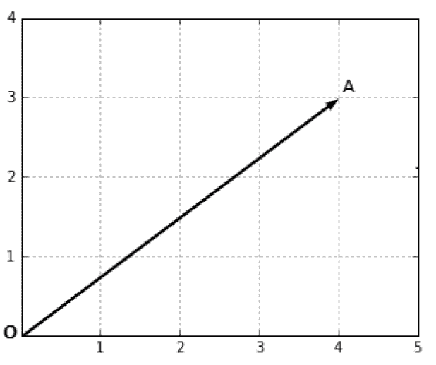

如上图所示，向量 OA 的坐标为 *(4，3)* :

*向量 OA= (4，3)*

然而，仅仅通过坐标来定义向量是不够的，我们还需要一个方向。这意味着从 *x* 轴的方向。


# 向量的大小

向量的大小也被称为**范数**。用 *||OA||* 来表示:

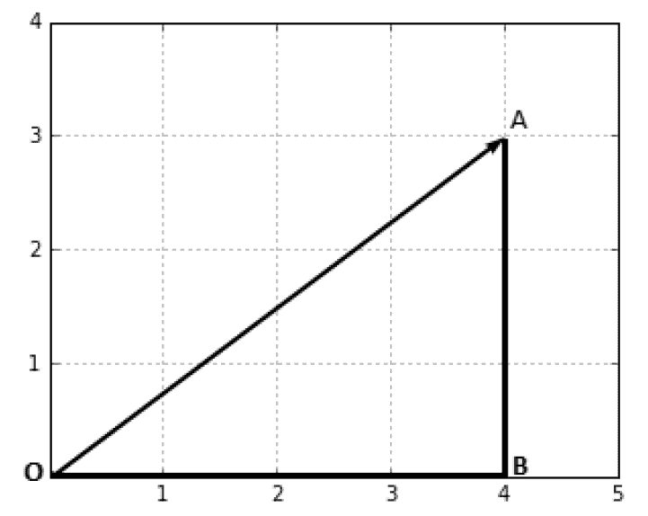

为了找出这个矢量的大小，我们可以遵循勾股定理:

*OA²= OB²+AB²*

*= 4²+3²*

*= 16 + 9*

*= 25*

因此:

*OA = √25 = 5*

*||OA||= 5*

所以，如果有一个矢量 *x = (x [1，] x [2] ，....，x [n] )* :

*| | x | | = x[1]2+x[2]²+........+x[n]2*

这个向量的方向是:


# 点积

两个向量的点积返回一个恰好是标量的数。它表示两个向量是如何相互关联的。

几何上，两个向量 *x* 和 *y* 的点积如下:

*x . y = | | x | | | y | | cosθ*

*θ* 是矢量 *x* 和 *y* 之间的角度。

然而，用代数方法，我们得到如下结果:

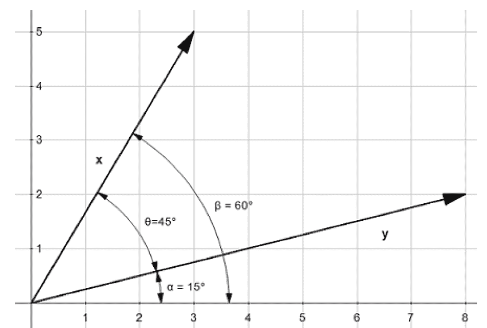

从几何角度来看，我们得到以下结果:

*θ=β-α*

*cosθ=cos(β-α)*

*cosθ = cosβ cosα + sinβ sinα*

*cosθ=(x[1]/| | x | |)(y[1]/| | y | |)+(x2/| | x | |)(y2/| | y | |)*

*| | x | | | y | | cosθ= x[1]y[1]+x[2]y[2]*

*x . y = x[1]y[1]+x[2]y[2]*


# 线性可分性

线性可分性意味着，如果有两个类，那么将有一个点、线、面或超面来分割输入要素，使得一个类中的所有点都在一半空间中，而第二个类在另一半空间中。

例如，这里有一个基于面积和价格出售房屋的案例。我们已经得到了这个类的一些数据点，即房屋**售出** / **未售出**:

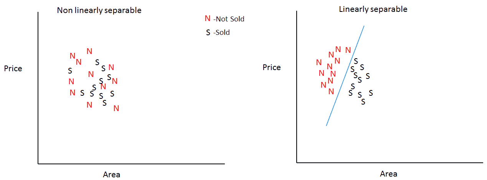

在上图中，所有的 **N** ，都是根据房屋的**价格**和**面积**派生出来的**未售出**的类(事件)，所有 **S** 的实例都代表房屋的待售类。 **N** 和 **S** 的数量代表已经确定类别的数据点。

在第一张图中， **N** 和 **S** 非常接近，并且碰巧更加随机，因此，很难实现线性可分性，因为无论您如何尝试分离两个类，它们中至少有一个会在错误分类的区域中。这意味着不会有一条正确的可能的线来区分这两者。但是第二张图描述了可以根据给定条件轻松分离的数据集。

分离方法根据维度的数量而变化。如果只有一维的情况，我们可以用一个点来划分等级。添加更多维度将需要不同的安排来划分类别。一旦我们得到了 2D 的情况，一条线(如前所述)将需要分开它。类似地，多 2D 将需要一个平面(一组点)来分隔这些类，如图所示:

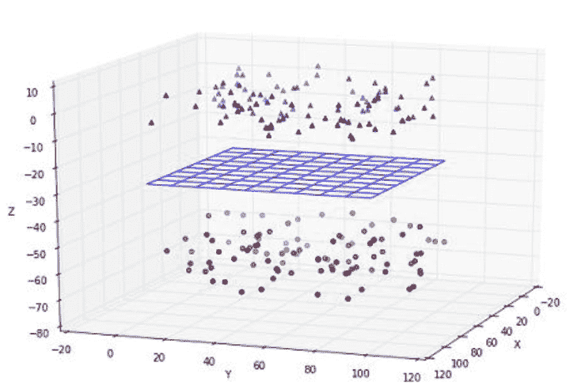

分离方法:

| **尺寸数量** | **分离方法** |
| 一 | 要点 |
| 2 | 线条 |
| 3 | 飞机 |

如果我们拥有的不止是 3D 呢？我们该怎么办？有什么解决办法？有什么猜测吗？


# 超平面

你们很多人都猜对了。当涉及到 3D 以上的东西时，我们使用超平面。我们将用一点数学来定义它。

一个线性方程是这样的: *y = ax + b* 有两个变量， *x* 和 *y* ，还有一个*y*-截距，也就是 *b* 。如果我们将 *y* 重命名为*x[2]并将 *x* 重命名为 *x [1]* ，则等式为*x[2]= ax[1]+b*，这意味着*ax[1]-x[2]+b = 0 如果我们将 2D 向量定义为 *x= (x [1] ，x [2] )* 和 *w=(a，-1)* ，并且如果我们利用点积，那么等式变成 *w.x + b = 0。***

记住，*x . y = x[1]y[1]+x[2]y[2]。*

所以，超平面是满足前面方程的一组点。但是我们如何借助超平面进行分类呢？

我们定义一个假设函数 *h* :

*h(x [i] ) = +1 如果 w.x [i] + b ≥ 0*

*-1 如果 w.x [i] + b < 0*

这可能相当于以下内容:

*h(x[I])= sign(w . x[I]+b)*

它也可以等同于以下内容:

*符号(w . x[I])if(x[0]= 1 且 w [0] =b)*

这意味着它将使用 *x* 相对于超平面的位置来预测 *y* 的值。超平面一侧的数据点得到一个分类，超平面另一侧的数据点得到另一个类别。

因为它使用的超平面的方程恰好是值的线性组合，所以它被称为**线性分类器**。超平面的形状由 *w* 决定，因为它具有负责形状的元素 b 和 a。


# SVM

现在我们可以理解支持向量机了。SVM 是一种算法，使我们能够利用它进行分类和回归。给定一组示例，它建立一个模型，将一组观察值分配到一个类别，将其他观察值分配到另一个类别。它是非概率线性分类器。训练数据可以线性分离是这里的关键。所有的观察或训练数据都是映射到空间中的向量的表示，SVM 试图通过使用尽可能宽的余量来对它们进行分类:


假设有两个类 **A** 和 **B** ，如前面的截图所示。

从上一节中，我们了解到以下内容:

*g(x) = w. x + b*

其中:

*   *w* :决定超平面方向的权重向量
*   *b* :偏置项，通过偏置决定超平面在 n 维空间中的位置

前面的等式也被称为**线性判别函数**。如果有一个向量*x[1]位于超平面的正侧，则等式变为如下:*

*g(x[1])= w . x[1]+b>0*

该等式将变成如下:

*g(x [1] ) < 0*

如果*x[1]T30 位于超平面的正侧。*

如果 *g(x [1] )=0* 怎么办？你能猜出*x[1]会在哪里吗？是的，它会在超平面上，因为我们的目标是找出向量的类别。*

所以，如果*g(x[1])>0 =>x[1]*属于**A 类**，*g(x[1])【T60 =>x[1]*属于**B 类**。

这里，很明显，我们可以通过使用前面的等式来找出分类。但是你能看出其中的问题吗？假设边界线就像下面这个情节:

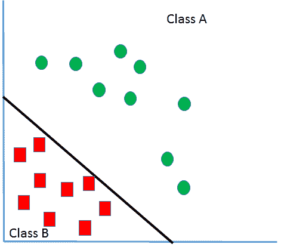

即使在前面的场景中，我们也能够在这里对这些特征向量进行分类。但这是可取的吗？这里可以看到的是边界线或者分类器靠近**类 B** 。这意味着它带来了有利于**A 级**的巨大偏向，却不利于**B 级**。因此，由于靠近边界的向量中的任何干扰，它们可能会交叉并成为 A 类的一部分**，这可能是不正确的。因此，我们的目标是找到一个具有最大余量的最佳分类器，如下图所示:**


通过 SVM，我们试图创建一个边界或超平面，使得从每个特征向量到边界的距离最大化，从而任何轻微的噪声或干扰都不会导致分类的改变。因此，在这个场景中，如果我们试图引入某个 *y [i]* ，它恰好是属于 *xi 的类，*我们得到如下结果:

*y [i] = 1*

*y[I](w . x[I]+b)*永远大于 0。*y[I](w . x[I]+b)>0*因为当*x[I]∈A 类*， *w.x [i] +b > 0* 那么 *y [i] > 0，*所以整项将为正。还有，如果*x[I]∈B 类*， *w.x [i] + b < 0* 那么*y[I]0*，它会使项为正。

所以，现在如果我们必须重新设计它，我们说如下:

*w.x [i] + b > γ* 其中 *γ* 是超平面到 *xi* 的距离的度量。

如果有一个超平面 *w.x + b = 0* ，那么点 *x* 到前面超平面的距离如下:

*w.x + b/ ||w||*

因此，如前所述:

*w.x + b/ ||w|| ≥ γ*

*w.x + b ≥ γ。||w||*

在执行适当的缩放时，我们可以说:

*w.x + b ≥ 1(自γ。||w|| = 1)*

这意味着，如果要根据先前的结果进行分类，则分类如下:

*w.x + b ≥ 1 若 x∈A 类且*

*w.x + b ≤ -1 如果 x∈B 类*

现在，再一次，如果我们在这里引入一个属于*y[I]的类，等式变成如下:*

*易(w.xi + b) ≥ 1*

但是，如果*y[I](w . x[I]+b)=**1*， *x [i]* 是一个支持向量。接下来，我们将学习什么是支持向量。


# 支持向量

我们画两条边界线，穿过一个类别的特征向量，最接近另一个类别的特征向量。这些边界线的中心线就是我们一直在说的超平面。例如，对于**B 类**，一条边界线沿途经过 **p** 和 **q** ，另一条边界线经过 **r** 和 **s** ，因为 **p** 和 **q** 与**B 类**的特征向量最近，所以 **r** 和 **s** 也是如此这些被称为**支持向量**。我们现在将理解为什么这些被称为**支持向量**:

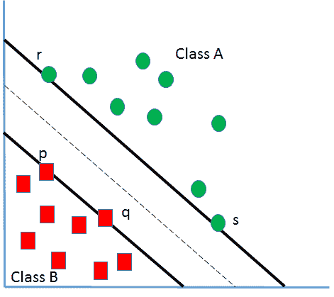

比方说，如果我们试图移除不太靠近边界线的特征向量之一，我们将不会对超平面的位置或方向产生影响，因为超平面的位置由穿过向量 **p** 、 **q** 、 **r** 和 **s** 的边界线决定。而且，因为这些点将超平面保持(支撑)在一起，所以它们被命名为支持向量。

所以，当 *x [i] 为 **p** 、 **q** 、 **r** 或 **s** 时，这个等式*y[I](w . x[I]+b)=**1*成立。*

我们再回到方程*w . x+b/| | w | |≥γ*；这里，我们试图最大化 *γ* ，为了这样做，我们需要最大化 b 或者最小化 *||w||* 。

或者我们可以说我们必须尽量减少。如果我们把它转换成一个函数，*φ(w)= w . w*必须最小化。*φ(w)= 1/2(w . w)*(此处为数学方便已加 1/2)。

因此，SVM 的目标函数变成*φ(w)= 1/2(w . w)*，其必须在约束条件下最小化，如下所示:

*y[I](w . x[I]b)= 1*

由于它是一个约束优化问题，因此可以使用拉格朗日乘子将其转化为一个无约束优化问题。

因此， *L(w，b)= 1/2(w . w)-∑αi[yi(w . Xi+b)-1]*其中αI 为拉格朗日乘数， *L(w，b)= 1/2(w . w)-∑α[I]y[I](w . x[I])-∑α[I]y[I]*

让我们用最大值和最小值演算找出 *w* 和 *b* :

*δL/δb = 0*

它导致*∑α[I]y[I]= 0，* *δL/* *δw = 0* 会导致 *∑ αi 易 xi = w* 。现在，将这些结果放回到拉格朗日函数中会产生以下结果:

*L =∑α[I]-1/2∑α[I]α[j]y[I]y[j](x[j]。x [i] )*

这意味着如果*α[I]的值非常高，那么相应的 *x* 就非常高。对超平面的位置会有很大的影响。因此，对于分类和未知特征向量 *z* ，所需方程如下:*

*D(z) =符号(∑ αi 伊稀 z + b)*

如果 *D(z) > 0* ，那么 *z* 将属于 A 类，如果 *D(z) < 0* ，*z∈B 类*。让我们尝试用 Python 进行一个案例研究:

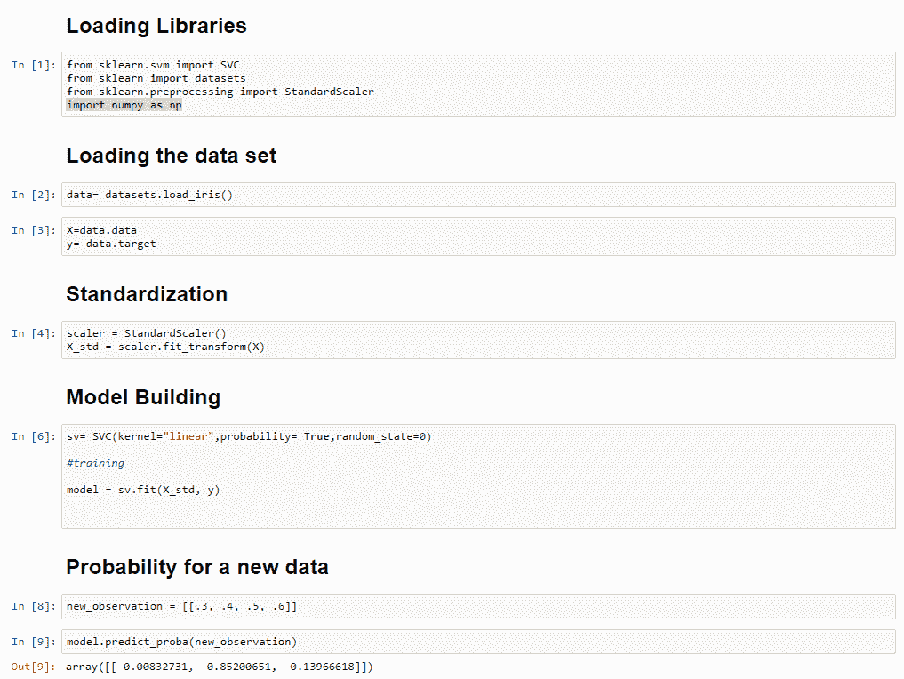


# 内核技巧

我们已经看到，当涉及到线性可分数据时，SVM 工作顺利。看看下图就知道了；它描述了向量不是线性可分的，但值得注意的是它在 2D 空间中是不可分的:

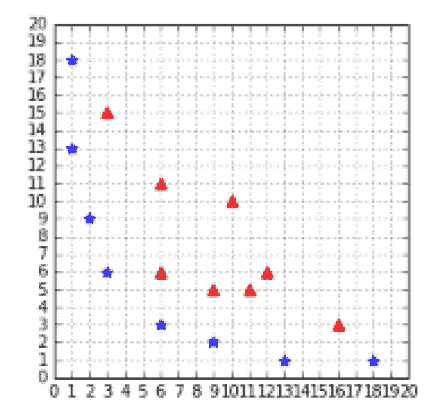

经过一些调整，我们仍然可以在这里利用 SVM。

将二维向量转换成三维向量或任何其他更高维的向量可以为我们解决问题。下一步将是使用更高维的向量来训练 SVM。但是问题来了，我们应该把向量变换到多高的维数。这意味着，如果变换必须是二维向量，或三维或 4D 或更多。它实际上取决于将可分性引入数据集的。


# 核心

像以前使用的那种不可分离的数据集总是很难处理，但是，有一些方法可以处理它。一种方法是通过变换将向量设置到更高维度。但是，当我们有数百万的数据或向量在计算时，我们真的能做到吗？这需要大量的计算，也需要时间。这就是内核拯救我们的一天。

我们已经看到了下面的等式。在这种情况下，只有训练示例的点积负责使模型学习。让我们试着做一个小练习:


让我们取两个向量:

```
x1=[4,8] 
x2= [20,30]
```

现在，建立一个转换函数，这将有助于把这些 2D 矢量转换成三维。

用于转换的函数如下:

*t(x1，x2)= (x1 ² ，x1 x2 √2，x2 ² )*

```
#transformation from 2-D to 3-D vector
def t(x): 
    return [x[0]**2, np.sqrt(2)*x[0]*x[1], x[1]**2]
```

现在让我们使用这个函数:

```
x1_3D= t(x1) 
x2_3D= t(x2)

print(np.dot(x1_3D,x2_3D))# the result is 102400
```

但是我们不能在不改变价值观的情况下这样做吗？内核可以帮助我们做到这一点:

```
def kernel(a, b): 
    return a[0]**2 * b[0]**2 + 2*a[0]*b[0]*a[1]*b[1] + a[1]**2 * b[1]**2
```

现在是使用这个`kernel`的时候了:

```
kernel(x1,x2) #the result is 102400
```

看到这样一个和以前一样的惊人结果，没有使用变身，是不是挺惊险的？所以，核是一个函数，它在另一个空间中导致点积一样的结果。


# 返回内核技巧

所以，现在我们已经对内核及其重要性有了一个公平的理解。正如上一节所讨论的,`kernel`函数是:

*K(x [i] ，x[j【T8)= x[I]。x[j]]*

所以，现在保证金问题变成了如下:


这以*0≤α[I]**≤C*为准，对于任意 *i = 1，...，m* :

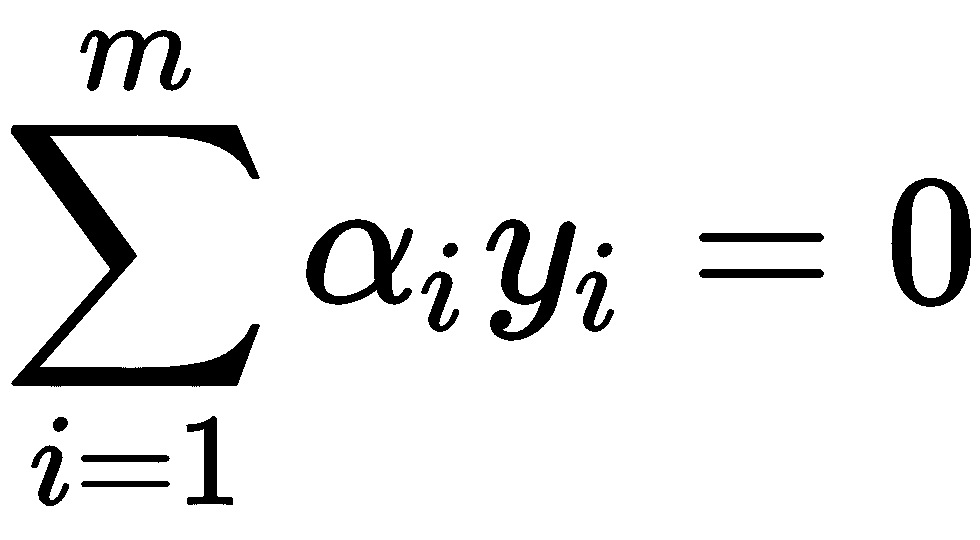

应用内核技巧仅仅意味着用一个`kernel`函数替换两个例子的点积。

现在甚至假设函数也会改变:


这个功能将能够决定和分类的类别。此外，由于 *S* 表示支持向量集，这意味着我们只需要对支持向量计算`kernel`函数。


# 内核类型

我们将在本节中解释的类型。


# 线性核

假设有两个向量， *x* [*1*] 和 *x [2]* ，那么线性核可以定义如下:

*K(x [1，] x [2] )= x [1。]x[2]*


# 多项式核

如果有两个向量，*x**[1]**和 *x* *[2]* ，则线性核可以定义如下:*

 **K(x [1，] x [2] )= (x [1。]x[2]+c)^d*

其中:

*   *c* :常数
*   *d* :多项式的次数:

```
def polynomial_kernel(x1, x2, degree, constant=0): 
    result = sum([x1[i] * x2[i] for i in range(len(x1))]) + constant 
    return pow(result, degree)
```

如果我们使用与之前相同的`x1`和`x2`，我们会得到以下结果:

```
x1= [4,8]
x2=[20,30] 
polynomial_kernel(x1,x2,2,0)
# result would be 102400
```

如果我们增加多项式的次数，我们将试图受到其他向量的影响，因为决策边界变得太复杂，这将导致过度拟合:

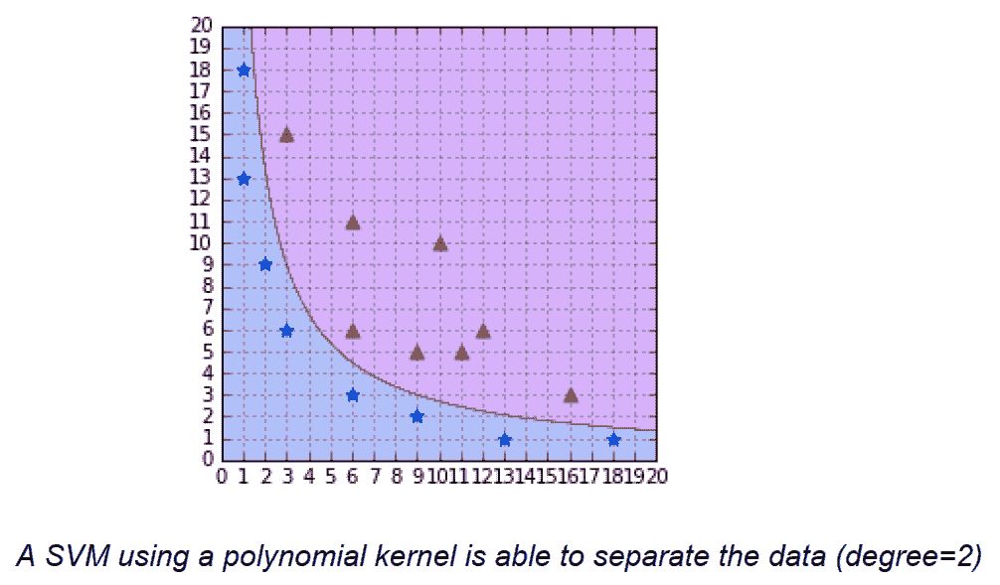

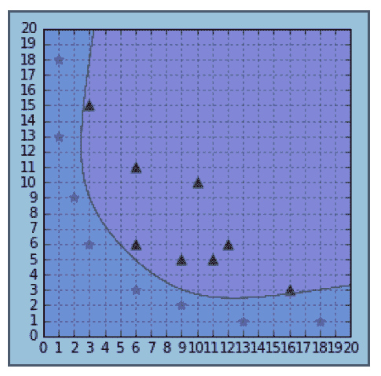

使用次数为 6 的多项式核。


# 高斯核

多项式核给了我们一条很好的边界线。但是我们能一直使用多项式核吗？不是在以下场景中:

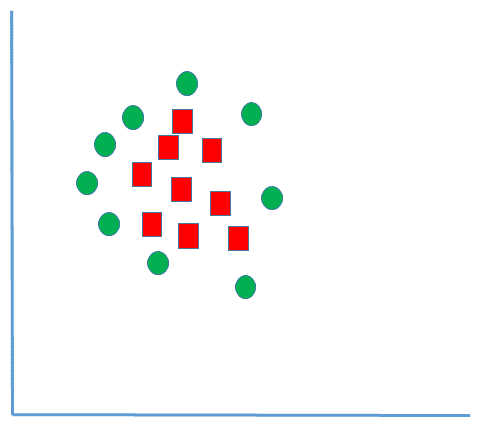

解决方案是径向基函数或高斯核。把向量转化到高维空间或者无限维空间，无非就是向量的相似度函数。其值取决于与高斯核函数的距离，如下所示:

*K(x，x^')= exp(-γ| | x-x ' | |²)*

不失一般性，让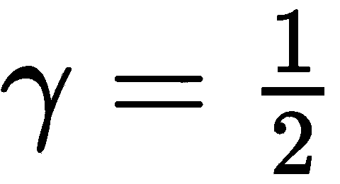:


以该 RBF 作为相似度函数，计算所有的特征向量。


# 通过网格搜索的 SVM 例子和参数优化

这里，我们采用了乳腺癌数据集，其中我们根据癌症是良性还是恶性进行了分类。

以下是导入所有需要的库:

```
import pandas as pd
import numpy as np
from sklearn import svm, datasets
from sklearn.svm import SVC
import matplotlib.pyplot as plt
from sklearn.model_selection import train_test_split
from sklearn.model_selection import GridSearchCV
from sklearn.metrics import classification_report
from sklearn.utils import shuffle
%matplotlib inline
```

现在，让我们加载乳腺癌数据集:

```
BC_Data = datasets.load_breast_cancer()
```

以下内容允许我们检查数据集的详细信息:

```
print(BC_Data.DESCR)
```

这是为了将数据集分成训练和测试:

```
X_train, X_test, y_train, y_test = train_test_split(BC_Data.data, BC_Data.target, random_state=0)
```

这是为了用线性核来设置模型并找出精确度:

```
C= 1.0
svm= SVC(kernel="linear",C=C)
svm.fit(X_train, y_train)
print('Accuracy-train dataset: {:.3f}'.format(svm.score(X_train,y_train)))
print('Accuracy- test dataset: {:.3f}'.format(svm.score(X_test,y_test)))
```

我们得到如下所示的精度输出:

```
Accuracy-train dataset: 0.967

Accuracy- test dataset: 0.958
```

使用高斯/RBF 核和精度设置模型的方法如下:

```
svm= SVC(kernel="rbf",C=C)
svm.fit(X_train, y_train)
print('Accuracy-train dataset: {:.3f}'.format(svm.score(X_train,y_train)))
print('Accuracy- test dataset: {:.3f}'.format(svm.score(X_test,y_test)))
```

输出如下所示:

```
Accuracy-train dataset: 1.000

Accuracy- test dataset: 0.629
```

很明显，这个模型是过度拟合的。因此，我们将选择正常化:

```
min_train = X_train.min(axis=0)
range_train = (X_train - min_train).max(axis=0)
X_train_scaled = (X_train - min_train)/range_train
X_test_scaled = (X_test - min_train)/range_train
```

此代码用于再次设置模型:

```
svm= SVC(kernel="rbf",C=C)
svm.fit(X_train_scaled, y_train)
print('Accuracy-train dataset: {:.3f}'.format(svm.score(X_train_scaled,y_train)))
print('Accuracy test dataset: {:.3f}'.format(svm.score(X_test_scaled,y_test)))
```

下面显示了输出:

```
Accuracy-train dataset: 0.948

Accuracy test dataset: 0.951
```

现在，过度拟合问题再也看不到了。让我们继续寻找最佳结果:

```
parameters = [{'kernel': ['rbf'],
 'gamma': [1e-4, 1e-3, 0.01, 0.1, 0.2, 0.5],
 'C': [1, 10, 100, 1000]},
 {'kernel': ['linear'], 'C': [1, 10, 100, 1000]}]
clf = GridSearchCV(SVC(decision_function_shape='ovr'), parameters, cv=5)
clf.fit(X_train, y_train)
print("Best parameters set found on development set:")
print()
print(clf.best_params_)
print()
print("Grid scores on training set:")
print()
means = clf.cv_results_['mean_test_score']
stds = clf.cv_results_['std_test_score']
for mean, std, params in zip(means, stds, clf.cv_results_['params']):
 print("%0.3f (+/-%0.03f) for %r"
 % (mean, std * 2, params))
print()
```

在网格搜索的帮助下，我们得到了`gamma`、`kernel`和`C`的最佳组合，如下所示:

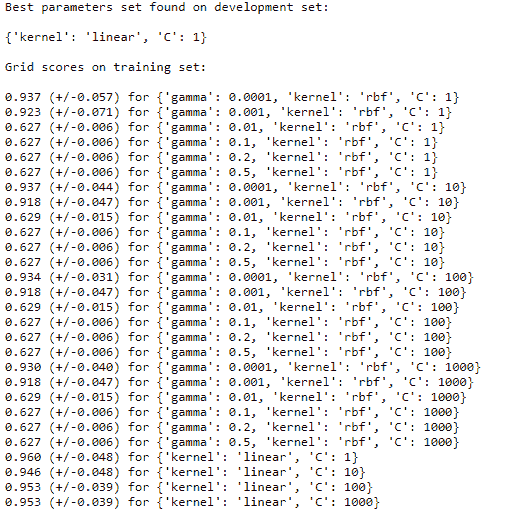

在此帮助下，我们可以看到并找出哪个参数组合给了我们更好的结果。

在这里，最佳组合是一个线性核，其`C`值为`1`。


# 摘要

在这一章中，我们介绍了向量、向量的大小和点积。我们学习了可用于分类和回归的支持向量机。我们研究了支持向量和核以及不同类型的核。最后，通过网格搜索研究了 SVM 算例和参数优化。

在下一章，我们将学习集成学习中的表现。*