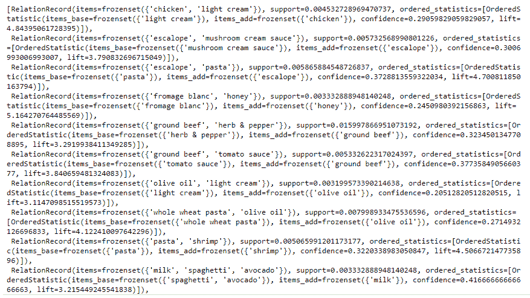
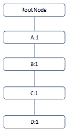
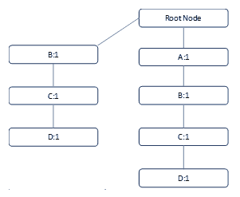
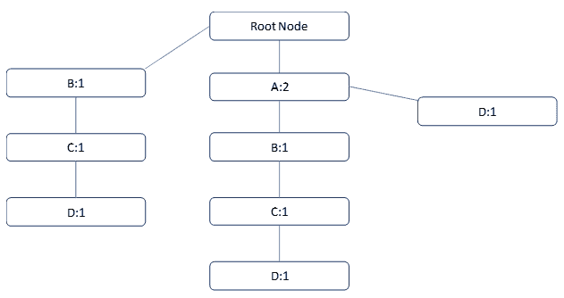
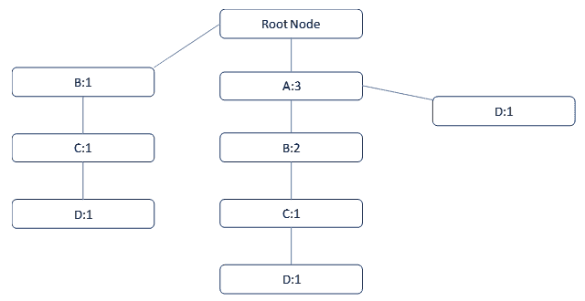
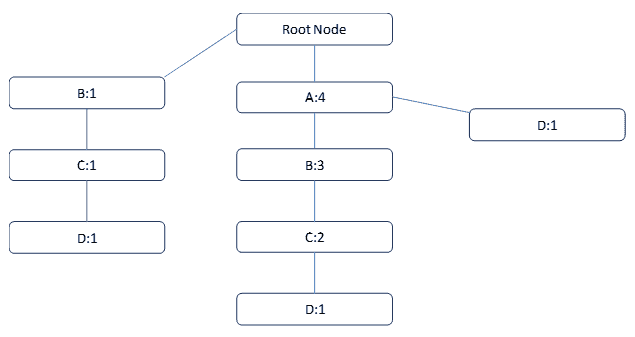
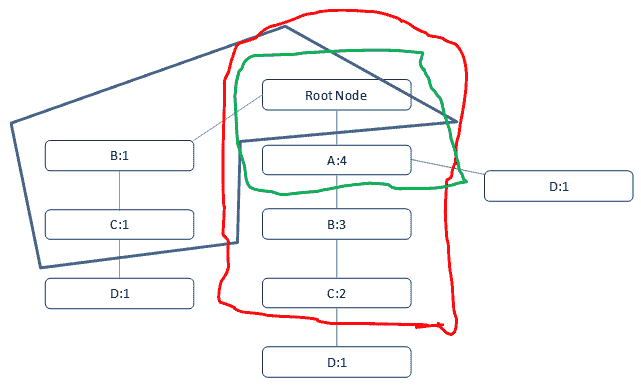
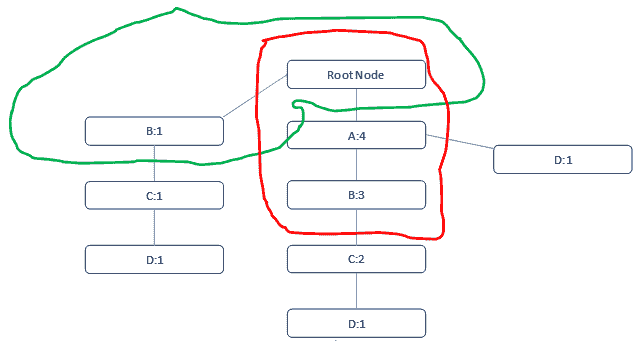
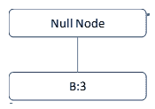

<title>Temporal and Sequential Pattern Discovery</title>  

# 时间和序列模式发现

我们中的许多人都去过像 Reliance 和 Walmart 这样的零售店购买家用物品。假设我们打算从 Reliance Digital 购买一台 iPhoneX。我们通常会通过访问商店的移动部分来搜索型号，然后选择产品并走向结算柜台。

但是，在当今世界，组织的目标是增加收入。能否通过一次只向客户推销一种产品来做到这一点？答案是明确的**否**。因此，组织开始挖掘与经常购买的商品相关的数据。他们试图找出可以一起销售的不同物品和产品之间的关联，这有助于正确的产品放置。通常，它会计算出一起购买的产品，组织可以以类似的方式放置产品。

这就是我们在本章要讲的内容。我们如何通过机器学习的方式得出这样的规则？我们将在这里讨论一些技术。

在本章中，我们将讨论以下主题:

*   关联规则
*   频繁模式增长
*   确认

<title>Association rules</title>  

# 关联规则

关联规则挖掘是一种技术，其关注于从在诸如关系和事务数据库的数据库中发现的数据集中观察频繁出现的模式和关联。这些规则并没有说明个人的偏好；相反，他们主要依靠交易中的项目来推断某种联系。每笔交易都由一个名为**的主键(唯一 ID)来标识，交易 ID** 。所有这些交易作为一个组进行研究，并挖掘模式。

关联规则可以被认为是一种**如果—那么**关系。为了详细说明这一点，我们必须提出一个规则:**如果**一个商品 **A** 被客户购买，**那么**商品 **B** 也被客户在相同的交易 ID 下挑选的机会(连同商品 **A** )被找出。你需要明白，这不是一个因果关系，而是一种共现模式。

这些规则有两个要素:

*   **Antecedent (if)** :这是通常在项目集或数据集中找到的项目/项目组
*   **后件(then)** :这是一个带有先行词/一组先行词的项目

看看下面的规则:

*{面包，牛奶} {黄油}*

这条规则的第一部分叫做**前因**，第二部分(箭头之后)是**后果**。它能够传达出如果*面包*和*牛奶*被提前采摘，那么*黄油*有可能在交易中被采摘。然而，给定前件，后件出现在项集中的百分比机会是不清楚的。

让我们来看一些有助于我们实现这一目标的指标:

1.  **支持**:这是一个项目集在所有事务中出现频率的度量。例如，对于沃尔玛这样的零售商店，有两个项目集出现在交易数量中:项目集 *A = {Milk}* ，项目集 *B = {laptop}* 。给定支持度是项目集在所有事务中的频繁程度，我们被要求找出哪个项目集得到了更高的支持度。我们知道项目集 *A* 会有更高的支持度，因为*牛奶*比*笔记本*更有可能出现在日常购物清单中(进而出现在交易中)。我们再增加一层关联，用两个新的项集来学习:项集*A = {牛奶，玉米片}* ，项集*B = {牛奶，u 盘}* 。*牛奶*和*玉米片*加在一起的购买频率会高于*牛奶和 u 盘*。这将提高*和*的支持度。

让我们把这转化成数学:

*支持(A，B) =包含 A 和 B 的交易/交易总数*

这里有一个例子:

2.  **置信度**:表示当物品 2 已经被提货时，物品 1 被购买/提货的可能性有多大。换句话说，它衡量的是前提条件已经在交易中的情况下，后续交易发生的可能性。换句话说，如果*面包*已经是交易的一部分，那么它就是交易中出现*黄油*的概率。很明显，这是一个条件概率发生的结果，而有先行词:

这里有一个例子:

这意味着有 16.7%的可能性会发生这种情况。

置信度的一个缺点是它只考虑了项目 1 有多受欢迎，而没有考虑项目 2。如果第 2 项同样频繁，则包含第 1 项的事务也包含第 2 项的可能性更大。因此，它将导致一个膨胀的结果。为了说明这两个组成项目的频率，我们使用了第三种方法，称为**提升**。

3.  **提升值**:这是一个指标，表明在购物车/交易中物品 B 被挑选的可能性，假设物品 *A* 已经被挑选，同时记录物品 *B 的频率。*提升值大于 1 表示物品 *A* 和物品 *B、*之间有很大关联，这意味着如果物品 *B* 被挑选的可能性很大小于 1 的提升值意味着如果物品 *A* 已经存在，则物品 *B* 被拾取的可能性很小。如果提升值达到零，这意味着在这里不能建立关联。

*Lift(A B)=(包含 A 和 B 的交易/(包含 A 的交易)/包含 B 的交易的分数*

意味着:

*= Support(A，B)/(Support(A) * Support(B))*

*提升(牛奶谷物)= ( 10/(50+10))/0.4*

*= 0.416*

我们将在这里看到一个更好的格式。在知道牛奶已经在推车里的情况下，在推车里有谷物的概率(这叫做**置信度** ) = *10/(50+10) = 0.167。*

在不知道牛奶在*推车里的情况下，推车里有谷物的概率= (30+10)/100 = 0.4* 。

这意味着知道牛奶已经在推车里，将挑选谷物的机会从 *0.4* 减少到 *0.167* 。为 *0.167/0.4= 0.416* 的升程，小于 *1* 。因此，当牛奶已经在推车里时，挑选谷物的机会非常小。

<title>Apriori algorithm</title>  

# Apriori 算法

Apriori 算法是一种经典算法，用于挖掘频繁项集，以获得各种关联规则。这将有助于以更好的方式建立一个零售商店，这将有助于创收。

支撑测度的反单调性是先验围绕的主要概念之一。它假设如下:

*   频繁项目集的所有子集必须是频繁的
*   类似地，对于任何非频繁项集，它的所有超集也必须是非频繁的

让我们来看一个例子并解释一下:

| **交易 ID** | **牛奶** | **黄油** | **谷类** | **面包** | **书** |
| T1 级（一种通讯线路的名称） | 一 | 一 | 一 | 0 | 0 |
| t2 | 0 | 一 | 一 | 一 | 0 |
| t3 | 0 | 0 | 0 | 一 | 一 |
| t4 | 一 | 一 | 0 | 一 | 0 |
| t5 | 一 | 一 | 一 | 0 | 一 |
| t6 | 一 | 一 | 一 | 一 | 一 |

我们已经获得了交易 ID 以及牛奶、黄油、麦片、面包和书籍等物品。1 表示项目是交易的一部分，0 表示不是。

*   我们想出了一个所有项目的频率表，支持(除以 6):

| **物品** | **交易笔数** | **支持** |
| 牛奶 | 四 | 67% |
| 黄油 | 5 | 83% |
| 谷物 | 四 | 67% |
| 面包 | 四 | 67% |
| 书 | 3 | 50% |

*   我们将把支持阈值设置为 60%，这将按频率过滤掉这些项目，因为这些项目在此场景中可以作为频繁项目集来处理:

| **物品** | **交易笔数** |
| 牛奶 | 四 |
| 黄油 | 5 |
| 谷物 | 四 |
| 面包 | 四 |

*   类似地，我们用这些项目形成组合的数量(一次两个，一次三个，一次四个)并找出频率:

| **物品** | **交易笔数** |
| 牛奶，黄油 | 四 |
| 牛奶，麦片 | 3 |
| 牛奶，面包 | 2 |
| 黄油，面包 | 3 |
| 黄油，麦片 | 四 |
| 麦片，面包 | 2 |

现在，同样，我们必须找出前面示例的支持度，并通过阈值对它们进行过滤，支持度为 60%

类似地，组合必须一次由三种物品组成(例如，牛奶、黄油和面包)，并且需要为它们计算支持度。最后，我们将通过阈值过滤掉它们。同样的过程需要一次做四项。我们到目前为止所做的步骤叫做**频繁项集生成**。

<title>Finding association rules</title>  

# 寻找关联规则

为了找到关联规则，我们必须首先搜索支持度大于阈值支持度的所有规则。但问题出现了:我们如何找到这些？找到这一点的一种可能的方法是通过蛮力，这意味着列出所有可能的关联规则，并计算每个规则的支持度和置信度。稍后，删除所有不符合置信度和支持度阈值的规则。

给定集合 *I* 中有 *n* 项，可能的关联规则总数为*3^n-2^(n+1)+1*。

如果 *X* 是具有 *k* 个元素的频繁项集，那么就有 *2 ^k - 2* 个关联规则。

让我们看看如何在 Python 中执行关联规则:

```
import numpy as np
import matplotlib.pyplot as plt
import pandas as pd

data = pd.read_csv('association_mining.csv', header = None)

transactions = []
for i in range(0, 7501):
 transactions.append([str(data.values[i,j]) for j in range(0, 20)])
```

如果我们要求一个项目在七天内一天出现三次，那么支持将是 *3 x 7/7051* 。 *7051* 是交易总数。我们将在开始时保持 20%的置信度:

```
from apyori import apriori
rules = apriori(transactions, min_support = 0.003, min_confidence = 0.2, min_lift = 3, min_length = 2)

results = list(rules)
results
```

我们可以通过运行前面代码中的`results`命令来可视化输出:



<title>Frequent pattern growth</title>  

# 频繁模式增长

**频繁模式增长** ( **FP-growth** )是一种频繁项集生成技术(类似于 Apriori)。FP-Growth 构建了一个紧凑的树结构，并使用该树进行频繁项集挖掘和生成规则。它比 Apriori 更快，并且可以使用大型数据集得出结果。

让我们来看看 FP-Growth 的步骤:

1.  **设置交易**:该步骤按频率设置项目。但是，这些项目是垂直设置的，而不是水平设置的。这意味着将输入从交易转换为项目:

| **t_id** | **物品** |
| 一 | (B、C、D、A) |
| 2 | (B、C、D) |
| 3 | (D，A) |
| 四 | (甲、乙) |
| 5 | (甲、丙、乙) |

2.  **查找频率**:现在我们必须单独查找每个项目的频率:

| **物品** | **频率** |
| A | 四 |
| B | 四 |
| C | 3 |
| D | 3 |

让我们将最低阈值或最低支持设置为 50%:

3.  **按频率对项目进行优先级排序**:由于所有项目的频率都大于或等于最小支持度，因此所有项目都将成为其一部分。此外，根据项目出现的频率，将为项目分配优先级或等级:

| **项目** | **频率** | **排名** |
| A | 四 | 一 |
| B | 四 | 2 |
| C | 3 | 3 |
| D | 3 | 四 |

项目的顺序是:A、B、C 和 D(按频率降序排列)

4.  **按优先顺序排列物品**:现在物品的顺序将根据基于频率的各种物品的优先顺序来设置。目前，顺序为 A、B、C 和 D:

| **t_id** | **物品** | **按优先级排序** |
| 一 | (B、C、D、A) | (甲、乙、丙、丁) |
| 2 | (B、C、D) | (B、C、D) |
| 3 | (D，A) | (甲、丁) |
| 四 | (甲、乙) | (甲、乙) |
| 5 | (甲、丙、乙) | (甲、乙、丙) |

<title>Frequent pattern tree growth</title>  

# 频繁模式树生长

我们将从以下几行研究不同的频繁模式树增长:

*   **第 1 行**:每个 FP 树都以一个空节点作为根节点开始。让我们画出树顺序的第一行以及它们的频率:



*   **第二排**:有 *{B，C，D}* 。*缺少一个*，因此我们无法将其与前面的节点合并。因此，我们必须创建另一个节点，如下所示:



*   **第三排**:有 *{A，D}* 。 *B* 和 *C* 都不见了，但是我们可以和更早的节点绑在一起。 *A* 遇到重复，所以频率会变化。现在变成了 *2* :



*   **第 4 排**:有 *{A，B}* 。我们可以将它与前面的节点联系起来，并在前面的节点上遍历。 *A* 和 *B* 遇到重复，频率会因此而改变。它分别变成 3 和 2:



*   **第 5 排**:有 *{A，B，C}* 。同样，它可以与前面的节点绑定，A、B 和 C 看到重复，因此它们的频率会改变。它分别变成 4、3 和 2:



<title>Validation </title>  

# 确认

现在，让我们计算我们得到的最终树的频率，并将每个项目的频率与表格进行比较，以确保我们在表格中得到正确的频率:

*   答:4
*   **B:4**
*   **C:3**
*   **D:3**

现在我们将从下往上走。我们会找出 D 出现的分支:



我们可以看到 D 出现的地方有三个分支:

*   公元前 1 年
*   ABC: 1
*   答:1

这些分支被称为 d 的条件模式库。当我们这样做时，需要记住以下几点:

*   即使我们从下到上遍历，我们也是以自上而下的方式编写分支
*   d 不是它的一部分
*   1 代表 D 在每个分支中出现的频率

现在，D 的条件模式产生了 A、B 和 C 的条件频率，分别是 2、2 和 2。都小于最小支持度(3)。因此，它不可能有任何条件 FP- Tree。

现在，让我们来看看 C. C 是出现在下列分支中的:



分支的结尾是这样的:

*   乙:1
*   阿瑟:2

这导致了 A:2 和 B:3。所以，B 符合符合最小支持度的法案。现在条件树的结尾是这样的:



类似地，对不同的组合进行条件模式查找。因此，它建立了频繁项数据集。

让我们看看如何在 Python 中实现它。我们将使用一个名为`pyfpgrowth`的库。此外，我们将在下一节创建一个项集。

<title>Importing the library</title>  

# 导入库

为了执行验证，我们将导入库并构建事务，如下所示:

```
import pyfpgrowth
```

我们像这样建立我们的交易:

```
transaction = [["bread", "butter", "cereal"],
 ["butter", "milk"],
 ["bread", "milk"],
 ["butter", "cereal", "milk"],
 ["egg", "bread"],
 ["egg", "butter"],
 ["cereal", "milk"],
 ["bread", "butter", "cereal", "egg"],
 ["cereal", "bread", "butter"]]
```

现在定义最小支持度来寻找模式。`find_frequent_patterns()` *，*其中`transactions`是每次交易购买的物品列表，`2`是为支持计数设置的最小阈值:

```
patterns = pyfpgrowth.find_frequent_patterns(transaction, 2)
```

最后，我们必须定义获取规则的置信度。规则是基于模式生成的，而`0.5`是置信度的最小阈值集。然后，我们将规则存储在名为`rules`的数据帧中。`rules`最初由前件、后件和置信值组成:

```
rules = pyfpgrowth.generate_association_rules(patterns, 0.5)
print(rules)
```

我们得到如下输出:


我们就是这样得到规则的。FP-growth 往往比 Apriori 更有优势，因为它更快、更有效。

<title>Summary</title>  

# 摘要

在这一章中，我们学习了关联规则。我们还讨论了 Apriori 算法，该算法用于挖掘频繁项集以获得各种关联规则。我们还学习了类似于 Apriori 的频繁模式增长(FP-growth)和类似于 Apriori 算法的频繁项集生成技术。最后，我们通过一个例子看到了 FP-growth 比 Apriori 更有优势，因为它更快更有效。

在下一章，我们将研究概率图形模型。我们将深入学习贝叶斯规则和贝叶斯网络。