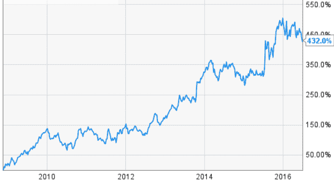
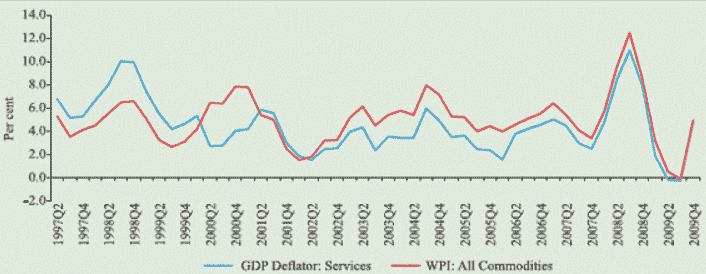
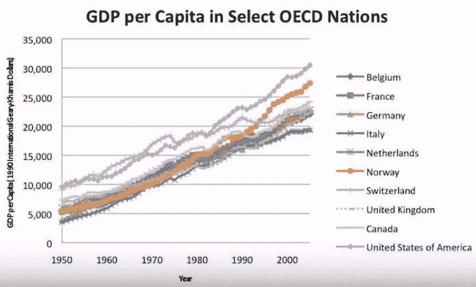
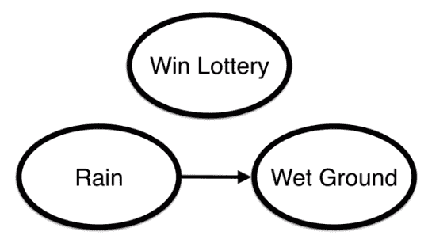
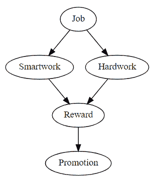
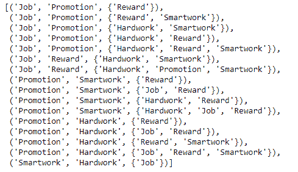
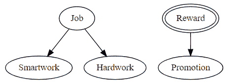

# 十、因果推理

在最后一章中，我们将了解以下主题:

*   时间序列中的格兰杰因果关系(因果关系的计量经济学方法)
*   图形模型因果关系


# 格兰杰因果关系

在时间序列中，我们通常使用单变量数据。也就是说，我们使用单个序列来预测其未来值。假设我们正在研究谷歌的股价数据，我们被要求预测股价的未来值。在这种情况下，我们需要 Google 股票价格的历史数据。基于此，我们将做出预测。

然而，有时我们需要多个时间序列来进行预测。但是为什么我们需要多个时间序列呢？有什么猜测吗？

下图显示了谷歌的股价数据:



答案是，我们需要了解和探索多个时间序列之间的关系，因为这可以提高我们的预测。例如，我们得到了 **GDP 平减指数:服务业**和 **WPI:所有商品**的相关时间序列，如下所示:



很明显，这两者似乎有关系。当我们必须预测 **GDP 平减指数:服务**时，我们可以使用 **WPI:所有商品**时间序列数据作为输入。这叫做**格兰杰因果关系**。

更恰当地说，格兰杰因果关系是考察时间序列中两个变量之间因果关系的方法之一。这种方法是对因果关系的概率解释。

尽管我们在这里谈论因果关系，但它并不完全相同。通常，因果关系与变量 *1* 是变量 2 的原因的情况相关联，反之亦然。然而，由于格兰杰因果关系，我们并没有测试真正的因果关系。了解的根本原因是在时间序列中某个变量是否在另一个变量之前。

你不是在测试真正的因果关系。你想知道的是在时间序列中某个变量是否在另一个变量之前。也就是说，如果我们在数据中找到格兰杰因果关系，那么就没有任何真正意义上的因果联系。

当计量经济学家说原因时，他们的意思是格兰杰原因，尽管更合适的词可能是优先。格兰杰因果关系是由诺贝尔经济学奖获得者克莱夫·格兰杰教授于 2003 年提出的。

让我们再看一个例子。这里，我们有经合组织国家的人均 GDP。我们可以看到，一些经合组织国家的国内生产总值有类似的增长和模式。我们可以假设，由于依赖关系，这些国家对彼此的 GDP 增长负有责任。

下图显示了经合组织国家的人均国内生产总值:



我们可以利用一个国家的序列来预测另一个国家。通常，这种关系在金融时间序列中更为普遍。印度股市、NSE/BSE 等可能会对 NYSE 产生影响。因此，NYSE 指数可用于预测 NSE 指数。

让我们给它注入一点数学知识。假设有两个时间序列， *X(t)* 和 *Y(t)* 。如果说 *X(t)* 的过去值在帮助预测 *Y(t)* 的未来值，那么就说 *X(t)* 格兰杰原因 *Y(t)* 。

因此， *Y(t)* 是 *Y(t)* 滞后的函数，也是 *X(t)* 滞后的函数。它可以表示如下:

*Y(t) = f(Yt-p，Xt-p)*

但是，这仅适用于以下情况:

*   原因发生在结果之前。这意味着 *Y(t) = f(Xt-1)* ，
*   原因已获得关于其影响的未来值的重要信息，例如:

*Y(t) = a1 Yt-1 + b1 Xt-1 +误差*

*Xt-1* 正在给 *Y(t)* 增加一个额外的效果。效果的大小由 *b1* 决定。

假设我们有两个方程:

*Yt= a0+ a1* Yt-1*

*Yt= a0 + a1*Yt-1 + a2*Xt-1*

这里的零假设如下:

*   *H0: a2=0* :这意味着没有其他系列的影响，其中 *Xt-1* 对 *Yt*

另一个假设如下:

*   *H1: a2≠ 0* :这意味着有其他系列的显著影响，其中 *Xt-1* 对 *Yt*

我们进行 t 检验，以确定其他系列的 *Xt-1* 对 *Yt* 是否有显著影响。

如果零假设被驳回，我们可以说这是一个格兰杰因果关系的案例。


# f 检验

运行该测试的基本步骤如下:

1.  阐明零假设及其替代方案。
2.  选择滞后。这可能取决于您拥有的数据量。选择滞后 I 和 j 的一种方法是进行模型顺序测试。更简单的方法是选取多个值，然后运行格兰杰检验，看看不同滞后水平的结果是否相似。

3.  还要确定 f 值。这两个方程可用于找出对于所有滞后 *j* 是否 *βj = 0* 。


# 限制

这种方法的不同限制如下:

*   格兰杰因果关系不是真正的因果关系
*   如果 *X(t)* 通过第三个变量 *Z(t)* 影响 *Y(t)* ，那么就很难找到格兰杰因果关系


# 用例

这里，我们有一个多变量时间序列数据集，称为`AirQualityUCI`。我们必须检验氮氧化物是否与二氧化氮有格兰杰因果关系。

由于我们在 Python 中没有多元格兰杰因果关系的库，我们将在 R 中通过使用`lmtest`包来实现这一点。

加载`lmtest`库。如果没有这个库，您需要安装它，如下所示:

```
install.packages("lmtest")
library(lmtest)
```

加载数据。然后，利用`grangertest`功能找出 NOx 和 NO2 之间是否有显著的关系:

```
data= read.csv("AirQualityUCI.csv")
grangertest(NOx.GT. ~ NO2.GT., order = 3, data = data)
```

其输出如下所示:


因此，f 检验变得很重要，这意味着滞后 NO2 的系数对 NOx 有很大影响。


# 图形因果模型

该模型在[第 8 章](64be9aad-a25e-4ea4-abbb-bc8ff4cbbe1a.xhtml) *“概率图模型*中有详细介绍。我们也将在这里简单地研究一下。

贝叶斯网络是有向无环图(Dag ),其中的节点表示感兴趣的变量(例如，设备的温度、患者的性别、对象的特征、事件的发生等等)。变量之间的因果影响用链接来表示。影响的强度可以通过与网络中的每个父子节点集群相关联的条件概率来表征。在下图中，我们可以看到有一个节点和一条边的因果模型:


节点代表变量，边代表变量之间的条件关系。我们寻求的是完全联合概率分布。这里所说的是条件依赖。下雨导致地面潮湿。但是，彩票中奖与其他变量无关。它具有条件独立性，如下图所示:



这里，条件独立的概率如下:

*P(彩票，雨，湿地)= P(彩票)P(雨)P(湿地|雨)*

因此，我们可以说，贝叶斯网络通过将条件概率作为边来描述所有变量之间的概率分布。

让我们看一个 Python 中的例子:

1.  首先，我们需要加载库`CausalGraphicalModel`，如下所示:

```
from causalgraphicalmodels import CausalGraphicalModel
```

2.  让我们建立一个条件模型，如果某人正在做一个`Job`，如果它由`Smartwork`和`Hardwork`驱动，他/她将获得奖励，并最终获得晋升:

```
Model = CausalGraphicalModel(
 nodes=["Job", "Smartwork", "Hardwork", "Reward", "Promotion"],
 edges=[
 ("Job", "Smartwork"), 
 ("Job", "Hardwork"), 
 ("Smartwork", "Reward"),
 ("Hardwork", "Reward"), 
 ("Reward", "Promotion")
 ]
)
Model.draw()
```

以下是上述代码的输出:



3.  让我们获得分布:

```
print(Model.get_distribution())

```

然后，我们将得到以下输出:


4.  让我们提取所有的条件独立性关系:

```
Model.get_all_independence_relationships()
```



这里，我们能够评估变量之间的条件独立性。

5.  让我们把这个和`Reward`混合起来:

```
Intervene = Model.do("Reward")
Intervene.draw()
```




# 摘要

在这一章中，我们研究了格兰杰因果关系，这是我们使用单一时间序列来预测其未来值，以及图形因果关系模型的不同模型。图形因果模型涵盖了两个例子，这将使我们对图形因果模型有一个基本的概念。