# 三、R 和统计

在本章中，我们将讨论以下主题:

*   理解 R 中的数据采样
*   运算 R 中的概率分布
*   在 R 中使用单变量描述性统计
*   执行相关性和多变量分析
*   操作线性回归和多变量分析
*   进行精确的二项式检验
*   执行学生的 t 检验
*   执行 Kolmogorov-Smirnov 测试
*   理解 Wilcoxon 秩和与符号秩检验
*   使用皮尔逊卡方检验
*   进行单向方差分析
*   进行双向方差分析


# 简介

作为统计语言 S 的后代，R 语言已经成为统计领域的首选计算语言。而且，由于其作为该领域活跃贡献者的地位，如果发现了新的统计方法，很有可能首先在 R 语言中实现这种方法。因此，大量的统计方法可以通过应用 R 语言来实现。

要在 R 中应用统计方法，用户可以将实现方法分为描述性统计和推断性统计:

*   **描述性统计**:这些用来概括数据的特征。用户可以使用平均值和标准差来描述数字数据，使用频率和百分比来描述分类数据。
*   **推断统计**:根据样本数据中的模式，用户可以推断出总体的特征。与推断统计相关的方法用于假设检验、数据估计、数据关联和关系建模。推论可以进一步扩展到预测、预测和估计被研究人群中或与之相关的未观察到的值。

在下面的食谱中，我们将讨论数据采样、概率分布、单变量描述性统计、相关性和多变量分析、线性回归和多变量分析、精确二项式检验、学生 t 检验、Kolmogorov-Smirnov 检验、Wilcoxon 秩和与有符号秩检验、Pearson 卡方检验、单向 ANOVA 和双向 ANOVA。


# 了解 R 中的数据采样

抽样是从统计总体中选择数据子集的方法，可以利用总体的特征来估计总体。以下配方将演示如何在 r 中生成样本。


## 准备就绪

确保你有一个适合以下食谱的工作环境。


## 怎么做...

执行以下步骤来理解 R 中的数据采样:

1.  为了生成给定人群的随机样本，用户可以简单地使用`sample`功能:

    ```r
     > sample(1:10) 
    ```

2.  要指定返回的项数，用户可以将赋值设置为`size`参数:

    ```r
     > sample(1:10, size = 5) 
    ```

3.  此外，样本还可以通过指定`replace = TRUE`(默认为`FALSE` ):

    ```r
     > sample(c(0,1), 10, replace = TRUE) 
    ```

    来生成伯努利试验


## 它是如何工作的...

正如我们在前面的演示中看到的，`sample`函数可以从指定的总体中生成随机样本。用户只需通过指定`size`的参数，即可指定记录的返回值。将`replace`参数分配给`TRUE`，您可以生成伯努利试验(只有`0`和`1`的群体)。


## 亦见

*   在 R 中，默认包提供了另一个示例方法`sample.int`，其中 n 和 size 都必须以整数形式提供:

    ```r
     > sample.int(20, 12) 
    ```


# 运算 R 中的概率分布

概率分布和统计分析密切相关。对于统计分析来说，分析师是基于一定的人群进行预测的，这种人群大多是在一种概率分布下。所以，如果你发现选择预测的数据并没有遵循实验设计中确切的假设概率分布，那么即将出现的结果是可以反驳的。换句话说，概率为统计提供了依据。下面的例子将演示如何在 r 中生成概率分布


## 正在准备中

由于大多数分发函数源自`stats`包，确保库`stats`已加载。


## 怎么做...

执行以下步骤:

1.  对于正态分布，用户可以使用`dnorm`，返回`0` :

    ```r
     > dnorm(0) [1] 0.3989423 
    ```

    处的正态曲线高度
2.  然后，用户可以更改自变量中的平均值和标准差:

    ```r
     > dnorm(0,mean=3,sd=5) [1] 0.06664492 
    ```

3.  Next, plot the graph of a normal distribution with the `curve` function:

    ```r
    > curve(dnorm,-3,3)

    ```

    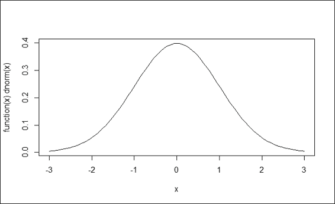

    标准正态分布

4.  与返回正常曲线高度的`dnorm`相比，`pnorm`函数可以返回给定值下的面积:

    ```r
     > pnorm(1.5) [1] 0.9331928 
    ```

5.  或者，要得到某个值以上的面积，可以指定选项`lower.tail`到`FALSE` :

    ```r
     > pnorm(1.5, lower.tail=FALSE) [1] 0.0668072 
    ```

6.  To plot the graph of `pnorm`, the user can employ a `curve` function:

    ```r
    > curve(pnorm(x), -3,3)

    ```

    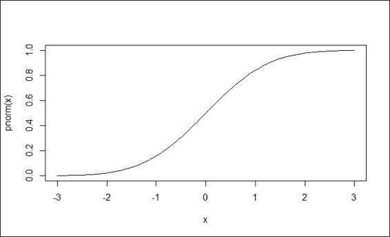

    累积密度函数

7.  要计算特定分布的分位数，可以使用`qnorm`。函数`qnorm,`可以被视为`pnorm`的逆函数，它返回给定概率的 Z 得分:

    ```r
     > qnorm(0.5) [1] 0 > qnorm(pnorm(0)) [1] 0 
    ```

8.  To generate random numbers from a normal distribution, one can use the `rnorm` function and specify the number of generated numbers. Also, one can define optional arguments, such as the mean and standard deviation:

    ```r
    > set.seed(50)
    > x = rnorm(100,mean=3,sd=5)
    > hist(x)

    ```

    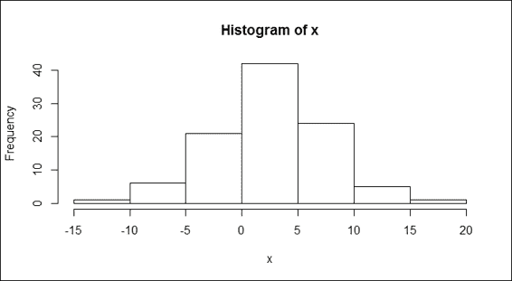

    正态分布直方图

9.  To calculate the uniform distribution, the `runif` function generates random numbers from a uniform distribution. The user can specify the range of the generated numbers by specifying variables, such as the minimum and maximum. For the following example, the user generates 100 random variables from `0` to `5`:

    ```r
    > set.seed(50)
    > y = runif(100,0,5)
    > hist(y)

    ```

    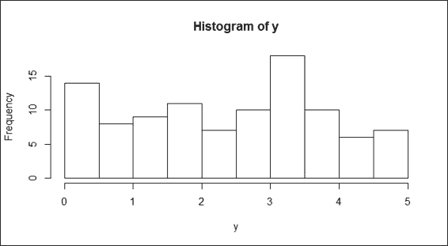

    均匀分布的直方图

10.  最后，如果你想测试数据的正态性，最广泛使用的测试是夏皮罗-威尔克斯测试。在这里，我们演示如何对来自正态分布和均匀分布的两个样本分别执行正态性检验:

    ```r
     > shapiro.test(x)    Shapiro-Wilk normality test  data:  x  W = 0.9938, p-value = 0.9319 > shapiro.test(y)    Shapiro-Wilk normality test  data:  y  W = 0.9563, p-value = 0.002221 
    ```


## 它是如何工作的...

在这个食谱中，我们首先引入`dnorm`，一个概率密度函数，它返回一个正态曲线的高度。指定单个输入后，输入值称为标准分数或 z 分数。在没有指定任何其他参数的情况下，假设正态分布的均值为零，标准差为一。然后我们介绍三种绘制标准和正态分布的方法。

在这之后，我们引入`pnorm`，一个累积密度函数。函数`pnorm`可以生成给定值下的面积。除此之外，`pnorm`也可用于计算正态分布的 p 值。从数字中减去 1，或者将选项`lower.tail`赋值为 True，就可以得到 p 值。类似地，可以使用`plot`函数来绘制累积密度。

与`pnorm`相反，`qnorm`返回给定概率的 z 值。因此，该示例显示将`qnorm`函数应用于`pnorm`函数将产生精确的输入值。

接下来，我们将向您展示如何使用`rnrom`函数从正态分布中生成随机样本，以及如何使用`runif`函数从均匀分布中生成随机样本。在函数`rnorm`中，必须指定生成数字的数量，我们也可以添加可选的增量，如平均值和标准偏差。然后，通过使用`hist`函数，应该能够找到图 3 中的钟形曲线。另一方面，对于`runif`功能，使用最小和最大规格，可以获得两者之间的样本号列表。然而，我们仍然可以使用`hist`功能来绘制样本。很明显，输出数字(如上图所示)不是钟形的，这表明样本不是来自正态分布。

最后，我们演示了如何用夏皮罗-威尔克斯检验来检验数据的正态性。这里，我们分别对正态和均匀分布样本进行正态性检验。在这两个输出中，人们可以在每个测试结果中找到 p 值。p 值显示了变化，这表明样本来自正态分布。如果 p 值高于 0.05，我们可以断定样本来自正态分布。另一方面，如果该值低于 0.05，则我们断定样本不来自正态分布。


## 还有更多...

除了正态分布，您还可以通过使用 r 的内置函数获得 t 分布、二项式分布和卡方分布。您可以使用`help`函数来访问关于此的更多信息:

*   对于一个 t 分布:

    ```r
     > help(TDist) 
    ```

*   对于二项分布:

    ```r
     >help(Binomial) 
    ```

*   对于卡方分布:

    ```r
     >help(Chisquare) 
    ```

要了解更多关于这个包中的发行版的信息，用户可以使用关键字`distributions`访问`help`函数，找到所有相关的文档:

```r
> help(distributions)

```


# 在 R 中使用单变量描述性统计

单变量描述性统计描述一个单变量进行单位分析，也是最简单的定量分析形式。在这个食谱中，我们介绍一些用于描述单个变量的基本函数。


## 做好准备

我们需要对样本数据进行描述性统计。这里，我们使用内置的`mtcars`数据作为我们的示例。


## 怎么做...

执行以下步骤:

1.  首先将`mtcars`数据加载到一个名为`mtcars` :

    ```r
     > data(mtcars) 
    ```

    的数据帧中
2.  为了获得向量范围，`range`函数将返回向量的上下界:

    ```r
     > range(mtcars$mpg) [1] 10.4 33.9 
    ```

3.  计算变量长度:

    ```r
     > length(mtcars$mpg) [1] 32 
    ```

4.  求 mpg 的平均值:

    ```r
     > mean(mtcars$mpg) [1] 20.09062 
    ```

5.  获取输入向量的中值:

    ```r
     > median(mtcars$mpg) [1] 19.2 
    ```

6.  获取输入向量的标准差:

    ```r
     > sd(mtcars$mpg) [1] 6.026948 
    ```

7.  获取输入向量的方差:

    ```r
     > var(mtcars$mpg) [1] 36.3241 
    ```

8.  方差也可以用标准差的平方来计算:

    ```r
     > sd(mtcars$mpg) ^ 2 [1] 36.3241 
    ```

9.  为了获得**四分位距**(**IQR**):

    ```r
     > IQR(mtcars$mpg) [1] 7.375 
    ```

10.  获取分位数:

    ```r
     > quantile(mtcars$mpg,0.67)  67%  21.4 
    ```

11.  获取输入向量的最大值:

    ```r
     > max(mtcars$mpg) [1] 33.9 
    ```

12.  为了获得输入向量的最小值:

    ```r
     > min(mtcars$mpg) [1] 10.4 
    ```

13.  要获得一个包含累积最大值元素的向量:

    ```r
     > cummax(mtcars$mpg)  [1] 21.0 21.0 22.8 22.8 22.8 22.8 22.8 24.4 24.4 24.4 24.4 24.4 24.4 24.4 24.4 24.4 [17] 24.4 32.4 32.4 33.9 33.9 33.9 33.9 33.9 33.9 33.9 33.9 33.9 33.9 33.9 33.9 33.9 
    ```

14.  为了获得具有累积最小值的元素的向量:

    ```r
     > cummin(mtcars$mpg)  [1] 21.0 21.0 21.0 21.0 18.7 18.1 14.3 14.3 14.3 14.3 14.3 14.3 14.3 14.3 10.4 10.4 [17] 10.4 10.4 10.4 10.4 10.4 10.4 10.4 10.4 10.4 10.4 10.4 10.4 10.4 10.4 10.4 10.4 
    ```

15.  为了汇总数据集，可以应用`summary`函数:

    ```r
     > summary(mtcars) 
    ```

16.  为了获得分类数据的频率计数，以`mtcars`的`cyl`为例:

    ```r
     > table(mtcars$cyl)   4  6  8 11  7 14 
    ```

17.  要获得数字数据的频率计数，您可以使用词干图来描绘数据形状；`stem`产生一个给定值的茎叶图:

    ```r
     > stem(mtcars$mpg)    The decimal point is at the |    10 | 44   12 | 3   14 | 3702258   16 | 438   18 | 17227   20 | 00445   22 | 88   24 | 4   26 | 03   28 |    30 | 44   32 | 49 
    ```

18.  You can use a histogram of ggplot to plot the same stem-and-leaf figure:

    ```r
    > library(ggplot2)
    > qplot(mtcars$mpg, binwidth=2)

    ```

    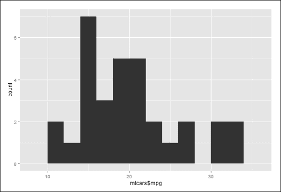

    mtcars 的 mpg 直方图


## 它是如何工作的...

单变量描述性统计生成数据集的频率分布。此外，它们可以用来识别数据中的明显模式和变量的特征，以便从整体的角度更好地理解数据。此外，它们还可以提供有关集中趋势的信息和单个案例偏斜度的描述符。因此，在数据探索过程的开始进行单变量分析是很常见的。

为了开始探索数据，我们首先将数据集`mtcars`加载到一个 R 会话中。从数据中，我们应用`range`、`length`、`mean`、`median`、`sd`、`var`、`IQR`、`quantile`、`min`、`max`、`cumin`、`cumax`得到属性`mpg`的描述性统计量。然后，我们使用`summary`函数获得关于`mtcars`的汇总信息。

接下来，我们获得分类数据的频率计数(`cyl`)。为了获得数字数据的频率计数，我们使用 stem 图来描绘数据形状。最后，我们使用带有`2`中的`binwidth`参数的直方图来生成一个类似于茎叶图的图。


## 还有更多...

单变量描述性统计的一个常见场景是寻找向量的模式。在 R 中，没有内置函数来帮助用户获取数据的模式。但是，可以使用以下代码实现模式功能:

```r
> mode = function(x) {
+ temp = table(x)
+ names(temp)[temp == max(temp)]
+ }

```

通过对向量`mtcars$mpg`应用`mode`函数，可以找到给定向量中最常出现的数值或类别:

```r
> x = c(1,2,3,3,3,4,4,5,5,5,6)
> mode(x)
[1] "3" "5"

```


# 执行相关性和多变量分析

为了分析两个以上变量之间的关系，您需要进行多变量描述性统计，这允许对因素进行比较。此外，它还能防止单个变量的影响扭曲分析。在本食谱中，我们将讨论如何使用相关和协方差矩阵进行多元描述性统计。


## 准备就绪

确保`mtcars`已经加载到 R 会话内的数据帧中。


## 怎么做...

执行以下步骤:

1.  这里，您可以通过将`mtcars`中的前三个变量输入到`cov`函数:

    ```r
     > cov(mtcars[1:3])              mpg        cyl       disp mpg    36.324103  -9.172379  -633.0972 cyl    -9.172379   3.189516   199.6603 disp -633.097208 199.660282 15360.7998 
    ```

    中得到协方差矩阵
2.  为了获得数据集的相关矩阵，我们将`mtcars`的前三个变量输入到`cor`函数:

    ```r
     > cor(mtcars[1:3])             mpg        cyl       disp mpg   1.0000000 -0.8521620 -0.8475514 cyl  -0.8521620  1.0000000  0.9020329 disp -0.8475514  0.9020329  1.0000000 
    ```


## 它是如何工作的...

在这个食谱中，我们演示了如何应用相关性和协方差来发现多个变量之间的关系。

首先，我们计算前三个`mtcars`变量的协方差矩阵。协方差可以衡量变量之间的线性关系。因此，正协方差(例如，`cyl`对`mpg`)表示两个变量正线性相关。另一方面，负协方差(例如，`mpg`对`disp`)表示两个变量负线性相关。然而，由于不同数据集的方差，这些数据集的协方差得分不具有可比性。因此，如果您想要比较不同数据集中两个变量之间的线性关系强度，您应该使用归一化得分，即相关系数，而不是协方差。

接下来，我们应用一个`cor`函数来获得`mtcars`数据集中三个变量的相关系数矩阵。在相关系数矩阵中，矩阵的数字元素表示两个变量之间关系的强度。如果一个变量对自身的相关系数得分`1`，则该变量对自身有正相关关系。`cyl`和`mpg`变量的相关系数为-0.85，这意味着变量之间存在很强的负相关关系。另一方面，`disp`和`cyl`变量得分为 0.90，这可能表明它们之间存在强有力的正相关关系。


## 参见

*   You can use `ggplot` to plot the heatmap of the correlation coefficient matrix:

    ```r
    > library(reshape2)
    > qplot(x=Var1, y=Var2, data=melt(cor(mtcars[1:3])), fill=value, geom="tile")

    ```

    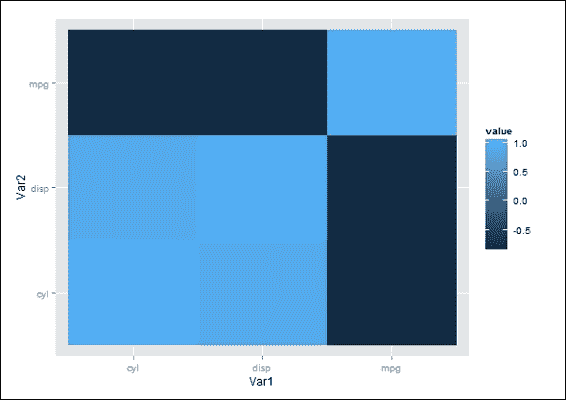

    相关系数矩阵热图


# 操作线性回归和多元分析

线性回归是一种评估因变量和自变量之间关联的方法。在本食谱中，我们将介绍如何进行多元分析的线性回归。


## 准备就绪

确保已经被加载到 R 会话内的数据帧中。


## 怎么做...

执行以下步骤:

1.  要将变量拟合到线性模型中，可以使用`lm`函数:

    ```r
     > lmfit = lm(mtcars$mpg ~ mtcars$cyl) > lmfit  Call: lm(formula = mtcars$mpg ~ mtcars$cyl)  Coefficients: (Intercept)   mtcars$cyl        37.885       -2.876  
    ```

2.  要获得拟合模型的详细信息，您可以使用`summary`功能:

    ```r
     > summary(lmfit)  Call: lm(formula = mtcars$mpg ~ mtcars$cyl)  Residuals:     Min      1Q  Median      3Q     Max  -4.9814 -2.1185  0.2217  1.0717  7.5186   Coefficients:             Estimate Std. Error t value Pr(>|t|)     (Intercept)  37.8846     2.0738   18.27  < 2e-16 *** mtcars$cyl   -2.8758     0.3224   -8.92 6.11e-10 *** --- Signif. codes:  0 '***' 0.001 '**' 0.01 '*' 0.05 '.' 0.1 ' ' 1  Residual standard error: 3.206 on 30 degrees of freedom Multiple R-squared:  0.7262,  Adjusted R-squared:  0.7171  F-statistic: 79.56 on 1 and 30 DF,  p-value: 6.113e-10 
    ```

3.  要创建差异表的分析，可以使用`anova`函数:

    ```r
     > anova(lmfit) Analysis of Variance Table  Response: mtcars$mpg            Df Sum Sq Mean Sq F value    Pr(>F)     mtcars$cyl  1 817.71  817.71  79.561 6.113e-10 *** Residuals  30 308.33   10.28                       --- Signif. codes:  0 '***' 0.001 '**' 0.01 '*' 0.05 '.' 0.1 ' ' 1 
    ```

4.  To plot the regression line on a scatter plot of two variables, you first plot `cyl` against `mpg` in it, then use the `abline` function to add a regression line on the plot:

    ```r
    > lmfit = lm(mtcars$mpg ~ mtcars$cyl)
    > plot(mtcars$cyl, mtcars$mpg)
    > abline(lmfit)

    ```

    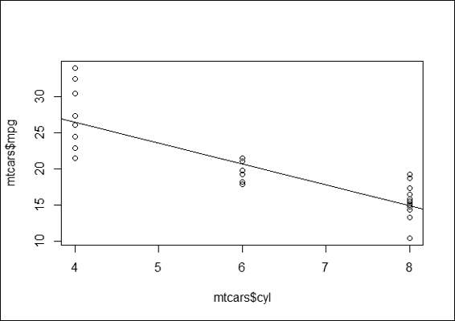

    cyl 对 mpg 的回归图


## 工作原理...

在此配方中，我们应用线性模型函数`lm`，该函数构建两个变量的线性拟合模型，并返回公式和系数。接下来，我们应用`summary`函数来检索模型的详细信息(包括 F 统计和 P 值)。F 统计量的目的是检验模型的统计显著性。它产生一个 F 值，即模型均方差与误差均方差之比。因此，大的 F 值表明回归模型解释了更大的总可变性。然后，我们可以使用 F 值来支持或拒绝所有回归系数都等于零的零假设。换句话说，如果 F 值很大，表明回归模型具有预测能力，则零假设被拒绝。另一方面，每个属性的 P 值测试系数等于零的零假设(对响应变量没有影响)。换句话说，低 p 值可以拒绝零假设，并表明预测值的变化与响应变量的值相关。

接下来，我们对拟合的模型应用`anova`函数来确定方差。该函数输出平方和，它代表模型预测值的可变性。此外，为了可视化两个变量之间的线性关系，`abline`函数可以在`mpg`对`cyl`的散点图上添加一条回归线。从上图可以明显看出`mpg`和`cyl`变量是负相关的。


## 参见

*   有关如何执行线性和非线性回归分析的更多信息，请参考[第 4 章](part0046_split_000.html#page "Chapter 4. Understanding Regression Analysis")、*了解回归分析*


# 进行精确的二项式检验

在做出决策时，了解决策误差是否可以控制或可以测量是很重要的。换句话说，我们希望证明所形成的假设不太可能是偶然发生的，并且具有统计学意义。在假设检验中，有两种假设:零假设和替代假设(或研究假设)。假设检验的目的是验证实验结果是否显著。然而，为了验证替代假设是否可接受，如果零假设被拒绝，则认为它是真的。

在下面的食谱中，我们将讨论一些常见的统计测试方法。首先，我们将介绍如何在 r 中进行精确的二项式检验。


## 做好准备

由于`binom.test`函数来源于`stats`包，确保`stats`库已加载。


## 怎么做...

执行以下步骤:

1.  假设有一个游戏，一个赌徒可以通过掷骰子来赢得数字 6。作为规则的一部分，赌徒可以自带骰子。如果一个赌徒试图在游戏中作弊，他会用一个装满的骰子来增加他获胜的机会。因此，如果我们观察到游戏者在 315 场游戏中赢了 92 场，我们可以通过进行精确的二项式测试来确定骰子是否公平:

    ```r
     > binom.test(x=92, n=315, p=1/6)    Exact binomial test  data:  92 and 315 number of successes = 92, number of trials = 315, p-value = 3.458e-08 alternative hypothesis: true probability of success is not equal to 0.1666667 95 percent confidence interval:  0.2424273 0.3456598 sample estimates: probability of success               0.2920635  
    ```


## 工作原理...

二项式测试使用二项式分布来找出对于具有二元结果的 *n* 次试验，真实的成功率是否可能是 *P* 。概率公式 *P* 可由下式定义:


这里， *X* 表示随机变量，计算利息的结果数； *n* 表示试验次数； *k* 表示成功次数； *p* 表示成功的概率；并且 *q* 表示故障的概率。

在我们计算了概率 *P* 之后，我们可以执行一个符号测试来确定成功概率是否与我们预期的相似。如果概率不等于我们预期的，我们可以拒绝零假设。

根据定义，零假设是一种怀疑的观点或关于将被检验的总体参数的陈述。零假设由 H0 表示。另一个假设由一系列总体值表示，这些值不包括在零假设中。另一种假设由 H1 提出。在这种情况下，无效假设和替代假设分别如下所示:

*   **H0(零假设)**:成功的真实概率等于我们的预期
*   **H1(替代假设)**:真正的成功概率并不等于我们预期的

在本例中，我们演示了如何使用二项式测试来确定掷骰子的次数、掷出数字 6 的频率以及无偏骰子掷出 6 的概率。t 检验的结果显示 p 值= 3.458e-08(低于 0.05)。对于显著性，在百分之五的水平，零假设(骰子是无偏的)被拒绝，因为掷出了太多的六(成功的概率= 0.2920635)。


## 参见

*   要阅读更多关于精确二项式检验的用法，请使用`help`函数查看相关文档:

    ```r
     > ?binom.test 
    ```


# 执行学生的 t 检验

单样本 t 检验使我们能够检验两个均值是否显著不同；双样本 t 检验允许我们检验两个独立组的均值是否不同。在这个菜谱中，我们将讨论如何使用 r 进行一个样本 t 检验和两个样本 t 检验。


## 准备就绪

确保`mtcars`已经加载到 R 会话内的数据帧中。由于`t.test`函数来源于`stats`包，确保`stats`库已加载。


## 怎么做...

执行以下步骤:

1.  First, we visualize the attribute, `mpg`, against `am` using a boxplot:

    ```r
    > boxplot(mtcars$mpg, mtcars$mpg[mtcars$am==0], ylab = "mpg", names=c("overall","automobile"))
    > abline(h=mean(mtcars$mpg),lwd=2, col="red")
    > abline(h=mean(mtcars$mpg[mtcars$am==0]),lwd=2, col="blue")

    ```

    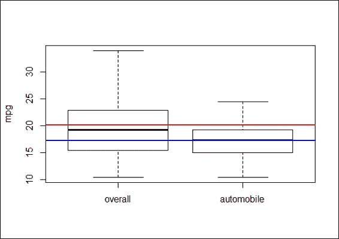

    总人口和汽车的 mpg 箱线图

    然后，我们执行一个统计过程来验证汽车的平均值`mpg`是否低于整体平均值`mpg` :

    ```r
     > mpg.mu = mean(mtcars$mpg) > mpg_am = mtcars$mpg[mtcars$am == 0] > t.test(mpg_am,mu = mpg.mu)    One Sample t-test  data:  mpg_am t = -3.3462, df = 18, p-value = 0.003595 alternative hypothesis: true mean is not equal to 20.09062 95 percent confidence interval:  15.29946 18.99528 sample estimates: mean of x   17.14737  
    ```

2.  自动挡和手动挡汽车的 mpg 箱线图
3.  We begin visualizing the data by plotting a boxplot:

    ```r
    >boxplot(mtcars$mpg~mtcars$am,ylab='mpg',names=c('automatic','manual'))
    > abline(h=mean(mtcars$mpg[mtcars$am==0]),lwd=2, col="blue")
    > abline(h=mean(mtcars$mpg[mtcars$am==1]),lwd=2, col="red")

    ```

    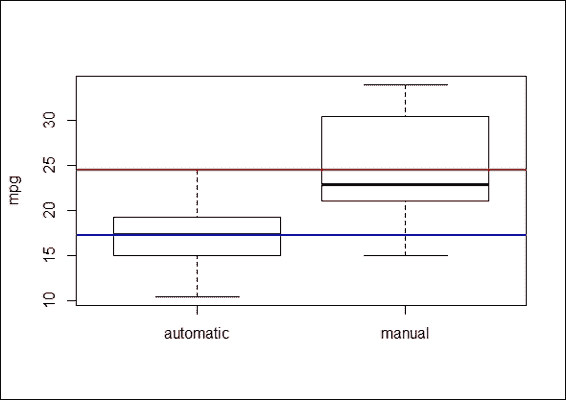

    The boxplot of mpg of automatic and manual transmission cars

    上图揭示了自动挡车的平均 mpg 低于手动挡车的平均 mpg:

    ```r
     > t.test(mtcars$mpg~mtcars$am)    Welch Two Sample t-test  data:  mtcars$mpg by mtcars$am t = -3.7671, df = 18.332, p-value = 0.001374 alternative hypothesis: true difference in means is not equal to 0 95 percent confidence interval:  -11.280194  -3.209684 sample estimates: mean in group 0 mean in group 1         17.14737        24.39231  
    ```

4.  工作原理...


## 学生的 t 检验是指如果零假设为真，则检验统计遵循正态分布(学生的 t 分布)。它可用于确定两个独立数据集之间是否存在差异。学生的 t 检验最适用于与基于小样本的推断相关的问题。

在这个食谱中，我们讨论一个样本学生的 t 检验和两个样本学生的 t 检验。在一个样本学生的 t 检验中，一个经常被问到的研究问题是，“总体的均值是否不同于零假设？”因此，为了测试汽车的平均 mpg 是否低于总体平均 mpg，我们首先使用箱线图来查看人口之间的差异，而不做任何假设。从上图可以明显看出，汽车的平均每加仑行驶里程(蓝线)低于总人口的平均每加仑行驶里程(红线)。然后，我们应用一个样本 t 检验；低 p 值为 0.003595 ( < 0.05) suggests that we should reject the null hypothesis that the mean mpg for automobiles is less than the average mpg of the overall population.

As a one sample t-test enables us to test whether two means are significantly different, a two sample t-test allows us to test whether the means of two independent groups are different. Similar to a one sample t-test, we first use a boxplot to see the differences between populations and then apply a two-sample t-test. The test results shows the p-value = 0.01374 (p< 0.05). In other words, the test provides evidence that rejects the null hypothesis, which shows the mean mpg of cars with automatic transmission differs from the cars with 手动变速器)。

参见


## 要了解更多关于学生 t-test 的用法，请使用`help`功能查看相关文档:

```r
 > ?t.test 
```

*   执行 Kolmogorov-Smirnov 测试


# 单样本 Kolmogorov-Smirnov 检验用于将样本与参考概率进行比较。双样本 Kolmogorov-Smirnov 检验比较了两个数据集的累积分布。在本食谱中，我们将演示如何使用 r 执行 Kolmogorov-Smirnov 测试。

准备就绪


## 确保`mtcars`已经加载到 R 会话内的数据帧中。由于`ks.test`函数源自`stats`包，确保`stats`库已加载。

怎么做...


## 执行以下步骤:

用单样本 Kolmogorov-Smirnov 检验验证数据集 x(用`rnorm`函数生成)是否正态分布:

```r
 > x = rnorm(50) > ks.test(x,"pnorm")    One-sample Kolmogorov-Smirnov test  data:  x D = 0.1698, p-value = 0.0994 alternative hypothesis: two-sided 
```

1.  接下来，可以生成均匀分布的样本数据:

    ```r
     > set.seed(3) > x = runif(n=20, min=0, max=20)  > y = runif(n=20, min=0, max=20) 
    ```

2.  两个生成数据样本的 ecdf 图
3.  We first plot `ecdf` of two generated data samples:

    ```r
    > plot(ecdf(x), do.points = FALSE, verticals=T, xlim=c(0, 20))
    > lines(ecdf(y), lty=3, do.points = FALSE, verticals=T)

    ```

    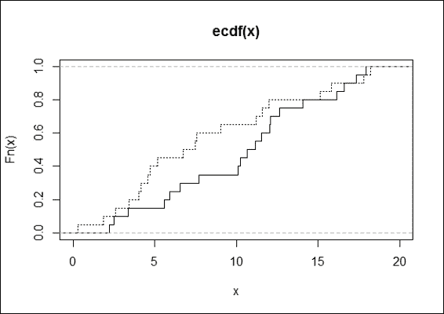

    The ecdf plot of two generated data samples

    最后，我们对两组数据应用双样本 Kolmogorov-Smirnov 检验:

    ```r
     > ks.test(x,y)    Two-sample Kolmogorov-Smirnov test  data:  x and y D = 0.3, p-value = 0.3356 alternative hypothesis: two-sided 
    ```

4.  工作原理...


## **Kolmogorov-Smirnov 检验** ( **K-S 检验**)是非参数统计检验，用于连续概率分布的相等性。它可用于将样本与参考概率分布进行比较(单样本 K-S 检验)，或者直接比较两个样本(双样本 K-S 检验)。该测试基于经验分布函数(ECDF)。设为大小为 n 的随机样本；经验分布函数定义为:

The **Kolmogorov-Smirnov test** (**K-S test**) is a nonparametric and statistical test, used for the equality of continuous probability distributions. It can be used to compare a sample with a reference probability distribution (a one sample K-S test), or it can directly compare two samples (a two sample K-S test). The test is based on the empirical distribution function (ECDF). Let  be a random sample of size, n; the empirical distribution function, , is defined as:


这里，是指标函数。如果，该功能等于 1。否则，函数等于 0。

Kolmogorov-Smirnov 统计量(D)基于 F(x)和 Fn(x)之间的最大垂直差(其中 supx 表示上确界)。它被定义为:

The Kolmogorov-Smirnov statistic (D) is based on the greatest (where supx denotes the supremum) vertical difference between F(x) and Fn(x). It is defined as:


H [0] 是样本服从指定的分布。H [1] 是样品不符合规定的分布。

如果 Dn 大于从表中获得的临界值，那么我们在显著性水平α上拒绝 H [0] 。

我们首先测试从正态分布生成的随机数是否正态分布。在 5%的显著性水平下，p 值 0.0994 表示输入呈正态分布。

然后，我们绘制了经验累积分布函数(`ecdf`)图，以显示双样本测试如何计算最大距离 D(显示为 0.3)，并应用双样本 Kolmogorov-Smirnov 测试来发现两个输入数据集是否可能来自同一分布。

p 值在 0.05 以上，不拒绝零假设。换句话说，这意味着两个数据集可能来自同一个分布。

亦见


## 要阅读更多关于 Kolmogorov-Smirnov 测试用法的，请使用`help`功能查看相关文档:

```r
 > ?ks.test 
```

*   关于经验累积分布函数的定义，请参考`ecdf`的帮助页面:

    ```r
     > ?ecdf 
    ```

*   了解 Wilcoxon 秩和与有符号秩检验


# Wilcoxon 秩和与符号秩检验(或 Mann-Whitney-Wilcoxon)是零假设的非参数检验，它表明两个不同组的总体分布是相同的，而没有假定这两个组是正态分布的。这个食谱将展示如何在 r。

做好准备


## 确保`mtcars`已经加载到 R 会话内的数据帧中。由于`wilcox.test`函数源自`stats`包，确保库`stats`已加载。

怎么做...


## 执行以下步骤:

自动挡汽车和手动挡汽车的 mpg 箱线图

1.  We first plot the data of `mtcars` with the `boxplot` function:

    ```r
    > boxplot(mtcars$mpg~mtcars$am,ylab='mpg',names=c('automatic','manual'))

    ```

    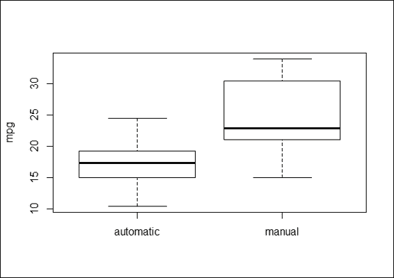

    接下来，我们仍然执行 Wilcoxon 秩和检验，以验证自动变速器汽车的分布是否与手动变速器汽车的分布相同:

    ```r
     > wilcox.test(mpg ~ am, data=mtcars)    Wilcoxon rank sum test with continuity correction  data:  mpg by am W = 42, p-value = 0.001871 alternative hypothesis: true location shift is not equal to 0  Warning message: In wilcox.test.default(x = c(21.4, 18.7, 18.1, 14.3, 24.4, 22.8,  :   cannot compute exact p-value with ties 
    ```

    工作原理...

2.  在这份食谱中，我们讨论一种非参数检验方法，Wilcoxon 秩和检验(也称为 Mann-Whitney U 检验)。对于 student 的 t 检验，假设两个样本之间的差异是正态分布的(当两个样本都是正态分布时，效果最好)。然而，当正态假设不确定时，可以采用 Wilcoxon 秩和检验来检验假设。


## 这里，我们使用了一个 Wilcoxon 秩和检验来确定数据集`mtcars`中的自动挡和手动挡汽车的 mpg 是否同分布。从测试结果中我们看到 p 值= 0.001871 ( < 0.05)拒绝了零假设，也揭示了 mpg 在自动挡和手动挡汽车中的分布并不完全相同。执行此测试时，您可能会收到警告消息“无法计算带连接的精确 p 值”，这表明数据集中存在重复值。删除重复值后，警告消息将被清除。

参见

要阅读更多关于 Wilcoxon 秩和及有符号秩检验的用法，请使用`help`功能查看相关文档:

```r
 > ? wilcox.test 
```


## 使用皮尔森卡方检验

*   在本食谱中，我们引入皮尔森卡方检验，用于检验两组分类变量的分布是否不同。我们将讨论如何在 r 中进行皮尔逊卡方检验。


# 准备就绪

确保`mtcars`已经加载到 R 会话内的数据帧中。由于`chisq.test`函数来源于`stats?`包，确保库`stats,`已加载。


## 怎么做

执行以下步骤:


## 为了制作计数表，我们首先使用根据变速器类型和前进档数量的输入建立的列联表:

```r
 > ftable = table(mtcars$am, mtcars$gear) > ftable       3  4  5   0 15  4  0   1  0  8  5 
```

自动挡和手动挡汽车的前进档数量

1.  To make the counting table, we first use the contingency table built with the inputs of the transmission type and number of forward gears:

    ```r
    > ftable = table(mtcars$am, mtcars$gear)
    > ftable

     3  4  5
     0 15  4  0
     1  0  8  5

    ```

2.  We then plot the mosaic plot of the contingency table:

    ```r
    > mosaicplot(ftable, main="Number of Forward Gears Within Automatic and Manual Cars", color = TRUE)

    ```

    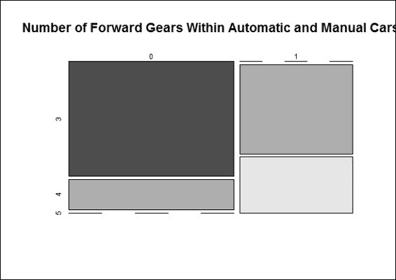

    接下来，我们对列联表进行皮尔逊卡方检验，以检验自动变速器和手动变速器的档位数量是否相同:

    ```r
     > chisq.test(ftable)    Pearson's Chi-squared test  data:  ftable X-squared = 20.9447, df = 2, p-value = 2.831e-05  Warning message: In chisq.test(ftable) : Chi-squared approximation may be incorrect 
    ```

    工作原理...

3.  皮尔逊卡方检验是一种统计检验，用于发现两个分类变量之间是否存在关系。它最适用于大样本的不成对数据。如果您想进行 Pearson 的卡方检验，您需要确保输入样本满足两个假设:首先，两个输入变量应该是分类的。其次，变量应该包括两个或多个独立的组。


## 在皮尔逊的卡方检验中，假设我们有两个变量，A 和 B；我们可以用下面的陈述来说明无效假设和替代假设:

H [0] :变量 A 和变量 B 是独立的

H [1] :变量 A 和变量 B 不是独立的

*   为了检验零假设是正确的还是不正确的，卡方检验采取以下步骤。
*   它计算卡方检验统计量，:

To test whether the null hypothesis is correct or incorrect, the Chi-squared test takes these steps.

这里，r 是列联表中的行数，c 是列联表中的列数，O [i，j] 是观测频率计数，E [i，j] 是期望频率计数。


它决定了该统计的自由度`df`。自由度等于:

这里，r 是一个变量的级数，c 是另一个变量的级数。

它将与自由度卡方分布的临界值进行比较。


在本食谱中，我们使用列联表和镶嵌图来说明计数的差异。很明显，自动挡汽车的前进挡位数比手动挡汽车少。

然后，我们在列联表上执行皮尔逊卡方检验，以确定自动和手动变速器汽车中的档位是否相同。输出 p 值= 2.831e-05 ( < 0.05)，反驳了零假设，并表明自动和手动变速器汽车的前进档数量不同。但是，输出消息包含一条警告消息，指出卡方近似可能不正确，这是因为列联表中的样本数小于 5。

还有更多...

要阅读有关皮尔逊卡方检验用法的更多信息，请使用`help`功能查看相关文档:

除了前面例子中提到的一些常见的假设检验方法之外，R:


## 比例测试(`prop.test`):用于测试不同组的比例是否相同的

Z 检验(UsingR 包中的`simple.z.test`):它将样本均值与总体均值和标准差进行比较

```r
> ? chisq.test

```

Bartlett 检验(`bartlett.test`):用于检验不同组的方差是否相同的

*   克鲁斯卡尔-沃利斯秩和检验(`kruskal.test`):在不假设正态分布的情况下，用于检验不同组的分布是否相同
*   夏皮罗-维尔克检验(`shapiro.test`):这是用于正态性检验的
*   进行单因素方差分析
*   **分析** **方差** ( **ANOVA** )考察分类自变量与连续因变量之间的关系。可以用来检验几组的均值是否相等。如果只有一个分类变量作为自变量，可以进行单向 ANOVA。另一方面，如果有两个以上的分类变量，您应该执行双向 ANOVA。在这个食谱中，我们将讨论如何对 r 进行单向方差分析。
*   做好准备


# 确保`mtcars`已经加载到 R 会话内的数据帧中。因为`oneway.test`和`TukeyHSD`函数源自`stats`包，所以确保库`stats`被加载。

怎么做...


## 执行以下步骤:

不同前进档数的 mpg 比较


## How to do it...

接下来，我们进行单向 ANOVA 来检验`mpg`的平均值是否随着不同的前进档数而变化。我们使用函数，`oneway.test` :

```r
 > oneway.test(mtcars$mpg~factor(mtcars$gear))    One-way analysis of means (not assuming equal variances)  data:  mtcars$mpg and factor(mtcars$gear) F = 11.2848, num df = 2.000, denom df = 9.508, p-value = 0.003085 
```

1.  We begin exploring by visualizing the data with a boxplot:

    ```r
    > boxplot(mtcars$mpg~factor(mtcars$gear),xlab='gear',ylab='mpg')

    ```

    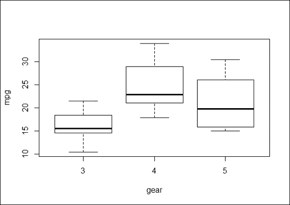

    除了到`oneway.test`之外，一个标准的函数`aov`用于方差分析:

    ```r
     > mtcars.aov = aov(mtcars$mpg ~ as.factor(mtcars$gear)) > summary(mtcars.aov)                        Df Sum Sq Mean Sq F value   Pr(>F)     as.factor(mtcars$gear)  2  483.2  241.62    10.9 0.000295 *** Residuals              29  642.8   22.17                      --- Signif. codes:  0 '***' 0.001 '**' 0.01 '*' 0.05 '.' 0.1 ' ' 1 
    ```

    由`aov`函数生成的模型也可以生成一个摘要作为拟合表:

    ```r
     > model.tables(mtcars.aov, "means") Tables of means Grand mean  20.09062    as.factor(mtcars$gear)          3     4     5     16.11 24.53 21.38 rep 15.00 12.00  5.00 
    ```

2.  对于`aov`模型，可以使用`TukeyHSD`进行事后比较测试:

    ```r
     > mtcars_posthoc =TukeyHSD(mtcars.aov) > mtcars_posthoc   Tukey multiple comparisons of means     95% family-wise confidence level  Fit: aov(formula = mtcars$mpg ~ as.factor(mtcars$gear))  $`as.factor(mtcars$gear)`          diff        lwr       upr     p adj 4-3  8.426667  3.9234704 12.929863 0.0002088 5-3  5.273333 -0.7309284 11.277595 0.0937176 5-4 -3.153333 -9.3423846  3.035718 0.4295874 
    ```

3.  不同齿数组的 Tukey 均值-差图
4.  The model generated by the `aov` function can also generate a summary as a fitted table:

    ```r
    > model.tables(mtcars.aov, "means")
    Tables of means
    Grand mean

    20.09062 

     as.factor(mtcars$gear) 
     3     4     5
     16.11 24.53 21.38
    rep 15.00 12.00  5.00

    ```

5.  工作原理...
6.  Further, we can visualize the differences in mean level with a `plot` function: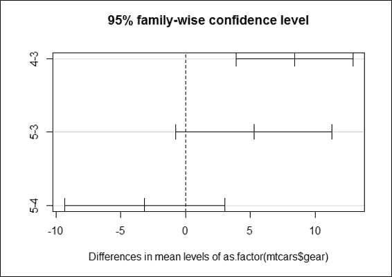

    为了了解具有不同前进档数量的汽车在 mpg 中是否具有不同的均值，我们首先根据前进档数量绘制 mpg 的箱线图。这提供了一个简单的指示，如果汽车有不同数量的前进档有不同的平均英里数。然后，我们进行最基本形式的方差分析，即单向方差分析，以测试人群是否有不同的均值。

    在 R 中，有两个函数执行 ANOVA 测试:`oneway.test`和`aov`。`oneway.test`的优点是该函数应用韦尔奇校正来解决方差的非均匀性。然而，它提供的信息不如`aov`多，也不提供事后测试。接下来，我们对自变量`gear`和因变量`mpg`执行`oneway.test`和`aov`。两个测试结果都显示了一个小的 p 值，这拒绝了零假设，即具有不同数量前进档的汽车之间的平均值具有相同的`mpg`平均值。


## 由于方差分析的结果仅表明总体均值存在显著差异，您可能不知道哪两个群体的均值有所不同。因此，我们对 ANOVA 模型应用了`TukeyHSD`事后比较测试。结果显示，有四个前进档的汽车和有三个前进档的汽车差别最大，因为它们的置信区间在图中最靠右。

还有更多...

方差分析依赖于 f 分布作为所有概率分布的基础。通过将组间方差除以组内方差获得 F 分数。如果总体 f 检验显著，您可以进行事后检验(或多重比较检验)来衡量组间的差异。最常用的事后检验是谢弗法、图基-克雷默法和邦费罗尼校正法。

为了解释 ANOVA 的输出，您需要对某些术语有一个基本的了解，包括自由度、平方和、平方组和、平方误差和、均方误差和 F 统计量。如果你需要更多关于这些术语的信息，你可以参考使用多元统计的*(Fidell，L. S .，& Tabachnick，B. G. (2006) *波士顿:Allyn & Bacon* 。)，或者参考方差分析的维基百科词条([http://en . Wikipedia . org/wiki/Analysis _ of _ variance # cite _ ref-31](http://en.wikipedia.org/wiki/Analysis_of_variance#cite_ref-31))。*

*<title>Conducting a one-way ANOVA</title>  

## 进行双向方差分析

双向方差分析可视为单向方差分析的扩展，因为分析涵盖两个以上的分类变量，而不是一个。在这个食谱中，我们将讨论如何在 r。

做好准备


# 确保`mtcars`已经加载到 R 会话内的数据帧中。由于`twoway.test`、`TukeyHSD`和`interaction.plot`功能源自`stats`包，确保`stats`库已加载。

怎么做...


## 执行以下步骤:

按齿轮组和变速器类型划分的 mpg 箱线图


## How to do it...

按档位*变速器类型划分的 mpg 箱线图

1.  First we plot the two boxplots of factor gears in regard to mpg, with the plot separated from the transmission type:

    ```r
    > par(mfrow=c(1,2))
    > boxplot(mtcars$mpg~mtcars$gear,subset=(mtcars$am==0),xlab='gear', ylab = "mpg",main='automatic')
    > boxplot(mtcars$mpg~mtcars$gear,subset=(mtcars$am==1),xlab='gear', ylab = "mpg", main='manual')

    ```

    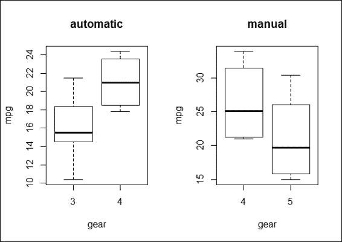

    The boxplots of mpg by the gear group and the transmission type

    变速器类型和具有主要影响的档位数量之间的相互作用，mpg

2.  Also, you may produce a boxplot of mpg by the number of forward gears `*` transmission type, with the use of the `*` operation in the `boxplot` function:

    ```r
    > boxplot(mtcars$mpg~factor(mtcars$gear)* factor(mtcars$am),xlab='gear * transmission', ylab = "mpg",main='Boxplot of mpg by gear * transmission')

    ```

    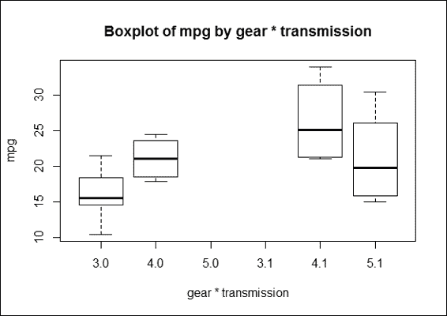

    然后我们结合档位和变速器类型因素对 mpg 进行双向方差分析:

    ```r
     > mpg_anova2 = aov(mtcars$mpg~factor(mtcars$gear)*factor(mtcars$am)) > summary(mpg_anova2)                      Df Sum Sq Mean Sq F value   Pr(>F)     factor(mtcars$gear)  2  483.2  241.62  11.869 0.000185 *** factor(mtcars$am)    1   72.8   72.80   3.576 0.069001 .   Residuals           28  570.0   20.36                      --- Signif. codes:  0 '***' 0.001 '**' 0.01 '*' 0.05 '.' 0.1 ' ' 1 
    ```

    类似于单向方差分析，我们可以执行事后比较测试来查看双向方差分析模型的结果:

    ```r
     > TukeyHSD(mpg_anova2)   Tukey multiple comparisons of means     95% family-wise confidence level  Fit: aov(formula = mtcars$mpg ~ factor(mtcars$gear) * factor(mtcars$am))  $`factor(mtcars$gear)`          diff        lwr       upr     p adj 4-3  8.426667  4.1028616 12.750472 0.0001301 5-3  5.273333 -0.4917401 11.038407 0.0779791 5-4 -3.153333 -9.0958350  2.789168 0.3999532  $`factor(mtcars$am)`         diff       lwr     upr     p adj 1-0 1.805128 -1.521483 5.13174 0.2757926 
    ```

3.  Next, we use an interaction plot to characterize the relationship between variables:

    ```r
    > interaction.plot(mtcars$gear, mtcars$am, mtcars$mpg, type="b", col=c(1:3),leg.bty="o", leg.bg="beige", lwd=2, pch=c(18,24,22), xlab="Number of Gears", ylab="Mean Miles Per Gallon", main="Interaction Plot")

    ```

    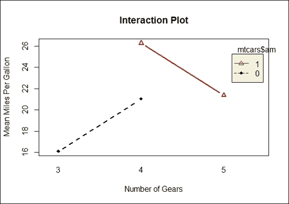

    变速器类型和档位数量的平均水平差异对比图

4.  工作原理...
5.  在这个食谱中，我们执行双向 ANOVA 来检查自变量`gear`和`am`对因变量`mpg`的影响。在第一步中，我们使用箱线图通过档位数量和变速器类型来检查 mpg 的平均值。其次，我们应用一个交互图，通过不同的挡位数量以及由变速器类型分隔的线来直观显示 mpg 的变化。
6.  We then visualize the differences in mean levels with the `plot` function:

    ```r
    > par(mfrow=c(1,2))
    > plot(TukeyHSD(mpg_anova2))

    ```

    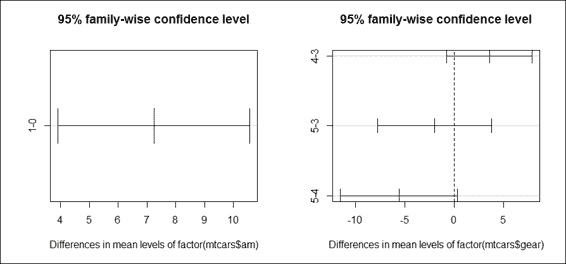

    结果图显示，档位数量确实对 mpg 的平均值有影响，但也没有显示出正相关关系。第三，我们用`aov`函数进行双向方差分析。输出显示，`gear`因子的 p 值拒绝零假设，而`transmission type`因子不拒绝零假设。换句话说，不同挡位的车更有可能有不同的 mpg 手段。最后，为了检查哪两个群体的差异最大，我们进行了事后分析，结果显示四档和三档的汽车分别具有最大的平均 mpg 差异。

    参见


## 对于多元方差分析，函数`manova`可用于检查多个自变量对多个因变量的影响。关于 MANOVA 的更多信息包含在 R:

```r
 > ?MANOVA 
```

中的`help`功能中

In this recipe, we perform a two-way ANOVA to examine the influences of the independent variables, `gear` and `am`, on the dependent variable, `mpg`. In the first step, we use a boxplot to examine the mean of mpg by the number of gears and the transmission type. Secondly, we apply an interaction plot to visualize the change in mpg through the different numbers of gears with lines separated by the transmission type.

The resulting plot shows that the number of gears does have an effect on the mean of mpg, but does not show a positive relationship either. Thirdly, we perform a two-way ANOVA with the `aov` function. The output shows that the p-value of the `gear` factor rejects the null hypothesis, while the factor, `transmission type`, does not reject the null hypothesis. In other words, cars with different numbers of gears are more likely to have different means of mpg. Finally, in order to examine which two populations have the largest differences, we perform a post hoc analysis, which reveals that cars with four gears and three gears, respectively, have the largest difference in terms of the mean, mpg.


## See also

*   For multivariate analysis of variances, the function, `manova`, can be used to examine the effect of multiple independent variables on multiple dependent variables. Further information about MANOVA is included within the `help` function in R:

    ```r
    > ?MANOVA

    ```