# 四、了解回归分析

在本章中，我们将介绍以下配方:

*   用 lm 拟合线性回归模型
*   总结线性模型拟合
*   使用线性回归预测未知值
*   生成拟合模型的诊断图
*   用 lm 拟合多项式回归模型
*   用 rlm 拟合稳健线性回归模型
*   滑动数据线性回归案例研究
*   应用高斯模型进行广义线性回归
*   应用泊松模型进行广义线性回归
*   应用二项式模型进行广义线性回归
*   用广义加性模型拟合数据
*   可视化广义加性模型
*   诊断广义加性模型


# 简介

回归是一种监督学习方法，用于建模和分析因变量(响应变量)和一个或多个自变量(预测变量)之间的关系。可以使用回归来建立预测模型，该预测模型可以首先用于找到拟合值的最小平方误差的最佳拟合模型。然后，拟合的模型可以进一步应用于连续值预测的数据。

回归有很多种。如果只有一个预测变量，并且响应变量和独立变量之间的关系是线性的，我们可以应用线性模型。然而，如果有一个以上的预测变量，应使用多元线性回归方法。当关系是非线性时，可以使用非线性模型来模拟预测变量和响应变量之间的关系。

在本章中，我们将介绍如何使用`lm`函数将线性模型拟合到数据中。接下来，对于非正态高斯模型中的分布(例如，泊松或二项式)，我们使用具有与数据分布相对应的适当链接函数的`glm`函数。最后，我们将介绍如何使用`gam`函数将广义加性模型拟合到数据中。


# 用 lm 拟合线性回归模型

回归中最简单的模型是线性回归，当只有一个预测变量，且响应变量与自变量之间的关系为线性时，最好使用线性回归。在 R 中，我们可以用`lm`函数将线性模型拟合到数据。


## 准备就绪

我们需要用一个预测变量和一个响应变量来准备数据，并且这两个变量之间具有线性关系。


## 怎么做...

执行以下步骤，用`lm`进行线性回归:

1.  你应该安装`car`包并加载它的库:

    ```
     > install.packages("car") > library(car) 
    ```

2.  从这个包中，你可以加载`Quartet`数据集:

    ```
     > data(Quartet) 
    ```

3.  您可以使用`str`函数来显示`Quartet`数据集的结构:

    ```
     > str(Quartet) 'data.frame':   11 obs. of  6 variables:  $ x : int  10 8 13 9 11 14 6 4 12 7 ...  $ y1: num  8.04 6.95 7.58 8.81 8.33 ...  $ y2: num  9.14 8.14 8.74 8.77 9.26 8.1 6.13 3.1 9.13 7.26 ...  $ y3: num  7.46 6.77 12.74 7.11 7.81 ...  $ x4: int  8 8 8 8 8 8 8 19 8 8 ...  $ y4: num  6.58 5.76 7.71 8.84 8.47 7.04 5.25 12.5 5.56 7.91 ... 
    ```

4.  Draw a scatter plot of the x and y variables with `plot`, and append a fitted line through the `lm` and `abline` function:

    ```
    > plot(Quartet$x, Quartet$y1)
    > lmfit = lm(y1~x, Quartet) 
    > abline(lmfit, col="red") 

    ```

    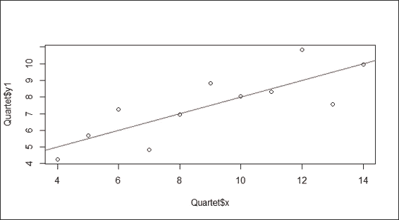

    用 lm 拟合的简单回归图

5.  要查看拟合模型，执行以下命令:

    ```
     > lmfit  Call: lm(formula = y1 ~ x, data = Quartet)  Coefficients: (Intercept)            x        3.0001       0.5001  
    ```


## 工作原理...

回归模型具有`response ~ terms`形式，其中`response`是响应向量，`terms`是指定预测值的一系列项。我们可以用公式 *y=α+βx* 来说明一个简单的回归模型，其中 *α* 是截距，而斜率 *β* 描述了当 *x* 变化时 *y* 的变化。利用最小二乘法，我们可以估计出和(其中表示 *y* 的平均值，表示 *x* 的平均值)。

为了执行线性回归，我们首先准备在预测变量和响应变量之间具有线性关系的数据。在这个例子中，我们从 package car 加载 Anscombe 的四重奏数据集。在数据集中， *x* 和 *y1* 变量具有线性关系，我们准备了这些变量的散点图。为了生成回归线，我们使用 lm 函数来生成两个变量的模型。此外，我们使用`abline`在图上画一条回归线。根据之前的截图，回归线说明了 *x* 和 *y1* 变量的线性关系。我们可以看到，拟合模型的系数显示截距等于 3.0001，系数等于 0.5001。因此，我们可以使用截距和系数来推断响应值。比如我们可以推断出在 3 处的 *x* 等于*4.5103(3 * 0.5001+3.0001)*时的响应值。


## 还有更多...

除了`lm`函数，您还可以使用`lsfit`函数来执行简单的线性回归。例如:

```
> plot(Quartet$x, Quartet$y1)
> lmfit2 = lsfit(Quartet$x,Quartet$y1)
> abline(lmfit2, col="red")

```

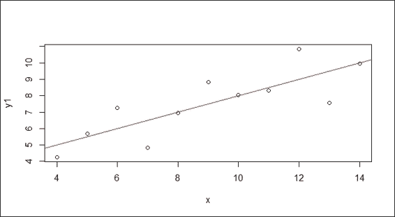

由 lsfit 函数拟合的简单回归。


# 总结线性模型拟合

`summary`功能可用于获取拟合模型的格式化系数、标准误差、自由度和其他汇总信息。该食谱介绍了如何通过使用`summary`功能获得一个模型的全部信息。


## 做好准备

您需要通过计算来自四元组的 *x* 和 *y1* 变量的线性模型来完成之前的配方，并将拟合的模型分配给`lmfit`变量。


## 怎么做...

执行以下步骤来总结线性模型拟合:

1.  计算拟合模型的详细概要:

    ```
     > summary(lmfit)  Call: lm(formula = y1 ~ x)  Residuals:      Min       1Q   Median       3Q      Max  -1.92127 -0.45577 -0.04136  0.70941  1.83882   Coefficients:             Estimate Std. Error t value Pr(>|t|)    (Intercept)   3.0001     1.1247   2.667  0.02573 *  Quartet$x     0.5001     0.1179   4.241  0.00217 ** --- Signif. codes:  0 '***' 0.001 '**' 0.01 '*' 0.05 '.' 0.1 ' ' 1  Residual standard error: 1.237 on 9 degrees of freedom Multiple R-squared:  0.6665,    Adjusted R-squared:  0.6295  F-statistic: 17.99 on 1 and 9 DF,  p-value: 0.00217 
    ```


## 工作原理...

`summary`函数是一个通用函数，用于生成汇总统计数据。在这种情况下，它计算并返回拟合线性模型的汇总统计列表。在这里，它将输出诸如残差、系数标准差 R 平方、f 统计量和自由度等信息。在`Call`部分，显示调用生成拟合模型的函数。在`Residuals`部分，它提供了分布的快速总结(最小值、1Q 值、中值、3Q、最大值)。

在`Coefficients`部分，每个系数都是一个高斯随机变量。在本节中，`Estimate`代表变量的平均分布；`Std.Error`显示变量的标准误差；`t`值是`Estimate`除以`Std.Error`，`p`值表示获得大于`t`值的值的概率。在本例中，截距(0.002573)和 x (0.00217)的`p`值都有 95%的置信度。

残差标准差输出残差的标准差，而自由度表示训练样本中的观察值与模型中使用的数量之间的差异。通过除以平方和得到多个 R 平方。人们可以使用 R 平方来衡量数据与回归线的拟合程度。通常，R 平方越高，模型就越符合您的数据。然而，它不一定表明回归模型是否足够。这意味着您可能会得到一个 R 平方较低的好模型，也可能会得到一个 R 平方较高的坏模型。由于多个 R 平方忽略了一个自由度，因此计算出的分数是有偏差的。为了使计算公平，调整后的 R 平方(0.6295)使用无偏估计值，并且将略小于 R 平方的倍数(0.6665)。通过对模型执行 f 检验来检索 f 统计量。等于 0.00217 ( < 0.05)的`p`值拒绝零假设(变量之间没有线性相关性)，并表明观察到的`F`大于临界`F`值。换句话说，结果显示变量之间存在显著的正线性相关性。


## 参见

*   关于用于获取拟合模型摘要的参数的更多信息，您可以使用`help`功能或`?`查看帮助页面:

    ```
     > ?summary.lm 
    ```

*   或者，您可以使用以下函数来显示模型的属性:

    ```
     >  coefficients(lmfit) # Extract model coefficients >  confint(lmfit, level=0.95)  # Computes confidence intervals for model parameters. >  fitted(lmfit) # Extract model fitted values >  residuals(lmfit) # Extract model residuals  >  anova(lmfit) # Compute analysis of variance tables for fitted model object >  vcov(lmfit) # Calculate variance-covariance matrix for a fitted model object >  influence(lmfit) # Diagnose quality of regression fits 
    ```


# 使用线性回归预测未知值

使用拟合的回归模型，我们可以应用该模型预测未知值。对于回归模型，我们可以用预测区间和置信区间来表示预测的精度。在下面的食谱中，我们介绍如何在这两种测量下预测未知值。


## 做好准备

您需要通过从`quartet`数据集计算 x 和 y1 变量的线性模型来完成之前的配方。


## 怎么做...

执行以下步骤，使用线性回归来预测值:

1.  用`x`和`y1`变量拟合线性模型:

    ```
     > lmfit = lm(y1~x, Quartet) 
    ```

2.  将需要预测的值赋值到`newdata` :

    ```
     > newdata = data.frame(x = c(3,6,15)) 
    ```

3.  使用`level`设置为`0.95` :

    ```
     > predict(lmfit, newdata, interval="confidence", level=0.95)         fit      lwr       upr 1  4.500364 2.691375  6.309352 2  6.000636 4.838027  7.163245 3 10.501455 8.692466 12.310443 
    ```

    的置信区间计算预测结果
4.  使用此预测区间计算预测结果:

    ```
     > predict(lmfit, newdata, interval="predict")         fit      lwr       upr 1  4.500364 1.169022  7.831705 2  6.000636 2.971271  9.030002 3 10.501455 7.170113 13.832796 
    ```


## 工作原理...

我们首先用`x`和`y1`变量建立一个线性拟合模型。接下来，我们将要预测的值分配到数据帧中，`newdata`。需要注意的是，生成的模型是`y1 ~ x`的形式。

接下来，我们通过在自变量区间中指定`confidence`来使用置信区间计算预测结果。从第 1 行的输出中，我们得到了符合`x=3`输入的`y1`，它等于`4.500364`，并且`x=3`的`y1`平均值的 95%置信区间(在`level`参数中设置为 0.95)在`2.691375`和`6.309352`之间。除此之外，第 2 行和第 3 行给出了输入为`x=6`和`x=15`的`y1`的预测结果。

接下来，我们通过在自变量区间中指定`prediction`来使用预测区间计算预测结果。从第 1 行的输出中，我们可以看到`x=3`输入的拟合`y1`等于`4.500364`，并且`x=3`的`y1`的 95%预测区间在`1.169022`和`7.831705`之间。第 2 行和第 3 行用输入`x=6`和`x=15`输出`y1`的预测结果。


## 参见

*   对于那些对预测区间和置信区间的区别感兴趣的，可以参考[http://en . Wikipedia . org/wiki/Prediction _ interval # Contrast _ with _ confidence _ intervals](http://en.wikipedia.org/wiki/Prediction_interval#Contrast_with_confidence_intervals)的维基百科词条 *contrast with 置信区间*。


# 生成拟合模型的诊断图

诊断是评估回归假设的方法，可用于确定拟合模型是否充分代表数据。在下面的食谱中，我们将介绍如何通过使用诊断图来诊断回归模型。


## 做好准备

您需要通过计算来自四元组的 x 和 y1 变量的线性模型来完成之前的配方，并将该模型分配给`lmfit`变量。


## 怎么做...

执行以下步骤，生成拟合模型的诊断图:

1.  Plot the diagnostic plot of the regression model:

    ```
    > par(mfrow=c(2,2))
    > plot(lmfit)

    ```

    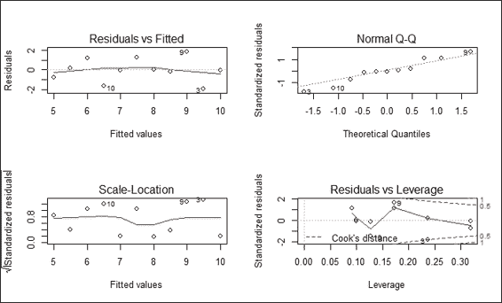

    回归模型的诊断图


## 它是如何工作的...

绘图功能生成回归模型的四个诊断图:

*   左上图显示了残差与拟合值的关系。在图中，残差表示从点到回归线的垂直距离。如果所有点都正好落在回归线上，则所有残差都将正好落在灰色虚线上。图中的红线是关于残差的平滑曲线，如果所有的点都正好落在回归线上，红线的位置应该正好与灰色虚线匹配。
*   右上角的显示残差的法线。该图验证了残差呈正态分布的假设。因此，如果残差呈正态分布，它们应该正好位于灰色虚线上。
*   左下角的**刻度位置**图用于测量标准化残差相对于拟合值的平方根。因此，如果所有的点都位于回归线上，则 *y* 的值应该接近零。由于假设残差的方差基本不改变分布，如果假设正确，红线应该是相对平坦的。
*   右下角的图显示了标准化残差与杠杆率的关系。杠杆是每个数据点如何影响回归的度量。它是对回归形心的距离和隔离级别的度量(通过是否有邻居来衡量)。还有，你可以找到库克距离的等高线，这个等高线受高杠杆和大残差的影响。如果删除一个点，您可以使用它来测量回归将如何变化。关于标准化残差，红线是平滑的。对于完美拟合回归，红线应该接近虚线，在库克距离中没有超过 0.5 的点。


## 还有更多...

要查看更多诊断绘图功能，您可以使用`help`功能访问更多信息:

```
> ?plot.lm

```

为了发现是否存在库克距离大的点，可以使用`cooks.distance`函数计算每个点的库克距离，并通过可视化分析距离的分布:

```
> plot(cooks.distance(lmfit))

```

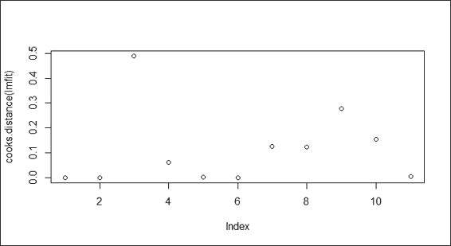

库克的距离图

在这种情况下，索引 3 上的点显示出比其他点更大的库克距离，可以调查该点是否可能是异常值。


# 用 lm 拟合多项式回归模型

一些预测变量和响应变量可能具有非线性关系，它们的关系可以建模为一个*n 次*多项式。在这个配方中，我们介绍如何使用`lm`和`poly`函数处理多项式回归。


## 做好准备

准备包含预测值和响应变量之间关系的数据集，该关系可以建模为一个*n 次*多项式。在这个菜谱中，我们将继续使用来自`car`包的`Quartet`数据集。


## 怎么做...

执行以下步骤，用`lm`拟合多项式回归模型:

1.  First, we make a scatter plot of the `x` and `y2` variables:

    ```
    > plot(Quartet$x, Quartet$y2)

    ```

    

    变量 x 和 y2 的散点图

2.  You can apply the `poly` function by specifying `2` in the argument:

    ```
    > lmfit = lm(Quartet$y2~poly(Quartet$x,2))
    > lines(sort(Quartet$x), lmfit$fit[order(Quartet$x)], col = "red")

    ```

    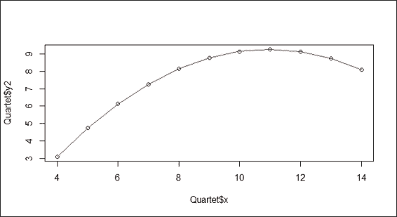

    变量 x 和 y2 的回归图的二次拟合示例


## 它是如何工作的

我们可以在公式中说明二阶多项式回归模型，其中 *α* 是截距，而 *β* 说明回归系数。

在前面的截图(步骤 1)中，`x`和`y2`变量的散点图不符合线性关系，而是显示一条向下凹的曲线(或向上凸的曲线),转折点在 x=11。为了对非线性关系建模，我们应用自变量为 2 的`poly`函数来拟合自变量`x`和因变量`y2`。截图中的红线显示模型与数据完美吻合。


## 还有更多...

您还可以拟合一个二阶多项式模型，其独立变量等于一阶`x`变量和二阶`x`变量的组合公式:

```
> plot(Quartet$x, Quartet$y2)
> lmfit = lm(Quartet$y2~ I(Quartet$x)+I(Quartet$x^2))

```


# 用 rlm 拟合稳健线性回归模型

数据集中的异常值将使回归线远离主流。除了移除它，我们还可以应用稳健的线性回归来拟合包含异常值的数据集。在这份食谱中，我们介绍了如何应用`rlm`对包含异常值的数据集执行稳健的线性回归。


## 做好准备

准备包含异常值的数据集，该异常值可能会使回归线偏离主流。这里，我们使用从之前的配方加载的`Quartet`数据集。


## 怎么做...

执行以下步骤，用`rlm`拟合稳健线性回归模型:

1.  Generate a scatter plot of the `x` variable against `y3`:

    ```
    > plot(Quartet$x, Quartet$y3)

    ```

    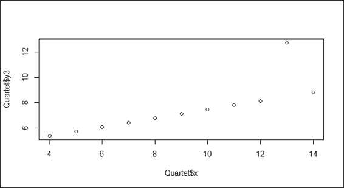

    变量 x 和 y3 的散点图

2.  Next, you should import the `MASS` library first. Then, you can apply the `rlm` function to fit the model, and visualize the fitted line with the `abline` function:

    ```
    > library(MASS)
    > lmfit = rlm(Quartet$y3~Quartet$x)
    > abline(lmfit, col="red")

    ```

    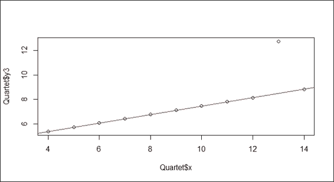

    变量 x 和 y3 的稳健线性回归


## 它是如何工作的

根据前面的截图(步骤 1)，您可能会遇到包含主流之外的离群值的数据集。为了消除异常值的影响，我们演示了如何应用稳健的线性回归(`rlm`)来拟合数据。在第二个屏幕截图(步骤 2)中，稳健回归线忽略了异常值，与主流相匹配。


## 还有更多...

要查看异常值如何使回归线远离主流的影响，您可以将本配方中使用的`rlm`函数替换为`lm`，并重新绘制图表:

```
> plot(Quartet$x, Quartet$y3)
> lmfit = lm(Quartet$y3~Quartet$x)
> abline(lmfit, col="red")

```

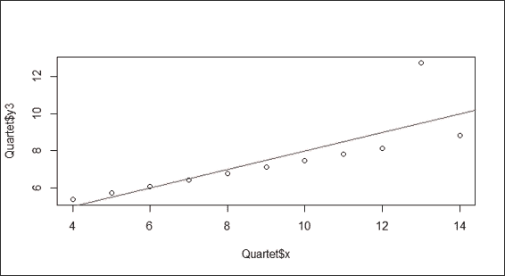

变量 x 和 y3 的线性回归

很明显，离群值(x=13)使回归线远离主流。

研究滑动数据的线性回归案例


# 为了总结上一节的内容，我们用线性回归探索更复杂的数据。在本食谱中，我们演示了如何应用线性回归来分析**劳动力和收入动态调查** ( **滑动**)数据集。

准备就绪


## 检查是否安装并加载了`car`库，因为需要它来访问滑动的数据集。

怎么做...


## 按照以下步骤对滑动数据执行线性回归:

您可以使用`str`功能来获得数据的概览:

```
 > str(SLID) 'data.frame':  7425 obs. of  5 variables:  $ wages    : num  10.6 11 NA 17.8 NA ...  $ education: num  15 13.2 16 14 8 16 12 14.5 15 10 ...  $ age      : int  40 19 49 46 71 50 70 42 31 56 ...  $ sex      : Factor w/ 2 levels "Female","Male": 2 2 2 2 2 1 1 1 2 1 ...  $ language : Factor w/ 3 levels "English","French",..: 1 1 3 3 1 1 1 1 1 1 .. 
```

1.  多个组合的工资图
2.  First, we visualize the variable wages against language, age, education, and sex:

    ```
    > par(mfrow=c(2,2))
    > plot(SLID$wages ~ SLID$language)
    > plot(SLID$wages ~ SLID$age)
    > plot(SLID$wages ~ SLID$education)
    > plot(SLID$wages ~ SLID$sex)

    ```

    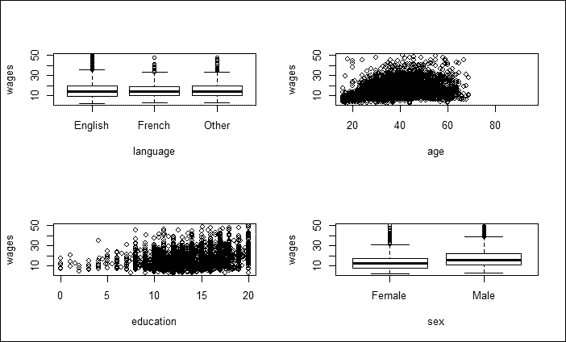

    Plot of wages against multiple combinations

    然后，我们可以用`lm`来拟合模型:

    ```
     > lmfit = lm(wages ~ ., data = SLID) 
    ```

3.  您可以通过`summary`功能查看拟合模型的汇总:

    ```
     > summary(lmfit)  Call: lm(formula = wages ~ ., data = SLID)  Residuals:     Min      1Q  Median      3Q     Max  -26.062  -4.347  -0.797   3.237  35.908   Coefficients:                 Estimate Std. Error t value Pr(>|t|)     (Intercept)    -7.888779   0.612263 -12.885   <2e-16 *** education       0.916614   0.034762  26.368   <2e-16 *** age             0.255137   0.008714  29.278   <2e-16 *** sexMale         3.455411   0.209195  16.518   <2e-16 *** languageFrench -0.015223   0.426732  -0.036    0.972     languageOther   0.142605   0.325058   0.439    0.661     --- Signif. codes:  0 '***' 0.001 '**' 0.01 '*' 0.05 '.' 0.1 ' ' 1  Residual standard error: 6.6 on 3981 degrees of freedom   (3438 observations deleted due to missingness) Multiple R-squared:  0.2973,	Adjusted R-squared:  0.2964  F-statistic: 336.8 on 5 and 3981 DF,  p-value: < 2.2e-16 
    ```

4.  去掉`language`属性，用`lm`功能改装模型:

    ```
     > lmfit = lm(wages ~ age + sex + education, data = SLID) > summary(lmfit)  Call: lm(formula = wages ~ age + sex + education, data = SLID)  Residuals:     Min      1Q  Median      3Q     Max  -26.111  -4.328  -0.792   3.243  35.892   Coefficients:              Estimate Std. Error t value Pr(>|t|)     (Intercept) -7.905243   0.607771  -13.01   <2e-16 *** age          0.255101   0.008634   29.55   <2e-16 *** sexMale      3.465251   0.208494   16.62   <2e-16 *** education    0.918735   0.034514   26.62   <2e-16 *** --- Signif. codes:  0 '***' 0.001 '**' 0.01 '*' 0.05 '.' 0.1 ' ' 1  Residual standard error: 6.602 on 4010 degrees of freedom   (3411 observations deleted due to missingness) Multiple R-squared:  0.2972,	Adjusted R-squared:  0.2967  F-statistic: 565.3 on 3 and 4010 DF,  p-value: < 2.2e-16 
    ```

5.  拟合模型的诊断图
6.  We can then draw a diagnostic plot of `lmfit`:

    ```
    > par(mfrow=c(2,2))
    > plot(lmfit)

    ```

    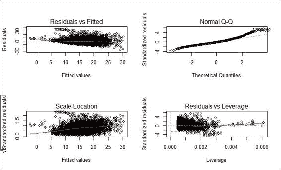

    Diagnostic plot of fitted model

    调整拟合模型的诊断图

7.  Next, we take the log of wages and replot the diagnostic plot:

    ```
    > lmfit = lm(log(wages) ~ age + sex + education, data = SLID)
    > plot(lmfit)

    ```

    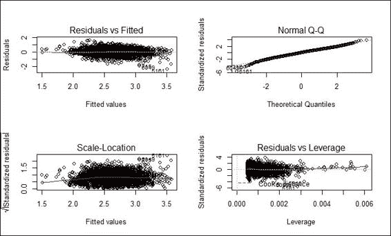

    Diagnostic plot of adjusted fitted model

    接下来，您可以使用`vif`函数:

    ```
     > vif(lmfit)       age       sex education   1.011613  1.000834  1.012179  > sqrt(vif(lmfit)) > 2       age       sex education      FALSE     FALSE     FALSE 
    ```

    来诊断回归模型的多重共线性
8.  然后你可以安装加载`lmtest`包，用`bptest`函数:

    ```
     > install.packages("lmtest") > library(lmtest) > bptest(lmfit)    studentized Breusch-Pagan test  data:  lmfit BP = 29.0311, df = 3, p-value = 2.206e-06 
    ```

    诊断回归模型的异方差性
9.  最后，您可以安装并加载`rms`包。然后，可以用`robcov` :

    ```
     > install.packages("rms") > library(rms) > olsfit = ols(log(wages) ~ age + sex + education, data= SLID, x= TRUE, y= TRUE) > robcov(olsfit)  Linear Regression Model  ols(formula = log(wages) ~ age + sex + education, data = SLID,      x = TRUE, y = TRUE)  Frequencies of Missing Values Due to Each Variable log(wages)        age        sex  education        3278          0          0        249                    Model Likelihood     Discrimination                        Ratio Test           Indexes         Obs     4014    LR chi2   1486.08    R2       0.309     sigma 0.4187    d.f.            3    R2 adj   0.309     d.f.    4010    Pr(> chi2) 0.0000    g        0.315      Residuals       Min       1Q   Median       3Q      Max  -2.36252 -0.27716  0.01428  0.28625  1.56588             Coef   S.E.   t     Pr(>|t|) Intercept 1.1169 0.0387 28.90 <0.0001  age       0.0176 0.0006 30.15 <0.0001  sex=Male  0.2244 0.0132 16.96 <0.0001  education 0.0552 0.0022 24.82 <0.0001 
    ```

    修正标准误差
10.  工作原理...


## 这个配方演示了如何对 SLID 数据集进行线性回归分析。首先，我们通过使用`str`函数加载滑动数据并显示其结构。从数据的结构中，我们知道有四个自变量会影响因变量的工资。

接下来，我们通过可视化探索每个自变量与因变量`wages`的关系；可视化结果显示在前面的屏幕截图中(步骤 2)。在这张截图的左上方，可以找到三种不同语言对工资的方框图；语言和工资之间的相关性并不明显。截图的右上部分显示年龄似乎与因变量`wages`成正相关。在截图的左下方，显示了教育似乎也与工资呈正相关。最后，截图右下部分的方框图显示，男性的工资略高于女性。

接下来，我们将除了`wages`之外的所有属性作为预测变量拟合到模型中。通过总结该模型，表明教育、年龄和性别表现出显著性( *p 值< 0.05* )。因此，我们删除了无关紧要的`language`属性(其 p 值大于 0.05)，并根据线性模型中的因变量(`wages`)拟合了三个自变量(教育、性别和年龄)。这相应地将 f 统计值从 336.8 提高到 565.3。

接下来，我们生成拟合模型的诊断图。在诊断图中，所有四个图都表明回归模型遵循回归假设。然而，从残差与拟合值和比例位置图来看，较小拟合值的残差偏向回归模型。由于工资的范围跨越几个数量级，为了引起对称性，我们对工资进行了对数变换，并将数据重新调整为回归模型。残差与拟合值图的红线和比例位置图现在更靠近灰色虚线。

接下来，我们想要测试模型中是否存在多重共线性。当一个预测因子与其他预测因子高度相关时，就会出现多重共线性。如果模型中存在多重共线性，您可能会看到一些变量具有较高的 R 平方值，但显示为无关紧要的变量。为了检测多重共线性，我们可以使用`vif`函数计算线性和广义线性模型的方差膨胀和广义方差膨胀因子。如果存在多重共线性，我们应该找到方差膨胀因子的平方根大于 2 的预测因子。然后，我们可以移除多余的预测因子，或者使用主成分分析将预测因子转换为一个较小的不相关成分集。

最后，我们要检验**异方差**是否存在于模型中。在讨论异方差的定义之前，我们首先要知道，在经典的假设中，普通的回归模型假设误差的方差是恒定的或者跨观测值是齐次的。相反，异方差意味着不同观测值之间的方差不相等。因此，异方差可能偏向于我们估计的标准误差，从而误导假设的检验。为了检测和测试异方差性，我们可以使用`lmtest`包中的`bptest`函数执行 **Breusch-Pagan** 异方差性测试。在这种情况下，p 值显示为 2.206e-06 ( < 0.5)，拒绝了同异方差(无异方差)的零假设。这里，它意味着参数估计的标准误差是不正确的。但是，我们可以使用稳健的标准误差来校正标准误差(不要移除异方差)，并使用`rms`包中的`robcov`来增加真正重要参数的重要性。然而，由于它只接受来自`rms`系列的拟合模型作为输入，我们必须事先拟合普通的最小二乘模型。

亦见


## 有关 SLID 数据集的更多信息，您可以使用`help`功能查看相关文档:

```
 >  ?SLID 
```

*   应用高斯模型进行广义线性回归


# **广义线性模型** ( **GLM** )是线性回归的一种推广，它可以包含一个链接函数来进行线性预测。作为默认设置，`glm`的族对象是高斯，这使得`glm`功能与`lm`完全相同地执行。在这个配方中，我们首先演示如何使用`glm`函数将模型拟合到数据中，然后展示使用高斯模型的`glm`与`lm`的性能完全相同。

准备就绪


## 检查是否安装并加载了`car`库，因为我们需要该包中的 SLID 数据集。

怎么做...


## 执行以下步骤，用高斯模型拟合广义线性回归模型:

将自变量`age`、`sex`、`education`，因变量工资拟合为`glm` :

```
 > lmfit1 = glm(wages ~ age + sex + education, data = SLID, family=gaussian) > summary(lmfit1)  Call: glm(formula = wages ~ age + sex + education, family = gaussian,      data = SLID)  Deviance Residuals:      Min       1Q   Median       3Q      Max   -26.111   -4.328   -0.792    3.243   35.892    Coefficients:              Estimate Std. Error t value Pr(>|t|)     (Intercept) -7.905243   0.607771  -13.01   <2e-16 *** age          0.255101   0.008634   29.55   <2e-16 *** sexMale      3.465251   0.208494   16.62   <2e-16 *** education    0.918735   0.034514   26.62   <2e-16 *** --- Signif. codes:  0 '***' 0.001 '**' 0.01 '*' 0.05 '.' 0.1 ' ' 1  (Dispersion parameter for Gaussian family taken to be 43.58492)      Null deviance: 248686  on 4013  degrees of freedom Residual deviance: 174776  on 4010  degrees of freedom   (3411 observations deleted due to missingness) AIC: 26549  Number of Fisher Scoring iterations: 2 
```

1.  将自变量、`age`、`sex`、`education`，因变量工资拟合为`lm` :

    ```
     > lmfit2 = lm(wages ~ age + sex + education, data = SLID) > summary(lmfit2)  Call: lm(formula = wages ~ age + sex + education, data = SLID)  Residuals:     Min      1Q  Median      3Q     Max  -26.111  -4.328  -0.792   3.243  35.892   Coefficients:              Estimate Std. Error t value Pr(>|t|)     (Intercept) -7.905243   0.607771  -13.01   <2e-16 *** age          0.255101   0.008634   29.55   <2e-16 *** sexMale      3.465251   0.208494   16.62   <2e-16 *** education    0.918735   0.034514   26.62   <2e-16 *** --- Signif. codes:  0 '***' 0.001 '**' 0.01 '*' 0.05 '.' 0.1 ' ' 1  Residual standard error: 6.602 on 4010 degrees of freedom   (3411 observations deleted due to missingness) Multiple R-squared:  0.2972,	Adjusted R-squared:  0.2967  F-statistic: 565.3 on 3 and 4010 DF,  p-value: < 2.2e-16 
    ```

2.  使用`anova`比较两个拟合模型:

    ```
     > anova(lmfit1, lmfit2) Analysis of Deviance Table  Model: gaussian, link: identity  Response: wages  Terms added sequentially (first to last)             Df Deviance Resid. Df Resid. Dev NULL                       4013     248686 age        1    31953      4012     216733 sex        1    11074      4011     205659 education  1    30883      4010     174776 
    ```

3.  工作原理...


## `glm`函数以类似于`lm`函数的方式将模型拟合到数据中。唯一的区别是你可以在参数`family`中指定不同的链接函数(你可以在控制台中使用`?family`来查找不同类型的链接函数)。在这个配方中，我们首先将自变量`age`、`sex`和`education`以及因变量`wages`输入到`glm`函数中，并将构建的模型分配给`lmfit1`。您可以使用构建的模型进行进一步预测。

接下来，为了确定具有高斯模型的`glm`是否与`lm`完全相同，我们将自变量`age`、`sex`和`education`以及因变量`wages`拟合到`lm`模型。通过将`summary`函数应用于两个不同的模型，揭示了两个输出汇总的残差和系数完全相同。

最后，我们用`anova`函数进一步比较两个拟合模型。`anova`函数的结果显示两个模型相似，具有相同的**剩余自由度** ( **Res.DF** )和**剩余平方和** ( **RSS Df** )。

参见


## 关于广义线性模型与线性模型的比较，可以参考*维纳布尔斯，W. N .，&里普利，B. D. (2002)。现代应用统计学与 S. Springer* 。

*   应用泊松模型进行广义线性回归


# 广义线性模型允许响应变量具有不同于正态分布(高斯)的误差分布模型。在本食谱中，我们展示了如何在`glm`中将泊松作为系列对象应用于计数数据。

准备就绪


## 此任务的先决条件是准备计数数据，所有输入数据值都是整数。

怎么做...


## 执行以下步骤，用泊松模型拟合广义线性回归模型:

加载`warpbreaks`数据，使用`head`查看前几行:

```
 > data(warpbreaks) > head(warpbreaks)   breaks wool tension 1     26    A       L 2     30    A       L 3     54    A       L 4     25    A       L 5     70    A       L 6     52    A       L 
```

1.  我们将泊松应用为自变量`tension`和因变量`breaks` :

    ```
     > rs1 = glm(breaks ~ tension, data=warpbreaks, family="poisson") > summary(rs1)  Call: glm(formula = breaks ~ tension, family = "poisson", data = warpbreaks)  Deviance Residuals:      Min       1Q   Median       3Q      Max   -4.2464  -1.6031  -0.5872   1.2813   4.9366    Coefficients:             Estimate Std. Error z value Pr(>|z|)     (Intercept)  3.59426    0.03907  91.988  < 2e-16 *** tensionM    -0.32132    0.06027  -5.332 9.73e-08 *** tensionH    -0.51849    0.06396  -8.107 5.21e-16 *** --- Signif. codes:  0 '***' 0.001 '**' 0.01 '*' 0.05 '.' 0.1 ' ' 1  (Dispersion parameter for Poisson family taken to be 1)      Null deviance: 297.37  on 53  degrees of freedom Residual deviance: 226.43  on 51  degrees of freedom AIC: 507.09  Number of Fisher Scoring iterations: 4 
    ```

    的族对象
2.  工作原理...


## 在泊松分布的假设下，计数数据可以符合对数线性模型。在这个配方中，我们首先从`warpbreaks`数据集中加载一个样本计数数据，它包含关于每台织机经纱断头数的数据。接下来，我们应用了`glm`函数，将 breaks 作为因变量，`tension`作为自变量，Poisson 作为族对象。最后，我们用总结函数来观察拟合的对数线性模型。

参见


## 要了解泊松模型如何与计数数据相关的更多信息，您可以参考 *Cameron，A. C .，& Trivedi，P. K. (2013)。计数数据的回归分析(第 53 期)。剑桥大学出版社。*

*   应用二项式模型进行广义线性回归


# 对于二元因变量，可以应用二项式模型作为`glm`函数中的族对象。

准备就绪


## 这项任务的先决条件是准备一个二元因变量。这里我们用`vs`变量(V 型发动机或直列发动机)作为因变量。

怎么做...


## 执行以下步骤，用二项式模型拟合广义线性回归模型:

首先，我们考察`mtcars` :

```
 > head(mtcars$vs) [1] 0 0 1 1 0 1 
```

内`vs`的前六个要素

1.  我们使用`binomial`作为家庭对象来应用`glm`函数:

    ```
     > lm1 = glm(vs ~ hp+mpg+gear,data=mtcars, family=binomial) > summary(lm1)  Call: glm(formula = vs ~ hp + mpg + gear, family = binomial, data = mtcars)  Deviance Residuals:       Min        1Q    Median        3Q       Max   -1.68166  -0.23743  -0.00945   0.30884   1.55688    Coefficients:             Estimate Std. Error z value Pr(>|z|)   (Intercept) 11.95183    8.00322   1.493   0.1353   hp          -0.07322    0.03440  -2.129   0.0333 * mpg          0.16051    0.27538   0.583   0.5600   gear        -1.66526    1.76407  -0.944   0.3452   --- Signif. codes:  0 '***' 0.001 '**' 0.01 '*' 0.05 '.' 0.1 ' ' 1  (Dispersion parameter for binomial family taken to be 1)      Null deviance: 43.860  on 31  degrees of freedom Residual deviance: 15.651  on 28  degrees of freedom AIC: 23.651  Number of Fisher Scoring iterations: 7 
    ```

2.  它是如何工作的...


## 在二进制数据中，响应值的每个观察值被编码为`0`或`1`。拟合二元数据的回归模型需要二项式分布函数。在这个例子中，我们首先从`mtcars`数据集中加载二元因变量`vs`。`vs`适合二项式模型，因为它包含二进制数据。接下来，我们通过将`binomial`指定为 family 对象，使用`glm`函数将模型拟合到二进制数据中。最后，通过参考概要，我们可以获得拟合模型的描述。

参见


## 如果仅在参数中指定族对象，将使用默认链接来拟合模型。但是，要使用替代的 link 函数，可以添加 link 参数。例如:

```
 > lm1 = glm(vs ~ hp+mpg+gear,data=mtcars, family=binomial(link="probit")) 
```

*   如果您想知道您可以使用多少个替代链接，请通过帮助功能参考系列文档:

    ```
      > ?family 
    ```

*   对数据拟合广义可加模型


# **广义可加模型** ( **GAM** )，用于拟合广义可加模型，可以看作是 GLM 的半参数推广。GLM 假设因变量和自变量之间存在线性关系，而 GAM 则根据数据的局部行为来拟合模型。因此，GAM 有能力处理因变量和自变量之间的高度非线性关系。在下面的食谱中，我们将介绍如何使用广义加法模型来拟合回归。

做好准备


## 我们需要准备一个包含变量的数据框架，其中一个变量是响应变量，其他变量可能是预测变量。

如何做到这一点...


## 执行以下步骤将广义加性模型拟合到数据中:

首先加载`mgcv`包，里面包含`gam`函数:

```
 > install.packages("mgcv") > library(mgcv) 
```

1.  然后，安装`MASS`包，加载`Boston`数据集:

    ```
     > install.packages("MASS") > library(MASS) > attach(Boston) > str(Boston) 
    ```

2.  使用`gam` :

    ```
     > fit = gam(dis ~ s(nox)) 
    ```

    拟合回归
3.  获取拟合模型的汇总信息:

    ```
     > summary(fit) Family: gaussian  Link function: identity   Formula: dis ~ s(nox)  Parametric coefficients:             Estimate Std. Error t value Pr(>|t|)     (Intercept)  3.79504    0.04507   84.21   <2e-16 *** --- Signif. codes:  0 '***' 0.001 '**' 0.01 '*' 0.05 '.' 0.1 ' ' 1  Approximate significance of smooth terms:          edf Ref.df   F p-value     s(nox) 8.434  8.893 189  <2e-16 *** --- Signif. codes:  0 '***' 0.001 '**' 0.01 '*' 0.05 '.' 0.1 ' ' 1  R-sq.(adj) =  0.768   Deviance explained = 77.2% GCV = 1.0472  Scale est. = 1.0277    n = 506 
    ```

4.  工作原理


## GAM旨在通过估计预测器的非参数函数来最大化来自各种分布的因变量`y`的预测，预测器通过链接函数链接到因变量。GAM 的概念是，其中为 *y* 指定了一个指数族 *E* ，以及`g`链接函数；`f`表示预测值的链接函数。

`gam`函数包含在`mgcv`包中，所以，首先安装这个包，并将其加载到 R 会话中。接下来，从`MASS`包中加载波士顿数据集(*波士顿*郊区的房价)。从数据集中，我们使用`dis`(到五个波士顿就业中心的距离的加权平均值)作为因变量，`nox`(氮氧化物浓度)作为自变量，然后将它们输入到`gam`函数中，以生成拟合模型。

与`glm`类似，`gam`允许用户总结`gam`的适合度。从概要中，可以找到参数参数、平滑项的重要性以及其他有用的信息。

亦见


## 除了`gam`之外，`mgcv`包为大型数据集提供了另一个通用的附加模型`bam`。 `bam`包与`gam`非常相似，但使用的内存更少，效率相对更高。请使用`help`功能了解该型号的更多信息:

```
  > ? bam 
```

*   有关 R 中广义加性模型的更多信息，请参考 *Wood，S. (2006)。广义可加模型:与 R. CRC 出版社的介绍*。
*   可视化广义加法模型


# 在本食谱中，我们演示了如何将`gam`拟合回归线添加到散点图中。此外，我们使用`plot`函数可视化 gam 拟合。

准备就绪


## 通过给`fit`变量分配一个`gam`适合的模型来完成之前的配方。

怎么做...


## 执行以下步骤来可视化广义加法模型:

可变 nox 与 dis 的散点图

1.  Generate a scatter plot using the `nox` and `dis` variables:

    ```
    > plot(nox, dis)

    ```

    

    Scatter plot of variable nox against dis

    散点图上 gam 的拟合回归

2.  Add the regression to the scatter plot:

    ```
    > x = seq(0, 1, length = 500)
    > y = predict(fit, data.frame(nox = x))
    > lines(x, y, col = "red", lwd = 2)

    ```

    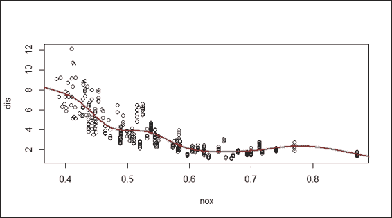

    Fitted regression of gam on a scatter plot

    拟合 gam 图

3.  Alternatively, you can plot the fitted model using the `plot` function:

    ```
    > plot(fit)

    ```

    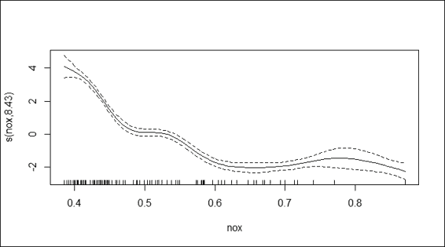

    Plot of fitted gam

    工作原理...


## 为了可视化拟合回归，我们首先使用`dis`和`nox`变量生成一个散点图。然后，我们生成*x*-轴的序列，并通过使用拟合模型`fit`上的`predict`函数来响应 *y* 。最后，我们使用`lines`函数向散点图添加回归线。

除了使用这些线在散点图上添加拟合回归线，`gam`还有一个`plot`功能来可视化包含置信区域的拟合回归线。为了给置信区域加阴影，我们在函数中赋值`shade = TRUE`。

还有更多...


## `vis.gam`功能用于产生`gam`模型预测的透视图或等高线图。观察反应变量如何与两个预测变量相互作用是有帮助的。以下是`Boston`数据集的等高线图示例:

由 vis.gam 生成的等高线图示例

```
> fit2=gam(medv~crim+zn+crim:zn, data=Boston)
> vis.gam(fit2)

```

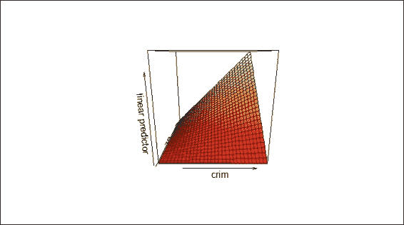

A sample contour plot produced by vis.gam

诊断广义加性模型


# GAM 还提供关于广义加性模型的拟合程序和结果的诊断信息。在本配方中，我们演示如何通过`gam.check`功能绘制诊断图。

做好准备


## 确保前一个配方已完成，并将`gam`适合的模型分配给`fit`变量。

怎么做...


## 执行以下步骤诊断广义加性模型:

拟合 gam 的诊断图

1.  Generate the diagnostic plot using `gam.check` on the fitted model:

    ```
    > gam.check(fit)

    Method: GCV   Optimizer: magic
    Smoothing parameter selection converged after 7 iterations.
    The RMS GCV score gradient at convergence was 8.79622e-06 .
    The Hessian was positive definite.
    The estimated model rank was 10 (maximum possible: 10)
    Model rank =  10 / 10 

    Basis dimension (k) checking results. Low p-value (k-index<1) may
    indicate that k is too low, especially if edf is close to k'.

     k'   edf k-index p-value
    s(nox) 9.000 8.434   0.397       0

    ```

    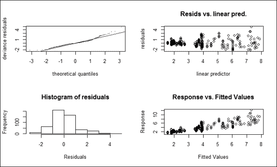

    Diagnostic plot of fitted gam

    它是如何工作的...


## `gam.check`功能首先产生平滑参数估计收敛信息。在这个例子中，平滑参数， **GCV/UBRE** ( **广义交叉验证/无偏风险估计器**)分数在七次迭代后收敛。GCV/UBRE 函数的平均绝对梯度最小值为 8.79622e-06，估计秩为`10`。尺寸检查是为了测试平滑函数的基本尺寸是否足够。在这个例子中，低 p 值表示 k 设置得太低。用户可以通过将`gam`与数据拟合来指定参数 k，从而调整平滑的尺寸选择。

除了提供关于平滑参数估计收敛的信息，该函数还返回四个诊断图。截屏图的左上部分显示了一个**分位数比较**图。该图有助于识别异常值和重尾。图的右上部分显示了残差与线性预测值的关系，这在查找非恒定误差方差时非常有用。图的左下部分显示了残差的直方图，这有助于检测非正态性。右下部分显示了响应与拟合值的对比。

还有更多...


## 关于`gam.check`的更多信息，您可以访问`help`功能。特别是，这包括平滑参数估计收敛的详细说明和四个返回图:

此外，`choose.k`的更多信息可通过以下命令访问:

```
> ?gam.check

```

In addition, more information for `choose.k` can be accessed by the following command:

```
> ?choose.k

```