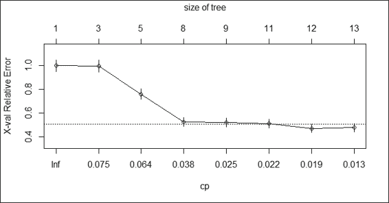
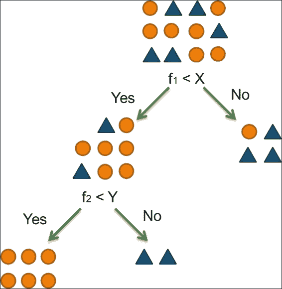
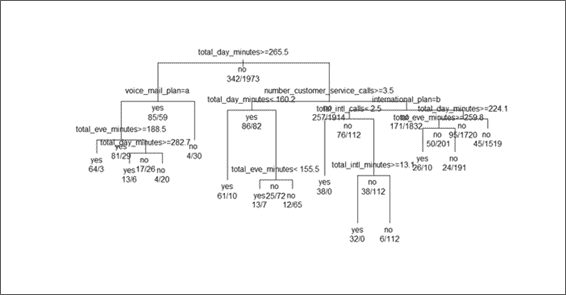
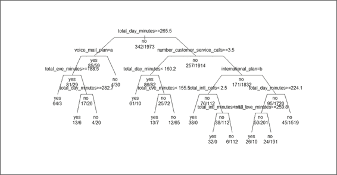
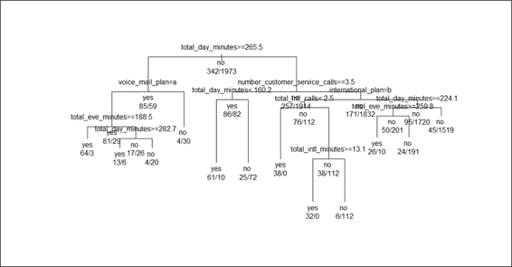
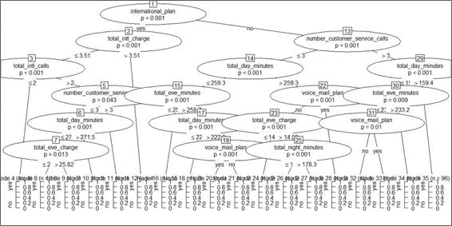
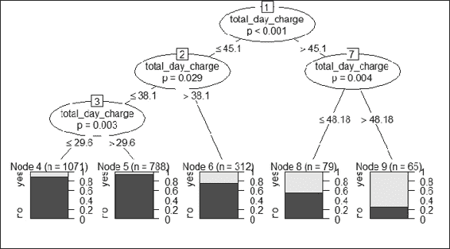

# 五、分类 I——树、惰性和概率

在本章中，我们将介绍以下配方:

*   准备训练和测试数据集
*   用递归划分树建立分类模型
*   可视化递归划分树
*   测量递归划分树的预测性能
*   修剪递归分区树
*   用条件推理树建立分类模型
*   可视化条件推理树
*   测量条件推理树的预测性能
*   用 k-最近邻分类器对数据进行分类
*   用逻辑回归对数据进行分类
*   使用朴素贝叶斯分类器分类数据


# 简介

分类用于根据从训练数据集构建的分类模型来识别新观察值(测试数据集)的类别，其中类别是已知的。与回归类似，分类被归类为监督学习方法，因为它采用训练数据集的已知答案(标签)来预测测试数据集的答案(标签)。回归和分类的主要区别在于，回归用于预测连续值。

与此相反，分类用于识别给定观察的类别。例如，可以根据历史价格使用回归来预测给定股票的未来价格。但是，我们应该使用分类方法来预测股价是上涨还是下跌。

在这一章中，我们将说明如何使用 R 来执行分类。我们首先从流失数据集构建训练数据集和测试数据集，然后应用不同的分类方法对流失数据集进行分类。在下面的配方中，我们将介绍使用传统分类树和条件推理树的基于树的分类方法、基于惰性的算法以及使用训练数据集建立分类模型的基于概率的方法，然后使用该模型来预测测试数据集的类别(类标签)。我们还将使用混淆矩阵来衡量性能。


# 准备训练和测试数据集

建立分类模型需要训练数据集来训练分类模型，然后需要测试数据来验证预测性能。在下面的食谱中，我们将演示如何将电信客户流失数据集分别拆分为训练数据集和测试数据集。


## 准备就绪

在这个菜谱中，我们将使用电信客户流失数据集作为输入数据源，并将数据分成训练和测试数据集。


## 怎么做...

执行以下步骤将流失数据集分为训练数据集和测试数据集:

1.  您可以从`C50`包中检索流失数据集:

    ```r
     > install.packages("C50") > library(C50) > data(churn) 
    ```

2.  使用`str`读取数据集的结构:

    ```r
     > str(churnTrain) 
    ```

3.  我们可以去掉`state`、`area_code`、`account_length`属性，这些属性不适合分类特征:

    ```r
     > churnTrain = churnTrain[,! names(churnTrain) %in% c("state", "area_code", "account_length") ] 
    ```

4.  然后，将 70%的数据分成训练数据集，30%的数据分成测试数据集:

    ```r
     > set.seed(2) > ind = sample(2, nrow(churnTrain), replace = TRUE, prob=c(0.7, 0.3)) > trainset = churnTrain[ind == 1,] > testset = churnTrain[ind == 2,] 
    ```

5.  最后，使用`dim`探索训练和测试数据集的维度:

    ```r
     > dim(trainset) [1] 2315   17 > dim(testset) [1] 1018   17 
    ```


## 它是如何工作的...

在这个配方中，我们使用电信客户流失数据集作为我们的示例数据源。数据集包含 20 个变量和 3333 个观察值。我们希望建立一个分类模型来预测客户是否会流失，这对电信公司来说非常重要，因为获得一个新客户的成本远远高于留住一个客户的成本。

在建立分类模型之前，我们需要首先对数据进行预处理。因此，我们将来自`C50`包的流失数据加载到 R 会话中，变量名为`churn`。当我们确定属性如`state`、`area_code`和`account_length`对于建立分类模型不是有用的特征时，我们移除这些属性。

在对数据进行预处理后，我们将其分别分成训练数据集和测试数据集。然后，我们使用一个样本函数随机生成一个序列，该序列包含 70%的训练数据集和 30%的测试数据集，其大小等于观察值的数量。然后，我们使用生成的序列将流失数据集分成训练数据集`trainset`和测试数据集`testset`。最后，通过使用`dim`函数，我们发现 3333 个观察值中的 2315 个被归类到训练数据集`trainset`，而另外 1018 个被归类到测试数据集`testset`。


## 还有更多...

您可以将训练和测试数据集的拆分过程合并到`split.data`函数中。因此，通过调用此函数并在参数中指定比例和种子，您可以轻松地将数据分成两个数据集:

```r
> split.data = function(data, p = 0.7, s = 666){
+   set.seed(s)
+   index = sample(1:dim(data)[1])
+   train = data[index[1:floor(dim(data)[1] * p)], ]
+   test = data[index[((ceiling(dim(data)[1] * p)) + 1):dim(data)[1]], ]
+   return(list(train = train, test = test))
+ } 

```


# 用递归分割树建立分类模型

分类树基于一个或多个输入变量使用分裂条件来预测分类标签。分类过程从树的根节点开始；在每个节点，该过程将检查输入值是否应该根据分裂条件递归地继续到右边或左边的子分支，并且当遇到决策树的任何叶(终端)节点时停止。在这个菜谱中，我们将介绍如何对客户流失数据集应用递归分区树。


## 准备就绪

您需要通过将客户流失数据集分为训练数据集(`trainset`)和测试数据集(`testset`)来完成前面的配方，每个数据集应该正好包含 17 个变量。


## 怎么做...

执行以下步骤将流失数据集分为训练数据集和测试数据集:

1.  加载`rpart`包:

    ```r
     > library(rpart) 
    ```

2.  使用`rpart`函数构建分类树模型:

    ```r
     > churn.rp = rpart(churn ~ ., data=trainset) 
    ```

3.  键入`churn.rp`检索分类树的节点明细:

    ```r
     > churn.rp  
    ```

4.  接下来，使用`printcp`函数检查复杂度参数:

    ```r
     > printcp(churn.rp)  Classification tree: rpart(formula = churn ~ ., data = trainset)  Variables actually used in tree construction: [1] international_plan            number_customer_service_calls [3] total_day_minutes             total_eve_minutes             [5] total_intl_calls              total_intl_minutes            [7] voice_mail_plan                Root node error: 342/2315 = 0.14773  n= 2315           CP nsplit rel error  xerror     xstd 1 0.076023      0   1.00000 1.00000 0.049920 2 0.074561      2   0.84795 0.99708 0.049860 3 0.055556      4   0.69883 0.76023 0.044421 4 0.026316      7   0.49415 0.52632 0.037673 5 0.023392      8   0.46784 0.52047 0.037481 6 0.020468     10   0.42105 0.50877 0.037092 7 0.017544     11   0.40058 0.47076 0.035788 8 0.010000     12   0.38304 0.47661 0.035993 
    ```

5.  Next, use the `plotcp` function to plot the cost complexity parameters:

    ```r
    > plotcp(churn.rp)

    ```

    

    图 1:成本复杂性参数图

6.  最后，使用`summary`函数来检查构建好的模型:

    ```r
     > summary(churn.rp) 
    ```


## 工作原理...

在这个方法中，我们使用来自`rpart`包的递归分区树来构建一个基于树的分类模型。递归划分树包括两个过程:递归和划分。在决策归纳过程中，我们必须考虑一个统计评估问题(或简单的是/否问题),根据评估结果将数据划分到不同的分区。然后，由于我们已经确定了子节点，我们可以重复执行分割，直到满足停止标准。

例如，对于 **f1** 是否小于 **X** 的问题，根节点中的数据(如下图所示)可以分为两组。如果是这样，数据被划分到左侧。否则，它将被拆分到右侧。然后，我们可以用 **f2** 是否小于 **Y** 的问题继续划分左侧数据:



图 2:递归划分树

在的第一步中，我们用`library`函数加载的`rpart`包。接下来，我们使用`churn`变量作为分类类别(类标签)并使用剩余变量作为输入特征来构建分类模型。

在构建模型之后，您可以键入构建模型的变量名`churn.rp`，以显示树节点的详细信息。在打印的节点明细中，`n`表示样本大小，`loss`表示误分类成本，`yval`表示分类隶属度(在本例中为`no`或`yes`)，而`yprob`表示两个类别的概率(左边的值表示概率到达标签`no`，右边的值表示概率到达标签`yes`)。

然后，我们使用`printcp`函数打印所构建的树模型的复杂度参数。从`printcp`的输出中，应该可以找到复杂度参数 CP 的值，该值作为控制树的大小的惩罚。简而言之，CP 值越大，分裂次数越少(`nsplit`)。输出值(`rel`错误)代表当前树的平均偏差除以空树的平均偏差。`xerror`值表示由 10 倍分类估计的相对误差。`xstd`代表相对误差的标准误差。

为了使**CP**(**成本复杂度参数**)表更具可读性，我们使用`plotcp`生成 CP 表的信息图。根据截图(步骤 5)，底部的 x 轴表示`cp`值，y 轴表示相对误差，上部的 x 轴显示树的大小。虚线表示标准偏差的上限。从截图中，我们可以确定当树的大小为 12 时，交叉验证错误最小。

我们也可以使用`summary`函数来显示函数调用，拟合树模型的复杂度参数表，变量重要性，这有助于识别对树分类最重要的变量(总计 100)，以及每个节点的详细信息。

使用决策树的优点是它非常灵活并且易于解释。它既能处理分类和回归问题，还能处理更多问题；它是非参数的。因此，人们不必担心数据是否是线性可分的。至于使用决策树的缺点，就是容易有偏差和过拟合。但是，您可以通过使用条件推理树来克服偏差问题，并通过随机森林方法或树修剪来解决过拟合问题。


## 参见

*   关于`rpart`、`printcp`和`summary`功能的更多信息，请使用`help`功能:

    ```r
     > ?rpart > ?printcp > ?summary.rpart 
    ```

*   `C50`是另一个包，它提供了决策树和基于规则的模型。如果你对这个包感兴趣，你可以在[http://cran.r-project.org/web/packages/C50/C50.pdf](http://cran.r-project.org/web/packages/C50/C50.pdf)查阅这个文件。


# 可视化递归分割树

从最后一个配方中，我们学习了如何以文本格式打印分类树。为了使树更具可读性，我们可以使用`plot`函数来获得构建的分类树的图形显示。


## 做好准备

需要通过生成一个分类模型来完成之前的配方，并将该模型分配到`churn.rp`变量中。


## 如何做到这一点...

执行以下步骤来可视化分类树:

1.  Use the `plot` function and the `text` function to plot the classification tree:

    ```r
    > plot(churn.rp, margin= 0.1)
    > text(churn.rp, all=TRUE, use.n = TRUE)

    ```

    

    图 3:分类树的图形显示

2.  You can also specify the `uniform`, `branch`, and `margin` parameter to adjust the layout:

    ```r
    > plot(churn.rp, uniform=TRUE, branch=0.6, margin=0.1)
    > text(churn.rp, all=TRUE, use.n = TRUE)

    ```

    

    图 4:调整分类树的布局


## 工作原理...

在这里，我们演示如何使用`plot`函数以图形方式显示分类树。`plot`函数可以简单地可视化分类树，然后您可以使用`text`函数向图中添加文本。

在*图 3* 中，我们指定 margin = 0.1 作为参数，在边框周围添加额外的空白，以防止显示的文本被边距截断。它表明分支的长度显示了偏差下降的相对幅度。然后，我们使用 text 函数为节点和分支添加标签。默认情况下，text 函数会在每次拆分时添加一个拆分条件，并在每个终端节点中添加一个类别标签。为了在树形图中添加额外的信息，我们将参数设置为 all 等于`TRUE`，以便为所有节点添加一个标签。除此之外，我们通过指定`use.n = TRUE`来添加一个参数，以添加额外的信息，这表明实际的观察数量属于两个不同的类别(否和是)。

在图 4 的*中，我们将选项分支设置为 0.6，为每个绘制的分支添加一个肩部。除此之外，为了显示等长的分支，而不是偏差下降的相对幅度，我们将选项 uniform 设置为`TRUE`。结果，*图 4* 显示了一个短肩和等长分支的分类树。*


## 亦见

*   你可以使用`?plot.rpart`阅读更多关于分类树的绘制。本文档还包括如何指定参数、`uniform`、`branch`、`compress`、`nspace`、`margin`和`minbranch`来调整分类树布局的信息。


# 测量递归分割树的预测性能

由于我们已经在前面的食谱中建立了一个分类树，我们可以用它来预测新观察值的类别(类标签)。在进行预测之前，我们首先验证分类树的预测能力，这可以通过在测试数据集上生成分类表来完成。在本菜谱中，我们将介绍如何使用`predict`函数和`table`函数生成预测标签和真实标签表，并解释如何生成混淆矩阵来衡量性能。


## 做好准备

您需要通过生成分类模型`churn.rp`来完成之前的配方。除此之外，您还必须准备本章第一个菜谱中生成的训练数据集`trainset`和测试数据集`testset`。


## 怎么做...

执行以下步骤来验证分类树的预测性能:

1.  您可以使用`predict`函数生成测试数据集的预测标签:

    ```r
     > predictions = predict(churn.rp, testset, type="class") 
    ```

2.  使用`table`函数生成测试数据集的分类表:

    ```r
     > table(testset$churn, predictions)      predictions       yes  no   yes 100  41   no   18 859 
    ```

3.  可以使用`caret`包中提供的`confusionMatrix`函数进一步生成混淆矩阵:

    ```r
     > library(caret) > confusionMatrix(table(predictions, testset$churn)) Confusion Matrix and Statistics   predictions yes  no         yes 100  18         no   41 859                 Accuracy : 0.942                             95% CI : (0.9259, 0.9556)     No Information Rate : 0.8615               P-Value [Acc > NIR] : < 2.2e-16                           Kappa : 0.7393            Mcnemar's Test P-Value : 0.004181                      Sensitivity : 0.70922                      Specificity : 0.97948                   Pos Pred Value : 0.84746                   Neg Pred Value : 0.95444                       Prevalence : 0.13851                   Detection Rate : 0.09823             Detection Prevalence : 0.11591                Balanced Accuracy : 0.84435                  'Positive' Class : yes              
    ```


## 工作原理...

在这个方案中，我们使用一个`predict`函数并建立分类模型`churn.rp`，来预测测试数据集`testset`的可能类别标签。预测类别(分类标签)编码为“否”或“是”。然后，我们使用`table`函数在测试数据集上生成一个分类表。从表中，我们发现有 859 个被正确预测为否，而 18 个被错误分类为是。100 个“是”预测被正确预测，但是 41 个观察值被错误分类为“否”。此外，我们使用`caret`包中的`confusionMatrix`函数来产生分类模型的测量值。


## 参见

*   您可以使用`?confusionMatrix`阅读更多关于使用混淆矩阵进行表现评估的信息
*   对混淆矩阵输出的定义感兴趣的人，请参考维基百科词条，**混淆 _ 矩阵**([http://en.wikipedia.org/wiki/Confusion_matrix](http://en.wikipedia.org/wiki/Confusion_matrix))


# 修剪递归分割树

在之前的菜谱中，我们已经为流失数据集构建了一个复杂的决策树。然而，有时我们不得不删除在分类实例中不强大的部分，以避免过度拟合，并提高预测精度。因此，在该方法中，我们引入了成本复杂度修剪方法来修剪分类树。


## 准备就绪

您需要通过生成一个分类模型来完成前面的配方，并将该模型分配到`churn.rp`变量中。


## 怎么做...

执行以下步骤来修剪分类树:

1.  求分类树模型的最小交叉验证误差:

    ```r
     > min(churn.rp$cptable[,"xerror"]) [1] 0.4707602 
    ```

2.  定位交叉验证误差最小的记录:

    ```r
     > which.min(churn.rp$cptable[,"xerror"]) 7  
    ```

3.  得到交叉验证误差最小的记录的成本复杂度参数:

    ```r
     > churn.cp = churn.rp$cptable[7,"CP"] > churn.cp [1] 0.01754386 
    ```

4.  通过将`cp`参数设置为交叉验证误差最小的记录的 CP 值来修剪树:

    ```r
     > prune.tree = prune(churn.rp, cp= churn.cp) 
    ```

5.  Visualize the classification tree by using the `plot` and `text` function:

    ```r
    > plot(prune.tree, margin= 0.1)
    > text(prune.tree, all=TRUE , use.n=TRUE)

    ```

    

    图 5:修剪后的分类树

6.  接下来，您可以基于修剪后的分类树模型生成分类表:

    ```r
     > predictions = predict(prune.tree, testset, type="class") > table(testset$churn, predictions)      predictions       yes  no   yes  95  46   no   14 863 
    ```

7.  最后，您可以根据分类表生成混淆矩阵:

    ```r
     > confusionMatrix(table(predictions, testset$churn)) Confusion Matrix and Statistics    predictions yes  no         yes  95  14         no   46 863                 Accuracy : 0.9411                            95% CI : (0.9248, 0.9547)     No Information Rate : 0.8615               P-Value [Acc > NIR] : 2.786e-16                           Kappa : 0.727             Mcnemar's Test P-Value : 6.279e-05                     Sensitivity : 0.67376                      Specificity : 0.98404                   Pos Pred Value : 0.87156                   Neg Pred Value : 0.94939                       Prevalence : 0.13851                   Detection Rate : 0.09332             Detection Prevalence : 0.10707                Balanced Accuracy : 0.82890                  'Positive' Class : yes              
    ```


## 工作原理...

在这个配方中，我们讨论了修剪分类树以避免过度拟合并产生更健壮的分类模型。我们首先在`cptable`中找到交叉验证错误最少的记录，然后提取记录的 CP 并将值赋给`churn.cp`。接下来，我们使用`prune`函数以`churn.cp`为参数修剪分类树。然后，通过使用`plot`函数，我们图形化地显示了修剪后的分类树。从*图 5* 可以明显看出，该树的分裂小于原分类树(*图 3* )。最后，我们制作了一个分类表，并使用混淆矩阵来验证剪枝树的性能。结果显示准确度(0.9411)略低于原始模型(0.942)，并且还表明修剪后的树可能不会比原始分类树表现得更好，因为我们已经修剪了一些分裂条件(仍然应该检查灵敏度和特异性的变化)。然而，修剪树模型更健壮，因为它去除了可能导致过拟合的一些分裂条件。


## 参见

*   对于那些想了解更多关于成本复杂性修剪的人，请参考维基百科的文章**修剪(决策树)**:[http://en . Wikipedia . org/wiki/Pruning _(决策树](http://en.wikipedia.org/wiki/Pruning_(decision_trees)


# 用条件推理树建立分类模型

除了传统的决策树(`rpart`)，条件推理树(`ctree`)是另一种流行的基于树的分类方法。与传统的决策树类似，条件推理树也通过对因变量执行单变量分割来递归地划分数据。然而，条件推理树与传统决策树的不同之处在于，条件推理树采用显著性测试过程来选择变量，而不是通过最大化信息度量来选择变量(`rpart`采用基尼系数)。在本菜谱中，我们将介绍如何采用条件推理树来构建分类模型。


## 做好准备

您需要通过生成训练数据集`trainset`和测试数据集`testset`来完成第一个配方。


## 怎么做...

执行以下步骤来构建条件推理树:

1.  首先，我们使用`party`包中的`ctree`来构建分类模型:

    ```r
     > library(party) > ctree.model = ctree(churn ~ . , data = trainset) 
    ```

2.  然后，我们考察建树模型:

    ```r
     > ctree.model 
    ```


## 它是如何工作的...

在这个菜谱中，我们使用了一个条件推理树来构建一个分类树。`ctree`的用法与`rpart`类似。因此，在面临分类问题时，您可以使用传统的决策树或条件推理树轻松测试分类能力。接下来，我们通过检查构建的模型来获得分类树的节点细节。在模型中，我们发现`ctree`提供了类似于分割条件的信息、标准(1–p 值)、统计(测试统计)和权重(对应于节点的案例权重)。然而，它不像`rpart`通过使用`summary`函数提供那么多信息。


## 亦见

*   您可以使用`help`函数来引用**二叉树** **树** **类**的定义，并阅读更多关于二叉树的属性:

    ```r
      > help("BinaryTree-class") 
    ```


# 可视化条件推理树

与`rpart`类似，`party`包也为用户提供了绘制条件推理树的可视化方法。在下面的菜谱中，我们将介绍如何使用`plot`函数来可视化条件推理树。


## 正在准备中

您需要通过生成条件推理树模型`ctree.model`来完成第一个配方。除此之外，您还需要在一个 R 会话中加载`trainset`和`testset`。


## 怎么做...

执行以下步骤来可视化条件推理树:

1.  Use the `plot` function to plot `ctree.model` built in the last recipe:

    ```r
    > plot(ctree.model)

    ```

    

    图 6:流失数据的条件推理树

    图 7:使用 total_day_charge 变量作为唯一分割条件的条件推理树

2.  To obtain a simple conditional inference tree, one can reduce the built model with less input features, and redraw the classification tree:

    ```r
    > daycharge.model = ctree(churn ~ total_day_charge, data = trainset)
    > plot(daycharge.model)

    ```

    

    Figure 7: A conditional inference tree using the total_day_charge variable as only split condition

    工作原理...


## 为了可视化条件推理树的节点细节，我们可以在构建的分类模型上应用`plot`函数。输出图显示，每个中间节点都显示了因变量名称和 p 值。拆分条件显示在左右分支上。终端节点显示分类观察值的数量， *n* ，以及分类标签为 0 或 1 的概率。

以*图 7* 为例，我们首先建立一个以`total_day_charge`为唯一特征，以`churn`为类别标签的分类模型。构建的分类树显示，当`total_day_charge`高于 48.18 时，节点 9 中较浅的灰色区域大于较深的灰色区域，这表明日费超过 48.18 的客户流失的可能性较大(label = yes)。

参见


## 条件推理树的可视化来自于`plot.BinaryTree`函数。如果您有兴趣调整分类树的布局，您可以使用`help`功能阅读以下文档:

```r
 > ?plot.BinaryTree 
```

*   测量条件推理树的预测性能


# 在建立条件推理树作为分类模型之后，我们可以使用`treeresponse`和`predict`函数来预测测试数据集`testset`的类别，并使用分类表和混淆矩阵进一步验证预测能力。

做好准备


## 您需要通过生成条件推理树模型`ctree.model`来完成前面的配方。除此之外，您需要在 R 会话中加载`trainset`和`testset`。

怎么做...


## 执行以下步骤来测量条件推理树的预测性能:

您可以使用`predict`函数来预测测试数据集的类别，`testset` :

```r
 > ctree.predict = predict(ctree.model ,testset) > table(ctree.predict, testset$churn)  ctree.predict yes  no           yes  99  15           no   42 862 
```

1.  此外，您可以使用 caret 包中的`confusionMatrix`来生成预测结果的性能度量:

    ```r
     > confusionMatrix(table(ctree.predict, testset$churn)) Confusion Matrix and Statistics   ctree.predict yes  no           yes  99  15           no   42 862                 Accuracy : 0.944                             95% CI : (0.9281, 0.9573)     No Information Rate : 0.8615               P-Value [Acc > NIR] : < 2.2e-16                           Kappa : 0.7449            Mcnemar's Test P-Value : 0.0005736                     Sensitivity : 0.70213                      Specificity : 0.98290                   Pos Pred Value : 0.86842                   Neg Pred Value : 0.95354                       Prevalence : 0.13851                   Detection Rate : 0.09725             Detection Prevalence : 0.11198                Balanced Accuracy : 0.84251                  'Positive' Class : yes              
    ```

2.  你也可以使用`treeresponse`函数，它会告诉你类概率列表:

    ```r
     > tr = treeresponse(ctree.model, newdata = testset[1:5,]) > tr [[1]] [1] 0.03497409 0.96502591  [[2]] [1] 0.02586207 0.97413793  [[3]] [1] 0.02586207 0.97413793  [[4]] [1] 0.02586207 0.97413793  [[5]] [1] 0.03497409 0.96502591 
    ```

3.  工作原理...


## 在这个方法中，我们首先展示了可以使用`prediction`函数来预测测试数据集`testset`的类别(类标签)，然后使用`table`函数来生成分类表。接下来，您可以使用 caret 包中内置的`confusionMatrix`函数来确定性能度量。

除了`predict`功能之外，`treeresponse`还能够估计分类概率，这通常会以较高的概率对标签进行分类。在这个例子中，我们演示了如何使用测试数据集`testset`的前五个记录来获得估计的类概率。`treeresponse`函数返回五种概率的列表。您可以使用列表来确定实例的标签。

亦见


## 对于`predict`功能，您可以将类型指定为`response`、`prob`或`node`。如果在使用`predict`函数时将类型指定为`prob`(例如`predict(… type="prob")`，将会得到与`treeresponse`返回的结果完全相同的结果。

*   用 K 近邻分类器对数据进行分类


# **K 近邻** ( **knn** )是一种非参数的惰性学习方法。从非参数的角度来看，它没有对数据分布做任何假设。就惰性学习而言，它不需要明确的学习阶段来进行概括。下面的食谱将介绍如何在客户流失数据集上应用 k-最近邻算法。

做好准备


## 您需要通过生成训练和测试数据集来完成前面的配方。

怎么做...


## 执行以下步骤，使用 k-最近邻算法对流失数据进行分类:

首先，必须安装`class`包并在 R 会话中加载它:

```r
 > install.packages("class") > library(class) 
```

1.  将训练数据集和测试数据集中`voice_mail_plan`和`international_plan`属性的`yes`和`no`替换为 1 和 0:

    ```r
     > levels(trainset$international_plan) = list("0"="no", "1"="yes") > levels(trainset$voice_mail_plan) = list("0"="no", "1"="yes") > levels(testset$international_plan) = list("0"="no", "1"="yes") > levels(testset$voice_mail_plan) = list("0"="no", "1"="yes") 
    ```

2.  对训练数据集和测试数据集使用`knn`分类方法:

    ```r
     > churn.knn  = knn(trainset[,! names(trainset) %in% c("churn")], testset[,! names(testset) %in% c("churn")], trainset$churn, k=3) 
    ```

3.  然后，您可以使用`summary`函数来检索预测标签的数量:

    ```r
     > summary(churn.knn) yes  no  77 941 
    ```

4.  接下来，您可以使用`table`函数生成分类矩阵:

    ```r
     > table(testset$churn, churn.knn)      churn.knn       yes  no   yes  44  97   no   33 844 
    ```

5.  最后，您可以使用`confusionMatrix`函数生成混淆矩阵:

    ```r
     > confusionMatrix(table(testset$churn, churn.knn)) Confusion Matrix and Statistics       churn.knn       yes  no   yes  44  97   no   33 844                 Accuracy : 0.8723                            95% CI : (0.8502, 0.8922)     No Information Rate : 0.9244               P-Value [Acc > NIR] : 1                                   Kappa : 0.339             Mcnemar's Test P-Value : 3.286e-08                     Sensitivity : 0.57143                      Specificity : 0.89692                   Pos Pred Value : 0.31206                   Neg Pred Value : 0.96237                       Prevalence : 0.07564                   Detection Rate : 0.04322             Detection Prevalence : 0.13851                Balanced Accuracy : 0.73417                  'Positive' Class : yes    
    ```

6.  工作原理...


## **knn** 训练所有样本，并基于相似性(距离)度量对新实例进行分类。例如，相似性度量可以用公式表示如下:

**欧几里德距离** : 

*   **曼哈顿距离** : 
*   在 knn 中，一个新的实例被分类到一个标签(类),该标签在 k 个最近的邻居中是公共的。如果 *k = 1* ，那么新的实例被分配给它最近的邻居所属的类。算法唯一需要的输入是 k，如果我们给一个小的 k 输入，可能会导致过拟合。另一方面，如果我们给定一个大的 k 输入，可能会导致欠拟合。为了选择合适的 k 值，可以依靠交叉验证。

knn 的优势是:

学习过程的 T4 成本是零

*   它是非参数的，这意味着你不必假设数据分布
*   只要能找到给定实例的相似性度量，就可以对任何数据进行分类
*   knn 的主要缺点是:

分类结果很难解释。

*   对于大型数据集来说，这是一种昂贵的计算。
*   性能依赖于维数。因此，对于高维问题，您应该首先降低维度以提高流程性能。
*   knn 的使用与前面提到的基于树的算法没有太大的不同。然而，虽然基于树的算法可以向您展示决策树模型，但是 knn 产生的输出仅揭示分类类别因素。但是，在构建分类模型之前，应该将字符串类型的属性替换为整数，因为 k-最近邻算法需要计算观察值之间的距离。然后，我们通过指定 *k=3* 来建立分类模型，这意味着选择三个最近的邻居。建立分类模型后，我们可以使用预测因子和测试数据集标签作为输入来生成分类表。最后，我们可以从分类表中生成一个混淆矩阵。混淆矩阵输出揭示了(0.8723)的准确度结果，这表明在先前配方中提到的两种基于树的方法在这种情况下都优于 k-最近邻分类方法的准确度。然而，我们不能仅仅依靠准确性来确定哪个模型更好，我们还应该检查输出的特异性和敏感性。

亦见


## 还有一个名为`kknn`的包，它提供了一个加权的 K 近邻分类、回归和聚类。你可以通过阅读这个文档来了解更多关于包的信息:[http://cran.r-project.org/web/packages/kknn/kknn.pdf](http://cran.r-project.org/web/packages/kknn/kknn.pdf)。

*   用逻辑回归对数据进行分类


# 逻辑回归是概率统计分类模型的一种形式，可用于基于一个或多个特征预测类别标签。通过使用`logit`函数估计结果概率来完成分类。在使用`glm`函数时，可以通过将家庭指定为二项式来使用逻辑回归。在本食谱中，我们将介绍如何使用逻辑回归对数据进行分类。

准备就绪


## 您需要通过生成训练和测试数据集来完成第一个配方。

怎么做...


## 执行以下步骤，使用逻辑回归对流失数据进行分类:

通过将家庭指定为二项式，我们对数据集`trainset`应用`glm`函数，使用 churn 作为类别标签，其余变量作为输入特征:

```r
 > fit = glm(churn ~ ., data = trainset, family=binomial) 
```

1.  使用`summary`函数获取已建 logistic 回归模型的汇总信息:

    ```r
     > summary(fit)  Call: glm(formula = churn ~ ., family = binomial, data = trainset)  Deviance Residuals:      Min       1Q   Median       3Q      Max   -3.1519   0.1983   0.3460   0.5186   2.1284    Coefficients:                                 Estimate Std. Error z value Pr(>|z|) (Intercept)                    8.3462866  0.8364914   9.978  < 2e-16 international_planyes         -2.0534243  0.1726694 -11.892  < 2e-16 voice_mail_planyes             1.3445887  0.6618905   2.031 0.042211 number_vmail_messages         -0.0155101  0.0209220  -0.741 0.458496 total_day_minutes              0.2398946  3.9168466   0.061 0.951163 total_day_calls               -0.0014003  0.0032769  -0.427 0.669141 total_day_charge              -1.4855284 23.0402950  -0.064 0.948592 total_eve_minutes              0.3600678  1.9349825   0.186 0.852379 total_eve_calls               -0.0028484  0.0033061  -0.862 0.388928 total_eve_charge              -4.3204432 22.7644698  -0.190 0.849475 total_night_minutes            0.4431210  1.0478105   0.423 0.672367 total_night_calls              0.0003978  0.0033188   0.120 0.904588 total_night_charge            -9.9162795 23.2836376  -0.426 0.670188 total_intl_minutes             0.4587114  6.3524560   0.072 0.942435 total_intl_calls               0.1065264  0.0304318   3.500 0.000464 total_intl_charge             -2.0803428 23.5262100  -0.088 0.929538 number_customer_service_calls -0.5109077  0.0476289 -10.727  < 2e-16  (Intercept)                   *** international_planyes         *** voice_mail_planyes            *   number_vmail_messages             total_day_minutes                 total_day_calls                   total_day_charge                  total_eve_minutes                 total_eve_calls                   total_eve_charge                  total_night_minutes               total_night_calls                 total_night_charge                total_intl_minutes                total_intl_calls              *** total_intl_charge                 number_customer_service_calls *** --- Signif. codes:  0 '***' 0.001 '**' 0.01 '*' 0.05 '.' 0.1 ' ' 1  (Dispersion parameter for binomial family taken to be 1)      Null deviance: 1938.8  on 2314  degrees of freedom Residual deviance: 1515.3  on 2298  degrees of freedom AIC: 1549.3  Number of Fisher Scoring iterations: 6 
    ```

2.  然后，我们发现建立的模型包含无关紧要的变量，这将导致错误分类。因此，我们只使用显著变量来训练分类模型:

    ```r
     > fit = glm(churn ~ international_plan + voice_mail_plan+total_intl_calls+number_customer_service_calls, data = trainset, family=binomial) > summary(fit)  Call: glm(formula = churn ~ international_plan + voice_mail_plan +      total_intl_calls + number_customer_service_calls, family = binomial,      data = trainset)  Deviance Residuals:      Min       1Q   Median       3Q      Max   -2.7308   0.3103   0.4196   0.5381   1.6716    Coefficients:                               Estimate Std. Error z value (Intercept)                    2.32304    0.16770  13.852 international_planyes         -2.00346    0.16096 -12.447 voice_mail_planyes             0.79228    0.16380   4.837 total_intl_calls               0.08414    0.02862   2.939 number_customer_service_calls -0.44227    0.04451  -9.937                               Pr(>|z|)     (Intercept)                    < 2e-16 *** international_planyes          < 2e-16 *** voice_mail_planyes            1.32e-06 *** total_intl_calls               0.00329 **  number_customer_service_calls  < 2e-16 *** --- Signif. codes:   0  es:    des:  **rvice_calls  < '.  es:    de  (Dispersion parameter for binomial family taken to be 1)      Null deviance: 1938.8  on 2314  degrees of freedom Residual deviance: 1669.4  on 2310  degrees of freedom AIC: 1679.4  Number of Fisher Scoring iterations: 5 
    ```

3.  然后，你可以使用一个合适的模型`fit`，来预测`testset`的结果。也可以通过判断概率是否在 0.5 以上来确定阶层:

    ```r
     > pred = predict(fit,testset, type="response") > Class = pred >.5 
    ```

4.  接下来，使用`summary`函数将显示二进制结果计数，并显示概率是否高于 0.5:

    ```r
     > summary(Class)    Mode   FALSE    TRUE    NA's  logical      29     989       0  
    ```

5.  您可以根据测试数据集标签和预测结果生成计数统计:

    ```r
     > tb = table(testset$churn,Class) > tb
     Class       FALSE TRUE   yes    18  123   no     11  866 
    ```

6.  可以把上一步的统计变成分类表，然后生成混淆矩阵:

    ```r
     > churn.mod = ifelse(testset$churn == "yes", 1, 0) > pred_class = churn.mod > pred_class[pred<=.5] = 1- pred_class[pred<=.5] > ctb = table(churn.mod, pred_class) > ctb          pred_class churn.mod   0   1         0 866  11         1  18 123 > confusionMatrix(ctb) Confusion Matrix and Statistics           pred_class churn.mod   0   1         0 866  11         1  18 123                 Accuracy : 0.9715                            95% CI : (0.9593, 0.9808)     No Information Rate : 0.8684               P-Value [Acc > NIR] : <2e-16                              Kappa : 0.8781            Mcnemar's Test P-Value : 0.2652                        Sensitivity : 0.9796                       Specificity : 0.9179                    Pos Pred Value : 0.9875                    Neg Pred Value : 0.8723                        Prevalence : 0.8684                    Detection Rate : 0.8507              Detection Prevalence : 0.8615                 Balanced Accuracy : 0.9488                   'Positive' Class : 0   
    ```

7.  工作原理...


## 逻辑回归与线性回归非常相似；主要区别在于，线性回归中的因变量是连续的，而逻辑回归中的因变量是二分的(或名义的)。逻辑回归的主要目标是使用 logit 得出与测量变量相关的名义变量的概率。我们可以用下面的等式来表示 logit:ln(P/(1-P))，其中 P 是某个事件发生的概率。

逻辑回归的优点是易于解释，它指导模型逻辑概率，并为结果提供一个置信区间。与难以更新模型的决策树不同，您可以快速更新分类模型，以便在逻辑回归中合并新数据。该算法的主要缺点是存在多重共线性，因此解释变量必须是线性无关的。`glm`提供广义线性回归模型，允许在选项族中指定模型。如果该系列被指定为二项式逻辑，则可以将该系列设置为二项式，以对类别的因变量进行分类。

分类过程从使用训练数据集生成逻辑回归模型开始，通过将`Churn`指定为类标签，将其他变量指定为训练特征，并将族集指定为二项式。然后我们使用`summary`函数来生成模型的概要信息。从汇总信息中，我们可能会发现一些无关紧要的变量(p 值> 0.05)，这可能会导致错误分类。因此，我们应该只考虑模型的重要变量。

接下来，我们使用`fit`函数来预测测试数据集的分类因变量`testset`。`fit`函数输出一个类标签的概率，结果等于 0.5 及以下，提示预测标签与测试数据集的标签不匹配，高于 0.5 的概率表示预测标签与测试数据集的标签匹配。此外，我们可以使用`summary`函数来获得预测标签是否与测试数据集的标签相匹配的统计数据。最后，为了生成混淆矩阵，我们首先生成一个分类表，然后使用`confusionMatrix`生成性能度量。

参见


## 有关如何使用`glm`函数的更多信息，请参考[第 4 章](part0046_split_000.html#page "Chapter 4. Understanding Regression Analysis")、*了解回归分析*，其中涵盖了如何解释`glm`函数的输出

*   使用朴素贝叶斯分类器对数据进行分类


# 朴素贝叶斯分类器也是一种基于概率的分类器，它基于应用具有强独立假设的贝叶斯定理。在本菜谱中，我们将介绍如何使用朴素贝叶斯分类器对数据进行分类。

准备就绪


## 您需要通过生成训练和测试数据集来完成第一个配方。

怎么做...


## 执行以下步骤，使用朴素贝叶斯分类器对流失数据进行分类:

加载`e1071`库，使用`naiveBayes`函数构建分类器:

```r
 > library(e1071)  > classifier=naiveBayes(trainset[, !names(trainset) %in% c("churn")], trainset$churn) 
```

1.  键入`classifier`检查函数调用、先验概率和条件概率:

    ```r
     > classifier  Naive Bayes Classifier for Discrete Predictors  Call: naiveBayes.default(x = trainset[, !names(trainset) %in% c("churn")],      y = trainset$churn)  A-priori probabilities: trainset$churn       yes        no  0.1477322 0.8522678   Conditional probabilities:               international_plan trainset$churn         no        yes            yes 0.70467836 0.29532164            no  0.93512418 0.06487582 
    ```

2.  接下来，您可以为测试数据集生成一个分类表:

    ```r
     > bayes.table = table(predict(classifier, testset[, !names(testset) %in% c("churn")]), testset$churn) > bayes.table        yes  no   yes  68  45   no   73 832 
    ```

3.  最后，你可以从分类表中生成一个混淆矩阵:

    ```r
     > confusionMatrix(bayes.table) Confusion Matrix and Statistics         yes  no   yes  68  45   no   73 832                 Accuracy : 0.8841                            95% CI : (0.8628, 0.9031)     No Information Rate : 0.8615               P-Value [Acc > NIR] : 0.01880                             Kappa : 0.4701            Mcnemar's Test P-Value : 0.01294                       Sensitivity : 0.4823                       Specificity : 0.9487                    Pos Pred Value : 0.6018                    Neg Pred Value : 0.9193                        Prevalence : 0.1385                    Detection Rate : 0.0668              Detection Prevalence : 0.1110                 Balanced Accuracy : 0.7155                   'Positive' Class : yes     
    ```

4.  工作原理...


## 朴素贝叶斯假设特征是条件独立的，即预测因子(x)对类(c)的影响独立于其他预测因子对类(c)的影响。它计算后验概率 *P(c|x)* ，如下公式:

其中 *P(x|c)* 称为似然， *p(x)* 称为边际似然， *p(c)* 称为先验概率。如果有许多预测值，我们可以用公式表示后验概率如下:


朴素贝叶斯的优点是使用起来相对简单明了。当训练集相对较小，并且可能包含一些噪声和丢失的数据时，它是合适的。此外，你可以很容易地获得预测的概率。朴素贝叶斯的缺点是，它假设所有的特征都是独立的、同等重要的，这在现实世界中是不太可能的。


在这个配方中，我们使用`e1071`包中的朴素贝叶斯分类器来构建分类模型。首先，我们将所有变量(不包括`churn`类标签)指定为第一个输入参数，并将`churn`类标签指定为`naiveBayes`函数调用中的第二个参数。接下来，我们将分类模型分配到变量分类器中。然后，我们打印变量分类器来获取信息，比如函数调用、先验概率和条件概率。我们还可以使用`predict`函数获得预测结果，使用`table`函数检索测试数据集的分类表。最后，我们使用混淆矩阵来计算分类模型的性能度量。

最后，我们在本章中列出了所有提到的算法的对照表:

算法

优势

| 

不足之处

 | 

递归划分树

 | 

*   非常灵活且易于解读
*   对分类和回归问题都有效
*   非参数

 |
| --- | --- | --- |
| 非常灵活且易于解释 | 处理分类和回归问题 | 条件推理树 |
| 非常灵活，易于解释 | 分类和回归问题的作品 | k 最近邻分类器 |
| 学习过程的成本是零 | 非参数的 | 对于大型数据集，计算成本很高 |
| 容易理解 | 提供模型逻辑概率 | 不处理连续变量的缺失值 |
| 使用起来相对简单明了 | 当训练集相对较小时适用 | 当训练集数量增加时容易产生偏差 |


## See also

*   To learn more about the Bayes theorem, you can refer to the following Wikipedia article: [http://en.wikipedia.org/wiki/Bayes'_theorem](http://en.wikipedia.org/wiki/Bayes'_theorem)