# 第六章。分类(二)——神经网络和 SVM

在本章中，我们将介绍以下配方:

*   用支持向量机对数据进行分类
*   选择支持向量机的代价
*   可视化 SVM 拟合
*   基于由支持向量机训练的模型预测标签
*   调整支持向量机
*   用神经网络训练神经网络
*   可视化由神经网络训练的神经网络
*   基于神经网络训练的模型预测标签
*   用神经网络训练神经网络
*   基于由 nnet 训练的模型预测标签


# 简介

大多数研究表明，**支持向量机** ( **SVM** )和**神经网络** ( **NN** )是强大的分类工具，可以应用于几个不同的领域。与上一章提到的基于树或基于概率的方法不同，支持向量机和神经网络如何从输入转换到输出的过程不太清楚，可能很难解释。因此，支持向量机和神经网络都被称为黑盒方法。

神经网络的发展受到人类大脑活动的启发。因此，这种类型的网络是一种模拟人类思维模式的计算模型。与此相反，支持向量机首先将输入数据映射到由核函数定义的高维特征空间中，并找到以最大间隔分隔训练数据的最佳超平面。简而言之，我们可以把支持向量机看作是高维空间中的线性算法。

这两种方法在解决分类问题时各有利弊。例如，支持向量机解决方案是全局最优的，而神经网络可能遭受多个局部最优。因此，选择哪一个取决于数据集源的特征。在本章中，我们将说明以下内容:

*   如何训练支持向量机
*   观察成本的选择如何影响 SVM 分类器
*   可视化 SVM 拟合
*   基于由 SVM 训练的模型来预测测试数据集的标签
*   调谐 SVM

在神经网络部分，我们将涵盖:

*   如何训练神经网络
*   如何可视化神经网络模型
*   基于由`neuralnet`训练的模型预测测试数据集的标签
*   最后，我们将展示如何用`nnet`训练神经网络，以及如何用它来预测测试数据集的标签


# 用支持向量机对数据进行分类

最广为人知的两个支持向量机是`libsvm`和`SVMLite`。对于 R 用户，可以在`e1071`包中找到`libsvm`的实现，在`klaR`包中找到`SVMLite`。所以可以用这两个包实现的函数来训练支持向量机。在这个菜谱中，我们将重点使用`e1071`包中的`svm`函数(`libsvm`实现版本)来训练一个基于电信客户流失数据训练数据集的支持向量机。


## 做好准备

在这个食谱中，我们将继续使用电信客户流失数据集作为输入数据源来训练支持向量机。对于没有准备数据集的人，请参考[第五章](part0060_split_000.html#page "Chapter 5. Classification (I) – Tree, Lazy, and Probabilistic")、*分类(一)——树、懒、概率*了解详情。


## 怎么做...

执行以下步骤来训练 SVM:

1.  加载`e1071`包:

    ```
     > library(e1071) 
    ```

2.  使用`svm`函数训练支持向量机，以`trainset`为输入数据集，以`churn`为分类类别:

    ```
     > model  = svm(churn~., data = trainset, kernel="radial", cost=1, gamma = 1/ncol(trainset)) 
    ```

3.  最后，您可以通过`summary` :

    ```
     > summary(model)  Call: svm(formula = churn ~ ., data = trainset, kernel = "radial", cost = 1, gamma = 1/ncol(trainset))   Parameters:    SVM-Type:  C-classification   SVM-Kernel:  radial         cost:  1        gamma:  0.05882353   Number of Support Vectors:  691   ( 394 297 )   Number of Classes:  2   Levels:   yes no 
    ```

    获得已建模型的整体信息


## 工作原理...

支持向量机构造一个超平面(或一组超平面),该超平面在高维空间中最大化两个类之间的边缘宽度。其中，定义超平面的情况是支持向量，如下图所示:

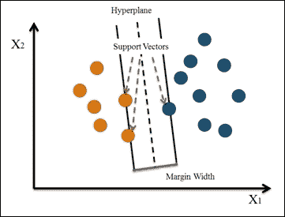

图 1:支持向量机

支持向量机从构造一个最大化边缘宽度的超平面开始。然后，将该定义推广到一个非线性可分问题。最后，它将数据映射到一个高维空间，在这个空间中，数据可以更容易地用一个线性边界分开。

使用 SVM 的优势在于它通过面向工程问题的内核建立了一个高度精确的模型。此外，它利用正则项来避免过拟合。它也不会受到局部最优和多重共线性的影响。SVM 的主要限制是它在训练和测试时间的速度和规模。因此，为大数据量构建分类模型是不合适的，也不够有效。此外，既然很难解释 SVM，核心的决定是如何发生的？正规化是我们需要解决的另一个问题。

在这个菜谱中，我们继续使用电信`churn`数据集作为我们的示例数据源。我们开始使用`e1071`包中提供的`libsvm`训练一个支持向量机。在训练函数`svm`中，用户可以指定`kernel`函数、成本和`gamma`函数。对于`kernel`参数，缺省值是 radial，用户可以将内核指定为线性、多项式、径向基和 sigmoid。至于`gamma`参数，默认值等于(1/数据维)，它控制分离超平面的形状。增加`gamma`参数通常会增加支持向量的数量。

至于代价，默认值设置为 1，表示正则项是常数，值越大，余量越小。我们将在下一个菜谱中进一步讨论成本如何影响 SVM 分类器。一旦构建了支持向量机，就可以使用`summary`函数来获取信息，比如调用、参数、类的数量和标签的类型。


## 参见

另一个流行的支持向量机工具是`SVMLight`。不像`e1071`包提供了`libsvm`的完整实现，`klaR`包仅仅提供了一个到`SVMLight`的接口。要使用`SVMLight`，可以执行以下步骤:

1.  安装`klaR`包:

    ```
     > install.packages("klaR") > library(klaR) 
    ```

2.  从[http://svmlight.joachims.org/](http://svmlight.joachims.org/)下载您平台的`SVMLight`源代码和二进制代码。例如，如果您的客户操作系统是 Windows 64 位，您应该从[http://download . joachims . org/SVM _ light/current/SVM _ light _ Windows 64 . zip](http://download.joachims.org/svm_light/current/svm_light_windows64.zip)下载该文件。
3.  然后，您应该解压缩文件，并将可工作的二进制文件放在工作目录中；您可以使用`getwd`功能查看您的工作目录:

    ```
     > getwd() 
    ```

4.  使用`svmlight`函数训练支持向量机:

    ```
     > model.light  = svmlight(churn~., data = trainset, kernel="radial", cost=1, gamma = 1/ncol(trainset)) 
    ```


# 选择支持向量机的成本

支持向量机创建了一个最佳超平面，该超平面通过最大余量分离训练数据。然而，有时我们希望在分类时允许一些错误的分类。SVM 模型有一个成本函数，控制训练误差和利润。例如，小成本产生大利润(软利润)并允许更多的错误分类。另一方面，大的成本产生了窄的利润(硬利润),并允许更少的错误分类。在这个配方中，我们将说明大成本和小成本如何影响 SVM 分类器。


## 做好准备

在这个菜谱中，我们将使用`iris`数据集作为我们的示例数据源。


## 如何去做...

执行以下步骤，以生成两个具有不同成本的不同分类实例:

1.  子集化`iris`数据集，列名为`Sepal.Length`、`Sepal.Width`、`Species`，种类在`setosa`和`virginica` :

    ```
     > iris.subset = subset(iris, select=c("Sepal.Length", "Sepal.Width", "Species"), Species %in% c("setosa","virginica")) 
    ```

2.  Then, you can generate a scatter plot with `Sepal.Length` as the x-axis and the `Sepal.Width` as the y-axis:

    ```
    > plot(x=iris.subset$Sepal.Length,y=iris.subset$Sepal.Width, col=iris.subset$Species, pch=19)

    ```

    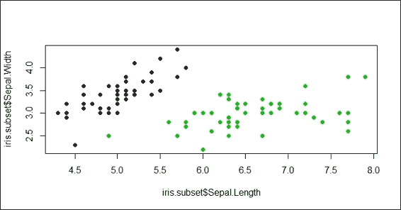

    图 2:萼片的散点图。长度和萼片。虹膜数据集子集的宽度

3.  接下来，你可以基于`iris.subset`训练 SVM，代价等于 1:

    ```
     > svm.model = svm(Species ~ ., data=iris.subset, kernel='linear', cost=1, scale=FALSE) 
    ```

4.  Then, we can circle the support vector with blue circles:

    ```
    > points(iris.subset[svm.model$index,c(1,2)],col="blue",cex=2)

    ```

    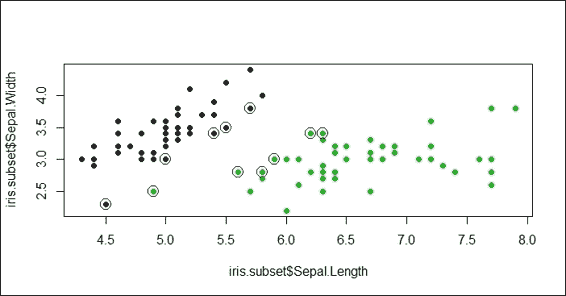

    图 3:用蓝色圆环圈出支持向量

5.  Lastly, we can add a separation line on the plot:

    ```
    > w = t(svm.model$coefs) %*% svm.model$SV
    > b = -svm.model$rho
    > abline(a=-b/w[1,2], b=-w[1,1]/w[1,2], col="red", lty=5)

    ```

    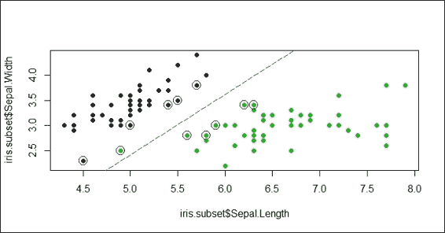

    图 4:向散点图添加分隔线

6.  In addition to this, we create another SVM classifier where `cost = 10,000`:

    ```
    > plot(x=iris.subset$Sepal.Length,y=iris.subset$Sepal.Width, col=iris.subset$Species, pch=19)
    > svm.model = svm(Species ~ ., data=iris.subset, type='C-classification', kernel='linear', cost=10000, scale=FALSE)
    > points(iris.subset[svm.model$index,c(1,2)],col="blue",cex=2)
    > w = t(svm.model$coefs) %*% svm.model$SV
    > b = -svm.model$rho
    > abline(a=-b/w[1,2], b=-w[1,1]/w[1,2], col="red", lty=5)

    ```

    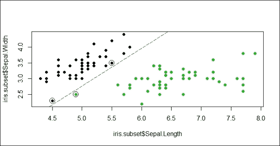

    图 5:一个大开销的分类例子


## 它是如何工作的...

在这个配方中，我们展示了不同的成本如何影响 SVM 分类器。首先，我们用包含物种、`setosa`和`virginica`的列、`Sepal.Length`、`Sepal.Width`和`Species`创建一个 iris 子集。然后，为了创建软余量并允许一些错误分类，我们使用小成本的 SVM(其中`cost = 1`)来训练向量机的支持度。接下来，我们用蓝色圆圈圈出支持向量，并添加分隔线。根据*图 5* ，其中一个绿点(`virginica`)由于选择了小代价而被错误分类(分类到`setosa`)到分隔线的另一侧。

除此之外，我们想确定一个大的成本会如何影响 SVM 分类器。所以我们选择大成本(其中`cost = 10,000`)。从图 5 中，我们可以看到创建的边界很窄(硬边界),并且不存在错误分类的情况。因此，这两个例子表明，选择不同的成本可能会影响所创造的利润，也影响错误分类的可能性。


## 亦见

*   Corinna Cortes 和 Vladimir N. Vapnik 于 1995 年在以下论文中提出了允许错误分类示例的软边距概念:Cortes，c .和 Vapnik，V. (1995)。支持向量网络。机器学习，20(3)，273-297。


# 想象 SVM 合身

为了可视化所构建的模型，可以首先使用绘图功能来生成数据输入和 SVM 拟合的散点图。在该图中，支持向量和类通过颜色符号突出显示。除此之外，还可以绘制类区域的轮廓填充图，以便于从图中识别错误分类的样本。


## 做好准备

在这个菜谱中，我们将使用两个数据集:数据集`iris`和数据集`churn`。对于电信`churn`数据集，人们需要通过用 SVM 训练支持向量机来完成之前的配方，并且已经保存了 SVM 拟合模型。


## 怎么做...

执行以下步骤来可视化 SVM 拟合对象:

1.  Use SVM to train the support vector machine based on the iris dataset, and use the `plot` function to visualize the fitted model:

    ```
    > data(iris)
    > model.iris  = svm(Species~., iris)
    > plot(model.iris, iris, Petal.Width ~ Petal.Length, slice = list(Sepal.Width = 3, Sepal.Length = 4))

    ```

    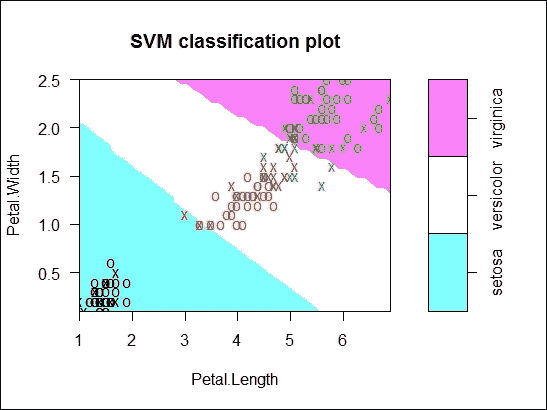

    图 6:基于 iris 数据集的训练 SVM 拟合的 SVM 分类图

2.  Visualize the SVM fit object, `model`, using the `plot` function with the dimensions of `total_day_minutes` and `total_intl_charge`:

    ```
    > plot(model, trainset, total_day_minutes ~ total_intl_charge)

    ```

    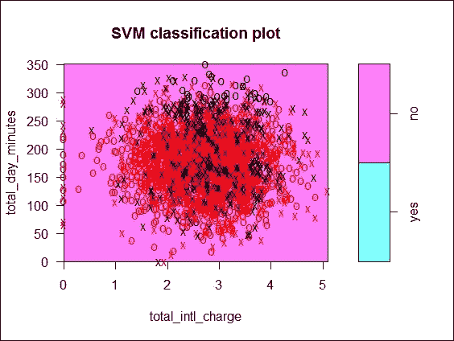

    图 7:基于流失数据集的训练 SVM 拟合的 SVM 分类图


## 工作原理...

在这个配方中，我们演示了如何使用`plot`功能来可视化 SVM 拟合。在第一个图中，我们使用`iris`数据集训练一个支持向量机。然后，我们使用`plot`功能来可视化拟合的 SVM。

在参数列表中，我们在第一个参数中指定拟合的模型，数据集(这应该是用于构建模型的相同数据)作为第二个参数。第三个参数表示用于生成分类图的维度。默认情况下，`plot`函数只能基于两个维度(x 轴和 y 轴)生成散点图。因此，我们选择变量`Petal.Length`和`Petal.Width`作为两个维度来生成散点图。

从*图 6* 中，我们发现`Petal.Length`被分配给 x 轴，`Petal.Width`被分配给 y 轴，带有`X`和`O`符号的数据点分散在图上。在散点图中，`X`符号表示支持向量，`O`符号表示数据点。这两个符号可以通过`svSymbol`和`dataSymbol`选项的配置进行更改。支持向量和真实类都被突出显示，并根据它们的标签进行着色(绿色表示 viginica，红色表示 versicolor，黑色表示 setosa)。最后一个参数`slice`在有两个以上变量时设置。因此，在本例中，我们通过分配常量`3`和`4`来使用额外的变量`Sepal.width`和`Sepal.length`。

接下来，我们采用同样的方法，根据客户流失数据得出 SVM 拟合。在本例中，我们使用`total_day_minutes`和`total_intl_charge`作为绘制散点图的两个维度。根据*图 7* ，红色和黑色的支持向量和数据点紧密地分散在图的中心区域，没有简单的方法将它们分开。


## 亦见

*   还有其他参数，如`fill`、`grid`、`symbolPalette`等，可以通过配置来改变图形的布局。您可以使用`help`功能查看以下文档以获取更多信息:

    ```
     > ?svm.plot 
    ```


# 基于支持向量机训练的模型预测标签

在前面的食谱中，我们根据训练数据集训练了一个 SVM。训练过程找到最佳超平面，该超平面使以最大间距分隔训练数据。然后，我们可以利用 SVM 拟合来预测新观察的标签(类别)。在这个菜谱中，我们将演示如何使用`predict`函数根据 SVM 训练的模型来预测值。


## 准备就绪

您需要通过生成拟合的 SVM 来完成之前的配方，并将拟合的模型保存在模型中。


## 怎么做...

执行以下步骤来预测测试数据集的标签:

1.  根据拟合的 SVM 和测试数据集的属性预测测试数据集的标签:

    ```
     > svm.pred = predict(model, testset[, !names(testset) %in% c("churn")]) 
    ```

2.  然后，您可以使用`table`函数生成一个带有预测结果和测试数据集标签的分类表:

    ```
     > svm.table=table(svm.pred, testset$churn) > svm.table  svm.pred yes  no      yes  70  12      no   71 865 
    ```

3.  接下来，你可以使用`classAgreement`来计算系数对比分类协议:

    ```
     > classAgreement(svm.table) $diag [1] 0.9184676  $kappa [1] 0.5855903  $rand [1] 0.850083  $crand [1] 0.5260472 
    ```

4.  现在，您可以根据分类表

    ```
     > library(caret) > confusionMatrix(svm.table) Confusion Matrix and Statistics   svm.pred yes  no      yes  70  12      no   71 865                 Accuracy : 0.9185                            95% CI : (0.8999, 0.9345)     No Information Rate : 0.8615               P-Value [Acc > NIR] : 1.251e-08                           Kappa : 0.5856            Mcnemar's Test P-Value : 1.936e-10                     Sensitivity : 0.49645                      Specificity : 0.98632                   Pos Pred Value : 0.85366                   Neg Pred Value : 0.92415                       Prevalence : 0.13851                   Detection Rate : 0.06876             Detection Prevalence : 0.08055                Balanced Accuracy : 0.74139                  'Positive' Class : yes              
    ```

    使用`confusionMatrix`来衡量预测性能


## 工作原理...

在这个方法中，我们首先使用`predict`函数来获得测试数据集的预测标签。接下来，我们使用`table`函数根据测试数据集的预测标签生成分类表。到目前为止，评估程序与上一章提到的评估过程非常相似。

然后我们引入了一个新函数`classAgreement`，它计算双向列联表的列和行之间的几个一致性系数。这些系数包括 diag、kappa、rand 和 crand。`diag`系数表示数据点在分类表主对角线上的百分比，`kappa`指的是`diag`，其通过变化(随机协议的概率)对协议进行校正，`rand`表示 Rand 指数，其测量两个数据簇之间的相似性，`crand`表示 Rand 指数，其针对元素的机会分组进行调整。

最后，我们使用来自`caret`包的`confusionMatrix`来测量分类模型的性能。0.9185 的准确率说明训练好的支持向量机可以正确的对大部分观测值进行分类。然而，准确性本身并不是分类模型的良好度量。还应该提到敏感性和特异性。


## 还有更多...

除了使用 SVM 预测新观测值的类别之外，您还可以使用 SVM 预测连续值。换句话说，可以使用 SVM 进行回归分析。

在以下示例中，我们将展示如何基于指定为`eps-regression`类型的拟合 SVM 执行简单的回归预测。

执行以下步骤，使用 SVM 训练回归模型:

1.  基于`Quartet`数据集:

    ```
     > library(car) > data(Quartet) > model.regression = svm(Quartet$y1~Quartet$x,type="eps-regression") 
    ```

    训练支持向量机
2.  使用`predict`函数获得预测结果:

    ```
     > predict.y = predict(model.regression, Quartet$x)  > predict.y        1        2        3        4        5        6        7        8  8.196894 7.152946 8.807471 7.713099 8.533578 8.774046 6.186349 5.763689         9       10       11  8.726925 6.621373 5.882946  
    ```

3.  Plot the predicted points as squares and the training data points as circles on the same plot:

    ```
    > plot(Quartet$x, Quartet$y1, pch=19)
    > points(Quartet$x, predict.y, pch=15, col="red")

    ```

    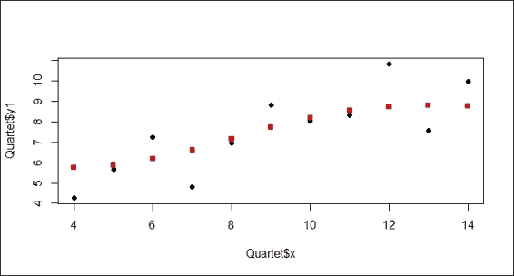

    图 8:散点图包含预测数据点和训练数据点


# 调优支持向量机

除了在支持向量机中使用不同的特性集和`kernel`函数之外，您可以用来调整其性能的一个技巧是调整参数中配置的 gamma 和成本。一种测试不同伽马和成本组合值的性能的可能方法是编写一个`for`循环，以生成伽马和成本的所有组合作为训练不同支持向量机的输入。幸运的是，SVM 提供了一个调优功能`tune.svm`，这使得调优变得容易多了。在这个菜谱中，我们将演示如何通过使用`tune.svm`来调整支持向量机。


## 做好准备

您需要通过准备一个训练数据集`trainset`来完成之前的配方。


## 怎么做...

执行以下步骤来调整支持向量机:

1.  首先，使用`tune.svm` :

    ```
     > tuned = tune.svm(churn~., data = trainset, gamma = 10^(-6:-1), cost = 10^(1:2)) 
    ```

    调整支持向量机
2.  接下来，您可以使用`summary`函数获得调优结果:

    ```
     > summary(tuned)  Parameter tuning of 'svm':  - sampling method: 10-fold cross validation   - best parameters:  gamma cost   0.01  100  - best performance: 0.08077885   - Detailed performance results:    gamma cost      error dispersion 1  1e-06   10 0.14774780 0.02399512 2  1e-05   10 0.14774780 0.02399512 3  1e-04   10 0.14774780 0.02399512 4  1e-03   10 0.14774780 0.02399512 5  1e-02   10 0.09245223 0.02046032 6  1e-01   10 0.09202306 0.01938475 7  1e-06  100 0.14774780 0.02399512 8  1e-05  100 0.14774780 0.02399512 9  1e-04  100 0.14774780 0.02399512 10 1e-03  100 0.11794484 0.02368343 11 1e-02  100 0.08077885 0.01858195 12 1e-01  100 0.12356135 0.01661508 
    ```

3.  从调优结果中检索出最佳性能参数后，可以用最佳性能参数重新训练支持向量机:

    ```
     > model.tuned = svm(churn~., data = trainset, gamma = tuned$best.parameters$gamma, cost = tuned$best.parameters$cost) > summary(model.tuned)  Call: svm(formula = churn ~ ., data = trainset, gamma = 10^-2, cost = 100)   Parameters:    SVM-Type:  C-classification   SVM-Kernel:  radial         cost:  100        gamma:  0.01   Number of Support Vectors:  547   ( 304 243 )   Number of Classes:  2   Levels:   yes no 
    ```

4.  然后，您可以使用`predict`函数根据拟合的 SVM 预测标签:

    ```
     > svm.tuned.pred = predict(model.tuned, testset[, !names(testset) %in% c("churn")]) 
    ```

5.  接下来，根据测试数据集的预测标签和原始标签生成分类表:

    ```
     > svm.tuned.table=table(svm.tuned.pred, testset$churn) > svm.tuned.table  svm.tuned.pred yes  no            yes  95  24            no   46 853 
    ```

6.  同样，生成一个类协议来衡量绩效:

    ```
     > classAgreement(svm.tuned.table) $diag [1] 0.9312377  $kappa [1] 0.691678  $rand [1] 0.871806  $crand [1] 0.6303615 
    ```

7.  最后，你可以用一个混淆矩阵来衡量再培训模型的表现:

    ```
     > confusionMatrix(svm.tuned.table) Confusion Matrix and Statistics   svm.tuned.pred yes  no            yes  95  24            no   46 853                 Accuracy : 0.9312                           95% CI : (0.9139, 0.946)     No Information Rate : 0.8615              P-Value [Acc > NIR] : 1.56e-12                           Kappa : 0.6917           Mcnemar's Test P-Value : 0.01207                      Sensitivity : 0.67376                     Specificity : 0.97263                  Pos Pred Value : 0.79832                  Neg Pred Value : 0.94883                      Prevalence : 0.13851                  Detection Rate : 0.09332            Detection Prevalence : 0.11690               Balanced Accuracy : 0.82320                 'Positive' Class : yes             
    ```


## 工作原理...

要调整支持向量机，您可以使用试错法来找到最佳的 gamma 和成本参数。换句话说，为了训练不同的支持向量机，必须生成伽马和成本的各种组合。

在这个例子中，我们生成了从 *10^-6* 到 *10^-1* 的不同伽马值，以及值为 10 或 100 的成本。因此，您可以使用调谐功能`svm.tune`生成 12 组参数。然后，该函数进行 10 次交叉验证，并输出每个组合的误差离差。因此，误差离差最小的组合被视为最佳参数集。从汇总表中，我们发现值为 0.01 的 gamma 和值为 100 的 cost 是 SVM 拟合的最佳参数。

获得最佳参数后，我们可以训练一个新的支持向量机，其 gamma 等于 0.01，成本等于 100。此外，我们可以基于预测的标签和测试数据集的标签来获得分类表。我们还可以从分类表中获得混淆矩阵。根据混淆矩阵的输出，您可以确定新训练的模型与原始模型相比的准确性。


## 亦见

*   有关如何使用`svm.tune`调优 SVM 的更多信息，您可以使用`help`功能访问本文档:

    ```
     > ?svm.tune 
    ```


# 用 neuralnet 训练神经网络

神经网络由一组相互连接的节点构成，包括输入、连接的权重、处理元素和输出。神经网络可以应用于许多领域，如分类、聚类和预测。要在 R 中训练一个神经网络，可以使用 neuralnet，它是为了在回归分析的上下文中训练多层感知器而构建的，包含许多灵活的函数来训练前向神经网络。在这个菜谱中，我们将介绍如何使用 neuralnet 来训练一个神经网络。


## 准备就绪

在这个菜谱中，我们将使用一个`iris`数据集作为我们的示例数据集。我们将首先把`iris`数据集分别分成训练和测试数据集。


## 怎么做...

执行以下步骤来训练具有 neuralnet 的神经网络:

1.  首先加载`iris`数据集并将数据分成训练和测试数据集:

    ```
     > data(iris) > ind = sample(2, nrow(iris), replace = TRUE, prob=c(0.7, 0.3)) > trainset = iris[ind == 1,] > testset = iris[ind == 2,] 
    ```

2.  然后，安装并加载`neuralnet`包:

    ```
     > install.packages("neuralnet") > library(neuralnet) 
    ```

3.  基于`Species`列中的名称匹配值添加列 versicolor、setosa 和 virginica:

    ```
     > trainset$setosa = trainset$Species == "setosa" > trainset$virginica = trainset$Species == "virginica" > trainset$versicolor = trainset$Species == "versicolor" 
    ```

4.  接下来，用每层三个隐藏神经元的`neuralnet`函数训练神经网络。请注意，每次训练的结果可能会有所不同，因此您可能不会得到相同的结果。但是可以在开始的时候使用 set.seed，这样在每一个训练过程中都能得到相同的结果

    ```
     > network = neuralnet(versicolor + virginica + setosa~ Sepal.Length + Sepal.Width + Petal.Length + Petal.Width, trainset, hidden=3) > network Call: neuralnet(formula = versicolor + virginica + setosa ~ Sepal.Length +     Sepal.Width + Petal.Length + Petal.Width, data = trainset,     hidden = 3)  1 repetition was calculated.           Error Reached Threshold Steps 1 0.8156100175    0.009994274769 11063 
    ```

5.  现在，您可以通过访问已建立的神经网络模型的`result.matrix`属性来查看`summary`信息:

    ```
     > network$result.matrix                                           1 error                        0.815610017474 reached.threshold            0.009994274769 steps                    11063.000000000000 Intercept.to.1layhid1        1.686593311644 Sepal.Length.to.1layhid1     0.947415215237 Sepal.Width.to.1layhid1     -7.220058260187 Petal.Length.to.1layhid1     1.790333443486 Petal.Width.to.1layhid1      9.943109233330 Intercept.to.1layhid2        1.411026063895 Sepal.Length.to.1layhid2     0.240309549505 Sepal.Width.to.1layhid2      0.480654059973 Petal.Length.to.1layhid2     2.221435192437 Petal.Width.to.1layhid2      0.154879347818 Intercept.to.1layhid3       24.399329878242 Sepal.Length.to.1layhid3     3.313958088512 Sepal.Width.to.1layhid3      5.845670010464 Petal.Length.to.1layhid3    -6.337082722485 Petal.Width.to.1layhid3    -17.990352566695 Intercept.to.versicolor     -1.959842102421 1layhid.1.to.versicolor      1.010292389835 1layhid.2.to.versicolor      0.936519720978 1layhid.3.to.versicolor      1.023305801833 Intercept.to.virginica      -0.908909982893 1layhid.1.to.virginica      -0.009904635231 1layhid.2.to.virginica       1.931747950462 1layhid.3.to.virginica      -1.021438938226 Intercept.to.setosa          1.500533827729 1layhid.1.to.setosa         -1.001683936613 1layhid.2.to.setosa         -0.498758815934 1layhid.3.to.setosa         -0.001881935696 
    ```

6.  最后，您可以通过在网络中访问

    ```
     > head(network$generalized.weights[[1]]) 
    ```

    来查看广义重量


## 工作原理...

神经网络是由人工神经元(或节点)组成的网络。网络中有三种类型的神经元:输入神经元、隐藏神经元和输出神经元。网络中，神经元相连；神经元之间的连接强度称为权重。如果重量大于零，则处于激励状态。否则，它处于抑制状态。输入神经元接收输入信息；输入值越高，激活程度越大。然后，激活值根据图中的权重和传递函数通过网络传递。然后，隐藏神经元(或输出神经元)对激活值求和，并用传递函数修改求和值。然后，激活值流经隐藏的神经元，并在到达输出节点时停止。因此，可以使用来自输出神经元的输出值来对数据进行分类。

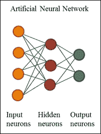

图 9:人工神经网络

神经网络的优势在于:首先，它可以检测因变量和自变量之间的非线性关系。第二，可以使用并行架构有效地训练大型数据集。第三，它是非参数模型，因此可以消除参数估计中的误差。神经网络的主要缺点是它经常收敛到局部最小值而不是全局最小值。此外，当训练过程持续太长时间时，它可能会过度适应。

在这份食谱中，我们演示了如何训练神经网络。首先，我们将`iris`数据集分成训练和测试数据集，然后安装`neuralnet`包并将库加载到 R 会话中。接下来，我们根据`Species`列中的名称匹配值分别添加`versicolor`、`setosa`和`virginica`列。然后，我们使用`neuralnet`函数来训练网络模型。除了在函数中指定标签(名称等于 versicolor、virginica 和 setosa 的列)和训练属性之外，我们还在每层中将隐藏神经元(顶点)的数量配置为三个。

然后，我们检查网络中保存的关于训练过程和被训练网络的基本信息。根据输出消息，它显示训练过程需要 11，063 个步骤，直到误差函数的所有绝对偏导数都低于 0.01(在阈值中指定)。误差是指计算**阿凯克信息准则** ( **AIC** )的可能性。要查看这方面的详细信息，您可以访问内置神经网络的`result.matrix`来查看估计的重量。输出显示估计的重量范围从-18 到 24.40；第一隐层的截距为 1.69、1.41 和 24.40，通向第一隐神经元的两个权重估计为 0.95 ( `Sepal.Length`)、-7.22 ( `Sepal.Width`)、1.79 ( `Petal.Length`)和 9.94 ( `Petal.Width`)。我们最后可以确定，训练的神经网络信息包括广义权重，它表示每个协变量的影响。在该配方中，模型生成 12 个广义权重，它们是对三个响应(`setosa`、`virginica`、`versicolor`)的四个协变量(`Sepal.Length`、`Sepal.Width`、`Petal.Length`、`Petal.Width`)的组合。


## 亦见

*   有关 neuralnet 的更详细介绍，可以参考以下论文:Günther，f .和 Fritsch，S. (2010)。 *neuralnet:训练神经网络*。*R 期刊*，2 卷 1 期，第 30-38 页。


# 可视化由 neuralnet 训练的神经网络

包`neuralnet`为提供了`plot`函数来可视化已构建的神经网络，以及`gwplot`函数来可视化广义权重。在下面的食谱中，我们将介绍如何使用这两个功能。


## 做好准备

你需要通过训练一个神经网络来完成前面的食谱，并且将所有的基本信息保存在网络中。


## 如何去做...

执行以下步骤来可视化神经网络和广义权重:

1.  You can visualize the trained neural network with the `plot` function:

    ```
    > plot(network)

    ```

    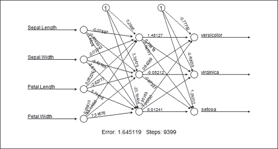

    图 10:训练好的神经网络图

2.  Furthermore, you can use `gwplot` to visualize the generalized weights:

    ```
    > par(mfrow=c(2,2))
    > gwplot(network,selected.covariate="Petal.Width")
    > gwplot(network,selected.covariate="Sepal.Width")
    > gwplot(network,selected.covariate="Petal.Length")
    > gwplot(network,selected.covariate="Petal.Width")

    ```

    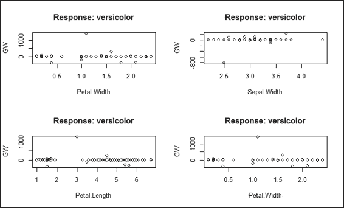

    图 11:广义权重图


## 工作原理...

在这个配方中，我们演示了如何可视化经过训练的神经网络和每个经过训练的属性的广义权重。根据*图 10* ，该图显示了训练好的神经网络的网络拓扑。此外，该图包括估计重量，截距和训练过程的基本信息。在图的底部，可以找到收敛所需的总误差和步骤数。

*图 11* 显示了关于`network$generalized.weights`的广义重量图。图 11 中*的四个图显示了关于杂色反应的四个协变量:`Petal.Width`、`Sepal.Width`、`Petal.Length`和`Petal.Width`。如果图上所有的广义权重都接近于零，这意味着协变量几乎没有影响。然而，如果总方差大于 1，这意味着协变量具有非线性效应。*


## 亦见

*   关于`gwplot`的更多信息，可以使用`help`功能访问以下文件:

    ```
     > ?gwplot 
    ```


# 基于神经网络训练的模型预测标签

类似于其他分类方法，我们可以基于训练好的神经网络来预测新观测值的标签。此外，我们可以通过使用混淆矩阵来验证这些网络的性能。在下面的食谱中，我们将介绍如何在神经网络中使用`compute`函数来获得测试数据集标签的概率矩阵，并使用表和混淆矩阵来测量预测性能。


## 做好准备

您需要通过生成训练数据集`trainset`和测试数据集`testset`来完成前面的配方。训练好的神经网络需要保存在网络中。


## 如何做到这一点...

执行以下步骤来测量已训练的神经网络的预测性能:

1.  首先，基于训练好的神经网络和测试数据集生成预测概率矩阵，`testset` :

    ```
     > net.predict = compute(network, testset[-5])$net.result 
    ```

2.  然后，通过寻找概率最大的列获得其他可能的标签:

    ```
     > net.prediction = c("versicolor", "virginica", "setosa")[apply(net.predict, 1, which.max)] 
    ```

3.  根据预测标签和测试数据集的标签生成分类表:

    ```
     > predict.table = table(testset$Species, net.prediction) > predict.table             prediction              setosa versicolor virginica   setosa         20          0         0   versicolor      0         19         1   virginica       0          2        16 
    ```

4.  接下来，从分类表:

    ```
     > classAgreement(predict.table) $diag [1] 0.9444444444  $kappa [1] 0.9154488518  $rand [1] 0.9224318658  $crand [1] 0.8248251737 
    ```

    中生成`classAgreement`
5.  最后，用 `confusionMatrix`到来衡量预测性能:

    ```
     > confusionMatrix(predict.table) Confusion Matrix and Statistics              prediction              setosa versicolor virginica   setosa         20          0         0   versicolor      0         19         1   virginica       0          2        16  Overall Statistics                 Accuracy : 0.9482759                                 95% CI : (0.8561954, 0.9892035)       No Information Rate : 0.362069                     P-Value [Acc > NIR] : < 0.00000000000000022204                    Kappa : 0.922252                  Mcnemar's Test P-Value : NA                        Statistics by Class:                       Class: setosa Class: versicolor Class: virginica Sensitivity              1.0000000         0.9047619        0.9411765 Specificity              1.0000000         0.9729730        0.9512195 Pos Pred Value           1.0000000         0.9500000        0.8888889 Neg Pred Value           1.0000000         0.9473684        0.9750000 Prevalence               0.3448276         0.3620690        0.2931034 Detection Rate           0.3448276         0.3275862        0.2758621 Detection Prevalence     0.3448276         0.3448276        0.3103448 Balanced Accuracy        1.0000000         0.9388674        0.9461980 
    ```


## 工作原理...

在这个食谱中，我们展示了如何基于由 neuralnet 训练的模型来预测标签。最初，我们使用`compute`函数根据训练好的神经网络和测试数据集创建一个输出概率矩阵。然后，为了将概率矩阵转换成类别标签，我们使用`which.max`函数通过选择行中具有最大概率的列来确定类别标签。接下来，我们使用一个表来基于测试数据集的标签和预测标签生成分类矩阵。因为我们已经创建了分类表，所以我们可以使用混淆矩阵来测量所建立的神经网络的预测性能。


## 参见

*   在这个方法中，我们使用`net.result`函数，它是神经网络的整体结果，用于预测测试数据集的标签。除了通过访问`net.result`检查整体结果外，`compute`函数还生成每层神经元的输出。你可以检查神经元的输出来更好地理解`compute`是如何工作的:

    ```
     > compute(network, testset[-5]) 
    ```


# 用神经网络训练神经网络

`nnet`包是另一个可以处理人工神经网络的包。这个包提供了用传统的反向传播训练前馈神经网络的功能。正如你可以在`neuralnet`包中找到大部分实现的神经网络功能，在这个食谱中，我们提供了一个如何用`nnet`训练神经网络的简短概述。


## 做好准备

在这个配方中，我们不使用上一步生成的`trainset`和`trainset`；请再次重新加载`iris`数据集。


## 怎么做...

执行以下步骤，用`nnet`训练神经网络:

1.  首先安装并加载`nnet`包:

    ```
     > install.packages("nnet") > library(nnet) 
    ```

2.  接下来，将数据集分成训练数据集和测试数据集:

    ```
     > data(iris) > set.seed(2) > ind = sample(2, nrow(iris), replace = TRUE, prob=c(0.7, 0.3)) > trainset = iris[ind == 1,] > testset = iris[ind == 2,] 
    ```

3.  然后，用`nnet` :

    ```
     > iris.nn = nnet(Species ~ ., data = trainset, size = 2, rang = 0.1, decay = 5e-4, maxit = 200) # weights:  19 initial  value 165.086674  iter  10 value 70.447976 iter  20 value 69.667465 iter  30 value 69.505739 iter  40 value 21.588943 iter  50 value 8.691760 iter  60 value 8.521214 iter  70 value 8.138961 iter  80 value 7.291365 iter  90 value 7.039209 iter 100 value 6.570987 iter 110 value 6.355346 iter 120 value 6.345511 iter 130 value 6.340208 iter 140 value 6.337271 iter 150 value 6.334285 iter 160 value 6.333792 iter 170 value 6.333578 iter 180 value 6.333498 final  value 6.333471  converged 
    ```

    训练神经网络
4.  使用中的`summary`到获取训练好的神经网络的信息:

    ```
     > summary(iris.nn) a 4-2-3 network with 19 weights options were - softmax modelling  decay=0.0005  b->h1 i1->h1 i2->h1 i3->h1 i4->h1   -0.38  -0.63  -1.96   3.13   1.53   b->h2 i1->h2 i2->h2 i3->h2 i4->h2    8.95   0.52   1.42  -1.98  -3.85   b->o1 h1->o1 h2->o1    3.08 -10.78   4.99   b->o2 h1->o2 h2->o2   -7.41   6.37   7.18   b->o3 h1->o3 h2->o3    4.33   4.42 -12.16  
    ```


## 工作原理...

在这个食谱中，我们展示了用`nnet`软件包训练神经网络模型的步骤。我们先用`nnet`来训练神经网络。通过该功能，我们可以在`size`参数中设置分类公式、数据来源、隐藏单元数、`rang`参数中设置初始随机权重、`decay`参数中设置权重衰减参数、`maxit`参数中设置最大迭代次数。当我们将`maxit`设置为 200 时，训练过程重复运行，直到拟合标准加上衰减项的值收敛。最后，我们使用`summary`函数来获得关于所构建的神经网络的信息，这揭示了该模型是由具有 19 个权重的 4-2-3 网络构建的。此外，该模型在打印消息的底部显示了从一个节点到另一个节点的权重转换列表。


## 参见

对`nnet`的背景理论以及如何制作感兴趣的可以参考以下文章:

*   Ripley，B. D. (1996) *模式识别和神经网络*。剑桥
*   维纳布尔斯和里普利博士(2002 年)。*现代应用统计学第四版*。起拱石


# 基于由 nnet 训练的模型预测标签

由于我们在之前的配方中已经用`nnet`训练了一个神经网络，我们现在可以根据训练好的神经网络预测测试数据集的标签。此外，我们可以使用从`caret`包中改编的混淆矩阵来评估模型。


## 准备就绪

您需要通过从`iris`数据集生成训练数据集`trainset`和测试数据集`testset`来完成前面的配方。训练好的神经网络也需要保存为`iris.nn`。


## 怎么做...

执行以下步骤，根据训练好的神经网络预测标签:

1.  基于模型生成测试数据集的预测，`iris.nn` :

    ```
     > iris.predict = predict(iris.nn, testset, type="class") 
    ```

2.  根据预测标签和测试数据集标签生成分类表:

    ```
     > nn.table = table(testset$Species, iris.predict)             iris.predict              setosa versicolor virginica   setosa         17          0         0   versicolor      0         14         0   virginica       0          1        14 
    ```

3.  最后，根据分类表

    ```
     > confusionMatrix(nn.table) Confusion Matrix and Statistics              iris.predict              setosa versicolor virginica   setosa         17          0         0   versicolor      0         14         0   virginica       0          1        14  Overall Statistics                 Accuracy : 0.9782609                                 95% CI : (0.8847282, 0.9994498)       No Information Rate : 0.3695652                    P-Value [Acc > NIR] : < 0.00000000000000022204                    Kappa : 0.9673063                 Mcnemar's Test P-Value : NA                        Statistics by Class:                       Class: setosa Class: versicolor Sensitivity              1.0000000         0.9333333 Specificity              1.0000000         1.0000000 Pos Pred Value           1.0000000         1.0000000 Neg Pred Value           1.0000000         0.9687500 Prevalence               0.3695652         0.3260870 Detection Rate           0.3695652         0.3043478 Detection Prevalence     0.3695652         0.3043478 Balanced Accuracy        1.0000000         0.9666667                      Class: virginica Sensitivity                 1.0000000 Specificity                 0.9687500 Pos Pred Value              0.9333333 Neg Pred Value              1.0000000 Prevalence                  0.3043478 Detection Rate              0.3043478 Detection Prevalence        0.3260870 Balanced Accuracy           0.9843750 
    ```

    生成一个混淆矩阵


## 工作原理...

与其他分类方法类似，也可以根据`nnet`训练的神经网络预测标签。首先，我们使用`predict`函数根据测试数据集`testset`生成预测标签。在`predict`函数中，我们为类指定了`type`参数，因此输出将是类标签而不是概率矩阵。接下来，我们使用`table`函数根据预测的标签和测试数据集中写入的标签生成一个分类表。最后，由于我们已经创建了分类表，我们可以使用来自`caret`包的混淆矩阵来测量训练好的神经网络的预测性能。


## 参见

*   对于`predict`函数，如果没有指定`class`的`type`参数，默认情况下会生成一个概率矩阵作为预测结果，这与`neuralnet`包中的`compute`函数生成的`net.result`非常相似:

    ```
     > head(predict(iris.nn, testset)) 
    ```