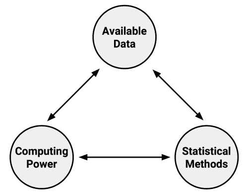
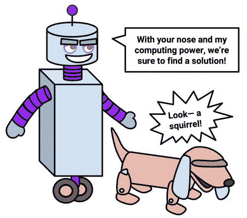
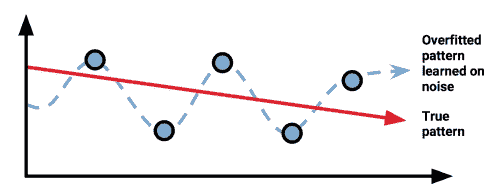
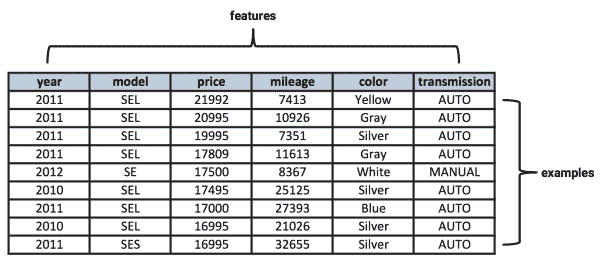

# 第一章。机器学习简介

如果科幻小说是可信的，人工智能的发明不可避免地导致了机器和它们的制造者之间的末日战争。在早期阶段，计算机被教会玩简单的井字游戏和国际象棋。后来，机器被赋予交通灯和通信的控制权，随后是军用无人机和导弹。一旦计算机变得有意识并学会如何自学，机器的进化就会发生不祥的转折。不再需要人类程序员，人类就被“删除”了

幸运的是，在撰写本文时，机器仍然需要用户输入。

尽管你对机器学习的印象可能会受到这些大众媒体描述的影响，但今天的算法过于特定于应用，不会带来任何自我意识的危险。今天机器学习的目标不是创造一个人工大脑，而是帮助我们理解世界上的海量数据存储。

抛开流行的误解，到本章结束时，你会对机器学习有更细致入微的理解。还将向您介绍定义和区分最常用的机器学习方法的基本概念。

您将了解到:

*   机器学习的起源和实际应用
*   计算机如何将数据转化为知识和行动
*   如何将机器学习算法与您的数据相匹配

机器学习领域提供了一套将数据转化为可操作知识的算法。继续阅读，看看使用 R 开始将机器学习应用于现实世界的问题是多么容易。

# 机器学习的起源

自出生以来，我们就被淹没在的数据中。我们身体的传感器——眼睛、耳朵、鼻子、舌头和神经——不断受到原始数据的攻击，我们的大脑将这些原始数据转化为视觉、听觉、嗅觉、味觉和纹理。使用语言，我们能够与他人分享这些经历。

从文字语言出现开始，人类的观察就被记录下来了。猎人监测动物群的移动，早期的天文学家记录行星和恒星的排列，城市记录纳税、出生和死亡。今天，这样的观察以及更多的观察越来越自动化，并系统地记录在不断增长的计算机化数据库中。

电子传感器的发明还促进了记录数据的数量和丰富性的爆炸。专门的传感器看、听、闻、尝和感觉。这些传感器处理数据的方式与人类截然不同。与人类有限的主观注意力不同，电子传感器从不休息，也不会让其判断扭曲其感知。

### 提示

尽管传感器不受主观性的影响，但它们并不一定能报告对现实的单一、确定的描述。由于硬件限制，一些具有固有的测量误差。其他的则受限于它们的范围。一张黑白照片比一张彩色照片提供了不同的主题描述。同样，显微镜提供了与望远镜截然不同的现实描述。

在数据库和传感器之间，记录了我们生活的很多方面。政府、企业和个人都在记录和报告信息，从重大的到平凡的。天气传感器记录温度和压力数据，监控摄像头监视人行道和地铁隧道，所有形式的电子行为都受到监控:交易、通信、友谊和许多其他行为。

这种数据洪流让一些人认为我们已经进入了一个大数据时代，但这可能有点用词不当。人类一直被大量的数据包围着。当前这个时代的独特之处在于，我们有大量的*记录的*数据，其中大部分可以由计算机直接访问。更大、更有趣的数据集越来越触手可及，只需一次网络搜索。这些丰富的信息有可能为行动提供信息，只要有一种系统的方式来理解所有这些信息。

对开发将数据转化为智能行为的计算机算法感兴趣的研究领域是被称为**机器学习**的。这个领域起源于一个可用数据、统计方法和计算能力同时快速发展的环境。数据的增长需要额外的计算能力，这反过来又刺激了分析大型数据集的统计方法的发展。这创造了一个进步的循环，允许收集更多更有趣的数据。



机器学习的一个密切相关的兄弟，**数据挖掘**，关注于从大型数据库中产生新颖的见解。顾名思义，数据挖掘包括系统地搜寻有价值的情报。尽管对于机器学习和数据挖掘在多大程度上重叠存在一些分歧，但一个潜在的区别点是，机器学习专注于教会计算机如何使用数据来解决问题，而数据挖掘专注于教会计算机识别人类然后用来解决问题的模式。

几乎所有的数据挖掘都涉及到机器学习的使用，但并不是所有的机器学习都涉及到数据挖掘。例如，您可以应用机器学习对汽车交通数据进行数据挖掘，寻找与事故率相关的模式；另一方面，如果计算机正在学习如何自己驾驶汽车，这纯粹是没有数据挖掘的机器学习。

### 提示

短语“数据挖掘”有时也被用作贬义词，用来描述挑选数据来支持理论的欺骗性行为。


# 机器学习的使用和滥用

大多数人都听说过国际象棋计算机**深蓝**——第一个赢得与世界冠军比赛的计算机——或者**沃森**——在电视问答游戏节目《危险边缘》中击败两名人类对手的计算机。基于这些惊人的成就，一些人推测，计算机智能将在许多信息技术职业中取代人类，就像机器在田间取代人类，机器人在装配线上取代人类一样。

事实是，即使机器达到了如此令人印象深刻的里程碑，它们彻底理解问题的能力仍然相对有限。他们是没有方向的纯智力马力。计算机可能比人更有能力在大型数据库中找到微妙的模式，但它仍然需要人来激励分析并将结果转化为有意义的行动。

机器不擅长提问，甚至不知道该问什么问题。如果问题是以计算机能够理解的方式陈述的话，他们在回答这些问题方面要好得多。当今的机器学习算法与人合作，就像猎犬与它的训练员合作一样；狗的嗅觉可能比它的主人强很多倍，但如果没有仔细的指导，猎犬可能会最终追逐它的尾巴。



为了更好地理解机器学习在现实世界中的应用，我们现在将考虑一些它已经成功使用的情况，一些它仍有改进空间的地方，以及一些它可能弊大于利的情况。

## 机器学习的成功

当机器学习增加而不是取代主题专家的专业知识时，它是最成功的。它与战斗在消灭癌症最前线的医生合作，协助工程师和程序员努力创造更智能的家庭和汽车，并帮助社会科学家建立社会如何运作的知识。为了达到这些目的，它被无数的企业、科学实验室、医院和政府机构所采用。任何生成或聚合数据的组织都可能使用至少一种机器学习算法来帮助理解这些数据。

虽然不可能列出机器学习的所有用例，但对最近成功案例的调查包括几个突出的应用:

*   识别电子邮件中不受欢迎的垃圾邮件
*   针对目标广告的客户行为细分
*   天气行为和长期气候变化的预测
*   减少欺诈性信用卡交易
*   风暴和自然灾害经济损失的精算估计
*   对大选结果的预测
*   自动驾驶无人机和自动驾驶汽车的算法开发
*   优化家庭和办公楼的能源使用
*   预测最有可能发生犯罪活动的地区
*   发现与疾病相关的基因序列

到本书结束时，你将理解用来教计算机执行这些任务的基本机器学习算法。现在，可以说，无论上下文是什么，机器学习过程都是相同的。不管任务是什么，算法都会获取数据并识别出形成进一步行动基础的模式。

## 机器学习的极限

虽然机器学习应用广泛，潜力巨大，但了解它的局限性还是很重要的。目前，机器学习无论如何都无法替代人脑。除了所学的严格参数之外，它几乎没有什么灵活性来进行推断，也不知道任何常识。考虑到这一点，在将算法应用于现实世界之前，应该非常小心地认识到它到底学到了什么。

没有一生的过去经验作为基础，计算机在对逻辑下一步进行简单常识性推理的能力上也是有限的。以许多网站上看到的横幅广告为例。基于通过对数百万用户的浏览历史进行数据挖掘而学习到的模式，可以提供这些服务。根据这一数据，浏览卖鞋网站的人应该会看到鞋的广告，浏览床垫网站的人应该会看到床垫的广告。问题是，这变成了一个永无止境的循环，在这个循环中，更多的鞋子或床垫广告，而不是鞋带和鞋油，或者床单和毯子的广告。

许多人都熟悉机器学习在理解或翻译语言或识别语音和笔迹方面的不足。这种失败的最早例子可能是在 1994 年的一集电视节目《T2》中，该节目展示了对苹果牛顿平板电脑的模仿。在当时，牛顿以其最先进的手写识别而闻名。不幸的是，对于苹果来说，它偶尔会失败。电视节目通过一个序列说明了这一点，在这个序列中，一个恶霸对**殴打马丁**的笔记被牛顿误解为**吃掉玛莎**，如以下截图所示:


截图自 20 世纪福克斯公司 1994 年出品的《辛普森一家》

自 1994 年以来，机器理解语言的能力已经有了足够的提高，以至于谷歌、苹果和微软都有足够的信心提供通过语音识别操作的虚拟礼宾服务。尽管如此，即使是这些服务也总是难以回答相对简单的问题。更有甚者，在线翻译服务有时会曲解一个蹒跚学步的孩子容易理解的句子。许多设备上的预测文本功能也导致了许多幽默的*自动更正失败*网站，这些网站说明了计算机理解基本语言但完全误解上下文的能力。

毫无疑问，其中一些错误是可以预料到的。语言是复杂的，有多层文本和潜台词，甚至人类有时会错误地理解上下文。也就是说，机器中的这些类型的故障说明了一个重要的事实，即机器学习只取决于它从中学习的数据。如果上下文没有直接隐含在输入数据中，那么就像人一样，计算机将不得不做出最佳猜测。

## 机器学习伦理

从本质上讲，机器学习只是一个帮助我们理解世界复杂数据的工具。像任何工具一样，它可以用来行善或作恶。当机器学习被广泛或无情地应用时，它可能会导致问题，以至于人类被视为实验室老鼠、自动机或无脑消费者。一个看似无害的过程被一台没有感情的电脑自动化后，可能会导致意想不到的后果。出于这个原因，那些使用机器学习或数据挖掘的人如果不考虑这项技术的伦理含义，那将是失职。

由于机器学习作为一门学科相对年轻，而且发展速度很快，相关的法律问题和社会规范往往非常不确定，并且不断变化。获取或分析数据时应小心谨慎，以避免违反法律、违反服务条款或数据使用协议、滥用信任或侵犯客户或公众的隐私。

### 提示

谷歌是一家收集个人信息最多的公司，其非正式的企业格言是“不要作恶”。虽然这看起来很清楚，但可能还不够。一个更好的方法可能是遵循希波克拉底誓言，一个声明“最重要的是，不要伤害”的医学原则。

零售商通常将机器学习用于广告、有针对性的促销、库存管理或商店中的商品布局。许多商店甚至在收银台配备了根据顾客购买历史打印促销优惠券的设备。作为对一点个人数据的交换，顾客在他或她想要购买的特定产品上得到折扣。起初，这似乎相对无害。但是考虑一下当这种实践进一步发展时会发生什么。

一个可能是虚构的故事涉及美国一家大型零售商，该零售商利用机器学习来识别优惠券邮件中的孕妇。这家零售商希望，如果这些准妈妈们得到大幅折扣，她们会成为忠诚的顾客，以后会购买有利可图的商品，如尿布、婴儿配方奶粉和玩具。

该零售商配备了机器学习方法，可以识别客户购买历史中的项目，这些项目可以用来高度确定地预测女性是否怀孕，以及婴儿预产期的大致时间。

在零售商将这些数据用于促销邮件后，一名愤怒的男子联系了该连锁店，并要求知道为什么他十几岁的女儿会收到孕妇用品的优惠券。他对零售商似乎在鼓励少女怀孕感到愤怒！据说，当这家零售连锁店的经理打电话来道歉时，最终道歉的是这位父亲，因为在面对他的女儿后，他发现她确实怀孕了！

无论完全正确与否，从前面的故事中吸取的教训是，在盲目应用机器学习分析的结果之前，应该应用常识。在涉及健康数据等敏感信息的情况下尤其如此。如果稍微小心一点，零售商可以预见到这种情况，并在选择如何揭示其机器学习分析发现的模式时使用更大的酌处权。

出于商业原因，某些司法管辖区可能会阻止您使用种族、民族、宗教或其他受保护类别的数据。请记住，从您的分析中排除这些数据可能还不够，因为机器学习算法可能会无意中独立地学习这些信息。例如，如果某一部分人通常生活在某一地区，购买某一产品，或者以某种方式表现为唯一地将他们识别为一个群体，一些机器学习算法可以从这些其他因素中推断出受保护的信息。在这种情况下，除了受保护的信息之外，您可能需要通过排除任何潜在的*T2 识别数据来完全“去识别”这些人。*

除了法律后果，不恰当地使用数据可能会伤害底线。如果顾客认为是隐私的生活方面被公开，他们可能会感到不舒服或受到惊吓。近年来，一些备受瞩目的网络应用程序经历了用户的大规模流失，当应用程序的服务协议条款改变时，他们感到受到了剥削，他们的数据被用于超出用户最初同意的目的。事实上，隐私期望因环境、年龄组和地点而异，这增加了决定个人数据的适当使用的复杂性。在开始你的项目之前，考虑你的工作的文化含义是明智的。

### 提示

你*可以*为特定目的使用数据并不总是意味着你*应该*。


# 机器如何学习

由计算机科学家 Tom M. Mitchell 提出的机器学习的正式定义指出，只要机器能够利用它的经验，它的性能就会在未来类似的经验上有所提高。尽管这个定义很直观，但它完全忽略了经验如何转化为未来行动的过程——当然，学习总是说起来容易做起来难！

虽然人类大脑天生具有学习能力，但计算机学习的必要条件必须明确。由于这个原因，尽管理解学习的理论基础不是严格必要的，但是这个基础有助于理解、区分和实现机器学习算法。

### 提示

当你比较机器学习和人类学习时，你可能会发现自己在以不同的方式审视自己的思维。

不管学习者是人还是机器，基本的学习过程都是相似的。它可以分为四个相互关联的部分:

*   **数据存储**利用观察、记忆和回忆为进一步推理提供事实依据。
*   **抽象** 涉及将存储的数据转换成更广泛的表示和概念。
*   **概括**使用抽象的数据来创建知识和推理，从而在新的环境中推动行动。
*   **评估**提供了一种反馈机制来衡量所学知识的效用，并告知潜在的改进。

下图说明了学习过程中的步骤:


请记住，虽然学习过程被概念化为四个不同的组成部分，但它们的组织方式只是为了说明的目的。事实上，整个学习过程是密不可分的。对人类来说，这个过程是下意识发生的。我们用心灵之眼的范围回忆、推断、归纳和直觉，因为这个过程是隐藏的，人与人之间的任何差异都归因于模糊的主观性概念。相比之下，使用计算机，这些过程是显而易见的，因为整个过程是透明的，所学的知识可以被检查、转移和用于未来的行动。

## 数据存储

所有的学习都必须从数据开始。人类和计算机一样利用**数据存储**作为更高级推理的基础。在人类中，这包括一个大脑，它使用生物细胞网络中的电化学信号来存储和处理观察结果，以供短期和长期的未来回忆。使用硬盘驱动器、闪存和随机存取存储器(RAM)结合中央处理器(CPU)，计算机具有类似的短期和长期回忆能力。

这么说似乎是显而易见的，但是光有存储和检索数据的能力对于学习来说是不够的。如果没有更高层次的理解，知识只限于回忆，也就是说只限于以前看到的东西，没有别的。磁盘上的数据仅仅是 1 和 0。它们是储存的记忆，没有更广泛的意义。

为了更好地理解这个想法的细微差别，回想一下你上一次为一个困难的考试而学习可能会有所帮助，也许是为了一个大学期末考试或者一个职业认证。你希望有一个清晰的记忆吗？如果是这样，你可能会失望地发现，完美的回忆不太可能有多大帮助。即使你能完美地记住材料，你的死记硬背也是没有用的，除非你事先知道考试中会出现的确切问题和答案。否则，你会陷入试图记住所有可能被问到的问题的答案的困境。显然，这是一个不可持续的战略。

相反，一个更好的方法是有选择地花时间，记忆一小组有代表性的想法，同时制定关于想法如何关联以及如何使用存储信息的策略。这样，大的想法就可以理解，而不需要死记硬背。

## 抽象

这种给存储数据赋予意义的工作发生在 **抽象**过程中，在这个过程中，原始数据变得具有更抽象的意义。这种类型的联系，比如说一个物体和它的表象之间的联系，在著名的勒内·马格里特的油画*中得到体现:*


资料来源:http://collections.lacma.org/node/239578

这幅画描绘了一个烟斗，标题为*颜后君不是烟斗*(“这不是烟斗”)。马格里特要说明的要点是，管道的表示并不是真正的管道。然而，尽管这个烟斗不是真的，任何人看到这幅画都很容易认出它是一个烟斗。这表明观察者的头脑能够将烟斗的*图片*与烟斗的*想法*联系起来，与可以握在手中的*物理*烟斗的记忆联系起来。像这样的抽象联系是知识表示的基础，逻辑结构的形成有助于将原始的感官信息转化为有意义的洞察力。

在机器的知识表示过程中，计算机使用一个 **模型**总结存储的原始数据，该模型是数据中模式的明确描述。就像马格里特的烟斗一样，模型表现呈现出超越原始数据的生命。它代表了一个远大于其各部分总和的理念。

有许多不同类型的模型。你可能已经熟悉了一些。例子包括:

*   数学方程式
*   关系图，如树和图
*   逻辑 if/else 规则
*   称为聚类的数据分组

型号的选择通常不由机器决定。相反，学习任务和手头的数据通知模型选择。在本章的后面，我们将更详细地讨论选择模型类型的方法。

将模型与数据集拟合的过程被称为**训练**。当模型被训练后，数据被转换成概括原始信息的抽象形式。

### 提示

你可能想知道为什么这一步被称为训练而不是学习。首先，注意学习的过程并没有随着数据抽象而结束；学习者仍然必须概括和评估其训练。第二，训练这个词更好地暗示了人类教师训练机器学生以特定的方式理解数据的事实。

值得注意的是，一个已学习的模型本身不会提供新的数据，但它会产生新的知识。怎么会这样呢？答案是，通过假设一个关于数据元素如何相关的概念，在底层数据上强加一个假设的结构可以洞察未知。以重力的发现为例。艾萨克·牛顿爵士通过将方程与观测数据进行拟合，推断出了引力的概念。但是我们现在知道的引力总是存在的。直到牛顿认识到它是一个将一些数据与其他数据联系起来的抽象概念——具体来说，是通过成为一个解释落体观测的模型中的 *g* 项——它才被认识到。


大多数模型可能不会导致动摇科学思想几个世纪的理论的发展。尽管如此，你的模型可能会发现数据之间以前看不到的关系。根据基因组数据训练的模型可能会发现几个基因，当这些基因组合在一起时，会导致糖尿病的发作；银行可能会发现一种看似无害的交易，这种交易在欺诈活动之前会有系统地出现；心理学家可能会识别出预示新疾病的人格特征组合。这些潜在的模式总是存在的，但是通过简单地以不同的格式呈现信息，一个新的想法就被概念化了。

## 泛化

直到学习者能够将抽象的知识用于未来的行动，学习过程才算完成。然而，在抽象过程中可能被识别的无数潜在模式和无数建模这些模式的方式中，一些会比另一些更有用。除非抽象概念的产生受到限制，否则学习者将无法继续下去。它会停留在开始的地方—有大量的信息，但没有可操作的洞察力。

术语**概括**描述了将抽象的知识转化为一种形式的过程，这种形式可以用于未来的行动，这些行动与之前看到的任务相似，但不完全相同。概括是一个有点模糊的过程，有点难以描述。传统上，它被想象成对整个模型集(即理论或推论)的搜索，这些模型可以在训练中抽象出来。换句话说，如果你能想象出一个假设集，其中包含了从数据中可以建立起来的所有可能的理论，那么概括就是把这个集简化成数量可控的重要发现。

概括地说，学习者的任务是将发现的模式限制在与未来任务最相关的模式。一般来说，通过逐个检查模式并根据未来效用对它们进行排序来减少模式的数量是不可行的。相反，机器学习算法通常采用快捷方式来更快地缩小搜索空间。为此，算法将采用**试探法**，这是关于在哪里找到最有用的推论的有根据的猜测。

### 提示

因为试探法利用近似法和其他经验法则，它们不能保证找到单一的最佳模型。然而，如果不走这些捷径，在大型数据集中找到有用的信息是不可行的。

试探法通常被人类用来快速地将经验归纳到新的场景中。如果你曾经在充分评估你的环境之前利用你的直觉做出一个快速的决定，你是在直觉上使用精神启发法。

令人难以置信的人类快速决策的能力通常不依赖于类似计算机的逻辑，而是依赖于由情绪引导的启发式。有时，这会导致不合逻辑的结论。例如，与汽车旅行相比，更多的人表达了对航空旅行的恐惧，尽管从统计数据来看汽车更危险。这可以用可用性启发法来解释，可用性启发法是人们通过回忆某个事件的例子的难易程度来估计该事件发生的可能性的倾向。涉及航空旅行的事故被大肆宣传。作为创伤性事件，它们很容易被回忆起来，而车祸几乎不值得在报纸上提及。

误用试探法的愚蠢不仅限于人类。机器学习算法采用的试探法有时也会导致错误的结论。如果结论是系统错误的，或者是以可预测的方式错误的，那么该算法被称为具有**偏差**。

例如，假设一个机器学习算法通过找到两个代表眼睛的黑色圆圈来学习识别人脸，这两个圆圈位于指示嘴巴的直线上方。然后，算法可能会遇到麻烦，或者*对*不符合其模型的面部产生偏见。该算法可能无法检测到戴眼镜、倾斜、侧视或肤色不同的人脸。同样，它也可能是*偏向于*脸，有某些肤色、脸型，或者其他不符合它对世界理解的特征。


在现代用法中，bias 这个词已经带有相当负面的含义。各种形式的媒体经常声称没有偏见，并声称客观地报道事实，不受情绪的影响。尽管如此，考虑一下一点点偏见可能是有用的可能性。如果没有一点随意性，在几个竞争的选择中做出决定会不会有点困难，每个选择都有明显的优势和劣势？事实上，心理学领域最近的一些研究表明，大脑中负责情绪的部分天生受损的人在决策方面效率低下，可能会花几个小时来争论简单的决定，如穿什么颜色的衬衫或在哪里吃午餐。矛盾的是，偏见让我们看不到一些信息，同时也允许我们利用其他信息采取行动。这是机器学习算法如何在无数种理解一组数据的方法中进行选择。

## 评价

偏见是任何学习任务中固有的与抽象和概括过程相关的必然邪恶。为了在无限的可能性面前推动行动，每个学习者都必须有特定的偏见。因此，每个学习者都有自己的弱点，没有单一的学习算法可以解决所有的问题。因此，归纳过程的最后一步是**评估**或衡量学习者的成功，尽管存在偏差，并在需要时使用这些信息通知额外的培训。

### 提示

一旦你在一种机器学习技术上取得了成功，你可能会想把它应用到任何事情上。抵制这种诱惑很重要，因为没有一种机器学习方法是适合所有情况的。这个事实由大卫·沃伯特在 1996 年提出的“没有免费的午餐”定理描述。欲了解更多信息，请访问:[http://www.no-free-lunch.org](http://www.no-free-lunch.org)。

通常，评估发生在模型已经在初始训练数据集上被训练之后。然后，在新的测试数据集上评估该模型，以判断其对训练数据的表征在多大程度上推广到新的、看不见的数据。值得注意的是，一个模型完美地概括每一个不可预见的情况是极其罕见的。

在某种程度上，由于**噪音**的问题，模型无法完美地概括，噪音是一个描述数据中无法解释或无法解释的变化的术语。噪声数据是由看似随机的事件引起的，例如:

*   由于不精确的传感器造成的测量误差，有时会从读数中增加或减去一点
*   人类受试者的问题，例如调查回答者报告调查问题的随机答案，以便更快地完成
*   数据质量问题，包括缺失、空、截断、编码错误或损坏的值
*   如此复杂或鲜为人知的现象会以看似不系统的方式影响数据

试图模拟噪声是一个叫做**过拟合**的问题的基础。因为大多数噪声数据根据定义是无法解释的，试图解释噪声将导致错误的结论，不能很好地推广到新的情况。解释噪音的努力通常也会导致更复杂的模型，这些模型会错过学习者试图识别的真正模式。一个在训练期间表现良好，但在评估期间表现不佳的模型被称为过度适合训练数据集，因为它不能很好地推广到测试数据集。



过度拟合问题的解决方案特定于特定的机器学习方法。目前，重要的一点是要意识到这个问题。这些模型处理噪声数据的能力是它们之间区别的一个重要来源。


# 实践中的机器学习

到目前为止，我们已经关注了机器学习在理论上是如何工作的。为了将学习过程应用到现实世界的任务中，我们将使用一个五步过程。不管手头的任务是什么，任何机器学习算法都可以通过以下步骤来部署:

1.  **数据收集**:数据收集步骤包括收集学习材料，一个算法将使用这些材料生成可操作的知识。在大多数情况下，数据需要合并到一个单一的源中，如文本文件、电子表格或数据库。
2.  **数据探索和准备**:任何机器学习项目的质量很大程度上基于其输入数据的质量。因此，在名为数据探索的实践中，了解更多关于数据及其细微差别是很重要的。需要额外的工作来为学习过程准备数据。这包括修复或清理所谓的“杂乱”数据，消除不必要的数据，并重新编码数据以符合学习者的预期输入。
3.  **模型训练**:在数据准备好进行分析的时候，你可能已经意识到你能够从数据中学到什么。所选择的特定机器学习任务将通知选择适当的算法，并且该算法将以模型的形式表示数据。
4.  **模型评估**:因为每个机器学习模型都会导致对学习问题的有偏解，所以评估算法从其经验中学习的程度很重要。根据所用模型的类型，您可能能够使用测试数据集来评估模型的准确性，或者您可能需要开发特定于预期应用程序的性能度量。
5.  **车型改进**:如果需要更好的性能，就有必要利用更先进的策略来增强车型的性能。有时，可能需要完全切换到不同类型的型号。您可能需要用额外的数据补充您的数据，或者执行额外的准备工作，如该过程的第二步。

完成这些步骤后，如果模型表现良好，就可以为其预定任务进行部署。根据具体情况，您可能会利用您的模型来提供用于预测(可能是实时预测)的分数数据、用于预测财务数据的分数数据、用于生成对营销或研究有用的洞察力的分数数据，或者用于自动执行诸如邮件递送或驾驶飞机等任务的分数数据。部署模型的成功和失败甚至可以提供额外的数据来训练你的下一代学习者。

## 输入数据的类型

机器学习的实践包括将输入数据的特征与可用方法的偏差进行匹配。因此，在将机器学习应用于现实世界的问题之前，理解区分输入数据集的术语非常重要。

短语**观察单位**用于描述研究中具有感兴趣的测量属性的最小实体。通常，观察单位以人、物体或事物、交易、时间点、地理区域或度量的形式出现。有时，观察单位被合并形成单位，如人-年，这表示同一个人被跟踪多年的情况；每个人年包括一个人一年的数据。

### 提示

观察单位与**分析单位**相关，但不完全相同，后者是做出推断的最小单位。虽然经常如此，但观察和分析的单位并不总是相同的。例如，从人们身上观察到的数据可以用来分析各国的趋势。

存储观察单位及其属性的数据集可以想象为由以下内容组成的数据集合:

*   **实例**:已记录属性的观察单位的实例
*   **特征**:记录可能对学习有用的例子的性质或属性

通过真实案例最容易理解特征和例子。为了建立识别垃圾电子邮件的学习算法，观察单位可以是电子邮件消息，例子可以是特定的消息，特征可以由消息中使用的单词组成。对于癌症检测算法，观察单位可以是患者，实例可以包括癌症患者的随机样本，特征可以是来自活检细胞的基因组标记以及患者的特征，例如体重、身高或血压。

虽然示例和特征不必以任何特定的形式收集，但它们通常以**矩阵格式**收集，这意味着每个示例都具有完全相同的特征。

以下电子表格显示了矩阵格式的数据集。在矩阵数据中，电子表格中的每一行都是一个示例，每一列都是一个特征。这里，行表示汽车的例子，而列记录每辆汽车的各种特征，例如价格、里程、颜色和变速器类型。矩阵格式数据是机器学习中最常用的形式。但是，正如您将在后面的章节中看到的，在特殊情况下偶尔会使用其他形式:



功能也有各种形式。如果一个特征代表一个用数字来衡量的特性，那么毫不奇怪地被称为 **数字**。或者，如果一个特征是一个由一组类别组成的属性，那么这个特征被称为**分类**或**名义**。分类变量的一种特殊情况称为**序数**，它指定一个标称变量，其类别落在一个有序的列表中。顺序变量的一些例子包括服装尺寸，例如小号、中号和大号；或者用从“一点也不开心”到“非常开心”的尺度来衡量客户的满意度重要的是考虑特征代表什么，因为数据集中特征的类型和数量将有助于为您的任务确定合适的机器学习算法。

## 机器学习算法的类型

机器学习算法根据用途分为几类。理解学习算法的类别是使用数据来推动预期行动的重要的第一步。

**预测模型**是用于任务的，顾名思义，该任务涉及使用数据集中的其他值预测一个值。学习算法试图发现并模拟**目标**特征(被预测的特征)和其他特征之间的关系。尽管通常使用“预测”一词来暗示预测，但预测模型不一定要预见未来的事件。例如，一个预测模型可以用来预测过去的事件，比如使用母亲目前的激素水平来预测婴儿的受孕日期。预测模型也可以用于实时控制交通高峰期的交通灯。

因为预测模型被明确告知他们需要学习什么以及他们打算如何学习，所以训练预测模型的过程被称为**监督学习**。监督不是指人的参与，而是指这样一个事实，即目标值为学习者提供了一种方式来知道它已经学习了期望的任务有多好。更正式地说，给定一组数据，监督学习算法试图优化一个函数(模型)以找到导致目标输出的特征值的组合。

预测一个示例属于哪个类别的常用监督机器学习任务被称为 **分类**。很容易想到分类器的潜在用途。例如，您可以预测:

*   电子邮件是垃圾邮件
*   一个人得了癌症
*   足球队会赢或输
*   申请人将拖欠贷款

在分类中，要预测的目标特征是被称为**类**的分类特征，并且被分成被称为 **级**的类别。一个类可以有两个或多个级别，这些级别可以是有序的，也可以不是有序的。因为分类在机器学习中被广泛使用，所以有许多类型的分类算法，它们的优缺点适合不同类型的输入数据。我们将在本章的后面和本书中看到这些例子。

受监督的学习者也可以用于预测数字数据，如收入、实验室值、考试分数或项目计数。为了预测这些数值，一种常见形式的**数值预测**将线性回归模型与输入数据进行拟合。虽然回归模型不是唯一的数字模型，但它们是迄今为止使用最广泛的模型。回归方法被广泛用于预测，因为它们以精确的术语量化输入和目标之间的关联，包括关系的大小和不确定性。

### 提示

由于将数字转换为类别(例如，13 到 19 岁是青少年)和将类别转换为数字(例如，将 1 分配给所有男性，将 0 分配给所有女性)很容易，因此分类模型和数值预测模型之间的界限不一定是固定的。

一个**描述模型**是用于任务，这些任务将受益于以新的有趣的方式汇总数据所获得的洞察力。与预测感兴趣的目标的预测模型相反，在描述性模型中，没有一个特征比任何其他特征更重要。事实上，因为没有要学习的目标，训练一个描述性模型的过程被称为**无监督学习**。尽管想出描述性模型的应用可能会更困难——毕竟，没有学到任何东西的学习者有什么用处——但是它们经常被用于数据挖掘。

例如，称为**模式发现**的描述性建模任务用于识别数据中有用的关联。模式发现通常用于零售商交易购买数据的**购物篮分析** 。在这里，目标是识别经常一起购买的物品，以便学习到的信息可以用于改进营销策略。例如，如果零售商了解到人们通常会在购买太阳镜的同时购买游泳裤，那么零售商可能会在商店中更靠近地重新放置这些商品，或者开展促销活动，向顾客“追加销售”相关商品。

### 提示

模式发现最初只在零售环境中使用，现在开始以非常创新的方式使用。例如，它可以用于检测欺诈行为的模式，筛选基因缺陷，或识别犯罪活动的热点。

将一个数据集分成同质组的描述性建模任务称为**聚类**。这有时用于**细分分析**，识别具有相似行为或人口统计信息的个人群体，以便广告活动可以针对特定受众量身定制。虽然机器能够识别聚类，但需要人工干预来解释它们。例如，假设一家杂货店有五个不同的购物者群体，营销团队需要了解这些群体之间的差异，以便创建最适合每个群体的促销活动。

最后，一类叫做**元学习者**的机器学习算法并不局限于特定的学习任务，而是专注于学习如何更有效地学习。元学习算法使用一些学习的结果来通知额外的学习。这对于非常具有挑战性的问题或者当预测算法的性能需要尽可能精确时是有益的。

## 将输入数据与算法相匹配

下面的表格列出了本书所涉及的机器学习算法的一般类型。虽然这只是整套机器学习算法的一小部分，但学习这些方法将为理解未来可能遇到的任何其他方法提供足够的基础。

| 

模型

 | 

学习任务

 | 

回

 |
| --- | --- | --- |
| **监督学习算法** |
| 最近邻 | 分类 | 3 |
| 朴素贝叶斯 | 分类 | 四 |
| 决策树 | 分类 | 5 |
| 分类规则学习者 | 分类 | 5 |
| 线性回归 | 数值预测 | 6 |
| 回归树 | 数值预测 | 6 |
| 模型树 | 数值预测 | 6 |
| 神经网络 | 双重用途 | 七 |
| 支持向量机 | 双重用途 | 七 |
| **无监督学习算法** |
| 关联规则 | 模式检测 | 8 |
| k 均值聚类 | 使聚集 | 9 |
| **元学习算法** |
| 制袋材料 | 双重用途 | 11 |
| 助推 | 双重用途 | 11 |
| 随机森林 | 双重用途 | 11 |

要开始将机器学习应用于现实世界的项目，您需要确定您的项目代表四项学习任务中的哪一项:分类、数值预测、模式检测或聚类。该任务将驱动算法的选择。例如，如果您正在进行模式检测，您可能会使用关联规则。类似地，聚类问题可能会利用 k-means 算法，而数值预测将利用回归分析或回归树。

对于分类，需要更多的思考来将学习问题匹配到合适的分类器。在这些案例中，考虑算法之间的各种区别是有帮助的——只有通过深入研究每个分类器，这些区别才会变得明显。例如，在分类问题中，决策树产生易于理解的模型，而神经网络的模型却难以解释。如果您正在设计一个信用评分模型，这可能是一个重要的区别，因为法律通常要求必须通知申请人他或她拒绝贷款的原因。即使神经网络在预测贷款违约方面更好，如果它的预测无法解释，那么它对这个应用程序来说是无用的。

为了帮助选择算法，每一章都列出了每种学习算法的主要优点和缺点。虽然有时您会发现这些特征将某些模型排除在考虑范围之外，但在许多情况下，算法的选择是任意的。如果这是真的，请随意使用您最喜欢的算法。其他时候，当预测准确性是主要因素时，您可能需要测试几个算法并选择最适合的一个，或者使用一个元学习算法，该算法将几个不同的学习者结合起来，以利用每个学习者的优势。


# 机器学习用 R

使用 R 进行机器学习所需的许多算法并没有作为的一部分包含在基础安装中。相反，机器学习所需的算法可以通过一个大型专家社区获得，这些专家免费分享他们的工作。这些必须手动安装在底座 R 的顶部。由于 R 是免费的开源软件，这项功能不需要额外付费。

可以在用户之间共享的 R 个函数的集合被称为**包**。本书涵盖的每个机器学习算法都有免费的软件包。其实这本书只是涵盖了 R 所有机器学习包的一小部分。

如果你对 R 软件包的广度感兴趣，你可以在综合 R 档案网查看列表，这是一个位于世界各地的网站和 FTP 站点的集合，提供最新版本的 R 软件和 T10 软件包。如果你通过下载获得 R 软件，它很可能来自 http://cran.r-project.org/index.html 的克兰公司。

### 提示

如果您还没有 R，CRAN 网站还会提供安装说明以及在遇到问题时可以从哪里获得帮助的信息。

页面左侧的 **Packages** 链接将带您进入一个页面，您可以在该页面中按字母顺序或出版日期浏览软件包。在撰写本文时，总共有 6，779 个软件包可用——自第一版撰写以来增加了 60%,而且这一趋势没有减缓的迹象！

CRAN 页面左侧的**任务** **视图**链接按照主题区域提供了一个精选的包列表。在[http://cran.r-project.org/web/views/MachineLearning.html](http://cran.r-project.org/web/views/MachineLearning.html)可以获得机器学习的任务视图，它列出了这本书所涉及的包(以及更多)。

## 安装 R 包

尽管有大量可用的 R 插件，但其封装形式使得安装和使用过程几乎毫不费力。为了演示包的使用，我们将安装并加载由 Kurt Hornik、Christian Buchta 和 Achim Zeileis 开发的`RWeka`包(参见*开源机器学习:R Meets Weka*in Computational Statistics 24:225-232 了解更多信息)。`RWeka`包提供了一组函数，让 R 能够访问 Ian H. Witten 和 Eibe Frank 开发的基于 Java 的 Weka 软件包中的机器学习算法。有关 Weka 的更多信息，请访问 http://www.cs.waikato.ac.nz/~ml/weka/。

### 提示

要使用`RWeka`包，你需要安装 Java(许多电脑都预装了 Java)。Java 是一套免费的编程工具，允许使用跨平台的应用程序，如 Weka。要了解更多信息，并在您的系统上下载 Java，您可以访问 http://java.com。

安装软件包最直接的方式是通过`install.packages()`功能。要安装`RWeka`包，只需在 R 命令提示符下键入:

```
> install.packages("RWeka")

```

然后，r 将连接到 CRAN，并为您的操作系统下载正确格式的软件包。有些包比如`RWeka`需要安装额外的包才能使用(这些叫做依赖)。默认情况下，安装程序会自动下载并安装所有依赖项。

### 提示

第一次安装软件包时，R 可能会要求您选择一个 CRAN mirror。如果发生这种情况，选择离你近的镜子。这通常会提供最快的下载速度。

默认安装选项适用于大多数系统。但是，在某些情况下，您可能希望将软件包安装到另一个位置。例如，如果您在系统上没有 root 或管理员权限，您可能需要指定一个替代安装路径。这可以通过使用`lib`选项来完成，如下所示:

```
> install.packages("RWeka", lib="/path/to/library")

```

安装功能还提供了从本地文件安装、从源代码安装或使用实验版本的附加选项。您可以使用以下命令在帮助文件中了解这些选项:

```
> ?install.packages

```

更一般地说，问号操作符可以用来获得任何 R 函数的帮助。只需在函数名前输入`?`。

## 装卸 R 包

为了节省内存，默认情况下，R 不会加载每个已安装的包。相反，软件包是由用户使用 `library()`函数在需要时加载的。

### 提示

这个函数的名字导致一些人错误地互换使用术语库和包。然而，准确地说，库指的是安装包的位置，而不是包本身。

要加载我们之前安装的`RWeka`包，您可以键入以下内容:

```
> library(RWeka)

```

除了`RWeka`，还有其他几个 R 包会在后面的章节中用到。随着附加软件包的使用，将提供安装说明。

要卸载 R 包，使用`detach()`功能。例如，要卸载之前显示的包装，使用以下命令:

```
> detach("package:RWeka", unload = TRUE)

```

这将释放软件包使用的任何资源。


# 总结

机器学习起源于统计学、数据库科学和计算机科学的交叉领域。这是一个强大的工具，能够在大量数据中找到可操作的见解。然而，为了避免机器学习在现实世界中的普遍滥用，必须小心谨慎。

从概念上讲，学习包括将数据抽象成结构化的表示，并将这种结构概括成可以评估效用的行动。实际上，机器学习者使用包含要学习的概念的例子和特征的数据，并以模型的形式总结这些数据，然后用于预测或描述目的。这些目的可以分成不同的任务，包括分类、数值预测、模式检测和聚类。在众多选项中，机器学习算法是根据输入数据和学习任务来选择的。

r 以社区创作的包的形式为机器学习提供支持。这些强大的工具可以免费下载，但需要安装后才能使用。本书的每一章都将介绍需要的包。

在下一章，我们将进一步介绍用于管理和准备机器学习数据的基本 R 命令。虽然你可能会试图跳过这一步，直接进入深层的东西，但一个普遍的经验法则表明，在典型的机器学习项目上花费的 80%或更多的时间都花在这一步上。因此，对早期工作的投资将在以后获得回报。