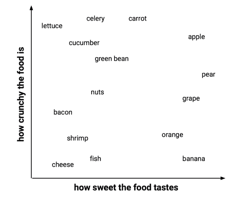
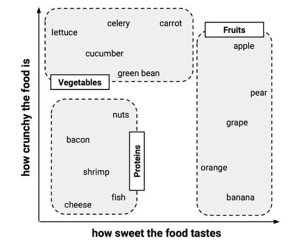
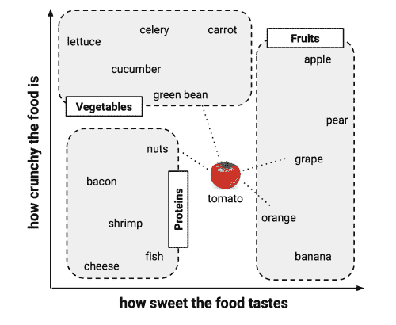
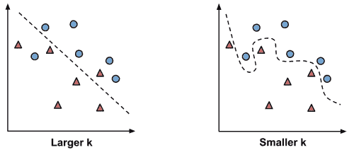
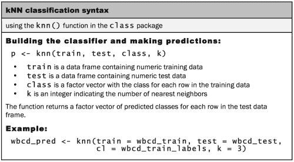
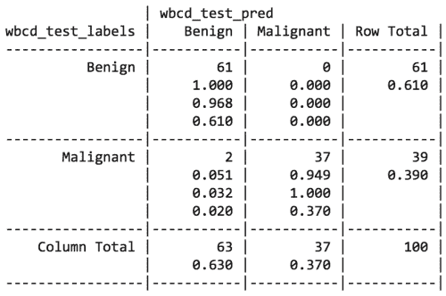

# 三、惰性学习——使用最近邻来分类

一种有趣的新型用餐体验正在世界各地的城市出现。在一个完全黑暗的餐厅里，侍者为顾客服务，他们只用触觉和声音小心翼翼地绕着记忆的路线走。这些机构的诱惑是相信剥夺自己的视觉感官输入将增强味觉和嗅觉，食物将以新的方式被体验。每一口都让人惊叹，同时发现厨师准备的风味。

你能想象用餐者如何体验看不见的食物吗？第一口吃下去，感官会被淹没。占主导地位的风味有哪些？这食物尝起来是咸的还是甜的？它尝起来像以前吃过的东西吗？就我个人而言，我用一句稍加修改的格言来想象这一发现过程:如果它闻起来像鸭子，尝起来像鸭子，那么你可能正在吃鸭子。

这说明了一个可以用于机器学习的想法——正如另一个涉及家禽的格言一样:“物以类聚。”换句话说，相似的事物很可能有相似的属性。机器学习利用这一原理，通过将数据与相似或“最近”的邻居放在同一类别中来对数据进行分类。本章专门介绍使用这种方法的分类器。您将了解到:

*   定义**最近邻**分类器的关键概念，以及为什么它们被认为是“惰性”的学习者
*   用距离度量两个例子相似性的方法
*   应用一种流行的最近邻分类器 k-NN

如果所有这些关于食物的谈话让你感到饥饿，那就随便吃点零食吧。我们的第一个任务是通过解决一个长期的烹饪争论来理解 k-NN 方法。

# 了解最近邻分类

在单个句子中，**最近邻**分类器通过给它们分配相似的已标记示例的类别，根据它们对未标记示例进行分类的特性来定义。尽管这个想法很简单，但是最近邻方法非常有效。它们已成功用于:

*   计算机视觉应用，包括静态图像和视频中的光学字符识别和面部识别
*   预测一个人是否会喜欢推荐的电影或音乐
*   识别遗传数据中的模式，也许用它们来检测特定的蛋白质或疾病

通常，最近邻分类器非常适合于分类任务，其中特征和目标类之间的关系是众多的、复杂的或极难理解的，然而相似类类型的项目往往是相当同质的。换句话说，如果一个概念很难定义，但是当你看到它的时候你知道它，那么最近邻可能是合适的。另一方面，如果数据有噪声，因此组之间没有明显的区别，最近邻算法可能难以识别类边界。

## k-NN 算法

最近的邻居分类方法以**k-最近邻居算法** ( **k-NN** )为例。虽然这可能是最简单的机器学习算法之一，但它仍然被广泛使用。

该算法的优点和缺点如下:

| 

强项

 | 

弱点

 |
| --- | --- |
| 

*   简单有效
*   对底层数据分布不做任何假设
*   快速训练阶段

 | 

*   不产生模型，限制了理解特征如何与类别相关的能力
*   需要选择适当的 *k*
*   慢分类阶段
*   名义特征和缺失数据需要额外处理

 |

k-NN 算法得名于这样一个事实，即它使用关于一个例子的 k-最近邻的信息来分类未标记的例子。字母 *k* 是一个可变项，意味着可以使用任意数量的最近邻。在选择了 *k* 之后，该算法需要一个训练数据集，该数据集由被分成几个类别的例子组成，并由一个名义变量标记。然后，对于测试数据集中每个未标记的记录，k-NN 识别训练数据中相似性“最接近”的 *k* 记录。未标记的测试实例被分配 k 个最近邻居中的大多数的类。

为了说明这个过程，让我们重温一下引言中描述的盲品体验。假设在吃神秘食物之前，我们已经创建了一个数据集，其中记录了我们对之前品尝过的许多食材的印象。为了简单起见，我们仅对每种成分的两个特征进行评分。第一个是从 1 到 10 的配料松脆程度，第二个是从 1 到 10 的配料甜味程度。然后，我们将每种成分标记为三种食物中的一种:水果、蔬菜或蛋白质。这种数据集的前几行可能如下构造:

| 

原料

 | 

芳香

 | 

松脆

 | 

食物类型

 |
| --- | --- | --- | --- |
| 苹果 | 10 | 9 | 水果 |
| 培根 | 一 | 四 | 蛋白质 |
| 香蕉 | 10 | 一 | 水果 |
| 胡萝卜 | 七 | 10 | 蔬菜 |
| 芹菜 | 3 | 10 | 蔬菜 |
| 奶酪 | 一 | 一 | 蛋白质 |

k-NN 算法将特征视为多维特征空间中的坐标。因为我们的数据集只包括两个特征，所以特征空间是二维的。我们可以在散点图上绘制二维数据，用 *x* 维度表示配料的甜度，用 *y* 维度表示松脆度。在口味数据集中添加了一些其他的成分后，散点图可能看起来像这样:



你注意到模式了吗？相似类型的食物往往被紧密地组合在一起。如下一张图所示，蔬菜往往脆而不甜，水果往往甜且脆或不脆，而蛋白质则既不脆也不甜:



假设在构建了这个数据集之后，我们决定用它来解决一个古老的问题:番茄是水果还是蔬菜？我们可以使用最近邻法来确定哪个类更适合，如下图所示:



### 用距离度量相似性

定位番茄的最近邻居需要一个**距离函数**，或者一个测量两个实例之间相似性的公式。

有许多不同的方法来计算距离。传统上，k-NN 算法使用**欧几里德距离**，这是如果可以使用尺子连接两点时人们会测量的距离，在上图中由连接番茄与其邻居的虚线表示。

### 提示

欧几里得距离是“直线距离”，意味着最短的直接路径。另一种常见的距离度量是曼哈顿距离，它是基于行人走过城市街区的路径。如果您有兴趣了解更多关于其他距离度量的信息，您可以使用`?dist`命令阅读 R 的距离函数(一个非常有用的工具)的文档。

欧几里德距离由下面的公式指定，其中 *p* 和 *q* 是要比较的例子，各自具有 *n* 个特征。术语*p[1]是指实例 *p* 的第一个特征的值，而*q[1]是指实例 *q* 的第一个特征的值:**


距离公式包括比较每个要素的值。例如，要计算番茄(*甜度= 6* 、*脆度= 4* )和绿豆(*甜度= 3* 、*脆度= 7* )之间的距离，我们可以使用以下公式:


同样，我们可以计算番茄和它的几个最近的邻居之间的距离如下:

| 

原料

 | 

芳香

 | 

松脆

 | 

食物类型

 | 

到番茄的距离

 |
| --- | --- | --- | --- | --- |
| 葡萄 | 8 | 5 | 水果 | *sqrt((6-8)^2+(4-5)^2)= 2.2* |
| 青豆 | 3 | 七 | 蔬菜 | *sqrt((6-3)^2+(4-7)^2)= 4.2* |
| 坚果 | 3 | 6 | 蛋白质 | *sqrt((6-3)^2+(4-6)^2)= 3.6* |
| 橙色的 | 七 | 3 | 水果 | *sqrt((6-7)^2+(4-3)^2)= 1.4* |

为了将番茄分类为蔬菜、蛋白质或水果，我们将首先指定番茄，它的单一最近邻的食物类型。这叫做 1-NN 分类，因为 *k = 1* 。橙子是番茄最近的邻居，距离为 1.4。由于橙子是一种水果，1-NN 算法会将番茄归类为一种水果。

如果我们使用 k-NN 算法，k = 3，它会在三个最近的邻居中进行投票:橙子、葡萄和坚果。由于这些邻居中的多数类是水果(三票中的两票)，番茄再次被归类为水果。

### 选择合适的 k

决定 k-NN 使用多少个邻居决定了模型对未来数据的泛化能力。训练数据过拟合和欠拟合之间的平衡是一个被称为**偏差-方差权衡**的问题。选择一个大的 *k* 可以减少由噪声数据引起的影响或变化，但是会使学习者产生偏见从而冒忽略小的但重要的模式的风险。

假设我们采取极端的立场，设置一个非常大的 *k* ，与训练数据中的观察总数一样大。随着每个训练实例在最终投票中被表示，最普通的类总是具有大多数投票者。因此，该模型将始终预测多数类，而不考虑最近邻。

在相反的极端情况下，使用单个最近邻允许有噪声的数据或异常值不适当地影响样本的分类。例如，假设一些训练示例意外地被错误标记。任何与错误标记的邻居最近的未标记的例子将被预测为具有不正确的类，即使其他九个最近的邻居投票不同。

显然，最佳的 k 值介于这两个极端值之间。

下图更一般地说明了更大或更小的 *k* 值如何影响决策边界(由虚线描绘)。较小的值允许更复杂的决策边界，从而更精确地拟合训练数据。问题是我们不知道是直线边界还是曲线边界更好地代表了要学习的真正的基本概念。



在实践中，选择 *k* 取决于要学习的概念的难度，以及训练数据中的记录数量。一种常见的做法是从等于训练样本数量的平方根的 *k* 开始。在我们之前开发的食物分类器中，我们可以设置 *k = 4* ，因为在训练数据中有 15 种示例成分，15 的平方根是 3.87。

然而，这样的规则可能并不总是导致单一最佳 *k* 。另一种方法是在各种测试数据集上测试几个 *k* 值，并选择一个提供最佳分类表现的值。也就是说，除非数据非常嘈杂，否则大型训练数据集可以使 *k* 的选择变得不那么重要。这是因为即使是微妙的概念也有足够多的例子来作为最近邻。

### 提示

这个问题的一个不太常见但有趣的解决方案是选择一个更大的 *k* ，但是应用一个**加权投票**过程，其中较近邻居的投票被认为比较远邻居的投票更有权威。许多 k-NN 实现都提供了这个选项。

### 准备用于 k-NN 的数据

在应用 k-NN 算法之前，特征通常被转换到标准范围。此步骤的基本原理是距离公式高度依赖于要素的测量方式。特别是，如果某些要素的值的范围比其他要素的值的范围大得多，则距离测量将主要由范围较大的要素决定。这对于品尝食物的例子来说不是问题，因为甜度和松脆度都是用 1-10 来衡量的。

然而，假设我们为食物的辣度数据集添加了一个额外的特征，这是使用 Scoville 标度测量的。如果你不熟悉这个标准，这是一个标准化的香料热量测量，范围从零(一点都不辣)到超过一百万(最辣的辣椒)。由于辛辣和非辛辣食物之间的差异可能超过一百万，而甜味和非甜味或松脆和非松脆食物之间的差异最多为 10，因此比例的差异使得香料水平对距离函数的影响比其他两个因素大得多。如果不调整我们的数据，我们可能会发现我们的距离测量只根据食物的辣度来区分食物；松脆和甜味的影响与辣味的贡献相比相形见绌。

解决方案是通过缩小或扩大要素的范围来重新缩放要素，使每个要素对距离公式的贡献相对相等。例如，如果甜度和脆度都用 1 到 10 来衡量，我们也希望辣度用 1 到 10 来衡量。有几种常见的方法来实现这种缩放。

传统的对 k-NN 的特征进行重缩放的方法是****归一化**。此过程会转换一个要素，使其所有值都在 0 到 1 之间。标准化特征的公式如下:**

****

**本质上，该公式从每个值中减去特征 *X* 的最小值，然后除以范围 *X* 。**

**归一化特征值可以解释为指示原始值在原始最小值和最大值之间的范围内从 0%到 100%下降了多远。**

**另一种常见的转换叫做 **z 分数标准化**。以下公式减去特征 *X* 的平均值，并将结果除以 *X* 的标准偏差:**

****

**该公式基于第 2 章、*管理和理解数据*中所述的正态分布的属性，根据高于或低于平均值的标准偏差来重新调整每个特性的值。得到的值称为一个 **z 值**。z 分数落在负数和正数的无限范围内。与标准化值不同，它们没有预定义的最小值和最大值。**

### **提示**

**在 k-NN 训练数据集上使用的相同的重新调整方法也必须应用于该算法稍后将分类的示例。这可能会导致最小值-最大值归一化出现棘手的情况，因为未来事例的最小值或最大值可能会超出训练数据中观察到的值的范围。如果你事先知道合理的最小值或最大值，你可以使用这些常数而不是观察值。或者，您可以在假设未来示例将具有与训练示例相似的均值和标准差的情况下使用 z 得分标准化。**

**欧几里德距离公式不是为名义数据定义的。因此，为了计算名义特征之间的距离，我们需要将它们转换成数字格式。典型的解决方案利用**虚拟编码**，其中值 *1* 表示一个类别，值 *0* 表示另一个类别。例如，性别变量的虚拟编码可以构造为:**

****

**请注意两个类别(二元)性别变量的虚拟编码是如何产生一个名为 male 的新特征的。没有必要为女性构建单独的特征；既然两性是互斥的，知道其中一个或者另一个就够了。**

**这在更普遍的情况下也是如此。通过为特性的( *n - 1* )级创建二进制指示变量，可对 *n* 类标称特性进行虚拟编码。例如，三类温度变量(例如，热、中或冷)的虚拟编码可设置为 *(3 - 1) = 2* 特征，如下所示:**

****

**知道热与中均为 *0* 就足以知道温度是冷的。因此，我们不需要冷类别的第三个特征。**

**虚拟编码的一个方便之处在于，虚拟编码特征之间的距离始终为 1 或 0，因此，这些值与最小-最大标准化数值数据处于相同的范围内。不需要额外的转换。**

### **提示**

**如果一个标称特征是有序的(可以对温度进行这样的论证)，虚拟编码的替代方法是对类别进行编号并应用归一化。例如，冷、暖、热可以编号为 1、2 和 3，标准化为 0、0.5 和 1。对这种方法的一个警告是，只有当类别之间的步骤相等时，才应该使用这种方法。例如，虽然穷人、中产阶级和富人的收入类别是有序的，但穷人和中产阶级之间的差异可能不同于中产阶级和富人之间的差异。因为组之间的步骤不相等，所以哑编码是更安全的方法。**

## **k-NN 算法为什么懒？**

**基于最近邻方法的分类算法被认为是**惰性学习**算法，因为从技术上讲，没有抽象发生。抽象和概括过程被完全跳过，这破坏了《T4》第一章、*介绍机器学习*中提出的学习的定义。**

**根据学习的严格定义，一个惰性的学习者并没有真正学到任何东西。相反，它只是逐字存储训练数据。这使得实际上不训练任何东西的训练阶段能够非常迅速地进行。当然，缺点是与训练相比，做出预测的过程往往相对较慢。由于严重依赖训练实例而不是抽象的模型，惰性学习也被称为**基于实例的学习**或**死记硬背学习**。**

**由于基于实例的学习者不构建模型，所以该方法被认为是在**非参数**学习方法的类别中——没有关于数据的参数被学习。没有生成关于底层数据的理论，非参数方法限制了我们理解分类器如何使用数据的能力。另一方面，这允许学习者找到自然的模式，而不是试图将数据放入先入为主和潜在有偏见的函数形式中。**

****

**虽然 k-NN 分类器可能被认为是惰性的，但它们仍然是相当强大的。你很快就会看到，最近邻学习的简单原理可以用来自动化癌症筛查过程。**

**<title>Example – diagnosing breast cancer with the k-NN algorithm</title>

# 示例–使用 k-NN 算法诊断乳腺癌

常规乳腺癌筛查允许在疾病引起明显症状之前对其进行诊断和治疗。早期检测的过程包括检查乳腺组织是否有异常肿块或肿块。如果发现肿块，则进行细针抽吸活检，使用空心针从肿块中提取少量细胞样本。然后，临床医生在显微镜下检查细胞，以确定肿块是恶性还是良性。

如果机器学习可以自动识别癌细胞，它将为卫生系统提供相当大的好处。自动化过程可能会提高检测过程的效率，让医生花更少的时间诊断，花更多的时间治疗疾病。通过从过程中去除固有的主观人为因素，自动筛选系统还可以提供更高的检测准确性。

我们将通过将 k-NN 算法应用于测量来自患有异常乳腺肿块的妇女的活检细胞，来研究机器学习用于检测癌症的效用。

## 第一步——收集数据

我们将利用 http://archive.ics.uci.edu/ml[的 UCI 机器学习库中的威斯康星州乳腺癌诊断数据集。该数据由威斯康星大学的研究人员提供，包括乳腺肿块细针穿刺数字化图像的测量结果。这些值表示数字图像中存在的细胞核的特征。](http://archive.ics.uci.edu/ml)

### 注意

要了解有关该数据集的更多信息，请参考:曼加萨里安 OL、WN 街、沃尔伯格 WH。基于线性规划的乳腺癌诊断和预后。*运筹学*。1995;43:570-577.

乳腺癌数据包括 569 个癌症活检样本，每个样本有 32 个特征。一个特征是识别号，另一个是癌症诊断，30 个是数值实验室测量。诊断编码为`"M"`表示恶性或`"B"`表示良性。

其他 30 个数值测量包括数字化细胞核的 10 个不同特征的平均值、标准误差和最差(即最大)值。其中包括:

*   半径
*   纹理
*   周长
*   面积
*   平滑
*   紧凑
*   凹面
*   凹点
*   对称
*   分形维数

根据这些名称，所有的特征似乎都与细胞核的形状和大小有关。除非你是一名肿瘤学家，否则你不太可能知道它们与良性或恶性肿块的关系。随着我们在机器学习过程中的继续，这些模式将被揭示出来。

## 第 2 步——探索和准备数据

让我们研究一下这些数据，看看我们是否能阐明这些关系。在这样做的时候，我们将准备用于 k-NN 学习方法的数据。

### 提示

如果您打算跟随，从 Packt 网站下载`wisc_bc_data.csv`文件并保存到您的 R 工作目录。这本书的数据集从最初的形式稍微修改了一下。特别是，添加了标题行，并且数据行是随机排序的。

我们将从导入 CSV 数据文件开始，正如我们在前面章节中所做的那样，将威斯康星州乳腺癌数据保存到`wbcd`数据框中:

```r
> wbcd <- read.csv("wisc_bc_data.csv", stringsAsFactors = FALSE)

```

使用`str(wbcd)`命令，我们可以确认数据按照我们的预期由 569 个例子和 32 个特性构成。前几行输出如下:

```r
'data.frame':  569 obs. of  32 variables:
 $ id               : int  87139402 8910251 905520 ...
 $ diagnosis        : chr  "B" "B" "B" "B" ...
 $ radius_mean      : num  12.3 10.6 11 11.3 15.2 ...
 $ texture_mean     : num  12.4 18.9 16.8 13.4 13.2 ...
 $ perimeter_mean   : num  78.8 69.3 70.9 73 97.7 ...
 $ area_mean        : num  464 346 373 385 712 ...

```

第一个变量是一个名为`id`的整型变量。由于这只是数据中每个患者的唯一标识符(ID ),它不能提供有用的信息，我们需要将其从模型中排除。

### 提示

不管机器学习的方法是什么，ID 变量应该总是被排除在外。忽略这一点会导致错误的发现，因为 ID 可以用来唯一地“预测”每个示例。因此，包含标识符的模型将遭受过度拟合，并且不太可能很好地推广到其他数据。

让我们一起放弃`id`功能。由于它位于第一列，我们可以通过复制没有列`1`的`wbcd`数据帧来排除它:

```r
> wbcd <- wbcd[-1]

```

下一个变量`diagnosis`，特别令人感兴趣，因为这是我们希望预测的结果。该特征表明样本是来自良性还是恶性肿块。`table()`输出显示 357 个肿块为良性，212 个为恶性:

```r
> table(wbcd$diagnosis)
 B   M 
357 212

```

许多 R machine 学习分类器要求目标特征编码为一个因子，所以我们将需要重新编码`diagnosis`变量。我们还将借此机会使用`labels`参数为`"B"`和`"M"`值提供更多信息:

```r
> wbcd$diagnosis<- factor(wbcd$diagnosis, levels = c("B", "M"),
 labels = c("Benign", "Malignant"))

```

现在，当我们查看`prop.table()`输出时，我们注意到这些值分别被标记为质量的 62.7%和 37.3%的`Benign`和`Malignant`:

```r
> round(prop.table(table(wbcd$diagnosis)) * 100, digits = 1)
 Benign Malignant 
 62.7      37.3

```

剩下的 30 个特征都是数字，正如预期的那样，它们由十个特征的三个不同的度量组成。为了便于说明，我们将只仔细研究其中的三个特性:

```r
> summary(wbcd[c("radius_mean", "area_mean", "smoothness_mean")])
 radius_mean       area_mean      smoothness_mean 
 Min.   : 6.981   Min.   : 143.5   Min.   :0.05263 
 1st Qu.:11.700   1st Qu.: 420.3   1st Qu.:0.08637 
 Median :13.370   Median : 551.1   Median :0.09587 
 Mean   :14.127   Mean   : 654.9   Mean   :0.09636 
 3rd Qu.:15.780   3rd Qu.: 782.7   3rd Qu.:0.10530 
 Max.   :28.110   Max.   :2501.0   Max.   :0.16340

```

并排查看特性时，您是否注意到任何关于值的问题？回想一下，k-NN 的距离计算严重依赖于输入要素的测量比例。由于平滑度的范围从 0.05 到 0.16，面积的范围从`143.5`到`2501.0`，在距离计算中，面积的影响将远大于平滑度。这可能会给我们的分类器带来问题，所以让我们应用归一化将特征重新缩放到标准范围的值。

### 转换–规范化数字数据

为了规范化这些特性，我们需要在 r 中创建一个`normalize()`函数。该函数采用一个数值向量`x`，对于`x`中的每个值，减去`x`中的最小值，然后除以`x`中的值范围。最后，返回结果向量。该函数的代码如下:

```r
> normalize <- function(x) {
 return ((x - min(x)) / (max(x) - min(x)))
}

```

在执行了前面的代码之后，`normalize()`函数就可以在 r 中使用了。

```r
> normalize(c(1, 2, 3, 4, 5))
[1] 0.00 0.25 0.50 0.75 1.00
> normalize(c(10, 20, 30, 40, 50))
[1] 0.00 0.25 0.50 0.75 1.00

```

该功能似乎工作正常。尽管第二个向量中的值比第一个向量中的值大 10 倍，但在规范化后，它们看起来完全相同。

我们现在可以将`normalize()`函数应用于数据框中的数字要素。我们将使用 R 的一个函数来自动化这个过程，而不是分别对 30 个数值变量进行标准化。

`lapply()`函数获取一个列表，并将指定的函数应用于每个列表元素。由于数据帧是等长向量的列表，我们可以使用`lapply()`将`normalize()`应用于数据帧中的每个特征。最后一步是使用`as.data.frame()`函数将`lapply()`返回的列表转换成数据帧。整个过程如下所示:

```r
> wbcd_n <- as.data.frame(lapply(wbcd[2:31], normalize))

```

简单地说，该命令将`normalize()`函数应用于`wbcd`数据帧中的第 2 到第 31 列，将结果列表转换为数据帧，并将其命名为`wbcd_n`。此处使用后缀`_n`是为了提醒`wbcd`中的值已经被规范化。

为了确认转换被正确应用，让我们来看看一个变量的汇总统计数据:

```r
> summary(wbcd_n$area_mean)
Min. 1st Qu.Median    Mean 3rd Qu.    Max. 
0.0000  0.1174  0.1729  0.2169  0.2711  1.0000 

```

不出所料，`area_mean` 变量，原来的范围是 143.5 到 2501.0，现在的范围是 0 到 1。

### 数据准备–创建训练和测试数据集

尽管所有的 569 个活检都被贴上了良性或恶性的标签，但预测我们已经知道的事情并不有趣。此外，我们在训练过程中获得的任何表现指标都可能会产生误导，因为我们不知道案例被过度拟合的程度，也不知道学习者对未知案例的概括能力。一个更有趣的问题是，我们的学习者在未标记数据的数据集上表现如何。如果我们可以进入实验室，我们可以将我们的学习器应用于从下一个 100 个未知癌症状态的质量中获得的测量值，并查看机器学习器的预测与使用传统方法获得的诊断相比有多好。

在缺少此类数据的情况下，我们可以通过将数据分为两部分来模拟这种情况:将用于构建 k-NN 模型的训练数据集和将用于估计模型预测准确性的测试数据集。我们将使用前 469 条记录作为训练数据集，剩余的 100 条记录用于模拟新患者。

使用[第 2 章](ch02.html "Chapter 2. Managing and Understanding Data")、*管理和理解数据*中给出的数据提取方法，我们将把`wbcd_n`数据帧拆分成`wbcd_train`和`wbcd_test`:

```r
> wbcd_train <- wbcd_n[1:469, ]
> wbcd_test <- wbcd_n[470:569, ]

```

如果前面的命令令人困惑，请记住使用`[row, column]`语法从数据帧中提取数据。行或列值的空白值表示应包含所有行或列。因此，第一行代码获取第 1 行到第 469 行以及所有列，第二行获取第 470 行到第 569 行的 100 行以及所有列。

### 提示

当构造训练和测试数据集时，每个数据集都是完整数据集的代表性子集是很重要的。`wbcd`记录已经被随机排序，所以我们可以简单地提取 100 个连续的记录来创建一个测试数据集。如果数据是按时间顺序排序的或者是按相似值分组的，这就不合适了。在这些情况下，需要随机抽样方法。随机抽样将在第 5 章、*分而治之-使用决策树和规则分类*中讨论。

当我们构建标准化的训练和测试数据集时，我们排除了目标变量`diagnosis`。为了训练 k-NN 模型，我们需要将这些类别标签存储在因子向量中，在训练和测试数据集之间分开:

```r
> wbcd_train_labels <- wbcd[1:469, 1]
> wbcd_test_labels <- wbcd[470:569, 1]

```

这段代码获取`wbcd`数据帧第一列中的`diagnosis`因子，并创建矢量`wbcd_train_labels`和`wbcd_test_labels`。我们将在训练和评估我们的分类器的下一步中使用这些。

## 步骤 3–根据数据训练模型

配备了我们的训练数据和标签向量，我们现在准备对未知记录进行分类。对于 k-NN 算法，训练阶段实际上不涉及建模；训练像 k-NN 这样惰性的学习者的过程仅仅包括以结构化格式存储输入数据。

为了分类我们的测试实例，我们将使用来自`class`包的 k-NN 实现，它提供了一组用于分类的基本 R 函数。如果您的系统上尚未安装此软件包，您可以通过键入以下命令来安装它:

```r
> install.packages("class")

```

要在希望使用功能的任何会话中加载软件包，只需输入`library(class)`命令。

`class`包中的`knn()`函数提供了 k-NN 算法的标准、经典实现。对于测试数据中的每个实例，该函数将使用欧几里德距离识别 k 个最近邻，其中 *k* 是用户指定的数字。通过在 k 个最近的邻居中进行“投票”来对测试实例进行分类——具体来说，这涉及分配大多数 k 个邻居的类别。平局投票被随机打破。

### 提示

在其他 R 包中有几个其他的 k-NN 函数，它们提供了更复杂或更有效的实现。如果用`knn()`遇到限制，在**综合 R 档案网** ( **CRAN** )搜索 k-NN。

使用`knn()`功能的训练和分类在单个函数调用中执行，使用四个参数，如下表所示:



我们现在几乎拥有了将 k-NN 算法应用于这些数据所需的一切。我们将数据分为训练数据集和测试数据集，每个数据集都具有完全相同的数字特征。训练数据的标签存储在单独的因子向量中。唯一剩下的参数是`k`，它指定了要包含在投票中的邻居数量。

由于我们的训练数据包括 469 个实例，我们可能会尝试`k = 21`，这是一个奇数，大约等于 469 的平方根。对于两个类别的结果，使用奇数可以消除投票结果相同的可能性。

现在我们可以使用`knn()`函数对`test`数据进行分类:

```r
> wbcd_test_pred <- knn(train = wbcd_train, test = wbcd_test,
 cl = wbcd_train_labels, k = 21)

```

`knn()`函数为`test`数据集中的每个示例返回预测标签的因子向量，我们已经将其分配给了`wbcd_test_pred`。

## 步骤 4–评估模型表现

该过程的下一个步骤是评估`wbcd_test_pred`向量中的预测类与`wbcd_test_labels`向量中的已知值的匹配程度。为此，我们可以使用`gmodels`包中的`CrossTable()`函数，该函数在[第 2 章](ch02.html "Chapter 2. Managing and Understanding Data")、*管理和理解数据*中有介绍。如果您还没有这样做，请使用`install.packages("gmodels")`命令安装这个包。

在用`library(gmodels)`命令加载包之后，我们可以创建一个交叉列表来表示两个向量之间的一致性。指定`prop.chisq = FALSE`将从输出中移除不必要的卡方值:

```r
> CrossTable(x = wbcd_test_labels, y = wbcd_test_pred,
 prop.chisq=FALSE)

```

生成的表格如下所示:



表中的单元格百分比表示属于四个类别的值的比例。左上角的单元格表示**真阴性**结果。这 100 个值中的 61 个是肿块是良性的，并且 k-NN 算法正确地将其识别为良性。右下单元格表示**真阳性**结果，其中分类器和临床确定的标签一致认为肿块是恶性的。100 个预测中总共有 37 个是真阳性。

落在另一条对角线上的单元格包含 k-NN 方法与真实标签不一致的例子的计数。左下角单元格中的两个例子是**假阴性**结果；在这种情况下，预测值是良性的，但肿瘤实际上是恶性的。在这个方向上的错误可能会付出极其高昂的代价，因为它们可能会导致患者认为她没有患癌症，但实际上，疾病可能会继续扩散。右上角的单元格将包含**假阳性**结果，如果有的话。当模型将肿块分类为恶性，但实际上是良性时，就会出现这些值。虽然这种错误没有假阴性结果危险，但是也应该避免，因为它们可能导致卫生保健系统的额外经济负担，或者由于可能必须提供额外的测试或治疗而给患者带来额外的压力。

### 提示

如果我们愿意，我们可以通过将每个肿块归类为恶性来完全消除假阴性。显然，这不是一个现实的策略。尽管如此，它说明了这样一个事实，即预测涉及到在假阳性率和假阴性率之间取得平衡。在[第 10 章](ch10.html "Chapter 10. Evaluating Model Performance")、*评估模型表现*中，您将了解到测量预测准确性的更复杂的方法，这些方法可用于根据每种错误类型的成本来确定可以优化错误率的地方。

总共有 2/100 或 2%的质量被 k-NN 方法错误地分类。虽然 98%的准确率对于几行 R 代码来说似乎令人印象深刻，但我们可能会尝试该模型的另一次迭代，看看我们是否可以提高表现并减少错误分类的值的数量，特别是因为这些错误是危险的假阴性。

## 第 5 步——提高模型表现

我们将在前面的分类器上尝试两个简单的变化。首先，我们将采用另一种方法来重新调整我们的数字特征。其次，我们将为 *k* 尝试几个不同的值。

### 转换–z 分数标准化

虽然归一化传统上用于 k-NN 分类，但它可能并不总是最适合重缩放特征的方式。由于 z 得分标准化值没有预定义的最小值和最大值，因此极值不会向中心压缩。人们可能会怀疑，对于恶性肿瘤，随着肿瘤不受控制地生长，我们可能会看到一些非常极端的异常值。因此，允许在距离计算中对异常值进行更重的加权可能是合理的。让我们看看 z-score 标准化是否能提高我们的预测准确性。

为了标准化向量，我们可以使用 R 的内置`scale()`函数，默认情况下，该函数使用 z 分数标准化来重新调整值。`scale()`函数提供了额外的好处，它可以直接应用于数据帧，因此我们可以避免使用`lapply()`函数。要创建一个 z 分数标准化版本的`wbcd`数据，我们可以使用以下命令:

```r
> wbcd_z <- as.data.frame(scale(wbcd[-1]))

```

该命令重新缩放除`diagnosis`之外的所有特征，并将结果存储为`wbcd_z`数据框。`_z`后缀提醒我们这些值已经过 z 值转换。

为了确认转换被正确应用，我们可以查看汇总统计数据:

```r
> summary(wbcd_z$area_mean)
 Min. 1st Qu.  Median    Mean 3rd Qu.    Max. 
-1.4530 -0.6666 -0.2949  0.0000  0.3632  5.2460

```

z 得分标准化变量的平均值应始终为零，并且范围应相当紧凑。大于 3 或小于-3 的 z 值表示极其罕见的值。考虑到这一点，转型似乎奏效了。

正如我们之前所做的，我们需要将数据分为训练集和测试集，然后使用`knn()`函数对测试实例进行分类。然后我们将使用`CrossTable()`比较预测标签和实际标签:

```r
> wbcd_train <- wbcd_z[1:469, ]
> wbcd_test <- wbcd_z[470:569, ]
> wbcd_train_labels <- wbcd[1:469, 1]
> wbcd_test_labels <- wbcd[470:569, 1]
> wbcd_test_pred <- knn(train = wbcd_train, test = wbcd_test,
 cl = wbcd_train_labels, k = 21)
> CrossTable(x = wbcd_test_labels, y = wbcd_test_pred,
 prop.chisq = FALSE)

```

不幸的是，在下表中，我们新转换的结果显示准确性略有下降。以前我们正确分类了 98%的例子，这次我们只正确分类了 95%。更糟糕的是，我们在对危险的假阴性进行分类方面并没有做得更好:


### 测试 k 的替代值

通过检查不同 k 值的表现，我们可能会做得更好。使用标准化的训练和测试数据集，使用几个不同的 *k* 值对相同的 100 个记录进行分类。显示了每次迭代的假阴性和假阳性的数量:

| 

k 值

 | 

假阴性

 | 

假阳性

 | 

分类不正确的百分比

 |
| --- | --- | --- | --- |
| 一 | 一 | 3 | 4% |
| 5 | 2 | 0 | 百分之二 |
| 11 | 3 | 0 | 百分之三 |
| 15 | 3 | 0 | 百分之三 |
| 21 | 2 | 0 | 百分之二 |
| 27 | 四 | 0 | 4% |

尽管分类器从来不是完美的，1-NN 方法能够以增加假阳性为代价避免一些假阴性。然而，重要的是要记住，让我们的方法过于接近我们的测试数据是不明智的；毕竟，一套不同的 100 份病历可能与那些用来衡量我们表现的病历有些不同。

### 提示

如果你需要确定一个学习者将对未来的数据进行归纳，你可以随机创建几组 100 个病人，并重复测试结果。仔细评估机器学习模型表现的方法将在第 10 章、*评估模型表现*中进一步讨论。


# 总结

在本章中，我们学习了使用 k-NN 进行分类。与许多分类算法不同，k-NN 不做任何学习。它只是逐字存储训练数据。然后，使用距离函数将未标记的测试示例与训练集中最相似的记录进行匹配，并且为未标记的示例分配其邻居的标签。

尽管 k-NN 是一种非常简单的算法，但它能够处理极其复杂的任务，例如识别癌块。在几行简单的 R 代码中，我们能够在 98%的时间内正确识别肿块是恶性还是良性。

在下一章中，我们将研究一种分类方法，这种方法使用概率来估计一个观察值落入某些类别的可能性。比较这种方法与 k-NN 的不同之处将会很有趣。稍后，在[第 9 章](ch09.html "Chapter 9. Finding Groups of Data – Clustering with k-means")、*寻找数据组——用 k-means 聚类*中，我们将了解 k-NN 的近亲，它使用距离度量来完成完全不同的学习任务。**