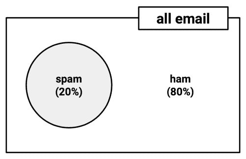
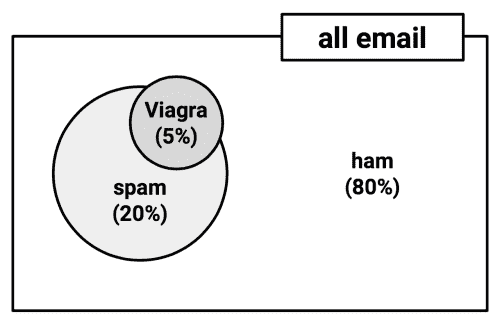
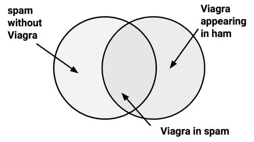
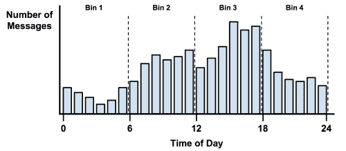
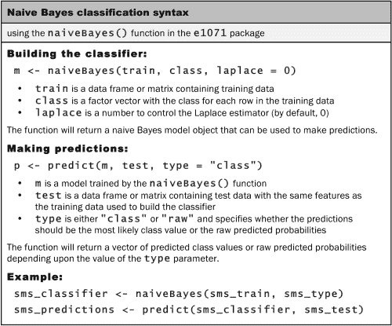
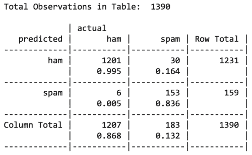
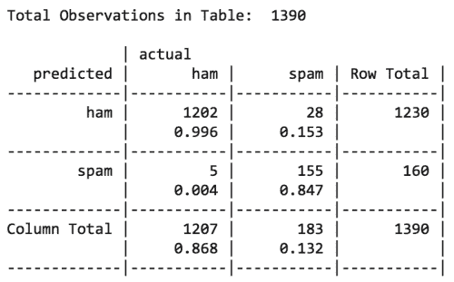

# 第四章。概率学习——使用朴素贝叶斯分类

当气象学家提供天气预报时，降水通常用“70%的可能性下雨”这样的术语来描述这种预报被称为降水概率报告。你有没有考虑过它们是怎么算出来的？这是一个令人困惑的问题，因为在现实中，要么会下雨，要么不会。

天气估计是基于概率方法或那些与描述不确定性有关的方法。他们利用过去事件的数据来推断未来事件。在天气的情况下，降雨的机会描述了先前几天在类似的可测量的大气条件下发生降水的比例。70%的降雨概率意味着，在过去 10 次类似情况中，有 7 次在该地区的某个地方出现了降水。

本章介绍朴素贝叶斯算法，它使用概率的方式与天气预报非常相似。学习这种方法时，您将会学到:

*   概率的基本原理
*   用 R 分析文本数据所需的专门方法和数据结构
*   如何利用朴素贝叶斯构建垃圾短信过滤器

如果你以前上过统计课，这一章的一些内容可能是一个回顾。即便如此，刷新一下你的概率知识也是有帮助的，因为这些原理是朴素贝叶斯获得如此奇怪名字的基础。

# 理解朴素贝叶斯

理解朴素贝叶斯算法所必需的基本统计思想已经存在了几个世纪。这项技术起源于 18 世纪^(T4 数学家托马斯·贝叶斯的工作，他发展了描述事件概率的基本原理，以及如何根据额外的信息修正概率。这些原则形成了现在被称为**贝叶斯方法**的基础。)

我们将在后面更详细地介绍这些方法。但是，就目前而言，可以说概率是一个介于 0 和 1 之间的数字(也就是说，介于 0%和 100%之间)，它反映了根据现有证据某一事件发生的可能性。概率越低，事件发生的可能性就越小。概率为 0 表示该事件肯定不会发生，而概率为 1 表示该事件将以 100%的把握发生。

基于贝叶斯方法的分类器利用训练数据来计算基于特征值提供的证据的每个结果的观察概率。当分类器稍后应用于未标记的数据时，它使用观察到的概率来预测新特征的最可能类。这是一个简单的想法，但它产生的方法通常具有与更复杂的算法相当的结果。事实上，贝叶斯分类器已经用于:

*   文本分类，如垃圾邮件过滤
*   计算机网络中的入侵或异常检测
*   给定一组观察到的症状来诊断医学状况

通常，贝叶斯分类器最适用于需要同时考虑来自多个属性的信息以估计结果的总体概率的问题。虽然许多机器学习算法会忽略影响较弱的特征，但贝叶斯方法会利用所有可用的证据来微妙地改变预测。如果大量特性的影响相对较小，那么综合起来，它们的综合影响可能会非常大。

## 贝叶斯方法的基本概念

在进入朴素贝叶斯算法之前，有必要花一些时间来定义贝叶斯方法中使用的概念。用一句话来概括，贝叶斯概率理论植根于这样一种思想，即估计发生**事件**的可能性，或潜在的结果，应该基于手头的证据，跨越多个**试验**，或事件发生的机会。

下表说明了几种真实结果的事件和试验:

| 

事件

 | 

试验

 |
| --- | --- |
| 正面结果 | 抛硬币 |
| 雨季 | 一天 |
| 邮件是垃圾邮件 | 传入电子邮件 |
| 候选人成为总统 | 总统选举 |
| 赢得彩票 | 奖券 |

贝叶斯方法提供了如何从观察到的数据中估计这些事件的概率的见解。要了解这一点，我们需要形式化我们对概率的理解。

### 理解概率

通过将事件发生的试验次数除以试验总次数，从观察数据中估算出事件发生的概率。例如，如果在与今天相似的条件下，10 天中有 3 天下雨，那么今天下雨的概率可以估计为 *3 / 10 = 0.30* 或 30%。类似地，如果之前的 50 封电子邮件中有 10 封是垃圾邮件，那么任何传入邮件是垃圾邮件的概率可以估计为 *10 / 50 = 0.20* 或 20%。

为了表示这些概率，我们使用形式为 *P(A)* 的符号，它表示事件 *A* 的概率。比如 *P(雨)= 0.30* 和 *P(垃圾邮件)= 0.20* 。

试验的所有可能结果的概率总和必须始终为 1，因为试验总是导致某种结果的发生。因此，如果试验有两个不能同时发生的结果，如雨天对晴天或垃圾邮件对火腿(非垃圾邮件)，那么知道其中一个结果的概率就能揭示另一个结果的概率。例如，给定值 *P(垃圾邮件)= 0.20* ，我们可以计算出 *P(火腿)= 1–0.20 = 0.80*。由此得出结论，垃圾邮件和火腿是**互斥且穷尽的**事件，这意味着它们不能同时发生，并且是唯一可能的结果。

因为一个事件不可能同时发生和不发生，所以一个事件总是互斥的，并且与它的**互补**，或者由感兴趣的事件不发生的结果组成的事件是穷尽的。事件 *A* 的补码通常表示为 *A ^c 或*A’*。此外，简写符号 *P( A)* 可用于表示事件 *A* 不发生的概率，如 *P(垃圾邮件)= 0.80* 。这个记法相当于 *P(A ^c )* 。*

为了说明事件和它们的补充，想象一个二维空间通常是有帮助的，该空间被划分成每个事件的概率。在下图中，矩形表示电子邮件的可能结果。圆圈表示该邮件是垃圾邮件的概率为 20%。剩余的 80%代表补充信息 *P(垃圾邮件)*或非垃圾邮件:



### 理解联合概率

通常，我们对同一试验的几个非互斥事件感兴趣。如果某些事件与感兴趣的事件一起发生，我们也许能够用它们来进行预测。例如，考虑基于电子邮件包含单词 Viagra 的结果的第二个事件。在大多数情况下，这个词很可能只出现在垃圾邮件中；因此，它出现在传入的电子邮件中就是该邮件是垃圾邮件的有力证据。针对第二个事件更新的上图可能如下图所示:



注意图中伟哥圈并没有完全填满垃圾圈，也没有完全被垃圾圈包含。这意味着不是所有的垃圾邮件都包含单词 Viagra，也不是所有包含单词 Viagra 的电子邮件都是垃圾邮件。

为了放大更近距离地观察垃圾邮件和伟哥圈子之间的重叠，我们将采用一种被称为**维恩图**的可视化方法。约翰·维恩在 19 世纪晚期首次使用，该图表使用圆圈来说明项目集之间的重叠。在大多数文氏图中，圆圈的大小和重叠的程度是没有意义的。相反，它被用作一种提醒，将概率分配给事件的所有可能组合:



我们知道 20%的邮件是垃圾邮件(左边的圆圈)，5%的邮件包含单词 Viagra(右边的圆圈)。我们想量化这两个比例之间的重叠程度。换句话说，我们希望估计 *P(垃圾邮件)*和 *P(伟哥)*都发生的概率，可以写成 *P(垃圾邮件∩伟哥)*。倒置的“U”符号表示两个事件的**交叉点**；符号 *A ∩ B* 是指 *A* 和 *B* 都发生的事件。

计算 *P(spam ∩ Viagra)* 取决于两个事件的**联合概率**或者一个事件的概率如何与另一个事件的概率相关联。如果两个事件完全不相关，则称为**独立事件**。这并不是说独立的事件不能同时发生；事件独立性仅仅意味着知道一个事件的结果并不能提供关于另一个事件结果的任何信息。例如，掷硬币的正面结果与某一天的天气是晴是雨无关。

如果所有的事件都是独立的，通过观察一个事件来预测另一个事件是不可能的。换句话说，**依赖事件**是预测建模的基础。正如云的出现预示着下雨天，单词 Viagra 的出现预示着垃圾邮件。


计算相关事件的概率比计算独立事件的概率要复杂一些。如果 *P(垃圾邮件)*和 *P(伟哥)*是独立的，我们可以很容易地计算出 *P(垃圾邮件∩伟哥)*，这两个事件同时发生的概率。因为 20%的邮件是垃圾邮件，5%的电子邮件包含单词 Viagra，所以我们可以假设 1%的邮件是包含单词 Viagra 的垃圾邮件。这是因为 *0.05 * 0.20 = 0.01* 。更一般地，对于独立事件 *A* 和 *B* ，两者发生的概率可以表示为 *P(A ∩ B) = P(A) * P(B)* 。

这么说，我们知道 *P(垃圾)**P(伟哥)*很可能是高度依赖，也就是说这个计算是不正确的。为了获得合理的估计，我们需要使用基于高级贝叶斯方法的这两个事件之间的关系的更仔细的公式。

### 用贝叶斯定理计算条件概率

相关事件之间的关系可以使用**贝叶斯定理**来描述，如下式所示。这个公式提供了一种思考方式，即如何根据一个事件提供的证据来修正另一个事件的概率估计:


假定事件 *B* 发生，符号 *P(A|B)* 读作事件 *A* 的概率。这被称为**条件概率**，因为 *A* 的概率依赖于(也就是说，有条件地)事件 *B* 所发生的事情。贝叶斯定理告诉我们，我们对 *P(A|B)* 的估计应该基于 *P(A ∩ B)* ，这是对观察到 *A* 和 *B* 一起出现的频率的度量，以及对观察到 *B* 出现的频率的度量。

贝叶斯定理指出 *P(A|B)* 的最佳估计值是 *A* 与 *B* 一起出现的试验在所有 *B* 出现的试验中所占的比例。用通俗的语言来说，这告诉我们，如果我们知道事件 *B* 发生了，那么每次观察到 *B* 时，事件 *A* 与*A*B*B*一起发生的频率越高。在某种程度上，这调整了 *P(A ∩ B)* 发生 *B* 的概率；如果 *B* 极其罕见， *P(B)* 和 *P(A ∩ B)* 永远很小；但如果 *A* 和 *B* 几乎总是一起发生，那么 *P(A|B)* 就高，不管 *B* 的概率如何。

根据定义， *P(A ∩ B) = P(A|B) * P(B)* ，这个事实只要用一点代数学就可以很容易地推导出来。利用 *P(A ∩ B) = P(B ∩ A)* 的知识再次重新排列该公式，得出结论 *P(A ∩ B) = P(B|A) * P(A)* ，然后我们可以在贝叶斯定理的以下公式中使用该结论:


事实上，这是贝叶斯定理被规定的传统方式，原因将在我们将其应用于机器学习时变得清楚。首先，为了更好地理解贝叶斯定理在实践中是如何工作的，让我们再来看看我们假设的垃圾邮件过滤器。

在不知道传入消息的内容的情况下，对其垃圾邮件状态的最佳估计是 *P(垃圾邮件)*，这是之前任何消息都是垃圾邮件的概率，我们之前计算为 20%。这个估计值被称为**先验概率**。

假设您通过更仔细地查看以前收到的一组信息来检查“伟哥”一词出现的频率，从而获得了额外的证据。单词 Viagra 在以前的垃圾邮件中使用的概率，或 *P(Viagra|spam)* ，被称为 **可能性**。伟哥出现在任何信息中的概率，或 *P(伟哥)*，被称为**边际可能性**。

通过将贝叶斯定理应用于这一证据，我们可以计算出一个**后验概率**,来衡量消息是垃圾邮件的可能性有多大。如果后验概率大于 50 %,则该消息更有可能是垃圾邮件，而不是垃圾邮件，或许应该被过滤掉。以下公式显示了如何将贝叶斯定理应用于以前的电子邮件所提供的证据:


为了计算贝叶斯定理的这些组成部分，它有助于构建一个**频率表**(如下图左侧所示)，记录伟哥在垃圾邮件和火腿信息中出现的次数。就像双向交叉制表一样，表格的一维表示类变量的级别(spam 或 ham)，而另一维表示特性的级别(Viagra: yes 或 no)。然后，单元指示具有类值和特征值的特定组合的实例的数量。频率表可用于构建一个**似然表**，如下图右侧所示。假设一封电子邮件是垃圾邮件或火腿，可能性表中的行表示伟哥的条件概率(是/否):


可能性表显示*P(Viagra = Yes | spam)= 4/20 = 0.20*，这表明如果一条消息是垃圾消息，则该消息包含术语 Viagra 的概率为 20%。另外，由于 *P(A ∩ B) = P(B|A) * P(A)* ，我们可以计算出 *P(spam ∩伟哥)*为 *P(伟哥| spam)* P(spam)=(4/20)*(20/100)= 0.04*。在频率表中可以找到相同的结果，该表指出，100 封邮件中有 4 封是带有“伟哥”一词的垃圾邮件。无论哪种方式，这都比之前我们在错误的独立性假设下计算的估计值 0.01 大四倍 *P(A ∩ B) = P(A) * P(B)* 。这当然说明了贝叶斯定理在计算联合概率时的重要性。

为了计算后验概率， *P(spam|Viagra)* ，我们简单的取*P(Viagra | spam)* P(spam)/P(Viagra)*或者*(4/20)*(20/100)/(5/100)= 0.80*。因此，给定包含单词 Viagra 的消息,是垃圾邮件的概率是 80%。根据这个结果，任何包含这个术语的消息都应该被过滤掉。

这就是商业垃圾邮件过滤器的工作方式，尽管它们在计算频率和可能性表时会同时考虑大量的单词。在下一节中，我们将看到当涉及到额外的特性时，如何使用这个概念。

## 朴素贝叶斯算法

**朴素** **贝叶斯**算法描述了一种将贝叶斯定理应用于分类问题的简单方法。虽然它不是唯一利用贝叶斯方法的机器学习方法，但它是最常见的方法。对于文本分类来说尤其如此，它已经成为事实上的标准。该算法的优点和缺点如下:

| 

强项

 | 

弱点

 |
| --- | --- |
| 

*   简单、快速且非常有效
*   适用于有噪声和缺失的数据
*   需要相对较少的样本进行训练，但也适用于非常大量的样本
*   容易获得预测的估计概率

 | 

*   依赖于对同等重要且独立的特征的错误假设
*   对于具有许多数字特征的数据集来说不理想
*   估计概率不如预测类

可靠 |

朴素贝叶斯算法之所以如此命名，是因为它对数据做了一些“幼稚”的假设。特别是，朴素贝叶斯假设数据集中的所有要素都是同等重要且独立的。这些假设在大多数实际应用中很少是正确的。

例如，如果您试图通过监控电子邮件来识别垃圾邮件，那么几乎可以肯定的是，某些特征会比其他特征更重要。例如，电子邮件发件人可能是比邮件正文更重要的垃圾邮件指示器。此外，消息正文中的单词并不是相互独立的，因为一些单词的出现很好地表明其他单词也可能出现。带有“伟哥”字样的信息也可能包含“处方”或“药物”字样。

然而，在违反这些假设的大多数情况下，朴素贝叶斯仍然表现得相当好。即使在特性之间存在强依赖性的极端情况下也是如此。由于该算法在许多类型的条件下的通用性和准确性，朴素贝叶斯通常是分类学习任务的强有力的第一候选。

### 注意

尽管朴素贝叶斯有错误的假设，但它仍然工作良好的确切原因一直是许多猜测的主题。一种解释是，只要预测是准确的，获得对概率的精确估计并不重要。例如，如果垃圾邮件过滤器正确识别了垃圾邮件，那么它对其预测的信心是 51%还是 99%有关系吗？关于这个主题的一个讨论，请参考:Domingos P，Pazzani M .关于零一损失下简单贝叶斯分类器的最优性。*机器学习*。1997;29:103-130.

### 用朴素贝叶斯分类

让我们扩展一下我们的垃圾邮件过滤器，除了伟哥这个词之外，再添加几个需要监控的词:金钱、杂货和退订。通过为这四个单词(标记为 *W [1]* 、 *W [2]* 、 *W [3]* 和 *W [4]* )的出现构建一个似然表来训练朴素贝叶斯学习器，如下图所示为 100 封电子邮件:


当收到新消息时，我们需要计算后验概率，根据在消息文本中找到单词的可能性来确定它们更有可能是垃圾邮件还是 ham。例如，假设一条消息包含“伟哥”和“取消订阅”这两个词，但不包含钱或食品。

使用贝叶斯定理，我们可以定义如下公式所示的问题。假设*伟哥=是*，*金钱=否*，*杂货=否*，以及*取消订阅=是*，它捕捉到了邮件是垃圾邮件的概率:


由于多种原因，这个公式在计算上很难求解。随着附加特征的增加，需要大量的存储器来存储所有可能的交叉事件的概率；想象一下四个单词事件的维恩图的复杂性，更不用说几百个或更多的单词了。

如果我们能够利用朴素贝叶斯假设事件之间的独立性这一事实，工作就会变得容易得多。具体来说，它假设**类条件独立性**，这意味着只要事件以相同的类值为条件，它们就是独立的。假设条件独立允许我们使用独立事件的概率规则来简化公式，该规则规定 *P(A ∩ B) = P(A) * P(B)* 。因为分母不依赖于类别(spam 或 ham)，所以它被视为常量值，暂时可以忽略。这意味着垃圾邮件的条件概率可以表示为:


并且该消息是 ham 的概率可以表示为:


请注意，等号已经被比例符号(类似于一个横向的开放式“8”)所取代，以表明分母已经被省略的事实。

使用可能性表中的值，我们可以开始在这些等式中填充数字。垃圾邮件的总体可能性是:

(4/20) * (10/20) * (20/20) * (12/20) * (20/100) = 0.012

而火腿的可能性是:

(1/80) * (66/80) * (71/80) * (23/80) * (80/100) = 0.002

因为 *0.012/0.002 = 6* ，我们可以说这条消息是垃圾邮件的可能性是 ham 的 6 倍。然而，要将这些数字转换成概率，我们需要执行最后一步来重新引入被排除的分母。本质上，我们必须通过除以所有可能结果的总可能性来重新调整每个结果的可能性。

这样，垃圾邮件的概率等于该消息是垃圾邮件的可能性除以该消息是垃圾邮件或 ham 的可能性:

0.012/(0.012 + 0.002) = 0.857

类似地，ham 的概率等于消息是 ham 的可能性除以消息是垃圾邮件或 ham 的可能性:

0.002/(0.012 + 0.002) = 0.143

根据在该邮件中找到的单词模式，我们预计该邮件有 85.7%的可能性是垃圾邮件，14.3%的可能性是垃圾邮件。因为这些是互斥且穷尽的事件，所以概率总和为 1。

我们在前面的示例中使用的朴素贝叶斯分类算法可以用下面的公式来概括。给定由特征*F[1]1*到*F[n]提供的证据，类别 *C* 的级别 *L* 的概率等于以类别级别为条件的每条证据的概率、类别级别的先验概率和比例因子 *1/Z* 的乘积，比例因子将似然值转换为概率:*


尽管这个等式看起来令人生畏，但正如前面的例子所示，这一系列步骤相当简单。首先构建一个频率表，用它来构建一个似然表，并根据朴素贝叶斯规则乘以条件概率。最后，除以总似然性，将每个类似然性转换为概率。手动尝试几次这种计算后，它将成为第二天性。

### 拉普拉斯估计量

在我们将朴素贝叶斯应用于更复杂的问题之前，有一些细微差别需要考虑。假设我们收到了另一条消息，这一次包含了所有四个术语:伟哥、杂货、钱和退订。使用之前的朴素贝叶斯算法，我们可以计算垃圾邮件的可能性:

(4/20) * (10/20) * (0/20) * (12/20) * (20/100) = 0

哈姆的可能性是:

(1/80) * (14/80) * (8/80) * (23/80) * (80/100) = 0.00005

因此，垃圾邮件的概率是:

0/(0 + 0.00005) = 0

火腿的概率是:

0.00005/(0 + 0.0.00005) = 1

这些结果表明，该邮件是垃圾邮件的概率为 0%，是垃圾邮件的概率为 100%。这个预测有意义吗？大概不会。该邮件包含几个通常与垃圾邮件相关的词，包括很少在合法邮件中使用的伟哥。因此，很有可能邮件被错误地分类了。

如果某个事件从未在该类的一个或多个级别发生，则可能会出现此问题。例如,“食品杂货”这个词以前从未出现在垃圾信息中。因此， *P(垃圾邮件|杂货)= 0%* 。

因为朴素贝叶斯公式中的概率是以链的形式相乘的，所以这个 0%的值导致垃圾邮件的后验概率为零，从而使单词“杂货”能够有效地否定和否决所有其他证据。即使该电子邮件被压倒性地认为是垃圾邮件，垃圾邮件中没有单词“杂货”将总是否决其他证据，并导致垃圾邮件的概率为零。

这个问题的解决方案包括使用一种叫做**拉普拉斯估计器**的东西，它是以法国数学家皮埃尔·西蒙·拉普拉斯的名字命名的。拉普拉斯估计器实质上为频率表中的每个计数添加了一个小数字，这确保了每个要素在每个类中出现的概率不为零。通常，拉普拉斯估计器设置为 1，这确保每个类-要素组合在数据中至少出现一次。

### 提示

拉普拉斯估计器可以被设置为任何值，甚至不必对每个特征都相同。如果你是一个忠实的贝叶斯主义者，你可以使用拉普拉斯估计器来反映一个假设的先验概率，即特征与类的关系。在实践中，给定足够大的训练数据集，这个步骤是不必要的，并且值 1 几乎总是被使用。

让我们看看这会如何影响我们对此消息的预测。使用拉普拉斯值 1，我们给似然函数中的每个分子加 1。1 值的总数也必须加到每个条件概率分母上。因此，垃圾邮件的可能性是:

(5/24) * (11/24) * (1/24) * (13/24) * (20/100) = 0.0004

哈姆的可能性是:

(2/84) * (15/84) * (9/84) * (24/84) * (80/100) = 0.0001

这意味着垃圾邮件的概率是 80 %,火腿的概率是 20 %,这是一个比仅用食品杂货一词来确定结果更合理的结果。

### 通过朴素贝叶斯使用数字特征

因为朴素贝叶斯使用频率表来学习数据，所以每个特征必须是分类的，以便创建构成矩阵的类和特征值的组合。由于数字要素没有值的类别，因此上述算法不能直接用于数字数据。然而，有一些方法可以解决这个问题。

一个简单而有效的解决方案是**离散化**数字特征，这仅仅意味着数字被放入被称为的类别中**箱**。由于这个原因，离散化有时也被称为宁滨。当有大量训练数据时，这种方法是理想的，这是使用朴素贝叶斯时的常见情况。

有几种不同的方法来离散化一个数字特征。也许最常见的是探索数据的自然类别或数据分布中的**分界点**。例如，假设您向垃圾邮件数据集中添加了一个要素，该要素记录了电子邮件发送的时间，从午夜后 0 到 24 小时。

使用直方图描述，时间数据可能类似于下图。凌晨时分，消息频率较低。活动在营业时间开始，晚上逐渐减少。这似乎创建了四个自然的活动箱，由虚线分隔，指示数字数据被划分到新的名义特征的级别的位置，然后可以与朴素贝叶斯一起使用:



请记住，基于数据的自然分布和对垃圾邮件比例在一天中可能如何变化的直觉，选择四个垃圾箱有些武断。我们可能会认为垃圾邮件发送者会在深夜活动，或者在人们可能会查看电子邮件的白天活动。也就是说，为了捕捉这些趋势，我们可以很容易地使用三个或十二个容器。

### 提示

如果没有明显的切割点，一种选择是使用分位数离散化要素。您可以将数据分成三个具有三等分的区间、四个具有四分位数的区间或五个具有五分位数的区间。

需要记住的一点是，离散化数字要素总是会导致信息减少，因为要素的原始粒度会减少到更少的类别数。在这里取得平衡是很重要的。太少的箱会导致重要趋势被掩盖。过多的条柱会导致朴素贝叶斯频率表中的计数较少，从而增加算法对噪声数据的敏感性。


# 示例–使用朴素贝叶斯算法过滤手机垃圾邮件

随着移动电话在全球范围内的使用增长，一条新的电子垃圾邮件的途径为声名狼藉的营销人员打开了。这些广告商利用短消息服务(SMS)文本消息向潜在消费者发送不需要的广告，即垃圾短信。这种类型的垃圾邮件特别麻烦，因为与电子邮件垃圾邮件不同，许多移动电话用户为收到的每条短信付费。开发一种可以过滤垃圾短信的分类算法将为手机提供商提供一个有用的工具。

由于朴素贝叶斯已经成功地用于垃圾邮件过滤，它似乎也可以应用于垃圾短信。然而，相对于电子邮件垃圾邮件，SMS 垃圾邮件给自动过滤器带来了额外的挑战。SMS 消息通常被限制在 160 个字符以内，这减少了可用于识别消息是否是垃圾消息的文本量。这一限制，加上小手机键盘，导致许多人采用一种短信速记行话，这进一步模糊了合法信息和垃圾邮件之间的界限。让我们看看一个简单的朴素贝叶斯分类器如何处理这些挑战。

## 第一步——收集数据

为了开发朴素贝叶斯分类器，我们将使用从位于[http://www.dt.fee.unicamp.br/~tiago/smsspamcollection/](http://www.dt.fee.unicamp.br/~tiago/smsspamcollection/)的短信垃圾信息收集中改编的数据。

### 注意

要了解更多关于如何开发垃圾短信收集的信息，请参考:戈麦斯·JM，阿尔梅达·塔，山上 a。关于新的垃圾短信收集的有效性。第十一届^(T2【IEEE 机器学习与应用国际会议论文集。2012.)

该数据集包括 SMS 消息的文本以及指示该消息是否是不想要的标签。垃圾邮件被标记为垃圾邮件，而合法邮件被标记为垃圾邮件。下表显示了垃圾邮件和 ham 的一些示例:

| 

SMS 火腿样品

 | 

垃圾短信示例

 |
| --- | --- |
| 

*   更好。弥补了星期五，昨天把自己塞得像头猪。现在我觉得 bleh。但是，至少，它不是那种扭动疼痛的水泡。如果他开始找工作，几天后他就会找到工作。他很有潜力和天赋。
*   我又找到工作了！医院那个，做数据分析什么的，周一开学！不知道我的论文什么时候能完成。

 | 

*   恭喜 ur 获赠 500 的 CD 代金券或 125 的礼品保证&免费入场 2 张 100 wkly 抽奖 txt 音乐到 87066。
*   仅限十二月！你的手机超过 11 个月了吗？您有权免费更新到最新的彩色相机手机！请拨打 08002986906 免费致电移动更新公司。
*   情人节特辑！在我们的测验中赢得超过 1000 英镑，带您的伴侣踏上一生的旅程！现在发送 GO 到 83600。150 p/msg rcvd

 |

查看前面的消息，您是否注意到垃圾邮件的任何显著特征？一个显著的特点是，三条垃圾邮件中有两条使用了“免费”一词，但这个词没有出现在任何一条垃圾邮件中。另一方面，其中两个垃圾邮件引用了一周中的具体日期，而垃圾邮件中则为零。

我们的朴素贝叶斯分类器将利用词频中的这种模式来确定 SMS 消息是否更符合垃圾邮件或 ham 的特征。虽然“免费”一词出现在垃圾短信之外并非不可思议，但合法的短信很可能会提供额外的词来解释上下文。例如，一条业余消息可能会说“你周日有空吗？”然而，垃圾信息可能会使用短语“免费铃声”给定邮件中所有单词提供的证据，分类器将计算垃圾邮件和垃圾邮件的概率。

## 步骤 2——探索和准备数据

构建我们的分类器的第一步涉及处理用于分析的原始数据。文本数据很难准备，因为需要将单词和句子转换成计算机可以理解的形式。我们将把我们的数据转换成一个被称为**单词包**的表示，它忽略了单词顺序，只是提供了一个变量来指示这个单词是否出现。

### 提示

这里使用的数据已经从原始数据稍微修改了一下，以便更容易在 R 中使用。如果您计划按照示例进行操作，请从 Packt 网站下载`sms_spam.csv`文件，并将其保存在 R 工作目录中。

我们将从导入 CSV 数据并将其保存在数据框中开始:

```
> sms_raw <- read.csv("sms_spam.csv", stringsAsFactors = FALSE)

```

使用`str()`函数，我们看到`sms_raw`数据帧包括总共 5559 条具有两个特征的 SMS 消息:`type`和`text`。SMS 类型已被编码为`ham`或`spam`。元素存储完整的原始 SMS 文本。

```
> str(sms_raw)
'data.frame':   5559 obs. of  2 variables:
 $ type: chr  "ham" "ham" "ham" "spam" ...
 $ text: chr  "Hope you are having a good week. Just checking in" "K..give back my thanks." "Am also doing in cbe only. But have to pay." "complimentary 4 STAR Ibiza Holiday or £10,000 cash needs your URGENT collection. 09066364349 NOW from Landline not to lose out"| __truncated__ ...

```

`type`元素当前是一个字符向量。由于这是一个分类变量，最好将其转换为一个因子，如下面的代码所示:

```
> sms_raw$type <- factor(sms_raw$type)

```

用`str()`和`table()`函数对此进行检查，我们看到`type`现在已经被适当地重新编码为一个因子。此外，我们发现数据中有 747 条(约 13 %)短信被标记为垃圾短信，而其他的则被标记为垃圾短信:

```
> str(sms_raw$type)
 Factor w/ 2 levels "ham","spam": 1 1 1 2 2 1 1 1 2 1 ...
> table(sms_raw$type)
 ham spam
4812  747

```

现在，我们将不处理消息文本。正如你将在下一节中了解到的，处理原始短信将需要使用一套专门为处理文本数据而设计的新的强大工具。

### 数据准备-清理和标准化文本数据

SMS 消息是由单词、空格、数字和标点符号组成的文本字符串。处理这种复杂的数据需要花费很多心思和精力。一个需要考虑如何去掉数字和标点符号；处理*、 *but* 、*或*等不感兴趣的词；以及如何将句子分解成单个单词。幸运的是，R 社区的成员已经在名为`tm`的文本挖掘包中提供了这一功能。*

### *注*

*这个`tm`包最初是由 Ingo Feinerer 作为维也纳经济和商业大学的一个论文项目创建的。要了解更多信息，请参阅:Feinerer I、Hornik K、Meyer d . r .*统计软件杂志*中的文本挖掘基础设施。2008;25:1-54.*

*`tm`包可以通过`install.packages("tm")`命令安装，也可以通过`library(tm)`命令加载。即使您已经安装了它，重新运行安装过程以确保您的版本是最新的也是值得的，因为`tm`包仍在积极开发中。这偶尔会导致其功能发生变化。*

### *提示*

*本章是使用 tm 版本 0.6-2 编写和测试的，该版本是截至 2015 年 7 月的最新版本。如果您在输出中看到差异，或者如果代码不起作用，您可能正在使用不同的版本。本书的 Packt 发布支持页面将发布未来`tm`包的解决方案，如果有重大变化的话。*

*处理文本数据的第一步包括创建一个**语料库**，这是一个文本文档的集合。文档可长可短，可以是个别新闻文章、书中或网上的页面，也可以是整本书。在我们的例子中，语料库将是 SMS 消息的集合。*

*为了创建一个语料库，我们将使用`tm`包中的`VCorpus()`函数，它引用一个易变语料库——易变的是因为存储在内存中，而不是存储在磁盘上(`PCorpus()`函数可用于访问存储在数据库中的永久语料库)。这个函数要求我们指定语料库的文档来源，它可能来自计算机的文件系统、数据库、Web 或其他地方。因为我们已经将 SMS 消息文本加载到 R 中，所以我们将使用`VectorSource()` reader 函数从现有的`sms_raw$text`向量中创建一个源对象，然后可以将它提供给`VCorpus()`,如下所示:*

```
***> sms_corpus <- VCorpus(VectorSource(sms_raw$text))*** 
```

*生成的语料库对象以名称`sms_corpus`保存。*

### *提示*

*通过指定一个可选的`readerControl`参数，`VCorpus()`函数提供了从 pdf 和 Microsoft Word 文件导入文本的功能。要了解更多信息，使用`vignette("tm")`命令检查`tm`包简介中的*数据导入*部分。*

*通过打印语料库，我们看到它包含了训练数据中 5，559 条 SMS 消息的文档:*

```
***> print(sms_corpus)**
**<<VCorpus>>**
**Metadata:  corpus specific: 0, document level (indexed): 0**
**Content:  documents: 5559*** 
```

*因为`tm`语料库本质上是一个复杂的列表，所以我们可以使用列表操作来选择语料库中的文档。为了接收特定消息的摘要，我们可以使用带有列表操作符的`inspect()`函数。例如，以下命令将查看语料库中第一条和第二条 SMS 消息的摘要:*

```
***> inspect(sms_corpus[1:2])**
**<<VCorpus>>**
**Metadata:  corpus specific: 0, document level (indexed): 0**
**Content:  documents: 2**

**[[1]]**
**<<PlainTextDocument>>**
**Metadata:  7**
**Content:  chars: 49**

**[[2]]**
**<<PlainTextDocument>>**
**Metadata:  7**
**Content:  chars: 23*** 
```

*要查看实际的消息文本，必须将`as.character()`功能应用于所需的消息。要查看一条消息，请在单个列表元素上使用`as.character()`函数，注意需要双括号符号:*

```
***> as.character(sms_corpus[[1]])**
**[1] "Hope you are having a good week. Just checking in"*** 
```

*要查看多个文档，我们需要对`sms_corpus`对象中的几个项目使用`as.character()`。为此，我们将使用`lapply()`函数，它是 R 函数家族的一部分，将过程应用于 R 数据结构的每个元素。这些功能包括`apply()`和`sapply()`等，是 R 语言的关键习惯用法之一。经验丰富的 R 编码人员使用这些方式很像其他编程语言中使用`for`或`while`循环的方式，因为它们会产生更可读(有时更高效)的代码。将`as.character()`应用于语料库元素子集的`lapply()`命令如下:*

```
***> lapply(sms_corpus[1:2], as.character)**
**$`1`**
**[1] "Hope you are having a good week. Just checking in"**

**$`2`**
**[1] "K..give back my thanks."*** 
```

*如前所述，语料库包含 5，559 条文本消息的原始文本。为了执行我们的分析，我们需要将这些消息分成单独的单词。但首先，我们需要清理文本，通过删除标点符号和其他干扰结果的字符来标准化单词。例如，我们希望字符串 *Hello* ！、 *HELLO* 和 *hello* 被计为同一个单词的实例。*

*`tm_map()`函数提供了一种将转换(也称为映射)应用到`tm`语料库的方法。我们将使用这个函数通过一系列转换来清理我们的语料库，并将结果保存在一个名为`corpus_clean`的新对象中。*

*我们的首要任务是将消息标准化，只使用小写字符。为此，R 提供了一个`tolower()`函数，返回小写版本的文本字符串。为了将这个函数应用到语料库，我们需要使用`tm`包装函数`content_transformer()`来将`tolower()`视为可以用来访问语料库的转换函数。完整的命令如下:*

```
***> sms_corpus_clean <- tm_map(sms_corpus,**
 **content_transformer(tolower))*** 
```

*为了检查该命令是否如宣传的那样工作，让我们检查原始语料库中的第一条消息，并将其与转换后的语料库中的相同消息进行比较:*

```
***> as.character(sms_corpus[[1]])**
**[1] "Hope you are having a good week. Just checking in"**
**> as.character(sms_corpus_clean[[1]])**
**[1] "hope you are having a good week. just checking in"*** 
```

*不出所料，大写字母已被相同的小写字母替换。*

### *提示*

*`content_transformer()`函数可用于应用更复杂的文本处理和清理过程，如`grep`模式匹配和替换。简单地编写一个自定义函数，然后像前面一样通过`tm_map()`应用它。*

*让我们继续清除短信中的号码。虽然有些号码可能提供有用的信息，但大多数号码可能是单个发件人独有的，因此不会提供所有邮件的有用模式。考虑到这一点，我们将从语料库中提取所有数字，如下所示:*

```
***> sms_corpus_clean <- tm_map(sms_corpus_clean, removeNumbers)*** 
```

### *提示*

*注意，前面的代码没有使用`content_transformer()`函数。这是因为`removeNumbers()`与其他几个不需要包装的映射函数一起内置在`tm`中。要查看其他内置转换，只需输入`getTransformations()`。*

*我们的下一个任务是从我们的短信中删除填充词，如*到*、*和*、*但是*和*或*。这些术语被称为**停用词**，通常在文本挖掘之前被删除。这是因为尽管它们出现得非常频繁，但它们并没有为机器学习提供多少有用的信息。*

*我们将使用`tm`包提供的`stopwords()`函数，而不是自己定义一个停用词列表。此功能允许我们访问多种语言的不同停用词集。默认情况下，使用常见的英语停用词。要查看默认列表，在命令行输入`stopwords()`。要查看其他可用语言和选项，请在文档页面中键入`?stopwords`。*

### *提示*

*即使在一种语言中，也没有一个确定的停用词列表。例如，`tm`中的默认英语列表包括大约 174 个单词，而另一个选项包括 571 个单词。如果您愿意，您甚至可以指定自己的停用字词列表。无论您选择哪个列表，请记住这种转换的目标，即消除所有无用的数据，同时保留尽可能多的有用信息。*

*单单停用字词不是有用的转换。我们需要的是一种方法来删除所有出现在停用词列表中的词。解决方案在于`removeWords()`函数，它是包含在`tm`包中的一个转换。正如我们之前所做的，我们将使用`tm_map()`函数将这种映射应用于数据，提供`stopwords()`函数作为参数来准确指示我们想要删除的单词。完整的命令如下:*

```
***> sms_corpus_clean <- tm_map(sms_corpus_clean,**
 **removeWords, stopwords())*** 
```

*因为`stopwords()`只是返回一个停用词的向量，如果我们选择这样做，我们可以用我们自己要删除的词的向量来替换它。这样，我们可以根据自己的喜好扩大或缩小停用词列表，或者完全删除一组完全不同的词。*

*继续我们的清理过程，我们还可以使用内置的`removePunctuation()`转换从文本消息中删除任何标点符号:*

```
***> sms_corpus_clean <- tm_map(sms_corpus_clean, removePunctuation)*** 
```

*`removePunctuation()`转换盲目地从文本中去除标点字符，这可能导致意想不到的后果。例如，考虑如下应用时会发生什么:*

```
***> removePunctuation("hello...world")**
**[1] "helloworld"*** 
```

*如图所示，省略号后缺少空格导致单词 *hello* 和 *world* 连接成一个单词。虽然这对于我们的分析来说不是一个实质性的问题，但对于未来来说是值得注意的。*

### *提示*

*要解决`removePunctuation()`的默认行为，只需创建一个自定义函数来替换而不是删除标点符号:*

```
***> replacePunctuation <- function(x) {**
 **gsub("[[:punct:]]+", " ", x)**
**}*** 
```

*本质上，它使用 R 的`gsub()`函数将`x`中的任何标点符号替换为空格。像其他转换一样，`replacePunctuation()`函数可以和`tm_map()`一起使用。*

*另一个常见的文本数据标准化涉及到在一个叫做**词干**的过程中将单词简化为它们的词根形式。词干处理采用像*学习*、*学习*、*学习*这样的单词，并去掉后缀以便将它们转换成基本形式，*学习*。这允许机器学习算法将相关术语视为单个概念，而不是试图学习每个变体的模式。*

*`tm`包通过与`SnowballC`包集成提供词干功能。在撰写本文时，`SnowballC`没有默认安装`tm`。如果尚未安装，使用`install.packages("SnowballC")`进行安装。*

### *注意*

*`SnowballC`包由 Milan Bouchet-Valat 维护，提供了基于 C 的`libstemmer`库的 R 接口，该库基于 M.F. Porter 的“雪球”字词干算法，这是一种广泛使用的开源词干方法。更多细节，请参见[http://snowball.tartarus.org](http://snowball.tartarus.org)。*

*`SnowballC`包提供了一个`wordStem()`函数，对于一个字符向量，它以其根形式返回相同的向量。例如，如前所述，该函数正确地阻止了单词 *learn* 的变体:*

```
***> library(SnowballC)**
**> wordStem(c("learn", "learned", "learning", "learns"))**
**[1] "learn"   "learn"   "learn"   "learn"*** 
```

*为了将`wordStem()`函数应用于整个文本文档集，`tm`包包含了一个`stemDocument()`转换。我们使用`tm_map()`函数将它应用于我们的语料库，就像前面所做的一样:*

```
***> sms_corpus_clean <- tm_map(sms_corpus_clean, stemDocument)*** 
```

### *提示*

*如果您在应用`stemDocument()`转换时收到错误消息，请确认您已经安装了`SnowballC`包。如果在安装包后您仍然遇到消息`all scheduled cores encountered errors`，您也可以通过添加一个额外的参数来指定`mc.cores=1`来尝试将`tm_map()`命令强制到单个内核。*

*在删除数字、停用词和标点符号以及执行词干处理后，文本消息会留下空白的空格，这些空格之前用于分隔现在缺失的部分。我们文本清理过程的最后一步是使用内置的`stripWhitespace()`转换删除额外的空白:*

```
***> sms_corpus_clean <- tm_map(sms_corpus_clean, stripWhitespace)*** 
```

*下表显示了清理过程前后 SMS 语料库中的前三条消息。消息被限制为最有趣的单词，标点符号和大写字母被删除:*

| 

清理前的短信

 | 

清理后的短信

 |
| --- | --- |
| 

```
 > as.character(sms_corpus[1:3])  [[1]] Hope you are having a good week. Just checking in  [[2]] K..give back my thanks.  [[3]] Am also doing in cbe only. But have to pay. 
```

 | 

```
 > as.character(sms_corpus_clean[1:3])  [[1]] hope good week just check  [[2]] kgive back thank  [[3]] also cbe pay 
```

 |

### *数据准备–将文本文档拆分成单词*

*现在数据已经按照我们的喜好进行了处理，最后一步是通过一个叫做**标记化**的过程将消息分割成单独的组件。令牌是文本字符串的单个元素；在这种情况下，标记是单词。*

*正如您可能会想到的，`tm`包提供了标记 SMS 消息语料库的功能。`DocumentTermMatrix()`函数将获取一个语料库并创建一个名为**文档术语矩阵** ( **DTM** )的数据结构，其中行表示文档(SMS 消息)，列表示术语(单词)。*

### *提示*

*`tm`包还提供了一个**术语文档矩阵** ( **TDM** )的数据结构，这是一个简单的转置 DTM，其中行是术语，列是文档。为什么两者都需要？有时候，使用其中一个会更方便。例如，如果文档数量很少，而单词列表很大，使用 TDM 可能是有意义的，因为显示许多行通常比显示许多列更容易。也就是说，这两者通常是可以互换的。*

*矩阵中的每个单元存储一个数字，该数字指示由列表示的单词在由行表示的文档中出现的次数。下图仅描绘了 SMS 语料库的 DTM 的一小部分，因为完整的矩阵具有 5，559 行和 7，000 多列:*

**

*表中每个单元格都是零的事实意味着列顶部列出的单词没有一个出现在语料库中前五条消息的任何一条中。这突出了为什么这个数据结构被称为稀疏矩阵的原因；矩阵中的绝大多数单元都用零填充。在现实世界中，虽然每条消息必须包含至少一个单词，但任何一个单词出现在给定消息中的概率都很小。*

*给定一个`tm`语料库，创建一个 DTM 稀疏矩阵只需要一个命令:*

```
***> sms_dtm <- DocumentTermMatrix(sms_corpus_clean)*** 
```

*这将创建一个包含使用默认设置的标记化语料库的`sms_dtm`对象，这将应用最少的处理。默认设置是合适的，因为我们已经手动准备了语料库。*

*另一方面，如果我们没有执行预处理，我们可以在这里通过提供一个`control`参数选项列表来覆盖默认值。例如，要直接从原始的、未处理的 SMS 语料库创建 DTM，我们可以使用以下命令:*

```
***> sms_dtm2 <- DocumentTermMatrix(sms_corpus, control = list(**
 **tolower = TRUE,**
 **removeNumbers = TRUE,**
 **stopwords = TRUE,**
 **removePunctuation = TRUE,**
 **stemming = TRUE**
 **))*** 
```

*这将按照与前面相同的顺序对 SMS 语料库应用相同的预处理步骤。然而，比较`sms_dtm`和`sms_dtm2`，我们看到矩阵中的术语数量略有不同:*

```
***> sms_dtm**
**<<DocumentTermMatrix (documents: 5559, terms: 6518)>>**
**Non-/sparse entries: 42113/36191449**
**Sparsity           : 100%**
**Maximal term length: 40**
**Weighting          : term frequency (tf)**

**> sms_dtm2**
**<<DocumentTermMatrix (documents: 5559, terms: 6909)>>**
**Non-/sparse entries: 43192/38363939**
**Sparsity           : 100%**
**Maximal term length: 40**
**Weighting          : term frequency (tf)*** 
```

*这种差异的原因与预处理步骤顺序的微小差异有关。`DocumentTermMatrix()`函数仅在文本字符串被拆分成单词后才对其应用清理功能。因此，它使用了稍微不同的停用词删除功能。因此，一些单词的拆分方式不同于在标记化之前清理的情况。*

### *提示*

*为了强制两个先前的文档术语矩阵相同，我们可以用我们自己的使用原始替换函数的停用词函数来覆盖默认停用词函数。简单地用以下内容替换`stopwords = TRUE`:*

```
***stopwords = function(x) { removeWords(x, stopwords()) }*** 
```

*这两种情况之间的差异说明了清理文本数据的一个重要原则:操作的顺序很重要。考虑到这一点，仔细考虑流程中的早期步骤将如何影响后续步骤是非常重要的。这里介绍的顺序在许多情况下都适用，但是当这个过程更仔细地适应特定的数据集和用例时，它可能需要重新思考。例如，如果您希望从矩阵中排除某些术语，请考虑是应该在词干提取之前还是之后搜索它们。此外，考虑删除标点符号——以及标点符号是被删除还是被空格替换——对这些步骤的影响。*

### *数据准备–创建训练和测试数据集*

*随着我们的数据准备好进行分析，我们现在需要将数据分成训练和测试数据集，这样一旦我们的垃圾邮件分类器建立起来，就可以对它以前没有见过的数据进行评估。但是，即使我们需要保持分类器对测试数据集的内容一无所知，重要的是，拆分发生在数据被清理和处理之后；我们需要在训练和测试数据集上进行完全相同的准备步骤。*

*我们将数据分成两部分:75%用于训练，25%用于测试。由于 SMS 消息是随机排序的，我们可以简单地将前 4169 条用于训练，剩下的 1390 条用于测试。幸运的是，DTM 对象的行为非常像一个数据框，可以使用标准的`[row, col]`操作进行分割。由于我们的 DTM 将 SMS 消息存储为行，将文字存储为列，因此我们必须请求特定范围的行以及每个行的所有列:*

```
***> sms_dtm_train <- sms_dtm[1:4169, ]**
**> sms_dtm_test  <- sms_dtm[4170:5559, ]*** 
```

*为了以后方便起见，为训练和测试矩阵中的每一行保存一对带有标签的向量也是有帮助的。这些标签没有存储在 DTM 中，因此我们需要从原始的`sms_raw`数据框中提取它们:*

```
***> sms_train_labels <- sms_raw[1:4169, ]$type**
**> sms_test_labels  <- sms_raw[4170:5559, ]$type*** 
```

*为了确认子集代表完整的 SMS 数据集，让我们比较一下训练和测试数据帧中垃圾邮件的比例:*

```
***> prop.table(table(sms_train_labels))**
 **ham      spam**
**0.8647158 0.1352842**
**> prop.table(table(sms_test_labels))**
 **ham      spam**
**0.8683453 0.1316547*** 
```

*训练数据和测试数据都包含大约 13%的垃圾邮件。这表明垃圾邮件在两个数据集之间平均分配。*

### *可视化文本数据-单词云*

***单词云**是一种方式，直观地描绘单词在文本数据中出现的频率。云是由随机分布在图形周围的单词组成的。文本中出现频率较高的词以较大的字体显示，而不常用的词以较小的字体显示。这种类型的数字最近越来越受欢迎，因为它提供了一种观察社交媒体网站上热门话题的方式。*

*`wordcloud`包提供了一个简单的 R 函数来创建这种类型的图。我们将使用它来可视化短信中的单词类型，因为比较垃圾邮件和 ham 的云将帮助我们衡量我们的朴素贝叶斯垃圾邮件过滤器是否可能成功。如果您还没有这样做，请通过在 R 命令行键入`install.packages("wordcloud")`和`library(wordcloud)`来安装并加载这个包。*

### *注意*

*`wordcloud`包是 Ian Fellows 写的。关于这个包的更多信息，请访问他在 http://blog.fellstat.com/?cat=11 的博客。*

*可以使用以下语法直接从`tm`语料库对象创建单词云:*

```
***> wordcloud(sms_corpus_clean, min.freq = 50, random.order = FALSE)*** 
```

*这将从我们准备好的短信语料库中创建一个词云。由于我们指定了`random.order = FALSE`，云将以非随机的顺序排列，更高频率的单词放置在靠近中心的位置。如果我们不指定`random.order`，默认情况下云会随机排列。`min.freq`参数指定一个单词在出现在云中之前必须在语料库中出现的次数。由于 50 的频率大约是语料库的 1 %,这意味着一个单词必须在至少 1%的 SMS 消息中找到才能包含在云中。*

### *提示*

*您可能会收到一条警告消息，指出 R 无法容纳图中的所有单词。如果有，可以尝试增加`min.freq`来减少云端的字数。使用`scale`参数减小字体大小也可能有所帮助。*

*生成的单词云应该类似于下面的图:*

**

*一个可能更有趣的可视化涉及比较垃圾短信和火腿的云。因为我们没有为 spam 和 ham 构建单独的语料库，所以这是一个适当的时机来说明`wordcloud()`函数的一个非常有用的特性。给定一个原始文本字符串的向量，它将在显示云之前自动应用常见的文本准备过程。*

*让我们使用 R 的`subset()`函数通过 SMS `type`获取`sms_raw`数据的子集。首先，我们将创建一个消息`type`为`spam`的子集:*

```
***> spam <- subset(sms_raw, type == "spam")*** 
```

*接下来，我们将对`ham`子集做同样的事情:*

```
***> ham <- subset(sms_raw, type == "ham")*** 
```

### *提示*

*请注意两个等号。像许多编程语言一样，R 使用`==`来测试等式。如果你不小心使用了一个等号，你将会得到一个比你期望的大得多的子集！*

*我们现在有两个数据帧，`spam`和`ham`，每个数据帧都有一个包含短信的原始文本字符串的`text`特征。创建单词云和以前一样简单。这一次，我们将使用`max.words`参数来查看两个集合的中最常见的 40 个单词。scale 参数允许我们调整云中单词的最大和最小字体大小。你可以随意调整这些参数。以下命令对此进行了说明:*

```
***> wordcloud(spam$text, max.words = 40, scale = c(3, 0.5))**
**> wordcloud(ham$text, max.words = 40, scale = c(3, 0.5))*** 
```

*生成的单词云如下图所示:*

**

*你有预感哪个是垃圾邮件云，哪个代表火腿吗？*

### *提示*

*由于随机化过程，每个词云看起来可能略有不同。多次运行`wordcloud()`功能可以让你选择最具视觉吸引力的云用于演示。*

*正如你可能已经猜到的，垃圾邮件云在左边。垃圾短信包括*加急*、*免费*、*移动*、*认领*、*停止*等词语；这些术语根本不会出现在火腿云中。取而代之的是，火腿消息使用*可以*、*对不起*、*需要*、*时间*等词语。这些明显的差异表明，我们的朴素贝叶斯模型将有一些强有力的关键字来区分这些类。*

### *数据准备-为常用词创建指标特征*

*数据准备过程的最后一步是将稀疏矩阵转换成可用于训练朴素贝叶斯分类器的数据结构。目前，稀疏矩阵包括超过 6500 个特征；这是出现在至少一条 SMS 消息中的每个单词的特征。所有这些都不太可能对分类有用。为了减少特征的数量，我们将消除在少于五条 SMS 消息中出现的任何单词，或者在少于大约 0.1%的训练数据记录中出现的任何单词。*

*查找常用词需要使用`tm`包中的`findFreqTerms()`功能。该函数采用一个 DTM，并返回一个包含至少出现指定次数的单词的字符向量。例如，以下命令将显示在`sms_dtm_train`矩阵中至少出现五次的单词:*

```
***> findFreqTerms(sms_dtm_train, 5)*** 
```

*该函数的结果是一个字符向量，所以我们把常用词留到以后再说:*

```
***> sms_freq_words <- findFreqTerms(sms_dtm_train, 5)*** 
```

*通过查看向量的内容，我们发现至少有 1136 个术语出现在五条短信中:*

```
***> str(sms_freq_words)**
 **chr [1:1136] "abiola" "abl" "abt" "accept" "access" "account" "across" "act" "activ" ...*** 
```

*我们现在需要过滤我们的 DTM，只包括出现在指定向量中的术语。如前所述，我们将使用数据框样式`[row, col]`操作来请求 DTM 的特定部分，注意这些列是以 DTM 包含的单词命名的。我们可以利用这一点将 DTM 限制到特定的单词。因为我们需要所有的行，但是只需要代表`sms_freq_words`向量中单词的列，所以我们的命令是:*

```
***> sms_dtm_freq_train<- sms_dtm_train[ , sms_freq_words]**
**> sms_dtm_freq_test <- sms_dtm_test[ , sms_freq_words]*** 
```

*训练和测试数据集现在包括 1136 个特征，对应于出现在至少五条消息中的单词。*

*朴素贝叶斯分类器通常在具有分类特征的数据上训练。这就产生了一个问题，因为稀疏矩阵中的单元格是数字，并且测量一个单词在消息中出现的次数。我们需要将它改为一个分类变量，根据单词是否出现来简单地表示是或否。*

*下面定义了一个`convert_counts()`函数，将计数转换成`Yes` / `No`字符串:*

```
***> convert_counts <- function(x) {**
 **x <- ifelse(x > 0, "Yes", "No")**
 **}*** 
```

*到目前为止，前面函数的一些部分应该看起来很熟悉。第一行定义了函数。`ifelse(x > 0, "Yes", "No")`语句转换`x`中的值，这样如果值大于`0`，那么它将被`"Yes"`替换，否则它将被一个`"No"`字符串替换。最后，返回新转换的`x`向量。*

*我们现在需要将`convert_counts()`应用于稀疏矩阵中的每一列。你也许能猜出 R 函数来做到这一点。该功能简称为`apply()`，其用法与之前使用的`lapply()`非常相似。*

*`apply()`函数允许在矩阵的每一行或每一列上使用一个函数。它使用一个`MARGIN`参数来指定行或列。这里，我们将使用`MARGIN = 2`，因为我们对列感兴趣(`MARGIN = 1`用于行)。转换训练和测试矩阵的命令如下:*

```
***> sms_train <- apply(sms_dtm_freq_train, MARGIN = 2,**
 **convert_counts)**
**> sms_test <- apply(sms_dtm_freq_test, MARGIN = 2,**
 **convert_counts)*** 
```

*结果将是两个字符类型矩阵，每个矩阵具有指示列所代表的单词是否出现在行所代表的消息中的任何点的`"Yes"`或`"No"`的单元。*

## *第三步——根据数据训练模型*

*既然我们已经将原始的 SMS 消息转换成一种可以用统计模型表示的格式，那么是时候应用朴素贝叶斯算法了。该算法将使用单词的存在与否来估计给定 SMS 消息是垃圾邮件的概率。*

*我们将使用的朴素贝叶斯实现在`e1071`包中。这个软件包是由维也纳工业大学(TU Wien)的统计系开发的，包含了多种机器学习功能。如果您还没有这样做，请确保在继续之前使用`install.packages("e1071")`和`library(e1071)`命令安装并加载软件包。*

### *提示*

*许多机器学习方法都是在多个 R 包中实现的，朴素贝叶斯也不例外。另一个选项是`klaR`封装中的`NaiveBayes()`，它与`e1071`封装中的几乎相同。请随意使用您喜欢的任何选项。*

*与我们在前一章中用于分类的 k-NN 算法不同，朴素贝叶斯学习器被训练并用于不同阶段的分类。尽管如此，如下表所示，这些步骤相当简单:*

**

*为了在`sms_train`矩阵上构建我们的模型，我们将使用以下命令:*

```
***> sms_classifier <- naiveBayes(sms_train, sms_train_labels)*** 
```

*`sms_classifier`对象现在包含一个`naiveBayes`分类器对象，可用于进行预测。*

## *步骤 4–评估模型性能*

*为了评估短信分类器，我们需要测试它对测试数据中看不见的消息的预测。回想一下，不可见的消息特征存储在名为`sms_test`的矩阵中，而类别标签(垃圾邮件或垃圾邮件)存储在名为`sms_test_labels`的向量中。我们训练的分类器被命名为`sms_classifier`。我们将使用这个分类器来生成预测，然后将预测值与真实值进行比较。*

*`predict()`功能用于进行预测。我们将这些存储在一个名为`sms_test_pred`的向量中。我们将简单地为函数提供分类器和测试数据集的名称，如下所示:*

```
***> sms_test_pred <- predict(sms_classifier, sms_test)*** 
```

*为了将预测值与真实值进行比较，我们将使用之前使用的`gmodels`包中的`CrossTable()`函数。这一次，我们将添加一些附加参数来消除不必要的单元格比例，并使用`dnn`参数(维度名称)来重新标记行和列，如以下代码所示:*

```
***> library(gmodels)**
**> CrossTable(sms_test_pred, sms_test_labels,**
 **prop.chisq = FALSE, prop.t = FALSE,**
 **dnn = c('predicted', 'actual'))*** 
```

*这产生了下表:*

**

*从表中我们可以看到，在 1390 条短信中，总共只有 *6 + 30 = 36* 被错误分类(2.6%)。在这些错误中，1207 封垃圾邮件中有 6 封被误认为是垃圾邮件，183 封垃圾邮件中有 30 封被错误地标记为垃圾邮件。考虑到我们在这个项目上投入的很少，这种水平的表现似乎相当令人印象深刻。这个案例研究举例说明了为什么朴素贝叶斯是文本分类的标准；直接开箱，表现出奇的好。*

*另一方面,六条被错误归类为垃圾邮件的合法消息可能会给我们的过滤算法的部署带来重大问题，因为过滤器可能会导致一个人错过一条重要的文本消息。我们应该研究一下，看看我们是否可以稍微调整一下模型，以获得更好的性能。*

## *第五步——提高模型性能*

*您可能已经注意到，在训练我们的模型时，我们没有为拉普拉斯估计器设置一个值。这使得出现在零垃圾邮件或零垃圾邮件中的单词在分类过程中具有无可争议的发言权。仅仅因为“铃声”这个词只出现在训练数据中的垃圾短信中，并不意味着每一条带有这个词的短信都应该被归类为垃圾短信。*

*我们将像前面一样构建一个朴素贝叶斯模型，但是这次设置`laplace = 1`:*

```
***> sms_classifier2 <- naiveBayes(sms_train, sms_train_labels,**
 **laplace = 1)*** 
```

*接下来，我们将进行预测:*

```
***> sms_test_pred2 <- predict(sms_classifier2, sms_test)*** 
```

*最后，我们将使用交叉列表比较预测的类别和实际的分类:*

```
***> CrossTable(sms_test_pred2, sms_test_labels,**
 **prop.chisq = FALSE, prop.t = FALSE, prop.r = FALSE,**
 **dnn = c('predicted', 'actual'))*** 
```

*这导致了下表:*

**

*添加拉普拉斯估计器后，误报(被错误分类为垃圾邮件的垃圾邮件)的数量从 6 个减少到 5 个，漏报的数量从 30 个减少到 28 个。虽然这看起来是一个小变化，但考虑到模型的准确性已经相当可观了。为了在过滤垃圾邮件时保持过度积极和过度消极之间的平衡，我们需要在过度调整模型之前小心谨慎。用户更喜欢少量的垃圾邮件通过过滤器，而不是过多地过滤垃圾邮件。*

*<title>Summary</title>

# 总结

在本章中，我们学习了使用朴素贝叶斯分类。该算法构造概率表，用于估计新示例属于不同类别的可能性。概率是使用一个称为贝叶斯定理的公式计算的，该公式指定了相关事件之间的关系。尽管贝叶斯定理在计算上可能很昂贵，但对特征的独立性做出所谓“天真”假设的简化版本能够处理非常大的数据集。

朴素贝叶斯分类器常用于文本分类。为了说明其有效性，我们采用朴素贝叶斯对垃圾短信进行分类。准备用于分析的文本数据需要使用专门的 R 包进行文本处理和可视化。最终，该模型能够将超过 97%的短信正确分类为垃圾短信或垃圾短信。

在下一章，我们将考察另外两种机器学习方法。每种方法通过将数据划分为相似值的组来执行分类。*